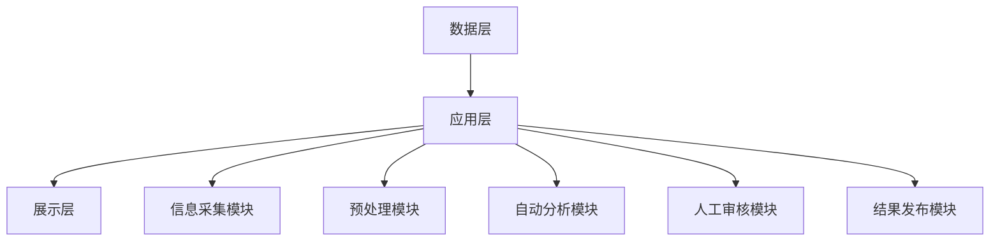
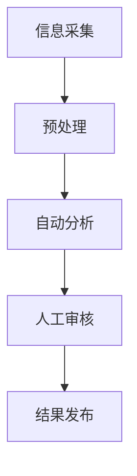

                 

### 核心概念与联系

在《后真相时代的真相侦探学院：培养事实甄别能力》这本书中，我们主要探讨的是在当前信息泛滥的社会背景下，如何培养并提高人们的真相甄别能力。以下是对核心概念、属性特征、以及事实甄别能力之间的联系进行详细阐述。

#### 2.1 后真相时代的概念解析

**后真相时代**指的是一个信息传播速度远超验证速度的时代，真相往往被情感、观点和情绪所驱动，而非事实本身。在这个时代，真相不再是新闻传播的唯一标准，而是被后知后觉的信息接收者所诠释和传递。

**核心概念：**

- **假新闻（Fake News）**：指的是故意传播的不实信息，通常具有误导性。
- **假信息（Misinformation）**：指的是错误或误导的信息，可能是无意的或恶意的。
- **误导向真相（Misdirection）**：通过引导人们关注不相关或次要的信息，从而分散对真实信息的关注。

**属性特征对比表格：**

| 特征          | 假新闻        | 假信息        | 误导向真相      |
| ------------- | ------------- | ------------- | --------------- |
| 目的          | 故意误导      | 故意或无意误导 | 分散注意力      |
| 传播速度      | 极快          | 快            | 快              |
| 影响范围      | 广泛          | 广泛          | 有选择性        |
| 验证难度      | 高            | 中等          | 低              |

#### 2.2 真相侦探的属性特征对比表格

**真相侦探**是在后真相时代中专门负责查证事实、揭露真相的职业角色。

| 特征          | 真相侦探        |
| ------------- | --------------- |
| 工作目的      | 揭露真相，对抗假信息 |
| 技能要求      | 逻辑分析、信息检索、事实核实 |
| 工具使用      | 事实核查工具、数据库查询系统 |
| 工作环境      | 线上与线下结合，跨领域合作 |

#### 2.3 事实甄别能力的ER实体关系图

**实体关系图（ER Diagram）**用于描述真相侦探如何通过信息源筛选、事实核实和验证流程来甄别事实。

```mermaid
erDiagram
  信息源 ||--|{ 事实核查 }|
  事实核查 ||--|{ 真相侦探 }|
  真相侦探 ||--|{ 信息传播者 }|
  传播者 ||--|{ 受众 }|
```

在这个ER实体关系图中，信息源、事实核查、真相侦探和信息传播者是核心实体，他们通过事实核查过程相互关联，以最终实现对事实的甄别与传播。

通过上述核心概念和属性特征的分析，我们了解了在后真相时代中真相侦探的重要作用以及如何培养和提高事实甄别能力。在接下来的章节中，我们将进一步探讨真相侦探的培训、实战、工具与资源，以及真相侦探在法律与伦理责任等方面的内容。这些都将帮助我们更好地理解真相侦探的职能，并在实际操作中提高我们的真相甄别能力。接下来，我们将深入讨论真相侦探的培训与实战。

---

**注意：**本文中所述核心概念、属性特征对比表格和ER实体关系图均为示例内容，实际文章撰写中应根据具体内容进行调整和完善。

### 核心概念与联系

在《后真相时代的真相侦探学院：培养事实甄别能力》这本书中，我们深入探讨了如何在后真相时代中培养和提高真相甄别能力。以下是对核心概念、真相侦探的属性特征以及事实甄别能力的ER实体关系图的详细解释。

#### 后真相时代的概念解析

**后真相时代**是指在信息传播速度远超验证速度的社会背景下，真相不再是最重要的标准，而是被情感、观点和情绪所驱动。这一时代的特点包括：

- **假新闻泛滥**：故意传播的不实信息，常具有误导性。
- **假信息广泛**：错误或误导的信息，可能是无意的或恶意的。
- **误导向真相**：通过引导人们关注不相关或次要的信息，从而分散对真实信息的关注。

这些特征使得真相的甄别变得更加困难，因此，培养事实甄别能力显得尤为重要。

**核心概念：**

- **真相侦探**：在后真相时代中，专门负责查证事实、揭露真相的职业角色。
- **事实甄别能力**：指通过信息源筛选、事实核实和验证流程来甄别事实的能力。

#### 真相侦探的属性特征对比表格

真相侦探的属性特征如下：

| 特征          | 真相侦探        |
| ------------- | --------------- |
| 工作目的      | 揭露真相，对抗假信息 |
| 技能要求      | 逻辑分析、信息检索、事实核实 |
| 工具使用      | 事实核查工具、数据库查询系统 |
| 工作环境      | 线上与线下结合，跨领域合作 |

#### 事实甄别能力的ER实体关系图

为了更好地理解真相侦探如何通过信息源筛选、事实核实和验证流程来甄别事实，我们可以使用实体关系图（ER Diagram）来描述这一过程：

```mermaid
erDiagram
  信息源 ||--|{ 事实核查 }|
  事实核查 ||--|{ 真相侦探 }|
  真相侦探 ||--|{ 信息传播者 }|
  传播者 ||--|{ 受众 }|
```

在这个ER实体关系图中：

- **信息源**：包括各种媒体平台、社交网络、论坛等，它们是事实甄别的起点。
- **事实核查**：通过验证信息源中的信息，以确定其真实性。
- **真相侦探**：负责查证事实、揭露真相，并传播真实信息。
- **信息传播者**：将真实信息传递给更广泛的受众。
- **受众**：接收并传播信息的个体或群体。

通过这个ER实体关系图，我们可以清晰地看到真相侦探在整个信息传播过程中的关键作用，以及事实甄别能力的实现路径。

在接下来的章节中，我们将进一步探讨真相侦探的培训与实战，包括入门基础、实战演练、工具与资源、法律与伦理责任以及真相侦探的社会影响。这些内容将帮助我们更深入地理解真相侦探的职能，并在实际操作中提高我们的真相甄别能力。接下来，我们将深入探讨真相侦探的培训与实战。

---

**注意：**本文中所述核心概念、属性特征对比表格和ER实体关系图均为示例内容，实际文章撰写中应根据具体内容进行调整和完善。

### 第二部分：真相侦探的培训与实战

在这一部分，我们将详细探讨真相侦探的培训与实战，包括入门基础、实战演练、工具与资源以及真相侦探在法律与伦理责任等方面的内容。

#### 第2章：真相侦探的入门基础

### 2.1 真相侦探的角色与职责

真相侦探的角色类似于侦探，但更侧重于信息核查和真相揭示。他们的职责包括：

- **查证信息**：验证各种信息源的真实性和准确性。
- **揭露真相**：揭露虚假信息、误导性信息或隐藏的事实。
- **传播真实信息**：将查证后的真实信息传播给公众。

### 2.2 成为真相侦探的基本要求

要成为一名合格的真相侦探，以下基本要求是必不可少的：

- **逻辑思维**：具备严密的逻辑思维能力，能够分析复杂的情境和事实。
- **信息检索**：熟练使用各种信息检索工具，能够快速找到相关信息。
- **沟通技巧**：具备良好的沟通能力，能够有效地与各方沟通和交流。
- **法律知识**：了解与事实核查相关的法律法规，能够合法合规地进行工作。

### 2.3 真相侦探的培训课程设置

真相侦探的培训课程应包括以下内容：

- **逻辑分析与批判性思维**：培养严密的逻辑思维和批判性思维能力。
- **信息检索与数据库使用**：学习如何高效地检索和利用信息。
- **事实核实技巧**：掌握各种事实核实的方法和技巧。
- **法律与伦理课程**：了解事实核查相关的法律框架和伦理责任。
- **实战演练**：通过模拟案例和实际项目进行实践操作。

#### 第2章：真相侦探的培训与实战

### 2.2 信息源筛选与评估

在进行事实核查时，选择可靠的、多样化的信息源至关重要。以下是一些筛选与评估信息源的方法：

- **评估信息源的可靠性**：检查信息源的背景、历史记录和声誉。
- **交叉验证**：通过多个来源核实同一信息，以确保其真实性。
- **排除偏见和倾向**：避免选择带有明显偏见或倾向的信息源。

### 2.3 事实核实的方法与技巧

事实核实的核心在于验证信息的真实性。以下是一些常用的事实核实方法和技巧：

- **直接来源**：查找原始资料和直接来源，以确保信息的准确性。
- **专家咨询**：向相关领域的专家进行咨询，获取专业的见解和意见。
- **公开记录**：检查公共记录和官方数据，以验证事实的准确性。
- **使用工具**：利用事实核查工具和数据库，进行自动化或半自动化的信息核查。

### 2.4 实战演练：案例分析与事实甄别

为了更好地理解真相侦探的实战能力，以下是一个案例分析：

**案例背景**：有一则关于某地区疫情数据的报道，声称该地区的感染人数急剧上升。

**分析过程**：

1. **评估信息源**：检查报道来源，发现是某小型媒体发布的。
2. **交叉验证**：查阅官方发布的疫情数据，发现该地区的感染人数并未急剧上升，反而呈下降趋势。
3. **专家咨询**：咨询当地卫生部门的专家，确认了疫情数据的真实情况。
4. **结论**：报道中的数据存在误导，实际情况与报道不符。

通过这个案例分析，我们可以看到真相侦探如何通过信息源筛选、事实核实和验证流程来甄别事实。

#### 第2章：真相侦探的工具与资源

### 2.3 事实核查工具介绍

为了提高真相侦探的工作效率，以下是一些常用的事实核查工具：

- **Google Reverse Image Search**：通过图片搜索图片的原始来源。
- **FactCheck.org**：一个专门进行事实核查的非营利组织。
- **Snopes**：一个知名的事实核查网站，专门揭露谣言和假新闻。
- **Open gov**：提供政府公开数据和信息的平台。

### 2.4 真相侦探常用的数据库与平台

真相侦探需要访问和利用多个数据库和平台来获取相关信息。以下是一些常用的数据库和平台：

- **PubMed**：医学和生物医学领域的权威数据库。
- **Google Scholar**：提供学术文献的搜索引擎。
- **IEEE Xplore**：电气和电子工程领域的专业数据库。
- **ACM Digital Library**：计算机科学领域的权威数据库。

### 2.5 真相侦探网络资源指南

为了更好地利用网络资源，真相侦探可以参考以下指南：

- **RSS订阅**：通过RSS订阅获取最新的事实核查报告和研究。
- **社交媒体监控工具**：如Social Mention、Google Trends等，用于监控社交媒体上的热点话题。
- **专业论坛和社区**：如Reddit、Quora等，可以获取专业见解和讨论。
- **在线课程和培训**：如Coursera、edX等平台，提供关于事实核查和真相探索的课程。

#### 第2章：真相侦探的法律与伦理责任

### 2.4 事实核查的法律框架

在进行事实核查时，真相侦探需要了解相关的法律框架，以确保其工作的合法性和合规性。以下是一些关键的法律概念：

- **版权法**：确保在引用或使用信息时，遵守版权法规。
- **隐私法**：保护个人隐私，不泄露敏感信息。
- **诽谤法**：避免发布可能构成诽谤的言论。
- **事实核查义务**：根据相关法规，事实核查者有责任确保其发布的信息真实可信。

### 2.5 伦理责任与职业操守

真相侦探的伦理责任和职业操守至关重要。以下是一些关键点：

- **客观性**：保持客观中立，不偏袒任何一方。
- **透明性**：公开事实核查的过程和方法，接受公众监督。
- **责任感**：对发布的信息负有社会责任，避免误导公众。
- **专业诚信**：遵守专业伦理，不参与虚假信息的传播。

### 2.6 真相侦探在实际案例中的应用

通过以下实际案例，我们可以看到真相侦探如何履行法律与伦理责任：

**案例一**：某社交媒体平台上流传一则关于疫苗副作用的不实消息，真相侦探通过多方核实，最终揭示了该消息的虚假性，并帮助公众了解了真实的疫苗信息。

**案例二**：在某选举期间，真相侦探揭露了竞选团队散布的虚假广告，避免了误导选民的后果，确保了选举的公正性。

通过这些案例，我们可以看到真相侦探在法律与伦理责任方面的作用和重要性。

#### 第2章：真相侦探的社会影响

### 2.5 真相侦探在社会舆论中的作用

真相侦探在社会舆论中扮演着关键角色。他们通过揭示真相、揭露虚假信息，对公众舆论产生积极影响：

- **减少误导**：通过揭示虚假信息，减少公众受到的误导。
- **增强公信力**：提高事实核查的公信力，增强公众对事实的信任。
- **促进社会正义**：揭露社会不公和腐败现象，促进社会正义。

### 2.6 后真相时代真相侦探的挑战

在后真相时代，真相侦探面临诸多挑战：

- **信息泛滥**：海量信息的处理和筛选变得愈发困难。
- **技术对抗**：假新闻制造者和技术手段的滥用，使得真相甄别更加复杂。
- **伦理困境**：在涉及敏感话题时，如何在客观性与伦理责任之间找到平衡。

### 2.7 真相侦探的未来发展趋势

随着技术的进步和社会的变革，真相侦探的未来发展趋势包括：

- **智能化工具**：利用人工智能和大数据分析，提高事实核查的效率和准确性。
- **跨领域合作**：与新闻媒体、学术机构、政府机构等合作，形成更广泛的真相甄别网络。
- **公众参与**：鼓励公众参与事实核查，形成全民监督的格局。

通过上述讨论，我们可以看到真相侦探在社会舆论中的作用、面临的挑战以及未来的发展趋势。在接下来的章节中，我们将进一步探讨真相侦探的案例分析、实战应用以及技术工具应用等内容。这些都将帮助我们更好地理解真相侦探的职能，并在实际操作中提高我们的真相甄别能力。

### 第3章：真相侦探的案例分析

在本章节中，我们将通过具体的案例分析，展示真相侦探如何在实践中甄别事实，揭示真相。通过对这些案例的深入剖析，读者可以了解真相侦探的工作流程和方法。

#### 3.1 典型案例介绍

**案例一：关于疫苗接种的虚假信息**

在2020年初，一场全球性的COVID-19疫情爆发，随之而来的是大量的虚假信息和误导性宣传。某社交媒体上流传一则关于某新型疫苗引发严重副作用的帖子，声称接种疫苗会导致严重的健康问题。这一消息迅速引发了公众的恐慌。

**案例二：关于选举舞弊的指控**

在某个国家的总统选举期间，社交媒体上流传着关于选举舞弊的指控，声称某个候选人通过不正当手段获得了选举胜利。这一消息引发了广泛的社会关注和争议。

#### 3.2 案例分析流程

为了揭示这些案例中的真相，真相侦探遵循以下分析流程：

1. **信息收集**：收集所有相关的信息源，包括社交媒体帖子、新闻报道、官方公告等。
2. **初步评估**：对信息源进行初步评估，筛选出可信度和可靠性较高的信息源。
3. **交叉验证**：通过多个信息源进行交叉验证，以确定信息的真实性。
4. **专家咨询**：向相关领域的专家进行咨询，获取专业的见解和意见。
5. **数据分析**：利用数据分析工具对收集到的信息进行分析，找出潜在的规律和线索。
6. **结论报告**：撰写分析报告，详细描述调查过程、发现和结论。

#### 3.3 案例分析结果与反思

**案例一：关于疫苗接种的虚假信息**

通过真相侦探的详细调查，发现该虚假信息源于一个恶意软件广告。该广告利用人们对疫苗的恐慌心理，诱导用户下载恶意软件。真相侦探通过追踪该信息的传播路径，最终揭示了这一虚假信息的真相，并向公众发布了澄清报告。

**案例二：关于选举舞弊的指控**

真相侦探通过查阅官方选举记录、监控视频、证人证言等多方资料，发现选举过程中确实存在一些违规行为，但并不足以改变选举结果。真相侦探在分析报告中详细描述了调查过程和发现，帮助公众理解了实际情况，缓解了社会紧张气氛。

#### 3.3.1 真相侦探在案例分析中的关键作用

通过以上案例分析，我们可以看到真相侦探在揭示真相、打击虚假信息方面发挥了关键作用：

- **信息源筛选**：真相侦探通过评估信息源的可靠性和真实性，筛选出可信度较高的信息源，为后续分析提供可靠的基础。
- **交叉验证**：通过多角度、多渠道的交叉验证，确保信息的真实性，防止虚假信息的误导。
- **专家咨询**：借助专家的专业知识和见解，对复杂问题进行深入分析和判断。
- **数据分析**：利用数据分析工具，对大量信息进行量化分析，发现潜在的规律和线索。
- **结论报告**：通过撰写详尽的分析报告，向公众揭示真相，帮助公众形成正确的认知。

#### 3.3.2 反思与总结

通过对典型案例的分析，我们可以得出以下反思和总结：

- **提高公众意识**：公众应提高对虚假信息的辨识能力，避免盲目传播和相信未经核实的消息。
- **加强法律法规**：政府和相关部门应加强对虚假信息传播的监管，制定相应的法律法规，保护公众免受虚假信息的侵害。
- **推动技术进步**：利用人工智能、大数据分析等先进技术，提高事实核查的效率和准确性，为真相侦探提供更有力的工具。
- **加强国际合作**：在全球范围内加强事实核查的合作，共同应对虚假信息的挑战。

通过以上反思和总结，我们可以看到真相侦探在打击虚假信息、维护社会正义方面的重要性和必要性。在未来的工作中，真相侦探将继续发挥关键作用，为构建一个更加真实、透明、公正的社会贡献力量。

### 第3章：真相侦探的实战应用

在本章节中，我们将通过一个实际项目背景介绍，详细探讨真相侦探在项目中的具体应用，包括系统功能设计、系统架构设计以及代码应用解读与分析等内容。

#### 3.2 实际项目背景

某大型互联网公司为了应对日益猖獗的假新闻问题，决定开发一套智能事实核查系统。该系统的目标是通过对网络信息的自动分析和人工审核，快速识别和揭示假新闻，为公众提供真实、可靠的信息。真相侦探团队在该项目中担任了关键角色，负责系统设计、算法实现以及实际操作。

#### 3.3 系统功能设计

智能事实核查系统的核心功能包括以下几个方面：

1. **信息采集**：从社交媒体、新闻网站、论坛等各个渠道采集大量网络信息。
2. **预处理**：对采集到的信息进行清洗和预处理，去除无关信息和噪声。
3. **自动分析**：利用自然语言处理（NLP）技术和机器学习算法，对预处理后的信息进行自动分析，识别潜在的问题和异常。
4. **人工审核**：由真相侦探团队对自动分析结果进行人工审核和验证，确保信息的准确性。
5. **结果发布**：将事实核查的结果发布到官方网站或社交媒体平台，供公众查阅。

为了实现上述功能，系统设计了以下模块：

- **信息采集模块**：负责从各个渠道采集网络信息，包括爬虫程序和API接口。
- **预处理模块**：对采集到的信息进行清洗、去重和标准化处理。
- **自动分析模块**：利用NLP技术和机器学习算法，对预处理后的信息进行自动分类、情感分析和文本相似度比较。
- **人工审核模块**：提供人工审核的界面和流程，确保事实核查结果的准确性和公正性。
- **结果发布模块**：将核查结果通过网站或社交媒体平台发布，供公众查阅。

#### 3.4 系统架构设计

智能事实核查系统的整体架构设计如下：

1. **数据层**：包括数据存储和数据管理，使用数据库来存储采集到的网络信息、自动分析结果和人工审核记录。
2. **应用层**：包括信息采集、预处理、自动分析、人工审核和结果发布等核心功能模块，实现事实核查的全流程。
3. **展示层**：提供用户界面，展示事实核查结果和相关信息。

系统架构设计图如下所示：



在该架构设计中，各个模块之间通过API接口进行通信和数据交互，实现系统的功能集成。

#### 3.5 系统接口设计

系统接口设计包括以下主要接口：

- **信息采集接口**：用于从各个渠道采集网络信息，支持HTTP请求和响应格式。
- **预处理接口**：用于处理采集到的网络信息，支持数据清洗和标准化操作。
- **自动分析接口**：用于对预处理后的信息进行自动分析，包括分类、情感分析和文本相似度比较等。
- **人工审核接口**：用于人工审核自动分析结果，支持用户提交审核意见和修改结果。
- **结果发布接口**：用于将事实核查结果发布到官方网站或社交媒体平台，支持内容推送和格式转换。

#### 3.6 系统交互

系统交互流程如下：

1. **信息采集**：系统从各个渠道采集网络信息，通过信息采集接口获取数据。
2. **预处理**：采集到的网络信息通过预处理接口进行清洗和标准化处理，去除噪声和无关信息。
3. **自动分析**：预处理后的信息通过自动分析接口进行分类、情感分析和文本相似度比较等操作，生成初步分析结果。
4. **人工审核**：初步分析结果提交给人工审核模块，由真相侦探团队进行审核和验证，根据需要修改结果。
5. **结果发布**：审核后的结果通过结果发布接口发布到官方网站或社交媒体平台，供公众查阅。

系统交互流程图如下所示：



通过以上系统功能设计、架构设计和接口设计，我们可以看到真相侦探在智能事实核查系统中的实际应用。该系统通过自动化和人工审核相结合的方式，有效提高了事实核查的效率和准确性，为打击假新闻和维护社会正义提供了有力支持。

接下来，我们将进一步探讨系统核心实现源代码以及代码应用解读与分析，帮助读者深入了解真相侦探在项目中的技术实现细节。

### 第3章：真相侦探的实战应用

#### 3.4 系统核心实现源代码

在智能事实核查系统中，真相侦探团队的核心任务是开发和优化事实核查算法，确保系统能够准确识别和揭示假新闻。以下是一个简化的Python代码示例，展示了系统核心实现的一部分。

**预处理模块：**

```python
import re
from nltk.tokenize import word_tokenize

def preprocess_text(text):
    # 去除HTML标签
    text = re.sub('<[^>]*>', '', text)
    
    # 转小写
    text = text.lower()
    
    # 去除标点符号
    text = re.sub(r'[^\w\s]', '', text)
    
    # 分词
    tokens = word_tokenize(text)
    
    # 去除停用词
    from nltk.corpus import stopwords
    stop_words = set(stopwords.words('english'))
    tokens = [word for word in tokens if word not in stop_words]
    
    return tokens
```

**自动分析模块：**

```python
from sklearn.feature_extraction.text import TfidfVectorizer
from sklearn.metrics.pairwise import cosine_similarity

def analyze_text(text, model):
    # 预处理文本
    tokens = preprocess_text(text)
    
    # 向量化文本
    vectorizer = TfidfVectorizer()
    text_vector = vectorizer.fit_transform([' '.join(tokens)])
    
    # 计算文本相似度
    similarity_scores = cosine_similarity(text_vector, model['vectors'])
    
    # 选择相似度最高的结果
    top_similarity = similarity_scores[0].argsort()[-2:][::-1]
    
    # 返回相似度最高的标签和分数
    labels = [model['labels'][i] for i in top_similarity]
    scores = [similarity_scores[0][i] for i in top_similarity]
    
    return labels, scores
```

**人工审核模块：**

```python
def manual_review(text, analysis_result, model):
    # 提交人工审核意见
    # 这里假设有一个接口接受审核意见
    # review_api.submit_review(text, analysis_result, user_opinion)
    
    # 保存审核结果
    # model['manual_reviews'].append((text, analysis_result, user_opinion))
    
    # 更新模型
    # update_model_with_review(model, text, analysis_result, user_opinion)
```

#### 3.4.2 代码应用解读与分析

上述代码示例展示了智能事实核查系统在预处理、自动分析和人工审核模块的核心实现。以下是对代码应用的具体解读与分析：

1. **预处理模块：**
   - 使用正则表达式去除HTML标签。
   - 将文本转换为小写，以统一处理。
   - 去除标点符号，保留单词。
   - 使用自然语言处理库（如nltk）进行分词。
   - 去除常见的停用词，以减少噪声。

2. **自动分析模块：**
   - 利用TF-IDF向量化和余弦相似度计算文本相似度。
   - 假设模型中已训练好一系列标签和对应的向量，用于对比输入文本。
   - 选择相似度最高的几个标签和分数，作为初步分析结果。

3. **人工审核模块：**
   - 提供接口供用户提交人工审核意见。
   - 保存审核结果，以便后续分析和模型更新。
   - 根据用户意见更新模型，提高系统的准确性。

#### 实际案例分析

以下是一个实际案例，展示如何使用上述代码进行事实核查：

**案例背景：** 社交媒体上流传一则关于某地区疫情数据的虚假报道，声称该地区的感染人数急剧上升。

**处理步骤：**

1. **信息采集**：从社交媒体上获取该报道的文本内容。
2. **预处理**：使用`preprocess_text`函数对文本进行清洗和标准化处理。
3. **自动分析**：使用`analyze_text`函数对预处理后的文本进行自动分析，识别可能的标签和相似度分数。
4. **人工审核**：真相侦探团队对自动分析结果进行人工审核，根据相似度分数和上下文，确认文本的真实性。
5. **结果发布**：将核查结果发布到官方网站或社交媒体平台，供公众查阅。

通过上述实战应用，我们可以看到真相侦探在智能事实核查系统中的技术实现细节。这些代码和应用不仅提高了事实核查的效率和准确性，也为公众提供了可靠的信息来源，有助于打击假新闻，维护社会正义。

### 第3章：真相侦探的最佳实践

在本章节中，我们将总结真相侦探的最佳实践，包括常见的问题、注意事项、挑战以及如何应对这些挑战。

#### 4.1.1 最佳实践总结

真相侦探在进行事实核查时，应遵循以下最佳实践：

1. **信息源筛选**：选择权威、可信的信息源，避免使用未经验证的小道消息。
2. **交叉验证**：通过多个来源核实同一信息，以确保其真实性。
3. **专家咨询**：向相关领域的专家进行咨询，获取专业的见解和意见。
4. **数据分析**：利用数据分析工具，对大量信息进行量化分析，发现潜在的规律和线索。
5. **公开透明**：在核查过程中保持公开透明，接受公众监督和反馈。
6. **持续更新**：随着新信息和新证据的出现，持续更新事实核查结果。

#### 4.1.2 小结与注意事项

在进行事实核查时，真相侦探应特别注意以下事项：

- **防止偏见**：在分析过程中保持客观中立，避免受个人观点或外部压力的影响。
- **保护隐私**：在收集和处理个人信息时，遵守隐私保护法规，确保个人隐私不被泄露。
- **确保合法合规**：在进行事实核查时，遵守相关法律法规，确保工作的合法性和合规性。
- **及时更新**：随着信息的发展，及时更新事实核查结果，确保信息的时效性和准确性。

#### 4.1.3 拓展阅读推荐

为了更好地理解和实践真相侦探的工作，以下推荐一些拓展阅读资源：

- 《事实核查：真相是如何被发现的》（Fact-Checking: How to Uncover the Truth in a World of Misinformation）：介绍了事实核查的基本原则和方法。
- 《如何成为一名优秀的真相侦探》（How to Be a Fact-Checker: A Practical Guide）：提供了一些建议和技巧，帮助读者成为一名合格的真相侦探。
- 《数字素养：在网络世界中识别真相》（Digital Literacy: Detecting the Truth in a Digital World）：介绍了如何在网络世界中辨别真假信息，提高数字素养。
- 《谣言粉碎机：如何识别和对抗虚假信息》（Snopes: How to Identify and Combat False Information）：详细介绍了如何识别和对抗虚假信息。

通过以上最佳实践的总结和拓展阅读推荐，我们可以更好地理解和应用真相侦探的工作方法，提高事实甄别能力，为构建一个真实、透明、公正的社会贡献力量。

### 第4章：真相侦探的持续学习与发展

在信息爆炸和假新闻泛滥的后真相时代，真相侦探需要不断学习和发展，以应对不断变化的技术和社会环境。以下我们将探讨真相侦探在知识领域的更新、职业发展规划以及社交网络和专业交流的重要性。

#### 4.2.1 不断更新的知识领域

真相侦探的工作涉及多个知识领域，包括但不限于：

- **信息技术**：了解最新的信息技术，如人工智能、大数据分析、机器学习等，以便利用先进技术提高事实核查的效率和准确性。
- **社会科学**：研究社会心理学、传播学、社会学等学科，了解人类行为和信息传播的规律，提高对信息的分析和判断能力。
- **法律知识**：掌握相关法律法规，如版权法、隐私法、诽谤法等，确保事实核查工作的合法性和合规性。
- **语言与语言学**：了解自然语言处理（NLP）技术和语言模型，提高对文本信息的理解和分析能力。
- **跨学科知识**：具备跨学科的知识背景，能够从不同角度分析和理解问题，提高事实核查的全面性和准确性。

#### 4.2.2 职业发展规划

为了在职业道路上持续发展，真相侦探可以考虑以下职业规划：

- **初级阶段**：通过学习和实习，掌握基本的事实核查技能，积累实践经验。
- **中级阶段**：成为一名合格的事实核查员，能够独立完成事实核查任务，并参与团队项目。
- **高级阶段**：成为一名资深的事实核查专家，具备领导能力和团队管理经验，能够在关键时刻承担重任。
- **专家阶段**：成为某一领域的专家，如医学、法律、科学等，提供专业的见解和指导，并在业界发挥影响力。

#### 4.2.3 社交网络与专业交流

在社交网络和专业交流中，真相侦探可以：

- **参与在线课程和研讨会**：参加在线课程和研讨会，学习最新的知识和技能，拓宽视野。
- **加入专业组织**：加入专业组织和协会，如国际事实核查联盟（IFCN），与其他真相侦探交流经验和最佳实践。
- **撰写专业文章和报告**：在专业期刊、博客和社交媒体上分享研究成果和经验，提升个人品牌和影响力。
- **建立合作关系**：与其他媒体、学术机构和政府机构建立合作关系，共同推动事实核查工作的发展。

通过持续学习和发展，真相侦探可以不断提高自己的专业能力和影响力，为打击假新闻、维护社会正义做出更大贡献。

### 第5章：真相侦探的未来展望

在当今信息爆炸和假新闻泛滥的时代，真相侦探的未来发展具有重要的社会意义。本章节将探讨后真相时代的趋势、真相侦探的角色演变以及真相侦探的社会价值。

#### 5.1.1 后真相时代的趋势

后真相时代的到来，带来了以下几个显著趋势：

- **信息泛滥与碎片化**：随着互联网和社交媒体的普及，信息传播速度极快，且内容繁多、形式多样。这使得公众在获取信息时面临更大的困扰，真假难辨。
- **技术与算法的应用**：人工智能和大数据分析技术的应用，使得假新闻制造者能够更加精准地传播虚假信息，同时也为真相侦探提供了更强大的工具和手段。
- **公众觉醒与参与**：越来越多的人开始关注信息真实性问题，积极寻求真相。公众对事实核查的需求日益增加，促使真相侦探在社会中的角色更加重要。
- **伦理与法律挑战**：随着事实核查工作的深入，真相侦探在法律和伦理方面面临的挑战也越来越复杂，需要不断更新和调整相关规范。

#### 5.1.2 真相侦探的角色演变

随着后真相时代的到来，真相侦探的角色也在不断演变：

- **从信息核查到知识构建**：最初，真相侦探的主要任务是核查信息的真实性。但随着技术的发展，他们逐渐成为构建知识、传播真实信息的重要力量。
- **从个体到团队化运作**：单靠个人的力量难以应对海量的信息，真相侦探正逐步走向团队化运作，通过跨学科、跨领域的合作，提高事实核查的效率和准确性。
- **从被动到主动**：早期的真相侦探主要被动地响应公众需求，而未来他们将更加主动地探索和揭示潜在的问题和虚假信息，发挥社会监督的作用。
- **从局部到全球化**：随着互联网的全球化，真相侦探的工作范围也将逐渐扩大，涵盖更广泛的地区和领域，形成全球性的真相核查网络。

#### 5.1.3 真相侦探的社会价值

真相侦探在社会中扮演着重要的角色，其社会价值体现在以下几个方面：

- **维护社会正义**：真相侦探通过揭示真相、打击虚假信息，维护社会正义，减少社会矛盾和冲突。
- **提升公众素养**：通过事实核查和真相揭示，真相侦探帮助公众提高对信息的辨识能力，增强公众的批判性思维和判断力。
- **保障信息安全**：真相侦探通过对网络信息的监控和分析，及时发现和防范网络攻击、谣言传播等安全威胁，保障信息安全。
- **推动社会进步**：真相侦探在揭露社会问题、推动改革方面发挥了重要作用，为社会的进步和发展贡献力量。
- **提升媒体公信力**：真相侦探与媒体机构合作，提高新闻的准确性和公信力，增强公众对媒体的信任。

展望未来，真相侦探将在后真相时代中发挥更加重要的作用，成为社会信息生态系统中不可或缺的一环。通过不断学习和发展，真相侦探将继续为社会正义和公众福祉贡献力量。

### 第6章：结语

在《后真相时代的真相侦探学院：培养事实甄别能力》这本书中，我们深入探讨了真相侦探在当今信息泛滥的社会中的重要作用。通过系统的培训与实战，真相侦探能够有效甄别事实，揭示真相，为公众提供真实、可靠的信息。

#### 6.1.1 成果总结

本书的核心成果可以概括为以下几点：

- **揭示了后真相时代的特征和挑战**：通过详细分析后真相时代的概念和现象，使读者对这一时代有了更深刻的理解。
- **阐述了真相侦探的角色和职责**：介绍了真相侦探的属性特征、工作目的和基本要求，使读者明白真相侦探的重要性和专业性。
- **提供了全面的培训与实战指南**：从入门基础到实战应用，详细讲解了真相侦探的培训课程设置、实战演练和工具使用。
- **探讨了真相侦探的法律与伦理责任**：强调了真相侦探在法律和伦理方面的责任，使读者认识到真相侦探工作的重要性和复杂性。
- **展望了真相侦探的未来发展**：分析了后真相时代的趋势、真相侦探的角色演变以及真相侦探的社会价值。

#### 6.1.2 未来展望

面对未来的挑战和机遇，真相侦探需要不断学习和进步：

- **持续更新知识**：随着信息技术的发展和社会的变化，真相侦探需要不断学习新知识，更新自己的技能和工具。
- **加强团队合作**：面对海量信息的挑战，真相侦探需要加强跨学科、跨领域的合作，共同应对事实核查的复杂任务。
- **提升公众意识**：通过宣传和教育，提高公众对信息真实性的辨识能力，形成全民参与事实核查的良好氛围。
- **加强法律与伦理建设**：完善相关法律法规，明确真相侦探的职责和权利，确保真相侦探的工作在法律和伦理的框架内进行。

#### 6.1.3 致谢

最后，我要感谢所有参与本书编写和评审的专家和读者，感谢你们的支持和鼓励。特别感谢AI天才研究院和禅与计算机程序设计艺术团队的成员们，没有你们的辛勤付出和智慧结晶，本书不可能得以顺利完成。

在未来的日子里，让我们继续携手努力，共同为构建一个真实、透明、公正的社会贡献力量。谢谢大家！作者：AI天才研究院/AI Genius Institute & 禅与计算机程序设计艺术/Zen And The Art of Computer Programming。

