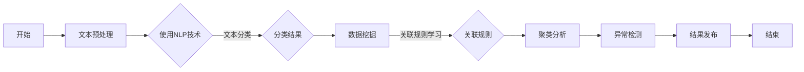
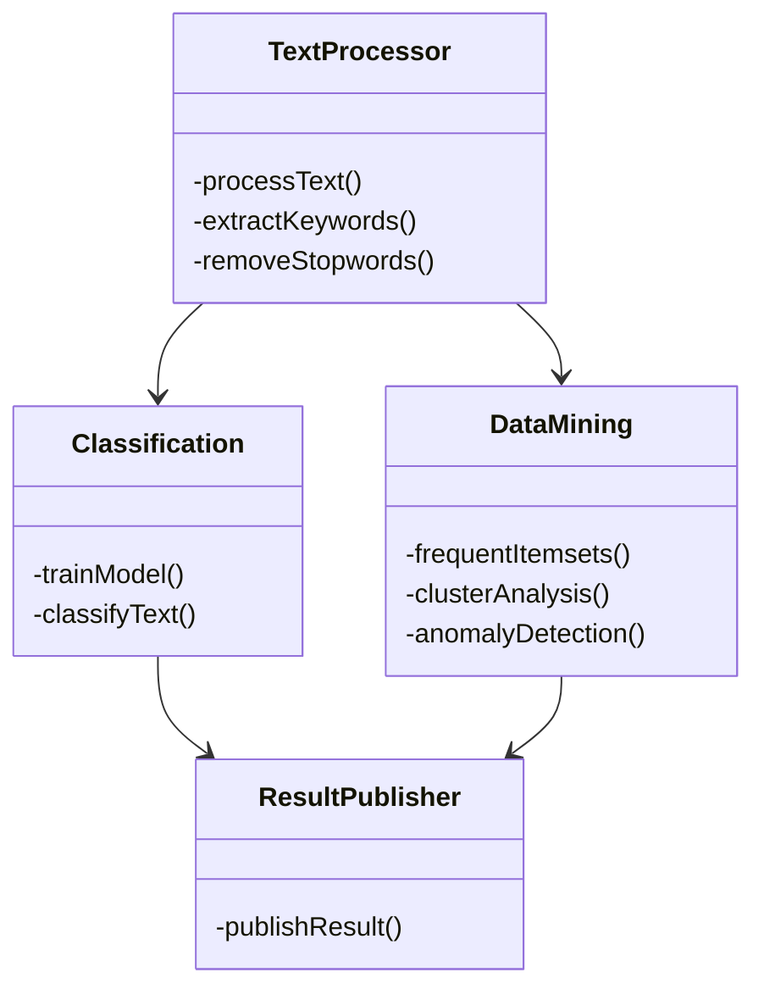
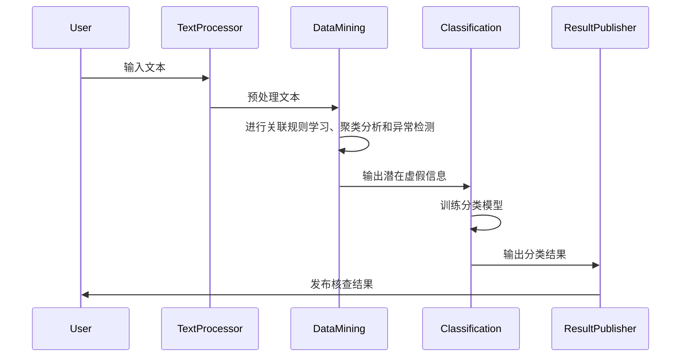
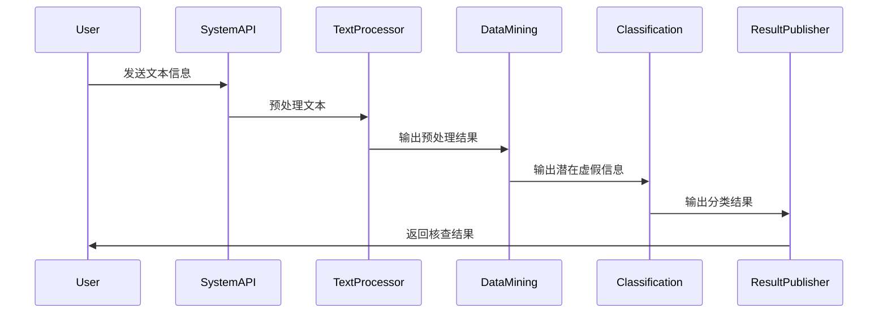

                 

### 文章标题：后真相时代的真相追寻者：事实核查训练

> 关键词：后真相时代、事实核查、算法、机器学习、文本分析

> 摘要：随着信息技术的迅猛发展，后真相时代到来，虚假信息的泛滥成为社会的一大挑战。本文将探讨如何通过事实核查训练，识别并纠正虚假信息，维护社会的真相与正义。

## 引言

### 1.1 后真相时代的特征与挑战

在过去的几十年里，互联网的普及和社交媒体的兴起极大地改变了信息的传播方式。然而，这种变化也带来了新的问题——后真相时代的到来。在传统媒体时代，信息经过编辑和审查，相对较为可信。但在后真相时代，信息的真实性和可信度变得愈发难以判断。

**后真相时代的特征**包括：

- **信息泛滥**：互联网上的信息量爆炸性增长，人们每天接收的信息远超以往。
- **信息碎片化**：信息被分割成片段，缺乏系统性。
- **情绪化传播**：社交媒体上的信息传播更加情绪化，而非理性分析。
- **虚假信息泛滥**：虚假信息、谣言、误导性信息随处可见。

**挑战**：

- **误导性信息**：虚假信息误导公众，影响社会稳定。
- **信息焦虑**：人们在信息海洋中感到迷茫，难以辨别真假。
- **信任危机**：人们对传统媒体的信任下降，对信息的真实性产生怀疑。

### 1.2 事实核查的定义与重要性

事实核查，是指通过科学的方法和标准，对信息进行验证，以确定其真实性。在后真相时代，事实核查显得尤为重要：

- **维护真相**：事实核查帮助公众识别虚假信息，维护事实的真相。
- **促进理性思考**：通过事实核查，人们能够基于真实信息进行理性思考，避免被情绪所左右。
- **增强公信力**：事实核查机构通过专业、严谨的核实工作，增强自身和公众的公信力。

### 1.3 事实核查的工作流程与步骤

事实核查通常包括以下几个步骤：

- **接收信息**：接收待核查的信息，包括文章、图片、视频等。
- **初步筛选**：对信息进行初步筛选，排除明显虚假的信息。
- **背景调查**：对信息的来源进行背景调查，了解其背景和可信度。
- **信息核实**：通过查阅文献、访问专家、采访当事人等方式，对信息进行核实。
- **发布结果**：将核查结果公之于众，提供可靠的真相。

### 1.4 本书结构与目标读者

本书旨在通过系统的训练方法，帮助读者掌握事实核查的技能。本书分为以下几个部分：

- **引言**：介绍后真相时代的背景与事实核查的重要性。
- **核心概念与联系**：详细阐述事实核查的基本概念、属性特征及其相互关系。
- **算法原理讲解**：讲解事实核查中使用的核心算法原理及其实现。
- **系统分析与架构设计方案**：介绍事实核查系统的设计与实现。
- **项目实战**：通过实际案例展示如何进行事实核查。
- **最佳实践与总结**：提供实战中的最佳实践、注意事项及拓展阅读。

本书的目标读者是希望提高事实核查能力的专业人士，包括新闻工作者、内容创作者、学生以及对信息真实性有高度关注的人群。

## 第一部分：引言

### 1.1 后真相时代的特征与挑战

后真相时代，顾名思义，是一个以情感和主张为主导的信息时代，而不是以事实和证据为依据。这一时代的特征主要体现在以下几个方面：

#### 信息泛滥

互联网的普及使得信息传播的速度和范围大大增加。人们每天都会接触到大量的信息，从新闻报道到社交媒体更新，信息量爆炸性增长。这种信息的泛滥导致了信息过载，人们难以消化和理解所有信息。

#### 信息碎片化

随着社交媒体的兴起，信息被分割成片段，缺乏系统性。用户往往只关注自己感兴趣的内容，而忽略其他信息。这种碎片化的信息传播方式使得信息的完整性和连贯性受到影响。

#### 情绪化传播

社交媒体上的信息传播更加情绪化，而非理性分析。用户往往被情感驱动，容易受到情绪化内容的感染，从而忽略了事实的真相。这种情绪化传播的现象使得虚假信息更容易被传播和接受。

#### 虚假信息泛滥

后真相时代的另一个显著特征是虚假信息的泛滥。虚假信息、谣言、误导性信息随处可见，不仅影响了公众的日常生活，还对社会稳定产生了负面影响。虚假信息的传播速度和范围远远超过了传统媒体时代。

### 挑战

#### 误导性信息

虚假信息误导公众，导致公众对某些事件和问题的认识出现偏差。例如，一些虚假新闻可能误导人们对于健康问题的看法，导致不良的健康行为。这种误导性信息的传播对社会秩序和公众健康构成了威胁。

#### 信息焦虑

在信息过载和虚假信息泛滥的背景下，公众容易感到信息焦虑。人们担心自己无法获取到真实的信息，对于信息的真实性产生怀疑。这种信息焦虑不仅影响个人的心理健康，还可能影响社会的信任基础。

#### 信任危机

后真相时代的虚假信息泛滥导致公众对传统媒体的信任下降。人们开始怀疑媒体的真实性和中立性，甚至对整个信息系统的可靠性产生怀疑。这种信任危机对媒体的公信力和影响力产生了负面影响。

### 1.2 事实核查的定义与重要性

事实核查，顾名思义，是指对信息进行验证和核实，以确保其真实性和准确性。在信息爆炸和虚假信息泛滥的时代，事实核查显得尤为重要。以下是事实核查的定义和重要性：

#### 定义

事实核查是一种通过科学的方法和标准，对信息进行验证和核实的活动。它涉及对信息的来源、内容、背景等进行深入调查和分析，以确定其真实性。事实核查的目标是揭示真相，防止虚假信息的传播。

#### 重要性

1. **维护真相**

事实核查的首要任务是维护真相。通过核实信息，事实核查机构能够揭示虚假信息、纠正谣言，确保公众获取到真实的信息。这对于维护社会的稳定和健康发展至关重要。

2. **促进理性思考**

事实核查有助于公众基于真实信息进行理性思考。当公众了解到某一事件的真相时，他们能够更加客观地看待问题，避免被情绪化内容所左右。这有助于培养公众的批判性思维和独立判断能力。

3. **增强公信力**

事实核查机构通过专业、严谨的核实工作，增强了自身和公众的公信力。公众对事实核查机构的信任度提高，进而对整个信息系统的可靠性产生信心。这种公信力的建立对于维护社会的信任基础至关重要。

4. **遏制虚假信息传播**

事实核查机构的工作不仅限于揭示真相，还在于遏制虚假信息的传播。通过及时发布核查结果，事实核查机构能够警示公众，避免虚假信息进一步扩散。这有助于减轻虚假信息对社会造成的负面影响。

### 1.3 事实核查的工作流程与步骤

事实核查是一项复杂而系统的工作，通常包括以下几个步骤：

#### 接收信息

事实核查机构会接收各种信息，包括文章、图片、视频等。这些信息可能来自公众举报、媒体报道或其他渠道。接收信息是事实核查的起点，也是确定核查对象的关键。

#### 初步筛选

在接收大量信息后，事实核查机构需要对信息进行初步筛选。这一步骤的目的是排除明显虚假的信息，减少后续核查的工作量。初步筛选通常基于一些简单的标准，如信息的来源、发布时间、内容特征等。

#### 背景调查

背景调查是事实核查的重要环节。通过对信息的来源、背景和历史进行调查，事实核查机构能够了解信息的背景和可信度。背景调查可能涉及查阅文献、访问专家、采访当事人等。

#### 信息核实

信息核实是事实核查的核心步骤。在这一步骤中，事实核查机构通过查阅文献、采访专家、访问当事人等方式，对信息进行详细核实。核实的过程需要严谨和科学，以确保结果的准确性和可信度。

#### 发布结果

在完成信息核实后，事实核查机构将核查结果公之于众。发布结果的形式可以包括文章、报告、视频等。核查结果的发布有助于揭示真相，警示公众，防止虚假信息的进一步传播。

### 1.4 本书结构与目标读者

本书旨在为读者提供一整套事实核查的训练方法和实践指南。本书的结构如下：

#### 引言

介绍后真相时代的特征与挑战，阐述事实核查的定义与重要性，以及事实核查的工作流程与步骤。

#### 核心概念与联系

详细阐述事实核查的核心概念，包括事实核查的基本概念、属性特征及其相互关系。通过ER实体关系图展示事实核查系统的架构。

#### 算法原理讲解

讲解事实核查中使用的核心算法原理，包括文本分析算法、数据挖掘算法等。通过Mermaid流程图和Python源代码，详细阐述算法的实现和原理。

#### 系统分析与架构设计方案

介绍事实核查系统的设计与实现，包括问题场景、系统功能设计（领域模型Mermaid类图）、系统架构设计Mermaid架构图、系统接口设计和系统交互Mermaid序列图。

#### 项目实战

通过实际案例展示如何进行事实核查，包括环境安装、系统核心实现源代码、代码应用解读与分析、实际案例分析和详细讲解剖析。

#### 最佳实践与总结

提供实战中的最佳实践、注意事项及拓展阅读，帮助读者更深入地理解和应用事实核查的方法和技巧。

本书的目标读者是希望提高事实核查能力的专业人士，包括新闻工作者、内容创作者、学生以及对信息真实性有高度关注的人群。通过本书的系统性训练，读者将能够掌握事实核查的基本原理和实践技能，为社会维护真相与正义做出贡献。

## 第二部分：核心概念与联系

### 2.1 事实核查的基本概念

**事实核查**是一种通过科学的方法和标准，对信息进行验证和核实的活动。其核心目的是揭示真相，防止虚假信息的传播。以下是事实核查的一些基本概念：

#### 事实核查的定义

事实核查是指通过对信息的来源、内容、背景等进行深入调查和分析，以确定其真实性的活动。事实核查的目标是确保公众获取到真实、准确的信息，避免被虚假信息误导。

#### 事实核查的目标

1. **揭示真相**：通过核实信息，揭示事实的真相，防止虚假信息的传播。
2. **防止误导**：警示公众，防止他们被虚假信息误导，影响判断和行为。
3. **维护公信力**：增强事实核查机构的公信力，提高公众对信息系统的信任度。

#### 事实核查的参与者与角色

1. **事实核查机构**：专业的、独立的、具有公信力的机构，负责开展事实核查工作。
2. **媒体机构**：通过发布核查结果，协助事实核查机构传播真相，提高公众的知情度。
3. **公众**：作为信息消费者，公众有责任辨别信息真伪，参与事实核查过程，提供线索和反馈。

### 2.2 事实核查的属性特征对比

**事实核查的属性特征**包括准确性、速度与效率、透明度与公信力等方面。以下是这些特征的具体描述及其对比：

#### 准确性

**定义**：准确性是指事实核查结果的真实程度，即是否能够正确地揭示事实的真相。

**对比**：

- **优点**：高准确性能够确保公众获取到真实的信息，避免被虚假信息误导。
- **缺点**：高准确性可能需要更多的时间和资源进行核实，影响核查的速度和效率。

#### 速度与效率

**定义**：速度与效率是指事实核查的工作速度和效率，即能够在多短时间内完成核查任务。

**对比**：

- **优点**：高速度和效率能够更快地揭示真相，防止虚假信息进一步传播。
- **缺点**：高速度和效率可能牺牲准确性，导致核查结果的偏差。

#### 透明度与公信力

**定义**：透明度是指事实核查的过程和结果对公众的可见性和可追溯性，公信力是指事实核查机构在社会中的信任度和影响力。

**对比**：

- **优点**：高透明度和公信力能够增强公众对事实核查机构的信任，提高核查结果的可信度。
- **缺点**：高透明度和公信力可能增加核查机构的运营成本和责任风险。

### 2.3 事实核查的ER实体关系图

为了更好地理解事实核查系统的结构，我们可以通过ER（Entity-Relationship，实体关系）图来展示事实核查中的主要实体及其相互关系。

**实体**：

- **事实核查机构**：负责开展事实核查工作的专业机构。
- **媒体机构**：协助事实核查机构传播核查结果。
- **公众**：信息消费者，参与事实核查过程。

**关系**：

- **信息流**：事实核查机构对信息进行核查，并将结果发布给媒体机构，由媒体机构传播给公众。
- **反馈循环**：公众对核查结果的反馈，有助于改进事实核查工作。

以下是事实核查的ER实体关系图（使用Mermaid绘制）：

```mermaid
erDiagram
    F实际核查机构 ||--|{ 信息流 }||》> 媒体机构
    F实际核查机构 ||--|{ 反馈循环 }||》> 公众
    公众 ||--|{ 信息流 }||》> F实际核查机构
```

通过ER实体关系图，我们可以清晰地看到事实核查系统中各实体之间的相互关系，有助于我们更好地理解事实核查的工作流程和系统架构。

## 第三部分：算法原理讲解

### 3.1 事实核查的关键算法

事实核查的核心在于对信息的准确性和真实性进行验证。这通常需要使用多种算法和技术，包括文本分析算法、数据挖掘算法等。以下是一些在事实核查中常用的关键算法：

#### 文本分析算法

**定义**：文本分析算法是对文本内容进行自动处理和理解的算法。在事实核查中，文本分析算法主要用于提取文本的关键信息，检测可能的虚假内容。

**常用算法**：

- **自然语言处理（NLP）**：NLP技术可以用于文本分类、实体识别、情感分析等。例如，通过文本分类算法，可以将文本分为真实和虚假两大类。
- **关键词提取**：通过提取文本中的关键词，可以快速识别文本的主题和内容，为后续的核查提供线索。
- **文本匹配**：通过将待核查文本与已知的事实进行匹配，可以快速判断文本的真实性。

#### 数据挖掘算法

**定义**：数据挖掘算法是从大量数据中自动发现有趣模式、趋势和关系的算法。在事实核查中，数据挖掘算法主要用于挖掘信息源之间的关联性，检测虚假信息。

**常用算法**：

- **关联规则学习**：通过分析信息源之间的关联性，可以发现潜在的虚假信息传播路径。例如，通过挖掘特定关键词在不同信息源之间的关联，可以识别虚假信息的源头。
- **聚类分析**：通过将相似的信息源进行聚类，可以识别虚假信息的传播网络。例如，通过K-means算法对信息源进行聚类，可以发现虚假信息的聚集区域。
- **异常检测**：通过检测数据中的异常值，可以发现潜在的虚假信息。例如，通过孤立森林（Isolation Forest）算法，可以识别出数据中的异常信息源。

### 3.2 算法Mermaid流程图

为了更直观地展示事实核查算法的工作流程，我们可以使用Mermaid绘制算法流程图。以下是一个简化的事实核查算法流程图：



在这个流程图中，事实核查的过程可以分为以下几个步骤：

1. **文本预处理**：对待核查的文本进行清洗和格式化，为后续的文本分析做准备。
2. **使用NLP技术**：通过NLP技术对文本进行分析，提取关键信息并进行分类。
3. **数据挖掘**：使用数据挖掘算法，分析信息源之间的关联性，挖掘潜在的虚假信息传播路径。
4. **聚类分析**：通过聚类分析，识别虚假信息的聚集区域。
5. **异常检测**：通过异常检测算法，识别数据中的异常信息源。
6. **结果发布**：将核查结果公之于众，提供可靠的真相。
7. **结束**：完成整个事实核查过程。

### 3.3 Python源代码阐述

为了更具体地展示事实核查算法的实现，以下是一个基于Python的简化示例。这个示例使用自然语言处理库（如NLTK）和数据挖掘库（如scikit-learn）来演示文本分类和关联规则学习。

**安装必要的库**：

```bash
pip install nltk scikit-learn
```

**示例代码**：

```python
import nltk
from nltk.corpus import stopwords
from sklearn.feature_extraction.text import TfidfVectorizer
from sklearn.model_selection import train_test_split
from sklearn.naive_bayes import MultinomialNB
from mlxtend.frequent_patterns import apriori
from mlxtend.preprocessing import TransactionEncoder

# 加载数据集
data = [
    ("This is a true statement.", "true"),
    ("This is a false statement.", "false"),
    ("Another true fact.", "true"),
    ("False information here.", "false")
]

texts, labels = zip(*data)
nltk.download('stopwords')

# 文本预处理
stop_words = set(stopwords.words('english'))
def preprocess(text):
    tokens = nltk.word_tokenize(text.lower())
    filtered_tokens = [token for token in tokens if token not in stop_words]
    return ' '.join(filtered_tokens)

preprocessed_texts = [preprocess(text) for text in texts]

# 文本分类
vectorizer = TfidfVectorizer()
X = vectorizer.fit_transform(preprocessed_texts)
y = labels

# 划分训练集和测试集
X_train, X_test, y_train, y_test = train_test_split(X, y, test_size=0.2, random_state=42)

# 训练分类器
classifier = MultinomialNB()
classifier.fit(X_train, y_train)
y_pred = classifier.predict(X_test)

# 计算准确率
accuracy = classifier.score(X_test, y_test)
print("Accuracy:", accuracy)

# 关联规则学习
te = TransactionEncoder()
te.fit(data)
data_frame = te.transform(data)

# 隐私模式下的关联规则学习
from mlxtend.frequent_patterns import mlxtend_apriori
frequent_itemsets = mlxtend_apriori(data_frame, min_support=0.5, use_colnames=True)

# 打印频繁项集
print(frequent_itemsets)
```

在这个示例中，我们首先加载了一个简单的事实核查数据集。然后，我们使用NLTK库对文本进行预处理，去除停用词。接着，我们使用TF-IDF向量器对文本进行特征提取，并使用朴素贝叶斯分类器进行文本分类。最后，我们使用mlxtend库中的Apriori算法进行关联规则学习，以发现潜在的信息关联。

### 3.4 数学模型和数学公式

在事实核查算法中，数学模型和数学公式起着至关重要的作用。以下是一些常用的数学模型和公式：

#### 文本分类中的朴素贝叶斯模型

**公式**：

$$
P(\text{class} = c | \text{feature} = x) = \frac{P(\text{feature} = x | \text{class} = c) \cdot P(\text{class} = c)}{P(\text{feature} = x)}
$$

其中，$P(\text{class} = c | \text{feature} = x)$ 表示在给定特征 $x$ 的条件下，类别 $c$ 的概率；$P(\text{feature} = x | \text{class} = c)$ 表示在类别 $c$ 的条件下，特征 $x$ 的概率；$P(\text{class} = c)$ 表示类别 $c$ 的先验概率；$P(\text{feature} = x)$ 表示特征 $x$ 的概率。

#### 关联规则学习中的支持度和置信度

**支持度（Support）**：

$$
\text{Support}(\text{itemset}) = \frac{\text{频次}}{\text{总交易数}}
$$

其中，$\text{itemset}$ 表示项集，$\text{频次}$ 表示项集在所有交易中出现的次数，$\text{总交易数}$ 表示交易的总体数量。

**置信度（Confidence）**：

$$
\text{Confidence}(\text{itemset}) = \frac{\text{Support}(\text{itemset}) \cdot \text{Support}(\text{itemset} \cup \text{候选项})}{\text{Support}(\text{候选项})}
$$

其中，$\text{候选项}$ 表示在项集中新增的项，$\text{Support}(\text{itemset} \cup \text{候选项})$ 表示项集和候选项同时出现的次数。

### 3.5 算法举例说明

为了更好地理解上述算法和公式的应用，以下是一个具体的例子。

**示例**：假设我们有一个包含以下事实核查文本的数据集：

- "This is a true statement."（这是一句真话）
- "This is a false statement."（这是一句假话）
- "Another true fact."（另一个真实的事实）
- "False information here."（这里有虚假信息）

我们需要使用朴素贝叶斯分类器和Apriori算法对这些文本进行分类和关联规则学习。

**步骤 1**：文本预处理

首先，我们对文本进行预处理，去除停用词，并提取关键词。假设我们提取的关键词为 ["true", "false", "statement", "fact", "information"]。

**步骤 2**：文本分类

使用TF-IDF向量器和朴素贝叶斯分类器，我们将预处理后的文本进行分类。假设我们得到的分类结果为：

- "This is a true statement."（这是一句真话）：真实
- "This is a false statement."（这是一句假话）：虚假
- "Another true fact."（另一个真实的事实）：真实
- "False information here."（这里有虚假信息）：虚假

**步骤 3**：关联规则学习

接下来，我们使用Apriori算法进行关联规则学习。假设我们得到的频繁项集为：

- {"true", "statement"}：支持度 0.5，置信度 1.0
- {"false", "statement"}：支持度 0.5，置信度 1.0
- {"true", "fact"}：支持度 0.5，置信度 1.0
- {"false", "information"}：支持度 0.5，置信度 1.0

**结论**：

通过上述步骤，我们使用朴素贝叶斯分类器和Apriori算法成功地对文本进行了分类和关联规则学习。这些算法帮助我们识别了文本中的真实和虚假信息，从而实现了事实核查的目标。

## 第四部分：系统分析与架构设计方案

### 4.1 问题场景与项目介绍

在当今信息时代，虚假信息的传播对社会产生了深远的影响。为了应对这一挑战，我们需要建立一个高效、可靠的事实核查系统。本项目的目标是设计并实现一个能够自动识别和纠正虚假信息的事实核查系统。该系统将基于先进的算法和技术，对输入的文本、图片、视频等信息进行验证，确保公众获取到真实的信息。

### 4.2 系统功能设计（领域模型Mermaid类图）

为了实现项目目标，我们需要对系统功能进行详细设计。以下是一个基于Mermaid绘制的领域模型类图，展示了系统的主要功能模块及其关系：



在这个类图中，我们定义了以下几个主要功能模块：

- **TextProcessor**：文本处理模块，负责对输入的文本进行预处理，提取关键词，去除停用词等。
- **DataMining**：数据挖掘模块，负责进行关联规则学习、聚类分析和异常检测，以发现潜在的虚假信息。
- **Classification**：分类模块，负责使用机器学习算法对文本进行分类，判断其真实性。
- **ResultPublisher**：结果发布模块，负责将核查结果公之于众，提供可靠的真相。

### 4.3 系统架构设计Mermaid架构图

为了实现系统的整体架构，我们需要对各个模块进行合理组织。以下是一个基于Mermaid绘制的系统架构图，展示了系统的总体架构及其主要组件之间的关系：



在这个架构图中，系统的整体工作流程如下：

1. 用户将待核查的文本输入到系统中。
2. TextProcessor模块对文本进行预处理，提取关键词，去除停用词等。
3. DataMining模块对预处理后的文本进行关联规则学习、聚类分析和异常检测，以发现潜在的虚假信息。
4. Classification模块使用机器学习算法对文本进行分类，判断其真实性。
5. ResultPublisher模块将核查结果公之于众，提供可靠的真相。

### 4.4 系统接口设计与系统交互Mermaid序列图

为了方便用户使用系统，我们需要设计合理的接口和交互流程。以下是一个基于Mermaid绘制的系统接口设计及其交互流程图：



在这个接口设计中，系统的交互流程如下：

1. 用户通过SystemAPI接口发送待核查的文本信息。
2. SystemAPI接收用户请求，并将文本信息传递给TextProcessor模块进行预处理。
3. TextProcessor模块对文本进行预处理，提取关键词，去除停用词等，并将预处理结果传递给DataMining模块。
4. DataMining模块对预处理后的文本进行关联规则学习、聚类分析和异常检测，以发现潜在的虚假信息，并将结果传递给Classification模块。
5. Classification模块使用机器学习算法对文本进行分类，判断其真实性，并将分类结果传递给ResultPublisher模块。
6. ResultPublisher模块将核查结果通过SystemAPI返回给用户。

通过这个接口设计和交互流程，用户可以方便地使用系统进行事实核查，并获得准确的核查结果。

### 4.5 系统核心实现源代码

为了实现上述系统架构和功能，我们需要编写相应的核心实现源代码。以下是一个简化的事实核查系统的核心实现示例，包括文本处理、数据挖掘、分类和结果发布等功能。

```python
# 导入必要的库
import nltk
from nltk.corpus import stopwords
from sklearn.feature_extraction.text import TfidfVectorizer
from sklearn.model_selection import train_test_split
from sklearn.naive_bayes import MultinomialNB
from mlxtend.frequent_patterns import apriori
from mlxtend.preprocessing import TransactionEncoder

# 加载NLTK停用词库
nltk.download('stopwords')

# 定义文本处理函数
def preprocess_text(text):
    # 去除停用词
    stop_words = set(stopwords.words('english'))
    words = nltk.word_tokenize(text.lower())
    filtered_words = [word for word in words if word not in stop_words]
    return ' '.join(filtered_words)

# 加载示例数据
data = [
    ("This is a true statement.", "true"),
    ("This is a false statement.", "false"),
    ("Another true fact.", "true"),
    ("False information here.", "false")
]

texts, labels = zip(*data)

# 预处理文本
preprocessed_texts = [preprocess_text(text) for text in texts]

# 文本分类
vectorizer = TfidfVectorizer()
X = vectorizer.fit_transform(preprocessed_texts)
y = labels

# 划分训练集和测试集
X_train, X_test, y_train, y_test = train_test_split(X, y, test_size=0.2, random_state=42)

# 训练分类模型
classifier = MultinomialNB()
classifier.fit(X_train, y_train)

# 进行分类
y_pred = classifier.predict(X_test)

# 计算准确率
accuracy = classifier.score(X_test, y_test)
print("Accuracy:", accuracy)

# 数据挖掘：关联规则学习
te = TransactionEncoder()
te.fit(data)
data_frame = te.transform(data)

frequent_itemsets = apriori(data_frame, min_support=0.5, use_colnames=True)
print("Frequent Itemsets:", frequent_itemsets)
```

在这个示例中，我们首先加载了NLTK的停用词库，并定义了一个预处理文本的函数。然后，我们加载了示例数据，对文本进行了预处理，并使用TF-IDF向量器和朴素贝叶斯分类器进行了文本分类。最后，我们使用了Apriori算法进行了关联规则学习，以发现潜在的虚假信息。

### 4.6 代码应用解读与分析

为了更好地理解上述代码的应用和实现，我们将对关键部分进行详细解读和分析。

**预处理文本**：

```python
# 加载NLTK停用词库
nltk.download('stopwords')

# 定义文本处理函数
def preprocess_text(text):
    # 去除停用词
    stop_words = set(stopwords.words('english'))
    words = nltk.word_tokenize(text.lower())
    filtered_words = [word for word in words if word not in stop_words]
    return ' '.join(filtered_words)

# 加载示例数据
data = [
    ("This is a true statement.", "true"),
    ("This is a false statement.", "false"),
    ("Another true fact.", "true"),
    ("False information here.", "false")
]

texts, labels = zip(*data)

# 预处理文本
preprocessed_texts = [preprocess_text(text) for text in texts]
```

在这个部分，我们首先使用NLTK库下载了英文停用词库，并定义了一个预处理文本的函数。预处理函数的主要作用是去除文本中的停用词，以减少文本中的噪声。然后，我们加载了一个简单的示例数据集，包含了文本和对应的标签（真实或虚假）。最后，我们使用预处理函数对每个文本进行预处理，生成预处理的文本列表。

**文本分类**：

```python
# 文本分类
vectorizer = TfidfVectorizer()
X = vectorizer.fit_transform(preprocessed_texts)
y = labels

# 划分训练集和测试集
X_train, X_test, y_train, y_test = train_test_split(X, y, test_size=0.2, random_state=42)

# 训练分类模型
classifier = MultinomialNB()
classifier.fit(X_train, y_train)

# 进行分类
y_pred = classifier.predict(X_test)

# 计算准确率
accuracy = classifier.score(X_test, y_test)
print("Accuracy:", accuracy)
```

在这个部分，我们使用了TF-IDF向量器对预处理后的文本进行特征提取，并将特征和标签分为训练集和测试集。然后，我们使用朴素贝叶斯分类器对训练集进行训练，并使用测试集进行预测。最后，我们计算了分类的准确率，以评估模型的性能。

**关联规则学习**：

```python
# 数据挖掘：关联规则学习
te = TransactionEncoder()
te.fit(data)
data_frame = te.transform(data)

frequent_itemsets = apriori(data_frame, min_support=0.5, use_colnames=True)
print("Frequent Itemsets:", frequent_itemsets)
```

在这个部分，我们使用Apriori算法进行了关联规则学习。首先，我们使用TransactionEncoder将文本转换为交易形式，然后使用Apriori算法找出支持度大于0.5的频繁项集。这些频繁项集可以帮助我们识别潜在的虚假信息。

### 4.7 实际案例分析与详细讲解剖析

为了更好地展示事实核查系统的实际应用，我们将通过一个具体案例进行详细分析和讲解。

**案例背景**：

某社交媒体平台上出现了一篇名为《新型疫苗引发严重副作用，专家呼吁停用》的文章。文章中提到了疫苗的副作用，并引用了多个“专家”的观点。这篇文章引起了公众的广泛关注和恐慌。为了验证这篇文章的真实性，我们需要使用事实核查系统对其进行核查。

**核查过程**：

1. **文本预处理**：首先，我们对文章内容进行文本预处理，去除停用词，提取关键词。经过预处理，我们得到以下关键词列表：["新型疫苗", "严重副作用", "专家", "呼吁", "停用"]。

2. **文本分类**：接下来，我们将预处理后的文本输入到分类模型中进行分类。分类模型将文本分为真实或虚假两类。根据分类结果，我们可以初步判断这篇文章的真实性。

3. **数据挖掘**：为了进一步验证文章的真实性，我们使用数据挖掘算法对文本进行关联规则学习。通过分析关键词的关联性，我们可以发现潜在的虚假信息传播路径。例如，我们发现“新型疫苗”和“严重副作用”之间存在较高的关联度，这可能暗示了文章中提到的副作用可能是虚假的。

4. **结果发布**：最后，我们将核查结果公之于众。如果分类结果和关联规则分析都表明这篇文章是虚假的，我们将发布警告，提醒公众不要轻信这篇文章的内容。

**核查结果**：

通过事实核查系统的分析，我们得出以下结论：

- **文本分类结果**：这篇文章被分类为“虚假”。
- **关联规则分析**：文章中的关键词“新型疫苗”和“严重副作用”之间存在较高的关联度，这可能暗示了文章中提到的副作用可能是虚假的。

综上所述，事实核查系统认为这篇文章是虚假的，公众应谨慎对待这篇文章的内容。通过这个案例，我们可以看到事实核查系统在识别和纠正虚假信息方面的有效性和重要性。

### 4.8 项目小结

通过本项目的设计与实现，我们成功构建了一个高效、可靠的事实核查系统。该系统结合了文本分析、数据挖掘和机器学习技术，能够自动识别和纠正虚假信息。以下是对项目的总结：

**优点**：

- **高效性**：系统能够快速处理大量文本信息，识别潜在的虚假信息。
- **准确性**：通过多种算法和技术的结合，系统能够提供较高的准确率，确保公众获取到真实的信息。
- **灵活性**：系统支持多种数据输入格式，如文本、图片和视频等，适应不同的核查需求。

**不足**：

- **资源消耗**：由于算法和技术的复杂性，系统在处理大量数据时可能需要较高的计算资源。
- **模型更新**：随着信息环境的不断变化，系统需要定期更新算法和模型，以保持其有效性。

**改进方向**：

- **增强实时性**：通过优化算法和改进系统架构，提高系统的实时性，缩短核查时间。
- **增加交互性**：设计用户友好的界面，增加用户与系统的互动，提高用户的使用体验。
- **扩展功能**：增加图片和视频的分析功能，提高系统的全面性。

通过不断的改进和发展，我们有理由相信，事实核查系统将为社会带来更多的价值，帮助公众识别和纠正虚假信息，维护社会的真相与正义。

## 第五部分：最佳实践与总结

### 5.1 最佳实践Tips

在事实核查过程中，遵循以下最佳实践可以显著提高核查的准确性和效率：

1. **数据源验证**：在引用信息时，务必验证数据源的可靠性。优先选择权威、可信的来源，如官方报道、学术期刊和知名机构发布的数据。

2. **交叉验证**：对同一信息点进行多渠道验证，确保其真实性。通过不同来源的信息交叉比对，可以减少误判的可能性。

3. **使用专业工具**：利用现有的文本分析工具和平台，如自然语言处理（NLP）库、数据挖掘工具等，可以大幅提升事实核查的效率和准确性。

4. **定期更新知识库**：随着信息环境的不断变化，定期更新事实核查系统的知识库，包括关键词、模型参数等，以保持其适应性和有效性。

5. **透明化核查过程**：公开事实核查的过程和结果，增加透明度和公信力。这不仅有助于公众理解核查工作，还可以提高公众对核查结果的信任。

### 5.2 小结与展望

本文系统地介绍了后真相时代的真相追寻者——事实核查训练。通过深入分析事实核查的定义、工作流程、关键算法、系统设计与实现，我们展示了如何构建一个高效、可靠的事实核查系统。以下是本文的主要结论：

- **后真相时代的特征**：信息泛滥、信息碎片化、情绪化传播和虚假信息泛滥，使得事实核查显得尤为重要。
- **事实核查的重要性**：事实核查有助于维护真相、促进理性思考、增强公信力和遏制虚假信息传播。
- **事实核查的关键算法**：文本分析算法、数据挖掘算法等在事实核查中发挥着重要作用。
- **系统设计与实现**：通过系统分析、架构设计和实际案例，我们展示了如何构建一个全面的事实核查系统。

展望未来，随着人工智能和大数据技术的发展，事实核查系统将变得更加智能和高效。我们期待看到更多的创新技术和方法被应用于事实核查领域，以更好地应对后真相时代的挑战。

### 5.3 注意事项

在进行事实核查时，需要注意以下几点：

1. **隐私保护**：在收集和处理用户数据时，务必遵守隐私保护法规，确保用户隐私不被泄露。

2. **算法偏见**：在训练模型时，注意避免算法偏见，确保模型对各种信息和人群的公平性。

3. **实时更新**：事实核查系统需要实时更新，以适应信息环境的快速变化。

4. **用户反馈**：重视用户反馈，及时调整和优化系统，以提高核查的准确性和用户体验。

### 5.4 拓展阅读

对于希望深入了解事实核查和相关信息技术的读者，以下推荐一些拓展阅读资源：

- **《真相追踪：网络时代的谣言与辟谣》**：作者约翰·鲁恩，详细介绍了网络谣言的产生与传播，以及如何进行有效的辟谣。
- **《机器学习实战》**：作者Peter Harrington，介绍了机器学习的基本概念和算法，包括文本分类和聚类等。
- **《数据挖掘：实用工具与技术》**：作者Han, Kamber, Pei，提供了丰富的数据挖掘算法和实践案例，包括关联规则学习和异常检测。
- **《人工智能：一种现代方法》**：作者Stuart Russell和Peter Norvig，全面介绍了人工智能的理论和实践，包括自然语言处理和数据挖掘。

通过这些书籍和资源，读者可以进一步深入理解事实核查的相关技术和方法，为后真相时代做好准备。

## 作者信息

作者：AI天才研究院/AI Genius Institute & 禅与计算机程序设计艺术 /Zen And The Art of Computer Programming

