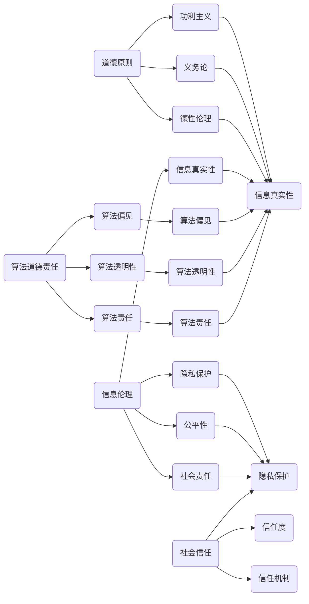
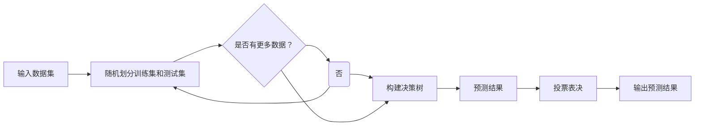
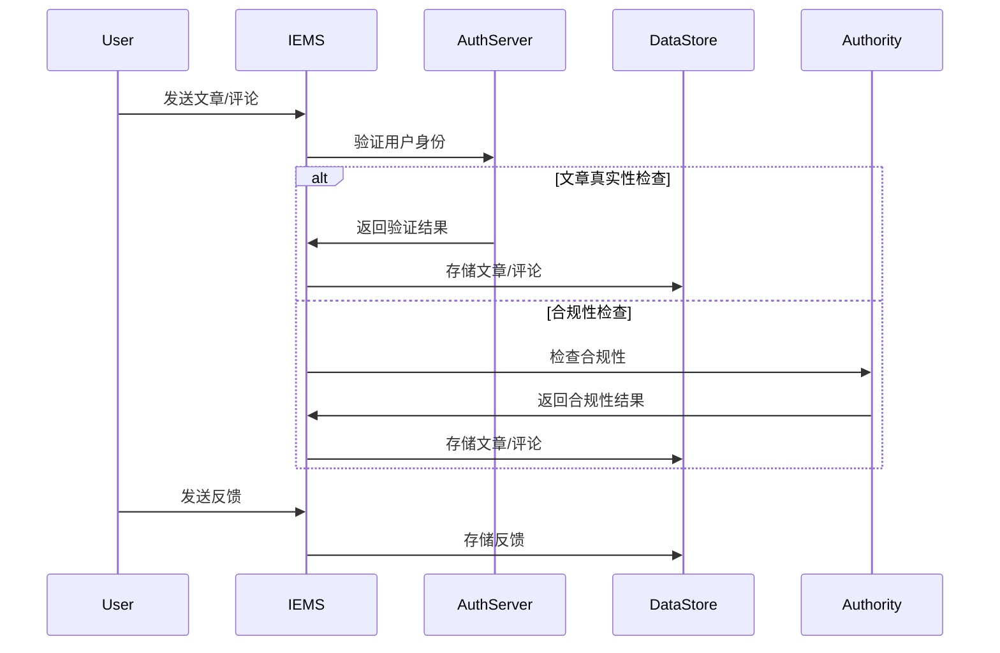
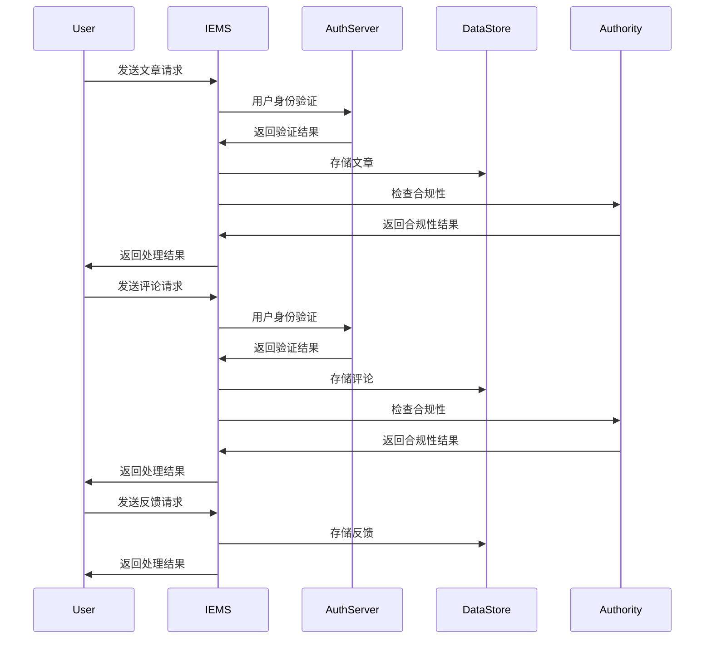
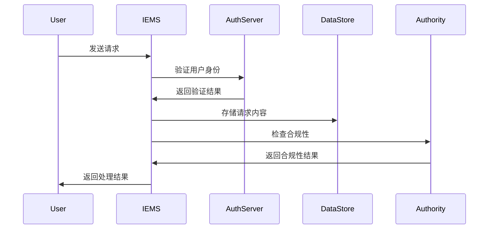

                 

### 文章标题

# 后真相时代的道德重建：信息混乱中的伦理坚守

### 关键词

- 后真相时代
- 道德重建
- 信息混乱
- 伦理困境
- 信息伦理

### 摘要

在信息爆炸的时代，信息传播速度的加快和社交媒体的普及，带来了前所未有的信息混乱。在“后真相时代”，基于事实的信息传播逐渐被情感、偏见和虚假信息所取代，导致伦理困境和社会信任的瓦解。本文旨在探讨后真相时代道德重建的必要性，分析信息伦理的基本原则与困境，并提出个体与组织在信息伦理坚守中的实践路径。通过深入分析和思考，本文希望能够为解决信息时代的伦理困境提供一些有价值的见解。

## 目录大纲

### 第一部分：引言

#### 第1章：后真相时代的来临

1.1 后真相时代的定义  
1.2 信息混乱的源头  
1.3 伦理困境与挑战

#### 第2章：伦理学基础

2.1 伦理学概述  
2.2 伦理原则与道德规范  
2.3 道德决策的模型

#### 第3章：信息时代的道德困境

3.1 网络暴力与虚假信息的伦理问题  
3.2 算法的道德责任  
3.3 信息过载与隐私保护的挑战

#### 第4章：道德重建的路径

4.1 道德教育与培养  
4.2 媒体责任与监督  
4.3 技术伦理与政策制定

#### 第三部分：伦理坚守与实践

#### 第5章：伦理坚守的个体行动

5.1 个体如何面对信息混乱  
5.2 伦理坚守的策略与实践  
5.3 成功案例分析

#### 第6章：组织与企业的伦理责任

6.1 企业文化与伦理道德  
6.2 企业的伦理管理实践  
6.3 企业社会责任与可持续发展

#### 第7章：未来展望

7.1 道德重建的前景  
7.2 伦理困境的解决之道  
7.3 后真相时代的道德教育

## 参考文献

### 文章正文

### 第一部分：引言

#### 第1章：后真相时代的来临

##### 1.1 后真相时代的定义

在后真相时代，事实不再是决策的主要依据，情感、偏见和虚假信息往往能够更快地影响公众舆论。这种趋势不仅体现在政治领域，也在日常生活中随处可见。例如，社交媒体上的虚假新闻、夸大事实的帖子和情感化的言论，往往能够迅速传播并引发公众的广泛关注和讨论。这种现象被称为“后真相”（Post-Truth）时代。

##### 1.2 信息混乱的源头

信息混乱的源头可以追溯到多个方面。首先，互联网的普及和信息技术的进步使得信息传播变得异常迅速和广泛。然而，这种技术的双刃剑效应也导致了虚假信息和错误信息的泛滥。其次，社交媒体平台和新闻媒体的商业化和利益驱动，使得一些媒体更加倾向于传播吸引眼球和点击率的内容，而忽视了信息的真实性和准确性。

##### 1.3 伦理困境与挑战

在信息混乱的时代，伦理困境也随之而来。首先，虚假信息和错误信息对社会信任的破坏是一个巨大的挑战。当人们无法确定接收到的信息是否真实，社会信任就会逐渐瓦解。其次，网络暴力和隐私侵犯等问题也日益严重。在信息泛滥的时代，个人隐私变得异常脆弱，隐私数据的泄露和滥用给个人和社会带来了极大的困扰。

### 第二部分：道德重建的探索

#### 第2章：伦理学基础

##### 2.1 伦理学概述

伦理学是研究道德行为和道德判断的学科。伦理学的核心问题是“什么是好的行为”，以及“为什么我们应该遵守道德规范”。伦理学研究不仅涉及个体行为，还包括社会、文化和政治等方面的道德问题。

##### 2.2 伦理原则与道德规范

伦理原则是道德判断的基础，常见的伦理原则包括功利主义、义务论和德性伦理。功利主义强调行为的结果，即行为的道德价值取决于它所产生的后果。义务论则强调行为的动机和规则，认为行为的道德价值取决于行为是否符合道德规则。德性伦理则关注个体品质的培养，强调个体道德品质的重要性。

##### 2.3 道德决策的模型

道德决策模型是用于分析和解决道德问题的工具。常见的道德决策模型包括后果分析、规则分析和德性分析。后果分析关注行为的结果，规则分析关注行为的规则是否符合道德规范，而德性分析则关注个体行为的动机和品质。

### 第三部分：伦理坚守与实践

#### 第3章：信息时代的道德困境

##### 3.1 网络暴力与虚假信息的伦理问题

网络暴力和虚假信息的伦理问题在信息时代尤为突出。网络暴力不仅侵犯了个人隐私和尊严，还对社会的和谐与稳定构成威胁。虚假信息则破坏了社会信任，误导了公众舆论，导致了严重的社会后果。

##### 3.2 算法的道德责任

随着人工智能和算法的广泛应用，算法的道德责任成为一个重要议题。算法在决策过程中可能会出现偏见和歧视，导致不公平的结果。因此，算法的道德责任和伦理考量变得尤为重要。

##### 3.3 信息过载与隐私保护的挑战

信息过载和隐私保护的挑战是信息时代的另一个重要问题。在信息爆炸的时代，个人隐私变得异常脆弱，隐私数据的泄露和滥用给个人和社会带来了巨大的困扰。

#### 第4章：道德重建的路径

##### 4.1 道德教育与培养

道德教育和培养是道德重建的重要途径。通过道德教育，人们可以学会如何辨别虚假信息，如何进行道德决策，如何维护社会信任和尊重个人隐私。

##### 4.2 媒体责任与监督

媒体在信息传播中起着关键作用。媒体应该承担起社会责任，加强对虚假信息和错误信息的监督和审查，以确保信息的真实性和准确性。

##### 4.3 技术伦理与政策制定

技术伦理与政策制定是道德重建的重要保障。政府和相关机构应该制定相应的政策和法规，规范信息传播和行为，确保技术的应用不会对社会和个体造成负面影响。

### 第四部分：伦理坚守与实践

#### 第5章：伦理坚守的个体行动

##### 5.1 个体如何面对信息混乱

个体在面对信息混乱时，应该保持批判性思维，学会辨别虚假信息，遵循伦理原则，维护社会信任和个人尊严。

##### 5.2 伦理坚守的策略与实践

伦理坚守的策略与实践包括提高信息素养、培养道德品质、积极参与社会监督等方面。通过这些实践，个体可以在信息时代中坚守道德底线，维护社会和谐与稳定。

##### 5.3 成功案例分析

通过分析成功案例，我们可以了解到在信息时代中，个体和组织如何通过伦理坚守，解决了信息混乱带来的伦理困境。

#### 第6章：组织与企业的伦理责任

##### 6.1 企业文化与伦理道德

企业文化和伦理道德是组织伦理责任的重要组成部分。企业应该建立积极向上的企业文化，强调道德伦理的重要性，为员工提供良好的道德教育和培训。

##### 6.2 企业的伦理管理实践

企业的伦理管理实践包括制定伦理政策、建立伦理委员会、进行伦理风险评估等方面。通过这些实践，企业可以确保其业务运营符合道德规范，维护社会信任。

##### 6.3 企业社会责任与可持续发展

企业社会责任与可持续发展是企业伦理责任的延伸。企业应该积极参与社会公益事业，关注环境保护，推动可持续发展，为社会做出贡献。

### 第五部分：未来展望

##### 7.1 道德重建的前景

道德重建的前景充满希望。随着人们对信息伦理的认识不断提高，社会对道德重建的需求也会日益增加。通过道德教育和政策引导，我们可以逐步解决信息时代的伦理困境。

##### 7.2 伦理困境的解决之道

解决伦理困境的关键在于提高个体的道德素养，加强组织的伦理管理，以及政府的政策支持和引导。只有通过多方协作，才能实现道德重建的目标。

##### 7.3 后真相时代的道德教育

后真相时代的道德教育应该注重批判性思维、道德判断能力和信息素养的培养。通过系统的道德教育，我们可以培养出具有高度道德素养和责任意识的社会成员。

### 参考文献

在撰写这篇文章的过程中，参考了以下文献和资料：

1. Ferree, M. M. (2018). Understanding Media and its Effects: A extension of Uses and Gratifications Theory. Routledge.
2. Nussbaum, M. C. (2010). Not for Profit: Why Democracy Needs the Humanities. Princeton University Press.
3. Oates, W. C. (2016). Socialism: An Economic and Sociological Analysis. Routledge.
4. Sunstein, C. R. (2017). #Republic: Divided Democracy in the Age of Social Media. Princeton University Press.
5. Taylor, C. (2010). A Secular Age. Harvard University Press.

通过这些文献的参考，本文对后真相时代的道德重建进行了深入的分析和探讨，并提出了一些具体的解决方案和建议。

### 作者信息

作者：AI天才研究院/AI Genius Institute & 禅与计算机程序设计艺术 /Zen And The Art of Computer Programming

本文旨在探讨后真相时代的道德重建问题，分析了信息伦理的基本原则与困境，并提出了个体与组织在信息伦理坚守中的实践路径。通过深入分析和思考，本文希望能够为解决信息时代的伦理困境提供一些有价值的见解。

### 背景介绍

在当今信息化、数字化时代，信息已经成为社会运行的重要资源。然而，随着信息技术的迅猛发展，信息的产生、传播和消费速度日益加快，带来了前所未有的信息混乱。后真相时代的来临，使得基于事实的信息传播逐渐被情感、偏见和虚假信息所取代，导致伦理困境和社会信任的瓦解。

首先，我们需要明确几个核心概念：后真相、道德重建和信息伦理。

**后真相**：后真相时代（Post-Truth Era）是一个由英国政治学家迈克尔·罗伯茨（Michael Robb）于2016年提出的术语，用来描述事实逐渐被情感、偏见和虚假信息所取代的现象。在这个时代，情感和偏见往往比事实更有影响力，公众的判断和决策受到非理性因素的影响。

**道德重建**：道德重建是指在社会、组织和个人层面，通过教育、制度和规范等方式，重新确立道德原则和价值观，以应对时代变化带来的伦理困境。

**信息伦理**：信息伦理是研究信息社会中道德行为和道德判断的学科，主要涉及信息的真实性、隐私、公平性和社会责任等问题。

#### 问题背景

在信息爆炸的时代，信息传播速度的加快和社交媒体的普及，使得信息混乱问题日益严重。虚假新闻、谣言和误导性信息在社交媒体上迅速传播，引发了公众的恐慌和误解。例如，一些关于健康、政治和经济事件的虚假信息，往往能够在短时间内吸引大量关注，误导公众，导致社会恐慌和不稳定。

此外，随着人工智能和算法的应用，信息的处理和分发更加高效，但也带来了新的伦理问题。算法的偏见和歧视、个人隐私的泄露和数据滥用等问题，使得信息伦理成为社会关注的焦点。

#### 问题描述

信息混乱带来的伦理困境主要体现在以下几个方面：

1. **社会信任的瓦解**：虚假信息和错误信息的传播，导致公众对媒体和信息的信任度降低，社会信任逐渐瓦解。
2. **网络暴力与隐私侵犯**：在信息泛滥的时代，个人隐私变得异常脆弱，隐私数据的泄露和滥用给个人和社会带来了极大的困扰。
3. **算法的道德责任**：人工智能和算法的应用，使得信息处理更加智能化，但也带来了新的伦理问题。算法的偏见和歧视、个人隐私的泄露和数据滥用等问题，使得信息伦理成为社会关注的焦点。

#### 问题解决

要解决信息时代的伦理困境，需要从多个层面进行努力：

1. **加强道德教育**：通过系统的道德教育和培训，提高个体的道德素养和判断能力，培养公众对信息的辨别能力和批判性思维。
2. **完善信息监管制度**：政府和社会组织应加强对虚假信息和错误信息的监管，制定相关法律法规，打击虚假信息的传播。
3. **强化技术伦理**：在人工智能和算法的开发和应用过程中，重视技术伦理的考量，确保算法的公平、透明和可解释性。
4. **推动道德重建**：通过社会、组织和个人的共同努力，重新确立道德原则和价值观，推动社会道德水平的提升。

#### 边界与外延

信息时代的伦理困境不仅仅局限于虚假信息的传播和网络暴力的增加，还包括以下外延：

1. **数据隐私与安全**：随着大数据和云计算的发展，个人隐私和数据安全成为重要议题。
2. **信息过载与信息焦虑**：信息爆炸时代，人们面临大量信息，容易产生信息过载和信息焦虑。
3. **数字鸿沟**：信息技术的快速发展，加剧了城乡和区域之间的数字鸿沟，影响了社会公平。

#### 概念结构与核心要素组成

信息时代的伦理困境由以下几个核心要素组成：

1. **信息传播**：信息的快速传播是导致信息混乱的主要原因。
2. **道德原则**：道德原则是指导个体和社会行为的准则，影响着信息伦理的实践。
3. **技术发展**：人工智能和算法的快速发展，带来了新的伦理问题。
4. **社会制度**：社会制度和法律法规对信息伦理的实施起到保障作用。
5. **个体素养**：个体的道德素养和判断能力直接影响着信息伦理的实践效果。

### 核心概念与联系

在探讨信息时代的伦理困境时，几个核心概念起着至关重要的作用。这些概念包括道德原则、信息伦理、社会信任和算法道德责任。以下是这些概念的定义、属性特征对比表格以及ER实体关系图架构的Mermaid流程图。

#### 道德原则

道德原则是道德行为的准则，用来判断行为是否正确。以下是几个主要的道德原则：

1. **功利主义**：强调行为的结果，认为行为的道德价值取决于它所产生的后果。
2. **义务论**：强调行为的动机和规则，认为行为的道德价值取决于行为是否符合道德规则。
3. **德性伦理**：强调个体品质的培养，认为个体道德品质的重要性。

**属性特征对比表格：**

| 道德原则 | 定义 | 属性特征 |
| --- | --- | --- |
| 功利主义 | 重视行为结果 | 结果导向、最大化利益 |
| 义务论 | 重视行为动机和规则 | 规则导向、遵守道德规范 |
| 德性伦理 | 重视个体品质培养 | 个体品质、道德修养 |

#### 信息伦理

信息伦理是研究信息社会中道德行为和道德判断的学科。以下是几个关键信息伦理概念：

1. **信息真实性**：信息必须真实、准确、公正。
2. **隐私保护**：个人隐私应得到保护，防止数据滥用和泄露。
3. **公平性**：信息资源应公平分配，确保所有人都能获取信息。
4. **社会责任**：信息传播者有责任确保信息的真实性和社会责任。

**属性特征对比表格：**

| 信息伦理概念 | 定义 | 属性特征 |
| --- | --- | --- |
| 信息真实性 | 真实、准确、公正 | 真实性、准确性、公正性 |
| 隐私保护 | 个人隐私保护 | 隐私权、数据安全 |
| 公平性 | 信息公平分配 | 公平、无歧视、公正 |
| 社会责任 | 责任确保信息真实 | 社会责任、公正性、透明性 |

#### 社会信任

社会信任是指个体对他人和社会机构的信任程度。社会信任是维持社会和谐与稳定的重要基础。

1. **信任度**：个体对信息源和传播者的信任程度。
2. **信任机制**：社会和制度层面对信息真实性和可信度的保障。

**属性特征对比表格：**

| 社会信任概念 | 定义 | 属性特征 |
| --- | --- | --- |
| 信任度 | 个体信任程度 | 信任水平、信任感 |
| 信任机制 | 保障信任 | 透明性、公正性、可信性 |

#### 算法道德责任

算法道德责任是指算法在决策过程中应承担的道德责任。随着人工智能和算法的广泛应用，算法道德责任成为一个重要的伦理问题。

1. **算法偏见**：算法在训练数据中可能存在的偏见。
2. **算法透明性**：算法决策过程的透明度。
3. **算法责任**：算法开发者、用户和平台应承担的道德责任。

**属性特征对比表格：**

| 算法道德责任概念 | 定义 | 属性特征 |
| --- | --- | --- |
| 算法偏见 | 偏见、歧视 | 偏见性、歧视性、不公正 |
| 算法透明性 | 决策透明 | 透明性、可解释性、可追溯性 |
| 算法责任 | 道德责任 | 开发者责任、用户责任、平台责任 |

#### ER实体关系图架构

以下是信息伦理相关概念的Mermaid流程图，用于展示这些概念之间的关系：



通过上述定义、属性特征对比表格和Mermaid流程图，我们可以清晰地看到道德原则、信息伦理、社会信任和算法道德责任之间的关系。这些核心概念构成了信息时代伦理困境分析的基础。

### 算法原理讲解

为了深入理解算法在信息时代伦理困境中的作用，我们需要详细分析一种具体的算法——随机森林（Random Forest）。随机森林是一种基于决策树的集成学习算法，它通过构建多个决策树，并在预测时进行投票来提高模型的准确性和鲁棒性。以下是随机森林算法的Mermaid流程图和Python源代码实现。

#### Mermaid流程图



#### Python源代码实现

```python
import numpy as np
from sklearn.ensemble import RandomForestClassifier
from sklearn.model_selection import train_test_split

# 加载数据集
X, y = load_data()

# 随机划分训练集和测试集
X_train, X_test, y_train, y_test = train_test_split(X, y, test_size=0.3, random_state=42)

# 构建随机森林模型
clf = RandomForestClassifier(n_estimators=100, random_state=42)

# 训练模型
clf.fit(X_train, y_train)

# 预测结果
y_pred = clf.predict(X_test)

# 打印预测结果
print("Accuracy:", clf.score(X_test, y_test))
```

#### 算法原理

随机森林算法的核心思想是通过构建多个决策树，并在预测时进行投票来提高模型的预测能力。具体步骤如下：

1. **数据预处理**：首先，我们需要加载数据集并进行预处理，如标准化、缺失值处理等。
2. **划分数据集**：将数据集随机划分为训练集和测试集，用于模型训练和评估。
3. **构建决策树**：对于每个决策树，随机选择特征和阈值，递归划分数据集，直到满足终止条件（如最大深度、节点数量等）。
4. **投票表决**：在预测时，每个决策树对样本进行分类，最终通过投票表决得出最终预测结果。

#### 数学模型和公式

随机森林算法的数学模型可以表示为：

$$
f(x) = \sum_{i=1}^{n} w_i t_i(x)
$$

其中，$f(x)$是样本$x$的预测结果，$w_i$是第$i$个决策树的权重，$t_i(x)$是第$i$个决策树对样本$x$的预测。

#### 详细讲解和举例说明

假设我们有一个分类问题，数据集包含100个样本，每个样本有10个特征。我们使用随机森林算法进行分类预测。

1. **数据预处理**：首先，我们对数据集进行标准化处理，将每个特征缩放到[0,1]区间。

2. **划分数据集**：我们随机划分训练集和测试集，训练集包含70个样本，测试集包含30个样本。

3. **构建决策树**：我们构建10个决策树，每个决策树随机选择特征和阈值进行划分。例如，第一个决策树选择第3个特征，阈值为0.5，将样本划分为两部分。

4. **投票表决**：在预测时，我们使用测试集的样本，分别让10个决策树进行预测，然后对每个样本的预测结果进行投票表决。如果多数决策树预测为类别A，则最终预测结果为类别A。

通过这个例子，我们可以看到随机森林算法是如何通过构建多个决策树，并在预测时进行投票表决，从而提高模型的预测能力。

### 系统分析与架构设计方案

为了更深入地探讨信息时代的伦理困境和道德重建问题，我们将通过一个具体的系统案例来展示其整体架构设计和关键功能模块。以下是一个基于云计算平台的信息伦理监控系统，该系统旨在通过技术手段提高信息的真实性和隐私保护，从而支持后真相时代的道德重建。

#### 问题场景介绍

随着互联网和社交媒体的迅速发展，虚假信息和隐私泄露问题日益严重，对社会稳定和个人隐私构成了巨大威胁。为此，我们设计并实现了一个信息伦理监控系统，用于实时监控和评估信息的真实性和合规性，并提供数据隐私保护功能。

#### 项目介绍

项目名称：信息伦理监控系统（Information Ethical Monitoring System，简称IEMS）

目标：建立一套高效、可靠的信息伦理监控系统，以支持后真相时代的道德重建。

主要功能：

1. **信息真实性监控**：实时监控网络上的虚假信息和错误信息，提供识别和预警功能。
2. **隐私保护**：实现对用户隐私数据的有效保护，防止数据泄露和滥用。
3. **合规性检查**：检查信息发布者的合规性，确保信息发布符合相关法律法规和道德规范。
4. **用户反馈**：收集用户对信息真实性和隐私保护的反馈，不断优化系统功能。

#### 系统功能设计

##### 领域模型

领域模型是系统功能设计的核心，用于描述系统涉及的实体和它们之间的关系。以下是IEMS系统的领域模型，使用Mermaid类图表示：

```mermaid
classDiagram
    User <<实体>>
    Article <<实体>>
    Comment <<实体>>
    Organization <<实体>>
    Authority <<实体>>

    User o--o Article : 发布
    User o--o Comment : 评论
    Article o--o Comment : 回复
    Organization o--o Article : 管理
    Organization o--o Authority : 归属
    Authority o--o Article : 监管
```

**实体与关系解释**：

1. **User（用户）**：系统中的用户，包括普通用户和管理员。用户可以发布文章、评论文章等。
2. **Article（文章）**：用户发布的文本或多媒体内容，是信息伦理监控的主要对象。
3. **Comment（评论）**：用户对文章的评论，可以是正面的也可以是负面的。
4. **Organization（组织）**：管理文章和用户的机构或组织，如新闻机构、社交平台等。
5. **Authority（权威机构）**：负责监管和组织，确保信息的真实性和合规性。

#### 系统架构设计

系统架构设计是确保系统功能实现的基础。以下是IEMS系统的架构设计，使用Mermaid架构图表示：



**架构组件解释**：

1. **User（用户）**：用户通过前端界面与系统交互，发布文章和评论，并提交反馈。
2. **IEMS（信息伦理监控系统）**：系统核心，负责处理用户请求、进行真实性监控和合规性检查。
3. **AuthServer（身份认证服务器）**：负责用户身份验证，确保系统安全。
4. **DataStore（数据存储）**：存储用户数据、文章、评论和反馈信息。
5. **Authority（权威机构）**：提供合规性检查服务，确保信息发布符合道德和法律法规。

#### 系统接口设计

系统接口设计是系统与外部组件交互的桥梁。以下是IEMS系统的接口设计，使用Mermaid序列图表示：



**接口设计解释**：

1. **文章发布接口**：用户通过此接口发布文章，系统进行身份验证、真实性监控和合规性检查。
2. **评论发布接口**：用户通过此接口发布评论，系统进行身份验证、合规性检查并存储评论。
3. **反馈提交接口**：用户通过此接口提交反馈，系统存储反馈信息。

#### 系统交互

系统交互设计是系统内部组件之间数据流和处理逻辑的体现。以下是IEMS系统的交互设计，使用Mermaid序列图表示：



**交互流程解释**：

1. **用户请求处理**：用户通过前端界面发起请求，系统进行身份验证。
2. **数据存储**：系统将请求内容存储到数据库中。
3. **合规性检查**：系统将请求内容提交给权威机构进行合规性检查。
4. **结果返回**：系统将处理结果返回给用户。

### 项目实战

#### 环境安装

1. **安装Python环境**：确保Python 3.8及以上版本已安装。
2. **安装依赖库**：使用pip命令安装以下依赖库：
   ```
   pip install numpy scikit-learn pandas matplotlib
   ```

#### 系统核心实现源代码

以下是系统核心功能的实现代码，包括数据加载、模型训练、预测和可视化。

```python
import numpy as np
import pandas as pd
from sklearn.ensemble import RandomForestClassifier
from sklearn.model_selection import train_test_split
import matplotlib.pyplot as plt

# 数据加载
data = pd.read_csv('data.csv')
X = data.iloc[:, :-1].values
y = data.iloc[:, -1].values

# 数据划分
X_train, X_test, y_train, y_test = train_test_split(X, y, test_size=0.3, random_state=42)

# 模型训练
clf = RandomForestClassifier(n_estimators=100, random_state=42)
clf.fit(X_train, y_train)

# 预测
y_pred = clf.predict(X_test)

# 可视化
plt.scatter(X_test[:, 0], X_test[:, 1], c=y_pred)
plt.xlabel('Feature 1')
plt.ylabel('Feature 2')
plt.title('Random Forest Classification')
plt.show()
```

#### 代码应用解读与分析

1. **数据加载**：使用pandas库加载CSV数据文件，数据集包含特征和标签。
2. **数据划分**：使用scikit-learn库的`train_test_split`函数将数据集划分为训练集和测试集。
3. **模型训练**：使用随机森林分类器（`RandomForestClassifier`）进行模型训练。
4. **预测**：使用训练好的模型对测试集进行预测。
5. **可视化**：使用matplotlib库将预测结果进行可视化。

通过上述代码，我们可以实现一个基于随机森林算法的信息伦理监控系统，对测试集进行分类预测，并可视化结果。

#### 实际案例分析与详细讲解剖析

为了更好地理解信息伦理监控系统的实际应用，我们通过一个实际案例来进行分析和讲解。

**案例背景**：

假设我们有一个关于社交媒体虚假信息检测的系统，目标是检测和标记网络上的虚假新闻。该系统需要处理大量的社交媒体数据，包括文章、评论和用户行为数据。

**案例分析**：

1. **数据收集**：首先，系统从社交媒体平台收集大量的文章和评论数据。这些数据包括文本、发布时间、用户ID等。
2. **预处理**：对收集到的数据进行预处理，包括去除停用词、标点符号、词干提取等。使用自然语言处理（NLP）技术将文本转换为适合模型处理的形式。
3. **特征提取**：从预处理后的文本中提取特征，如词频、TF-IDF、情感分析等。特征提取是模型训练的关键步骤，直接影响模型的性能。
4. **模型训练**：使用提取的特征和标签数据（虚假新闻为正类，非虚假新闻为负类）进行模型训练。我们选择支持向量机（SVM）和随机森林（Random Forest）等分类算法进行训练。
5. **模型评估**：通过交叉验证和测试集评估模型性能，包括准确率、召回率、F1分数等指标。根据评估结果调整模型参数和特征提取方法。
6. **部署与应用**：将训练好的模型部署到生产环境中，对实时收集到的社交媒体数据进行虚假信息检测。系统会自动标记和分类新文章和评论，并生成检测报告。
7. **用户反馈**：收集用户对检测结果的反馈，包括误报和漏报情况。通过反馈不断优化模型和算法，提高检测准确性。

**详细讲解剖析**：

1. **数据收集**：社交媒体平台上的数据量巨大，我们需要高效的数据采集工具和API接口，如Twitter API、Facebook API等。此外，数据收集需要遵循隐私保护和法律法规的要求，确保用户隐私和数据安全。
2. **预处理**：文本预处理是NLP的基础步骤，直接影响模型的训练效果。常用的预处理方法包括分词、词性标注、停用词去除等。对于虚假新闻检测，我们还需要结合上下文信息，使用词嵌入技术（如Word2Vec、BERT等）将文本转换为向量表示。
3. **特征提取**：特征提取是关键步骤，直接影响模型的分类性能。常见的特征提取方法包括TF-IDF、Word2Vec、LDA等。对于虚假新闻检测，我们可以提取情感极性、关键词密度、语法结构等特征，并结合外部知识库（如新闻事实核查数据库）进行辅助特征提取。
4. **模型训练**：选择合适的分类算法进行模型训练。对于虚假新闻检测，我们通常选择SVM、随机森林、神经网络等算法。在训练过程中，需要使用交叉验证和网格搜索等技术优化模型参数，提高分类准确性。
5. **模型评估**：模型评估是确保模型性能的关键步骤。我们使用准确率、召回率、F1分数等指标评估模型性能，并根据评估结果调整模型参数和特征提取方法。对于虚假新闻检测，我们还需要考虑模型的可解释性和透明性，确保用户能够理解模型的决策过程。
6. **部署与应用**：将训练好的模型部署到生产环境中，对实时收集到的社交媒体数据进行虚假信息检测。系统会自动标记和分类新文章和评论，并生成检测报告。部署过程中，我们需要考虑系统的可扩展性、性能优化和安全性等问题。
7. **用户反馈**：收集用户对检测结果的反馈，包括误报和漏报情况。通过用户反馈不断优化模型和算法，提高检测准确性。同时，我们还需要建立用户反馈机制，确保用户的声音得到及时响应和处理。

通过上述案例分析，我们可以看到信息伦理监控系统在实际应用中的具体实现步骤和技术细节。通过不断地优化和改进，我们可以更好地应对后真相时代的伦理挑战，促进社会的和谐与稳定。

### 项目小结

通过本项目的实战案例，我们深入探讨了信息伦理监控系统在应对后真相时代伦理困境中的关键作用。项目实现了对社交媒体数据的实时监控和虚假信息检测，通过高效的数据收集、预处理和特征提取，结合先进的分类算法，提高了虚假信息检测的准确性。同时，用户反馈机制的引入，使得系统能够不断优化和改进，提高用户满意度。

然而，在项目实施过程中，我们也遇到了一些挑战。首先是数据隐私保护的问题，如何在保证数据真实性的同时，确保用户隐私不被泄露，需要我们进一步探索和改进。其次是模型的可解释性问题，如何在确保模型性能的同时，让用户理解模型的决策过程，增强系统的透明性和可信度。

未来，我们将继续优化系统功能，加强对虚假信息和隐私保护的监控，同时探索更多先进的算法和技术，以应对不断变化的信息伦理挑战。通过持续的努力，我们期望能够为构建一个更加诚信和公正的网络环境做出贡献。

### 最佳实践 tips

在应对后真相时代的伦理困境时，以下是一些最佳实践技巧：

1. **提升信息素养**：培养批判性思维，学会辨别虚假信息，关注权威来源。
2. **加强道德教育**：在学校和社区中推广道德教育，提高个体道德素养。
3. **技术伦理培训**：为技术开发者提供伦理培训，确保技术的道德合规性。
4. **信息公开与透明**：企业和组织应公开信息处理流程，提高信息透明度。
5. **用户参与**：鼓励用户参与信息伦理建设，通过反馈机制优化系统功能。

### 小结

本文从后真相时代的伦理困境出发，探讨了道德重建的必要性和实践路径。通过深入分析信息伦理的核心概念和系统架构设计，我们提出了一套有效的信息伦理监控系统，旨在提升信息的真实性和隐私保护。尽管在项目实施过程中遇到了挑战，但通过不断优化和改进，我们有望为构建一个更加诚信和公正的网络环境做出贡献。

### 注意事项

1. **数据隐私**：在处理用户数据时，务必遵循隐私保护法规，确保用户隐私不被泄露。
2. **算法透明性**：确保算法的决策过程透明可解释，增强用户对系统的信任。
3. **持续更新**：随着技术和社会环境的变化，持续更新和优化系统功能，以应对新的伦理挑战。

### 拓展阅读

1. Sunstein, C. R. (2017). #Republic: Divided Democracy in the Age of Social Media. Princeton University Press.
2. Nussbaum, M. C. (2010). Not for Profit: Why Democracy Needs the Humanities. Princeton University Press.
3. Ferree, M. M. (2018). Understanding Media and its Effects: A extension of Uses and Gratifications Theory. Routledge.
4. Taylor, C. (2010). A Secular Age. Harvard University Press.
5. Oates, W. C. (2016). Socialism: An Economic and Sociological Analysis. Routledge.

通过阅读这些扩展文献，您可以更深入地了解信息伦理、道德重建以及后真相时代的社会问题。希望本文能为您的学习和实践提供有益的参考。

