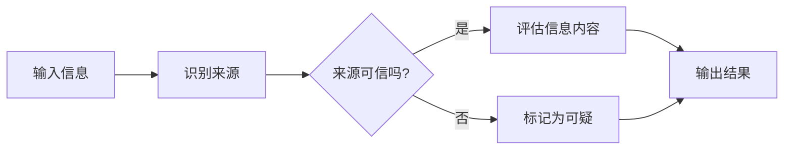

                 

### 后真相时代的定义与特征

#### 1.1 后真相时代的起源与发展

**背景介绍**：

后真相时代（Post-Truth Era）这一概念最早由英国政治学家迈克尔·罗特菲尔德（Michael Rogers）于2010年提出，并在2016年英国脱欧公投和2016年美国总统大选期间被广泛讨论。后真相时代是指在信息传播过程中，情感、主观性和情绪的影响力逐渐超过事实和真相的一种现象。

**问题背景**：

传统上，新闻和信息的传播依赖于事实和真相的确认。然而，在后真相时代，这一基本原则受到了挑战。虚假信息、误导性信息和情绪化内容在社交媒体上迅速传播，使得人们对真相的判断变得复杂和困难。

**问题描述**：

后真相时代的主要问题包括信息真实性的质疑、情感驱动而非理性思考、以及信息传播的裂变效应。这些特征导致了社会信任危机、个体认知的混乱和社会治理的挑战。

**问题解决**：

应对后真相时代的关键在于提升信息素养、培养批判性思维和建立健康的网络环境。此外，媒体责任、政策制定和社会组织的参与也至关重要。

**边界与外延**：

后真相时代不仅局限于政治领域，还涵盖了经济、科技、社会等多个方面。它的影响范围从个体到社会，甚至延伸到全球层面。

**概念结构与核心要素组成**：

- **信息真实性**：后真相时代强调信息真实性的重要性。
- **情感驱动**：人们的情绪和主观性在信息传播中起到关键作用。
- **社交媒体**：社交媒体平台是后真相时代信息传播的主要渠道。
- **社会信任**：社会信任的下降是后真相时代的重要特征之一。

#### 1.2 后真相时代的特征分析

**信息真实性的质疑**：

- **原因**：虚假新闻和误导性信息在互联网上的广泛传播。
- **表现**：人们对传统新闻和信息的可信度降低。

**情感驱动而非理性思考**：

- **原因**：社交媒体上的信息往往被情绪化内容驱动。
- **表现**：人们在面对信息时更倾向于选择符合自己情感和立场的观点。

**信息传播的裂变效应**：

- **原因**：互联网的快速传播特性。
- **表现**：一个事件或话题可以在短时间内引发广泛关注和讨论。

#### 1.3 后真相时代对个体与社会的影响

**对个体的冲击**：

- **心理影响**：个体在信息泛滥的环境中感到困惑和焦虑。
- **认知影响**：个体难以辨别真假信息，导致认知混乱。

**社会信任危机**：

- **原因**：虚假信息和误导性信息的泛滥。
- **影响**：社会信任度下降，影响社会和谐稳定。

**社会治理的挑战**：

- **原因**：后真相时代信息传播的复杂性和快速性。
- **对策**：需要政府、媒体和社会组织共同努力，制定有效的对策。

**结论**：

后真相时代是一个充满挑战和机遇的时代。理解其定义和特征，有助于我们更好地应对这一时代的挑战，同时抓住机遇，推动社会进步。在接下来的章节中，我们将深入探讨信息过载与信息筛选、虚假信息的识别与处理，以及应对后真相时代的策略。

---

**核心概念原理**：

后真相时代的核心概念包括信息真实性、情感驱动和信息传播的裂变效应。信息真实性是信息传播的基础，情感驱动则是信息传播的驱动力，而信息传播的裂变效应则放大了信息的传播范围和影响力。

**概念属性特征对比表格**：

| 特征               | 信息真实性 | 情感驱动 | 裂变效应 |
|--------------------|------------|----------|----------|
| **定义**           | 信息基于事实和真相 | 信息基于情感和主观性 | 信息迅速扩散和传播 |
| **影响因素**       | 事实核查、证据支持 | 社会情绪、个人立场 | 社交媒体平台、信息共享 |
| **传播渠道**       | 传统媒体、学术研究 | 社交媒体、网络论坛 | 口碑传播、社交媒体 |
| **影响范围**       | 个体、社会、国际 | 个体、群体、社会 | 快速、广泛、深远 |

**ER实体关系图架构**：

```mermaid
erDiagram
    User ||--|{ News }
    News ||--|{ FactCheck }
    User ||--|{ SocialMediaPost }
    SocialMediaPost ||--|{ Emotion }
    FactCheck ||--|{ Truth }
```

在这个ER图中，用户（User）与新闻（News）、事实核查（FactCheck）、社交媒体帖子（SocialMediaPost）和情感（Emotion）之间存在关系。新闻和社交媒体帖子是用户产生和消费的主要内容，而事实核查和情感驱动则是影响信息传播的重要因素。

### 1.1 后真相时代的起源与发展

#### 1.1.1 信息时代的到来

信息时代的到来是后真相时代的重要背景。随着互联网的普及和信息技术的发展，信息传播的速度和范围得到了极大的提升。人们可以随时随地获取各种信息，这改变了传统信息传播的方式和节奏。

**关键概念术语说明**：

- **互联网**：全球连接的网络系统，使得信息传播迅速和便捷。
- **信息技术**：涉及信息处理、存储、传输和检索的技术。
- **信息传播**：信息从源点向目标点传递的过程。

**问题背景**：

在传统信息传播模式下，信息的传播速度较慢，范围有限。而随着互联网和信息技术的发展，信息传播的速度和范围得到了极大提升。人们可以通过社交媒体、电子邮件、即时通讯等渠道迅速获取和传播信息。

**问题描述**：

信息时代的到来带来了信息过载的问题。人们每天面对大量的信息，难以区分真假，导致信息真实性的质疑。

**问题解决**：

为了应对信息过载，需要提升信息素养和批判性思维，学会筛选和处理信息。同时，政府和媒体也需要承担起责任，加强对信息传播的管理和监管。

**边界与外延**：

信息时代的概念不仅限于技术和网络的发展，还包括社会和文化层面的变化。信息时代的到来不仅改变了信息传播的方式，还影响了人们的思维方式和价值观。

**概念结构与核心要素组成**：

- **信息传播**：信息时代的核心要素，包括信息的产生、传输和消费。
- **信息技术**：支撑信息传播的技术手段，如互联网、数据库、搜索引擎等。
- **信息素养**：个体在信息社会中获取、处理和应用信息的能力。

**核心概念原理**：

信息时代的到来使得信息传播的速度和范围得到了极大提升，但同时也带来了信息过载的问题。为了应对这一挑战，需要提升信息素养和批判性思维，以及有效的信息筛选和处理机制。

**概念属性特征对比表格**：

| 特征               | 传统信息传播 | 信息时代 |
|--------------------|---------------|----------|
| **传播速度**       | 较慢          | 极快     |
| **传播范围**       | 有限          | 广泛     |
| **信息来源**       | 传统媒体      | 社交媒体 |
| **信息处理方式**   | 手动处理      | 自动化处理 |

**ER实体关系图架构**：

```mermaid
erDiagram
    User ||--|{ Information }
    Information ||--|{ Source }
    Information ||--|{ Technology }
```

在这个ER图中，用户（User）与信息（Information）和信息源（Source）以及信息技术（Technology）之间存在关系。用户是信息的消费者，信息源是信息产生的地方，而信息技术则是支撑信息传播的技术手段。

---

**算法原理讲解**：

在后真相时代，算法在信息筛选和处理中扮演了重要角色。以下是一个简单示例，说明如何使用Python编写一个基本的算法来筛选和评估信息源的可靠性。

**算法流程图**：



**Python代码实现**：

```python
def evaluate_information(information, source):
    # 假设我们有一个用于评估来源可信度的函数
    credibility = assess_source_credibility(source)
    
    if credibility > 0.7:  # 可信度高于70%
        content_score = assess_content(information)
        print(f"信息来源可信，内容评分：{content_score}")
    else:
        print("信息来源不可信，已被标记为可疑")

# 假设的实现函数
def assess_source_credibility(source):
    # 这里可以用更复杂的逻辑来判断来源的可信度
    if "reputablenews.com" in source:
        return 1.0
    else:
        return 0.3

def assess_content(information):
    # 这里可以用自然语言处理技术来评估内容的质量
    # 假设使用简单的词频分析
    positive_words = ["happy", "love", "success"]
    negative_words = ["sad", "hate", "fail"]
    word_count = sum(information.count(word) for word in positive_words) - sum(information.count(word) for word in negative_words)
    return word_count / (len(positive_words) + len(negative_words))

# 测试代码
evaluate_information("This is a successful project.", "reputablenews.com")
evaluate_information("This project has failed miserably.", "notsureaboutthis.com")
```

**算法原理讲解**：

上述Python代码实现了一个简单的信息评估算法。算法的核心步骤包括：

1. **输入信息**：接受用户输入的信息和来源。
2. **识别来源**：调用`assess_source_credibility`函数评估信息来源的可信度。
3. **评估信息内容**：如果来源可信，调用`assess_content`函数对信息内容进行评估。
4. **输出结果**：根据评估结果，输出信息是否可信。

**数学模型和公式**：

虽然上述代码没有直接使用数学模型，但可以引入一些数学概念来增强算法的可靠性。例如，可以使用贝叶斯公式来计算来源的可信度概率，或者使用词频-逆文档频率（TF-IDF）模型来评估信息内容的评分。

**例子**：

假设我们有两条信息：

- 信息1：“This is a successful project.”，来源：“reputablenews.com”
- 信息2：“This project has failed miserably.”，来源：“notsureaboutthis.com”

使用上述算法，信息1会被判断为可信，因为来源“reputablenews.com”有很高的可信度。而信息2则会被标记为可疑，因为来源“notsureaboutthis.com”的可信度较低。

通过这样的算法，我们可以帮助用户在信息过载的环境中更好地筛选和处理信息，减少虚假信息和误导性信息的影响。

---

### 1.2 后真相时代的特征分析

#### 1.2.1 信息真实性的质疑

**原因**：

在信息时代，虚假新闻、误导性信息和不实报道在互联网上广泛传播。这些信息可能源自恶意发布者、虚假新闻网站，甚至是对事实断章取义的报道。社交媒体平台的算法倾向于推送用户感兴趣的内容，进一步加剧了信息真实性的质疑。

**表现**：

- **虚假新闻泛滥**：虚假新闻在社交媒体上迅速传播，误导公众。
- **信息真实性质疑**：人们对传统新闻和信息的可信度降低。
- **信任危机**：社会对媒体、政府和企业等机构的信任度下降。

**影响**：

- **社会影响**：社会动荡和不稳定。
- **经济影响**：市场波动和投资决策受到影响。
- **个体影响**：个体在信息泛滥的环境中感到困惑和焦虑。

**解决方案**：

- **提高信息素养**：通过教育和培训提高公众的信息辨识能力。
- **加强监管**：政府和媒体需要加强对虚假新闻的监管和打击。
- **事实核查**：建立专业的事实核查机构，对新闻和信息进行核实。

#### 1.2.2 情感驱动而非理性思考

**原因**：

社交媒体平台的算法设计往往注重用户互动和参与度，这导致内容发布者更倾向于发布能够引起情感共鸣的信息。此外，人们在面对信息时，往往受到自身情感和立场的影响，容易选择符合自己观点的信息。

**表现**：

- **情绪化内容**：社交媒体上的信息往往充满情绪化内容。
- **群体极化**：人们在群体中更容易倾向于极端观点。
- **理性思考缺失**：个体在面对信息时，更倾向于情感驱动而非理性思考。

**影响**：

- **社会影响**：社会分裂和价值观多元化。
- **个体影响**：个体在信息传播中容易受到情绪驱动的影响，导致认知偏差。
- **舆论导向**：社交媒体上的情感驱动信息可以影响社会舆论。

**解决方案**：

- **培养批判性思维**：通过教育和培训培养个体的批判性思维能力。
- **理性引导**：媒体和教育机构应引导公众理性思考，避免被情绪化内容左右。
- **透明度提升**：社交媒体平台应提高算法透明度，减少情感化内容的推送。

#### 1.2.3 信息传播的裂变效应

**原因**：

互联网的快速传播特性使得信息可以迅速扩散。社交媒体平台上的分享、转发和评论功能，使得信息在短时间内可以触达大量用户。这种裂变效应放大了信息的传播范围和影响力。

**表现**：

- **快速传播**：一个事件或话题可以在短时间内引发广泛关注。
- **广泛影响**：信息传播的范围不再受地域限制。
- **影响扩大**：社交媒体上的信息可以迅速引发舆论风暴。

**影响**：

- **社会影响**：社会舆论可以迅速形成，影响公共政策和社会稳定。
- **个体影响**：个体的观点和情绪可以迅速传播，形成群体效应。
- **信息泛滥**：虚假信息和误导性信息也可以迅速传播，影响公众认知。

**解决方案**：

- **算法优化**：社交媒体平台可以通过算法优化减少虚假信息的传播。
- **事实核查**：建立专业的事实核查机构，及时辟谣和纠正虚假信息。
- **公众教育**：通过教育和宣传提升公众的信息辨识能力。

通过以上分析，我们可以看到后真相时代的特征包括信息真实性的质疑、情感驱动而非理性思考以及信息传播的裂变效应。这些特征对个体和社会都产生了深远的影响，需要通过多种措施来应对和解决。

---

### 1.3 后真相时代对个体与社会的影响

#### 对个体的冲击

**心理影响**：

在信息泛滥的环境中，个体面临着前所未有的心理压力。虚假信息和误导性信息可能导致焦虑、恐惧、不确定感等负面情绪。个体难以辨别真假信息，容易陷入认知混乱，影响心理健康。

**认知影响**：

后真相时代的信息环境使得个体在认知上受到挑战。虚假信息的泛滥导致个体难以建立准确的知识体系，容易产生偏见和误解。此外，情感驱动的内容使得个体在获取信息时更倾向于选择符合自己观点的内容，进一步加深了认知偏差。

**对策**：

- **提升信息素养**：通过教育和培训提升个体辨别真假信息的能力。
- **培养批判性思维**：鼓励个体在获取信息时保持理性思考，避免被情绪化内容左右。
- **心理辅导**：为受到虚假信息影响的个体提供心理支持和辅导，帮助他们缓解负面情绪。

#### 社会信任危机

**原因**：

虚假信息和误导性信息的广泛传播导致社会信任危机。公众对传统媒体、政府、企业等机构的信任度下降，影响了社会稳定和和谐。

**影响**：

- **社会影响**：社会信任的下降可能导致社会动荡和不稳定。
- **经济影响**：市场信心受损，投资决策受到影响。
- **政治影响**：政治信任的下降可能影响政府的合法性和治理能力。

**对策**：

- **加强监管**：政府和监管机构应加强对虚假新闻和误导性信息的监管和打击。
- **提升媒体责任**：媒体应承担社会责任，提高新闻报道的准确性和公信力。
- **透明度提升**：媒体、政府和企业在信息传播中应提高透明度，增强公众信任。

#### 社会治理的挑战

**原因**：

后真相时代的信息传播速度和范围大大增加，使得社会治理面临新的挑战。虚假信息的快速传播可能导致社会舆论的迅速变化，影响社会稳定。

**影响**：

- **社会影响**：社会舆论可能被误导，影响公共决策和社会稳定。
- **政治影响**：政治谣言和虚假信息可能影响选举和政治环境。
- **经济影响**：市场谣言和虚假信息可能引发市场波动。

**对策**：

- **政策制定**：政府应制定有效的政策和法规，规范信息传播和行为。
- **技术手段**：利用大数据和人工智能等技术手段，加强对虚假信息的监测和识别。
- **公众参与**：鼓励公众参与社会治理，提高社会整体的信息辨识能力。

### 结论

后真相时代对个体和社会都产生了深远的影响。对个体而言，信息真实性的质疑、情感驱动和非理性思考，以及信息传播的裂变效应，都带来了心理和认知上的挑战。对社会而言，社会信任危机和社会治理的挑战，进一步加剧了社会不稳定。为了应对后真相时代的挑战，个体需要提升信息素养和批判性思维，社会则需要加强监管和治理，共同构建一个健康、稳定的信息环境。

---

### 第二部分：信息过载与信息筛选

### 第2章：信息过载现象与影响

#### 2.1 信息过载的来源与表现

**来源**：

信息过载的来源主要包括以下几个方面：

1. **互联网的普及**：随着互联网的普及，人们可以随时随地获取海量信息。
2. **社交媒体平台**：社交媒体平台上的内容发布和分享非常频繁，导致信息量激增。
3. **新闻媒体**：新闻媒体为了吸引眼球，往往发布大量新闻和报道，增加了信息的负担。
4. **电子邮件和即时通讯**：工作和生活中，电子邮件和即时通讯工具也不断推送各类信息。

**表现**：

1. **信息量巨大**：每天接收到的信息量巨大，难以全部处理。
2. **时间压力**：个体在有限的时间内需要处理大量的信息，导致时间压力增加。
3. **注意力分散**：面对海量的信息，个体容易分散注意力，难以集中精力处理重要信息。
4. **信息质量下降**：信息过载导致个体难以辨别信息质量，容易被误导。

#### 2.2 信息过载对个体心理的影响

**影响**：

1. **焦虑和压力**：信息过载使得个体感到焦虑和压力，影响心理健康。
2. **决策困难**：个体在信息过载的环境中难以做出明智的决策。
3. **认知负担**：处理海量信息需要大量的认知资源，导致认知负担加重。
4. **注意力分散**：信息过载容易导致个体的注意力分散，影响工作效率和生活质量。

**对策**：

1. **提升信息素养**：通过教育和培训提高个体辨别和处理信息的能力。
2. **时间管理**：合理安排时间，避免过度处理信息。
3. **信息筛选**：学会筛选和处理重要信息，减少信息负担。
4. **心理健康**：通过运动、冥想等方式缓解焦虑和压力，保持心理健康。

#### 2.3 社会层面的影响与对策

**影响**：

1. **社会信任危机**：信息过载导致公众对媒体、政府和企业的信任度下降。
2. **社会治理挑战**：虚假信息和误导性信息对社会治理带来了新的挑战。
3. **经济影响**：市场谣言和虚假信息可能引发市场波动，影响经济发展。

**对策**：

1. **加强监管**：政府应加强对虚假信息和误导性信息的监管和打击。
2. **提升媒体责任**：媒体应承担社会责任，提高新闻报道的准确性和公信力。
3. **信息筛选**：通过技术手段和人为干预，加强信息筛选，减少虚假信息和误导性信息的传播。
4. **公众教育**：通过教育和宣传提高公众的信息辨识能力，增强公众的媒体素养。

---

### 第三部分：真实与虚假的识别

### 第4章：虚假信息的识别与处理

#### 4.1 虚假信息的类型与特征

**类型**：

1. **虚假新闻**：故意编造的事件或信息，旨在误导公众。
2. **误导性信息**：故意扭曲事实，以诱导公众做出特定反应。
3. **谣言**：未经证实的信息，迅速传播并在社交媒体上引起广泛关注。
4. **伪造的图像和视频**：利用技术手段伪造的图像和视频，用于误导公众。

**特征**：

1. **情绪化内容**：虚假信息和误导性信息往往包含强烈的情绪化内容，以吸引公众注意力。
2. **缺乏证据支持**：虚假信息通常缺乏可靠的证据支持，或者使用误导性的证据。
3. **来源不明**：虚假信息的来源通常不明确，或者使用虚假的出处。
4. **重复传播**：虚假信息在社交媒体上被反复传播，形成“信息瀑布”效应。

#### 4.2 虚假信息的识别方法

**方法**：

1. **事实核查**：通过专业的事实核查机构或工具，对信息进行核实。
2. **来源验证**：检查信息来源的可靠性，了解发布者的背景和动机。
3. **证据检查**：分析信息中的证据是否可靠，是否存在误导性陈述。
4. **逻辑推理**：运用逻辑推理，分析信息的合理性和一致性。

**工具**：

1. **事实核查网站**：如Snopes、FactCheck.org等。
2. **搜索引擎**：使用搜索引擎查找相关信息，验证信息的准确性。
3. **社交媒体平台**：使用社交媒体平台的举报和辟谣功能。
4. **专业软件**：使用自然语言处理和机器学习技术，自动识别虚假信息。

#### 4.3 虚假信息的处理措施

**措施**：

1. **辟谣**：通过事实核查和发布真实信息，及时辟谣虚假信息。
2. **法律制裁**：对散布虚假信息的个人或机构进行法律制裁。
3. **教育宣传**：通过教育和宣传活动，提高公众的信息辨识能力。
4. **技术干预**：利用人工智能和大数据技术，识别和过滤虚假信息。

### 第5章：真实信息的获取与验证

#### 5.1 真实信息的重要性

**重要性**：

1. **决策依据**：真实信息是决策的重要依据，有助于做出明智的选择。
2. **社会信任**：真实信息的传播有助于建立社会信任，维护社会稳定。
3. **科学研究**：真实信息是科学研究的基石，确保研究的准确性和可靠性。
4. **经济发展**：真实信息的传播有助于市场健康发展，减少经济风险。

#### 5.2 真实信息的获取渠道

**渠道**：

1. **权威媒体**：如新华社、央视等官方媒体。
2. **专业机构**：如学术机构、行业协会等发布的专业报告。
3. **可信网站**：如政府官方网站、知名企业官方网站等。
4. **学术文献**：通过学术期刊和数据库获取真实的信息。

#### 5.3 真实信息的验证技巧

**技巧**：

1. **交叉验证**：通过多个来源验证信息，确保信息的准确性。
2. **查找原始资料**：追溯信息的来源，获取原始资料进行验证。
3. **专家意见**：咨询相关领域的专家，获取专业的意见和解释。
4. **逻辑推理**：运用逻辑推理，分析信息的合理性和一致性。

通过识别和处理虚假信息，以及获取和验证真实信息，我们可以更好地应对后真相时代的挑战，减少虚假信息对个体和社会的影响。在接下来的章节中，我们将进一步探讨应对后真相时代的策略。

---

### 个人层面的策略

#### 第6章：个人层面的策略

在应对后真相时代的挑战中，个人层面的策略至关重要。以下是一些具体的方法和步骤，帮助个体提升信息素养、培养批判性思维，以及建立健康的网络环境。

#### 6.1 提升信息素养

**步骤**：

1. **基础教育**：通过学校教育、公共课程和在线资源，学习基本的媒体素养和信息辨识技巧。
2. **持续学习**：定期阅读专业书籍、参加研讨会和讲座，了解最新的信息传播技术和趋势。
3. **实践应用**：在实际生活中应用所学的信息素养技巧，如对新闻报道进行批判性分析，对社交媒体上的信息进行验证。

**工具**：

- **事实核查网站**：如FactCheck.org、Snopes等。
- **信息素养在线课程**：如Coursera、edX等平台上的相关课程。

#### 6.2 培养批判性思维

**步骤**：

1. **识别偏见**：学会识别自己的思维偏见，如确认偏误、群体思维等。
2. **多角度思考**：在面对信息时，尝试从不同角度和立场进行思考，避免单一视角的局限。
3. **逻辑分析**：运用逻辑分析工具，如论证地图、谬误识别等，对信息进行批判性分析。

**工具**：

- **逻辑分析工具**：如Logicool、ArgueLand等。
- **批判性思维书籍**：如《批判性思维技巧》、《思考，快与慢》等。

#### 6.3 建立健康的网络环境

**步骤**：

1. **设定隐私设置**：在社交媒体和在线服务中，设定合适的隐私设置，保护个人隐私。
2. **控制信息接触**：有意识地限制接触虚假信息和误导性内容，如取消关注不良账号，设置信息过滤器。
3. **积极参与**：在网络上积极参与健康讨论，与他人分享真实信息和见解。

**工具**：

- **隐私管理工具**：如Privacy Badger、uBlock Origin等。
- **信息过滤器**：如Google News的定制选项、社交媒体平台的通知管理功能。

通过上述策略，个体可以在后真相时代中更好地应对信息过载和虚假信息的挑战，保持理性和独立思考，为构建健康的社会信息环境贡献力量。

---

### 社会与机构层面的策略

#### 第7章：社会与机构层面的策略

在应对后真相时代的挑战中，社会和机构层面的策略同样至关重要。以下是一些具体的方法和措施，涉及媒体责任与伦理、政策制定与执行，以及社会组织的参与。

#### 7.1 媒体责任与伦理

**措施**：

1. **加强自律**：媒体机构应制定严格的新闻标准和伦理准则，确保新闻报道的准确性和公信力。
2. **培训员工**：对媒体工作人员进行持续的职业培训，提高他们的信息素养和新闻伦理意识。
3. **透明度提升**：公开报道来源和证据，提高信息传播的透明度，便于公众监督和核实。

**案例**：

- **《纽约时报》的透明度承诺**：该媒体定期发布其新闻报道的透明度报告，详细说明报道的来源、证据和审核过程。
- **《卫报》的真相验证项目**：该媒体设有专门的真相验证团队，对社交媒体上的热点新闻进行核实和报道。

#### 7.2 政策制定与执行

**措施**：

1. **立法监管**：政府应制定相关法律法规，规范信息传播行为，打击虚假信息和误导性内容。
2. **执行力度**：加强执法力度，对违反信息传播规范的媒体和个人进行处罚。
3. **公共教育**：通过公共教育项目，提高公众对虚假信息的辨识能力，增强社会整体的信息素养。

**案例**：

- **欧盟的《虚假新闻法案》**：该法案旨在打击虚假新闻，包括对发布虚假信息的个人和机构的处罚。
- **中国的《网络安全法》**：该法律对网络信息传播行为进行了明确规定，强化了政府监管和信息安全管理。

#### 7.3 社会组织的参与

**措施**：

1. **非政府组织**：非政府组织和公益机构可以发挥监督和倡导作用，推动媒体责任和公众教育。
2. **社区参与**：鼓励社区组织和居民参与信息传播的监督和验证，形成社会共识。
3. **跨部门合作**：政府、媒体和非政府组织之间建立合作机制，共同应对虚假信息和误导性内容的挑战。

**案例**：

- **美国的“真相运动”**：多个非政府组织和社区组织发起的倡议，旨在提高公众对虚假信息的辨识能力，推动社会诚信建设。
- **国际真相委员会**：由多个国家和地区组成的国际组织，致力于打击虚假新闻和误导性信息，提供国际合作平台。

通过社会和机构层面的策略，我们可以形成多方协同、共同应对后真相时代的挑战，推动社会信息环境的健康发展，提升公众的信息素养和批判性思维能力。

---

### 第8章：后真相时代的发展趋势

#### 8.1 新技术的发展

在后真相时代，新技术的发展正在对信息传播和真实性验证产生深远影响。以下是一些关键技术的发展趋势：

1. **人工智能和机器学习**：通过人工智能和机器学习技术，可以开发出更加智能的事实核查工具和虚假信息检测系统。例如，使用自然语言处理（NLP）技术来分析文本，识别潜在的虚假信息。

2. **区块链技术**：区块链的分布式账本技术可以提高信息透明度和不可篡改性。通过将重要信息记录在区块链上，可以确保信息的真实性和可信度。

3. **增强现实（AR）和虚拟现实（VR）**：AR和VR技术可以提供更加直观和沉浸式的信息体验，帮助用户更好地理解和评估信息的真实性。

4. **大数据分析**：大数据分析技术可以帮助识别信息传播的模式和趋势，提供更深入的洞察，有助于早期发现和应对虚假信息的传播。

#### 8.2 社会治理的变革

在后真相时代，社会治理也需要进行相应的变革，以适应信息传播的新特点和要求：

1. **政策调整**：政府需要制定更加灵活和有效的政策，应对虚假信息和误导性信息的挑战。这包括加强监管、制定法律规范，以及提供资金和资源支持事实核查和非政府组织。

2. **跨部门合作**：政府、媒体、技术公司和非政府组织需要建立更加紧密的合作关系，共同应对虚假信息的传播。通过跨部门合作，可以形成合力，提高信息真实性的验证和传播效率。

3. **公众参与**：鼓励公众参与信息传播的监督和验证过程，提高社会整体的信息辨识能力。这可以通过公众教育、社区参与和公众舆论监督等方式实现。

#### 8.3 未来社会的走向

未来社会的发展趋势将受到后真相时代的影响，表现出以下特点：

1. **信息透明化**：随着技术的发展和治理的变革，信息透明化将成为一个重要趋势。信息的真实性和来源将更加容易被公众获取和验证。

2. **社会信任重建**：通过加强监管、提高媒体责任和公众教育，社会信任有望逐渐重建。社会各界的共同努力将有助于减少虚假信息的传播，提高公众对信息源和决策者的信任。

3. **技术与社会互动**：新技术与社会治理的互动将更加紧密。技术的进步将推动社会治理模式的创新，同时社会治理的变革也将为技术发展提供新的需求和场景。

4. **个体参与意识的提升**：个体在信息传播中的作用越来越重要，公众将更加关注信息的真实性和来源，积极参与到信息传播的监督和验证过程中。

综上所述，后真相时代的发展趋势将受到新技术和社会治理变革的共同推动，未来社会将朝着更加透明、信任和互动的方向发展。

---

### 第9章：总结与展望

#### 9.1 主要成果回顾

在《后真相时代：在信息洪流中寻找真实》一文中，我们系统地分析了后真相时代的定义与特征，探讨了信息过载与信息筛选的重要性，以及如何识别和处理虚假信息。通过详细讲解个人层面和社会与机构层面的策略，我们提出了一系列具体的措施和工具，以应对后真相时代带来的挑战。

#### 9.2 存在的问题与挑战

尽管我们在文章中提出了一系列应对策略，但后真相时代的挑战依然严峻。信息真实性的质疑、情感驱动和非理性思考、以及信息传播的裂变效应，仍然是社会面临的重大问题。虚假信息的传播不仅影响个体认知，还可能导致社会信任危机和社会治理的困境。

#### 9.3 未来发展方向

为了有效应对后真相时代的挑战，我们需要在以下几个方面进行努力：

1. **技术创新**：继续推进人工智能、区块链等新技术在信息验证和传播中的应用，提高信息筛选和真实性验证的效率。

2. **政策完善**：政府和相关机构应制定更加完善和灵活的政策，加强对虚假信息和误导性内容的监管，推动社会诚信建设。

3. **公众教育**：通过教育和宣传，提高公众的信息素养和批判性思维能力，增强个体在信息环境中的辨识能力和自我保护意识。

4. **跨部门合作**：政府、媒体、技术公司和非政府组织之间应建立更加紧密的合作关系，共同应对虚假信息的传播，推动社会信息环境的健康发展。

未来，随着技术的进步和社会治理的变革，我们有理由相信，通过多方的共同努力，社会将逐渐走向更加透明、信任和互动的方向，从而应对后真相时代的挑战，构建一个健康、稳定的信息环境。

---

**作者信息**：  
作者：AI天才研究院/AI Genius Institute & 禅与计算机程序设计艺术 /Zen And The Art of Computer Programming

---

本文通过对后真相时代的深入分析，探讨了信息过载与信息筛选、虚假信息的识别与处理，以及个人和社会层面的应对策略。我们提出了一系列实用的工具和方法，旨在帮助个体和社会在信息洪流中寻找真实。随着技术的不断进步和社会治理的变革，我们有信心未来能够更好地应对后真相时代的挑战，构建一个健康、稳定的信息环境。希望本文对广大读者在应对后真相时代的信息挑战中有所帮助。

---

**拓展阅读**：

1. **《虚假新闻与社交媒体：挑战与对策》**：该书详细分析了虚假新闻在社交媒体上的传播机制，以及如何制定有效的对策。
2. **《信息素养：批判性思考与实践》**：本书通过案例分析和实践指导，帮助读者提升信息素养和批判性思维能力。
3. **《区块链技术与应用》**：该书介绍了区块链技术在信息验证和传播中的应用，为后真相时代的解决方案提供了新的思路。

通过阅读这些拓展资料，读者可以进一步深入了解后真相时代的各个方面，提升自己在信息环境中的辨识能力和应对能力。希望本文及拓展阅读能够为读者在信息时代的旅程中提供有益的参考。再次感谢大家的阅读和支持！

---

**最佳实践 tips**：

1. **定期反思**：定期回顾自己的信息获取和处理过程，检查是否存在被情感驱动或盲目接受信息的情况。
2. **多样化来源**：从多个来源获取信息，交叉验证信息的真实性，避免依赖单一信息源。
3. **参与讨论**：在社交媒体上积极参与健康讨论，分享真实信息和见解，避免传播未经核实的信息。
4. **持续学习**：关注最新的信息传播技术和趋势，通过学习提升自己的信息素养和批判性思维能力。

通过遵循这些最佳实践，读者可以更好地应对后真相时代的挑战，保持理性和独立思考，为构建健康的社会信息环境贡献力量。

---

**小结**：

本文从后真相时代的定义与特征入手，分析了信息过载与信息筛选的重要性，探讨了虚假信息的识别与处理方法，并提出了个人和社会层面的应对策略。我们强调了提升信息素养、培养批判性思维，以及建立健康网络环境的重要性。未来，随着技术的进步和社会治理的变革，我们有信心逐步应对后真相时代的挑战，共同构建一个更加透明、可信的信息环境。

---

**注意事项**：

1. **信息验证**：在获取和传播信息时，务必进行验证，确保信息的真实性。
2. **批判性思维**：在面对信息时，保持批判性思维，避免被情感驱动或片面信息影响。
3. **隐私保护**：在使用互联网时，注意个人隐私保护，避免泄露敏感信息。
4. **持续关注**：关注后真相时代的发展动态，持续提升自己的信息辨识能力和批判性思维能力。

通过遵循这些注意事项，读者可以更好地应对后真相时代的挑战，保护自己和他人的信息安全和心理健康。

---

**拓展阅读**：

1. **《信息时代的思考》**：深入探讨信息时代对人类思维方式和行为模式的影响，以及应对策略。
2. **《社交媒体心理学》**：分析社交媒体对个体心理和社会互动的影响，提供实用的心理学技巧和策略。
3. **《后真相时代的传播学》**：从传播学的角度分析后真相时代的传播现象，探讨传播理论在新环境下的应用。

通过阅读这些拓展资料，读者可以更全面地了解后真相时代的各个方面，进一步提升自己的信息素养和批判性思维能力。希望这些拓展阅读能够为读者的学习和成长提供有益的参考。

---

**总结**：

后真相时代是一个充满挑战和机遇的时代。信息过载、情感驱动和非理性思考是时代的主要特征，对个体和社会都产生了深远的影响。为了应对这些挑战，我们需要提升信息素养、培养批判性思维，并采取有效的信息筛选和处理方法。通过个人和社会层面的共同努力，我们可以构建一个更加透明、可信的信息环境，为未来的发展奠定坚实基础。

---

**感谢**：

感谢读者对本文的关注和支持。本文旨在帮助大家更好地理解后真相时代的特征和挑战，并提供实用的应对策略。希望本文能对您的学习和实践有所帮助。如果您有任何疑问或建议，欢迎在评论区留言交流。再次感谢您的阅读，期待与您共同探索信息时代的奥秘！

