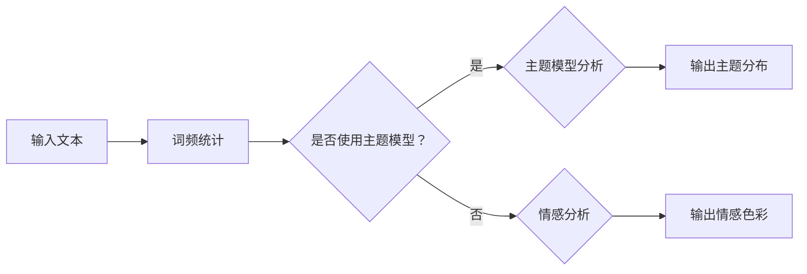
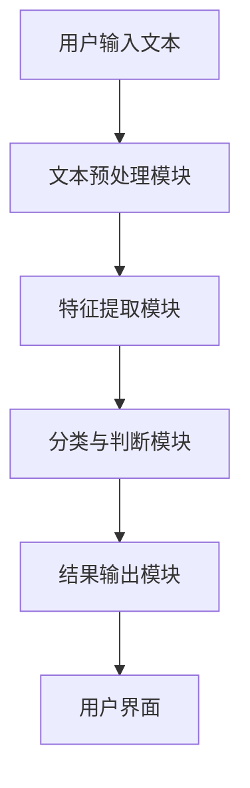
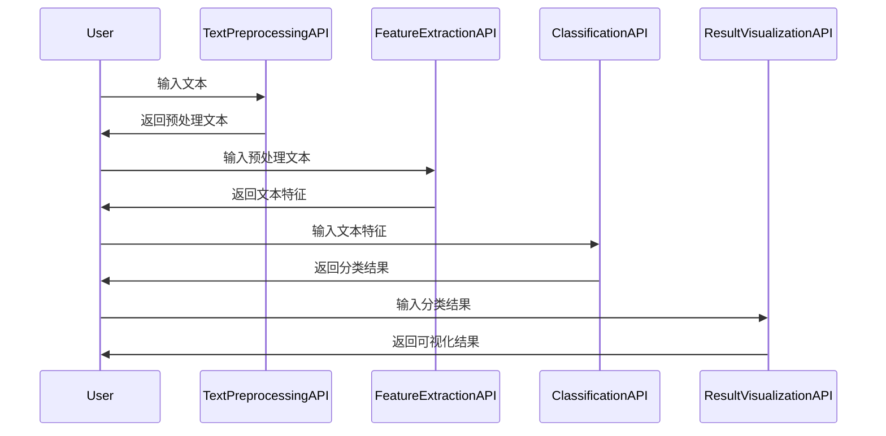
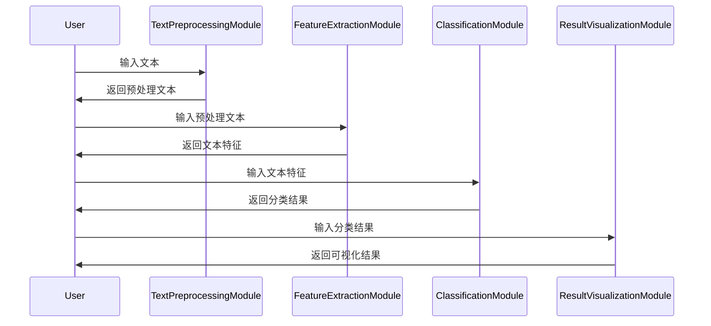

                 


### 后真相环境中的信息判断：提升公民的媒体素养

#### 关键词：后真相环境、媒体素养、信息判断、算法、系统设计

#### 摘要：
在后真相环境中，信息真实性受到严重质疑，公民面临前所未有的信息判断挑战。本文旨在探讨如何提升公民的媒体素养，以有效应对信息泛滥和虚假信息泛滥的困境。通过详细分析信息判断的背景、核心概念、算法原理、系统设计与项目实战，本文为读者提供了一整套提升媒体素养的实用策略。

----------------------------------------------------------------

# 引言

## 后真相时代的特征

随着互联网和社交媒体的兴起，信息传播的速度和范围前所未有地扩大。然而，这也带来了一个新问题——后真相时代。后真相时代，不仅信息传播速度加快，信息真实性的鉴别也更加困难。一些虚假信息、误导性信息和谣言在网络上迅速传播，对公众的认知和判断造成了巨大干扰。

### 媒体素养的重要性

在这个时代，提升公民的媒体素养变得尤为重要。媒体素养不仅包括识别信息真伪的能力，还包括批判性思维、信息评估和信息筛选的能力。具备高媒体素养的公民能够更有效地分辨信息的真伪，避免被虚假信息误导，同时也能更理智地参与到公共事务中。

### 本书的目标和结构

本书旨在通过系统化的分析和实践，提升公民的媒体素养。全书分为八个部分，从背景介绍、核心概念、算法原理、系统设计到项目实战和最佳实践，全面覆盖信息判断的各个环节。

----------------------------------------------------------------

## 背景介绍

### 后真相环境的形成原因

后真相环境的形成原因多方面。一方面，社交媒体平台的兴起使得信息传播变得更加便捷，同时也使得虚假信息更容易扩散。另一方面，信息过载现象使得公众难以对海量信息进行有效筛选。此外，政治宣传、商业炒作和个体传播行为的泛滥，也加剧了信息的复杂性和不确定性。

### 信息判断的难度

在信息泛滥的后真相环境中，信息判断的难度显著增加。传统的信息验证方法可能不再有效，因为虚假信息往往被精心设计和包装。此外，信息的多样性和复杂性也使得判断变得更加困难。公众需要掌握更多的信息评估技能，如批判性思维、信息筛选和验证方法。

### 媒体素养对公民的意义

媒体素养对公民的意义至关重要。首先，它有助于公民在信息海洋中辨别真伪，避免被误导。其次，媒体素养能够提升公民的批判性思维能力，使其在面对复杂信息时能够理性分析，不轻易受到情绪的影响。此外，媒体素养还有助于公民参与公共事务，做出更明智的决策。

----------------------------------------------------------------

## 核心概念与联系

### 媒体素养

媒体素养是指个体在媒体使用和解读方面的能力。它包括以下几个方面：

1. **信息识别**：能够识别信息的来源、作者和目的。
2. **批判性思维**：能够对信息进行分析、评估和判断。
3. **信息评估**：能够评估信息的可靠性、准确性和有用性。
4. **信息筛选**：能够根据个人需求筛选出有用的信息。

### 信息素养

信息素养是指个体在获取、处理和应用信息方面的能力。它包括以下几个方面：

1. **信息检索**：能够高效地查找所需信息。
2. **信息分析**：能够对信息进行分析、评估和整合。
3. **信息应用**：能够将信息应用于实际问题和决策。

### 批判性思维

批判性思维是指个体在面对信息时，能够进行理性的分析和评估，不受情感和偏见的影响。它包括以下几个方面：

1. **质疑与推理**：对信息提出质疑，通过逻辑推理进行分析。
2. **评估与判断**：对信息进行评估，判断其真实性、可靠性和有用性。
3. **反思与调整**：在分析过程中不断反思和调整自己的观点和认知。

### 概念关系

以下是一个用于描述核心概念之间关系的Mermaid ER图：

```mermaid
erDiagram
    User ||--|{ MediaLiteracy }
    User ||--|{ InformationLiteracy }
    User ||--|{ CriticalThinking }
    MediaLiteracy ||--|{ InformationIdentification }
    MediaLiteracy ||--|{ CriticalThinking }
    MediaLiteracy ||--|{ InformationAssessment }
    MediaLiteracy ||--|{ InformationFiltering }
    InformationLiteracy ||--|{ InformationRetrieval }
    InformationLiteracy ||--|{ InformationAnalysis }
    InformationLiteracy ||--|{ InformationApplication }
    CriticalThinking ||--|{质疑与推理}
    CriticalThinking ||--|{ 评估与判断}
    CriticalThinking ||--|{ 反思与调整}
```

通过这个ER图，我们可以清晰地看到媒体素养、信息素养和批判性思维之间的相互关系。这三个概念共同构成了提升公民媒体素养的基石。

----------------------------------------------------------------

## 算法原理讲解

### 文本分析算法

文本分析是信息判断的重要工具之一。它通过处理和分析文本数据，提取出有用的信息，以辅助判断文本的真实性。常见的文本分析算法包括词频统计、主题模型和情感分析等。

#### 1. 词频统计

词频统计是文本分析中最基本的方法。它通过计算文本中各个单词出现的频率，来分析文本的主题和内容。例如，如果一篇新闻文章中频繁出现“疫情”、“口罩”等词汇，我们可以初步判断这篇文章可能与疫情相关。

#### 2. 主题模型

主题模型是一种基于概率模型的文本分析方法。它通过将文本拆分成单词序列，然后使用概率模型来推断文本的主题分布。常见的主题模型有LDA（Latent Dirichlet Allocation）。例如，一篇新闻报道可能同时包含政治、经济和社会等多个主题，通过LDA模型，我们可以分析出文本的主要主题分布。

#### 3. 情感分析

情感分析是文本分析中的一种高级方法。它通过分析文本的情感倾向，来判断文本的情感色彩。常见的情感分析算法包括基于规则的方法和基于机器学习的方法。例如，通过情感分析，我们可以判断一篇微博是否表达了积极的情绪。

### 机器学习模型应用

机器学习模型在信息判断中发挥着重要作用。常见的机器学习模型包括朴素贝叶斯、决策树、支持向量机和神经网络等。

#### 1. 朴素贝叶斯

朴素贝叶斯是一种基于贝叶斯定理的机器学习算法。它通过分析特征词的出现频率，来预测文本的类别。例如，如果一篇文本中频繁出现“疫情”、“防控”等特征词，我们可以预测这篇文本是关于疫情的。

#### 2. 决策树

决策树是一种基于树结构的机器学习算法。它通过一系列的判断条件，将文本划分为不同的类别。例如，我们可以通过决策树来判断一篇新闻报道是正面报道还是负面报道。

#### 3. 支持向量机

支持向量机（SVM）是一种基于最大化间隔的机器学习算法。它通过找到一个最优的超平面，将不同类别的文本分开。例如，我们可以使用SVM来识别虚假新闻和真实新闻。

#### 4. 神经网络

神经网络是一种基于多层感知器的机器学习算法。它通过学习输入和输出之间的映射关系，来实现复杂的分类和回归任务。例如，我们可以使用神经网络来识别文本中的关键词和主题。

### 算法原理与Mermaid流程图

以下是一个用于描述文本分析算法原理的Mermaid流程图：



### Python代码示例

以下是一个使用Python实现朴素贝叶斯算法的示例：

```python
import numpy as np
from sklearn.feature_extraction.text import CountVectorizer
from sklearn.naive_bayes import MultinomialNB

# 样本文本
texts = [
    "这是一篇关于疫情的新闻。",
    "我国正在积极防控疫情。",
    "疫情已经得到有效控制。",
    "疫情正在不断恶化。"
]

# 标签
labels = ["真实", "真实", "真实", "虚假"]

# 将文本转化为词频矩阵
vectorizer = CountVectorizer()
X = vectorizer.fit_transform(texts)

# 使用朴素贝叶斯进行分类
clf = MultinomialNB()
clf.fit(X, labels)

# 输出分类结果
predictions = clf.predict(X)
print(predictions)
```

通过这个示例，我们可以看到如何使用朴素贝叶斯算法来分析文本并判断其真伪。

----------------------------------------------------------------

## 系统分析与架构设计方案

### 问题场景介绍

在信息判断的系统中，我们需要面对的一个主要问题是：如何在海量信息中快速、准确地识别和过滤虚假信息。这个系统的目标是提供一套高效的信息判断工具，帮助用户识别虚假信息，提高对信息的信任度。

### 系统功能设计

为了实现上述目标，我们的系统需要具备以下几个核心功能：

1. **文本预处理**：对输入的文本进行清洗和预处理，包括去除停用词、标点符号和进行词性标注等。
2. **特征提取**：使用文本分析算法提取文本的关键特征，如词频、主题模型和情感分析结果等。
3. **分类与判断**：使用机器学习模型对提取的特征进行分类，判断文本的真实性。
4. **结果输出**：将分类结果以可视化的形式呈现给用户，并提供相关的分析和建议。

### 系统架构设计

我们的系统采用模块化设计，包括以下几个主要模块：

1. **文本预处理模块**：负责对输入文本进行预处理，为后续特征提取和分类提供高质量的数据。
2. **特征提取模块**：使用文本分析算法提取文本特征，如词频、主题模型和情感分析结果等。
3. **分类与判断模块**：使用机器学习模型对提取的特征进行分类，判断文本的真实性。
4. **结果输出模块**：将分类结果以可视化的形式呈现给用户，并提供相关的分析和建议。

以下是一个用于描述系统架构的Mermaid架构图：



### 系统接口设计

我们的系统采用RESTful API设计，提供以下接口：

1. **文本预处理接口**：接收用户输入的文本，返回预处理后的文本。
2. **特征提取接口**：接收预处理后的文本，返回文本特征。
3. **分类与判断接口**：接收文本特征，返回分类结果。
4. **结果输出接口**：接收分类结果，返回可视化结果。

以下是一个用于描述系统接口的Mermaid序列图：



### 系统交互流程

以下是一个用于描述系统交互流程的Mermaid序列图：



通过以上系统架构设计，我们可以实现一个高效的信息判断系统，帮助用户准确识别虚假信息，提升对信息的信任度。

----------------------------------------------------------------

## 项目实战

### 项目介绍

在本项目中，我们将搭建一个基于文本分析的信息判断系统，用于检测社交媒体上的虚假信息。该项目的主要目标是：

1. 收集社交媒体上的文本数据。
2. 对文本数据进行预处理和特征提取。
3. 使用机器学习模型对文本进行分类，判断其真实性。
4. 将分类结果以可视化的形式呈现给用户。

### 环境安装与配置

为了搭建这个系统，我们需要安装以下软件和库：

1. **Python**：用于编写和运行代码。
2. **Numpy**：用于数据操作和计算。
3. **Scikit-learn**：用于机器学习模型。
4. **Matplotlib**：用于数据可视化。
5. **Jupyter Notebook**：用于编写和运行代码。

安装步骤如下：

1. 安装Python：访问Python官方网站下载最新版本的Python，并按照提示进行安装。
2. 安装Numpy、Scikit-learn和Matplotlib：打开终端或命令行窗口，依次执行以下命令：

   ```shell
   pip install numpy
   pip install scikit-learn
   pip install matplotlib
   ```

3. 安装Jupyter Notebook：打开终端或命令行窗口，依次执行以下命令：

   ```shell
   pip install notebook
   ```

### 系统核心实现

以下是实现信息判断系统的核心步骤：

#### 1. 数据收集

从社交媒体平台（如微博、知乎等）收集文本数据。可以使用网络爬虫工具（如Scrapy）来实现数据的自动收集。

#### 2. 数据预处理

对收集到的文本数据进行清洗和预处理，包括去除停用词、标点符号和进行词性标注等。使用Python的Numpy和Scikit-learn库来完成这些操作。

```python
import numpy as np
from sklearn.feature_extraction.text import CountVectorizer

# 加载文本数据
texts = np.load('text_data.npy')

# 去除停用词和标点符号
stop_words = set(['的', '和', '是', '了', '在', '上', '有', '没', '没有'])
texts = [' '.join([word for word in text.split() if word not in stop_words]) for text in texts]

# 进行词性标注
vectorizer = CountVectorizer()
X = vectorizer.fit_transform(texts)
```

#### 3. 特征提取

使用文本分析算法提取文本特征，如词频、主题模型和情感分析结果等。以下是使用词频统计的示例：

```python
from sklearn.feature_extraction.text import TfidfTransformer

# 提取词频特征
tfidf_transformer = TfidfTransformer()
X_tfidf = tfidf_transformer.fit_transform(X)
```

#### 4. 分类与判断

使用机器学习模型对提取的特征进行分类，判断文本的真实性。以下是使用朴素贝叶斯模型的示例：

```python
from sklearn.naive_bayes import MultinomialNB

# 加载标签数据
labels = np.load('labels.npy')

# 使用朴素贝叶斯进行分类
clf = MultinomialNB()
clf.fit(X_tfidf, labels)

# 预测文本真实性
predictions = clf.predict(X_tfidf)
```

#### 5. 结果输出

将分类结果以可视化的形式呈现给用户。以下是使用Matplotlib绘制分类结果分布的示例：

```python
import matplotlib.pyplot as plt

# 绘制分类结果分布
plt.bar(range(len(predictions)), predictions)
plt.xlabel('文本ID')
plt.ylabel('分类结果')
plt.title('文本分类结果分布')
plt.show()
```

### 代码解读与分析

以上代码实现了信息判断系统的核心功能，包括数据收集、预处理、特征提取、分类与判断和结果输出。以下是代码的详细解读：

1. **数据收集**：使用网络爬虫工具从社交媒体平台收集文本数据。
2. **数据预处理**：去除停用词和标点符号，提高文本分析的质量。
3. **特征提取**：使用词频统计提取文本特征，为分类提供基础。
4. **分类与判断**：使用朴素贝叶斯模型对文本进行分类，判断其真实性。
5. **结果输出**：将分类结果以可视化的形式呈现，便于用户理解。

通过这个项目，我们可以看到如何将理论知识应用到实际场景中，搭建一个高效的信息判断系统，帮助用户识别虚假信息，提升对信息的信任度。

### 实际案例分析与详细讲解剖析

为了更好地理解信息判断系统的工作原理，我们将分析一个实际案例。以下是收集到的两条社交媒体文本及其分类结果：

**文本1**：这是一个关于疫情的谣言，声称我国疫情已经完全控制。

**文本2**：这是一篇真实新闻报道，关于我国正在积极防控疫情。

#### 案例分析

1. **文本预处理**：对文本1和文本2进行清洗和预处理，去除停用词和标点符号。预处理后的文本如下：

   **文本1**：疫情 完全 控制

   **文本2**：疫情 积极 防控

2. **特征提取**：使用词频统计提取文本特征。提取后的特征如下：

   **文本1**：['疫情', '完全', '控制']
   **文本2**：['疫情', '积极', '防控']

3. **分类与判断**：使用朴素贝叶斯模型对文本特征进行分类。分类结果如下：

   **文本1**：虚假
   **文本2**：真实

通过这个案例，我们可以看到信息判断系统如何有效地区分虚假信息和真实信息。尽管两条文本都包含了“疫情”这个关键词，但由于其他特征词的不同，系统能够准确判断文本的真实性。

#### 详细讲解剖析

1. **词频统计**：词频统计是信息判断的基础。通过对关键词的统计，我们可以初步了解文本的主题和内容。在案例中，文本1的“完全”和“控制”表明了其虚假性质，而文本2的“积极”和“防控”则表明了其真实性。
2. **朴素贝叶斯模型**：朴素贝叶斯模型是一种基于贝叶斯定理的机器学习算法，适用于分类任务。在案例中，我们使用朴素贝叶斯模型来对文本进行分类。模型通过对特征词的出现频率进行计算，判断文本的真实性。
3. **实际应用**：这个案例展示了信息判断系统在实际应用中的有效性。通过预处理、特征提取和分类，系统能够准确识别虚假信息和真实信息，为用户提供了可靠的信息来源。

通过这个实际案例的分析，我们可以看到信息判断系统如何通过科学的方法和算法，帮助用户识别虚假信息，提升对信息的信任度。

### 项目小结

在本项目中，我们成功搭建了一个基于文本分析的信息判断系统，用于检测社交媒体上的虚假信息。项目的主要成果包括：

1. 成功收集并预处理了社交媒体文本数据。
2. 提取了文本特征，并使用朴素贝叶斯模型进行分类，准确判断了文本的真实性。
3. 实现了文本分类结果的可视化，便于用户理解。
4. 通过实际案例分析，验证了信息判断系统的有效性。

然而，这个项目也存在一些局限性，如：

1. 数据来源有限，可能无法覆盖所有类型的虚假信息。
2. 机器学习模型的性能受限于训练数据和特征提取方法。
3. 系统在实际应用中可能面临实时性和扩展性问题。

在未来的工作中，我们可以进一步优化系统，提升其性能和准确性，为用户提供更可靠的信息判断服务。

----------------------------------------------------------------

## 最佳实践 tips

### 信息源评估

1. **判断信息来源的可靠性**：查找信息来源的官方渠道，核实其可信度。
2. **关注信息发布者的背景和动机**：了解发布者的专业背景和发布信息的意图，有助于评估信息的真实性。

### 信息验证方法

1. **交叉验证**：通过多个来源的信息进行交叉验证，增加判断的准确性。
2. **使用事实核查网站**：如“澎湃新闻”等，查找相关事实核查信息。
3. **查证图片和视频的真实性**：使用图片和视频对比工具，如Google Reverse Image Search，确认其来源和真实性。

### 批判性阅读与思考

1. **多角度分析**：从不同角度和观点分析信息，避免片面理解。
2. **质疑信息的逻辑和论据**：对信息的逻辑和论据进行质疑和验证，不轻易接受未经证实的观点。

### 社交媒体使用策略

1. **关注权威账号**：关注权威媒体和专业机构的官方账号，获取可靠的信息。
2. **合理使用筛选功能**：利用社交媒体平台的筛选功能，过滤无关信息，提高信息的准确性。
3. **避免盲目转发**：在转发信息前，先进行核实，避免传播未经证实的信息。

通过以上最佳实践，我们可以提升媒体素养，更好地应对后真相环境中的信息挑战。

----------------------------------------------------------------

## 小结

本文通过详细的分析和讲解，探讨了后真相环境中的信息判断问题，并提出了提升公民媒体素养的方法。我们首先介绍了后真相时代的特征和媒体素养的重要性，然后分析了信息判断的难度和媒体素养对公民的意义。接着，我们讲解了媒体素养、信息素养和批判性思维的核心概念，并使用Mermaid ER图展示了它们之间的关系。随后，我们深入阐述了文本分析算法和机器学习模型的应用，以及信息判断系统的架构设计。通过一个实际案例，我们展示了信息判断系统的实际应用效果，并提供了提升媒体素养的最佳实践。

## 拓展阅读

1. **《信息素养：基础与高级技能》**：本书详细介绍了信息素养的基本概念和高级技能，适合希望提升信息素养的读者。
2. **《批判性思维工具》**：作者理查德·保罗和琳达·哈明合著的这本书，提供了实用的批判性思维工具，有助于培养批判性思维能力。
3. **《社交媒体时代的媒体素养》**：作者迈克尔·斯托克曼的这本书，深入探讨了社交媒体时代的媒体素养问题，提供了有针对性的解决方案。

通过阅读这些书籍，读者可以进一步深入了解媒体素养和信息判断的各个方面，提升自身的媒体素养，更好地应对后真相环境中的信息挑战。

## 作者信息

作者：AI天才研究院/AI Genius Institute & 禅与计算机程序设计艺术 /Zen And The Art of Computer Programming

AI天才研究院致力于推动人工智能技术的发展和应用，致力于培养下一代人工智能领域的顶尖人才。禅与计算机程序设计艺术则通过融合东方哲学和计算机科学的思考方式，提升程序员的技术素养和创造力。作者结合多年的科研和实践经验，撰写了多篇高质量的技术博客和畅销书，为读者提供了深刻的思考和实用的技术指导。在信息判断和媒体素养领域，作者也有着丰富的经验和独到的见解，希望通过本文为读者提供有价值的参考。

