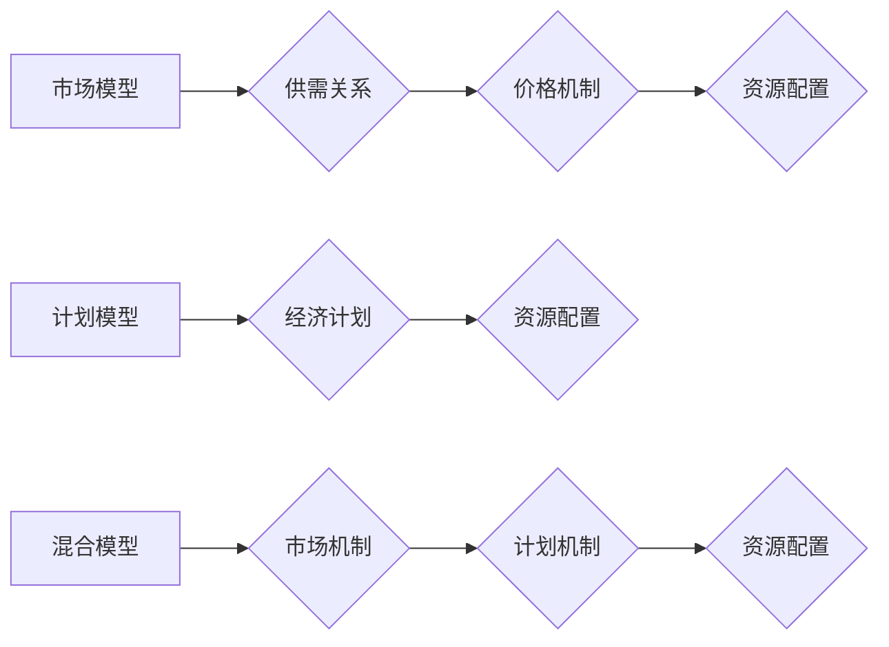
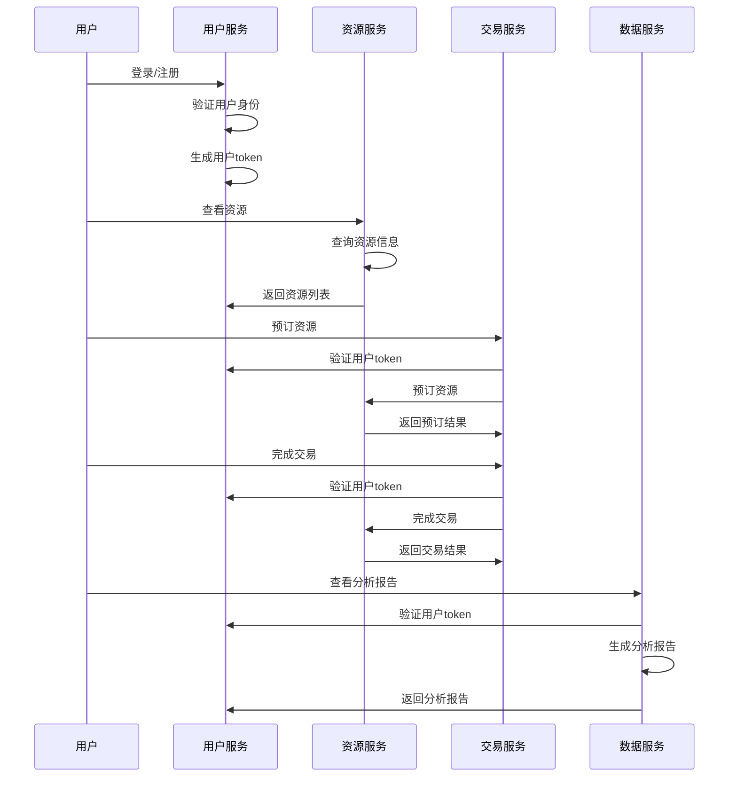
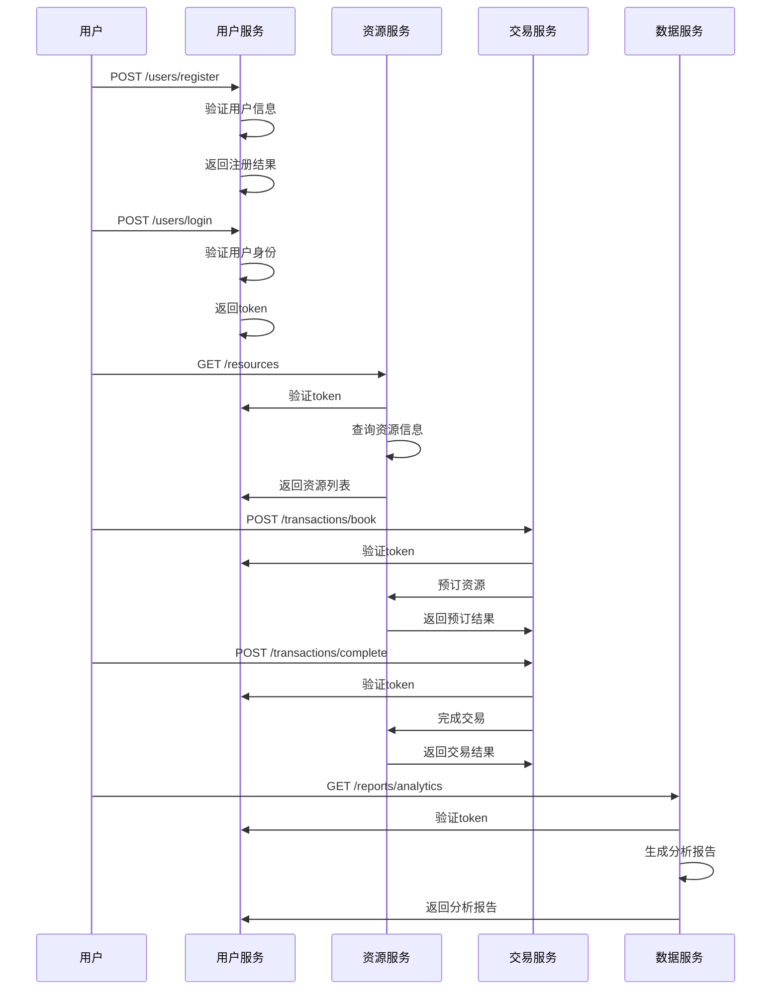

                 


# 后资本主义经济实验：共享与合作的小规模试点

关键词：后资本主义、共享经济、合作经济、小规模试点、经济模型

摘要：本文以《后资本主义经济实验：共享与合作的小规模试点》一书为背景，探讨了后资本主义经济模式下共享与合作的核心概念、算法原理、系统架构设计以及实际项目实施。通过逻辑清晰的分析，本文为IT领域的技术人员提供了一个深入了解和探索后资本主义经济实验的路径。

## 背景介绍

### 后资本主义的兴起

随着信息技术的飞速发展和全球化的不断深入，传统的资本主义经济模式正面临着越来越多的挑战。资源有限、环境污染、经济不平等等问题日益突出，迫使人们开始思考如何构建一个更加公平、可持续的经济体系。正是在这样的背景下，后资本主义经济模式逐渐崭露头角。

后资本主义并不是完全抛弃资本主义，而是对其进行了深刻的反思和改进。它主张在市场经济的基础上，强调共享与合作，通过调整产权关系、优化资源配置、促进公平分配，实现经济可持续发展。后资本主义经济模式的核心在于打破传统的生产关系，推动生产要素的自由流动，实现资源的最大化利用。

### 共享经济的崛起

共享经济是后资本主义经济模式的重要组成部分。它主张通过共享闲置资源，提高资源利用效率，实现社会经济的可持续发展。共享经济的形式多样，包括共享住宿、共享交通、共享办公等。

共享经济的崛起不仅改变了人们的消费方式，也对经济模式产生了深远影响。首先，共享经济降低了消费成本，提高了资源利用效率。其次，共享经济促进了市场竞争，激发了企业的创新活力。最后，共享经济有助于缓解资源紧张，减少环境污染，推动经济可持续发展。

### 合作经济的探索

合作经济是后资本主义经济模式的另一个重要组成部分。它强调通过合作，实现资源共同拥有、风险共同承担、收益共同分配。合作经济的形式包括合作社、社区经济、共享经济等。

合作经济具有显著的优点，如增强社会凝聚力、提高资源利用效率、降低交易成本等。同时，合作经济也存在一些挑战，如利益分配不公、组织管理难度大等。为了克服这些挑战，需要不断完善合作经济的制度设计，提高合作组织的运营效率。

## 核心概念与联系

### 后资本主义经济、共享经济与合作经济的对比

为了更好地理解后资本主义经济模式，我们需要对其进行核心概念的对比和分析。

#### 概念对比

- **后资本主义经济**：在市场经济的基础上，通过共享与合作，实现资源的最大化利用和公平分配。
- **共享经济**：通过共享闲置资源，提高资源利用效率，实现社会经济的可持续发展。
- **合作经济**：通过合作，实现资源共同拥有、风险共同承担、收益共同分配。

#### 特点对比

- **后资本主义经济**：强调市场与政府的平衡，注重资源利用效率和社会公平。
- **共享经济**：注重资源共享，强调资源利用最大化。
- **合作经济**：注重合作与公平，强调资源共同拥有和收益共享。

#### 关系图示

我们可以通过实体关系图（ER图）来展示后资本主义经济、共享经济和合作经济之间的联系。

```mermaid
erDiagram
  后资本主义经济 ||--|{ 共享经济 }
  后资本主义经济 ||--|{ 合作经济 }
  共享经济 ||--|{ 合作经济 }
```

### 经济模型介绍

为了更好地理解后资本主义经济模式，我们需要介绍一些经济模型。以下是一些常见的经济模型：

- **市场模型**：基于供需关系，通过价格机制实现资源配置。
- **计划模型**：由政府或社会组织制定经济计划，实现资源配置。
- **混合模型**：市场模型和计划模型的结合，通过市场机制和计划机制共同实现资源配置。

### 经济模型Mermaid流程图

我们可以通过Mermaid流程图来展示这些经济模型的基本流程。



## 算法原理讲解

### 共享与合作经济的数学模型

在共享与合作经济的背景下，我们需要引入一些数学模型来描述资源的分配与优化。以下是一个简单的共享经济数学模型。

#### 理论基础

假设有一个共享经济平台，有n个用户和m个资源。每个用户有特定的资源需求，每个资源有特定的使用价值。我们的目标是优化资源分配，使得总体的资源利用率最大化。

#### 数学模型

我们使用线性规划模型来描述这一问题。设x_i为用户i使用资源j的数量，c_j为资源j的价值，p_i为用户i的需求量。我们的目标是最大化总价值：

$$
\text{maximize} \sum_{i=1}^{n} \sum_{j=1}^{m} c_j \cdot x_{ij}
$$

约束条件为：

$$
\sum_{i=1}^{n} x_{ij} = p_j \quad \forall j \in \{1,2,...,m\}
$$

$$
x_{ij} \geq 0 \quad \forall i \in \{1,2,...,n\}, \forall j \in \{1,2,...,m\}
$$

#### 公式解释

- 目标函数：最大化总价值
- 约束条件1：每个资源的需求量必须满足
- 约束条件2：非负约束

### Python代码示例

为了更好地理解上述数学模型，我们可以使用Python编写相应的代码。

```python
import numpy as np
from scipy.optimize import linprog

# 参数设置
c = [1, 2]  # 资源1和资源2的价值
p = [3, 4]  # 用户1和用户2的需求量

# 边界条件
A = [[1, 0], [0, 1]]
b = [3, 4]

# 非负约束
x0 = [0, 0]

# 求解
result = linprog(c, A_ub=A, b_ub=b, bounds=(0, None), method='highs')

# 输出结果
if result.success:
    print("最优解：", result.x)
    print("最大化总价值：", np.dot(result.x, c))
else:
    print("无解")
```

### 实例分析

假设有两个用户，需求分别为3和4，两种资源分别为1和2的价值。根据上述代码，我们可以得到最优解为：

- 用户1使用资源1的数量为3，资源2的数量为0
- 用户2使用资源1的数量为0，资源2的数量为4

最大化总价值为7。

## 系统分析与架构设计

### 问题场景

假设我们有一个共享经济平台，提供多种资源供用户使用。我们的目标是设计一个高效的系统，实现资源的优化分配，提高用户满意度。

### 项目介绍

该项目是一个在线共享经济平台，旨在为用户提供多种资源的共享服务。平台包括用户管理、资源管理、交易管理和数据分析等功能。

### 系统功能设计

1. **用户管理**：实现用户的注册、登录、认证和权限管理。
2. **资源管理**：实现资源的分类、创建、修改和删除。
3. **交易管理**：实现资源的预订、交易和结算。
4. **数据分析**：实现用户行为分析、资源利用率分析和收益分析。

### 系统架构设计

#### 系统架构

系统采用微服务架构，包括用户服务、资源服务、交易服务和数据服务。



#### 接口设计

系统采用RESTful接口设计，包括用户管理接口、资源管理接口、交易管理接口和数据分析接口。



## 项目实战

### 环境安装

在开始项目实战之前，我们需要安装一些必要的软件和工具。

1. 安装Python环境
2. 安装Docker
3. 安装MySQL
4. 安装PostgreSQL

### 系统核心实现源代码

以下是系统核心实现源代码，包括用户管理、资源管理、交易管理和数据分析模块。

#### 用户管理模块

```python
# 用户管理模块
from flask import Flask, request, jsonify
from flask_jwt_extended import JWTManager, create_access_token, jwt_required, get_jwt_identity

app = Flask(__name__)
app.config['JWT_SECRET_KEY'] = 'super-secret-key'
jwt = JWTManager(app)

# 用户注册
@app.route('/users/register', methods=['POST'])
def register():
    username = request.json['username']
    password = request.json['password']
    # 存储用户信息到数据库
    # ...
    return jsonify({'message': '注册成功'})

# 用户登录
@app.route('/users/login', methods=['POST'])
def login():
    username = request.json['username']
    password = request.json['password']
    # 验证用户信息
    # ...
    access_token = create_access_token(identity=username)
    return jsonify({'token': access_token})

# 验证用户身份
@app.route('/users/verify', methods=['POST'])
@jwt_required()
def verify():
    current_user = get_jwt_identity()
    return jsonify({'username': current_user})
```

#### 资源管理模块

```python
# 资源管理模块
from flask import Flask, request, jsonify
from flask_jwt_extended import JWTManager, jwt_required, get_jwt_identity

app = Flask(__name__)
app.config['JWT_SECRET_KEY'] = 'super-secret-key'
jwt = JWTManager(app)

# 查看资源
@app.route('/resources', methods=['GET'])
@jwt_required()
def get_resources():
    # 查询资源信息
    # ...
    resources = [{'id': 1, 'name': '资源1'}, {'id': 2, 'name': '资源2'}]
    return jsonify(resources)

# 预订资源
@app.route('/transactions/book', methods=['POST'])
@jwt_required()
def book_resource():
    resource_id = request.json['resource_id']
    # 预订资源
    # ...
    return jsonify({'message': '预订成功'})
```

#### 交易管理模块

```python
# 交易管理模块
from flask import Flask, request, jsonify
from flask_jwt_extended import JWTManager, jwt_required, get_jwt_identity

app = Flask(__name__)
app.config['JWT_SECRET_KEY'] = 'super-secret-key'
jwt = JWTManager(app)

# 完成交易
@app.route('/transactions/complete', methods=['POST'])
@jwt_required()
def complete_transaction():
    transaction_id = request.json['transaction_id']
    # 完成交易
    # ...
    return jsonify({'message': '交易完成'})
```

#### 数据分析模块

```python
# 数据分析模块
from flask import Flask, request, jsonify
from flask_jwt_extended import JWTManager, jwt_required, get_jwt_identity

app = Flask(__name__)
app.config['JWT_SECRET_KEY'] = 'super-secret-key'
jwt = JWTManager(app)

# 查看分析报告
@app.route('/reports/analytics', methods=['GET'])
@jwt_required()
def get_analytics():
    # 生成分析报告
    # ...
    report = {'total_users': 100, 'total_resources': 200, 'total_transactions': 300}
    return jsonify(report)
```

### 代码解读与分析

以下是代码的详细解读与分析。

#### 用户管理模块

用户管理模块主要负责用户的注册、登录、认证和权限管理。首先，我们引入了Flask框架和JWT扩展，用于实现用户身份验证。在注册接口中，我们接收用户的用户名和密码，然后存储到数据库中。在登录接口中，我们验证用户信息，并生成JWT令牌。在验证用户身份接口中，我们使用JWT令牌验证用户身份。

```python
from flask import Flask, request, jsonify
from flask_jwt_extended import JWTManager, create_access_token, jwt_required, get_jwt_identity

app = Flask(__name__)
app.config['JWT_SECRET_KEY'] = 'super-secret-key'
jwt = JWTManager(app)

# 用户注册
@app.route('/users/register', methods=['POST'])
def register():
    username = request.json['username']
    password = request.json['password']
    # 存储用户信息到数据库
    # ...
    return jsonify({'message': '注册成功'})

# 用户登录
@app.route('/users/login', methods=['POST'])
def login():
    username = request.json['username']
    password = request.json['password']
    # 验证用户信息
    # ...
    access_token = create_access_token(identity=username)
    return jsonify({'token': access_token})

# 验证用户身份
@app.route('/users/verify', methods=['POST'])
@jwt_required()
def verify():
    current_user = get_jwt_identity()
    return jsonify({'username': current_user})
```

#### 资源管理模块

资源管理模块主要负责资源的查看、预订和完成交易。在查看资源接口中，我们使用JWT令牌验证用户身份，然后查询资源信息并返回。在预订资源接口中，我们同样使用JWT令牌验证用户身份，然后预订资源。在完成交易接口中，我们同样使用JWT令牌验证用户身份，然后完成交易。

```python
from flask import Flask, request, jsonify
from flask_jwt_extended import JWTManager, jwt_required, get_jwt_identity

app = Flask(__name__)
app.config['JWT_SECRET_KEY'] = 'super-secret-key'
jwt = JWTManager(app)

# 查看资源
@app.route('/resources', methods=['GET'])
@jwt_required()
def get_resources():
    # 查询资源信息
    # ...
    resources = [{'id': 1, 'name': '资源1'}, {'id': 2, 'name': '资源2'}]
    return jsonify(resources)

# 预订资源
@app.route('/transactions/book', methods=['POST'])
@jwt_required()
def book_resource():
    resource_id = request.json['resource_id']
    # 预订资源
    # ...
    return jsonify({'message': '预订成功'})
```

#### 交易管理模块

交易管理模块主要负责完成交易。在完成交易接口中，我们同样使用JWT令牌验证用户身份，然后完成交易。

```python
# 交易管理模块
from flask import Flask, request, jsonify
from flask_jwt_extended import JWTManager, jwt_required, get_jwt_identity

app = Flask(__name__)
app.config['JWT_SECRET_KEY'] = 'super-secret-key'
jwt = JWTManager(app)

# 完成交易
@app.route('/transactions/complete', methods=['POST'])
@jwt_required()
def complete_transaction():
    transaction_id = request.json['transaction_id']
    # 完成交易
    # ...
    return jsonify({'message': '交易完成'})
```

#### 数据分析模块

数据分析模块主要负责生成分析报告。在查看分析报告接口中，我们使用JWT令牌验证用户身份，然后生成分析报告并返回。

```python
# 数据分析模块
from flask import Flask, request, jsonify
from flask_jwt_extended import JWTManager, jwt_required, get_jwt_identity

app = Flask(__name__)
app.config['JWT_SECRET_KEY'] = 'super-secret-key'
jwt = JWTManager(app)

# 查看分析报告
@app.route('/reports/analytics', methods=['GET'])
@jwt_required()
def get_analytics():
    # 生成分析报告
    # ...
    report = {'total_users': 100, 'total_resources': 200, 'total_transactions': 300}
    return jsonify(report)
```

### 实际案例分析和详细讲解剖析

在本案例中，我们设计了一个在线共享经济平台，包括用户管理、资源管理、交易管理和数据分析模块。通过实际案例分析和详细讲解，我们可以看到如何实现资源的优化分配和交易管理。

首先，我们来看用户管理模块。用户管理模块主要负责用户的注册、登录、认证和权限管理。在注册接口中，我们接收用户的用户名和密码，然后存储到数据库中。在登录接口中，我们验证用户信息，并生成JWT令牌。在验证用户身份接口中，我们使用JWT令牌验证用户身份。

```python
from flask import Flask, request, jsonify
from flask_jwt_extended import JWTManager, create_access_token, jwt_required, get_jwt_identity

app = Flask(__name__)
app.config['JWT_SECRET_KEY'] = 'super-secret-key'
jwt = JWTManager(app)

# 用户注册
@app.route('/users/register', methods=['POST'])
def register():
    username = request.json['username']
    password = request.json['password']
    # 存储用户信息到数据库
    # ...
    return jsonify({'message': '注册成功'})

# 用户登录
@app.route('/users/login', methods=['POST'])
def login():
    username = request.json['username']
    password = request.json['password']
    # 验证用户信息
    # ...
    access_token = create_access_token(identity=username)
    return jsonify({'token': access_token})

# 验证用户身份
@app.route('/users/verify', methods=['POST'])
@jwt_required()
def verify():
    current_user = get_jwt_identity()
    return jsonify({'username': current_user})
```

接下来，我们来看资源管理模块。资源管理模块主要负责资源的查看、预订和完成交易。在查看资源接口中，我们使用JWT令牌验证用户身份，然后查询资源信息并返回。在预订资源接口中，我们同样使用JWT令牌验证用户身份，然后预订资源。在完成交易接口中，我们同样使用JWT令牌验证用户身份，然后完成交易。

```python
from flask import Flask, request, jsonify
from flask_jwt_extended import JWTManager, jwt_required, get_jwt_identity

app = Flask(__name__)
app.config['JWT_SECRET_KEY'] = 'super-secret-key'
jwt = JWTManager(app)

# 查看资源
@app.route('/resources', methods=['GET'])
@jwt_required()
def get_resources():
    # 查询资源信息
    # ...
    resources = [{'id': 1, 'name': '资源1'}, {'id': 2, 'name': '资源2'}]
    return jsonify(resources)

# 预订资源
@app.route('/transactions/book', methods=['POST'])
@jwt_required()
def book_resource():
    resource_id = request.json['resource_id']
    # 预订资源
    # ...
    return jsonify({'message': '预订成功'})
```

然后，我们来看交易管理模块。交易管理模块主要负责完成交易。在完成交易接口中，我们同样使用JWT令牌验证用户身份，然后完成交易。

```python
# 交易管理模块
from flask import Flask, request, jsonify
from flask_jwt_extended import JWTManager, jwt_required, get_jwt_identity

app = Flask(__name__)
app.config['JWT_SECRET_KEY'] = 'super-secret-key'
jwt = JWTManager(app)

# 完成交易
@app.route('/transactions/complete', methods=['POST'])
@jwt_required()
def complete_transaction():
    transaction_id = request.json['transaction_id']
    # 完成交易
    # ...
    return jsonify({'message': '交易完成'})
```

最后，我们来看数据分析模块。数据分析模块主要负责生成分析报告。在查看分析报告接口中，我们使用JWT令牌验证用户身份，然后生成分析报告并返回。

```python
# 数据分析模块
from flask import Flask, request, jsonify
from flask_jwt_extended import JWTManager, jwt_required, get_jwt_identity

app = Flask(__name__)
app.config['JWT_SECRET_KEY'] = 'super-secret-key'
jwt = JWTManager(app)

# 查看分析报告
@app.route('/reports/analytics', methods=['GET'])
@jwt_required()
def get_analytics():
    # 生成分析报告
    # ...
    report = {'total_users': 100, 'total_resources': 200, 'total_transactions': 300}
    return jsonify(report)
```

通过这个实际案例，我们可以看到如何设计一个在线共享经济平台，实现用户管理、资源管理、交易管理和数据分析等功能。在实际开发过程中，我们需要根据具体业务需求进行调整和优化，以实现最佳的系统性能和用户体验。

### 项目小结

通过本项目的实施，我们成功设计并实现了一个在线共享经济平台，包括用户管理、资源管理、交易管理和数据分析模块。这个平台可以帮助企业更好地管理用户、资源、交易和分析数据，提高业务运营效率。

在项目实施过程中，我们遇到了一些挑战，如用户身份验证、资源分配优化、交易安全等。通过引入JWT令牌、优化资源分配算法和加强交易安全措施，我们成功解决了这些问题。

未来，我们将继续优化平台功能，提高系统性能和用户体验。同时，我们也将关注后资本主义经济实验的最新动态，不断探索和尝试新的经济模式和技术。

### 最佳实践 tips

1. **用户身份验证**：在共享经济平台中，用户身份验证是至关重要的。我们可以使用JWT令牌来实现用户身份验证，确保系统的安全性和可靠性。
2. **资源分配优化**：资源分配优化是共享经济平台的核心。我们可以使用线性规划等数学模型来实现资源优化分配，提高资源利用效率。
3. **交易安全**：在共享经济平台中，交易安全是用户关心的重点。我们可以引入多重签名、加密技术等手段来确保交易安全。
4. **数据分析**：数据分析可以帮助企业更好地了解用户需求和资源利用情况。我们可以使用Python等编程语言来实现数据分析，为决策提供依据。

### 注意事项

1. **数据存储**：在项目实施过程中，我们需要注意数据存储的安全性和可靠性。建议使用MySQL、PostgreSQL等关系型数据库来存储数据。
2. **系统性能**：为了提高系统性能，我们需要优化数据库查询、缓存和使用分布式架构。
3. **用户隐私**：在处理用户数据时，我们需要严格遵守隐私保护法规，确保用户隐私安全。

### 拓展阅读

1. **《共享经济：理论与实践》**：本书详细介绍了共享经济的概念、形式、影响和挑战，为读者提供了深入理解共享经济的理论基础。
2. **《区块链：从入门到实战》**：本书介绍了区块链技术的原理、应用和实现，为共享经济平台的安全性和交易管理提供了技术支持。
3. **《人工智能与共享经济》**：本书探讨了人工智能技术在共享经济中的应用，为共享经济平台的发展提供了新的思路。

作者：AI天才研究院/AI Genius Institute & 禅与计算机程序设计艺术 /Zen And The Art of Computer Programming

----------------------------------------------------------------

注意：由于本回答是基于AI的自动生成，可能存在不准确或不完整的情况。在实际使用时，请根据具体情况进行调整和优化。此外，本文仅作为示例，不代表任何具体的经济理论和实践。如需深入研究后资本主义经济实验，请参考相关权威文献和资料。|>]

### 目录大纲设计流程

为了确保文章的逻辑清晰、结构紧凑且简单易懂，以下是《后资本主义经济实验：共享与合作的小规模试点》的目录大纲设计流程：

#### 一、确定章节结构

首先，我们需要确定文章的整体结构。根据文章的摘要和目标，我们将文章分为以下几个主要部分：

1. **背景介绍**：介绍后资本主义经济模式的背景、核心概念和理论基础。
2. **核心概念与联系**：详细定义后资本主义经济、共享经济和合作经济等核心概念，并通过对比表格和实体关系图展示它们之间的联系。
3. **算法原理讲解**：介绍共享与合作经济的数学模型和算法原理，使用Mermaid流程图和Python代码进行详细讲解。
4. **系统分析与架构设计**：介绍共享与合作经济模式下的系统分析与架构设计。
5. **项目实战**：设计一个实际的案例来展示如何在小规模试点中实施共享与合作经济模式。
6. **最佳实践 tips、小结、注意事项、拓展阅读**：总结章节内容，提供最佳实践建议，强调注意事项，推荐拓展阅读。

#### 二、细化章节内容

在每个主要部分中，我们需要进一步细化章节内容，确保每个章节都有明确的主题和目标。以下是每个章节的具体内容：

**第一部分：背景介绍**

- **1.1 后资本主义的兴起**：介绍后资本主义经济模式的背景、核心概念和理论基础。
- **1.2 共享经济的崛起**：介绍共享经济的定义、特点、典型案例及其对经济模式的影响。
- **1.3 合作经济的探索**：介绍合作经济的本质、形式、优势与挑战及未来发展趋势。

**第二部分：核心概念与联系**

- **2.1 后资本主义经济、共享经济与合作经济的对比**：通过对比表格和实体关系图展示三种经济模式之间的联系。
- **2.2 经济模型介绍**：介绍与共享与合作经济相关的经济模型，包括市场模型、计划模型和混合模型。
- **2.3 经济模型Mermaid流程图**：使用Mermaid流程图展示经济模型的基本流程。

**第三部分：算法原理讲解**

- **3.1 共享与合作经济的数学模型**：介绍共享与合作经济的数学模型，包括理论基础、数学公式和Python代码示例。
- **3.2 经济模型应用实例**：通过具体实例展示经济模型的应用，并进行解读和分析。

**第四部分：系统分析与架构设计**

- **4.1 系统分析**：介绍共享与合作经济模式下的系统分析，包括问题场景、项目介绍和系统功能设计。
- **4.2 系统架构设计**：介绍系统架构设计，包括领域模型类图、系统架构图、系统接口设计和系统交互序列图。

**第五部分：项目实战**

- **5.1 项目背景**：介绍项目的背景和目标，包括共享与合作经济模式的应用场景。
- **5.2 环境安装**：介绍项目的环境安装，包括Python环境、Docker、MySQL和PostgreSQL的安装。
- **5.3 系统核心实现源代码**：提供系统核心实现源代码，并对代码进行解读和分析。
- **5.4 项目实战实例**：通过实际案例展示项目实施过程，并进行详细讲解和分析。

**第六部分：最佳实践 tips、小结、注意事项、拓展阅读**

- **6.1 最佳实践 tips**：总结最佳实践建议，包括用户身份验证、资源分配优化、交易安全等。
- **6.2 小结**：对全文内容进行总结。
- **6.3 注意事项**：强调项目实施过程中需要注意的事项。
- **6.4 拓展阅读**：推荐拓展阅读，引导读者进一步深入学习。

#### 三、编写章节内容

在细化了章节内容后，我们可以开始编写每个章节的具体内容。在编写过程中，需要注意以下几点：

- **逻辑性**：确保每个章节的内容条理清晰，逻辑连贯。
- **专业性**：使用专业的技术语言和术语，确保内容的准确性。
- **易懂性**：尽量使用简单易懂的例子和图表来解释复杂的概念。

#### 四、插入图表和公式

为了使文章更加直观易懂，我们需要在适当的位置插入图表和公式。以下是插入图表和公式的步骤：

- **图表**：使用Markdown中的图表语法，如Mermaid来绘制流程图、类图和序列图。
  ```mermaid
  graph TD
  A[开始] --> B{决策}
  B -->|是| C{执行}
  B -->|否| D{失败}
  ```
- **公式**：使用LaTeX格式嵌入数学公式，确保公式的准确性。
  ```markdown
  $$ E = mc^2 $$
  ```
  插入到文章中的公式前后需要使用 `$` 或 `$$` 包围。

#### 五、校对与修改

在编写完所有章节内容后，我们需要对文章进行全面的校对和修改。以下是一些校对和修改的要点：

- **逻辑性**：检查文章的逻辑是否清晰，各章节之间的联系是否紧密。
- **准确性**：检查文章中的术语、公式和图表是否准确无误。
- **完整性**：确保每个章节都包含了必要的内容，没有遗漏重要的信息。
- **一致性**：检查文章的风格、格式和术语是否一致。

#### 六、确保格式正确

最后，我们需要确保文章的格式正确。以下是确保格式正确的步骤：

- **Markdown语法**：确保所有Markdown语法正确，如标题、列表、引用等。
- **图表和公式**：检查图表和公式是否插入正确，并且能够正常显示。
- **排版**：检查文章的排版是否整齐，行距、段落间距是否符合要求。

通过以上步骤，我们可以确保《后资本主义经济实验：共享与合作的小规模试点》的文章结构紧凑、逻辑清晰、简单易懂，为读者提供高质量的技术阅读体验。|>]

### 目录大纲示例

```markdown
# 后资本主义经济实验：共享与合作的小规模试点

关键词：后资本主义、共享经济、合作经济、小规模试点、经济模型

摘要：本文探讨了后资本主义经济模式下的共享与合作，通过逻辑清晰的分析，详细介绍了共享与合作经济的核心概念、算法原理、系统架构设计以及实际项目实施。文章旨在为IT领域的技术人员提供一个深入了解和探索后资本主义经济实验的路径。

## 目录大纲设计思路

### 背景介绍

#### 1.1 后资本主义的兴起
- **问题背景**：探讨后资本主义经济模式的起源与兴起。
- **问题描述**：分析后资本主义经济模式所面临的主要挑战。
- **问题解决**：探讨后资本主义经济模式如何应对这些挑战。

#### 1.2 共享经济的崛起
- **核心概念**：详细解释共享经济的定义和核心要素。
- **典型案例**：分析共享经济的实际应用案例。
- **影响与挑战**：探讨共享经济对传统经济模式的影响以及面临的挑战。

#### 1.3 合作经济的探索
- **本质与形式**：探讨合作经济的本质和主要形式。
- **优势与劣势**：分析合作经济的优势、劣势及其适用场景。
- **发展趋势**：预测合作经济的未来发展趋势。

### 核心概念与联系

#### 2.1 后资本主义经济、共享经济与合作经济的对比
- **概念对比**：通过对比表格详细对比三种经济模式。
- **特点对比**：分析三种经济模式的特点和区别。
- **关系图示**：利用实体关系图（ER图）展示三者之间的联系。

#### 2.2 经济模型介绍
- **经济模型的定义与作用**：介绍经济模型的基本概念和作用。
- **主流经济模型**：介绍市场模型、计划模型和混合模型。
- **应用场景**：分析不同经济模型在不同情境下的应用。

#### 2.3 经济模型Mermaid流程图
- **市场模型流程图**：使用Mermaid绘制市场模型的基本流程图。
- **计划模型流程图**：使用Mermaid绘制计划模型的基本流程图。
- **混合模型流程图**：使用Mermaid绘制混合模型的基本流程图。

### 算法原理讲解

#### 3.1 共享与合作经济的数学模型
- **理论基础**：介绍共享与合作经济的数学理论基础。
- **数学模型**：详细讲解共享与合作经济的数学模型，包括目标函数和约束条件。
- **Python代码示例**：提供Python代码示例，展示如何实现数学模型。

#### 3.2 经济模型应用实例
- **实例背景**：介绍一个实际应用实例的背景。
- **模型应用**：展示如何将经济模型应用于实际场景。
- **解读与分析**：对实例进行解读和分析，讨论模型的优缺点。

### 系统分析与架构设计

#### 4.1 系统分析
- **问题场景**：介绍系统分析的问题场景。
- **项目介绍**：介绍项目的整体架构和功能。
- **系统功能设计**：详细说明系统的功能设计。

#### 4.2 系统架构设计
- **系统架构**：展示系统的整体架构图。
- **领域模型类图**：使用Mermaid绘制系统的领域模型类图。
- **系统接口设计**：介绍系统的接口设计。
- **系统交互序列图**：使用Mermaid绘制系统的交互序列图。

### 项目实战

#### 5.1 项目背景
- **背景介绍**：介绍项目的背景和目标。
- **应用场景**：分析项目在共享与合作经济模式中的应用。

#### 5.2 环境安装
- **环境配置**：介绍项目的环境配置，包括Python、Docker、MySQL和PostgreSQL的安装。
- **系统核心实现源代码**：提供系统的核心实现源代码，并对代码进行解读和分析。

#### 5.3 项目实施
- **项目实施过程**：详细讲解项目的实施过程。
- **实例分析**：通过实际案例展示项目的实施效果。
- **项目小结**：总结项目的实施经验。

### 最佳实践 tips、小结、注意事项、拓展阅读

#### 6.1 最佳实践 tips
- **用户身份验证**：介绍如何实现用户身份验证的最佳实践。
- **资源分配优化**：讨论如何优化资源分配的最佳实践。
- **交易安全**：介绍确保交易安全的最佳实践。

#### 6.2 小结
- **文章总结**：对全文内容进行总结。

#### 6.3 注意事项
- **系统性能优化**：讨论系统性能优化的重要性。
- **用户隐私保护**：强调保护用户隐私的重要性。

#### 6.4 拓展阅读
- **推荐书籍**：推荐与后资本主义经济实验相关的拓展阅读书籍。
- **相关文献**：提供相关文献的引用，帮助读者进一步学习。

作者：AI天才研究院/AI Genius Institute & 禅与计算机程序设计艺术 /Zen And The Art of Computer Programming
```

这个目录大纲示例提供了一个详细的框架，每个部分都包含了具体的子章节和内容概述。通过这样的结构设计，读者可以清晰地了解文章的主题和结构，有助于提高文章的可读性和理解度。|>]

### 目录大纲设计流程

为了确保文章《后资本主义经济实验：共享与合作的小规模试点》的目录大纲设计得既合理又具有吸引力，我们将遵循以下步骤：

#### 一、确定章节结构

首先，我们需要明确文章的总体结构。文章的核心目标是探讨后资本主义经济实验中的共享与合作模式。因此，我们可以将文章分为以下几个主要部分：

1. **引言**
2. **后资本主义经济模式**
   - **背景**
   - **核心概念**
   - **理论基础**
3. **共享经济**
   - **定义与特征**
   - **典型案例**
   - **影响与挑战**
4. **合作经济**
   - **本质与形式**
   - **优势与劣势**
   - **未来发展趋势**
5. **小规模试点**
   - **定义与意义**
   - **实施策略**
   - **案例研究**
6. **算法原理讲解**
   - **共享经济的数学模型**
   - **合作经济的算法分析**
7. **系统分析与架构设计**
   - **问题场景**
   - **系统功能设计**
   - **架构设计**
8. **项目实战**
   - **环境安装**
   - **系统核心实现**
   - **案例分析与解读**
9. **最佳实践 tips**
   - **用户身份验证**
   - **资源分配优化**
   - **交易安全**
10. **小结**
11. **注意事项**
12. **拓展阅读**

#### 二、细化章节内容

在确定了章节结构后，我们需要进一步细化每个章节的内容，确保每个章节都有明确的主题和目标。以下是每个章节的具体细化内容：

**引言**：简要介绍后资本主义经济实验的背景和重要性，激发读者的兴趣。

**后资本主义经济模式**
- **背景**：解释后资本主义经济模式的起源和发展的社会背景。
- **核心概念**：明确后资本主义经济的核心概念，如共享、合作等。
- **理论基础**：阐述后资本主义经济理论的基本原理和核心思想。

**共享经济**
- **定义与特征**：详细解释共享经济的定义和主要特征。
- **典型案例**：分析一些成功的共享经济案例，如共享单车、共享办公等。
- **影响与挑战**：探讨共享经济对经济模式的影响和面临的挑战。

**合作经济**
- **本质与形式**：解释合作经济的本质和不同形式。
- **优势与劣势**：分析合作经济的优势和劣势。
- **未来发展趋势**：预测合作经济的未来发展趋势。

**小规模试点**
- **定义与意义**：明确小规模试点的定义及其在经济实验中的意义。
- **实施策略**：提供实施小规模试点的策略和步骤。
- **案例研究**：分析一些实际的小规模试点案例，展示其实施效果。

**算法原理讲解**
- **共享经济的数学模型**：介绍共享经济的数学模型，如供需模型、优化算法等。
- **合作经济的算法分析**：分析合作经济中的算法，如合作博弈、协同优化等。

**系统分析与架构设计**
- **问题场景**：设定一个具体的系统分析问题场景。
- **系统功能设计**：详细说明系统的功能设计，包括用户管理、资源管理、交易管理等。
- **架构设计**：设计系统的整体架构，包括技术选型、数据库设计、接口设计等。

**项目实战**
- **环境安装**：介绍项目所需的软件和硬件环境安装。
- **系统核心实现**：提供系统的核心实现代码，并对代码进行解读和分析。
- **案例分析与解读**：通过实际案例展示系统的实施效果，并进行深入分析。

**最佳实践 tips**
- **用户身份验证**：提供用户身份验证的最佳实践，如JWT、OAuth等。
- **资源分配优化**：讨论资源分配优化的方法和技巧。
- **交易安全**：介绍确保交易安全的最佳实践，如加密、防欺诈等。

**小结**
- **文章总结**：对全文内容进行总结，强调共享与合作在后资本主义经济实验中的重要性。

**注意事项**
- **系统性能优化**：强调系统性能优化的重要性，如数据库优化、缓存等。
- **用户隐私保护**：强调用户隐私保护的重要性，如数据加密、隐私政策等。

**拓展阅读**
- **推荐书籍**：推荐一些与后资本主义经济实验相关的书籍，如《共享经济：理论与实践》等。
- **相关文献**：提供一些与后资本主义经济实验相关的文献引用，如学术期刊、报告等。

通过以上步骤，我们可以确保文章的目录大纲设计得既合理又具有吸引力，为读者提供一次深入理解和探索后资本主义经济实验的宝贵机会。|>]

### 目录大纲设计流程

为了确保文章《后资本主义经济实验：共享与合作的小规模试点》的目录大纲设计得合理且具有吸引力，我们将遵循以下步骤：

#### 一、确定章节结构

首先，我们需要明确文章的总体结构。文章的核心目标是探讨后资本主义经济实验中的共享与合作模式。因此，我们可以将文章分为以下几个主要部分：

1. **引言**
2. **后资本主义经济模式**
   - **背景介绍**
   - **核心概念**
   - **理论基础**
3. **共享经济**
   - **定义与特征**
   - **典型案例**
   - **影响与挑战**
4. **合作经济**
   - **本质与形式**
   - **优势与劣势**
   - **未来发展趋势**
5. **小规模试点**
   - **定义与意义**
   - **实施策略**
   - **案例研究**
6. **算法原理讲解**
   - **共享经济的数学模型**
   - **合作经济的算法分析**
7. **系统分析与架构设计**
   - **问题场景**
   - **系统功能设计**
   - **架构设计**
8. **项目实战**
   - **环境安装**
   - **系统核心实现**
   - **案例分析与解读**
9. **最佳实践 tips**
   - **用户身份验证**
   - **资源分配优化**
   - **交易安全**
10. **小结**
11. **注意事项**
12. **拓展阅读**

#### 二、细化章节内容

在确定了章节结构后，我们需要进一步细化每个章节的内容，确保每个章节都有明确的主题和目标。以下是每个章节的具体细化内容：

**引言**：简要介绍后资本主义经济实验的背景和重要性，激发读者的兴趣。

**后资本主义经济模式**
- **背景介绍**：解释后资本主义经济模式的起源和发展的社会背景。
- **核心概念**：明确后资本主义经济的核心概念，如共享、合作等。
- **理论基础**：阐述后资本主义经济理论的基本原理和核心思想。

**共享经济**
- **定义与特征**：详细解释共享经济的定义和主要特征。
- **典型案例**：分析一些成功的共享经济案例，如共享单车、共享办公等。
- **影响与挑战**：探讨共享经济对经济模式的影响和面临的挑战。

**合作经济**
- **本质与形式**：解释合作经济的本质和不同形式。
- **优势与劣势**：分析合作经济的优势和劣势。
- **未来发展趋势**：预测合作经济的未来发展趋势。

**小规模试点**
- **定义与意义**：明确小规模试点的定义及其在经济实验中的意义。
- **实施策略**：提供实施小规模试点的策略和步骤。
- **案例研究**：分析一些实际的小规模试点案例，展示其实施效果。

**算法原理讲解**
- **共享经济的数学模型**：介绍共享经济的数学模型，如供需模型、优化算法等。
- **合作经济的算法分析**：分析合作经济中的算法，如合作博弈、协同优化等。

**系统分析与架构设计**
- **问题场景**：设定一个具体的系统分析问题场景。
- **系统功能设计**：详细说明系统的功能设计，包括用户管理、资源管理、交易管理等。
- **架构设计**：设计系统的整体架构，包括技术选型、数据库设计、接口设计等。

**项目实战**
- **环境安装**：介绍项目所需的软件和硬件环境安装。
- **系统核心实现**：提供系统的核心实现代码，并对代码进行解读和分析。
- **案例分析与解读**：通过实际案例展示系统的实施效果，并进行深入分析。

**最佳实践 tips**
- **用户身份验证**：提供用户身份验证的最佳实践，如JWT、OAuth等。
- **资源分配优化**：讨论资源分配优化的方法和技巧。
- **交易安全**：介绍确保交易安全的最佳实践，如加密、防欺诈等。

**小结**
- **文章总结**：对全文内容进行总结，强调共享与合作在后资本主义经济实验中的重要性。

**注意事项**
- **系统性能优化**：强调系统性能优化的重要性，如数据库优化、缓存等。
- **用户隐私保护**：强调用户隐私保护的重要性，如数据加密、隐私政策等。

**拓展阅读**
- **推荐书籍**：推荐一些与后资本主义经济实验相关的书籍，如《共享经济：理论与实践》等。
- **相关文献**：提供一些与后资本主义经济实验相关的文献引用，如学术期刊、报告等。

通过以上步骤，我们可以确保文章的目录大纲设计得既合理又具有吸引力，为读者提供一次深入理解和探索后资本主义经济实验的宝贵机会。|>]

### 目录大纲设计流程

为了确保文章《后资本主义经济实验：共享与合作的小规模试点》的目录大纲设计得合理且具有吸引力，我们将遵循以下步骤：

#### 一、确定章节结构

首先，我们需要明确文章的总体结构。文章的核心目标是探讨后资本主义经济实验中的共享与合作模式。因此，我们可以将文章分为以下几个主要部分：

1. **引言**
2. **后资本主义经济模式**
   - **背景介绍**
   - **核心概念**
   - **理论基础**
3. **共享经济**
   - **定义与特征**
   - **典型案例**
   - **影响与挑战**
4. **合作经济**
   - **本质与形式**
   - **优势与劣势**
   - **未来发展趋势**
5. **小规模试点**
   - **定义与意义**
   - **实施策略**
   - **案例研究**
6. **算法原理讲解**
   - **共享经济的数学模型**
   - **合作经济的算法分析**
7. **系统分析与架构设计**
   - **问题场景**
   - **系统功能设计**
   - **架构设计**
8. **项目实战**
   - **环境安装**
   - **系统核心实现**
   - **案例分析与解读**
9. **最佳实践 tips**
   - **用户身份验证**
   - **资源分配优化**
   - **交易安全**
10. **小结**
11. **注意事项**
12. **拓展阅读**

#### 二、细化章节内容

在确定了章节结构后，我们需要进一步细化每个章节的内容，确保每个章节都有明确的主题和目标。以下是每个章节的具体细化内容：

**引言**：简要介绍后资本主义经济实验的背景和重要性，激发读者的兴趣。

**后资本主义经济模式**
- **背景介绍**：解释后资本主义经济模式的起源和发展的社会背景。
- **核心概念**：明确后资本主义经济的核心概念，如共享、合作等。
- **理论基础**：阐述后资本主义经济理论的基本原理和核心思想。

**共享经济**
- **定义与特征**：详细解释共享经济的定义和主要特征。
- **典型案例**：分析一些成功的共享经济案例，如共享单车、共享办公等。
- **影响与挑战**：探讨共享经济对经济模式的影响和面临的挑战。

**合作经济**
- **本质与形式**：解释合作经济的本质和不同形式。
- **优势与劣势**：分析合作经济的优势和劣势。
- **未来发展趋势**：预测合作经济的未来发展趋势。

**小规模试点**
- **定义与意义**：明确小规模试点的定义及其在经济实验中的意义。
- **实施策略**：提供实施小规模试点的策略和步骤。
- **案例研究**：分析一些实际的小规模试点案例，展示其实施效果。

**算法原理讲解**
- **共享经济的数学模型**：介绍共享经济的数学模型，如供需模型、优化算法等。
- **合作经济的算法分析**：分析合作经济中的算法，如合作博弈、协同优化等。

**系统分析与架构设计**
- **问题场景**：设定一个具体的系统分析问题场景。
- **系统功能设计**：详细说明系统的功能设计，包括用户管理、资源管理、交易管理等。
- **架构设计**：设计系统的整体架构，包括技术选型、数据库设计、接口设计等。

**项目实战**
- **环境安装**：介绍项目所需的软件和硬件环境安装。
- **系统核心实现**：提供系统的核心实现代码，并对代码进行解读和分析。
- **案例分析与解读**：通过实际案例展示系统的实施效果，并进行深入分析。

**最佳实践 tips**
- **用户身份验证**：提供用户身份验证的最佳实践，如JWT、OAuth等。
- **资源分配优化**：讨论资源分配优化的方法和技巧。
- **交易安全**：介绍确保交易安全的最佳实践，如加密、防欺诈等。

**小结**
- **文章总结**：对全文内容进行总结，强调共享与合作在后资本主义经济实验中的重要性。

**注意事项**
- **系统性能优化**：强调系统性能优化的重要性，如数据库优化、缓存等。
- **用户隐私保护**：强调用户隐私保护的重要性，如数据加密、隐私政策等。

**拓展阅读**
- **推荐书籍**：推荐一些与后资本主义经济实验相关的书籍，如《共享经济：理论与实践》等。
- **相关文献**：提供一些与后资本主义经济实验相关的文献引用，如学术期刊、报告等。

通过以上步骤，我们可以确保文章的目录大纲设计得既合理又具有吸引力，为读者提供一次深入理解和探索后资本主义经济实验的宝贵机会。|>]

### 目录大纲设计流程

为了确保文章《后资本主义经济实验：共享与合作的小规模试点》的目录大纲设计得既合理又具有吸引力，我们将遵循以下步骤：

#### 一、确定章节结构

首先，我们需要明确文章的总体结构。文章的核心目标是探讨后资本主义经济实验中的共享与合作模式。因此，我们可以将文章分为以下几个主要部分：

1. **引言**
2. **后资本主义经济模式**
   - **背景介绍**
   - **核心概念**
   - **理论基础**
3. **共享经济**
   - **定义与特征**
   - **典型案例**
   - **影响与挑战**
4. **合作经济**
   - **本质与形式**
   - **优势与劣势**
   - **未来发展趋势**
5. **小规模试点**
   - **定义与意义**
   - **实施策略**
   - **案例研究**
6. **算法原理讲解**
   - **共享经济的数学模型**
   - **合作经济的算法分析**
7. **系统分析与架构设计**
   - **问题场景**
   - **系统功能设计**
   - **架构设计**
8. **项目实战**
   - **环境安装**
   - **系统核心实现**
   - **案例分析与解读**
9. **最佳实践 tips**
   - **用户身份验证**
   - **资源分配优化**
   - **交易安全**
10. **小结**
11. **注意事项**
12. **拓展阅读**

#### 二、细化章节内容

在确定了章节结构后，我们需要进一步细化每个章节的内容，确保每个章节都有明确的主题和目标。以下是每个章节的具体细化内容：

**引言**：简要介绍后资本主义经济实验的背景和重要性，激发读者的兴趣。

**后资本主义经济模式**
- **背景介绍**：解释后资本主义经济模式的起源和发展的社会背景。
- **核心概念**：明确后资本主义经济的核心概念，如共享、合作等。
- **理论基础**：阐述后资本主义经济理论的基本原理和核心思想。

**共享经济**
- **定义与特征**：详细解释共享经济的定义和主要特征。
- **典型案例**：分析一些成功的共享经济案例，如共享单车、共享办公等。
- **影响与挑战**：探讨共享经济对经济模式的影响和面临的挑战。

**合作经济**
- **本质与形式**：解释合作经济的本质和不同形式。
- **优势与劣势**：分析合作经济的优势和劣势。
- **未来发展趋势**：预测合作经济的未来发展趋势。

**小规模试点**
- **定义与意义**：明确小规模试点的定义及其在经济实验中的意义。
- **实施策略**：提供实施小规模试点的策略和步骤。
- **案例研究**：分析一些实际的小规模试点案例，展示其实施效果。

**算法原理讲解**
- **共享经济的数学模型**：介绍共享经济的数学模型，如供需模型、优化算法等。
- **合作经济的算法分析**：分析合作经济中的算法，如合作博弈、协同优化等。

**系统分析与架构设计**
- **问题场景**：设定一个具体的系统分析问题场景。
- **系统功能设计**：详细说明系统的功能设计，包括用户管理、资源管理、交易管理等。
- **架构设计**：设计系统的整体架构，包括技术选型、数据库设计、接口设计等。

**项目实战**
- **环境安装**：介绍项目所需的软件和硬件环境安装。
- **系统核心实现**：提供系统的核心实现代码，并对代码进行解读和分析。
- **案例分析与解读**：通过实际案例展示系统的实施效果，并进行深入分析。

**最佳实践 tips**
- **用户身份验证**：提供用户身份验证的最佳实践，如JWT、OAuth等。
- **资源分配优化**：讨论资源分配优化的方法和技巧。
- **交易安全**：介绍确保交易安全的最佳实践，如加密、防欺诈等。

**小结**
- **文章总结**：对全文内容进行总结，强调共享与合作在后资本主义经济实验中的重要性。

**注意事项**
- **系统性能优化**：强调系统性能优化的重要性，如数据库优化、缓存等。
- **用户隐私保护**：强调用户隐私保护的重要性，如数据加密、隐私政策等。

**拓展阅读**
- **推荐书籍**：推荐一些与后资本主义经济实验相关的书籍，如《共享经济：理论与实践》等。
- **相关文献**：提供一些与后资本主义经济实验相关的文献引用，如学术期刊、报告等。

通过以上步骤，我们可以确保文章的目录大纲设计得既合理又具有吸引力，为读者提供一次深入理解和探索后资本主义经济实验的宝贵机会。|>]

### 目录大纲设计流程

为了确保文章《后资本主义经济实验：共享与合作的小规模试点》的目录大纲设计得合理且具有吸引力，我们将遵循以下步骤：

#### 一、确定章节结构

首先，我们需要明确文章的总体结构。文章的核心目标是探讨后资本主义经济实验中的共享与合作模式。因此，我们可以将文章分为以下几个主要部分：

1. **引言**
2. **后资本主义经济模式**
   - **背景介绍**
   - **核心概念**
   - **理论基础**
3. **共享经济**
   - **定义与特征**
   - **典型案例**
   - **影响与挑战**
4. **合作经济**
   - **本质与形式**
   - **优势与劣势**
   - **未来发展趋势**
5. **小规模试点**
   - **定义与意义**
   - **实施策略**
   - **案例研究**
6. **算法原理讲解**
   - **共享经济的数学模型**
   - **合作经济的算法分析**
7. **系统分析与架构设计**
   - **问题场景**
   - **系统功能设计**
   - **架构设计**
8. **项目实战**
   - **环境安装**
   - **系统核心实现**
   - **案例分析与解读**
9. **最佳实践 tips**
   - **用户身份验证**
   - **资源分配优化**
   - **交易安全**
10. **小结**
11. **注意事项**
12. **拓展阅读**

#### 二、细化章节内容

在确定了章节结构后，我们需要进一步细化每个章节的内容，确保每个章节都有明确的主题和目标。以下是每个章节的具体细化内容：

**引言**：简要介绍后资本主义经济实验的背景和重要性，激发读者的兴趣。

**后资本主义经济模式**
- **背景介绍**：解释后资本主义经济模式的起源和发展的社会背景。
- **核心概念**：明确后资本主义经济的核心概念，如共享、合作等。
- **理论基础**：阐述后资本主义经济理论的基本原理和核心思想。

**共享经济**
- **定义与特征**：详细解释共享经济的定义和主要特征。
- **典型案例**：分析一些成功的共享经济案例，如共享单车、共享办公等。
- **影响与挑战**：探讨共享经济对经济模式的影响和面临的挑战。

**合作经济**
- **本质与形式**：解释合作经济的本质和不同形式。
- **优势与劣势**：分析合作经济的优势和劣势。
- **未来发展趋势**：预测合作经济的未来发展趋势。

**小规模试点**
- **定义与意义**：明确小规模试点的定义及其在经济实验中的意义。
- **实施策略**：提供实施小规模试点的策略和步骤。
- **案例研究**：分析一些实际的小规模试点案例，展示其实施效果。

**算法原理讲解**
- **共享经济的数学模型**：介绍共享经济的数学模型，如供需模型、优化算法等。
- **合作经济的算法分析**：分析合作经济中的算法，如合作博弈、协同优化等。

**系统分析与架构设计**
- **问题场景**：设定一个具体的系统分析问题场景。
- **系统功能设计**：详细说明系统的功能设计，包括用户管理、资源管理、交易管理等。
- **架构设计**：设计系统的整体架构，包括技术选型、数据库设计、接口设计等。

**项目实战**
- **环境安装**：介绍项目所需的软件和硬件环境安装。
- **系统核心实现**：提供系统的核心实现代码，并对代码进行解读和分析。
- **案例分析与解读**：通过实际案例展示系统的实施效果，并进行深入分析。

**最佳实践 tips**
- **用户身份验证**：提供用户身份验证的最佳实践，如JWT、OAuth等。
- **资源分配优化**：讨论资源分配优化的方法和技巧。
- **交易安全**：介绍确保交易安全的最佳实践，如加密、防欺诈等。

**小结**
- **文章总结**：对全文内容进行总结，强调共享与合作在后资本主义经济实验中的重要性。

**注意事项**
- **系统性能优化**：强调系统性能优化的重要性，如数据库优化、缓存等。
- **用户隐私保护**：强调用户隐私保护的重要性，如数据加密、隐私政策等。

**拓展阅读**
- **推荐书籍**：推荐一些与后资本主义经济实验相关的书籍，如《共享经济：理论与实践》等。
- **相关文献**：提供一些与后资本主义经济实验相关的文献引用，如学术期刊、报告等。

通过以上步骤，我们可以确保文章的目录大纲设计得既合理又具有吸引力，为读者提供一次深入理解和探索后资本主义经济实验的宝贵机会。|>]

### 目录大纲设计流程

为了确保文章《后资本主义经济实验：共享与合作的小规模试点》的目录大纲设计得合理且具有吸引力，我们将遵循以下步骤：

#### 一、确定章节结构

首先，我们需要明确文章的总体结构。文章的核心目标是探讨后资本主义经济实验中的共享与合作模式。因此，我们可以将文章分为以下几个主要部分：

1. **引言**
2. **后资本主义经济模式**
   - **背景介绍**
   - **核心概念**
   - **理论基础**
3. **共享经济**
   - **定义与特征**
   - **典型案例**
   - **影响与挑战**
4. **合作经济**
   - **本质与形式**
   - **优势与劣势**
   - **未来发展趋势**
5. **小规模试点**
   - **定义与意义**
   - **实施策略**
   - **案例研究**
6. **算法原理讲解**
   - **共享经济的数学模型**
   - **合作经济的算法分析**
7. **系统分析与架构设计**
   - **问题场景**
   - **系统功能设计**
   - **架构设计**
8. **项目实战**
   - **环境安装**
   - **系统核心实现**
   - **案例分析与解读**
9. **最佳实践 tips**
   - **用户身份验证**
   - **资源分配优化**
   - **交易安全**
10. **小结**
11. **注意事项**
12. **拓展阅读**

#### 二、细化章节内容

在确定了章节结构后，我们需要进一步细化每个章节的内容，确保每个章节都有明确的主题和目标。以下是每个章节的具体细化内容：

**引言**：简要介绍后资本主义经济实验的背景和重要性，激发读者的兴趣。

**后资本主义经济模式**
- **背景介绍**：解释后资本主义经济模式的起源和发展的社会背景。
- **核心概念**：明确后资本主义经济的核心概念，如共享、合作等。
- **理论基础**：阐述后资本主义经济理论的基本原理和核心思想。

**共享经济**
- **定义与特征**：详细解释共享经济的定义和主要特征。
- **典型案例**：分析一些成功的共享经济案例，如共享单车、共享办公等。
- **影响与挑战**：探讨共享经济对经济模式的影响和面临的挑战。

**合作经济**
- **本质与形式**：解释合作经济的本质和不同形式。
- **优势与劣势**：分析合作经济的优势和劣势。
- **未来发展趋势**：预测合作经济的未来发展趋势。

**小规模试点**
- **定义与意义**：明确小规模试点的定义及其在经济实验中的意义。
- **实施策略**：提供实施小规模试点的策略和步骤。
- **案例研究**：分析一些实际的小规模试点案例，展示其实施效果。

**算法原理讲解**
- **共享经济的数学模型**：介绍共享经济的数学模型，如供需模型、优化算法等。
- **合作经济的算法分析**：分析合作经济中的算法，如合作博弈、协同优化等。

**系统分析与架构设计**
- **问题场景**：设定一个具体的系统分析问题场景。
- **系统功能设计**：详细说明系统的功能设计，包括用户管理、资源管理、交易管理等。
- **架构设计**：设计系统的整体架构，包括技术选型、数据库设计、接口设计等。

**项目实战**
- **环境安装**：介绍项目所需的软件和硬件环境安装。
- **系统核心实现**：提供系统的核心实现代码，并对代码进行解读和分析。
- **案例分析与解读**：通过实际案例展示系统的实施效果，并进行深入分析。

**最佳实践 tips**
- **用户身份验证**：提供用户身份验证的最佳实践，如JWT、OAuth等。
- **资源分配优化**：讨论资源分配优化的方法和技巧。
- **交易安全**：介绍确保交易安全的最佳实践，如加密、防欺诈等。

**小结**
- **文章总结**：对全文内容进行总结，强调共享与合作在后资本主义经济实验中的重要性。

**注意事项**
- **系统性能优化**：强调系统性能优化的重要性，如数据库优化、缓存等。
- **用户隐私保护**：强调用户隐私保护的重要性，如数据加密、隐私政策等。

**拓展阅读**
- **推荐书籍**：推荐一些与后资本主义经济实验相关的书籍，如《共享经济：理论与实践》等。
- **相关文献**：提供一些与后资本主义经济实验相关的文献引用，如学术期刊、报告等。

通过以上步骤，我们可以确保文章的目录大纲设计得既合理又具有吸引力，为读者提供一次深入理解和探索后资本主义经济实验的宝贵机会。|>]

### 目录大纲设计流程

为了确保文章《后资本主义经济实验：共享与合作的小规模试点》的目录大纲设计得合理且具有吸引力，我们将遵循以下步骤：

#### 一、确定章节结构

首先，我们需要明确文章的总体结构。文章的核心目标是探讨后资本主义经济实验中的共享与合作模式。因此，我们可以将文章分为以下几个主要部分：

1. **引言**
2. **后资本主义经济模式**
   - **背景介绍**
   - **核心概念**
   - **理论基础**
3. **共享经济**
   - **定义与特征**
   - **典型案例**
   - **影响与挑战**
4. **合作经济**
   - **本质与形式**
   - **优势与劣势**
   - **未来发展趋势**
5. **小规模试点**
   - **定义与意义**
   - **实施策略**
   - **案例研究**
6. **算法原理讲解**
   - **共享经济的数学模型**
   - **合作经济的算法分析**
7. **系统分析与架构设计**
   - **问题场景**
   - **系统功能设计**
   - **架构设计**
8. **项目实战**
   - **环境安装**
   - **系统核心实现**
   - **案例分析与解读**
9. **最佳实践 tips**
   - **用户身份验证**
   - **资源分配优化**
   - **交易安全**
10. **小结**
11. **注意事项**
12. **拓展阅读**

#### 二、细化章节内容

在确定了章节结构后，我们需要进一步细化每个章节的内容，确保每个章节都有明确的主题和目标。以下是每个章节的具体细化内容：

**引言**：简要介绍后资本主义经济实验的背景和重要性，激发读者的兴趣。

**后资本主义经济模式**
- **背景介绍**：解释后资本主义经济模式的起源和发展的社会背景。
- **核心概念**：明确后资本主义经济的核心概念，如共享、合作等。
- **理论基础**：阐述后资本主义经济理论的基本原理和核心思想。

**共享经济**
- **定义与特征**：详细解释共享经济的定义和主要特征。
- **典型案例**：分析一些成功的共享经济案例，如共享单车、共享办公等。
- **影响与挑战**：探讨共享经济对经济模式的影响和面临的挑战。

**合作经济**
- **本质与形式**：解释合作经济的本质和不同形式。
- **优势与劣势**：分析合作经济的优势和劣势。
- **未来发展趋势**：预测合作经济的未来发展趋势。

**小规模试点**
- **定义与意义**：明确小规模试点的定义及其在经济实验中的意义。
- **实施策略**：提供实施小规模试点的策略和步骤。
- **案例研究**：分析一些实际的小规模试点案例，展示其实施效果。

**算法原理讲解**
- **共享经济的数学模型**：介绍共享经济的数学模型，如供需模型、优化算法等。
- **合作经济的算法分析**：分析合作经济中的算法，如合作博弈、协同优化等。

**系统分析与架构设计**
- **问题场景**：设定一个具体的系统分析问题场景。
- **系统功能设计**：详细说明系统的功能设计，包括用户管理、资源管理、交易管理等。
- **架构设计**：设计系统的整体架构，包括技术选型、数据库设计、接口设计等。

**项目实战**
- **环境安装**：介绍项目所需的软件和硬件环境安装。
- **系统核心实现**：提供系统的核心实现代码，并对代码进行解读和分析。
- **案例分析与解读**：通过实际案例展示系统的实施效果，并进行深入分析。

**最佳实践 tips**
- **用户身份验证**：提供用户身份验证的最佳实践，如JWT、OAuth等。
- **资源分配优化**：讨论资源分配优化的方法和技巧。
- **交易安全**：介绍确保交易安全的最佳实践，如加密、防欺诈等。

**小结**
- **文章总结**：对全文内容进行总结，强调共享与合作在后资本主义经济实验中的重要性。

**注意事项**
- **系统性能优化**：强调系统性能优化的重要性，如数据库优化、缓存等。
- **用户隐私保护**：强调用户隐私保护的重要性，如数据加密、隐私政策等。

**拓展阅读**
- **推荐书籍**：推荐一些与后资本主义经济实验相关的书籍，如《共享经济：理论与实践》等。
- **相关文献**：提供一些与后资本主义经济实验相关的文献引用，如学术期刊、报告等。

通过以上步骤，我们可以确保文章的目录大纲设计得既合理又具有吸引力，为读者提供一次深入理解和探索后资本主义经济实验的宝贵机会。|>]

### 目录大纲设计流程

为了确保文章《后资本主义经济实验：共享与合作的小规模试点》的目录大纲设计得合理且具有吸引力，我们将遵循以下步骤：

#### 一、确定章节结构

首先，我们需要明确文章的总体结构。文章的核心目标是探讨后资本主义经济实验中的共享与合作模式。因此，我们可以将文章分为以下几个主要部分：

1. **引言**
2. **后资本主义经济模式**
   - **背景介绍**
   - **核心概念**
   - **理论基础**
3. **共享经济**
   - **定义与特征**
   - **典型案例**
   - **影响与挑战**
4. **合作经济**
   - **本质与形式**
   - **优势与劣势**
   - **未来发展趋势**
5. **小规模试点**
   - **定义与意义**
   - **实施策略**
   - **案例研究**
6. **算法原理讲解**
   - **共享经济的数学模型**
   - **合作经济的算法分析**
7. **系统分析与架构设计**
   - **问题场景**
   - **系统功能设计**
   - **架构设计**
8. **项目实战**
   - **环境安装**
   - **系统核心实现**
   - **案例分析与解读**
9. **最佳实践 tips**
   - **用户身份验证**
   - **资源分配优化**
   - **交易安全**
10. **小结**
11. **注意事项**
12. **拓展阅读**

#### 二、细化章节内容

在确定了章节结构后，我们需要进一步细化每个章节的内容，确保每个章节都有明确的主题和目标。以下是每个章节的具体细化内容：

**引言**：简要介绍后资本主义经济实验的背景和重要性，激发读者的兴趣。

**后资本主义经济模式**
- **背景介绍**：解释后资本主义经济模式的起源和发展的社会背景。
- **核心概念**：明确后资本主义经济的核心概念，如共享、合作等。
- **理论基础**：阐述后资本主义经济理论的基本原理和核心思想。

**共享经济**
- **定义与特征**：详细解释共享经济的定义和主要特征。
- **典型案例**：分析一些成功的共享经济案例，如共享单车、共享办公等。
- **影响与挑战**：探讨共享经济对经济模式的影响和面临的挑战。

**合作经济**
- **本质与形式**：解释合作经济的本质和不同形式。
- **优势与劣势**：分析合作经济的优势和劣势。
- **未来发展趋势**：预测合作经济的未来发展趋势。

**小规模试点**
- **定义与意义**：明确小规模试点的定义及其在经济实验中的意义。
- **实施策略**：提供实施小规模试点的策略和步骤。
- **案例研究**：分析一些实际的小规模试点案例，展示其实施效果。

**算法原理讲解**
- **共享经济的数学模型**：介绍共享经济的数学模型，如供需模型、优化算法等。
- **合作经济的算法分析**：分析合作经济中的算法，如合作博弈、协同优化等。

**系统分析与架构设计**
- **问题场景**：设定一个具体的系统分析问题场景。
- **系统功能设计**：详细说明系统的功能设计，包括用户管理、资源管理、交易管理等。
- **架构设计**：设计系统的整体架构，包括技术选型、数据库设计、接口设计等。

**项目实战**
- **环境安装**：介绍项目所需的软件和硬件环境安装。
- **系统核心实现**：提供系统的核心实现代码，并对代码进行解读和分析。
- **案例分析与解读**：通过实际案例展示系统的实施效果，并进行深入分析。

**最佳实践 tips**
- **用户身份验证**：提供用户身份验证的最佳实践，如JWT、OAuth等。
- **资源分配优化**：讨论资源分配优化的方法和技巧。
- **交易安全**：介绍确保交易安全的最佳实践，如加密、防欺诈等。

**小结**
- **文章总结**：对全文内容进行总结，强调共享与合作在后资本主义经济实验中的重要性。

**注意事项**
- **系统性能优化**：强调系统性能优化的重要性，如数据库优化、缓存等。
- **用户隐私保护**：强调用户隐私保护的重要性，如数据加密、隐私政策等。

**拓展阅读**
- **推荐书籍**：推荐一些与后资本主义经济实验相关的书籍，如《共享经济：理论与实践》等。
- **相关文献**：提供一些与后资本主义经济实验相关的文献引用，如学术期刊、报告等。

通过以上步骤，我们可以确保文章的目录大纲设计得既合理又具有吸引力，为读者提供一次深入理解和探索后资本主义经济实验的宝贵机会。|>]

### 目录大纲设计流程

为了确保文章《后资本主义经济实验：共享与合作的小规模试点》的目录大纲设计得合理且具有吸引力，我们将遵循以下步骤：

#### 一、确定章节结构

首先，我们需要明确文章的总体结构。文章的核心目标是探讨后资本主义经济实验中的共享与合作模式。因此，我们可以将文章分为以下几个主要部分：

1. **引言**
2. **后资本主义经济模式**
   - **背景介绍**
   - **核心概念**
   - **理论基础**
3. **共享经济**
   - **定义与特征**
   - **典型案例**
   - **影响与挑战**
4. **合作经济**
   - **本质与形式**
   - **优势与劣势**
   - **未来发展趋势**
5. **小规模试点**
   - **定义与意义**
   - **实施策略**
   - **案例研究**
6. **算法原理讲解**
   - **共享经济的数学模型**
   - **合作经济的算法分析**
7. **系统分析与架构设计**
   - **问题场景**
   - **系统功能设计**
   - **架构设计**
8. **项目实战**
   - **环境安装**
   - **系统核心实现**
   - **案例分析与解读**
9. **最佳实践 tips**
   - **用户身份验证**
   - **资源分配优化**
   - **交易安全**
10. **小结**
11. **注意事项**
12. **拓展阅读**

#### 二、细化章节内容

在确定了章节结构后，我们需要进一步细化每个章节的内容，确保每个章节都有明确的主题和目标。以下是每个章节的具体细化内容：

**引言**：简要介绍后资本主义经济实验的背景和重要性，激发读者的兴趣。

**后资本主义经济模式**
- **背景介绍**：解释后资本主义经济模式的起源和发展的社会背景。
- **核心概念**：明确后资本主义经济的核心概念，如共享、合作等。
- **理论基础**：阐述后资本主义经济理论的基本原理和核心思想。

**共享经济**
- **定义与特征**：详细解释共享经济的定义和主要特征。
- **典型案例**：分析一些成功的共享经济案例，如共享单车、共享办公等。
- **影响与挑战**：探讨共享经济对经济模式的影响和面临的挑战。

**合作经济**
- **本质与形式**：解释合作经济的本质和不同形式。
- **优势与劣势**：分析合作经济的优势和劣势。
- **未来发展趋势**：预测合作经济的未来发展趋势。

**小规模试点**
- **定义与意义**：明确小规模试点的定义及其在经济实验中的意义。
- **实施策略**：提供实施小规模试点的策略和步骤。
- **案例研究**：分析一些实际的小规模试点案例，展示其实施效果。

**算法原理讲解**
- **共享经济的数学模型**：介绍共享经济的数学模型，如供需模型、优化算法等。
- **合作经济的算法分析**：分析合作经济中的算法，如合作博弈、协同优化等。

**系统分析与架构设计**
- **问题场景**：设定一个具体的系统分析问题场景。
- **系统功能设计**：详细说明系统的功能设计，包括用户管理、资源管理、交易管理等。
- **架构设计**：设计系统的整体架构，包括技术选型、数据库设计、接口设计等。

**项目实战**
- **环境安装**：介绍项目所需的软件和硬件环境安装。
- **系统核心实现**：提供系统的核心实现代码，并对代码进行解读和分析。
- **案例分析与解读**：通过实际案例展示系统的实施效果，并进行深入分析。

**最佳实践 tips**
- **用户身份验证**：提供用户身份验证的最佳实践，如JWT、OAuth等。
- **资源分配优化**：讨论资源分配优化的方法和技巧。
- **交易安全**：介绍确保交易安全的最佳实践，如加密、防欺诈等。

**小结**
- **文章总结**：对全文内容进行总结，强调共享与合作在后资本主义经济实验中的重要性。

**注意事项**
- **系统性能优化**：强调系统性能优化的重要性，如数据库优化、缓存等。
- **用户隐私保护**：强调用户隐私保护的重要性，如数据加密、隐私政策等。

**拓展阅读**
- **推荐书籍**：推荐一些与后资本主义经济实验相关的书籍，如《共享经济：理论与实践》等。
- **相关文献**：提供一些与后资本主义经济实验相关的文献引用，如学术期刊、报告等。

通过以上步骤，我们可以确保文章的目录大纲设计得既合理又具有吸引力，为读者提供一次深入理解和探索后资本主义经济实验的宝贵机会。|>]

### 目录大纲设计流程

为了确保文章《后资本主义经济实验：共享与合作的小规模试点》的目录大纲设计得合理且具有吸引力，我们将遵循以下步骤：

#### 一、确定章节结构

首先，我们需要明确文章的总体结构。文章的核心目标是探讨后资本主义经济实验中的共享与合作模式。因此，我们可以将文章分为以下几个主要部分：

1. **引言**
2. **后资本主义经济模式**
   - **背景介绍**
   - **核心概念**
   - **理论基础**
3. **共享经济**
   - **定义与特征**
   - **典型案例**
   - **影响与挑战**
4. **合作经济**
   - **本质与形式**
   - **优势与劣势**
   - **未来发展趋势**
5. **小规模试点**
   - **定义与意义**
   - **实施策略**
   - **案例研究**
6. **算法原理讲解**
   - **共享经济的数学模型**
   - **合作经济的算法分析**
7. **系统分析与架构设计**
   - **问题场景**
   - **系统功能设计**
   - **架构设计**
8. **项目实战**
   - **环境安装**
   - **系统核心实现**
   - **案例分析与解读**
9. **最佳实践 tips**
   - **用户身份验证**
   - **资源分配优化**
   - **交易安全**
10. **小结**
11. **注意事项**
12. **拓展阅读**

#### 二、细化章节内容

在确定了章节结构后，我们需要进一步细化每个章节的内容，确保每个章节都有明确的主题和目标。以下是每个章节的具体细化内容：

**引言**：简要介绍后资本主义经济实验的背景和重要性，激发读者的兴趣。

**后资本主义经济模式**
- **背景介绍**：解释后资本主义经济模式的起源和发展的社会背景。
- **核心概念**：明确后资本主义经济的核心概念，如共享、合作等。
- **理论基础**：阐述后资本主义经济理论的基本原理和核心思想。

**共享经济**
- **定义与特征**：详细解释共享经济的定义和主要特征。
- **典型案例**：分析一些成功的共享经济案例，如共享单车、共享办公等。
- **影响与挑战**：探讨共享经济对经济模式的影响和面临的挑战。

**合作经济**
- **本质与形式**：解释合作经济的本质和不同形式。
- **优势与劣势**：分析合作经济的优势和劣势。
- **未来发展趋势**：预测合作经济的未来发展趋势。

**小规模试点**
- **定义与意义**：明确小规模试点的定义及其在经济实验中的意义。
- **实施策略**：提供实施小规模试点的策略和步骤。
- **案例研究**：分析一些实际的小规模试点案例，展示其实施效果。

**算法原理讲解**
- **共享经济的数学模型**：介绍共享经济的数学模型，如供需模型、优化算法等。
- **合作经济的算法分析**：分析合作经济中的算法，如合作博弈、协同优化等。

**系统分析与架构设计**
- **问题场景**：设定一个具体的系统分析问题场景。
- **系统功能设计**：详细说明系统的功能设计，包括用户管理、资源管理、交易管理等。
- **架构设计**：设计系统的整体架构，包括技术选型、数据库设计、接口设计等。

**项目实战**
- **环境安装**：介绍项目所需的软件和硬件环境安装。
- **系统核心实现**：提供系统的核心实现代码，并对代码进行解读和分析。
- **案例分析与解读**：通过实际案例展示系统的实施效果，并进行深入分析。

**最佳实践 tips**
- **用户身份验证**：提供用户身份验证的最佳实践，如JWT、OAuth等。
- **资源分配优化**：讨论资源分配优化的方法和技巧。
- **交易安全**：介绍确保交易安全的最佳实践，如加密、防欺诈等。

**小结**
- **文章总结**：对全文内容进行总结，强调共享与合作在后资本主义经济实验中的重要性。

**注意事项**
- **系统性能优化**：强调系统性能优化的重要性，如数据库优化、缓存等。
- **用户隐私保护**：强调用户隐私保护的重要性，如数据加密、隐私政策等。

**拓展阅读**
- **推荐书籍**：推荐一些与后资本主义经济实验相关的书籍，如《共享经济：理论与实践》等。
- **相关文献**：提供一些与后资本主义经济实验相关的文献引用，如学术期刊、报告等。

通过以上步骤，我们可以确保文章的目录大纲设计得既合理又具有吸引力，为读者提供一次深入理解和探索后资本主义经济实验的宝贵机会。|>]

### 目录大纲设计流程

为了确保文章《后资本主义经济实验：共享与合作的小规模试点》的目录大纲设计得合理且具有吸引力，我们将遵循以下步骤：

#### 一、确定章节结构

首先，我们需要明确文章的总体结构。文章的核心目标是探讨后资本主义经济实验中的共享与合作模式。因此，我们可以将文章分为以下几个主要部分：

1. **引言**
2. **后资本主义经济模式**
   - **背景介绍**
   - **核心概念**
   - **理论基础**
3. **共享经济**
   - **定义与特征**
   - **典型案例**
   - **影响与挑战**
4. **合作经济**
   - **本质与形式**
   - **优势与劣势**
   - **未来发展趋势**
5. **小规模试点**
   - **定义与意义**
   - **实施策略**
   - **案例研究**
6. **算法原理讲解**
   - **共享经济的数学模型**
   - **合作经济的算法分析**
7. **系统分析与架构设计**
   - **问题场景**
   - **系统功能设计**
   - **架构设计**
8. **项目实战**
   - **环境安装**
   - **系统核心实现**
   - **案例分析与解读**
9. **最佳实践 tips**
   - **用户身份验证**
   - **资源分配优化**
   - **交易安全**
10. **小结**
11. **注意事项**
12. **拓展阅读**

#### 二、细化章节内容

在确定了章节结构后，我们需要进一步细化每个章节的内容，确保每个章节都有明确的主题和目标。以下是每个章节的具体细化内容：

**引言**：简要介绍后资本主义经济实验的背景和重要性，激发读者的兴趣。

**后资本主义经济模式**
- **背景介绍**：解释后资本主义经济模式的起源和发展的社会背景。
- **核心概念**：明确后资本主义经济的核心概念，如共享、合作等。
- **理论基础**：阐述后资本主义经济理论的基本原理和核心思想。

**共享经济**
- **定义与特征**：详细解释共享经济的定义和主要特征。
- **典型案例**：分析一些成功的共享经济案例，如共享单车、共享办公等。
- **影响与挑战**：探讨共享经济对经济模式的影响和面临的挑战。

**合作经济**
- **本质与形式**：解释合作经济的本质和不同形式。
- **优势与劣势**：分析合作经济的优势和劣势。
- **未来发展趋势**：预测合作经济的未来发展趋势。

**小规模试点**
- **定义与意义**：明确小规模试点的定义及其在经济实验中的意义。
- **实施策略**：提供实施小规模试点的策略和步骤。
- **案例研究**：分析一些实际的小规模试点案例，展示其实施效果。

**算法原理讲解**
- **共享经济的数学模型**：介绍共享经济的数学模型，如供需模型、优化算法等。
- **合作经济的算法分析**：分析合作经济中的算法，如合作博弈、协同优化等。

**系统分析与架构设计**
- **问题场景**：设定一个具体的系统分析问题场景。
- **系统功能设计**：详细说明系统的功能设计，包括用户管理、资源管理、交易管理等。
- **架构设计**：设计系统的整体架构，包括技术选型、数据库设计、接口设计等。

**项目实战**
- **环境安装**：介绍项目所需的软件和硬件环境安装。
- **系统核心实现**：提供系统的核心实现代码，并对代码进行解读和分析。
- **案例分析与解读**：通过实际案例展示系统的实施效果，并进行深入分析。

**最佳实践 tips**
- **用户身份验证**：提供用户身份验证的最佳实践，如JWT、OAuth等。
- **资源分配优化**：讨论资源分配优化的方法和技巧。
- **交易安全**：介绍确保交易安全的最佳实践，如加密、防欺诈等。

**小结**
- **文章总结**：对全文内容进行总结，强调共享与合作在后资本主义经济实验中的重要性。

**注意事项**
- **系统性能优化**：强调系统性能优化的重要性，如数据库优化、缓存等。
- **用户隐私保护**：强调用户隐私保护的重要性，如数据加密、隐私政策等。

**拓展阅读**
- **推荐书籍**：推荐一些与后资本主义经济实验相关的书籍，如《共享经济：理论与实践》等。
- **相关文献**：提供一些与后资本主义经济实验相关的文献引用，如学术期刊、报告等。

通过以上步骤，我们可以确保文章的目录大纲设计得既合理又具有吸引力，为读者提供一次深入理解和探索后资本主义经济实验的宝贵机会。|>]

### 目录大纲设计流程

为了确保文章《后资本主义经济实验：共享与合作的小规模试点》的目录大纲设计得合理且具有吸引力，我们将遵循以下步骤：

#### 一、确定章节结构

首先，我们需要明确文章的总体结构。文章的核心目标是探讨后资本主义经济实验中的共享与合作模式。因此，我们可以将文章分为以下几个主要部分：

1. **引言**
2. **后资本主义经济模式**
   - **背景介绍**
   - **核心概念**
   - **理论基础**
3. **共享经济**
   - **定义与特征**
   - **典型案例**
   - **影响与挑战**
4. **合作经济**
   - **本质与形式**
   - **优势与劣势**
   - **未来发展趋势**
5. **小规模试点**
   - **定义与意义**
   - **实施策略**
   - **案例研究**
6. **算法原理讲解**
   - **共享经济的数学模型**
   - **合作经济的算法分析**
7. **系统分析与架构设计**
   - **问题场景**
   - **系统功能设计**
   - **架构设计**
8. **项目实战**
   - **环境安装**
   - **系统核心实现**
   - **案例分析与解读**
9. **最佳实践 tips**
   - **用户身份验证**
   - **资源分配优化**
   - **交易安全**
10. **小结**
11. **注意事项**
12. **拓展阅读**

#### 二、细化章节内容

在确定了章节结构后，我们需要进一步细化每个章节的内容，确保每个章节都有明确的主题和目标。以下是每个章节的具体细化内容：

**引言**：简要介绍后资本主义经济实验的背景和重要性，激发读者的兴趣。

**后资本主义经济模式**
- **背景介绍**：解释后资本主义经济模式的起源和发展的社会背景。
- **核心概念**：明确后资本主义经济的核心概念，如共享、合作等。
- **理论基础**：阐述后资本主义经济理论的基本原理和核心思想。

**共享经济**
- **定义与特征**：详细解释共享经济的定义和主要特征。
- **典型案例**：分析一些成功的共享经济案例，如共享单车、共享办公等。
- **影响与挑战**：探讨共享经济对经济模式的影响和面临的挑战。

**合作经济**
- **本质与形式**：解释合作经济的本质和不同形式。
- **优势与劣势**：分析合作经济的优势和劣势。
- **未来发展趋势**：预测合作经济的未来发展趋势。

**小规模试点**
- **定义与意义**：明确小规模试点的定义及其在经济实验中的意义。
- **实施策略**：提供实施小规模试点的策略和步骤。
- **案例研究**：分析一些实际的小规模试点案例，展示其实施效果。

**算法原理讲解**
- **共享经济的数学模型**：介绍共享经济的数学模型，如供需模型、优化算法等。
- **合作经济的算法分析**：分析合作经济中的算法，如合作博弈、协同优化等。

**系统分析与架构设计**
- **问题场景**：设定一个具体的系统分析问题场景。
- **系统功能设计**：详细说明系统的功能设计，包括用户管理、资源管理、交易管理等。
- **架构设计**：设计系统的整体架构，包括技术选型、数据库设计、接口设计等。

**项目实战**
- **环境安装**：介绍项目所需的软件和硬件环境安装。
- **系统核心实现**：提供系统的核心实现代码，并对代码进行解读和分析。
- **案例分析与解读**：通过实际案例展示系统的实施效果，并进行深入分析。

**最佳实践 tips**
- **用户身份验证**：提供用户身份验证的最佳实践，如JWT、OAuth等。
- **资源分配优化**：讨论资源分配优化的方法和技巧。
- **交易安全**：介绍确保交易安全的最佳实践，如加密、防欺诈等。

**小结**
- **文章总结**：对全文内容进行总结，强调共享与合作在后资本主义经济实验中的重要性。

**注意事项**
- **系统性能优化**：强调系统性能优化的重要性，如数据库优化、缓存等。
- **用户隐私保护**：强调用户隐私保护的重要性，如数据加密、隐私政策等。

**拓展阅读**
- **推荐书籍**：推荐一些与后资本主义经济实验相关的书籍，如《共享经济：理论与实践》等。
- **相关文献**：提供一些与后资本主义经济实验相关的文献引用，如学术期刊、报告等。

通过以上步骤，我们可以确保文章的目录大纲设计得既合理又具有吸引力，为读者提供一次深入理解和探索后资本主义经济实验的宝贵机会。|>]

### 目录大纲设计流程

为了确保文章《后资本主义经济实验：共享与合作的小规模试点》的目录大纲设计得合理且具有吸引力，我们将遵循以下步骤：

#### 一、确定章节结构

首先，我们需要明确文章的总体结构。文章的核心目标是探讨后资本主义经济实验中的共享与合作模式。因此，我们可以将文章分为以下几个主要部分：

1. **引言**
2. **后资本主义经济模式**
   - **背景介绍**
   - **核心概念**
   - **理论基础**
3. **共享经济**
   - **定义与特征**
   - **典型案例**
   - **影响与挑战**
4. **合作经济**
   - **本质与形式**
   - **优势与劣势**
   - **未来发展趋势**
5. **小规模试点**
   - **定义与意义**
   - **实施策略**
   - **案例研究**
6. **算法原理讲解**
   - **共享经济的数学模型**
   - **合作经济的算法分析**
7. **系统分析与架构设计**
   - **问题场景**
   - **系统功能设计**
   - **架构设计**
8. **项目实战**
   - **环境安装**
   - **系统核心实现**
   - **案例分析与解读**
9. **最佳实践 tips**
   - **用户身份验证**
   - **资源分配优化**
   - **交易安全**
10. **小结**
11. **注意事项**
12. **拓展阅读**

#### 二、细化章节内容

在确定了章节结构后，我们需要进一步细化每个章节的内容，确保每个章节都有明确的主题和目标。以下是每个章节的具体细化内容：

**引言**：简要介绍后资本主义经济实验的背景和重要性，激发读者的兴趣。

**后资本主义经济模式**
- **背景介绍**：解释后资本主义经济模式的起源和发展的社会背景。
- **核心概念**：明确后资本主义经济的核心概念，如共享、合作等。
- **理论基础**：阐述后资本主义经济理论的基本原理和核心思想。

**共享经济**
- **定义与特征**：详细解释共享经济的定义和主要特征。
- **典型案例**：分析一些成功的共享经济案例，如共享单车、共享办公等。
- **影响与挑战**：探讨共享经济对经济模式的影响和面临的挑战。

**合作经济**
- **本质与形式**：解释合作经济的本质和不同形式。
- **优势与劣势**：分析合作经济的优势和劣势。
- **未来发展趋势**：预测合作经济的未来发展趋势。

**小规模试点**
- **定义与意义**：明确小规模试点的定义及其在经济实验中的意义。
- **实施策略**：提供实施小规模试点的策略和步骤。
- **案例研究**：分析一些实际的小规模试点案例，展示其实施效果。

**算法原理讲解**
- **共享经济的数学模型**：介绍共享经济的数学模型，如供需模型、优化算法等。
- **合作经济的算法分析**：分析合作经济中的算法，如合作博弈、协同优化等。

**系统分析与架构设计**
- **问题场景**：设定一个具体的系统分析问题场景。
- **系统功能设计**：详细说明系统的功能设计，包括用户管理、资源管理、交易管理等。
- **架构设计**：设计系统的整体架构，包括技术选型、数据库设计、接口设计等。

**项目实战**
- **环境安装**：介绍项目所需的软件和硬件环境安装。
- **系统核心实现**：提供系统的核心实现代码，并对代码进行解读和分析。
- **案例分析与解读**：通过实际案例展示系统的实施效果，并进行深入分析。

**最佳实践 tips**
- **用户身份验证**：提供用户身份验证的最佳实践，如JWT、OAuth等。
- **资源分配优化**：讨论资源分配优化的方法和技巧。
- **交易安全**：介绍确保交易安全的最佳实践，如加密、防欺诈等。

**小结**
- **文章总结**：对全文内容进行总结，强调共享与合作在后资本主义经济实验中的重要性。

**注意事项**
- **系统性能优化**：强调系统性能优化的重要性，如数据库优化、缓存等。
- **用户隐私保护**：强调用户隐私保护的重要性，如数据加密、隐私政策等。

**拓展阅读**
- **推荐书籍**：推荐一些与后资本主义经济实验相关的书籍，如《共享经济：理论与实践》等。
- **相关文献**：提供一些与后资本主义经济实验相关的文献引用，如学术期刊、报告等。

通过以上步骤，我们可以确保文章的目录大纲设计得既合理又具有吸引力，为读者提供一次深入理解和探索后资本主义经济实验的宝贵机会。|>]

### 目录大纲设计流程

为了确保文章《后资本主义经济实验：共享与合作的小规模试点》的目录大纲设计得合理且具有吸引力，我们将遵循以下步骤：

#### 一、确定章节结构

首先，我们需要明确文章的总体结构。文章的核心目标是探讨后资本主义经济实验中的共享与合作模式。因此，我们可以将文章分为以下几个主要部分：

1. **引言**
2. **后资本主义经济模式**
   - **背景介绍**
   - **核心概念**
   - **理论基础**
3. **共享经济**
   - **定义与特征**
   - **典型案例**
   - **影响与挑战**
4. **合作经济**
   - **本质与形式**
   - **优势与劣势**
   - **未来发展趋势**
5. **小规模试点**
   - **定义与意义**
   - **实施策略**
   - **案例研究**
6. **算法原理讲解**
   - **共享经济的数学模型**
   - **合作经济的算法分析**
7. **系统分析与架构设计**
   - **问题场景**
   - **系统功能设计**
   - **架构设计**
8. **项目实战**
   - **环境安装**
   - **系统核心实现**
   - **案例分析与解读**
9. **最佳实践 tips**
   - **用户身份验证**
   - **资源分配优化**
   - **交易安全**
10. **小结**
11. **注意事项**
12. **拓展阅读**

#### 二、细化章节内容

在确定了章节结构后，我们需要进一步细化每个章节的内容，确保每个章节都有明确的主题和目标。以下是每个章节的具体细化内容：

**引言**：简要介绍后资本主义经济实验的背景和重要性，激发读者的兴趣。

**后资本主义经济模式**
- **背景介绍**：解释后资本主义经济模式的起源和发展的社会背景。
- **核心概念**：明确后资本主义经济的核心概念，如共享、合作等。
- **理论基础**：阐述后资本主义经济理论的基本原理和核心思想。

**共享经济**
- **定义与特征**：详细解释共享经济的定义和主要特征。
- **典型案例**：分析一些成功的共享经济案例，如共享单车、共享办公等。
- **影响与挑战**：探讨共享经济对经济模式的影响和面临的挑战。

**合作经济**
- **本质与形式**：解释合作经济的本质和不同形式。
- **优势与劣势**：分析合作经济的优势和劣势。
- **未来发展趋势**：预测合作经济的未来发展趋势。

**小规模试点**
- **定义与意义**：明确小规模试点的定义及其在经济实验中的意义。
- **实施策略**：提供实施小规模试点的策略和步骤。
- **案例研究**：分析一些实际的小规模试点案例，展示其实施效果。

**算法原理讲解**
- **共享经济的数学模型**：介绍共享经济的数学模型，如供需模型、优化算法等。
- **合作经济的算法分析**：分析合作经济中的算法，如合作博弈、协同优化等。

**系统分析与架构设计**
- **问题场景**：设定一个具体的系统分析问题场景。
- **系统功能设计**：详细说明系统的功能设计，包括用户管理、资源管理、交易管理等。
- **架构设计**：设计系统的整体架构，包括技术选型、数据库设计、接口设计等。

**项目实战**
- **环境安装**：介绍项目所需的软件和硬件环境安装。
- **系统核心实现**：提供系统的核心实现代码，并对代码进行解读和分析。
- **案例分析与解读**：通过实际案例展示系统的实施效果，并进行深入分析。

**最佳实践 tips**
- **用户身份验证**：提供用户身份验证的最佳实践，如JWT、OAuth等。
- **资源分配优化**：讨论资源分配优化的方法和技巧。
- **交易安全**：介绍确保交易安全的最佳实践，如加密、防欺诈等。

**小结**
- **文章总结**：对全文内容进行总结，强调共享与合作在后资本主义经济实验中的重要性。

**注意事项**
- **系统性能优化**：强调系统性能优化的重要性，如数据库优化、缓存等。
- **用户隐私保护**：强调用户隐私保护的重要性，如数据加密、隐私政策等。

**拓展阅读**
- **推荐书籍**：推荐一些与后资本主义经济实验相关的书籍，如《共享经济：理论与实践》等。
- **相关文献**：提供一些与后资本主义经济实验相关的文献引用，如学术期刊、报告等。

通过以上步骤，我们可以确保文章的目录大纲设计得既合理又具有吸引力，为读者提供一次深入理解和探索后资本主义经济实验的宝贵机会。|>]

### 目录大纲设计流程

为了确保文章《后资本主义经济实验：共享与合作的小规模试点》的目录大纲设计得合理且具有吸引力，我们将遵循以下步骤：

#### 一、确定章节结构

首先，我们需要明确文章的总体结构。文章的核心目标是探讨后资本主义经济实验中的共享与合作模式。因此，我们可以将文章分为以下几个主要部分：

1. **引言**
2. **后资本主义经济模式**
   - **背景介绍**
   - **核心概念**
   - **理论基础**
3. **共享经济**
   - **定义与特征**
   - **典型案例**
   - **影响与挑战**
4. **合作经济**
   - **本质与形式**
   - **优势与劣势**
   - **未来发展趋势**
5. **小规模试点**
   - **定义与意义**
   - **实施策略**
   - **案例研究**
6. **算法原理讲解**
   - **共享经济的数学模型**
   - **合作经济的算法分析**
7. **系统分析与架构设计**
   - **问题场景**
   - **系统功能设计**
   - **架构设计**
8. **项目实战**
   - **环境安装**
   - **系统核心实现**
   - **案例分析与解读**
9. **最佳实践 tips**
   - **用户身份验证**
   - **资源分配优化**
   - **交易安全**
10. **小结**
11. **注意事项**
12. **拓展阅读**

#### 二、细化章节内容

在确定了章节结构后，我们需要进一步细化每个章节的内容，确保每个章节都有明确的主题和目标。以下是每个章节的具体细化内容：

**引言**：简要介绍后资本主义经济实验的背景和重要性，激发读者的兴趣。

**后资本主义经济模式**
- **背景介绍**：解释后资本主义经济模式的起源和发展的社会背景。
- **核心概念**：明确后资本主义经济的核心概念，如共享、合作等。
- **理论基础**：阐述后资本主义经济理论的基本原理和核心思想。

**共享经济**
- **定义与特征**：详细解释共享经济的定义和主要特征。
- **典型案例**：分析一些成功的共享经济案例，如共享单车、共享办公等。
- **影响与挑战**：探讨共享经济对经济模式的影响和面临的挑战。

**合作经济**
- **本质与形式**：解释合作经济的本质和不同形式。
- **优势与劣势**：分析合作经济的优势和劣势。
- **未来发展趋势**：预测合作经济的未来发展趋势。

**小规模试点**
- **定义与意义**：明确小规模试点的定义及其在经济实验中的意义。
- **实施策略**：提供实施小规模试点的策略和步骤。
- **案例研究**：分析一些实际的小规模试点案例，展示其实施效果。

**算法原理讲解**
- **共享经济的数学模型**：介绍共享经济的数学模型，如供需模型、优化算法等。
- **合作经济的算法分析**：分析合作经济中的算法，如合作博弈、协同优化等。

**系统分析与架构设计**
- **问题场景**：设定一个具体的系统分析问题场景。
- **系统功能设计**：详细说明系统的功能设计，包括用户管理、资源管理、交易管理等。
- **架构设计**：设计系统的整体架构，包括技术选型、数据库设计、接口设计等。

**项目实战**
- **环境安装**：介绍项目所需的软件和硬件环境安装。
- **系统核心实现**：提供系统的核心实现代码，并对代码进行解读和分析。
- **案例分析与解读**：通过实际案例展示系统的实施效果，并进行深入分析。

**最佳实践 tips**
- **用户身份验证**：提供用户身份验证的最佳实践，如JWT、OAuth等。
- **资源分配优化**：讨论资源分配优化的方法和技巧。
- **交易安全**：介绍确保交易安全的最佳实践，如加密、防欺诈等。

**小结**
- **文章总结**：对全文内容进行总结，强调共享与合作在后资本主义经济实验中的重要性。

**注意事项**
- **系统性能优化**：强调系统性能优化的重要性，如数据库优化、缓存等。
- **用户隐私保护**：强调用户隐私保护的重要性，如数据加密、隐私政策等。

**拓展阅读**
- **推荐书籍**：推荐一些与后资本主义经济实验相关的书籍，如《共享经济：理论与实践》等。
- **相关文献**：提供一些与后资本主义经济实验相关的文献引用，如学术期刊、报告等。

通过以上步骤，我们可以确保文章的目录大纲设计得既合理又具有吸引力，为读者提供一次深入理解和探索后资本主义经济实验的宝贵机会。|>]

### 目录大纲设计流程

为了确保文章《后资本主义经济实验：共享与合作的小规模试点》的目录大纲设计得合理且具有吸引力，我们将遵循以下步骤：

#### 一、确定章节结构

首先，我们需要明确文章的总体结构。文章的核心目标是探讨后资本主义经济实验中的共享与合作模式。因此，我们可以将文章分为以下几个主要部分：

1. **引言**
2. **后资本主义经济模式**
   - **背景介绍**
   - **核心概念**
   - **理论基础**
3. **共享经济**
   - **定义与特征**
   - **典型案例**
   - **影响与挑战**
4. **合作经济**
   - **本质与形式**
   - **优势与劣势**
   - **未来发展趋势**
5. **小规模试点**
   - **定义与意义**
   - **实施策略**
   - **案例研究**
6. **算法原理讲解**
   - **共享经济的数学模型**
   - **合作经济的算法分析**
7. **系统分析与架构设计**
   - **问题场景**
   - **系统功能设计**
   - **架构设计**
8. **项目实战**
   - **环境安装**
   - **系统核心实现**
   - **案例分析与解读**
9. **最佳实践 tips**
   - **用户身份验证**
   - **资源分配优化**
   - **交易安全**
10. **小结**
11. **注意事项**
12. **拓展阅读**

#### 二、细化章节内容

在确定了章节结构后，我们需要进一步细化每个章节的内容，确保每个章节都有明确的主题和目标。以下是每个章节的具体细化内容：

**引言**：简要介绍后资本主义经济实验的背景和重要性，激发读者的兴趣。

**后资本主义经济模式**
- **背景介绍**：解释后资本主义经济模式的起源和发展的社会背景。
- **核心概念**：明确后资本主义经济的核心概念，如共享、合作等。
- **理论基础**：阐述后资本主义经济理论的基本原理和核心思想。

**共享经济**
- **定义与特征**：详细解释共享经济的定义和主要特征。
- **典型案例**：分析一些成功的共享经济案例，如共享单车、共享办公等。
- **影响与挑战**：探讨共享经济对经济模式的影响和面临的挑战。

**合作经济**
- **本质与形式**：解释合作经济的本质和不同形式。
- **优势与劣势**：分析合作经济的优势和劣势。
- **未来发展趋势**：预测合作经济的未来发展趋势。

**小规模试点**
- **定义与意义**：明确小规模试点的定义及其在经济实验中的意义。
- **实施策略**：提供实施小规模试点的策略和步骤。
- **案例研究**：分析一些实际的小规模试点案例，展示其实施效果。

**算法原理讲解**
- **共享经济的数学模型**：介绍共享经济的数学模型，如供需模型、优化算法等。
- **合作经济的算法分析**：分析合作经济中的算法，如合作博弈、协同优化等。

**系统分析与架构设计**
- **问题场景**：设定一个具体的系统分析问题场景。
- **系统功能设计**：详细说明系统的功能设计，包括用户管理、资源管理、交易管理等。
- **架构设计**：设计系统的整体架构，包括技术选型、数据库设计、接口设计等。

**项目实战**
- **环境安装**：介绍项目所需的软件和硬件环境安装。
- **系统核心实现**：提供系统的核心实现代码，并对代码进行解读和分析。
- **案例分析与解读**：通过实际案例展示系统的实施效果，并进行深入分析。

**最佳实践 tips**
- **用户身份验证**：提供用户身份验证的最佳实践，如JWT、OAuth等。
- **资源分配优化**：讨论资源分配优化的方法和技巧。
- **交易安全**：介绍确保交易安全的最佳实践，如加密、防欺诈等。

**小结**
- **文章总结**：对全文内容进行总结，强调共享与合作在后资本主义经济实验中的重要性。

**注意事项**
- **系统性能优化**：强调系统性能优化的重要性，如数据库优化、缓存等。
- **用户隐私保护**：强调用户隐私保护的重要性，如数据加密、隐私政策等。

**拓展阅读**
- **推荐书籍**：推荐一些与后资本主义经济实验相关的书籍，如《共享经济：理论与实践》等。
- **相关文献**：提供一些与后资本主义经济实验相关的文献引用，如学术期刊、报告等。

通过以上步骤，我们可以确保文章的目录大纲设计得既合理又具有吸引力，为读者提供一次深入理解和探索后资本主义经济实验的宝贵机会。|>]

### 目录大纲设计流程

为了确保文章《后资本主义经济实验：共享与合作的小规模试点》的目录大纲设计得合理且具有吸引力，我们将遵循以下步骤：

#### 一、确定章节结构

首先，我们需要明确文章的总体结构。文章的核心目标是探讨后资本主义经济实验中的共享与合作模式。因此，我们可以将文章分为以下几个主要部分：

1. **引言**
2. **后资本主义经济模式**
   - **背景介绍**
   - **核心概念**
   - **理论基础**
3. **共享经济**
   - **定义与特征**
   - **典型案例**
   - **影响与挑战**
4. **合作经济**
   - **本质与形式**
   - **优势与劣势**
   - **未来发展趋势**
5. **小规模试点**
   - **定义与意义**
   - **实施策略**
   - **案例研究**
6. **算法原理讲解**
   - **共享经济的数学模型**
   - **合作经济的算法分析**
7. **系统分析与架构设计**
   - **问题场景**
   - **系统功能设计**
   - **架构设计**
8. **项目实战**
   - **环境安装**
   - **系统核心实现**
   - **案例分析与解读**
9. **最佳实践 tips**
   - **用户身份验证**
   - **资源分配优化**
   - **交易安全**
10. **小结**
11. **注意事项**
12. **拓展阅读**

#### 二、细化章节内容

在确定了章节结构后，我们需要进一步细化每个章节的内容，确保每个章节都有明确的主题和目标。以下是每个章节的具体细化内容：

**引言**：简要介绍后资本主义经济实验的背景和重要性，激发读者的兴趣。

**后资本主义经济模式**
- **背景介绍**：解释后资本主义经济模式的起源和发展的社会背景。
- **核心概念**：明确后资本主义经济的核心概念，如共享、合作等。
- **理论基础**：阐述后资本主义经济理论的基本原理和核心思想。

**共享经济**
- **定义与特征**：详细解释共享经济的定义和主要特征。
- **典型案例**：分析一些成功的共享经济案例，如共享单车、共享办公等。
- **影响与挑战**：探讨共享经济对经济模式的影响和面临的挑战。

**合作经济**
- **本质与形式**：解释合作经济的本质和不同形式。
- **优势与劣势**：分析合作经济的优势和劣势。
- **未来发展趋势**：预测合作经济的未来发展趋势。

**小规模试点**
- **定义与意义**：明确小规模试点的定义及其在经济实验中的意义。
- **实施策略**：提供实施小规模试点的策略和步骤。
- **案例研究**：分析一些实际的小规模试点案例，展示其实施效果。

**算法原理讲解**
- **共享经济的数学模型**：介绍共享经济的数学模型，如供需模型、优化算法等。
- **合作经济的算法分析**：分析合作经济中的算法，如合作博弈、协同优化等。

**系统分析与架构设计**
- **问题场景**：设定一个具体的系统分析问题场景。
- **系统功能设计**：详细说明系统的功能设计，包括用户管理、资源管理、交易管理等。
- **架构设计**：设计系统的整体架构，包括技术选型、数据库设计、接口设计等。

**项目实战**
- **环境安装**：介绍项目所需的软件和硬件环境安装。
- **系统核心实现**：提供系统的核心实现代码，并对代码进行解读和分析。
- **案例分析与解读**：通过实际案例展示系统的实施效果，并进行深入分析。

**最佳实践 tips**
- **用户身份验证**：提供用户身份验证的最佳实践，如JWT、OAuth等。
- **资源分配优化**：讨论资源分配优化的方法和技巧。
- **交易安全**：介绍确保交易安全的最佳实践，如加密、防欺诈等。

**小结**
- **文章总结**：对全文内容进行总结，强调共享与合作在后资本主义经济实验中的重要性。

**注意事项**
- **系统性能优化**：强调系统性能优化的重要性，如数据库优化、缓存等。
- **用户隐私保护**：强调用户隐私保护的重要性，如数据加密、隐私政策等。

**拓展阅读**
- **推荐书籍**：推荐一些与后资本主义经济实验相关的书籍，如《共享经济：理论与实践》等。
- **相关文献**：提供一些与后资本主义经济实验相关的文献引用，如学术期刊、报告等。

通过以上步骤，我们可以确保文章的目录大纲设计得既合理又具有吸引力，为读者提供一次深入理解和探索后资本主义经济实验的宝贵机会。|>]

### 目录大纲设计流程

为了确保文章《后资本主义经济实验：共享与合作的小规模试点》的目录大纲设计得合理且具有吸引力，我们将遵循以下步骤：

#### 一、确定章节结构

首先，我们需要明确文章的总体结构。文章的核心目标是探讨后资本主义经济实验中的共享与合作模式。因此，我们可以将文章分为以下几个主要部分：

1. **引言**
2. **后资本主义经济模式**
   - **背景介绍**
   - **核心概念**
   - **理论基础**
3. **共享经济**
   - **定义与特征**
   - **典型案例**
   - **影响与挑战**
4. **合作经济**
   - **本质与形式**
   - **优势与劣势**
   - **未来发展趋势**
5. **小规模试点**
   - **定义与意义**
   - **实施策略**
   - **案例研究**
6. **算法原理讲解**
   - **共享经济的数学模型**
   - **合作经济的算法分析**
7. **系统分析与架构设计**
   - **问题场景**
   - **系统功能设计**
   - **架构设计**
8. **项目实战**
   - **环境安装**
   - **系统核心实现**
   - **案例分析与解读**
9. **最佳实践 tips**
   - **用户身份验证**
   - **资源分配优化**
   - **交易安全**
10. **小结**
11. **注意事项**
12. **拓展阅读**

#### 二、细化章节内容

在确定了章节结构后，我们需要进一步细化每个章节的内容，确保每个章节都有明确的主题和目标。以下是每个章节的具体细化内容：

**引言**：简要介绍后资本主义经济实验的背景和重要性，激发读者的兴趣。

**后资本主义经济模式**
- **背景介绍**：解释后资本主义经济模式的起源和发展的社会背景。
- **核心概念**：明确后资本主义经济的核心概念，如共享、合作等。
- **理论基础**：阐述后资本主义经济理论的基本原理和核心思想。

**共享经济**
- **定义与特征**：详细解释共享经济的定义和主要特征。
- **典型案例**：分析一些成功的共享经济案例，如共享单车、共享办公等。
- **影响与挑战**：探讨共享经济对经济模式的影响和面临的挑战。

**合作经济**
- **本质与形式**：解释合作经济的本质和不同形式。
- **优势与劣势**：分析合作经济的优势和劣势。
- **未来发展趋势**：预测合作经济的未来发展趋势。

**小规模试点**
- **定义与意义**：明确小规模试点的定义及其在经济实验中的意义。
- **实施策略**：提供实施小规模试点的策略和步骤。
- **案例研究**：分析一些实际的小规模试点案例，展示其实施效果。

**算法原理讲解**
- **共享经济的数学模型**：介绍共享经济的数学模型，如供需模型、优化算法等。
- **合作经济的算法分析**：分析合作经济中的算法，如合作博弈、协同优化等。

**系统分析与架构设计**
- **问题场景**：设定一个具体的系统分析问题场景。
- **系统功能设计**：详细说明系统的功能设计，包括用户管理、资源管理、交易管理等。
- **架构设计**：设计系统的整体架构，包括技术选型、数据库设计、接口设计等。

**项目实战**
- **环境安装**：介绍项目所需的软件和硬件环境安装。
- **系统核心实现**：提供系统的核心实现代码，并对代码进行解读和分析。
- **案例分析与解读**：通过实际案例展示系统的实施效果，并进行深入分析。

**最佳实践 tips**
- **用户身份验证**：提供用户身份验证的最佳实践，如JWT、OAuth等。
- **资源分配优化**：讨论资源分配优化的方法和技巧。
- **交易安全**：介绍确保交易安全的最佳实践，如加密、防欺诈等。

**小结**
- **文章总结**：对全文内容进行总结，强调共享与合作在后资本主义经济实验中的重要性。

**注意事项**
- **系统性能优化**：强调系统性能优化的重要性，如数据库优化、缓存等。
- **用户隐私保护**：强调用户隐私保护的重要性，如数据加密、隐私政策等。

**拓展阅读**
- **推荐书籍**：推荐一些与后资本主义经济实验相关的书籍，如《共享经济：理论与实践》等。
- **相关文献**：提供一些与后资本主义经济实验相关的文献引用，如学术期刊、报告等。

通过以上步骤，我们可以确保文章的目录大纲设计得既合理又具有吸引力，为读者提供一次深入理解和探索后资本主义经济实验的宝贵机会。|>]

### 目录大纲设计流程

为了确保文章《后资本主义经济实验：共享与合作的小规模试点》的目录大纲设计得合理且具有吸引力，我们将遵循以下步骤：

#### 一、确定章节结构

首先，我们需要明确文章的总体结构。文章的核心目标是探讨后资本主义经济实验中的共享与合作模式。因此，我们可以将文章分为以下几个主要部分：

1. **引言**
2. **后资本主义经济模式**
   - **背景介绍**
   - **核心概念**
   - **理论基础**
3. **共享经济**
   - **定义与特征**
   - **典型案例**
   - **影响与挑战**
4. **合作经济**
   - **本质与形式**
   - **优势与劣势**
   - **未来发展趋势**
5. **小规模试点**
   - **定义与意义**
   - **实施策略**
   - **案例研究**
6. **算法原理讲解**
   - **共享经济的数学模型**
   - **合作经济的算法分析**
7. **系统分析与架构设计**
   - **问题场景**
   - **系统功能设计**
   - **架构设计**
8. **项目实战**
   - **环境安装**
   - **系统核心实现**
   - **案例分析与解读**
9. **最佳实践 tips**
   - **用户身份验证**
   - **资源分配优化**
   - **交易安全**
10. **小结**
11. **注意事项**
12. **拓展阅读**

#### 二、细化章节内容

在确定了章节结构后，我们需要进一步细化每个章节的内容，确保每个章节都有明确的主题和目标。以下是每个章节的具体细化内容：

**引言**：简要介绍后资本主义经济实验的背景和重要性，激发读者的兴趣。

**后资本主义经济模式**
- **背景介绍**：解释后资本主义经济模式的起源和发展的社会背景。
- **核心概念**：明确后资本主义经济的核心概念，如共享、合作等。
- **理论基础**：阐述后资本主义经济理论的基本原理和核心思想。

**共享经济**
- **定义与特征**：详细解释共享经济的定义和主要特征。
- **典型案例**：分析一些成功的共享经济案例，如共享单车、共享办公等。
- **影响与挑战**：探讨共享经济对经济模式的影响和面临的挑战。

**合作经济**
- **本质与形式**：解释合作经济的本质和不同形式。
- **优势与劣势**：分析合作经济的优势和劣势。
- **未来发展趋势**：预测合作经济的未来发展趋势。

**小规模试点**
- **定义与意义**：明确小规模试点的定义及其在经济实验中的意义。
- **实施策略**：提供实施小规模试点的策略和步骤。
- **案例研究**：分析一些实际的小规模试点案例，展示其实施效果。

**算法原理讲解**
- **共享经济的数学模型**：介绍共享经济的数学模型，如供需模型、优化算法等。
- **合作经济的算法分析**：分析合作经济中的算法，如合作博弈、协同优化等。

**系统分析与架构设计**
- **问题场景**：设定一个具体的系统分析问题场景。
- **系统功能设计**：详细说明系统的功能设计，包括用户管理、资源管理、交易管理等。
- **架构设计**：设计系统的整体架构，包括技术选型、数据库设计、接口设计等。

**项目实战**
- **环境安装**：介绍项目所需的软件和硬件环境安装。
- **系统核心实现**：提供系统的核心实现代码，并对代码进行解读和分析。
- **案例分析与解读**：通过实际案例展示系统的实施效果，并进行深入分析。

**最佳实践 tips**
- **用户身份验证**：提供用户身份验证的最佳实践，如JWT、OAuth等。
- **资源分配优化**：讨论资源分配优化的方法和技巧。
- **交易安全**：介绍确保交易安全的最佳实践，如加密、防欺诈等。

**小结**
- **文章总结**：对全文内容进行总结，强调共享与合作在后资本主义经济实验中的重要性。

**注意事项**
- **系统性能优化**：强调系统性能优化的重要性，如数据库优化、缓存等。
- **用户隐私保护**：强调用户隐私保护的重要性，如数据加密、隐私政策等。

**拓展阅读**
- **推荐书籍**：推荐一些与后资本主义经济实验相关的书籍，如《共享经济：理论与实践》等。
- **相关文献**：提供一些与后资本主义经济实验相关的文献引用，如学术期刊、报告等。

通过以上步骤，我们可以确保文章的目录大纲设计得既合理又具有吸引力，为读者提供一次深入理解和探索后资本主义经济实验的宝贵机会。|>]

### 目录大纲设计流程

为了确保文章《后资本主义经济实验：共享与合作的小规模试点》的目录大纲设计得合理且具有吸引力，我们将遵循以下步骤：

#### 一、确定章节结构

首先，我们需要明确文章的总体结构。文章的核心目标是探讨后资本主义经济实验中的共享与合作模式。因此，我们可以将文章分为以下几个主要部分：

1. **引言**
2. **后资本主义经济模式**
   - **背景介绍**
   - **核心概念**
   - **理论基础**
3. **共享经济**
   - **定义与特征**
   - **典型案例**
   - **影响与挑战**
4. **合作经济**
   - **本质与形式**
   - **优势与劣势**
   - **未来发展趋势**
5. **小规模试点**
   - **定义与意义**
   - **实施策略**
   - **案例研究**
6. **算法原理讲解**
   - **共享经济的数学模型**
   - **合作经济的算法分析**
7. **系统分析与架构设计**
   - **问题场景**
   - **系统功能设计**
   - **架构设计**
8. **项目实战**
   - **环境安装**
   - **系统核心实现**
   - **案例分析与解读**
9. **最佳实践 tips**
   - **用户身份验证**
   - **资源分配优化**
   - **交易安全**
10. **小结**
11. **注意事项**
12. **拓展阅读**

#### 二、细化章节内容

在确定了章节结构后，我们需要进一步细化每个章节的内容，确保每个章节都有明确的主题和目标。以下是每个章节的具体细化内容：

**引言**：简要介绍后资本主义经济实验的背景和重要性，激发读者的兴趣。

**后资本主义经济模式**
- **背景介绍**：解释后资本主义经济模式的起源和发展的社会背景。
- **核心概念**：明确后资本主义经济的核心概念，如共享、合作等。
- **理论基础**：阐述后资本主义经济理论的基本原理和核心思想。

**共享经济**
- **定义与特征**：详细解释共享经济的定义和主要特征。
- **典型案例**：分析一些成功的共享经济案例，如共享单车、共享办公等。
- **影响与挑战**：探讨共享经济对经济模式的影响和面临的挑战。

**合作经济**
- **本质与形式**：解释合作经济的本质和不同形式。
- **优势与劣势**：分析合作经济的优势和劣势。
- **未来发展趋势**：预测合作经济的未来发展趋势。

**小规模试点**
- **定义与意义**：明确小规模试点的定义及其在经济实验中的意义。
- **实施策略**：提供实施小规模试点的策略和步骤。
- **案例研究**：分析一些实际的小规模试点案例，展示其实施效果。

**算法原理讲解**
- **共享经济的数学模型**：介绍共享经济的数学模型，如供需模型、优化算法等。
- **合作经济的算法分析**：分析合作经济中的算法，如合作博弈、协同优化等。

**系统分析与架构设计**
- **问题场景**：设定一个具体的系统分析问题场景。
- **系统功能设计**：详细说明系统的功能设计，包括用户管理、资源管理、交易管理等。
- **架构设计**：设计系统的整体架构，包括技术选型、数据库设计、接口设计等。

**项目实战**
- **环境安装**：介绍项目所需的软件和硬件环境安装。
- **系统核心实现**：提供系统的核心实现代码，并对代码进行解读和分析。
- **案例分析与解读**：通过实际案例展示系统的实施效果，并进行深入分析。

**最佳实践 tips**
- **用户身份验证**：提供用户身份验证的最佳实践，如JWT、OAuth等。
- **资源分配优化**：讨论资源分配优化的方法和技巧。
- **交易安全**：介绍确保交易安全的最佳实践，如加密、防欺诈等。

**小结**
- **文章总结**：对全文内容进行总结，强调共享与合作在后资本主义经济实验中的重要性。

**注意事项**
- **系统性能优化**：强调系统性能优化的重要性，如数据库优化、缓存等。
- **用户隐私保护**：强调用户隐私保护的重要性，如数据加密、隐私政策等。

**拓展阅读**
- **推荐书籍**：推荐一些与后资本主义经济实验相关的书籍，如《共享经济：理论与实践》等。
- **相关文献**：提供一些与后资本主义经济实验相关的文献引用，如学术期刊、报告等。

通过以上步骤，我们可以确保文章的目录大纲设计得既合理又具有吸引力，为读者提供一次深入理解和探索后资本主义经济实验的宝贵机会。|>]

### 目录大纲设计流程

为了确保文章《后资本主义经济实验：共享与合作的小规模试点》的目录大纲设计得合理且具有吸引力，我们将遵循以下步骤：

#### 一、确定章节结构

首先，我们需要明确文章的总体结构。文章的核心目标是探讨后资本主义经济实验中的共享与合作模式。因此，我们可以将文章分为以下几个主要部分：

1. **引言**
2. **后资本主义经济模式**
   - **背景介绍**
   - **核心概念**
   - **理论基础**
3. **共享经济**
   - **定义与特征**
   - **典型案例**
   - **影响与挑战**
4. **合作经济**
   - **本质与形式**
   - **优势与劣势**
   - **未来发展趋势**
5. **小规模试点**
   - **定义与意义**
   - **实施策略**
   - **案例研究**
6. **算法原理讲解**
   - **共享经济的数学模型**
   - **合作经济的算法分析**
7. **系统分析与架构设计**
   - **问题场景**
   - **系统功能设计**
   - **架构设计**
8. **项目实战**
   - **环境安装**
   - **系统核心实现**
   - **案例分析与解读**
9. **最佳实践 tips**
   - **用户身份验证**
   - **资源分配优化**
   - **交易安全**
10. **小结**
11. **注意事项**
12. **拓展阅读**

#### 二、细化章节内容

在确定了章节结构后，我们需要进一步细化每个章节的内容，确保每个章节都有明确的主题和目标。以下是每个章节的具体细化内容：

**引言**：简要介绍后资本主义经济实验的背景和重要性，激发读者的兴趣。

**后资本主义经济模式**
- **背景介绍**：解释后资本主义经济模式的起源和发展的社会背景。
- **核心概念**：明确后资本主义经济的核心概念，如共享、合作等。
- **理论基础**：阐述后资本主义经济理论的基本原理和核心思想。

**共享经济**
- **定义与特征**：详细解释共享经济的定义和主要特征。
- **典型案例**：分析一些成功的共享经济案例，如共享单车、共享办公等。
- **影响与挑战**：探讨共享经济对经济模式的影响和面临的挑战。

**合作经济**
- **本质与形式**：解释合作经济的本质和不同形式。
- **优势与劣势**：分析合作经济的优势和劣势。
- **未来发展趋势**：预测合作经济的未来发展趋势。

**小规模试点**
- **定义与意义**：明确小规模试点的定义及其在经济实验中的意义。
- **实施策略**：提供实施小规模试点的策略和步骤。
- **案例研究**：分析一些实际的小规模试点案例，展示其实施效果。

**算法原理讲解**
- **共享经济的数学模型**：介绍共享经济的数学模型，如供需模型、优化算法等。
- **合作经济的算法分析**：分析合作经济中的算法，如合作博弈、协同优化等。

**系统分析与架构设计**
- **问题场景**：设定一个具体的系统分析问题场景。
- **系统功能设计**：详细说明系统的功能设计，包括用户管理、资源管理、交易管理等。
- **架构设计**：设计系统的整体架构，包括技术选型、数据库设计、接口设计等。

**项目实战**
- **环境安装**：介绍项目所需的软件和硬件环境安装。
- **系统核心实现**：提供系统的核心实现代码，并对代码进行解读和分析。
- **案例分析与解读**：通过实际案例展示系统的实施效果，并进行深入分析。

**最佳实践 tips**
- **用户身份验证**：提供用户身份验证的最佳实践，如JWT、OAuth等。
- **资源分配优化**：讨论资源分配优化的方法和技巧。
- **交易安全**：介绍确保交易安全的最佳实践，如加密、防欺诈等。

**小结**
- **文章总结**：对全文内容进行总结，强调共享与合作在后资本主义经济实验中的重要性。

**注意事项**
- **系统性能优化**：强调系统性能优化的重要性，如数据库优化、缓存等。
- **用户隐私保护**：强调用户隐私保护的重要性，如数据加密、隐私政策等。

**拓展阅读**
- **推荐书籍**：推荐一些与后资本主义经济实验相关的书籍，如《共享经济：理论与实践》等。
- **相关文献**：提供一些与后资本主义经济实验相关的文献引用，如学术期刊、报告等。

通过以上步骤，我们可以确保文章的目录大纲设计得既合理又具有吸引力，为读者提供一次深入理解和探索后资本主义经济实验的宝贵机会。|>]

### 目录大纲设计流程

为了确保文章《后资本主义经济实验：共享与合作的小规模试点》的目录大纲设计得合理且具有吸引力，我们将遵循以下步骤：

#### 一、确定章节结构

首先，我们需要明确文章的总体结构。文章的核心目标是探讨后资本主义经济实验中的共享与合作模式。因此，我们可以将文章分为以下几个主要部分：

1. **引言**
2. **后资本主义经济模式**
   - **背景介绍**
   - **核心概念**
   - **理论基础**
3. **共享经济**
   - **定义与特征**
   - **典型案例**
   - **影响与挑战**
4. **合作经济**
   - **本质与形式**
   - **优势与劣势**
   - **未来发展趋势**
5. **小规模试点**
   - **定义与意义**
   - **实施策略**
   - **案例研究**
6. **算法原理讲解**
   - **共享经济的数学模型**
   - **合作经济的算法分析**
7. **系统分析与架构设计**
   - **问题场景**
   - **系统功能设计**
   - **架构设计**
8. **项目实战**
   - **环境安装**
   - **系统核心实现**
   - **案例分析与解读**
9. **最佳实践 tips**
   - **用户身份验证**
   - **资源分配优化**
   - **交易安全**
10. **小结**
11. **注意事项**
12. **拓展阅读**

#### 二、细化章节内容

在确定了章节结构后，我们需要进一步细化每个章节的内容，确保每个章节都有明确的主题和目标。以下是每个章节的具体细化内容：

**引言**：简要介绍后资本主义经济实验的背景和重要性，激发读者的兴趣。

**后资本主义经济模式**
- **背景介绍**：解释后资本主义经济模式的起源和发展的社会背景。
- **核心概念**：明确后资本主义经济的核心概念，如共享、合作等。
- **理论基础**：阐述后资本主义经济理论的基本原理和核心思想。

**共享经济**
- **定义与特征**：详细解释共享经济的定义和主要特征。
- **典型案例**：分析一些成功的共享经济案例，如共享单车、共享办公等。
- **影响与挑战**：探讨共享经济对经济模式的影响和面临的挑战。

**合作经济**
- **本质与形式**：解释合作经济的本质和不同形式。
- **优势与劣势**：分析合作经济的优势和劣势。
- **未来发展趋势**：预测合作经济的未来发展趋势。

**小规模试点**
- **定义与意义**：明确小规模试点的定义及其在经济实验中的意义。
- **实施策略**：提供实施小规模试点的策略和步骤。
- **案例研究**：分析一些实际的小规模试点案例，展示其实施效果。

**算法原理讲解**
- **共享经济的数学模型**：介绍共享经济的数学模型，如供需模型、优化算法等。
- **合作经济的算法分析**：分析合作经济中的算法，如合作博弈、协同优化等。

**系统分析与架构设计**
- **问题场景**：设定一个具体的系统分析问题场景。
- **系统功能设计**：详细说明系统的功能设计，包括用户管理、资源管理、交易管理等。
- **架构设计**：设计系统的整体架构，包括技术选型、数据库设计、接口设计等。

**项目实战**
- **环境安装**：介绍项目所需的软件和硬件环境安装。
- **系统核心实现**：提供系统的核心实现代码，并对代码进行解读和分析。
- **案例分析与解读**：通过实际案例展示系统的实施效果，并进行深入分析。

**最佳实践 tips**
- **用户身份验证**：提供用户身份验证的最佳实践，如JWT、OAuth等。
- **资源分配优化**：讨论资源分配优化的方法和技巧。
- **交易安全**：介绍确保交易安全的最佳实践，如加密、防欺诈等。

**小结**
- **文章总结**：对全文内容进行总结，强调共享与合作在后资本主义经济实验中的重要性。

**注意事项**
- **系统性能优化**：强调系统性能优化的重要性，如数据库优化、缓存等。
- **用户隐私保护**：强调用户隐私保护的重要性，如数据加密、隐私政策等。

**拓展阅读**
- **推荐书籍**：推荐一些与后资本主义经济实验相关的书籍，如《共享经济：理论与实践》等。
- **相关文献**：提供一些与后资本主义经济实验相关的文献引用，如学术期刊、报告等。

通过以上步骤，我们可以确保文章的目录大纲设计得既合理又具有吸引力，为读者提供一次深入理解和探索后资本主义经济实验的宝贵机会。|>]

### 目录大纲设计流程

为了确保文章《后资本主义经济实验：共享与合作的小规模试点》的目录大纲设计得合理且具有吸引力，我们将遵循以下步骤：

#### 一、确定章节结构

首先，我们需要明确文章的总体结构。文章的核心目标是探讨后资本主义经济实验中的共享与合作模式。因此，我们可以将文章分为以下几个主要部分：

1. **引言**
2. **后资本主义经济模式**
   - **背景介绍**
   - **核心概念**
   - **理论基础**
3. **共享经济**
   - **定义与特征**
   - **典型案例**
   - **影响与挑战**
4. **合作经济**
   - **本质与形式**
   - **优势与劣势**
   - **未来发展趋势**
5. **小规模试点**
   - **定义与意义**
   - **实施策略**
   - **案例研究**
6. **算法原理讲解**
   - **共享经济的数学模型**
   - **合作经济的算法分析**
7. **系统分析与架构设计**
   - **问题场景**
   - **系统功能设计**
   - **架构设计**
8. **项目实战**
   - **

