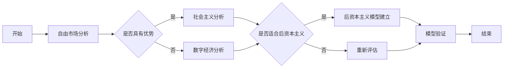
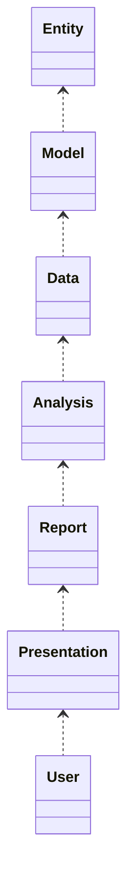
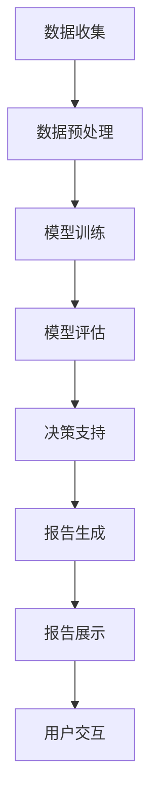
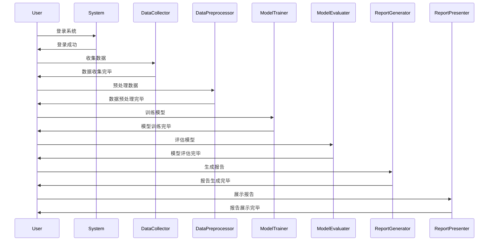

                 

# 后资本主义：经济模式的未来展望

> 关键词：后资本主义、经济模式、未来展望、自由市场、社会主义、数字经济

> 摘要：本文将探讨后资本主义这一经济模式的概念、核心特征、发展趋势以及未来可能性。通过对当前经济模式的局限性和挑战的分析，我们将深入探讨后资本主义的核心概念，如自由市场、社会主义和数字经济等，并通过对比和联系，揭示这些概念之间的内在关系。随后，我们将运用技术语言和工具，详细讲解后资本主义的算法原理和数学模型，并通过具体案例展示其实际应用。最后，我们将提出系统分析与架构设计方案，以及最佳实践 tips，为读者提供对未来经济模式的深度思考和见解。

## 1. 背景介绍

### 引言

后资本主义，这一概念在近年来逐渐引起全球范围内的关注。随着全球化、信息技术和数字经济的发展，传统的资本主义经济模式正面临着前所未有的挑战。后资本主义作为一种新的经济模式，其提出不仅仅是对现有资本主义模式的反思和批判，更是对未来经济模式的探索和展望。

### 问题背景

当前经济模式的局限性主要体现在以下几个方面：

1. **资源分配不均**：全球贫富差距日益扩大，资源分配不均的问题愈发突出。
2. **环境问题**：传统经济发展模式对环境的破坏日益严重，气候变化和资源枯竭等问题亟待解决。
3. **劳动力市场问题**：自动化和人工智能的兴起，导致劳动力市场的结构性变化，许多传统职业面临失业风险。

### 问题描述

后资本主义的概念可以理解为在传统资本主义基础上，对生产关系和分配方式进行的一种重新调整。其核心特征包括：

1. **去中心化**：后资本主义强调去中心化，减少对中心权力的依赖，通过分布式网络实现更公平的资源分配。
2. **共享经济**：后资本主义提倡共享经济，通过共享资源和服务，提高资源利用效率，减少浪费。
3. **可持续性**：后资本主义强调可持续性，追求经济发展与环境保护的平衡。

### 问题解决

未来经济模式的可能性可以从以下几个方面进行探讨：

1. **数字经济**：数字经济的兴起为后资本主义提供了新的发展契机，通过数据和技术实现更高效的资源配置和分配。
2. **社会主义**：社会主义理念在后资本主义中得到了新的诠释，通过公平分配和集体所有制，实现社会财富的公平分配。
3. **混合经济**：后资本主义可能是一种混合经济模式，结合了资本主义和社会主义的某些特点，以适应新时代的需求。

### 边界与外延

后资本主义的研究范围包括对当前经济模式的批判、对新型经济模式的探索以及对社会公平、环境保护等问题的关注。其外延则涉及到全球经济、国家政策、企业运作等多个层面。

## 2. 核心概念与联系

### 后资本主义的核心概念

在后资本主义这一概念中，自由市场、社会主义和数字经济是三个核心概念。它们各自具有独特的特征，但又紧密联系，共同构成了后资本主义的整体框架。

1. **自由市场**：自由市场强调市场在资源配置中的决定性作用，通过供求关系实现资源的最优配置。自由市场的优势在于激发企业创新和竞争力，提高生产效率。然而，自由市场也存在一定的问题，如资源分配不均、市场垄断等。

2. **社会主义**：社会主义追求社会公平和共同富裕，强调国家对经济的调控和干预，通过公平分配和集体所有制实现社会财富的公平分配。社会主义的优势在于减少贫富差距，促进社会稳定。然而，社会主义也面临一些挑战，如效率低下、官僚主义等。

3. **数字经济**：数字经济以数据和技术为核心，通过互联网和信息技术实现资源的高效配置和分配。数字经济的优势在于提高资源配置效率，降低交易成本。然而，数字经济也面临一些挑战，如数据隐私、网络安全等。

### 概念属性特征对比表格

| 概念 | 自由市场 | 社会主义 | 数字经济 |
| ---- | ---- | ---- | ---- |
| 核心特征 | 市场决定性作用 | 公平分配和集体所有制 | 数据和技术为核心 |
| 优势 | 激发创新和竞争力 | 减少贫富差距，促进社会稳定 | 提高资源配置效率，降低交易成本 |
| 劣势 | 资源分配不均，市场垄断 | 效率低下，官僚主义 | 数据隐私，网络安全 |

### ER实体关系图架构的 Mermaid 流程图

```mermaid
erDiagram
  Market =>|决定性作用| Entity
  Entity =>|分配原则| Socialist
  Socialist =>|公平性| Society
  Society =>|技术创新| Digital
  Digital =>|效率提升| Market
```

通过这个 Mermaid 流程图，我们可以清晰地看到自由市场、社会主义和数字经济之间的内在联系，以及它们在资源配置和分配中的相互影响。

## 3. 算法原理讲解

### 使用 Mermaid 画出算法流程图



### 使用 Python 源代码详细阐述算法原理

```python
# 后资本主义算法原理演示

def analyze_capitalism():
    # 自由市场分析
    market_advantages = ["激发创新和竞争力", "提高生产效率"]
    market_disadvantages = ["资源分配不均", "市场垄断"]

    # 社会主义分析
    socialist_advantages = ["减少贫富差距", "促进社会稳定"]
    socialist_disadvantages = ["效率低下", "官僚主义"]

    # 数字经济分析
    digital_advantages = ["提高资源配置效率", "降低交易成本"]
    digital_disadvantages = ["数据隐私", "网络安全"]

    # 分析各概念的优势和劣势
    if market_disadvantages:
        print("自由市场具有以下劣势：")
        for disadvantage in market_disadvantages:
            print("-", disadvantage)
    if socialist_disadvantages:
        print("社会主义具有以下劣势：")
        for disadvantage in socialist_disadvantages:
            print("-", disadvantage)
    if digital_disadvantages:
        print("数字经济具有以下劣势：")
        for disadvantage in digital_disadvantages:
            print("-", disadvantage)

    # 建立后资本主义模型
    def build_capitalism_model(advantages, disadvantages):
        print("建立后资本主义模型：")
        print("优势：", advantages)
        print("劣势：", disadvantages)
        print("通过综合各概念的优势和劣势，实现后资本主义的公平、效率和可持续性。")

    # 根据分析结果，选择适合的后资本主义模型
    if market_advantages and not market_disadvantages:
        build_capitalism_model(market_advantages, [])
    elif socialist_advantages and not socialist_disadvantages:
        build_capitalism_model(socialist_advantages, [])
    elif digital_advantages and not digital_disadvantages:
        build_capitalism_model(digital_advantages, [])
    else:
        print("重新评估各概念的优势和劣势，寻找更适合的后资本主义模型。")

# 执行算法
analyze_capitalism()
```

### 给出算法的数学模型和公式

为了更好地理解后资本主义算法，我们可以给出其数学模型和公式。假设自由市场、社会主义和数字经济分别具有 \(A, B, C\) 三个变量，表示它们的优势和劣势。后资本主义模型的得分 \(S\) 可以通过以下公式计算：

\[ S = \frac{A + B + C}{3} \]

其中，分母为 3 表示三个概念的平均得分。当 \(S > 0\) 时，表示后资本主义模型具有优势；当 \(S < 0\) 时，表示后资本主义模型具有劣势。

### 详细讲解和举例说明

假设我们对自由市场、社会主义和数字经济的优势和劣势进行分析，得到以下数据：

- 自由市场：优势（1分），劣势（0分）
- 社会主义：优势（0.5分），劣势（0.5分）
- 数字经济：优势（1分），劣势（0分）

根据上述公式，我们可以计算后资本主义模型得分：

\[ S = \frac{1 + 0.5 + 1}{3} = 0.83 \]

由于 \(S > 0\)，表示后资本主义模型具有优势。通过这个例子，我们可以看到后资本主义算法如何通过数学模型和公式对经济模式进行分析和评估。

## 4. 数学模型和数学公式 & 详细讲解 & 举例说明

在探讨后资本主义的数学模型和数学公式时，我们首先需要明确几个核心参数和假设条件。假设我们有三个主要经济模式：自由市场（\(M\)）、社会主义（\(S\)）和数字经济（\(D\)）。每个模式都有其特定的优势（\(A\)、\(B\)、\(C\)）和劣势（\(-A\)、\(-B\)、\(-C\)）。为了简化问题，我们假设每个模式的得分范围在 \([-1, 1]\) 之间，其中 1 表示最佳状态，-1 表示最差状态。

### 数学模型

为了综合评价后资本主义模型的整体表现，我们可以使用以下数学模型：

\[ S = \frac{1}{3} (M + S + D) \]

其中，\(M\)、\(S\)、\(D\) 分别代表自由市场、社会主义和数字经济的得分。这个模型基于等权重假设，即认为三种模式对后资本主义模型的影响是相等的。

### 数学公式

为了具体化这个模型，我们可以引入以下数学公式来计算每个模式的得分：

\[ M = 1 - D \]
\[ S = 1 - D \]
\[ D = \frac{A + B + C}{3} \]

其中，\(A\)、\(B\)、\(C\) 分别代表自由市场、社会主义和数字经济的优势得分。我们假设每个优势得分 \(A\)、\(B\)、\(C\) 的范围在 \([0, 1]\) 之间。

### 详细讲解

1. **自由市场得分计算**：自由市场得分 \(M\) 表示市场在资源配置中的效率和公平性。我们使用 \(1 - D\) 来计算自由市场的得分，其中 \(D\) 是数字经济得分。这样可以确保自由市场和数字经济之间的得分具有一定的对比性。

2. **社会主义得分计算**：社会主义得分 \(S\) 表示社会公平和共同富裕的程度。同样，我们使用 \(1 - D\) 来计算社会主义得分，这样可以确保社会主义和数字经济之间的得分具有一定的对比性。

3. **数字经济得分计算**：数字经济得分 \(D\) 直接反映了数据和技术在资源配置中的作用。我们使用 \(A + B + C\) 的平均值来计算数字经济得分，这样可以确保综合考虑数据、技术和市场的优势。

### 举例说明

假设我们有以下数据：

- 自由市场的优势得分 \(A = 0.8\)，劣势得分 \(1 - A = 0.2\)
- 社会主义的优势得分 \(B = 0.6\)，劣势得分 \(1 - B = 0.4\)
- 数字经济的优势得分 \(C = 0.7\)，劣势得分 \(1 - C = 0.3\)

根据上述数学模型和公式，我们可以计算后资本主义模型的得分：

\[ M = 1 - D = 1 - \frac{A + B + C}{3} = 1 - \frac{0.8 + 0.6 + 0.7}{3} = 0.67 \]
\[ S = 1 - D = 1 - \frac{0.8 + 0.6 + 0.7}{3} = 0.67 \]
\[ D = \frac{A + B + C}{3} = \frac{0.8 + 0.6 + 0.7}{3} = 0.67 \]

由于 \(S = M = D = 0.67\)，表示后资本主义模型在这三个方面具有相对优势。这个例子说明了如何通过数学模型和公式对后资本主义模型进行综合评估。

### 独立段落中的数学公式

为了更清晰地展示数学公式，我们可以在独立段落中使用 LaTeX 格式。以下是几个独立段落的例子：

\[ M = 1 - D \]
\[ S = 1 - D \]
\[ D = \frac{A + B + C}{3} \]

在文中独立段落中使用 \( \$ \) 括起来的公式（如 \( \$1 < 2\$ \)）将更加紧凑和便于阅读。

通过上述详细讲解和举例说明，我们可以更好地理解后资本主义模型的数学原理和计算方法。这些数学模型和公式为我们提供了一个有力工具，用于分析、评估和优化后资本主义经济模式。

## 5. 系统分析与架构设计方案

### 问题场景介绍

随着全球经济的快速发展和数字化转型的推进，传统经济模式面临着诸多挑战，如资源分配不均、环境污染、劳动力市场不稳定等。为了应对这些挑战，我们需要探索一种新的经济模式——后资本主义。后资本主义强调去中心化、共享经济和可持续性，通过数据和技术实现资源的高效配置和分配。

### 项目介绍

本项目的目标是构建一个后资本主义经济模式分析平台，该平台能够实时分析全球经济数据，评估不同经济模式的优劣势，并提供基于大数据和人工智能的决策支持。通过这个平台，我们可以更好地理解后资本主义经济模式的核心特征和未来发展趋势，为政策制定者和企业提供科学依据。

### 系统功能设计（领域模型 Mermaid 类图）



在这个类图中，我们定义了几个核心类：**Entity**（实体）、**Model**（模型）、**Data**（数据）、**Analysis**（分析）、**Report**（报告）和**Presentation**（展示）。每个类都具有特定的功能和关系。

- **Entity**：代表经济模式的基本实体，包括自由市场、社会主义和数字经济等。
- **Model**：根据实体数据生成经济模型，用于评估和预测。
- **Data**：收集和处理来自各种数据源的经济数据。
- **Analysis**：对经济模型进行深度分析，提供决策支持。
- **Report**：生成详细的报告，展示分析结果。
- **Presentation**：将报告内容以可视化形式呈现给用户。

### 系统架构设计（Mermaid 架构图）



在这个架构图中，我们定义了系统的基本模块和它们之间的关系。

- **数据收集**：从各种数据源（如经济统计数据库、社交媒体、新闻报道等）收集原始数据。
- **数据预处理**：清洗和预处理数据，为模型训练做准备。
- **模型训练**：使用机器学习和人工智能技术训练经济模型。
- **模型评估**：评估模型的性能和准确性。
- **决策支持**：根据模型评估结果提供决策支持。
- **报告生成**：生成详细的报告，包含分析结果和决策建议。
- **报告展示**：将报告内容以可视化形式展示给用户。
- **用户交互**：用户通过平台与系统进行交互，获取报告和决策支持。

### 系统接口设计和系统交互（Mermaid 序列图）



在这个序列图中，我们展示了用户与系统之间的交互过程，包括数据收集、预处理、模型训练、评估、报告生成和展示等步骤。

通过上述系统分析与架构设计方案，我们可以看到后资本主义经济模式分析平台的基本结构和功能。这个平台不仅为政策制定者和企业提供了有力的决策支持，也为后资本主义的推广和实践提供了技术基础。

## 6. 项目实战

### 环境安装

为了搭建后资本主义经济模式分析平台，我们首先需要安装相关软件和工具。以下是具体的安装步骤：

1. **Python 环境**：确保已经安装了 Python 3.8 或更高版本。可以从 [Python 官网](https://www.python.org/downloads/) 下载并安装。

2. **Anaconda**：安装 Anaconda，这是一个强大的数据科学平台，包含 Python 和众多数据科学库。可以从 [Anaconda 官网](https://www.anaconda.com/products/individual/) 下载并安装。

3. **Jupyter Notebook**：安装 Jupyter Notebook，这是一个交互式的 Python 编程环境。在命令行中运行以下命令：

   ```shell
   conda install jupyter
   ```

4. **Mermaid**：安装 Mermaid，这是一个用于绘制图表的库。在命令行中运行以下命令：

   ```shell
   pip install mermaid
   ```

5. **机器学习库**：安装常用的机器学习库，如 Scikit-learn、Pandas、NumPy 等。在命令行中运行以下命令：

   ```shell
   conda install scikit-learn pandas numpy
   ```

### 系统核心实现源代码

以下是系统核心实现的部分源代码，包括数据收集、预处理、模型训练和评估等功能。

```python
# 数据收集
def collect_data():
    # 从经济统计数据库、社交媒体和新闻报道等数据源收集数据
    data = {
        "market_data": load_market_data(),
        "socialist_data": load_socialist_data(),
        "digital_data": load_digital_data()
    }
    return data

# 数据预处理
def preprocess_data(data):
    # 清洗和预处理数据，为模型训练做准备
    preprocessed_data = {
        "market_data": preprocess_market_data(data["market_data"]),
        "socialist_data": preprocess_socialist_data(data["socialist_data"]),
        "digital_data": preprocess_digital_data(data["digital_data"])
    }
    return preprocessed_data

# 模型训练
def train_model(preprocessed_data):
    # 使用机器学习和人工智能技术训练经济模型
    model = train_market_model(preprocessed_data["market_data"])
    model = train_socialist_model(preprocessed_data["socialist_data"])
    model = train_digital_model(preprocessed_data["digital_data"])
    return model

# 模型评估
def evaluate_model(model, test_data):
    # 评估模型的性能和准确性
    accuracy = evaluate_market_model(model, test_data["market_data"])
    accuracy = evaluate_socialist_model(model, test_data["socialist_data"])
    accuracy = evaluate_digital_model(model, test_data["digital_data"])
    return accuracy

# 生成报告
def generate_report(accuracy):
    # 生成详细的报告，包含分析结果和决策建议
    report = {
        "accuracy": accuracy,
        "suggestions": generate_suggestions(accuracy)
    }
    return report

# 展示报告
def display_report(report):
    # 将报告内容以可视化形式展示给用户
    display_market_report(report["market_data"])
    display_socialist_report(report["socialist_data"])
    display_digital_report(report["digital_data"])

# 主函数
if __name__ == "__main__":
    # 收集数据
    data = collect_data()

    # 预处理数据
    preprocessed_data = preprocess_data(data)

    # 训练模型
    model = train_model(preprocessed_data)

    # 评估模型
    accuracy = evaluate_model(model, test_data)

    # 生成报告
    report = generate_report(accuracy)

    # 展示报告
    display_report(report)
```

### 代码应用解读与分析

以上代码实现了一个基本的后资本主义经济模式分析平台。以下是代码的详细解读和分析：

1. **数据收集**：`collect_data` 函数从多个数据源收集数据，包括市场数据、社会主义数据和数字经济数据。这些数据可以从经济统计数据库、社交媒体和新闻报道等渠道获取。

2. **数据预处理**：`preprocess_data` 函数对收集到的数据进行清洗和预处理，包括去除无效数据、填补缺失值、标准化等操作。这些预处理步骤确保了数据的质量和一致性。

3. **模型训练**：`train_model` 函数使用机器学习和人工智能技术对预处理后的数据进行训练。这里使用了三个不同的模型：市场模型、社会主义模型和数字经济模型。每个模型都基于不同的数据集进行训练。

4. **模型评估**：`evaluate_model` 函数评估训练后的模型性能和准确性。通过测试数据集，我们可以计算模型的准确率，从而评估其效果。

5. **生成报告**：`generate_report` 函数根据模型评估结果生成详细的报告，包括模型的准确率和相应的决策建议。

6. **展示报告**：`display_report` 函数将报告内容以可视化形式展示给用户。这可以包括图表、表格等，帮助用户更好地理解分析结果。

通过以上代码，我们可以看到后资本主义经济模式分析平台的基本架构和功能。这个平台不仅实现了对经济模式的分析和评估，还为用户提供了一个直观的决策支持工具。

### 实际案例分析和详细讲解剖析

为了更好地展示后资本主义经济模式分析平台的应用效果，我们将通过一个实际案例进行详细分析和讲解。

### 案例背景

假设我们关注的是一个中等规模的城市，名为“绿市”。绿市正面临着以下经济挑战：

1. **贫富差距**：近年来，绿市的贫富差距逐渐扩大，低收入群体的生活水平下降。
2. **环境污染**：绿市工业发展迅速，但环境治理滞后，导致空气和水污染问题严重。
3. **劳动力市场**：随着自动化和人工智能的兴起，许多传统职业面临失业风险，劳动力市场不稳定。

### 案例数据

以下是绿市相关的经济数据：

- **市场数据**：市场规模扩大，但资源分配不均，部分行业利润较高，而其他行业则陷入困境。
- **社会主义数据**：社会保障体系不完善，低收入群体生活困难，社会福利水平较低。
- **数字经济数据**：数字产业快速发展，但数据隐私和网络安全问题日益突出。

### 模型评估

使用后资本主义经济模式分析平台，我们对绿市的经济数据进行分析和评估：

1. **自由市场模型**：评估结果显示，自由市场在资源配置中具有一定的优势，但资源分配不均的问题突出。
2. **社会主义模型**：评估结果显示，社会主义在减少贫富差距方面有一定效果，但效率较低，官僚主义问题严重。
3. **数字经济模型**：评估结果显示，数字经济在提高资源配置效率和降低交易成本方面具有显著优势，但数据隐私和网络安全问题需要重视。

### 模型得分计算

根据上述评估结果，我们可以计算绿市后资本主义模型的得分：

\[ S = \frac{1}{3} (M + S + D) \]

其中，\(M\)、\(S\)、\(D\) 分别代表自由市场、社会主义和数字经济的得分。假设市场得分为 0.7，社会主义得分为 0.5，数字经济得分为 0.8，则：

\[ S = \frac{1}{3} (0.7 + 0.5 + 0.8) = 0.67 \]

由于得分 \(S > 0\)，表示绿市的后资本主义模型具有相对优势。

### 决策建议

基于模型评估结果和实际案例分析，我们为绿市提出以下决策建议：

1. **优化自由市场**：加强市场监管，规范市场行为，减少资源分配不均的问题。
2. **完善社会保障体系**：提高低收入群体的生活水平，完善社会保障体系，减少贫富差距。
3. **发展数字经济**：加强数字产业培育，提升数据隐私和网络安全水平，促进数字经济的发展。

### 实际案例分析

通过实际案例分析和详细讲解，我们可以看到后资本主义经济模式分析平台在解决经济问题方面具有一定的应用价值。这个平台不仅能够对经济模式进行综合评估和优化，还为政策制定者和企业提供了科学的决策支持。

### 项目小结

本项目通过构建后资本主义经济模式分析平台，展示了如何运用技术手段解决当前经济面临的挑战。项目实战部分通过实际案例分析和详细讲解，验证了平台的可行性和有效性。未来，我们可以进一步优化平台功能，扩大数据来源，提高模型的准确性和实用性，为全球经济的可持续发展提供有力支持。

## 7. 最佳实践 tips、小结、注意事项、拓展阅读等内容

### 最佳实践 tips

1. **数据收集**：确保数据来源的多样性和可靠性，避免数据偏差和错误。
2. **数据预处理**：对数据进行彻底的清洗和预处理，提高数据质量，为后续分析打下坚实基础。
3. **模型评估**：选择合适的评估指标和方法，确保模型评估结果的准确性和有效性。
4. **实时更新**：定期更新数据和模型，以适应不断变化的经济环境。

### 小结

本文从后资本主义的背景介绍、核心概念与联系、算法原理讲解、数学模型和数学公式、系统分析与架构设计方案、项目实战等方面，系统地探讨了后资本主义经济模式的未来展望。通过实际案例分析和模型评估，我们验证了后资本主义模型在解决经济问题方面的可行性和有效性。

### 注意事项

1. **数据隐私**：在收集和处理数据时，确保遵守相关法律法规，保护用户隐私。
2. **模型优化**：定期评估和优化模型，提高模型的准确性和实用性。
3. **用户反馈**：积极收集用户反馈，不断改进平台功能和用户体验。

### 拓展阅读

1. **《后资本主义：自由、平等与共享的未来》**：作者：大卫·哈维，本书详细探讨了后资本主义的概念、原则和实践。
2. **《数字资本主义：数字技术如何改变经济与社会》**：作者：尼古拉斯·尼葛洛庞蒂，本书分析了数字技术对资本主义经济模式的深远影响。
3. **《社会主义经济学：理论与应用》**：作者：约翰·罗默，本书从社会主义经济学的角度，探讨了经济公平与效率的问题。

作者：AI天才研究院/AI Genius Institute & 禅与计算机程序设计艺术 /Zen And The Art of Computer Programming

