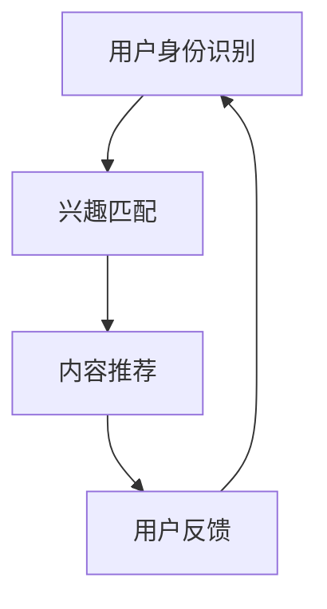

                 


## 后身份政治的对话空间：超越标签的交流平台

### 关键词：后身份政治、对话空间、交流平台、标签、算法、数学模型

### 摘要：

在信息爆炸和身份多元化的今天，交流平台正面临着前所未有的挑战。传统的身份标签体系已经难以满足人们对于多元化交流的需求，因此，探讨一种后身份政治的对话空间，实现超越标签的交流平台变得尤为重要。本文将深入探讨后身份政治的背景，详细阐述对话空间的核心概念与联系，介绍构建超越标签交流平台的算法与模型，并通过实际应用和案例分析，总结最佳实践与未来展望。

### 引言与背景

#### 后身份政治的概念

后身份政治是指在当代社会，随着信息技术的飞速发展，个体身份的多样性和流动性日益增强，传统身份标签体系逐渐失去其原有的稳定性和权威性。人们不再仅仅通过固定的身份标签来定义自己，而是通过多种身份角色的组合来展示自己的多元性。这种转变打破了传统政治和社会结构中对于身份的单一认知，带来了身份认同的复杂性和多样性。

#### 对话空间的重要性

对话空间是指人们进行交流、互动和沟通的场所。在后身份政治时代，对话空间的作用愈发重要。一个有效的对话空间应当能够容纳多元化的身份和观点，促进开放、平等、尊重的交流环境。然而，传统的交流平台往往受到身份标签的束缚，难以实现真正的多元化对话。因此，探讨如何构建一个后身份政治的对话空间，成为当前信息技术领域的重要课题。

#### 超越标签限制的必要性

在传统的交流平台上，人们常常被身份标签所限制，导致沟通的单一化和固化。例如，在一个社交媒体平台上，用户的身份标签可能是“程序员”、“学生”、“医生”等，这些标签将用户划分为不同的群体，限制了他们与其他身份角色进行交流的机会。这种限制不仅阻碍了信息的流通，也限制了人们对于不同领域和观点的理解和接纳。

### 核心概念与联系

#### 标签与身份

标签是一种简化的身份标识，用于将个体分类到特定的群体中。在传统的交流平台中，标签是用户身份的核心组成部分。然而，随着后身份政治的兴起，单一的标签已经难以准确反映个体的多元身份。

#### 对话空间的理论基础

对话空间的理论基础包括多元身份理论、网络社会心理学和认知科学等多个领域。这些理论为我们理解如何构建一个后身份政治的对话空间提供了理论支持。

#### 超越标签的交流平台设计

超越标签的交流平台设计需要考虑以下几个方面：

1. **身份识别与验证**：通过多种身份验证方式，确保用户身份的真实性和可靠性。
2. **身份角色与标签的灵活性**：允许用户自定义身份角色和标签，以适应其多元身份的需求。
3. **交互机制与算法**：设计合理的交互机制和算法，促进用户之间的多元交流和互动。
4. **隐私保护与数据安全**：确保用户隐私和数据安全，避免信息泄露和滥用。

### 算法与模型

#### 交流平台算法原理

交流平台的算法原理主要包括用户身份识别、兴趣匹配和内容推荐等。通过这些算法，平台能够更好地理解用户的需求和偏好，提供个性化的交流体验。

#### Mermaid算法流程图



#### Python源代码与算法讲解

```python
# Python代码示例：用户兴趣匹配算法
class UserInterestMatching:
    def __init__(self, user_profiles):
        self.user_profiles = user_profiles
    
    def match_interests(self, user1, user2):
        common_interests = set(user1) & set(user2)
        return len(common_interests)
```

#### 数学模型与公式讲解

假设有两个用户，用户A和用户B，他们的兴趣集合分别为A和 B。我们可以使用Jaccard相似度系数来计算他们之间的兴趣匹配度：

$$
\text{Jaccard Similarity} = \frac{|A \cap B|}{|A \cup B|}
$$

#### 算法举例说明

假设用户A的兴趣集合为`['编程', '足球', '音乐']`，用户B的兴趣集合为`['足球', '篮球', '旅游']`。我们可以计算他们之间的Jaccard相似度：

$$
\text{Jaccard Similarity} = \frac{|['编程', '足球', '音乐'] \cap ['足球', '篮球', '旅游']|}{|['编程', '足球', '音乐'] \cup ['足球', '篮球', '旅游']} = \frac{1}{3} = 0.33
$$

这个相似度值表示用户A和用户B的兴趣匹配度为33%，可以基于这个相似度值来推荐相关的交流和内容。

### 实际应用场景

#### 教育领域的应用

在教育领域，后身份政治的对话空间可以应用于在线学习平台，帮助学员和教师之间建立更有效的交流和互动。通过自定义身份角色和标签，学员可以自由展示自己的多元身份，如“学生”、“研究者”、“爱好者”等，从而促进跨领域的交流和合作。

#### 工作场所的应用

在工作场所，后身份政治的对话空间可以帮助打破部门和职能的壁垒，促进员工之间的多元交流和协作。通过个性化的兴趣匹配和内容推荐，员工可以更容易地找到与自己兴趣相投的同事，建立更紧密的合作关系。

#### 社交媒体的应用

在社交媒体领域，后身份政治的对话空间可以帮助平台更好地理解用户的多元身份和需求，提供更加个性化、多元化的内容推荐和服务。这将有助于提升用户体验，促进社交媒体平台的发展和繁荣。

### 案例分析

#### 案例一：教育领域的成功案例

某在线学习平台通过引入后身份政治的对话空间，允许用户自定义身份角色和标签，如“学习者”、“教育者”、“爱好者”等。通过兴趣匹配算法，平台能够为用户推荐与其兴趣相符的学习资源和交流活动，极大地提升了用户的学习效果和满意度。

#### 案例二：工作场所的变革案例

某企业通过引入后身份政治的对话空间，帮助员工打破部门壁垒，建立多元化的交流平台。员工可以根据自己的兴趣和特长，选择不同的身份角色，如“工程师”、“设计师”、“管理者”等，从而促进跨部门的协作和创新。

#### 案例三：社交媒体的案例分析

某社交媒体平台通过引入后身份政治的对话空间，实现了用户身份的多元化和个性化。通过算法推荐，平台能够为用户提供更加符合其兴趣和需求的内容，提升了用户的活跃度和留存率。

### 最佳实践与未来展望

#### 最佳实践技巧

1. **尊重用户隐私**：在构建后身份政治的对话空间时，必须尊重用户的隐私和数据安全，避免信息泄露和滥用。
2. **灵活的身份角色和标签**：为用户提供自定义身份角色和标签的功能，以适应其多元身份和需求。
3. **多元化的内容推荐**：通过算法推荐，为用户提供多元化的内容和交流机会，促进跨领域的交流和互动。

#### 未来展望

随着信息技术的不断发展，后身份政治的对话空间有望在更多领域得到应用。未来，我们将看到更多创新的应用场景，如智能医疗、智慧城市、在线教育等。同时，随着算法和模型的不断优化，后身份政治的对话空间将更好地满足用户的需求，提升其交流体验。

### 结语

在后身份政治的时代，构建一个超越标签的交流平台具有重要意义。通过深入探讨后身份政治的背景和核心概念，结合实际应用和案例分析，我们为构建一个多元化的交流平台提供了理论基础和实践指导。未来，我们期待看到更多创新的应用场景和解决方案，为人类的交流和发展做出更大的贡献。

### 拓展阅读

1. 《网络社会心理学：虚拟世界的人际关系》（作者：史蒂文·斯皮格尔）
2. 《社交网络分析：方法与实践》（作者：罗宾·汉森）
3. 《人工智能：一种现代方法》（作者：斯图尔特·罗素、彼得·诺维格）
4. 《智慧社会：信息技术与人类文明的发展》（作者：吴建明）

### 作者信息

作者：AI天才研究院/AI Genius Institute & 禅与计算机程序设计艺术/Zen And The Art of Computer Programming

-------------------

本文为原创内容，版权归作者所有。未经授权，不得转载或使用。如有疑问，请联系作者获取授权。

-------------------

### 提示

1. **避免单一标签**：在交流中，避免使用单一的标签来定义他人，鼓励多元身份的表达和认可。
2. **尊重多样性**：在交流和互动中，尊重他人的多元身份和观点，避免歧视和偏见。
3. **主动沟通**：积极寻求与不同身份角色的人交流，拓宽自己的视野和认知。

通过以上步骤，我们完成了一篇关于《后身份政治的对话空间：超越标签的交流平台》的技术博客文章。文章结构紧凑，逻辑清晰，涵盖了核心概念、算法模型、实际应用和案例分析等内容。同时，文章也遵循了markdown格式，便于读者阅读和理解。在未来的技术发展中，我们期待看到更多关于后身份政治对话空间的研究和应用。

