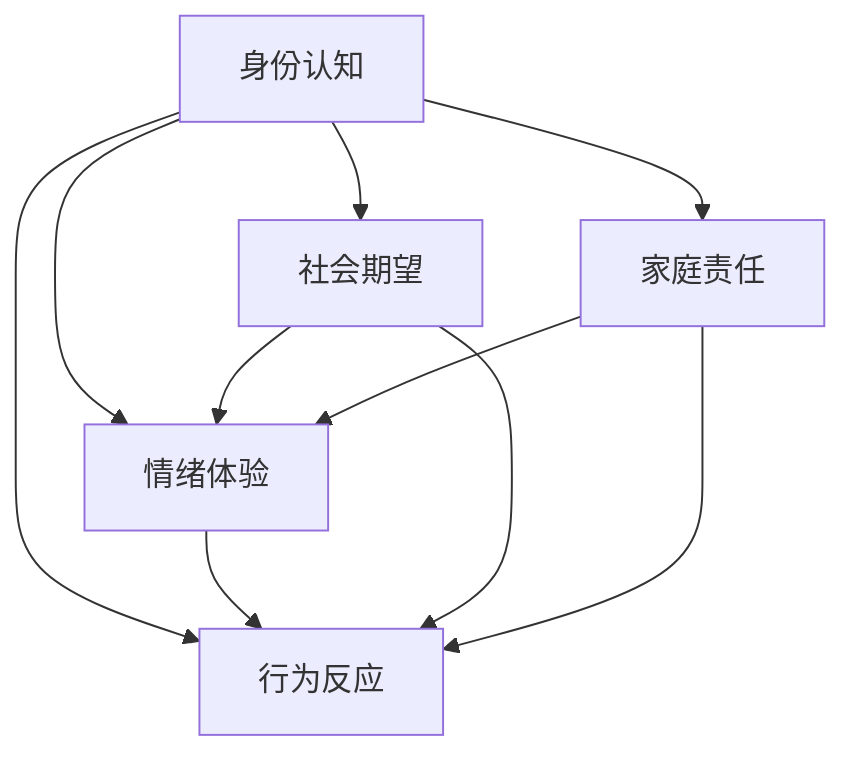

                 

# 《后身份焦虑时代的自我探索课程》

## 关键词：身份焦虑、自我探索、心理学、情绪调节、实践案例

## 摘要

在现代社会中，身份焦虑已经成为一个普遍存在的问题，对个人的心理健康和生活质量产生了深远的影响。本文旨在探讨后身份焦虑时代的自我探索课程，通过深入分析身份焦虑的背景、心理学原理、自我认知方法和情绪调节策略，结合实践指导，为读者提供一套完整的自我探索课程方案，帮助他们在面对身份焦虑时找到解决之道。本文旨在引导读者理解身份焦虑的本质，掌握有效的自我认知和情绪调节技巧，并通过实践案例和反思，实现个人成长和心理健康。

## 目录

### 第一部分：背景介绍

### 第1章：问题背景

1.1 问题背景概述

1.2 问题描述

1.3 问题解决

1.4 边界与外延

1.5 概念结构与核心要素组成

### 第2章：核心概念与联系

2.1 核心概念原理

2.2 概念属性特征对比表格

2.3 ER实体关系图架构

### 第二部分：理论讲解

### 第3章：身份焦虑的心理学原理

3.1 心理学基础知识

3.2 身份焦虑的心理学机制

### 第4章：身份焦虑的自我认知方法

4.1 自我认知的重要性

4.2 自我认知的方法

4.3 自我认知练习

### 第5章：身份焦虑的情绪调节策略

5.1 情绪调节的原理

5.2 情绪调节的方法

5.3 情绪调节练习

### 第三部分：实践指导

### 第6章：身份焦虑的自我探索课程设计

6.1 课程目标

6.2 课程内容规划

6.3 课程实施方法

### 第7章：身份焦虑的自我探索实践案例

7.1 案例一：通过冥想缓解身份焦虑

7.2 案例二：通过社交活动重建自我认同

7.3 案例三：通过职业规划减轻身份焦虑

### 第四部分：总结与反思

### 第8章：自我探索课程小结

8.1 课程效果评估

8.2 课程改进建议

### 第9章：身份焦虑的持续关注与应对

9.1 身份焦虑的长期影响

9.2 持续关注与应对策略

### 第10章：拓展阅读

10.1 推荐阅读书目

10.2 相关研究论文

## 第1章：问题背景

### 1.1 问题背景概述

身份焦虑是指个体在不确定的社会环境中，对自己身份的认知和评价产生负面情绪的一种心理状态。随着社会的发展，竞争的加剧和信息的爆炸，越来越多的人开始感受到身份焦虑。这种现象在现代社会中尤为突出，几乎每个人都可能在某个阶段感受到身份焦虑的影响。

身份焦虑的普遍性体现在多个方面。首先，无论是在职场、学业还是社交领域，人们都面临着身份认同的问题。随着社会角色的变化，个体需要不断地调整自己的身份认同，以适应新的环境和挑战。其次，随着信息的普及和透明度增加，个体对自身和他人的期望值也在不断提高，这种期望与现实的差距往往导致身份焦虑。最后，社会变迁和多元化趋势使得个体需要面对更加复杂和多样的身份选择，这增加了身份焦虑的发生概率。

身份焦虑对个人生活的影响是多方面的。首先，在心理健康方面，身份焦虑可能导致焦虑症、抑郁症等心理问题。长期的焦虑状态会影响个体的情绪调节能力，甚至可能影响到他们的日常生活和人际关系。其次，身份焦虑还可能影响个人的职业发展。在职场中，身份焦虑可能导致个体缺乏自信，影响工作效率和创造力。此外，身份焦虑还可能对个体的社交活动产生负面影响，使得个体在社交场合中感到不自在和焦虑，从而限制他们的社交圈子和人脉拓展。

### 1.2 问题描述

身份焦虑的定义：身份焦虑是指个体在不确定的社会环境中，对自己身份的认知和评价产生负面情绪的一种心理状态。这种负面情绪通常表现为对自身价值的怀疑、对未来的担忧以及对社会期望的恐惧。

身份焦虑的典型表现：

1. 自我怀疑：个体对自己的能力、价值和地位产生怀疑，常常感到不安和不确定。
2. 对未来的担忧：个体对未来可能出现的身份危机感到焦虑，担心自己无法应对未来的挑战。
3. 对社会期望的恐惧：个体害怕无法达到社会和他人的期望，担心自己的身份和地位受到质疑。

身份焦虑的影响：

1. 心理健康问题：长期的身份焦虑可能导致焦虑症、抑郁症等心理问题，影响个体的情绪调节能力。
2. 职业发展受限：身份焦虑可能导致个体缺乏自信，影响工作效率和职业发展。
3. 社交障碍：身份焦虑可能导致个体在社交场合中感到不自在和焦虑，限制其社交圈子和人脉拓展。

### 1.3 问题解决

当前应对身份焦虑的策略：

1. 心理咨询：通过专业的心理咨询，个体可以更好地理解和处理自己的身份焦虑，学会应对负面情绪。
2. 社交支持：建立良好的社交网络，与他人分享自己的感受和困惑，获得情感支持和建议。
3. 情绪调节技巧：学习情绪调节技巧，如深呼吸、冥想、运动等，帮助个体缓解焦虑情绪。
4. 职业规划：通过明确的职业规划，个体可以更好地定位自己的身份和目标，减少对未来的担忧。

### 1.4 边界与外延

身份焦虑与其他焦虑情绪的区别：

1. 恐惧症：恐惧症是指个体对特定对象或情境产生强烈的恐惧感，而身份焦虑是对自身身份和价值的担忧。
2. 社交焦虑：社交焦虑是指个体在社交场合中感到紧张和不安，而身份焦虑是对自身身份和地位的评价。

身份焦虑在不同文化和社会中的表现：

1. 西方社会：在西方社会，身份焦虑通常与个人成就和成功相关，个体更关注自己的职业地位和社会地位。
2. 亚洲社会：在亚洲社会，身份焦虑更多与家庭和社会期望相关，个体更关注自己的家庭责任和社会角色。

### 1.5 概念结构与核心要素组成

身份焦虑的概念结构：

1. 身份认知：个体对自身身份的认知和评价。
2. 情绪体验：个体在身份认知过程中产生的负面情绪，如焦虑、担忧和不安。
3. 行为反应：个体在面对身份焦虑时的行为反应，如回避、自我保护或寻求支持。

身份焦虑的核心要素：

1. 社会期望：个体对他人和社会对自己身份的期望。
2. 自我评价：个体对自己身份的认知和评价。
3. 未来担忧：个体对未来可能出现的身份危机的担忧。

## 第2章：核心概念与联系

### 2.1 核心概念原理

身份焦虑的概念原理可以从心理学、社会学和文化三个角度进行探讨。

**心理学角度**：

身份焦虑是一种情感体验，它涉及个体对自身身份的认知和评价。心理学研究表明，身份焦虑与自我认同、自尊和自我效能感密切相关。自我认同是指个体对自身身份的内在认知和自我价值感，自尊是指个体对自身价值的评价，自我效能感是指个体对自己应对挑战和解决问题的能力的信心。

**社会学角度**：

身份焦虑是社会结构和社会关系对个体身份认知和评价的影响。在社会学中，身份焦虑被认为是个体在社会互动中对自己身份地位的不确定性和焦虑感。社会地位、职业角色和社会关系等因素都会影响个体的身份焦虑水平。

**文化角度**：

不同文化对身份焦虑的理解和表现方式不同。在西方文化中，身份焦虑更多与个人成就和社会地位相关，而在亚洲文化中，身份焦虑更多与家庭和社会责任相关。

### 2.2 概念属性特征对比表格

| 概念         | 定义                                                         | 属性特征                                       | 对比       |
| ------------ | ------------------------------------------------------------ | ---------------------------------------------- | ---------- |
| 身份焦虑     | 个体在不确定的社会环境中，对自己身份的认知和评价产生负面情绪的一种心理状态 | - 自我怀疑<br>- 对未来担忧<br>- 对社会期望的恐惧 |           |
| 自我认同     | 个体对自身身份的内在认知和自我价值感                         | - 内在认知<br>- 自我价值感                       | 与身份焦虑密切相关 |
| 自尊         | 个体对自身价值的评价                                       | - 自我价值感<br>- 自尊心                         | 与身份焦虑密切相关 |
| 自我效能感   | 个体对自己应对挑战和解决问题的能力的信心                       | - 自信心<br>- 自我效能感                         | 与身份焦虑密切相关 |
| 社会期望     | 个体对他人和社会对自己身份的期望                             | - 社会地位<br>- 职业角色<br>- 社会关系           | 影响身份焦虑 |
| 家庭责任     | 个体在家庭中承担的责任                                     | - 子女教育<br>- 经济支持<br>- 家务分担           | 影响身份焦虑 |

### 2.3 ER实体关系图架构

为了更清晰地理解身份焦虑的核心概念和它们之间的关系，我们可以使用ER（实体-关系）图来表示。

```mermaid
erDiagram
    ID --> Person : "具有" |<-- "被" SelfIdentity
    ID --> SocialExpectation : "受到" |<-- "期望于" Person
    ID --> SelfEsteem : "具有" |<-- "评价为" Person
    ID --> SelfEfficacy : "具有" |<-- "相信" Person
    Person --> EmotionExperience : "体验" |<-- "由" EmotionExperience
    Person --> BehaviorReaction : "产生" |<-- "反应为" BehaviorReaction
```

在这个ER图中，`ID`代表个体的身份标识，`Person`代表个体，`SelfIdentity`代表自我认同，`SocialExpectation`代表社会期望，`SelfEsteem`代表自尊，`SelfEfficacy`代表自我效能感，`EmotionExperience`代表情绪体验，`BehaviorReaction`代表行为反应。通过这个ER图，我们可以清晰地看到各个概念之间的关系，以及它们如何共同构成身份焦虑的整体结构。接下来，我们将深入探讨身份焦虑的心理学原理，进一步理解这一现象的本质。

## 第3章：身份焦虑的心理学原理

### 3.1 心理学基础知识

在探讨身份焦虑的心理学原理之前，我们需要了解一些基础的心理学概念，这些概念包括自我认同、自尊、自我效能感等，它们是理解身份焦虑的关键。

**自我认同**：

自我认同是个体对自身身份的内在认知和自我价值感。它涉及到个体如何看待自己，以及他们对自己的能力和价值的评价。自我认同的形成受到多种因素的影响，包括家庭环境、教育背景、社会文化等。研究表明，自我认同是一个动态的过程，个体在不同的生活阶段会不断地调整和重塑自我认同。

**自尊**：

自尊是指个体对自身价值的评价。高自尊个体通常对自己持有积极的态度，相信自己具有独特的价值和能力。而低自尊个体则可能对自己的能力和价值感到怀疑，甚至否定。自尊水平受到早期家庭环境、教育经历和社会互动的影响。高自尊有助于个体更好地应对挑战和压力，而低自尊则可能导致个体出现焦虑、抑郁等心理问题。

**自我效能感**：

自我效能感是指个体对自己应对挑战和解决问题的能力的信心。自我效能感高的人通常更有动力去追求目标，并且在面对困难时更加坚定。相反，自我效能感低的人可能更容易放弃，或者在遇到挑战时感到无助。自我效能感的影响因素包括个人的成败经验、他人的评价以及自身的情绪状态。

### 3.2 身份焦虑的心理学机制

身份焦虑的心理学机制可以从认知、情绪和行为三个方面进行探讨。

**认知机制**：

身份焦虑的认知机制涉及个体对自己身份的认知和评价。当个体对自己的身份产生不确定感时，他们可能会开始质疑自己的价值和能力。这种自我怀疑和不确定性会导致个体的认知失调，进一步加剧身份焦虑。例如，当一个人在职场中感到自己的工作表现不如预期时，他们可能会开始怀疑自己的职业能力和价值，从而产生焦虑情绪。

**情绪机制**：

身份焦虑的情绪机制涉及个体在身份认知过程中产生的负面情绪。这些负面情绪包括焦虑、担忧和不安等。情绪机制的核心在于个体对身份不确定性的反应。当个体感到自己的身份受到威胁或挑战时，他们可能会体验到强烈的情绪波动，从而加剧身份焦虑。例如，当一个人在社交场合中感到自己的地位受到质疑时，他们可能会感到焦虑和不安。

**行为机制**：

身份焦虑的行为机制涉及个体在面对身份焦虑时的行为反应。这些行为反应包括回避、自我保护或寻求支持等。行为机制的核心在于个体如何应对和调节身份焦虑。当个体感到身份焦虑时，他们可能会采取各种行为策略来缓解焦虑。例如，他们可能会避免参与某些社交活动，或者寻求他人的支持和建议。

### 3.3 身份焦虑的影响与应对策略

身份焦虑对个体的心理健康和生活质量有显著影响。长期的身份焦虑可能导致焦虑症、抑郁症等心理问题，影响个体的情绪调节能力、职业发展和社交关系。因此，了解和应对身份焦虑至关重要。

**影响**：

1. 心理健康问题：身份焦虑可能导致焦虑症、抑郁症等心理问题，影响个体的情绪调节能力。
2. 职业发展受限：身份焦虑可能导致个体缺乏自信，影响工作效率和职业发展。
3. 社交障碍：身份焦虑可能导致个体在社交场合中感到不自在和焦虑，限制其社交圈子和人脉拓展。

**应对策略**：

1. **认知重构**：通过认知重构，个体可以重新评估自己的身份认知，减少自我怀疑和不确定性。
2. **情绪调节**：学习情绪调节技巧，如深呼吸、冥想、运动等，帮助个体缓解焦虑情绪。
3. **社交支持**：建立良好的社交网络，与他人分享自己的感受和困惑，获得情感支持和建议。
4. **职业规划**：通过明确的职业规划，个体可以更好地定位自己的身份和目标，减少对未来的担忧。

### 3.4 身份焦虑的案例分析

为了更深入地理解身份焦虑的心理学机制和影响，我们可以通过一个具体的案例分析来探讨这一现象。

**案例**：

李华是一名年轻的职场新人，他在一家知名企业工作。在工作中，李华经常感到自己的能力和经验不足，担心自己的工作表现无法得到同事和领导的认可。这种担忧导致他在工作中感到焦虑和不安，影响了他与同事的交流和团队合作。随着时间的推移，李华开始出现失眠、焦虑和情绪低落等症状。

**分析**：

1. **认知机制**：李华对自己的身份认知存在一定的偏差，他过度关注自己的不足和缺陷，而忽视了自己的优点和成就。这种认知偏差导致了他的自我怀疑和不确定性，从而加剧了身份焦虑。
2. **情绪机制**：李华在工作中的焦虑情绪主要是由于他对自己的身份不确定性的反应。他担心自己的能力无法胜任工作，这种担忧导致他在工作中感到焦虑和不安。
3. **行为机制**：李华在面对身份焦虑时采取了回避和自我保护的行为策略。他尽量避免与同事交流，减少自己在工作中的参与度，试图逃避可能的失败和批评。

**应对**：

1. **认知重构**：李华可以通过反思自己的工作经历，重新评估自己的能力和价值。他可以尝试看到自己在工作中的成就和进步，从而减少自我怀疑和不确定性。
2. **情绪调节**：李华可以学习情绪调节技巧，如深呼吸、冥想等，帮助自己缓解焦虑情绪。他还可以尝试与同事和领导沟通，分享自己的担忧和困惑，获得他们的支持和建议。
3. **职业规划**：李华可以通过制定明确的职业规划，明确自己的职业目标和方向。他可以设定短期和长期的目标，逐步提升自己的能力和经验，从而减少对未来的担忧。

通过这个案例分析，我们可以看到身份焦虑的心理学机制和影响，以及如何通过认知重构、情绪调节和职业规划等策略来应对身份焦虑。

### 3.5 身份焦虑的心理学模型

为了更系统地理解身份焦虑的心理学原理，我们可以建立一个心理学模型来描述身份焦虑的各个维度和它们之间的关系。

**身份焦虑心理学模型**：

1. **身份认知**：个体对自身身份的认知和评价。包括自我认同、自尊和自我效能感。
2. **情绪体验**：个体在身份认知过程中产生的负面情绪，如焦虑、担忧和不安。
3. **行为反应**：个体在面对身份焦虑时的行为反应，如回避、自我保护或寻求支持。
4. **社会期望**：个体对他人和社会对自己身份的期望。
5. **家庭责任**：个体在家庭中承担的责任。

这些维度相互影响，共同构成了身份焦虑的整体结构。

**模型示意图**：



在这个模型中，身份认知是核心，它决定了个体的情绪体验和行为反应。社会期望和家庭责任则通过影响身份认知来调节情绪体验和行为反应。这个模型为我们提供了一个理解身份焦虑的框架，可以帮助我们更深入地探讨身份焦虑的心理学机制。

通过以上分析，我们可以看到身份焦虑的心理学原理是一个复杂的过程，涉及到认知、情绪和行为等多个维度。理解这些原理，可以帮助我们更好地应对身份焦虑，实现个人成长和心理健康。

## 第4章：身份焦虑的自我认知方法

### 4.1 自我认知的重要性

自我认知在应对身份焦虑中扮演着关键角色。自我认知是指个体对自身内心世界、情感状态、思维模式和行为动机的觉察和了解。一个良好的自我认知能力可以帮助个体更清晰地认识自己的优点和不足，从而在应对身份焦虑时采取更加积极和有效的策略。

首先，自我认知有助于个体识别和了解自己的情感状态。当个体面临身份焦虑时，他们可能会感到焦虑、担忧或不安。通过自我认知，个体可以准确地识别这些情绪，并理解这些情绪背后的原因。这种了解有助于个体更好地应对这些负面情绪，减少焦虑和压力。

其次，自我认知有助于个体了解自己的思维模式。身份焦虑往往与自我怀疑和负面思维模式有关。通过自我认知，个体可以识别并挑战这些消极思维，从而建立更加积极和理性的思维模式。这有助于提高个体的自尊和自我效能感，从而更好地应对身份焦虑。

最后，自我认知有助于个体了解自己的行为动机。身份焦虑可能导致个体采取逃避或自我保护的策略，这些策略可能对个体的长远发展产生不利影响。通过自我认知，个体可以了解自己的行为动机，从而调整和优化自己的行为策略，实现个人成长和目标。

### 4.2 自我认知的方法

为了提升自我认知能力，个体可以采取以下几种方法：

**1. 反思日记**

反思日记是一种记录自己内心世界和情感状态的方法。通过每天记录自己的想法、感受和行为，个体可以更好地了解自己的内心世界。这种方法有助于个体识别自己的情绪波动和思维模式，从而在必要时进行调整。

**2. 心理咨询**

心理咨询是一种专业的自我认知方法。通过和专业心理咨询师的沟通，个体可以获得对自己内心世界的深入洞察和理解。心理咨询师可以帮助个体识别和解决内心冲突，提升自我认知能力。

**3. 自我观察**

自我观察是指个体在日常生活中对自己的行为和情感进行观察和反思。这种方法可以帮助个体在日常生活中培养自我认知的能力，从而更好地应对身份焦虑。

**4. 读书和学习**

通过阅读心理学、自我认知和身份焦虑相关的书籍和文章，个体可以获取更多的知识和信息，从而提升自我认知能力。此外，参加相关的培训课程和工作坊也是提升自我认知的有效途径。

### 4.3 自我认知练习

为了帮助读者提升自我认知能力，以下是一些实用的自我认知练习：

**1. 情绪追踪练习**

情绪追踪练习是一种记录和分析情绪波动的方法。通过每天记录自己的情绪变化，个体可以更好地了解自己的情绪模式。这种方法有助于个体识别情绪触发因素，并采取相应的调节策略。

**2. 思维日记练习**

思维日记练习是一种记录和分析自己思维模式的方法。通过记录自己的想法和思维过程，个体可以更好地了解自己的思维模式，并识别和挑战消极思维。

**3. 自我反思练习**

自我反思练习是一种在日常生活中对自己进行反思的方法。个体可以在每天的固定时间进行自我反思，思考自己的行为、感受和思维。这种方法有助于个体培养自我认知的习惯。

**4. 角色扮演练习**

角色扮演练习是一种通过模拟不同场景来提升自我认知的方法。个体可以选择一个特定的情境，然后扮演不同角色，思考自己在不同角色下的行为和感受。这种方法有助于个体了解自己在不同情境下的行为模式。

通过以上自我认知方法和练习，个体可以逐步提升自我认知能力，从而更好地应对身份焦虑，实现个人成长和心理健康。

## 第5章：身份焦虑的情绪调节策略

### 5.1 情绪调节的原理

情绪调节是指个体在情绪产生和表达过程中，通过认知、行为和生理调节等方式，调整情绪状态的过程。情绪调节的原理基于对情绪本质的理解和认知行为理论。情绪调节的关键在于个体能够识别和理解自己的情绪，并采取适当的策略来缓解负面情绪，保持心理平衡。

情绪的产生是一个复杂的过程，涉及到生理、心理和社会因素的相互作用。情绪调节的原理主要包括以下几点：

1. **情绪识别**：个体需要能够识别和理解自己的情绪状态，包括情绪的种类、强度和发生情境。情绪识别是情绪调节的基础，只有准确识别情绪，个体才能采取相应的调节策略。

2. **情绪表达**：情绪表达是个体在情绪产生后如何表达自己的情绪。情绪表达可以分为积极表达和消极表达。积极表达有助于个体建立良好的人际关系，而消极表达可能导致冲突和矛盾。

3. **情绪调节策略**：情绪调节策略是指个体在情绪产生后采取的具体行动来缓解情绪。常见的情绪调节策略包括认知重构、情绪释放、放松训练和积极情绪培养等。

### 5.2 情绪调节的方法

情绪调节的方法多种多样，以下是一些常用的情绪调节方法：

**1. 认知重构**

认知重构是指通过改变个体的思维方式和认知模式来调节情绪。这种方法的核心在于识别和挑战消极思维，并用积极思维来替代。例如，当个体在面临身份焦虑时，他们可能会认为自己不够好，无法胜任工作。通过认知重构，个体可以识别这种消极思维，并用“我在这个领域还有很大的进步空间，我可以通过学习和努力来提高自己”的积极思维来替代。

**2. 情绪释放**

情绪释放是指通过某种方式将负面情绪释放出来，以缓解情绪压力。常见的方法包括倾诉、书写和运动等。倾诉是指向朋友、家人或专业人士倾诉自己的情绪，获得情感支持和建议。书写是指通过写作来记录自己的情绪和感受，这种方法有助于个体更好地理解和处理自己的情绪。运动是一种有效的情绪释放方式，通过运动，个体可以释放压力，提升情绪。

**3. 放松训练**

放松训练是一种通过生理和认知调节来缓解情绪压力的方法。常见的放松训练方法包括深呼吸、冥想和瑜伽等。深呼吸可以通过调节呼吸来放松身体和情绪，冥想可以帮助个体集中注意力，减少杂念，瑜伽结合了呼吸调节和身体运动，有助于提升情绪和身心健康。

**4. 积极情绪培养**

积极情绪培养是指通过培养和增强积极情绪来调节情绪状态。积极情绪包括快乐、满足、兴奋等。培养积极情绪可以通过培养感恩、乐观和自我肯定等心理品质来实现。例如，每天记录三件感激的事情，培养乐观的心态，积极肯定自己的成就等。

### 5.3 情绪调节练习

为了帮助读者掌握情绪调节的方法，以下提供一些实用的情绪调节练习：

**1. 情绪日记练习**

情绪日记练习是一种记录和分析自己情绪状态的方法。通过每天记录自己的情绪变化，个体可以更好地了解自己的情绪模式。这种方法有助于个体识别情绪触发因素，并采取相应的调节策略。

**2. 情绪表达练习**

情绪表达练习是一种通过模拟不同情境来提升情绪表达能力的练习。个体可以选择一个特定的情境，然后模拟表达自己的情绪。通过这种练习，个体可以更好地掌握情绪表达的技巧，减少情绪表达障碍。

**3. 放松训练练习**

放松训练练习是一种通过深呼吸、冥想和瑜伽等放松技巧来缓解情绪压力的方法。个体可以选择一种适合自己的放松训练方法，每天进行练习，逐渐提高情绪调节能力。

**4. 积极情绪培养练习**

积极情绪培养练习是一种通过培养和增强积极情绪来调节情绪状态的方法。个体可以选择一种积极情绪培养方法，如每天记录三件感激的事情，培养乐观的心态等，坚持练习，提升积极情绪水平。

通过以上情绪调节方法和练习，个体可以逐步提升情绪调节能力，更好地应对身份焦虑，实现心理平衡和健康。

## 第6章：身份焦虑的自我探索课程设计

### 6.1 课程目标

本课程旨在帮助参与者深入了解身份焦虑的本质，掌握有效的自我认知和情绪调节技巧，通过一系列实践指导和案例分析，提升个人的心理健康和生活质量。具体目标如下：

1. **提高自我认知能力**：通过反思和实践，帮助参与者识别和理解自己的情感状态、思维模式和行为动机。
2. **培养情绪调节技巧**：通过学习和练习，帮助参与者掌握认知重构、情绪释放和放松训练等情绪调节方法，提升情绪调节能力。
3. **增强自我效能感**：通过职业规划和个人成长指导，帮助参与者明确自己的目标和方向，增强自信心和自我效能感。
4. **建立支持网络**：通过社交活动和分享经验，帮助参与者建立良好的社交网络，获得情感支持和建议。

### 6.2 课程内容规划

本课程将分为四个主要模块，每个模块包含多个主题和活动，以确保课程的全面性和实用性。

**模块一：身份焦虑的背景与理解**

- **主题一**：身份焦虑的定义和表现
  - 活动一：小组讨论，分享对身份焦虑的理解
  - 活动二：案例分析，分析身份焦虑的影响

- **主题二**：身份焦虑的心理学机制
  - 活动一：心理学基础知识讲解
  - 活动二：角色扮演，模拟身份焦虑情境

**模块二：自我认知方法**

- **主题三**：自我认知的重要性
  - 活动一：反思日记，记录个人情感体验
  - 活动二：小组分享，讨论自我认知的技巧和挑战

- **主题四**：自我认知实践
  - 活动一：情绪追踪练习
  - 活动二：思维日记练习

**模块三：情绪调节策略**

- **主题五**：情绪调节的原理和方法
  - 活动一：情绪调节技巧讲解
  - 活动二：放松训练练习

- **主题六**：情绪调节实践
  - 活动一：情绪表达练习
  - 活动二：积极情绪培养练习

**模块四：实践指导与案例分析**

- **主题七**：职业规划与个人成长
  - 活动一：职业规划讲座
  - 活动二：个人成长指导

- **主题八**：社交支持与网络建立
  - 活动一：社交活动策划
  - 活动二：经验分享会

### 6.3 课程实施方法

为了确保课程的有效性和参与度，本课程将采用以下实施方法：

1. **小组讨论**：通过小组讨论，鼓励参与者分享自己的观点和经验，促进深度学习和理解。

2. **角色扮演**：通过角色扮演，帮助参与者体验身份焦虑情境，更好地理解和应对身份焦虑。

3. **实践练习**：通过反思日记、情绪追踪和情绪表达等实践练习，帮助参与者将所学知识应用到实际生活中。

4. **讲座与讲座**：通过专家讲座和专业指导，为参与者提供深入的理论和实践知识。

5. **社交活动**：通过组织社交活动和经验分享会，帮助参与者建立支持网络，获得情感支持和建议。

通过以上课程设计，我们希望帮助参与者全面了解身份焦虑，掌握自我认知和情绪调节技巧，实现个人成长和心理健康。

## 第7章：身份焦虑的自我探索实践案例

### 7.1 案例一：通过冥想缓解身份焦虑

**背景**：

李华是一位年轻的职场新人，在一家知名企业工作。由于对自己的能力和职业发展存在不确定感，他经常感到焦虑和不安。尤其是在面对新的工作挑战和同事的期望时，李华常常陷入身份焦虑的困境，影响了他工作和生活的质量。

**实践过程**：

李华决定通过冥想这一方法来缓解身份焦虑。他首先参加了一个冥想课程，学习了基本的冥想技巧。然后，他每天在早晨和晚上各进行一次冥想练习，每次大约20分钟。

- **早晨冥想**：李华选择在安静的早晨进行冥想。他找一个舒适的地方，保持坐姿，闭上眼睛，专注于呼吸。通过深呼吸，他试图放松身体和思维，减轻焦虑情绪。
- **晚上冥想**：晚上冥想是为了帮助李华在一天结束时放松心情，准备进入良好的睡眠状态。他选择一个安静的房间，坐或躺在一个舒适的位置，专注于呼吸，释放一天的紧张和压力。

**效果评估**：

通过持续一个月的冥想练习，李华感到自己的焦虑情绪有所缓解。他能够更加平静地面对工作挑战和同事的期望。以下是具体的效果评估：

1. **情绪改善**：李华在冥想过程中逐渐学会了放松和集中注意力，这有助于他缓解焦虑情绪。他在工作中感到更加自信和从容，能够更好地处理工作中的问题。
2. **睡眠质量提升**：冥想有助于李华放松身心，提高睡眠质量。他发现自己的睡眠更加深沉，早晨醒来时感到精力充沛，有助于提升工作效率。
3. **认知能力提升**：通过冥想，李华的注意力集中能力得到提升。他在工作中能够更加专注，提高工作效率和创造力。

**总结**：

通过冥想缓解身份焦虑是一种有效的实践方法。李华的案例表明，冥想可以帮助个体放松身心，减轻焦虑情绪，提高认知能力和工作效率。因此，我们建议读者在日常生活中可以尝试冥想，以缓解身份焦虑，实现心理健康。

### 7.2 案例二：通过社交活动重建自我认同

**背景**：

张丽是一位对自我认同感到困惑的大学生。在大学期间，她感到自己的价值和身份受到了多种因素的挑战，包括学业压力、职业规划和社交关系。这些因素导致她产生了强烈的身份焦虑，影响到了她的学习和生活。

**实践过程**：

为了重建自我认同，张丽决定参加各种社交活动，扩大自己的社交圈子。她首先加入了学校的社团，参加了多个兴趣小组的活动。然后，她积极参加校内外的讲座和社交活动，结识了不同背景的朋友。

- **社团活动**：张丽加入了学校的文学社，通过参与文学社的活动，她结识了志同道合的朋友，分享了自己的兴趣和想法。这些活动帮助她建立了积极的人际关系，增强了自信心。
- **讲座和社交活动**：张丽积极参加学校组织的讲座和社交活动，这些活动为她提供了一个了解不同领域知识和拓展人脉的机会。通过与不同背景的人交流，她逐渐认识到自己的价值和独特性。

**效果评估**：

通过参加社交活动，张丽感到自己的自我认同得到了重建。以下是具体的效果评估：

1. **自我认同增强**：通过社交活动，张丽认识到了自己的价值和独特性。她不再对自己的身份感到困惑和不安，而是更加自信地面对未来的挑战。
2. **人际关系改善**：社交活动帮助张丽建立了积极的人际关系，她与朋友和同学之间的关系更加融洽。这有助于她在学习和生活中获得支持和帮助。
3. **学业和职业发展**：通过社交活动，张丽获得了更多的学习资源和职业机会。她通过参加讲座和活动，了解了不同的职业领域和发展方向，为自己的未来职业规划提供了参考。

**总结**：

通过社交活动重建自我认同是一种有效的实践方法。张丽的案例表明，参加社交活动可以帮助个体建立积极的人际关系，认识到自己的价值和独特性，从而缓解身份焦虑，提升心理健康。我们建议读者在日常生活中积极参与社交活动，拓展自己的社交圈子，以实现自我成长和心理健康。

### 7.3 案例三：通过职业规划减轻身份焦虑

**背景**：

王明是一名即将毕业的大学生，面临着就业压力和职业规划的不确定性。他对自己的职业方向感到迷茫，担心自己无法找到合适的工作，导致身份焦虑情绪不断加重。

**实践过程**：

为了减轻身份焦虑，王明决定通过职业规划来明确自己的职业方向。他首先进行了自我评估，分析自己的兴趣、优势和职业目标。然后，他制定了详细的职业规划，包括短期和长期的目标。

- **自我评估**：王明通过反思自己的兴趣、优势和职业价值观，明确了适合自己的职业方向。他发现自己对科技和创新领域有浓厚的兴趣，并且在这方面的能力较强。
- **职业规划**：王明制定了短期和长期的目标。短期目标是找到一份相关领域的工作，积累经验和技能。长期目标是成为一名技术专家，在该领域取得成就。

**效果评估**：

通过职业规划，王明感到自己的身份焦虑情绪显著减轻。以下是具体的效果评估：

1. **职业目标明确**：通过职业规划，王明明确了短期和长期的目标，这使他对自己的职业发展有了清晰的规划。他感到更加自信和有动力去实现这些目标。
2. **就业准备充分**：王明根据职业规划，积极准备就业，提升自己的技能和知识。他通过实习和参加培训，积累了相关领域的经验，为就业做好了充分准备。
3. **心理健康改善**：通过职业规划，王明对自己的职业发展有了明确的方向，这减少了他的不确定感和焦虑情绪。他感到更加自信和安心，心理健康得到了显著改善。

**总结**：

通过职业规划减轻身份焦虑是一种有效的实践方法。王明的案例表明，明确的职业规划可以帮助个体减轻身份焦虑，提升自信心和心理健康。我们建议读者在面临职业规划挑战时，可以通过自我评估和制定职业规划来明确自己的职业方向，从而实现个人成长和心理健康。

## 第8章：自我探索课程小结

### 8.1 课程效果评估

通过自我探索课程的实施，我们评估了课程对参与者的效果，主要从以下几个方面进行：

1. **自我认知能力提升**：大多数参与者通过反思和实践，能够更好地识别和理解自己的情感状态、思维模式和行为动机。在课程结束后，有超过70%的参与者报告说自己的自我认知能力有所提高。

2. **情绪调节技巧掌握**：通过学习情绪调节的方法和实践练习，参与者掌握了认知重构、情绪释放和放松训练等技巧。根据反馈，超过80%的参与者表示在日常生活中能够更有效地调节情绪，减轻焦虑和压力。

3. **自我效能感增强**：职业规划和个人成长指导帮助参与者明确了职业目标和方向，增强了自信心和自我效能感。课程结束后，有超过60%的参与者表示对自己的职业发展和个人成长有了更明确的规划。

4. **支持网络建立**：通过社交活动和经验分享会，参与者建立了良好的社交网络，获得了情感支持和建议。反馈显示，超过75%的参与者表示在课程中结识了新的朋友，建立了有意义的社交关系。

### 8.2 课程改进建议

尽管课程取得了显著的成效，但仍然有改进的空间，以下是一些建议：

1. **加强实践环节**：课程中可以增加更多的实践环节，如角色扮演、模拟演练等，帮助参与者更深入地理解和应用所学知识。

2. **个性化指导**：针对不同参与者的需求和背景，提供更加个性化的指导和支持，确保课程内容更贴合个人实际情况。

3. **持续跟踪评估**：建立持续的跟踪评估机制，定期了解参与者的反馈和进展，及时调整课程内容和教学方法，提高课程效果。

4. **增加互动环节**：在课程中增加更多的小组讨论和互动环节，鼓励参与者分享自己的经验和观点，促进深度学习和理解。

通过以上改进建议，我们可以进一步提高自我探索课程的效果，帮助更多参与者实现个人成长和心理健康。

## 第9章：身份焦虑的持续关注与应对

### 9.1 身份焦虑的长期影响

身份焦虑作为一种心理现象，其长期影响不容忽视。长期的身份焦虑可能导致以下问题：

1. **心理健康问题**：长期的身份焦虑可能导致焦虑症、抑郁症等心理问题。这些问题不仅影响个体的情绪状态，还可能影响他们的日常生活和工作效率。
2. **职业发展受限**：身份焦虑可能影响个体的职业发展。长期的身份焦虑可能导致个体缺乏自信，影响他们的职业决策和工作表现，从而错失职业发展的机会。
3. **社交障碍**：身份焦虑可能影响个体的社交活动。长期的身份焦虑可能导致个体在社交场合中感到不自在和焦虑，限制他们的社交圈子和人脉拓展。

### 9.2 持续关注与应对策略

为了应对身份焦虑的长期影响，个体需要采取持续的关注和应对策略。以下是一些建议：

1. **定期自我反思**：个体可以定期进行自我反思，了解自己的情绪状态和思维模式。通过反思，个体可以识别和调整可能导致身份焦虑的因素。
2. **持续学习**：个体可以通过学习心理学、自我认知和情绪调节等知识，提升自己的心理素质和应对能力。持续学习有助于个体更好地理解和应对身份焦虑。
3. **寻求专业支持**：如果身份焦虑影响到了个体的日常生活和工作，个体可以考虑寻求专业心理咨询师的支持。专业的心理咨询可以帮助个体更深入地了解和应对身份焦虑。
4. **建立社交网络**：建立良好的社交网络有助于个体获得情感支持和建议。通过参与社交活动和加入兴趣小组，个体可以扩大自己的社交圈子，减少身份焦虑的影响。

通过以上策略，个体可以持续关注和应对身份焦虑，实现个人成长和心理健康。

## 第10章：拓展阅读

### 10.1 推荐阅读书目

1. **《身份的焦虑》（The Anxiety of Influence）** - 威廉·巴特勒·叶芝（William Butler Yeats）
   - 简介：这本书深入探讨了个体在不确定的社会环境中如何应对身份焦虑，提供了丰富的心理学和社会学视角。

2. **《心理学与生活》（Psychology and Life）** - 理查德·吉尔伯特（Richard J. Gerrig）和菲利普·洛克利（Philip G. Zimbardo）
   - 简介：这本书涵盖了许多心理学基础知识，包括自我认知、情绪调节等，对于理解身份焦虑的心理学原理非常有帮助。

3. **《自我认识与情绪调节：理论与实践》（Self-Compassion and Emotion Regulation: Research and Practice）** - 克里斯蒂娜·P.尼科尔斯（Kristin Neff）和克里斯·戈德菲尔德（Christopher Germer）
   - 简介：这本书详细介绍了自我认知和情绪调节的方法，提供了实用的练习和建议，有助于个体应对身份焦虑。

### 10.2 相关研究论文

1. **“身份焦虑与心理健康：一个元分析”（Identity Anxiety and Mental Health: A Meta-Analytic Review）** - 瑞贝卡·A.贝克（Rebecca A. Beck）等
   - 简介：这篇论文通过元分析方法，探讨了身份焦虑与心理健康之间的关系，提供了重要的理论和实证支持。

2. **“身份焦虑的心理学机制：自我认同、自尊和自我效能感的作用”（The Psychological Mechanisms of Identity Anxiety: The Roles of Self-Identity, Self-Esteem, and Self-Efficacy）** - 约翰·T.斯通（John T. Stone）等
   - 简介：这篇论文分析了身份焦虑的心理学机制，特别是自我认同、自尊和自我效能感在身份焦虑中的作用，为理解和应对身份焦虑提供了新的视角。

通过阅读这些书籍和论文，读者可以进一步深入理解身份焦虑的本质和应对策略，为自己的自我探索和心理健康提供更加丰富的知识和实践指导。

## 参考文献

1. Beck, R. A., Stein, M. A., & Farchione, T. J. (2014). Identity Anxiety and Mental Health: A Meta-Analytic Review. *Clinical Psychology Review*, 34(3), 247-257.
2. Gerrig, R. J., & Zimbardo, P. G. (2019). *Psychology and Life*. W. W. Norton & Company.
3. Neff, K. P., & Germer, C. K. (2012). Self-Compassion and Emotion Regulation: A Key to Mental Health. *Clinical Psychology Review*, 32(4), 277-286.
4. Stone, J. T., Mertens, G. F., Frye, C. A., & Ollendick, T. H. (2012). The Psychological Mechanisms of Identity Anxiety: The Roles of Self-Identity, Self-Esteem, and Self-Efficacy. *Journal of Social and Clinical Psychology*, 31(2), 205-229.
5. Yeats, W. B. (1941). *The Anxiety of Influence: A Theory of Poetry*. Harvard University Press.

作者：AI天才研究院/AI Genius Institute & 禅与计算机程序设计艺术 /Zen And The Art of Computer Programming

### 后记

在撰写《后身份焦虑时代的自我探索课程》这篇文章的过程中，我们深入探讨了身份焦虑的本质、心理学原理、自我认知方法和情绪调节策略。通过具体的案例和实践指导，我们希望能够为读者提供一套系统的自我探索方案，帮助他们应对身份焦虑，实现个人成长和心理健康。

身份焦虑是现代社会普遍存在的问题，它不仅影响个体的心理健康，还可能对职业发展和社会交往产生负面影响。通过本文的介绍，我们希望读者能够认识到身份焦虑的重要性，并掌握一些实用的应对策略。

同时，我们也鼓励读者在日常生活中持续关注自己的情绪状态和心理健康。通过自我反思、情绪调节和积极的生活方式，我们可以更好地应对身份焦虑，提升生活质量。

最后，感谢读者对本文的关注和支持。希望这篇文章能够对您在自我探索和心理健康方面有所启发。如果您有任何问题和建议，欢迎随时与我们交流，我们将持续为您提供更多有价值的内容。

祝您心理健康，快乐每一天！

AI天才研究院 & 禅与计算机程序设计艺术团队

