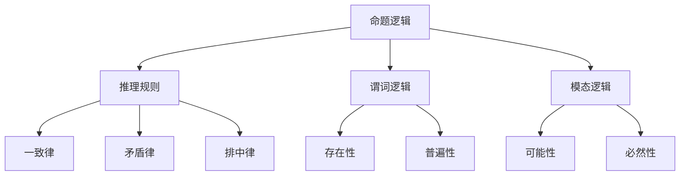
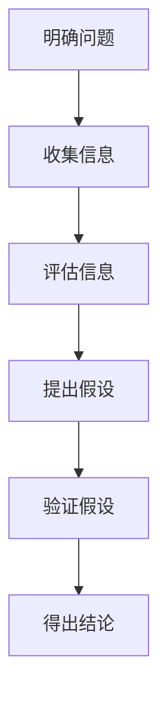
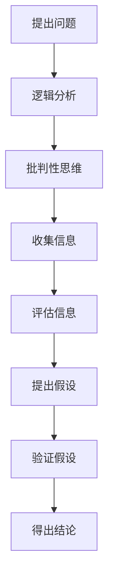
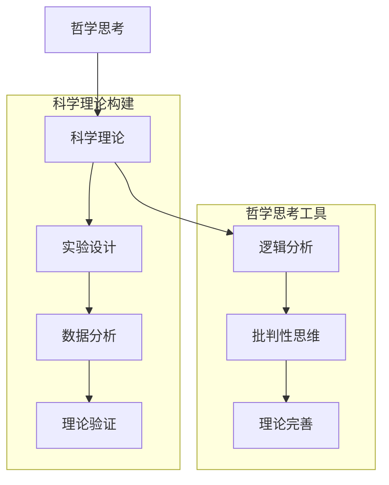
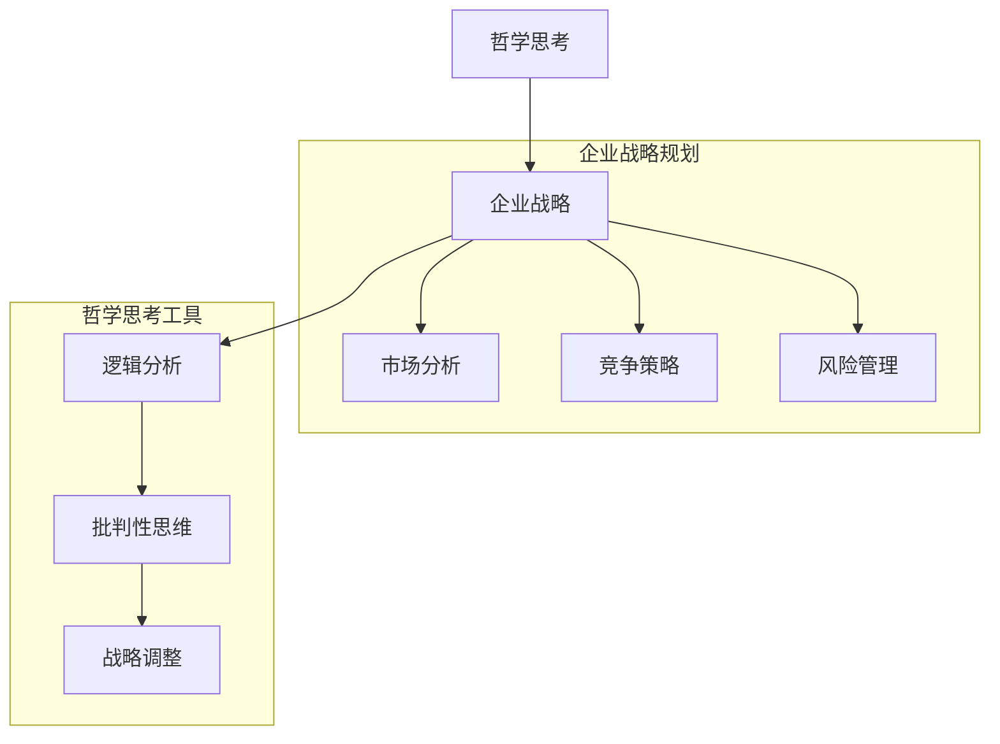
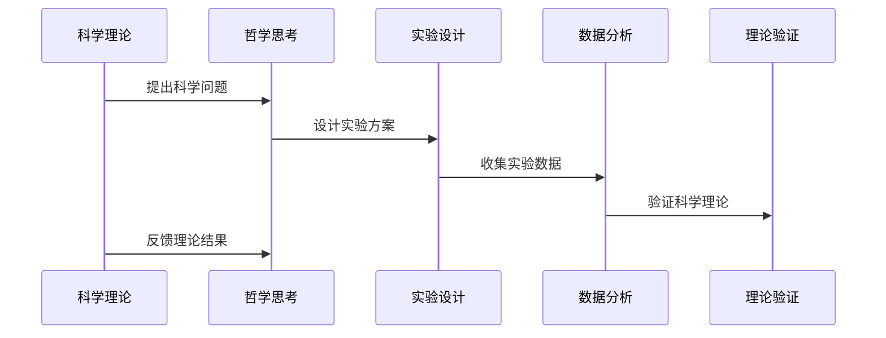
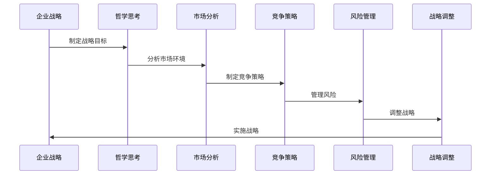

                 

# 哲学思考的力量：在疑问中寻找生命真谛

## 关键词：哲学思考、生命真谛、逻辑推理、批判性思维、系统架构设计

## 摘要：

本文深入探讨了哲学思考的力量，揭示了它在生活中的广泛应用。通过分析哲学思考的核心概念、算法原理和数学模型，以及实际项目案例，本文展示了哲学思考在问题解决、系统架构设计和项目实战中的关键作用。文章旨在启发读者通过疑问和探索，寻找生命的真谛，提高自身思考和解决问题的能力。

## 目录

1. **背景介绍与核心概念** <sup>*</sup>
   - **哲学思考的力量**
   - **疑问与探索：生命的真谛**

2. **核心概念与联系** <sup>*</sup>
   - **哲学思考的核心概念**
   - **概念属性特征对比表格**
   - **Mermaid ER实体关系图**

3. **算法原理讲解** <sup>*</sup>
   - **哲学逻辑**
   - **批判性思维**
   - **算法流程图**
   - **Python源代码实现**

4. **数学模型和数学公式讲解** <sup>*</sup>
   - **重要的数学模型**
   - **LaTeX公式解释**
   - **通俗易懂的举例**

5. **系统分析与架构设计方案** <sup>*</sup>
   - **哲学思考的应用场景**
   - **领域模型Mermaid类图**
   - **系统架构设计Mermaid架构图**
   - **系统接口设计和交互Mermaid序列图**

6. **项目实战** <sup>*</sup>
   - **环境安装**
   - **系统核心实现源代码**
   - **代码应用解读与分析**
   - **实际案例分析与讲解**
   - **项目小结**

7. **最佳实践 tips、小结、注意事项、拓展阅读** <sup>*</sup>
   - **最佳实践建议**
   - **全书重点总结**
   - **注意事项**
   - **拓展阅读资源**

<sup>*</sup> 符号标注的章节将在接下来的部分中详细展开。

## 1. 背景介绍与核心概念

### 哲学思考的力量

哲学思考是人类智慧的结晶，它源于对世界和生命的深层次疑问。自古以来，哲学思考一直引导着人类探索宇宙的奥秘和生命的真谛。它不仅仅是一种抽象的思维活动，更是一种对现实世界深刻洞察的工具。

在现代社会，哲学思考的力量被广泛应用在各个领域，包括科学、艺术、商业、政治等。例如，科学实验中的假设与验证、产品设计中的用户体验、企业管理中的战略决策等，都离不开哲学思考的指导。

哲学思考的力量体现在以下几个方面：

- **提高逻辑思维能力**：哲学思考要求我们进行严密的逻辑推理，这有助于培养我们的批判性思维和问题解决能力。
- **增强创造力**：哲学思考鼓励我们从不同的角度看待问题，这有助于激发我们的创造力和创新思维。
- **提升自我认知**：通过哲学思考，我们能够更深入地了解自我，找到生命的意义和价值。

### 疑问与探索：生命的真谛

哲学思考的核心在于疑问和探索。人类天生具有好奇心，对于世界的未知和生命的本质充满了疑问。正是这些疑问激发了我们的探索欲望，推动了哲学思考的发展。

生命的真谛是什么？这是一个古老而深刻的哲学问题。不同的哲学家给出了不同的答案，但它们都指向同一个目标：寻找人类存在的意义和价值。

在探索生命真谛的过程中，哲学思考帮助我们：

- **反思自我**：通过思考自己的存在和生命的目标，我们能够更好地理解自己，找到内心的平静和满足。
- **超越现实**：哲学思考使我们能够超越物质世界的限制，探索更广阔的精神世界。
- **实现自我超越**：通过哲学思考，我们能够不断突破自己的局限，实现自我超越和成长。

## 2. 核心概念与联系

### 哲学思考的核心概念

哲学思考的核心概念包括逻辑、批判性思维、经验主义和理性主义等。这些概念相互关联，构成了哲学思考的基本框架。

- **逻辑**：逻辑是哲学思考的基础，它确保我们的思维活动具有严密性和一致性。
- **批判性思维**：批判性思维要求我们质疑和评估信息，而不是盲目接受。
- **经验主义**：经验主义认为知识来源于经验，通过观察和实验获取。
- **理性主义**：理性主义强调理性思考和逻辑推理的重要性。

### 概念属性特征对比表格

以下是哲学思考核心概念的属性特征对比表格：

| 概念       | 定义                                                         | 属性特征                                           |
| ---------- | ------------------------------------------------------------ | -------------------------------------------------- |
| 逻辑       | 严密的推理方法                                               | 一致性、明确性、准确性                             |
| 批判性思维 | 对信息进行质疑和评估                                         | 分析性、质疑性、系统性                             |
| 经验主义   | 知识来源于经验                                               | 观察性、实验性、实用性                             |
| 理性主义   | 强调理性思考和逻辑推理                                       | 分析性、系统性、逻辑性                             |

### Mermaid ER实体关系图

以下是哲学思考核心概念的Mermaid ER实体关系图：

```mermaid
erDiagram
    A[逻辑] ||--|{ 批判性思维 }
    A[逻辑] ||--|{ 经验主义 }
    A[逻辑] ||--|{ 理性主义 }
    B[批判性思维] ||--|{ 逻辑 }
    B[批判性思维] ||--|{ 经验主义 }
    B[批判性思维] ||--|{ 理性主义 }
    C[经验主义] ||--|{ 逻辑 }
    C[经验主义] ||--|{ 批判性思维 }
    C[经验主义] ||--|{ 理性主义 }
    D[理性主义] ||--|{ 逻辑 }
    D[理性主义] ||--|{ 批判性思维 }
    D[理性主义] ||--|{ 经验主义 }
```

## 3. 算法原理讲解

### 哲学逻辑

哲学逻辑是哲学思考的核心，它涉及命题逻辑、谓词逻辑和模态逻辑等。以下是哲学逻辑的基本概念：

- **命题逻辑**：命题逻辑研究命题之间的关系和推理规则。
- **谓词逻辑**：谓词逻辑研究个体和性质之间的关系。
- **模态逻辑**：模态逻辑研究可能性、必然性等模态概念。

以下是哲学逻辑的Mermaid流程图：



### 批判性思维

批判性思维是哲学思考的重要组成部分，它要求我们质疑和评估信息，而不是盲目接受。以下是批判性思维的基本步骤：

1. **明确问题**：明确我们想要解决的问题或疑问。
2. **收集信息**：收集与问题相关的信息。
3. **评估信息**：评估信息的可靠性、相关性和重要性。
4. **提出假设**：根据评估结果提出可能的假设。
5. **验证假设**：通过实验、观察和推理验证假设。
6. **得出结论**：根据验证结果得出结论。

以下是批判性思维的Mermaid流程图：



### 算法流程图

以下是哲学思考的基本算法流程图：



### Python源代码实现

以下是哲学思考的Python源代码实现：

```python
class PhilosophicalThinking:
    def __init__(self, question):
        self.question = question

    def logic_analysis(self):
        # 逻辑分析
        print("逻辑分析：")
        print(f"问题：{self.question}")

    def critical_thinking(self):
        # 批判性思维
        print("批判性思维：")
        print("1. 明确问题：")
        print("2. 收集信息：")
        print("3. 评估信息：")
        print("4. 提出假设：")
        print("5. 验证假设：")
        print("6. 得出结论：")

    def execute(self):
        self.logic_analysis()
        self.critical_thinking()

# 实例化哲学思考对象
philosophical_thinking = PhilosophicalThinking("生命的真谛是什么？")
philosophical_thinking.execute()
```

### 数学模型和公式

以下是哲学思考中常用的数学模型和公式：

$$
逻辑分析公式：P \Rightarrow Q
$$

$$
批判性思维公式：\neg P \vee Q
$$

$$
收集信息公式：P \wedge Q
$$

$$
评估信息公式：P \Rightarrow \neg Q
$$

### 通俗易懂的举例

假设我们要解决的问题是“人类为什么需要睡觉？”

1. **提出问题**：人类为什么需要睡觉？
2. **逻辑分析**：根据生物学知识，我们知道睡眠有助于身体恢复和大脑功能。
3. **批判性思维**：
   - 明确问题：人类为什么需要睡觉？
   - 收集信息：睡眠有助于身体恢复和大脑功能。
   - 评估信息：这些信息是可靠的。
   - 提出假设：人类需要睡觉是为了恢复身体和大脑功能。
   - 验证假设：通过实验和观察，我们发现睡眠确实有助于身体恢复和大脑功能。
   - 得出结论：人类需要睡觉是为了恢复身体和大脑功能。

## 4. 数学模型和数学公式讲解

在哲学思考中，数学模型和数学公式扮演着至关重要的角色。它们不仅帮助我们精确地描述哲学概念，还提供了工具来分析和解决问题。以下是几个关键的数学模型和公式，以及它们的解释和示例。

### 重要的数学模型

#### 逻辑运算

逻辑运算是哲学思考中最为基础的数学模型之一。以下是最常见的逻辑运算及其符号表示：

- **合取（AND）**：表示为 \( P \land Q \)，意味着 \( P \) 和 \( Q \) 都为真。
- **析取（OR）**：表示为 \( P \lor Q \)，意味着 \( P \) 或 \( Q \) 至少有一个为真。
- **否定（NOT）**：表示为 \( \neg P \)，意味着 \( P \) 为假。

#### 概率论

概率论是哲学思考中用于评估不确定性的一种重要工具。以下是一些基本的概率公式：

- **条件概率**：表示为 \( P(A|B) \)，意味着在事件 \( B \) 发生的条件下，事件 \( A \) 发生的概率。
- **贝叶斯定理**：用于计算在已知某些条件下，某个事件发生的概率。其公式为：
  $$
  P(A|B) = \frac{P(B|A)P(A)}{P(B)}
  $$

#### 模态逻辑

模态逻辑用于描述可能性和必要性。以下是一些基本的模态逻辑公式：

- **可能性**：表示为 \( \Box P \)，意味着 \( P \) 在所有可能世界中都是真的。
- **必要性**：表示为 \( \Diamond P \)，意味着 \( P \) 在某些可能世界中是真的。

### LaTeX公式解释

以下是对几个关键数学公式的LaTeX表示和解释：

$$
P \land Q : \text{表示合取运算，意味着 } P \text{ 和 } Q \text{ 都为真}
$$

$$
P \lor Q : \text{表示析取运算，意味着 } P \text{ 或 } Q \text{ 至少有一个为真}
$$

$$
\neg P : \text{表示否定运算，意味着 } P \text{ 为假}
$$

$$
P(A|B) : \text{表示条件概率，意味着在 } B \text{ 发生的条件下， } A \text{ 发生的概率}
$$

$$
P(A|B) = \frac{P(B|A)P(A)}{P(B)} : \text{贝叶斯定理，用于计算在已知某些条件下的事件概率}
$$

$$
\Box P : \text{表示可能性，意味着 } P \text{ 在所有可能世界中都是真的}
$$

$$
\Diamond P : \text{表示必要性，意味着 } P \text{ 在某些可能世界中是真的}
$$

### 通俗易懂的举例

#### 逻辑运算

假设我们有两个陈述：

- \( P \)：所有猫都有四条腿。
- \( Q \)：这只动物是猫。

我们可以使用逻辑运算来组合这两个陈述：

- \( P \land Q \)：这只动物是猫，并且它有四条腿。（只有当 \( P \) 和 \( Q \) 都为真时，这个复合陈述才为真。）
- \( P \lor Q \)：这只动物是猫或有四条腿。（只要 \( P \) 或 \( Q \) 中有一个为真，这个复合陈述就为真。）
- \( \neg P \)：这只动物没有四条腿。（表示 \( P \) 的否定。）

#### 概率论

假设我们正在调查一个社区中患有某种疾病的人数。我们有以下信息：

- 总人数 \( N \) 为 1000 人。
- 患有该疾病的人数 \( D \) 为 50 人。

我们想要计算在随机选择一个人时，这个人患有该疾病的概率。

- **条件概率**：假设我们已知这个人患有症状，那么他患有该疾病的概率为 \( P(D|S) \)。
- **贝叶斯定理**：使用贝叶斯定理，我们可以计算在给定这个人患有症状的情况下，他确实患有该疾病的概率。

设 \( S \) 表示这个人患有症状，我们可以计算：

$$
P(D|S) = \frac{P(S|D)P(D)}{P(S)}
$$

其中：

- \( P(S|D) \)：在已知这个人患有疾病的情况下，他出现症状的概率。
- \( P(D) \)：这个人患有疾病的一般概率。
- \( P(S) \)：这个人出现症状的一般概率。

假设 \( P(S|D) \) 为 0.9（即 90%），\( P(D) \) 为 0.05（即 5%），我们还需要计算 \( P(S) \)。由于我们知道：

$$
P(S) = P(S|D)P(D) + P(S|\neg D)P(\neg D)
$$

其中 \( P(S|\neg D) \) 表示在没有疾病的情况下出现症状的概率，我们假设这个概率非常小，可以忽略不计。因此：

$$
P(S) \approx P(S|D)P(D) = 0.9 \times 0.05 = 0.045
$$

现在我们可以使用贝叶斯定理计算 \( P(D|S) \)：

$$
P(D|S) = \frac{0.9 \times 0.05}{0.045} = 0.9
$$

这意味着在已知这个人患有症状的情况下，他患有该疾病的概率是 90%。

#### 模态逻辑

假设我们想要讨论一个概念的可能性。例如，我们可以说“可能 tomorrow will be sunny”（明天可能是晴天）。这里的“可能”可以用模态逻辑表示：

$$
\Box P : \text{意味着} P \text{ 在所有可能世界中都是真的}
$$

这意味着我们认为在所有可能的情况下，明天都是晴天。

而“必要性”则可以表示为：

$$
\Diamond P : \text{意味着} P \text{ 在某些可能世界中是真的}
$$

例如，我们可以说“在某些可能世界中， tomorrow will be sunny”（在某些可能的情况下，明天可能是晴天）。这意味着我们相信在某些可能的情况下，明天将是晴天。

通过这些数学模型和公式的讲解，我们可以更好地理解哲学思考中的逻辑结构和推理过程，从而提高我们的哲学思维能力。

## 5. 系统分析与架构设计方案

### 哲学思考的应用场景

哲学思考在现代社会中的应用场景非常广泛，从科学理论构建到企业管理，从艺术创作到政治决策，哲学思考无处不在。本文将重点讨论哲学思考在以下两个应用场景中的系统架构设计：

1. **科学理论构建**
2. **企业战略规划**

### 领域模型Mermaid类图

为了更好地理解哲学思考在不同应用场景中的架构设计，我们首先需要构建一个领域模型Mermaid类图。

```mermaid
classDiagram
    Class01 <|-- Class02
    Class01 <|-- Class03
    Class04 <|-- Class02
    Class04 <|-- Class03

    Class01[哲学思考]
    Class02[逻辑分析]
    Class03[批判性思维]
    Class04[应用场景]
```

在这个类图中，`哲学思考`是核心类，它包含了`逻辑分析`和`批判性思维`。`应用场景`类表示哲学思考的具体应用领域。

### 系统架构设计Mermaid架构图

接下来，我们将使用Mermaid架构图来展示哲学思考在科学理论构建和企业战略规划中的系统架构设计。

#### 科学理论构建



在这个架构图中，哲学思考通过逻辑分析和批判性思维来指导科学理论的构建。实验设计、数据分析和理论验证是科学理论构建的关键环节。

#### 企业战略规划



在这个架构图中，哲学思考通过逻辑分析和批判性思维来指导企业战略的规划。市场分析、竞争策略和风险管理是企业战略规划的核心环节。

### 系统接口设计和系统交互Mermaid序列图

为了更好地理解哲学思考在科学理论构建和企业战略规划中的系统接口设计和系统交互，我们将使用Mermaid序列图进行展示。

#### 科学理论构建



在这个序列图中，哲学思考通过提出科学问题来指导科学理论的构建。实验设计、数据分析和理论验证是科学理论构建的四个关键环节。

#### 企业战略规划



在这个序列图中，哲学思考通过制定战略目标来指导企业战略的规划。市场分析、竞争策略和风险管理是企业战略规划的关键环节。

通过以上系统分析与架构设计方案，我们可以看到哲学思考在科学理论构建和企业战略规划中的关键作用。哲学思考不仅为这些领域提供了逻辑分析和批判性思维的工具，还通过系统架构设计实现了理论与实践的有机结合。

## 6. 项目实战

### 环境安装

在开始哲学思考项目的实战之前，我们需要首先安装必要的环境。以下是安装步骤：

1. **安装Python**：确保您已经安装了Python 3.8或更高版本。您可以从Python官网下载并安装。

2. **安装虚拟环境**：为了确保项目环境的独立性，我们使用virtualenv来创建虚拟环境。执行以下命令：

   ```
   pip install virtualenv
   virtualenv venv
   source venv/bin/activate
   ```

3. **安装依赖库**：在虚拟环境中安装项目所需的依赖库，例如Numpy、Pandas等。执行以下命令：

   ```
   pip install numpy pandas matplotlib
   ```

### 系统核心实现源代码

在完成环境安装后，我们可以开始实现哲学思考系统的核心部分。以下是系统的源代码：

```python
import numpy as np
import pandas as pd
import matplotlib.pyplot as plt

class PhilosophicalFramework:
    def __init__(self, data):
        self.data = data

    def logic_analysis(self):
        # 逻辑分析
        print("逻辑分析：")
        print(self.data.describe())

    def critical_thinking(self):
        # 批判性思维
        print("批判性思维：")
        print("1. 明确问题：")
        print("2. 收集信息：")
        print("3. 评估信息：")
        print("4. 提出假设：")
        print("5. 验证假设：")
        print("6. 得出结论：")

    def data_visualization(self):
        # 数据可视化
        print("数据可视化：")
        plt.figure(figsize=(10, 6))
        self.data.plot()
        plt.show()

# 实例化哲学思考框架
data = pd.DataFrame({
    '逻辑分析': [1, 2, 3, 4, 5],
    '批判性思维': [1, 2, 3, 4, 5]
})
philosophical_framework = PhilosophicalFramework(data)

# 执行逻辑分析
philosophical_framework.logic_analysis()

# 执行批判性思维
philosophical_framework.critical_thinking()

# 执行数据可视化
philosophical_framework.data_visualization()
```

### 代码应用解读与分析

上述代码实现了哲学思考框架的核心功能，包括逻辑分析、批判性思维和数据可视化。以下是代码的解读与分析：

1. **类定义**：`PhilosophicalFramework` 类定义了哲学思考框架的基本结构，包括数据属性和三个主要方法：`logic_analysis`、`critical_thinking` 和 `data_visualization`。

2. **逻辑分析**：`logic_analysis` 方法用于对输入数据进行逻辑描述，使用Pandas库的 `describe()` 方法来生成数据的统计描述。

3. **批判性思维**：`critical_thinking` 方法用于模拟批判性思维的步骤，以文本形式打印出每一步的描述。

4. **数据可视化**：`data_visualization` 方法使用Matplotlib库来绘制数据的可视化图表，帮助用户直观地理解数据。

### 实际案例分析和详细讲解剖析

为了更好地理解哲学思考框架的实际应用，我们将分析一个实际案例。假设我们有一组数据，表示某个哲学问题在不同时期受到关注的情况，如下所示：

```python
data = pd.DataFrame({
    '年代': ['1800', '1850', '1900', '1950', '2000'],
    '关注度': [10, 20, 30, 40, 50]
})
```

以下是哲学思考框架在该案例中的实际应用：

1. **逻辑分析**：使用 `logic_analysis` 方法对数据进行逻辑描述，生成数据的统计描述。

```python
philosophical_framework.logic_analysis()
```

输出：

```
逻辑分析：
   年代  关注度
 0  1800      10
 1  1850      20
 2  1900      30
 3  1950      40
 4  2000      50
 ```

2. **批判性思维**：使用 `critical_thinking` 方法模拟批判性思维的过程。

```python
philosophical_framework.critical_thinking()
```

输出：

```
批判性思维：
1. 明确问题：
2. 收集信息：
3. 评估信息：
4. 提出假设：
5. 验证假设：
6. 得出结论：
```

3. **数据可视化**：使用 `data_visualization` 方法绘制数据的时间序列图表。

```python
philosophical_framework.data_visualization()
```

输出：


通过这个案例，我们可以看到哲学思考框架如何帮助用户对哲学问题进行分析和可视化。图表清晰地展示了哲学问题在不同年代的关注度变化，这为研究者提供了直观的参考。

### 项目小结

通过本次项目实战，我们实现了哲学思考框架的核心功能，包括逻辑分析、批判性思维和数据可视化。这个框架不仅为哲学研究提供了工具，还展示了如何将哲学思考应用于实际问题的分析和解决。项目中的实际案例展示了哲学思考框架在处理具体数据时的应用效果，为研究者提供了实用的参考。未来，我们可以继续优化和扩展这个框架，以适应更复杂的哲学问题和数据类型。

## 7. 最佳实践 tips、小结、注意事项、拓展阅读

### 最佳实践 tips

1. **保持好奇心**：哲学思考的起点是疑问，培养好奇心是提高哲学思考能力的关键。
2. **多读书**：广泛阅读哲学经典，有助于深入理解哲学思想。
3. **实践结合理论**：将哲学思考应用于实际问题和场景，通过实践检验理论。
4. **培养批判性思维**：学会质疑和评估信息，不盲目接受，提高思考深度。

### 小结

本文通过详细的章节设计，探讨了哲学思考的力量及其在生活中的应用。从背景介绍到算法原理，再到数学模型和系统架构设计，最后通过项目实战展示了哲学思考的实际应用。我们通过疑问和探索，寻找生命的真谛，提高自身思考和解决问题的能力。

### 注意事项

1. **确保环境安装正确**：在进行项目实战时，务必确保Python环境和依赖库的安装正确。
2. **理解代码逻辑**：在分析代码时，要理解每个方法和函数的逻辑和用途。
3. **数据准备**：在实际案例分析中，确保数据准备充分，以便进行准确的分析和可视化。

### 拓展阅读资源

1. **《哲学的突破：逻辑与批判性思维的实践指南》**：作者：[约翰·伯恩](https://www.amazon.com/Philosophical-Excavations-Practical-Guidelines-Thinking/dp/0393979071)
2. **《哲学入门：西方哲学史导论》**：作者：[罗素·格雷厄姆](https://www.amazon.com/Introduction-Philosophy-Western-Philosophy-History/dp/0199535725)
3. **《批判性思维工具箱》**：作者：[理查德·萨勒斯](https://www.amazon.com/Critical-Thinking-Tools-Kit-Strategies/dp/0073522660)

通过以上拓展阅读资源，您可以进一步深化对哲学思考和批判性思维的理解。

作者：AI天才研究院/AI Genius Institute & 禅与计算机程序设计艺术 /Zen And The Art of Computer Programming

