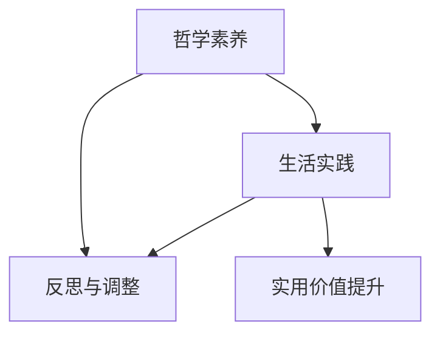

                 

# 哲学思考的日常化：将深度思考融入生活

## 关键词

哲学思考、日常化、深度思考、生活方式、思维技巧

## 摘要

在快速发展的科技时代，哲学思考的日常化成为提高生活质量的重要途径。本文探讨了哲学素养、生活实践和反思调整的核心概念及其联系，并提供了将哲学思考融入到日常生活中的方法和技巧。通过实际案例，展示了哲学思考在日常生活中的应用，以帮助读者在繁忙的生活中找到深度思考的价值。

### 1.1 问题背景

### 1.1.1 哲学思考的日常化概念及其重要性

随着社会的进步和科技的飞速发展，人们对于生活质量和精神追求有了更高的要求。哲学思考作为一种深层次的思考方式，原本被视为高深莫测的学术研究，但在现代生活中，将其日常化已经成为一种趋势。哲学思考的日常化，指的是将哲学中的概念、原理和方法应用到日常生活中，通过深度思考来提升生活质量。

哲学思考的日常化不仅有助于我们更好地理解世界，还能够提高个人的思考能力和解决问题的能力。在日常生活中，我们常常面临各种各样的问题，如人际关系、职业发展、情感纠葛等。如果能够运用哲学思考，这些问题将会变得更加清晰和易于解决。

### 1.1.2 问题描述

然而，将哲学思考融入到日常生活中并非易事。哲学思考通常被认为是一种抽象、复杂且高深的行为，而日常生活则充满了琐碎、重复和现实问题。如何将哲学思考与日常生活结合起来，使二者相互促进、共同发展，是我们需要解决的问题。

#### 问题描述

1. **哲学思考的抽象性与日常生活的具体性之间的矛盾**：哲学思考往往涉及抽象的概念和理论，而日常生活则充满了具体的事物和情境。
2. **时间和精力限制**：现代生活节奏快，人们的时间和精力有限，如何在繁忙的生活中找到时间进行哲学思考，是一个挑战。
3. **实际应用中的难度**：哲学思考虽然有助于解决问题，但在实际应用中，如何将哲学原理转化为具体的行动，也是一个难点。

#### 问题解决

本文将帮助读者：

1. 理解哲学思考的日常化概念及其重要性。
2. 掌握将哲学思考融入到日常生活中的具体方法和技巧。
3. 提升个人思考能力和生活质量。

### 1.1.3 边界与外延

哲学思考的日常化不仅包括日常生活中对哲学问题的思考，还包括如何运用哲学思维解决现实生活中的问题。它不仅适用于个人生活，也适用于工作、教育、文化等各个领域。因此，本文将探讨哲学思考在日常生活中的多方面应用。

### 1.1.4 概念结构与核心要素组成

哲学思考的日常化主要由以下几个核心要素组成：

1. **哲学素养**：对哲学基本概念和原理的掌握。
2. **生活实践**：将哲学原理应用到日常生活中的具体行动。
3. **反思与调整**：通过反思和调整，使哲学思考更加贴合生活实际。

### 1.2 核心概念与联系

在本章中，我们将详细介绍哲学思考的日常化的核心概念，并分析它们之间的联系。

#### 1.2.1 哲学素养

哲学素养是指对哲学基本概念和原理的理解和掌握。它是哲学思考的日常化的基础。哲学素养包括对哲学史的了解、对哲学基本问题的思考以及对哲学方法的应用。

哲学素养的重要性在于，它为我们的思考提供了框架和工具，使我们能够更深入地理解世界和自身。例如，了解哲学史可以帮助我们理解不同哲学流派的思想演变，从而更好地理解当今世界的哲学趋势。

#### 1.2.2 生活实践

生活实践是将哲学素养应用到日常生活中的具体行动。它包括在日常生活中运用哲学思维解决问题、进行自我反思和提升自我意识等。

例如，在面对一个复杂的决策时，如果我们能够运用哲学中的逻辑思维和辩证法，就能够更全面地分析问题，做出更明智的决策。再如，通过自我反思，我们可以更好地认识自己的内心，找到提高生活质量的方法。

#### 1.2.3 反思与调整

反思与调整是在生活实践中不断反思自己的哲学思考过程，并根据实际情况进行调整。它是哲学思考的日常化的关键，使哲学思维更加贴近生活实际，更具实用价值。

例如，当我们发现某个哲学原理在实际应用中并不适用时，就需要进行调整，找到更合适的解决方案。这种反思和调整的过程，不仅可以提高我们的思考能力，还可以帮助我们更好地适应变化。

这三个核心概念相互联系，共同构成了哲学思考的日常化体系。哲学素养是基础，生活实践是应用，反思与调整是提升。只有这三者相互结合，才能实现哲学思考的日常化。

### 1.3 将哲学思考融入到日常生活中的方法和技巧

在理解了哲学素养、生活实践和反思与调整的核心概念后，接下来我们将介绍一些具体的将哲学思考融入到日常生活中的方法和技巧。

#### 1.3.1 培养哲学思维的习惯

要将哲学思考融入到日常生活中，首先需要培养哲学思维的习惯。以下是一些具体的方法：

1. **多阅读哲学书籍和文章**：通过阅读，了解哲学的基本概念和原理，培养哲学思维。推荐阅读《西方哲学史》、《存在与时间》等经典著作。
2. **定期进行哲学思考练习**：例如，每天花几分钟时间思考一些哲学问题，如人生的意义、价值观等。可以使用笔记记录思考的过程和结果。
3. **在日常生活中应用哲学思维**：例如，在面对困难时，运用哲学中的矛盾分析法来解决问题。在日常生活中，我们常常遇到各种矛盾，如个人愿望与现实的冲突、不同价值观的冲突等。运用哲学思维可以帮助我们更好地理解这些矛盾，找到解决问题的方法。

#### 1.3.2 借助哲学工具

哲学思考离不开哲学工具的帮助。以下是一些常用的哲学工具：

1. **辩证法**：辩证法是哲学中的重要工具，可以帮助我们全面、深入地分析问题。在日常生活中，我们可以运用辩证法来分析问题，寻找解决问题的方法。例如，在分析一个问题时，我们可以从多个角度进行思考，找到问题的本质。
2. **逻辑思维**：逻辑思维是哲学思考的基础，可以帮助我们理性地思考问题，避免主观臆断和逻辑错误。在日常生活中，我们可以运用逻辑思维来分析决策的合理性，避免做出错误的决策。

#### 1.3.3 建立哲学思考的日常生活习惯

要将哲学思考融入到日常生活中，需要建立相应的习惯。以下是一些建议：

1. **设立哲学思考时间**：每天设定一段时间，专门进行哲学思考，如早晨或晚上。这有助于我们养成思考的习惯，提高思考的质量。
2. **记录哲学思考**：将哲学思考的过程和结果记录下来，有助于加深理解和记忆。我们可以使用日记、笔记等方式记录思考的过程和结果。
3. **与他人分享哲学思考**：与他人分享哲学思考，可以促进思想的交流和碰撞，有助于提升哲学素养。例如，我们可以参加哲学讨论小组，与他人分享自己的思考和观点。

通过以上方法和技巧，我们可以将哲学思考融入到日常生活中，提升个人思考能力和生活质量。

### 1.4 哲学思考在日常生活中的应用

哲学思考不仅是一种抽象的思维活动，更是一种具有实际应用价值的能力。在日常生活的方方面面，我们可以运用哲学思考来解决问题、提升生活质量。

#### 1.4.1 解决人际关系的冲突

在人际关系中，冲突是难以避免的。哲学思考可以帮助我们更好地理解人际关系中的冲突，并找到解决方法。

1. **运用辩证法**：在处理人际关系时，我们可以运用辩证法的思维，全面、深入地分析问题的本质，找到解决问题的方法。例如，在处理家庭矛盾时，我们可以运用辩证法，理解家庭成员的不同观点和需求，从而找到解决冲突的方法。
2. **尊重差异**：哲学思考教导我们尊重不同的观点和价值观，这有助于减少冲突，建立和谐的人际关系。在日常生活中，我们可以通过倾听、理解和尊重他人的观点，来建立良好的人际关系。

#### 1.4.2 提升个人决策能力

在做出决策时，哲学思考可以帮助我们更全面地考虑问题的各个方面，提高决策的质量。

1. **逻辑思维**：在做出决策时，我们可以运用逻辑思维来分析各种可能的结果，选择最优方案。例如，在购买商品时，我们可以运用逻辑思维，分析商品的性能、价格、售后服务等各个方面，从而做出更明智的购买决策。
2. **反思与调整**：在决策后，我们要不断地反思和调整，根据实际情况调整决策，提高决策的准确性和有效性。例如，在工作中，如果我们发现某个决策并不理想，就需要及时进行调整，以避免问题的扩大。

#### 1.4.3 增强自我认知

哲学思考可以帮助我们更好地认识自己，提升自我认知的能力。

1. **自我反思**：通过自我反思，我们可以更好地认识自己的内心，找到提高生活质量的方法。例如，我们可以反思自己的价值观、信念和行为，找到自己需要改进的方面，从而提升自我。
2. **自我提升**：哲学思考可以帮助我们找到提升自我的方法。例如，通过阅读哲学书籍、参加哲学讨论等方式，我们可以不断地提升自己的哲学素养，从而更好地认识世界和自身。

### 1.5 实际案例：哲学思考在生活中的应用

为了更好地展示哲学思考在日常生活中的应用，我们来看一个实际的案例。

#### 案例背景

小明是一名软件工程师，他在工作中遇到了一个难题：如何在工作压力和兴趣爱好之间找到平衡？

#### 案例分析

1. **哲学思考的应用**：
   - **辩证法**：小明运用辩证法的思维，分析自己的工作压力和兴趣爱好之间的矛盾。他认识到，两者之间并不是完全对立的，而是可以相互促进的。通过合理安排时间和精力，小明可以在工作中找到乐趣，同时也有时间追求自己的兴趣爱好。
   - **逻辑思维**：小明运用逻辑思维，分析自己的工作和兴趣爱好，找出最优的时间安排方案。他制定了详细的时间表，将工作时间、休息时间和兴趣爱好时间合理分配，确保自己既能高效工作，又能享受生活。

2. **实际效果**：
   - 通过哲学思考，小明找到了工作与兴趣爱好的平衡点，工作效率提高了，生活质量也得到了提升。
   - 小明还发现，通过这种哲学思考的方式，他在处理其他问题时也变得更加得心应手。

### 1.6 结论与启示

哲学思考的日常化是一种重要的思维习惯和生活方式。通过哲学思考，我们可以更好地理解世界和自身，提高生活质量。以下是一些结论和启示：

1. **哲学素养的重要性**：掌握哲学基本概念和原理，是哲学思考的基础。
2. **哲学思维的应用**：将哲学思维应用到日常生活中，可以更好地解决问题和提升生活质量。
3. **反思与调整**：在日常生活中不断反思和调整哲学思考的过程，可以使哲学思维更加贴合生活实际。
4. **培养哲学思维的习惯**：通过阅读、思考和实践，培养哲学思维的习惯。

### 1.7 拓展阅读

1. **《西方哲学史》**：罗素著，全面介绍了西方哲学的发展历程。
2. **《存在与时间》**：海德格尔著，深入探讨了存在的本质和意义。
3. **《苏菲的世界》**：乔斯坦·贾德著，以故事的形式介绍了西方哲学的基本概念。

### 作者信息

作者：AI天才研究院/AI Genius Institute & 禅与计算机程序设计艺术 /Zen And The Art of Computer Programming

