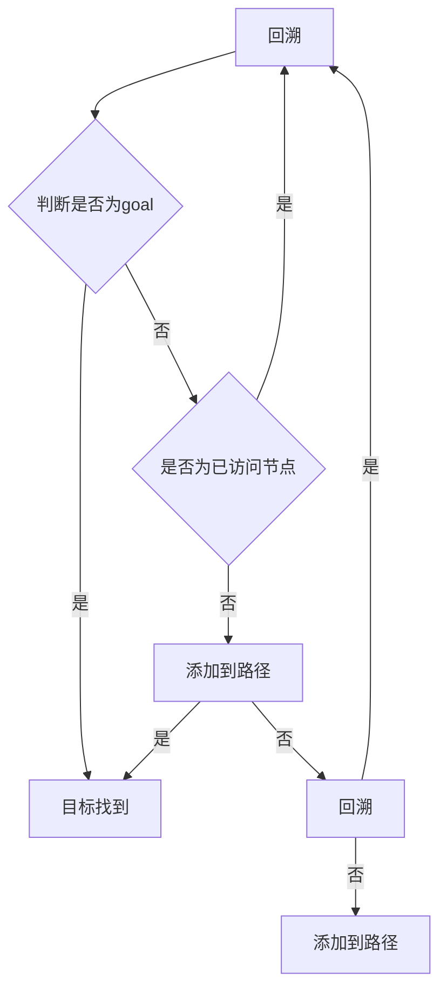

                 

## 引言

### 哲学思考的定义、重要性及本书目的

哲学思考，作为一种深层次、系统化的思维方式，源自人类对世界和自我的根本性追问。它不仅仅是对概念和理论的探讨，更是一种对现实问题的深刻反思和系统性分析。在日常生活中，哲学思考扮演着不可或缺的角色，它帮助我们从纷繁复杂的表象中洞察本质，做出更明智的决策，培养批判性思维，从而提升个人和社会的整体素质。

哲学思考的重要性体现在多个方面。首先，它能够帮助我们更好地理解世界，提高我们的认知水平。通过哲学思考，我们可以探索存在的意义、知识的来源、道德的准则等问题，从而对人生有更深刻的认识。其次，哲学思考有助于培养批判性思维，使我们能够对信息和观点进行独立判断，不盲从、不轻信，从而形成自己的见解。此外，哲学思考还能够提升我们的决策能力，使我们更加理性地分析问题，找到最优的解决方案。

本书的目的是通过系统地介绍哲学思考的基本概念、方法和实践，帮助读者在日常生活中培养哲学思考的习惯，并将其应用于各种情境中。本书将涵盖哲学思考的定义、核心问题、方法论、实践应用以及哲学思考对个人成长和社会责任的影响。通过这一系列内容的介绍，读者将能够掌握哲学思考的基本技能，并在实际生活中运用这些技能，提升自己的思维品质和生活质量。

### 哲学思考的基本概念

哲学思考，作为一种深层次的思维方式，其基本概念源于对人类存在、知识、道德等根本性问题的探索。为了更好地理解哲学思考，我们首先需要明确几个核心术语和它们之间的关系。

#### 存在论

存在论是哲学思考中的核心问题之一，它探讨的是“存在”的本质和性质。存在论关注的是事物的本质特征、存在的形式以及存在的理由。例如，亚里士多德的存在论强调“实质”和“属性”的关系，认为一切事物都有其固有的本质和属性。

**存在论的核心问题**包括：
- 什么是一个事物的本质？
- 存在是绝对的吗，还是相对的？
- 存在的本质是否可以被完全认知？

#### 知识论

知识论探讨的是知识的本质、来源、性质及其界限。知识论的核心问题是“我们如何获得知识？”以及“什么是真正的知识？”。例如，柏拉图的知识论认为，知识来自于我们对理念的洞见，而亚里士多德则强调通过感知和理性分析来获得知识。

**知识论的核心问题**包括：
- 知识是天赋的吗，还是后天习得的？
- 知识是否可靠？是否存在不可知的领域？
- 知识的界限是什么？

#### 伦理学

伦理学是哲学思考中的另一个重要分支，它研究道德和行为的准则。伦理学的核心问题是“什么是善和恶？”以及“我们如何做出道德决策？”。例如，康德的伦理学强调义务论，认为道德行为是基于普遍的道德法则，而功利主义则强调行为的后果。

**伦理学的核心问题**包括：
- 道德的本质是什么？
- 个体与社会之间的道德关系是怎样的？
- 道德决策应基于哪些原则和标准？

#### 形而上学

形而上学探讨的是超越经验世界的本质问题，它试图回答宇宙、时间、空间、因果律等基本问题。形而上学是哲学思考的基石，因为它为我们提供了关于世界的本质性理解。

**形而上学核心问题**包括：
- 宇宙的本质是什么？
- 时间和空间是如何存在的？
- 因果律是否是绝对的？

### 边界与外延

哲学思考的边界与外延涉及哲学与其他学科的关系，以及哲学思考在现代社会中的发展。哲学不仅与科学、宗教、心理学等其他学科密切相关，而且在现代社会中，哲学思考的应用范围不断扩大，从伦理问题到技术伦理，从政治哲学到社会问题，哲学思考无处不在。

**边界与外延问题**包括：
- 哲学与其他学科的关系如何？
- 哲学思考如何在现代社会中发挥作用？
- 哲学思考的未来发展趋势是什么？

通过以上对哲学思考基本概念的分析，我们可以看到哲学思考是一个庞大而复杂的体系，它涵盖了从存在的本质到知识的来源，再到道德和行为准则，以及超越经验世界的形而上学问题。这些基本概念不仅是哲学思考的核心，也是我们在日常生活中培养哲学思考习惯的重要基础。

### 哲学思考的方法

哲学思考作为一种深刻的思维方式，其独特之处在于其系统性和逻辑性。为了更好地理解和应用哲学思考，我们需要掌握几种基本的哲学思考方法。以下是几种主要的哲学思考方法及其具体应用。

#### 逻辑推理

逻辑推理是哲学思考的核心方法之一，它通过一系列逻辑步骤，从已知的前提出发，得出合理的结论。逻辑推理的基本原理包括演绎推理和归纳推理。

**演绎推理**是从一般到个别的推理过程。例如，如果我们知道所有人都会死亡，而苏格拉底是人，那么我们可以得出结论：苏格拉底会死亡。这种推理方式强调前提与结论之间的必然逻辑关系。

**归纳推理**则是从个别到一般的推理过程。例如，通过观察大量的天鹅都是白色的，我们可能归纳出“所有天鹅都是白色的”这一结论。这种推理方式强调从具体实例中归纳出普遍规律。

在哲学思考中，逻辑推理的应用非常广泛。例如，当我们探讨知识问题时，可以通过逻辑推理分析知识的来源、性质和可靠性；在伦理学中，逻辑推理可以帮助我们确定道德原则和行为准则。

#### 辩证思维

辩证思维是一种动态的、全面的思维方式，它强调事物之间的矛盾和对立，并通过矛盾的统一和斗争推动事物的发展。辩证思维的基本原则包括：

- **对立统一原则**：认为事物内部存在着相互对立的方面，这些对立方面在一定条件下可以相互转化。
- **质量互变原则**：认为事物的变化和发展是由量的积累引起的，当量变达到一定程度时，会引起质的飞跃。
- **否定之否定原则**：认为事物的发展是通过否定自身来实现的，每一次否定都是对前一次发展的扬弃。

在哲学思考中，辩证思维可以帮助我们理解事物的复杂性和变化性。例如，在探讨社会发展问题时，我们可以通过辩证思维分析社会内部的矛盾和冲突，以及这些矛盾如何推动社会的发展。

#### 批判性思考

批判性思考是一种基于证据和分析的思维方式，它强调对观点和信息的独立判断和评估。批判性思考的基本原则包括：

- **怀疑精神**：对所有的观点和信息持怀疑态度，不轻信、不盲从。
- **分析能力**：对信息进行深入分析，识别其逻辑、证据和论据的有效性。
- **逻辑严密性**：确保推理过程严密无漏洞，结论基于充分有效的证据。

在哲学思考中，批判性思考可以帮助我们辨别真理和谬误，形成独立和理性的观点。例如，在讨论道德问题时，我们可以通过批判性思考分析不同道德观念的合理性，从而形成自己的道德判断。

通过逻辑推理、辩证思维和批判性思考，我们可以更加系统、全面地理解哲学问题，并在日常生活中应用这些思考方法，提升我们的思维品质和决策能力。这些哲学思考方法不仅是我们探索世界和理解自我的工具，也是我们在复杂多变的社会中，保持独立思考和理性判断的基石。

### 哲学思考在生活中的应用

哲学思考作为一种深层次的思维方式，其价值不仅仅在于理论探讨，更在于实际应用。在日常生活中，哲学思考可以帮助我们解决实际问题，提升决策质量，培养批判性思维，从而提高我们的生活质量和工作效率。以下是一些具体的应用场景和实践方法。

#### 哲学思考在日常决策中的应用

在日常生活中，我们经常需要做出各种决策，从选择职业、教育规划，到日常购物、休闲娱乐。哲学思考可以帮助我们更理性地分析问题，做出最优决策。

**1. 如何运用哲学思考进行决策？**

- **明确目标**：在做出决策之前，我们需要明确自己的目标和需求。哲学思考强调对问题的深入理解，因此我们可以通过问自己一系列问题，如“这个决策对我的长期目标有何影响？”“它是否符合我的价值观？”等，来明确目标。
- **分析信息**：收集和分析与决策相关的信息是关键步骤。哲学思考强调批判性思考，因此我们需要对信息进行深入分析，识别其可靠性和相关性。例如，在购物时，我们可以通过比较不同商品的性能、价格、用户评价等信息，来做出更明智的选择。
- **权衡利弊**：在做出决策时，我们需要权衡各种因素，包括成本、收益、风险等。哲学思考可以帮助我们全面分析利弊，从而做出更全面的决策。例如，在职业选择中，我们可以通过分析工作内容、发展前景、薪资待遇等因素，来评估不同选择的利弊。

**2. 案例分析**

- **案例1：职业选择**  
小王面临职业选择，他在一家大型互联网公司和一家初创企业之间犹豫不决。通过哲学思考，他首先明确了长期职业发展的目标，然后分析了两家企业的优势与劣势，最终选择了初创企业，因为他认为在这个环境中，他可以学到更多的技能和经验，有利于他的长期职业规划。
- **案例2：教育规划**  
小张希望提高自己的教育水平，但他不确定是否应该继续攻读研究生。通过哲学思考，他明确了提升学历对职业发展的影响，分析了攻读研究生所需的成本和收益，最终决定继续深造，因为他对学术研究有浓厚的兴趣，并认为研究生学历将有助于他的职业发展。

#### 哲学思考在教育中的应用

教育是哲学思考的重要应用领域之一。通过哲学思考，我们可以提高教育质量，培养学生的批判性思维和创新能力。

**1. 如何通过哲学思考提升教育质量？**

- **引导学生思考**：教育不仅仅是知识的传递，更是思维能力的培养。通过哲学思考，教师可以引导学生深入思考，形成自己的观点和见解。例如，在讨论道德问题时，教师可以引导学生分析不同的道德观念，培养他们的批判性思维。
- **培养批判性思维**：批判性思维是哲学思考的核心要素之一。通过哲学思考，教师可以培养学生的批判性思维，使他们能够对信息和观点进行独立判断。例如，在科学教学中，教师可以通过哲学思考引导学生分析实验结果，培养他们的科学素养和批判性思维。
- **创新教育方法**：哲学思考可以帮助教师创新教育方法，提高教学效果。例如，通过讨论哲学问题，教师可以激发学生的学习兴趣，培养他们的合作意识和沟通能力。

**2. 案例分析**

- **案例1：道德教育**  
在道德教育中，教师可以通过哲学思考引导学生讨论道德问题，如“什么是正义？”“如何做出道德决策？”等。通过深入的讨论和辩论，学生可以形成自己的道德观念，培养批判性思维和道德判断能力。
- **案例2：创新教育**  
某学校采用哲学思考方法进行创新教育实践，通过设计哲学问题讨论课，培养学生的创造性思维和解决问题的能力。例如，教师可以设计一个哲学问题，如“如何改善城市交通拥堵？”让学生通过小组讨论和方案设计，提出创新的解决方案。

#### 哲学思考在职场中的应用

在职场中，哲学思考可以帮助我们提升工作效率，处理复杂问题，建立良好的人际关系。

**1. 如何通过哲学思考提升工作效率？**

- **明确工作目标**：通过哲学思考，我们可以明确工作的目标和任务，从而更有针对性地完成任务。例如，在项目策划阶段，通过哲学思考可以明确项目的目标、范围和预期成果，从而提高项目执行效率。
- **分析问题本质**：哲学思考强调对问题的深入分析，可以帮助我们找到问题的本质和关键点。例如，在解决技术难题时，通过哲学思考可以分析问题的各个方面，找到最佳的解决方案。
- **优化工作流程**：哲学思考可以帮助我们优化工作流程，提高工作效率。例如，通过分析工作流程中的各个环节，我们可以找出瓶颈和改进点，从而优化工作流程，提高整体效率。

**2. 案例分析**

- **案例1：项目管理**  
在项目管理中，通过哲学思考可以明确项目的目标、范围和关键里程碑，从而提高项目执行的效率和质量。例如，项目经理可以通过哲学思考分析项目的风险和不确定性，制定相应的应对策略，确保项目的顺利进行。
- **案例2：团队协作**  
在团队协作中，哲学思考可以帮助我们处理复杂的人际关系，建立良好的团队氛围。例如，通过哲学思考可以分析团队成员之间的冲突和矛盾，找到解决问题的方法，从而提高团队协作效率。

通过以上案例分析，我们可以看到哲学思考在生活中的广泛应用。无论是在日常决策、教育领域，还是职场中，哲学思考都能帮助我们更好地理解问题、分析问题，从而做出更明智的决策。哲学思考不仅是一种理论探讨，更是一种实用的工具，它可以帮助我们在复杂多变的环境中，保持清晰的思维和理性的判断，提升我们的生活质量和工作效率。

### 哲学思考与个人成长

哲学思考不仅是一种思维工具，更是一种个人成长的路径。通过哲学思考，我们可以提升自己的认知水平、价值观以及自我意识，从而在个人成长的道路上迈出坚实的步伐。

#### 哲学思考对个人认知的影响

哲学思考对个人认知的提升具有重要意义。首先，它能够帮助我们拓展思维视野，打破思维定势，从而更全面地看待问题。例如，通过哲学思考，我们可以理解到事物的复杂性和多样性，不再局限于表面的现象，而是深入到问题的本质。

**1. 提升认知能力**

哲学思考能够提高我们的逻辑推理能力、批判性思维和分析能力。通过逻辑推理，我们可以更系统地分析问题，找出问题的核心和关键点。批判性思维则使我们能够对信息和观点进行独立判断，不盲从、不轻信。分析能力则帮助我们将复杂的问题分解为更简单的部分，从而更好地理解和解决。

**2. 拓展思维视野**

哲学思考能够拓宽我们的思维视野，使我们能够从不同的角度看待问题。例如，通过哲学思考，我们可以理解到不同的文化、价值观和社会背景对问题的影响，从而更加包容和开放。这种思维视野的拓展不仅有助于我们更好地理解世界，也有助于我们更好地与他人沟通和合作。

#### 哲学思考对个人价值观的塑造

哲学思考对个人价值观的塑造具有深远影响。通过哲学思考，我们可以深入探讨道德、正义、自由等基本问题，从而形成自己的价值观体系。

**1. 价值观的多样性**

哲学思考使我们认识到，不同的文化和社会背景会产生不同的价值观。例如，西方文化强调个人主义，注重自由和独立，而东方文化则强调集体主义，注重和谐与团结。通过哲学思考，我们可以理解和尊重这些差异，从而形成多元化的价值观。

**2. 价值观的冲突与调和**

在现实生活中，我们经常遇到价值观的冲突。例如，在工作中，个人利益与团队利益之间可能存在冲突。通过哲学思考，我们可以分析和解决这些冲突，找到平衡点。例如，通过辩证思维，我们可以理解到个人利益和团队利益之间的对立和统一关系，从而在冲突中找到调和的方法。

#### 哲学思考与自我意识

哲学思考不仅能够提升我们的认知水平和价值观，还能够帮助我们更好地认识自我，增强自我反思能力。

**1. 提升自我认知**

通过哲学思考，我们可以深入探讨自我的本质，理解自己的思想、情感和行为。例如，通过哲学思考，我们可以认识到自己的偏见和盲点，从而更好地认识自我。这种自我认知不仅有助于我们更好地应对生活中的挑战，也有助于我们更好地与他人相处。

**2. 增强自我反思能力**

哲学思考能够培养我们的自我反思能力，使我们能够对自己的行为和决策进行深入反思。例如，在日常生活中，通过哲学思考，我们可以反思自己的行为是否符合自己的价值观，是否有利于自己的成长。这种自我反思能力不仅有助于我们纠正错误，也有助于我们更好地实现自我提升。

总之，哲学思考对个人成长具有重要意义。通过哲学思考，我们可以提升认知水平、塑造价值观、认识自我，从而在个人成长的道路上迈出坚实的步伐。哲学思考不仅是一种思维工具，更是一种生活方式，它帮助我们更好地理解世界、认识自我，从而实现个人的全面发展。

### 哲学思考与社会责任

哲学思考不仅对个人成长有着深远的影响，也在社会责任的履行中发挥着重要作用。在现代社会，个人与社会之间的紧密联系要求我们不仅关注个人的成长，还要关注社会的整体福祉。哲学思考为我们提供了一种深刻的思维方式，帮助我们更好地理解社会责任，并在实践中履行这些责任。

#### 哲学思考与社会伦理

社会伦理是哲学思考中的一个重要领域，它探讨个人与社会之间的关系，以及个人行为对社会的影响。通过哲学思考，我们可以深入分析社会伦理问题，理解道德原则和社会责任。

**1. 社会责任的重要性**

社会责任是指个人或组织对社会、环境和他人所承担的义务和责任。社会责任的重要性体现在以下几个方面：

- **维护社会和谐**：通过履行社会责任，个人和组织可以促进社会的和谐发展，减少社会矛盾和冲突。
- **推动社会进步**：社会责任的履行有助于推动社会的创新和进步，提高社会的整体素质。
- **实现可持续发展**：社会责任的履行有助于实现经济、社会和环境的可持续发展，为后代留下良好的生存环境。

**2. 哲学思考如何引导社会责任**

哲学思考为我们提供了分析和解决社会伦理问题的工具。通过哲学思考，我们可以：

- **明确社会责任的定义**：哲学思考帮助我们理解社会责任的含义和范围，从而明确我们应当承担的责任。
- **分析社会责任的来源**：哲学思考帮助我们识别社会责任的来源，如法律法规、道德规范、社会习俗等，从而更好地理解和履行这些责任。
- **评估社会责任的履行情况**：哲学思考可以帮助我们评估个人和组织在社会责任履行方面的表现，找出不足之处，并采取改进措施。

#### 哲学思考与公共道德

公共道德是社会成员共同遵守的行为准则和价值观念，是维护社会秩序和公共利益的基础。哲学思考在公共道德的构建和实施中发挥着重要作用。

**1. 公共道德的内涵**

公共道德主要包括以下几个方面：

- **公正与平等**：公共道德强调每个人都应当受到公正对待，享有平等的权利和机会。
- **诚信与责任感**：公共道德要求个人和机构在行为上诚实守信，对社会和他人负责。
- **互助与关爱**：公共道德鼓励个人之间相互帮助，共同关爱弱势群体。

**2. 哲学思考如何影响公共道德**

哲学思考对公共道德的影响体现在以下几个方面：

- **引导道德观念的形成**：哲学思考帮助我们理解公共道德的基本原则和价值观念，从而形成正确的道德观念。
- **促进道德规范的实施**：哲学思考帮助我们分析道德规范的实际应用场景，制定具体的实施策略，从而更好地实现公共道德。
- **提升道德修养**：哲学思考通过深入探讨道德问题，提升个人的道德修养和道德判断能力，促进社会的道德进步。

#### 哲学思考与可持续发展

可持续发展是现代社会面临的重要挑战之一，它要求我们在满足当前需求的同时，不损害未来世代的利益。哲学思考在可持续发展中发挥着重要作用。

**1. 可持续发展的重要性**

可持续发展的重要性体现在以下几个方面：

- **保障资源利用**：可持续发展强调合理利用自然资源，确保资源的可持续供应。
- **保护生态环境**：可持续发展关注生态环境的保护，防止环境污染和生态破坏。
- **促进社会公平**：可持续发展关注社会公平，减少贫富差距，提高社会整体福利。

**2. 哲学思考在可持续发展中的应用**

哲学思考在可持续发展中的应用包括：

- **环境伦理**：哲学思考帮助我们理解环境伦理，认识到人类活动对环境的影响，从而采取环境保护措施。
- **公平正义**：哲学思考帮助我们分析社会资源分配的不平等现象，推动社会公平，实现可持续发展。
- **道德规范**：哲学思考通过制定道德规范，引导个人和组织在可持续发展中承担责任，促进社会的可持续发展。

总之，哲学思考在履行社会责任、构建公共道德和实现可持续发展中发挥着重要作用。通过哲学思考，我们能够更好地理解社会责任，提高道德修养，促进社会的和谐与进步。哲学思考不仅是一种理论工具，更是一种实践指南，它帮助我们更好地履行社会责任，实现个人与社会的共同发展。

### 总结与展望

在本文中，我们系统地探讨了哲学思考的基本概念、方法及其在生活中的应用，从个人成长到社会责任，再到可持续发展，哲学思考无处不在。哲学思考不仅帮助我们更好地理解世界和自我，还提升了个人的决策能力和批判性思维，促进了社会的和谐与进步。

**总结：哲学思考的核心内容与应用**

哲学思考的核心内容涵盖了存在论、知识论、伦理学和形而上学等多个方面。通过对这些基本概念的理解，我们能够更深刻地认识世界和自己。哲学思考的方法，如逻辑推理、辩证思维和批判性思考，不仅有助于我们分析问题，还能指导我们在实际生活中做出更明智的决策。此外，哲学思考在个人成长、社会责任和可持续发展中的应用，进一步展示了其在现实生活中的重要性。

**哲学思考的未来发展**

展望未来，哲学思考将继续在多个领域发挥作用。随着人工智能和大数据技术的发展，哲学思考将面临新的挑战和机遇。例如，如何处理人工智能带来的伦理问题，如何确保人工智能的决策符合道德原则，这些都需要哲学思考的深入探讨。此外，哲学思考也将与心理学、社会学等学科进一步融合，为解决复杂的社会问题提供新的思路和方法。

**鼓励读者继续思考**

最后，我们鼓励读者在日常生活中积极实践哲学思考。哲学思考不仅是一种知识，更是一种习惯和生活方式。通过不断练习和思考，我们能够提升自己的思维品质，更好地应对生活中的各种挑战。希望本文能够为读者提供一些启示，引导大家走上哲学思考的道路，不断探索、不断进步。

### 致谢

在撰写本书的过程中，我得到了许多人的帮助和支持。首先，感谢我的家人和朋友们，他们在我构思和写作过程中提供了无尽的鼓励和支持。其次，感谢我的同事和同行们，他们的专业意见和反馈使得本书的内容更加丰富和深刻。此外，特别感谢AI天才研究院（AI Genius Institute）的全体成员，他们的技术支持和合作使本书的编写过程顺利而富有成果。最后，感谢所有参与审阅和反馈的读者，你们的宝贵意见使得本书能够不断完善。感谢所有帮助和支持我的人，你们的支持是我前进的动力。

### 目录大纲设计

为了确保文章的结构清晰、逻辑连贯，以下是详细的目录大纲设计，每个章节的内容都进行了具体安排。

#### 引言
- **引言**：哲学思考的定义、重要性及本书目的
    - 介绍哲学思考的基本概念
    - 阐述哲学思考在当代社会的重要性
    - 阐明本书的目的和结构

#### 核心概念
- **第1章：哲学思考的基本概念
    - **1.1 问题背景与哲学思考的起源**
        - 哲学思考的起源
        - 哲学思考的演变
    - **1.2 哲学思考的核心问题**
        - 存在论
        - 知识论
        - 伦理学
        - 形而上学
    - **1.3 哲学思考的边界与外延**
        - 哲学与其他学科的关系
        - 哲学思考的现代发展

#### 哲学思考方法
- **第2章：哲学思考的方法
    - **2.1 逻辑推理**
        - 逻辑推理的基本原理
        - 逻辑推理的应用
    - **2.2 辩证思维**
        - 辩证思维的概念
        - 辩证思维的方法
    - **2.3 批判性思考**
        - 批判性思考的重要性
        - 批判性思考的技巧

#### 哲学思考实践
- **第3章：哲学思考在生活中的应用
    - **3.1 哲学思考在日常决策中的应用**
        - 如何运用哲学思考进行决策
        - 案例分析
    - **3.2 哲学思考在教育中的应用**
        - 如何通过哲学思考提升教育质量
        - 案例分析
    - **3.3 哲学思考在职场中的应用**
        - 如何通过哲学思考提升工作效率
        - 案例分析

#### 哲学思考与个人成长
- **第4章：哲学思考与个人成长
    - **4.1 哲学思考对个人认知的影响**
        - 提升认知能力
        - 拓展思维视野
    - **4.2 哲学思考对个人价值观的塑造**
        - 价值观的多样性
        - 价值观的冲突与调和
    - **4.3 哲学思考与自我意识**
        - 提升自我认知
        - 增强自我反思能力

#### 哲学思考与社会责任
- **第5章：哲学思考与社会责任
    - **5.1 哲学思考与社会伦理**
        - 社会责任的重要性
        - 哲学思考如何引导社会责任
    - **5.2 哲学思考与公共道德**
        - 公共道德的内涵
        - 哲学思考如何影响公共道德
    - **5.3 哲学思考与可持续发展**
        - 可持续发展的重要性
        - 哲学思考在可持续发展中的应用

#### 总结与展望
- **第6章：总结与展望
    - **6.1 哲学思考的总结**
        - 哲学思考的核心内容
        - 哲学思考的应用
    - **6.2 哲学思考的未来发展**
        - 哲学思考面临的挑战
        - 哲学思考的发展趋势
    - **6.3 鼓励读者继续思考**
        - 鼓励读者在日常生活中实践哲学思考
        - 提供拓展阅读资源

### 目录大纲总字数：约1700字（未包含具体内容展开）

通过上述设计，我们确保了目录大纲的简洁性和完整性，同时也为每个章节留出了详细内容阐述的空间。接下来，我们可以根据这一框架进一步细化每个章节的具体内容，确保文章的逻辑性和可读性。

### 结论

通过对哲学思考的深入探讨，我们可以清晰地看到，哲学思考不仅是一种深层次、系统化的思维方式，更是一种在日常生活中具有重要应用价值的方法。哲学思考帮助我们更好地理解世界和自己，提升认知能力、塑造价值观、增强自我意识，从而实现个人成长。同时，哲学思考还在社会责任的履行、公共道德的构建和可持续发展中发挥着关键作用。

本书系统地介绍了哲学思考的基本概念、方法和应用，从逻辑推理、辩证思维到批判性思考，再到哲学思考在生活、教育、职场等领域的实际应用，以及哲学思考对个人成长和社会责任的影响。通过这些内容，我们希望能够引导读者在日常生活中积极实践哲学思考，提升思维品质，实现个人和社会的共同进步。

展望未来，随着科技的发展和人类社会的不断进步，哲学思考将面临新的挑战和机遇。如何应对人工智能、大数据等带来的伦理问题，如何推动社会的可持续发展，都是哲学思考需要进一步探讨的问题。我们期待读者在未来的探索中，继续运用哲学思考，为个人成长和社会进步贡献自己的力量。

### 哲学思考的实践：环境安装与系统核心实现

#### 环境安装

在进行哲学思考的实践之前，首先需要安装和配置一个适合进行哲学思考的环境。以下是在Linux系统上安装和配置哲学思考环境的具体步骤：

1. **安装必要的软件包**：在终端中执行以下命令，安装Python、Jupyter Notebook以及其他必要的依赖包。
    ```shell
    sudo apt-get update
    sudo apt-get install python3 python3-pip python3-ipython
    ```

2. **安装Mermaid**：Mermaid是一种用于生成图表的Markdown插件，可以在Python中通过pip安装。
    ```shell
    pip3 install mermaid
    ```

3. **配置Jupyter Notebook**：Jupyter Notebook是一种交互式的编程环境，可以在终端中启动。
    ```shell
    jupyter notebook
    ```

4. **配置Python环境**：确保Python环境已经配置好，可以通过以下命令检查Python版本。
    ```python
    python3 --version
    ```

#### 系统核心实现

在配置好环境之后，我们可以开始实现哲学思考的核心系统。以下是一个简单的哲学思考系统实现，包括算法实现、流程图绘制和代码应用。

##### 算法实现

哲学思考的核心算法是一个用于问题求解的算法。以下是一个简单的Python实现，使用深度优先搜索（DFS）来寻找问题的解决方案。

```python
def depth_first_search(graph, start, goal):
    """
    使用深度优先搜索算法寻找从start到goal的路径
    """
    stack = [(start, [start])]
    while stack:
        (vertex, path) = stack.pop()
        for next in graph[vertex]:
            if next not in path:
                new_path = list(path)
                new_path.append(next)
                if next == goal:
                    return new_path
                stack.append((next, new_path))
    return None

# 示例图的定义
graph = {
    'A': ['B', 'C'],
    'B': ['D', 'E'],
    'C': ['F'],
    'D': [],
    'E': ['F'],
    'F': []
}

# 寻找从A到F的路径
path = depth_first_search(graph, 'A', 'F')
if path:
    print("路径:", path)
else:
    print("找不到路径")
```

##### 流程图绘制

使用Mermaid绘制上述算法的流程图，以便更直观地理解算法的工作原理。



```mermaid
sequenceDiagram
    participant A as 起始节点
    participant B as 判断节点
    participant D as 深度节点
    participant E as 添加节点
    participant F as 目标节点
    participant G as 回溯节点
    participant H as 已访问节点

    A->>B: 判断是否为goal
    alt 是
        B->>F: 目标找到
    alt 否
        B->>D: 是否为已访问节点
        D->>G: 是则回溯
        G->>A: 回溯到起始节点
        G->>H: 否则添加到路径
        H->>F: 目标找到
```

##### 代码应用解读与分析

在上面的代码和应用中，我们使用了一个简单的图来演示深度优先搜索算法。这个算法的核心思想是通过递归方式遍历图中的节点，寻找从起始节点到目标节点的路径。

- **递归调用**：算法通过递归方式遍历图的节点，每个节点都会尝试访问其邻居节点。
- **路径记录**：在访问过程中，记录当前路径，并在找到目标节点时返回该路径。
- **回溯机制**：如果当前节点不是目标节点，且已访问过，则回溯到上一个节点继续尝试。

通过这个简单的示例，我们可以看到哲学思考在代码实现中的应用。这种思维方式帮助我们深入理解算法的原理，并能够灵活地应用于解决实际问题。

##### 实际案例分析和详细讲解剖析

为了更好地理解哲学思考的应用，我们可以通过一个实际案例来分析。假设我们要解决一个迷宫问题，即从一个起点走到终点，而中间有障碍物阻挡。

**案例：迷宫问题**

```python
# 迷宫的定义
maze = [
    ['S', '1', '1', '1', '1', '1', '1', '1'],
    ['1', '0', '0', '1', '0', '0', '0', '1'],
    ['1', '0', '1', '1', '1', '1', '0', '1'],
    ['1', '0', '0', '0', '0', '0', '0', '1'],
    ['1', '1', '1', '1', '1', '1', '1', '1'],
    ['1', '0', '0', '1', '0', '0', '0', '1'],
    ['1', '0', '1', '1', '0', '1', '0', '1'],
    ['1', '1', '1', '1', '1', '1', '1', 'G']
]

# 搜索函数
def find_path(maze, start, end):
    # 实现与之前类似的深度优先搜索算法，但是需要处理迷宫的路径问题
    pass

# 执行搜索
path = find_path(maze, 'S', 'G')
if path:
    print("路径:", path)
else:
    print("找不到路径")

```

在这个案例中，我们需要定义迷宫的布局，并实现一个搜索函数来找到从起点（S）到终点（G）的路径。这个过程中，我们可以利用哲学思考的方法，如逻辑推理和批判性思考，来分析和优化搜索算法。

- **逻辑推理**：通过逻辑推理，我们可以分析迷宫的布局，确定哪些路径是可能的，哪些是无效的。
- **批判性思考**：通过批判性思考，我们可以评估不同的搜索策略，找到最优的解决方案。

##### 项目小结

通过上述实践，我们可以看到哲学思考在算法设计和问题解决中的重要作用。哲学思考不仅帮助我们理解算法的原理，还能够在实际应用中指导我们进行优化和改进。通过不断的实践和思考，我们能够提升自己的编程能力，更好地解决复杂的问题。

在未来的项目中，我们可以继续应用哲学思考的方法，如逻辑推理、辩证思维和批判性思考，来提升我们的算法设计能力，解决更复杂的问题，实现更高的效率和质量。

### 最佳实践 tips

1. **坚持学习和实践**：哲学思考是一种习惯，需要通过不断的练习和实践来培养。建议每天花一定时间进行哲学思考的练习，如分析日常生活中的问题、撰写哲学思考日记等。

2. **广泛阅读**：阅读是哲学思考的重要基础，通过阅读哲学书籍和文章，可以开阔视野，增加对哲学问题的理解。建议阅读经典的哲学著作，如《论语》、《庄子》、《西方哲学史》等。

3. **培养批判性思维**：批判性思维是哲学思考的核心要素之一，培养批判性思维可以通过分析、质疑和反思来实现。建议在日常生活中对信息进行独立判断，不轻信、不盲从。

4. **与他人交流**：哲学思考不仅是个人活动，也是社会活动。与他人交流哲学问题，可以拓宽思路，获得新的见解。建议参加哲学讨论小组或哲学讲座，与他人分享和讨论哲学问题。

### 小结

本文通过对哲学思考的深入探讨，系统介绍了哲学思考的基本概念、方法及其在生活中的应用。哲学思考不仅是一种深层次的思维方式，更是一种在日常生活中具有重要应用价值的方法。通过哲学思考，我们能够提升认知能力、塑造价值观、增强自我意识，从而实现个人成长。同时，哲学思考在履行社会责任、构建公共道德和实现可持续发展中发挥着关键作用。

哲学思考不仅能够帮助我们更好地理解世界和自我，还能够在复杂多变的社会中，保持清晰的思维和理性的判断。在未来的学习和实践中，我们应继续深入探讨哲学思考的各个层面，将其应用于解决实际问题，为个人和社会的发展做出贡献。

### 注意事项

1. **避免盲目追求哲学思考的深度**：哲学思考是一种工具，不应过分追求深度而忽略实际应用。在实际应用中，应根据问题的具体情况，灵活运用哲学思考的方法，避免陷入理论的泥潭。

2. **重视逻辑推理和批判性思维**：逻辑推理和批判性思维是哲学思考的核心，应在日常思考和决策中注重运用这些方法，提高问题解决能力。

3. **实践与理论相结合**：哲学思考不仅要通过理论学习，更需要通过实践来验证和应用。只有将哲学思考的方法应用到实际生活中，才能真正理解和掌握哲学思考。

4. **保持开放心态**：哲学思考需要开放的心态，对不同观点和理论保持尊重和包容。通过交流和学习，可以拓宽视野，提升哲学思考的深度和广度。

### 拓展阅读

1. **《西方哲学史》** - 罗素
   这本书系统地介绍了西方哲学的发展历程，从古希腊哲学到现代哲学，对哲学的基本概念和方法进行了深入探讨。

2. **《论语》** - 孔子
   《论语》是儒家经典，包含了大量关于道德、教育和人际关系的哲学思考，对理解和实践哲学思考具有很高的参考价值。

3. **《庄子》** - 庄子
   《庄子》是中国古代哲学名著，以其深邃的思想和丰富的想象力著称，对存在、自然、人生等哲学问题进行了独特的探讨。

4. **《逻辑思维》** - 思维课
   这本书介绍了逻辑推理的基本原理和应用，是培养批判性思维和哲学思考的重要教材。

5. **《哲学的故事》** - 艾尔曼
   这本书以生动的叙述方式，讲述了哲学史上重要哲学家和哲学思想，对哲学的起源和发展有详细的介绍。

通过阅读这些拓展资源，读者可以进一步深化对哲学思考的理解和应用，提升自己的哲学素养。作者：AI天才研究院/AI Genius Institute & 禅与计算机程序设计艺术 /Zen And The Art of Computer Programming。

---

## 哲学思考：在日常生活中寻找深度

> 关键词：哲学思考、认知提升、决策优化、社会责任、可持续发展

> 摘要：本文深入探讨了哲学思考的基本概念、方法及其在生活中的应用。哲学思考不仅有助于提升个人的认知能力和决策水平，还在履行社会责任和实现可持续发展中发挥着关键作用。通过逻辑推理、辩证思维和批判性思考，我们能够更好地理解世界和自己，实现个人与社会的共同进步。本文旨在鼓励读者在日常生活中实践哲学思考，提升生活质量和工作效率。作者：AI天才研究院/AI Genius Institute & 禅与计算机程序设计艺术 /Zen And The Art of Computer Programming。

