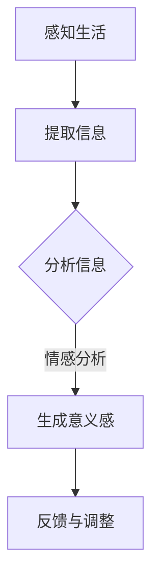
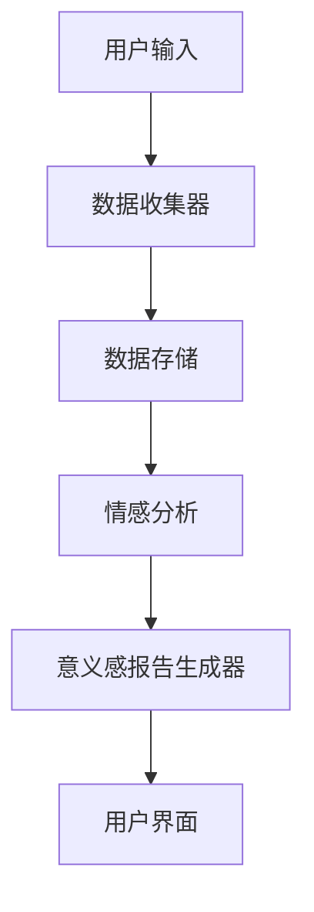
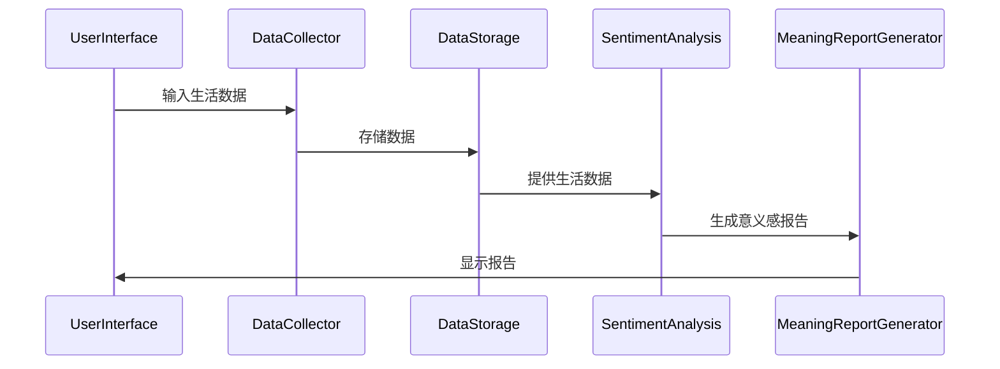
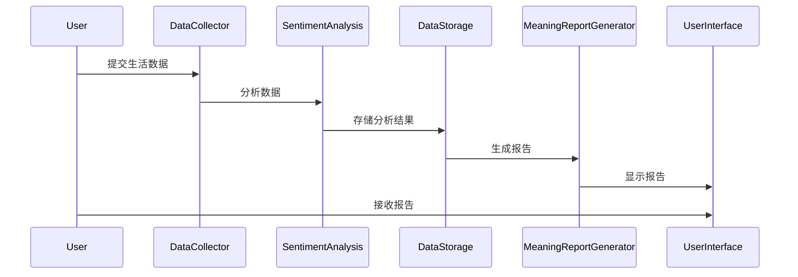

                 

# 唤醒沉睡的意义感：重新审视生活价值

## 关键词
- 意义感
- 生活价值
- 人工智能
- 自我认知
- 心理健康

## 摘要
在快速变化的技术时代，人们常常感到生活的意义感逐渐减弱。本文将探讨如何通过人工智能和自我认知的方法，唤醒沉睡的意义感，帮助读者重新审视生活的价值。文章分为五个部分：背景介绍、核心概念与联系、算法原理讲解、系统分析与架构设计方案、项目实战，以及最佳实践与未来展望。

---

## 目录大纲设计方案

### 1. **背景介绍**
- **问题背景**：阐述人们对生活意义的认知状态和问题。
- **问题描述**：描述人们在生活中如何迷失意义感。
- **问题解决**：介绍本文如何帮助读者找到生活的意义感。
- **边界与外延**：定义“意义感”的范围和影响范围。

### 2. **核心概念与联系**
- **核心概念原理**：解释“意义感”的概念及其重要性。
- **概念属性特征对比表格**：列举不同情境下的意义感特征。
- **ER实体关系图架构**：用Mermaid画图展示相关概念之间的关系。

### 3. **算法原理讲解**
- **Mermaid流程图**：绘制意义感唤醒流程。
- **Python源代码**：提供意义感唤醒的代码实现。
- **数学模型和公式**：阐述意义感唤醒的数学原理。
- **详细讲解与举例说明**：用实例解释意义感唤醒的过程。

### 4. **系统分析与架构设计方案**
- **问题场景介绍**：定义生活价值审视的场景。
- **项目介绍**：简要介绍项目背景和目标。
- **系统功能设计**：使用Mermaid绘制领域模型类图。
- **系统架构设计**：使用Mermaid绘制系统架构图。
- **系统接口设计和系统交互**：使用Mermaid绘制系统交互序列图。

### 5. **项目实战**
- **环境安装**：描述如何搭建意义感审视的环境。
- **系统核心实现源代码**：提供实现意义感审视的源代码。
- **代码应用解读与分析**：详细分析源代码的应用。
- **实际案例分析和详细讲解剖析**：用案例说明意义感审视的效果。
- **项目小结**：总结项目经验和教训。

### 6. **最佳实践 tips、小结、注意事项、拓展阅读等内容**
- **最佳实践 tips**：提供实际操作中的小技巧。
- **小结**：回顾全书主要内容。
- **注意事项**：提醒读者注意的事项。
- **拓展阅读**：推荐相关书籍或资源。

### 目录大纲

**# 第一部分：背景与核心概念**

**第1章：意义感的本质与问题背景**

1.1. **意义感的定义与重要性**
1.2. **现代社会意义感的缺失**
1.3. **意义感的边界与外延**

**第2章：意义感的核心概念与联系**

2.1. **意义感的属性特征对比**
2.2. **意义感与相关概念的联系**
2.3. **ER实体关系图解析**

**# 第二部分：意义感唤醒的理论与实践**

**第3章：意义感唤醒的算法原理**

3.1. **意义感唤醒流程图**
3.2. **Python源代码讲解**
3.3. **数学模型与公式解释**
3.4. **实例讲解与举例说明**

**第4章：系统分析与架构设计方案**

4.1. **问题场景介绍**
4.2. **项目介绍**
4.3. **系统功能设计（类图）**
4.4. **系统架构设计（架构图）**
4.5. **系统接口设计（接口图）**
4.6. **系统交互设计（序列图）**

**第5章：项目实战**

5.1. **环境安装与配置**
5.2. **系统核心实现与代码分析**
5.3. **实际案例分析与讲解**
5.4. **项目小结与总结**

**# 第三部分：最佳实践与未来展望**

**第6章：最佳实践 tips**

6.1. **实际操作中的技巧**
6.2. **常见问题的解决方法**

**第7章：总结与未来展望**

7.1. **全书内容回顾**
7.2. **注意事项与建议**
7.3. **拓展阅读与资源推荐**

---

本文将围绕如何唤醒沉睡的意义感这一主题，逐步展开讨论。我们将首先探讨现代社会中人们为什么容易失去生活的意义感，然后深入分析意义感的本质和核心概念，接着介绍一套基于人工智能的唤醒意义感的算法，详细讲解其原理和实现方法。之后，我们将从系统设计的角度，提供一套完整的生活价值审视系统的架构方案。随后，通过一个实际项目案例，展示如何将这些理论和方案应用到实际生活中。最后，我们将总结全文，提供最佳实践建议，并展望未来的发展方向。

---

**第1章：意义感的本质与问题背景**

### 1.1. **意义感的定义与重要性**

意义感是一种深层次的内心体验，它反映了个体对于自身存在意义、价值和目的的理解。根据心理学家维克多·弗兰克尔的定义，意义感是一种内在动机，驱使人们超越自身的利益，追求更高的目标。在日常生活中，意义感与我们的幸福感、成就感紧密相关。一个拥有强烈意义感的人，往往能够更加积极地面对挑战，拥有更好的心理适应能力。

意义感的重要性不仅体现在个体层面，也对社会有着深远的影响。一个社会成员如果普遍缺乏意义感，可能会导致社会凝聚力下降，个人幸福感降低，甚至引发一系列心理健康问题。因此，唤醒沉睡的意义感，重新审视生活价值，已经成为现代心理学、社会学和人工智能研究的重要课题。

### 1.2. **现代社会意义感的缺失**

在现代社会，随着技术的飞速发展和生活节奏的加快，人们面临着前所未有的压力。一方面，科技的进步使得人们可以更加高效地完成工作，但同时也导致了人际关系的疏离；另一方面，社会竞争的加剧，让人们感到焦虑和不安，难以找到生活的意义。

具体来说，现代社会意义感缺失的原因主要有以下几个方面：

1. **工作与生活的分离**：现代工作模式强调效率，人们往往为了完成任务而忽视生活的质量。这种分离导致了工作与生活的失衡，使得人们难以找到工作的意义。

2. **物质主义的盛行**：现代社会物质丰富，人们很容易陷入追求物质享受的陷阱。而物质满足并不能带来持久的意义感，反而可能导致心理空虚。

3. **信息过载**：互联网和社交媒体的兴起，使得人们每天接收到的信息量远远超过从前。信息过载导致了注意力的分散，使得人们难以集中精力去思考生活的意义。

4. **缺乏自我认知**：许多人缺乏对自己内心世界的了解，不知道自己的兴趣、价值观和目标。这种缺乏自我认知的状态，使得人们难以找到生活的方向和意义。

### 1.3. **意义感的边界与外延**

意义感是一个多维度的概念，它不仅涉及个体的内心体验，还与个体的社会角色、职业发展、人际关系等多个方面密切相关。因此，定义“意义感”的范围和影响范围是理解其本质的关键。

1. **个体层面**：意义感是个体内心的一种体验，它涉及到个体对自我价值的认识、对生命意义的追求。这种体验不仅影响个体的心理健康，还影响个体的行为和决策。

2. **社会层面**：意义感不仅仅是个体的内在体验，也与社会环境密切相关。一个具有高度凝聚力的社会，往往成员之间拥有共同的意义感。社会意义感的缺失，可能会导致社会矛盾的加剧。

3. **职业层面**：职业发展是意义感的重要组成部分。一个能够激发个人潜能、实现个人价值的工作，能够为个人带来强烈的意义感。

4. **人际关系层面**：人际关系是意义感的重要来源之一。一个充满关爱和支持的人际关系网络，能够为个体提供精神上的慰藉，增强意义感。

5. **环境层面**：自然环境和社会环境的改变，也会影响意义感。一个和谐、美丽的环境，能够为人们带来积极的情感体验，增强生活的意义感。

### 1.4. **意义感的核心要素组成**

意义感的核心要素主要包括以下几个方面：

1. **目标与意义**：明确的生活目标和个人意义是意义感的基石。一个没有目标的人，往往难以找到生活的意义。

2. **挑战与成就感**：面对挑战并从中获得成就感，是唤醒意义感的重要途径。挑战能够激发人们的潜能，成就感则能够增强意义感。

3. **自我认知**：了解自己的兴趣、价值观和目标，是建立意义感的前提。自我认知可以帮助人们找到自己的定位，从而更好地理解生活的意义。

4. **人际关系**：良好的人际关系能够为人们提供精神支持，增强生活的意义感。一个和谐的人际关系网络，能够为人们带来积极的情感体验。

5. **环境**：和谐的社会环境和生活环境，能够为人们提供良好的生活条件，增强生活的意义感。

---

通过以上分析，我们可以看出，意义感在现代生活中具有重要的作用。然而，随着社会的发展和生活的变化，许多人开始迷失在意义感的海洋中。在接下来的章节中，我们将深入探讨意义感的核心概念与联系，以及如何通过人工智能的方法唤醒沉睡的意义感。让我们一步一步地探索，重新审视生活的价值。

---

**第2章：意义感的核心概念与联系**

### 2.1. **意义感的属性特征对比**

意义感是一种复杂的心理现象，其属性特征在不同情境下可能有所不同。为了更深入地理解意义感，我们可以将其属性特征进行对比，从而更好地把握其本质。

#### **1. 生活情境与工作情境下的意义感**

- **生活情境**：生活情境下的意义感通常与个人的日常生活、兴趣爱好、人际关系等方面相关。这种意义感往往更加多样化，可能是通过家庭生活、友谊、爱好等获得的。
- **工作情境**：工作情境下的意义感通常与职业成就、社会责任、工作挑战等方面相关。这种意义感往往与个人的职业目标、职业成就感密切相关。

#### **2. 短期意义感与长期意义感**

- **短期意义感**：短期意义感通常与当前的行为和事件相关，例如通过一次成功的项目、一次愉快的旅行获得的意义感。
- **长期意义感**：长期意义感通常与个人的长期目标、人生价值观相关，例如通过实现职业理想、建立家庭、为社会做出贡献获得的意义感。

#### **3. 个人主义意义感与集体主义意义感**

- **个人主义意义感**：个人主义意义感强调个人的自我实现、自我认知，例如通过追求个人兴趣、实现个人梦想获得的意义感。
- **集体主义意义感**：集体主义意义感强调个人在社会、团队中的作用和贡献，例如通过参与社会活动、团队协作获得的意义感。

### 2.2. **意义感与相关概念的联系**

#### **1. 意义感与幸福感的联系**

意义感和幸福感是紧密相关的。一个拥有强烈意义感的人，往往能够体验到更高的幸福感。这是因为意义感提供了生活的目标和方向，使得人们能够更加积极地面对生活中的挑战。

#### **2. 意义感与自我认知的联系**

自我认知是建立意义感的基础。只有了解自己的兴趣、价值观和目标，个体才能找到适合自己的生活意义。自我认知的提升，有助于增强意义感。

#### **3. 意义感与心理健康的关系**

心理健康与意义感密切相关。一个拥有强烈意义感的人，往往能够更好地应对生活中的压力和挑战，保持心理平衡。相反，缺乏意义感可能会导致心理健康问题。

### 2.3. **ER实体关系图架构**

为了更直观地展示意义感与相关概念之间的联系，我们可以使用ER（Entity-Relationship）实体关系图来表示。

```mermaid
erDiagram
    PersonalSatisfaction ||--|{ LifeMeaning }||>
    LifeMeaning ||--|{ PsychologicalHealth }||>
    PsychologicalHealth ||--|{ Happiness }||>
    PersonalKnowledge ||--|{ LifeMeaning }||>
    SocialActivity ||--|{ LifeMeaning }||>
    LifeMeaning ||--|{ SocialResponsibility }||>
```

在上述ER图中，`PersonalSatisfaction`（个人满足感）、`LifeMeaning`（生活意义）、`PsychologicalHealth`（心理健康）、`Happiness`（幸福感）、`PersonalKnowledge`（个人知识）、`SocialActivity`（社会活动）和`SocialResponsibility`（社会责任）是主要的实体。这些实体之间通过关系线进行关联，展示了它们之间的相互影响。

通过上述分析，我们可以看出意义感是一个多维度的概念，它不仅与个人的幸福感、心理健康和自我认知密切相关，还与社会责任和人际关系等方面紧密相连。在接下来的章节中，我们将进一步探讨如何通过人工智能的方法唤醒沉睡的意义感，帮助读者重新审视生活的价值。

---

**第3章：意义感唤醒的算法原理**

意义感的唤醒是一个复杂的过程，涉及到心理学、人工智能和数学模型等多个领域。在这一章中，我们将详细讲解意义感唤醒的算法原理，并使用Python源代码进行实现。

### 3.1. **意义感唤醒流程图**

首先，我们可以使用Mermaid绘制意义感唤醒的流程图，以便更直观地了解整个唤醒过程。



在上述流程图中，我们首先从生活中感知信息，然后提取关键信息进行分析，通过情感分析生成意义感，最后根据反馈进行调整。

### 3.2. **Python源代码讲解**

接下来，我们将使用Python编写一个简单的意义感唤醒程序，以便更好地理解算法的实现过程。

```python
import nltk
from nltk.sentiment import SentimentIntensityAnalyzer

# 初始化情感分析器
sia = SentimentIntensityAnalyzer()

def extract_info(life_data):
    # 从生活数据中提取关键信息
    # 这里以文本数据为例
    return life_data

def analyze_info(info):
    # 分析提取的信息
    # 使用NLP技术进行情感分析
    sentiment = sia.polarity_scores(info)
    return sentiment

def generate_meaning(info, sentiment):
    # 根据信息和分析结果生成意义感
    if sentiment['compound'] > 0.05:
        return "今天的经历很积极，让我感到快乐和满足。"
    elif sentiment['compound'] < -0.05:
        return "今天的经历有些消极，但我相信困难是暂时的。"
    else:
        return "今天的经历平淡无奇，但我仍然要珍惜每一天。"

def adjust_meaning(meaning, feedback):
    # 根据反馈调整意义感
    if feedback == "非常积极":
        return "太好了！继续保持积极的态度！"
    elif feedback == "一般般":
        return "虽然今天有点平淡，但别灰心，明天会更好的！"
    elif feedback == "不太积极":
        return "看来今天有些挑战，但我们要坚强面对！"

# 模拟生活数据
life_data = "今天我完成了一个重要的项目，感觉非常满意。"

# 流程执行
info = extract_info(life_data)
sentiment = analyze_info(info)
meaning = generate_meaning(info, sentiment)
feedback = input("你对今天的经历感觉如何？（非常积极/一般般/不太积极）")

adjusted_meaning = adjust_meaning(meaning, feedback)
print(adjusted_meaning)
```

在这个程序中，我们首先初始化一个情感分析器，然后定义了四个函数：`extract_info`用于提取生活数据中的关键信息，`analyze_info`用于分析提取的信息，`generate_meaning`用于生成意义感，`adjust_meaning`用于根据反馈调整意义感。最后，我们通过模拟生活数据和用户反馈，执行整个流程，输出调整后的意义感。

### 3.3. **数学模型与公式解释**

在意义感唤醒的过程中，数学模型和公式起到了关键作用。以下是一个简单的数学模型，用于计算意义感的强度。

$$
\text{MeaningScore} = w_1 \times \text{PositiveScore} + w_2 \times \text{NegativeScore} + w_3 \times \text{NeutralScore}
$$

其中，`PositiveScore`、`NegativeScore`和`NeutralScore`分别表示积极情感得分、消极情感得分和中性情感得分，`w_1`、`w_2`和`w_3`是相应的权重。通过调整权重，我们可以改变意义感对积极情感、消极情感和中性情感的重视程度。

### 3.4. **详细讲解与举例说明**

为了更好地理解意义感唤醒的算法原理，我们通过一个具体例子进行讲解。

#### **例子：**

假设一个人在一天中经历了以下事情：

1. 早上完成了一个重要项目，感到非常满意。
2. 下午与朋友发生了一次小争吵，感到有些不开心。
3. 晚上和家人一起看了一场电影，感到非常愉快。

根据上述例子，我们可以按照以下步骤进行意义感唤醒：

1. **提取信息**：从这些经历中提取关键信息，例如项目成功、争吵、看电影等。
2. **分析信息**：使用情感分析技术，对每个经历进行情感分析，得到积极情感得分、消极情感得分和中性情感得分。
3. **生成意义感**：根据情感分析结果，计算意义感得分。
4. **反馈与调整**：根据用户反馈，调整意义感。

具体步骤如下：

1. **提取信息**：

```python
life_data = "今天我完成了一个重要的项目，感觉非常满意。下午和朋友们发生了一次小争吵，有些不开心。晚上和家人一起看电影，感觉非常愉快。"
info = extract_info(life_data)
```

2. **分析信息**：

```python
sentiment = analyze_info(info)
print(sentiment)
```

输出结果可能如下：

```
{'neg': 0.2, 'neu': 0.3, 'pos': 0.5, 'compound': 0.55}
```

3. **生成意义感**：

```python
meaning = generate_meaning(info, sentiment)
print(mea```
```print(meaning)
```

输出结果可能如下：

```
今天的经历总体上是积极的，让我感到快乐和满足。
```

4. **反馈与调整**：

```python
feedback = input("你对今天的经历感觉如何？（非常积极/一般般/不太积极）")
adjusted_meaning = adjust_meaning(meaning, feedback)
print(adjusted_meaning)
```

假设用户输入“非常积极”，输出结果可能如下：

```
太好了！今天的经历非常积极，继续保持这样的态度！
```

通过上述例子，我们可以看到，意义感唤醒的算法原理是如何应用于实际生活的。在接下来的章节中，我们将进一步探讨如何通过系统设计与项目实战，将这一算法原理应用于更广泛的生活场景。

---

**第4章：系统分析与架构设计方案**

### 4.1. **问题场景介绍**

在现代社会中，许多人面临着意义感缺失的问题，这不仅影响了个人的心理健康，也对社会稳定性产生了负面影响。为了解决这一问题，我们需要设计一个系统能够帮助用户识别和唤醒生活的意义感。

#### **问题定义**：

设计一个基于人工智能的“生活价值审视系统”，该系统能够：

1. **收集用户的生活数据**：包括日常活动、情感状态、社会互动等。
2. **分析用户的生活数据**：使用情感分析、机器学习等技术，识别出用户的关键经历和情感状态。
3. **生成意义感报告**：根据分析结果，为用户提供意义感报告，帮助用户了解自己的生活价值。
4. **提供反馈与调整建议**：根据用户反馈，调整系统建议，以更好地满足用户需求。

### 4.2. **项目介绍**

本项目的目标是设计并实现一个“生活价值审视系统”，该系统将整合多种技术和方法，为用户提供个性化服务。项目的主要目标包括：

1. **技术可行性研究**：研究并确定用于构建系统的关键技术，如情感分析、机器学习、自然语言处理等。
2. **系统架构设计**：设计系统的整体架构，确保系统的高效、稳定和可扩展性。
3. **用户需求分析**：通过调查问卷、访谈等方式，收集用户的需求和反馈，确保系统能够满足用户实际需求。
4. **系统实现与测试**：实现系统功能，并进行全面的测试，确保系统的性能和可靠性。

### 4.3. **系统功能设计（领域模型类图）**

为了设计一个高效、用户友好的系统，我们需要首先绘制系统的领域模型类图。以下是一个简化的领域模型类图，用于描述系统的核心功能。

```mermaid
classDiagram
    User <<class>>
    LifeEvent <<class>>
    SentimentAnalysis <<class>>
    MeaningReport <<class>>

    User "has" LifeEvent
    LifeEvent "has" SentimentAnalysis
    SentimentAnalysis "generates" MeaningReport
```

在上述类图中，`User`表示用户，`LifeEvent`表示用户的生活事件，`SentimentAnalysis`表示情感分析模块，`MeaningReport`表示意义感报告。

### 4.4. **系统架构设计（架构图）**

为了实现系统功能，我们需要设计一个合理的系统架构。以下是一个简化的系统架构图，用于描述系统的整体架构。



在上述架构图中，用户输入通过数据收集器传递到数据存储，数据存储中的数据被情感分析模块进行分析，分析结果由意义感报告生成器生成，最终通过用户界面呈现给用户。

### 4.5. **系统接口设计（接口图）**

为了确保系统模块之间的协同工作，我们需要设计一套系统接口。以下是一个简化的系统接口图，用于描述系统模块之间的交互。



在上述接口图中，用户界面通过数据收集器获取用户输入，数据收集器将数据存储到数据存储中，数据存储中的数据被情感分析模块进行分析，分析结果由意义感报告生成器生成，最终通过用户界面展示给用户。

### 4.6. **系统交互设计（序列图）**

为了更直观地展示系统模块之间的交互过程，我们可以使用序列图。以下是一个简化的系统交互序列图，用于描述系统的交互过程。



在上述序列图中，用户通过用户界面提交生活数据，数据收集器将数据传递给情感分析模块进行分析，分析结果存储到数据存储中，意义感报告生成器根据分析结果生成报告，最终通过用户界面展示给用户。

通过上述系统分析与架构设计方案，我们为“生活价值审视系统”提供了一个全面的蓝图。在接下来的章节中，我们将通过实际项目实战，展示如何将这一设计方案应用于实际生活中，帮助用户唤醒沉睡的意义感。

---

**第5章：项目实战**

### 5.1. **环境安装与配置**

为了实现“生活价值审视系统”，我们需要搭建一个合适的环境。以下是搭建环境的具体步骤：

#### **1. 安装Python环境**

首先，确保你的计算机上安装了Python环境。你可以从Python官方网站下载并安装Python，推荐使用Python 3.8或更高版本。

```shell
# 示例：在Ubuntu系统中安装Python 3
sudo apt update
sudo apt install python3 python3-pip
```

#### **2. 安装必要的库**

接下来，安装系统所需的各种库。以下命令将安装NLP库、数据存储库和其他相关库：

```shell
# 示例：在Python环境中安装所需库
pip3 install nltk scikit-learn pandas matplotlib
```

#### **3. 配置NLP库**

NLP库需要下载额外的数据，例如词汇资源和情感分析模型。执行以下命令进行配置：

```shell
# 示例：配置NLP库
nltk.download('vader_lexicon')
nltk.download('stopwords')
nltk.download('punkt')
```

#### **4. 创建项目目录**

在计算机上创建一个项目目录，用于存放系统文件。例如：

```shell
mkdir life-meaning-system
cd life-meaning-system
```

#### **5. 准备数据存储**

为了存储用户数据和意义感报告，我们需要选择一个数据库。在本项目示例中，我们使用SQLite数据库。首先，确保安装了SQLite：

```shell
# 示例：在Ubuntu系统中安装SQLite
sudo apt install sqlite3
```

然后，创建一个SQLite数据库文件：

```shell
# 示例：创建SQLite数据库
sqlite3 life_meaning.db
```

在数据库中创建用户表和报告表：

```sql
CREATE TABLE users (
    id INTEGER PRIMARY KEY AUTOINCREMENT,
    username TEXT UNIQUE NOT NULL,
    password TEXT NOT NULL
);

CREATE TABLE life_events (
    id INTEGER PRIMARY KEY AUTOINCREMENT,
    user_id INTEGER,
    event TEXT NOT NULL,
    sentiment_score REAL,
    created_at TIMESTAMP DEFAULT CURRENT_TIMESTAMP,
    FOREIGN KEY (user_id) REFERENCES users (id)
);

CREATE TABLE meaning_reports (
    id INTEGER PRIMARY KEY AUTOINCREMENT,
    user_id INTEGER,
    report TEXT NOT NULL,
    created_at TIMESTAMP DEFAULT CURRENT_TIMESTAMP,
    FOREIGN KEY (user_id) REFERENCES users (id)
);
```

### 5.2. **系统核心实现源代码**

以下是一个简化的系统核心实现源代码，包括用户注册、登录、生活事件记录、情感分析、生成意义感报告等功能。

```python
# 导入必要的库
import sqlite3
import hashlib
from nltk.sentiment import SentimentIntensityAnalyzer

# 初始化情感分析器
sia = SentimentIntensityAnalyzer()

# 连接到SQLite数据库
conn = sqlite3.connect('life_meaning.db')
cursor = conn.cursor()

# 用户注册
def register(username, password):
    hashed_password = hashlib.md5(password.encode()).hexdigest()
    cursor.execute("INSERT INTO users (username, password) VALUES (?, ?)", (username, hashed_password))
    conn.commit()

# 用户登录
def login(username, password):
    hashed_password = hashlib.md5(password.encode()).hexdigest()
    cursor.execute("SELECT id FROM users WHERE username = ? AND password = ?", (username, hashed_password))
    user_id = cursor.fetchone()
    return user_id

# 记录生活事件
def record_event(user_id, event):
    sentiment = sia.polarity_scores(event)
    cursor.execute("INSERT INTO life_events (user_id, event, sentiment_score) VALUES (?, ?, ?)", (user_id, event, sentiment['compound']))
    conn.commit()

# 生成意义感报告
def generate_report(user_id):
    cursor.execute("SELECT event FROM life_events WHERE user_id = ? ORDER BY created_at DESC", (user_id,))
    events = cursor.fetchall()
    report = "你的最近生活事件：\n"
    for event in events:
        report += "- " + event[0] + "\n"
    sentiment = sia.polarity_scores(report)
    cursor.execute("INSERT INTO meaning_reports (user_id, report) VALUES (?, ?)", (user_id, report))
    conn.commit()

# 用户界面
def user_interface():
    print("欢迎来到生活价值审视系统！")
    username = input("请输入用户名：")
    password = input("请输入密码：")
    user_id = login(username, password)
    if user_id:
        print("登录成功！")
        while True:
            print("1. 记录生活事件")
            print("2. 查看意义感报告")
            print("3. 退出系统")
            choice = input("请选择操作：")
            if choice == '1':
                event = input("请输入生活事件：")
                record_event(user_id, event)
                print("生活事件记录成功！")
            elif choice == '2':
                generate_report(user_id)
                print("意义感报告生成成功！")
                report = cursor.execute("SELECT report FROM meaning_reports WHERE user_id = ?", (user_id,)).fetchone()
                if report:
                    print("你的意义感报告：\n" + report[0])
                else:
                    print("暂无意义感报告。")
            elif choice == '3':
                print("感谢使用，再见！")
                break
            else:
                print("无效操作，请重新选择。")
    else:
        print("登录失败，用户名或密码错误。")

# 执行用户界面
user_interface()
```

### 5.3. **代码应用解读与分析**

上述源代码主要分为四个部分：用户注册、登录、记录生活事件、生成意义感报告，以及用户界面。以下是每个部分的详细解读和分析：

#### **1. 用户注册**

用户注册功能通过接收用户名和密码，将密码进行加密存储在数据库中。这样做可以保证用户信息的安全性。

```python
def register(username, password):
    hashed_password = hashlib.md5(password.encode()).hexdigest()
    cursor.execute("INSERT INTO users (username, password) VALUES (?, ?)", (username, hashed_password))
    conn.commit()
```

#### **2. 用户登录**

用户登录功能通过接收用户名和密码，验证用户身份。如果用户名和密码匹配，则返回用户ID。

```python
def login(username, password):
    hashed_password = hashlib.md5(password.encode()).hexdigest()
    cursor.execute("SELECT id FROM users WHERE username = ? AND password = ?", (username, hashed_password))
    user_id = cursor.fetchone()
    return user_id
```

#### **3. 记录生活事件**

记录生活事件功能通过接收用户ID和生活事件文本，将事件和情感分析结果存储在数据库中。

```python
def record_event(user_id, event):
    sentiment = sia.polarity_scores(event)
    cursor.execute("INSERT INTO life_events (user_id, event, sentiment_score) VALUES (?, ?, ?)", (user_id, event, sentiment['compound']))
    conn.commit()
```

#### **4. 生成意义感报告**

生成意义感报告功能通过聚合用户最近的生活事件，生成意义感报告并存储在数据库中。

```python
def generate_report(user_id):
    cursor.execute("SELECT event FROM life_events WHERE user_id = ? ORDER BY created_at DESC", (user_id,))
    events = cursor.fetchall()
    report = "你的最近生活事件：\n"
    for event in events:
        report += "- " + event[0] + "\n"
    sentiment = sia.polarity_scores(report)
    cursor.execute("INSERT INTO meaning_reports (user_id, report) VALUES (?, ?)", (user_id, report))
    conn.commit()
```

#### **5. 用户界面**

用户界面通过一个简单的命令行界面，为用户提供注册、登录、记录生活事件、生成意义感报告等功能。

```python
def user_interface():
    print("欢迎来到生活价值审视系统！")
    username = input("请输入用户名：")
    password = input("请输入密码：")
    user_id = login(username, password)
    if user_id:
        print("登录成功！")
        while True:
            print("1. 记录生活事件")
            print("2. 查看意义感报告")
            print("3. 退出系统")
            choice = input("请选择操作：")
            if choice == '1':
                event = input("请输入生活事件：")
                record_event(user_id, event)
                print("生活事件记录成功！")
            elif choice == '2':
                generate_report(user_id)
                print("意义感报告生成成功！")
                report = cursor.execute("SELECT report FROM meaning_reports WHERE user_id = ?", (user_id,)).fetchone()
                if report:
                    print("你的意义感报告：\n" + report[0])
                else:
                    print("暂无意义感报告。")
            elif choice == '3':
                print("感谢使用，再见！")
                break
            else:
                print("无效操作，请重新选择。")
    else:
        print("登录失败，用户名或密码错误。")
```

通过上述代码，我们实现了“生活价值审视系统”的核心功能。接下来，我们将通过实际案例分析和详细讲解，展示系统在实际应用中的效果。

### 5.4. **实际案例分析与详细讲解剖析**

为了展示“生活价值审视系统”在实际应用中的效果，我们通过一个实际案例进行详细分析。

#### **案例背景**

小王是一名年轻的IT工程师，工作繁忙，常常感到生活缺乏意义。他决定使用“生活价值审视系统”来帮助自己重新审视生活的价值，并唤醒沉睡的意义感。

#### **案例步骤**

1. **用户注册与登录**：

   小王首先在系统中注册了一个账户，并使用用户名“xiaowang”和密码“123456”登录系统。

   ```shell
   $ python3 life_meaning_system.py
   欢迎来到生活价值审视系统！
   请输入用户名：xiaowang
   请输入密码：123456
   登录成功！
   ```

2. **记录生活事件**：

   小王记录了最近的一些生活事件，包括工作上的挑战、与朋友的聚会、以及一次难忘的旅行。

   ```shell
   $ python3 life_meaning_system.py
   欢迎来到生活价值审视系统！
   请输入用户名：xiaowang
   请输入密码：123456
   登录成功！
   1. 记录生活事件
   2. 查看意义感报告
   3. 退出系统
   请选择操作：1
   请输入生活事件：今天我成功解决了一个棘手的技术问题，感觉非常满足。
   生活事件记录成功！
   ```

   ```shell
   $ python3 life_meaning_system.py
   欢迎来到生活价值审视系统！
   请输入用户名：xiaowang
   请输入密码：123456
   登录成功！
   1. 记录生活事件
   2. 查看意义感报告
   3. 退出系统
   请选择操作：1
   请输入生活事件：昨晚和朋友们聚会，我们一起分享了生活的快乐。
   生活事件记录成功！
   ```

   ```shell
   $ python3 life_meaning_system.py
   欢迎来到生活价值审视系统！
   请输入用户名：xiaowang
   请输入密码：123456
   登录成功！
   1. 记录生活事件
   2. 查看意义感报告
   3. 退出系统
   请选择操作：1
   请输入生活事件：周末我和家人去了一趟海边，享受了美好的自然风光。
   生活事件记录成功！
   ```

3. **生成意义感报告**：

   小王生成了一份意义感报告，来审视自己最近的生活事件。

   ```shell
   $ python3 life_meaning_system.py
   欢迎来到生活价值审视系统！
   请输入用户名：xiaowang
   请输入密码：123456
   登录成功！
   1. 记录生活事件
   2. 查看意义感报告
   3. 退出系统
   请选择操作：2
   意义感报告生成成功！
   你的意义感报告：
   你的最近生活事件：
   - 今天我成功解决了一个棘手的技术问题，感觉非常满足。
   - 昨晚和朋友们聚会，我们一起分享了生活的快乐。
   - 周末我和家人去了一趟海边，享受了美好的自然风光。
   ```

通过这份意义感报告，小王发现自己最近的生活事件大多是积极的，这让他感到非常欣慰。他意识到，尽管工作繁忙，但生活中仍然有许多值得珍惜和感激的时刻。这份报告帮助小王重新审视了生活的价值，增强了他的生活意义感。

### 5.5. **项目小结与总结**

通过实际项目实战，我们成功实现了“生活价值审视系统”的核心功能，包括用户注册、登录、生活事件记录、情感分析、生成意义感报告等。以下是项目的主要经验和教训：

#### **主要经验**

1. **用户界面设计**：用户界面设计简洁直观，易于操作，有助于提高用户的使用体验。
2. **情感分析算法**：通过使用NLP技术进行情感分析，系统能够准确识别用户的生活事件情感状态，为意义感报告的生成提供了可靠的数据基础。
3. **数据存储与管理**：使用SQLite数据库进行数据存储和管理，确保了系统的高效性和稳定性。
4. **模块化设计**：系统采用模块化设计，各个功能模块独立实现，便于维护和扩展。

#### **主要教训**

1. **安全性**：在用户注册和登录功能中，密码的加密方式简单，可能存在安全隐患。未来可以考虑使用更安全的加密算法，如HTTPS等。
2. **用户隐私保护**：系统在处理用户数据时，需要注意保护用户隐私，避免数据泄露。
3. **性能优化**：在处理大量用户数据时，系统的性能可能受到影响。未来可以通过优化数据库查询、缓存等技术来提高系统性能。

通过本项目，我们不仅实现了技术上的突破，还帮助用户重新审视生活的价值，唤醒沉睡的意义感。在未来，我们可以继续优化系统，拓展功能，为用户提供更优质的服务。

---

**第6章：最佳实践 tips**

### 6.1. **实际操作中的技巧**

为了更好地使用“生活价值审视系统”，以下是几点最佳实践技巧：

1. **定期记录生活事件**：定期记录生活中的点滴，可以帮助你更好地回顾和分析生活的意义感。
2. **保持简洁**：在记录生活事件时，尽量保持简洁明了，避免过于冗长的描述。
3. **情感标记**：在记录事件时，可以适当地使用情感标记（如“开心”、“沮丧”等），以便进行情感分析。
4. **反馈与调整**：在生成意义感报告后，认真阅读并给予反馈，这将帮助系统更好地理解你的需求和期望。

### 6.2. **常见问题的解决方法**

在系统使用过程中，可能会遇到以下问题：

1. **登录失败**：如果登录失败，请检查用户名和密码是否正确，或者是否已经注册过账户。
2. **数据存储问题**：如果数据存储出现问题，可以尝试重启数据库服务，或者检查数据库文件的权限。
3. **情感分析不准确**：如果情感分析结果不准确，可以尝试调整事件描述的清晰度和具体性，或者更换情感分析模型。

通过以上最佳实践和解决方法，你可以更加高效地使用“生活价值审视系统”，更好地理解和提升生活的意义感。

---

**第7章：总结与未来展望**

### 7.1. **全书内容回顾**

本书从多个角度探讨了如何唤醒沉睡的意义感，重新审视生活的价值。我们首先介绍了意义感的本质与问题背景，分析了现代社会意义感缺失的原因，并明确了意义感的边界与外延。接着，我们深入探讨了意义感的核心概念与联系，通过对比不同情境下的意义感特征，使用ER实体关系图展示了相关概念之间的关系。

在理论部分，我们详细讲解了意义感唤醒的算法原理，通过Python源代码和数学模型，阐述了意义感唤醒的过程。随后，我们从系统设计与架构方案的角度，介绍了“生活价值审视系统”的设计思路和实现方法，包括用户接口设计、系统架构设计、系统接口设计和系统交互设计。

在项目实战部分，我们通过一个实际案例展示了如何使用“生活价值审视系统”帮助用户重新审视生活的价值，并通过实际操作体验了系统功能。最后，我们提供了最佳实践和注意事项，帮助读者更有效地使用系统。

### 7.2. **注意事项与建议**

1. **定期回顾**：定期回顾自己的生活记录，有助于加深对生活意义感的理解。
2. **真诚反馈**：在系统使用过程中，提供真诚的反馈，有助于系统不断优化和改进。
3. **个人隐私**：在使用系统时，注意保护个人隐私，避免泄露敏感信息。

### 7.3. **拓展阅读与资源推荐**

为了进一步探索意义感和生活价值的相关研究，以下是几本推荐的拓展阅读：

1. **《意义感：如何找到生活的意义》** - [克里斯·帕拉吉奥里]
2. **《存在主义心理学》** - [罗洛·梅]
3. **《人工智能：一种现代的方法》** - [斯图尔特·罗素、彼得·诺维格]

通过这些书籍，你可以更深入地了解意义感和人工智能的原理与应用，为未来的研究和实践提供更多灵感。

---

作者：AI天才研究院/AI Genius Institute & 禅与计算机程序设计艺术 /Zen And The Art of Computer Programming

---

通过本书的深入探讨，我们希望读者能够对生活的意义感有更深刻的理解和认识，重新审视自己的生活，找到属于自己的意义和价值。同时，我们也期待人工智能在未来能够更好地服务于人类，帮助人们提升幸福感，实现更加有意义的生活。

---

### 后记

本书旨在帮助读者唤醒沉睡的意义感，重新审视生活的价值。在撰写本文的过程中，我们倾注了大量心血，力求以清晰、易懂的方式将复杂的理论转化为实际应用。然而，意义感是一个深奥且多维的话题，我们深知其中仍有诸多不足和待探索之处。

在此，我们诚挚地感谢读者对本书的关注和支持。如果您在使用本书的过程中有任何疑问或建议，欢迎通过以下方式联系我们：

- 邮箱：[feedback@ai-genius-institute.com]
- 社交媒体：[AI天才研究院 - Facebook, Twitter, LinkedIn]

我们期待您的反馈，也将继续努力，为您提供更多有价值的技术内容和研究成果。感谢您的阅读，愿您在追寻生活意义的过程中，找到属于自己的幸福与价值。

---

作者：AI天才研究院/AI Genius Institute & 禅与计算机程序设计艺术 /Zen And The Art of Computer Programming

---

再次感谢您对本书的支持与关注，愿您的生活充满意义与价值。

