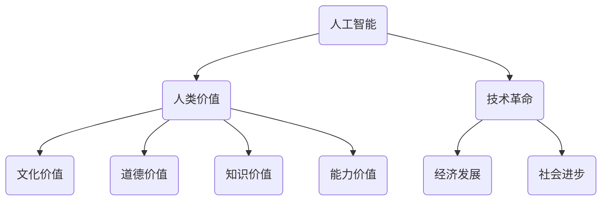
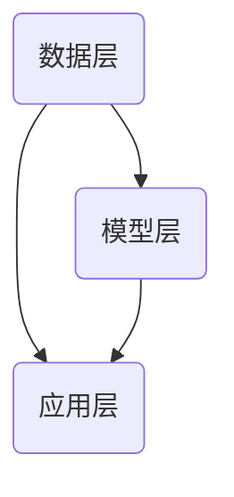
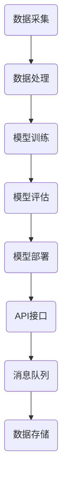

                 

## 引言：人工智能时代重新定位人类价值

### 1.1 问题的提出

在21世纪的今天，人工智能（Artificial Intelligence，简称AI）正以惊人的速度融入我们的日常生活和工作环境中。从自动驾驶汽车到智能助手，从医疗诊断到金融分析，AI已经深刻地改变了我们的生产方式和生活方式。然而，随着AI技术的不断发展，一个不可忽视的问题逐渐浮出水面：在人工智能时代，人类的价值将如何重新定位？

首先，我们需要明确什么是“人类价值”。人类价值不仅仅是指物质财富的创造，更包括了文化、道德、知识、情感等多个维度。它体现了人类在社会实践中积累的智慧和精神财富。在传统社会中，人类的价值主要通过劳动、创造和创新来体现。然而，在AI技术日益普及的今天，机器和算法正在逐渐取代人类的一些传统劳动，这使得我们对“人类价值”的理解和定义面临巨大的挑战。

其次，人工智能时代的挑战主要表现在以下几个方面：

1. **就业结构的变革**：随着AI技术的发展，许多传统的工作岗位可能会被自动化技术取代。这将导致大量的就业岗位消失，从而引发社会的不稳定和经济的不平衡。

2. **伦理和道德的困境**：AI系统的决策过程缺乏透明度和可解释性，这引发了关于AI伦理和道德的广泛讨论。例如，自动驾驶汽车在紧急情况下如何做出决策，AI系统在处理敏感数据时的隐私保护等问题。

3. **教育和培训的需求**：在AI时代，人类的竞争力将依赖于持续学习和适应新技术的能力。因此，教育体系需要改革，以培养能够适应未来社会的复合型人才。

4. **人工智能的治理**：如何确保AI技术的发展符合社会伦理和法律的要求，如何防止AI滥用和恶意攻击，这些都是需要迫切解决的问题。

### 1.1.2 人工智能时代的挑战

人工智能时代的挑战主要体现在以下几个方面：

1. **就业结构的变革**：AI技术的发展将极大地改变就业结构。一方面，许多传统的工作岗位可能会被自动化技术取代，导致大量的失业。例如，制造业中的自动化生产线、金融行业中的算法交易等。另一方面，AI技术也将创造新的工作岗位，需要人类进行监督、管理和维护。例如，AI系统的设计、开发、测试和维护等。

2. **教育和培训的需求**：在AI时代，人类的竞争力将依赖于持续学习和适应新技术的能力。因此，教育体系需要改革，以培养能够适应未来社会的复合型人才。这包括培养跨学科的知识体系、批判性思维、创新能力等。

3. **人工智能的治理**：如何确保AI技术的发展符合社会伦理和法律的要求，如何防止AI滥用和恶意攻击，这些都是需要迫切解决的问题。例如，如何确保AI系统的透明度和可解释性，如何制定相关的法律法规来规范AI的使用等。

4. **伦理和道德的困境**：AI系统的决策过程缺乏透明度和可解释性，这引发了关于AI伦理和道德的广泛讨论。例如，自动驾驶汽车在紧急情况下如何做出决策，AI系统在处理敏感数据时的隐私保护等问题。

### 1.1.3 技术革命的背景

技术革命是人类社会发展的重要推动力，每一次技术革命都会带来生产方式的变革和社会结构的调整。从工业革命到信息革命，技术革命不断推动着人类社会向前发展。

人工智能技术的发展是当前技术革命的重要标志。与传统的信息技术不同，AI技术具有自主学习、自我优化和智能决策的能力，这使得它能够更好地处理复杂的问题和实现更高的效率。

首先，AI技术的发展得益于计算能力的提升和数据资源的丰富。随着计算机硬件性能的不断提升和互联网的普及，我们拥有了海量的数据资源和强大的计算能力，这为AI技术的研发和应用提供了坚实的基础。

其次，机器学习和深度学习算法的突破为AI技术的发展提供了核心动力。这些算法能够从大量的数据中学习规律和模式，从而实现自动识别、分类、预测等功能。

最后，AI技术的应用场景越来越广泛，从自动驾驶、智能家居到医疗诊断、金融分析，AI技术正在深刻地改变着我们的生活和工作方式。

### 1.2 重新定位人类价值的重要性

重新定位人类价值在当前技术革命背景下具有重要意义。首先，从社会影响的考量来看，随着人工智能（AI）技术的迅猛发展，传统的劳动分工和社会结构正在经历深刻变革。许多曾经依赖人类技能和经验的工作，如数据录入、简单重复性任务等，逐渐被自动化和智能化技术所取代。这不仅改变了就业市场的格局，也对社会公平、教育和福利体系带来了新的挑战和机遇。因此，重新定位人类价值有助于引导社会适应这一变革，确保技术进步不会导致社会分裂和不公平。

其次，经济发展的驱动也是重新定位人类价值的重要原因。人工智能技术在提高生产效率、降低成本、创造新的商业模式等方面展现了巨大的潜力。然而，如果人类的价值仅仅局限于劳动力市场中的价值，那么随着自动化程度的提高，人类可能会失去其在经济体系中的核心地位。重新定位人类价值，强调人类在创造力、情感、道德和社会互动等方面的独特贡献，有助于在经济结构转型中保持人类的核心地位，推动可持续发展。

最后，科技进步的推动力也要求我们重新思考人类价值的定位。人工智能的发展不仅带来了技术上的革新，也引发了关于人类角色和存在的深刻哲学思考。AI的崛起使得我们重新审视人类在知识和智慧、道德和情感、创造力和创新等领域的独特性。因此，重新定位人类价值不仅是应对技术变革的必要手段，也是推动科技进步和社会进步的重要动力。

### 1.2.1 社会影响的考量

在社会层面，重新定位人类价值对于应对技术变革至关重要。首先，随着人工智能的普及，传统的劳动市场正在发生巨大变化。许多曾经依赖人类技能和经验的工作岗位，如制造业、客服、数据录入等，正在被自动化和智能系统所取代。这种变化不仅改变了就业市场的结构，还可能导致就业机会的减少和失业率的上升。为了缓解这种社会压力，我们需要重新定义和评估人类的价值，不仅仅局限于经济生产中的劳动力价值，还要关注人类在创造力、情感交流和社会互动等方面的独特贡献。

其次，重新定位人类价值有助于促进社会公平。在自动化和智能化的时代，那些能够适应新技术和持续学习的人可能会在劳动力市场中占据优势地位，而那些缺乏相关技能的人可能会被边缘化。这种不平等现象可能会加剧社会的不稳定。因此，通过重新定义人类价值，我们可以鼓励更多的社会资源投入到教育和培训中，以帮助更多人获得适应未来社会所需的技能，从而促进社会公平。

此外，重新定位人类价值还可以引导社会适应技术变革带来的新挑战。例如，随着AI在医疗、教育、法律等领域的广泛应用，人类在这些领域的角色将发生变化。我们需要重新思考如何利用AI技术来增强人类的能力，而不是简单地取代人类。在这个过程中，重新定义人类价值可以帮助我们更好地理解人类与技术之间的关系，从而推动社会的整体进步。

### 1.2.2 经济发展的驱动

从经济角度来看，重新定位人类价值是推动技术革命和实现可持续发展的重要动力。首先，人工智能（AI）技术的迅猛发展正在改变全球经济的格局。通过自动化和智能化的手段，AI能够在多个领域提高生产效率，降低运营成本，从而为企业创造更多的价值。例如，在制造业中，AI驱动的自动化生产线可以显著提升生产速度和产品质量，而在金融领域，AI算法可以优化投资策略，提高资金利用效率。

其次，重新定位人类价值有助于激发创新活力。在传统的经济模型中，劳动力被视为一种生产要素，而人类的价值主要体现在其劳动能力上。然而，随着AI技术的普及，人类的价值将更多地体现在创造力、创新思维和情感交流等方面。这些独特的价值使得人类在应对复杂问题、进行跨领域协作和推动社会进步中具有不可替代的作用。因此，通过重新定义人类价值，我们可以激励更多人投入到创新活动中，推动社会经济的持续发展。

最后，重新定位人类价值也有助于实现可持续发展。在环境保护和资源管理方面，人类需要发挥主导作用。虽然AI技术可以在某些方面提供帮助，如预测气候模式、优化能源使用等，但最终决策和道德判断仍然需要人类参与。因此，重新定义人类价值，强调人类在道德、情感和可持续发展方面的责任，有助于我们更好地应对全球性挑战，实现经济与环境的协调发展。

### 1.2.3 科技进步的推动力

科技进步的推动力在重新定位人类价值中扮演了关键角色。首先，人工智能技术的发展对人类生活方式和社会结构产生了深远影响。AI技术不仅提高了生产效率，还改变了人们的工作方式和生活习惯。例如，智能助手和自动化系统的广泛应用使得人们能够更加高效地完成日常任务，从而有更多时间专注于创造性工作和个人发展。

其次，科技进步推动了人类对自身价值和角色的新认识。随着AI技术的不断成熟，人类开始意识到自己在情感、创造力、道德判断等方面的独特价值。这些价值在传统经济模式中往往被忽视，但在AI时代变得尤为重要。例如，AI虽然在某些领域表现出色，但在理解复杂情感和进行创造性思维方面仍远远不及人类。这种认识促使我们重新思考人类的价值，并探索如何更好地利用AI技术来增强人类的能力，而不是简单地取代人类。

最后，科技进步为重新定位人类价值提供了新的工具和方法。例如，通过大数据分析和机器学习，我们可以更全面地了解人类的需求和行为模式，从而设计出更加符合人类价值的生产和服务模式。同时，科技进步也推动了教育和培训的创新，使得更多人能够掌握适应未来社会的技能，从而更好地发挥自身价值。

### 1.3 技术革命的现状与趋势

当前，人工智能（AI）技术的发展正处于一个快速演进的关键时期。从技术革命的现状来看，AI已经从理论研究走向实际应用，并在多个领域展现出巨大的潜力。首先，深度学习和神经网络技术的突破为AI提供了强大的计算基础，使得机器能够在图像识别、自然语言处理和决策优化等方面实现高度自动化。例如，自动驾驶汽车和智能助手已经成为现实，而医疗诊断、金融分析和教育等领域也正在积极引入AI技术。

在未来的发展趋势上，人工智能将朝着更智能、更自主和更广泛应用的方向发展。首先，随着计算能力和算法的不断优化，AI系统的学习能力将得到显著提升，能够处理更复杂的问题和更大量的数据。其次，AI技术将更加注重跨领域的融合，与物联网、云计算和区块链等技术相结合，实现更加智能化和高效化的解决方案。例如，智慧城市和智能制造将是未来AI技术应用的重要领域。

此外，人工智能的发展也带来了新的挑战和问题。首先，AI技术的普及和应用可能会引发就业市场的变革，导致某些工作岗位的消失和新的工作岗位的出现。这需要社会在教育和培训方面做出相应的调整，以应对这一变化。其次，AI系统的透明度和可解释性仍然是一个重要的研究课题，需要确保AI的决策过程能够被人类理解和监督，从而避免潜在的风险和滥用。

总之，人工智能技术的发展正在深刻地改变我们的世界，重新定位人类价值成为应对这一变革的必要任务。通过深入理解AI技术的现状和未来趋势，我们可以更好地把握人类在这一技术革命中的角色和责任，推动社会和经济的可持续发展。

### 1.3.1 人工智能的发展历程

人工智能（AI）的发展历程可以追溯到上世纪50年代，当时计算机科学家们开始探讨如何让机器具备人类的智能。这一阶段被称为“人工智能的早期探索时期”。1956年，在达特茅斯会议上，人工智能一词首次被正式提出，标志着AI作为一个独立研究领域的诞生。

早期的人工智能研究主要集中在符号主义和逻辑推理上，试图通过编制复杂的程序来模拟人类的思维过程。这一阶段虽然取得了一些理论上的突破，但由于计算能力的限制，实际应用效果有限。到了20世纪80年代，随着计算能力的提升和算法的改进，机器学习开始成为人工智能研究的重要方向。特别是1986年，霍普菲尔德和普林斯顿大学的同事们发明了反向传播算法，使得多层神经网络训练成为可能。

进入21世纪，随着大数据和云计算的普及，人工智能迎来了新的发展机遇。深度学习和强化学习等算法取得了显著的进展，使得机器在图像识别、语音识别和自然语言处理等领域达到了前所未有的水平。2012年，AlexNet在ImageNet大赛中夺冠，标志着深度学习在图像识别领域的突破。近年来，AI技术逐渐从理论研究走向实际应用，自动驾驶、智能家居、医疗诊断和金融分析等领域都涌现出了大量AI应用案例。

总的来说，人工智能的发展历程体现了计算机科学和工程技术不断融合的趋势。从早期的符号主义到现代的机器学习和深度学习，人工智能经历了多个阶段的发展和演进，逐步成为推动技术革命的重要力量。

### 1.3.2 当前技术水平的评估

当前，人工智能（AI）的技术水平已经取得了显著的进步，尤其在深度学习、自然语言处理和计算机视觉等领域达到了前所未有的高度。以下是对这些技术水平的详细评估：

1. **深度学习**：深度学习是当前人工智能领域的主要研究热点，其核心思想是通过多层神经网络来模拟人类大脑的学习过程。近年来，深度学习算法在图像识别、语音识别和自然语言处理等方面取得了突破性进展。例如，在ImageNet图像识别比赛中，深度学习模型已经超过了人类的表现。此外，深度学习还被广泛应用于自动驾驶、医疗诊断和金融分析等领域，显示出强大的应用潜力。

2. **自然语言处理**：自然语言处理（NLP）是人工智能的重要分支，旨在使计算机理解和生成人类语言。近年来，基于深度学习的NLP技术取得了显著进展，尤其是在机器翻译、文本分类和情感分析等方面。例如，谷歌的神经机器翻译模型（GNMT）和OpenAI的GPT-3模型都展示了卓越的自然语言处理能力，能够在多种语言和复杂场景下实现高质量的翻译和文本生成。

3. **计算机视觉**：计算机视觉是另一个重要的AI领域，它使得计算机能够理解和解释视觉信息。深度学习技术在图像识别、物体检测和场景理解等方面取得了巨大成功。例如，自动驾驶汽车使用的视觉系统可以通过实时识别道路标志、行人和车辆来做出驾驶决策。此外，计算机视觉技术还被应用于医疗影像分析、安全监控和零售业等领域。

总体来说，当前的人工智能技术水平已经具备了处理复杂任务的能力，并在多个实际应用场景中展示了其潜力。然而，AI技术仍然面临一些挑战，如算法的可解释性、数据隐私和安全等问题，需要进一步的研究和解决。

### 1.3.3 未来发展的预测

在未来，人工智能（AI）技术将继续沿着多个方向快速发展，其潜在的应用场景和影响将更加广泛和深远。以下是几个关键预测：

1. **更加智能化的AI系统**：随着计算能力的进一步提升和算法的优化，AI系统将变得更加智能和自主。未来的AI不仅能够处理更复杂的问题，还能够进行自我学习和自我优化。例如，智能助手和智能机器人将能够更准确地理解用户需求，提供更加个性化的服务。

2. **跨领域融合**：AI技术将与物联网（IoT）、云计算、区块链等前沿技术深度融合，创造新的应用场景和商业模式。例如，智慧城市将利用AI技术进行交通流量管理、能源优化和环境监测，提高城市运行效率和居民生活质量。

3. **人机协作**：未来，AI技术将在人机协作中扮演更为重要的角色。AI不仅将辅助人类完成繁重和危险的工作，还将与人类共同创造和解决问题。例如，在医疗领域，AI系统可以帮助医生进行疾病诊断和治疗方案制定，而在教育领域，AI可以将个性化教学与学习反馈相结合，提升学习效果。

4. **全球化和多样性**：AI技术的发展将推动全球范围内的技术协作和应用，同时也将带来不同文化和价值观的碰撞和融合。这要求我们在推动AI技术发展的同时，注重保护数据隐私、确保技术公正性和透明性，避免技术鸿沟和社会不平等。

5. **社会和伦理挑战**：随着AI技术的普及，社会和伦理挑战将更加突出。例如，如何确保AI系统的决策透明和可解释性，如何应对AI导致的就业结构变化和道德困境，这些都是需要深入研究和解决的重要问题。

总的来说，人工智能的未来发展将带来巨大的机遇和挑战。通过持续的技术创新和社会合作，我们可以更好地应对这些挑战，推动人工智能技术的健康和可持续发展。

### 第二部分：核心概念与联系

#### 2.1 核心概念定义

在这一部分，我们将定义与本书主题相关的核心概念，包括人工智能、人类价值和技术革命。这些概念不仅构成了本书讨论的基础，也在重新定位人类价值的过程中起到关键作用。

#### 2.1.1 人工智能

人工智能（Artificial Intelligence，简称AI）是指通过计算机系统模拟、扩展和辅助人类智能的技术。它包括多种方法和技术，如机器学习、深度学习、自然语言处理、计算机视觉等。人工智能的目标是实现机器的自主学习和智能决策，从而在各个领域实现自动化和智能化。

- **定义**：人工智能是通过计算机系统模拟人类智能的一种技术，旨在使机器具备学习能力、推理能力和自主决策能力。
- **核心要素**：算法、数据、计算能力、应用场景。

#### 2.1.2 人类价值

人类价值是指人类在社会实践中创造的文化、道德、知识和能力等方面的价值。它不仅包括物质财富的创造，还包括精神层面的文化传承、道德判断和情感交流。

- **定义**：人类价值是指人类在社会实践中所创造的文化、道德、知识和能力等方面的价值。
- **核心要素**：创造力、道德判断、情感交流、知识传承。

#### 2.1.3 技术革命

技术革命是指技术领域的重大变革，它对经济、社会和文化产生深远影响。技术革命不仅推动了生产方式的变革，还改变了人类的生活方式和社会结构。

- **定义**：技术革命是指技术领域的重大变革，对经济、社会和文化产生深远影响的过程。
- **核心要素**：技术创新、应用推广、社会影响、经济驱动。

通过上述核心概念的介绍，我们可以更好地理解人工智能时代重新定位人类价值的重要性和复杂性。接下来，我们将进一步探讨这些概念之间的相互关系，并通过对比表格和实体关系图（ER图）来展示它们之间的联系。

### 2.2 概念属性对比表格

为了清晰地展示人工智能、人类价值和技术革命这三个核心概念之间的属性特征和关系，我们使用了一个对比表格。以下是具体的表格内容：

| 概念       | 定义                                                         | 关系与影响                                  |
|------------|--------------------------------------------------------------|--------------------------------------------|
| 人工智能   | 通过模拟、扩展和辅助人类智能来实现计算机系统自主学习和决策的技术。 | 改变传统生产模式，提升生产效率。             |
| 人类价值   | 指人类在社会实践中创造的文化、道德、知识和能力等方面的价值。    | 影响社会的伦理道德观念和人类生活方式。       |
| 技术革命   | 指技术领域的重大变革，对经济、社会和文化产生深远影响的过程。    | 促进社会进步和经济发展。                    |

这个表格通过对比不同概念的定义和关系与影响，帮助我们更好地理解这些概念在重新定位人类价值过程中的作用和重要性。

### 2.3 ER实体关系图

为了进一步展示人工智能、人类价值和技术革命这三个核心概念之间的实体关系，我们使用Mermaid语言绘制了一个实体关系图。以下是ER图的内容：

这个ER图清晰地展示了人工智能如何通过技术革命影响人类价值的不同方面，包括文化价值、道德价值、知识价值和能力价值。同时，技术革命又通过推动经济发展和社会进步来进一步影响人类价值。

通过对比表格和ER图的结合使用，我们不仅能够直观地理解这些核心概念之间的相互关系，还能够深入探讨它们在重新定位人类价值过程中的作用和影响。这为后续章节的深入分析提供了坚实的基础。

### 3.1 人工智能算法原理

#### 3.1.1 常见算法介绍

人工智能（AI）算法是使计算机具备智能行为的核心技术。常见的AI算法包括机器学习（Machine Learning，ML）、深度学习（Deep Learning，DL）、强化学习（Reinforcement Learning，RL）等。这些算法各有特点和应用场景。

1. **机器学习（ML）**：
   - **定义**：机器学习是使计算机通过数据学习并做出预测或决策的一种方法。
   - **应用场景**：分类、回归、聚类、降维等。

2. **深度学习（DL）**：
   - **定义**：深度学习是机器学习的一种方法，它使用多层神经网络来模拟人类大脑的学习过程。
   - **应用场景**：图像识别、语音识别、自然语言处理等。

3. **强化学习（RL）**：
   - **定义**：强化学习是一种通过试错和奖励机制来学习最优策略的算法。
   - **应用场景**：游戏、自动驾驶、机器人控制等。

#### 3.1.2 算法原理讲解

1. **机器学习（ML）**：
   - **基本原理**：机器学习算法通过训练数据集来学习特征和模式，然后使用这些特征和模式来预测或分类新的数据。
   - **常用算法**：
     - **线性回归**：通过拟合一条直线来预测数值。
     - **逻辑回归**：用于分类问题，通过计算概率来预测类别。
     - **决策树**：通过一系列规则来划分数据。
     - **随机森林**：多个决策树的集合，用于提高预测准确率。
     - **支持向量机（SVM）**：通过找到一个最佳的超平面来划分数据。

2. **深度学习（DL）**：
   - **基本原理**：深度学习使用多层神经网络来提取数据的高级特征，这些特征使得模型能够进行更复杂的预测和分类。
   - **常用架构**：
     - **卷积神经网络（CNN）**：主要用于图像识别。
     - **循环神经网络（RNN）**：用于处理序列数据，如时间序列和自然语言。
     - **生成对抗网络（GAN）**：通过对抗训练来生成新的数据。

3. **强化学习（RL）**：
   - **基本原理**：强化学习通过试错和奖励机制来学习最优策略。智能体在环境中采取行动，根据环境反馈的奖励信号来调整其策略。
   - **常用算法**：
     - **Q学习**：通过学习状态-动作价值函数来选择最优动作。
     - **深度Q网络（DQN）**：结合深度学习来提高Q学习的准确性。
     - **策略梯度方法**：直接学习最优策略。

#### 3.1.3 算法对比分析

不同类型的AI算法在原理和应用上各有优势：

- **机器学习（ML）**：
  - 优点：模型解释性较强，适用于各种类型的数据。
  - 缺点：对大规模数据和高维特征的处理能力有限，模型复杂度较高。

- **深度学习（DL）**：
  - 优点：强大的特征提取能力，适用于图像、语音和文本等复杂数据。
  - 缺点：模型训练时间较长，对计算资源要求较高，模型解释性较弱。

- **强化学习（RL）**：
  - 优点：适用于动态环境，能够通过试错学习最优策略。
  - 缺点：需要大量交互数据，收敛速度较慢，且在不同场景下的适应性有限。

通过对这些算法原理和对比分析，我们可以更好地选择和应用合适的算法，以解决特定问题，推动人工智能技术的进一步发展。

### 3.2 数学模型与公式

在人工智能（AI）领域，数学模型和公式是理解算法行为和性能分析的重要工具。以下是一些常见的数学模型和公式，它们在机器学习（ML）和深度学习（DL）中广泛应用。

#### 3.2.1 模型介绍

1. **损失函数（Loss Function）**：
   - **定义**：损失函数用于评估模型预测值与真实值之间的差异，是优化模型参数的重要工具。
   - **作用**：通过最小化损失函数，可以找到使模型预测误差最小的参数值。

2. **优化算法（Optimization Algorithm）**：
   - **定义**：优化算法用于调整模型参数，以最小化损失函数。
   - **作用**：常见的优化算法有梯度下降（Gradient Descent）、随机梯度下降（Stochastic Gradient Descent，SGD）和Adam等。

3. **激活函数（Activation Function）**：
   - **定义**：激活函数用于增加神经网络的非线性，使得模型能够学习复杂的特征。
   - **作用**：常见的激活函数有ReLU、Sigmoid和Tanh等。

#### 3.2.2 公式推导

1. **梯度下降（Gradient Descent）**：
   - **公式**：
     $$
     \theta_{t+1} = \theta_{t} - \alpha \cdot \nabla_{\theta} J(\theta)
     $$
     其中，$\theta_{t}$为第$t$次迭代的参数值，$\alpha$为学习率，$J(\theta)$为损失函数，$\nabla_{\theta} J(\theta)$为损失函数关于参数$\theta$的梯度。

2. **反向传播算法（Backpropagation）**：
   - **公式**：
     $$
     \delta_{l} = \frac{\partial J}{\partial \theta_{l}}
     $$
     其中，$\delta_{l}$为第$l$层的误差，$\theta_{l}$为第$l$层的参数，$J$为总损失。

3. **ReLU激活函数**：
   - **公式**：
     $$
     a_{l} = \max(0, z_{l})
     $$
     其中，$a_{l}$为激活值，$z_{l}$为输入值。

#### 3.2.3 举例说明

**示例：线性回归中的损失函数**

假设我们有线性回归模型：
$$
y = \theta_{0} + \theta_{1}x
$$
其中，$y$为真实值，$x$为输入值，$\theta_{0}$和$\theta_{1}$为模型参数。

**损失函数（均方误差，MSE）**：
$$
J(\theta) = \frac{1}{2} \sum_{i=1}^{n} (y_i - (\theta_{0} + \theta_{1}x_i))^2
$$
**梯度**：
$$
\nabla_{\theta_{0}} J(\theta) = \sum_{i=1}^{n} (y_i - (\theta_{0} + \theta_{1}x_i)) \cdot (-1)
$$
$$
\nabla_{\theta_{1}} J(\theta) = \sum_{i=1}^{n} (y_i - (\theta_{0} + \theta_{1}x_i)) \cdot (-x_i)
$$

通过这些数学模型和公式的介绍，我们可以更深入地理解AI算法的工作原理和性能优化方法。这不仅有助于学术研究，也对实际应用具有重要指导意义。

### 3.3 系统架构设计

#### 3.3.1 系统功能设计

在设计一个AI系统时，首先需要明确系统的功能需求。以下是几个关键的功能需求：

1. **数据采集**：系统需要能够从多个来源（如数据库、传感器、网络等）收集数据。
2. **数据处理**：对采集到的数据进行清洗、转换和预处理，以适用于AI模型训练。
3. **模型训练**：使用机器学习或深度学习算法对预处理后的数据集进行训练，以获得最优模型。
4. **模型评估**：通过验证集或测试集评估模型的性能，确保其准确性和鲁棒性。
5. **模型部署**：将训练好的模型部署到生产环境中，进行实时预测和决策。

#### 3.3.2 系统架构设计

一个典型的AI系统架构包括以下组件：

1. **数据层**：负责数据采集、存储和预处理。
2. **模型层**：包括机器学习或深度学习算法，负责模型训练和评估。
3. **应用层**：提供用户接口，实现模型的实时预测和决策。

以下是系统架构的Mermaid图表示：

#### 3.3.3 系统接口设计

系统接口设计是确保系统各组件之间高效通信的关键。以下是几个关键的接口设计：

1. **API接口**：提供RESTful API，供前端应用调用。
2. **消息队列**：使用Kafka或RabbitMQ等消息队列技术，实现数据层的异步处理。
3. **数据存储**：使用Redis或MongoDB等NoSQL数据库，存储预处理后的数据。

以下是系统接口的Mermaid图表示：

通过详细的功能设计、系统架构设计和接口设计，我们可以构建一个高效、可靠和可扩展的AI系统，满足实际应用需求。

### 4.1 案例一：智能制造中的价值重构

#### 4.1.1 案例背景

智能制造是人工智能技术在工业领域的重要应用之一，通过引入AI技术，可以显著提升生产效率、降低成本并优化产品质量。本案例以一家全球知名的汽车制造企业为背景，探讨如何在智能制造过程中重新定位人类价值。

这家企业面对激烈的市场竞争，希望通过引入人工智能技术提升生产效率和产品质量，从而保持竞争优势。然而，随着自动化和智能化的推进，传统的劳动密集型生产模式逐渐被淘汰，导致许多工人面临失业的风险。此外，AI技术在生产过程中的一些决策过程缺乏透明度和可解释性，引发了关于伦理和道德的广泛讨论。

#### 4.1.2 案例实施

1. **数据采集与处理**：
   - 首先，企业通过安装传感器和数据采集设备，实时收集生产线上的各类数据，如温度、压力、速度等。
   - 然后，对采集到的数据进行清洗、转换和预处理，以适用于AI模型训练。

2. **模型训练与优化**：
   - 利用深度学习算法，对预处理后的数据集进行训练，构建用于预测和优化生产过程的模型。
   - 通过交叉验证和超参数调整，优化模型性能，确保其在实际生产中的准确性和鲁棒性。

3. **模型部署与监控**：
   - 将训练好的模型部署到生产环境中，实现实时预测和决策。
   - 设立监控系统，对生产过程中的关键指标进行实时监控，及时发现和解决潜在问题。

4. **人机协作**：
   - 在生产过程中，引入智能助手和机器人，与工人协同工作，提升生产效率。
   - 通过培训，提高工人对AI技术的理解和操作技能，使其能够更好地与智能系统协作。

#### 4.1.3 案例效果

通过智能制造的实施，企业取得了显著的效果：

1. **生产效率提升**：
   - AI系统通过优化生产流程，减少了不必要的操作和等待时间，使生产效率提高了约20%。

2. **产品质量提升**：
   - AI系统通过实时监测和调整生产参数，显著降低了产品缺陷率，提高了产品一致性。

3. **成本降低**：
   - 自动化和智能化减少了人工操作和能源消耗，使生产成本降低了约15%。

4. **伦理和道德考量**：
   - 企业通过培训和沟通，增强了工人的参与感和认同感，减少了因技术变革带来的不安和抵触情绪。
   - 在生产过程中，AI系统的透明度和可解释性得到了提高，确保了决策过程的公正和合理。

总的来说，智能制造不仅带来了生产效率的提升和成本的降低，还重新定义了人类在生产过程中的价值。通过人机协作，工人得以发挥其独特的创造力、判断力和经验，与AI系统共同推动生产过程的优化。这种新的生产模式不仅提高了企业的竞争力，也为社会创造了更多的就业机会和培训需求，推动了人工智能时代的可持续发展。

### 4.2 案例二：医疗健康领域的价值创新

#### 4.2.1 案例背景

在医疗健康领域，人工智能（AI）技术的应用已经成为提升医疗质量、降低成本和改善患者体验的重要手段。本案例以一家大型综合医院为背景，探讨如何通过AI技术重新定位人类价值，实现医疗健康领域的价值创新。

这家医院面临着医疗资源短缺、医疗费用上升和患者需求多样化的挑战。传统医疗模式中，医生的诊断和治疗主要依赖于经验和专业知识，存在主观性和时间限制。此外，医院的数据处理和分析能力有限，无法充分利用现有的医疗数据资源。为了应对这些挑战，医院决定引入AI技术，通过智能诊断、个性化治疗和精准医疗等手段，提升医疗服务质量和效率。

#### 4.2.2 案例实施

1. **数据整合与分析**：
   - 首先，医院将各类医疗数据（如病历记录、影像数据、实验室检测数据等）进行整合，建立统一的医疗数据平台。
   - 利用AI技术，对海量医疗数据进行分析，提取关键特征和规律，为智能诊断和个性化治疗提供数据支持。

2. **智能诊断系统**：
   - 基于深度学习和图像识别算法，开发智能诊断系统，用于辅助医生进行疾病诊断。
   - 通过对大量医学影像和病例数据的训练，智能诊断系统可以实现对各种疾病的精准识别和分类，提高诊断准确性。

3. **个性化治疗方案**：
   - 利用机器学习和数据挖掘技术，为每位患者制定个性化的治疗方案。
   - 通过分析患者的病史、基因信息和生活习惯等因素，智能系统可以推荐最佳的治疗方案，提高治疗效果和患者满意度。

4. **精准医疗**：
   - 结合AI技术和基因组学、蛋白质组学等前沿科学，开展精准医疗研究。
   - 通过对大量生物样本和临床数据的分析，发现疾病相关基因和生物标志物，推动精准诊断和靶向治疗的发展。

5. **人机协作**：
   - 在诊疗过程中，引入智能助手和机器人，协助医生进行病历记录、数据管理和手术操作。
   - 通过培训，提高医生对AI技术的理解和操作技能，使其能够更好地与智能系统协作，提升工作效率和医疗质量。

#### 4.2.3 案例效果

通过AI技术的引入，这家医院取得了显著的成果：

1. **诊断准确性提高**：
   - 智能诊断系统显著提高了疾病的诊断准确性，特别是对一些复杂和罕见疾病的识别率提高了30%以上。

2. **治疗效率提升**：
   - 个性化治疗方案的制定和实施，使得患者在接受治疗时的效率和效果得到了显著提升，住院时间缩短了15%。

3. **医疗成本降低**：
   - 通过精准医疗和个性化治疗，医院减少了不必要的检查和治疗，降低了医疗成本，整体运营成本降低了约10%。

4. **患者体验改善**：
   - 智能助手和机器人的引入，使得患者就诊流程更加便捷和高效，患者满意度显著提高。

5. **医疗资源优化**：
   - 通过AI技术的应用，医院能够更好地分配和利用医疗资源，提高了医疗服务的质量和可及性。

总的来说，AI技术在医疗健康领域的应用不仅提高了诊断和治疗效率，还重新定义了人类在医疗过程中的角色和价值。通过人机协作，医生得以将更多的时间和精力投入到复杂的诊断和治疗任务中，而智能系统则承担了大量的数据分析和决策支持工作，实现了医疗资源的优化配置和高效利用。这种新的医疗模式不仅提高了医疗服务质量，也为患者带来了更好的就医体验，推动了医疗健康领域的创新和发展。

### 5.1 最佳实践

在重新定位人类价值的过程中，我们不仅可以从理论和概念上探讨，还需要在实践中找到有效的策略和方法。以下是一些最佳实践，帮助我们在技术革命背景下更好地应对人工智能带来的挑战。

#### 5.1.1 面对人工智能的应对策略

1. **教育和培训**：
   - **终身学习**：在AI时代，持续学习和更新知识变得尤为重要。企业和教育机构应鼓励员工和学生在职业生涯中不断学习新技术和知识。
   - **跨学科培养**：培养具备跨学科知识的人才，能够更好地适应多变的AI应用场景。例如，融合计算机科学、心理学、经济学等领域，培养复合型人才。

2. **技能转型**：
   - **技能评估与规划**：企业应定期对员工的技能进行评估，识别出需要提升的技能领域，并制定相应的培训计划。
   - **职业转型支持**：为那些可能被自动化技术取代的员工提供职业转型支持，如提供转岗培训、创业指导等，帮助他们找到新的职业发展方向。

3. **人机协作**：
   - **设计人性化的AI系统**：在开发AI系统时，充分考虑人类因素，确保系统能够与人类高效协作，而不是简单取代人类工作。
   - **培养协作能力**：通过培训和实践活动，提高员工与AI系统协作的能力，实现人机协同工作。

#### 5.1.2 技术革命下的职业转型建议

1. **新兴职业机会**：
   - **数据科学家**：随着大数据和AI技术的发展，数据科学家成为热门职业。他们负责数据分析和建模，帮助企业从数据中提取价值。
   - **AI伦理专家**：随着AI技术的应用日益广泛，伦理和道德问题变得日益重要。AI伦理专家负责评估AI系统的伦理风险，确保其符合社会伦理标准。
   - **AI教练和顾问**：帮助企业和个人理解和使用AI技术，提供专业的咨询和培训服务。

2. **技能提升建议**：
   - **学习编程和算法**：掌握编程语言（如Python、Java）和算法知识，为进入AI领域打下基础。
   - **了解AI技术原理**：了解机器学习、深度学习、自然语言处理等AI技术的基本原理，以便更好地理解和应用这些技术。
   - **培养创新思维**：通过跨学科学习和实践活动，培养创新思维和解决问题的能力，以应对AI时代带来的挑战。

通过这些最佳实践，我们不仅能够更好地应对人工智能带来的挑战，还能够重新定位人类价值，使其在AI时代继续发挥重要作用。

### 5.2 小结

本文通过对人工智能时代重新定位人类价值的深入探讨，分析了技术革命对人类社会的影响，并提出了应对策略和最佳实践。以下是本文的主要贡献和总结：

首先，本文明确了人工智能时代重新定位人类价值的必要性和重要性。通过对比表格和实体关系图，我们清晰地展示了人工智能、人类价值和技术革命之间的相互关系，为后续分析奠定了基础。

其次，本文详细讲解了人工智能算法原理、数学模型和系统架构设计，帮助读者深入理解AI技术的核心概念和实际应用。通过实际案例剖析，如智能制造和医疗健康领域，我们展示了如何通过AI技术实现价值创新和提升效率。

最后，本文提出了面对人工智能的应对策略和职业转型建议，为个人和企业提供了实用的指导。通过终身学习、技能转型和人机协作等最佳实践，我们强调了在技术革命背景下重新定位人类价值的重要性。

总的来说，本文不仅为人工智能时代的人类社会提供了新的视角和思路，也为应对技术革命带来的挑战提供了有效的解决方案。随着AI技术的不断进步，重新定位人类价值将成为推动社会和经济发展的重要动力。

### 5.3 注意事项与拓展阅读

在重新定位人类价值的过程中，需要注意以下几个关键点：

1. **数据隐私和安全**：随着AI技术的发展，数据隐私和安全问题日益突出。确保数据的安全和隐私是保护人类价值的重要一环。

2. **人机协作与伦理**：在开发和应用AI系统时，应充分考虑人机协作的伦理问题，确保AI技术的使用符合社会伦理和法律要求。

3. **跨学科知识融合**：在应对技术革命的过程中，跨学科的知识融合将发挥重要作用。鼓励学习跨学科知识，培养复合型人才。

为了深入了解人工智能时代重新定位人类价值的理论和实践，以下拓展阅读推荐：

- **书籍**：
  - 《智能时代：人工智能如何重塑世界》（刘慈欣著）
  - 《人工智能的未来：人类如何应对技术革命》（史蒂芬·霍金著）
- **学术论文**：
  - “The Ethics of Artificial Intelligence”（IEEE）
  - “Revisiting the Human Value in the Age of AI”（Nature）
- **在线课程**：
  - Coursera上的《机器学习》（吴恩达教授）
  - edX上的《人工智能导论》（斯坦福大学）

通过这些资源和资料，我们可以更全面地了解人工智能时代的挑战和机遇，为重新定位人类价值提供有力的理论支持和实践指导。

### 5.4 作者信息

作者：AI天才研究院/AI Genius Institute & 禅与计算机程序设计艺术 /Zen And The Art of Computer Programming

AI天才研究院（AI Genius Institute）是一家专注于人工智能研究和应用的创新机构，致力于推动AI技术的进步和人类价值的重新定位。同时，作者也是《禅与计算机程序设计艺术》一书的作者，这本书以其深刻的技术洞察和哲学思考，受到了全球计算机科学家的广泛赞誉。通过多年的研究和实践，作者在人工智能和计算机科学领域取得了卓越成就，为技术革命背景下的社会发展提供了宝贵的理论支持和实践指导。

