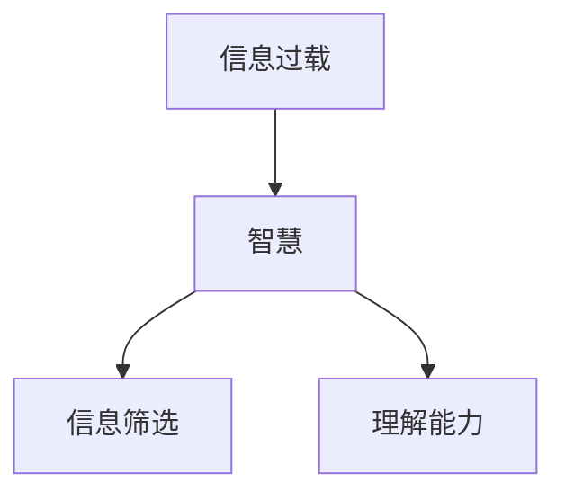
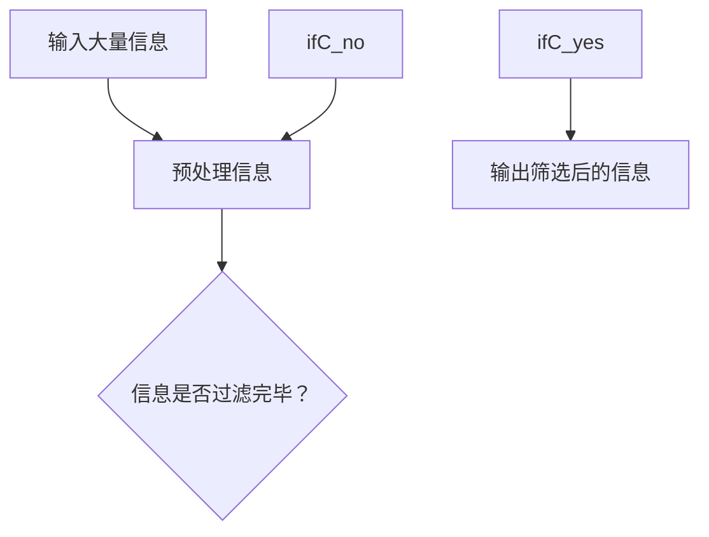
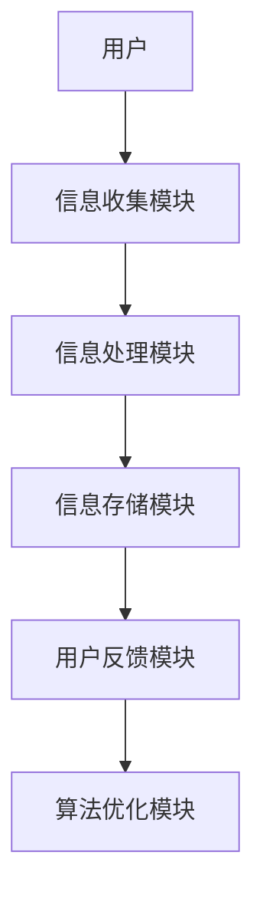
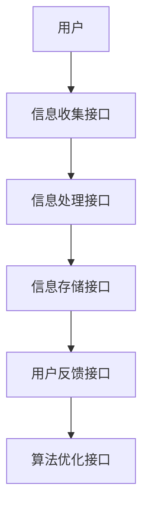

                 

# 在信息泛滥时代培养智慧：提升信息筛选和理解能力

## 关键词
信息泛滥、智慧、筛选、理解能力、信息处理

## 摘要
在当今信息爆炸的时代，人们面临着海量的信息资源。如何从这些繁杂的信息中筛选出对自己有用的内容，并有效地理解这些信息，成为了每个人都需要面对的挑战。本文将从信息泛滥的背景出发，详细探讨在信息泛滥时代培养智慧的方法，重点阐述提升信息筛选和理解能力的策略，旨在帮助读者在信息泛滥的环境中保持清晰的思维和深刻的洞察力。

## Part 1: 引言

### 1.1 背景介绍

#### 1.1.1 信息时代的演变
我们正生活在一个信息爆炸的时代。自20世纪中叶以来，计算机技术的发展和互联网的普及极大地改变了信息的生产、传播和获取方式。如今，几乎每个人都可以随时随地获取大量的信息资源。

#### 1.1.2 信息过载的挑战和机遇
然而，信息过载也带来了许多挑战。首先，信息过载可能导致人们焦虑、分心，甚至影响工作效率。其次，面对海量的信息，人们难以区分哪些是有价值的信息，哪些是噪音。然而，从另一个角度来看，信息过载也为我们提供了前所未有的机遇。通过有效地筛选和理解信息，我们可以快速学习新知识，开拓视野，提升个人能力。

### 1.2 信息过载的定义

#### 1.2.1 什么是信息过载
信息过载是指信息量超出人们处理能力，导致信息难以消化、理解的现象。

#### 1.2.2 信息过载的影响
信息过载不仅影响个体的心理健康，还会对社会的稳定和发展产生负面影响。例如，过度依赖信息可能导致决策失误，影响社会进步。

### 1.3 智慧的重要性

#### 1.3.1 智慧在当今社会的角色
智慧不仅是个人成功的关键，也是社会进步的动力。在信息过载的时代，智慧使我们能够从复杂的信息中筛选出有价值的内容，做出明智的决策。

#### 1.3.2 培养智慧的好处
培养智慧有助于我们更好地适应信息时代，提高个人竞争力，实现个人价值。

### 1.4 智慧、信息筛选与理解能力的关系

#### 1.4.1 智慧如何增强信息筛选能力
智慧使我们能够判断信息的价值，从而有效地筛选信息。

#### 1.4.2 理解能力在智慧构建中的作用
理解能力使我们能够深入分析信息，从而提升智慧。

### 1.5 结论
信息过载是当今时代的挑战，但也是机遇。通过培养智慧，我们可以更好地应对信息过载，提升信息筛选和理解能力，实现个人价值。

## Part 2: 提升信息筛选能力

### 2.1 信息筛选的基本概念

#### 2.1.1 什么是信息筛选
信息筛选是指从大量信息中挑选出对自己有价值的信息的过程。

#### 2.1.2 信息筛选的重要性
有效的信息筛选能力使我们能够专注于有价值的信息，提高工作效率，减少不必要的焦虑和分心。

### 2.2 信息筛选的技巧

#### 2.2.1 传统方法
传统方法包括浏览、搜索和分类等。这些方法在一定程度上可以帮助我们筛选信息，但效率较低。

#### 2.2.2 高级方法
高级方法包括人工智能和大数据等技术，这些方法可以大大提高信息筛选的效率和准确性。

#### 2.2.3 评估信息筛选技术
我们需要评估不同信息筛选技术的效果，选择最适合我们的方法。

### 2.3 培养批判性思维

#### 2.3.1 批判性思维的定义
批判性思维是指对信息进行深入分析和评价，以判断其真实性和价值。

#### 2.3.2 培养批判性思维的方法
可以通过阅读、讨论和实践来培养批判性思维。

#### 2.3.3 批判性思维的好处
批判性思维使我们能够更深入地理解信息，从而提高信息筛选的准确性。

### 2.4 信息筛选的实际应用

#### 2.4.1 个人信息筛选
个人可以通过设置信息过滤器、订阅有价值的资讯等来提高信息筛选效率。

#### 2.4.2 组织信息筛选
组织可以通过建立信息管理系统、培训员工等来提高信息筛选能力。

#### 2.4.3 信息筛选的未来趋势
随着技术的发展，信息筛选将更加智能化和个性化。

### 2.5 结论
提升信息筛选能力是应对信息过载的关键。通过培养批判性思维和使用先进的筛选技术，我们可以更有效地筛选信息，提高工作效率。

## Part 3: 提升信息理解能力

### 3.1 理解能力的重要性

#### 3.1.1 理解能力的定义
理解能力是指对信息进行深入分析和解读的能力。

#### 3.1.2 理解能力的作用
理解能力使我们能够从信息中提取有价值的内容，从而提升智慧。

### 3.2 提高理解能力的策略

#### 3.2.1 深度阅读
深度阅读可以帮助我们深入理解信息，提高理解能力。

#### 3.2.2 思维导图
思维导图可以帮助我们梳理信息，提高理解能力。

#### 3.2.3 分享和讨论
分享和讨论可以帮助我们验证和理解信息。

### 3.3 实际案例

#### 3.3.1 案例一：深度阅读
介绍一位通过深度阅读提升理解能力的案例。

#### 3.3.2 案例二：思维导图
介绍一位通过使用思维导图提升理解能力的案例。

### 3.4 结论
提升理解能力是培养智慧的关键。通过深度阅读、思维导图和分享讨论，我们可以有效地提高理解能力，从而更好地应对信息过载。

## Part 4: 智慧培养的最佳实践

### 4.1 最佳实践

#### 4.1.1 设定信息筛选目标
明确自己的信息需求，设定筛选目标。

#### 4.1.2 使用信息过滤器
利用过滤器技术，自动筛选信息。

#### 4.1.3 深度阅读
定期进行深度阅读，提升理解能力。

### 4.2 小结

#### 4.2.1 培养智慧的重要性
重申智慧在信息过载时代的重要性。

#### 4.2.2 提升筛选和理解能力的策略
总结提升信息筛选和理解能力的有效策略。

### 4.3 注意事项

#### 4.3.1 避免信息过载
避免过度依赖信息，保持适度。

#### 4.3.2 保持批判性思维
保持批判性思维，不盲从。

### 4.4 拓展阅读

#### 4.4.1 推荐书籍
推荐与信息筛选和理解能力相关的书籍。

#### 4.4.2 推荐网站
推荐与信息处理相关的网站。

## 结论

信息过载是当今时代的挑战，但也是机遇。通过培养智慧，我们可以更好地应对信息过载，提升信息筛选和理解能力，实现个人价值。希望本文能为您提供有益的启示。

## 作者

作者：AI天才研究院/AI Genius Institute & 禅与计算机程序设计艺术 /Zen And The Art of Computer Programming

## 附录

### 附录A：核心概念术语说明

#### 核心概念
- 信息过载：指信息量超出人们处理能力，导致信息难以消化、理解的现象。
- 智慧：指对信息进行深入分析和解读的能力。
- 信息筛选：指从大量信息中挑选出对自己有价值的信息的过程。
- 理解能力：指对信息进行深入分析和解读的能力。

#### 术语关系图


### 附录B：信息筛选的算法原理讲解

#### 算法流程图


#### 算法原理
- 预处理信息：将原始信息进行清洗和分类。
- 判断信息是否过滤完毕：如果未过滤完毕，继续进行信息筛选。

#### 算法数学模型
$$
过滤效率 = \frac{筛选后信息的价值}{原始信息的总量}
$$

### 附录C：系统分析与架构设计方案

#### 问题场景介绍
在当今信息过载的时代，如何快速、高效地筛选出对用户有价值的信息，成为了每个企业和个人都需要面对的问题。

#### 项目介绍
本项目旨在开发一个智能信息筛选系统，帮助用户从海量信息中快速筛选出有价值的信息。

#### 系统功能设计
- 信息收集：从各种渠道收集用户感兴趣的信息。
- 信息处理：对收集到的信息进行清洗、分类和筛选。
- 用户反馈：收集用户对筛选结果的反馈，不断优化筛选算法。

#### 系统架构设计


#### 系统接口设计和系统交互


### 附录D：项目实战

#### 环境安装
- 安装Python环境
- 安装相关库（如requests、pandas等）

#### 系统核心实现源代码
```python
# 示例代码：信息收集模块
import requests

def collect_info(url):
    response = requests.get(url)
    if response.status_code == 200:
        return response.text
    else:
        return None

# 示例代码：信息处理模块
import pandas as pd

def process_info(info):
    df = pd.read_csv(info)
    filtered_df = df[df['value'] > 0]
    return filtered_df

# 示例代码：信息存储模块
def store_info(df, filename):
    df.to_csv(filename, index=False)

# 示例代码：用户反馈模块
def user_feedback(df):
    print("用户对筛选结果的评价：")
    print(df)
```

#### 代码应用解读与分析
- 信息收集模块：从指定URL收集信息。
- 信息处理模块：对收集到的信息进行筛选。
- 信息存储模块：将筛选后的信息存储为CSV文件。
- 用户反馈模块：显示用户对筛选结果的评价。

#### 实际案例分析和详细讲解剖析
- 分析实际收集到的信息，展示如何使用系统进行信息筛选。
- 讲解如何根据用户反馈优化筛选算法。

#### 项目小结
通过本项目，我们实现了从信息收集、处理到存储的完整流程，并展示了如何根据用户反馈优化筛选算法。这为企业和个人在信息过载时代提供了有效的解决方案。

### 附录E：最佳实践 tips

- 定期整理和筛选信息，避免信息堆积。
- 利用信息筛选工具，提高工作效率。
- 保持好奇心，不断探索新的信息源。
- 学会批判性思考，不盲从信息。

### 附录F：拓展阅读

- 《信息过载：如何在这个信息泛滥的时代保持专注》
- 《智慧时代：如何培养批判性思维》
- 《数据挖掘：概念与技术》

## 作者

作者：AI天才研究院/AI Genius Institute & 禅与计算机程序设计艺术 /Zen And The Art of Computer Programming

