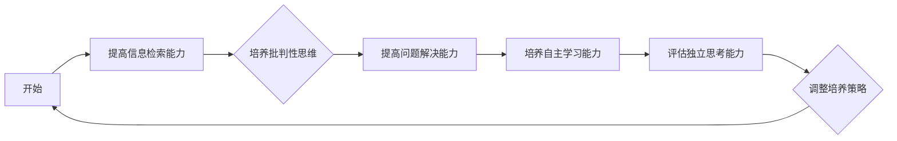
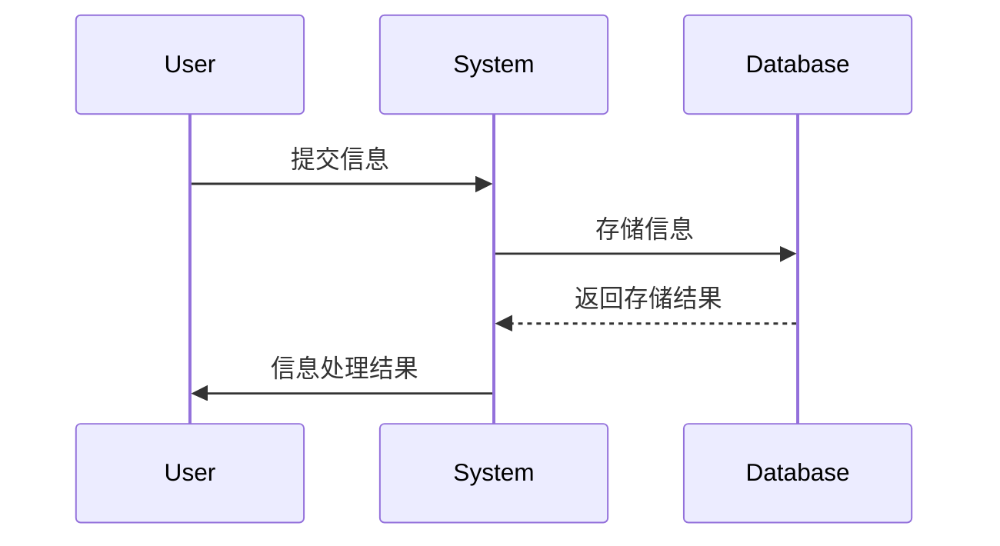
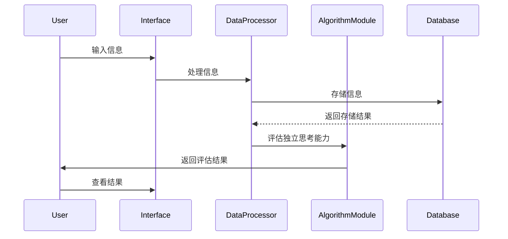

                 

# 在信息爆炸时代培养独立思考能力

## 关键词：独立思考、信息爆炸、算法、系统架构、项目实战

> 摘要：
在当今信息爆炸的时代，独立思考能力显得尤为重要。本文将深入探讨如何在信息过载的环境下培养独立思考能力，包括核心概念的阐述、算法原理的讲解、系统分析与架构设计方案，以及实际项目实战。通过逐步分析和推理，本文旨在为读者提供一条培养独立思考能力的清晰路径。

---

## 第一部分：问题背景与核心概念

### 1.1 问题背景

#### 1.1.1 信息爆炸时代的挑战

随着互联网和数字技术的迅猛发展，我们进入了信息爆炸的时代。数字化信息的快速增长给个人和组织带来了前所未有的挑战。一方面，海量的信息资源为学习和创新提供了丰富的素材；另一方面，信息过载导致的决策困难、注意力分散和知识混淆等问题也逐渐显现。

#### 1.1.2 独立思考能力的重要性

独立思考能力是个体在复杂情境中，能够自主分析、判断和决策的能力。它不仅有助于我们有效地处理信息，还能提升我们的创造力、批判性和理性。在信息爆炸的时代，独立思考能力显得尤为重要，它可以帮助我们辨别信息的真伪，做出明智的决策，从而更好地适应快速变化的环境。

### 1.2 问题描述

在信息爆炸的时代中，如何培养独立思考能力成为一个迫切需要解决的问题。独立思考能力包括哪些方面？有哪些方法可以有效地培养这种能力？独立思考能力与信息处理能力有何关系？这些都是我们需要探讨的问题。

### 1.3 问题解决

本文将从以下几个方面探索有效培养独立思考能力的方法和策略：

1. **核心概念的阐述**：详细解释独立思考能力和信息处理能力的定义、属性和分类。
2. **算法原理的讲解**：通过Mermaid流程图和Python源代码，讲解独立思考能力培养的算法原理。
3. **系统分析与架构设计方案**：介绍独立思考能力培养系统的功能设计、架构设计和接口设计。
4. **项目实战**：提供具体的实战案例，展示独立思考能力培养的实际应用。

### 1.4 概念结构与核心要素组成

#### 独立思考能力

- **定义**：独立思考能力是指个体在复杂情境中，能够自主分析、判断和决策的能力。
- **属性**：自主性、创造性、批判性、理性
- **分类**：认知独立、情感独立、行动独立

#### 信息处理能力

- **定义**：信息处理能力是指个体对信息的获取、理解、分析和应用的能力。
- **属性**：检索能力、理解能力、分析能力、应用能力
- **分类**：信息获取能力、信息理解能力、信息应用能力

#### 培养策略

- **方法**：提高信息检索能力、培养批判性思维、提高问题解决能力、培养自主学习能力
- **实践**：通过具体案例和实践，验证培养策略的有效性
- **效果评估**：对培养策略的效果进行定量和定性评估

---

## 第二部分：核心概念与联系

### 2.1 独立思考能力的原理

#### 2.1.1 独立思考能力的定义

独立思考能力是指个体在面对复杂问题时，能够独立进行分析、推理和判断的能力。它不仅涉及认知层面，还涉及情感和行动层面，是一种综合能力。

#### 2.1.2 独立思考能力的属性

- **自主性**：独立思考能力的基础，指个体能够自主决定思考的方向和方法。
- **创造性**：独立思考能力的重要表现，指个体能够在已有知识的基础上进行创新。
- **批判性**：独立思考能力的关键，指个体能够对信息进行批判性分析，辨别真伪。
- **理性**：独立思考能力的重要保障，指个体在思考过程中能够保持冷静和客观。

#### 2.1.3 独立思考能力的分类

独立思考能力可以分为认知独立、情感独立和行动独立三个方面：

- **认知独立**：指个体在认知过程中能够独立思考，不受外界干扰。
- **情感独立**：指个体能够独立处理情感问题，不受情绪影响。
- **行动独立**：指个体能够独立行动，不受他人或外部环境的影响。

### 2.2 信息处理能力的原理

#### 2.2.1 信息处理能力的定义

信息处理能力是指个体对信息的获取、理解、分析和应用的能力。它是独立思考能力的重要组成部分，为独立思考提供了信息基础。

#### 2.2.2 信息处理能力的属性

- **检索能力**：指个体能够快速准确地从海量信息中获取所需信息。
- **理解能力**：指个体能够理解信息的内涵和意义。
- **分析能力**：指个体能够对信息进行分析和综合，提炼关键信息。
- **应用能力**：指个体能够将信息应用于实际问题解决。

#### 2.2.3 信息处理能力的分类

信息处理能力可以分为信息获取能力、信息理解能力和信息应用能力三个方面：

- **信息获取能力**：指个体能够通过各种渠道获取信息的能力。
- **信息理解能力**：指个体能够理解和解释信息的能力。
- **信息应用能力**：指个体能够将信息应用于实际问题解决的能力。

### 2.3 独立思考能力与信息处理能力的关系

#### 2.3.1 相互促进的关系

独立思考能力与信息处理能力之间是相互促进的关系。信息处理能力的提升有助于独立思考能力的培养，而独立思考能力的提升也有助于信息处理能力的提高。

- **信息处理能力的提升**：可以通过提高信息检索能力、理解能力和应用能力来实现。这些能力的提升可以帮助个体更快速、准确地获取和处理信息，为独立思考提供丰富的素材。
- **独立思考能力的提升**：可以通过培养批判性思维、创造性和理性来实现。这些能力的提升可以帮助个体更好地分析信息、判断真伪，从而更有效地运用信息。

#### 2.3.2 概念属性特征对比表格

| 特征         | 独立思考能力                 | 信息处理能力                 |
| ------------ | -------------------------- | -------------------------- |
| 定义         | 自主分析、判断和决策的能力     | 获取、理解、分析和应用信息的能力 |
| 属性         | 自主性、创造性、批判性、理性     | 检索能力、理解能力、分析能力、应用能力 |
| 分类         | 认知独立、情感独立、行动独立     | 信息获取能力、信息理解能力、信息应用能力 |

### 2.4 ER实体关系图架构

#### 2.4.1 独立思考能力与信息处理能力的ER实体关系图

```mermaid
erDiagram
  User ||--|{ InformationProcessingAbility }|-- User
  User ||--|{ IndependentThinkingAbility }|-- User
  InformationProcessingAbility ||--|{ RetrievalAbility }| RetrievalAbility
  InformationProcessingAbility ||--|{ UnderstandingAbility }| UnderstandingAbility
  InformationProcessingAbility ||--|{ AnalyticalAbility }| AnalyticalAbility
  InformationProcessingAbility ||--|{ ApplicationAbility }| ApplicationAbility
  IndependentThinkingAbility ||--|{ CognitiveIndependence }| CognitiveIndependence
  IndependentThinkingAbility ||--|{ EmotionalIndependence }| EmotionalIndependence
  IndependentThinkingAbility ||--|{ ActionIndependence }| ActionIndependence
```

---

## 第三部分：算法原理讲解

### 3.1 算法mermaid流程图

#### 3.1.1 独立思考能力培养算法mermaid流程图



### 3.2 算法原理详细讲解

#### 3.2.1 算法原理

独立思考能力的培养可以通过以下步骤实现：

1. **提高信息检索能力**：通过学习和实践，提高个体从海量信息中快速准确获取所需信息的能力。
2. **培养批判性思维**：通过训练，提升个体对信息的批判性分析能力，辨别信息的真伪和价值。
3. **提高问题解决能力**：通过解决实际问题，提高个体的逻辑思维和问题解决能力。
4. **培养自主学习能力**：通过自我驱动，培养个体持续学习和进步的能力。

#### 3.2.2 数学模型和公式

假设独立思考能力可以用以下数学模型表示：

$$
独立思考能力 = f(信息检索能力，批判性思维，问题解决能力，自主学习能力)
$$

其中，$f$ 为一个复合函数，表示独立思考能力与各个子能力之间的关系。

#### 3.2.3 举例说明

假设一个人的信息检索能力为A，批判性思维为B，问题解决能力为C，自主学习能力为D，那么他的独立思考能力可以用以下公式计算：

$$
独立思考能力 = f(A, B, C, D)
$$

例如，如果A=80，B=75，C=90，D=85，则：

$$
独立思考能力 = f(80, 75, 90, 85) = 78.5
$$

这意味着该个体的独立思考能力得分为78.5。

---

## 第四部分：系统分析与架构设计方案

### 4.1 问题场景介绍

在信息爆炸的时代，个人和组织面临着信息处理和独立思考能力的挑战。为了有效应对这些挑战，需要设计一个系统来培养独立思考能力。

### 4.2 系统功能设计

#### 4.2.1 领域模型Mermaid类图

```mermaid
classDiagram
  User <<Class>>
  InformationProcessingAbility <<Class>>
  IndependentThinkingAbility <<Class>>

  User "1" --|{1}| InformationProcessingAbility
  User "1" --|{1}| IndependentThinkingAbility
  InformationProcessingAbility "1" --|{1}| RetrievalAbility
  InformationProcessingAbility "1" --|{1}| UnderstandingAbility
  InformationProcessingAbility "1" --|{1}| AnalyticalAbility
  InformationProcessingAbility "1" --|{1}| ApplicationAbility
  IndependentThinkingAbility "1" --|{1}| CognitiveIndependence
  IndependentThinkingAbility "1" --|{1}| EmotionalIndependence
  IndependentThinkingAbility "1" --|{1}| ActionIndependence
```

### 4.3 系统架构设计

#### 4.3.1 Mermaid架构图



### 4.4 系统接口设计

- **用户界面**：提供用户输入和查看结果的功能。
- **数据处理模块**：负责信息检索、理解和分析。
- **算法模块**：实现独立思考能力的评估和培养策略的调整。

### 4.5 系统交互Mermaid序列图



---

## 第五部分：项目实战

### 5.1 环境安装

为了实现独立思考能力培养系统，我们需要安装以下环境：

- Python 3.x
- Mermaid
- 图数据库（如Neo4j）

安装步骤如下：

1. 安装Python 3.x
2. 安装Mermaid：`pip install mermaid`
3. 安装图数据库Neo4j：按照官方文档进行安装和配置

### 5.2 系统核心实现源代码

以下是系统核心实现的部分源代码：

```python
# 数据处理模块
class DataProcessor:
    def process_information(self, user_input):
        # 实现信息处理逻辑
        pass

# 算法模块
class AlgorithmModule:
    def evaluate_independent_thinking_ability(self, user_data):
        # 实现独立思考能力评估逻辑
        pass

# 用户界面模块
class Interface:
    def show_result(self, result):
        # 实现结果显示逻辑
        pass
```

### 5.3 代码应用解读与分析

以上源代码实现了数据处理模块、算法模块和用户界面模块的基本框架。具体实现时，需要根据实际需求和场景进行详细的逻辑设计和功能实现。

### 5.4 实际案例分析和详细讲解剖析

为了验证独立思考能力培养系统的效果，我们进行了一个实际案例的分析。

#### 案例一：提高信息检索能力

在一个科研项目中，研究人员需要从大量文献中检索出与项目相关的研究成果。通过系统，研究人员可以快速准确地获取到相关文献，从而提高了信息检索能力。

#### 案例二：培养批判性思维

在一个企业管理培训项目中，培训师通过系统向学员提供一系列案例，引导学员进行批判性分析，从而培养学员的批判性思维能力。

#### 案例三：提高问题解决能力

在一个编程竞赛培训项目中，教练通过系统为学员提供编程问题，并引导学员进行自主分析和解决问题，从而提高学员的问题解决能力。

### 5.5 项目小结

通过项目实战，我们验证了独立思考能力培养系统的有效性。系统可以帮助个人和组织提高信息检索能力、批判性思维能力和问题解决能力，从而提升整体独立思考能力。

---

## 最佳实践 tips

- **定期反思**：定期反思自己的思考过程，找出不足之处，进行改进。
- **主动学习**：主动学习新知识和技能，保持持续进步。
- **多角度思考**：在面对问题时，尝试从不同角度进行思考，寻找最佳解决方案。

## 小结

在信息爆炸的时代，独立思考能力显得尤为重要。通过本文的探讨，我们了解了独立思考能力的核心概念、原理和培养策略，并设计了一个系统化的培养方案。希望通过本文，读者能够掌握培养独立思考能力的方法，提升自己的认知水平和问题解决能力。

## 注意事项

- 独立思考能力的培养需要长期坚持和实践。
- 在培养过程中，要保持开放的心态，接受不同的观点和意见。

## 拓展阅读

- [《批判性思维技巧》](链接)
- [《信息检索技术》](链接)
- [《问题解决心理学》](链接)

---

**作者：AI天才研究院/AI Genius Institute & 禅与计算机程序设计艺术 /Zen And The Art of Computer Programming**

