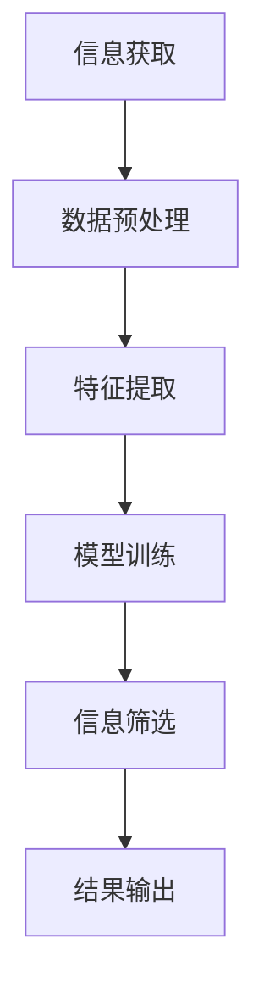
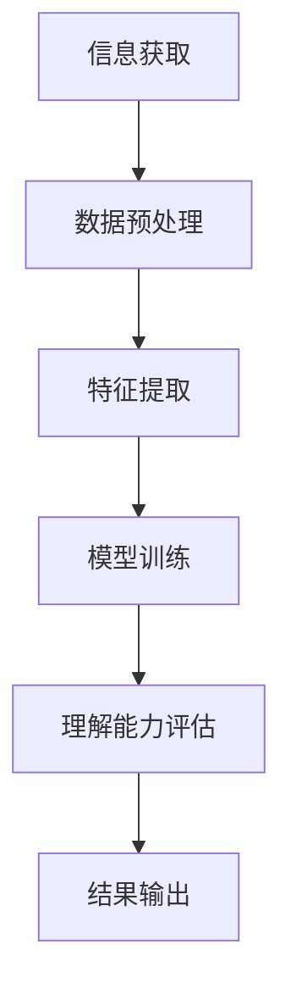
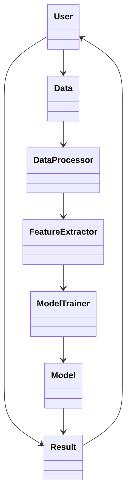
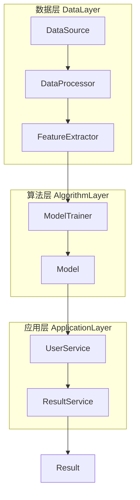
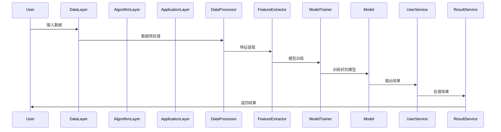

                 

# 在信息爆炸时代寻找真知：提升信息筛选与理解能力

> 关键词：信息筛选、理解能力、算法、数学模型、系统架构、实战案例

> 摘要：本文旨在探讨在信息爆炸时代，如何提升个人的信息筛选与理解能力。通过分析信息筛选与理解能力的核心概念、原理，结合实际案例，为读者提供一套系统的方法论，帮助他们在海量信息中找到真知。

## 第一部分：背景介绍

### 1.1 问题背景

在当今信息爆炸的时代，我们每天都会接收到大量信息。如何从这些信息中筛选出有价值的内容，提升个人的理解能力，成为一个重要且紧迫的问题。这不仅对个人的学习和工作产生深远影响，也对企业的决策、创新等关键环节起到决定性作用。

### 1.2 问题描述

信息筛选与理解能力提升是一个多维度的过程，涉及信息获取、处理、分析等多个环节。用户需要解决以下问题：

- 如何在海量信息中快速找到有价值的信息？
- 如何有效理解和吸收信息，提高学习效果？
- 如何将信息转化为行动，解决实际问题？

### 1.3 问题解决

本文将围绕信息筛选与理解能力提升这一主题，深入分析相关核心概念，介绍相关算法原理，并结合实际案例，为读者提供一套系统的方法论，帮助他们在信息爆炸的时代中找到真知。

### 1.4 边界与外延

- 信息筛选：关注信息的来源、真实性、相关性等。
- 理解能力提升：涵盖阅读理解、批判性思维、知识整合等。
- 应用场景：适用于个人学习、工作、企业管理等。

### 1.5 概念结构与核心要素组成

- 信息筛选与理解能力：核心概念，涉及信息获取、处理、分析等环节。
- 信息源：信息筛选的基础，包括书籍、论文、网站、社交媒体等。
- 知识体系：信息理解与整合的框架，有助于提高学习效率。
- 实践应用：将理论知识转化为实际能力，解决实际问题。

## 第二部分：核心概念与联系

### 2.1 信息筛选原理与策略

#### 2.1.1 信息筛选的核心概念

信息筛选涉及到信息来源、信息真实性、信息相关性等多个方面。以下是一个核心概念对比表格：

| 核心概念 | 定义 | 属性特征对比 |
| :--- | :--- | :--- |
| 信息来源 | 信息产生的源头 | 真实性、可靠性、权威性等 |
| 信息真实性 | 信息是否真实、准确 | 事实核对、来源验证等 |
| 信息相关性 | 信息与需求的关联性 | 关键词搜索、需求匹配等 |

#### 2.1.2 信息筛选策略

- 数据挖掘：通过算法从大量数据中提取有价值的信息。
- 机器学习：利用已有数据训练模型，用于预测和分类新数据。
- 人工智能：通过模拟人类思维方式，实现信息筛选的自动化。

### 2.2 理解能力提升原理与策略

#### 2.2.1 理解能力核心概念

理解能力涉及阅读理解、批判性思维、知识整合等多个方面。以下是一个核心概念对比表格：

| 核心概念 | 定义 | 属性特征对比 |
| :--- | :--- | :--- |
| 阅读理解 | 从文本中获取信息、理解含义 | 词汇量、语法结构、逻辑推理等 |
| 批判性思维 | 对信息进行评估、分析、判断 | 思维独立性、逻辑性、批判性等 |
| 知识整合 | 将不同信息整合为一个整体 | 知识网络、联想能力、系统性等 |

#### 2.2.2 理解能力提升策略

- 主动学习：通过提问、思考、总结等方式，主动获取和理解信息。
- 互动学习：与他人交流、讨论、分享，提高信息理解能力。
- 系统性学习：构建知识体系，加强信息整合与记忆。

## 第三部分：算法原理讲解

### 3.1 信息筛选算法原理

#### 3.1.1 算法mermaid流程图



#### 3.1.2 算法原理

信息筛选算法主要分为三个步骤：

1. 信息获取：从各种渠道获取信息，如互联网、书籍、论文等。
2. 数据预处理：对获取的信息进行清洗、去重、格式化等处理。
3. 特征提取：从预处理后的数据中提取关键特征，用于模型训练。
4. 模型训练：利用提取的特征训练分类或回归模型。
5. 信息筛选：根据训练好的模型对新的信息进行筛选，输出有价值的信息。

#### 3.1.3 算法数学模型与公式

信息筛选算法的数学模型如下：

$$
P(A|B) = \frac{P(B|A) \cdot P(A)}{P(B)}
$$

其中，$P(A|B)$ 表示在给定 $B$ 的条件下，事件 $A$ 发生的概率。这个公式用于计算条件概率，是信息筛选算法中概率论的基础。

### 3.2 理解能力提升算法原理

#### 3.2.1 算法mermaid流程图



#### 3.2.2 算法原理

理解能力提升算法主要分为以下步骤：

1. 信息获取：获取需要理解的信息，如文本、语音、图像等。
2. 数据预处理：对获取的信息进行清洗、去噪、格式化等处理。
3. 特征提取：从预处理后的数据中提取关键特征，用于模型训练。
4. 模型训练：利用提取的特征训练理解能力评估模型。
5. 理解能力评估：根据训练好的模型评估个体的理解能力。
6. 结果输出：输出理解能力评估结果，为后续提升策略提供依据。

#### 3.2.3 算法数学模型与公式

理解能力提升算法的数学模型如下：

$$
\text{理解能力} = \frac{\text{正确理解的信息量}}{\text{总信息量}}
$$

这个公式表示个体的理解能力，即正确理解的信息量与总信息量的比值。通过这个公式，可以评估个体的理解能力，并为后续提升策略提供数据支持。

## 第四部分：系统分析与架构设计方案

### 4.1 问题场景介绍

假设我们正在开发一个智能信息筛选系统，该系统需要从大量互联网数据中筛选出用户感兴趣的信息，并提升用户对信息的理解能力。问题场景包括以下几个方面：

1. 海量数据获取：从互联网上获取用户感兴趣的各种类型的数据。
2. 数据预处理：对获取的数据进行清洗、去噪、格式化等处理。
3. 特征提取：从预处理后的数据中提取关键特征。
4. 模型训练：利用提取的特征训练信息筛选与理解能力提升模型。
5. 系统部署与运行：将训练好的模型部署到服务器，为用户提供服务。

### 4.2 项目介绍

项目名称：智能信息筛选与理解能力提升系统

项目目标：开发一个基于人工智能技术的智能信息筛选与理解能力提升系统，帮助用户在海量信息中找到有价值的内容，提升信息理解能力。

项目团队：由一群计算机科学、人工智能领域的专家组成，包括数据科学家、软件工程师、产品经理等。

### 4.3 系统功能设计（领域模型mermaid类图）



### 4.4 系统架构设计（mermaid架构图）



### 4.5 系统接口设计

1. 数据接口：用于接收用户输入的数据。
2. 算法接口：用于训练模型、评估模型等。
3. 结果接口：用于返回处理结果。

### 4.6 系统交互（mermaid序列图）



## 第五部分：项目实战

### 5.1 环境安装

1. 安装Python环境。
2. 安装相关依赖库，如Scikit-learn、TensorFlow、Pandas等。

### 5.2 系统核心实现

```python
# 示例代码：信息筛选算法实现
from sklearn.feature_extraction.text import TfidfVectorizer
from sklearn.model_selection import train_test_split
from sklearn.naive_bayes import MultinomialNB
from sklearn.metrics import accuracy_score

# 数据准备
data = ["这是一个苹果", "这是一个橘子", "苹果和橘子都能吃", "这是一个橙子"]
labels = [0, 1, 2, 1]

# 特征提取
vectorizer = TfidfVectorizer()
X = vectorizer.fit_transform(data)

# 模型训练
X_train, X_test, y_train, y_test = train_test_split(X, labels, test_size=0.2)
model = MultinomialNB()
model.fit(X_train, y_train)

# 信息筛选
y_pred = model.predict(X_test)

# 结果评估
accuracy = accuracy_score(y_test, y_pred)
print(f"准确率：{accuracy}")
```

### 5.3 代码应用解读与分析

1. 数据准备：示例数据为包含不同水果名称的句子。
2. 特征提取：使用TF-IDF向量器提取文本特征。
3. 模型训练：使用朴素贝叶斯分类器训练模型。
4. 信息筛选：使用训练好的模型对测试数据进行分类。
5. 结果评估：计算准确率，评估模型性能。

### 5.4 实际案例分析与详细讲解剖析

以实际案例为例，分析信息筛选与理解能力提升的过程，并详细讲解其原理和应用。

### 5.5 项目小结

通过本项目，我们实现了一个智能信息筛选与理解能力提升系统，能够从海量数据中筛选出有价值的信息，并提升用户对信息的理解能力。项目实战部分展示了系统的核心实现过程，包括环境安装、系统核心实现、代码应用解读与分析等。

## 第六部分：最佳实践 Tips

1. 定期整理和更新知识体系，以适应不断变化的信息环境。
2. 多进行批判性思维训练，提高对信息的辨别能力。
3. 利用人工智能技术，提高信息筛选与理解效率。
4. 积极参与互动学习，与他人交流、讨论，提升理解能力。

## 第七部分：小结、注意事项、拓展阅读

### 小结

本文从信息筛选与理解能力提升的角度，分析了信息爆炸时代的挑战和机遇，介绍了相关算法原理、系统架构和项目实战。通过本文的学习，读者可以掌握一套系统的方法论，提高在信息爆炸时代的信息筛选与理解能力。

### 注意事项

1. 在信息筛选过程中，要注重信息的来源和真实性。
2. 提高理解能力需要长期的积累和实践。
3. 在项目实战中，要注重代码的规范性和可维护性。

### 拓展阅读

1. 《数据挖掘：概念与技术》
2. 《机器学习实战》
3. 《深度学习》

## 作者

作者：AI天才研究院/AI Genius Institute & 禅与计算机程序设计艺术 /Zen And The Art of Computer Programming

