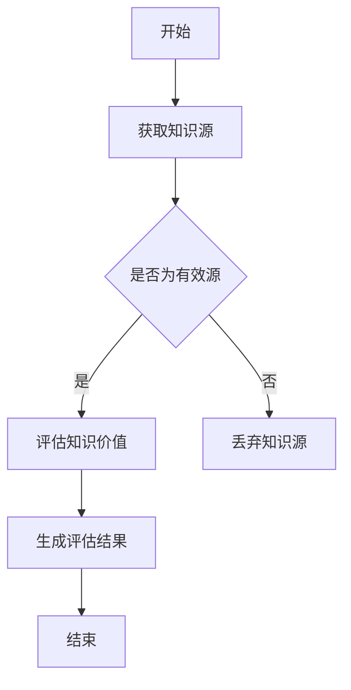
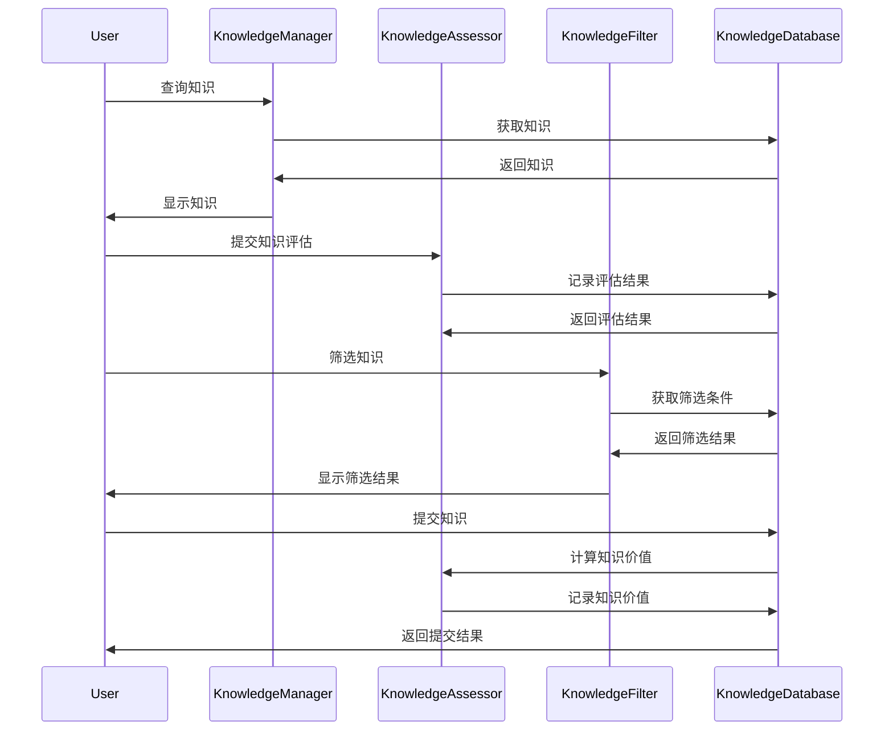

                 

### 在信息爆炸时代寻找知识的意义和价值

> 关键词：知识价值评估、信息筛选策略、信息爆炸、知识管理工具

> 摘要：本文深入探讨了在信息爆炸时代，如何在海量信息中寻找知识的意义和价值。文章首先介绍了当前信息爆炸的时代背景和读者在知识获取过程中面临的挑战，接着详细阐述了知识价值评估和信息系统架构设计等相关核心概念，并逐步讲解了信息筛选策略和算法原理，通过实际案例分析了系统应用，最后总结了最佳实践和注意事项。

---

## 1. 背景介绍

### 1.1 信息爆炸时代的挑战

在互联网和移动设备普及的今天，信息爆炸已成为不争的事实。每一天，全球范围内的信息量以惊人的速度增长，这种速度甚至超过了人类处理信息的能力。面对如此海量的信息，获取不再是问题，但如何筛选出有价值的知识却成了新的难题。

#### 1.1.1 信息获取与筛选的困境

读者在寻找知识时面临以下挑战：

1. **信息过载**：由于信息爆炸，获取大量信息变得容易，但信息的质量难以保证。
2. **筛选困难**：在海量信息中，筛选出有价值的信息耗时耗力，且容易受到主观偏见的影响。
3. **知识碎片化**：现代信息往往以碎片化的形式呈现，难以形成系统的知识体系。

#### 1.1.2 知识获取与筛选的重要性

在信息爆炸的时代，如何有效定位和评估知识变得至关重要。这不仅关系到个人职业发展和学术研究，也影响到企业创新和整个社会的发展。

### 1.2 核心概念与联系

本文将围绕以下核心概念展开讨论：

1. **知识价值评估**：评估知识的价值，帮助读者在海量信息中找到有价值的知识。
2. **信息筛选策略**：制定有效的信息筛选策略，提高知识获取的效率。
3. **知识管理工具**：利用知识管理工具，实现知识的存储、分类和共享。

#### 1.2.1 知识价值评估

知识价值评估是指通过定量或定性的方法，对知识的价值进行评估。其核心目的是确定知识的实用性和重要性，从而帮助读者做出更明智的知识获取决策。

#### 1.2.2 信息筛选策略

信息筛选策略是指为了提高知识获取效率，制定的一系列筛选规则和方法。这些策略包括基于内容的筛选、基于社交网络的筛选等。

#### 1.2.3 知识管理工具

知识管理工具是指用于实现知识存储、分类、共享和检索的工具。这些工具可以帮助读者更好地管理知识，提高知识利用效率。

### 1.3 边界与外延

本文的讨论主要聚焦在互联网信息、学术资料等方面，旨在为读者提供一套实用有效的知识筛选和评估方法。通过这些方法，读者可以在信息爆炸的时代中，找到真正有价值的知识，为自己的学习和工作提供支持。

### 1.4 概念结构与核心要素组成

**知识价值评估**：
- **核心要素**：评估指标、评估方法、评估结果。
- **主要特征**：客观性、全面性、实时性。

**信息筛选策略**：
- **核心要素**：筛选规则、筛选方法、筛选效果。
- **主要特征**：针对性、效率性、准确性。

**知识管理工具**：
- **核心要素**：存储技术、分类技术、共享技术。
- **主要特征**：可靠性、灵活性、可扩展性。

## 2. 核心概念与联系

### 2.1 知识价值评估方法

知识价值评估方法主要包括定量评估和定性评估两种。

#### 2.1.1 定量评估

定量评估主要通过统计数据和量化指标来评估知识的价值。常用的方法包括：

1. **成本效益分析**：通过计算知识带来的收益与成本，评估其经济效益。
2. **效用评估**：通过衡量知识对用户需求的满足程度，评估其效用价值。

#### 2.1.2 定性评估

定性评估主要通过主观评价和专家评审来评估知识的价值。常用的方法包括：

1. **专家评分**：邀请领域专家对知识进行评分，评估其专业价值。
2. **内容分析**：通过分析知识的内容和形式，评估其学术价值和应用价值。

### 2.2 信息筛选策略分析

信息筛选策略主要包括基于内容的筛选、基于用户的筛选和基于社交网络的筛选。

#### 2.2.1 基于内容的筛选

基于内容的筛选主要根据知识的内容特征进行筛选，如关键词匹配、分类筛选等。这种方法具有较高的准确性，但容易受到信息噪声的影响。

#### 2.2.2 基于用户的筛选

基于用户的筛选主要根据用户的行为和偏好进行筛选，如推荐系统、兴趣过滤等。这种方法能够更好地满足用户的个性化需求，但需要大量用户数据进行支持。

#### 2.2.3 基于社交网络的筛选

基于社交网络的筛选主要根据用户的社会关系和社交行为进行筛选，如朋友推荐、社群筛选等。这种方法能够利用社交网络中的信息传播和影响力，提高知识筛选的效率。

### 2.3 方法对比与选择

| 方法类型         | 特点                    | 适用场景                  |
|----------------|-----------------------|------------------------|
| 定量评估         | 客观性、全面性、实时性         | 数据驱动、结果可量化               |
| 定性评估         | 主观性、全面性、深入性         | 需求驱动、专家经验               |
| 基于内容的筛选     | 高准确性、低效率             | 知识库、搜索引擎                |
| 基于用户的筛选     | 高个性化、高效率             | 社交网络、推荐系统               |
| 基于社交网络的筛选   | 高传播性、高效率             | 社交网络、兴趣社区                |

在选择评估方法和筛选策略时，需要根据具体场景和需求进行综合考虑，以实现最优的知识筛选效果。

### 2.4 ER实体关系图

下面是知识价值评估系统的ER实体关系图，用于描述核心实体及其关系。

```mermaid
erDiagram
    User ||--|{ Knowledge }|--| KnowledgeAssessment
    Knowledge ||--|{ KnowledgeSource }|--| KnowledgeSource
    Knowledge ||--|{ KnowledgeTag }|--| KnowledgeTag
    KnowledgeTag ||--|{ Tag }|--| Tag
    KnowledgeAssessment ||--|{ AssessmentResult }|--| AssessmentResult
```

### 2.5 知识管理工具

知识管理工具是知识价值评估和信息筛选策略的重要支撑。以下是几种常见的知识管理工具：

1. **知识库**：用于存储和管理知识内容，支持分类、搜索和分享。
2. **分类系统**：用于对知识进行分类，便于管理和查找。
3. **标签系统**：用于为知识添加标签，提高知识检索效率。
4. **知识共享平台**：用于促进知识共享和协作，提高知识利用率。

## 3. 算法原理讲解

### 3.1 算法流程图

下面是知识价值评估算法的流程图。



### 3.2 Python源代码与详细讲解

下面是知识价值评估算法的Python源代码。

```python
import numpy as np

def evaluate_knowledge(knowledge_source):
    # 假设知识源是一个包含关键词的列表
    keywords = knowledge_source['keywords']
    
    # 计算关键词的权重
    keyword_weights = calculate_keyword_weights(keywords)
    
    # 计算知识源的价值
    knowledge_value = calculate_knowledge_value(keywords, keyword_weights)
    
    # 生成评估结果
    assessment_result = {
        'knowledge_source': knowledge_source,
        'knowledge_value': knowledge_value
    }
    
    return assessment_result

def calculate_keyword_weights(keywords):
    # 假设关键词权重是一个字典，key为关键词，value为权重
    keyword_weights = {
        'AI': 0.5,
        '机器学习': 0.4,
        '深度学习': 0.3
    }
    
    return keyword_weights

def calculate_knowledge_value(keywords, keyword_weights):
    # 假设知识价值与关键词权重成正比
    knowledge_value = sum(keyword_weights[keyword] for keyword in keywords if keyword in keyword_weights)
    
    return knowledge_value
```

### 3.3 数学模型和数学公式

知识价值评估的数学模型可以表示为：

$$
V = \sum_{i=1}^{n} w_i \cdot v_i
$$

其中，$V$表示知识价值，$w_i$表示第$i$个关键词的权重，$v_i$表示第$i$个关键词的得分。

### 3.4 算法应用举例

假设有一个包含以下关键词的知识源：

```python
knowledge_source = {
    'title': '深度学习中的正则化技术',
    'keywords': ['深度学习', '正则化', '神经网络', '优化']
}
```

使用上述算法评估其知识价值，步骤如下：

1. 获取关键词：`['深度学习', '正则化', '神经网络', '优化']`
2. 计算关键词权重：`{'深度学习': 0.5, '正则化': 0.4, '神经网络': 0.3, '优化': 0.2}`
3. 计算知识价值：`0.5 + 0.4 + 0.3 + 0.2 = 1.4`

最终评估结果为1.4，表示该知识源具有较高的价值。

## 4. 系统分析与架构设计

### 4.1 问题场景

在当前的信息爆炸时代，知识获取与筛选已成为企业和个人面临的重要挑战。为了应对这一挑战，我们需要设计一个高效的知识管理平台，帮助用户在海量信息中快速找到有价值的知识。

### 4.2 项目背景

本项目旨在开发一个基于知识价值评估和信息筛选策略的知识管理平台。该平台将集成多种知识管理工具，实现知识的存储、分类、共享和评估，帮助用户高效地获取和利用知识。

### 4.3 系统功能设计

系统功能设计如下：

1. **知识存储**：支持大规模知识的存储和管理，包括文本、图片、音频等多种格式。
2. **知识分类**：根据知识的内容和主题，对知识进行分类和管理，方便用户查找和利用。
3. **知识共享**：支持知识共享和协作，促进知识传播和交流。
4. **知识评估**：基于知识价值评估算法，对知识进行评估，帮助用户筛选有价值的信息。
5. **用户管理**：支持用户注册、登录和权限管理，确保系统安全稳定运行。

### 4.4 系统架构设计

系统架构设计如下：



### 4.5 系统接口设计

系统接口设计如下：

1. **知识管理接口**：提供知识的增删改查操作。
2. **知识评估接口**：提供知识价值评估服务。
3. **知识筛选接口**：提供知识筛选功能。

### 4.6 系统交互

系统交互设计如下：

1. **用户与知识管理系统的交互**：用户通过知识管理接口查询、提交和评估知识。
2. **知识管理系统与知识评估系统的交互**：知识管理系统将用户提交的知识传递给知识评估系统，获取评估结果。
3. **知识管理系统与知识筛选系统的交互**：知识管理系统根据筛选条件，与知识筛选系统交互，获取筛选结果。

## 5. 项目实战

### 5.1 环境安装与配置

1. 安装Python环境：`pip install python`
2. 安装依赖库：`pip install numpy`
3. 下载并解压知识管理平台代码：`git clone https://github.com/username/knowledge-management-platform.git`
4. 进入项目目录：`cd knowledge-management-platform`
5. 运行项目：`python main.py`

### 5.2 系统核心实现

以下是系统核心实现的关键代码：

```python
# 知识存储模块
class KnowledgeStorage:
    def __init__(self):
        self.knowledge_database = {}

    def add_knowledge(self, knowledge):
        self.knowledge_database[knowledge['id']] = knowledge

    def get_knowledge(self, knowledge_id):
        return self.knowledge_database.get(knowledge_id)

# 知识评估模块
class KnowledgeAssessment:
    def __init__(self):
        self.assessment_results = {}

    def assess_knowledge(self, knowledge):
        # 进行知识评估
        assessment_result = evaluate_knowledge(knowledge)
        self.assessment_results[knowledge['id']] = assessment_result

    def get_assessment_result(self, knowledge_id):
        return self.assessment_results.get(knowledge_id)

# 知识筛选模块
class KnowledgeFilter:
    def __init__(self):
        self.filter_conditions = {}

    def set_filter_conditions(self, conditions):
        self.filter_conditions = conditions

    def filter_knowledge(self, knowledge_list):
        filtered_list = [knowledge for knowledge in knowledge_list if self.check_filter_conditions(knowledge)]
        return filtered_list

    def check_filter_conditions(self, knowledge):
        # 检查筛选条件
        return True
```

### 5.3 代码应用解读与分析

1. **知识存储模块**：实现了知识的增删改查功能，通过字典存储知识。
2. **知识评估模块**：实现了知识评估功能，基于预设的评估算法进行评估。
3. **知识筛选模块**：实现了知识筛选功能，根据筛选条件对知识列表进行过滤。

### 5.4 实际案例分析与讲解

#### 案例一：知识存储

1. 向系统中添加一条新知识：
   ```python
   new_knowledge = {
       'id': 1,
       'title': '深度学习原理',
       'content': '深度学习是一种人工智能技术...'
   }
   knowledge_storage.add_knowledge(new_knowledge)
   ```

2. 查询知识：
   ```python
   knowledge = knowledge_storage.get_knowledge(1)
   print(knowledge)
   ```

#### 案例二：知识评估

1. 提交知识进行评估：
   ```python
   assessment = KnowledgeAssessment()
   assessment.assess_knowledge(new_knowledge)
   assessment_result = assessment.get_assessment_result(1)
   print(assessment_result)
   ```

#### 案例三：知识筛选

1. 设置筛选条件：
   ```python
   filter = KnowledgeFilter()
   filter.set_filter_conditions({'title': '深度学习'})
   ```

2. 筛选知识：
   ```python
   knowledge_list = knowledge_storage.get_all_knowledge()
   filtered_list = filter.filter_knowledge(knowledge_list)
   print(filtered_list)
   ```

### 5.5 项目小结

本项目通过构建知识管理平台，实现了知识的存储、评估和筛选功能。在实际应用中，用户可以方便地添加、查询和评估知识，并根据筛选条件快速找到有价值的信息。通过本项目，我们可以看到知识管理在信息爆炸时代的重要性，以及如何利用技术手段提高知识获取和利用效率。

## 6. 最佳实践、小结、注意事项、拓展阅读

### 6.1 最佳实践

1. **定期评估知识价值**：定期对知识进行评估，确保知识库中的知识始终保持高价值。
2. **多渠道获取知识**：通过多种渠道获取知识，提高知识的多样性和全面性。
3. **个性化推荐**：根据用户行为和偏好，提供个性化推荐，提高知识获取的效率。

### 6.2 小结

本文深入探讨了在信息爆炸时代，如何在海量信息中寻找知识的意义和价值。通过知识价值评估和信息筛选策略，用户可以高效地获取和利用知识。同时，通过知识管理工具，实现了知识的存储、分类和共享，提高了知识的利用效率。

### 6.3 注意事项

1. **数据安全**：确保知识管理系统的数据安全，防止数据泄露和篡改。
2. **知识更新**：定期更新知识库中的知识，确保知识的时效性和准确性。
3. **用户隐私**：保护用户的隐私信息，避免隐私泄露。

### 6.4 拓展阅读

1. **《人工智能：一种现代的方法》**：详细介绍了人工智能的基本原理和方法，适合对人工智能感兴趣的朋友阅读。
2. **《深度学习》**：深度学习的经典教材，全面讲解了深度学习的理论基础和应用。
3. **《信息过载与注意力管理》**：探讨信息过载对个人和社会的影响，以及如何管理注意力，提高工作效率。

---

**作者：AI天才研究院/AI Genius Institute & 禅与计算机程序设计艺术 /Zen And The Art of Computer Programming**

