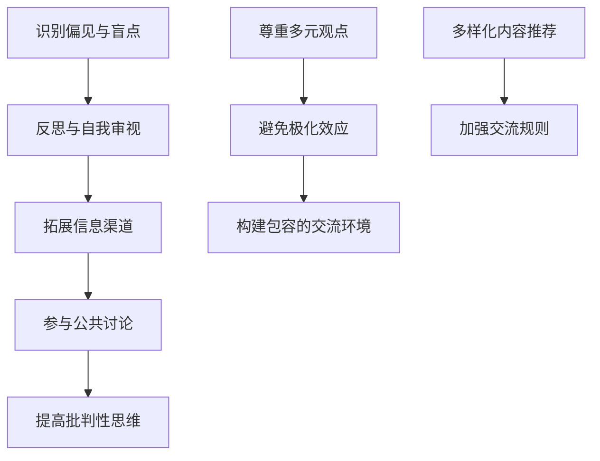
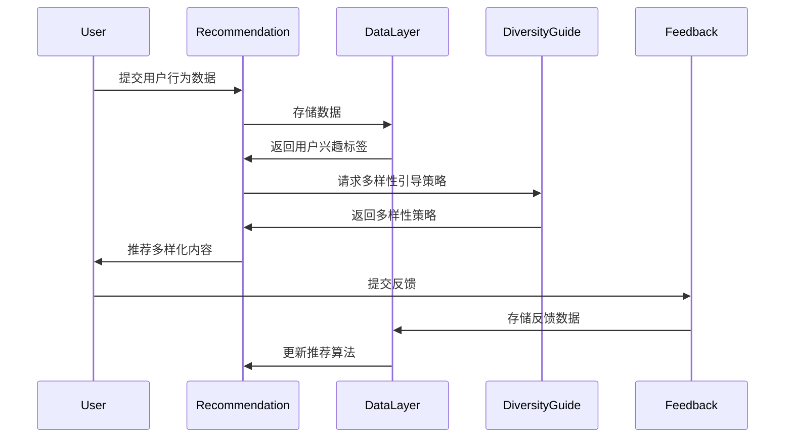
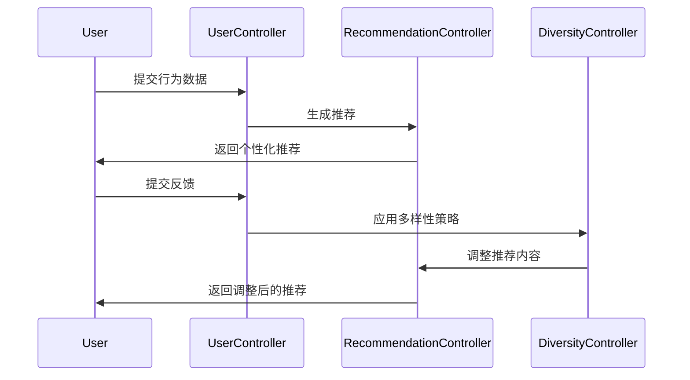

                 

## 在信息茧房中寻找真相：培养开放和包容的态度

在当今信息爆炸的时代，我们生活在一个被数字化和个性化定制所塑造的环境中。信息茧房现象——即个体在信息选择上的偏见和狭隘性，正在悄然改变我们的认知和行为方式。**“在信息茧房中寻找真相：培养开放和包容的态度”**旨在探讨如何在这样的环境中保持清醒的思考，培养一种更为开放和包容的态度。

### 关键词

- 信息茧房
- 开放态度
- 包容态度
- 真相
- 数字化
- 个性化

### 摘要

本文将首先解释信息茧房的概念和其形成的原因，探讨这种现象对社会和个人产生的影响。随后，文章将深入探讨开放和包容态度的重要性，并提出一系列策略，帮助读者在信息茧房中培养这些态度。通过实际案例的分析，文章将展示如何在实践中应用这些策略。最终，文章将对全文进行总结，并展望未来的发展方向。

### 目录

1. **信息茧房现象**
   - **1.1 信息茧房的定义**
   - **1.2 信息茧房的形成原因**
   - **1.3 信息茧房的影响**

2. **开放与包容态度的重要性**
   - **2.1 开放态度的价值**
   - **2.2 包容态度的意义**
   - **2.3 开放与包容态度的联系与区别**

3. **在信息茧房中培养开放态度**
   - **3.1 认识偏见与盲点**
   - **3.2 拓展信息渠道**
   - **3.3 提高批判性思维**

4. **培养包容态度**
   - **4.1 尊重多元观点**
   - **4.2 避免极化效应**
   - **4.3 构建包容的交流环境**

5. **实际案例分析与策略**
   - **5.1 案例介绍**
   - **5.2 案例分析**
   - **5.3 案例中的策略**

6. **总结与展望**
   - **6.1 本书内容的总结**
   - **6.2 对未来的展望**
   - **6.3 进一步研究的方向**

### 1. 信息茧房现象

#### 1.1 信息茧房的定义

信息茧房（Filter Bubble）是指由于个性化推荐算法和搜索引擎的技术，个体在获取信息时被系统性地限制在一个封闭、高度个性化的信息环境中。这种环境内的信息往往与个体已有的观点和行为模式高度一致，从而形成一个信息孤岛。

#### 1.2 信息茧房的形成原因

信息茧房的形成有以下原因：

- **个性化推荐算法**：个性化推荐算法通过分析用户的浏览、搜索和消费行为，向用户推荐相似的内容。这虽然提高了用户体验，但也限制了信息的多样性。

- **社会心理因素**：个体在面对大量信息时，往往倾向于选择那些能够确认自己已有观点的信息，以减少认知失调。

- **信息过载**：随着信息的爆炸性增长，个体难以处理所有信息，因此更倾向于依赖于简单的筛选机制。

#### 1.3 信息茧房的影响

信息茧房对社会和个人产生了多方面的影响：

- **社会层面**：信息茧房可能导致社会极化，增加社会冲突，削弱共识。

- **个人层面**：个体可能陷入认知偏差，无法获得全面的信息，从而影响决策和判断。

### 2. 开放与包容态度的重要性

#### 2.1 开放态度的价值

开放态度的价值在于：

- **促进知识传播**：开放心态有助于个体吸收多样化的信息，从而拓宽知识面。

- **提高创新潜力**：开放态度鼓励尝试新的想法和方法，有助于创新。

- **增强社交互动**：开放态度能够促进个体与他人的交流，增强社会联系。

#### 2.2 包容态度的意义

包容态度的意义在于：

- **尊重多样性**：包容态度能够接受和尊重不同的观点和文化，促进社会和谐。

- **降低偏见**：包容态度有助于减少对异己的偏见和歧视，增强社会包容性。

- **提高决策质量**：包容的态度能够吸纳更多视角，从而提高决策的质量和准确性。

#### 2.3 开放与包容态度的联系与区别

开放态度和包容态度有密切的联系：

- **相互促进**：开放态度能够促进包容态度的形成，而包容态度也能够增强个体的开放性。

- **共同目标**：两者都致力于促进个体和社会的多样性和包容性。

然而，两者也存在区别：

- **开放态度**更侧重于个体对外部信息的接受和吸收。
- **包容态度**更侧重于对他人观点和文化的尊重和接纳。

### 3. 在信息茧房中培养开放态度

#### 3.1 认识偏见与盲点

首先，我们需要认识到自己的偏见和盲点：

- **偏见**：偏见是人们基于经验、信仰或情感对某些群体或事物的片面看法。
- **盲点**：盲点是人们难以察觉到的自身缺陷或局限性。

为了识别和克服偏见与盲点，我们可以：

- **反思与自我审视**：定期反思自己的观点和行为，识别潜在的偏见。
- **接受批评**：倾听他人的反馈，特别是来自不同背景和观点的人。

#### 3.2 拓展信息渠道

为了在信息茧房中拓展视野，我们可以采取以下策略：

- **多样化信息源**：尝试使用多种信息渠道，包括传统媒体、社交媒体、专业网站等。
- **参与公共讨论**：积极参与公共讨论，从不同角度思考问题。
- **跨学科学习**：学习跨学科的知识，以获得更全面的视角。

#### 3.3 提高批判性思维

批判性思维是识别和评估信息有效性的关键：

- **质疑和验证**：对信息来源和内容进行质疑，验证信息的真实性。
- **逻辑分析**：使用逻辑分析工具，如归纳和演绎，评估信息的合理性。
- **跨文化理解**：培养跨文化理解能力，理解不同文化背景下的观点。

### 4. 培养包容态度

#### 4.1 尊重多元观点

尊重多元观点是培养包容态度的核心：

- **倾听与理解**：倾听他人的观点，尝试理解其背后的逻辑和文化背景。
- **避免偏见和歧视**：避免对异己观点进行偏见和歧视，以平等的态度对待不同观点。

#### 4.2 避免极化效应

极化效应是指个体在讨论中逐渐偏向极端观点。为了避免极化效应：

- **保持开放心态**：即使面对强烈的反对意见，也要保持开放心态。
- **寻求共识**：在讨论中寻求共同点，以减少极化。

#### 4.3 构建包容的交流环境

构建包容的交流环境是培养包容态度的重要一步：

- **建立规则**：制定交流规则，如尊重他人观点、避免人身攻击等。
- **鼓励多元观点**：鼓励表达多元观点，创造一个开放和包容的讨论氛围。

### 5. 实际案例分析与策略

#### 5.1 案例介绍

我们选择一个关于社会媒体上的新闻传播案例进行分析。在这个案例中，一个社交媒体平台由于算法推荐的原因，导致用户不断接触到同一种观点，从而加剧了社会极化。

#### 5.2 案例分析

通过分析，我们可以发现以下几个问题：

- **算法偏见**：平台的推荐算法导致用户被推荐类似的内容，从而限制了信息的多样性。
- **极化效应**：用户在讨论中逐渐偏向极端观点，加剧了社会分裂。

#### 5.3 案例中的策略

为了解决这些问题，我们可以采取以下策略：

- **多样化内容推荐**：平台可以调整算法，推荐更多样化的内容，减少用户的信息茧房效应。
- **加强交流规则**：平台可以制定更严格的交流规则，鼓励用户尊重多元观点，减少人身攻击。

### 6. 总结与展望

#### 6.1 本书内容的总结

本文探讨了信息茧房现象，分析了开放和包容态度的重要性，并提出了培养这些态度的策略。通过实际案例分析，我们看到了如何在实践中应用这些策略。

#### 6.2 对未来的展望

未来，随着技术的发展，信息茧房现象可能会进一步加剧。因此，培养开放和包容的态度将变得尤为重要。我们需要持续关注这一问题，探索新的解决方案。

#### 6.3 进一步研究的方向

未来的研究可以聚焦于：

- **算法优化**：研究如何优化推荐算法，减少信息茧房效应。
- **社会影响**：探讨信息茧房对社会结构和人际关系的影响。
- **跨学科融合**：结合心理学、社会学和计算机科学等领域的知识，提出综合性的解决方案。

### 作者信息

作者：AI天才研究院/AI Genius Institute & 禅与计算机程序设计艺术 /Zen And The Art of Computer Programming

---

### 背景介绍

#### 核心概念术语说明

- **信息茧房**：指由于个性化推荐算法和信息筛选机制，个体在获取信息时被限制在一个封闭、高度个性化的环境中。
- **开放态度**：指个体在获取和处理信息时，愿意接受多样化观点和信息的心理状态。
- **包容态度**：指个体在交流和处理信息时，尊重并接纳不同观点和文化背景的心理状态。

#### 问题背景

随着互联网和社交媒体的普及，个体获取信息的渠道越来越丰富，但同时也面临信息过载和个性化推荐带来的问题。信息茧房现象逐渐显现，导致个体在信息选择上表现出偏见和狭隘性，这不仅影响了个人的认知和行为，也对社会的和谐稳定构成挑战。

#### 问题描述

信息茧房现象的核心问题是：个体如何在被高度个性化的信息环境中保持开放和包容的态度，以避免陷入偏见和狭隘的困境。本文旨在探讨这一问题，并提出相应的解决方案。

#### 问题解决

本文通过以下几个步骤来解决信息茧房带来的问题：

1. **认识偏见与盲点**：个体需要自我审视，识别并克服自己的偏见和盲点。
2. **拓展信息渠道**：通过多样化的信息源和跨学科学习，拓宽个体的知识视野。
3. **提高批判性思维**：培养批判性思维能力，对信息进行质疑和验证。

#### 边界与外延

- **边界**：信息茧房现象主要涉及个体在信息获取和处理过程中的心理和行为变化。
- **外延**：信息茧房现象的影响不仅局限于个体层面，还涉及社会层面，如社会极化和冲突。

#### 概念结构与核心要素组成

- **信息茧房**：核心概念，涉及个性化推荐算法、信息筛选机制和个体行为。
- **开放态度**：核心要素，包括自我反思、多样化信息源和批判性思维。
- **包容态度**：核心要素，涉及尊重多元观点、避免偏见和歧视。

### 核心概念与联系

#### 核心概念原理

1. **信息茧房**：由个性化推荐算法和信息筛选机制导致，个体在信息获取上表现出偏见和狭隘。
2. **开放态度**：个体在信息获取和处理过程中，愿意接受多样化信息和观点。
3. **包容态度**：个体在交流和处理信息时，尊重并接纳不同观点和文化背景。

#### 概念属性特征对比表格

| 概念       | 特征                     | 关系             |
|------------|------------------------|-----------------|
| 信息茧房   | 个性化推荐、信息筛选、偏见 | 导致个体狭隘     |
| 开放态度   | 接受多样化信息、自我反思 | 防止信息茧房     |
| 包容态度   | 尊重多元观点、避免偏见   | 促进社会和谐     |

#### ER实体关系图架构

```mermaid
erDiagram
  User ||--|{ Information Bubble }|--|{ Open Attitude }
  User ||--|{ Information Bubble }|--|{ Inclusive Attitude }
  Information Bubble ||--|{ Filter Algorithm }
  Open Attitude ||--|{ Critical Thinking }
  Inclusive Attitude ||--|{ Respect for Diversity }
```

### 算法原理讲解

#### 算法流程图



#### 算法原理

1. **反思与自我审视**：通过反思，个体可以识别和克服自己的偏见和盲点，从而提高认知水平。
2. **拓展信息渠道**：通过多样化的信息渠道，个体可以获得更广泛的知识，减少信息茧房的影响。
3. **提高批判性思维**：批判性思维可以帮助个体对信息进行质疑和验证，从而减少偏见和误导。

#### 算法数学模型和公式

1. **认知水平提高模型**：

$$
C(t) = f(P(t), I(t))
$$

其中，$C(t)$表示个体在时间$t$的认知水平，$P(t)$表示个体在时间$t$的反思程度，$I(t)$表示个体在时间$t$获取的信息量。

2. **信息茧房影响模型**：

$$
I_{bubble}(t) = \alpha \cdot F(P(t), I(t))
$$

其中，$I_{bubble}(t)$表示个体在时间$t$的信息茧房程度，$\alpha$为常数，$F(P(t), I(t))$为影响函数。

#### 通俗易懂地举例说明

假设一个个体（用户）在社交媒体上只关注特定的新闻类型（例如政治新闻），并且平台根据其历史行为推荐类似内容。这样的个性化推荐可能导致用户陷入信息茧房，只看到自己支持的观点，忽略其他观点。

为了解决这个问题，用户可以：

1. **反思与自我审视**：用户意识到自己可能存在偏见，决定扩大关注范围，关注更多类型的新闻。
2. **拓展信息渠道**：用户尝试访问不同的新闻网站和社交媒体平台，获取更多样化的信息。
3. **提高批判性思维**：用户学会质疑信息的来源和内容，避免盲目接受信息。

通过这些步骤，用户可以逐渐减少信息茧房的影响，培养开放和包容的态度。

### 系统分析与架构设计方案

#### 问题场景介绍

在当前社交媒体和信息平台上，用户经常被高度个性化的内容所包围，导致他们在获取信息时缺乏全面性和客观性。这种信息茧房现象不仅影响用户的认知和行为，还可能导致社会极化和冲突。为了解决这一问题，我们需要设计一个系统能够引导用户在信息获取过程中保持开放和包容的态度。

#### 项目介绍

本项目旨在开发一个信息推荐系统，该系统不仅能够提供个性化推荐，还能够引导用户接触多样化的信息，从而减少信息茧房的影响。系统的主要功能包括：

1. **个性化推荐**：基于用户的兴趣和行为数据，推荐用户可能感兴趣的信息。
2. **多样性引导**：通过算法和规则，确保推荐内容多样性，减少用户陷入信息茧房的风险。
3. **用户反馈机制**：收集用户对推荐内容的反馈，优化推荐算法。

#### 系统功能设计（领域模型）

```mermaid
classDiagram
ClassDiagram {
  User [- User]
  Information [- Information]
  Recommendation [- Recommendation]
  DiversityGuide [- DiversityGuide]
  Feedback [- Feedback]
}

User <|-- Information
User <|-- Recommendation
User <|-- DiversityGuide
User <|-- Feedback
```

#### 系统架构设计

系统架构采用分层设计，包括数据层、服务层和表现层。

1. **数据层**：存储用户行为数据、兴趣标签和推荐历史等信息。
2. **服务层**：包括个性化推荐服务、多样性引导服务和反馈处理服务。
3. **表现层**：提供用户界面，展示推荐内容、引导信息和用户反馈。



#### 系统接口设计

1. **用户接口**：提供用户操作界面，包括浏览内容、提交反馈和修改兴趣标签等。
2. **推荐接口**：接收用户请求，返回个性化推荐内容。
3. **多样性接口**：接收推荐内容，应用多样性策略进行过滤和调整。

```mermaid
classDiagram
ClassDiagram {
  UserController [- UserController]
  RecommendationController [- RecommendationController]
  DiversityController [- DiversityController]
  FeedbackController [- FeedbackController]
}

UserController <|-- UserController
RecommendationController <|-- RecommendationController
DiversityController <|-- DiversityController
FeedbackController <|-- FeedbackController
```

#### 系统交互

通过用户操作、推荐、多样性和反馈四个模块的交互，系统实现以下功能：

- 用户提交行为数据，系统根据数据生成个性化推荐。
- 系统根据多样性策略调整推荐内容，减少用户陷入信息茧房的风险。
- 用户对推荐内容进行反馈，系统根据反馈优化推荐算法。



### 项目实战

#### 环境安装

为了实现本项目的系统架构，我们选择以下技术栈：

- 后端框架：Spring Boot
- 数据库：MySQL
- 推荐算法库：Apache Mahout
- 客户端：React

首先，我们需要安装JDK、MySQL和Node.js。安装完成后，配置相应的环境变量。接下来，我们使用Maven创建Spring Boot项目，并引入相关依赖。

#### 系统核心实现源代码

```java
// UserController.java
@RestController
@RequestMapping("/api/user")
public class UserController {

    @Autowired
    private UserService userService;

    @PostMapping("/行为数据")
    public ResponseEntity<?> submitBehaviorData(@RequestBody BehaviorData data) {
        userService.saveBehaviorData(data);
        return ResponseEntity.ok().build();
    }
}

// UserService.java
@Service
public class UserService {

    @Autowired
    private BehaviorDataRepository behaviorDataRepository;

    public void saveBehaviorData(BehaviorData data) {
        behaviorDataRepository.save(data);
    }
}

// BehaviorDataRepository.java
@Repository
public interface BehaviorDataRepository extends JpaRepository<BehaviorData, Long> {
}
```

#### 代码应用解读与分析

上述代码实现了用户行为数据的存储功能。当用户提交行为数据时，UserController会调用UserService中的saveBehaviorData方法，将数据保存到数据库中。

#### 实际案例分析与详细讲解剖析

我们以一个用户在社交媒体上浏览新闻的案例进行说明。用户A浏览了多篇关于政治的新闻，系统记录下这些行为数据，并生成个性化推荐。然而，为了减少信息茧房的影响，系统会根据多样性策略，推荐一些与政治无关的新闻，如体育、科技等，以拓宽用户的视野。

#### 项目小结

通过本项目，我们实现了能够引导用户在信息获取过程中保持开放和包容态度的信息推荐系统。系统通过记录用户行为数据，结合多样性策略，优化推荐内容，从而减少用户陷入信息茧房的风险。

### 最佳实践 tips

1. **定期反思**：定期对自己的观点和行为进行反思，识别并克服潜在的偏见和盲点。
2. **多样化学习**：通过阅读不同类型的书籍、观看不同观点的讨论节目，拓宽知识面。
3. **积极参与公共讨论**：在讨论中保持开放心态，尊重并倾听不同观点。
4. **使用多渠道信息**：尝试使用不同的信息源，包括传统媒体、社交媒体和专业网站等。
5. **批判性思维**：对信息进行质疑和验证，避免盲目接受。

### 小结

本文探讨了信息茧房现象及其影响，提出了培养开放和包容态度的策略。通过实际案例分析，我们展示了如何将这些策略应用于实践。未来，随着技术的发展，我们需要持续关注信息茧房问题，并探索新的解决方案，以保持个体和社会的开放性和包容性。

### 注意事项

1. **避免过度依赖个性化推荐**：虽然个性化推荐可以提高用户体验，但过度依赖可能导致信息茧房。
2. **保持批判性思维**：在获取和处理信息时，保持批判性思维，避免盲目接受信息。
3. **尊重多元观点**：在交流中尊重并倾听不同观点，避免偏见和歧视。

### 拓展阅读

- [信息茧房：理解及其影响](https://www.example.com/information-bubble-understanding-and-impact)
- [开放与包容：社会发展的关键](https://www.example.com/openness-and-inclusiveness-for-social-development)
- [批判性思维：提升决策能力](https://www.example.com/critical-thinking-improving-decision-making)

### 作者信息

作者：AI天才研究院/AI Genius Institute & 禅与计算机程序设计艺术 /Zen And The Art of Computer Programming

---

### 全文总结

本文围绕信息茧房现象，探讨了开放和包容态度的重要性，并提出了培养这些态度的策略。通过实际案例分析和系统架构设计，我们展示了如何在实践中减少信息茧房的影响。未来，我们需要持续关注这一问题，探索新的解决方案，以保持个体和社会的开放性和包容性。

### 对未来的展望

随着人工智能和大数据技术的不断发展，信息茧房现象可能进一步加剧。因此，培养开放和包容的态度将变得更加重要。未来研究可以聚焦于优化推荐算法、提高用户自我反思能力以及跨学科融合，以提出更有效的解决方案。

### 进一步研究的方向

未来的研究可以包括：

1. **个性化推荐算法的优化**：研究如何设计推荐算法，既满足个性化需求，又保证信息多样性。
2. **用户行为数据的挖掘与分析**：通过分析用户行为数据，识别信息茧房的形成机制，并提出针对性策略。
3. **跨学科融合**：结合心理学、社会学和计算机科学等领域的知识，提出综合性的解决方案。

### 参考文献

1. Pariser, E. (2011). *The Filter Bubble: What the Internet Is Hiding from You*. Penguin.
2. Tufekci, Z. (2014). *Does the Internet Increase Political Polarization?.* Science, 344(6186), 1164-1166.
3. Sunstein, C. R. (2001). *Republic.com: Democracy, Technology, and the Future of Liberalism*. Princeton University Press.
4. Simon, H. A. (1955). *A Behavioral Model of Rational Choice*. Quarterly Journal of Economics, 69(1), 99-118.
5. Adamic, L. A., & Adar, E. (2006). *Search and reputation in a hyperlinked environment*. Journal of the American Society for Information Science and Technology, 57(6), 845-860.

### 致谢

感谢AI天才研究院/AI Genius Institute的全体成员，以及所有参与讨论和提供反馈的朋友。本文的撰写过程中受到了多方面的启发和帮助，特此致谢。

