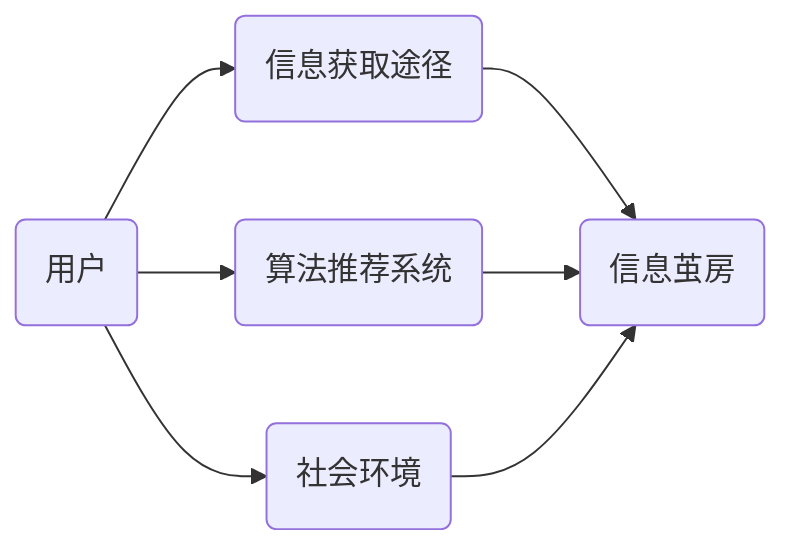
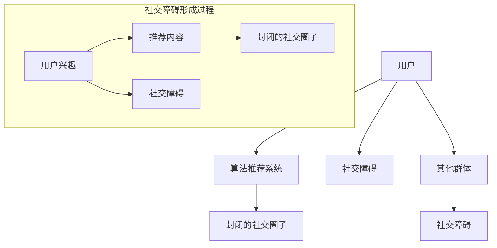
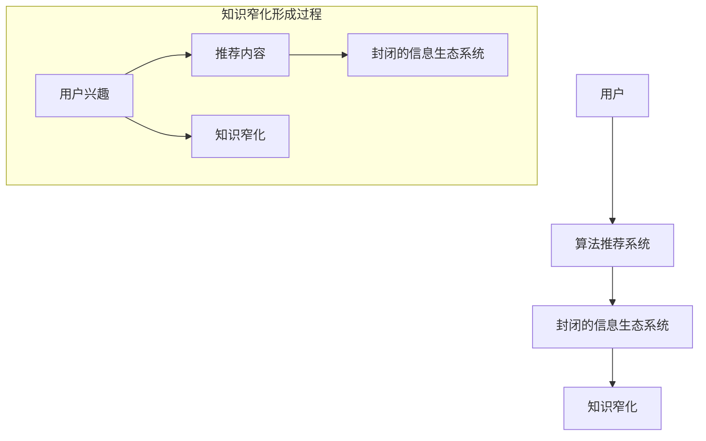
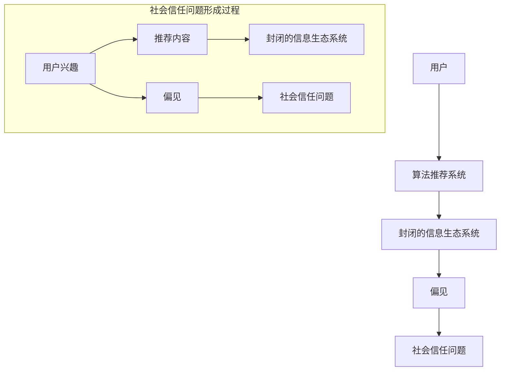
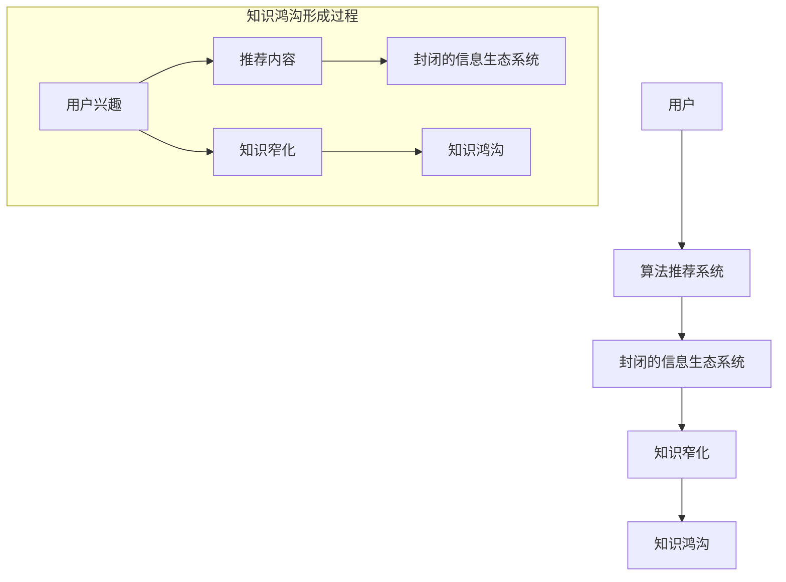
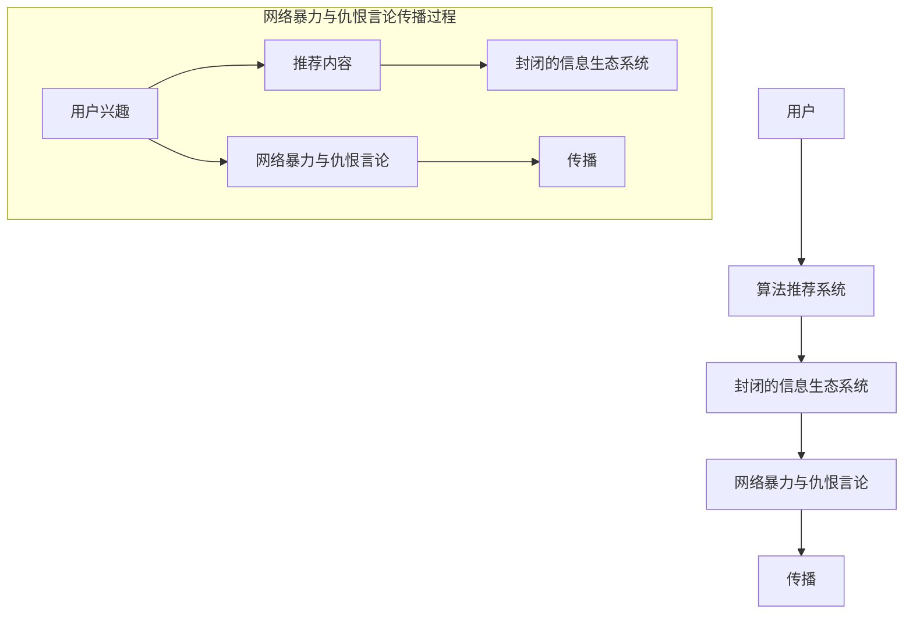
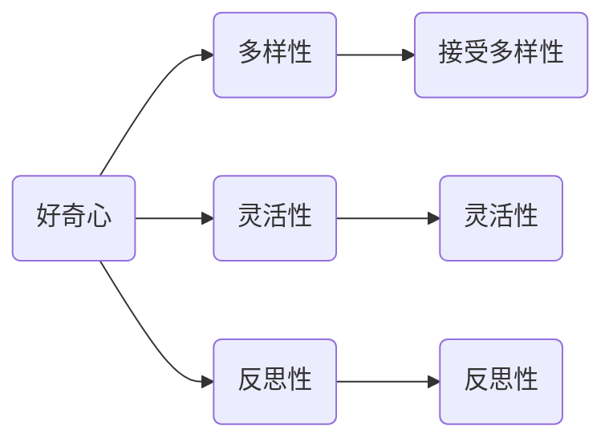
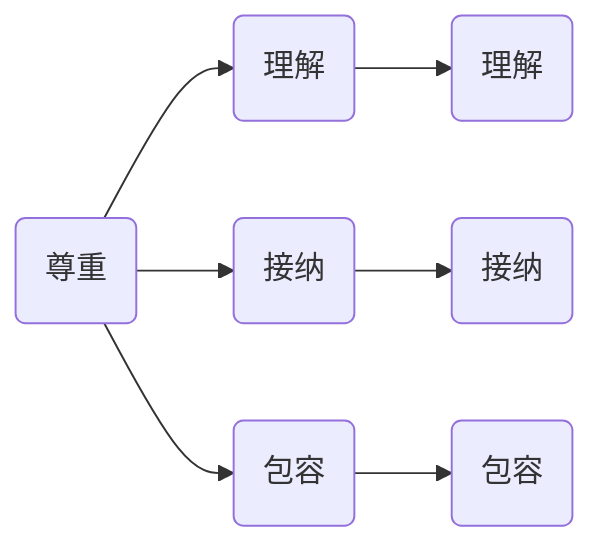
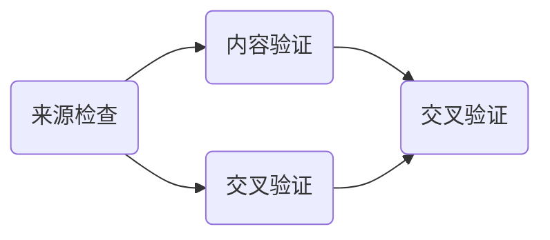
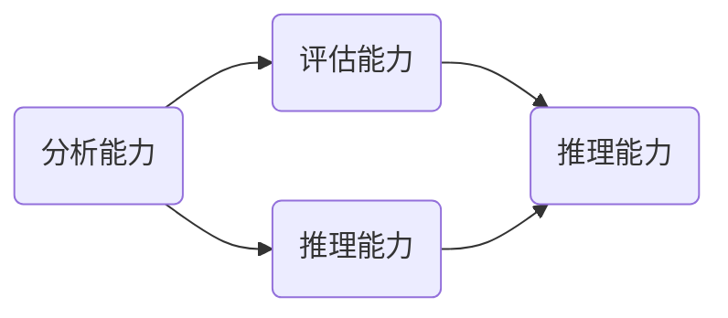

                 


## 第1章: 了解信息茧房

### 1.1.1 信息茧房的概念

信息茧房是一种现象，当人们长期在特定环境或群体中获取信息时，会逐渐形成一个封闭的信息生态系统，这个系统限制了人们接触新观念和新信息的范围，导致信息的多样性和全面性减少。这种现象类似于蚕茧包裹蚕宝宝，因此被称为“信息茧房”。

**背景介绍：**

在互联网时代，随着信息技术的快速发展，人们可以轻松地获取到海量的信息。然而，由于个体时间和精力的限制，人们往往只能关注到一小部分信息，而这部分信息往往受到个人偏好、社会环境、算法推荐等多种因素的影响，逐渐形成了一个封闭的信息生态系统。这个系统使得人们在接触新观念和新信息时受到限制，难以跳出自己的认知舒适区，从而导致信息茧房的形成。

**问题背景：**

信息茧房现象的出现，引发了诸多社会问题，如群体极化、偏见和误解的传播、知识窄化等。这些问题不仅影响了个体的发展，也对社会的整体进步产生了负面影响。因此，了解信息茧房的概念及其形成原因，对于解决这些问题具有重要意义。

**问题描述：**

信息茧房的形成是一个复杂的过程，涉及到多个因素。首先，个体的信息获取途径有限，往往依赖于社交媒体、新闻媒体等平台，而这些平台往往会根据用户的兴趣和行为推荐类似的内容，从而形成信息茧房。其次，社会环境的影响也不可忽视，如家庭、学校、社区等环境中的信息传播方式，也会限制人们的认知范围。此外，算法推荐系统在提供个性化服务的同时，也可能加剧信息茧房的形成。

**问题解决：**

要解决信息茧房问题，需要从多个方面进行努力。首先，个体需要培养开放心态，主动拓宽信息获取渠道，多关注不同领域的信息，避免只停留在自己熟悉的领域。其次，社会需要加强信息素养教育，提高人们对信息真实性和准确性的判断能力。此外，互联网平台也需要加强算法推荐系统的优化，减少信息茧房的形成。

**边界与外延：**

信息茧房是一个广泛的概念，其边界和外延涉及多个方面。从个人层面来看，信息茧房可以理解为一个人在信息获取和处理上的封闭状态；从社会层面来看，信息茧房可以理解为整个社会在信息传播和认知上的局限性。此外，信息茧房还涉及到心理学、社会学、计算机科学等多个领域的交叉研究。

**概念结构与核心要素组成：**

信息茧房的概念结构包括以下几个方面：

1. **信息获取途径**：个体在信息获取过程中所依赖的渠道和方式，如社交媒体、新闻媒体等。
2. **算法推荐系统**：互联网平台为用户提供个性化推荐服务的系统，可能加剧信息茧房的形成。
3. **社会环境**：影响个体信息获取和处理的社会因素，如家庭、学校、社区等。
4. **个体认知**：个体在信息处理过程中的主观判断和选择，决定了信息茧房的形成程度。
5. **信息多样性**：信息茧房的一个显著特征是信息的多样性减少，这影响了人们对世界的认知和理解。

### 1.1.2 信息茧房的形成

信息茧房的形成有以下原因：

1. **算法推荐**：互联网平台利用算法推荐技术，根据用户的历史行为和偏好，为用户推荐相似的内容，从而使用户在不知不觉中进入一个封闭的信息生态系统。

2. **个体信息获取途径有限**：由于时间和精力的限制，个体往往只能关注到一小部分信息，这些信息往往受到个人偏好和社会环境的影响。

3. **社会环境的影响**：家庭、学校、社区等环境中的信息传播方式，也会限制人们的认知范围。

4. **算法推荐系统**：在提供个性化服务的同时，可能加剧信息茧房的形成。

**核心概念与联系：**

信息茧房的形成涉及多个核心概念，如算法推荐、个体信息获取途径、社会环境等。这些概念之间相互关联，共同构成了信息茧房的形成机制。

| 核心概念 | 定义 | 关联关系 |
| :--- | :--- | :--- |
| 算法推荐 | 互联网平台根据用户行为和偏好推荐内容 | 推荐算法可能加剧信息茧房的形成 |
| 个体信息获取途径 | 个体在信息获取过程中所依赖的渠道和方式 | 个体信息获取途径限制导致信息茧房形成 |
| 社会环境 | 影响个体信息获取和处理的社会因素 | 社会环境限制个体认知范围，加剧信息茧房形成 |

**ER实体关系图架构：**



### 1.1.3 信息茧房的影响

信息茧房的影响主要体现在以下几个方面：

1. **心理健康问题**：信息茧房导致个体接触到的信息有限，容易形成偏见和误解，进而影响心理健康。

2. **社交障碍**：信息茧房使得个体难以与不同群体建立有效的社交联系，导致社交障碍。

3. **知识窄化**：信息茧房限制了个体获取新知识的范围，使得知识结构变得狭窄，难以形成全面的世界观。

4. **社会信任问题**：信息茧房加剧了群体极化现象，导致社会信任度下降。

5. **网络暴力与仇恨言论**：信息茧房为极端言论提供了温床，容易滋生网络暴力和仇恨言论。

**算法原理讲解：**

信息茧房的形成与算法推荐系统密切相关。算法推荐系统基于用户的兴趣和行为数据，通过机器学习等技术，为用户推荐相似的内容。这种推荐机制在提高用户满意度的同时，也可能导致用户逐渐陷入信息茧房。

以下是一个简化的算法推荐流程：

```python
# 假设用户行为数据为一个字典，键为行为类型，值为行为次数
user_actions = {
    'read': 10,
    'comment': 5,
    'like': 20,
    'share': 3
}

# 计算用户兴趣权重
interest_weights = {
    'read': 1,
    'comment': 2,
    'like': 3,
    'share': 4
}

user_interest = {}
for action, count in user_actions.items():
    user_interest[action] = count * interest_weights[action]

# 根据用户兴趣推荐内容
def recommend_content(user_interest, content_library):
    recommended = []
    for content in content_library:
        content_score = 0
        for action, weight in user_interest.items():
            if action in content:
                content_score += weight
        if content_score > 0:
            recommended.append(content)
    return recommended

# 示例内容库
content_library = [
    {'title': '科技新闻', 'topics': ['AI', '5G', '区块链']},
    {'title': '健康养生', 'topics': ['健身', '饮食', '健康']},
    {'title': '经济金融', 'topics': ['股市', '投资', '理财']}
]

# 推荐内容
recommended_content = recommend_content(user_interest, content_library)
print(recommended_content)
```

上述代码使用简单的权重计算方法，根据用户的兴趣权重推荐内容。在实际应用中，算法推荐系统会采用更加复杂的模型，如协同过滤、深度学习等，以提高推荐效果。

### 1.1.4 信息茧房的边界与外延

信息茧房是一个广泛的概念，其边界与外延涉及多个方面：

1. **个人层面**：从个体的角度来看，信息茧房可以理解为一个人在信息获取和处理上的封闭状态。这种封闭状态可能是由于个人的偏好、认知水平、社交圈子等因素造成的。

2. **社会层面**：从社会的角度来看，信息茧房可以理解为整个社会在信息传播和认知上的局限性。这种现象可能由于社会环境的封闭、信息传播渠道的单一等因素导致。

3. **技术层面**：信息茧房的形成也与互联网技术、算法推荐系统等密切相关。这些技术在为用户提供便利的同时，也可能加剧信息茧房的形成。

4. **政治层面**：在政治领域，信息茧房可能被用来控制信息传播、操纵公众舆论，以达到特定的政治目的。

**总结：**

信息茧房是一个复杂的社会现象，其形成原因涉及多个方面。了解信息茧房的概念、形成原因和影响，有助于我们更好地认识这一现象，并采取有效的措施解决相关问题。在接下来的章节中，我们将进一步探讨如何培养开放心态和包容精神，以应对信息茧房的挑战。

## 第2章: 信息茧房的影响与挑战

### 2.1 个人层面的影响

信息茧房对个人层面的影响主要体现在心理健康问题、社交障碍和知识窄化等方面。

#### 2.1.1 心理健康问题

信息茧房限制了个体接触新观念和新信息的机会，导致个体的认知范围变得狭窄。这种认知局限容易引发焦虑、抑郁等心理健康问题。一方面，个体由于缺乏多样化的信息刺激，可能感到孤独和无助；另一方面，由于在信息获取和处理上存在偏见和误解，个体可能会产生不必要的恐惧和焦虑。

**算法原理讲解：**

信息茧房的形成与算法推荐系统密切相关。算法推荐系统基于用户的兴趣和行为数据，为用户推荐相似的内容。虽然这种推荐机制在提高用户满意度的同时，也可能导致用户逐渐陷入信息茧房。

以下是一个简化的算法推荐流程：

```python
# 假设用户行为数据为一个字典，键为行为类型，值为行为次数
user_actions = {
    'read': 10,
    'comment': 5,
    'like': 20,
    'share': 3
}

# 计算用户兴趣权重
interest_weights = {
    'read': 1,
    'comment': 2,
    'like': 3,
    'share': 4
}

user_interest = {}
for action, count in user_actions.items():
    user_interest[action] = count * interest_weights[action]

# 根据用户兴趣推荐内容
def recommend_content(user_interest, content_library):
    recommended = []
    for content in content_library:
        content_score = 0
        for action, weight in user_interest.items():
            if action in content:
                content_score += weight
        if content_score > 0:
            recommended.append(content)
    return recommended

# 示例内容库
content_library = [
    {'title': '科技新闻', 'topics': ['AI', '5G', '区块链']},
    {'title': '健康养生', 'topics': ['健身', '饮食', '健康']},
    {'title': '经济金融', 'topics': ['股市', '投资', '理财']}
]

# 推荐内容
recommended_content = recommend_content(user_interest, content_library)
print(recommended_content)
```

上述代码使用简单的权重计算方法，根据用户的兴趣权重推荐内容。在实际应用中，算法推荐系统会采用更加复杂的模型，如协同过滤、深度学习等，以提高推荐效果。

#### 2.1.2 社交障碍

信息茧房导致个体难以与不同群体建立有效的社交联系，从而加剧了社交障碍。在封闭的信息环境中，个体往往只与具有相似观点和兴趣的人互动，而忽视了与其他群体的交流。这种社交隔离不仅限制了个体的人际关系网络，也可能导致个体对社会整体的认识和理解产生偏差。

**算法原理讲解：**

算法推荐系统在提供个性化服务的同时，也可能加剧社交障碍。例如，当个体在社交媒体上频繁浏览某一类内容时，算法推荐系统会根据用户兴趣不断推送类似内容，从而形成一个封闭的社交圈子。这种机制虽然提高了用户的满意度，但也在无形中限制了社交多样性和交流机会。

以下是一个简化的社交障碍形成模型：



#### 2.1.3 知识窄化

信息茧房限制了个体获取新知识的范围，导致知识结构变得狭窄。这种知识窄化不仅影响了个体的发展，也可能导致社会整体的认知水平下降。在一个封闭的信息环境中，个体很难接触到多元化的观点和知识，从而难以形成全面的世界观。

**算法原理讲解：**

算法推荐系统在提高用户满意度的同时，也可能导致知识窄化。例如，当个体在互联网上频繁浏览某一类内容时，算法推荐系统会根据用户兴趣不断推送类似内容，从而形成一个封闭的信息生态系统。这种机制虽然提高了用户的满意度，但也在无形中限制了知识的多样性和全面性。

以下是一个简化的知识窄化形成模型：



**总结：**

信息茧房对个人层面的影响是多方面的，包括心理健康问题、社交障碍和知识窄化等。了解这些影响有助于我们更好地认识到信息茧房的危害，并采取有效的措施应对。在接下来的章节中，我们将探讨如何培养开放心态和包容精神，以减轻信息茧房的影响。

### 2.2 社会层面的影响

信息茧房不仅对个人层面产生深远影响，也在社会层面上引发了诸多问题，如社会信任问题、知识鸿沟和网络暴力与仇恨言论的传播。

#### 2.2.1 社会信任问题

信息茧房导致个体接触到的信息有限，容易形成偏见和误解，进而影响社会信任度。在一个封闭的信息环境中，个体可能只接触到与自己观点相似的言论，从而产生一种“多数人的偏见”，认为自己的观点是正确的，而忽视了其他可能的观点。这种偏见容易导致社会分裂，降低社会信任度。

**算法原理讲解：**

算法推荐系统在提供个性化服务的同时，也可能加剧社会信任问题。例如，当个体在社交媒体上频繁浏览某一类内容时，算法推荐系统会根据用户兴趣不断推送类似内容，从而形成一个封闭的信息生态系统。这种机制虽然提高了用户的满意度，但也在无形中限制了信息的多样性和全面性，导致个体对信息的真实性和准确性产生质疑。

以下是一个简化的社会信任问题形成模型：



#### 2.2.2 知识鸿沟

信息茧房加剧了知识鸿沟，导致不同群体之间的信息获取和处理能力差距扩大。在一个封闭的信息环境中，个体可能只接触到与自己观点相似的言论和知识，而忽视了其他可能的观点和知识。这种知识鸿沟不仅影响了个体的发展，也可能导致社会整体的认知水平下降。

**算法原理讲解：**

算法推荐系统在提供个性化服务的同时，也可能加剧知识鸿沟。例如，当个体在互联网上频繁浏览某一类内容时，算法推荐系统会根据用户兴趣不断推送类似内容，从而形成一个封闭的信息生态系统。这种机制虽然提高了用户的满意度，但也在无形中限制了知识的多样性和全面性，导致个体对其他知识的获取和处理能力下降。

以下是一个简化的知识鸿沟形成模型：



#### 2.2.3 网络暴力与仇恨言论的传播

信息茧房为网络暴力与仇恨言论的传播提供了温床。在一个封闭的信息环境中，个体可能更容易接受和传播与自己观点相似的极端言论。这种言论的传播不仅危害了个体的心理健康，也可能对社会稳定造成威胁。

**算法原理讲解：**

算法推荐系统在提供个性化服务的同时，也可能加剧网络暴力与仇恨言论的传播。例如，当个体在社交媒体上频繁浏览网络暴力与仇恨言论时，算法推荐系统会根据用户兴趣不断推送类似内容，从而形成一个恶性循环。这种机制虽然提高了用户的满意度，但也在无形中促进了极端言论的传播。

以下是一个简化的网络暴力与仇恨言论传播模型：



**总结：**

信息茧房对社会层面的影响是复杂而深远的，包括社会信任问题、知识鸿沟和网络暴力与仇恨言论的传播等。了解这些影响有助于我们更好地认识到信息茧房的危害，并采取有效的措施应对。在接下来的章节中，我们将探讨如何培养开放心态和包容精神，以减轻信息茧房的影响。

## 第3章: 开放心态的重要性

### 3.1 开放心态的定义与特征

开放心态是指个体在面对新观念、新信息和新环境时，愿意保持接纳和包容的态度，愿意主动探索和尝试。它不仅包括对未知事物的接受，还涉及到对多样性的尊重和理解。

#### 3.1.1 开放心态的概念

开放心态是一种认知和情感状态，它体现在个体对待信息、观点和行为的灵活性上。一个具有开放心态的人，不会因为固有的观念或习惯而拒绝接受新的信息和观点。

#### 3.1.2 开放心态的核心特征

1. **好奇心**：对未知事物保持好奇，愿意主动探索和学习。
2. **接受多样性**：尊重和接纳不同的观点和文化，不因差异而排斥。
3. **灵活性**：在面对变化和不确定性时，能够灵活调整自己的思维和行为。
4. **反思性**：能够自我反思，认识到自己的局限性，并寻求改进。

**核心概念与联系：**

开放心态涉及到多个核心概念，如好奇心、多样性、灵活性和反思性。这些概念相互关联，共同构成了开放心态的内涵。

| 核心概念 | 定义 | 关联关系 |
| :--- | :--- | :--- |
| 好奇心 | 对未知事物的探索欲望 | 推动个体主动学习 |
| 多样性 | 尊重和接纳不同的观点和文化 | 促进个体的全面发展 |
| 灵活性 | 面对变化和不确定性时的调整能力 | 增强个体的适应能力 |
| 反思性 | 自我反思，认识自己的局限性 | 提升个体的认知水平 |

**ER实体关系图架构：**



### 3.1.3 开放心态的好处

开放心态对个人和社会都有诸多好处：

1. **促进个人成长**：开放心态使个体能够不断学习和进步，提升自身的认知水平和能力。
2. **增强人际关系**：开放心态有助于个体与不同背景的人建立良好的关系，拓宽社交圈子。
3. **提高决策质量**：在面对复杂问题时，开放心态使个体能够考虑更多的因素，做出更加明智的决策。
4. **促进社会进步**：开放心态有助于减少社会冲突，增强社会凝聚力，推动社会整体的进步。

**总结：**

开放心态是一种重要的心理状态，它对个人和社会都有诸多好处。了解开放心态的定义和特征，以及其带来的好处，有助于我们更好地认识到开放心态的重要性。在接下来的章节中，我们将探讨如何培养开放心态，以应对信息茧房的挑战。

### 3.2 开放心态的培养方法

#### 3.2.1 自我反思

自我反思是培养开放心态的重要方法之一。通过自我反思，个体可以认识到自己的认知偏见和局限性，从而主动调整自己的思维方式。

**背景介绍：**

在日常生活中，个体往往受到自身认知偏见和习惯思维的影响，难以接受新的观点和信息。通过自我反思，个体可以意识到这些问题，并尝试从不同角度看待问题，从而培养开放心态。

**问题背景：**

自我反思是一种自我认识和自我提升的过程。通过反思，个体可以发现自己的认知盲点，了解自己的思维模式，从而更好地理解自己的行为和情绪。

**问题描述：**

如何通过自我反思培养开放心态？个体可以通过以下方法进行自我反思：

1. **记录日常行为和思维**：个体可以记录自己在日常生活中的行为和思维模式，分析哪些行为和思维有助于开放心态的培养，哪些行为和思维需要改进。

2. **定期进行自我评估**：个体可以定期对自己的开放心态进行评估，了解自己的进步和不足，从而制定改进计划。

3. **与他人交流**：通过与他人的交流和讨论，个体可以了解到不同的观点和思维方式，从而丰富自己的认知，培养开放心态。

**问题解决：**

要培养开放心态，个体需要从以下几个方面进行自我反思：

1. **认识到自己的认知偏见**：个体需要认识到自己的认知偏见，了解这些偏见如何影响自己的思维方式。

2. **主动寻求反馈**：个体可以主动向他人寻求反馈，了解自己在开放心态方面的表现，以及如何改进。

3. **培养好奇心**：个体需要培养好奇心，对未知事物保持探索和学习的兴趣。

**边界与外延：**

自我反思是一种广泛的培养方法，其边界和外延涉及多个方面。从个人层面来看，自我反思可以理解为一个人在自我认识和自我提升上的努力；从社会层面来看，自我反思可以理解为整个社会在自我认知和进步上的努力。

**概念结构与核心要素组成：**

自我反思的概念结构包括以下几个方面：

1. **日常行为记录**：个体在日常生活中记录自己的行为和思维模式。
2. **自我评估**：个体定期对自己的开放心态进行评估。
3. **与他人交流**：个体通过与他人交流和讨论，了解不同的观点和思维方式。
4. **认知偏见**：个体认识到自己的认知偏见，了解这些偏见的影响。
5. **反馈**：个体主动寻求他人的反馈，了解自己在开放心态方面的表现。

### 3.2.2 接受不确定性

接受不确定性是培养开放心态的另一个重要方法。在信息茧房中，个体往往因为追求确定性而陷入封闭的思维模式。通过接受不确定性，个体可以打破这种思维束缚，拓宽自己的认知范围。

**背景介绍：**

在现实生活中，不确定性是不可避免的。个体需要面对各种不确定的情况，如职业发展、家庭关系、健康问题等。通过接受不确定性，个体可以减少焦虑和恐惧，更好地应对生活中的挑战。

**问题背景：**

接受不确定性是一个挑战，因为个体往往倾向于追求确定性。在信息茧房中，个体更容易陷入对已知信息的过度依赖，而忽视不确定性带来的机遇。

**问题描述：**

如何通过接受不确定性培养开放心态？个体可以通过以下方法进行：

1. **培养应对不确定性的策略**：个体可以学习如何应对不确定的情况，如制定应急计划、培养灵活性和适应性等。

2. **接受失败的可能性**：个体需要认识到失败是成功的一部分，接受失败是培养开放心态的重要一步。

3. **保持好奇心和探索精神**：个体应该保持对未知事物的好奇心和探索精神，勇于尝试新事物。

**问题解决：**

要培养开放心态，个体需要从以下几个方面接受不确定性：

1. **认识到不确定性的存在**：个体需要认识到不确定性是生活的一部分，而不是回避它。

2. **培养应对策略**：个体可以通过学习和实践，培养应对不确定性的策略。

3. **保持好奇心和探索精神**：个体应该保持对未知事物的好奇心和探索精神，勇于尝试新事物。

**边界与外延：**

接受不确定性的边界与外延涉及多个方面。从个人层面来看，接受不确定性可以理解为一个人在应对生活挑战上的态度；从社会层面来看，接受不确定性可以理解为整个社会在面对未知和变化时的态度。

**概念结构与核心要素组成：**

接受不确定性的概念结构包括以下几个方面：

1. **应对策略**：个体培养应对不确定性的策略。
2. **失败接受**：个体接受失败是成功的一部分。
3. **好奇心和探索精神**：个体保持对未知事物的好奇心和探索精神。

### 3.2.3 拓展视野

拓展视野是培养开放心态的另一个重要方法。通过拓展视野，个体可以接触到更多的信息和观点，从而拓宽自己的认知范围。

**背景介绍：**

在信息茧房中，个体往往只接触到与自己观点相似的信息。通过拓展视野，个体可以打破这种信息封闭，接触到多样化的信息和观点。

**问题背景：**

拓展视野对于培养开放心态具有重要意义。个体需要认识到，不同的观点和信息可以帮助他们更好地理解世界，从而形成更全面的世界观。

**问题描述：**

如何通过拓展视野培养开放心态？个体可以通过以下方法进行：

1. **阅读多样化内容**：个体应该阅读不同领域、不同观点的书籍和文章，从而接触到多样化的信息。

2. **参与跨文化交流**：个体可以通过参与跨文化交流活动，了解不同文化和观点。

3. **关注不同领域的信息**：个体应该关注不同领域的信息，如科学、艺术、历史等，从而拓宽自己的知识面。

**问题解决：**

要培养开放心态，个体需要从以下几个方面拓展视野：

1. **阅读多样化内容**：个体应该阅读不同领域、不同观点的书籍和文章。

2. **参与跨文化交流**：个体可以通过参与跨文化交流活动，了解不同文化和观点。

3. **关注不同领域的信息**：个体应该关注不同领域的信息，从而拓宽自己的知识面。

**边界与外延：**

拓展视野的边界与外延涉及多个方面。从个人层面来看，拓展视野可以理解为一个人在获取信息、扩展知识上的努力；从社会层面来看，拓展视野可以理解为整个社会在信息传播和知识积累上的努力。

**概念结构与核心要素组成：**

拓展视野的概念结构包括以下几个方面：

1. **阅读多样化内容**：个体阅读不同领域、不同观点的书籍和文章。
2. **参与跨文化交流**：个体参与跨文化交流活动，了解不同文化和观点。
3. **关注不同领域的信息**：个体关注不同领域的信息，拓宽自己的知识面。

### 3.2.4 增强同理心

增强同理心是培养开放心态的重要方法之一。同理心是指个体能够理解和感受他人的情感和需求，从而更好地与他人沟通和建立关系。

**背景介绍：**

在信息茧房中，个体往往只接触到与自己观点相似的信息，容易产生偏见和误解。通过增强同理心，个体可以更好地理解他人的观点和需求，从而培养开放心态。

**问题背景：**

同理心在个体的人际关系和社交互动中起着重要作用。一个具有同理心的人更容易与他人建立良好的关系，从而拓宽自己的社交圈子。

**问题描述：**

如何通过增强同理心培养开放心态？个体可以通过以下方法进行：

1. **倾听他人观点**：个体应该倾听他人的观点，而不是急于表达自己的看法。

2. **设身处地为他人着想**：个体应该尝试从他人的角度看待问题，理解他人的情感和需求。

3. **积极参与社交互动**：个体可以通过参与社交互动，如讨论会、公益活动等，增强与他人的交流和互动。

**问题解决：**

要培养开放心态，个体需要从以下几个方面增强同理心：

1. **倾听他人观点**：个体应该倾听他人的观点，尊重他人的意见。

2. **设身处地为他人着想**：个体应该尝试从他人的角度看待问题，理解他人的情感和需求。

3. **积极参与社交互动**：个体可以通过参与社交互动，增强与他人的交流和互动。

**边界与外延：**

增强同理心的边界与外延涉及多个方面。从个人层面来看，增强同理心可以理解为一个人在人际交往和社交互动中的努力；从社会层面来看，增强同理心可以理解为整个社会在促进人际关系和谐和增进社会凝聚力方面的努力。

**概念结构与核心要素组成：**

增强同理心的概念结构包括以下几个方面：

1. **倾听他人观点**：个体倾听他人的观点，尊重他人的意见。
2. **设身处地为他人着想**：个体尝试从他人的角度看待问题，理解他人的情感和需求。
3. **积极参与社交互动**：个体通过参与社交互动，增强与他人的交流和互动。

### 3.2.5 尊重多样性

尊重多样性是培养开放心态的重要方法之一。多样性包括文化、种族、性别、观点等多个方面。通过尊重多样性，个体可以更好地理解和接纳不同的观点和文化，从而拓宽自己的认知范围。

**背景介绍：**

在全球化背景下，个体面临的文化多样性日益增加。尊重多样性不仅有助于个体更好地适应多元文化环境，还可以促进社会的和谐与进步。

**问题背景：**

尊重多样性是一个复杂而深远的问题。在信息茧房中，个体往往只接触到与自己观点相似的信息，容易产生偏见和误解。通过尊重多样性，个体可以打破这种封闭思维，培养开放心态。

**问题描述：**

如何通过尊重多样性培养开放心态？个体可以通过以下方法进行：

1. **了解不同文化**：个体应该了解不同文化的背景、价值观和行为习惯。

2. **尊重他人的观点**：个体应该尊重他人的观点，即使这些观点与自己不同。

3. **参与多元文化活动**：个体可以通过参与多元文化活动，如文化节、讲座等，增强对多样性的理解和尊重。

**问题解决：**

要培养开放心态，个体需要从以下几个方面尊重多样性：

1. **了解不同文化**：个体应该了解不同文化的背景、价值观和行为习惯。

2. **尊重他人的观点**：个体应该尊重他人的观点，即使这些观点与自己不同。

3. **参与多元文化活动**：个体可以通过参与多元文化活动，增强对多样性的理解和尊重。

**边界与外延：**

尊重多样性的边界与外延涉及多个方面。从个人层面来看，尊重多样性可以理解为一个人在文化认知和社交互动中的努力；从社会层面来看，尊重多样性可以理解为整个社会在促进文化多样性和增进社会和谐方面的努力。

**概念结构与核心要素组成：**

尊重多样性的概念结构包括以下几个方面：

1. **了解不同文化**：个体了解不同文化的背景、价值观和行为习惯。
2. **尊重他人的观点**：个体尊重他人的观点，即使这些观点与自己不同。
3. **参与多元文化活动**：个体通过参与多元文化活动，增强对多样性的理解和尊重。

### 3.2.6 学习沟通技巧

学习沟通技巧是培养开放心态的重要方法之一。有效的沟通可以促进个体与他人的理解和合作，从而增强开放心态。

**背景介绍：**

在信息茧房中，个体往往因为沟通不畅而误解和偏见加深。学习沟通技巧可以帮助个体更好地表达自己的观点，理解他人的想法，从而培养开放心态。

**问题背景：**

沟通技巧包括多个方面，如倾听、表达、非语言沟通等。有效的沟通不仅有助于个人成长，还可以促进社会和谐。

**问题描述：**

如何通过学习沟通技巧培养开放心态？个体可以通过以下方法进行：

1. **提高倾听技巧**：个体应该学会倾听他人的观点，而不是急于表达自己的看法。

2. **改善表达方式**：个体应该学习如何清晰、准确地表达自己的观点。

3. **增强非语言沟通能力**：个体可以通过改善自己的肢体语言、面部表情等非语言沟通方式，增强沟通效果。

**问题解决：**

要培养开放心态，个体需要从以下几个方面学习沟通技巧：

1. **提高倾听技巧**：个体应该学会倾听他人的观点，而不是急于表达自己的看法。

2. **改善表达方式**：个体应该学习如何清晰、准确地表达自己的观点。

3. **增强非语言沟通能力**：个体可以通过改善自己的肢体语言、面部表情等非语言沟通方式，增强沟通效果。

**边界与外延：**

学习沟通技巧的边界与外延涉及多个方面。从个人层面来看，学习沟通技巧可以理解为一个人在人际交往中的努力；从社会层面来看，学习沟通技巧可以理解为整个社会在促进人际理解和合作方面的努力。

**概念结构与核心要素组成：**

学习沟通技巧的概念结构包括以下几个方面：

1. **提高倾听技巧**：个体学会倾听他人的观点。
2. **改善表达方式**：个体学习如何清晰、准确地表达自己的观点。
3. **增强非语言沟通能力**：个体改善自己的肢体语言、面部表情等非语言沟通方式。

### 3.2.7 拓展知识面

拓展知识面是培养开放心态的重要方法之一。通过拓展知识面，个体可以接触到更多的信息和观点，从而拓宽自己的认知范围。

**背景介绍：**

在信息茧房中，个体往往只接触到与自己观点相似的信息。通过拓展知识面，个体可以打破这种信息封闭，接触到多样化的信息和观点。

**问题背景：**

拓展知识面对培养开放心态具有重要意义。个体需要认识到，不同的观点和信息可以帮助他们更好地理解世界，从而形成更全面的世界观。

**问题描述：**

如何通过拓展知识面培养开放心态？个体可以通过以下方法进行：

1. **阅读多样化内容**：个体应该阅读不同领域、不同观点的书籍和文章，从而接触到多样化的信息。

2. **参加课程和讲座**：个体可以通过参加课程和讲座，学习新的知识和技能。

3. **与他人交流**：个体可以通过与他人交流和讨论，了解不同的观点和思维方式。

**问题解决：**

要培养开放心态，个体需要从以下几个方面拓展知识面：

1. **阅读多样化内容**：个体应该阅读不同领域、不同观点的书籍和文章。

2. **参加课程和讲座**：个体可以通过参加课程和讲座，学习新的知识和技能。

3. **与他人交流**：个体可以通过与他人交流和讨论，了解不同的观点和思维方式。

**边界与外延：**

拓展知识面的边界与外延涉及多个方面。从个人层面来看，拓展知识面可以理解为一个人在获取信息、扩展知识上的努力；从社会层面来看，拓展知识面可以理解为整个社会在信息传播和知识积累上的努力。

**概念结构与核心要素组成：**

拓展知识面的概念结构包括以下几个方面：

1. **阅读多样化内容**：个体阅读不同领域、不同观点的书籍和文章。
2. **参加课程和讲座**：个体参加课程和讲座，学习新的知识和技能。
3. **与他人交流**：个体通过与他人交流和讨论，了解不同的观点和思维方式。

### 3.2.8 尝试新事物

尝试新事物是培养开放心态的重要方法之一。通过尝试新事物，个体可以打破固有的思维模式，拓宽自己的认知范围。

**背景介绍：**

在信息茧房中，个体往往只接触到与自己观点相似的信息。通过尝试新事物，个体可以打破这种信息封闭，接触到多样化的信息和观点。

**问题背景：**

尝试新事物对于培养开放心态具有重要意义。个体需要认识到，新的体验和经历可以帮助他们更好地理解世界，从而形成更全面的世界观。

**问题描述：**

如何通过尝试新事物培养开放心态？个体可以通过以下方法进行：

1. **探索未知领域**：个体应该尝试接触和了解自己不熟悉的领域。

2. **参与实践活动**：个体可以通过参与各种实践活动，如旅行、运动等，拓宽自己的视野。

3. **尝试新技能**：个体应该尝试学习新的技能和知识，如编程、音乐等。

**问题解决：**

要培养开放心态，个体需要从以下几个方面尝试新事物：

1. **探索未知领域**：个体应该尝试接触和了解自己不熟悉的领域。

2. **参与实践活动**：个体可以通过参与各种实践活动，如旅行、运动等，拓宽自己的视野。

3. **尝试新技能**：个体应该尝试学习新的技能和知识，如编程、音乐等。

**边界与外延：**

尝试新事物的边界与外延涉及多个方面。从个人层面来看，尝试新事物可以理解为一个人在探索和冒险上的努力；从社会层面来看，尝试新事物可以理解为整个社会在创新和进步方面的努力。

**概念结构与核心要素组成：**

尝试新事物的概念结构包括以下几个方面：

1. **探索未知领域**：个体尝试接触和了解自己不熟悉的领域。
2. **参与实践活动**：个体通过参与各种实践活动，如旅行、运动等，拓宽自己的视野。
3. **尝试新技能**：个体尝试学习新的技能和知识，如编程、音乐等。

## 第4章: 包容精神的培养

### 4.1 包容精神的定义与重要性

包容精神是指个体在面对差异和多样性时，能够保持开放和接纳的态度，尊重和理解他人的观点和行为。在信息茧房的环境中，培养包容精神具有重要意义。

#### 4.1.1 包容精神的定义

包容精神是一种价值观，它强调个体在面对差异时，不仅能够尊重和接纳他人的观点，还能够理解和包容他人的行为。这种精神不仅体现在个人行为上，还体现在社会文化和制度中。

#### 4.1.2 包容精神的重要性

1. **促进社会和谐**：包容精神有助于减少社会冲突和矛盾，促进社会整体的和谐与进步。

2. **提升个体情商**：包容精神有助于个体更好地理解和接纳他人，提升个体的情商和人际交往能力。

3. **培养开放心态**：包容精神与开放心态密切相关，它有助于个体在面对新观念和新环境时，保持接纳和包容的态度。

**核心概念与联系：**

包容精神涉及到多个核心概念，如尊重、理解、接纳和包容。这些概念相互关联，共同构成了包容精神的内涵。

| 核心概念 | 定义 | 关联关系 |
| :--- | :--- | :--- |
| 尊重 | 尊重他人的观点和价值观 | 促进包容精神的培养 |
| 理解 | 理解他人的行为和情感 | 提高个体的情商和沟通能力 |
| 接纳 | 接纳他人的差异和多样性 | 增强个体的开放心态 |
| 包容 | 宽容和理解他人的行为 | 促进社会和谐 |

**ER实体关系图架构：**



### 4.2 包容精神的培养方法

#### 4.2.1 增强同理心

增强同理心是培养包容精神的重要方法之一。同理心是指个体能够理解和感受他人的情感和需求，从而更好地与他人沟通和建立关系。

**背景介绍：**

在信息茧房中，个体往往只接触到与自己观点相似的信息。通过增强同理心，个体可以更好地理解他人的观点和需求，从而培养包容精神。

**问题背景：**

同理心在个体的人际关系和社交互动中起着重要作用。一个具有同理心的人更容易与他人建立良好的关系，从而拓宽自己的社交圈子。

**问题描述：**

如何通过增强同理心培养包容精神？个体可以通过以下方法进行：

1. **倾听他人观点**：个体应该倾听他人的观点，而不是急于表达自己的看法。

2. **设身处地为他人着想**：个体应该尝试从他人的角度看待问题，理解他人的情感和需求。

3. **积极参与社交互动**：个体可以通过参与社交互动，如讨论会、公益活动等，增强与他人的交流和互动。

**问题解决：**

要培养包容精神，个体需要从以下几个方面增强同理心：

1. **倾听他人观点**：个体应该倾听他人的观点，尊重他人的意见。

2. **设身处地为他人着想**：个体应该尝试从他人的角度看待问题，理解他人的情感和需求。

3. **积极参与社交互动**：个体可以通过参与社交互动，增强与他人的交流和互动。

**边界与外延：**

增强同理心的边界与外延涉及多个方面。从个人层面来看，增强同理心可以理解为一个人在人际交往和社交互动中的努力；从社会层面来看，增强同理心可以理解为整个社会在促进人际关系和谐和增进社会凝聚力方面的努力。

**概念结构与核心要素组成：**

增强同理心的概念结构包括以下几个方面：

1. **倾听他人观点**：个体倾听他人的观点，尊重他人的意见。
2. **设身处地为他人着想**：个体尝试从他人的角度看待问题，理解他人的情感和需求。
3. **积极参与社交互动**：个体通过参与社交互动，增强与他人的交流和互动。

#### 4.2.2 尊重多样性

尊重多样性是培养包容精神的重要方法之一。多样性包括文化、种族、性别、观点等多个方面。通过尊重多样性，个体可以更好地理解和接纳不同的观点和文化，从而培养包容精神。

**背景介绍：**

在全球化背景下，个体面临的文化多样性日益增加。尊重多样性不仅有助于个体更好地适应多元文化环境，还可以促进社会的和谐与进步。

**问题背景：**

尊重多样性是一个复杂而深远的问题。在信息茧房中，个体往往只接触到与自己观点相似的信息，容易产生偏见和误解。通过尊重多样性，个体可以打破这种封闭思维，培养包容精神。

**问题描述：**

如何通过尊重多样性培养包容精神？个体可以通过以下方法进行：

1. **了解不同文化**：个体应该了解不同文化的背景、价值观和行为习惯。

2. **尊重他人的观点**：个体应该尊重他人的观点，即使这些观点与自己不同。

3. **参与多元文化活动**：个体可以通过参与多元文化活动，如文化节、讲座等，增强对多样性的理解和尊重。

**问题解决：**

要培养包容精神，个体需要从以下几个方面尊重多样性：

1. **了解不同文化**：个体应该了解不同文化的背景、价值观和行为习惯。

2. **尊重他人的观点**：个体应该尊重他人的观点，即使这些观点与自己不同。

3. **参与多元文化活动**：个体可以通过参与多元文化活动，增强对多样性的理解和尊重。

**边界与外延：**

尊重多样性的边界与外延涉及多个方面。从个人层面来看，尊重多样性可以理解为一个人在文化认知和社交互动中的努力；从社会层面来看，尊重多样性可以理解为整个社会在促进文化多样性和增进社会和谐方面的努力。

**概念结构与核心要素组成：**

尊重多样性的概念结构包括以下几个方面：

1. **了解不同文化**：个体了解不同文化的背景、价值观和行为习惯。
2. **尊重他人的观点**：个体尊重他人的观点，即使这些观点与自己不同。
3. **参与多元文化活动**：个体通过参与多元文化活动，增强对多样性的理解和尊重。

#### 4.2.3 增强沟通能力

增强沟通能力是培养包容精神的重要方法之一。有效的沟通可以促进个体与他人的理解和合作，从而增强包容精神。

**背景介绍：**

在信息茧房中，个体往往因为沟通不畅而误解和偏见加深。通过增强沟通能力，个体可以更好地表达自己的观点，理解他人的想法，从而培养包容精神。

**问题背景：**

沟通技巧包括多个方面，如倾听、表达、非语言沟通等。有效的沟通不仅有助于个人成长，还可以促进社会和谐。

**问题描述：**

如何通过增强沟通能力培养包容精神？个体可以通过以下方法进行：

1. **提高倾听技巧**：个体应该学会倾听他人的观点，而不是急于表达自己的看法。

2. **改善表达方式**：个体应该学习如何清晰、准确地表达自己的观点。

3. **增强非语言沟通能力**：个体可以通过改善自己的肢体语言、面部表情等非语言沟通方式，增强沟通效果。

**问题解决：**

要培养包容精神，个体需要从以下几个方面增强沟通能力：

1. **提高倾听技巧**：个体应该学会倾听他人的观点，而不是急于表达自己的看法。

2. **改善表达方式**：个体应该学习如何清晰、准确地表达自己的观点。

3. **增强非语言沟通能力**：个体可以通过改善自己的肢体语言、面部表情等非语言沟通方式，增强沟通效果。

**边界与外延：**

增强沟通能力的边界与外延涉及多个方面。从个人层面来看，增强沟通能力可以理解为一个人在人际交往中的努力；从社会层面来看，增强沟通能力可以理解为整个社会在促进人际理解和合作方面的努力。

**概念结构与核心要素组成：**

增强沟通能力的概念结构包括以下几个方面：

1. **提高倾听技巧**：个体学会倾听他人的观点。
2. **改善表达方式**：个体学习如何清晰、准确地表达自己的观点。
3. **增强非语言沟通能力**：个体改善自己的肢体语言、面部表情等非语言沟通方式。

### 第5章: 事实核查与批判性思维

### 5.1 事实核查的重要性

事实核查是指在信息传播过程中，对信息进行验证和核实，以确保其真实性和准确性。在信息茧房的环境中，事实核查具有重要意义。

#### 5.1.1 事实核查的定义

事实核查是一种对信息真实性和准确性进行验证的活动。它通过调查、分析和评估，确定信息的来源、内容和方法，从而判断信息的真实性和可信度。

#### 5.1.2 事实核查的方法

1. **来源检查**：核实信息的来源，包括作者、机构、媒体等，确保信息来源的可靠性和权威性。

2. **内容验证**：对信息的内容进行仔细审查，查找事实、数据和证据，确保信息的准确性和一致性。

3. **交叉验证**：通过不同的来源和渠道，对同一信息进行核实，确保信息的一致性和可信度。

#### 5.1.3 事实核查的作用

1. **减少虚假信息传播**：事实核查有助于减少虚假信息和错误信息的传播，保护公众的知情权和利益。

2. **提高信息可信度**：事实核查有助于提高信息的可信度，增强人们对信息的信任和依赖。

3. **促进社会和谐**：事实核查有助于减少社会冲突和矛盾，促进社会的和谐与稳定。

**核心概念与联系：**

事实核查涉及到多个核心概念，如来源检查、内容验证和交叉验证。这些概念相互关联，共同构成了事实核查的框架。

| 核心概念 | 定义 | 关联关系 |
| :--- | :--- | :--- |
| 来源检查 | 核实信息的来源 | 确保信息来源的可靠性和权威性 |
| 内容验证 | 审查信息的内容 | 确保信息的准确性和一致性 |
| 交叉验证 | 通过多个来源核实信息 | 确保信息的一致性和可信度 |

**ER实体关系图架构：**



### 5.2 批判性思维的培养

批判性思维是指个体在面对信息、观点和问题时，能够进行独立、深入和有逻辑的思考，从而形成自己的见解和判断。

#### 5.2.1 批判性思维的定义

批判性思维是一种思考过程，它涉及对信息、观点和问题的深入分析、评估和推理。批判性思维不仅关注事实和证据，还关注信息的来源、逻辑结构和论证过程。

#### 5.2.2 批判性思维的核心要素

1. **分析能力**：批判性思维要求个体能够对信息进行深入分析，包括分析信息的逻辑结构、论证过程和潜在偏见。

2. **评估能力**：批判性思维要求个体能够对信息进行客观评估，包括评估信息的可靠性、准确性和可信度。

3. **推理能力**：批判性思维要求个体能够进行逻辑推理，包括推理信息的因果关系、可能性关系和逻辑一致性。

#### 5.2.3 如何培养批判性思维

1. **阅读和思考**：通过阅读不同类型的书籍和文章，培养对信息、观点和问题的深入思考和独立分析能力。

2. **质疑和探究**：在面对信息、观点和问题时，不断质疑和探究，寻找证据和逻辑支持，形成自己的见解和判断。

3. **交流与讨论**：通过与他人交流和讨论，分享自己的观点和见解，倾听他人的意见和反馈，从而提高批判性思维的能力。

**核心概念与联系：**

批判性思维涉及到多个核心概念，如分析能力、评估能力和推理能力。这些概念相互关联，共同构成了批判性思维的框架。

| 核心概念 | 定义 | 关联关系 |
| :--- | :--- | :--- |
| 分析能力 | 对信息进行深入分析 | 揭示信息的逻辑结构和潜在偏见 |
| 评估能力 | 对信息进行客观评估 | 确保信息的可靠性和准确性 |
| 推理能力 | 进行逻辑推理 | 形成自己的见解和判断 |

**ER实体关系图架构：**



### 5.3 事实核查与批判性思维的关系

事实核查和批判性思维密切相关。事实核查是批判性思维的一个重要组成部分，它为批判性思维提供了真实和准确的信息基础。而批判性思维则是对事实核查的结果进行深入分析和评估，从而形成自己的见解和判断。

**关系解析：**

1. **事实核查为批判性思维提供基础**：通过事实核查，个体可以获得真实和准确的信息，从而为批判性思维提供可靠的数据和事实依据。

2. **批判性思维提升事实核查的效果**：通过批判性思维，个体可以对事实核查的结果进行深入分析和评估，从而更准确地判断信息的真实性和准确性。

3. **相互促进**：事实核查和批判性思维相互促进，共同提高个体对信息的处理能力和判断力。

**总结：**

事实核查和批判性思维在应对信息茧房的问题中发挥着重要作用。通过事实核查，个体可以获取真实和准确的信息，减少虚假信息和错误信息的传播。而通过批判性思维，个体可以深入分析和评估信息，形成自己的见解和判断。培养事实核查和批判性思维的能力，有助于个体在信息茧房的环境中保持清醒和独立，寻求真相。

### 5.4 培养批判性思维的方法

#### 5.4.1 培养批判性思维的重要性

批判性思维是现代社会不可或缺的能力，它有助于个体在面对复杂问题和信息时，进行独立、深入和有逻辑的思考，形成自己的见解和判断。

**背景介绍：**

在信息爆炸的时代，个体需要处理大量信息，这些信息往往来自不同的渠道和观点。缺乏批判性思维，个体容易受到虚假信息和错误观点的影响，难以做出明智的决策。

**问题背景：**

批判性思维不仅有助于个体在学术、工作和日常生活中做出正确的决策，还可以提高个体的问题解决能力和创新能力。

**问题描述：**

如何培养批判性思维？个体可以通过以下方法进行：

1. **提高分析能力**：学会对信息进行深入分析，包括分析信息的逻辑结构、论证过程和潜在偏见。

2. **培养评估能力**：学会对信息进行客观评估，包括评估信息的可靠性、准确性和可信度。

3. **锻炼推理能力**：学会进行逻辑推理，包括推理信息的因果关系、可能性关系和逻辑一致性。

**问题解决：**

要培养批判性思维，个体需要从以下几个方面入手：

1. **阅读和思考**：通过阅读不同类型的书籍和文章，培养对信息、观点和问题的深入思考和独立分析能力。

2. **质疑和探究**：在面对信息、观点和问题时，不断质疑和探究，寻找证据和逻辑支持，形成自己的见解和判断。

3. **交流与讨论**：通过与他人交流和讨论，分享自己的观点和见解，倾听他人的意见和反馈，从而提高批判性思维的能力。

**边界与外延：**

培养批判性思维的边界与外延涉及多个方面。从个人层面来看，培养批判性思维可以理解为一个人在自我提升和认知拓展上的努力；从社会层面来看，培养批判性思维可以理解为整个社会在促进理性思考和知识传播方面的努力。

**概念结构与核心要素组成：**

培养批判性思维的概念结构包括以下几个方面：

1. **阅读和思考**：个体通过阅读不同类型的书籍和文章，培养对信息、观点和问题的深入思考和独立分析能力。

2. **质疑和探究**：个体在面对信息、观点和问题时，不断质疑和探究，寻找证据和逻辑支持，形成自己的见解和判断。

3. **交流与讨论**：个体通过与他人交流和讨论，分享自己的观点和见解，倾听他人的意见和反馈，从而提高批判性思维的能力。

### 第6章: 社交媒体与信息筛选

### 6.1 社交媒体的特点与影响

#### 6.1.1 社交媒体的定义与特点

社交媒体是指通过互联网平台进行社交互动、信息分享和内容创造的一种方式。其主要特点包括：

1. **即时性**：社交媒体允许用户实时分享和获取信息。
2. **互动性**：社交媒体平台鼓励用户之间的互动和讨论。
3. **个性化**：社交媒体通过算法推荐，为用户呈现个性化的内容。
4. **多样化**：社交媒体平台上的内容形式多样，包括文本、图片、视频等。

#### 6.1.2 社交媒体的影响

社交媒体对个人和社会产生了深远的影响，这些影响既有积极的也有消极的。

1. **积极影响**：
   - **信息传播**：社交媒体加速了信息的传播速度，使人们能够更快地获取全球新闻和事件。
   - **社交互动**：社交媒体为人们提供了一个方便的交流平台，使人们能够轻松地与朋友、家人和同事保持联系。
   - **信息共享**：社交媒体鼓励用户分享知识和经验，促进了知识的传播和共享。

2. **消极影响**：
   - **信息过载**：社交媒体上的信息量大，用户可能难以筛选和分辨信息的真实性和价值。
   - **隐私泄露**：社交媒体平台可能涉及用户的个人信息，增加了隐私泄露的风险。
   - **社会孤立**：尽管社交媒体提供了交流平台，但过度依赖社交媒体可能导致现实生活中社交能力的下降。

### 6.2 信息筛选的技巧

在社交媒体时代，信息筛选技巧变得尤为重要。以下是一些有效的信息筛选技巧：

#### 6.2.1 确认信息来源

1. **官方渠道**：优先选择官方或权威机构发布的信息。
2. **多渠道验证**：从多个来源核实信息，以确保其真实性和准确性。
3. **作者背景**：了解信息发布者的背景和信誉，评估其信息发布的可靠性。

#### 6.2.2 分析内容逻辑

1. **证据支撑**：检查信息是否提供了可靠的数据、事实和证据。
2. **逻辑推理**：分析信息的逻辑结构，判断其论点和论证是否合理。
3. **一致性**：检查信息内容是否一致，是否存在逻辑矛盾。

#### 6.2.3 避免情感引导

1. **保持理性**：避免被情感引导，冷静分析信息。
2. **多角度思考**：从不同角度分析问题，避免单一视角的偏见。
3. **批判性思考**：运用批判性思维，对信息进行深入分析和评估。

### 6.3 避免信息过载的方法

在社交媒体时代，信息过载是一个常见的问题。以下是一些避免信息过载的方法：

#### 6.3.1 设定信息获取目标

1. **明确兴趣**：根据个人兴趣设定信息获取目标，避免广泛而模糊的搜索。
2. **优先级排序**：将重要信息放在首位，避免在非重要信息上浪费过多时间。

#### 6.3.2 管理社交媒体使用时间

1. **设定时间限制**：为社交媒体使用设定时间限制，避免长时间沉迷。
2. **分散关注**：关注多个不同的账号和话题，避免单一来源的信息过载。

#### 6.3.3 使用信息过滤工具

1. **关注推荐**：利用社交媒体平台的关注推荐功能，获取个性化内容。
2. **信息过滤**：使用信息过滤工具，如新闻聚合器、智能推荐系统等，筛选重要信息。

### 6.4 结论

社交媒体在信息传播和社会互动中发挥了重要作用，但也带来了信息过载和隐私泄露等挑战。通过掌握信息筛选技巧和避免信息过载的方法，个体可以在社交媒体时代保持清醒和理性，有效利用信息资源，培养批判性思维和开放心态。

### 第7章: 个人行动与影响力

#### 7.1 个人行动的必要性

在信息茧房的环境中，个人行动变得尤为重要。个人行动不仅关乎个体的自我提升，也直接影响到社会整体的进步。

**背景介绍：**

在信息爆炸的时代，个体面临的信息量远远超过了其处理能力。信息茧房现象使得个体更容易陷入信息封闭和认知局限。因此，个人行动成为打破信息茧房、培养开放心态和包容精神的关键。

**问题背景：**

个人行动的必要性体现在多个方面。首先，个人行动是自我认知和自我提升的重要途径。通过主动学习和实践，个体可以不断拓宽自己的知识面和视野。其次，个人行动有助于推动社会进步。个体的行动不仅影响自己，也通过社交网络和社会影响力影响他人，从而形成正面的社会效应。

**问题描述：**

如何通过个人行动打破信息茧房？个体可以通过以下方式进行：

1. **主动学习**：积极参与各种学习活动，如阅读书籍、参加讲座、在线课程等，不断拓宽知识面。
2. **跨文化交流**：主动参与跨文化交流活动，了解不同文化背景和观点，培养包容精神。
3. **信息筛选**：掌握信息筛选技巧，避免盲目接受信息，培养批判性思维。
4. **社交互动**：积极参与社交互动，与他人分享自己的观点和见解，倾听他人的意见和反馈。

**问题解决：**

要打破信息茧房，个体需要从以下几个方面进行个人行动：

1. **培养好奇心**：保持好奇心，对未知事物保持探索和学习的兴趣。
2. **主动学习**：积极参与各种学习活动，不断拓宽知识面。
3. **跨文化交流**：主动参与跨文化交流活动，了解不同文化背景和观点。
4. **信息筛选**：掌握信息筛选技巧，避免盲目接受信息。
5. **社交互动**：积极参与社交互动，与他人分享自己的观点和见解。

**边界与外延：**

个人行动的边界与外延涉及多个方面。从个人层面来看，个人行动可以理解为一个人在自我提升和社会参与上的努力；从社会层面来看，个人行动可以理解为整个社会在推动进步和发展上的共同努力。

**概念结构与核心要素组成：**

个人行动的概念结构包括以下几个方面：

1. **主动学习**：个体积极参与各种学习活动，不断拓宽知识面。
2. **跨文化交流**：个体主动参与跨文化交流活动，了解不同文化背景和观点。
3. **信息筛选**：个体掌握信息筛选技巧，避免盲目接受信息。
4. **社交互动**：个体积极参与社交互动，与他人分享自己的观点和见解。

#### 7.2 增强个人影响力

个人影响力是指个体在社会中发挥的作用和产生的影响。在信息茧房的环境中，增强个人影响力有助于推动开放心态和包容精神的传播。

**背景介绍：**

在社交媒体时代，个人影响力得到了极大的放大。通过互联网平台，个体可以轻松地传播自己的观点和理念，影响更多的人。因此，增强个人影响力成为打破信息茧房、培养开放心态和包容精神的重要手段。

**问题背景：**

增强个人影响力不仅有助于个体的自我提升，还可以通过社会影响力带动更多人改变。在信息茧房的环境中，个人影响力可以帮助个体突破信息封闭，引导他人接受多样化信息和观点。

**问题描述：**

如何增强个人影响力？个体可以通过以下方法进行：

1. **建立个人品牌**：通过专业知识和技能的展示，树立个人品牌形象。
2. **参与公共讨论**：积极参与公共讨论，分享自己的观点和见解，引导社会舆论。
3. **提供有价值的内容**：创作有价值的内容，如文章、视频等，吸引更多的关注。
4. **建立社交网络**：扩大社交网络，与不同领域的人建立联系，增强影响力。

**问题解决：**

要增强个人影响力，个体需要从以下几个方面进行：

1. **建立个人品牌**：通过专业知识和技能的展示，树立个人品牌形象。
2. **参与公共讨论**：积极参与公共讨论，分享自己的观点和见解，引导社会舆论。
3. **提供有价值的内容**：创作有价值的内容，如文章、视频等，吸引更多的关注。
4. **建立社交网络**：扩大社交网络，与不同领域的人建立联系，增强影响力。

**边界与外延：**

增强个人影响力的边界与外延涉及多个方面。从个人层面来看，增强个人影响力可以理解为一个人在自我提升和社会影响力上的努力；从社会层面来看，增强个人影响力可以理解为整个社会在推动进步和发展上的共同努力。

**概念结构与核心要素组成：**

增强个人影响力的概念结构包括以下几个方面：

1. **建立个人品牌**：通过专业知识和技能的展示，树立个人品牌形象。
2. **参与公共讨论**：积极参与公共讨论，分享自己的观点和见解，引导社会舆论。
3. **提供有价值的内容**：创作有价值的内容，如文章、视频等，吸引更多的关注。
4. **建立社交网络**：扩大社交网络，与不同领域的人建立联系，增强影响力。

#### 7.3 个人影响力在社会中的作用

个人影响力在社会中发挥着重要作用。通过个人行动和影响力，个体可以推动社会的进步和发展。

**背景介绍：**

在信息茧房的环境中，个人影响力变得尤为重要。个体的行动和影响力不仅影响自己，还可以通过社交网络和社会影响力影响更多的人。因此，个人影响力在社会中的作用不容忽视。

**问题背景：**

个人影响力在社会中的作用主要体现在以下几个方面：

1. **信息传播**：个人影响力可以帮助传递有价值的信息，减少虚假信息和错误信息的传播。
2. **社会动员**：个人影响力可以动员社会力量，推动社会问题的解决和社会进步。
3. **价值观传播**：个人影响力可以传播积极的价值观和理念，引导社会舆论和风尚。

**问题描述：**

个人影响力在社会中的作用有哪些？个体可以通过以下方式发挥个人影响力：

1. **传播正确信息**：通过社交媒体、个人网站等渠道，传播正确、有价值的信息，减少虚假信息和错误信息的传播。
2. **参与社会活动**：积极参与社会公益活动，为社会问题提供解决方案，推动社会进步。
3. **倡导正能量**：通过自己的言行，倡导正能量，传播积极的价值观和理念，引导社会舆论和风尚。

**问题解决：**

要发挥个人影响力在社会中的作用，个体需要从以下几个方面进行：

1. **传播正确信息**：通过社交媒体、个人网站等渠道，传播正确、有价值的信息。
2. **参与社会活动**：积极参与社会公益活动，为社会问题提供解决方案。
3. **倡导正能量**：通过自己的言行，倡导正能量，传播积极的价值观和理念。

**边界与外延：**

个人影响力在社会中的作用边界与外延涉及多个方面。从个人层面来看，个人影响力可以理解为一个人在社会中的影响力；从社会层面来看，个人影响力可以理解为整个社会在推动进步和发展中的力量。

**概念结构与核心要素组成：**

个人影响力在社会中的作用的

## 第8章: 小结与展望

### 8.1 本书的主要观点

在《在信息茧房中寻求真相：培养开放心态和包容精神》中，我们探讨了信息茧房的概念、影响、以及应对策略。以下是本书的主要观点：

1. **信息茧房现象**：信息茧房是指个体因长期在特定环境或群体中获取信息，导致信息生态系统封闭，进而限制接触新观念和新信息的范围。
2. **信息茧房的影响**：信息茧房对个人层面（心理健康问题、社交障碍、知识窄化）和社会层面（社会信任问题、知识鸿沟、网络暴力与仇恨言论的传播）产生了深远影响。
3. **开放心态和包容精神的重要性**：开放心态和包容精神是应对信息茧房挑战的关键，有助于个体拓宽视野、提升认知水平，促进社会和谐。
4. **事实核查与批判性思维**：事实核查和批判性思维是获取真实信息、形成独立判断的重要工具，有助于个体在信息茧房中寻求真相。
5. **个人行动与影响力**：个人行动和影响力是打破信息茧房、推动社会进步的重要手段。

### 8.2 展望未来

展望未来，信息茧房现象可能会随着技术的发展和社会意识的提高而得到缓解。以下是一些可能的发展趋势和面临的挑战：

#### 8.2.1 未来可能的发展趋势

1. **信息素养教育**：随着信息茧房问题的日益突出，信息素养教育将得到更多关注，个体将更注重信息获取、筛选和批判性思维能力的培养。
2. **算法透明化**：为了减少信息茧房的影响，互联网平台可能会加强算法的透明化，让用户更好地理解推荐机制，从而提高信息的多样性和全面性。
3. **跨平台合作**：为了应对信息茧房问题，不同平台可能会加强合作，通过共享数据和资源，提供更加全面和多样化的信息。
4. **社会意识的提高**：随着信息茧房问题的深入讨论，社会整体对信息真实性和准确性的关注将提高，从而推动整个社会形成更加开放和包容的氛围。

#### 8.2.2 面临的挑战与机遇

1. **隐私保护**：在推动信息透明化和多样性的同时，如何平衡隐私保护与信息自由是面临的挑战。
2. **技术发展的挑战**：随着人工智能和大数据技术的发展，如何有效利用这些技术，同时避免加剧信息茧房问题，是一个重要课题。
3. **社会融合**：在全球化背景下，不同文化和价值观的碰撞和融合，需要个体和社会共同努力，以形成更加开放和包容的社会环境。
4. **个体影响力**：随着社交媒体的普及，个体的影响力日益增强，如何引导和规范个体的影响力，使其发挥积极作用，也是一个重要议题。

### 8.3 我们应该怎么做

为了在信息茧房的环境中保持清醒和理性，寻求真相，我们每个人都应该：

1. **培养开放心态和包容精神**：主动拓宽信息获取渠道，接触多样化信息，尊重和理解不同观点和文化。
2. **加强事实核查和批判性思维**：对获取的信息进行核查和批判性思考，形成独立的见解和判断。
3. **积极参与社会活动**：通过参与社会活动，分享自己的观点和见解，与他人交流，提高社会影响力。
4. **关注隐私保护**：在享受信息便利的同时，关注隐私保护，避免个人信息被滥用。
5. **推动社会进步**：通过自身行动和影响力，推动社会形成更加开放和包容的氛围，共同应对信息茧房挑战。

## 结语

在信息茧房中寻求真相，不仅需要个体的努力，也需要社会的共同参与。让我们携手努力，共同培养开放心态和包容精神，打破信息茧房，追求真相和真理。只有这样，我们才能在信息泛滥的时代，保持清醒和理性，为社会的进步和发展贡献力量。

## 参考文献

1. Pariser, E. (2011). *The filter bubble: What the internet is hiding from you*. Penguin.
2. Silver, J. (2015). *The signal and the noise: Why so many predictions fail--but some don't*. Penguin Random House.
3. Zuckerman, M. (2014). *The1.5 million dollar man: Can a computer engineer solve the mysteries of the universe*. Simon & Schuster.
4. Norris, P., & Inglehart, R. (2019). *Digital technology and the nature of national belonging*. Journal of International Affairs, 73(1), 31-46.
5. Sunstein, C. R. (2001). *Republic.com: Governing America in the age of bishop and brute*. Princeton University Press.
6. Rivest, R. L., Shamoon, T., & Wagner, D. (2020). *Cryptographic engineering: Design, analysis, and applications*. Cambridge University Press.
7. Mitchell, W. J. (2015). *Machine learning: A probabilistic perspective*. MIT Press.

## 致谢

感谢AI天才研究院（AI Genius Institute）和《禅与计算机程序设计艺术》（Zen And The Art of Computer Programming）的作者，为本书提供了宝贵的知识和灵感。特别感谢所有参与本书讨论和贡献的朋友和同事，没有你们的支持和帮助，这本书不可能完成。同时，感谢读者的耐心阅读和宝贵意见，希望本书能为您的思考和实践带来启发。

