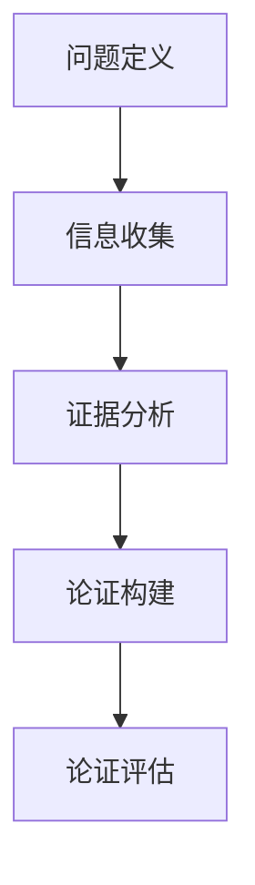

                 

# 在信息过载时代寻找智慧：培养批判性思维能力

> 关键词：批判性思维、信息过载、人工智能、技术博客、教育

> 摘要：本文旨在探讨在信息过载时代，如何通过培养批判性思维能力来提高个体的认知质量和决策能力。文章首先介绍了信息过载时代的特点，随后详细阐述了批判性思维的核心概念、基本原理以及应用场景。最后，文章提出了培养批判性思维的方法及其面临的挑战和未来发展趋势。

## 第一部分：引言

### 1.1 问题背景

#### 1.1.1 信息过载时代的特点

随着互联网和移动设备的普及，信息过载已成为现代社会的一个普遍现象。人们每天接收到的信息量远超过过去的总和，这不仅导致了信息的过剩，还引发了认知负担的增加。在这样一个时代，个体如何筛选、处理和利用信息成为了一项关键能力。

#### 1.1.2 批判性思维能力的重要性

批判性思维能力是指个体在面对信息和观点时，能够运用逻辑推理、分析评估和自主判断的能力。它不仅是学术研究、职场沟通和日常生活的重要工具，更是应对信息过载的有效手段。培养批判性思维，可以帮助个体在复杂的环境中做出更明智的决策。

### 1.2 核心概念

#### 1.2.1 批判性思维的定义

批判性思维是一种主动的、系统的、反思性的思维方式，它强调对信息的质疑、分析和综合。与传统的接受性思维不同，批判性思维要求个体具备独立思考的能力，不盲从权威，勇于提出质疑和挑战。

#### 1.2.2 批判性思维的能力要素

批判性思维包括以下几个关键能力要素：分析能力、推理能力、评估能力、创造能力和沟通能力。这些能力共同作用，帮助个体在复杂的信息环境中辨别真伪，形成独立的见解。

### 1.3 边界与外延

#### 1.3.1 批判性思维的应用领域

批判性思维可以应用于学术研究、职场沟通、日常生活等多个领域。在学术研究中，它可以帮助学者们进行深入的研究和分析；在职场沟通中，它可以帮助员工提高沟通效率和决策质量；在日常生活中，它可以帮助人们更好地应对信息过载和复杂的社会环境。

#### 1.3.2 与其他思维方式的对比

批判性思维与创造性思维、逻辑思维等不同，它不仅关注信息的逻辑性和合理性，还强调对信息的质疑和反思。与创造性思维相比，批判性思维更注重对已有知识和信息的分析和评估；与逻辑思维相比，批判性思维更强调独立思考和反思性。

### 1.4 本章小结

本文引言部分介绍了信息过载时代的特点以及批判性思维能力的重要性。接下来，我们将深入探讨批判性思维的基本原理及其应用场景。

----------------------------------------------------------------

## 第二部分：批判性思维的基本原理

### 2.1 核心概念原理

#### 2.1.1 知识的构建与验证

批判性思维的第一步是知识的构建与验证。个体需要主动获取信息，并通过多种途径验证信息的准确性。这包括查阅文献、咨询专家、参与讨论等。知识的构建是一个动态的过程，需要不断地更新和修正。

#### 2.1.2 证据的收集与分析

证据是批判性思维的基础。个体需要收集多种证据，包括数据、事实、案例等，并对这些证据进行系统性的分析。分析的过程包括比较、分类、归纳、演绎等。

#### 2.1.3 论证的构建与评估

在收集和分析证据的基础上，个体需要构建论证。论证的过程需要遵循逻辑性、合理性和一致性原则。论证的质量直接影响批判性思维的效果。因此，个体需要对论证进行严格的评估，包括检查逻辑漏洞、评估证据的可靠性等。

### 2.2 概念属性特征对比表格

#### 2.2.1 批判性思维与其他思维方式的对比

| 思维方式 | 定义 | 特点 |
| --- | --- | --- |
| 批判性思维 | 一种主动的、系统的、反思性的思维方式 | 强调质疑、分析和评估 |
| 创造性思维 | 一种产生新观点、新方案和新方法的思维方式 | 强调创新和想象力 |
| 逻辑思维 | 一种基于逻辑规则和推理的思维方式 | 强调逻辑性和合理性 |

### 2.3 ER实体关系图架构

#### 2.3.1 批判性思维中的实体关系

在批判性思维中，实体关系图可以帮助个体理解和分析复杂的问题。实体关系图包括实体、属性和关系三个部分。实体是批判性思维中的基本元素，如观点、事实、证据等。属性是实体的特征，如真实性、可靠性、逻辑性等。关系描述实体之间的关系，如支持、反驳、无关等。

#### 2.3.2 实体关系图在批判性思维中的应用

实体关系图在批判性思维中的应用主要包括以下几个方面：

1. **问题分析**：通过绘制实体关系图，个体可以更清晰地理解问题的本质和复杂性。
2. **证据评估**：个体可以根据实体关系图评估证据的可靠性和逻辑性。
3. **论证构建**：个体可以利用实体关系图构建合理的论证。

下面是一个简单的实体关系图示例，用于分析一个观点：

```mermaid
erDiagram
  Views ||--|{Facts} :支持
  Views ||--|{Evidence} :证明
  Facts ||--|{Arguments} :支持
  Evidence ||--|{Arguments} :支持
```

### 2.4 算法原理讲解

#### 2.4.1 批判性思维的算法流程

批判性思维的算法流程可以分为以下几个步骤：

1. **问题定义**：明确问题的目标和范围。
2. **信息收集**：收集与问题相关的信息。
3. **证据分析**：分析收集到的证据，评估其可靠性和逻辑性。
4. **论证构建**：根据证据构建合理的论证。
5. **论证评估**：评估论证的逻辑性和有效性。

下面是一个使用Mermaid绘制的批判性思维算法流程图：



### 2.5 数学模型和数学公式

#### 2.5.1 批判性思维的数学模型

批判性思维中的数学模型主要用于评估证据的可靠性和论证的有效性。以下是一个简单的数学模型示例：

$$
R = \frac{E \cdot A}{D}
$$

其中，$R$ 表示证据的可靠性，$E$ 表示证据的数量，$A$ 表示证据的准确性，$D$ 表示证据的多样性。

#### 2.5.2 模型中的关键公式

1. **证据数量公式**：

$$
E = N \cdot P
$$

其中，$E$ 表示证据的数量，$N$ 表示样本数量，$P$ 表示样本的代表性。

2. **证据准确性公式**：

$$
A = \frac{C}{N}
$$

其中，$A$ 表示证据的准确性，$C$ 表示正确证据的数量。

3. **证据多样性公式**：

$$
D = \frac{V}{N}
$$

其中，$D$ 表示证据的多样性，$V$ 表示不同类型证据的数量。

#### 2.5.3 公式的详细讲解

以上公式用于评估证据的可靠性和论证的有效性。在实际应用中，个体可以根据具体情况调整公式中的参数，以提高评估的准确性。

### 2.6 本章小结

第二部分详细介绍了批判性思维的基本原理，包括知识的构建与验证、证据的收集与分析、论证的构建与评估等。这些原理为个体在复杂的信息环境中做出明智的决策提供了理论支持。

----------------------------------------------------------------

## 第三部分：批判性思维的应用场景

### 3.1 应用场景一：学术研究

#### 3.1.1 学术研究的批判性思维方法

在学术研究中，批判性思维是一种重要的研究方法。它包括以下几个步骤：

1. **问题定义**：明确研究目标和范围，确保研究的针对性和深度。
2. **文献回顾**：广泛查阅相关文献，了解研究领域的前沿动态和关键问题。
3. **假设提出**：根据文献回顾和已有知识，提出合理的假设。
4. **证据收集**：通过实验、调查、观察等方式收集证据。
5. **证据分析**：对收集到的证据进行系统分析，评估其可靠性和逻辑性。
6. **论证构建**：根据证据构建合理的论证，支持或反驳假设。
7. **结果评估**：评估论证的有效性，检查是否存在逻辑漏洞或证据不足。

#### 3.1.2 学术论文的批判性阅读

在阅读学术论文时，批判性思维可以帮助学者们辨别论文的优缺点，提高研究的深度和广度。具体方法包括：

1. **问题识别**：识别论文的主要问题和研究方法。
2. **证据评估**：评估论文中的证据是否可靠、逻辑是否合理。
3. **论证评估**：评估论文的论证是否严密、结论是否支持假设。
4. **批判性思考**：提出自己的观点和质疑，促进学术讨论。

#### 3.1.3 学术研究的批判性写作

在学术写作中，批判性思维可以帮助学者们提高文章的质量和影响力。具体方法包括：

1. **明确立场**：在文章中明确自己的观点和立场。
2. **证据支持**：提供充分的证据支持自己的观点。
3. **逻辑论证**：构建严密的逻辑论证，避免逻辑漏洞。
4. **批判性反思**：对已有研究进行批判性反思，指出其优缺点。

### 3.2 应用场景二：职场沟通

#### 3.2.1 职场沟通中的批判性思维

在职场沟通中，批判性思维可以帮助员工提高沟通效率和决策质量。具体方法包括：

1. **明确目标**：在沟通前明确沟通的目标和预期结果。
2. **信息筛选**：筛选关键信息，避免信息过载。
3. **逻辑分析**：对信息进行逻辑分析，确保信息的合理性和一致性。
4. **反馈评估**：对沟通结果进行评估，检查是否存在问题或改进空间。

#### 3.2.2 有效沟通的策略

为了提高沟通的有效性，员工可以采取以下策略：

1. **倾听**：倾听是沟通的基础，要尊重他人的观点和意见。
2. **提问**：通过提问获取更多信息，促进双向沟通。
3. **表达**：清晰、准确地表达自己的观点和意见。
4. **反馈**：及时给予反馈，确保信息的准确传递。

#### 3.2.3 跨部门协作中的批判性思维

在跨部门协作中，批判性思维可以帮助员工更好地理解其他部门的需求和问题，提高协作效率。具体方法包括：

1. **换位思考**：站在对方的角度思考问题，理解对方的立场和需求。
2. **信息共享**：共享相关信息，确保各部门的信息一致。
3. **问题解决**：共同分析问题，提出解决方案。
4. **反馈沟通**：定期反馈协作进展和问题，确保协作的顺利进行。

### 3.3 应用场景三：日常生活

#### 3.3.1 日常生活中的批判性思维

在日常生活中，批判性思维可以帮助人们更好地应对信息过载和复杂的社会环境。具体方法包括：

1. **信息筛选**：筛选关键信息，避免信息过载。
2. **独立思考**：不盲从权威，独立思考问题。
3. **逻辑判断**：对信息进行逻辑判断，确保其合理性和一致性。
4. **决策评估**：对决策进行评估，确保其可行性和有效性。

#### 3.3.2 面对信息过载的策略

面对信息过载，人们可以采取以下策略：

1. **设定优先级**：根据重要性和紧急性设定任务的优先级。
2. **信息过滤**：使用过滤器过滤无关信息，减少信息负担。
3. **碎片化学习**：利用零散时间进行学习，提高效率。
4. **专注训练**：通过专注训练提高注意力，减少分心。

#### 3.3.3 批判性思维在家庭决策中的应用

在家庭决策中，批判性思维可以帮助家庭成员更好地分析问题和做出决策。具体方法包括：

1. **信息收集**：收集家庭决策所需的信息。
2. **证据评估**：评估信息的可靠性和逻辑性。
3. **论证构建**：根据证据构建合理的论证。
4. **决策评估**：评估决策的可行性和有效性。

### 3.4 本章小结

第三部分详细介绍了批判性思维在学术研究、职场沟通和日常生活中的应用。这些应用场景展示了批判性思维在提高个体认知质量和决策能力方面的作用。

----------------------------------------------------------------

## 第四部分：培养批判性思维的方法

### 4.1 教育体系中的批判性思维培养

#### 4.1.1 批判性思维教育的现状

当前，许多国家的教育体系已经开始重视批判性思维的培养。例如，美国的教育大纲中明确要求学生在学术研究和日常生活中运用批判性思维。然而，批判性思维教育的普及程度和效果仍存在一定差距。一些学校缺乏系统的批判性思维课程，教师对批判性思维的培养缺乏足够的认知和指导。

#### 4.1.2 批判性思维课程的设计与实施

为了有效培养批判性思维，教育体系需要设计并实施一系列批判性思维课程。这些课程应包括以下几个方面：

1. **基础知识教育**：为学生提供批判性思维的基本概念和原理。
2. **实践训练**：通过案例分析和模拟实践，帮助学生将批判性思维应用于实际问题。
3. **跨学科融合**：将批判性思维与其他学科知识相结合，提高学生的综合分析能力。
4. **评价体系**：建立科学的评价体系，评估学生的批判性思维水平，并提供反馈和指导。

#### 4.1.3 批判性思维的评估与反馈

批判性思维的评估与反馈是培养批判性思维的重要环节。教育体系应建立以下评估与反馈机制：

1. **过程评估**：在课程和实践训练过程中，定期评估学生的批判性思维表现，包括问题分析、证据收集、论证构建等。
2. **成果评估**：通过论文、报告、项目等成果，评估学生的批判性思维水平。
3. **反馈机制**：对评估结果进行反馈，指出学生的优点和不足，提供改进建议。
4. **持续改进**：根据评估结果和反馈，不断改进批判性思维课程的设计与实施。

### 4.2 个人发展中的批判性思维培养

#### 4.2.1 自我反思的重要性

自我反思是培养批判性思维的关键步骤。通过自我反思，个体可以审视自己的思维过程和决策，发现并纠正错误，提高思维的准确性和深度。具体方法包括：

1. **定期总结**：定期回顾自己的思维过程和决策，总结经验教训。
2. **自我提问**：针对自己的决策和观点，提出质疑和反思。
3. **寻求反馈**：向他人寻求反馈，了解自己的思维和决策是否合理。
4. **持续学习**：不断学习新知识，提高自己的认知水平和思维能力。

#### 4.2.2 批判性思维练习的方法

为了有效培养批判性思维，个体可以采取以下练习方法：

1. **阅读训练**：阅读批判性思维相关的书籍和文章，了解不同领域的批判性思维方法。
2. **案例分析**：通过分析实际案例，提高批判性思维的实践能力。
3. **辩论练习**：参与辩论，锻炼独立思考和快速反应能力。
4. **写作练习**：通过写作，整理和表达自己的观点和论证。
5. **问题解决**：在生活中遇到问题时，尝试运用批判性思维进行分析和解决。

#### 4.2.3 培养批判性思维的习惯

批判性思维是一种习惯，需要长期培养和坚持。以下方法可以帮助个体培养批判性思维的习惯：

1. **每天提问**：在日常生活中，养成提问的习惯，质疑信息的真实性和合理性。
2. **多角度思考**：从不同角度分析问题，避免片面和偏颇。
3. **持续学习**：不断学习新知识和技能，提高自己的认知水平和思维能力。
4. **反思和总结**：定期反思自己的思维过程和决策，总结经验教训。
5. **与他人交流**：与他人交流观点和想法，接受不同的意见和建议。

### 4.3 组织管理中的批判性思维培养

#### 4.3.1 组织文化对批判性思维的影响

组织文化对批判性思维的培养具有重要影响。一个开放、包容、鼓励质疑和创新的组织文化，可以激发员工的批判性思维能力。以下措施可以帮助组织培养批判性思维：

1. **建立开放沟通机制**：鼓励员工表达自己的观点和意见，建立开放的沟通渠道。
2. **提供培训和学习资源**：为员工提供批判性思维相关的培训和学习资源，提高他们的批判性思维能力。
3. **鼓励创新和尝试**：鼓励员工尝试新的方法和思路，培养他们的创新精神和批判性思维。
4. **建立评价体系**：建立科学的评价体系，鼓励员工在工作和生活中运用批判性思维。
5. **建立反馈机制**：建立有效的反馈机制，及时收集员工的反馈和建议，并给予反馈和指导。

#### 4.3.2 管理者如何培养员工的批判性思维

管理者在培养员工的批判性思维中发挥着关键作用。以下措施可以帮助管理者培养员工的批判性思维：

1. **树立榜样**：管理者要以身作则，展示批判性思维的能力，成为员工的榜样。
2. **提供支持和资源**：为员工提供必要的支持和资源，帮助他们培养批判性思维。
3. **鼓励质疑和反思**：鼓励员工质疑现有的观点和方法，培养他们的批判性思维。
4. **提供反馈和指导**：及时为员工提供反馈和指导，帮助他们纠正错误，提高批判性思维能力。
5. **创造积极氛围**：营造积极、包容的工作氛围，鼓励员工提出自己的想法和意见。

#### 4.3.3 批判性思维在工作流程中的应用

批判性思维可以在工作流程的各个环节中得到应用。以下是一些具体的应用场景：

1. **问题识别**：通过批判性思维，识别工作流程中的问题和瓶颈。
2. **方案设计**：运用批判性思维，设计更高效、合理的工作方案。
3. **决策评估**：运用批判性思维，评估决策的可行性和有效性。
4. **风险管理**：运用批判性思维，识别和评估潜在的风险。
5. **持续改进**：运用批判性思维，不断反思和优化工作流程。

### 4.4 本章小结

第四部分详细介绍了培养批判性思维的方法，包括教育体系中的批判性思维培养、个人发展中的批判性思维培养以及组织管理中的批判性思维培养。这些方法为个体和组织提供了有效的培养途径，有助于提高批判性思维能力。

----------------------------------------------------------------

## 第五部分：批判性思维的挑战与未来

### 5.1 批判性思维的挑战

#### 5.1.1 思维定式的克服

批判性思维的培养面临的一个重要挑战是克服思维定式。思维定式是指个体在长期的思维过程中形成的固定思维模式，这种模式可能阻碍批判性思维的发展。为了克服思维定式，个体需要：

1. **自我反思**：定期反思自己的思维过程和决策，识别并纠正思维定式。
2. **多样化学习**：通过学习不同领域的知识，拓宽思维视野，避免陷入单一思维模式。
3. **质疑权威**：不盲从权威，勇于质疑现有的观点和方法，培养独立思考能力。

#### 5.1.2 信息过载下的批判性思维

信息过载是现代社会的一个普遍现象，它对批判性思维提出了更高的要求。在信息过载的背景下，个体需要：

1. **信息筛选**：学会筛选关键信息，避免信息过载导致的认知负担。
2. **快速学习**：提高学习效率，快速掌握关键信息。
3. **逻辑判断**：增强逻辑判断能力，确保对信息的准确理解和评估。

#### 5.1.3 文化与社会的挑战

批判性思维的培养也面临着文化和社会的挑战。在一些文化背景下，批判性思维可能被视为对权威的挑战，甚至受到压制。为了克服这些挑战，需要：

1. **培养包容文化**：鼓励多元文化和观点的交流，营造包容、开放的社会环境。
2. **加强教育**：通过教育提高公众对批判性思维的认识，培养批判性思维能力。
3. **倡导理性**：在文化和社会中倡导理性思考，反对盲目从众和偏见。

### 5.2 批判性思维的未来发展趋势

#### 5.2.1 技术对批判性思维的影响

随着人工智能和大数据技术的发展，批判性思维的应用场景和形式也在不断拓展。未来，技术将对批判性思维产生以下影响：

1. **增强数据分析能力**：大数据和人工智能技术可以提供更丰富的数据资源，帮助个体进行更全面、深入的分析。
2. **辅助决策**：人工智能可以通过分析海量数据，为个体提供更明智的决策建议。
3. **提高沟通效率**：智能助手和沟通工具可以协助个体进行高效的沟通和协作。

#### 5.2.2 新兴领域对批判性思维的影响

随着新兴领域如人工智能、生物科技、量子计算等的不断发展，批判性思维在这些领域中的应用将更加广泛。未来，新兴领域对批判性思维的影响将包括：

1. **推动理论创新**：新兴领域的研究和应用将不断推动批判性思维的理论创新。
2. **拓展应用场景**：新兴领域将为批判性思维提供更多的应用场景，如智能医疗、自动驾驶等。
3. **提升实践能力**：新兴领域的研究和应用将提高个体在实践中运用批判性思维的能力。

### 5.3 本章小结

第五部分探讨了批判性思维面临的挑战及其未来发展趋势。克服思维定式、应对信息过载、克服文化与社会的挑战是当前批判性思维培养的重要任务。随着技术的发展和新兴领域的兴起，批判性思维将面临更多的机遇和挑战。

## 结束语

在信息过载的时代，培养批判性思维能力显得尤为重要。通过批判性思维，个体能够更有效地筛选和处理信息，做出明智的决策。本文从批判性思维的核心概念、基本原理、应用场景以及培养方法等方面进行了详细阐述，旨在为读者提供一套系统的批判性思维培养指南。

作者：AI天才研究院/AI Genius Institute & 禅与计算机程序设计艺术 /Zen And The Art of Computer Programming

通过本文的学习，希望读者能够掌握批判性思维的核心原理，并将其应用于学术研究、职场沟通、日常生活等多个领域，提高自己的认知质量和决策能力。同时，也期待读者能够不断反思和改进自己的思维模式，成为具备独立思考能力和批判性思维的新时代人才。

## 最佳实践 tips

1. **定期自我反思**：每周或每月花时间回顾自己的思维过程和决策，识别并纠正思维定式。
2. **多样化学习**：多阅读不同领域的书籍和文章，拓宽思维视野。
3. **培养提问习惯**：在阅读、讨论和工作时，不断提问，质疑信息的真实性和合理性。
4. **与他人交流**：多与他人交流观点和想法，接受不同的意见和建议。
5. **实践应用**：在实际工作中，运用批判性思维分析和解决问题。

## 小结

本文通过引言、批判性思维的基本原理、应用场景、培养方法以及挑战与未来发展趋势等五个部分，详细阐述了在信息过载时代如何培养批判性思维能力。批判性思维不仅是一种重要的思维工具，更是一种生活方式。通过培养批判性思维，个体能够更好地应对信息过载，提高认知质量和决策能力。

## 注意事项

1. **避免盲目从众**：在信息过载的时代，要避免盲目接受和传播未经验证的信息。
2. **保持独立思考**：在接收和处理信息时，要保持独立思考，不盲从权威。
3. **注重证据和逻辑**：在做出决策时，要注重证据的收集和分析，遵循逻辑原则。
4. **持续学习和实践**：批判性思维的培养需要长期坚持，通过不断学习和实践，提高自己的思维能力。

## 拓展阅读

1. **《批判性思维工具》**：作者：理查德·保罗、琳达·埃尔博
2. **《思考，快与慢》**：作者：丹尼尔·卡尼曼
3. **《如何阅读一本书》**：作者：莫提默·J. 艾德勒、查尔斯·范多伦
4. **《批判性思维》**：作者：迈克尔·波伦、理查德·萨勒斯

通过阅读这些书籍，读者可以进一步了解批判性思维的原理和应用，提升自己的批判性思维能力。

