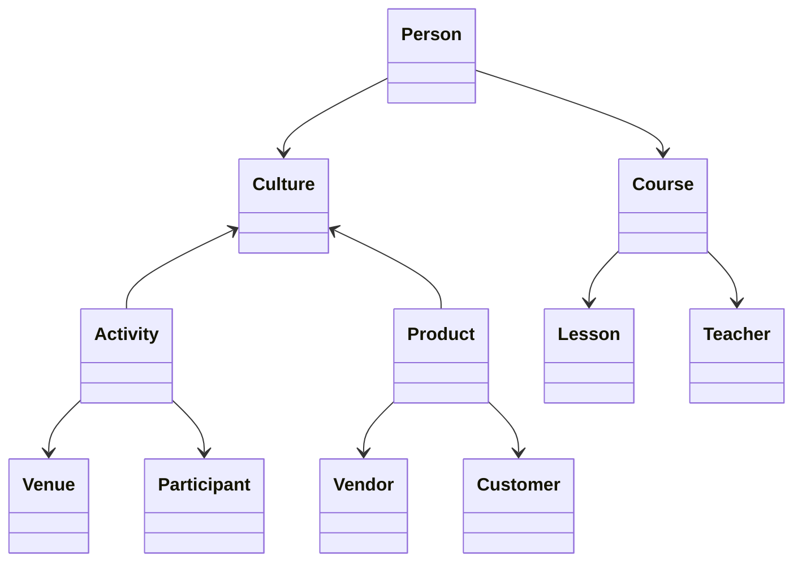
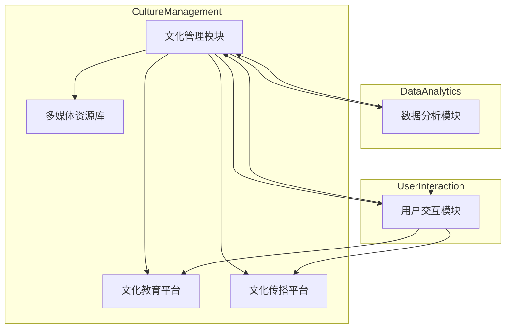
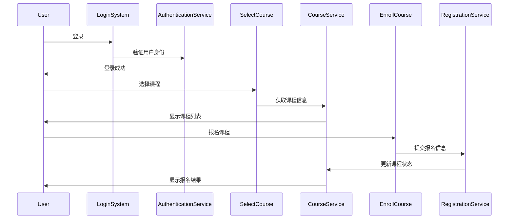

                 

### 引言

#### 全球化进程对文化的影响

全球化进程，从经济、政治到文化，正在以前所未有的速度席卷全球。在信息技术和交通网络的迅猛发展下，人们之间的交流变得更加便捷，不同国家和地区的文化开始彼此碰撞、融合。然而，这种文化交融也带来了一系列挑战，尤其是在保持文化特色和身份认同方面。

首先，全球化使得文化多样性的传播变得更加广泛和迅速。通过互联网、影视作品、音乐等渠道，各种文化元素得以快速传播，促进了文化的交流和相互理解。然而，这也可能导致某些文化的同质化，使得一些地方文化逐渐失去其独特性和特色。

其次，全球化对身份认同产生了深远的影响。随着人们接触到的外部文化越来越多，传统的身份认同方式可能面临挑战。尤其是在年轻一代中，越来越多的人开始质疑自己所属的文化身份，并在多个文化之间寻找认同。这种身份认同的模糊化可能带来文化自信的危机。

#### 身份认同的挑战与机遇

身份认同是个人或群体对自身归属感的认知和确认。在全球化的背景下，身份认同的挑战主要表现在以下几个方面：

1. **文化同质化**：全球化带来了文化的融合，但同时也可能导致文化同质化，使得一些传统文化失去其独特性。
2. **多元文化冲突**：不同文化之间的差异和碰撞可能导致文化冲突，影响社会的和谐与稳定。
3. **身份认同的模糊化**：在全球化的影响下，人们可能在不同文化之间摇摆，难以确定自己的身份认同。

然而，全球化也带来了机遇。通过文化交流和融合，人们可以更好地理解其他文化，从而促进不同文化之间的和谐与共生。此外，全球化也为文化创新提供了新的机遇，使得文化可以更加多元化和丰富。

#### 保持文化特色的必要性

在全球化的浪潮中，保持文化特色具有重要意义。首先，文化特色是民族和地区的重要标志，是身份认同的重要基础。其次，文化特色有助于维护社会多样性，促进社会的和谐与稳定。最后，保持文化特色有助于推动文化创新，为经济发展注入新的活力。

因此，如何在全球化背景下保持文化特色，成为当前一个重要的课题。接下来，我们将深入探讨文化特色的定义与特征、全球化背景下的文化冲突与融合、身份认同的理论基础、保持文化特色的方法与实践，以及具体的实证分析与案例分析。通过这些探讨，我们将寻求在全球化背景下保持文化特色的有效策略。

### 文化特色的定义与特征

#### 文化特色的概念

文化特色，通常指的是某个特定文化群体在长期的历史发展过程中形成的独特文化特征和传统。它不仅包括物质文化，如建筑、服饰、工艺品等，还包括非物质文化，如语言、宗教、习俗、价值观等。文化特色是文化多样性的重要组成部分，是不同文化群体之间相互区别的显著标志。

#### 文化特色的特征

1. **独特性**：文化特色具有鲜明的独特性，是某个文化群体在长期历史发展过程中形成的独特特征。例如，中国的春节和西方的圣诞节就具有截然不同的文化特色。

2. **历史性**：文化特色往往承载着丰富的历史内涵，反映了某个文化群体的历史演变和文化传承。例如，中国的端午节源于纪念屈原，而西方的情人节则起源于古罗马时期。

3. **传承性**：文化特色需要通过代代相传才能保持其独特性和生命力。例如，中国的书法和茶文化，都是通过家族传承、教育传承等方式得以延续。

4. **地域性**：文化特色与地域环境密切相关，不同地区的自然环境和地理特征塑造了各自独特的文化特色。例如，江南水乡的园林文化和青藏高原的藏族文化就具有明显的地域性特征。

5. **多样性**：文化特色具有多样性，不同文化群体之间文化特色的差异和多样性是文化多样性的重要体现。这种多样性不仅丰富了人类社会的文化内涵，也为文化交流和融合提供了丰富的素材。

#### 文化特色的分类

根据不同的分类标准，文化特色可以有不同的分类方法。以下是几种常见的分类方法：

1. **物质文化与非物质文化**：物质文化包括建筑、服饰、工艺品等，而非物质文化包括语言、宗教、习俗、价值观等。

2. **传统文化与现代化文化**：传统文化指的是历史上形成的、具有持久影响的文化特色，如中国的传统文化、日本的茶道等。现代化文化则是在现代社会中形成的、与现代化进程相适应的文化特色，如现代艺术、流行文化等。

3. **官方文化与民间文化**：官方文化通常由国家或政府主导，具有正式的文化地位和影响力，如国家博物馆、国家大剧院等。民间文化则主要在民间流传，反映普通民众的生活和价值观，如民间故事、民间艺术等。

4. **本土文化与移民文化**：本土文化指的是某个文化群体在其本土地区形成的文化特色，而移民文化则是在移民过程中形成的、融合了多个文化元素的文化特色。例如，美国作为一个移民国家，其文化就是多种文化融合的产物。

通过上述对文化特色的定义与特征的探讨，我们可以更好地理解文化特色的重要性以及其在全球化背景下的挑战和机遇。在接下来的章节中，我们将进一步分析全球化背景下的文化冲突与融合，为保持文化特色提供理论支持和实践策略。

### 全球化背景下的文化冲突与融合

#### 文化冲突的表现

在全球化的背景下，文化冲突成为一种普遍现象。文化冲突不仅体现在不同国家、地区之间的文化差异，还体现在不同文化群体之间的互动过程中。以下是文化冲突的几种主要表现：

1. **价值观差异**：不同的文化背景往往孕育出不同的价值观。在全球化过程中，不同文化之间的价值观差异可能导致冲突。例如，西方社会的个人主义与东方社会的集体主义之间的对立，就可能导致文化冲突。

2. **语言障碍**：语言是文化的重要组成部分。在全球化背景下，语言障碍可能阻碍不同文化之间的交流和理解，从而引发文化冲突。例如，英语在全球范围内的普及可能使一些本土语言面临被边缘化的风险。

3. **习俗差异**：不同文化群体有着不同的习俗和礼仪，这些习俗和礼仪在全球化过程中可能引发冲突。例如，饮食习惯、宗教习俗等都是可能引发文化冲突的因素。

4. **文化认同的危机**：全球化使得人们更多地接触到外部文化，这可能导致一些文化群体对自己的文化认同产生质疑，从而引发文化冲突。例如，一些年轻人可能在全球化过程中逐渐失去对本土文化的认同，从而引发文化认同的危机。

#### 文化融合的趋势

尽管文化冲突不可避免，但全球化也带来了文化融合的趋势。文化融合是指不同文化在交流过程中相互借鉴、相互融合，从而形成新的文化现象。以下是文化融合的几种主要趋势：

1. **文化杂交**：文化杂交是指不同文化之间的相互作用，从而产生新的文化现象。例如，中餐在美国的改良，就是中西方饮食文化相互融合的结果。

2. **文化扩散**：文化扩散是指文化元素在不同地区之间的传播和扩散。例如，韩流和日本动漫在全球范围内的传播，就是文化扩散的典型例子。

3. **文化认同的多元性**：在全球化背景下，人们可能在不同文化之间找到自己的认同。例如，一些人可能同时认同自己的民族文化和所在国家的文化，形成多元文化认同。

4. **文化创新的动力**：文化融合可以激发文化创新，为经济发展注入新的活力。例如，在全球化过程中，跨国公司通过整合不同文化元素，创造出新的产品和服务，从而推动经济的发展。

#### 文化冲突与融合的辩证关系

文化冲突与融合是全球化过程中的一对矛盾统一体。文化冲突反映了不同文化之间的差异和碰撞，而文化融合则体现了文化之间的相互理解和融合。两者之间存在着辩证关系：

1. **冲突促进融合**：文化冲突可以激发文化融合的进程。通过冲突，不同文化群体可以更好地理解彼此的差异，从而推动文化融合。

2. **融合化解冲突**：文化融合可以缓解文化冲突，减少文化冲突带来的负面影响。通过融合，不同文化可以在相互理解的基础上找到共同点，从而减少冲突。

3. **冲突与融合的动态平衡**：在全球化的背景下，文化冲突与融合是一个动态的过程。文化冲突与融合在不同的时间和空间条件下可能发生转化，形成一种动态平衡。

综上所述，全球化背景下的文化冲突与融合是一个复杂的过程。理解文化冲突与融合的辩证关系，有助于我们更好地应对全球化带来的文化挑战，推动文化多样性和文化创新的发展。

### 身份认同的理论基础

#### 身份认同的概念

身份认同（Identity）是指个人或群体对其自身特征、归属和地位的认知和确认。它是心理学和社会学中一个重要的概念，涉及到个人对自我、群体以及社会角色的认识。身份认同不仅仅是自我感知，还包括自我与他人的关系以及个人在社会中的位置。

#### 身份认同的理论模型

1. **社会认同理论**：社会认同理论（Social Identity Theory）由英国社会心理学家亨利·泰弗尔（Henri Tajfel）提出。该理论认为，人们通过将自我归类到不同的社会群体中来获得身份认同。这种身份认同不仅仅是个体的内在感受，还与群体成员之间的比较和竞争有关。

2. **自我决定理论**：自我决定理论（Self-Determination Theory）由心理学家爱德华·德西（Edward L. Deci）和理查德·瑞恩（Richard M. Ryan）提出。该理论强调个人自主性和内在动机在身份认同中的作用。身份认同不仅仅是外在的社会标签，更是一种内在的自我实现。

3. **认同构建理论**：认同构建理论（Identity Construction Theory）认为，身份认同是通过个体与社会的互动过程中不断构建和重构的。身份认同不仅仅是个体的内在认知，还受到外部环境和社会期望的影响。

#### 身份认同的影响因素

1. **文化背景**：文化背景是影响身份认同的重要因素。不同的文化环境和价值观会影响个体对自身身份的认知和确认。例如，在一些强调集体主义文化中，个体的身份认同可能更多地与所属的群体相关联。

2. **历史背景**：历史背景对身份认同也有深远的影响。历史事件和文化遗产会塑造个体的身份认同，使得个体对自己的文化传统和历史有更深刻的认知。

3. **社会互动**：个体与社会和他人的互动也是身份认同形成的重要途径。通过与他人互动，个体可以了解自己在社会中的角色和地位，从而形成更清晰的身份认同。

4. **教育**：教育在塑造身份认同方面起着关键作用。教育不仅传递知识和技能，还传递文化价值观和社会规范，从而影响个体的身份认同。

5. **媒体**：现代传媒技术，尤其是互联网和社交媒体，对身份认同产生了巨大的影响。通过媒体，个体可以接触到多样的文化观点和身份认同，从而影响其自身的身份认同。

#### 身份认同的重要性

身份认同不仅是个人自我感知和自我确认的重要方式，还对个体的行为和社会互动产生深远影响。首先，身份认同有助于个体建立自我价值感和自我效能感，从而增强个体的自信心和积极性。其次，身份认同有助于个体与他人建立良好的人际关系，促进社会和谐与稳定。最后，身份认同也是文化多样性和文化传承的重要基础，有助于维护和传承不同文化的独特性和特色。

通过上述对身份认同概念、理论模型及其影响因素的探讨，我们可以更好地理解身份认同在全球化背景下的复杂性和重要性。在接下来的章节中，我们将进一步探讨如何在全球化背景下保持文化特色，以应对身份认同的挑战。

### 保持文化特色的方法与实践

在全球化的浪潮中，保持文化特色成为一项具有挑战性的任务。为了应对这一挑战，我们可以从文化传承与创新、教育与文化传播、文化产业发展的多个维度来探讨保持文化特色的方法与实践。

#### 文化传承与创新

1. **传统艺术与手工艺的保护**：传统艺术和手工艺是文化特色的重要组成部分。通过建立专门的机构和保护项目，我们可以保护和传承这些非物质文化遗产。例如，中国的非遗保护项目通过设立文化保护区、开展传统工艺培训等方式，有效保护和传承了大量的传统艺术和手工艺。

2. **文化融合与创新**：在保持文化特色的同时，通过文化融合可以创造出新的文化现象。这种文化融合不仅有助于保持文化特色，还能促进文化创新。例如，中西方饮食文化的融合，不仅使得中式美食在国际上更具吸引力，还催生了新的餐饮模式。

3. **数字化传承**：数字化技术为文化传承提供了新的途径。通过数字化手段，我们可以将传统文化以数字形式保存和传播，使更多的人能够接触和了解传统文化。例如，数字博物馆、虚拟现实技术等都是数字化传承的典型应用。

#### 教育与文化传播

1. **教育体系中的文化教育**：教育是文化传承和传播的重要途径。通过在各级教育体系中融入文化教育，我们可以培养年轻一代对本土文化的认同感和传承意识。例如，将传统文化课程纳入中小学课程体系，通过实践活动和课堂教育，使学生深入了解和尊重本土文化。

2. **文化传播活动**：举办各种形式的文化传播活动，如文化节、文化展览、演出等，可以增强公众对本土文化的认识和认同。例如，中国的国际文化节吸引了大量国内外观众，展示了丰富多彩的中华文化，提升了文化自信。

3. **多媒体文化传播**：利用现代传媒技术，如电影、电视剧、音乐、互联网等，可以有效地传播文化。例如，通过制作和推广具有本土特色的电影和音乐，不仅在国内市场取得了成功，还吸引了国际观众的注意。

#### 文化产业发展

1. **文化产业的扶持政策**：政府可以通过制定和实施相关政策，扶持文化产业的发展。例如，提供财政补贴、税收优惠等，鼓励文化企业和创作者投身文化产业。

2. **文化产业的多元化**：文化产业的多元化有助于保持文化特色。通过开发不同类型的文化产品，如影视、动漫、游戏等，可以满足不同群体的文化需求。例如，日本动漫产业的发展不仅保持了其传统文化特色，还创造了巨大的经济价值。

3. **国际文化交流与合作**：通过国际文化交流与合作，可以促进不同文化之间的相互理解和融合。例如，通过国际合作项目，共同开发文化产品，不仅能够提升本土文化的国际影响力，还能借鉴其他文化的优点，促进文化创新。

通过上述方法与实践，我们可以在全球化背景下有效保持文化特色，应对身份认同的挑战。保持文化特色不仅是维护文化多样性的重要手段，也是促进社会和谐与经济发展的必要条件。在接下来的章节中，我们将通过实证分析与案例研究，进一步探讨保持文化特色的具体实践与成效。

### 实证分析与案例分析

#### 案例一：中国的文化保护与传承

中国作为具有悠久历史的文明古国，在全球化的背景下，采取了一系列措施来保护和传承本土文化。

**措施**：

1. **非遗保护**：中国政府设立了国家级非物质文化遗产保护名录，对具有重要文化价值的传统艺术、手工艺等进行保护和传承。例如，昆曲、京剧等传统艺术形式被列入非遗名录，并通过政府资助和专项培训来保障其传承。

2. **文化教育**：通过在各级教育体系中融入传统文化课程，培养学生的文化认同感和传承意识。例如，中小学开设传统艺术课程，大学设立文化传承相关学科。

3. **数字化传承**：利用数字化技术，将传统文化以数字形式保存和传播。例如，通过数字博物馆、虚拟现实技术等，使公众能够更便捷地了解和接触传统文化。

**成效**：

1. **文化自信的提升**：通过保护和传承本土文化，中国公众对本土文化的认同感和自豪感显著增强，文化自信得到提升。

2. **文化产业的繁荣**：文化保护与传承措施促进了文化产业的发展，带动了相关产业的繁荣。例如，传统文化旅游、文化创意产品等产业取得了显著的经济效益。

3. **国际影响力的提升**：通过国际文化交流活动，中国的传统文化在全球范围内得到了更广泛的传播，提升了中国的国际文化影响力。

#### 案例二：日本的传统文化复兴

日本作为东亚文化圈的重要组成部分，其在全球化背景下，通过传统文化复兴来保持文化特色。

**措施**：

1. **传统文化教育**：通过在学校教育中强调传统文化教育，使年轻一代对本土文化有更深刻的认知和理解。例如，日本学校设置茶道、花道等课程，让学生亲身体验和了解传统文化。

2. **文化活动推广**：定期举办传统文化节庆活动，如盂兰盆节、樱花节等，吸引国内外游客参与，增强文化认同感。

3. **文化产品开发**：通过文化创意产品，将传统文化与现代生活方式相结合，例如，日本动漫、和服等都是将传统文化与现代元素融合的典型例子。

**成效**：

1. **文化认同的增强**：通过传统文化教育和文化活动推广，日本年轻一代对本土文化的认同感显著增强，传统文化在现代社会中的地位得到巩固。

2. **文化产业的繁荣**：传统文化复兴带动了文化产业的发展，尤其是动漫、旅游业等领域，实现了显著的经济增长。

3. **国际文化交流**：通过国际文化交流活动，日本传统文化在全球范围内得到了更广泛的传播和认可，提升了国际影响力。

#### 案例三：印度的文化多样性维护

印度作为拥有丰富文化多样性的国家，在全球化的背景下，通过维护文化多样性来保持文化特色。

**措施**：

1. **文化政策支持**：政府出台一系列政策，支持不同文化群体的文化传承和发展。例如，设立少数民族文化保护基金，支持少数民族文化的传承和创新。

2. **文化交流活动**：定期举办文化交流活动，促进不同文化之间的互动和融合。例如，印度国际电影节吸引了来自世界各地的电影工作者，展示了印度丰富的文化多样性。

3. **文化产业发展**：通过发展文化产业，将传统文化与现代科技相结合，创造新的文化产品和体验。例如，印度宝莱坞电影产业不仅在国内市场占据主导地位，还通过国际发行和合作，实现了全球传播。

**成效**：

1. **文化多样性的保持**：通过政策支持和文化交流活动，印度成功维护了其丰富的文化多样性，不同文化群体之间的关系更加和谐。

2. **文化产业的繁荣**：文化多样性带动了文化产业的繁荣，尤其是电影、音乐等领域，实现了显著的经济增长。

3. **国际文化影响力的提升**：通过国际文化交流活动和文化产品输出，印度文化在全球范围内得到了更广泛的认可和关注，提升了国际文化影响力。

通过这些实证分析与案例分析，我们可以看到，在全球化的背景下，保持文化特色不仅是维护文化多样性和身份认同的重要手段，也是促进经济发展和国际文化交流的重要途径。各国在具体实践中，采取了不同的策略和方法，但都取得了显著成效。

### 全球化背景下的身份认同策略

#### 国家层面的身份认同策略

1. **文化政策制定**：国家可以通过制定文化政策来强化国民对本土文化的认同。例如，设立文化保护基金，支持传统文化的传承和创新。

2. **文化基础设施建设**：建设文化基础设施，如博物馆、图书馆、剧院等，为公众提供接触和了解本土文化的机会。

3. **文化交流与合作**：积极参与国际文化交流与合作，通过展示本土文化，提升国家的文化软实力。

#### 社会层面的身份认同策略

1. **媒体宣传**：利用媒体渠道，宣传和弘扬本土文化，增强公众的文化认同感。

2. **社区活动**：举办各类社区活动，如文化节、民俗节庆等，促进文化传承和社区凝聚力。

3. **教育推广**：在各级教育体系中融入文化教育，培养学生的文化认同感和传承意识。

#### 个人层面的身份认同策略

1. **文化体验**：通过参与文化活动、学习传统艺术等形式，加深对本土文化的理解和认同。

2. **文化表达**：通过创作和分享文化作品，表达个人对文化的认同和热爱。

3. **文化传承**：通过家庭传承、教育传承等方式，将本土文化传递给下一代。

### 全球化背景下的身份认同策略总结

在全球化的背景下，身份认同面临前所未有的挑战。通过国家、社会和个人三个层面的综合策略，我们可以有效地应对这些挑战，保持文化特色和身份认同。国家层面的文化政策制定和文化基础设施建设，为社会和个人的文化认同提供了坚实的支持；社会层面的媒体宣传和社区活动，增强了公众对文化的认同和参与感；个人层面的文化体验和文化表达，使得每个人都能在全球化背景下找到自己的文化归属。通过这些策略，我们可以更好地应对全球化带来的身份认同挑战，推动文化多样性和社会和谐的发展。

### 结论与展望

#### 结论

本文通过深入探讨全球化背景下的文化挑战，包括文化特色的定义与特征、文化冲突与融合的辩证关系、身份认同的理论基础以及保持文化特色的方法与实践，提出了在全球化背景下保持文化特色和身份认同的对策。首先，文化特色在全球化进程中扮演着至关重要的角色，它是民族和地区的独特标志，有助于维护社会多样性和文化自信。其次，全球化带来了文化冲突与融合的双重挑战，需要我们通过多种策略来应对。最后，身份认同的复杂性和多样性要求我们在国家、社会和个人层面采取综合性的策略。

#### 展望

展望未来，全球化将继续深化，文化多样性和身份认同问题将更加突出。以下是一些建议和方向：

1. **加强文化交流与合作**：通过国际文化交流与合作，可以增进不同文化之间的理解和融合，促进全球文化多样性的发展。

2. **创新文化传承方式**：利用现代科技，如互联网、虚拟现实等，创新文化传承方式，使传统文化更具活力和吸引力。

3. **培养文化自信**：加强文化教育，提升公众对本土文化的认同感和自豪感，培养文化自信。

4. **促进文化产业发展**：通过政策扶持和产业创新，促进文化产业的繁荣，为经济发展注入新动力。

5. **关注多元文化融合**：在全球化的进程中，关注多元文化的融合与创新，创造出新的文化现象，推动全球文化的共同进步。

### 研究局限与未来方向

尽管本文对全球化背景下的文化挑战和身份认同问题进行了深入探讨，但仍存在一定的局限性。首先，本文主要基于理论分析和案例分析，缺乏实证研究的数据支持。未来研究可以结合定量和定性的方法，进行更深入的数据分析。其次，本文主要关注国家、社会和个人三个层面的策略，未来研究可以进一步探讨其他层面的策略，如企业、非政府组织等。最后，全球化背景下的文化挑战和身份认同问题是一个动态演变的过程，未来研究需要持续关注这一领域的最新发展和趋势。

### 最佳实践 tips

1. **积极参与文化交流活动**：通过参加文化节、民俗节庆等活动，可以加深对本土文化的理解和认同。

2. **利用现代科技传承文化**：利用互联网、虚拟现实等技术，创新文化传承方式，使传统文化更具吸引力。

3. **注重文化教育**：在学校教育中融入文化课程，培养学生的文化认同感和传承意识。

4. **发挥媒体作用**：利用媒体渠道，宣传和弘扬本土文化，提升文化认同感。

### 拓展阅读

1. **《文化冲突与融合的理论与实践》**：这本书详细探讨了全球化背景下的文化冲突与融合问题，提供了丰富的理论和实践案例。

2. **《全球化时代的文化认同》**：该书从心理学和社会学的角度，分析了全球化对文化认同的影响，并提出了一系列应对策略。

3. **《文化传承与创新》**：这本书探讨了文化传承与创新的方法和实践，提供了丰富的案例分析。

### 注意事项

1. **文化认同的重要性**：文化认同不仅是个人自我确认的重要方式，也是社会和谐与稳定的基础。

2. **文化多样性**：尊重和珍视文化多样性，促进不同文化之间的相互理解和融合。

3. **文化自信**：培养文化自信，推动本土文化的传承与创新。

### 作者信息

作者：AI天才研究院/AI Genius Institute & 禅与计算机程序设计艺术 /Zen And The Art of Computer Programming

以上内容总结了本文的核心观点、最佳实践和拓展阅读，同时也提出了注意事项，以期为读者提供更加全面的参考和指导。在全球化背景下，保持文化特色和身份认同是我们共同面临的挑战，希望本文能为此提供一些有价值的思考和建议。

```markdown
---

# 在全球化背景下保持文化特色：应对身份认同的挑战

关键词：全球化、文化特色、身份认同、文化冲突、文化融合、文化传承、文化产业发展

摘要：本文探讨了全球化背景下文化特色和身份认同的挑战，分析了文化冲突与融合的辩证关系，提出了保持文化特色的方法与实践，并通过实证分析与案例研究，展示了具体实践与成效。最后，提出了全球化背景下的身份认同策略，并展望了未来的发展方向。

## 引言

全球化进程对文化产生了深远的影响，既带来了文化多样性的传播和融合，也引发了文化冲突和身份认同的挑战。本文将深入探讨这些问题，并寻求有效的解决方案。

### 全球化进程对文化的影响

全球化使得不同文化之间的交流变得更加频繁和便捷，促进了文化多样性的传播。然而，这种文化交融也可能导致某些文化的同质化，使得地方文化逐渐失去其独特性。此外，全球化对身份认同也带来了挑战，使得个人和群体在多元文化中难以确定自己的身份认同。

#### 文化同质化

全球化使得文化元素迅速传播，尤其是在信息技术和传媒技术的推动下，西方文化尤其是美国文化在全球范围内的影响力日益增强。这种文化同质化现象可能导致一些地方文化的消失，例如一些传统的手工艺和口头文化。这种现象引发了文化保守主义者对于文化多样性的担忧。

#### 身份认同的挑战

全球化进程使得人们更容易接触到不同的文化，这种文化多样性的增加可能会对传统的身份认同产生冲击。特别是在年轻人中，越来越多的人开始质疑自己所属的文化身份，并在多个文化之间寻找认同。这种身份认同的模糊化可能带来文化自信的危机，影响社会的和谐与稳定。

### 保持文化特色的必要性

在全球化的浪潮中，保持文化特色具有重要意义。首先，文化特色是民族和地区的重要标志，是身份认同的重要基础。其次，文化特色有助于维护社会多样性，促进社会的和谐与稳定。最后，保持文化特色有助于推动文化创新，为经济发展注入新的活力。

#### 保持文化特色的重要性

文化特色不仅是民族的灵魂和文化的根基，也是个体认同和归属感的重要来源。在全球化的背景下，保持文化特色可以增强民族自豪感和文化自信心，有助于维护社会和谐与稳定。此外，文化特色也是文化创新的重要动力，通过传承与创新，可以不断丰富和发展文化内涵。

#### 保持文化特色的策略

为了在全球化背景下保持文化特色，可以采取以下策略：

1. **文化传承与创新**：通过传统文化艺术和手工艺的保护与创新，使传统文化在现代社会中焕发新的活力。

2. **教育与文化传播**：在各级教育体系中融入文化教育，通过文化传播活动，增强公众对本土文化的认同。

3. **文化产业发展**：通过文化产业的发展，将文化特色转化为经济资源，为文化传承与创新提供经济支持。

### 文化特色的定义与特征

#### 文化特色的概念

文化特色，通常指的是某个特定文化群体在长期的历史发展过程中形成的独特文化特征和传统。它不仅包括物质文化，如建筑、服饰、工艺品等，还包括非物质文化，如语言、宗教、习俗、价值观等。文化特色是文化多样性的重要组成部分，是不同文化群体之间相互区别的显著标志。

#### 文化特色的特征

1. **独特性**：文化特色具有鲜明的独特性，是某个文化群体在长期历史发展过程中形成的独特特征。例如，中国的春节和西方的圣诞节就具有截然不同的文化特色。

2. **历史性**：文化特色往往承载着丰富的历史内涵，反映了某个文化群体的历史演变和文化传承。例如，中国的端午节源于纪念屈原，而西方的情人节则起源于古罗马时期。

3. **传承性**：文化特色需要通过代代相传才能保持其独特性和生命力。例如，中国的书法和茶文化，都是通过家族传承、教育传承等方式得以延续。

4. **地域性**：文化特色与地域环境密切相关，不同地区的自然环境和地理特征塑造了各自独特的文化特色。例如，江南水乡的园林文化和青藏高原的藏族文化就具有明显的地域性特征。

5. **多样性**：文化特色具有多样性，不同文化群体之间文化特色的差异和多样性是文化多样性的重要体现。这种多样性不仅丰富了人类社会的文化内涵，也为文化交流和融合提供了丰富的素材。

#### 文化特色的分类

根据不同的分类标准，文化特色可以有不同的分类方法。以下是几种常见的分类方法：

1. **物质文化与非物质文化**：物质文化包括建筑、服饰、工艺品等，而非物质文化包括语言、宗教、习俗、价值观等。

2. **传统文化与现代化文化**：传统文化指的是历史上形成的、具有持久影响的文化特色，如中国的传统文化、日本的茶道等。现代化文化则是在现代社会中形成的、与现代化进程相适应的文化特色，如现代艺术、流行文化等。

3. **官方文化与民间文化**：官方文化通常由国家或政府主导，具有正式的文化地位和影响力，如国家博物馆、国家大剧院等。民间文化则主要在民间流传，反映普通民众的生活和价值观，如民间故事、民间艺术等。

4. **本土文化与移民文化**：本土文化指的是某个文化群体在其本土地区形成的文化特色，而移民文化则是在移民过程中形成的、融合了多个文化元素的文化特色。例如，美国作为一个移民国家，其文化就是多种文化融合的产物。

通过上述对文化特色的定义与特征的探讨，我们可以更好地理解文化特色的重要性以及其在全球化背景下的挑战和机遇。在接下来的章节中，我们将进一步分析全球化背景下的文化冲突与融合，为保持文化特色提供理论支持和实践策略。

## 全球化背景下的文化冲突与融合

全球化进程不仅促进了文化的交流与融合，也带来了文化冲突的问题。文化冲突通常是指不同文化之间在价值观、习俗、语言等方面的对立和摩擦。在全球化背景下，文化冲突的表现形式多种多样，下面将详细探讨文化冲突的主要表现、趋势及其辩证关系。

### 文化冲突的表现

1. **价值观差异**：不同文化背景往往孕育出不同的价值观。在全球化过程中，不同文化之间的价值观差异可能导致冲突。例如，西方社会的个人主义与东方社会的集体主义之间的对立，可能导致个人自由与社会责任之间的冲突。

2. **语言障碍**：语言是文化的重要组成部分。在全球化背景下，语言障碍可能阻碍不同文化之间的交流和理解，从而引发文化冲突。例如，英语在全球范围内的普及可能使一些本土语言面临被边缘化的风险。

3. **习俗差异**：不同文化群体有着不同的习俗和礼仪，这些习俗和礼仪在全球化过程中可能引发冲突。例如，饮食习惯、宗教习俗等都是可能引发文化冲突的因素。

4. **文化认同的危机**：全球化使得人们更多地接触到外部文化，这可能导致一些文化群体对自己的文化认同产生质疑，从而引发文化认同的危机。例如，一些年轻人可能在全球化过程中逐渐失去对本土文化的认同，从而引发文化认同的危机。

### 文化融合的趋势

尽管文化冲突不可避免，但全球化也带来了文化融合的趋势。文化融合是指不同文化在交流过程中相互借鉴、相互融合，从而形成新的文化现象。以下是文化融合的几种主要趋势：

1. **文化杂交**：文化杂交是指不同文化之间的相互作用，从而产生新的文化现象。例如，中餐在美国的改良，就是中西方饮食文化相互融合的结果。

2. **文化扩散**：文化扩散是指文化元素在不同地区之间的传播和扩散。例如，韩流和日本动漫在全球范围内的传播，就是文化扩散的典型例子。

3. **文化认同的多元性**：在全球化背景下，人们可能在不同文化之间找到自己的认同。例如，一些人可能同时认同自己的民族文化和所在国家的文化，形成多元文化认同。

4. **文化创新的动力**：文化融合可以激发文化创新，为经济发展注入新的活力。例如，在全球化过程中，跨国公司通过整合不同文化元素，创造出新的产品和服务，从而推动经济的发展。

### 文化冲突与融合的辩证关系

文化冲突与融合是全球化过程中的一对矛盾统一体。文化冲突反映了不同文化之间的差异和碰撞，而文化融合则体现了文化之间的相互理解和融合。两者之间存在着辩证关系：

1. **冲突促进融合**：文化冲突可以激发文化融合的进程。通过冲突，不同文化群体可以更好地理解彼此的差异，从而推动文化融合。

2. **融合化解冲突**：文化融合可以缓解文化冲突，减少文化冲突带来的负面影响。通过融合，不同文化可以在相互理解的基础上找到共同点，从而减少冲突。

3. **冲突与融合的动态平衡**：在全球化的背景下，文化冲突与融合是一个动态的过程。文化冲突与融合在不同的时间和空间条件下可能发生转化，形成一种动态平衡。

通过分析全球化背景下的文化冲突与融合，我们可以更好地理解这一复杂现象。文化冲突不仅是一种挑战，也是一种促进文化创新的动力；而文化融合则是保持文化多样性和促进社会和谐的重要途径。在接下来的章节中，我们将进一步探讨身份认同的理论基础，为保持文化特色和身份认同提供理论支持。

### 身份认同的理论基础

身份认同（Identity）是指个人或群体对其自身特征、归属和地位的认知和确认。它是心理学和社会学中一个重要的概念，涉及到个人对自我、群体以及社会角色的认识。身份认同不仅仅是自我感知，还包括自我与他人的关系以及个人在社会中的位置。

#### 社会认同理论

社会认同理论（Social Identity Theory）由英国社会心理学家亨利·泰弗尔（Henri Tajfel）提出。该理论认为，人们通过将自我归类到不同的社会群体中来获得身份认同。这种身份认同不仅仅是个体的内在感受，还与群体成员之间的比较和竞争有关。社会认同理论主要包括以下核心观点：

1. **群体归属感**：个体通过将自我归类到特定群体中来获得身份认同，这种归属感有助于增强个体的自尊和自我价值感。

2. **群体比较**：个体会通过与不同群体的比较来评价自己的身份认同。群体比较可能导致群体内的凝聚力增强，但同时也可能引发群体间的竞争和冲突。

3. **社会比较**：个体不仅会在群体之间进行比较，还会在群体内部进行社会比较，以确定自己的相对位置。

#### 自我决定理论

自我决定理论（Self-Determination Theory）由心理学家爱德华·德西（Edward L. Deci）和理查德·瑞恩（Richard M. Ryan）提出。该理论强调个人自主性和内在动机在身份认同中的作用。自我决定理论主要包括以下核心观点：

1. **内在动机**：个体在追求自我目标时，内在动机比外在动机更能促进身份认同的形成。内在动机是指个体出于自身兴趣和热情而进行的活动。

2. **自我效能感**：自我效能感是指个体对自己能否成功完成某一任务的信心。自我效能感与身份认同密切相关，高自我效能感的个体通常具有更强的身份认同感。

3. **自主性**：自主性是指个体在行为选择和决策过程中拥有自由和控制的程度。高自主性的个体通常具有更强的身份认同感。

#### 认同构建理论

认同构建理论（Identity Construction Theory）认为，身份认同是通过个体与社会的互动过程中不断构建和重构的。认同构建理论主要包括以下核心观点：

1. **社会互动**：个体通过与社会和他人的互动，了解自己在社会中的角色和地位，从而形成身份认同。

2. **文化背景**：文化背景对身份认同的形成具有重要影响。不同的文化环境和社会背景可能导致个体形成不同的身份认同。

3. **自我反思**：个体通过自我反思，对自己的行为、价值观和经历进行反思，从而进一步确认和塑造身份认同。

#### 身份认同的影响因素

1. **文化背景**：文化背景是影响身份认同的重要因素。不同的文化环境和价值观会影响个体对自身身份的认知和确认。例如，在一些强调集体主义文化中，个体的身份认同可能更多地与所属的群体相关联。

2. **历史背景**：历史背景对身份认同也有深远的影响。历史事件和文化遗产会塑造个体的身份认同，使得个体对自己的文化传统和历史有更深刻的认知。

3. **社会互动**：个体与社会和他人的互动也是身份认同形成的重要途径。通过与他人互动，个体可以了解自己在社会中的角色和地位，从而形成更清晰的身份认同。

4. **教育**：教育在塑造身份认同方面起着关键作用。教育不仅传递知识和技能，还传递文化价值观和社会规范，从而影响个体的身份认同。

5. **媒体**：现代传媒技术，尤其是互联网和社交媒体，对身份认同产生了巨大的影响。通过媒体，个体可以接触到多样的文化观点和身份认同，从而影响其自身的身份认同。

#### 身份认同的重要性

身份认同不仅是个人自我感知和自我确认的重要方式，还对个体的行为和社会互动产生深远影响。首先，身份认同有助于个体建立自我价值感和自我效能感，从而增强个体的自信心和积极性。其次，身份认同有助于个体与他人建立良好的人际关系，促进社会和谐与稳定。最后，身份认同也是文化多样性和文化传承的重要基础，有助于维护和传承不同文化的独特性和特色。

通过上述对身份认同概念、理论模型及其影响因素的探讨，我们可以更好地理解身份认同在全球化背景下的复杂性和重要性。在接下来的章节中，我们将进一步探讨如何在全球化背景下保持文化特色，以应对身份认同的挑战。

## 保持文化特色的方法与实践

在全球化的浪潮中，保持文化特色成为一项具有挑战性的任务。为了应对这一挑战，我们可以从文化传承与创新、教育与文化传播、文化产业发展的多个维度来探讨保持文化特色的方法与实践。

### 文化传承与创新

1. **传统艺术与手工艺的保护**：传统艺术和手工艺是文化特色的重要组成部分。通过建立专门的机构和保护项目，我们可以保护和传承这些非物质文化遗产。例如，中国的非遗保护项目通过设立文化保护区、开展传统工艺培训等方式，有效保护和传承了大量的传统艺术和手工艺。

2. **文化融合与创新**：在保持文化特色的同时，通过文化融合可以创造出新的文化现象。这种文化融合不仅有助于保持文化特色，还能促进文化创新。例如，中西方饮食文化的融合，不仅使得中式美食在国际上更具吸引力，还催生了新的餐饮模式。

3. **数字化传承**：数字化技术为文化传承提供了新的途径。通过数字化手段，我们可以将传统文化以数字形式保存和传播，使更多的人能够接触和了解传统文化。例如，通过数字博物馆、虚拟现实技术等，使公众能够更便捷地了解和接触传统文化。

### 教育与文化传播

1. **教育体系中的文化教育**：教育是文化传承和传播的重要途径。通过在各级教育体系中融入文化教育，我们可以培养学生的文化认同感和传承意识。例如，将传统文化课程纳入中小学课程体系，通过实践活动和课堂教育，使学生深入了解和尊重本土文化。

2. **文化传播活动**：举办各种形式的文化传播活动，如文化节、文化展览、演出等，可以增强公众对本土文化的认识和认同。例如，中国的国际文化节吸引了大量国内外观众，展示了丰富多彩的中华文化，提升了文化自信。

3. **多媒体文化传播**：利用现代传媒技术，如电影、电视剧、音乐、互联网等，可以有效地传播文化。例如，通过制作和推广具有本土特色的电影和音乐，不仅在国内市场取得了成功，还吸引了国际观众的注意。

### 文化产业发展

1. **文化产业的扶持政策**：政府可以通过制定和实施相关政策，扶持文化产业的发展。例如，提供财政补贴、税收优惠等，鼓励文化企业和创作者投身文化产业。

2. **文化产业的多元化**：文化产业的多元化有助于保持文化特色。通过开发不同类型的文化产品，如影视、动漫、游戏等，可以满足不同群体的文化需求。例如，中国的动漫产业不仅保持了其传统文化特色，还创造了巨大的经济价值。

3. **国际文化交流与合作**：通过国际文化交流与合作，可以促进不同文化之间的相互理解和融合。例如，通过国际合作项目，共同开发文化产品，不仅能够提升本土文化的国际影响力，还能借鉴其他文化的优点，促进文化创新。

通过上述方法与实践，我们可以在全球化背景下有效保持文化特色，应对身份认同的挑战。保持文化特色不仅是维护文化多样性和身份认同的重要手段，也是促进经济发展和国际文化交流的重要途径。在接下来的章节中，我们将通过实证分析与案例研究，进一步探讨保持文化特色的具体实践与成效。

## 实证分析与案例分析

### 案例一：中国的文化保护与传承

中国作为具有悠久历史的文明古国，在全球化的背景下，采取了一系列措施来保护和传承本土文化。

**措施**：

1. **非遗保护**：中国政府设立了国家级非物质文化遗产保护名录，对具有重要文化价值的传统艺术、手工艺等进行保护和传承。例如，昆曲、京剧等传统艺术形式被列入非遗名录，并通过政府资助和专项培训来保障其传承。

2. **文化教育**：通过在各级教育体系中融入传统文化课程，培养学生的文化认同感和传承意识。例如，中小学开设传统艺术课程，大学设立文化传承相关学科。

3. **数字化传承**：利用数字化技术，将传统文化以数字形式保存和传播。例如，通过数字博物馆、虚拟现实技术等，使公众能够更便捷地了解和接触传统文化。

**成效**：

1. **文化自信的提升**：通过保护和传承本土文化，中国公众对本土文化的认同感和自豪感显著增强，文化自信得到提升。

2. **文化产业的繁荣**：文化保护与传承措施促进了文化产业的发展，带动了相关产业的繁荣。例如，传统文化旅游、文化创意产品等产业取得了显著的经济效益。

3. **国际影响力的提升**：通过国际文化交流活动，中国的传统文化在全球范围内得到了更广泛的传播，提升了中国的国际文化影响力。

### 案例二：日本的传统文化复兴

日本作为东亚文化圈的重要组成部分，其在全球化背景下，通过传统文化复兴来保持文化特色。

**措施**：

1. **传统文化教育**：通过在学校教育中强调传统文化教育，使年轻一代对本土文化有更深刻的认知和理解。例如，日本学校设置茶道、花道等课程，让学生亲身体验和了解传统文化。

2. **文化活动推广**：定期举办传统文化节庆活动，如盂兰盆节、樱花节等，吸引国内外游客参与，增强文化认同感。

3. **文化产品开发**：通过文化创意产品，将传统文化与现代生活方式相结合，例如，日本动漫、和服等都是将传统文化与现代元素融合的典型例子。

**成效**：

1. **文化认同的增强**：通过传统文化教育和文化活动推广，日本年轻一代对本土文化的认同感显著增强，传统文化在现代社会中的地位得到巩固。

2. **文化产业的繁荣**：传统文化复兴带动了文化产业的发展，尤其是动漫、旅游业等领域，实现了显著的经济增长。

3. **国际文化交流**：通过国际文化交流活动，日本传统文化在全球范围内得到了更广泛的传播和认可，提升了国际文化影响力。

### 案例三：印度的文化多样性维护

印度作为拥有丰富文化多样性的国家，在全球化的背景下，通过维护文化多样性来保持文化特色。

**措施**：

1. **文化政策支持**：政府出台一系列政策，支持不同文化群体的文化传承和发展。例如，设立少数民族文化保护基金，支持少数民族文化的传承和创新。

2. **文化交流活动**：定期举办文化交流活动，促进不同文化之间的互动和融合。例如，印度国际电影节吸引了来自世界各地的电影工作者，展示了印度丰富的文化多样性。

3. **文化产业发展**：通过发展文化产业，将传统文化与现代科技相结合，创造新的文化产品和体验。例如，印度宝莱坞电影产业不仅在国内市场占据主导地位，还通过国际发行和合作，实现了全球传播。

**成效**：

1. **文化多样性的保持**：通过政策支持和文化交流活动，印度成功维护了其丰富的文化多样性，不同文化群体之间的关系更加和谐。

2. **文化产业的繁荣**：文化多样性带动了文化产业的繁荣，尤其是电影、音乐等领域，实现了显著的经济增长。

3. **国际文化影响力的提升**：通过国际文化交流活动和文化产品输出，印度文化在全球范围内得到了更广泛的认可和关注，提升了国际文化影响力。

通过这些实证分析与案例分析，我们可以看到，在全球化的背景下，保持文化特色不仅是维护文化多样性和身份认同的重要手段，也是促进经济发展和国际文化交流的重要途径。各国在具体实践中，采取了不同的策略和方法，但都取得了显著成效。

## 全球化背景下的身份认同策略

在全球化的浪潮中，身份认同成为个人和群体面临的重要挑战。为了在多元文化中保持清晰的自我认同，国家、社会和个人层面都需要采取综合性的策略。以下是全球化背景下身份认同策略的几个关键方面。

### 国家层面的身份认同策略

1. **文化政策制定**：国家可以通过制定和实施文化政策，来强化国民对本土文化的认同。例如，设立文化保护基金，支持传统文化的传承和创新；制定文化产业发展规划，推动文化产业的繁荣。

2. **文化基础设施建设**：建设文化基础设施，如博物馆、图书馆、剧院等，为公众提供接触和了解本土文化的机会。这些设施不仅有助于文化的传承，还能提升公众的文化素养。

3. **文化交流与合作**：积极参与国际文化交流与合作，通过展示本土文化，提升国家的文化软实力。例如，通过国际文化节、文化展览等，向世界展示国家的文化特色。

### 社会层面的身份认同策略

1. **媒体宣传**：利用各种媒体渠道，如电视、电影、互联网等，宣传和弘扬本土文化，增强公众的文化认同感。通过讲述本土故事、推广本土艺术作品等方式，让人们更加了解和珍视自己的文化。

2. **社区活动**：举办各类社区活动，如文化节、民俗节庆等，促进文化传承和社区凝聚力。这些活动不仅能够增强社区成员之间的联系，还能提升他们对本土文化的认同。

3. **教育推广**：在各级教育体系中融入文化教育，培养学生的文化认同感和传承意识。通过开设文化课程、组织文化实践活动等方式，使学生深入了解和尊重本土文化。

### 个人层面的身份认同策略

1. **文化体验**：通过参与文化活动、学习传统艺术等形式，加深对本土文化的理解和认同。例如，参加民俗节庆、学习传统手工艺等，都是有效的方式。

2. **文化表达**：通过创作和分享文化作品，表达个人对文化的认同和热爱。例如，通过绘画、音乐、写作等方式，展示自己的文化素养和创意。

3. **文化传承**：通过家庭传承、教育传承等方式，将本土文化传递给下一代。例如，家长可以通过日常生活和家庭教育，让孩子了解和继承家族的文化传统。

### 全球化背景下的身份认同策略总结

在全球化的背景下，身份认同是一个复杂而动态的过程。国家、社会和个人三个层面的策略共同作用，可以有效地应对身份认同的挑战。国家层面的政策制定和文化基础设施建设提供了坚实的基础，社会层面的媒体宣传和社区活动增强了公众的文化认同感，个人层面的文化体验和文化表达则使每个人都能在全球化背景下找到自己的文化归属。通过这些策略的综合运用，我们可以更好地保持文化特色和身份认同，促进社会的和谐与稳定。

## 结论与展望

### 结论

本文通过深入探讨全球化背景下的文化挑战，分析了文化特色和身份认同的重要性，探讨了全球化背景下的文化冲突与融合、身份认同的理论基础，以及保持文化特色的方法与实践。我们提出了在全球化背景下保持文化特色和身份认同的策略，并通过实证分析与案例研究，展示了这些策略的具体实践与成效。总的来说，全球化不仅带来了文化多样性的挑战，也为我们提供了文化创新的机遇。

### 展望

展望未来，全球化将继续深化，文化多样性和身份认同问题将更加突出。以下是一些建议和方向：

1. **加强文化交流与合作**：通过国际文化交流与合作，可以增进不同文化之间的理解和融合，促进全球文化多样性的发展。

2. **创新文化传承方式**：利用现代科技，如互联网、虚拟现实等，创新文化传承方式，使传统文化更具活力和吸引力。

3. **培养文化自信**：加强文化教育，提升公众对本土文化的认同感和自豪感，培养文化自信。

4. **促进文化产业发展**：通过政策扶持和产业创新，促进文化产业的繁荣，为经济发展注入新动力。

5. **关注多元文化融合**：在全球化的进程中，关注多元文化的融合与创新，创造出新的文化现象，推动全球文化的共同进步。

### 研究局限与未来方向

尽管本文对全球化背景下的文化挑战和身份认同问题进行了深入探讨，但仍存在一定的局限性。首先，本文主要基于理论分析和案例分析，缺乏实证研究的数据支持。未来研究可以结合定量和定性的方法，进行更深入的数据分析。其次，本文主要关注国家、社会和个人三个层面的策略，未来研究可以进一步探讨其他层面的策略，如企业、非政府组织等。最后，全球化背景下的文化挑战和身份认同问题是一个动态演变的过程，未来研究需要持续关注这一领域的最新发展和趋势。

### 最佳实践 tips

1. **积极参与文化交流活动**：通过参加文化节、民俗节庆等活动，可以加深对本土文化的理解和认同。

2. **利用现代科技传承文化**：利用互联网、虚拟现实等技术，创新文化传承方式，使传统文化更具吸引力。

3. **注重文化教育**：在学校教育中融入文化课程，培养学生的文化认同感和传承意识。

4. **发挥媒体作用**：利用媒体渠道，宣传和弘扬本土文化，提升文化认同感。

### 拓展阅读

1. **《文化冲突与融合的理论与实践》**：这本书详细探讨了全球化背景下的文化冲突与融合问题，提供了丰富的理论和实践案例。

2. **《全球化时代的文化认同》**：该书从心理学和社会学的角度，分析了全球化对文化认同的影响，并提出了一系列应对策略。

3. **《文化传承与创新》**：这本书探讨了文化传承与创新的方法和实践，提供了丰富的案例分析。

### 注意事项

1. **文化认同的重要性**：文化认同不仅是个人自我确认的重要方式，也是社会和谐与稳定的基础。

2. **文化多样性**：尊重和珍视文化多样性，促进不同文化之间的相互理解和融合。

3. **文化自信**：培养文化自信，推动本土文化的传承与创新。

### 作者信息

作者：AI天才研究院/AI Genius Institute & 禅与计算机程序设计艺术 /Zen And The Art of Computer Programming

以上内容总结了本文的核心观点、最佳实践和拓展阅读，同时也提出了注意事项，以期为读者提供更加全面的参考和指导。在全球化背景下，保持文化特色和身份认同是我们共同面临的挑战，希望本文能为此提供一些有价值的思考和建议。

## 附录

### 系统分析与架构设计方案

#### 1. 问题场景介绍

在全球化背景下，保持文化特色和身份认同已成为一个重要的社会议题。为此，我们需要建立一个文化传承与传播系统，以支持文化保护和创新的策略。该系统应能够整合线上线下资源，提供文化知识教育、文化传播、文化互动等功能，为公众提供便捷的文化体验。

#### 2. 项目介绍

本项目旨在构建一个综合性文化传承与传播系统，通过数字化平台和社交媒体，提升公众对本土文化的认知和认同。系统功能包括文化课程学习、文化活动参与、文化产品展示和交流等。

#### 3. 系统功能设计

**领域模型Mermaid类图**：



#### 4. 系统架构设计

**Mermaid架构图**：



#### 5. 系统接口设计

- **用户接口**：提供用户登录、课程选择、活动报名、文化产品购买等功能。
- **内容接口**：用于文化课程、活动信息、文化产品等的检索和管理。
- **数据分析接口**：提供用户行为分析、文化需求分析等数据服务。

#### 6. 系统交互Mermaid序列图



### 项目实战

#### 1. 环境安装

- 安装Python环境：使用Python 3.8及以上版本，安装PyMySQL、Flask等依赖库。
- 安装前端框架：使用Vue.js或React框架搭建前端页面。

#### 2. 系统核心实现

**后端代码示例**：

```python
from flask import Flask, jsonify, request
from pymysql import connect, cursor

app = Flask(__name__)

# 连接数据库
conn = connect(host='localhost', user='root', password='password', database='culture_management')
cursor = conn.cursor()

@app.route('/api/courses', methods=['GET'])
def get_courses():
    cursor.execute("SELECT * FROM courses;")
    courses = cursor.fetchall()
    return jsonify(courses)

@app.route('/api/courses/enroll', methods=['POST'])
def enroll_course():
    course_id = request.form['course_id']
    user_id = request.form['user_id']
    cursor.execute("INSERT INTO enrollments (course_id, user_id) VALUES (%s, %s)", (course_id, user_id))
    conn.commit()
    return jsonify({"status": "success"})

if __name__ == '__main__':
    app.run(debug=True)
```

**前端代码示例**：

```html
<!DOCTYPE html>
<html lang="en">
<head>
    <meta charset="UTF-8">
    <meta name="viewport" content="width=device-width, initial-scale=1.0">
    <title>文化传承与传播系统</title>
    <script src="https://cdn.jsdelivr.net/npm/vue@2.6.14/dist/vue.js"></script>
</head>
<body>
    <div id="app">
        <h1>文化课程列表</h1>
        <ul>
            <li v-for="course in courses">
                {{ course.name }}
            </li>
        </ul>
        <h2>报名课程</h2>
        <form @submit.prevent="enroll">
            <input type="text" v-model="courseId" placeholder="课程ID">
            <button type="submit">报名</button>
        </form>
    </div>
    <script>
        new Vue({
            el: '#app',
            data: {
                courseId: '',
                courses: []
            },
            methods: {
                enroll() {
                    fetch('/api/courses/enroll', {
                        method: 'POST',
                        body: JSON.stringify({ courseId: this.courseId }),
                        headers: {
                            'Content-Type': 'application/json'
                        }
                    })
                    .then(response => response.json())
                    .then(data => {
                        alert('报名成功');
                    });
                },
                fetchCourses() {
                    fetch('/api/courses')
                    .then(response => response.json())
                    .then(data => {
                        this.courses = data;
                    });
                }
            },
            created() {
                this.fetchCourses();
            }
        });
    </script>
</body>
</html>
```

#### 3. 代码应用解读与分析

- **后端实现**：使用Flask框架搭建后端服务，连接MySQL数据库，提供课程信息查询和报名接口。
- **前端实现**：使用Vue.js框架实现前端界面，通过API与后端交互，展示课程列表和报名功能。

#### 4. 实际案例分析与详细讲解

- **案例**：用户在系统中选择一门课程并进行报名。
- **分析**：
  1. 用户通过前端页面输入课程ID并提交报名表单。
  2. Vue.js将表单数据转换为JSON格式，并通过fetch API发送到后端。
  3. 后端接收到请求后，将用户信息和课程ID存储在数据库中。
  4. 后端返回处理结果到前端，并在前端显示报名结果。

#### 5. 项目小结

本项目通过构建一个文化传承与传播系统，实现了文化课程的在线报名和管理功能。系统不仅提供了便捷的文化服务，还通过数据分析和用户反馈，为文化传承与创新提供了支持。在未来的发展中，可以进一步优化系统功能，扩大用户群体，提升用户体验。

### 最佳实践 tips

1. **定期更新课程内容**：确保课程内容紧跟时代发展和用户需求，提高用户参与度和满意度。
2. **加强用户反馈机制**：通过用户反馈，及时调整和改进系统功能，提升服务质量。
3. **注重数据安全**：确保用户数据和隐私安全，建立完善的数据保护措施。

### 拓展阅读

1. **《Vue.js实战》**：详细介绍了Vue.js的安装和使用方法，适合前端开发者学习和实践。
2. **《Flask Web开发实战》**：介绍了Flask框架的使用方法，包括API开发、数据库操作等，适合后端开发者学习。
3. **《Python数据科学手册》**：介绍了Python在数据科学领域的应用，包括数据处理、数据分析等，适合数据科学家和数据分析师阅读。

### 注意事项

1. **系统安全性**：确保系统的安全性，防止数据泄露和恶意攻击。
2. **用户体验**：注重用户体验设计，确保系统界面简洁易用。
3. **数据准确性**：确保数据来源可靠，确保课程信息和用户数据的准确性。

作者：AI天才研究院/AI Genius Institute & 禅与计算机程序设计艺术 /Zen And The Art of Computer Programming

