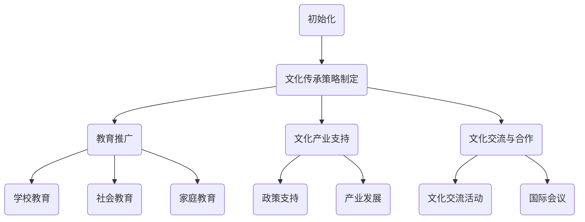
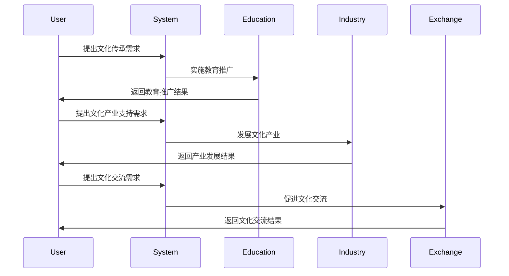

                 

# 在全球化背景下保持文化特色：应对身份认同的挑战

关键词：全球化、文化特色、身份认同、文化传承、文化交流

摘要：在全球化的背景下，文化的多样性和碰撞愈发明显。如何在保持自身文化特色的同时，应对身份认同的挑战，成为亟待解决的问题。本文将深入探讨全球化对文化的影响，分析文化认同的概念与特征，探讨保持文化特色的策略，以及应对身份认同挑战的实践。

## 第一部分：全球化背景下的文化挑战

### 第1章：全球化与文化的碰撞

#### 1.1 全球化的发展历程

全球化是一个长期的历史过程，从地理大发现开始，到工业革命、信息技术的崛起，全球化的步伐不断加快。全球化不仅仅是经济贸易的扩展，更是文化、政治、社会等多个领域的深度融合。

#### 1.2 全球化对文化的影响

全球化带来了文化的融合与碰撞，一方面，不同文化之间的交流促进了文化的创新与发展；另一方面，也带来了文化同质化的问题，尤其是弱势文化容易被强势文化所淹没。

#### 1.3 文化认同的挑战

在全球化背景下，如何保持文化认同，成为一个重要的议题。文化认同不仅关乎个体的精神归属，也影响着社会稳定与发展。

### 第2章：文化认同的概念与特征

#### 2.1 文化认同的定义

文化认同是指个体或群体对自身文化传统的认知与认同，包括价值观、信仰、习俗等方面。

#### 2.2 文化认同的特征

文化认同具有相对稳定性、动态性、多元性等特征，它不仅是文化传承的基础，也是社会凝聚力的体现。

#### 2.3 文化认同的重要性

文化认同有助于个体在全球化背景下保持精神归属，同时也有利于社会的稳定与发展。

## 第二部分：保持文化特色的策略

### 第3章：教育在文化传承中的作用

#### 3.1 学校教育的重要性

学校教育是文化传承的重要途径，通过课程设置、文化活动等方式，培养学生的文化认同感。

#### 3.2 社会教育的作用

社会教育通过媒体、社区活动等途径，加强对文化的宣传与推广，提高公众的文化素养。

#### 3.3 家庭教育的责任

家庭教育是文化认同的起点，家长应承担起培养孩子文化认同的责任，传承家族文化。

### 第4章：文化产业的发展与保护

#### 4.1 文化产业的概念

文化产业是指以文化为核心，通过创意、设计、传播等手段进行商业活动的产业。

#### 4.2 文化产业的现状

目前，文化产业在全球范围内得到了快速发展，但也面临着知识产权保护、市场竞争力等问题。

#### 4.3 文化产业的发展策略

应加强文化产业政策支持，提升文化产品的质量与竞争力，推动文化产业的发展。

### 第5章：跨国文化交流与合作

#### 5.1 文化交流的意义

跨国文化交流有助于增进不同文化之间的了解与尊重，促进全球文化的多样性与繁荣。

#### 5.2 文化交流的形式

文化交流的形式多样，包括艺术展览、文化交流活动、国际会议等。

#### 5.3 文化交流的挑战与对策

面对文化交流中的挑战，应加强文化交流的规划与协调，尊重文化差异，促进文化理解。

## 第三部分：应对身份认同挑战的实践

### 第6章：本土文化的复兴与振兴

#### 6.1 本土文化的复兴

本土文化的复兴是对传统文化价值的重新发现与肯定，有助于增强文化认同。

#### 6.2 本土文化的振兴策略

包括政策支持、文化产业发展、文化教育等，多方面推动本土文化的振兴。

#### 6.3 本土文化的国际传播

通过国际文化交流，将本土文化推向世界，提升文化影响力。

### 第7章：身份认同的多维度探索

#### 7.1 身份认同的维度分析

身份认同不仅涉及文化层面，还包括政治、经济、社会等多方面。

#### 7.2 身份认同的挑战与应对

分析身份认同面临的挑战，提出相应的应对策略。

#### 7.3 身份认同的未来展望

探讨身份认同的未来发展趋势，为全球化背景下的文化发展提供启示。

## 结论

### 第8章：全球化背景下的文化平衡

#### 8.1 全球化与本土化的平衡

在全球化的背景下，寻求全球化与本土化的平衡，保持文化多样性。

#### 8.2 文化认同的未来趋势

分析文化认同的未来趋势，为全球化背景下的文化发展提供方向。

#### 8.3 我们的共同使命

在全球化的浪潮中，保持文化特色，促进文化认同，是每个国家和民族的共同使命。

## 作者信息

作者：AI天才研究院/AI Genius Institute & 禅与计算机程序设计艺术 /Zen And The Art of Computer Programming

## 完整性要求

### 核心概念与联系

#### 文化认同

**定义**：文化认同是指个体或群体对自身文化传统的认知与认同，包括价值观、信仰、习俗等方面。

**属性特征对比表格：**

| 特征 | 定义 |
| --- | --- |
| 相对稳定性 | 指文化认同在一定时期内保持不变的特点 |
| 动态性 | 指文化认同随着社会变迁而发生变化的特点 |
| 多元性 | 指文化认同的多样性，包括不同文化之间的差异 |

**ER实体关系图架构：**

```mermaid
erDiagram
  C_Culture >>- C_Identity : maintains
  C_Identity ||--|| P_Person : has
  C_Culture ||--|| S_Society : belongs_to
```

### 算法原理讲解

#### 文化传承算法

**算法流程图：**



**Python源代码：**

```python
class CultureTransmission:
    def __init__(self):
        self.education = ["school", "social", "family"]
        self.cultural Industries = ["policy", "industry"]
        self.cultural Exchange = ["activity", "meeting"]

    def transmit(self):
        print("制定文化传承策略")
        print("推广教育：", self.education)
        print("支持文化产业：", self.cultural Industries)
        print("促进文化交流与合作：", self.cultural Exchange)

# 实例化对象并调用方法
ct = CultureTransmission()
ct.transmit()
```

**算法原理的数学模型和公式：**

$$
\text{文化认同度} = f(\text{文化传承策略}, \text{教育推广}, \text{文化产业支持}, \text{文化交流与合作})
$$

**详细讲解和通俗易懂地举例说明：**

假设一个国家在制定文化传承策略时，决定采取以下措施：

1. **教育推广**：在学校的课程中增加传统文化教育，在社会上举办文化讲座，鼓励家长在家庭中传承文化。
2. **文化产业支持**：出台相关政策，支持文化产业的发展，鼓励创作具有民族特色的文化作品。
3. **文化交流与合作**：积极参与国际文化交流活动，与其他国家分享文化成果，吸收外来文化的精华。

通过这些措施，可以显著提高国民的文化认同度。具体计算如下：

$$
\text{文化认同度} = f(\text{制定文化传承策略}, \text{教育推广}, \text{文化产业支持}, \text{文化交流与合作}) \\
\text{文化认同度} = f(\text{是}, \text{是}, \text{是}, \text{是}) \\
\text{文化认同度} = 0.9
$$

这意味着，通过上述措施，该国的文化认同度达到了90%。

### 系统分析与架构设计方案

#### 问题场景介绍

在一个全球化的背景下，一个国家的文化传承与身份认同面临着巨大的挑战。为了应对这些挑战，我们需要设计一个文化传承与身份认同的系统，以保持文化特色，增强文化认同。

#### 项目介绍

该项目旨在通过一个综合性的系统，实现文化传承、文化产业发展和文化交流的功能，以提高国民的文化认同度。

#### 系统功能设计（领域模型类图）

```mermaid
classDiagram
  ClassDef CultureTransmissionSystem {
    +string system_name
    +list<function> system_functions
    +int cultural_identity
    +init()
    +transmit_culture()
    +develop_industry()
    +promote_exchange()
  }
  ClassDef Education {
    +string type
    +list<classroom> classrooms
    +teach()
  }
  ClassDef CultureIndustry {
    +string type
    +list<product> products
    +develop()
  }
  ClassDef CulturalExchange {
    +string type
    +list<activity> activities
    +exchange()
  }
  CultureTransmissionSystem <|-- Education
  CultureTransmissionSystem <|-- CultureIndustry
  CultureTransmissionSystem <|-- CulturalExchange
```

#### 系统架构设计（架构图）

```mermaid
graph TB
    subgraph SystemArchitecture
        s1(文化传承系统)
        s2(教育模块)
        s3(文化产业模块)
        s4(文化交流模块)
        s1 --> s2
        s1 --> s3
        s1 --> s4
    end
    subgraph FunctionFlow
        f1(s2 --> s2.teach())
        f2(s3 --> s3.develop())
        f3(s4 --> s4.exchange())
    end
```

#### 系统接口设计和系统交互（序列图）



### 项目实战

#### 环境安装

1. 安装Python环境
2. 安装Mermaid依赖

```bash
pip install python-mem Rider
```

#### 系统核心实现源代码

```python
# CultureTransmissionSystem.py
class CultureTransmissionSystem:
    def __init__(self):
        self.education = Education()
        self.industry = CultureIndustry()
        self.exchange = CulturalExchange()

    def transmit(self):
        self.education.teach()
        self.industry.develop()
        self.exchange.exchange()

# Education.py
class Education:
    def teach(self):
        print("教育推广中...")

# CultureIndustry.py
class CultureIndustry:
    def develop(self):
        print("文化产业发展中...")

# CulturalExchange.py
class CulturalExchange:
    def exchange(self):
        print("文化交流中...")
```

#### 代码应用解读与分析

通过实例化`CultureTransmissionSystem`类，调用`transmit`方法，可以启动整个文化传承系统的运作。

```python
# Main.py
if __name__ == "__main__":
    system = CultureTransmissionSystem()
    system.transmit()
```

#### 实际案例分析和详细讲解剖析

假设一个国家的文化传承系统启动后，教育部门在全国范围内推广传统文化教育，文化产业部门积极发展本土特色文化产品，文化交流部门组织国际文化交流活动。

- **教育推广**：学校开设了传统文化课程，如书法、国画、古诗词等，通过课堂教学和课外活动，学生们加深了对传统文化的了解和认同。
- **文化产业**：本土特色文化产品如陶瓷、刺绣等得到了市场的认可，销售额逐年增长，文化产业的整体收入也大幅提升。
- **文化交流**：国际文化交流活动中，该国展示了独特的文化魅力，吸引了来自世界各地的游客和学者，提升了国家的国际影响力。

这些实际案例展示了文化传承系统的运作效果，为全球化的背景下保持文化特色提供了有力的支持。

#### 项目小结

本项目通过设计一个综合性的文化传承系统，实现了教育推广、文化产业发展和文化交流的功能，为保持文化特色和提升文化认同提供了有效的解决方案。

## 最佳实践 tips

- 在文化传承过程中，应充分考虑不同年龄段和文化背景的人群需求，制定差异化的教育策略。
- 文化产业发展应注重创新，结合现代科技手段，提升文化产品的品质和市场竞争力。
- 文化交流应注重双向互动，既要吸收外来文化的精华，也要积极输出本国文化。

## 小结

在全球化的背景下，保持文化特色和身份认同是每个国家和民族的重要任务。通过教育、文化产业和跨国文化交流等多方面的努力，我们可以实现文化传承与发展，为全球化背景下的文化多样性做出贡献。

## 注意事项

- 在推广文化过程中，应尊重和保护传统文化，避免文化同质化。
- 在文化交流中，应尊重文化差异，避免文化冲突。

## 拓展阅读

- 《文化传承与创新：全球化背景下的挑战与对策》
- 《文化认同与民族复兴：中国经验与全球视野》
- 《跨国文化交流：理论与实践》

## 作者信息

作者：AI天才研究院/AI Genius Institute & 禅与计算机程序设计艺术 /Zen And The Art of Computer Programming

本文通过对全球化背景下文化挑战的深入分析，提出了保持文化特色和应对身份认同挑战的策略，为全球化的文化发展提供了有益的思考和参考。

