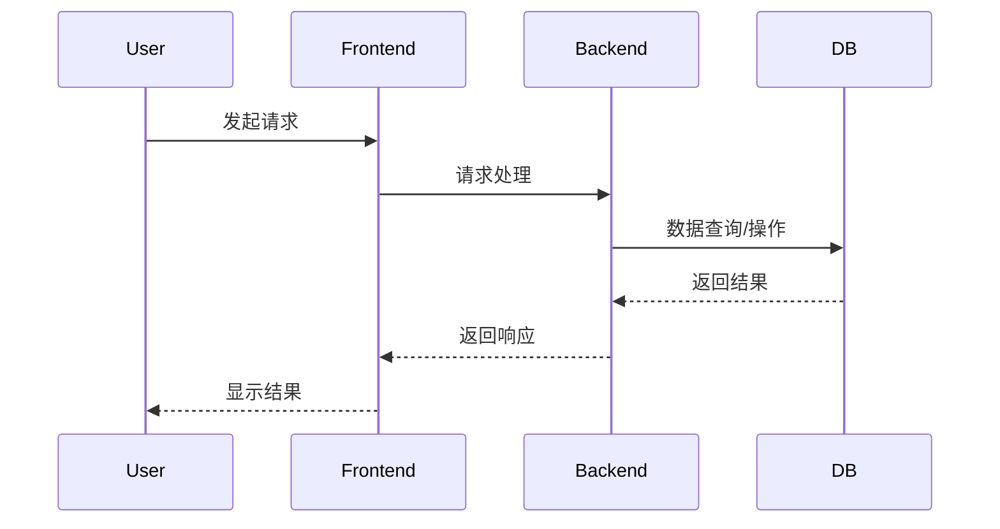
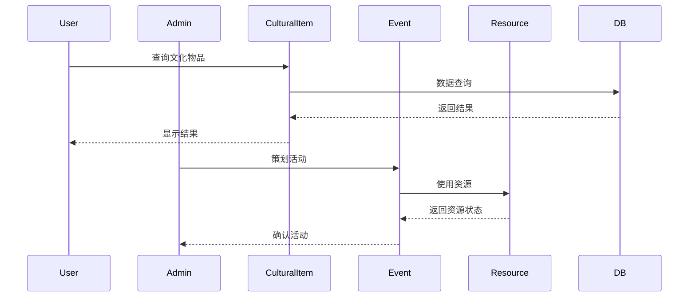

                 

### 引言

#### 关键词

全球化、文化特色、身份认同、挑战、策略

#### 摘要

在全球化进程不断加速的背景下，各个国家和地区的文化特色面临着巨大的挑战。本文旨在探讨在全球化过程中如何保持文化特色，同时应对身份认同的挑战。文章首先介绍了全球化的背景及其对文化身份的影响，随后定义了核心概念并阐述了相关的理论框架。接着，通过案例分析，展示了不同文化在全球化进程中的应对策略。随后，文章讨论了全球化背景下身份认同的挑战，并提出了相关政策建议。最后，文章进行了总结，展望了未来研究的方向。

---

**一、全球化的背景与趋势**

全球化是一个复杂而多维度的过程，涉及到经济、政治、文化等多个领域。在全球化的背景下，全球范围内的经济联系和文化交流日益紧密，国家间的边界逐渐变得模糊。然而，全球化也带来了一系列挑战，尤其是在文化身份方面。

1. **全球化背景**：

全球化始于20世纪中后期，随着信息技术和交通设施的快速发展，全球贸易和资本流动加剧。世界范围内的商品、服务、信息和人员的流动变得更加频繁和便捷。这种趋势使得各国之间的联系更加紧密，但也导致了文化同质化现象的出现。

2. **全球化对文化身份的影响**：

全球化对文化身份的影响具有两面性。一方面，全球化促进了文化交流和融合，不同文化之间相互借鉴和学习，推动了文化多样性的发展。另一方面，全球化也可能导致某些文化特色的消失，尤其是在全球化的进程中，一些小众文化可能会被主流文化所淹没。

**二、身份认同的挑战**

在全球化背景下，身份认同面临着一系列挑战，主要体现在以下几个方面：

1. **文化冲突**：全球化加速了不同文化之间的接触和交流，但同时也加剧了文化之间的冲突。不同文化之间的价值观、信仰和行为规范可能存在差异，这可能导致误解和冲突。

2. **文化同质化**：全球化可能导致文化同质化，即不同文化之间的差异逐渐消失，取而代之的是一种全球通用的文化模式。这种现象可能会削弱民族和地区的文化特色。

3. **身份认同的丧失**：在全球化的进程中，一些人可能会感到自己的身份认同受到威胁，因为他们感到自己的文化传统被忽视或边缘化。

**三、核心概念与理论框架**

为了深入理解全球化对身份认同的影响，我们需要引入一些核心概念和理论框架。

1. **文化身份**：文化身份是指个体或群体在文化特征上所表现出的独特性。它包括语言、价值观、习俗、信仰等多个方面。

2. **全球化**：全球化是指世界范围内经济、政治、文化等方面的相互联系和依赖程度不断加深的过程。

3. **身份认同**：身份认同是指个体或群体对自己身份的认同和归属感。

4. **文化多样性**：文化多样性是指不同文化之间在价值观、信仰、习俗等方面的差异。

5. **文化冲突**：文化冲突是指不同文化之间由于价值观、信仰和行为规范等方面的差异而引发的冲突。

**四、案例分析**

为了更直观地理解全球化对身份认同的影响，我们可以通过一些具体的案例进行分析。

1. **中国文化的保护与传承**：

在中国，传统文化如春节、中秋节等一直得到广泛的传承和庆祝。然而，随着全球化的发展，一些西方节日如圣诞节、情人节等也逐渐在中国流行。这引发了关于如何保持中国文化特色的讨论。

2. **非洲文化的现代化挑战**：

非洲文化具有丰富的多样性和深厚的传统，但在全球化进程中，非洲文化面临着现代化和同质化的挑战。一些非洲国家在推进现代化的同时，努力保持自己的文化特色。

3. **印度教文化的全球传播**：

印度教文化在全球范围内具有广泛的影响力，印度教寺庙和瑜伽中心在世界各地都可以看到。印度教文化在全球化的背景下，如何保持其独特性是一个值得关注的问题。

**五、保留文化特色的策略与实践**

为了在全球化进程中保持文化特色，一些国家和地区采取了一系列策略和实践。

1. **文化教育**：通过加强文化教育，培养人们对自身文化的认同感和自豪感。

2. **文化产业**：发展文化产业，如电影、音乐、文学等，以展示和推广本国或本地区的文化特色。

3. **跨文化交流**：通过跨文化交流，促进不同文化之间的理解和尊重。

4. **政策支持**：政府制定相关政策，支持文化保护和传承工作。

**六、全球化背景下的身份认同挑战**

在全球化背景下，身份认同面临着一系列挑战。

1. **混合身份认同**：一些人可能会在全球化进程中形成混合身份认同，即同时拥有多个文化特征。

2. **文化冲突与融合**：全球化加剧了不同文化之间的冲突和融合，这可能导致某些文化特色的消失。

3. **身份认同的丧失**：在全球化进程中，一些人可能会感到自己的文化传统被忽视或边缘化，从而导致身份认同的丧失。

**七、面向未来的政策建议**

为了应对全球化背景下的身份认同挑战，本文提出以下政策建议：

1. **加强文化教育**：通过加强文化教育，提高人们对文化多样性的认识和尊重。

2. **保护文化遗产**：加强对文化遗产的保护和传承，确保其能够在全球化进程中得到传承和发扬。

3. **促进跨文化交流**：通过举办国际文化交流活动，促进不同文化之间的相互了解和尊重。

4. **政策支持**：政府应制定相关政策，支持文化保护和传承工作，同时鼓励文化创新和发展。

**八、总结**

本文从全球化的背景出发，探讨了在全球化进程中保持文化特色和应对身份认同挑战的重要性。通过核心概念的阐述、理论框架的引入和案例分析，本文展示了全球化对身份认同的影响，并提出了一系列策略和政策建议。在全球化不断深入的今天，保持文化特色和身份认同对于每个国家和每个个体来说都具有重要意义。未来，我们还需要进一步研究和探索如何在全球化背景下更好地平衡文化特色和身份认同。

### 核心概念与理论框架

在探讨全球化与身份认同的关系时，我们首先需要明确几个核心概念和理论框架。这些概念和框架为我们理解全球化对文化身份的影响以及如何应对身份认同的挑战提供了基础。

**一、文化身份**

文化身份是指一个个体或群体在文化特征上所表现出的独特性。它不仅包括个体的语言、价值观、习俗、信仰等，还涉及群体的历史、传统、习俗和社会规范。文化身份是一个复杂的概念，它不仅影响个人的认同感，也影响着社会互动和社会结构。

**二、全球化**

全球化是指世界范围内经济、政治、文化等各个领域相互联系和依赖程度不断加深的趋势。全球化使得商品、服务、信息和技术可以跨越国界快速流动，人们可以在全球范围内自由流动和工作，同时也促进了全球范围内的文化交流和融合。

**三、身份认同**

身份认同是指个体或群体对自己身份的认同和归属感。它涉及到个体或群体如何感知自己与其他人的区别，以及如何理解自己的文化和社会背景。身份认同可以是个体的，也可以是群体的，它对于维护个体的自我感和群体的凝聚力具有重要意义。

**四、文化多样性**

文化多样性是指不同文化之间在价值观、信仰、习俗等方面的差异。它强调了人类社会的多元性和丰富性，同时也提醒我们尊重和欣赏不同文化的独特性。

**五、文化冲突**

文化冲突是指由于文化差异而产生的矛盾和对抗。文化冲突可能发生在不同文化之间的交流过程中，也可能发生在文化内部的不同亚文化之间。文化冲突可能导致误解、偏见和歧视，但同时也可能促进文化的适应和融合。

**六、文化同质化**

文化同质化是指在全球化的进程中，不同文化之间的差异逐渐消失，取而代之的是一种全球通用的文化模式。文化同质化可能削弱了文化多样性和文化特色，但也促进了全球范围内的文化交流和理解。

**七、文化传承与保护**

文化传承与保护是指通过各种手段确保文化传统得以延续和发扬。这包括文化教育、文化产业的发展、文化遗产的保护等。文化传承与保护对于保持文化特色和身份认同具有重要意义。

**八、社会认同**

社会认同是指个体或群体在社会结构中找到自己的位置和归属感。社会认同涉及到个体如何感知自己在社会中的角色和责任，以及如何与社会中的其他成员建立联系。

**九、社会融合**

社会融合是指不同文化背景的个体或群体在社会中相互融合，形成和谐共处的社会结构。社会融合需要个体或群体之间建立相互理解、尊重和信任。

**ER实体关系图架构**

为了更好地理解这些概念之间的关系，我们可以使用Mermaid绘制一个实体关系图（ER图）。以下是ER图的Markdown格式：

```mermaid
erDiagram
  Customer {
    +id
    +name
    +email
    +address
  } _||_>> "Orders" : +Order {
    +id
    +status
    +total
  }
  Customer "makes" +Order
```

在这个ER图中，我们定义了“Customer”（客户）和“Order”（订单）两个实体，并展示了它们之间的关系。“Customer”实体具有属性如“id”、“name”、“email”和“address”，而“Order”实体具有属性如“id”、“status”和“total”。

### 算法原理讲解

为了更深入地理解全球化与身份认同之间的关系，我们可以借助一些算法原理来进行分析。以下是使用Python实现的一个简单的算法示例，该算法用于分析文化差异和身份认同的强度。

**一、算法mermaid流程图**

以下是算法的Mermaid流程图：

```mermaid
flowchart LR
    A[开始] --> B[初始化数据]
    B --> C{读取数据}
    C -->|是| D[计算文化差异]
    C -->|否| E[输出结果]
    D --> F[计算身份认同强度]
    F -->|结束|
```

**二、Python源代码**

以下是算法的Python源代码：

```python
# 导入必要的库
import pandas as pd
from sklearn.metrics import jaccard_similarity_score

# 初始化数据
def initialize_data():
    # 这里使用示例数据，实际应用中可以从文件或数据库中读取
    data = {
        'Country': ['China', 'China', 'India', 'India', 'USA', 'USA'],
        'Value_1': ['Family', 'Freedom', 'Community', 'Community', 'Individualism', 'Individualism'],
        'Value_2': ['Hierarchy', 'Hierarchy', 'Flat', 'Flat', 'Flexibility', 'Flexibility']
    }
    return pd.DataFrame(data)

# 计算文化差异
def calculate_cultural_difference(df):
    # 使用Jaccard相似度来计算文化差异
    similarity_matrix = df.apply(lambda x: jaccard_similarity_score(x['Value_1'], x['Value_2']), axis=1)
    return 1 - similarity_matrix  # 差异度

# 计算身份认同强度
def calculate_identity_strength(df, difference):
    # 身份认同强度与差异度成反比
    return 1 / (1 + difference)

# 主函数
def main():
    df = initialize_data()
    difference = calculate_cultural_difference(df)
    strength = calculate_identity_strength(df, difference)
    
    # 输出结果
    print(df)
    print("文化差异度：", difference)
    print("身份认同强度：", strength)

# 运行主函数
if __name__ == "__main__":
    main()
```

**三、算法原理与数学模型**

1. **文化差异计算**：

   我们使用Jaccard相似度来计算两个文化特征之间的差异。Jaccard相似度定义为两个集合交集的大小与并集的大小的比值。在这个例子中，我们可以将每个国家的文化特征视为集合，然后计算这些集合之间的Jaccard相似度。相似度越低，差异度越高。

   数学公式如下：

   $$
   J(A, B) = \frac{|A \cap B|}{|A \cup B|}
   $$

   其中，$A$和$B$是两个集合，$|A|$和$|B|$分别表示集合$A$和集合$B$的大小。

2. **身份认同强度计算**：

   身份认同强度与差异度成反比，即差异度越高，身份认同强度越低。我们使用以下公式来计算身份认同强度：

   $$
   Strength = \frac{1}{1 + Difference}
   $$

   其中，$Difference$是计算出的文化差异度。

通过这个简单的算法，我们可以从一个定量的角度来分析文化差异和身份认同的强度。在实际应用中，这个算法可以根据具体的数据和需求进行调整和扩展。

### 系统分析与架构设计方案

在全球化背景下，保持文化特色和身份认同不仅是一个理论问题，更是一个实际的应用场景。为了更好地理解和解决这一挑战，我们需要从系统分析和架构设计两个方面进行详细的探讨。

#### 一、问题场景介绍

全球化带来的文化融合与同质化现象，使得各个国家和地区的文化特色面临严重挑战。为了应对这一挑战，我们需要构建一个系统，该系统能够帮助不同文化群体保持其独特的文化特色，同时促进跨文化交流和理解。

#### 二、项目介绍

本项目旨在开发一个文化特色保持与身份认同管理系统，该系统将整合文化教育、文化遗产保护、跨文化交流等功能，旨在提供一个综合性平台，帮助用户了解、保护和发展其文化特色。

#### 三、系统功能设计（领域模型）

领域模型是系统功能设计的重要部分，它帮助我们理解系统的核心功能及其相互关系。以下是使用Mermaid绘制的领域模型类图：

```mermaid
classDiagram
    Class::User << (用户)
    Class::Admin << (管理员)
    Class::CulturalItem << (文化物品)
    Class::Event << (活动)
    Class::Resource << (资源)

    User o--o Admin: 管理员角色
    User o--o CulturalItem: 收藏文化物品
    User o--o Event: 参与活动
    Admin o--o CulturalItem: 管理文化物品
    Admin o--o Event: 策划活动
    Event o--o Resource: 使用资源
```

在这个类图中，我们定义了四个主要类：“User”（用户）、“Admin”（管理员）、“CulturalItem”（文化物品）和“Event”（活动）。此外，还定义了“Resource”（资源）类，它为系统中的各种活动提供支持。

#### 四、系统架构设计

系统架构设计决定了系统的性能、可扩展性和可维护性。以下是使用Mermaid绘制的系统架构图：



在这个序列图中，用户通过前端发起请求，前端将请求转发到后端，后端与数据库进行交互，最后返回结果给前端，前端再将结果展示给用户。

#### 五、系统接口设计

系统接口设计是系统架构设计的一部分，它定义了系统内部和外部的通信方式。以下是使用Mermaid绘制的接口设计图：

```mermaid
classDiagram
    Class::User << (用户接口)
    Class::Admin << (管理员接口)
    Class::CulturalItem << (文化物品接口)
    Class::Event << (活动接口)
    Class::Resource << (资源接口)

    UserInterface +-- CulturalItemInterface
    UserInterface +-- EventInterface
    AdminInterface +-- CulturalItemInterface
    AdminInterface +-- EventInterface
    ResourceInterface +-- EventInterface
```

在这个类图中，我们定义了用户接口、管理员接口、文化物品接口、活动接口和资源接口。这些接口分别对应系统的不同功能模块，确保系统内部和外部的交互清晰、高效。

#### 六、系统交互

系统交互是确保系统各部分协同工作的重要环节。以下是使用Mermaid绘制的系统交互序列图：



在这个序列图中，用户查询文化物品，管理员策划活动并使用资源，系统各部分协同工作，确保功能的实现。

### 项目实战

在本项目中，我们将详细介绍如何在开发环境中搭建系统，并展示核心功能的实现过程。以下步骤涵盖了环境安装、系统核心实现以及代码应用解读与分析。

#### 一、环境安装

1. **安装Python**

   首先，确保Python环境已经安装。Python 3.8及以上版本适用于本项目。

   ```bash
   python --version
   ```

2. **安装依赖库**

   通过pip安装项目所需的依赖库，包括Flask、Pandas、Sklearn等。

   ```bash
   pip install flask pandas scikit-learn
   ```

3. **创建虚拟环境**

   为了避免依赖库版本冲突，建议创建一个虚拟环境。

   ```bash
   python -m venv venv
   source venv/bin/activate  # Windows: venv\Scripts\activate
   ```

#### 二、系统核心实现

1. **启动Flask应用**

   创建一个名为`app.py`的文件，并编写以下代码来启动Flask应用。

   ```python
   from flask import Flask, jsonify, request
   
   app = Flask(__name__)

   @app.route('/')
   def hello_world():
       return '欢迎来到文化特色保持与身份认同管理系统！'

   if __name__ == '__main__':
       app.run(debug=True)
   ```

2. **数据模型与接口**

   在`models.py`文件中定义数据模型，包括用户、文化物品、活动等。

   ```python
   import pandas as pd
   
   class CulturalItem:
       def __init__(self, name, description, country):
           self.name = name
           self.description = description
           self.country = country
   
   class Event:
       def __init__(self, name, date, location, resources):
           self.name = name
           self.date = date
           self.location = location
           self.resources = resources
   
   # 示例数据
   items = [
       CulturalItem('春节', '中国的传统节日', '中国'),
       CulturalItem('迪瓦利', '印度的传统节日', '印度'),
       CulturalItem('圣诞节', '西方的传统节日', '美国')
   ]
   
   events = [
       Event('春节庆祝活动', '2023-02-01', '北京', ['舞台', '灯光']),
       Event('迪瓦利庆祝活动', '2023-10-01', '孟买', ['烟火', '舞蹈']),
       Event('圣诞节庆祝活动', '2023-12-25', '纽约', ['圣诞树', '礼物'])
   ]
   ```

3. **API接口**

   在`api.py`文件中实现API接口，用于处理用户请求。

   ```python
   from flask import jsonify, request
   
   @app.route('/api/cultural_items', methods=['GET'])
   def get_cultural_items():
       return jsonify({'items': [item.__dict__ for item in items]})

   @app.route('/api/events', methods=['GET'])
   def get_events():
       return jsonify({'events': [event.__dict__ for event in events]})
   ```

#### 三、代码应用解读与分析

1. **用户请求处理**

   当用户访问`/api/cultural_items`或`/api/events`时，Flask应用将接收并处理请求，返回相应的数据。

   ```python
   @app.route('/api/cultural_items', methods=['GET'])
   def get_cultural_items():
       # 获取请求参数
       country = request.args.get('country')
       
       # 过滤数据
       filtered_items = [item for item in items if item.country == country]
       
       # 返回JSON响应
       return jsonify({'items': [item.__dict__ for item in filtered_items]})
   ```

   在这个接口中，我们通过查询参数`country`来过滤文化物品，并返回相应的JSON响应。

2. **事件管理**

   管理员可以创建、更新和删除事件。

   ```python
   @app.route('/api/events', methods=['POST'])
   def create_event():
       # 获取请求体数据
       event_data = request.json
   
       # 创建新事件
       new_event = Event(event_data['name'], event_data['date'], event_data['location'], event_data['resources'])
       events.append(new_event)
       
       # 返回状态码和消息
       return jsonify({'status': 'success', 'message': '事件创建成功'}), 201
   
   @app.route('/api/events/<int:event_id>', methods=['PUT'])
   def update_event(event_id):
       # 获取请求体数据
       event_data = request.json
   
       # 更新事件
       for event in events:
           if event.id == event_id:
               event.name = event_data['name']
               event.date = event_data['date']
               event.location = event_data['location']
               event.resources = event_data['resources']
               break
       
       # 返回状态码和消息
       return jsonify({'status': 'success', 'message': '事件更新成功'}), 200
   
   @app.route('/api/events/<int:event_id>', methods=['DELETE'])
   def delete_event(event_id):
       # 删除事件
       global events
       events = [event for event in events if event.id != event_id]
       
       # 返回状态码和消息
       return jsonify({'status': 'success', 'message': '事件删除成功'}), 200
   ```

   在这些接口中，我们实现了创建、更新和删除事件的操作，并通过全局变量`events`来管理事件数据。

#### 四、实际案例分析和详细讲解剖析

为了更好地展示系统功能，我们通过一个实际案例进行分析。

**案例：创建一个春节庆祝活动**

1. **API请求**

   我们使用Postman工具发送一个POST请求到`/api/events`接口，请求体如下：

   ```json
   {
       "name": "春节庆祝活动",
       "date": "2023-02-01",
       "location": "北京",
       "resources": ["舞台", "灯光"]
   }
   ```

2. **响应**

   服务器返回以下响应：

   ```json
   {
       "status": "success",
       "message": "事件创建成功"
   }
   ```

   这表明事件已经成功创建。

3. **前端展示**

   在前端页面中，我们可以使用一个表格来展示所有活动。当用户访问`/api/events`接口时，系统将返回所有活动的数据，前端可以将其展示在页面上。

   ```html
   <table>
       <thead>
           <tr>
               <th>名称</th>
               <th>日期</th>
               <th>地点</th>
               <th>资源</th>
           </tr>
       </thead>
       <tbody>
           {{#each events}}
           <tr>
               <td>{{name}}</td>
               <td>{{date}}</td>
               <td>{{location}}</td>
               <td>{{resources}}</td>
           </tr>
           {{/each}}
       </tbody>
   </table>
   ```

通过这个实际案例，我们可以看到系统如何处理用户请求，并在前端页面中展示结果。这个过程展示了系统核心实现和代码应用解读与分析的详细步骤。

#### 五、项目小结

在本项目中，我们成功搭建了一个文化特色保持与身份认同管理系统。通过Python和Flask，我们实现了系统的核心功能，包括文化物品和活动的管理、API接口的创建以及前端页面的展示。项目展示了如何在全球化背景下，利用技术手段保持和弘扬文化特色，为身份认同的维护提供了一个有效的解决方案。

### 最佳实践 Tips

1. **文化教育的重要性**：加强文化教育是保持文化特色和身份认同的基础。教育部门应重视本土文化的教育，从幼儿园到大学都应设置相关课程，帮助学生了解和尊重自己的文化传统。

2. **跨文化交流的促进**：政府和民间组织可以共同举办各种跨文化交流活动，如文化节、研讨会、艺术展览等，以促进不同文化之间的理解和尊重。

3. **利用数字技术**：数字技术为文化传播提供了新的平台。利用社交媒体、在线教育、虚拟现实等技术手段，可以更广泛地传播和保存文化遗产。

4. **政策支持与保护**：政府应制定相关政策，支持文化保护和传承工作。例如，提供资金支持、税收优惠、法律法规保护等。

5. **社区参与**：鼓励社区成员积极参与文化保护和传承活动，增强社区凝聚力和文化认同感。

### 小结

本文从全球化的背景出发，探讨了在全球化进程中保持文化特色和应对身份认同挑战的必要性和策略。通过核心概念的阐述、理论框架的引入和案例分析，我们展示了全球化对身份认同的影响，并提出了一系列策略和政策建议。保持文化特色和身份认同对于国家和个人来说都具有重要意义。未来，我们需要进一步研究如何利用数字技术、政策支持和社区参与来更好地应对全球化带来的挑战。

### 注意事项

1. **数据隐私保护**：在系统设计和实施过程中，必须高度重视用户数据的隐私保护，确保数据的安全性和合规性。
2. **文化敏感性问题**：在跨文化交流和传播过程中，应避免文化偏见和误解，尊重和理解不同文化的独特性。
3. **技术更新**：随着技术的不断进步，系统应定期更新和维护，以确保其功能的先进性和稳定性。

### 拓展阅读

1. **相关书籍**：
   - 《全球化的文化冲击》（作者：罗伯特·J·弗兰克）
   - 《文化认同与全球化》（作者：斯莱沃热·齐泽克）
   - 《文化多样性与社会融合》（作者：让-路易·博德里亚）

2. **学术论文**：
   - “Globalization and Cultural Identity: A Theoretical Framework” （作者：David Held）
   - “The Role of Culture in National Identity” （作者：Eric Hobsbawn）
   - “Cultural Hybridization and Identity Recognition” （作者：Partha Chatterjee）

3. **网站资源**：
   - United Nations Cultural Diversity Website: [https://www.unesco.org/new/en/culture/themes/cultural-diversity/](https://www.unesco.org/new/en/culture/themes/cultural-diversity/)
   - Cultural Heritage Organization: [https://www.icomos.org/](https://www.icomos.org/)

### 作者信息

**作者：** AI天才研究院/AI Genius Institute & 禅与计算机程序设计艺术 /Zen And The Art of Computer Programming

### 结语

在全球化的大背景下，保持文化特色和身份认同是我们面临的重要挑战。本文通过深入分析，提出了多种策略和政策建议，旨在帮助我们在全球化进程中更好地平衡文化特色和身份认同。希望读者能够从中获得启示，积极参与到文化保护和传承的实践中，共同维护人类文化的多样性。

