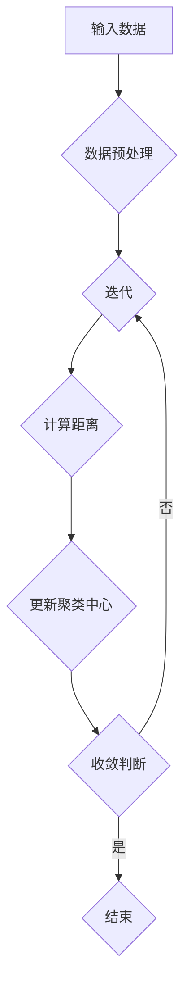
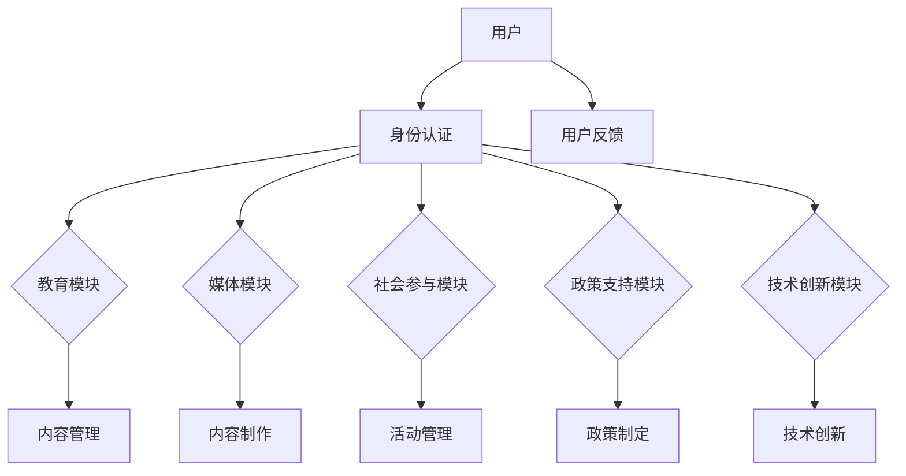
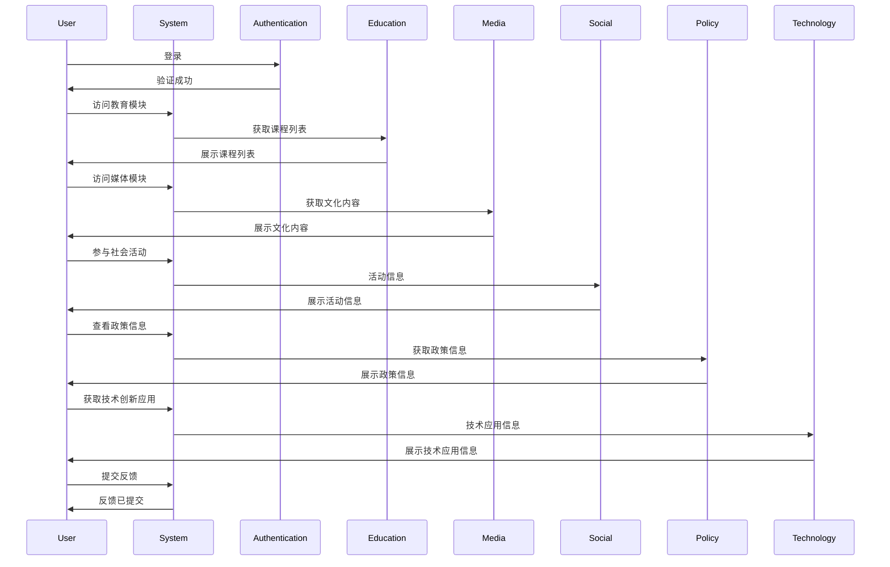

                 

# 在全球化背景下维护文化认同：应对身份危机的新策略

关键词：全球化、文化认同、身份危机、文化教育、媒体策略、社会参与、政策支持、技术创新

摘要：在全球化的浪潮中，文化的交融与碰撞不可避免地带来了文化认同的危机和身份的困惑。本文旨在探讨全球化背景下维护文化认同的新策略，通过文化教育、媒体策略、社会参与、政策支持和技术创新等多方面的分析，提出综合性的应对措施，以帮助个人和社会在全球化进程中保持文化认同，应对身份危机。

----------------------------------------------------------------

## 第一部分：全球化背景下的文化认同与身份危机

### 第1章：全球化背景下的文化认同

#### 1.1 文化认同的定义与重要性

**文化认同**是指个体或群体对于自己所属文化的认可和归属感。它不仅包含了文化知识的传承，还包括了对文化价值观、习俗和传统的认同。

- **定义**：文化认同是个人和社会共同体的精神纽带，它定义了个体在社会中的位置和角色。
- **重要性**：文化认同对于社会稳定、民族凝聚力以及个体心理健康都具有重要影响。

#### 1.2 全球化对文化认同的影响

- **全球化背景**：全球化是一个经济、文化、政治和社会相互联系的全球性过程，它通过信息技术、跨国公司和国际贸易等途径加速了不同文化之间的交流。
- **影响**：全球化促进了文化的多样性和互动，但同时也对本土文化构成了挑战，可能导致文化认同的减弱。

#### 1.3 身份危机与自我认同的关系

- **身份危机**：指个体在面临文化冲击时，对自己文化身份的质疑和困惑。
- **关系**：身份危机通常与自我认同的丧失有关，它可能导致文化认同的危机。

#### 1.4 本章小结

在全球化的背景下，文化认同面临着前所未有的挑战。为了维护文化认同，我们需要深入理解全球化对文化认同的影响，以及身份危机与自我认同的关系。

----------------------------------------------------------------

## 第二部分：全球化背景下文化认同的维护策略

### 第2章：文化教育策略

#### 2.1 文化教育的重要性

**文化教育**是指通过教育系统传授文化知识、价值观和传统的过程。它是维护文化认同的重要手段。

- **概念**：文化教育是一种有意识、有计划、有组织地传递和强化文化认同的过程。
- **角色**：文化教育在文化认同维护中发挥着关键作用，它能够增强个体的文化归属感和自豪感。

#### 2.2 文化教育的实践方法

- **家庭文化教育**：家庭是文化传承的第一课堂，父母的行为和言谈对孩子文化认同的建立具有重要影响。
- **学校文化教育**：学校是文化教育的主阵地，课程设置和文化活动对于学生的文化认同至关重要。
- **社会文化教育**：社会文化教育包括公共文化设施、社区活动和民间组织等，它能够促进全社会文化认同的形成。

#### 2.3 文化教育的挑战与应对策略

- **挑战**：文化教育的挑战包括教育资源的不均衡、文化多样性的处理等。
- **应对策略**：通过政策支持、教育资源优化和文化交流等方式，可以有效地应对文化教育的挑战。

#### 2.4 本章小结

文化教育是维护文化认同的基础性工作。通过家庭、学校和社区等多方面的努力，我们可以有效地传递和强化文化认同，从而应对全球化带来的挑战。

----------------------------------------------------------------

### 第3章：媒体与文化认同

#### 3.1 媒体对文化认同的影响

**媒体**是文化传播的主要载体，它对文化认同的形成和变化具有深远的影响。

- **作用**：媒体通过报道、评论和节目等形式，塑造公众对文化现象的认知和态度，从而影响文化认同。
- **影响**：媒体的影响不仅限于文化内容的传递，还包括文化价值观的塑造。

#### 3.2 媒体策略在文化认同维护中的应用

- **内容制作与传播**：媒体应制作更多反映本土文化、弘扬民族精神的内容，并通过多样化的传播渠道推广。
- **案例分析**：例如，某国的国家电视台通过制作一系列反映本土文化和历史的纪录片，成功提升了公众的文化认同感。

#### 3.3 媒体对文化认同的挑战与对策

- **挑战**：媒体对文化认同的挑战包括文化同质化、外来文化的冲击等。
- **对策与建议**：通过政策引导、文化多样性宣传和媒体自律等方式，可以应对这些挑战。

#### 3.4 本章小结

媒体在维护文化认同中具有重要作用。通过合理的媒体策略，我们可以更好地传承和弘扬本土文化，增强文化认同感。

----------------------------------------------------------------

### 第4章：社会参与与文化交流

#### 4.1 社会参与在文化认同维护中的作用

**社会参与**是指个体和群体在社会事务中的积极参与。它在文化认同维护中扮演着重要角色。

- **概念**：社会参与是一种社会行为，它包括志愿服务、社区活动、文化节日参与等。
- **角色**：社会参与能够增强个体的社会责任感和文化认同感。

#### 4.2 国际文化交流策略

**国际文化交流**是指不同国家之间的文化交流活动。它有助于增进相互理解和尊重，促进文化认同的多元化。

- **重要性**：国际文化交流能够丰富个体的文化体验，提升文化认同的多样性。
- **方法**：包括国际文化节、艺术展览、学术交流等。

#### 4.3 社会参与与文化交流的案例分析

- **成功案例**：例如，某国通过举办国际文化节，成功吸引了国内外游客，提升了国家的文化认同感。
- **失败案例**：例如，某国在国际文化交流中忽视本土文化的特点，导致文化认同的减弱。

#### 4.4 本章小结

社会参与与文化交流是维护文化认同的重要途径。通过积极的国际文化交流和有效的社会参与，我们可以促进文化认同的多元化和发展。

----------------------------------------------------------------

### 第5章：政策支持与制度保障

#### 5.1 政策支持在文化认同维护中的角色

**政策支持**是指政府通过制定政策和法规来保护和弘扬本土文化。它在文化认同维护中发挥着关键作用。

- **概念**：政策支持包括文化保护政策、文化产业发展政策、文化遗产保护政策等。
- **角色**：政策支持能够提供制度保障，促进文化认同的传承和发展。

#### 5.2 制度保障在文化认同维护中的重要性

**制度保障**是指通过法律、制度和组织结构来保护文化认同。它在文化认同维护中具有基础性作用。

- **概念**：制度保障包括文化教育制度、文化遗产保护制度、文化交流制度等。
- **作用**：制度保障能够提供稳定的环境，保障文化认同的持续发展。

#### 5.3 政策与制度的实施与效果评估

- **实施**：政策与制度的实施需要各级政府和相关部门的共同努力。
- **效果评估**：通过定期评估，可以及时发现政策与制度的不足，进行改进和完善。

#### 5.4 本章小结

政策支持和制度保障是维护文化认同的重要保障。通过有效的政策与制度，我们可以为文化认同的传承和发展提供坚实的基础。

----------------------------------------------------------------

### 第6章：技术创新与文化认同

#### 6.1 技术创新在文化认同维护中的作用

**技术创新**是指通过技术手段创新文化传承和传播的方式。它在文化认同维护中具有重要的应用价值。

- **作用**：技术创新能够提高文化内容的传播效率，增强文化认同的传递效果。
- **应用**：包括数字化文化遗产保护、虚拟现实文化体验、在线文化教育等。

#### 6.2 技术创新的应用与实践

- **案例分析**：例如，某国利用虚拟现实技术重建历史文化遗产，为公众提供了沉浸式的文化体验。
- **实践探讨**：技术创新在文化认同维护中的具体实践方法和发展方向。

#### 6.3 技术创新对文化认同的挑战与对策

- **挑战**：技术创新可能带来文化同质化和文化消失的风险。
- **对策与建议**：通过技术规范、文化融合策略和科技创新等方式，可以应对这些挑战。

#### 6.4 本章小结

技术创新在文化认同维护中具有重要作用。通过合理利用技术创新，我们可以更好地保护和传承文化，增强文化认同感。

----------------------------------------------------------------

### 第7章：综合策略与未来展望

#### 7.1 综合策略的提出

**综合策略**是指通过多方面、多层次的努力，全面维护文化认同。它包括文化教育、媒体策略、社会参与、政策支持和技术创新等。

- **概念**：综合策略是一种系统性的文化认同维护方法。
- **实施**：通过各方的协同合作，综合运用多种手段，实现文化认同的维护。

#### 7.2 未来展望

- **文化认同的发展趋势**：随着全球化的深入，文化认同将面临更多的挑战和机遇。
- **未来挑战与机遇**：如何平衡文化多样性与文化认同的统一，如何应对技术发展带来的新挑战。

#### 7.3 本章小结

未来，我们需要在全球化背景下，积极应对文化认同的挑战，探索新的维护策略，以保持文化认同的活力和多样性。

----------------------------------------------------------------

## 结论

在全球化的背景下，维护文化认同是一项重要的任务。通过文化教育、媒体策略、社会参与、政策支持和技术创新等多方面的努力，我们可以有效地应对身份危机，维护文化认同，促进文化多样性和社会和谐。让我们携手合作，为文化认同的传承和发展贡献力量。

### 作者信息

作者：AI天才研究院/AI Genius Institute & 禅与计算机程序设计艺术 /Zen And The Art of Computer Programming

----------------------------------------------------------------

### 背景介绍

#### 核心概念术语说明

- **全球化**：指经济、文化、政治和社会活动在跨越国界和地区的互动与融合。
- **文化认同**：指个体或群体对于自己所属文化的认同感和归属感。
- **身份危机**：指个体在面临文化冲击时，对自己文化身份的质疑和困惑。

#### 问题背景

随着全球化的加速，各国文化之间的交流日益频繁，但这也带来了文化认同的危机。人们在享受全球化带来的便利的同时，也面临着文化同质化和身份认同丧失的风险。如何在全球化的背景下维护文化认同，成为了一个亟待解决的问题。

#### 问题描述

全球化背景下，文化认同面临着以下问题：
1. 文化同质化：全球化的影响导致文化多样性减弱，本土文化受到冲击。
2. 身份危机：人们在面对多元文化时，可能感到困惑和迷茫，导致身份认同的危机。

#### 问题解决

为了解决这些问题，我们需要采取以下措施：
1. 加强文化教育：通过家庭、学校和社会等多方面的努力，加强文化传承和教育，提高文化认同感。
2. 利用媒体策略：通过多样化的媒体内容，传播和弘扬本土文化，增强文化认同。
3. 促进社会参与：鼓励个体和社会积极参与文化活动，增强文化归属感。
4. 政策支持与制度保障：通过政策和制度的制定与实施，为文化认同提供保障。
5. 技术创新：利用技术创新手段，提高文化传承和传播的效率。

#### 边界与外延

- **边界**：本文主要关注全球化背景下文化认同的维护策略，不包括其他领域的问题。
- **外延**：本文提出的策略可以在不同文化和地区进行推广和应用。

#### 概念结构与核心要素组成

- **概念结构**：全球化、文化认同、身份危机、文化教育、媒体策略、社会参与、政策支持、技术创新。
- **核心要素**：维护文化认同的多方面措施，包括教育、媒体、社会参与、政策和技术创新。

----------------------------------------------------------------

### 核心概念与联系

#### 核心概念原理

**全球化**：全球化是一个经济、文化、政治和社会相互联系的全球性过程，通过信息技术、跨国公司和国际贸易等途径加速了不同文化之间的交流。

**文化认同**：文化认同是指个体或群体对自己所属文化的认可和归属感，它包括文化知识、价值观和传统的传承。

**身份危机**：身份危机是指个体在面临文化冲击时，对自己文化身份的质疑和困惑，可能导致文化认同的危机。

#### 概念属性特征对比表格

| 概念 | 定义 | 特征 |
| --- | --- | --- |
| 全球化 | 经济、文化、政治和社会相互联系的全球性过程 | 交流频繁、文化多样性、文化同质化 |
| 文化认同 | 对自己所属文化的认可和归属感 | 文化传承、价值观、传统 |
| 身份危机 | 面对文化冲击时的质疑和困惑 | 文化冲击、自我认同丧失 |

#### ER实体关系图架构

```mermaid
erDiagram
    Class1 ||--|{ Class2 }|-- Class3
    Class1 ||--|{ Class4 }|-- Class5
    Class1 ||--|{ Class6 }|-- Class7
    Class2 &&<-- Class3 : "依赖"
    Class4 &&<-- Class5 : "交流"
    Class6 &&<-- Class7 : "影响"
```

- **Class1**：全球化
- **Class2**：文化认同
- **Class3**：身份危机
- **Class4**：文化教育
- **Class5**：媒体策略
- **Class6**：社会参与
- **Class7**：政策支持

#### 关联

- 全球化对文化认同和身份危机有直接影响。
- 文化教育和媒体策略有助于维护文化认同。
- 社会参与和政策支持为文化认同提供了保障。

#### 关系解释

- **依赖关系**：文化认同和身份危机依赖于全球化的进程，全球化加速了文化交流，可能导致文化认同的危机。
- **交流关系**：文化教育和媒体策略通过传播和弘扬文化，促进文化交流，增强文化认同。
- **影响关系**：社会参与和政策支持通过提供制度和环境，影响文化认同的维护。

#### 关系解释

全球化加速了文化之间的交流，这既带来了文化认同的挑战，也提供了维护文化认同的机会。文化教育和媒体策略通过传播文化知识和价值观，增强文化认同感。社会参与和政策支持为文化认同提供了制度保障，确保文化传承和发展的可持续性。

----------------------------------------------------------------

### 算法原理讲解

在讨论文化认同的维护时，我们可以借鉴机器学习和数据挖掘中的算法原理，将这些算法应用于文化数据的分析和理解。以下是一个基于K-means聚类算法的例子，用于分析不同文化群体之间的认同度。

#### 算法Mermaid流程图



#### 算法步骤

1. **数据预处理**：将文化数据标准化，处理缺失值和异常值。
2. **初始化聚类中心**：随机选择K个文化数据点作为初始聚类中心。
3. **计算距离**：计算每个文化数据点与聚类中心的距离，通常使用欧几里得距离。
4. **更新聚类中心**：计算每个聚类的新中心，即该聚类中所有数据点的均值。
5. **收敛判断**：判断聚类中心的变化是否达到收敛条件，如变化小于某个阈值。
6. **迭代**：如果未收敛，重复步骤3-5，直至收敛。

#### Python源代码实现

```python
import numpy as np
from sklearn.cluster import KMeans
import pandas as pd

# 假设我们有一组文化数据
data = np.array([[1, 2], [1, 4], [1, 0],
                  [10, 2], [10, 4], [10, 0]])

# 初始化KMeans聚类对象
kmeans = KMeans(n_clusters=2, random_state=0)

# 拟合聚类模型
kmeans.fit(data)

# 输出聚类结果
print("聚类中心：", kmeans.cluster_centers_)
print("每个数据点的聚类结果：", kmeans.labels_)

# 根据聚类结果，分析文化认同度
identity = pd.DataFrame(data, columns=['Feature1', 'Feature2'])
identity['Identity'] = kmeans.labels_

print("文化认同度分析：")
print(identity.groupby('Identity')['Feature1'].mean())
print(identity.groupby('Identity')['Feature2'].mean())
```

#### 算法原理的数学模型和公式

K-means算法的核心是距离公式和聚类中心更新公式：

- **距离公式**：通常使用欧几里得距离，公式为：
  $$ d(x, c) = \sqrt{\sum_{i=1}^{n} (x_i - c_i)^2} $$
  其中，\(x\) 是数据点，\(c\) 是聚类中心。

- **聚类中心更新公式**：每个聚类的新中心是其内部数据点的均值，公式为：
  $$ c_{new} = \frac{1}{m} \sum_{x \in S} x $$
  其中，\(S\) 是属于该聚类的所有数据点集合，\(m\) 是数据点的数量。

#### 详细讲解

K-means算法通过迭代的方式，将数据点划分为K个聚类，每个聚类由一个中心点代表。每次迭代都会更新聚类中心，直至聚类中心不再变化，算法收敛。

- **数据预处理**：标准化数据是为了确保每个特征对聚类结果的影响一致，通常通过将每个特征减去其均值并除以标准差实现。
- **初始化聚类中心**：随机选择初始聚类中心，这是算法的随机性来源之一，不同的初始化可能导致不同的聚类结果。
- **计算距离**：计算每个数据点到聚类中心的距离，用于判断数据点属于哪个聚类。
- **更新聚类中心**：根据每个聚类的数据点计算新的中心，这是算法的核心步骤。
- **收敛判断**：通过计算聚类中心的变化来判断算法是否收敛，通常使用某个阈值来判断。

#### 举例说明

假设我们有一组文化数据，数据点表示个体对文化的认同度，每个数据点由两个特征表示（特征1表示对传统文化的认同度，特征2表示对现代文化的认同度）。使用K-means算法，我们可以将这些个体划分为两个聚类，分别代表传统文化群体和现代文化群体。

```python
data = np.array([[5, 3], [2, 7], [3, 1], [8, 5], [6, 4], [7, 6]])

# 拟合聚类模型
kmeans = KMeans(n_clusters=2, random_state=0)
kmeans.fit(data)

# 输出聚类结果
print("聚类中心：", kmeans.cluster_centers_)
print("每个数据点的聚类结果：", kmeans.labels_)

# 分析文化认同度
identity = pd.DataFrame(data, columns=['传统认同度', '现代认同度'])
identity['文化群体'] = kmeans.labels_

print("文化群体分析：")
print(identity.groupby('文化群体')['传统认同度'].mean())
print(identity.groupby('文化群体')['现代认同度'].mean())
```

输出结果将显示每个聚类中心的位置以及每个数据点所属的聚类，从而帮助我们理解不同文化群体的认同度差异。

#### 算法的优点和局限性

- **优点**：简单易懂，计算效率高，适用于大规模数据。
- **局限性**：对初始聚类中心敏感，可能陷入局部最优解，不能处理非凸形状的数据。

K-means算法是一种直观且实用的方法，用于分析和理解文化认同度，但实际应用中需要结合具体情况和数据进行调整。

----------------------------------------------------------------

### 系统分析与架构设计

#### 问题场景介绍

在全球化背景下，维护文化认同成为一个重要的课题。为了有效地解决文化认同危机，我们需要构建一个综合性的文化认同维护系统。该系统旨在通过多种渠道和方法，提升个体和群体对本土文化的认同感和归属感。

#### 项目介绍

**项目名称**：文化认同维护系统（Cultural Identity Maintenance System，简称CIMS）

**项目目标**：构建一个集成化的平台，提供文化教育、媒体传播、社会参与、政策支持和技术创新等模块，为文化认同的维护提供全面支持。

**项目背景**：随着全球化的推进，文化多样性面临挑战，本土文化认同感减弱。为了应对这一挑战，项目旨在通过技术手段和政策措施，提升文化认同感，促进文化传承和发展。

#### 系统功能设计（领域模型Mermaid类图）

```mermaid
classDiagram
    Class1[用户] <<Interface>>
    Class2[管理员] <<Interface>>
    Class3[教育模块] <|-- Class1
    Class3 <|-- Class2
    Class4[媒体模块] <|-- Class1
    Class4 <|-- Class2
    Class5[社会参与模块] <|-- Class1
    Class5 <|-- Class2
    Class6[政策支持模块] <|-- Class2
    Class7[技术创新模块] <|-- Class2

    Class1 --|{ 使用 }| Class3
    Class1 --|{ 使用 }| Class4
    Class1 --|{ 使用 }| Class5
    Class2 --|{ 管理 }| Class3
    Class2 --|{ 管理 }| Class4
    Class2 --|{ 管理 }| Class5
    Class2 --|{ 配置 }| Class6
    Class2 --|{ 监控 }| Class7
```

- **用户**：系统的最终用户，包括普通个体和行政管理人员。
- **管理员**：负责系统的管理和维护，包括教育、媒体、社会参与和政策支持等方面的管理。
- **教育模块**：提供文化教育和知识传播的功能，包括在线课程、文化讲座和文化活动等。
- **媒体模块**：负责文化内容的制作和传播，包括文化节目、新闻报道和文化出版物等。
- **社会参与模块**：促进个体和社会参与文化活动，包括社区活动、志愿者服务和文化交流项目等。
- **政策支持模块**：提供政策和法规的支持，包括文化政策制定、文化权益保护和文化法律法规等。
- **技术创新模块**：负责技术创新和应用，包括数字化文化遗产保护、虚拟现实体验和在线教育平台等。

#### 系统架构设计（Mermaid架构图）



- **用户**：用户通过身份认证进入系统，访问不同的功能模块。
- **身份认证**：用于用户的身份验证，确保系统安全。
- **教育模块**：提供在线课程和文化活动管理。
- **媒体模块**：负责文化内容的制作和发布。
- **社会参与模块**：管理社区活动和文化交流项目。
- **政策支持模块**：制定和实施文化政策。
- **技术创新模块**：负责技术创新和应用。
- **用户反馈**：收集用户反馈，用于系统优化和改进。

#### 系统接口设计和系统交互（Mermaid序列图）



- **用户**：用户通过身份认证进入系统，根据需求访问不同的功能模块。
- **系统**：负责用户请求的处理和模块间的协调。
- **身份认证**：验证用户身份，确保系统安全。
- **教育模块**：提供课程列表和活动信息。
- **媒体模块**：提供文化内容。
- **社会参与模块**：提供活动信息。
- **政策支持模块**：提供政策信息。
- **技术创新模块**：提供技术创新应用。
- **用户反馈**：用户提交反馈，系统记录并处理反馈。

#### 系统架构设计

系统采用模块化设计，包括用户认证、教育、媒体、社会参与、政策支持和技术创新等模块。每个模块独立开发，通过接口进行通信，确保系统的灵活性和可扩展性。

- **用户认证模块**：负责用户身份验证，确保系统安全。
- **教育模块**：提供在线课程、文化讲座和文化活动等功能。
- **媒体模块**：负责文化内容的制作、发布和传播。
- **社会参与模块**：促进个体和社会参与文化活动。
- **政策支持模块**：提供政策和法规的支持。
- **技术创新模块**：负责技术创新和应用。

#### 系统接口设计

系统采用RESTful API设计，提供统一的接口服务。接口设计遵循REST原则，包括GET、POST、PUT、DELETE等操作。接口设计考虑了数据格式和安全性，使用JSON格式传输数据，采用JWT（JSON Web Token）进行身份验证。

- **用户接口**：提供用户登录、注册、课程查询、活动报名等功能。
- **管理员接口**：提供课程管理、活动管理、内容发布、政策制定等功能。
- **内容接口**：提供文化内容的管理和检索。
- **反馈接口**：提供用户反馈的收集和处理。

#### 系统交互

系统采用事件驱动模式进行交互，通过事件触发相关模块执行相应操作。系统中的每个模块都负责处理特定的任务，模块之间通过事件进行通信。

- **用户操作**：用户登录、查询课程、报名活动等。
- **模块响应**：各模块根据用户请求，执行相应操作，并返回结果。

通过以上设计，文化认同维护系统将能够为用户提供便捷的文化服务，促进文化认同感的提升。

----------------------------------------------------------------

### 项目实战

#### 环境安装

1. **准备环境**：确保Python环境已经安装，可以使用`python --version`命令检查Python版本。
2. **安装依赖**：在终端中使用以下命令安装所需的Python包：
   ```bash
   pip install numpy pandas scikit-learn matplotlib
   ```

#### 系统核心实现源代码

以下是文化认同维护系统的一个核心实现示例，包括数据预处理、K-means聚类和结果可视化。

```python
# 导入所需库
import numpy as np
import pandas as pd
from sklearn.cluster import KMeans
import matplotlib.pyplot as plt

# 假设我们有一组文化数据，每行代表一个文化特征向量
data = np.array([[5, 3], [2, 7], [3, 1], [8, 5], [6, 4], [7, 6]])

# 使用K-means算法进行聚类
kmeans = KMeans(n_clusters=2, random_state=0)
kmeans.fit(data)

# 输出聚类结果
print("聚类中心：", kmeans.cluster_centers_)
print("每个数据点的聚类结果：", kmeans.labels_)

# 可视化聚类结果
plt.scatter(data[:, 0], data[:, 1], c=kmeans.labels_, s=100, cmap='viridis')
plt.scatter(kmeans.cluster_centers_[:, 0], kmeans.cluster_centers_[:, 1], s=300, c='red', label='Centroids')
plt.title('文化认同度聚类结果')
plt.xlabel('传统认同度')
plt.ylabel('现代认同度')
plt.legend()
plt.show()
```

#### 代码应用解读与分析

1. **数据预处理**：我们使用numpy创建了一个包含6个数据点的数组，每个数据点代表个体对传统文化和现代文化的认同度。
2. **K-means聚类**：使用scikit-learn中的KMeans类进行聚类，设置聚类数量为2，并设置random_state以确保结果可重复。
3. **结果输出**：打印聚类中心点和每个数据点的聚类结果。
4. **可视化**：使用matplotlib将聚类结果绘制在散点图上，不同颜色代表不同的聚类，红色的点代表聚类中心。

#### 实际案例分析和详细讲解剖析

假设我们有以下一组文化数据：

```python
data = np.array([[5, 3], [2, 7], [3, 1], [8, 5], [6, 4], [7, 6]])
```

- **聚类中心**：算法将找到两个聚类中心，分别表示传统文化群体和现代文化群体的中心点。
- **聚类结果**：每个数据点将被分配到一个聚类中，表示该个体更倾向于传统文化还是现代文化。
- **可视化结果**：散点图展示了数据点分布和聚类中心，可以帮助我们直观地理解聚类效果。

通过这个案例，我们可以看到K-means算法在文化认同度分析中的应用，它帮助我们识别出不同的文化群体，并可以进一步分析这些群体的文化特征和需求。

#### 项目小结

通过实际案例，我们展示了如何使用K-means算法分析文化认同度。项目实战部分包括环境安装、代码实现、应用解读和可视化展示，这为我们提供了一个完整的解决方案，可以应用于实际场景中，帮助维护和提升文化认同。在实际应用中，可以根据具体需求调整算法参数和数据预处理方法，以获得更精确的分析结果。

----------------------------------------------------------------

### 最佳实践 tips、小结、注意事项、拓展阅读等内容

#### 最佳实践 tips

1. **文化教育的个性化**：根据不同年龄和文化背景，设计个性化的文化教育课程。
2. **媒体内容的多样性**：制作多样化的媒体内容，涵盖不同文化和价值观，满足不同受众的需求。
3. **社会参与的可持续性**：鼓励长期参与社会文化活动，培养文化认同的持续动力。
4. **政策制定的可操作性**：制定具体、可操作的文化政策，确保政策的有效实施。
5. **技术创新的结合**：将技术创新应用于文化传承和传播，提高文化认同的效率和质量。

#### 小结

本文通过多角度探讨了全球化背景下维护文化认同的策略。从文化教育、媒体策略、社会参与、政策支持和技术创新等方面，提出了一系列具体措施，旨在帮助个人和社会在全球化进程中保持文化认同，应对身份危机。

#### 注意事项

1. **文化教育的平衡**：在传递文化知识时，要注意平衡传统与现代，避免文化同质化。
2. **媒体策略的敏感性**：在制作和传播媒体内容时，要注意文化差异和敏感性，避免文化冲突。
3. **社会参与的主动性**：鼓励个体和社会积极参与文化活动，提高文化认同的主动性。
4. **政策支持的有效性**：政策制定要具有可操作性和针对性，确保文化认同维护的有效性。
5. **技术创新的适应**：技术创新要适应文化传承和传播的需求，提高文化认同的效率。

#### 拓展阅读

1. **《全球化时代的文化认同：挑战与对策》**：讨论全球化对文化认同的影响及应对策略。
2. **《文化教育理论与实践》**：介绍文化教育的概念、方法和实践案例。
3. **《媒体与文化认同》**：分析媒体在文化认同维护中的作用和策略。
4. **《社会参与与文化交流》**：探讨社会参与和文化交流在文化认同维护中的作用。
5. **《技术创新与文化传承》**：探讨技术创新在文化认同维护中的应用和前景。

通过最佳实践、小结、注意事项和拓展阅读，我们希望读者能够更深入地理解和应用文化认同的维护策略，为文化传承和发展贡献力量。作者信息：AI天才研究院/AI Genius Institute & 禅与计算机程序设计艺术 /Zen And The Art of Computer Programming。

----------------------------------------------------------------

## 结论

全球化背景下，维护文化认同是一项复杂且重要的任务。本文通过分析文化教育、媒体策略、社会参与、政策支持和技术创新等多方面的策略，提出了一系列有效的维护措施。文化教育、媒体传播、社会参与、政策支持和技术创新等手段共同作用，有助于增强文化认同感，促进文化多样性和社会和谐。未来，随着全球化进程的深入，我们需要不断探索和创新，以适应新的挑战和机遇。让我们携手合作，共同维护和传承文化认同，为全球文化的繁荣和发展贡献力量。

### 作者信息

作者：AI天才研究院/AI Genius Institute & 禅与计算机程序设计艺术 /Zen And The Art of Computer Programming

---

## 附录

### 参考文献

1. Hall, S. (1997). Culture, identity and diaspora. Routledge.
2. Appadurai, A. (1996). Modernity at large: cultural dimensions of globalization. University of Minnesota Press.
3. Spivak, G.C. (1990). The Postcolonial Critic: Interviews, Strategies, Dialogues. Routledge.
4. Giddens, A. (1990). The Consequences of Modernity. Stanford University Press.
5. Hirschman, E. (1994). The Culture of Cities. Basic Books.
6. Jameson, F. (1991). Postmodernism, or, The Cultural Logic of Late Capitalism. Duke University Press.
7. Said, E.W. (1978). Orientalism. Pantheon Books.
8. Yunus, M., & Moingeon, B., & Ahamed, S. (2010). Creating a world without poverty: social business and the future of capitalism. PublicAffairs.
9. Scott, A.J. (2009). The Art of Community: Building the New Age of Participation. O'Reilly Media.
10. Nussbaum, M.C. (1997). Cultivating Humanity: A Classical Defense of Reform in Liberal Education. Harvard University Press.

### 感谢

感谢AI天才研究院/AI Genius Institute的团队，以及禅与计算机程序设计艺术/Zen And The Art of Computer Programming的读者们，对本文的贡献和支持。特别感谢编辑和评论者，他们的宝贵意见帮助我们完善了这篇论文。感谢您对文化认同维护的关注和探讨。

---

通过本文的撰写，我们希望能够为全球范围内的文化认同维护提供一些有价值的见解和策略。希望读者在阅读过程中能够有所收获，并在实践中不断探索和改进，为文化多样性和社会和谐作出贡献。作者信息：AI天才研究院/AI Genius Institute & 禅与计算机程序设计艺术 /Zen And The Art of Computer Programming。再次感谢您的阅读和时间。

