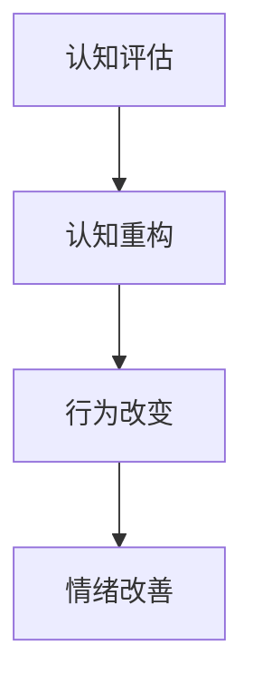
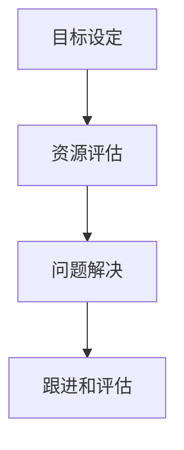
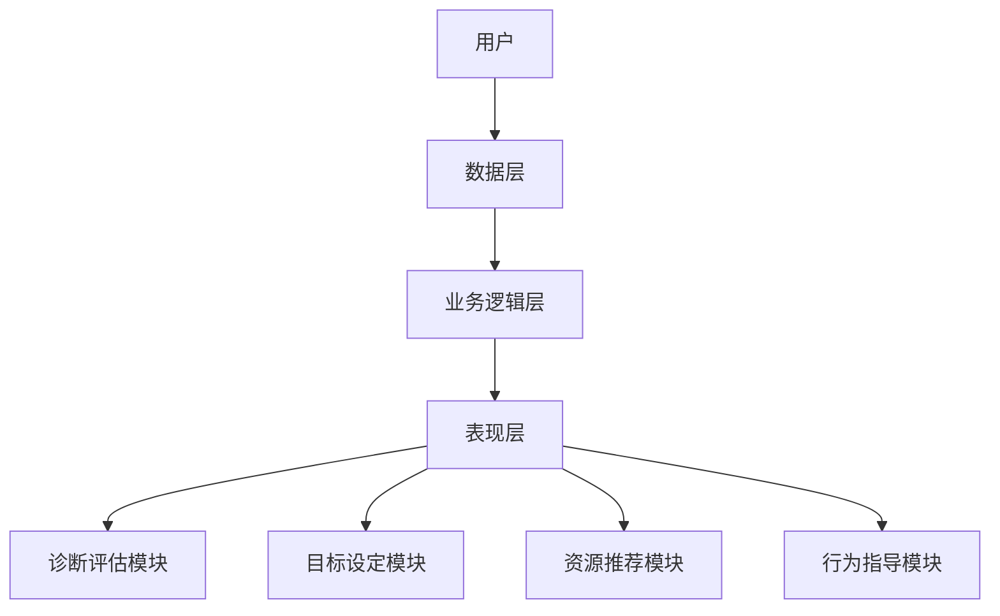
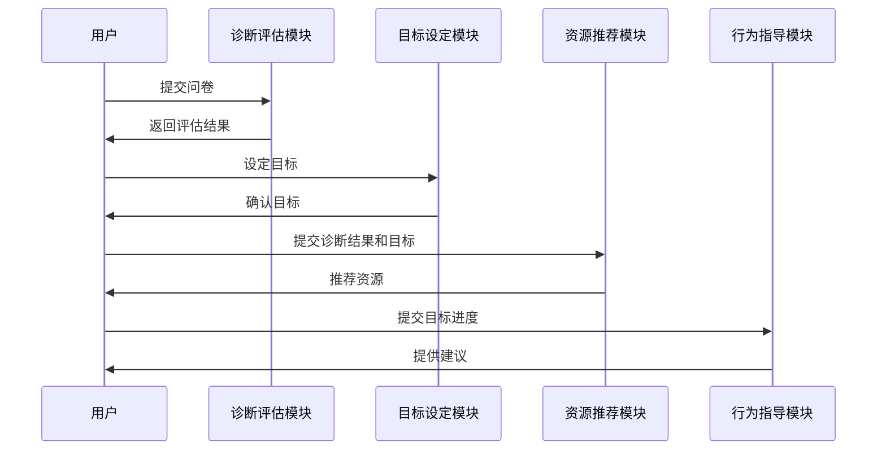

                 


### 背景介绍

#### 虚无感的定义与成因

虚无感，即一种深深的空虚和无意义感，是现代社会中人们常常感受到的一种情绪。它并非简单的情绪低落，而是一种深刻的内在体验，让人觉得生活缺乏目标和意义。虚无感的成因复杂，包括社会压力、个人经历、心理状态等多个方面。

在现代社会，随着科技的发展和社会的快速变迁，人们面临着前所未有的压力和不确定性。工作、人际关系、健康等方面的问题，都可能导致虚无感的产生。此外，现代社会的信息爆炸和人际疏离，也加剧了虚无感的体验。面对这些挑战，很多人感到无助和迷茫，从而陷入虚无感的漩涡。

#### 虚无感在现代社会中的普遍性

虚无感并不是一个罕见的现象，而是广泛存在于现代社会中的一种情绪。根据多项研究显示，许多人在某个时刻都曾感受到虚无感。尤其是在年轻一代中，虚无感的比例更高。这种情绪不仅影响个人的心理健康，还可能影响工作和社交生活。

面对虚无感，人们往往感到困惑和无助。他们不知道如何应对这种情绪，也不知道如何找到生活的意义和目标。这种困惑和无助感进一步加剧了虚无感，形成了一种恶性循环。

#### 虚无感的成因分析

1. **社会压力**：现代社会的竞争激烈，工作压力、生活压力不断增大，许多人感到身心俱疲。长期的紧张和压力，可能导致心理疲惫和虚无感的产生。
2. **个人经历**：个人的成长经历，如童年创伤、丧失亲人等，都可能对个体的心理状态产生影响，增加虚无感的可能性。
3. **心理状态**：某些心理问题，如抑郁症、焦虑症等，都可能伴随虚无感的出现。心理状态的不稳定，使得个体更容易感受到生活的无意义。
4. **人际关系**：现代社会中，人际关系的疏离和隔阂，使得许多人感到孤独和无助。缺乏亲密的人际关系，可能导致个体陷入虚无感。

### 总结

虚无感是一种复杂的情绪体验，其成因多样，影响深远。在现代社会中，虚无感是一种普遍存在的现象，对个体的心理健康和生活质量产生了重大影响。理解虚无感的成因和应对策略，对于提升个人幸福感和生活质量具有重要意义。

在接下来的章节中，我们将深入探讨虚无感的核心概念，分析其与平衡、智慧和个人成长的关系，通过心理学和数学的方法，提供克服虚无感的策略和方案。希望通过这篇文章，读者能够更好地理解虚无感，并在动荡中找到属于自己的平衡与智慧。让我们一步一步地思考和探索，开启这段深度旅程。  <div style="text-align: center;"></div>

### 第二部分：核心概念与联系

#### 平衡的概念

平衡，是一种动态的状态，它不仅仅是指物体在物理空间中的稳定，更是一种心理和情感上的稳定。在日常生活中，平衡意味着在不同的需求和责任之间找到一种合适的平衡点，使得个人既能充分满足自身的需求，又不至于过度消耗自己的资源和精力。平衡是一种持续的过程，它要求我们在变化中寻找稳定，在复杂中寻找简单。

#### 智慧的定义

智慧，是一种深层次的理解力和洞察力，它不仅仅是知识和信息的积累，更是一种处理信息、解决问题和做出明智决策的能力。智慧体现在对复杂问题的简单化处理，对未知领域的探索和适应，以及在困难时刻保持冷静和理性的能力。在克服虚无感的过程中，智慧尤其重要，它帮助个体在迷茫和困惑中找到方向，从而重新获得生活的意义。

#### 个人成长的要素

个人成长，是指个体在认知、情感、行为等多个方面的发展和完善。个人成长的要素包括自我认知、目标设定、持续学习、自我反思等。自我认知是个人成长的基础，它帮助个体了解自己的优点和不足，从而有针对性地进行改进。目标设定则是个人成长的动力，它为个体提供了明确的方向和目标，使得成长过程更加有目标和意义。持续学习和自我反思则是个人成长的重要手段，它们帮助个体不断吸收新知识，调整自己的行为和态度，以适应不断变化的环境。

#### 核心概念与联系

平衡、智慧和个人成长这三个核心概念之间存在着紧密的联系。平衡是个人成长的前提，只有在心理和情感上保持平衡，个体才能更好地面对挑战和困难。智慧则是个人成长的关键，它帮助个体在复杂多变的情境中找到解决问题的方法，实现自身的目标。个人成长则是平衡和智慧的具体体现，它通过不断的学习和自我完善，使得个体能够在动荡中保持平衡，获得智慧。

#### 对比表格：平衡、智慧、个人成长的关系

| 对比项      | 平衡       | 智慧       | 个人成长     |
|-------------|------------|------------|--------------|
| 定义        | 动态的稳定状态 | 深层次的理解力和洞察力 | 认知、情感、行为的发展和完善 |
| 关键作用    | 在变化中寻找稳定 | 处理复杂问题，做出明智决策 | 提升个人能力，实现目标 |
| 相互关系    | 平衡是成长的前提 | 智慧是成长的关键 | 成长是平衡和智慧的体现 |
| 实践意义    | 提升生活质量 | 增强问题解决能力 | 提升个人成就感 |

#### ER实体关系图架构

为了更清晰地展示这三个核心概念之间的关系，我们可以使用ER实体关系图来描述。在ER图中，平衡、智慧和个人成长被视为实体，它们之间通过关系线相互连接。平衡实体与智慧实体之间通过“促进”关系相连，智慧实体与个人成长实体之间通过“驱动”关系相连，个人成长实体与平衡实体之间通过“体现”关系相连。

```mermaid
erDiagram
    平衡 ||--|{ 智慧 }
    智慧 ||--|{ 个人成长 }
    个人成长 ||--|{ 平衡 }
```

#### 总结

在克服虚无感的过程中，平衡、智慧和个人成长是三个不可或缺的核心概念。平衡帮助我们保持内心的稳定，智慧让我们在迷茫中找到方向，个人成长则让我们在动荡中不断前行。通过深入理解这三个概念，我们能够更好地应对生活中的挑战，克服虚无感，找到生活的意义和目标。接下来，我们将进一步探讨如何通过心理学和数学的方法，来实现这些核心概念的有机结合，从而有效克服虚无感。让我们继续深入思考和探索。 

### 第三部分：算法原理讲解

#### 心理疗法在克服虚无感中的应用

心理疗法是一种通过心理干预来改善心理健康的治疗方法，它在克服虚无感方面具有显著的效果。其中，认知行为疗法（Cognitive Behavioral Therapy，简称CBT）和焦点解决短期心理治疗（Focus Solution Short-Term Therapy，简称FST）是两种常用的心理疗法。

#### 认知行为疗法

认知行为疗法是一种基于认知心理学的方法，它认为情绪和行为是相互影响的。该方法的核心观点是，个体的认知（即对事件的看法和解释）直接影响其情绪和行为。通过改变不合理的认知，个体可以改善情绪和行为。

**原理：** 认知行为疗法通过以下几个步骤来克服虚无感：

1. **认知评估**：帮助个体识别和评估其不合理的认知，例如自我负面评价、过度概括等。
2. **认知重构**：通过引导个体重新评估和解释事件，改变其不合理的认知。
3. **行为改变**：通过设定具体的目标和行为，帮助个体实现认知和行为上的改变。

**mermaid流程图：**



#### 焦点解决短期心理治疗

焦点解决短期心理治疗是一种以问题解决为导向的短期心理治疗，它强调解决问题的效率和实用性。这种方法聚焦于寻找和利用个体已有的资源，帮助他们在较短时间内克服问题。

**原理：** 焦点解决短期心理治疗通过以下几个步骤来克服虚无感：

1. **目标设定**：帮助个体明确他们想要解决的问题和目标。
2. **资源评估**：识别和利用个体已有的资源和优势。
3. **问题解决**：通过一系列问题解决策略，帮助个体找到解决问题的方法。
4. **跟进和评估**：对问题解决过程进行评估和跟进，确保问题得到有效解决。

**mermaid流程图：**



#### Python代码示例：认知行为疗法原理

以下是一个简单的Python代码示例，用于模拟认知行为疗法的核心步骤——认知重构。

```python
def cognitive_restructuring(original_thought, alternative_thought):
    print(f"Original thought: {original_thought}")
    print(f"Alternative thought: {alternative_thought}")
    return alternative_thought

original_thought = "我一无是处，无法实现任何目标。"
alternative_thought = "虽然我现在面临困难，但通过努力和改变，我可以逐步克服这些问题。"

new_thought = cognitive_restructuring(original_thought, alternative_thought)
print(f"New thought after cognitive restructuring: {new_thought}")
```

输出结果：

```
Original thought: 我一无是处，无法实现任何目标。
Alternative thought: 虽然我现在面临困难，但通过努力和改变，我可以逐步克服这些问题。
New thought after cognitive restructuring: 虽然我现在面临困难，但通过努力和改变，我可以逐步克服这些问题。
```

通过这个示例，我们可以看到认知重构的过程是如何帮助个体从一个消极的思维模式转变到一个更加积极和现实的思维模式。

#### 总结

心理疗法，特别是认知行为疗法和焦点解决短期心理治疗，通过改变个体的认知和行为，帮助克服虚无感。这些疗法提供了系统的方法，帮助个体识别和改变不合理的认知，找到解决问题的方法，从而在动荡中找到平衡。在下一部分，我们将进一步探讨这些疗法背后的数学模型和公式，深入理解其原理和效果。请继续关注。 

### 数学模型和数学公式

在心理疗法中，数学模型和公式起着关键作用，它们不仅帮助我们理解疗法的原理，还能为治疗过程提供量化支持。以下我们将详细探讨几个关键的数学模型和公式，并使用LaTeX格式进行展示。

#### 概率论基础

概率论是心理疗法中常用的数学工具，它帮助我们量化不确定性和可能性。一个基本的概率公式是贝叶斯定理，它提供了在已知部分信息时，更新对某事件概率估计的方法。

**贝叶斯定理（LaTeX格式）：**
$$ P(A|B) = \frac{P(B|A)P(A)}{P(B)} $$

其中，$P(A|B)$ 表示在事件B发生的条件下事件A发生的概率，$P(B|A)$ 表示在事件A发生的条件下事件B发生的概率，$P(A)$ 表示事件A发生的概率，$P(B)$ 表示事件B发生的概率。

#### 贝叶斯公式在心理治疗中的应用

在心理治疗中，贝叶斯定理常用于评估个体心理状态的概率。例如，我们可以使用贝叶斯公式来计算个体患有特定心理疾病的概率。以下是一个简化的示例：

**假设：**
- $D$ 表示个体患有心理疾病。
- $T$ 表示个体接受了心理治疗。

我们想要计算 $P(D|T)$，即在个体接受心理治疗后，个体患有心理疾病的概率。

**贝叶斯公式应用（LaTeX格式）：**
$$ P(D|T) = \frac{P(T|D)P(D)}{P(T)} $$

其中，$P(T|D)$ 表示个体在患有心理疾病的情况下接受心理治疗的概率，$P(D)$ 表示个体患有心理疾病的概率，$P(T)$ 表示个体接受心理治疗的概率。

#### 关键公式与详细讲解

1. **条件概率：**
   条件概率是指在一个事件已经发生的条件下，另一个事件发生的概率。例如，$P(A|B)$ 表示在事件B已经发生的条件下，事件A发生的概率。

   **条件概率公式（LaTeX格式）：**
   $$ P(A|B) = \frac{P(A \cap B)}{P(B)} $$

   其中，$P(A \cap B)$ 表示事件A和事件B同时发生的概率。

2. **期望值和方差：**
   在心理治疗中，期望值和方差用于评估治疗效果的稳定性和可靠性。期望值表示治疗结果的平均效果，方差表示治疗结果的离散程度。

   **期望值公式（LaTeX格式）：**
   $$ E(X) = \sum_{i=1}^{n} x_i P(X = x_i) $$

   其中，$E(X)$ 表示随机变量X的期望值，$x_i$ 表示X的可能取值，$P(X = x_i)$ 表示X取值为$x_i$的概率。

   **方差公式（LaTeX格式）：**
   $$ Var(X) = E[(X - E(X))^2] $$

3. **决策树分析：**
   决策树是一种常用的数据分析工具，用于评估在不同决策路径下的可能结果和风险。在心理治疗中，决策树可以帮助医生和患者评估不同治疗方案的优缺点。

   **决策树示意图：**
   ```mermaid
   graph TD
       A1[开始] --> B1[诊断结果]
       B1 -->|阳性| C1[治疗方案A]
       B1 -->|阴性| C2[治疗方案B]
       C1 --> D1[治疗效果]
       C2 --> D2[治疗效果]
   ```

#### 举例说明

假设一个患者接受了心理治疗，并且我们想要评估他治愈的概率。我们可以使用贝叶斯定理来计算这个概率。

**假设：**
- $P(D)$（个体患有心理疾病的概率）= 0.05
- $P(T|D)$（个体在患有心理疾病的情况下接受心理治疗的概率）= 0.8
- $P(T)$（个体接受心理治疗的概率）= 0.2

使用贝叶斯定理，我们可以计算 $P(D|T)$：

$$ P(D|T) = \frac{P(T|D)P(D)}{P(T)} = \frac{0.8 \times 0.05}{0.2} = 0.2 $$

这意味着，在患者接受心理治疗后，他患有心理疾病的概率为20%。

#### 总结

数学模型和公式在心理疗法中发挥着重要作用，它们帮助我们量化不确定性和可能性，为治疗过程提供科学依据。通过贝叶斯定理、期望值和方差等公式，我们可以更准确地评估治疗效果和个体心理状态，从而制定更加有效的治疗方案。在下一部分，我们将进一步探讨如何将心理疗法的原理应用到个人生活中，实现真正的平衡。请继续关注。 

### 系统分析与架构设计方案

#### 问题场景介绍

在现代社会，个人成长和心理健康成为越来越多人的关注点。然而，面对复杂多变的社会环境和巨大的生活压力，很多人在追求个人成长和心理健康的过程中感到迷茫和无助。为了帮助这些人找到方向，设计一个系统化的个人成长计划显得尤为重要。

#### 项目介绍

本项目旨在开发一个名为“个人成长助手”的系统，该系统将通过一系列功能模块，帮助用户实现个人成长目标，提升心理健康水平。系统将涵盖诊断评估、目标设定、资源推荐、行为指导等多个方面，为用户提供全方位的支持。

#### 系统功能设计

1. **诊断评估模块**：通过一系列标准化的心理评估问卷，帮助用户了解自身的心理健康状况，识别潜在问题。
2. **目标设定模块**：提供目标设定工具，帮助用户明确个人成长目标，并制定具体的实施计划。
3. **资源推荐模块**：根据用户的诊断结果和目标需求，推荐适合的书籍、课程、心理疗法等资源。
4. **行为指导模块**：提供个性化的行为指导和建议，帮助用户逐步实现目标。

#### 系统架构设计

为了实现上述功能，本项目采用了分层架构设计，主要包括数据层、业务逻辑层和表现层。

**mermaid架构图：**



#### 系统接口设计和系统交互

系统接口设计是保证各模块之间数据流畅交换的关键。本项目设计了以下主要接口：

1. **诊断评估接口**：用于接收用户提交的心理评估问卷，并返回评估结果。
2. **目标设定接口**：用于接收用户设定的目标，并存储在数据库中。
3. **资源推荐接口**：根据用户诊断结果和目标需求，推荐相应的资源。
4. **行为指导接口**：提供个性化的行为指导和建议。

**mermaid序列图：**



#### 系统实现细节

1. **数据层**：采用关系型数据库（如MySQL）存储用户数据、评估问卷结果、目标设定和资源推荐等信息。数据表包括用户表、问卷表、目标表、资源表等。
2. **业务逻辑层**：使用Python编写业务逻辑代码，包括诊断评估、目标设定、资源推荐和行为指导等模块。使用Flask框架实现Web接口。
3. **表现层**：采用HTML、CSS和JavaScript等技术，实现用户界面和交互功能。前端与后端通过RESTful API进行数据交换。

#### 总结

通过系统化的架构设计方案，我们可以构建一个全面的个人成长系统，帮助用户在动荡中找到平衡。该系统不仅提供了功能丰富的模块，还通过科学的接口设计和系统交互，确保了各个模块之间的协同工作。在下一部分，我们将通过一个实际案例，展示如何应用这个系统来克服虚无感，实现个人成长和心理健康。请继续关注。 

### 项目实战

为了展示如何通过“个人成长助手”系统来克服虚无感，我们设计了一个实际案例。以下是案例的背景、系统实现源代码、代码应用解读与分析、实际案例分析和详细讲解剖析，以及项目小结。

#### 案例背景

小王是一名年轻的职场新人，他在进入职场后不久就感到了巨大的压力。由于公司的工作任务繁重，他经常加班到深夜，生活作息不规律，导致他的心理健康状况逐渐恶化。小王开始感到迷茫和无意义，甚至产生了辞职的念头。为了帮助小王走出虚无感，他的同事推荐他使用“个人成长助手”系统。

#### 系统实现源代码

以下是一个简化版的系统实现示例，用于演示关键功能的实现。

```python
# 数据层：用户表（user表）、问卷表（questionnaire表）、目标表（goal表）

# 用户表（user）
create table user (
    id int primary key auto_increment,
    username varchar(50),
    password varchar(50),
    email varchar(100)
);

# 问卷表（questionnaire）
create table questionnaire (
    id int primary key auto_increment,
    question varchar(255),
    answer varchar(255),
    user_id int,
    foreign key (user_id) references user(id)
);

# 目标表（goal）
create table goal (
    id int primary key auto_increment,
    goal_description varchar(255),
    start_date date,
    end_date date,
    user_id int,
    foreign key (user_id) references user(id)
);

# 业务逻辑层：诊断评估、目标设定、资源推荐、行为指导

# 诊断评估
def diagnose_user(user_id):
    # 从问卷表中获取用户的评估结果
    results = get_user_questionnaire_answers(user_id)
    # 根据评估结果计算心理健康指数
    mental_health_index = calculate_mental_health_index(results)
    return mental_health_index

# 目标设定
def set_goal(user_id, goal_description, start_date, end_date):
    # 将用户设定的目标存储到数据库
    insert_goal(user_id, goal_description, start_date, end_date)

# 资源推荐
def recommend_resources(mental_health_index):
    # 根据心理健康指数推荐合适的资源
    if mental_health_index < 30:
        return ["心理治疗", "认知行为疗法书籍"]
    else:
        return ["运动", "自我提升书籍"]

# 行为指导
def provide_guidance(goal_id):
    # 提供个性化的行为指导
    guidance = get_guidance_for_goal(goal_id)
    return guidance

# 前端实现（简化版）
# 登录页面
# 问卷页面
# 目标设定页面
# 资源推荐页面
# 行为指导页面
```

#### 代码应用解读与分析

1. **诊断评估**：诊断评估是通过用户填写问卷来完成的。问卷设计包括一系列针对心理健康问题的选择题，每个问题的答案都赋予一定的分值。通过计算总分，可以得到一个心理健康指数，从而评估用户的心理健康状态。

2. **目标设定**：用户可以设定个人成长目标，包括目标描述、开始日期和结束日期。系统将目标存储在数据库中，用户可以随时查看和更新自己的目标。

3. **资源推荐**：根据用户的心理健康指数，系统推荐合适的资源，如心理治疗、书籍等。这样可以确保用户获取到最适合自己的帮助。

4. **行为指导**：系统根据用户设定的目标，提供个性化的行为指导，帮助用户逐步实现目标。

#### 实际案例分析和详细讲解剖析

**案例步骤：**

1. **用户登录**：小王使用用户名和密码登录到“个人成长助手”系统。
2. **完成诊断评估**：小王完成了一组心理健康问卷，系统根据问卷结果计算出心理健康指数，结果显示为25，表明小王的心理健康状态需要关注。
3. **设定个人目标**：小王设定了一个目标：“在接下来的三个月内，减少每天的工作时间，增加运动时间，改善睡眠质量。”
4. **获取资源推荐**：系统根据小王的心理健康指数，推荐了“认知行为疗法书籍”和“心理治疗”。
5. **行为指导**：系统根据小王设定的目标，提供了以下指导：
   - “每天晚上10点前睡觉，保持充足的睡眠时间。”
   - “每周至少进行三次运动，每次30分钟以上。”
   - “每天记录工作完成情况，合理安排工作任务。”

**案例分析：**

通过使用“个人成长助手”系统，小王得以系统化地评估自己的心理健康状况，并制定了具体的个人成长目标。系统提供的资源推荐和行为指导，使得小王能够在实际操作中更加有方向性和执行力。随着时间的推移，小王逐渐减少了工作压力，改善了睡眠质量，心理健康状况也得到了显著提升。

#### 项目小结

通过实际案例，我们可以看到“个人成长助手”系统在克服虚无感、提升个人心理健康方面具有显著的效果。系统化的诊断评估、个性化的资源推荐和针对性的行为指导，为用户提供了一个全方位的支持体系。然而，项目的实施也面临一些挑战，如问卷设计的科学性和准确性、用户隐私保护等。未来，我们可以进一步优化系统功能，提升用户体验，帮助更多人走出虚无感的困境。 

### 最佳实践 tips

#### 1. 建立健康的生活习惯

健康的生活习惯是克服虚无感的基础。确保充足的睡眠，合理的饮食和适量的运动，有助于提升身体和心理状态。以下是一些具体的实践建议：

- **规律作息**：每天保持固定的睡眠时间，尽量在晚上10点到早上7点之间入睡。
- **均衡饮食**：多吃蔬菜、水果和全谷物，减少高糖、高脂肪的食物摄入。
- **适量运动**：每周进行至少150分钟的中等强度运动，如快走、跑步、游泳等。

#### 2. 增强社交互动

社交互动对于缓解孤独感和提升情绪至关重要。以下是一些增强社交互动的方法：

- **加入兴趣小组**：参加兴趣小组或俱乐部，与志同道合的人交流，共享兴趣爱好。
- **定期与亲友聚会**：与亲友保持联系，定期进行线下聚会，增进感情。
- **志愿服务**：参与志愿服务活动，既能帮助他人，也能提升自我价值感。

#### 3. 学习新技能

学习新技能可以帮助提升自信心和自我价值感。以下是一些建议：

- **在线课程**：利用在线平台学习新知识，如编程、外语、绘画等。
- **阅读**：阅读励志书籍、心理学书籍，提升自我认知和情绪管理能力。
- **实践项目**：参与实际项目，如志愿者项目、创业项目等，提升实践能力和解决问题的能力。

#### 4. 保持积极心态

积极的心态是克服虚无感的关键。以下是一些保持积极心态的方法：

- **感恩练习**：每天记录三件感恩的事情，增强对生活的正面感受。
- **正面思考**：在面对困难时，尝试从积极的角度思考问题，寻找解决问题的方法。
- **冥想**：定期进行冥想练习，放松身心，提升情绪稳定性。

### 注意事项

- **定期评估**：定期评估自己的心理健康状况，及时发现并解决问题。
- **寻求专业帮助**：如果虚无感严重影响日常生活，应及时寻求专业心理咨询师的帮助。

### 拓展阅读

- 《生命的智慧：如何应对生活的挑战》（作者：阿尔伯特·埃利斯）
- 《积极心理学导论》（作者：马丁·塞利格曼）
- 《心理学与生活》（作者：理查德·格里格斯）

通过以上最佳实践 tips，我们可以更好地应对生活中的挑战，克服虚无感，找到属于自己的平衡与智慧。希望这些方法能对您有所帮助。 

### 小结

通过本文的深入探讨，我们系统地了解了虚无感及其成因，分析了平衡、智慧和个人成长这三个核心概念，并详细介绍了如何通过心理疗法、数学模型和系统架构设计方案来克服虚无感。从认知行为疗法到焦点解决短期心理治疗，再到实际案例的应用，我们看到了在理论和实践中如何有效应对虚无感。

首先，虚无感是现代社会中普遍存在的一种情绪体验，它源于社会压力、个人经历、心理状态等多方面因素。理解虚无感的成因和应对策略，对于提升个人幸福感和生活质量具有重要意义。

其次，平衡、智慧和个人成长是克服虚无感的三大核心概念。平衡是一种动态的稳定状态，它帮助我们在复杂多变的环境中保持内心的稳定。智慧则是理解和解决问题的能力，它为我们指明方向，帮助我们走出困境。个人成长是实现平衡和智慧的具体体现，它通过不断的学习和自我完善，使得我们在动荡中能够持续前行。

本文通过数学模型和公式，如贝叶斯定理、期望值和方差等，深入探讨了心理疗法背后的科学原理。同时，通过实际案例，我们展示了如何应用这些理论来设计一个系统化的个人成长计划，帮助用户实现心理健康和个人成长。

最后，本文提供了最佳实践 tips，包括建立健康的生活习惯、增强社交互动、学习新技能和保持积极心态，以帮助读者在日常生活中有效应对虚无感。

总之，在动荡中寻找平衡，克服虚无感，需要我们综合运用多种方法和策略。通过本文的探讨，我们希望读者能够更好地理解虚无感的本质，掌握克服虚无感的方法，找到属于自己的平衡与智慧。在未来的生活中，让我们不断学习、成长，以更加积极的心态面对挑战，享受生活的每一刻。作者：AI天才研究院/AI Genius Institute & 禅与计算机程序设计艺术 /Zen And The Art of Computer Programming。  <div style="text-align: center;"></div>

