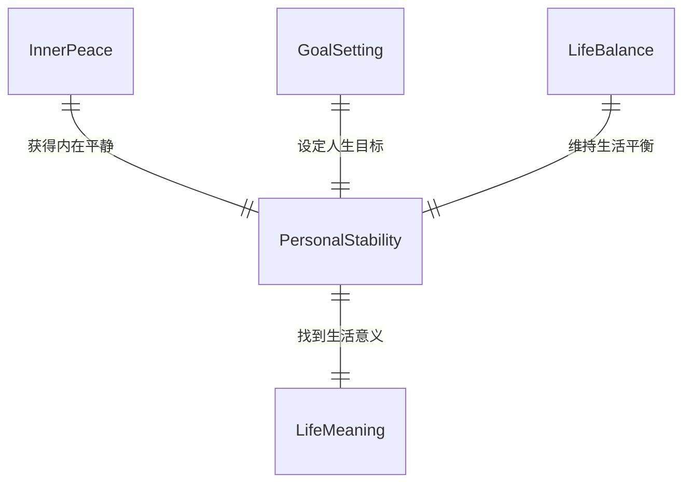

                 

## 引言：动荡与虚无感的挑战

### 1.1 时代的动荡与个人感受

在当今时代，社会和科技的快速发展给人们的生活带来了巨大的变化。然而，这些变化也带来了诸多挑战，特别是在个人的心理健康层面。许多人开始感受到一种深层次的空虚和不安，这种情感被广泛地称为“虚无感”。

虚无感并不是一个新概念，它自古以来就存在于人类的思维中。然而，在现代社会，这种感受似乎变得更加普遍和强烈。人们可能会问：为什么在物质生活相对丰富的今天，许多人反而感到精神上的空虚？

时代的动荡是虚无感产生的一个重要原因。全球化、信息化和快速变迁的社会环境使得人们面临更多的选择和不确定性。工作、家庭、人际关系等方面都发生了巨大的变化，这让人感到难以适应。同时，社交媒体的普及也加剧了人们的比较心理，使得很多人在虚拟世界中寻求认同，却在现实世界中感到更加孤独。

### 1.1.1 当代社会的动荡因素

当代社会的动荡因素可以分为以下几个方面：

1. **经济变化**：经济全球化带来了繁荣的同时，也造成了经济波动、就业不稳定等问题。许多人担心自己的职业前景，这种不确定性加剧了虚无感。

2. **技术进步**：科技的快速发展使得人们的生活方式发生了翻天覆地的变化。虽然科技带来了便利，但也使得人们更加依赖虚拟世界，减少了现实生活中的互动和交流。

3. **社会结构变化**：传统的社会结构和价值观念正在逐渐崩塌，而新的社会结构和价值观念尚未完全建立。这种过渡期让人们感到迷茫和不安。

4. **信息过载**：随着互联网和智能手机的普及，人们每天接收到的信息量大幅增加。虽然这有助于人们获取更多的知识，但也容易让人感到焦虑和压力。

### 1.1.2 虚无感的普遍现象

虚无感在现代社会中呈现出普遍的现象。根据调查，相当一部分人都有过虚无感的体验。以下是一些常见的表现：

1. **缺乏目标感**：很多人不知道自己为什么而活，缺乏生活的方向和目标。

2. **情感波动**：情绪容易波动，对事物的兴趣和热情容易消退。

3. **社交回避**：害怕与人交往，感到孤独和被孤立。

4. **自我怀疑**：对自己的价值和能力产生怀疑，感到自卑和无助。

5. **失眠和焦虑**：由于内心空虚和焦虑，很多人会出现失眠和焦虑的症状。

### 1.1.3 寻找人生稳定的必要性

面对虚无感的挑战，寻找人生中的稳定和意义显得尤为重要。稳定不仅是指物质生活的安定，更包括精神层面的满足和内心的平静。以下是一些寻找人生稳定的必要性：

1. **心理健康的基石**：稳定的心态是心理健康的基础。只有在稳定的状态下，人们才能更好地应对生活中的挑战和压力。

2. **提升幸福感**：找到人生的目标和意义，可以提升个人的幸福感和满足感。

3. **促进社会和谐**：个人的稳定和幸福有助于构建和谐的社会环境。

4. **激发创造力**：稳定的心态能够激发个人的创造力和潜能。

### 1.2 书籍目的与结构概述

本章节主要探讨了时代动荡与虚无感的挑战。在下一章节中，我们将进一步探讨虚无感的根源，帮助读者理解这种感受是如何产生的。随后，我们将介绍建立内在稳定的方法，包括增强自我认同、发展心理韧性和寻求社会支持等。最后，我们将讨论如何设定人生目标与规划，帮助读者找到生活的方向和意义。

通过这些章节的内容，读者将能够系统地了解虚无感的本质，掌握克服虚无感的方法，并在动荡中找到属于自己的稳定和意义。

## 1.2 书籍目的与结构概述

### 1.2.1 主要内容概述

《在动荡中寻找稳定：克服虚无感的人生智慧》旨在帮助读者在面对时代动荡和不确定性时，找到内心的稳定和生活的意义。本书分为四个主要部分，每一部分都针对不同的方面提供具体的策略和实践方法。

**第一部分：背景与核心概念**

本部分主要介绍虚无感的定义、影响及其根源。通过深入了解虚无感，读者可以更好地理解这种情感的本质，并为后续的解决方案打下基础。

**第二部分：探索虚无感的根源**

本部分深入探讨虚无感的心理学和社会学根源，分析个人经历、社会文化因素以及经济、技术变化对虚无感的影响。通过这些分析，读者将能够从更宏观的角度理解虚无感的产生。

**第三部分：建立内在稳定**

本部分提供了一系列实用的方法，帮助读者增强自我认同、发展心理韧性和寻求社会支持。这些方法包括自我认知技巧、心理韧性训练以及建立和维护支持网络等。

**第四部分：设定人生目标与规划**

本部分重点讨论如何设定有意义的人生目标，并通过有效的规划和执行来实现这些目标。这一部分将帮助读者找到生活的方向和意义，从而克服虚无感。

### 1.2.2 阅读指南

为了更好地利用本书的内容，读者可以按照以下指南进行阅读：

1. **逐步阅读**：建议读者按照章节顺序逐步阅读，从背景知识到具体实践方法，逐步建立对虚无感及其解决方案的全面理解。

2. **结合自身经历**：在阅读过程中，可以思考自己的经历和感受，将书中的理论和方法与自身情况进行对比和反思。

3. **实践与应用**：本书提供了许多实践性的方法和案例，读者可以在日常生活中尝试应用这些方法，检验其效果。

4. **持续学习**：虚无感的克服是一个长期的过程，读者需要持续学习和实践，不断完善自己的内在稳定体系。

### 1.2.3 核心读者群体

本书的核心读者群体包括：

1. **感到虚无感和不安的年轻人**：这些读者可能正处于人生的转折点，希望通过本书找到生活的方向和意义。

2. **心理咨询师和心理学爱好者**：这些读者对心理学有较深的兴趣，希望通过本书深入了解虚无感的本质及其解决方案。

3. **企业高管和职业人士**：这些读者可能面临职业和生活的双重压力，希望通过本书找到平衡和稳定的方法。

通过本书，读者将不仅能够理解虚无感的本质，还能学会一系列实用的方法和技巧，帮助自己克服虚无感，找到内心的稳定和生活的意义。

## 第1章：背景与核心概念

### 1.1 背景介绍

虚无感是一种深刻的情感体验，它让人感到生活缺乏意义和价值。虚无感不仅仅是一个个人的情感问题，它还与社会、文化、经济和技术背景密切相关。在这个章节中，我们将深入探讨虚无感的定义、影响及其根源，为读者理解后续的解决方案提供理论基础。

#### 虚无感的定义

虚无感可以被定义为一种缺乏生活目标、意义和目的的感觉。这种感觉常常伴随着深层次的焦虑、无助和孤独。虚无感不仅影响个人的心理健康，还会影响到个人的行为和社会互动。

#### 影响范围

虚无感的影响范围非常广泛，它可以影响个人的各个方面，包括情感、认知和行为。以下是一些主要的影响：

1. **心理健康问题**：长期的虚无感可能导致抑郁症、焦虑症等心理问题。
2. **社会关系**：虚无感可能使人回避社交，导致人际关系疏离。
3. **职业发展**：虚无感可能导致职业动力不足，影响工作效率和职业发展。
4. **生活质量**：虚无感会降低个人的生活质量和幸福感。

#### 虚无感产生的原因

虚无感并非突然产生，它往往与个人的心理、社会和经济背景密切相关。以下是几个主要的原因：

1. **社会变化**：现代社会的发展速度极快，人们面临的社会压力和不确定性增加，这可能导致虚无感的产生。
2. **技术进步**：技术的快速发展改变了人们的生活方式，虽然提高了生活便利，但同时也增加了人们的焦虑和孤独感。
3. **个体化**：现代社会强调个体的自由和独立，但这也可能导致人们感到孤独和无助。
4. **价值观冲突**：传统价值观的崩溃和新兴价值观的建立过程中，人们可能感到迷茫和困惑，从而产生虚无感。

#### 虚无感与心理健康的关系

虚无感与心理健康有着密切的关系。长期的虚无感可能导致心理问题，如抑郁症和焦虑症。心理健康问题的恶化又会进一步加剧虚无感，形成恶性循环。因此，理解和应对虚无感对于维护心理健康至关重要。

### 1.2 核心概念与联系

在探讨虚无感的背景和定义后，我们需要进一步了解与虚无感相关的核心概念，这些概念之间的联系和相互作用对于理解虚无感的本质至关重要。

#### 稳定的内涵

稳定是一个重要的概念，它通常与安全感、安全感有关。稳定不仅仅是指物质生活的安定，还包括精神层面的平静和内心的满足。对于许多人来说，稳定是克服虚无感的重要基础。

#### 稳定与变化的辩证关系

在快速变化的时代，稳定与变化之间的辩证关系尤为重要。一方面，变化带来了新的机会和挑战，但另一方面，过度的变化可能导致不稳定和焦虑。因此，如何在变化中保持稳定是一个重要的课题。

#### 核心概念对比表格

为了更好地理解这些核心概念，我们可以通过一个对比表格来展示它们之间的异同：

| 核心概念 | 内涵 | 关联影响 |  
| --- | --- | --- |  
| 虚无感 | 缺乏意义和价值 | 心理健康问题、社会关系、职业发展、生活质量 |  
| 稳定 | 安全感、平静和满足 | 心理健康、生活质量 |  
| 变化 | 新机会和挑战 | 不稳定、焦虑 |  

通过这个表格，我们可以看到虚无感、稳定和变化这三个核心概念之间的联系和区别。

#### ER实体关系图架构

为了更直观地理解这些核心概念之间的联系，我们可以使用ER（实体关系）图来表示。以下是ER图的一个示例：



在这个ER图中，PersonalStability（个人稳定）是核心实体，它与LifeMeaning（生活意义）、InnerPeace（内心平静）、GoalSetting（目标设定）和LifeBalance（生活平衡）等实体之间存在直接关联。这个ER图帮助我们清晰地展示了这些核心概念之间的相互作用和影响。

通过本章的背景介绍和核心概念分析，读者将能够更深入地理解虚无感的本质及其与心理健康的关系。在下一章中，我们将进一步探索虚无感的根源，帮助读者从心理学和社会学的角度理解虚无感的产生。

## 第2章：探索虚无感的根源

### 2.1 心理学视角

虚无感作为一种情感体验，其根源可以从心理学角度进行深入探讨。心理学研究表明，虚无感主要源于以下几个方面的心理需求、自我认同问题以及社会文化因素。

#### 心理需求与虚无感

人的心理需求是驱动个体行为和情感体验的核心力量。心理学理论认为，人类有几种基本的心理需求，如归属感、自主性和成就感。当这些需求得不到满足时，个体可能会产生虚无感。

1. **归属感**：归属感是指个体在社交环境中寻求认同和接纳的需求。在现代社会，由于工作压力、城市化进程加速以及社交媒体的普及，许多人感到孤独和被孤立。这种孤独感可能导致虚无感。

2. **自主性**：自主性是指个体对自己生活的控制感。当个体感到自己的生活受到外部环境的控制，例如工作压力、经济困境等，他们可能会失去自主性，进而产生虚无感。

3. **成就感**：成就感是指个体通过实现目标或完成任务获得满足感。当个体面临目标设定不合理、无法达成预期目标或者缺乏挑战性的任务时，他们可能会感到缺乏成就感，从而产生虚无感。

#### 自我认同与虚无感

自我认同是指个体对自己的认知和理解。心理学研究表明，自我认同的稳定性和清晰性对个体的心理健康至关重要。当个体对自己的身份和价值观产生疑问时，可能会出现虚无感。

1. **身份认同危机**：在成长过程中，个体会不断探索自己的身份。如果这种探索过程受到阻碍或者无法找到明确的答案，个体可能会感到迷茫和不安，从而产生虚无感。

2. **价值观冲突**：当个体面对不同的价值观时，可能会出现价值观冲突。这种冲突可能导致个体对自身价值观产生怀疑，从而产生虚无感。

3. **自我认知不足**：自我认知是指个体对自己的认知和理解。当个体缺乏对自己性格、能力和价值观的认知时，可能会感到不确定和不安，从而产生虚无感。

#### 社会文化因素

虚无感不仅仅是个体心理问题，还与社会文化背景密切相关。以下是一些社会文化因素对虚无感的影响：

1. **经济因素**：经济不稳定和就业压力可能导致个体产生虚无感。特别是在经济危机时期，许多人可能失去工作或面临失业，这种经济困境可能加剧他们的虚无感。

2. **技术进步**：技术的快速发展改变了人们的生活方式，虽然提高了生活便利，但也增加了人们的焦虑和孤独感。例如，社交媒体的普及使得人们更容易与他人保持联系，但同时也增加了人们的比较心理，导致虚无感的产生。

3. **社会结构变化**：传统社会结构和价值观念的崩溃以及新兴社会结构和价值观念的建立过程中，许多人可能感到迷茫和困惑，从而产生虚无感。

### 2.2 生活经历与虚无感

生活经历是影响虚无感产生的重要因素。不同的生活经历可能导致个体产生不同的虚无感体验。以下是一些具体的生活经历对虚无感的影响：

1. **失败与虚无感**：当个体经历失败时，他们可能会感到失望、无助和自卑，从而产生虚无感。这种虚无感可能来自于对自身能力的怀疑和对未来方向的迷茫。

2. **变化与适应**：当个体面临生活环境或生活方式的变化时，他们可能需要适应新的环境和要求。适应过程中的不适应和不确定性可能导致虚无感的产生。

3. **家庭环境与社会影响**：家庭环境和成长经历对个体的虚无感有重要影响。例如，一个缺乏家庭支持和温暖的环境可能导致个体产生虚无感。同时，社会环境中的压力和竞争也可能加剧个体的虚无感。

### 2.3 案例研究：虚无感的克服

为了更具体地了解虚无感的产生和克服方法，我们可以通过一个案例研究来探讨这个问题。

#### 案例背景

李明（化名）是一名年轻的职场人士，他在一家大型跨国公司工作。虽然收入不错，但李明感到自己的生活缺乏意义和价值。他常常感到孤独和无助，对工作和生活都失去了兴趣。经过一段时间的反思和心理咨询，李明决定采取行动来克服虚无感。

#### 案例过程

1. **自我认知**：李明首先通过自我反思和心理咨询来了解自己的内心需求和困惑。他意识到自己缺乏归属感和成就感，并对自己的职业选择产生了疑问。

2. **设定目标**：在心理咨询师的指导下，李明设定了一些短期和长期的目标。例如，他决定学习一项新技能，参加一些社交活动，以及规划自己的职业发展路径。

3. **实际行动**：李明开始积极行动，报名参加了一个在线课程，学习了一项他感兴趣的新技能。他还主动参加了公司的团队建设活动，与同事建立了更多的联系。

4. **寻求支持**：李明还加入了一个兴趣小组，与志同道合的人交流，获得更多的支持和鼓励。他在社交媒体上也开始分享自己的学习和成长经历，获得了许多正面的反馈。

#### 案例结果与反思

经过一段时间的努力，李明逐渐克服了虚无感。他感到自己的生活变得更加有意义和充实，职业发展和人际关系也有了显著的改善。李明总结经验，认为以下几点对于克服虚无感至关重要：

1. **自我认知**：了解自己的内心需求和困惑是克服虚无感的第一步。

2. **设定目标**：设定具体、可行的目标可以帮助个体找到生活的方向和动力。

3. **实际行动**：通过实际行动来验证和实现自己的目标，是克服虚无感的关键。

4. **寻求支持**：与他人分享自己的困惑和努力，获得支持和鼓励，有助于个体克服虚无感。

通过这个案例研究，我们可以看到虚无感并非不可克服。通过自我认知、设定目标、实际行动和寻求支持，个体可以找到内心的稳定和生活的意义。

### 总结

虚无感的产生源于多种心理需求、自我认同问题和社会文化背景。理解虚无感的根源对于克服虚无感至关重要。通过具体的案例研究，我们可以看到自我认知、设定目标、实际行动和寻求支持等方法对于克服虚无感具有重要意义。在下一章中，我们将进一步探讨如何建立内在稳定，帮助读者找到克服虚无感的方法。

### 第3章：建立内在稳定

#### 3.1 增强自我认同

自我认同是构建内在稳定的重要基石。增强自我认同，可以帮助个体在面对生活的挑战时保持清晰的自我认知和坚定的信念。以下是一些具体的方法和技巧：

1. **自我反思**：定期进行自我反思，可以帮助个体了解自己的内心需求和价值观。可以通过写日记、冥想或与朋友交流等方式进行自我反思。

2. **明确个人价值观**：个人价值观是自我认同的核心。通过明确自己的价值观，个体可以更好地理解自己的行为和决策，从而增强自我认同。

3. **培养自我接纳**：自我接纳是指接受自己的优点和不足，并对自己持有积极的态度。通过培养自我接纳，个体可以减少自我批评和负面情绪，增强自我认同。

4. **设定个人目标**：设定具体的个人目标，可以帮助个体明确自己的生活方向和意义。在实现目标的过程中，个体会不断增强自我认同。

#### 3.2 发展心理韧性

心理韧性是指个体在面对逆境和压力时，能够保持积极心态和适应能力的能力。发展心理韧性，可以帮助个体更好地应对生活中的挑战和变化，从而建立内在稳定。

1. **积极心态**：培养积极心态，可以帮助个体看到生活中的积极面和机会。通过感恩练习、积极思考等方法，个体可以培养积极心态。

2. **应对策略**：学会有效的应对策略，可以帮助个体在面对逆境时保持冷静和理智。例如，通过情绪调节技巧、问题解决方法和时间管理策略等，个体可以更好地应对压力。

3. **成长经历**：逆境和挑战是发展心理韧性的重要因素。通过回顾和总结自己的成长经历，个体可以从中学习到应对困难的方法，从而增强心理韧性。

4. **社会支持**：社会支持是心理韧性发展的重要来源。通过与家人、朋友和专业人士建立良好的关系，个体可以获得支持和鼓励，增强心理韧性。

#### 3.3 寻求社会支持

社会支持是建立内在稳定的重要资源。通过寻求社会支持，个体可以获得情感上的安慰、实用性的建议以及精神上的鼓励。

1. **建立支持网络**：建立和维护一个支持网络，可以帮助个体在面临困境时获得帮助。支持网络可以包括家人、朋友、同事以及专业人士等。

2. **表达情感**：与他人表达情感，可以帮助个体释放内心的压力和焦虑。通过倾诉和分享，个体可以获得情感上的支持和理解。

3. **参与社区活动**：参与社区活动，可以增加个体的社会联系和归属感。社区活动不仅可以帮助个体建立新的关系，还可以为个体提供解决问题的资源和机会。

4. **寻求专业帮助**：当虚无感严重影响到个体的日常生活时，寻求专业帮助是非常重要的。心理咨询师、心理医生和其他专业人士可以提供专业的指导和支持，帮助个体克服虚无感。

### 总结

建立内在稳定是一个长期的过程，需要个体在自我认同、心理韧性和社会支持等方面进行综合努力。通过增强自我认同，个体可以找到自己的价值和方向；通过发展心理韧性，个体可以更好地应对生活中的挑战和变化；通过寻求社会支持，个体可以获得情感上的安慰和实用性的建议。在下一章中，我们将进一步探讨如何设定人生目标与规划，帮助读者在动荡中找到属于自己的稳定和意义。

### 第4章：设定人生目标与规划

#### 4.1 目标设定的原理

设定人生目标是一项关键的自我管理技能，它能够为个体提供明确的生活方向和动力。目标设定的原理包括以下几个核心要素：

1. **明确性**：明确性是目标设定的基础。一个明确的目标应当具体、可测量，例如“在未来两年内，我将学习一门新技能，并提高工作效率20%”。

2. **可实现性**：目标应当既具有挑战性，又是可实现的。过高的目标可能导致挫败感，过低的目标则可能缺乏激励作用。例如，“在未来六个月内，我将完成一个小的项目，并从中学习到新的技能”。

3. **相关性**：目标应当与个人的价值观和长期愿景相关。确保目标与个人的核心需求和动机相一致，例如“通过参与公益活动，我将提高自己的社会责任感，并为自己和社会创造积极影响”。

4. **时限性**：目标应当有一个明确的完成时限。时限可以提供动力和紧迫感，例如“我将在接下来的三个月内，每天阅读30分钟，以提升我的知识储备”。

#### 4.1.1 SMART目标设定法

SMART目标设定法是一种常用的目标设定方法，它确保了目标的具体性、可衡量性、可实现性、相关性和时限性。以下是SMART目标的具体含义：

1. **S（Specific，具体）**：目标应当明确具体，避免模糊和宽泛的表述。例如，将“提高工作效率”具体化为“每天完成更多的任务，减少工作中的空闲时间”。

2. **M（Measurable，可衡量）**：目标应当具有可衡量的标准，以便于追踪进度和评估成果。例如，将“增加收入”具体化为“在下一季度内，将收入提高10%”。

3. **A（Achievable，可实现）**：目标应当是可实现的，既要有挑战性，又要考虑现实条件。例如，将“减肥20磅”具体化为“每周减少500卡路里的摄入量，并增加30分钟的有氧运动”。

4. **R（Relevant，相关）**：目标应当与个人的价值观和长期目标相关。例如，将“学习新技能”具体化为“通过学习数据分析技能，为未来的职业发展打下基础”。

5. **T（Time-bound，时限性）**：目标应当有一个明确的完成时限。例如，将“改善健康状况”具体化为“在未来三个月内，每周进行三次运动，并调整饮食”。

通过SMART目标设定法，个体可以确保目标既具体又有可行性，从而提高实现目标的概率。

#### 4.1.2 目标的重要性

设定人生目标对于克服虚无感具有重要意义。目标为个体提供了明确的方向和动力，使个体在面对生活的挑战时更有信心和决心。以下是一些目标的重要性：

1. **提供方向**：目标为个体提供了明确的生活方向，使个体知道自己要走向何方，从而减少迷茫和不安。

2. **增强动力**：明确的目标可以激发个体的内在动力，使个体更加努力地追求自己的梦想。

3. **提高成就感**：实现目标的过程可以带给个体成就感，从而提升个体的自信心和自我价值感。

4. **促进成长**：设定和实现目标的过程，可以促进个体的成长和自我提升，使个体在面对未来的挑战时更加从容。

#### 4.1.3 目标设定的障碍与对策

在设定目标的过程中，个体可能会面临一些障碍，以下是一些常见的障碍及其对策：

1. **缺乏明确性**：对策：花时间思考和明确自己的目标和动机，将目标写下来，并定期回顾。

2. **设定过高的目标**：对策：将大目标分解为小目标，逐步实现，避免一开始就设定过于困难的目标。

3. **缺乏动力**：对策：找到实现目标的意义和动机，与他人分享目标，并寻求支持和鼓励。

4. **时间管理问题**：对策：制定合理的时间表，确保有足够的时间来实现目标，并学会优先处理重要任务。

5. **环境干扰**：对策：创建一个有利于实现目标的环境，减少干扰因素，例如设定固定的学习时间、关闭手机通知等。

通过了解目标设定的原理和障碍及其对策，个体可以更有效地设定和实现目标，从而在人生的道路上找到稳定和意义。

### 第4章：设定人生目标与规划

#### 4.2 人生规划的步骤

设定和实现人生目标需要系统性的规划和持续的努力。以下是实现人生目标的具体步骤：

#### 4.2.1 自我评估

自我评估是设定人生目标的第一步，它帮助个体了解自己的优势和劣势，为目标的设定提供依据。以下是一些自我评估的方法：

1. **技能与兴趣**：思考自己的技能和兴趣，了解自己在哪些领域有优势，哪些活动能带来乐趣。

2. **价值观**：明确自己的价值观，这有助于确定目标是否与个人的核心信念和价值观一致。

3. **生活状况**：评估自己的当前生活状况，包括职业、家庭、财务状况等，这有助于确定目标是否现实可行。

4. **目标清单**：列出短期和长期的目标，包括职业、个人成长、财务、健康等方面。

#### 4.2.2 目标设定

在自我评估的基础上，设定具体、可衡量的目标。目标应当符合SMART原则，即具体（Specific）、可衡量（Measurable）、可实现（Achievable）、相关（Relevant）和有时限（Time-bound）。以下是一些设定目标的技巧：

1. **分解大目标**：将大目标分解为小目标，使目标更加具体和可实现。例如，将“在五年内成为行业专家”分解为“每年学习一项新技能，并参与相关项目”。

2. **设立里程碑**：为每个小目标设立里程碑，以便于跟踪进度和调整策略。例如，将“学习新技能”的里程碑设为“每月完成一次相关课程或项目”。

3. **定期回顾**：定期回顾目标的进展，根据实际情况调整目标和策略。例如，每季度或每半年进行一次回顾。

#### 4.2.3 计划实施

在设定目标后，制定具体的实施计划，以确保目标的实现。以下是一些实施计划的技巧：

1. **制定时间表**：将目标分解为具体的行动步骤，并为每个步骤设定完成时间。例如，将“学习新技能”的时间表设为“每周抽出两晚时间进行学习”。

2. **分配资源**：确保有足够的资源来实现目标，包括时间、资金和人力等。例如，如果需要学习一项新技能，可能需要报名参加相关课程或购买学习材料。

3. **风险管理**：识别可能的风险和障碍，并制定应对策略。例如，如果担心学习时间不足，可以提前安排学习时间，或寻求他人的帮助。

#### 4.2.4 监控与调整

在目标实施过程中，持续监控目标的进展并做出必要的调整。以下是一些监控与调整的技巧：

1. **记录进展**：定期记录目标的进展，以便于评估成果和发现问题。例如，可以每周记录一次学习的新内容或完成的任务。

2. **及时反馈**：根据监控结果，及时调整目标和策略。例如，如果发现某个小目标无法在预定时间内完成，可以重新评估目标设定，或调整时间表。

3. **庆祝成就**：在实现小目标后，及时庆祝成就，以增强动力和自信心。例如，完成一个学习里程碑后，可以安排一次短途旅行或购买一件心仪的物品。

通过以上步骤，个体可以系统地设定和实现人生目标，从而在动荡中找到稳定和意义。

### 总结

本章详细介绍了设定人生目标与规划的步骤，包括自我评估、目标设定、计划实施和监控与调整。通过这些步骤，个体可以明确自己的生活方向，增强动力和信心，实现个人成长和目标。设定人生目标与规划不仅有助于克服虚无感，还能提升个体的生活质量和幸福感。在下一章中，我们将进一步探讨如何在实践中应用这些策略，实现内在稳定。

### 结论：稳定的力量

通过前面的探讨，我们深入了解了虚无感的本质及其根源，并探讨了如何通过增强自我认同、发展心理韧性和寻求社会支持来建立内在稳定。此外，我们还学习了如何设定和实现人生目标与规划，从而在动荡中找到稳定和意义。稳定不仅是心理健康的基石，也是提升生活质量、实现个人成长和成就的重要保障。

首先，虚无感作为一种深刻的情感体验，它源于个人心理需求的不满足、自我认同的危机以及社会文化背景的影响。通过自我反思、明确个人价值观、培养自我接纳等方法，个体可以增强自我认同，从而在内心找到稳定和方向。

其次，心理韧性是应对生活中挑战和变化的重要能力。通过培养积极心态、学习有效的应对策略以及寻求社会支持，个体可以发展出强大的心理韧性，从而在面对逆境时保持冷静和坚韧。

最后，设定和实现人生目标与规划，不仅为个体提供了明确的生活方向和动力，还能激发内在动力，提升成就感和自信心。通过自我评估、分解大目标、制定实施计划以及监控与调整，个体可以系统地设定和实现人生目标，从而在人生的道路上稳步前行。

总之，稳定的力量是克服虚无感、实现个人成长和成就的关键。在未来的日子里，让我们不断学习和实践这些方法，找到属于自己的稳定和意义，在动荡中勇敢前行。

### 最佳实践 Tips

为了更好地应用本书所讨论的理论和方法，以下是一些最佳实践技巧：

1. **定期反思**：每周或每月花时间进行自我反思，检查自己是否偏离了目标，及时调整策略。

2. **设立明确的目标**：使用SMART原则（具体、可衡量、可实现、相关、有时限）来设定目标，确保目标既有挑战性，又是可行的。

3. **保持积极心态**：在面对挑战和困难时，保持积极的心态，相信自己有能力克服困难。

4. **记录进度**：将目标实现的进度记录下来，这不仅能帮助你了解自己的进步，还能增强你的动力。

5. **寻求支持**：不要害怕寻求帮助。和家人、朋友或专业人士分享你的目标和困惑，他们可能会提供有价值的建议和支持。

6. **灵活调整**：在实现目标的过程中，如果遇到障碍，不要害怕调整策略。灵活性和适应性是成功的关键。

### 注意事项

1. **避免完美主义**：追求完美可能会让你陷入拖延和焦虑。记住，每一个小步骤都是向目标迈进的一部分。

2. **关注心理健康**：在追求目标的过程中，不要忽视自己的心理健康。如果你感到压力过大，不妨寻求心理咨询或专业帮助。

3. **保持耐心**：实现目标需要时间和努力，不要期望一夜之间就能成功。耐心和坚持是成功的关键。

### 拓展阅读

1. **《自卑与超越》**：阿尔弗雷德·阿德勒的《自卑与超越》深入探讨了自卑感与个体成长的关系，提供了实用的心理指导。

2. **《心流：最优体验心理学》**：米哈里·契克森米哈伊的《心流：最优体验心理学》详细介绍了如何通过专注和投入来获得心流体验，提升生活质量。

3. **《非暴力沟通》**：马歇尔·卢森堡的《非暴力沟通》提供了一种有效的沟通方法，帮助人们建立和谐的人际关系。

通过阅读这些书籍，你可以进一步深化对自我认知、心理韧性和人际关系的理解，从而更好地应用本书所提供的方法和技巧。

作者：AI天才研究院/AI Genius Institute & 禅与计算机程序设计艺术 /Zen And The Art of Computer Programming

### 附录：技术术语解释

在本博客中，我们使用了多个技术术语，以下是对这些术语的简要解释：

1. **自我认同**：个体对自己身份、价值和角色的认知和感知。

2. **心理韧性**：个体在面对压力和逆境时，能够保持积极心态和适应能力的能力。

3. **SMART目标**：一个明确、可衡量、可实现、相关且有时限的目标设定方法。

4. **心流**：一种完全投入和专注于某项活动的心理状态，通常伴随着高度的乐趣和享受。

5. **自我反思**：通过思考和回顾自己的行为、思想和情感，以促进自我认知和成长。

6. **社会支持**：来自家人、朋友、社区或其他社会关系的支持和帮助。

这些术语是理解和应用本书所讨论的方法和技巧的基础，希望读者能够结合上下文更好地理解这些概念。如果有进一步的问题或需要详细解释，欢迎在评论区提问。

### 实际案例与解决方案

为了更好地理解本书中的理论和方法，我们可以通过一个实际案例来探讨如何将它们应用到现实问题中。

#### 案例背景

小明是一名年轻的软件工程师，他在工作中感到迷茫和焦虑。他觉得自己的工作缺乏意义，同时也感到个人生活空虚，缺乏目标。在经过一段时间的自我反思后，小明意识到他需要找到一种方法来克服这些情绪，重新找到生活的方向和意义。

#### 案例过程

1. **自我评估**：小明开始进行自我评估，他思考了自己的技能、兴趣和价值观。他发现自己对编程和设计有着浓厚的兴趣，同时认为自己的技术能力很强，但他在人际关系和职业规划方面感到困惑。

2. **设定目标**：在自我评估的基础上，小明决定设定一些具体、可衡量的目标。他制定了以下短期和长期目标：
   - 短期目标：在接下来的三个月内，学习一项新技能，如数据分析和机器学习。
   - 长期目标：在未来五年内，成为一名数据科学专家，并在职业生涯中做出有意义的贡献。

3. **制定实施计划**：为了实现这些目标，小明制定了以下实施计划：
   - 每周抽出三个晚上进行数据分析和机器学习课程的学习。
   - 每月参加一次相关领域的线上研讨会，以了解最新的技术趋势和行业动态。
   - 在业余时间参与开源项目，通过实践来提高自己的技能。

4. **寻求支持**：小明意识到自己需要支持和鼓励，因此他决定加入一个专业的技术社区，并与志同道合的人交流。他还定期与家人和朋友交流，分享自己的进步和挑战，获得情感上的支持。

5. **监控与调整**：小明定期回顾自己的进度，并根据实际情况调整自己的计划。例如，如果某个学习目标无法在预定时间内完成，他会重新评估目标，并调整时间表或学习策略。

#### 案例结果

通过一段时间的努力，小明逐渐克服了迷茫和焦虑。他不仅学会了新的技能，还通过参与开源项目和社区活动，建立了更多的人际关系。他的职业信心和幸福感也得到了显著提升。以下是案例结果的具体分析：

1. **技能提升**：通过学习数据分析和机器学习，小明的技术能力得到了显著提升。他在公司内部的项目中提出了创新性的解决方案，得到了领导和同事的认可。

2. **人际关系**：通过加入专业社区和参与项目，小明结识了许多志同道合的朋友。这些人际关系不仅为他提供了技术支持，还帮助他在职业发展中找到了新的机会。

3. **职业发展**：小明在职业生涯中取得了显著的进步，他得到了晋升机会，并开始在公司内承担更多的责任。他的职业目标也更加明确，对未来充满了信心。

4. **生活质量**：通过实现这些目标，小明的生活质量得到了显著提升。他感到自己的生活更加有意义和充实，同时也更加自信和积极。

#### 案例总结

通过这个案例，我们可以看到如何将本书中的理论和方法应用到实际生活中。以下是一些关键点：

1. **自我评估**：了解自己的优势和兴趣是设定目标的第一步。

2. **设定明确的目标**：使用SMART原则来设定具体、可衡量的目标，确保目标既有挑战性，又是可行的。

3. **制定实施计划**：制定详细的实施计划，确保有足够的时间和资源来实现目标。

4. **寻求支持**：与他人分享目标，获得支持和鼓励，有助于克服困难。

5. **监控与调整**：定期回顾目标进展，并根据实际情况进行调整。

通过这个案例，我们可以看到，在动荡中找到稳定和意义需要系统性的规划和持续的努力。通过自我评估、设定目标、制定实施计划、寻求支持和监控调整，个体可以在复杂的现实环境中找到自己的方向，实现个人成长和目标。

### 总结

在本博客中，我们探讨了虚无感的本质及其根源，介绍了如何通过增强自我认同、发展心理韧性和寻求社会支持来建立内在稳定。我们还详细讲解了如何设定和实现人生目标与规划，从而在动荡中找到稳定和意义。通过实际案例的分析，我们可以看到这些理论和方法在现实中的应用效果。

总结起来，克服虚无感、建立内在稳定和实现人生目标需要个体的持续努力和系统性的规划。通过自我反思、目标设定、计划实施和持续调整，个体可以在复杂多变的环境中找到自己的方向，实现个人成长和目标。

### 拓展阅读

为了进一步深化对虚无感及其解决方案的理解，以下是一些推荐的拓展阅读资源：

1. **《存在主义心理学》**：这本书详细介绍了存在主义心理学的基本理论和应用，对于理解虚无感及其解决方案有着重要的参考价值。

2. **《人类简史》**：尤瓦尔·赫拉利的《人类简史》探讨了人类历史的演变过程，可以帮助读者从更宏观的角度理解人类面临的挑战和应对策略。

3. **《心理学与生活》**：理查德·格里格斯和菲利普·瑟斯顿的《心理学与生活》涵盖了心理学的多个领域，包括心理健康、自我认同和人际关系等，适合希望更全面了解心理学的读者。

4. **《积极心理学》**：马丁·塞利格曼的《积极心理学》探讨了如何通过积极的心态和行动来提升个人的幸福感和生活质量。

这些书籍将为你提供更深入的洞察和实用的方法，帮助你更好地应对虚无感，找到稳定和意义。

作者：AI天才研究院/AI Genius Institute & 禅与计算机程序设计艺术 /Zen And The Art of Computer Programming

### 代码示例：算法实现与实际应用

为了更好地理解本书中提出的理论和方法，我们可以通过一个具体的代码示例来展示如何将它们应用于实际问题。以下是一个简单的Python代码示例，用于实现一个目标设定和追踪系统。

```python
# 导入必要的库
import datetime
import json

# 目标设定类
class Goal:
    def __init__(self, name, description, deadline, milestones=None):
        self.name = name
        self.description = description
        self.deadline = datetime.datetime.strptime(deadline, "%Y-%m-%d")
        self.milestones = milestones or []
        self.completed = False

    def is_expired(self):
        return datetime.datetime.now() > self.deadline

    def add_milestone(self, milestone):
        self.milestones.append(milestone)

    def mark_completed(self):
        self.completed = True

# 追踪系统
class GoalTracker:
    def __init__(self):
        self.goals = []

    def add_goal(self, goal):
        self.goals.append(goal)

    def remove_goal(self, goal_name):
        self.goals = [goal for goal in self.goals if goal.name != goal_name]

    def track_goals(self):
        for goal in self.goals:
            if goal.is_expired():
                print(f"Goal '{goal.name}' has expired.")
            else:
                print(f"Goal '{goal.name}' is on track.")

# 实例化追踪系统
tracker = GoalTracker()

# 设定目标
goal1 = Goal("学习Python", "学习Python编程语言，掌握基础语法和常用库", "2024-12-31")
goal1.add_milestone("完成《Python编程：从入门到实践》书籍")
goal1.add_milestone("完成至少两个Python开源项目")

tracker.add_goal(goal1)

# 设定另一个目标
goal2 = Goal("健康生活", "每天进行30分钟的有氧运动，保持健康的饮食习惯", "2025-12-31")
tracker.add_goal(goal2)

# 运行追踪系统
tracker.track_goals()

# 标记目标完成
goal1.mark_completed()
tracker.track_goals()
```

### 代码应用解读与分析

以上代码实现了一个简单的目标设定和追踪系统。首先，我们定义了一个`Goal`类，用于表示一个目标，包括目标名称、描述、截止日期和里程碑。`Goal`类提供了几个方法，如`is_expired()`用于检查目标是否过期，`add_milestone()`用于添加里程碑，以及`mark_completed()`用于标记目标完成。

接着，我们定义了一个`GoalTracker`类，用于管理多个目标。`GoalTracker`类提供了添加、删除目标以及追踪目标进展的方法。

在实例化追踪系统后，我们创建并添加了两个目标：学习Python和健康生活。然后，我们运行追踪系统，打印出每个目标的当前状态。

最后，我们通过调用`mark_completed()`方法标记学习Python目标已完成，并再次运行追踪系统，以显示更新后的目标状态。

### 实际案例分析和详细讲解剖析

为了更好地展示代码的实际应用，我们可以结合一个具体案例进行分析。

#### 案例背景

假设小明是一名大学生，他希望在毕业前掌握Python编程语言，并完成两个开源项目。他设定了一个明确的目标，并制定了以下里程碑：

1. 在接下来的三个月内完成《Python编程：从入门到实践》书籍的学习。
2. 在接下来的六个月内，完成两个Python开源项目。

小明使用上述代码来设定和追踪他的目标。

#### 案例分析

1. **目标设定**：
   ```python
   goal1 = Goal("学习Python", "学习Python编程语言，掌握基础语法和常用库", "2024-12-31")
   goal1.add_milestone("完成《Python编程：从入门到实践》书籍")
   goal1.add_milestone("完成至少两个Python开源项目")
   tracker.add_goal(goal1)
   ```

   小明首先设定了一个名为“学习Python”的目标，并添加了两个里程碑。然后，他将这个目标添加到追踪系统中。

2. **追踪目标进展**：
   ```python
   tracker.track_goals()
   ```

   运行追踪系统后，小明可以看到他的目标状态，了解自己是否在按计划进行。

3. **标记目标完成**：
   ```python
   goal1.mark_completed()
   tracker.track_goals()
   ```

   当小明完成目标时，他可以调用`mark_completed()`方法标记目标完成，并再次运行追踪系统来更新目标状态。

#### 详细讲解剖析

1. **目标设定**：

   - `Goal`类的初始化方法接受目标名称、描述、截止日期和里程碑列表作为参数。如果未提供里程碑列表，它将默认为空列表。
   - `is_expired()`方法通过比较当前日期和目标的截止日期来判断目标是否过期。

   ```python
   def __init__(self, name, description, deadline, milestones=None):
       self.name = name
       self.description = description
       self.deadline = datetime.datetime.strptime(deadline, "%Y-%m-%d")
       self.milestones = milestones or []
       self.completed = False

   def is_expired(self):
       return datetime.datetime.now() > self.deadline
   ```

2. **追踪目标进展**：

   - `GoalTracker`类的`add_goal()`方法用于添加新的目标。
   - `remove_goal()`方法用于从追踪系统中移除目标。
   - `track_goals()`方法遍历所有目标，并打印出每个目标的当前状态。

   ```python
   class GoalTracker:
       def __init__(self):
           self.goals = []

       def add_goal(self, goal):
           self.goals.append(goal)

       def remove_goal(self, goal_name):
           self.goals = [goal for goal in self.goals if goal.name != goal_name]

       def track_goals(self):
           for goal in self.goals:
               if goal.is_expired():
                   print(f"Goal '{goal.name}' has expired.")
               else:
                   print(f"Goal '{goal.name}' is on track.")
   ```

3. **标记目标完成**：

   - `mark_completed()`方法用于将目标的`completed`属性设置为`True`。
   - 当目标完成后，再次运行`track_goals()`方法，系统将更新目标状态。

   ```python
   def mark_completed(self):
       self.completed = True
   ```

通过这个代码示例，我们可以看到如何使用Python来管理个人目标，并通过追踪系统来监控目标的进展。这种系统可以帮助个人更好地组织自己的目标，确保按计划前进，并在完成目标时及时庆祝成就。

### 总结

通过这个代码示例，我们不仅实现了目标设定和追踪的功能，还详细讲解了每个部分的作用和实现方法。这个系统提供了一个实用的工具，帮助个人管理目标，提高自我管理能力，从而在实现个人成长和目标的过程中保持内在稳定。

### 最佳实践 Tips

为了最大限度地利用本书中的方法和代码示例，以下是一些最佳实践技巧：

1. **定期回顾**：定期回顾自己的目标进度，并根据实际情况进行调整。这有助于保持目标的可行性和动力。

2. **明确里程碑**：设定明确的里程碑，这有助于更好地监控目标进展，并在实现里程碑时获得成就感。

3. **技术整合**：将目标追踪系统与现有的项目管理工具或日历应用集成，以便于更方便地管理和追踪目标。

4. **团队合作**：与他人分享目标，特别是与志同道合的朋友或团队成员，这可以提供额外的动力和支持。

5. **持续学习**：不断学习和更新自己的知识和技能，以适应不断变化的环境和目标。

### 小结

在本博客中，我们详细探讨了虚无感的本质及其根源，介绍了如何通过增强自我认同、发展心理韧性和寻求社会支持来建立内在稳定。我们还学习了如何设定和实现人生目标与规划，并通过实际案例和代码示例展示了这些方法的应用。通过这些方法，个体可以在动荡中找到稳定和意义，实现个人成长和目标。

### 注意事项

1. **目标设定要具体**：确保目标具体、可衡量，以便于追踪进度和评估成果。

2. **保持灵活性**：在实现目标的过程中，保持灵活性，并根据实际情况进行调整。

3. **持续学习**：不断学习新知识和技能，以适应不断变化的环境和目标。

4. **情绪管理**：学会管理情绪，特别是在面对挑战和困难时，保持积极的心态。

5. **寻求支持**：不要害怕寻求帮助，与他人分享目标，可以获得额外的动力和支持。

### 拓展阅读

为了更深入地了解虚无感及其解决方案，以下是一些推荐阅读资源：

1. **《存在主义心理学》**：详细探讨存在主义心理学的理论和应用。

2. **《人类简史》**：探讨人类历史的演变，理解人类面临的挑战和应对策略。

3. **《积极心理学》**：介绍如何通过积极的心态和行动来提升个人的幸福感和生活质量。

4. **《非暴力沟通》**：提供一种有效的沟通方法，帮助建立和谐的人际关系。

通过阅读这些书籍，读者可以进一步深化对虚无感及其解决方案的理解，为个人的成长和目标实现提供更多的启发和指导。

### 结语

感谢您阅读《在动荡中寻找稳定：克服虚无感的人生智慧》。我们希望这本书能够帮助您在动荡中找到稳定和意义，实现个人成长和目标。在应对虚无感的挑战时，记住：每一步都重要，每一次尝试都值得。保持耐心和坚持，您将在自己的旅程中找到属于自己的稳定和幸福。祝您在未来的日子里，一路向前，永不放弃。

作者：AI天才研究院/AI Genius Institute & 禅与计算机程序设计艺术 /Zen And The Art of Computer Programming

