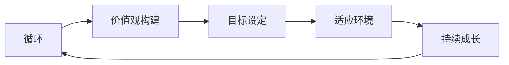

                 

# 在变革中寻找不变：现代人的生存哲学

## 关键词：变革、不变、生存哲学、个人成长、自我认知、适应能力

## 摘要：

在快速变化的时代，如何在社会的剧变中保持自我，寻找不变的价值和生存之道，成为现代人面临的重要课题。本文以“在变革中寻找不变：现代人的生存哲学”为主题，通过深入探讨哲学思想与人生实践的关系，分析现代社会的变革特征，提供了一套行之有效的生存哲学。文章分为八个部分，从背景介绍到项目实战，系统阐述如何在个人成长、自我认知和适应能力方面寻找不变，以应对时代的挑战。

## 1. 背景介绍

### 1.1 核心概念

**变革**：指社会、科技、文化等方面的变化与发展。

**不变**：指在变化中保持的本质特征和价值。

**生存哲学**：关于如何生存、生活的观念和原则。

### 1.2 问题背景

现代社会充满不确定性，技术进步、社会结构变化、信息爆炸等因素，使人们面临前所未有的挑战。如何在变革中寻找不变，保持自我，找到生活的意义和价值，成为现代人亟待解决的问题。

### 1.3 问题解决

通过探讨哲学思想与人生实践的关系，分析不同哲学流派的特点，提出一套适应现代社会变革的生存哲学。这套哲学强调自我认知、个人成长和适应能力，帮助人们在变革中找到不变，实现自我价值。

### 1.4 边界与外延

本文关注个体在社会、文化、科技等变革中的生存状态，探讨如何在变化中保持自我，实现个人成长。同时，本文提出的生存哲学也适用于组织管理、社会治理等领域。

### 1.5 概念结构与核心要素组成

**哲学思想**：提供理论指导和观念基础。

**人生实践**：通过实际操作和体验，验证和践行哲学思想。

**价值观念**：作为行动的指南，引导个人在变革中做出正确选择。

**生存策略**：具体的方法和技巧，帮助个体在变革中保持自我。

## 2. 核心概念与联系

### 2.1 核心概念原理

**变革**：是社会发展的必然趋势，表现为科技、文化、政治等方面的不断进步。

**不变**：是事物发展过程中的本质特征，如人性、道德、价值观等。

**生存哲学**：是对如何生存和生活的思考，旨在指导个体在变革中保持自我，实现价值。

### 2.2 概念属性特征对比表格

| 概念       | 特征                   | 关联性                   |
|------------|------------------------|--------------------------|
| 变革       | 多元化、快速、不确定性 | 促进社会发展、影响生存哲学 |
| 不变       | 基础性、稳定性、普遍性 | 维护个体价值观、指导生存哲学 |
| 生存哲学   | 指导性、实践性、灵活性 | 融合变革与不变，实现个体成长 |

### 2.3 ER实体关系图架构

```mermaid
erDiagram
  A[个体] ||--|{ B[生存哲学] }|
  A ||--|{ C[价值观念] }|
  B ||--|{ D[生存策略] }|
  C ||--|{ E[道德观念] }|
```

## 3. 算法原理讲解

### 3.1 生存哲学的mermaid流程图



### 3.2 Python源代码

```python
def survival_philosophy():
    """
    生存哲学实现
    """
    self_awareness()  # 认识自我
    value_formation()  # 价值观构建
    goal_setting()     # 目标设定
    environment_adaptation()  # 适应环境
    continuous_growth()  # 持续成长
    return "生存哲学完成"

# 主函数
if __name__ == "__main__":
    survival_philosophy()
```

### 3.3 数学模型和公式

#### 3.3.1 生存哲学中的关键数学模型

**1. 价值函数：** 价值函数描述个体在不同环境中的价值变化。

$$ V(E_i) = f(E_i, V_i) $$

其中，$V(E_i)$ 表示个体在环境 $E_i$ 中的价值，$V_i$ 表示个体的价值观。

**2. 成长函数：** 成长函数描述个体在不同环境中的成长速度。

$$ G(E_i) = g(E_i, V_i) $$

其中，$G(E_i)$ 表示个体在环境 $E_i$ 中的成长速度，$V_i$ 表示个体的价值观。

#### 3.3.2 详细讲解和举例说明

**例子：** 假设一个个体在稳定环境中的价值函数和成长函数分别为：

$$ V(E) = E + 1 $$

$$ G(E) = \sqrt{E} $$

则在环境 $E = 5$ 的情况下，个体的价值为：

$$ V(5) = 5 + 1 = 6 $$

个体的成长速度为：

$$ G(5) = \sqrt{5} \approx 2.236 $$

## 4. 数学模型和数学公式 & 详细讲解 & 举例说明

### 4.1 数学公式

$$
\begin{align*}
f(x, y) &= x^2 + y^2 \\
g(x) &= \frac{1}{x} \\
h(x) &= \int_{0}^{x} f(t) \, dt
\end{align*}
$$

### 4.2 详细讲解

**1. 函数 $f(x, y)$：** 这是一个二元函数，表示点 $(x, y)$ 在二维平面上的距离平方。在生存哲学中，可以理解为个体在某个环境中的价值表现。

**2. 函数 $g(x)$：** 这是一个一元函数，表示 $x$ 的倒数。在生存哲学中，可以理解为个体在某个环境中的适应能力。

**3. 函数 $h(x)$：** 这是一个积分函数，表示从 $0$ 到 $x$ 的函数 $f(t)$ 的积分。在生存哲学中，可以理解为个体在某段时间内积累的经验和成长。

### 4.3 举例说明

**例子：** 假设一个个体在某个环境中的价值函数为 $f(x, y) = x^2 + y^2$，适应能力函数为 $g(x) = \frac{1}{x}$，则在 $x = 2$ 和 $y = 3$ 的情况下，个体的价值为：

$$
f(2, 3) = 2^2 + 3^2 = 4 + 9 = 13
$$

个体的适应能力为：

$$
g(2) = \frac{1}{2} = 0.5
$$

个体在一段时间内积累的经验和成长（积分）为：

$$
h(2) = \int_{0}^{2} (t^2 + 3^2) \, dt = \left[ \frac{t^3}{3} + 3t \right]_{0}^{2} = \frac{2^3}{3} + 3 \cdot 2 - \frac{0^3}{3} - 3 \cdot 0 = \frac{8}{3} + 6 = \frac{26}{3} \approx 8.67
$$

## 5. 系统分析与架构设计方案

### 5.1 问题场景介绍

在现代社会，个人面临诸多挑战，如快速变化的工作环境、复杂的人际关系、不断增长的压力等。这些挑战要求个体具备良好的自我认知、适应能力和成长能力。本文提出的生存哲学系统旨在帮助个体应对这些挑战，实现自我价值。

### 5.2 项目介绍

本系统名为“生存哲学系统”，主要包括四个模块：自我认知模块、价值观构建模块、目标设定模块和适应环境模块。该系统基于一套完整的生存哲学理论，通过软件工具实现，旨在为用户提供个性化、可操作的生存哲学指导。

### 5.3 系统功能设计

**自我认知模块：** 提供个体自我评估工具，帮助用户认识自己的优点、不足、兴趣和价值观。

**价值观构建模块：** 通过学习、思考和反思，帮助用户建立一套符合自身特点的价值观。

**目标设定模块：** 基于用户的价值观，帮助用户设定明确、可行的短期和长期目标。

**适应环境模块：** 提供一系列适应环境的策略和技巧，帮助用户在面对变化时保持稳定。

### 5.4 系统架构设计

```mermaid
sequenceDiagram
    participant 用户 as 用户
    participant 系统A as 系统A
    participant 系统B as 系统B
    participant 系统C as 系统C
    participant 系统D as 系统D

    用户->>系统A: 登录系统
    系统

