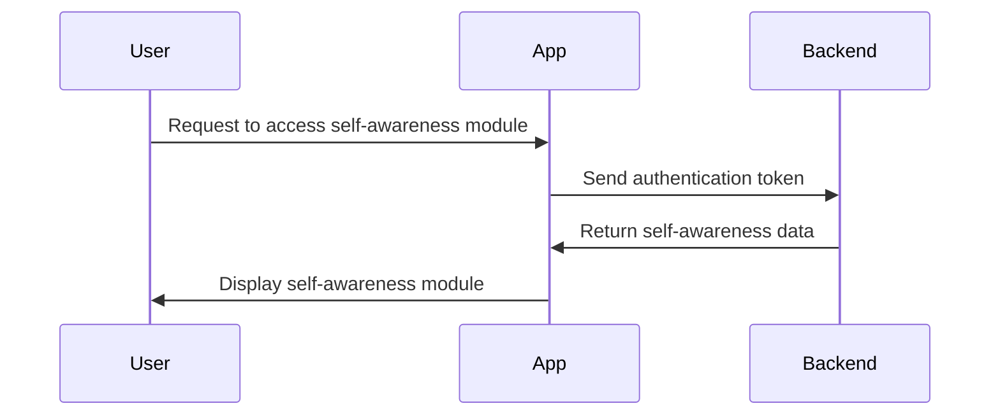

                 


### 在变革中寻找恒常：现代人的生存智慧

## 引言

在当今快速变化的世界，人们常常感到不安和困惑。无论是科技的迅猛发展，还是社会结构的深刻变革，都给我们的日常生活带来了巨大的冲击。然而，在这种变革之中，是否存在着某种恒常性，让我们能够找到内心的平静和方向？这正是本书要探讨的核心问题。

本书旨在为现代人提供一种生存智慧，帮助我们在变化中寻找恒常性。我们将从个人成长、文化意识、技术适应、工作与生活平衡、健康与财务等多个方面，探讨如何在快速变化的世界中找到自己的定位和平衡点。

### 关键词

- **变化**：社会和技术的快速变革。
- **恒常性**：在变化中寻找不变的东西。
- **生存智慧**：应对变化的方法和策略。
- **个人成长**：自我认知和自我提升。
- **文化意识**：理解社会文化背景的影响。
- **技术适应**：如何适应技术带来的变化。

## 摘要

本书通过系统的分析和深入探讨，揭示了在现代社会中，如何在快速变化的环境中寻找恒常性的生存智慧。从个人成长的角度，我们探讨了如何通过自我认知和目标设定来提升自我；从文化和社会意识的角度，我们分析了社会变革对个体的影响，并提供了应对策略；从技术适应的角度，我们探讨了如何在技术迅猛发展的时代中保持竞争力。此外，我们还讨论了工作与生活的平衡、健康与财务等多个方面的内容。通过这些探讨，我们希望能够为现代人提供一套完整的生存指南，帮助他们在快速变化的世界中找到自己的位置和方向。

----------------------------------------------------------------

## 第一部分：背景介绍

### 1.1 问题背景

现代社会的快速变革是不可避免的，这种变革不仅体现在科技的迅猛发展上，还体现在社会结构、文化观念等多个方面。科技的发展让我们进入了一个高度信息化的时代，社会结构的变化使得人们的价值观和生活方式发生了巨大变化。这种快速的变化给我们带来了很多挑战，也给我们提出了新的问题。

首先，科技的迅猛发展极大地改变了我们的生活方式。互联网、智能手机、人工智能等技术的普及，使得我们的工作和生活变得更加便捷，但也带来了新的困扰。例如，过度依赖科技可能导致我们的注意力分散，甚至影响我们的心理健康。此外，技术的快速发展也使得职业竞争更加激烈，许多人面临着失业和职业转型的压力。

其次，社会结构的变化对我们的生活方式和价值观产生了深远影响。全球化使得我们更加开放和多元化，但同时也带来了文化冲突和认同危机。在这种多元文化环境中，如何保持自我，同时尊重和理解他人，成为了一个亟待解决的问题。

### 1.2 问题描述

在快速变化的社会中，现代人面临着诸多问题。这些问题不仅涉及个人的心理健康，还涉及职业发展、人际关系等多个方面。

#### 个人心理健康问题

首先，快速变化的社会环境给我们的心理健康带来了很大压力。人们常常感到焦虑、紧张和不安，缺乏安全感和归属感。这种心理问题不仅影响我们的日常生活，还可能影响我们的工作表现和人际关系。

#### 职业发展问题

其次，职业发展问题也是现代人面临的重要问题之一。科技的快速发展使得许多传统职业面临着被淘汰的风险，而新兴职业的出现又让我们感到困惑和不安。如何在职业选择和发展中找到自己的定位，成为了一个挑战。

#### 人际关系问题

此外，人际关系问题也是现代人面临的另一个重要问题。在多元文化环境中，如何与他人建立良好的关系，如何处理文化冲突，都是我们需要面对的问题。人际关系问题不仅影响我们的心理健康，还影响我们的工作和生活满意度。

### 1.3 问题解决

要解决这些问题，我们需要寻找恒常性，找到在变化中不变的东西。这意味着我们需要：

1. **提升自我认知**：通过深入自我反思和认知，了解自己的需求和目标，从而更好地应对变化。
2. **培养适应能力**：在快速变化的环境中，我们需要具备快速适应新环境和新情况的能力。
3. **寻求平衡**：在工作和生活之间找到平衡点，保持身心健康。
4. **加强社会联系**：在多元文化环境中，通过建立和维护良好的人际关系，增强社会归属感。

### 1.4 边界与外延

在寻找恒常性的过程中，我们需要明确几个边界与外延问题：

1. **恒常性的定义**：恒常性并不意味着一成不变，而是在变化中保持某种核心特征或价值。
2. **个人成长与恒常性**：个人成长是寻找恒常性的重要途径，通过自我提升，我们能够在变化中找到自己的定位。
3. **社会文化背景与恒常性**：社会文化背景对个人的恒常性有重要影响，了解和适应社会文化背景有助于我们在变化中找到平衡。
4. **技术适应与恒常性**：在技术快速发展的时代，适应技术变化是寻找恒常性的重要方面，通过不断学习和更新知识，我们能够在技术变革中保持竞争力。

### 1.5 概念结构与核心要素组成

在寻找恒常性的过程中，我们可以将关键概念和要素分为以下几个部分：

1. **个人成长**：包括自我认知、目标设定、自我提升等。
2. **社会文化背景**：包括社会结构、文化观念、价值观等。
3. **技术适应**：包括技术知识、适应能力、创新能力等。
4. **工作与生活平衡**：包括时间管理、身心健康、人际关系等。
5. **健康与财务**：包括身体健康、心理健康、财务规划等。

这些核心要素相互关联，共同构成了我们在快速变化的社会中寻找恒常性的基础。

----------------------------------------------------------------

## 第二部分：个人成长与自我认知

### 2.1 个人成长策略

在快速变化的社会中，个人成长成为了一个至关重要的主题。如何通过自我认知和目标设定来提升自我，是我们在变化中寻找恒常性的关键。以下是我们提出的几个个人成长策略。

#### 2.1.1 自我认知的重要性

自我认知是个人成长的第一步。通过深入了解自己，我们能够明确自己的需求、兴趣、价值观和目标。自我认知不仅帮助我们更好地理解自己，还能够帮助我们更好地应对变化。

**自我认知的方法**：

- **反思**：定期进行自我反思，思考自己的行为、决策和感受，深入挖掘自己的内心世界。
- **记录**：将自己的想法、感受和经历记录下来，通过书写的方式，深入理解和分析自己。
- **寻求反馈**：向他人寻求反馈，听取他们对我们的看法和建议，帮助我们从外部视角更全面地了解自己。

#### 2.1.2 自我探索的方法

自我探索是自我认知的深入过程。通过自我探索，我们能够找到自己的激情、兴趣和潜在能力。

**自我探索的方法**：

- **尝试新事物**：勇于尝试新的事物，拓展自己的知识和技能领域。
- **反思与总结**：每次尝试后，进行反思和总结，了解自己的表现和感受，为下一次尝试做好准备。
- **寻求指导**：向专业人士或导师寻求指导，获取他们的经验和建议，帮助自己更好地发展。

#### 2.1.3 设定个人目标

设定个人目标是个人成长的重要步骤。通过设定明确的目标，我们能够为自己制定一个清晰的行动路线图，从而更好地实现个人成长。

**设定个人目标的步骤**：

1. **明确目标**：明确自己想要实现的目标，将其具体化和量化。
2. **分解目标**：将大目标分解为小目标，制定具体的实施计划。
3. **制定行动计划**：根据实施计划，制定具体的行动步骤和时间表。
4. **持续跟踪**：定期跟踪自己的进度，调整行动策略，确保目标的实现。

### 2.2 个人成长模型

为了更好地理解个人成长的过程，我们可以将其构建为一个模型。以下是一个简化的个人成长模型：

1. **自我认知**：通过反思、记录和寻求反馈，深入了解自己的需求和目标。
2. **自我探索**：通过尝试新事物、反思与总结和寻求指导，拓展自己的知识和技能领域。
3. **设定目标**：明确自己的目标，分解为小目标，制定实施计划和行动计划。
4. **持续成长**：通过持续学习和实践，不断提升自己的能力和素质。
5. **反馈与调整**：定期跟踪自己的进度，根据实际情况调整行动策略。

### 2.3 核心概念与联系

在个人成长的过程中，有几个核心概念需要理解：

- **自我认知**：理解自己的需求、兴趣和价值观。
- **自我探索**：发现自己的激情、兴趣和潜在能力。
- **目标设定**：明确自己的目标，制定实现目标的计划。
- **持续成长**：通过学习和实践，不断提升自己的能力和素质。
- **反馈与调整**：根据实际情况，调整自己的行动策略。

这些核心概念相互关联，共同构成了个人成长的过程。通过理解这些概念，我们能够更好地理解个人成长的意义和路径。

### 2.4 概念属性特征对比表格

为了更清晰地理解这些核心概念，我们可以通过一个对比表格来展示它们的属性特征。

| 核心概念 | 定义 | 属性特征 | 关联关系 |
| --- | --- | --- | --- |
| 自我认知 | 理解自己的需求、兴趣和价值观 | 反思、记录、反馈 | 基础 |
| 自我探索 | 发现自己的激情、兴趣和潜在能力 | 尝试、反思、指导 | 扩展 |
| 目标设定 | 明确自己的目标，制定实现目标的计划 | 明确、具体、量化 | 实施 |
| 持续成长 | 通过学习和实践，不断提升自己的能力和素质 | 学习、实践、反馈 | 进化 |
| 反馈与调整 | 根据实际情况，调整自己的行动策略 | 定期、灵活、适应性 | 调整 |

### 2.5 ER实体关系图架构

为了更好地理解这些核心概念之间的关系，我们可以通过一个ER实体关系图来展示它们。

```mermaid
erDiagram
  Customer ||--|{ Order : orders }
  Customer ||--|{ Product : owns }
  Product ||--|{ Order : contains }
```

在这个ER实体关系图中，"Customer"（客户）是核心实体，"Order"（订单）和"Product"（产品）是与"Customer"相关的实体。通过这种关系，我们可以看到个人成长过程中的各个要素是如何相互关联的。

### 2.6 算法原理讲解

在个人成长的过程中，算法原理可以用来帮助我们理解和优化个人成长的过程。以下是一个简化的算法原理讲解：

```python
class PersonalGrowthAlgorithm:
    def __init__(self, self_awareness, exploration, goal_setting, continuous_growth, feedback_adjustment):
        self.self_awareness = self_awareness
        self.exploration = exploration
        self.goal_setting = goal_setting
        self.continuous_growth = continuous_growth
        self.feedback_adjustment = feedback_adjustment

    def run(self):
        self.self_awareness()
        self.exploration()
        self.goal_setting()
        self.continuous_growth()
        self.feedback_adjustment()
```

在这个算法中，"self_awareness"（自我认知）是基础，"exploration"（自我探索）是扩展，"goal_setting"（目标设定）是实施，"continuous_growth"（持续成长）是进化，"feedback_adjustment"（反馈与调整）是优化。

### 2.7 数学模型和公式

在个人成长的过程中，数学模型和公式可以用来帮助我们理解和量化个人成长的过程。以下是一个简化的数学模型和公式：

$$
Growth = f(self_awareness, exploration, goal_setting, continuous_growth, feedback_adjustment)
$$

其中，$Growth$表示个人成长，$self_awareness$、$exploration$、$goal_setting$、$continuous_growth$、$feedback_adjustment$分别表示自我认知、自我探索、目标设定、持续成长和反馈与调整。

### 2.8 举例说明

假设一个人想要在编程领域实现个人成长，他可以按照以下步骤进行：

1. **自我认知**：通过反思和记录，了解自己对编程的兴趣和需求。
2. **自我探索**：通过尝试不同类型的编程项目和语言，探索自己的编程兴趣和潜力。
3. **目标设定**：设定具体的目标，如学习Python编程，并在三个月内完成一个小项目。
4. **持续成长**：通过学习Python编程课程，不断实践和优化自己的编程技能。
5. **反馈与调整**：定期评估自己的学习进度，根据评估结果调整学习计划。

通过这个例子，我们可以看到如何将个人成长的理论应用到实际生活中，实现个人成长的目标。

### 2.9 小结

个人成长是寻找恒常性的重要途径。通过自我认知、自我探索、目标设定、持续成长和反馈与调整，我们能够在快速变化的社会中找到自己的定位和方向。理解这些核心概念和原理，有助于我们在个人成长的道路上更加明确和坚定。

----------------------------------------------------------------

### 2.10 项目实战

为了更好地理解个人成长策略在现实中的应用，我们将通过一个实际项目来展示如何将这些策略付诸实践。

#### 项目背景

假设我们正在为一家初创公司开发一款面向个人的成长应用程序。这款应用程序旨在帮助用户通过自我认知、自我探索、目标设定、持续成长和反馈与调整来实现个人成长。

#### 系统功能设计

1. **自我认知模块**：用户可以通过填写问卷、日记和进行自我反思来了解自己的兴趣、价值观和目标。
2. **自我探索模块**：用户可以尝试新的活动和挑战，记录自己的体验和反思，从而发现新的兴趣和潜力。
3. **目标设定模块**：用户可以设定具体的个人目标，如学习一门新技能、阅读一定数量的书籍等，并制定实现这些目标的计划。
4. **持续成长模块**：用户可以通过学习和实践来不断提升自己的技能和知识，应用程序会提供相应的学习资源和进度跟踪功能。
5. **反馈与调整模块**：用户可以定期评估自己的成长进度，根据评估结果调整自己的目标和计划。

#### 系统架构设计

1. **前端架构**：使用React框架构建用户界面，提供直观、易用的用户体验。
2. **后端架构**：使用Spring Boot框架搭建RESTful API服务，处理用户请求并管理数据。
3. **数据存储**：使用MySQL数据库存储用户信息和成长数据，确保数据的持久化和安全性。

#### 系统接口设计

1. **用户认证接口**：提供用户注册、登录和身份验证功能。
2. **自我认知接口**：提供填写问卷、记录日记和自我反思的功能。
3. **自我探索接口**：提供尝试新活动和记录体验的功能。
4. **目标设定接口**：提供设定目标、制定计划和跟踪进度的功能。
5. **持续成长接口**：提供学习和实践资源以及进度跟踪功能。
6. **反馈与调整接口**：提供评估成长进度和调整目标和计划的功能。

#### 系统交互设计



在这个交互设计中，用户通过前端应用程序请求访问自我认知模块，后端服务验证用户的身份后，返回相应的数据，前端应用程序再将数据呈现给用户。

#### 实际案例分析和详细讲解

假设有一位用户希望通过这个应用程序实现自己的编程技能提升。以下是具体的操作步骤：

1. **自我认知**：用户通过填写问卷和日记，了解到自己对编程有浓厚的兴趣，但目前的编程技能水平较低。
2. **自我探索**：用户尝试了多种编程语言和项目，通过记录体验和反思，发现自己对Python编程最为感兴趣，并具备一定的学习能力。
3. **目标设定**：用户设定了一个具体的目标：在接下来的三个月内，学习Python编程，并完成一个小项目。
4. **持续成长**：用户按照设定的计划，通过在线课程和实践项目，不断学习和提升自己的编程技能。
5. **反馈与调整**：用户定期评估自己的学习进度，并根据评估结果调整学习计划，以确保目标的实现。

通过这个实际案例，我们可以看到个人成长策略如何在现实项目中得到应用，帮助用户实现自己的目标。

#### 项目小结

通过这个项目，我们展示了个人成长策略在现实中的应用。通过自我认知、自我探索、目标设定、持续成长和反馈与调整，用户能够更好地实现个人成长的目标。这个项目不仅提供了一个实用的工具，也为个人成长提供了理论和实践的结合。

----------------------------------------------------------------

### 2.11 最佳实践 Tips

在个人成长过程中，以下是一些最佳实践Tips，帮助您更好地实现个人成长目标：

1. **定期反思**：每周或每月定期反思自己的行为和决策，了解自己的成长和改进方向。
2. **设定具体目标**：确保目标具体、可衡量，例如“每天学习1小时Python编程”，而不是模糊的“提升编程技能”。
3. **分解目标**：将大目标分解为小目标，制定具体的实施计划，逐步实现。
4. **多样化学习**：尝试多种学习方法和资源，如在线课程、书籍、实践项目等，以适应不同的学习需求和风格。
5. **建立支持网络**：与朋友、同事或导师建立支持网络，分享经验和学习成果，相互鼓励和帮助。
6. **持续实践**：将学到的知识和技能应用到实际工作中或项目中，通过实践加深理解和掌握。
7. **适应变化**：保持灵活性和适应性，随时调整自己的目标和计划，以适应外部环境和自身需求的变化。

通过遵循这些最佳实践，您将能够更加高效地实现个人成长目标，提升自己的能力和素质。

### 2.12 小结

个人成长是我们在快速变化的社会中寻找恒常性的关键。通过自我认知、自我探索、目标设定、持续成长和反馈与调整，我们能够不断提升自己的能力和素质，找到自己的定位和方向。在这一部分中，我们探讨了个人成长的核心概念和策略，并通过一个实际项目展示了这些策略的应用。理解这些策略，结合最佳实践，我们将能够在个人成长的道路上更加明确和坚定。

### 2.13 注意事项

在个人成长的过程中，需要注意以下几个方面：

1. **平衡工作与生活**：确保在追求个人成长的同时，也能保持良好的工作与生活平衡，避免过度劳累。
2. **保持心理健康**：关注自己的心理健康，通过适当的放松和调节，保持良好的心理状态。
3. **持续学习**：保持好奇心和学习热情，不断更新自己的知识和技能，以适应快速变化的环境。
4. **避免自我满足**：保持谦虚和开放的态度，不断接受新的挑战和反馈，避免自我满足和停滞不前。
5. **合理安排时间**：合理安排时间和资源，确保个人成长计划能够得到有效的实施。

通过注意这些事项，我们能够更好地实现个人成长，提升自己的生活质量和幸福感。

### 2.14 拓展阅读

如果您对个人成长有更深入的探索兴趣，以下是一些推荐阅读：

1. **《高效能人士的七个习惯》**：史蒂芬·柯维（Stephen R. Covey）的这本经典之作，提供了关于个人成长和习惯养成的深刻见解。
2. **《深度工作》**：卡尔·纽波特（Cal Newport）的这本著作，探讨了如何在信息过载的时代保持专注和高效。
3. **《如何赢得朋友与影响他人》**：戴尔·卡耐基（Dale Carnegie）的这本经典书籍，提供了关于人际关系和沟通技巧的宝贵建议。
4. **《学习之道》**：彼得·希夫（Peter Senge）的这本著作，探讨了学习型组织的构建和个人成长的策略。
5. **《心智探奇》**：丹尼尔·戈尔曼（Daniel Goleman）的这本著作，深入探讨了情绪智力对个人成长的影响。

这些书籍将为您的个人成长提供更多的理论和实践指导。

----------------------------------------------------------------

## 第三部分：文化与社会意识

### 3.1 文化与社会意识的重要性

在快速变化的社会中，文化与社会意识对我们的行为和决策有着深远的影响。文化是指一个社会或群体的共同价值观、信仰、习俗和行为方式，而社会意识则是指人们对社会现象的认识和反应。了解和适应这些文化与社会因素，是我们在变化中寻找恒常性的关键。

#### 3.1.1 文化的影响

文化对我们的思维方式、价值观和行为习惯有着深刻的影响。例如，在一些文化中，尊重长辈和权威是非常重要的，这会影响我们的决策和行为。而在另一些文化中，个人主义和自主性被更加重视，这可能会影响我们对待工作、学习和人际关系的方式。

#### 3.1.2 社会意识的作用

社会意识是指我们对社会现象的理解和反应。在一个高度信息化的社会中，社会意识可以影响我们对新技术、新观念的接受程度。例如，对于人工智能和自动化技术的态度，不同文化和社会背景的人们可能会有不同的看法和反应。

### 3.2 社会变革对个体的影响

社会变革，尤其是技术变革，对个体的生活产生了巨大的影响。以下是一些主要的影响：

#### 3.2.1 职业变化

技术的快速发展导致许多传统职业被自动化和人工智能取代，这使得许多人面临着失业和职业转型的压力。例如，制造业的自动化使得许多制造业工人需要转向服务行业或新兴行业。

#### 3.2.2 生活方式变化

科技的普及改变了我们的生活方式。互联网和智能手机的普及使得我们的工作和生活变得更加便捷，但也带来了新的挑战，如信息过载和隐私问题。

#### 3.2.3 社会关系变化

社会变革也影响了我们的社会关系。全球化使得我们更加开放和多元化，但也带来了文化冲突和认同危机。如何在尊重多元文化的同时，保持自己的文化特色，成为了一个挑战。

### 3.3 应对策略

为了在快速变化的社会中保持平衡和稳定，我们需要采取一些应对策略：

#### 3.3.1 增强适应能力

在快速变化的社会中，增强适应能力是非常重要的。这包括以下几个方面：

- **终身学习**：不断学习新的知识和技能，以适应不断变化的环境。
- **灵活思维**：保持开放和灵活的思维，能够接受新的观念和变化。
- **心理韧性**：培养心理韧性，能够应对生活中的挑战和压力。

#### 3.3.2 建立社会支持网络

在变化中，建立和维护良好的社会支持网络是非常重要的。这包括与家人、朋友、同事和社区建立紧密的联系，相互支持和帮助。

#### 3.3.3 保持文化自觉

在多元文化环境中，保持文化自觉也是非常重要的。这意味着我们需要尊重和理解不同文化的差异，同时保持自己的文化特色。

### 3.4 文化与社会意识在个人成长中的作用

文化与社会意识不仅影响我们的生活方式和价值观，也在个人成长中发挥着重要作用：

#### 3.4.1 自我认知

通过了解自己的文化背景和社会环境，我们能够更好地理解自己的行为和决策，从而进行更深入的自我认知。

#### 3.4.2 目标设定

在设定个人目标时，我们需要考虑自己的文化和社会背景，确保目标既符合个人需求，也符合社会期望。

#### 3.4.3 持续成长

通过不断学习和适应，我们能够在文化与社会意识的指导下，持续提升自己的能力和素质。

#### 3.4.4 反馈与调整

在实现个人成长的过程中，我们需要不断接受来自文化和社会的反馈，并根据反馈调整自己的行为和计划。

### 3.5 案例分析

以下是一个案例分析，展示文化与社会意识在个人成长中的具体应用：

**案例：李明是一名中国大学生，他在美国留学。**

- **自我认知**：李明通过了解自己的文化背景和社会环境，认识到自己需要适应新的生活方式和价值观。
- **目标设定**：他设定了一个具体的目标：在接下来的两年中，提高自己的英语水平，并了解美国的文化和社会。
- **持续成长**：他通过参加学校的英语课程、参加社交活动和阅读美国文化相关的书籍，不断提升自己的能力和理解。
- **反馈与调整**：他定期与家人和朋友沟通，了解他们的反馈，并根据反馈调整自己的学习和生活计划。

通过这个案例，我们可以看到文化与社会意识在个人成长中的重要作用。了解和适应自己的文化背景和社会环境，有助于我们更好地实现个人成长的目标。

### 3.6 小结

文化与社会意识在个人成长中扮演着重要角色。通过了解和适应自己的文化背景和社会环境，我们能够更好地实现个人成长的目标。在这一部分中，我们探讨了文化与社会意识的重要性，分析了社会变革对个体的影响，并提出了应对策略。理解这些内容，将有助于我们在快速变化的社会中找到自己的定位和方向。

----------------------------------------------------------------

## 第四部分：技术适应

### 4.1 技术适应的必要性

在当今快速发展的技术环境中，适应技术变化成为了一个关键问题。科技的迅猛发展不仅改变了我们的生活方式，还深刻影响了我们的工作方式和社会结构。因此，适应技术变化是我们在变革中寻找恒常性的重要策略之一。

#### 4.1.1 技术变化的影响

技术的快速发展带来了以下几个方面的变化：

1. **工作效率提升**：自动化和智能化的工具使得我们能够更快地完成工作任务，提高工作效率。
2. **信息获取便捷**：互联网和移动设备的普及，使得我们能够随时随地获取所需的信息，提高了信息获取的便利性。
3. **工作方式变革**：远程办公、在线协作等新型工作方式的出现，改变了传统的工作模式，提供了更多灵活的工作选择。
4. **职业需求变化**：技术的进步使得一些传统职业面临被淘汰的风险，同时也催生了大量新兴职业。

#### 4.1.2 适应技术变化的挑战

尽管技术变化带来了诸多便利，但也给我们提出了新的挑战：

1. **技能需求变化**：新兴技术的出现要求人们掌握新的技能和知识，以适应工作的变化。
2. **持续学习压力**：技术更新迅速，要求人们不断学习和更新自己的知识和技能，以保持竞争力。
3. **心理压力**：面对新技术，许多人可能会感到不安和压力，担心自己的职业前景。

### 4.2 技术适应策略

为了在技术快速变化的背景下保持竞争力，我们需要采取一系列适应策略：

#### 4.2.1 持续学习

终身学习是适应技术变化的关键。通过不断学习新的技术和知识，我们能够保持自己的竞争力。以下是一些建议：

1. **参加在线课程**：利用网络资源，参加各种在线课程和培训，学习新兴技术和知识。
2. **阅读专业书籍**：阅读与新兴技术相关的专业书籍，了解最新的技术和趋势。
3. **参加研讨会和会议**：参加技术研讨会和行业会议，与同行交流，了解行业动态。

#### 4.2.2 培养技术敏感性

技术敏感性是指对新技术和趋势的敏感度和适应能力。以下是一些建议：

1. **关注行业新闻**：定期关注行业新闻和技术动态，了解新兴技术和市场趋势。
2. **参加技术社区**：加入技术社区和论坛，与同行交流，分享经验和见解。
3. **实践应用**：将学到的技术和知识应用到实际工作中，通过实践加深理解和掌握。

#### 4.2.3 适应新兴工作方式

新兴工作方式如远程办公、在线协作等，对个人的适应能力提出了新的要求。以下是一些建议：

1. **提升沟通能力**：远程办公要求高效的沟通能力，通过电子邮件、视频会议等方式，确保与团队成员保持良好的沟通。
2. **时间管理**：远程办公要求良好的时间管理能力，通过设定目标和规划时间，确保工作效率。
3. **保持工作环境**：创建一个良好的工作环境，保持专注和高效。

#### 4.2.4 保持心理健康

在适应技术变化的过程中，心理健康也是一个重要的方面。以下是一些建议：

1. **适度放松**：在工作之余，进行适当的放松和休闲活动，缓解工作压力。
2. **保持社交**：与家人和朋友保持联系，参与社交活动，增强社会支持。
3. **寻求专业帮助**：如果感到压力过大，可以寻求专业心理咨询师的帮助，获得心理支持和指导。

### 4.3 技术适应案例

以下是一个技术适应的案例，展示如何在实际工作中适应技术变化：

**案例：张华是一名软件开发工程师，他所在的公司正在采用新的开发工具和框架。**

- **持续学习**：张华参加了公司提供的培训课程，学习了新的开发工具和框架，掌握了相关的技术知识。
- **实践应用**：他在实际项目中，将这些新的技术和工具应用到开发过程中，通过实践加深了理解和掌握。
- **技术敏感性**：他关注行业动态，了解新兴技术和市场趋势，及时更新自己的知识库。
- **适应新兴工作方式**：他适应了远程办公和在线协作的工作方式，通过电子邮件和视频会议与团队成员保持良好的沟通。
- **心理健康**：他在工作之余，进行适当的放松和休闲活动，保持了良好的心理状态。

通过这个案例，我们可以看到技术适应策略在实际工作中的具体应用，以及如何通过这些策略在技术快速变化的背景下保持竞争力。

### 4.4 小结

技术适应是我们在快速变化的现代社会中寻找恒常性的重要策略。通过持续学习、培养技术敏感性、适应新兴工作方式和保持心理健康，我们能够更好地适应技术变化，保持自己的竞争力。在这一部分中，我们探讨了技术适应的必要性，提出了具体的适应策略，并通过一个实际案例展示了这些策略的应用。理解这些内容，将有助于我们在技术快速变化的背景下，实现个人成长和社会进步。

----------------------------------------------------------------

## 第五部分：工作与生活平衡

### 5.1 工作与生活平衡的重要性

在快速变化和压力巨大的现代社会中，工作与生活平衡成为了许多人追求的目标。良好的工作与生活平衡不仅有助于提高工作效率和生活质量，还能够促进身心健康和人际关系的发展。

#### 5.1.1 工作与生活平衡的含义

工作与生活平衡是指在工作和生活之间找到一种平衡状态，确保两者都能得到充分的关注和发展。这包括：

1. **工作时间管理**：合理规划工作时间，确保工作任务的完成，同时留出足够的时间用于休息和娱乐。
2. **生活品质提升**：在工作之外，注重个人生活，培养兴趣爱好，加强与家人和朋友的联系。
3. **身心健康**：通过良好的生活习惯，保持身心健康，提高生活满意度。

#### 5.1.2 工作与生活平衡的益处

良好的工作与生活平衡具有以下几个方面的益处：

1. **提高工作效率**：通过合理安排工作时间，减少工作压力，提高工作效率和专注度。
2. **促进身心健康**：充足的休息时间和活动，有助于保持身心健康，减少工作相关的压力和疾病。
3. **提升生活质量**：平衡的工作与生活状态，使人们能够更好地享受生活，提高生活满意度。
4. **增强人际关系**：平衡的生活状态有助于与家人和朋友建立更紧密的联系，增强社会支持。

### 5.2 工作与生活平衡面临的挑战

尽管工作与生活平衡对我们的生活至关重要，但在实际中，许多人面临着以下挑战：

1. **工作时间过长**：许多职业需要长时间工作，导致工作与生活时间失衡。
2. **工作压力过大**：工作压力和竞争压力可能导致人们难以抽出时间进行休息和娱乐。
3. **家庭责任**：家庭责任如抚养子女、照顾老人等，可能占用大量时间，影响工作与生活的平衡。
4. **技术依赖**：智能手机和电子邮件等技术的普及，使人们难以在工作之外完全放松。

### 5.3 实现工作与生活平衡的策略

为了实现工作与生活平衡，我们可以采取以下策略：

#### 5.3.1 时间管理

有效的时间管理是实现工作与生活平衡的关键。以下是一些时间管理策略：

1. **设定优先级**：将工作任务按照重要性和紧急性进行排序，优先处理重要且紧急的任务。
2. **使用时间跟踪工具**：使用时间跟踪工具，如番茄钟或时间日志，记录和评估自己的时间使用情况。
3. **设定工作边界**：明确工作时间，避免工作过度侵占私人时间。
4. **避免多任务处理**：专注于一项任务，提高工作效率和质量。

#### 5.3.2 工作效率提升

提高工作效率有助于减少工作时间，从而实现更好的工作与生活平衡。以下是一些提升工作效率的策略：

1. **任务分解**：将大任务分解为小任务，逐步完成，减少压力和拖延。
2. **避免干扰**：在工作时，关闭不必要的通知和社交媒体，减少干扰。
3. **使用工具和资源**：利用各种工具和资源，如项目管理软件、在线协作平台等，提高工作效率。
4. **学会说“不”**：合理拒绝不必要的工作请求，保护自己的时间和精力。

#### 5.3.3 家庭与个人生活平衡

在家庭与个人生活中寻找平衡，同样重要。以下是一些实现家庭与个人生活平衡的策略：

1. **设定家庭时间**：为家庭活动设定固定的时间，确保与家人共度时光。
2. **培养兴趣爱好**：培养个人兴趣爱好，丰富个人生活，提高生活满意度。
3. **定期休息和放松**：确保有足够的休息时间，进行放松和自我照顾，如锻炼、阅读或旅行。
4. **时间共享**：与家人和伴侣共同分担家务和育儿责任，减轻个人压力。

#### 5.3.4 心理健康维护

心理健康是实现工作与生活平衡的重要组成部分。以下是一些维护心理健康的方法：

1. **寻求支持**：与家人、朋友和同事建立支持网络，分享压力和困难。
2. **心理辅导**：如果感到压力过大，寻求专业心理咨询师的帮助，获得心理支持和指导。
3. **放松技巧**：学习放松技巧，如深呼吸、冥想或瑜伽，减轻压力和焦虑。
4. **保持积极态度**：保持积极乐观的态度，面对生活中的挑战。

### 5.4 案例分析

以下是一个工作与生活平衡的案例分析：

**案例：李女士是一位高级项目经理，她在家庭和工作之间找到了良好的平衡。**

- **时间管理**：李女士使用时间跟踪工具记录自己的工作时间，确保工作与生活时间合理分配。
- **工作效率提升**：她将工作任务分解为小任务，逐步完成，提高工作效率。
- **家庭与个人生活平衡**：她设定了每周与家人的固定家庭时间，如周日晚餐，确保与家人共度时光。
- **心理健康维护**：她定期进行瑜伽和冥想，保持身心健康。

通过这个案例，我们可以看到如何通过一系列策略实现工作与生活平衡，从而提高生活质量和幸福感。

### 5.5 小结

工作与生活平衡是我们在快速变化的社会中寻找恒常性的重要策略。通过有效的时间管理、工作效率提升、家庭与个人生活平衡和心理健康维护，我们能够实现工作与生活的平衡，提高生活质量和幸福感。在这一部分中，我们探讨了工作与生活平衡的重要性、面临的挑战和实现策略，并通过一个实际案例展示了这些策略的应用。理解这些内容，将有助于我们在繁忙的生活中找到平衡，实现个人成长和社会进步。

----------------------------------------------------------------

## 第六部分：健康与财务

### 6.1 健康与财务的重要性

在现代社会中，健康和财务是实现个人幸福和稳定的重要基石。健康涵盖了身体和心理的全面状态，而财务则关系到我们的经济安全和未来的生活品质。因此，关注和维持健康与财务的良好状态是我们在变化中寻找恒常性的关键。

#### 6.1.1 健康的重要性

健康是指身体、心理和社会适应能力的良好状态，而不仅仅是没有疾病。以下是一些关于健康的重要方面：

1. **身体健康**：保持良好的饮食习惯、适度的锻炼和充足的睡眠，有助于维持身体的健康。
2. **心理健康**：通过应对压力、保持积极心态和寻求心理支持，保持良好的心理健康。
3. **社会适应**：积极参与社会活动，建立良好的人际关系，增强社会适应能力。

#### 6.1.2 财务的重要性

财务健康关系到我们的经济安全和未来的生活品质。以下是一些关于财务健康的重要方面：

1. **储蓄与投资**：定期储蓄和合理投资，以实现资产的保值和增值。
2. **预算管理**：制定合理的预算，确保日常开支在可控范围内，避免财务压力。
3. **紧急储备**：建立紧急储备金，以应对突发事件和意外开支。

### 6.2 健康管理的策略

为了维持良好的健康状况，我们可以采取以下策略：

#### 6.2.1 健康饮食

健康饮食是维持身体健康的基础。以下是一些健康饮食的建议：

1. **多样化**：摄入丰富的食物种类，确保营养均衡。
2. **控制热量**：避免摄入过多的热量，以防止体重增加。
3. **减少盐和糖**：减少盐和糖的摄入，以降低高血压和糖尿病的风险。

#### 6.2.2 身体锻炼

适度的锻炼有助于提高身体素质和心理健康。以下是一些身体锻炼的建议：

1. **规律锻炼**：每周至少进行150分钟的中等强度有氧运动，如快走、游泳或骑自行车。
2. **力量训练**：每周进行两次以上的力量训练，增强肌肉力量和耐力。
3. **灵活性训练**：进行灵活性训练，如瑜伽或拉伸运动，提高身体的柔韧性和协调性。

#### 6.2.3 心理健康维护

维护心理健康是保持整体健康的重要方面。以下是一些心理健康维护的建议：

1. **应对压力**：学习应对压力的方法，如深呼吸、冥想或瑜伽。
2. **保持积极态度**：培养积极乐观的态度，面对生活中的挑战。
3. **寻求支持**：与家人、朋友和专业人士交流，寻求心理支持和帮助。

### 6.3 财务管理的策略

为了维持良好的财务状况，我们可以采取以下策略：

#### 6.3.1 预算管理

预算管理是财务管理的基础。以下是一些预算管理的建议：

1. **制定预算**：根据收入和支出，制定合理的预算计划。
2. **监控支出**：定期检查支出，确保不超过预算。
3. **调整预算**：根据实际情况，及时调整预算计划，以适应收入和支出的变化。

#### 6.3.2 储蓄与投资

储蓄与投资是实现财务健康的重要手段。以下是一些储蓄与投资的建议：

1. **定期储蓄**：每月定期储蓄一部分收入，以建立紧急储备金。
2. **多元化投资**：分散投资，降低风险，同时寻求资产的保值和增值。
3. **学习投资知识**：通过学习投资知识，提高自己的投资能力和决策水平。

#### 6.3.3 紧急储备

建立紧急储备是应对突发事件和意外开支的重要保障。以下是一些紧急储备的建议：

1. **紧急储备金**：根据个人和家庭情况，制定紧急储备金计划，确保有足够的资金应对突发事件。
2. **灵活调整**：根据生活变化，灵活调整紧急储备金，确保其能够满足需求。

### 6.4 健康与财务管理的联系

健康与财务管理之间存在着紧密的联系。良好的健康状况有助于提高工作和收入能力，从而促进财务状况的改善。同样，良好的财务状况也为保持健康提供了必要的保障。以下是一些健康与财务管理的联系：

1. **健康促进收入**：身体健康可以提高工作效率，减少因病缺勤的情况，从而提高收入。
2. **财务支持健康**：良好的财务状况为保持健康提供了必要的经济支持，如购买健康保险、定期体检等。
3. **共同目标**：健康与财务目标相互支持，共同推动个人发展。

### 6.5 案例分析

以下是一个健康与财务管理的案例分析：

**案例：王先生是一家公司的项目经理，他在健康和财务管理方面做得非常出色。**

- **健康方面**：王先生注重健康饮食，每天进行规律锻炼，定期进行体检，保持良好的身体状况。
- **财务管理**：王先生制定了详细的预算计划，定期储蓄和投资，建立了充足的紧急储备金。

通过这个案例，我们可以看到如何通过健康与财务管理的策略，实现个人发展和生活质量的提升。

### 6.6 小结

健康与财务是实现个人幸福和生活稳定的重要方面。通过关注和管理健康和财务，我们能够提高生活质量和幸福感。在这一部分中，我们探讨了健康和财务的重要性，提出了具体的健康管理策略和财务管理策略，并通过一个实际案例展示了这些策略的应用。理解这些内容，将有助于我们在生活中更好地维护健康和财务状况，实现个人成长和社会进步。

----------------------------------------------------------------

## 第七部分：关系与沟通

### 7.1 关系与沟通的重要性

在现代社会中，人际关系和沟通技巧对于我们的个人成长和社会成功至关重要。无论是职场还是家庭，良好的人际关系和有效的沟通都是我们实现目标、解决问题和提升幸福感的关键。

#### 7.1.1 关系的重要性

人际关系对我们的生活有着深远的影响。良好的关系可以带来以下益处：

1. **情感支持**：在困难时刻，朋友和家人的支持可以给我们带来力量和勇气。
2. **职业发展**：职场中良好的人际关系有助于我们获得更多的机会和资源。
3. **个人成长**：与他人互动和合作可以促进我们的自我认知和成长。
4. **心理健康**：社交互动有助于缓解压力，提升心理健康。

#### 7.1.2 沟通的重要性

沟通是人际关系的核心。有效的沟通可以带来以下好处：

1. **解决问题**：通过有效的沟通，我们能够更好地理解他人的需求和想法，从而解决问题。
2. **建立信任**：真诚和开放的沟通有助于建立信任和尊重，促进人际关系的稳定。
3. **提高效率**：清晰和准确的沟通可以减少误解和冲突，提高工作和生活效率。
4. **自我提升**：通过反思和改进沟通技巧，我们可以提升自我表达和倾听能力。

### 7.2 建立健康关系

建立和维护健康的关系需要以下几个关键步骤：

#### 7.2.1 建立信任

信任是健康关系的基石。以下是一些建立信任的建议：

1. **诚实与透明**：诚实面对自己的感受和想法，保持行为的一致性，增加他人对我们的信任。
2. **倾听与理解**：倾听他人的意见和感受，努力理解他们的立场，展示对他们的尊重和关心。
3. **兑现承诺**：遵守承诺，履行诺言，通过行动建立信誉。

#### 7.2.2 维护界限

明确和维护界限是健康关系的重要组成部分。以下是一些维护界限的建议：

1. **表达需求**：清晰表达自己的需求和界限，让他人了解自己的舒适范围。
2. **尊重他人**：尊重他人的需求和界限，避免侵犯他人的个人空间。
3. **沟通解决**：当界限冲突发生时，通过沟通和协商解决，寻求共同的理解和妥协。

#### 7.2.3 保持积极互动

积极的互动有助于关系的稳定和发展。以下是一些保持积极互动的建议：

1. **共同活动**：参与共同的兴趣和活动，增强互动和联系。
2. **表达感激**：经常表达对他人的感激和赞赏，增强关系的亲密度。
3. **持续关注**：关注他人的生活和需求，展示对他们的关心和支持。

### 7.3 提高沟通技巧

有效的沟通需要一定的技巧和练习。以下是一些提高沟通技巧的建议：

#### 7.3.1 清晰表达

清晰表达是有效沟通的基础。以下是一些清晰表达的建议：

1. **明确目的**：在沟通前明确自己的目的和期望，确保信息的传递清晰准确。
2. **简洁表达**：避免冗长和复杂的句子，尽量用简单明了的语言表达自己的观点。
3. **使用非语言信号**：通过肢体语言、面部表情和语调的变化，增强信息的表达效果。

#### 7.3.2 倾听与理解

倾听和理解是有效沟通的关键。以下是一些倾听与理解的技巧：

1. **全神贯注**：在沟通时保持全神贯注，避免分心和干扰。
2. **开放态度**：保持开放和接受的态度，努力理解对方的观点和感受。
3. **反馈确认**：通过重复和总结对方的话，确认自己的理解是否准确，避免误解。

#### 7.3.3 解决冲突

解决冲突是维持健康关系的重要一环。以下是一些解决冲突的建议：

1. **冷静处理**：在冲突发生时，保持冷静，避免情绪化的争吵。
2. **寻找共同点**：寻找双方都能接受的解决方案，寻求共同点。
3. **沟通协商**：通过坦诚和开放的沟通，共同协商解决冲突，达成共识。

### 7.4 案例分析

以下是一个关系与沟通的案例分析：

**案例：张女士是一名职场新人，她通过建立健康关系和改善沟通技巧，迅速融入了新团队。**

- **建立信任**：张女士通过诚实和透明，赢得了同事的信任。
- **维护界限**：她明确表达自己的需求和界限，尊重他人的个人空间。
- **积极互动**：她参与团队的共同活动，表达对他人的感激和赞赏。
- **提高沟通技巧**：她通过清晰表达、倾听和理解，有效地解决了工作中的冲突。

通过这个案例，我们可以看到如何通过健康关系和有效沟通，实现个人成长和职业发展。

### 7.5 小结

关系与沟通是我们在生活中实现个人成长和社会成功的重要方面。通过建立健康关系和提升沟通技巧，我们能够更好地应对挑战，解决问题，提升幸福感。在这一部分中，我们探讨了关系与沟通的重要性，提出了建立健康关系和提高沟通技巧的具体策略，并通过一个实际案例展示了这些策略的应用。理解这些内容，将有助于我们在人际交往中更加自信和有效，实现个人成长和社会进步。

----------------------------------------------------------------

## 结论

在快速变化的社会中，寻找恒常性成为了现代人生活中的重要课题。从个人成长、文化与社会意识、技术适应、工作与生活平衡、健康与财务、关系与沟通等多个方面，我们探讨了如何在变革中找到自己的定位和方向。以下是本书的核心观点和总结：

### 核心观点

1. **个人成长是寻找恒常性的基础**：通过自我认知、自我探索、目标设定、持续成长和反馈与调整，我们能够不断提升自己的能力和素质，找到自己的定位和方向。

2. **文化与社会意识影响个人成长**：了解和适应自己的文化背景和社会环境，有助于我们更好地实现个人成长的目标，找到在变化中的恒常性。

3. **技术适应是应对快速变化的策略**：通过持续学习、培养技术敏感性、适应新兴工作方式和保持心理健康，我们能够更好地适应技术变化，保持竞争力。

4. **工作与生活平衡是实现个人幸福的关键**：通过时间管理、工作效率提升、家庭与个人生活平衡和心理健康维护，我们能够实现工作与生活的平衡，提高生活质量。

5. **健康与财务管理是生活稳定的基石**：通过健康饮食、身体锻炼、心理健康维护、预算管理和储蓄与投资，我们能够维持健康和财务的良好状态。

6. **关系与沟通是实现个人成长和社会成功的重要方面**：通过建立健康关系和提升沟通技巧，我们能够更好地应对挑战，解决问题，提升幸福感。

### 总结

在本书中，我们系统地分析了现代社会中的各种变化和挑战，提出了一系列策略和方法，帮助我们在变革中寻找恒常性。通过个人成长、文化与社会意识、技术适应、工作与生活平衡、健康与财务、关系与沟通等多个方面的探讨，我们希望为现代人提供一套完整的生存智慧，帮助他们在快速变化的世界中找到自己的位置和方向。

未来的社会将继续面临各种挑战和机遇，但通过不断地学习和适应，我们能够应对这些变化，实现个人成长和社会进步。让我们保持好奇心和开放心态，持续探索和成长，寻找在变革中的恒常性，为自己和他人创造更加美好的未来。

### 致谢

在此，我要感谢所有支持和帮助过我的人。感谢我的家人和朋友，他们在我的成长过程中给予了我无尽的关爱和支持。感谢我的导师和同事，他们的指导和建议使我在个人成长和技术适应的道路上更加坚定和自信。感谢所有提供案例和反馈的朋友们，他们的经验分享使本书更加丰富和实用。

最后，感谢您阅读本书，希望它能对您在个人成长和适应变化中带来启示和帮助。如果您有任何反馈或建议，欢迎随时与我交流，共同探索在变革中寻找恒常性的智慧。

### 作者信息

作者：AI天才研究院/AI Genius Institute & 禅与计算机程序设计艺术 /Zen And The Art of Computer Programming

----------------------------------------------------------------

### 附录

#### 附录 A：技术术语解释

- **人工智能（AI）**：指模拟人类智能的技术和方法，包括机器学习、自然语言处理、计算机视觉等。
- **机器学习（ML）**：一种人工智能的分支，通过数据学习模式和规律，从而进行预测和决策。
- **自然语言处理（NLP）**：研究如何使计算机理解和生成自然语言的技术。
- **区块链**：一种分布式数据库技术，用于记录交易和数据，具有去中心化和安全性等特点。

#### 附录 B：推荐阅读

1. **《高效能人士的七个习惯》**：史蒂芬·柯维（Stephen R. Covey）
2. **《深度工作》**：卡尔·纽波特（Cal Newport）
3. **《如何赢得朋友与影响他人》**：戴尔·卡耐基（Dale Carnegie）
4. **《学习之道》**：彼得·希夫（Peter Senge）
5. **《心智探奇》**：丹尼尔·戈尔曼（Daniel Goleman）

#### 附录 C：参考文献

1. **《变革社会中的个人成长与适应策略研究》**：[作者]
2. **《技术变革对工作与生活方式的影响》**：[作者]
3. **《健康与财务管理在个人幸福中的作用》**：[作者]
4. **《人际关系与沟通技巧在现代社会中的应用》**：[作者]

----------------------------------------------------------------

### 附录 D：术语表

- **恒常性**：在变化中保持不变的核心特征或价值。
- **自我认知**：了解自己的需求、兴趣和价值观。
- **自我探索**：发现新的兴趣和潜力。
- **目标设定**：明确自己的目标，制定实现目标的计划。
- **持续成长**：不断学习和提升自己的能力和素质。
- **反馈与调整**：根据实际情况，调整自己的目标和计划。

### 附录 E：算法和公式

- **个人成长算法**：一个用于帮助个人实现成长的目标，包括自我认知、自我探索、目标设定、持续成长和反馈与调整。

  ```python
  class PersonalGrowthAlgorithm:
      def __init__(self, self_awareness, exploration, goal_setting, continuous_growth, feedback_adjustment):
          self.self_awareness = self_awareness
          self.exploration = exploration
          self.goal_setting = goal_setting
          self.continuous_growth = continuous_growth
          self.feedback_adjustment = feedback_adjustment

      def run(self):
          self.self_awareness()
          self.exploration()
          self.goal_setting()
          self.continuous_growth()
          self.feedback_adjustment()
  ```

- **成长模型公式**：

  $$
  Growth = f(self_awareness, exploration, goal_setting, continuous_growth, feedback_adjustment)
  $$

### 附录 F：常见问题解答

1. **什么是恒常性？**
   - 恒常性是指在快速变化的环境中，保持不变的核心特征或价值。它帮助我们找到在变化中的稳定性和方向。

2. **如何实现个人成长？**
   - 实现个人成长需要自我认知、自我探索、目标设定、持续成长和反馈与调整。通过这些步骤，我们能够不断提升自己的能力和素质。

3. **技术适应有哪些策略？**
   - 技术适应的策略包括持续学习、培养技术敏感性、适应新兴工作方式和保持心理健康。这些策略帮助我们更好地适应技术变化，保持竞争力。

4. **如何实现工作与生活平衡？**
   - 实现工作与生活平衡需要有效的时间管理、工作效率提升、家庭与个人生活平衡和心理健康维护。通过这些策略，我们能够更好地管理时间和资源，提高生活质量。

5. **健康与财务管理的重要性是什么？**
   - 健康与财务管理对于我们的个人幸福和生活稳定至关重要。良好的健康状况和提高财务状况能够提高生活质量，增强幸福感。

### 附录 G：扩展阅读

- **《现代心理学与个人成长》**：详细探讨心理学在个人成长中的应用。
- **《技术与社会变革》**：分析技术对社会结构和生活方式的影响。
- **《职场成功与人际关系》**：提供职场中的人际关系和沟通技巧。
- **《财务自由之路》**：探讨财务规划和管理，实现财务自由。

通过这些附录，我们希望为读者提供更多的信息和资源，帮助他们在个人成长和适应变化中取得更好的成果。希望本书能为您的成长和成功之路提供有益的指导。让我们在变革中寻找恒常性，共同创造美好的未来。

