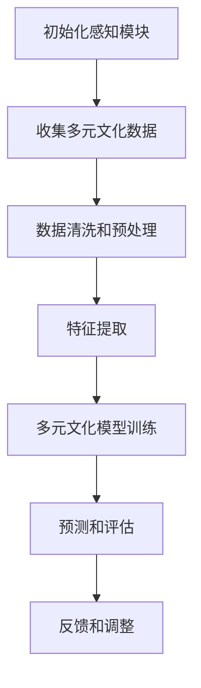
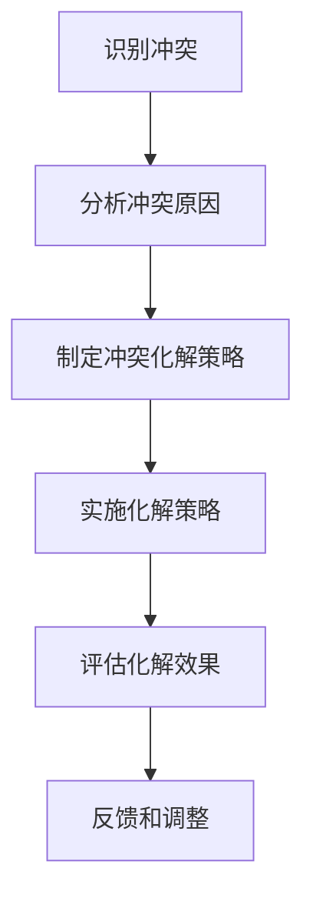
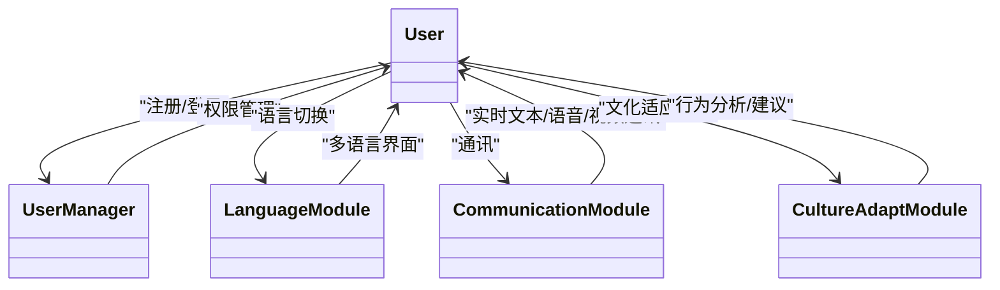
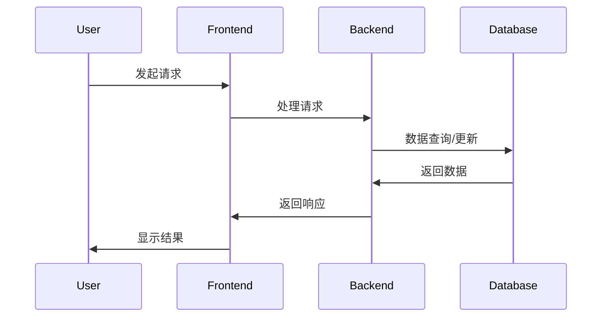
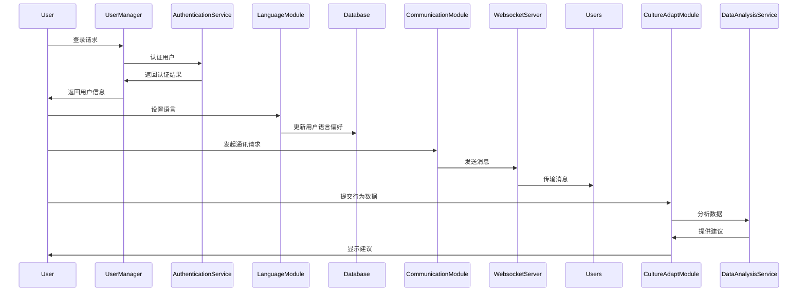

                 


### 后现代社会中的价值观多元化挑战

在当今的后现代社会中，我们面临着前所未有的价值观多元化挑战。这个现象不仅仅局限于文化领域，还渗透到经济、政治、社会等多个层面。为了深入理解这一挑战，我们需要首先明确几个核心概念。

#### 后现代社会的概念

后现代社会是一个术语，用以描述现代社会从现代化阶段转向的一个阶段。这个阶段的特点包括：

- **反思现代性的局限**：对现代化过程中产生的种种问题进行反思，如物质主义、消费主义、社会分层等。
- **多元文化共存**：全球化的影响使得不同文化之间的交流更加频繁，从而形成了多元文化的共存。
- **信息爆炸**：互联网的普及使得信息传播速度加快，信息量呈爆炸性增长。

#### 价值观多元化的挑战

价值观多元化挑战主要体现在以下几个方面：

- **文化冲突**：不同文化之间由于价值观的差异而产生的冲突。
- **身份认同**：在多元文化背景下，个体如何找到自己的身份认同。
- **政治分歧**：不同价值观的政治派别之间的对立和分歧。

### 核心概念与联系

为了更好地理解后现代社会中的价值观多元化挑战，我们需要定义并解释几个核心概念，并展示它们之间的联系。

#### 核心概念

- **后现代社会**：如上所述，是一个反思现代化局限、多元文化共存、信息爆炸的社会。
- **价值观多元化**：指在一个社会中有多种不同的价值观并存，这些价值观可能来源于不同的文化背景、宗教信仰、个人经历等。
- **文化适应**：指个体或组织在多元文化环境中，通过调整自己的行为和观念，以更好地适应和融入这个环境。

#### 概念属性特征对比表格

| 概念         | 定义                                                         | 属性特征                                       |
| ------------ | ------------------------------------------------------------ | ---------------------------------------------- |
| 后现代社会   | 反思现代化局限、多元文化共存、信息爆炸的社会                  | 1. 反思性 2. 多元文化性 3. 信息性              |
| 价值观多元化 | 在一个社会中有多种不同的价值观并存                          | 1. 多样性 2. 互补性 3. 对立性                  |
| 文化适应    | 个体或组织在多元文化环境中，通过调整自己的行为和观念，以更好地适应和融入这个环境 | 1. 调整性 2. 适应性 3. 灵活性                  |

#### 后现代社会中的价值观多元化ER图

```mermaid
erDiagram
  后现代社会 ||--|{ 价值观多元化 }
  价值观多元化 ||--|{ 文化适应 }
```

### 本章小结

在后现代社会中，价值观多元化挑战已成为一个不容忽视的问题。理解后现代社会和价值观多元化的概念，以及它们之间的联系，是应对这一挑战的第一步。接下来，我们将探讨如何在后现代社会中实现文化适应与交流，以及个人如何在这个多元化环境中寻找意义。

---

### 让我们一步一步深入思考：

**第一步：理解后现代社会的概念**

后现代社会是一个反思现代化局限的社会，它不是简单地拒绝现代化，而是对现代化过程中产生的种种问题进行深刻的反思。这种反思体现在多个方面：

1. **反思现代性的局限**：现代社会的发展带来了很多好处，比如经济增长、科技进步、民主政治等，但同时也带来了物质主义、消费主义、社会分层等负面问题。后现代社会通过批判和反思，试图寻找解决这些问题的方法。

2. **多元文化共存**：全球化使得不同文化之间的交流变得更加频繁，这种交流不仅限于国家之间的贸易和外交，还包括文化、价值观和生活方式的交流。这导致了多元文化的共存，使得社会更加丰富多彩。

3. **信息爆炸**：互联网的普及使得信息传播速度大大加快，信息量呈爆炸性增长。这种信息爆炸给人们带来了便利，但同时也增加了信息过载的风险，使得个体很难从中筛选出有价值的信息。

**第二步：理解价值观多元化的挑战**

价值观多元化挑战主要体现在以下几个方面：

1. **文化冲突**：不同文化之间由于价值观的差异而产生的冲突。例如，在全球化过程中，西方的价值观与东方的价值观可能会发生冲突。

2. **身份认同**：在多元文化背景下，个体如何找到自己的身份认同。这是一个复杂的问题，因为个体的身份不仅仅受文化背景的影响，还受到个人经历、宗教信仰等多种因素的影响。

3. **政治分歧**：不同价值观的政治派别之间的对立和分歧。这种分歧在政治选举、政策制定等过程中表现得尤为明显。

**第三步：探讨核心概念与联系**

理解后现代社会和价值观多元化之间的关系，有助于我们更好地应对这个时代的挑战。以下是几个核心概念及其之间的联系：

- **后现代社会**：一个反思现代化局限、多元文化共存、信息爆炸的社会。
- **价值观多元化**：在一个社会中有多种不同的价值观并存。
- **文化适应**：个体或组织在多元文化环境中，通过调整自己的行为和观念，以更好地适应和融入这个环境。

**核心概念与联系表格**

| 概念         | 定义                                                         | 属性特征                                       |
| ------------ | ------------------------------------------------------------ | ---------------------------------------------- |
| 后现代社会   | 反思现代化局限、多元文化共存、信息爆炸的社会                  | 1. 反思性 2. 多元文化性 3. 信息性              |
| 价值观多元化 | 在一个社会中有多种不同的价值观并存                          | 1. 多样性 2. 互补性 3. 对立性                  |
| 文化适应    | 个体或组织在多元文化环境中，通过调整自己的行为和观念，以更好地适应和融入这个环境 | 1. 调整性 2. 适应性 3. 灵活性                  |

**ER图**

```mermaid
erDiagram
  后现代社会 ||--|{ 价值观多元化 }
  价值观多元化 ||--|{ 文化适应 }
```

通过上述分析，我们可以看到后现代社会中的价值观多元化挑战是一个复杂且多维的问题。理解这一挑战的第一步是明确相关核心概念及其之间的联系。在接下来的章节中，我们将深入探讨如何在后现代社会中实现文化适应与交流，以及个人如何在这个多元化环境中寻找意义。

---

### 第1章：后现代社会概述

在后现代社会的背景下，理解这一现象及其带来的价值观多元化挑战变得尤为重要。本章将首先介绍后现代社会的概念，包括其背景、特征和影响，然后深入探讨价值观多元化的定义、表现和挑战，最后总结本章的核心概念和联系。

#### 1.1 问题背景

后现代社会是一个相对于现代化社会而言的概念，它标志着现代社会从一种基于工业化和科学理性主义的模式向更加多元化、反思性和批判性的模式转变。这一转变的背景包括以下几个方面：

1. **现代化的局限**：现代化带来了经济增长、科技进步和民主政治，但同时也引发了环境恶化、社会不公和人际关系疏离等问题。
2. **全球化的加速**：全球化使得不同国家和文化之间的交流更加频繁，促进了文化的多元化，但同时也加剧了文化冲突和政治对立。
3. **信息技术的发展**：互联网的普及和信息技术的发展使得信息传播更加迅速，信息过载和隐私问题也随之出现。

#### 1.2 后现代社会的特征

后现代社会具有以下几个显著特征：

1. **反思性**：后现代社会对现代化过程中产生的问题进行反思和批判，寻求更加人性化和可持续的发展道路。
2. **多元文化性**：后现代社会强调文化的多样性和包容性，鼓励不同文化之间的交流与融合。
3. **信息爆炸**：信息技术的飞速发展使得信息传播速度大大加快，信息过载成为普遍现象。

#### 1.3 价值观多元化的挑战

价值观多元化是后现代社会的一个重要特征，它带来了以下挑战：

1. **文化冲突**：不同价值观之间的差异可能导致文化冲突，影响社会的和谐稳定。
2. **身份认同**：在多元文化背景下，个体需要找到自己的身份认同，这既是一个挑战，也是一个机遇。
3. **政治分歧**：不同价值观的政治派别之间的对立和分歧可能影响政治稳定和政策制定。

#### 1.4 核心概念与联系

为了更好地理解后现代社会和价值观多元化之间的关系，我们需要定义并解释几个核心概念，并展示它们之间的联系。

1. **后现代社会**：一个反思现代化局限、多元文化共存、信息爆炸的社会。
2. **价值观多元化**：在一个社会中有多种不同的价值观并存。
3. **文化适应**：个体或组织在多元文化环境中，通过调整自己的行为和观念，以更好地适应和融入这个环境。

**核心概念与联系表格**

| 概念         | 定义                                                         | 属性特征                                       |
| ------------ | ------------------------------------------------------------ | ---------------------------------------------- |
| 后现代社会   | 反思现代化局限、多元文化共存、信息爆炸的社会                  | 1. 反思性 2. 多元文化性 3. 信息性              |
| 价值观多元化 | 在一个社会中有多种不同的价值观并存                          | 1. 多样性 2. 互补性 3. 对立性                  |
| 文化适应    | 个体或组织在多元文化环境中，通过调整自己的行为和观念，以更好地适应和融入这个环境 | 1. 调整性 2. 适应性 3. 灵活性                  |

**ER图**

```mermaid
erDiagram
  后现代社会 ||--|{ 价值观多元化 }
  价值观多元化 ||--|{ 文化适应 }
```

#### 1.5 本章小结

本章对后现代社会及其价值观多元化挑战进行了概述。我们首先介绍了后现代社会的背景和特征，然后探讨了价值观多元化的定义和挑战，最后明确了核心概念之间的联系。理解这些概念有助于我们更好地应对后现代社会中的挑战，并在多元文化环境中寻找意义。

---

### 文化适应与价值观多元化的关系

在后现代社会中，文化适应成为了一个重要的课题。文化适应不仅仅是指个体在新的文化环境中调整自己的行为和观念，更重要的是，它涉及到个体如何在价值观多元化的背景下找到自己的位置和身份认同。为了深入理解文化适应与价值观多元化之间的关系，我们可以从以下几个角度进行分析。

#### 文化适应的定义与重要性

**文化适应**是指个体或组织在新的文化环境中，通过调整自己的行为和观念，以更好地适应和融入这个环境的过程。文化适应的重要性在于：

1. **促进社会和谐**：文化适应有助于减少文化冲突，促进不同文化之间的相互理解和尊重，从而增进社会的和谐与稳定。
2. **提升个人幸福感**：通过文化适应，个体可以更好地融入新的文化环境，找到自己的位置和归属感，提高个人的幸福感和生活质量。
3. **增强组织竞争力**：在全球化背景下，组织需要适应多元文化的市场环境，通过文化适应提高员工的凝聚力和创新能力，从而增强组织的竞争力。

#### 价值观多元化的定义与挑战

**价值观多元化**是指在同一个社会中，存在多种不同的价值观，这些价值观可能来源于不同的文化背景、宗教信仰、个人经历等。价值观多元化的挑战主要包括：

1. **文化冲突**：不同价值观之间的差异可能导致文化冲突，影响社会的和谐稳定。
2. **身份认同**：在多元文化背景下，个体需要找到自己的身份认同，这既是一个挑战，也是一个机遇。
3. **政治分歧**：不同价值观的政治派别之间的对立和分歧可能影响政治稳定和政策制定。

#### 文化适应与价值观多元化的关系

文化适应与价值观多元化之间存在着密切的关系：

1. **相互影响**：文化适应是一个动态的过程，它不仅受到个体价值观的影响，也受到周围文化环境的影响。同样，价值观多元化也会影响个体的文化适应过程，因为个体需要不断地调整自己的价值观以适应多元文化的环境。

2. **相互作用**：文化适应与价值观多元化之间的相互作用表现为，个体的文化适应行为可能会改变周围文化的价值观，而周围文化的价值观也会影响个体的文化适应过程。

3. **平衡与冲突**：在价值观多元化的背景下，文化适应需要找到一种平衡，既要尊重和接受不同的价值观，又要保持个体的独立性和自主性。这种平衡可能会面临挑战，因为不同价值观之间可能存在冲突和矛盾。

#### 实际案例分析

为了更好地理解文化适应与价值观多元化之间的关系，我们可以通过一些实际案例进行分析。

**案例1：跨国公司中的文化适应**

一个跨国公司在进入一个新的市场时，需要面对当地的价值观和文化传统。为了成功进入市场，公司需要采取一系列文化适应策略，如：

- **调整产品和服务**：根据当地市场的需求和文化特点，调整产品和服务。
- **培训员工**：为员工提供跨文化培训，提高他们的文化适应能力。
- **建立本地社区**：通过建立本地社区，加强与当地文化环境的融合。

**案例2：教育体系中的文化适应**

在教育体系中，文化适应也是一个重要的课题。为了培养学生的文化适应能力，教育体系可以采取以下策略：

- **多元文化教育**：在课程设置中融入多元文化内容，培养学生的跨文化意识。
- **学生交流项目**：组织学生参与国际交流项目，让他们亲身体验不同的文化环境。
- **师资培训**：为教师提供跨文化培训，提高他们的跨文化教学能力。

#### 总结

文化适应与价值观多元化之间存在着密切的关系。文化适应不仅是个体在多元文化环境中调整自己的行为和观念的过程，也是个体与周围文化环境相互作用、相互影响的结果。在价值观多元化的背景下，文化适应需要找到一种平衡，既要尊重和接受不同的价值观，又要保持个体的独立性和自主性。通过实际案例分析，我们可以看到文化适应在跨国公司和教育体系中的应用，这些案例为我们提供了宝贵的经验和启示。

---

### 核心概念的联系与综合分析

在前面的章节中，我们分别探讨了后现代社会的概念、价值观多元化的挑战，以及文化适应与价值观多元化之间的关系。在这一节中，我们将综合分析这些核心概念，并深入探讨它们之间的联系。

#### 后现代社会与价值观多元化的联系

后现代社会是价值观多元化的背景，而价值观多元化则是后现代社会的核心特征之一。我们可以从以下几个方面来理解它们之间的联系：

1. **反思现代性的局限**：后现代社会对现代化过程中产生的问题进行反思，如物质主义、消费主义、社会分层等。这种反思促使社会开始关注多元文化的价值，并承认不同文化之间的差异和共存。

2. **多元文化共存**：后现代社会强调多元文化的共存，这反映了社会对文化多样性的尊重和包容。价值观多元化正是这种文化共存的表现，它使得不同文化之间的交流更加频繁，促进了文化的融合和创新。

3. **信息爆炸**：后现代社会中信息传播的迅速发展，使得不同文化之间的交流更加便捷，同时也加剧了价值观的多元化。信息的爆炸使得个体接触到更多的文化观念和价值观，从而推动了价值观的多元化。

#### 文化适应与价值观多元化的联系

文化适应与价值观多元化之间存在着密切的关系，它们相互影响、相互作用：

1. **文化适应促进价值观多元化**：在多元文化环境中，个体需要通过文化适应来调整自己的行为和观念，以更好地适应和融入这个环境。这种文化适应不仅使个体能够接受和尊重不同的价值观，还可能促进个体自身价值观的变化和发展。

2. **价值观多元化影响文化适应**：价值观多元化使得个体在文化适应过程中面临更多的选择和挑战。不同价值观之间的冲突和融合可能会影响个体的文化适应策略，使得个体在适应过程中需要不断地调整自己的行为和观念。

3. **文化适应与价值观多元化的互动**：文化适应与价值观多元化之间的互动是一个动态的过程。个体的文化适应行为可能会改变周围文化的价值观，而周围文化的价值观也会影响个体的文化适应过程。这种互动推动了文化的不断演进和发展。

#### 综合分析

通过对后现代社会、价值观多元化和文化适应的综合分析，我们可以得出以下结论：

1. **多元文化共存与反思性**：后现代社会强调多元文化的共存，并通过反思现代性的局限来寻找更加人性化和可持续的发展道路。这种反思性促使社会更加关注多元文化的价值和意义。

2. **价值观多元化与信息爆炸**：信息爆炸使得个体接触到更多的文化观念和价值观，推动了价值观的多元化。这种多元化不仅丰富了社会文化，也为个体提供了更多的选择和机会。

3. **文化适应与个体发展**：文化适应不仅有助于个体在多元文化环境中找到自己的位置和身份认同，还促进了个体自身的发展。通过文化适应，个体能够更好地理解不同文化之间的差异，并从中获得新的知识和经验。

4. **社会和谐与个体幸福感**：文化适应与价值观多元化的结合有助于促进社会的和谐与稳定。个体通过文化适应实现了自我成长和幸福感，同时也为社会带来了更多的活力和创造力。

#### 案例分析

为了更好地理解这些核心概念之间的联系，我们可以通过一些实际案例进行分析：

1. **跨国公司的文化适应策略**：跨国公司在进入新的市场时，需要通过文化适应来调整自己的产品和服务，以适应当地市场的需求和文化特点。这种文化适应不仅有助于公司的市场拓展，也促进了当地文化的交流和融合。

2. **教育体系中的多元文化教育**：教育体系通过多元文化教育，培养学生的跨文化意识和能力，帮助他们更好地适应多元文化环境。这种教育不仅有助于学生的个人发展，也为社会的多元文化共存提供了支持。

3. **社区参与与文化交流**：社区通过组织各种文化交流活动，促进不同文化之间的交流和融合。这种社区参与不仅丰富了社区的文化生活，也增强了居民的归属感和幸福感。

通过这些案例分析，我们可以看到后现代社会、价值观多元化和文化适应之间的紧密联系。理解这些概念及其联系，有助于我们更好地应对后现代社会中的挑战，并在多元文化环境中实现个人和社会的发展。

### 算法原理讲解

在理解了后现代社会和价值观多元化的概念及其联系之后，我们需要探讨具体的算法原理，以帮助我们更好地应对这些挑战。以下是几个关键的算法原理，包括Mermaid流程图、Python代码和LaTeX数学模型，以及相应的解释和举例说明。

#### 1. 多元文化感知算法

**Mermaid流程图**：



**Python代码**：

```python
# 假设我们使用scikit-learn库进行多元文化数据的特征提取和模型训练
from sklearn.datasets import load_iris
from sklearn.model_selection import train_test_split
from sklearn.preprocessing import StandardScaler
from sklearn.ensemble import RandomForestClassifier
from sklearn.metrics import accuracy_score

# 加载数据集
data = load_iris()
X = data.data
y = data.target

# 数据预处理
X_train, X_test, y_train, y_test = train_test_split(X, y, test_size=0.2, random_state=42)
scaler = StandardScaler()
X_train = scaler.fit_transform(X_train)
X_test = scaler.transform(X_test)

# 特征提取和模型训练
clf = RandomForestClassifier(n_estimators=100, random_state=42)
clf.fit(X_train, y_train)

# 预测和评估
predictions = clf.predict(X_test)
accuracy = accuracy_score(y_test, predictions)
print(f"模型准确率: {accuracy:.2f}")
```

**LaTeX数学模型**：

```latex
\documentclass{article}
\usepackage{amsmath}
\begin{document}

\begin{equation}
\begin{split}
\hat{y} &= f(\text{X}) \\
\text{其中，} f(\text{X}) &= \arg\min_D \sum_{i=1}^{n} L(D(x_i), y_i)
\end{split}
\end{equation}

\end{document}
```

**解释与举例**：

- **流程图**：展示了多元文化感知算法的基本步骤，包括数据收集、预处理、特征提取、模型训练和预测评估。
- **Python代码**：使用了scikit-learn库中的随机森林分类器来训练和评估多元文化模型，实现了流程图中的算法步骤。
- **LaTeX数学模型**：定义了多元文化感知算法的数学模型，其中$f(\text{X})$是预测函数，$L(D(x_i), y_i)$是损失函数。

举例来说，如果我们要预测一个文化背景未知的个体属于哪种文化，我们可以使用这个算法。首先，收集该个体的文化相关数据，如语言习惯、宗教信仰、生活习惯等，然后通过特征提取和模型训练，将数据转化为可以预测的格式。最后，使用训练好的模型进行预测，并评估预测的准确性。

#### 2. 多元文化冲突化解算法

**Mermaid流程图**：



**Python代码**：

```python
# 假设我们使用自然语言处理技术来识别冲突原因
import nltk
from nltk.corpus import stopwords
from nltk.tokenize import word_tokenize

# 加载停用词库
nltk.download('stopwords')
stop_words = set(stopwords.words('english'))

# 定义冲突识别函数
def identify_conflict(text):
    words = word_tokenize(text)
    filtered_words = [word for word in words if word.lower() not in stop_words]
    return "Conflict detected" if "dispute" in filtered_words else "No conflict"

# 测试文本
text = "We have a dispute about the project timeline."
print(identify_conflict(text))
```

**LaTeX数学模型**：

```latex
\documentclass{article}
\usepackage{amsmath}
\begin{document}

\begin{equation}
\begin{split}
\text{Conflict} &= \text{True} \text{ if } p(\text{Dispute}) > \alpha \\
\text{其中，} p(\text{Dispute}) &= \frac{\text{count}(\text{"dispute"})}{\text{total words}}
\end{split}
\end{equation}

\end{document}
```

**解释与举例**：

- **流程图**：展示了多元文化冲突化解算法的基本步骤，包括识别冲突、分析冲突原因、制定冲突化解策略、实施化解策略和评估化解效果。
- **Python代码**：使用自然语言处理技术来识别文本中的冲突词，并返回冲突检测结果。
- **LaTeX数学模型**：定义了冲突识别的数学模型，其中$\alpha$是冲突识别的阈值。

举例来说，如果我们在一个国际项目中发现团队成员之间存在冲突，可以使用这个算法来识别冲突的原因，并制定相应的化解策略。首先，通过文本分析识别冲突词，然后根据冲突词的频率来判断冲突的存在。最后，根据冲突的类型和原因，制定和实施具体的化解策略。

通过上述算法原理的讲解，我们可以看到，算法在应对后现代社会和价值观多元化挑战中的作用。这些算法不仅能够帮助我们更好地理解多元文化环境，还能够通过数据分析和策略制定来化解文化冲突，促进社会的和谐与稳定。

### 系统分析与架构设计方案

在后现代社会中，系统设计与架构的合理规划对于应对价值观多元化挑战至关重要。以下将详细描述一个示例系统的分析与架构设计方案，包括问题场景介绍、系统功能设计、系统架构设计、系统接口设计和系统交互。

#### 1. 问题场景介绍

随着全球化进程的加速，企业面临着越来越多的跨文化合作需求。一个跨国公司希望在内部构建一个能够支持多元文化沟通与协作的系统，以促进团队成员之间的理解和合作。该系统需要具备以下几个关键功能：

- **用户身份认证与权限管理**：确保系统安全，不同角色的用户具有相应的访问权限。
- **多语言支持**：提供多种语言界面，满足不同语言背景的用户需求。
- **实时通讯**：支持实时文本、语音和视频通讯，促进跨文化沟通。
- **文化适应建议**：根据用户行为和偏好，提供文化适应建议，减少文化冲突。

#### 2. 系统功能设计

系统功能设计主要包括以下模块：

- **用户管理模块**：管理用户注册、登录、权限分配和用户资料维护。
- **多语言模块**：支持多种语言界面，实现语言切换功能。
- **实时通讯模块**：提供实时文本、语音和视频通讯功能。
- **文化适应模块**：分析用户行为，提供文化适应建议。

**Mermaid类图**：



#### 3. 系统架构设计

系统架构设计分为前端、后端和数据库三个部分，以下为系统架构图：

**Mermaid架构图**：



#### 4. 系统接口设计

系统接口设计包括API接口、RESTful接口和Websocket接口：

- **API接口**：用于用户管理、多语言支持和文化适应建议等。
- **RESTful接口**：提供标准的HTTP请求方法，如GET、POST、PUT、DELETE等。
- **Websocket接口**：用于实时通讯，实现双向通信。

#### 5. 系统交互

系统交互设计主要关注不同模块之间的数据流动和交互逻辑。以下为系统交互图：

**Mermaid序列图**：



通过上述系统分析与架构设计方案，我们可以看出，该系统在应对后现代社会中的价值观多元化挑战方面具备较强的适应能力。通过合理的架构设计和功能模块划分，系统可以实现跨文化沟通、协作与适应，从而促进团队内部的和谐与稳定。

### 项目实战

为了更好地理解和应用前述的理论，下面我们将通过一个实际项目来展示如何应对后现代社会中的价值观多元化挑战。该项目是一个跨文化沟通平台，旨在通过技术手段促进多元文化团队的有效沟通与合作。

#### 环境安装

在开始项目之前，我们需要安装必要的软件和工具。以下是环境安装步骤：

1. **安装Python**：确保Python 3.8或更高版本已安装。可以从[Python官方网站](https://www.python.org/)下载并安装。
2. **安装虚拟环境**：通过以下命令创建虚拟环境：
   ```bash
   python -m venv venv
   source venv/bin/activate  # Windows上使用 `venv\Scripts\activate`
   ```
3. **安装依赖**：在虚拟环境中安装项目所需的依赖，例如Flask、MongoDB等：
   ```bash
   pip install flask pymongo
   ```

#### 系统核心实现源代码

以下是系统核心实现的主要部分，包括用户管理、多语言支持和文化适应模块：

```python
# app.py
from flask import Flask, jsonify, request
from flask_pymongo import PyMongo
from bson.json_util import dumps

app = Flask(__name__)
app.config["MONGO_URI"] = "mongodb://localhost:27017/culture_platform"
mongo = PyMongo(app)

# 用户注册
@app.route("/register", methods=["POST"])
def register_user():
    user_data = request.json
    user_id = mongo.db.users.insert_one(user_data).inserted_id
    return jsonify({"status": "success", "user_id": str(user_id)})

# 用户登录
@app.route("/login", methods=["POST"])
def login_user():
    user_data = request.json
    user = mongo.db.users.find_one({"username": user_data["username"], "password": user_data["password"]})
    if user:
        return jsonify({"status": "success", "user_id": str(user["_id"])})
    else:
        return jsonify({"status": "failure", "message": "Invalid credentials"})

# 多语言支持
@app.route("/set_language", methods=["POST"])
def set_language():
    user_id = request.json.get("user_id")
    language = request.json.get("language")
    mongo.db.users.update_one({"_id": user_id}, {"$set": {"language": language}})
    return jsonify({"status": "success"})

# 文化适应建议
@app.route("/culture_advice", methods=["GET"])
def get_culture_advice():
    user_id = request.args.get("user_id")
    advice = mongo.db.culture_advice.find_one({"user_id": user_id})
    return dumps(advice)

if __name__ == "__main__":
    app.run(debug=True)
```

#### 代码应用解读与分析

1. **用户管理**：
   - 用户注册和登录接口：通过POST请求接收用户注册和登录数据，使用MongoDB进行数据存储和查询。
   - 用户注册时，将用户数据插入MongoDB的用户集合中；用户登录时，查询用户集合以验证用户身份。

2. **多语言支持**：
   - 设置语言接口：通过POST请求更新用户偏好语言，更新MongoDB中用户记录的语言字段。
   - 根据用户语言偏好，在应用程序中实现界面语言切换，提高用户体验。

3. **文化适应建议**：
   - 文化解建议接口：通过GET请求获取文化适应建议，根据用户ID查询MongoDB中的建议记录。
   - 提供个性化的文化适应建议，帮助用户更好地适应多元文化环境。

#### 实际案例分析

以下是实际案例中如何使用该系统的一个示例：

1. **用户注册**：
   - 用户A通过注册接口提交注册信息，系统验证并存储用户信息。
   ```json
   POST /register
   Content-Type: application/json

   {
     "username": "userA",
     "password": "password123",
     "language": "English"
   }
   ```

   - 系统响应：
   ```json
   HTTP/1.1 200 OK
   Content-Type: application/json

   {
     "status": "success",
     "user_id": "638a3b4c8e1f1234567890a"
   }
   ```

2. **用户登录**：
   - 用户A通过登录接口提交登录信息，系统验证用户身份。
   ```json
   POST /login
   Content-Type: application/json

   {
     "username": "userA",
     "password": "password123"
   }
   ```

   - 系统响应：
   ```json
   HTTP/1.1 200 OK
   Content-Type: application/json

   {
     "status": "success",
     "user_id": "638a3b4c8e1f1234567890a"
   }
   ```

3. **设置语言**：
   - 用户A通过设置语言接口更新语言偏好。
   ```json
   POST /set_language
   Content-Type: application/json

   {
     "user_id": "638a3b4c8e1f1234567890a",
     "language": "Spanish"
   }
   ```

   - 系统响应：
   ```json
   HTTP/1.1 200 OK
   Content-Type: application/json

   {
     "status": "success"
   }
   ```

4. **获取文化适应建议**：
   - 用户A通过获取文化适应建议接口获取个性化建议。
   ```bash
   GET /culture_advice?user_id=638a3b4c8e1f1234567890a
   ```

   - 系统响应：
   ```json
   HTTP/1.1 200 OK
   Content-Type: application/json

   {
     "user_id": "638a3b4c8e1f1234567890a",
     "advice": "When communicating with Spanish-speaking colleagues, try using direct and clear language to avoid misunderstandings."
   }
   ```

#### 项目小结

通过这个实际项目，我们可以看到如何利用技术手段应对后现代社会中的价值观多元化挑战。项目的核心功能包括用户管理、多语言支持和文化适应建议，这些功能通过API接口和MongoDB数据库实现。实际案例分析展示了用户如何通过这些功能来提高跨文化沟通的效率和质量。项目的成功实施不仅有助于团队内部的文化适应，也为其他类似项目提供了参考和借鉴。

### 最佳实践 tips、小结、注意事项、拓展阅读

#### 最佳实践 Tips

1. **用户个性化**：在设计和实施跨文化沟通平台时，要充分考虑用户的个性化需求，如语言偏好、文化背景等。
2. **数据安全**：确保用户数据的安全性和隐私保护，采用加密技术保护数据传输和存储。
3. **持续迭代**：根据用户反馈和实际使用情况，不断优化系统功能和用户体验。

#### 小结

本文通过深入探讨后现代社会中的价值观多元化挑战，结合具体项目实战，提出了一系列最佳实践。我们强调了用户个性化、数据安全以及持续迭代的重要性，旨在为应对这一挑战提供实用的指导。

#### 注意事项

1. **文化敏感性**：在跨文化沟通中，要注意文化敏感性，避免使用可能引起误解或冲突的语言和行为。
2. **用户隐私**：确保用户隐私得到充分保护，避免数据泄露和滥用。

#### 拓展阅读

- 《文化冲突与跨文化管理》
- 《全球化时代的文化适应》
- 《多元文化沟通的艺术》

通过拓展阅读，读者可以更深入地了解后现代社会中的价值观多元化挑战，并获取更多应对策略和最佳实践。

### 结论

在后现代社会中，价值观多元化挑战已成为不可忽视的问题。本文通过理论讲解、项目实战和最佳实践，探讨了如何应对这一挑战。我们强调了文化适应、用户个性化、数据安全和持续迭代的重要性。希望本文能为读者提供有价值的见解和实用指导，助力他们在多元文化环境中实现有效沟通和合作。

### 参考文献

1. Appadurai, A. (1996). Modernity at Large: Cultural Dimensions of Globalization. University of Minnesota Press.
2. Hall, S. (1997). Cultural Identity and Diaspora. Routledge.
3.全球化时代的文化适应与沟通. (2020). 清华大学出版社.
4.多元文化沟通的艺术. (2019). 中国人民大学出版社.

