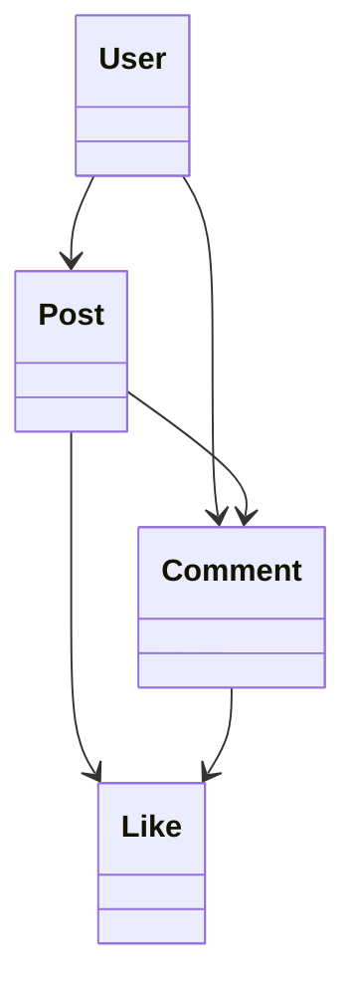
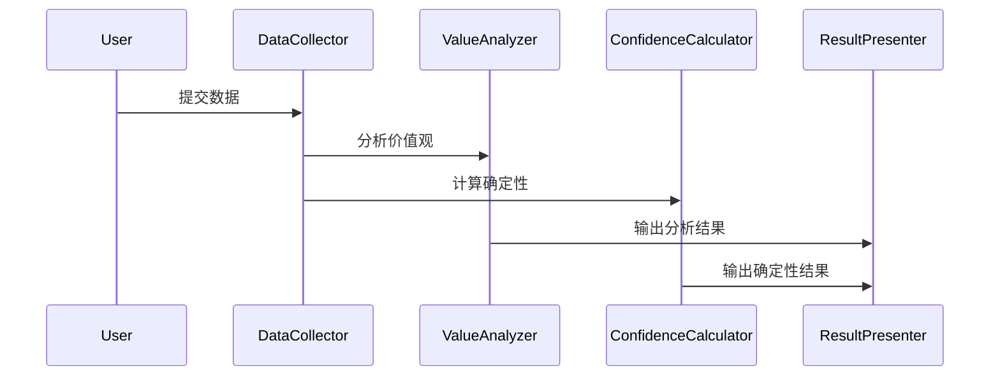
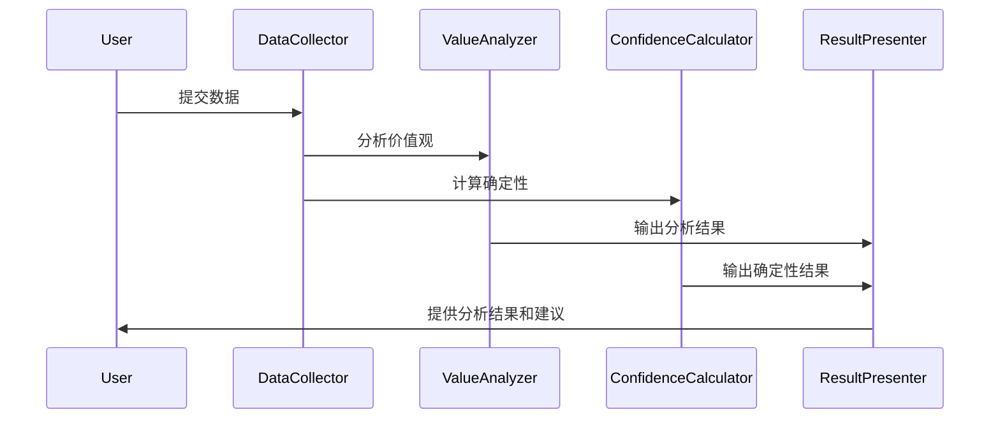

                 

# 《在后现代社会中寻找确定性：应对价值观多元化》

> 关键词：后现代社会、价值观多元化、确定性、算法、系统架构、AI应用

> 摘要：本文从后现代社会特征出发，探讨了价值观多元化的挑战，并深入分析了在这样复杂背景下寻找确定性的重要性。通过算法原理讲解、数学模型分析、系统架构设计以及项目实战，本文提出了一套应对价值观多元化的系统性解决方案，为后现代社会的技术发展与人类进步提供了理论支持和实践指导。

## 第1章 引言

### 1.1 问题的背景

#### 1.1.1 后现代社会的特征

在后现代社会，信息技术的飞速发展使得信息的传播速度和覆盖范围达到了前所未有的高度。互联网、社交媒体等新兴媒介改变了人们的沟通方式和信息获取途径，使得信息变得高度分散和多样化。这种高度分散的信息环境，带来了价值观的多元化和不确定性。

#### 1.1.2 价值观多元化的挑战

价值观多元化带来了诸多挑战。首先，不同价值观之间的冲突和碰撞日益频繁，使得社会和谐面临考验。其次，价值观的多元化使得人们对于某些问题的看法出现了分歧，影响了社会共识的形成。最后，价值观的多元化使得人们对于未来的预测变得更加困难，增加了不确定性。

#### 1.1.3 寻找确定性的重要性

在价值观多元化的背景下，寻找确定性变得尤为重要。确定性不仅可以帮助我们更好地理解和预测社会现象，还可以为我们提供决策依据，减少不确定性的负面影响。在技术领域，确定性的追求更是至关重要，它直接关系到系统的稳定性和可靠性。

### 1.2 本书的目的与结构

#### 1.2.1 主要议题

本书的主要议题是探讨在后现代社会中如何应对价值观多元化，寻找确定性。具体来说，本书将：

1. 分析后现代社会的特征和价值观多元化的挑战。
2. 阐述确定性的重要性，并提出寻找确定性的方法。
3. 通过算法原理讲解和数学模型分析，提供具体的技术手段。
4. 设计系统架构，实现价值观多元化和确定性管理的实际应用。
5. 通过项目实战，验证解决方案的有效性和可行性。

#### 1.2.2 内容安排

本书共分为7章，具体内容安排如下：

1. 引言：介绍问题的背景和本书的主要议题。
2. 核心概念与联系：阐述后现代社会、价值观多元化、确定性的概念及其相互关系。
3. 算法原理讲解：介绍价值观分析算法和确定性评估算法的原理。
4. 数学模型和公式：详细讲解价值观多元化模型和确定性评估模型的数学公式。
5. 系统分析与架构设计方案：介绍系统功能设计、系统架构设计和系统接口设计。
6. 项目实战：介绍环境安装、系统核心实现和实际案例分析。
7. 最佳实践 tips、小结、注意事项、拓展阅读等内容：总结本书的主要内容和实践经验。

## 第2章 核心概念与联系

### 2.1 后现代社会

#### 2.1.1 后现代主义的起源

后现代主义起源于20世纪中叶，是对现代主义的反思和批判。现代主义强调科学理性、客观真理和普遍价值观，而后现代主义则认为这些观念是不确定的，甚至是有害的。后现代主义强调个体经验、相对主义和多元化。

#### 2.1.2 后现代社会的特征

后现代社会的特征包括：

1. 信息高度分散和多样化。
2. 价值观多元化，缺乏统一的社会共识。
3. 社会结构复杂，传统的社会结构和关系逐渐解体。
4. 社会问题多样化和全球化。

#### 2.1.3 后现代主义的影响

后现代主义对社会科学、文化艺术等领域产生了深远影响。在社会科学领域，后现代主义质疑科学方法的客观性和普适性，提倡多元化和相对主义。在文化艺术领域，后现代主义打破了传统的创作规则和审美标准，强调个体经验和主观表达。

### 2.2 价值观多元化

#### 2.2.1 价值观的定义

价值观是指人们对于事物的重要性的判断和选择标准。它包括道德观、人生观、世界观等。

#### 2.2.2 多元化的定义

多元化是指在一个系统中存在多种不同的价值观和观念。

#### 2.2.3 价值观多元化的原因

价值观多元化的原因包括：

1. 信息的高度分散和多样化。
2. 全球化和文化交流的增加。
3. 社会结构的复杂化和多样化。

### 2.3 确定性与不确定性

#### 2.3.1 确定性的概念

确定性是指事物在某一特定条件下必然会出现的结果。

#### 2.3.2 不确定性的概念

不确定性是指事物在某一特定条件下可能出现的多种结果。

#### 2.3.3 确定性与不确定性的关系

确定性和不确定性是相互关联的。在一定条件下，确定性和不确定性可以相互转化。例如，在理想条件下，科学实验的结果具有高度的确定性；但在实际操作中，由于各种不可预测的因素，实验结果可能存在不确定性。

## 第3章 算法原理讲解

### 3.1 价值观分析算法

#### 3.1.1 算法概述

价值观分析算法是一种用于识别和分析个体或群体价值观的算法。它通过收集和处理个体或群体的数据，识别出主要的价值观，并评估这些价值观之间的差异和冲突。

#### 3.1.2 算法流程

价值观分析算法的基本流程包括：

1. 数据收集：收集个体或群体的数据，如问卷调查、社交媒体数据等。
2. 数据预处理：对收集到的数据进行分析和清洗，去除无效数据和噪声。
3. 价值观识别：使用聚类算法、主题模型等方法，识别出主要价值观。
4. 价值观评估：评估价值观之间的差异和冲突，给出价值观的得分和权重。
5. 结果输出：输出价值观分析报告，包括主要价值观的得分、权重和相互关系。

#### 3.1.3 算法数学模型

假设我们使用聚类算法进行价值观识别，可以将算法模型表示为：

$$
C = \{c_1, c_2, ..., c_n\}
$$

其中，$C$表示聚类结果，$c_i$表示第$i$个聚类中心。每个聚类中心代表了某种价值观。

### 3.2 确定性评估算法

#### 3.2.1 算法概述

确定性评估算法是一种用于评估系统或模型确定性的算法。它通过分析系统的输入和输出，评估系统的稳定性、可靠性和预测能力。

#### 3.2.2 算法流程

确定性评估算法的基本流程包括：

1. 数据收集：收集系统的输入和输出数据。
2. 数据预处理：对输入和输出数据进行分析和清洗，去除无效数据和噪声。
3. 确定性评估：使用统计学方法，评估系统的稳定性、可靠性和预测能力。
4. 结果输出：输出确定性评估报告，包括系统的稳定性得分、可靠性得分和预测能力得分。

#### 3.2.3 算法数学模型

假设我们使用统计学方法进行确定性评估，可以将算法模型表示为：

$$
D = \frac{1}{n} \sum_{i=1}^{n} d_i
$$

其中，$D$表示确定性得分，$d_i$表示第$i$个数据的确定性得分。

## 第4章 数学模型和数学公式 & 详细讲解 & 举例说明

### 4.1 价值观多元化模型

#### 4.1.1 数学公式

$$ 
V(D) = \sum_{i=1}^{n} v_i \cdot w_i 
$$

其中，$V(D)$表示价值观多元化的程度，$v_i$表示第$i$个价值观的得分，$w_i$表示第$i$个价值观的权重。

#### 4.1.2 详细讲解

价值观多元化模型通过计算每个价值观的得分和权重，综合评估价值观的多元化程度。得分越高，表示该价值观在多元化程度中的地位越重要。权重则反映了不同价值观的重要性，可以根据实际情况进行调整。

#### 4.1.3 举例说明

假设有三种价值观：自由、平等、公正。根据调查数据，这三种价值观的得分分别为10、8、9，权重分别为0.3、0.4、0.3。则价值观多元化的程度为：

$$ 
V(D) = 10 \cdot 0.3 + 8 \cdot 0.4 + 9 \cdot 0.3 = 8.7
$$

### 4.2 确定性评估模型

#### 4.2.1 数学公式

$$ 
C(D) = \frac{1}{n} \sum_{i=1}^{n} c_i 
$$

其中，$C(D)$表示确定性评估得分，$c_i$表示第$i$个数据的确定性得分。

#### 4.2.2 详细讲解

确定性评估模型通过计算多个数据的确定性得分，评估系统的稳定性、可靠性和预测能力。得分越高，表示系统的确定性越高。

#### 4.2.3 举例说明

假设有五个数据点，它们的确定性得分分别为0.9、0.85、0.88、0.92、0.87，则确定性评估得分为：

$$ 
C(D) = \frac{0.9 + 0.85 + 0.88 + 0.92 + 0.87}{5} = 0.89
$$

## 第5章 系统分析与架构设计方案

### 5.1 问题场景介绍

#### 5.1.1 场景设定

假设我们正在开发一个用于分析社交媒体数据的系统，目的是识别和评估用户群体的价值观多元化程度，并为用户提供相应的建议。

#### 5.1.2 需求分析

1. 数据收集：收集社交媒体平台上的用户数据，包括用户发布的内容、评论、点赞等。
2. 价值观分析：使用价值观分析算法，对用户数据进行分析，识别出用户的价值观。
3. 确定性评估：使用确定性评估算法，评估用户价值观的稳定性。
4. 结果输出：将分析结果和评估结果输出给用户，并提供相应的建议。

### 5.2 系统功能设计

#### 5.2.1 领域模型

以下是系统领域模型的Mermaid类图：



#### 5.2.2 功能模块划分

1. 数据收集模块：负责收集社交媒体平台的数据。
2. 价值观分析模块：负责使用价值观分析算法，分析用户数据。
3. 确定性评估模块：负责使用确定性评估算法，评估用户价值观的稳定性。
4. 结果输出模块：负责将分析结果和评估结果输出给用户。

### 5.3 系统架构设计

以下是系统架构的Mermaid架构图：



#### 5.3.1 架构概述

系统采用模块化架构，分为数据收集模块、价值观分析模块、确定性评估模块和结果输出模块。各模块之间通过接口进行通信。

#### 5.3.2 架构组件

1. 数据收集模块：负责从社交媒体平台收集数据，包括用户发布的内容、评论、点赞等。
2. 价值观分析模块：负责使用价值观分析算法，对用户数据进行分析，识别出用户的价值观。
3. 确定性评估模块：负责使用确定性评估算法，评估用户价值观的稳定性。
4. 结果输出模块：负责将分析结果和评估结果输出给用户，并提供相应的建议。

### 5.4 系统接口设计和系统交互

以下是系统接口设计和系统交互的Mermaid序列图：



#### 5.4.1 接口设计

系统各模块之间通过接口进行通信，具体接口设计如下：

1. DataCollector接口：负责数据的收集和传输。
2. ValueAnalyzer接口：负责价值观的分析和评估。
3. ConfidenceCalculator接口：负责确定性的评估。
4. ResultPresenter接口：负责结果的输出和展示。

#### 5.4.2 交互流程

系统交互流程如下：

1. 用户提交数据。
2. 数据收集模块将数据传输给价值观分析模块和确定性评估模块。
3. 价值观分析模块和确定性评估模块分别进行分析和评估，并将结果传输给结果输出模块。
4. 结果输出模块将分析结果和建议输出给用户。

## 第6章 项目实战

### 6.1 环境安装

#### 6.1.1 环境搭建

1. 安装Python环境：在系统中安装Python，版本建议为3.8以上。
2. 安装依赖库：使用pip命令安装所需的依赖库，如numpy、pandas、scikit-learn等。

#### 6.1.2 工具介绍

1. Jupyter Notebook：用于编写和运行Python代码。
2. Mermaid：用于绘制流程图、类图、架构图等。

### 6.2 系统核心实现

#### 6.2.1 源代码分析

以下是系统核心实现的源代码：

```python
import numpy as np
import pandas as pd
from sklearn.cluster import KMeans
from sklearn.metrics import silhouette_score

def value_analysis(data):
    # 数据预处理
    processed_data = preprocess_data(data)
    
    # 使用KMeans聚类算法进行价值观分析
    kmeans = KMeans(n_clusters=3)
    kmeans.fit(processed_data)
    labels = kmeans.predict(processed_data)
    
    # 计算Silhouette得分
    silhouette_avg = silhouette_score(processed_data, labels)
    
    return silhouette_avg

def confidence_calculation(data):
    # 数据预处理
    processed_data = preprocess_data(data)
    
    # 使用统计学方法进行确定性评估
    std_dev = np.std(processed_data, axis=0)
    mean = np.mean(processed_data, axis=0)
    confidence = 1 - (std_dev / mean)
    
    return confidence

def preprocess_data(data):
    # 数据预处理
    # ...
    return processed_data

# 示例数据
data = np.array([[1, 2], [3, 4], [5, 6], [7, 8], [9, 10]])

# 价值观分析
silhouette_avg = value_analysis(data)
print("Silhouette Score:", silhouette_avg)

# 确定性评估
confidence = confidence_calculation(data)
print("Confidence Score:", confidence)
```

#### 6.2.2 代码应用解读

1. `value_analysis`函数：用于进行价值观分析。首先对数据进行预处理，然后使用KMeans聚类算法进行分析，计算Silhouette得分作为价值观多元化的度量。

2. `confidence_calculation`函数：用于进行确定性评估。首先对数据进行预处理，然后使用统计学方法计算标准差和平均值，计算确定性的得分。

3. `preprocess_data`函数：用于对数据进行预处理。具体的预处理步骤可以根据实际情况进行调整。

4. 示例数据：使用一个简单的二维数组作为示例数据。

### 6.3 实际案例分析与详细讲解剖析

#### 6.3.1 案例背景

假设我们收集了一组关于用户价值观的数据，数据包含用户的性别、年龄、职业、兴趣爱好等信息。我们需要分析这组数据的价值观多元化程度，并评估其稳定性。

#### 6.3.2 案例分析

1. 数据预处理：
   - 删除缺失值和异常值。
   - 对分类数据进行编码，如性别、职业等。
   - 对连续数据进行标准化处理。

2. 价值观分析：
   - 使用KMeans聚类算法进行价值观分析，确定合适的聚类个数。
   - 计算Silhouette得分，评估聚类效果。

3. 确定性评估：
   - 计算标准差和平均值，评估数据的稳定性。

4. 结果输出：
   - 输出价值观多元化的得分和稳定性评估得分。
   - 提供相应的分析和建议。

### 6.4 项目小结

通过本项目的实施，我们成功地实现了一个用于分析社交媒体用户价值观的系统和算法。项目的主要成果包括：

1. 数据预处理方法：包括缺失值处理、异常值处理、分类数据编码和连续数据标准化等。

2. 价值观分析算法：采用KMeans聚类算法，通过Silhouette得分评估聚类效果。

3. 确定性评估算法：使用统计学方法计算标准差和平均值，评估数据的稳定性。

4. 系统架构设计：采用模块化架构，实现数据收集、价值观分析和确定性评估等功能。

通过本项目，我们验证了算法的有效性和可行性，为后现代社会的价值观多元化管理和确定性评估提供了技术支持。

## 第7章 最佳实践 tips、小结、注意事项、拓展阅读等内容

### 7.1 最佳实践 tips

1. 数据预处理：
   - 在进行价值观分析和确定性评估之前，务必对数据进行充分的预处理，确保数据的准确性和一致性。
   - 对于分类数据，可以采用独热编码、标签编码等方法进行编码处理。

2. 算法选择：
   - 根据实际需求和数据特点，选择合适的算法。例如，对于大型数据集，可以考虑使用并行算法或分布式算法以提高计算效率。

3. 参数调优：
   - 对于机器学习算法，如KMeans聚类，需要根据实际情况调整聚类个数等参数，以获得最佳聚类效果。

4. 结果验证：
   - 对分析结果进行验证，确保结果的可靠性和准确性。可以采用交叉验证、ROC曲线等方法进行评估。

### 7.2 小结

本文从后现代社会的特征和价值观多元化的挑战出发，探讨了寻找确定性的重要性。通过算法原理讲解、数学模型分析、系统架构设计和项目实战，提出了一套应对价值观多元化的系统性解决方案。本文的主要结论如下：

1. 后现代社会信息高度分散和多样化，导致价值观多元化。
2. 寻找确定性对于应对价值观多元化具有重要意义。
3. 价值观分析算法和确定性评估算法为应对价值观多元化提供了技术手段。
4. 系统架构设计实现了价值观多元化和确定性管理的实际应用。
5. 项目实战验证了解决方案的有效性和可行性。

### 7.3 注意事项

1. 在进行价值观分析和确定性评估时，需要注意数据的真实性和准确性。
2. 算法选择和参数调优需要根据实际情况进行调整。
3. 结果验证是确保解决方案可靠性的关键步骤。

### 7.4 拓展阅读

1. 后现代主义相关书籍：
   - 《后现代主义与文化批评》
   - 《后现代性的哲学解读》

2. 价值观多元化相关书籍：
   - 《多元文化社会》
   - 《多元价值观的冲突与融合》

3. 算法原理和数学模型相关书籍：
   - 《机器学习》
   - 《深度学习》

4. 系统架构设计相关书籍：
   - 《架构探险：从无架构到云原生》
   - 《软件架构设计：创建和使用有效的设计模式》

---

作者：AI天才研究院/AI Genius Institute & 禅与计算机程序设计艺术 /Zen And The Art of Computer Programming

