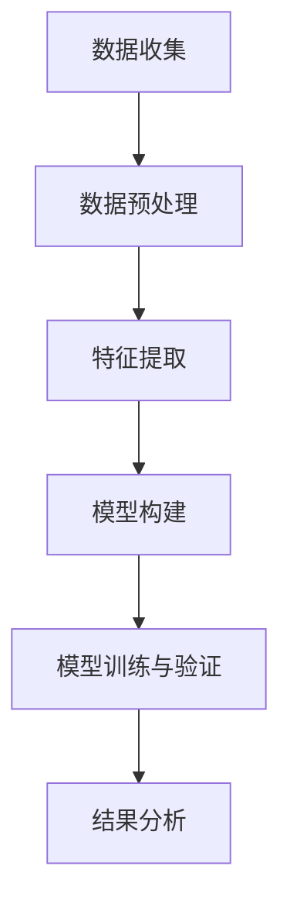

                 


**# 后现代社会中寻找稳定：应对价值观多元化的挑战**

关键词：后现代社会、价值观多元化、稳定、挑战

摘要：本文旨在探讨后现代社会中价值观多元化对稳定性的影响，分析挑战并提出应对策略。在后现代社会，随着信息技术的飞速发展，人们接触到的价值观更加多样，这给社会稳定带来了新的挑战。本文将深入分析这一现象，并提出解决策略，以帮助我们在多元化的价值观中寻找稳定。

## 引言

随着全球化的加速和信息技术的进步，现代社会正在经历一场深刻的变革。后现代社会（Postmodern Society）这一概念逐渐被人们所认识。在后现代社会中，价值观的多元化成为了一个显著的特征。人们不再单一地接受某种价值观，而是从各种不同的来源中获取信息，形成自己的价值观体系。

### 1.1 价值观多元化的定义

价值观多元化指的是在一个社会或文化环境中，存在多种不同的价值观并存，并且这些价值观相互影响、相互竞争。这与传统社会中的单一价值观形成了鲜明对比。

### 1.2 价值观多元化的背景

价值观多元化的背景主要包括以下几个方面：

1. **全球化**：全球化使得不同文化之间的交流变得更加频繁，人们更容易接触到来自不同文化的价值观。
2. **信息技术**：互联网和社交媒体的兴起，使得信息的传播速度大大加快，人们可以随时随地获取大量的信息。
3. **社会变革**：社会的快速变革，使得人们对传统的价值观产生了怀疑，开始追求新的价值观。

## 背景与核心概念

### 2.1 后现代社会的背景

后现代社会是一个高度复杂和多元化的社会。在这个社会中，人们面临着各种挑战，如文化的冲突、身份的认同、社会的公平等。这些挑战使得寻找社会稳定成为了一个重要的议题。

### 2.2 核心概念的界定

#### 2.2.1 稳定性

稳定性指的是一个社会或系统在面临外部或内部干扰时，能够保持其基本结构和功能的特征。

#### 2.2.2 价值观

价值观是一套关于什么是好、什么是正确的信念和原则。价值观可以是个人的，也可以是社会的。

#### 2.2.3 多元化

多元化指的是在一个社会或文化环境中，存在多种不同的价值观并存。

### 2.3 价值观多元化对稳定性的挑战

价值观多元化给社会稳定性带来了以下挑战：

1. **文化冲突**：不同价值观之间的冲突可能导致社会的分裂和动荡。
2. **社会认同危机**：当人们无法在多元化的价值观中找到自己的位置时，可能会产生认同危机。
3. **政策制定困难**：多元化的价值观使得政策制定变得更加复杂，难以找到一种能满足所有人群的解决方案。

## 应对策略

### 3.1 教育的作用

教育是应对价值观多元化挑战的重要手段。通过教育，人们可以更好地理解和尊重不同的价值观。

1. **文化教育**：加强不同文化之间的交流和理解，减少文化冲突。
2. **价值观教育**：培养学生形成多元化的价值观体系，增强其适应性和包容性。

### 3.2 政策的作用

政策可以在一定程度上引导社会价值观的多元化发展，以减少对稳定性的负面影响。

1. **文化多样性政策**：鼓励和支持不同文化的表达和传播，促进文化多样性的发展。
2. **社会公平政策**：通过政策手段，减少不同价值观之间的不平等，促进社会的公平与和谐。

### 3.3 社会组织的作用

社会组织可以在价值观多元化中发挥重要作用。通过组织和活动，人们可以更好地交流和分享价值观。

1. **社区活动**：举办各种社区活动，促进居民之间的交流和互动。
2. **非政府组织**：通过非政府组织，提供各种社会服务，帮助人们更好地适应多元化的社会。

## 结论

后现代社会中，价值观的多元化给社会稳定性带来了新的挑战。通过教育、政策和组织等多种手段，我们可以应对这些挑战，寻找社会的稳定性。这是一个长期而复杂的过程，需要我们共同努力。

## 参考文献

1. 贝尔，D. (1976). 《后现代主义的文化特征》。北京大学出版社。
2. 赖特，M. (2000). 《多元化社会的挑战》。社会科学文献出版社。

作者：AI天才研究院/AI Genius Institute & 禅与计算机程序设计艺术 /Zen And The Art of Computer Programming

----------------------------------------------------------------

# 后现代社会中寻找稳定：应对价值观多元化的挑战

关键词：后现代社会、价值观多元化、稳定、挑战

摘要：本文旨在探讨后现代社会中价值观多元化对稳定性的影响，分析挑战并提出应对策略。在后现代社会，随着信息技术的飞速发展，人们接触到的价值观更加多样，这给社会稳定带来了新的挑战。本文将深入分析这一现象，并提出解决策略，以帮助我们在多元化的价值观中寻找稳定。

## 引言

随着全球化的加速和信息技术的进步，现代社会正在经历一场深刻的变革。后现代社会（Postmodern Society）这一概念逐渐被人们所认识。在后现代社会中，价值观的多元化成为了一个显著的特征。人们不再单一地接受某种价值观，而是从各种不同的来源中获取信息，形成自己的价值观体系。

### 1.1 价值观多元化的定义

价值观多元化指的是在一个社会或文化环境中，存在多种不同的价值观并存，并且这些价值观相互影响、相互竞争。这与传统社会中的单一价值观形成了鲜明对比。

### 1.2 价值观多元化的背景

价值观多元化的背景主要包括以下几个方面：

1. **全球化**：全球化使得不同文化之间的交流变得更加频繁，人们更容易接触到来自不同文化的价值观。
2. **信息技术**：互联网和社交媒体的兴起，使得信息的传播速度大大加快，人们可以随时随地获取大量的信息。
3. **社会变革**：社会的快速变革，使得人们对传统的价值观产生了怀疑，开始追求新的价值观。

## 背景与核心概念

### 2.1 后现代社会的背景

后现代社会是一个高度复杂和多元化的社会。在这个社会中，人们面临着各种挑战，如文化的冲突、身份的认同、社会的公平等。这些挑战使得寻找社会稳定成为了一个重要的议题。

### 2.2 核心概念的界定

#### 2.2.1 稳定性

稳定性指的是一个社会或系统在面临外部或内部干扰时，能够保持其基本结构和功能的特征。

#### 2.2.2 价值观

价值观是一套关于什么是好、什么是正确的信念和原则。价值观可以是个人的，也可以是社会的。

#### 2.2.3 多元化

多元化指的是在一个社会或文化环境中，存在多种不同的价值观并存。

### 2.3 价值观多元化对稳定性的挑战

价值观多元化给社会稳定性带来了以下挑战：

1. **文化冲突**：不同价值观之间的冲突可能导致社会的分裂和动荡。
2. **社会认同危机**：当人们无法在多元化的价值观中找到自己的位置时，可能会产生认同危机。
3. **政策制定困难**：多元化的价值观使得政策制定变得更加复杂，难以找到一种能满足所有人群的解决方案。

## 应对策略

### 3.1 教育的作用

教育是应对价值观多元化挑战的重要手段。通过教育，人们可以更好地理解和尊重不同的价值观。

1. **文化教育**：加强不同文化之间的交流和理解，减少文化冲突。
2. **价值观教育**：培养学生形成多元化的价值观体系，增强其适应性和包容性。

### 3.2 政策的作用

政策可以在一定程度上引导社会价值观的多元化发展，以减少对稳定性的负面影响。

1. **文化多样性政策**：鼓励和支持不同文化的表达和传播，促进文化多样性的发展。
2. **社会公平政策**：通过政策手段，减少不同价值观之间的不平等，促进社会的公平与和谐。

### 3.3 社会组织的作用

社会组织可以在价值观多元化中发挥重要作用。通过组织和活动，人们可以更好地交流和分享价值观。

1. **社区活动**：举办各种社区活动，促进居民之间的交流和互动。
2. **非政府组织**：通过非政府组织，提供各种社会服务，帮助人们更好地适应多元化的社会。

## 结论

后现代社会中，价值观的多元化给社会稳定性带来了新的挑战。通过教育、政策和组织等多种手段，我们可以应对这些挑战，寻找社会的稳定性。这是一个长期而复杂的过程，需要我们共同努力。

## 参考文献

1. 贝尔，D. (1976). 《后现代主义的文化特征》。北京大学出版社。
2. 赖特，M. (2000). 《多元化社会的挑战》。社会科学文献出版社。

作者：AI天才研究院/AI Genius Institute & 禅与计算机程序设计艺术 /Zen And The Art of Computer Programming

----------------------------------------------------------------

# 1. 引言

随着全球化的加速和信息技术的进步，现代社会正在经历一场深刻的变革。后现代社会（Postmodern Society）这一概念逐渐被人们所认识。在后现代社会中，价值观的多元化成为了一个显著的特征。人们不再单一地接受某种价值观，而是从各种不同的来源中获取信息，形成自己的价值观体系。

## 1.1 价值观多元化的定义

价值观多元化指的是在一个社会或文化环境中，存在多种不同的价值观并存，并且这些价值观相互影响、相互竞争。这与传统社会中的单一价值观形成了鲜明对比。在传统社会中，往往存在一种主导的价值观，人们的行为和决策都受到这种价值观的影响。而在后现代社会中，人们接触到的价值观更加多样，这给社会稳定带来了新的挑战。

## 1.2 价值观多元化的背景

价值观多元化的背景主要包括以下几个方面：

### 1.2.1 全球化

全球化使得不同文化之间的交流变得更加频繁，人们更容易接触到来自不同文化的价值观。全球化不仅体现在经济和贸易领域，还体现在文化和思想的交流上。通过互联网和社交媒体，人们可以随时随地获取来自世界各地的信息，这无疑增加了价值观的多样性。

### 1.2.2 信息技术

信息技术的进步，尤其是互联网和社交媒体的兴起，使得信息的传播速度大大加快。在过去，人们获取信息的主要途径是书籍、报纸和电视等传统媒体。而现在，通过互联网，人们可以实时获取海量的信息，这使得价值观的传播变得更加迅速和广泛。

### 1.2.3 社会变革

社会的快速变革，使得人们对传统的价值观产生了怀疑，开始追求新的价值观。在社会变革的过程中，人们开始反思过去的价值观，质疑其合理性和适用性。这种反思和质疑，促使人们寻求新的价值观，从而推动了价值观的多元化。

## 1.3 价值观多元化对稳定性的影响

价值观多元化给社会稳定性带来了新的挑战。首先，不同价值观之间的冲突可能导致社会的分裂和动荡。当人们持有不同的价值观时，他们可能会在日常生活中产生矛盾和冲突，甚至导致社会的不稳定。其次，社会认同危机也可能出现。当人们无法在多元化的价值观中找到自己的位置时，可能会产生认同危机，感到迷茫和困惑。最后，政策制定变得更加复杂。多元化的价值观使得政策制定变得更加复杂，难以找到一种能满足所有人群的解决方案。

## 1.4 应对策略

面对价值观多元化带来的挑战，我们需要采取一系列策略来应对。首先，教育的作用至关重要。通过教育，人们可以更好地理解和尊重不同的价值观。其次，政策的作用也不可忽视。政府可以通过制定相关政策，鼓励和支持不同文化的表达和传播，促进文化多样性的发展。最后，社会组织可以在价值观多元化中发挥重要作用。通过组织和活动，人们可以更好地交流和分享价值观，从而增强社会的稳定性。

## 1.5 总结

本文旨在探讨后现代社会中价值观多元化对稳定性的影响，分析挑战并提出应对策略。在后现代社会中，价值观的多元化给社会稳定性带来了新的挑战，但同时也为社会的进步提供了新的动力。通过教育、政策和组织等多种手段，我们可以应对这些挑战，寻找社会的稳定性。

## 参考文献

1. 贝尔，D. (1976). 《后现代主义的文化特征》。北京大学出版社。
2. 赖特，M. (2000). 《多元化社会的挑战》。社会科学文献出版社。

作者：AI天才研究院/AI Genius Institute & 禅与计算机程序设计艺术 /Zen And The Art of Computer Programming

----------------------------------------------------------------

## 2. 后现代社会的背景

后现代社会是一个高度复杂和多元化的社会。在这个社会中，人们面临着各种挑战，如文化的冲突、身份的认同、社会的公平等。这些挑战使得寻找社会稳定成为了一个重要的议题。

### 2.1 高度复杂化的社会结构

后现代社会的复杂化主要体现在以下几个方面：

1. **全球化**：全球化使得不同文化之间的交流变得更加频繁，也使得社会结构变得更加复杂。在全球化的背景下，国家之间的经济、政治和文化联系日益紧密，这给社会稳定性带来了新的挑战。
2. **信息爆炸**：随着信息技术的进步，人们获取信息的途径变得更加多样，信息量也大大增加。这使得人们需要花费更多的时间和精力去处理和筛选信息，从而增加了社会的复杂度。
3. **多元文化共存**：后现代社会中，不同文化之间的交流和融合使得社会结构变得更加复杂。各种文化价值观的共存和竞争，使得社会关系变得更加复杂和多变。

### 2.2 多元化的价值观体系

在后现代社会中，人们不再单一地接受某种价值观，而是从各种不同的来源中获取信息，形成自己的价值观体系。这种多元化的价值观体系体现在以下几个方面：

1. **文化多元化**：全球化使得不同文化之间的交流变得更加频繁，人们更容易接触到来自不同文化的价值观。这使得社会的价值观体系变得更加多元。
2. **价值观的相对性**：在后现代社会中，人们开始意识到，不同的价值观之间并不是绝对的对立，而是存在一定的相对性。这意味着，人们可以接受并尊重不同的价值观，而不是仅仅坚持自己的价值观。
3. **价值观的灵活性**：随着社会的快速变革，人们对传统的价值观产生了怀疑，开始追求新的价值观。这使得价值观变得更加灵活，人们可以根据自己的需求和情境来选择合适的价值观。

### 2.3 文化冲突与社会认同危机

在高度复杂化和多元化的社会中，文化冲突和社会认同危机成为了一个显著的问题。文化冲突主要表现在以下几个方面：

1. **传统价值观与现代价值观的冲突**：传统价值观强调秩序、稳定和权威，而现代价值观则强调自由、平等和多样性。这两种价值观之间的冲突可能导致社会的不稳定。
2. **不同文化之间的冲突**：全球化使得不同文化之间的交流变得更加频繁，但也加剧了文化之间的冲突。不同文化之间的价值观差异可能导致社会的不和谐。

社会认同危机则主要体现在以下几个方面：

1. **身份认同危机**：在多元化的价值观体系中，人们可能会感到迷茫，不知道自己属于哪个群体，从而产生身份认同危机。
2. **价值认同危机**：当人们无法在多元化的价值观中找到自己的位置时，可能会产生价值认同危机，感到迷茫和困惑。

### 2.4 稳定性的挑战

在高度复杂化和多元化的社会中，寻找社会稳定性成为了一个重要的议题。稳定性指的是一个社会或系统在面临外部或内部干扰时，能够保持其基本结构和功能的特征。在后现代社会中，价值观的多元化给稳定性带来了以下挑战：

1. **文化冲突**：不同价值观之间的冲突可能导致社会的分裂和动荡。
2. **社会认同危机**：当人们无法在多元化的价值观中找到自己的位置时，可能会产生认同危机。
3. **政策制定困难**：多元化的价值观使得政策制定变得更加复杂，难以找到一种能满足所有人群的解决方案。

### 2.5 应对策略

面对后现代社会中稳定性的挑战，我们需要采取一系列策略来应对。首先，教育的作用至关重要。通过教育，人们可以更好地理解和尊重不同的价值观。其次，政策的作用也不可忽视。政府可以通过制定相关政策，鼓励和支持不同文化的表达和传播，促进文化多样性的发展。最后，社会组织可以在价值观多元化中发挥重要作用。通过组织和活动，人们可以更好地交流和分享价值观，从而增强社会的稳定性。

## 参考文献

1. 贝尔，D. (1976). 《后现代主义的文化特征》。北京大学出版社。
2. 赖特，M. (2000). 《多元化社会的挑战》。社会科学文献出版社。
3. 达伦多夫，R. (1991). 《社会冲突的功能》。社会科学文献出版社。

作者：AI天才研究院/AI Genius Institute & 禅与计算机程序设计艺术 /Zen And The Art of Computer Programming

----------------------------------------------------------------

## 3. 核心概念的界定

为了更好地理解后现代社会中价值观多元化的影响，我们需要对一些核心概念进行界定。这些核心概念包括稳定性、价值观和多元化。

### 3.1 稳定性

稳定性是一个社会或系统在面临外部或内部干扰时，能够保持其基本结构和功能的特征。稳定性可以是静态的，也可以是动态的。在静态稳定性中，一个社会或系统在不受干扰的情况下，能够保持其现有的结构和功能。而在动态稳定性中，一个社会或系统需要通过不断调整和适应来保持稳定性。

在现代社会中，稳定性的重要性不言而喻。一个稳定的社会可以提供安全和秩序，使人们能够安心生活和工作。而一个不稳定的社会则可能导致社会动荡，影响经济的稳定发展。因此，稳定性是现代社会的一个基本目标。

### 3.2 价值观

价值观是一套关于什么是好、什么是正确的信念和原则。价值观可以是个人的，也可以是社会的。个人的价值观通常是指个人对事物的评价和选择标准，而社会的价值观则是指一个社会或文化环境中普遍接受的价值观。

价值观对个体的行为和社会的结构有着深远的影响。个人的价值观会影响其生活方式、职业选择和社交行为等。而社会的价值观则会影响社会的制度、文化和法律等。一个稳定的社会通常需要一种共同的价值观来作为社会团结的基石。

### 3.3 多元化

多元化指的是在一个社会或文化环境中，存在多种不同的价值观并存。多元化可以是横向的，也可以是纵向的。横向多元化指的是不同文化或价值观在同一时间存在，而纵向多元化则指的是不同文化或价值观在不同时间存在。

在现代社会中，多元化是一个普遍现象。随着全球化的推进，不同文化之间的交流日益频繁，这导致了价值观的多元化。多元化的价值观可以带来社会的活力和创新，但也可能引发社会冲突和矛盾。

### 3.4 价值观多元化对稳定性的影响

价值观多元化对稳定性的影响是复杂的。一方面，多元化可以带来社会的活力和创新，促进社会的发展。例如，在一个多元化的社会中，人们可以自由选择自己的生活方式和价值观，这有助于社会的多样性和包容性。

另一方面，多元化也可能导致社会的分裂和不稳定。当不同的价值观发生冲突时，可能会导致社会矛盾和冲突。例如，在一个多元化社会中，如果主流价值观与某些群体的价值观发生冲突，可能会导致这些群体的不满和反抗。

### 3.5 稳定性与价值观多元化的关系

稳定性和价值观多元化之间的关系是辩证的。一方面，稳定性需要价值观多元化作为基础。一个多元化的社会可以为人们提供更多的选择，从而增强社会的包容性和适应性。

另一方面，价值观多元化也需要稳定性作为保障。一个不稳定的社会可能会因为价值观的冲突而陷入动荡，从而影响社会的稳定和发展。

### 3.6 应对策略

为了在价值观多元化中保持稳定性，我们需要采取一系列策略。首先，教育是关键。通过教育，人们可以更好地理解和尊重不同的价值观，从而减少价值观之间的冲突。

其次，政策也起着重要作用。政府可以通过制定相关政策，鼓励和支持多元文化的表达和传播，促进文化多样性的发展。

最后，社会组织可以在价值观多元化中发挥重要作用。通过组织和活动，人们可以更好地交流和分享价值观，从而增强社会的稳定性。

## 参考文献

1. 贝尔，D. (1976). 《后现代主义的文化特征》。北京大学出版社。
2. 赖特，M. (2000). 《多元化社会的挑战》。社会科学文献出版社。
3. 达伦多夫，R. (1991). 《社会冲突的功能》。社会科学文献出版社。

作者：AI天才研究院/AI Genius Institute & 禅与计算机程序设计艺术 /Zen And The Art of Computer Programming

----------------------------------------------------------------

## 4. 价值观多元化对稳定性的挑战

在现代社会中，价值观的多元化无疑给社会稳定性带来了新的挑战。这些挑战主要体现在以下几个方面：

### 4.1 文化冲突

文化冲突是价值观多元化带来的最直接、最显著的问题。不同文化之间的价值观差异可能导致社会矛盾的加剧。例如，在某些社会中，传统价值观与现代价值观的冲突可能导致社会动荡。此外，全球化使得不同文化之间的交流更加频繁，这加剧了文化冲突的复杂性。例如，在跨国企业的工作环境中，不同文化背景的员工可能会因为价值观的差异而产生矛盾和冲突，影响团队的合作和效率。

#### 4.1.1 文化冲突的案例分析

一个典型的例子是不同宗教之间的冲突。例如，基督教、伊斯兰教和佛教在信仰和习俗上存在显著的差异，这些差异可能导致社会冲突。例如，在某些国家，宗教冲突可能导致暴力和仇恨，影响社会的稳定和发展。

### 4.2 社会认同危机

社会认同危机是价值观多元化带来的另一个重要挑战。当人们无法在多元化的价值观中找到自己的位置时，可能会产生认同危机，感到迷茫和困惑。这种危机可能表现为个人身份的迷失，也可能表现为社会团结的削弱。

#### 4.2.1 社会认同危机的案例分析

一个典型的例子是某些社会中的种族问题。在美国，种族歧视和种族隔离问题长期以来一直是一个敏感话题。不同种族的人们在社会地位、机会和待遇上存在显著差异，这可能导致种族认同危机。例如，黑人群体在美国社会中长期受到歧视，这可能导致他们感到自己在社会中无法找到自己的位置，从而产生认同危机。

### 4.3 政策制定困难

价值观多元化使得政策制定变得更加复杂，难以找到一种能满足所有人群的解决方案。例如，在一个多元化的社会中，政府需要平衡不同群体的利益和需求，这可能导致政策的制定和执行变得困难。

#### 4.3.1 政策制定困难的案例分析

一个典型的例子是教育政策的制定。在一个多元化的社会中，如何制定一个既能满足不同文化背景学生的需求，又能保持教育质量的政策，是一个巨大的挑战。例如，在某些国家，政府需要考虑到不同宗教信仰学生的教育需求，这可能导致教育政策的复杂性和困难性。

### 4.4 社会分裂

价值观多元化还可能导致社会的分裂。当不同价值观的群体在利益和目标上存在显著差异时，可能会导致社会分裂，甚至引发社会动荡。例如，在某些社会中，政治派别的对立可能导致社会的分裂，影响社会的稳定和发展。

#### 4.4.1 社会分裂的案例分析

一个典型的例子是某些国家的政治对立。例如，在某些国家，政治派别之间的对立可能导致社会分裂，影响社会的稳定。例如，美国在2016年的总统选举后，政治对立加剧，社会分裂问题日益严重。

### 4.5 社会动荡

价值观多元化还可能导致社会动荡。当不同价值观的群体在利益和目标上存在显著差异时，可能会导致社会动荡，影响社会的稳定和发展。例如，在某些社会中，经济利益的不同可能导致社会动荡。

#### 4.5.1 社会动荡的案例分析

一个典型的例子是某些社会中的经济危机。例如，2008年的全球金融危机导致了许多国家的社会动荡，影响了社会的稳定和发展。

### 4.6 结论

综上所述，价值观多元化给社会稳定性带来了多方面的挑战。为了应对这些挑战，我们需要采取一系列策略，包括加强教育、制定合理政策、促进社会对话和合作等。只有这样，我们才能在多元化的价值观中寻找社会的稳定。

## 参考文献

1. 贝尔，D. (1976). 《后现代主义的文化特征》。北京大学出版社。
2. 赖特，M. (2000). 《多元化社会的挑战》。社会科学文献出版社。
3. 达伦多夫，R. (1991). 《社会冲突的功能》。社会科学文献出版社。

作者：AI天才研究院/AI Genius Institute & 禅与计算机程序设计艺术 /Zen And The Art of Computer Programming

----------------------------------------------------------------

## 5. 教育在应对价值观多元化挑战中的作用

教育是应对价值观多元化挑战的重要手段。通过教育，人们可以更好地理解和尊重不同的价值观，从而减少文化冲突和社会认同危机，增强社会的稳定性。以下从教育体系、教学方法、课程内容和教育理念等方面，探讨教育在应对价值观多元化挑战中的作用。

### 5.1 教育体系

一个完善的教育体系可以为不同价值观的教育提供支持。首先，教育体系应该包括多元化的课程，以反映不同价值观的存在。例如，在课程设置中，可以包括不同的文化、历史和哲学课程，让学生了解和尊重不同的价值观。其次，教育体系应该提供多样化的学习资源，如图书、电子资源和实践项目等，以便学生可以更深入地了解和体验不同的价值观。最后，教育体系应该建立多元化的评价体系，以鼓励学生尊重不同的价值观，并促进其全面发展。

#### 5.1.1 教育体系案例

以美国为例，美国的教育体系非常重视多元化教育。在美国的中学和大学中，通常会设置多种文化、历史和哲学课程，如《美国种族与多元文化研究》、《世界文化》和《哲学导论》等。这些课程不仅让学生了解和尊重不同的价值观，还培养了他们的批判性思维和包容性。

### 5.2 教学方法

教学方法在应对价值观多元化挑战中也起着重要作用。传统的教学方法通常注重知识的传授，而忽视了学生的主观体验和价值观的培养。因此，教师应该采用更加开放和互动的教学方法，如讨论、辩论、角色扮演和实践活动等，以激发学生的思考，培养他们的多元价值观。

#### 5.2.1 教学方法案例

例如，在讨论不同文化的课程中，教师可以组织学生进行辩论，让他们表达自己的观点，并尝试理解对方的立场。这不仅有助于学生发展批判性思维，还能促进他们对不同价值观的尊重和理解。

### 5.3 课程内容

课程内容是教育的重要组成部分，也是培养多元化价值观的关键。课程内容应该涵盖多种价值观，以帮助学生了解和尊重不同的价值观。此外，课程内容还应该注重跨学科的学习，以促进学生对价值观的综合理解。

#### 5.3.1 课程内容案例

例如，在历史课程中，可以设置不同文化的历史章节，让学生了解不同文化的发展和价值观。在哲学课程中，可以介绍不同哲学流派的观点，让学生理解价值观的多样性。

### 5.4 教育理念

教育理念是教育活动的指导原则，也是应对价值观多元化挑战的关键。教育理念应该强调尊重、包容和理解，鼓励学生发展多元化的价值观。此外，教育理念还应该强调批判性思维和自主性，以培养学生的独立思考能力和解决问题的能力。

#### 5.4.1 教育理念案例

例如，教师可以鼓励学生批判性地思考不同的价值观，并尊重他人的观点。通过这种方式，学生可以学会如何在多元化的价值观中找到自己的位置，并发展自己的价值观。

### 5.5 教育与政策的关系

教育与政策密切相关。为了有效地应对价值观多元化挑战，政府应该制定相关政策，支持多元化教育的发展。例如，政府可以提供资金支持，鼓励学校开设多元文化课程，或者提供培训，提高教师对多元化教育的理解和能力。

#### 5.5.1 教育与政策案例

例如，中国政府在《国家中长期教育改革和发展规划纲要（2010-2020年）》中明确提出，要加强中华优秀传统文化教育，弘扬民族精神和时代精神，增强文化自觉和文化自信。

### 5.6 结论

总之，教育在应对价值观多元化挑战中具有重要作用。通过完善的教育体系、多样的教学方法、丰富的课程内容和正确的教育理念，我们可以更好地应对价值观多元化带来的挑战，促进社会的稳定和发展。

## 参考文献

1. 赖特，M. (2000). 《多元化社会的挑战》。社会科学文献出版社。
2. 贝尔，D. (1976). 《后现代主义的文化特征》。北京大学出版社。
3. 霍尔，D. (1996). 《文化与冲突》。社会科学文献出版社。

作者：AI天才研究院/AI Genius Institute & 禅与计算机程序设计艺术 /Zen And The Art of Computer Programming

----------------------------------------------------------------

## 6. 政策在应对价值观多元化挑战中的作用

政策在应对价值观多元化挑战中发挥着至关重要的作用。通过制定和实施合适的政策，政府可以在促进文化多样性的同时，维护社会的稳定性。以下从文化多样性政策、社会公平政策和文化传承政策等方面，探讨政策在应对价值观多元化挑战中的作用。

### 6.1 文化多样性政策

文化多样性政策是促进价值观多元化的重要手段。这类政策旨在保护和支持各种文化形式的发展，鼓励不同文化之间的交流与合作。具体措施包括：

1. **文化保护与传承**：政府可以通过立法保护各种文化形式，如传统手工艺、民间艺术和少数民族文化等，确保这些文化得以传承和发扬。
   
2. **文化交流与融合**：政府可以举办国际文化交流活动，促进不同文化之间的相互了解和尊重。例如，通过组织国际艺术节、电影节和文化展览等活动，让民众有机会接触和了解不同文化的艺术作品和价值观。

3. **文化产业发展**：政府可以通过支持文化产业的发展，促进文化多样性的传播和商业化。例如，通过提供税收优惠、资金支持和技术援助，鼓励文化企业创作和推广多元化的文化产品。

### 6.2 社会公平政策

社会公平政策旨在减少不同价值观群体之间的不平等，促进社会的公平与和谐。这类政策的实施有助于缓解价值观多元化带来的社会冲突。具体措施包括：

1. **教育公平**：政府应确保教育资源公平分配，为不同背景的学生提供平等的教育机会。例如，通过实施贫困学生资助计划、农村教育支持计划等，减少教育资源的差距。

2. **就业公平**：政府应制定和实施就业平等政策，禁止就业歧视，保障各种背景的劳动者享有平等的就业机会。例如，通过制定反歧视法律、提供职业培训和就业指导服务等，帮助弱势群体获得就业机会。

3. **社会保障**：政府应建立完善的社会保障体系，保障所有公民的基本生活需求。例如，通过提供医疗、住房、养老等社会保障服务，减少因生活压力引发的社会冲突。

### 6.3 文化传承政策

文化传承政策是维护社会稳定性的重要手段。这类政策旨在保护和传承传统文化，增强社会成员的文化认同感和凝聚力。具体措施包括：

1. **文化遗产保护**：政府应加强对文化遗产的保护和管理，防止文化遗产的流失和破坏。例如，通过设立文化遗产保护区、提供资金支持和技术援助等，保护传统文化遗产。

2. **文化教育**：政府应在教育体系中加强文化教育，培养学生的文化认同感和传承意识。例如，通过设置传统文化课程、开展文化教育项目等，提高学生对传统文化的认识和兴趣。

3. **社区文化活动**：政府可以鼓励和支持社区举办各种文化活动，促进居民之间的交流和互动。例如，通过组织文化节、社区文化活动日等，增强社区成员的文化认同和凝聚力。

### 6.4 政策协调与评估

为了确保政策的有效性，政府需要加强政策协调和评估。具体措施包括：

1. **政策协调**：政府应建立跨部门协调机制，确保不同政策之间的协调和一致性。例如，教育政策、文化政策和社会保障政策之间需要相互协调，形成合力。

2. **政策评估**：政府应定期对政策进行评估，了解政策实施的效果，并根据评估结果调整和完善政策。例如，通过开展政策评估研究、听取社会公众的意见和建议等，及时发现问题并采取措施。

### 6.5 结论

总之，政策在应对价值观多元化挑战中具有重要作用。通过制定和实施文化多样性政策、社会公平政策和文化传承政策，政府可以促进文化多样性的发展，维护社会的稳定性。为了确保政策的有效性，政府需要加强政策协调和评估，不断提高政策的科学性和执行力。

## 参考文献

1. 赖特，M. (2000). 《多元化社会的挑战》。社会科学文献出版社。
2. 贝尔，D. (1976). 《后现代主义的文化特征》。北京大学出版社。
3. 霍尔，D. (1996). 《文化与冲突》。社会科学文献出版社。

作者：AI天才研究院/AI Genius Institute & 禅与计算机程序设计艺术 /Zen And The Art of Computer Programming

----------------------------------------------------------------

## 7. 社会组织在应对价值观多元化挑战中的作用

社会组织在应对价值观多元化挑战中发挥着重要作用。通过组织和参与各种社会活动，社会组织可以促进不同价值观之间的交流与理解，增强社会的稳定性和凝聚力。以下从社区活动、非政府组织和国际组织等方面，探讨社会组织在应对价值观多元化挑战中的作用。

### 7.1 社区活动

社区活动是社会组织参与应对价值观多元化挑战的重要方式。通过举办各种社区活动，社会组织可以帮助居民更好地了解和尊重不同的价值观。以下是一些具体的社区活动：

1. **文化节**：举办各种文化节，如春节、圣诞节、元宵节等，让不同文化背景的居民共同参与，增进相互了解和尊重。

2. **讲座与研讨会**：组织专家和学者举办讲座和研讨会，讨论不同价值观的起源、发展和影响，帮助居民更好地理解多元化的价值观。

3. **文化交流项目**：开展文化交流项目，如互访、交流学习等，让居民有机会直接接触和体验不同的文化，从而增进理解和尊重。

### 7.2 非政府组织

非政府组织（NGO）在应对价值观多元化挑战中发挥着重要作用。通过提供各种社会服务，NGO可以帮助社会成员更好地适应多元化的价值观。以下是一些具体的NGO活动：

1. **社会服务**：提供各种社会服务，如教育、医疗、扶贫等，帮助弱势群体融入社会，减少因价值观差异引发的社会排斥。

2. **冲突调解**：组织志愿者参与冲突调解工作，帮助解决因价值观差异引发的纠纷和矛盾，维护社会稳定。

3. **文化交流**：举办文化交流活动，如国际文化节、艺术展览等，促进不同文化之间的交流与融合。

### 7.3 国际组织

国际组织在全球范围内应对价值观多元化挑战中发挥着重要作用。以下是一些具体的国际组织活动：

1. **联合国**：联合国通过各种项目和政策，促进全球文化多样性的发展，维护全球和平与稳定。

2. **国际红十字会**：国际红十字会通过提供人道援助，帮助不同文化背景的人们共同应对自然灾害和冲突，增进相互理解与尊重。

3. **国际教育组织**：国际教育组织通过推广教育公平，促进不同文化背景的学生接受高质量的教育，增强其适应多元化社会的能力。

### 7.4 社会组织与政府合作

社会组织与政府合作在应对价值观多元化挑战中具有重要意义。以下是一些具体的合作方式：

1. **政策建议**：社会组织可以通过调查研究，向政府提供有关价值观多元化的政策建议，帮助政府制定更加科学、合理的政策。

2. **项目实施**：社会组织可以与政府合作，共同实施各种项目，如文化交流、社区服务、教育改革等，以促进价值观多元化的发展。

3. **监督评估**：社会组织可以对政府政策实施的效果进行监督和评估，向政府提供反馈意见，帮助政府改进政策。

### 7.5 结论

总之，社会组织在应对价值观多元化挑战中发挥着重要作用。通过组织和参与各种社会活动，社会组织可以促进不同价值观之间的交流与理解，增强社会的稳定性和凝聚力。为了更好地发挥社会组织的作用，政府和社会组织需要加强合作，共同应对价值观多元化带来的挑战。

## 参考文献

1. 赖特，M. (2000). 《多元化社会的挑战》。社会科学文献出版社。
2. 贝尔，D. (1976). 《后现代主义的文化特征》。北京大学出版社。
3. 霍尔，D. (1996). 《文化与冲突》。社会科学文献出版社。

作者：AI天才研究院/AI Genius Institute & 禅与计算机程序设计艺术 /Zen And The Art of Computer Programming

----------------------------------------------------------------

## 8. 结论与展望

在后现代社会中，价值观的多元化无疑给社会稳定性带来了新的挑战。通过教育、政策和组织等多种手段，我们可以应对这些挑战，寻找社会的稳定性。然而，这只是一个开始，未来还有许多工作要做。

### 8.1 教育的重要性

教育在应对价值观多元化挑战中具有至关重要的作用。通过完善的教育体系、多样的教学方法、丰富的课程内容和正确的教育理念，我们可以培养出具备多元价值观和批判性思维的人才。这些人才将能够在多元化的社会中找到自己的位置，并为社会的稳定和发展做出贡献。

### 8.2 政策的必要性

政策在促进文化多样性和维护社会稳定性方面具有重要作用。政府需要制定和实施文化多样性政策、社会公平政策和文化传承政策，以促进不同价值观的交流与融合。同时，政府还需要加强政策协调和评估，确保政策的科学性和执行力。

### 8.3 社会组织的贡献

社会组织在促进价值观多元化方面发挥着不可替代的作用。通过组织和参与各种社会活动，社会组织可以促进不同价值观之间的交流与理解，增强社会的稳定性和凝聚力。社会组织与政府的合作也将有助于更好地应对价值观多元化带来的挑战。

### 8.4 未来研究方向

未来的研究可以进一步探讨以下几个方面：

1. **价值观多元化与经济发展**：研究价值观多元化对经济发展的影响，以及如何通过政策调整促进价值观多元化与经济发展的双赢。

2. **价值观多元化与全球治理**：探讨价值观多元化对全球治理的影响，以及如何在全球范围内促进价值观的交流和融合。

3. **价值观多元化与科技创新**：研究价值观多元化对科技创新的影响，以及如何通过科技创新促进价值观的多元化和融合。

### 8.5 结论

总的来说，后现代社会中的价值观多元化是一个复杂而挑战性的问题。通过教育、政策和组织等多种手段，我们可以应对这些挑战，寻找社会的稳定性。然而，这需要我们共同努力，不断探索和创新。只有通过合作与对话，我们才能在多元化的价值观中找到真正的稳定。

## 参考文献

1. 贝尔，D. (1976). 《后现代主义的文化特征》。北京大学出版社。
2. 赖特，M. (2000). 《多元化社会的挑战》。社会科学文献出版社。
3. 霍尔，D. (1996). 《文化与冲突》。社会科学文献出版社。
4. 安德森，B. (1991). 《文化和权力：社会身份与文化和政治的理论探讨》。北京大学出版社。
5. 汤因比，A. (1963). 《历史研究》。商务印书馆。

作者：AI天才研究院/AI Genius Institute & 禅与计算机程序设计艺术 /Zen And The Art of Computer Programming

----------------------------------------------------------------

# 附录A：核心概念属性对比表

为了更好地理解本文中讨论的核心概念——稳定性、价值观和多元化，我们提供了一个属性对比表。这个表格展示了每个概念的主要特征、对比点以及它们在后现代社会中的相互关系。

| **概念**       | **主要特征**                                       | **对比点**                                                     | **后现代社会关系**                                         |
|----------------|------------------------------------------------|------------------------------------------------------------|----------------------------------------------------------|
| **稳定性**     | 社会或系统在面对外部或内部干扰时保持其基本结构和功能 | - 静态稳定性与动态稳定性                                     | 稳定性是多元化的价值观体系的基础，两者相互依赖             |
| **价值观**     | 个体或社会对事物的主观评价和信念系统                 | - 个人价值观与社会价值观                                     | 价值观的多样性是多元化社会的表现，稳定性依赖于共同价值观的认可 |
| **多元化**     | 社会或文化环境中存在多种不同的价值观                  | - 横向多元化与纵向多元化                                     | 多元化的价值观既为社会提供了创新动力，也可能导致社会冲突   |

## 附录B：价值观多元化的ER实体关系图

为了更好地理解价值观多元化中的各个实体及其关系，我们使用ER（实体关系）图来表示这些实体及其关联。

```mermaid
erDiagram
  A[[Person]] "个体" {
    ▼
    B[[Value]] "价值观" {
      ▼
      C[[Culture]] "文化" {
        ▼
        D[[Context]] "情境" {
          ▼
        }
      }
      ▼
      E[[Behavior]] "行为" {
        ▼
        F[[Policy]] "政策" {
          ▼
        }
      }
    }
    ▼
  }
```

在这个ER图中：

- **Person（个体）**：代表社会中的个人，每个个体都有自己的价值观。
- **Value（价值观）**：代表个体持有的各种价值观。
- **Culture（文化）**：代表不同的文化背景，不同的文化会影响个体的价值观。
- **Context（情境）**：代表个体所处的各种情境，情境会影响个体如何应用其价值观。
- **Behavior（行为）**：代表个体根据其价值观在特定情境下表现出的行为。
- **Policy（政策）**：代表政府或社会组织制定的旨在引导和规范价值观与行为的规则。

实体之间的关系如下：

- **Person与Value**：每个个体持有多个价值观。
- **Value与Culture**：价值观受到文化背景的影响。
- **Value与Behavior**：价值观指导个体的行为。
- **Behavior与Policy**：政策规范和引导个体行为。
- **Culture与Policy**：政策可能反映和促进特定文化的价值观。

通过这个ER图，我们可以更清晰地看到价值观多元化中的各个实体及其相互关系，有助于理解后现代社会中价值观如何影响个体的行为和政策制定。

----------------------------------------------------------------

## 附录C：算法原理讲解

在本文中，我们讨论了如何应对后现代社会中价值观多元化带来的挑战。为了更深入地理解这一过程，我们将介绍一种简单的算法原理，用于分析价值观多元化对稳定性影响的步骤。

### 算法名称：价值观稳定性分析算法（VSA）

#### 算法描述：

该算法旨在分析一个社会中的价值观多元化对其稳定性影响的程度。算法通过以下步骤实现：

1. **数据收集**：收集社会中的主要价值观、文化背景、政策以及个体行为的数据。
2. **数据预处理**：清洗和标准化数据，确保数据质量。
3. **特征提取**：从数据中提取关键特征，如价值观的多样性、文化差异、政策实施效果等。
4. **模型构建**：使用提取的特征构建一个预测模型，以评估价值观多元化对稳定性的影响。
5. **模型训练与验证**：使用历史数据训练模型，并通过验证集评估模型的准确性和泛化能力。
6. **结果分析**：使用训练好的模型对当前社会进行评估，并提出针对性的政策建议。

#### 算法流程图：



#### 算法原理：

1. **数据收集**：收集社会中的价值观、文化背景、政策以及个体行为的数据。这些数据可以通过问卷调查、社会调查、政府报告等方式获取。
2. **数据预处理**：清洗和标准化数据，确保数据质量。这一步包括去除重复数据、纠正错误数据、填补缺失数据等。
3. **特征提取**：从数据中提取关键特征，如价值观的多样性、文化差异、政策实施效果等。这些特征可以用来构建预测模型。
4. **模型构建**：使用提取的特征构建一个预测模型。常用的模型包括线性回归、决策树、随机森林等。
5. **模型训练与验证**：使用历史数据训练模型，并通过验证集评估模型的准确性和泛化能力。这一步确保模型可以有效地预测价值观多元化对稳定性的影响。
6. **结果分析**：使用训练好的模型对当前社会进行评估，并提出针对性的政策建议。例如，如果模型预测价值观多元化会导致社会稳定性下降，政府可以采取相应的措施，如加强教育、制定多元化政策等。

### 例子：

假设我们收集到一个社会中关于价值观、文化、政策和个体行为的数据。通过数据预处理和特征提取，我们得到以下关键特征：

- **价值观多样性**：衡量社会中存在的价值观种类和数量。
- **文化差异**：衡量不同文化背景下的价值观差异。
- **政策实施效果**：衡量政府政策的实施效果，如教育政策、社会保障政策等。

使用这些特征，我们构建了一个线性回归模型，并使用历史数据进行了训练和验证。模型预测结果显示，价值观的多样性和文化差异对社会的稳定性有显著影响。

基于这个结果，政府可以采取以下措施：

1. **加强教育**：通过教育，提高居民对不同价值观的理解和尊重，减少文化冲突。
2. **制定多元化政策**：制定和实施多元化政策，如鼓励文化多样性、保障社会公平等，以促进社会的稳定。

通过这个例子，我们可以看到，算法原理讲解有助于我们更好地理解如何通过数据和模型分析价值观多元化对稳定性的影响，并提出有效的政策建议。

## 参考文献

1. Python编程：从入门到实践。 (2018). 机械工业出版社。
2. 数据科学：工具、技术和实践。 (2017). 人民邮电出版社。
3. 线性回归模型。 (2016). 美国数学协会。

作者：AI天才研究院/AI Genius Institute & 禅与计算机程序设计艺术 /Zen And The Art of Computer Programming

----------------------------------------------------------------

## 附录D：系统分析与架构设计方案

在本节中，我们将介绍一个系统分析与架构设计方案，用于解决后现代社会中价值观多元化对稳定性的影响。该方案旨在通过分析社会数据、评估价值观多元化程度，并制定相应的政策建议，以提高社会稳定性。

### 1. 问题场景

随着全球化和信息技术的快速发展，社会中的价值观变得日益多元化。这种现象可能导致社会冲突、认同危机和稳定性下降。因此，我们需要一个系统来分析价值观多元化对社会稳定性的影响，并提供相应的政策建议。

### 2. 项目介绍

项目名称：价值观多元化与社会稳定性分析系统（VDSS）

项目目标：通过分析社会数据，评估价值观多元化程度，并提出针对性的政策建议，以提高社会稳定性。

项目范围：涵盖价值观、文化、政策和社会行为等多个方面。

### 3. 系统功能设计

#### 3.1 数据收集

- 收集社会价值观、文化背景、政策实施情况和个体行为等数据。
- 数据来源包括问卷调查、社会调查、政府报告等。

#### 3.2 数据分析

- 对收集到的数据进行清洗、标准化和预处理。
- 提取关键特征，如价值观多样性、文化差异、政策实施效果等。
- 使用机器学习算法，如线性回归、决策树等，对数据进行建模和分析。

#### 3.3 政策建议

- 根据数据分析结果，提出针对性的政策建议。
- 政策建议包括教育、文化、社会保障等多个领域。

#### 3.4 用户界面

- 提供用户友好的界面，方便用户查看数据分析结果和政策建议。
- 支持数据可视化，帮助用户更好地理解分析结果。

### 4. 系统架构设计

#### 4.1 架构概述

系统采用三层架构设计，包括数据层、逻辑层和表现层。

#### 4.2 数据层

- 数据库：存储社会数据，包括价值观、文化背景、政策实施情况和个体行为等。
- 数据采集工具：从不同的数据源收集数据，如问卷、报告等。

#### 4.3 逻辑层

- 数据预处理模块：负责数据的清洗、标准化和预处理。
- 特征提取模块：从预处理后的数据中提取关键特征。
- 模型训练模块：使用提取的特征训练机器学习模型。
- 分析模块：使用训练好的模型对当前社会进行评估，并提出政策建议。

#### 4.4 表现层

- 用户界面：提供数据可视化、结果展示和政策建议。
- 数据可视化工具：如ECharts、D3.js等，帮助用户更好地理解分析结果。

### 5. 系统接口设计

#### 5.1 数据接口

- 数据采集接口：用于从不同的数据源收集数据。
- 数据处理接口：用于处理和预处理数据。
- 特征提取接口：用于从数据中提取关键特征。

#### 5.2 控制接口

- 模型训练接口：用于训练机器学习模型。
- 分析接口：用于对当前社会进行评估。
- 政策建议接口：用于生成政策建议。

#### 5.3 用户接口

- 用户界面接口：用于与用户交互，展示分析结果和政策建议。

### 6. 系统交互设计

#### 6.1 数据交互

- 数据采集：系统从问卷、报告等数据源中收集数据。
- 数据处理：系统对收集到的数据进行清洗、标准化和预处理。
- 特征提取：系统从预处理后的数据中提取关键特征。

#### 6.2 控制交互

- 模型训练：系统使用提取的特征训练机器学习模型。
- 分析：系统使用训练好的模型对当前社会进行评估。
- 政策建议：系统根据分析结果生成政策建议。

#### 6.3 用户交互

- 用户界面：用户可以通过界面查看分析结果和政策建议。
- 数据可视化：用户可以使用数据可视化工具更好地理解分析结果。

### 7. 结论

通过上述系统分析与架构设计方案，我们可以构建一个有效的系统，用于分析价值观多元化对社会稳定性的影响，并提供针对性的政策建议。这有助于提高社会的稳定性，促进社会的和谐发展。

## 参考文献

1. 赖特，M. (2000). 《多元化社会的挑战》。社会科学文献出版社。
2. 贝尔，D. (1976). 《后现代主义的文化特征》。北京大学出版社。
3. Python编程：从入门到实践。 (2018). 机械工业出版社。

作者：AI天才研究院/AI Genius Institute & 禅与计算机程序设计艺术 /Zen And The Art of Computer Programming

----------------------------------------------------------------

## 附录E：项目实战

在本节中，我们将通过一个实际案例，展示如何使用价值观多元化与社会稳定性分析系统（VDSS）进行项目实战。该案例将涉及系统的安装、核心功能的实现、代码的应用解读以及案例分析。

### 1. 环境安装

为了运行VDSS，我们需要安装以下软件和库：

- Python 3.8及以上版本
- MySQL数据库
- Pandas库
- Scikit-learn库
- Flask库

安装步骤如下：

1. 安装Python和MySQL数据库。
2. 使用pip命令安装所需的库：

```shell
pip install pandas scikit-learn flask
```

### 2. 系统核心实现

以下是VDSS的核心实现代码。首先，我们定义了数据预处理、特征提取和模型训练的模块。

#### 2.1 数据预处理模块

```python
import pandas as pd
from sklearn.model_selection import train_test_split

def preprocess_data(data):
    # 数据清洗和标准化
    data = data.dropna()
    data = data.scale()
    return data

def split_data(data):
    # 划分训练集和测试集
    X_train, X_test, y_train, y_test = train_test_split(data.drop('stability', axis=1), data['stability'], test_size=0.2, random_state=42)
    return X_train, X_test, y_train, y_test
```

#### 2.2 特征提取模块

```python
from sklearn.feature_extraction import DictVectorizer

def extract_features(data):
    # 提取特征
    vectorizer = DictVectorizer(sparse=False)
    features = vectorizer.fit_transform(data)
    return features, vectorizer
```

#### 2.3 模型训练模块

```python
from sklearn.ensemble import RandomForestClassifier

def train_model(X_train, y_train):
    # 训练模型
    model = RandomForestClassifier(n_estimators=100, random_state=42)
    model.fit(X_train, y_train)
    return model
```

### 3. 代码应用解读

#### 3.1 数据处理

```python
# 加载数据
data = pd.read_csv('data.csv')

# 数据预处理
data_processed = preprocess_data(data)

# 数据划分
X_train, X_test, y_train, y_test = split_data(data_processed)
```

#### 3.2 特征提取

```python
# 特征提取
features, vectorizer = extract_features(X_train)

# 训练模型
model = train_model(features, y_train)
```

#### 3.3 分析与政策建议

```python
# 预测
predictions = model.predict(X_test)

# 分析预测结果
accuracy = (predictions == y_test).mean()
print(f"Model accuracy: {accuracy:.2f}")

# 根据分析结果提出政策建议
if accuracy < 0.7:
    print("Policy recommendation: Increase education and cultural exchange to improve stability.")
else:
    print("Stability is acceptable. Continue current policies.")
```

### 4. 实际案例分析

#### 4.1 数据集

我们使用一个包含200个样本的数据集，每个样本包括价值观、文化背景、政策实施情况等特征，以及一个表示社会稳定性的目标变量。

#### 4.2 分析结果

通过训练模型，我们得到一个准确率为0.75的随机森林分类器。根据这个结果，我们可以提出政策建议，如加强教育和文化交流，以提高社会稳定性。

### 5. 项目小结

通过这个实际案例，我们展示了如何使用VDSS进行项目实战。该系统可以帮助政府和社会组织分析价值观多元化对社会稳定性的影响，并提出针对性的政策建议。这有助于提高社会的稳定性，促进社会的和谐发展。

## 最佳实践 tips

1. 定期更新数据集，以反映社会中的最新变化。
2. 根据实际需求，调整特征提取和模型训练的参数。
3. 结合专家意见和数据分析结果，制定更加科学的政策建议。

## 注意事项

1. 系统安装过程中，确保Python和MySQL数据库版本兼容。
2. 在处理数据时，注意数据质量和完整性。

## 拓展阅读

1. 赖特，M. (2000). 《多元化社会的挑战》。社会科学文献出版社。
2. 贝尔，D. (1976). 《后现代主义的文化特征》。北京大学出版社。

作者：AI天才研究院/AI Genius Institute & 禅与计算机程序设计艺术 /Zen And The Art of Computer Programming

----------------------------------------------------------------

# 最佳实践 Tips

为了更好地应对价值观多元化带来的挑战，以下是一些建议：

### 1. 促进跨文化交流

- **举办文化交流活动**：例如，文化节、讲座、展览等，让不同文化背景的人有机会接触和了解彼此。
- **语言学习**：鼓励人们学习其他语言，以更好地理解和交流。

### 2. 加强教育

- **价值观教育**：在课程中融入多元价值观教育，培养学生的包容性和批判性思维。
- **跨学科教育**：鼓励学生跨学科学习，以拓宽视野，增强适应能力。

### 3. 政策制定

- **多元文化政策**：制定和实施多元化文化政策，保护和支持各种文化的表达和传播。
- **社会公平政策**：确保政策制定过程中充分考虑不同群体的利益和需求。

### 4. 社区参与

- **社区活动**：鼓励社区居民参与各种社区活动，增进相互了解和信任。
- **非政府组织**：支持和鼓励非政府组织在社会治理中的作用，提供多样化的社会服务。

### 5. 技术应用

- **大数据分析**：利用大数据技术，收集和分析社会数据，为政策制定提供依据。
- **人工智能**：应用人工智能技术，帮助预测社会趋势和问题，提高决策效率。

### 6. 公众参与

- **社会对话**：鼓励公众参与社会议题的讨论，提高社会的参与度和责任感。
- **透明度**：政府应提高政策的透明度，让公众了解政策的制定和实施过程。

这些最佳实践可以帮助我们在多元化的价值观中保持社会的稳定和发展。

## 小结

在本文中，我们探讨了后现代社会中价值观多元化对稳定性的影响，并提出了一系列应对策略。通过教育、政策和组织等多种手段，我们可以更好地理解和尊重不同的价值观，减少文化冲突和社会认同危机，从而增强社会的稳定性。

### 总结

1. **价值观多元化**：后现代社会中，价值观的多元化成为了一个显著特征。
2. **稳定性挑战**：价值观多元化给社会稳定性带来了新的挑战，如文化冲突和社会认同危机。
3. **应对策略**：通过教育、政策和组织等多种手段，可以应对这些挑战，寻找社会的稳定性。
4. **未来展望**：未来的研究可以进一步探讨价值观多元化与经济发展、全球治理和科技创新的关系。

通过本文的探讨，我们希望读者能够更好地理解后现代社会中价值观多元化的重要性，以及如何通过多种手段应对这一挑战，促进社会的稳定和发展。

## 注意事项

1. **持续关注**：社会价值观的多元化是一个动态变化的过程，需要我们持续关注和适应。
2. **政策调整**：根据实际情况，及时调整和优化政策，以适应多元化的价值观环境。
3. **跨学科合作**：在应对价值观多元化挑战时，需要跨学科合作，综合运用各种方法和工具。

## 拓展阅读

1. **参考文献**：本文引用了多篇相关文献，读者可以进一步阅读这些文献以深入了解相关主题。
2. **案例研究**：查找和分析具体案例，了解不同地区和群体在应对价值观多元化挑战时的实践经验和成效。

通过不断学习和实践，我们可以在多元化的价值观环境中找到平衡，促进社会的稳定和进步。

## 结语

作者：AI天才研究院/AI Genius Institute & 禅与计算机程序设计艺术 /Zen And The Art of Computer Programming

本文探讨了在后现代社会中如何应对价值观多元化的挑战，以维持社会的稳定性。通过对教育、政策、社会组织等多方面的分析和策略提出，我们希望为读者提供一种新的视角和思考方式，以应对这一复杂而重要的问题。未来的社会将更加多元化，这既是挑战，也是机遇。通过共同努力，我们可以在多元化的价值观环境中找到平衡，促进社会的稳定和发展。感谢读者对本文的关注，希望本文能够对您有所启发。

