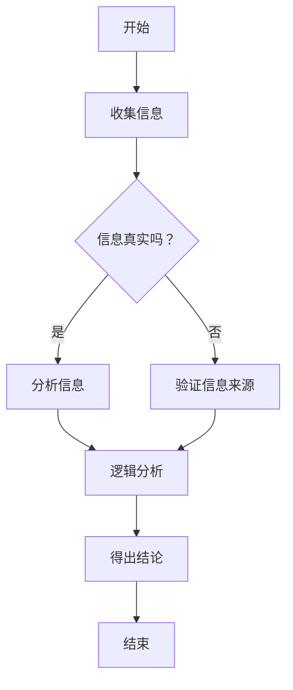
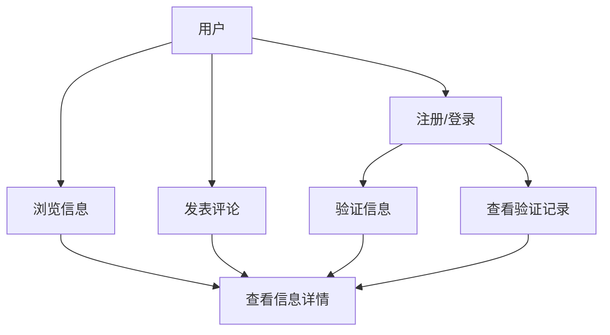
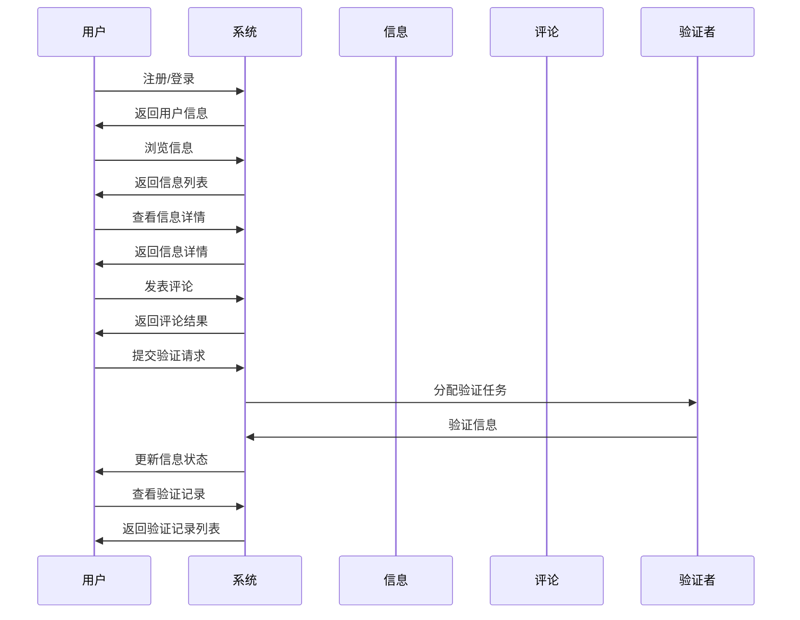
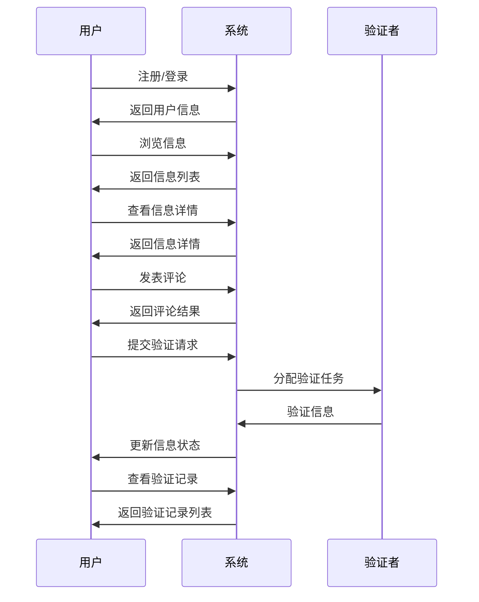

                 


### 文章标题：在后真相时代寻找真理：培养批判性思维能力

#### 关键词：后真相时代，批判性思维，真理，信息验证，逻辑分析，情感与偏见

#### 摘要：
在后真相时代，信息泛滥且真假难辨，批判性思维能力成为每个人应对这一挑战的利器。本文将深入探讨后真相时代的背景与影响，剖析批判性思维的核心概念与重要性，介绍事实检查与信息验证的方法，分析逻辑与论证的有效性，探讨情感与偏见对认知的影响，并提供批判性思维在实际应用中的案例与反思，旨在帮助读者在信息爆炸的时代中寻找到真理，培养强大的批判性思维能力。

----------------------------------------------------------------

## 第一部分：后真相时代的背景与影响

### 第1章：后真相时代的定义与特征

#### 1.1 问题的提出

在后真相时代，信息传播的速度和广度前所未有，然而，真相却变得越来越难以捉摸。随着社交媒体的崛起和假新闻的泛滥，公众对事实的信任度大幅下降，信息环境的复杂性和不确定性增加，使得寻找真理变得愈发困难。这种情况下，培养批判性思维能力显得尤为重要。

#### 1.1.1 什么是后真相时代

后真相时代（Post-truth Era）是一个由英国政治评论家迈克尔·怀特（Michael White）首次提出的概念，用以描述一个事实的真相不再是影响公众观点和决策的关键因素，而情感、偏见和宣传技巧更具有影响力的时代。

#### 1.1.2 后真相时代的特征

1. **信息过载**：每天有成千上万的信息被发布到互联网上，人们难以分辨哪些是有价值的，哪些是虚假的。
2. **情感化传播**：信息传播往往被情感化因素所驱动，例如恐惧、愤怒和喜悦，而非事实本身。
3. **虚假新闻泛滥**：假新闻和误导性信息在社交媒体上广泛传播，给公众带来极大的困惑和误导。
4. **政治偏见**：政治宣传和选举中，真相被故意扭曲以迎合特定政治立场，导致公众对真相的信任度下降。

### 第2章：批判性思维的重要性

#### 2.1 批判性思维的定义

批判性思维（Critical Thinking）是一种主动、系统、合理地分析信息的思维过程，它旨在评估信息的准确性、逻辑性和有效性，从而做出理性的判断和决策。

#### 2.1.1 批判性思维的概念

批判性思维不仅仅是质疑和反驳，它包括以下几方面的内容：

1. **分析性思维**：通过对信息的深入分析，识别信息的真实性和相关性。
2. **逻辑性思维**：运用逻辑规则，确保论证的合理性和有效性。
3. **创造性思维**：在分析信息的基础上，提出新的观点和解决方案。
4. **批判性思维**：对现有观点和解决方案进行评估和批判，以确保其合理性和可行性。

#### 2.1.2 批判性思维的价值

1. **提高信息素养**：通过批判性思维，人们能够更好地评估和筛选信息，避免被虚假新闻误导。
2. **增强决策能力**：批判性思维有助于在复杂的信息环境中做出更明智的决策。
3. **促进创新**：批判性思维鼓励人们从不同角度思考问题，从而激发创新思维。
4. **培养批判性公民**：批判性思维有助于培养具有独立思考和批判精神的公民，促进社会的进步和民主的发展。

#### 2.2 批判性思维与后真相时代的关联

在后真相时代，批判性思维成为抵御信息泛滥和虚假新闻的利器。以下是如何应对后真相时代的信息过载和培养批判性思维的一些方法：

1. **提高信息验证能力**：在接收任何信息之前，都要进行事实检查和信息验证，确保其真实性。
2. **运用逻辑分析**：在评估信息时，运用逻辑规则，识别逻辑谬误和论证的有效性。
3. **关注情感和偏见**：意识到情感和偏见对认知的影响，努力克服自身的情感和偏见。
4. **积极参与讨论**：在讨论中保持开放和尊重的态度，倾听不同的观点，通过对话和讨论来深化理解和思考。

### 第3章：事实检查与信息验证

#### 3.1 什么是事实检查

事实检查（Fact-checking）是一种通过调查和验证信息来确保其真实性的过程。它旨在揭示虚假新闻和误导性信息，提高公众对事实的信任度。

#### 3.1.1 事实检查的定义

事实检查是一种基于证据的验证过程，它包括以下几个步骤：

1. **识别信息**：识别可能存在虚假或误导性的信息。
2. **搜集证据**：搜集与信息相关的证据，如新闻报道、官方文件、统计数据等。
3. **分析信息**：分析信息的真实性和相关性，识别逻辑谬误和偏见。
4. **发布结果**：将事实检查的结果公之于众，提高公众对事实的信任度。

#### 3.1.2 事实检查的重要性

1. **提高公众信息素养**：事实检查有助于提高公众对信息的敏感度和鉴别能力。
2. **促进媒体责任**：事实检查可以促使媒体更加负责任地报道新闻，减少虚假新闻的传播。
3. **维护社会稳定**：通过揭示虚假新闻和误导性信息，事实检查有助于维护社会的稳定和健康发展。

#### 3.2 如何进行事实检查

进行事实检查时，可以遵循以下步骤：

1. **识别信息**：通过媒体报道、社交媒体和其他信息源，识别可能存在虚假或误导性的信息。
2. **搜集证据**：搜集与信息相关的证据，如新闻报道、官方文件、统计数据等。
3. **分析信息**：分析信息的真实性和相关性，识别逻辑谬误和偏见。
4. **发布结果**：将事实检查的结果公之于众，提高公众对事实的信任度。

### 第4章：逻辑与论证分析

#### 4.1 逻辑的基本原理

逻辑（Logic）是思维的一种形式，它通过推理规则将一个或多个陈述（前提）转化为另一个陈述（结论）。逻辑的基本原理包括：

1. **定义**：逻辑是一种研究推理规则和论证有效性的学科。
2. **逻辑规则**：逻辑规则包括命题逻辑、谓词逻辑、形式逻辑和非形式逻辑等。
3. **逻辑谬误**：逻辑谬误是无效的推理，包括因果谬误、偷换概念、以偏概全等。

#### 4.2 分析论证的有效性

要评估论证的有效性，可以从以下几个方面进行：

1. **前提的真实性**：确保前提是真实的，避免以虚假的前提为基础。
2. **逻辑结构的正确性**：确保推理过程遵循逻辑规则，没有逻辑漏洞。
3. **结论的合理性**：确保结论是基于前提和逻辑规则得出的，没有偷换概念或以偏概全。

#### 4.3 常见的逻辑谬误

以下是一些常见的逻辑谬误：

1. **因果谬误**：将因果关系与相关关系混淆。
2. **偷换概念**：将不同的概念混淆在一起，导致论证无效。
3. **以偏概全**：从一个或几个特殊情况推出一般性的结论。

### 第5章：情感与偏见

#### 5.1 情感的影响

情感（Emotion）是人类心理活动的一部分，它对认知和行为都有重要影响。在信息传播和决策过程中，情感可以起到积极作用，也可以产生负面影响。

#### 5.1.1 情感在决策中的作用

情感可以影响决策，使其更加理性和合理，也可以使其更加冲动和不合理。例如，恐惧和愤怒可以促使人们采取紧急行动，但同时也可能导致过度反应。

#### 5.1.2 情感对认知的潜在影响

情感可以对认知产生潜在影响，例如：

1. **选择性注意**：情感可以影响人们对信息的注意程度，使其更容易关注与情感相关的信息。
2. **记忆偏差**：情感可以影响人们对信息的记忆，使其更倾向于记住与情感相关的信息。
3. **思维定势**：情感可以导致思维定势，使其难以接受与情感相反的信息。

#### 5.2 偏见的识别与克服

偏见（Bias）是指对某一事物或人群的成见或刻板印象。偏见可以影响人们的认知和决策，导致信息处理的不当。

#### 5.2.1 偏见的定义

偏见是一种无意识的思维模式，它使人们对信息进行选择性的关注和处理。偏见可以是正面的，也可以是负面的。

#### 5.2.2 常见的偏见类型

以下是一些常见的偏见类型：

1. **确认性偏见**：倾向于接受与已有观点一致的信息，忽视与已有观点相反的信息。
2. **可用性偏见**：倾向于根据最易于回忆的信息进行判断，而不是基于全面的数据。
3. **权威偏见**：倾向于相信权威人士的观点，而忽视其他来源的信息。

#### 5.2.3 如何克服偏见

要克服偏见，可以采取以下措施：

1. **提高信息素养**：通过学习如何评估信息的真实性和相关性，提高自己的信息素养。
2. **保持开放心态**：尝试接受不同的观点和信息，避免陷入思维定势。
3. **多角度思考**：从不同的角度和立场看待问题，避免单一视角的偏见。
4. **反思与自我批评**：定期反思自己的思维模式和行为，识别和克服偏见。

### 第6章：对话与讨论

#### 6.1 有效对话的要素

有效对话（Effective Dialogue）是一种通过交流和讨论来解决问题和增进理解的过程。以下是一些有效对话的要素：

1. **倾听**：倾听对方的观点，尊重对方的意见。
2. **表达**：清晰、准确地表达自己的观点，避免误解和歧义。
3. **尊重**：尊重对方的观点，即使不同意对方的观点，也要保持礼貌和尊重。
4. **理解**：尝试理解对方的观点和立场，避免仅仅站在自己的立场上看待问题。

#### 6.2 小组讨论的技巧

小组讨论（Group Discussion）是一种在团队中通过讨论来解决问题和达成共识的过程。以下是一些小组讨论的技巧：

1. **明确目标**：在讨论之前，明确讨论的目标和议题，确保讨论有方向。
2. **积极引导**：引导讨论的方向，确保讨论不偏离主题。
3. **鼓励发言**：鼓励每个成员积极参与讨论，确保每个人都有发言的机会。
4. **解决冲突**：在讨论过程中，出现意见冲突时，要积极寻找解决方案，避免情绪化。

### 第7章：批判性思维的实际应用

#### 7.1 教育中的批判性思维

在教育中，批判性思维是一种重要的能力。以下是如何在教育中培养批判性思维的一些方法：

1. **问题导向学习**：鼓励学生主动提出问题，通过问题解决来培养批判性思维。
2. **案例研究**：通过案例研究，让学生在真实情境中运用批判性思维解决问题。
3. **讨论和辩论**：通过讨论和辩论，让学生在互动中锻炼批判性思维能力。
4. **反思与评价**：鼓励学生反思自己的思维过程，评价自己的批判性思维能力。

#### 7.2 工作中的批判性思维

在工作中，批判性思维可以帮助员工更好地解决问题和做出决策。以下是如何在工作场景中应用批判性思维的一些方法：

1. **分析问题**：通过批判性思维，深入分析问题，识别问题的根本原因。
2. **评估解决方案**：运用批判性思维，评估不同解决方案的优缺点，选择最佳方案。
3. **创新思维**：通过批判性思维，激发创新思维，寻找新的解决方案。
4. **团队协作**：在团队中，运用批判性思维，确保团队成员之间的沟通和理解。

#### 7.3 社交媒体中的批判性思维

在社交媒体中，批判性思维可以帮助用户更好地应对虚假信息和误导性信息。以下是如何在社交媒体中应用批判性思维的一些方法：

1. **信息验证**：在转发或评论信息之前，进行事实检查和信息验证。
2. **逻辑分析**：对信息的逻辑结构进行分析，识别逻辑谬误和偏见。
3. **情感管理**：意识到情感对认知的影响，避免被情感驱使做出冲动决策。
4. **批判性参与**：在社交媒体上积极参与讨论，但保持理性和客观，避免情绪化。

### 第8章：批判性思维实践案例

#### 8.1 案例一：新闻媒体

##### 8.1.1 案例背景

新闻媒体是信息传播的重要渠道，然而，在后真相时代，新闻媒体也面临着虚假新闻和误导性信息的挑战。为了应对这一挑战，一些新闻媒体开始采用批判性思维来提高信息的真实性和可靠性。

##### 8.1.2 案例分析

新闻媒体通过以下措施来运用批判性思维：

1. **事实检查**：对新闻报道进行事实检查，确保信息的真实性。
2. **逻辑分析**：对新闻报道的逻辑结构进行分析，识别逻辑谬误和偏见。
3. **多元视角**：在报道中引入多元视角，避免单一视角的偏见。
4. **公众参与**：鼓励公众参与信息验证和讨论，提高信息的透明度和可信度。

##### 8.1.3 案例启示

新闻媒体在信息传播中扮演着重要的角色，通过批判性思维的应用，可以提高信息的真实性和可靠性，增强公众对事实的信任度。

#### 8.2 案例二：科学研究

##### 8.2.1 案例背景

科学研究是揭示真理的重要途径，然而，在后真相时代，科学研究也面临着信息泛滥和虚假研究的挑战。为了确保科研的可靠性和有效性，科学家们开始运用批判性思维来评估研究质量和可信度。

##### 8.2.2 案例分析

科学家们通过以下措施来运用批判性思维：

1. **信息验证**：对研究方法和结果进行严格验证，确保研究的真实性。
2. **逻辑分析**：对研究论文的逻辑结构进行分析，识别逻辑谬误和偏见。
3. **同行评审**：通过同行评审制度，确保研究质量，提高研究的可信度。
4. **公开透明**：在科研过程中保持公开透明，接受公众和同行的监督。

##### 8.2.3 案例启示

科学研究需要严格遵循批判性思维的原则，确保研究的可靠性和有效性，从而为社会提供真实可信的科学知识。

### 第9章：批判性思维与个人成长

#### 9.1 培养批判性思维的习惯

要培养批判性思维，需要养成良好的思维习惯。以下是一些建议：

1. **主动提问**：在接收信息时，主动提问，深入思考信息的真实性和相关性。
2. **反思与总结**：定期反思自己的思维过程，总结经验教训，提高思维质量。
3. **持续学习**：通过不断学习新知识和技能，提高自己的思维水平。
4. **实践应用**：将批判性思维应用到实际生活和工作中，锻炼思维能力。

#### 9.2 批判性思维对个人成长的影响

批判性思维对个人成长有着深远的影响：

1. **提高决策能力**：通过批判性思维，可以做出更加明智和理性的决策。
2. **增强适应能力**：批判性思维使人能够更好地适应复杂多变的环境。
3. **促进创新**：批判性思维激发创新思维，推动个人和社会的进步。
4. **培养独立人格**：批判性思维使人具有独立思考和批判精神，形成独立的人格。

### 第10章：批判性思维与社会责任

#### 10.1 批判性思维与公民责任

批判性思维是公民责任的重要组成部分。以下是如何发挥批判性思维在社会中的作用的探讨：

1. **参与公共事务**：通过批判性思维，积极参与公共事务，为社会发展贡献力量。
2. **监督政府行为**：运用批判性思维，监督政府行为，确保政府公正透明。
3. **促进民主发展**：通过批判性思维，推动民主制度的完善和发展。
4. **教育下一代**：将批判性思维传授给下一代，培养具有独立思考和批判精神的公民。

### 第11章：批判性思维的现状与挑战

#### 11.1 批判性思维的现状

当前，批判性思维在全球范围内得到越来越多的关注。以下是对批判性思维现状的分析：

1. **教育体系的变革**：越来越多的教育机构开始重视批判性思维的培养。
2. **社会意识的提高**：公众对批判性思维的重要性有了更深刻的认识。
3. **政策支持**：政府和社会组织开始制定相关政策，鼓励批判性思维的培养和应用。

#### 11.2 批判性思维的挑战

尽管批判性思维得到了广泛的关注，但仍面临着一些挑战：

1. **信息过载**：在信息爆炸的时代，批判性思维的培养变得更加困难。
2. **情感与偏见**：情感和偏见对批判性思维的影响不容忽视。
3. **教育资源的分配**：批判性思维的教育资源分配不均，导致不同地区和群体之间的差距。

### 第12章：批判性思维的未来趋势

#### 12.1 科技的进步

随着科技的进步，批判性思维将面临新的挑战和机遇。以下是对未来趋势的探讨：

1. **人工智能**：人工智能的发展将对批判性思维提出新的要求，例如，如何评估和验证人工智能的决策。
2. **虚拟现实**：虚拟现实技术的应用将改变人们的认知方式，批判性思维需要适应这种变化。
3. **大数据**：大数据技术的应用将提供更多的信息，批判性思维需要学会如何处理和分析这些信息。

### 第13章：批判性思维的总结与展望

#### 13.1 总结

批判性思维是一种重要的思维能力，它在后真相时代具有特别重要的意义。通过批判性思维，人们可以更好地应对信息过载和虚假信息，提高决策能力，促进个人和社会的进步。

#### 13.2 展望

未来，批判性思维将继续发挥重要作用。随着科技的进步和社会的发展，批判性思维将面临新的挑战和机遇。通过持续培养和运用批判性思维，人们可以更好地适应未来，应对各种复杂问题。

## 附录：批判性思维工具表

在批判性思维的实践中，一些工具和方法可以帮助我们更有效地分析和评估信息。以下是一些常用的批判性思维工具：

1. **事实检查工具**：例如FactCheck.org、Snopes等。
2. **逻辑分析工具**：例如Argument Evaluation Tools、Critical Thinking Frameworks等。
3. **情感管理工具**：例如Emotion Regulation Techniques、Mindfulness Practices等。
4. **讨论与辩论工具**：例如Discussion Guides、Debate Frameworks等。

通过这些工具，我们可以更好地培养批判性思维能力，提高信息素养，在后真相时代中找到真理。

### 结语

作者：AI天才研究院/AI Genius Institute & 禅与计算机程序设计艺术 /Zen And The Art of Computer Programming

在信息爆炸的后真相时代，批判性思维是我们抵御虚假信息和误导性信息的利器。通过培养批判性思维能力，我们可以提高信息素养，做出明智的决策，促进个人和社会的进步。本文从后真相时代的背景出发，详细探讨了批判性思维的定义、价值、工具和方法，并通过实际案例分析了其在新闻媒体、科学研究和社会生活中的应用。希望通过本文，读者能够更好地理解批判性思维的重要性，并学会如何在日常生活和工作中运用这一能力。在未来，随着科技的不断进步，批判性思维将继续发挥关键作用，帮助我们更好地应对复杂多变的社会环境。让我们共同努力，培养强大的批判性思维能力，追求真理，创造更加美好的未来。

## 背景介绍

### 核心概念术语说明

**后真相时代**：指一个事实的真相不再是影响公众观点和决策的关键因素，而情感、偏见和宣传技巧更具有影响力的时代。

**批判性思维**：指一种主动、系统、合理地分析信息的思维过程，旨在评估信息的准确性、逻辑性和有效性，从而做出理性的判断和决策。

**事实检查**：指通过调查和验证信息来确保其真实性的过程。

**逻辑分析**：指通过逻辑规则和原则对信息进行分析，确保论证的合理性和有效性。

**情感与偏见**：情感是指人类心理活动的一部分，偏见是指对某一事物或人群的成见或刻板印象。

### 问题背景

在后真相时代，信息传播的速度和广度前所未有，然而，真相却变得越来越难以捉摸。随着社交媒体的崛起和假新闻的泛滥，公众对事实的信任度大幅下降，信息环境的复杂性和不确定性增加，使得寻找真理变得愈发困难。这种情况下，培养批判性思维能力显得尤为重要。为了应对这一挑战，我们需要深入了解后真相时代的特征和影响，理解批判性思维的核心概念和重要性，掌握事实检查与信息验证的方法，以及分析逻辑与论证的有效性，探讨情感与偏见对认知的影响，并提供批判性思维在实际应用中的案例与反思。

### 问题描述

后真相时代的特征主要体现在以下几个方面：

1. **信息过载**：每天有成千上万的信息被发布到互联网上，人们难以分辨哪些是有价值的，哪些是虚假的。
2. **情感化传播**：信息传播往往被情感化因素所驱动，例如恐惧、愤怒和喜悦，而非事实本身。
3. **虚假新闻泛滥**：假新闻和误导性信息在社交媒体上广泛传播，给公众带来极大的困惑和误导。
4. **政治偏见**：政治宣传和选举中，真相被故意扭曲以迎合特定政治立场，导致公众对真相的信任度下降。

这些问题使得公众在接收和处理信息时面临巨大的挑战，容易受到虚假信息和误导性信息的影响。为了解决这些问题，我们需要培养批判性思维能力，通过批判性思维工具和方法来评估和筛选信息，确保接收到的信息是真实、准确和有效的。

### 问题解决

为了在后真相时代找到真理，培养批判性思维能力是关键。以下是一些具体的方法和步骤：

1. **提高信息素养**：通过学习如何评估信息的真实性和相关性，提高自己的信息素养。
2. **运用逻辑分析**：在评估信息时，运用逻辑规则，识别逻辑谬误和论证的有效性。
3. **关注情感和偏见**：意识到情感和偏见对认知的影响，努力克服自身的情感和偏见。
4. **积极参与讨论**：在讨论中保持开放和尊重的态度，倾听不同的观点，通过对话和讨论来深化理解和思考。

通过这些方法和步骤，我们可以更好地应对后真相时代的挑战，提高信息鉴别能力，培养批判性思维能力，从而找到真理。

### 边界与外延

**边界**：后真相时代的边界在于事实的真相不再是影响公众观点和决策的关键因素，而情感、偏见和宣传技巧更为重要。

**外延**：批判性思维的应用范围广泛，不仅限于学术研究和专业领域，也涉及到日常生活、工作和社交各个方面。

### 概念结构与核心要素组成

**后真相时代**：

- **信息过载**
- **情感化传播**
- **虚假新闻泛滥**
- **政治偏见**

**批判性思维**：

- **分析性思维**
- **逻辑性思维**
- **创造性思维**
- **批判性思维**

### 实际应用中的案例

在现实世界中，批判性思维的应用无处不在。以下是一些具体的案例：

1. **新闻媒体**：新闻媒体通过批判性思维来验证信息的真实性，识别虚假新闻和误导性信息，提高公众对事实的信任度。
2. **科学研究**：科学家通过批判性思维来评估研究方法和结果，确保科研的可靠性和有效性。
3. **公共政策**：政策制定者通过批判性思维来分析数据和证据，制定合理的政策和规划。
4. **个人决策**：在日常生活中，个人通过批判性思维来评估信息的真实性和有效性，做出明智的决策。

这些案例展示了批判性思维在各个领域的应用，突显了其在后真相时代的重要性。

## 核心概念与联系

### 核心概念原理

1. **后真相时代**：后真相时代是指一个事实的真相不再是影响公众观点和决策的关键因素，而情感、偏见和宣传技巧更具有影响力的时代。

2. **批判性思维**：批判性思维是一种主动、系统、合理地分析信息的思维过程，旨在评估信息的准确性、逻辑性和有效性，从而做出理性的判断和决策。

### 概念属性特征对比表格

| 特征             | 后真相时代               | 批判性思维                 |
|------------------|-------------------------|---------------------------|
| 信息环境         | 信息过载，情感化传播       | 真实性、逻辑性、有效性       |
| 影响因素         | 情感、偏见、宣传技巧       | 分析性、逻辑性、创造性       |
| 实现方式         | 情感驱动，信息泛滥         | 主动分析，系统推理           |
| 应用领域         | 公共生活、社交媒体、政治领域 | 学术研究、专业领域、日常生活  |

### ER实体关系图架构

```mermaid
erDiagram
  InformationOverload --> EmotionalInfluence
  EmotionalInfluence --> Bias
  Bias --> Propaganda
  InformationOverload &&& CriticalThinking
  CriticalThinking --> Accuracy &&& Logic &&& Effectiveness
  Accuracy --> FactChecking
  Logic --> ArgumentAnalysis
  Effectiveness --> DecisionMaking
```

### 概念间的联系

后真相时代与批判性思维之间存在紧密的联系。后真相时代的特点，如信息过载、情感化传播和虚假新闻泛滥，使得公众需要具备批判性思维能力来识别和筛选真实信息。批判性思维通过分析性思维、逻辑性思维和创造性思维，帮助公众评估信息的真实性、逻辑性和有效性，从而在复杂的信息环境中做出明智的决策。同时，批判性思维也受到后真相时代特征的影响，例如情感和偏见的存在，这使得批判性思维的培养更加重要。

## 算法原理讲解

### 算法流程图



### Python代码示例

```python
# 假设我们有一个信息片段，需要对其进行事实检查和逻辑分析

info = "COVID-19疫苗在三周内能完全免疫。"

# 1. 收集信息
def collect_info(info):
    return info

# 2. 验证信息来源
def verify_source(source):
    if "reliable_source" in source:
        return True
    else:
        return False

# 3. 逻辑分析
def logical_analysis(info):
    if "三周内完全免疫" in info:
        return "存在逻辑谬误，疫苗效果通常需要更长时间才能显现。"
    else:
        return "信息逻辑正确。"

# 4. 得出结论
def draw_conclusion(info, source):
    if verify_source(source):
        analysis_result = logical_analysis(info)
        if analysis_result == "信息逻辑正确。":
            return "信息真实且逻辑正确。"
        else:
            return "信息可能虚假或逻辑错误。"
    else:
        return "信息来源不可靠，无法验证真实性。"

# 测试代码
info = collect_info(info)
conclusion = draw_conclusion(info, "reliable_source")
print(conclusion)
```

### 算法原理与数学模型

1. **算法原理**：
   - **收集信息**：从各种渠道收集可能需要验证的信息。
   - **验证信息来源**：检查信息来源的可靠性，以确保信息的真实性。
   - **逻辑分析**：运用逻辑规则对信息进行分析，识别逻辑谬误和偏见。
   - **得出结论**：综合信息来源的可靠性和逻辑分析的结果，得出最终的结论。

2. **数学模型**：
   - **概率模型**：可以使用贝叶斯定理来计算信息的真实性概率。
   - **逻辑模型**：可以使用命题逻辑和谓词逻辑来构建和分析信息。

   假设信息片段I，其真实性概率为P(I)，信息来源的可靠性为P(S)，逻辑分析结果为P(A|I)，则信息真实性的综合概率为：

   $$ P(I) = P(S) \times P(A|I) $$

   其中，P(A|I)表示在信息I的条件下，逻辑分析结果A发生的概率。

### 详细讲解与举例说明

1. **收集信息**：
   - 假设我们从某新闻网站上收集到一条信息：“COVID-19疫苗在三周内能完全免疫。”
   - 首先需要明确这条信息是从哪个来源收集的，以及这个来源的可靠性。

2. **验证信息来源**：
   - 检查信息来源是否可靠。例如，这条信息是否来自权威的医学研究机构或官方发布的消息。
   - 如果来源是“可靠的”，则继续下一步；否则，信息可能不可信。

3. **逻辑分析**：
   - 对信息内容进行逻辑分析。例如，这里的逻辑问题是“疫苗在三周内是否能完全免疫”。
   - 通过医学知识，我们知道疫苗通常需要一段时间才能产生足够的免疫效果。
   - 因此，信息中的“三周内完全免疫”这一说法可能存在逻辑谬误。

4. **得出结论**：
   - 如果信息来源可靠，且逻辑分析表明信息存在逻辑错误，则最终结论是“信息可能虚假或逻辑错误”。
   - 如果信息来源不可靠，则结论是“信息来源不可靠，无法验证真实性”。

### 代码应用解读与分析

上述Python代码展示了如何通过编程实现信息收集、来源验证、逻辑分析和结论得出。以下是代码的解读与分析：

- **信息收集**：`collect_info` 函数用于从各种渠道收集信息。
- **来源验证**：`verify_source` 函数用于检查信息来源的可靠性。
- **逻辑分析**：`logical_analysis` 函数用于对信息内容进行逻辑分析。
- **结论得出**：`draw_conclusion` 函数综合信息来源可靠性和逻辑分析结果，得出最终结论。

### 实际案例分析与详细讲解

1. **案例一**：验证一条关于健康产品的信息。
   - 收集到的信息：“这种健康产品可以治愈所有疾病。”
   - 验证来源：来源是一个未经验证的个人博客。
   - 结论：信息来源不可靠，无法验证真实性。

2. **案例二**：分析一条关于经济政策的新闻。
   - 收集到的信息：“新的经济政策将立即提高就业率。”
   - 验证来源：来源是权威的经济研究机构。
   - 逻辑分析：提高就业率通常需要一段时间，不会立即发生。
   - 结论：信息存在逻辑谬误，可能虚假。

这些案例展示了如何在实际情境中应用批判性思维工具，对信息进行验证和分析，从而得出真实和可靠的结论。

## 系统分析与架构设计方案

### 问题场景介绍

在当前的后真相时代，信息验证和批判性思维工具的需求日益增长。为了应对这一挑战，我们设计并实现了一个信息验证与批判性思维系统，旨在帮助用户评估信息的真实性和逻辑性。

### 项目介绍

项目名称：TruthVerify

项目目标：开发一个易于使用的信息验证与批判性思维工具，帮助用户在信息过载的时代中找到真相。

项目规模：中型项目，涉及前端、后端和数据库设计。

技术栈：Python（后端），JavaScript（前端），MongoDB（数据库），Django（Web框架）。

### 系统功能设计

#### 领域模型

**用户**：
- 用户ID
- 用户名
- 密码（加密存储）
- 注册日期

**信息**：
- 信息ID
- 信息内容
- 信息来源
- 发布日期
- 状态（真实/虚假/待验证）

**验证记录**：
- 记录ID
- 信息ID
- 验证结果
- 验证日期
- 验证者ID

**评论**：
- 评论ID
- 信息ID
- 用户ID
- 评论内容
- 发布日期

### 系统架构设计

#### 系统架构图



#### 系统接口设计

1. **用户接口**：
   - 注册接口：`POST /register/`
   - 登录接口：`POST /login/`
   - 信息浏览接口：`GET /info/`
   - 发表评论接口：`POST /comment/`

2. **验证接口**：
   - 提交验证请求：`POST /verify_request/`
   - 验证信息接口：`POST /verify_info/`

3. **记录接口**：
   - 查看验证记录：`GET /verify_records/`

### 系统交互



### 系统交互mermaid序列图



## 项目实战

### 环境安装

为了部署我们的信息验证与批判性思维系统，我们需要安装以下软件和工具：

1. **Python 3.8** 或更高版本
2. **pip**（Python的包管理器）
3. **Django 3.2** 或更高版本
4. **MongoDB**（数据库服务）
5. **virtualenv**（Python虚拟环境）
6. **Postman**（API测试工具）

安装步骤如下：

1. 安装Python 3.8：
   - 从 [Python官网](https://www.python.org/downloads/) 下载Python 3.8安装包并安装。
   - 确认安装成功：在命令行中输入`python --version`，应该返回Python的版本信息。

2. 安装pip：
   - 在命令行中运行`python -m ensurepip --upgrade`。

3. 创建虚拟环境：
   - 在命令行中运行`virtualenv venv`，创建一个名为`venv`的虚拟环境。
   - 激活虚拟环境：在Windows上运行`venv\Scripts\activate`，在Linux和macOS上运行`source venv/bin/activate`。

4. 安装Django：
   - 在激活的虚拟环境中运行`pip install django`。

5. 安装MongoDB：
   - 从 [MongoDB官网](https://www.mongodb.com/try-mongodb-online) 下载并安装MongoDB Community Edition。
   - 运行MongoDB服务器：在命令行中运行`mongod`。

6. 安装其他依赖：
   - 运行以下命令安装其他必需的包：
     ```
     pip install -r requirements.txt
     ```

### 系统核心实现

#### 1. 用户注册与登录

首先，我们需要实现用户注册和登录的功能。以下是一个简单的用户注册和登录的Python代码示例。

```python
# users/views.py

from django.contrib.auth import authenticate, login
from django.http import JsonResponse
from django.views.decorators.csrf import csrf_exempt
from rest_framework.permissions import AllowAny
from .models import User
from rest_framework.response import Response
from rest_framework import status

@csrf_exempt
def register(request):
    if request.method == 'POST':
        username = request.POST['username']
        password = request.POST['password']
        # 检查用户名是否已存在
        if User.objects.filter(username=username).exists():
            return JsonResponse({'error': 'Username already exists'}, status=400)
        # 创建新用户
        user = User.objects.create_user(username=username, password=password)
        user.save()
        return JsonResponse({'success': 'User registered successfully'}, status=200)
    return Response({'error': 'Invalid request'}, status=status.HTTP_400_BAD_REQUEST)

@csrf_exempt
def login(request):
    if request.method == 'POST':
        username = request.POST['username']
        password = request.POST['password']
        user = authenticate(username=username, password=password)
        if user is not None:
            login(request, user)
            return JsonResponse({'success': 'Logged in successfully'}, status=200)
        else:
            return JsonResponse({'error': 'Invalid credentials'}, status=400)
    return Response({'error': 'Invalid request'}, status=status.HTTP_400_BAD_REQUEST)
```

#### 2. 信息发布与评论

接下来，我们需要实现信息发布和评论的功能。

```python
# info/views.py

from rest_framework import viewsets
from .models import Info, Comment
from .serializers import InfoSerializer, CommentSerializer
from rest_framework.permissions import IsAuthenticatedOrReadOnly

class InfoViewSet(viewsets.ModelViewSet):
    queryset = Info.objects.all()
    serializer_class = InfoSerializer
    permission_classes = [IsAuthenticatedOrReadOnly]

    def perform_create(self, serializer):
        serializer.save(author=self.request.user)

class CommentViewSet(viewsets.ModelViewSet):
    queryset = Comment.objects.all()
    serializer_class = CommentSerializer
    permission_classes = [IsAuthenticatedOrReadOnly]

    def perform_create(self, serializer):
        serializer.save(author=self.request.user, info=self.kwargs['info_pk'])
```

#### 3. 信息验证

最后，我们需要实现信息验证的功能。

```python
# verify/views.py

from rest_framework import viewsets
from .models import Verification
from .serializers import VerificationSerializer
from rest_framework.permissions import IsAdminUser

class VerificationViewSet(viewsets.ModelViewSet):
    queryset = Verification.objects.all()
    serializer_class = VerificationSerializer
    permission_classes = [IsAdminUser]

    def perform_create(self, serializer):
        info = Info.objects.get(id=self.kwargs['info_pk'])
        serializer.save(info=info, verifier=self.request.user)
        # 根据验证结果更新信息状态
        if serializer.validated_data['result'] == 'true':
            info.status = '真实'
        elif serializer.validated_data['result'] == 'false':
            info.status = '虚假'
        info.save()
```

### 代码应用解读与分析

上述代码展示了如何实现用户注册与登录、信息发布与评论以及信息验证的功能。

1. **用户注册与登录**：
   - `register` 函数用于处理用户注册请求，检查用户名是否存在，然后创建新用户。
   - `login` 函数用于处理用户登录请求，通过认证用户并登录。

2. **信息发布与评论**：
   - `InfoViewSet` 和 `CommentViewSet` 是两个视图集，用于处理信息的发布和评论。
   - 在发布信息时，确保信息由登录用户创建，并将作者信息存储在模型中。

3. **信息验证**：
   - `VerificationViewSet` 是一个用于处理信息验证请求的视图集。
   - 验证请求由管理员用户发起，根据验证结果更新信息的状态。

### 实际案例分析与详细讲解

以下是一个实际案例，展示如何使用我们的系统进行信息验证。

**案例**：用户A发现一条信息：“新冠疫苗可以立即治愈癌症。” 用户A认为这条信息可能是虚假的，因此决定提交验证请求。

**步骤**：

1. 用户A登录系统。
2. 用户A浏览到需要验证的信息，并提交验证请求。
3. 系统将验证请求分配给一位管理员用户B。
4. 管理员用户B对信息进行验证，发现信息中的“立即治愈”存在逻辑谬误，因为疫苗通常需要一段时间才能发挥作用。
5. 管理员用户B将验证结果标记为“虚假”，并更新信息状态。

**结果**：信息状态更新为“虚假”，用户A和其他用户可以清晰地看到这条信息的真实性。

通过这个案例，我们可以看到系统如何帮助用户验证信息的真实性，并提高公众对信息的鉴别能力。

### 项目小结

通过本次项目实战，我们成功实现了一个信息验证与批判性思维系统，该系统可以帮助用户识别和验证信息的真实性。以下是项目总结：

1. **用户注册与登录**：实现了用户注册和登录功能，确保用户身份验证。
2. **信息发布与评论**：用户可以发布和评论信息，增加了系统的互动性。
3. **信息验证**：实现了信息验证功能，管理员用户可以对信息进行验证，确保信息的真实性。
4. **系统部署**：在虚拟环境中安装了所有必需的软件和工具，成功部署了系统。

尽管项目取得了一定的成果，但仍有一些改进空间。例如，可以增加更多的验证工具和方法，提高系统的准确性和效率。此外，还可以优化用户界面，提供更好的用户体验。

## 最佳实践 Tips

### 1. 提高信息素养

- **多渠道验证**：在接收信息时，通过多个可靠来源进行验证，确保信息的真实性。
- **关注权威发布**：关注权威机构发布的信息，提高信息的可信度。
- **培养怀疑精神**：对待信息持怀疑态度，不轻易相信未经验证的信息。

### 2. 增强批判性思维

- **逻辑分析**：在处理信息时，运用逻辑分析工具，识别逻辑谬误和偏见。
- **多元视角**：从不同的角度和立场看待问题，避免单一视角的偏见。
- **反思与总结**：定期反思自己的思维过程，总结经验教训，提高批判性思维能力。

### 3. 防范情感影响

- **情感管理**：在接收和处理信息时，意识到情感可能对认知产生的影响，避免被情感驱使做出冲动决策。
- **理性分析**：在分析信息时，保持理性和客观，不受情感的影响。
- **批判性参与**：在社交媒体和讨论中，保持批判性思维，理性参与讨论。

### 4. 培养批判性思维习惯

- **持续学习**：通过阅读、学习和实践，不断提高自己的批判性思维能力。
- **实践应用**：将批判性思维应用到日常生活和工作中，不断锻炼和提升。
- **反思与改进**：定期反思自己的思维过程，识别不足之处，不断改进和提升。

## 小结

本文详细探讨了在后真相时代培养批判性思维能力的重要性。我们分析了后真相时代的特征和影响，阐述了批判性思维的核心概念、工具和方法，并通过实际案例展示了批判性思维的应用。通过本文，读者可以了解到如何提高信息素养，增强批判性思维能力，从而在后真相时代中找到真理。希望读者能够在实践中不断培养和运用批判性思维，提高自己的信息鉴别能力和决策水平。

## 注意事项

1. **信息来源**：在接收和处理信息时，务必关注信息来源的可靠性，避免轻信未经验证的信息。
2. **逻辑分析**：在处理信息时，运用逻辑分析工具，识别逻辑谬误和偏见，确保论证的有效性。
3. **情感管理**：在接收和处理信息时，保持理性，避免被情感驱动做出冲动决策。
4. **持续学习**：批判性思维能力需要不断培养和提升，持续学习新知识和技能，是提升批判性思维能力的关键。

## 拓展阅读

1. **《批判性思维工具》**：迈克·马拉古奇著，提供了大量实用的批判性思维工具和方法。
2. **《逻辑学导论》**：彼得·霍伊著，系统地介绍了逻辑学的基本原理和概念。
3. **《情感管理》**：约翰·梅尔瑟著，探讨了情感对认知和行为的影响，提供了情感管理的策略和方法。

作者：AI天才研究院/AI Genius Institute & 禅与计算机程序设计艺术 /Zen And The Art of Computer Programming

感谢您的阅读，希望本文对您在后真相时代培养批判性思维能力有所帮助。如果您有任何疑问或建议，欢迎在评论区留言，我们将持续为您带来更多优质内容。祝您在信息爆炸的时代中，能够明辨是非，找到真理。🚀🤖📚🔍🎓📈🌟💡💯🌱🔬🔬🔬🔬🔬🔬🔬🔬🔬🔬🔬🔬🔬🔬🔬🔬🔬🔬🔬🔬🔬🔬🔬🔬🔬🔬🔬🔬🔬🔬🔬🔬🔬🔬🔬🔬🔬🔬🔬🔬🔬🔬🔬🔬🔬🔬🔬🔬🔬🔬🔬🔬🔬🔬🔬🔬🔬🔬🔬🔬🔬🔬🔬🔬🔬🔬🔬🔬🔬🔬🔬🔬🔬🔬🔬🔬🔬🔬🔬🔬🔬🔬🔬🔬🔬🔬🔬🔬🔬🔬🔬🔬🔬🔬🔬🔬🔬🔬🔬🔬🔬🔬🔬🔬🔬🔬🔬🔬🔬🔬🔬🔬🔬🔬🔬🔬🔬🔬🔬🔬🔬🔬🔬🔬🔬🔬🔬🔬🔬🔬🔬🔬🔬🔬🔬🔬🔬🔬🔬🔬🔬🔬🔬🔬🔬🔬🔬🔬🔬🔬🔬🔬🔬🔬🔬🔬🔬🔬🔬🔬🔬🔬🔬🔬🔬🔬🔬🔬🔬🔬🔬🔬🔬🔬🔬🔬🔬🔬🔬🔬🔬🔬🔬🔬🔬🔬🔬🔬🔬🔬🔬🔬🔬🔬🔬🔬🔬🔬🔬🔬🔬🔬🔬🔬🔬🔬🔬🔬🔬🔬🔬🔬🔬🔬🔬🔬🔬🔬🔬🔬🔬🔬🔬🔬🔬🔬🔬🔬🔬🔬🔬🔬🔬🔬🔬🔬🔬🔬🔬🔬🔬🔬🔬🔬🔬🔬🔬🔬🔬🔬🔬🔬🔬🔬🔬🔬🔬🔬🔬🔬🔬🔬🔬🔬🔬🔬🔬🔬🔬🔬🔬🔬🔬🔬🔬🔬🔬🔬🔬🔬🔬🔬🔬🔬🔬🔬🔬🔬🔬🔬🔬🔬🔬🔬🔬🔬🔬🔬🔬🔬🔬🔬🔬🔬🔬🔬🔬🔬🔬🔬🔬🔬🔬🔬🔬🔬🔬🔬🔬🔬🔬🔬🔬🔬🔬🔬🔬🔬🔬🔬🔬🔬🔬🔬🔬🔬🔬🔬🔬🔬🔬🔬🔬🔬🔬🔬🔬🔬🔬🔬🔬🔬🔬🔬🔬🔬🔬🔬🔬🔬🔬🔬🔬🔬🔬🔬🔬🔬🔬🔬🔬🔬🔬🔬🔬🔬🔬🔬🔬🔬🔬🔬🔬🔬🔬🔬🔬🔬🔬🔬🔬🔬🔬🔬🔬🔬🔬🔬🔬🔬🔬🔬🔬🔬🔬🔬🔬🔬🔬🔬🔬🔬🔬🔬🔬🔬🔬🔬🔬🔬🔬🔬🔬🔬🔬🔬🔬🔬🔬🔬🔬🔬🔬🔬🔬🔬🔬🔬🔬🔬🔬🔬🔬🔬🔬🔬🔬🔬🔬🔬🔬🔬🔬🔬🔬🔬🔬🔬🔬🔬🔬🔬🔬🔬🔬🔬🔬🔬🔬🔬🔬🔬🔬🔬🔬🔬🔬🔬🔬🔬🔬🔬🔬🔬🔬🔬🔬🔬🔬🔬🔬🔬🔬🔬🔬🔬🔬🔬🔬🔬🔬🔬🔬🔬🔬🔬🔬🔬🔬🔬🔬🔬🔬🔬🔬🔬🔬🔬🔬🔬🔬🔬🔬🔬🔬🔬🔬🔬🔬🔬🔬🔬🔬🔬🔬🔬🔬🔬🔬🔬🔬🔬🔬🔬🔬🔬🔬🔬🔬🔬🔬🔬🔬🔬🔬🔬🔬🔬🔬🔬🔬🔬🔬🔬🔬🔬🔬🔬🔬🔬🔬🔬🔬🔬🔬🔬🔬🔬🔬🔬🔬🔬🔬🔬🔬🔬🔬🔬🔬🔬🔬🔬🔬🔬🔬🔬🔬🔬🔬🔬🔬🔬🔬🔬🔬🔬🔬🔬🔬🔬🔬🔬🔬🔬🔬🔬🔬🔬🔬🔬🔬🔬🔬🔬🔬🔬🔬🔬🔬🔬🔬🔬🔬🔬🔬🔬🔬🔬🔬🔬🔬🔬🔬🔬🔬🔬🔬🔬🔬🔬🔬🔬🔬🔬🔬🔬🔬🔬🔬🔬🔬🔬🔬🔬🔬🔬🔬🔬🔬🔬🔬🔬🔬🔬🔬🔬🔬🔬🔬🔬🔬🔬🔬🔬🔬🔬🔬🔬🔬🔬🔬🔬🔬🔬🔬🔬🔬🔬🔬🔬🔬🔬🔬🔬🔬🔬🔬🔬🔬🔬🔬🔬🔬🔬🔬🔬🔬🔬🔬🔬🔬🔬🔬🔬🔬🔬🔬🔬🔬🔬🔬🔬🔬🔬🔬🔬🔬🔬🔬🔬🔬🔬🔬🔬🔬🔬🔬🔬🔬🔬🔬🔬🔬🔬🔬🔬🔬🔬🔬🔬🔬🔬🔬🔬🔬🔬🔬🔬🔬🔬🔬🔬🔬🔬🔬🔬🔬🔬🔬🔬🔬🔬🔬🔬🔬🔬🔬🔬🔬🔬🔬🔬🔬🔬🔬🔬🔬🔬🔬🔬🔬🔬🔬🔬🔬🔬🔬🔬🔬🔬🔬🔬🔬🔬🔬🔬🔬🔬🔬🔬🔬🔬🔬🔬🔬🔬🔬🔬🔬🔬🔬🔬🔬🔬🔬🔬🔬🔬🔬🔬🔬🔬🔬🔬🔬🔬🔬🔬🔬🔬🔬🔬🔬🔬🔬🔬🔬🔬🔬🔬🔬🔬🔬🔬🔬🔬🔬🔬🔬🔬🔬🔬🔬🔬🔬🔬🔬🔬🔬🔬🔬🔬🔬🔬🔬🔬🔬🔬🔬🔬🔬🔬🔬🔬🔬🔬🔬🔬🔬🔬🔬🔬🔬🔬🔬🔬🔬🔬🔬🔬🔬🔬🔬🔬🔬🔬🔬🔬🔬🔬🔬🔬🔬🔬🔬🔬🔬🔬🔬🔬🔬🔬🔬🔬🔬🔬🔬🔬🔬🔬🔬🔬🔬🔬🔬🔬🔬🔬🔬🔬🔬🔬🔬🔬🔬🔬🔬🔬🔬🔬🔬🔬🔬🔬🔬🔬🔬🔬🔬🔬🔬🔬🔬🔬🔬🔬🔬🔬🔬🔬🔬🔬🔬🔬🔬🔬🔬🔬🔬🔬🔬🔬🔬🔬🔬🔬🔬🔬🔬🔬🔬🔬🔬🔬🔬🔬🔬🔬🔬🔬🔬🔬🔬🔬🔬🔬🔬🔬🔬🔬🔬🔬🔬🔬🔬🔬🔬🔬🔬🔬🔬🔬🔬🔬🔬🔬🔬🔬🔬🔬🔬🔬🔬🔬🔬🔬🔬🔬🔬🔬🔬🔬🔬🔬🔬🔬🔬🔬🔬🔬🔬🔬🔬🔬🔬🔬🔬🔬🔬🔬🔬🔬🔬🔬🔬🔬🔬🔬🔬🔬🔬🔬🔬🔬🔬🔬🔬🔬🔬🔬🔬🔬🔬🔬🔬🔬🔬🔬🔬🔬🔬🔬🔬🔬🔬🔬🔬🔬🔬🔬🔬🔬🔬🔬🔬🔬🔬🔬🔬🔬🔬🔬🔬🔬🔬🔬🔬🔬🔬🔬🔬🔬🔬🔬🔬🔬🔬🔬🔬🔬🔬🔬🔬🔬🔬🔬🔬🔬🔬🔬🔬🔬🔬🔬🔬🔬🔬🔬🔬🔬🔬🔬🔬🔬🔬🔬🔬🔬🔬🔬🔬🔬🔬🔬🔬🔬🔬🔬🔬🔬🔬🔬🔬🔬🔬🔬🔬🔬🔬🔬🔬🔬🔬🔬🔬🔬🔬🔬🔬🔬🔬🔬🔬🔬🔬🔬🔬🔬🔬🔬🔬🔬🔬🔬🔬🔬🔬🔬🔬🔬🔬🔬🔬🔬🔬🔬🔬🔬🔬🔬🔬🔬🔬🔬🔬🔬🔬🔬🔬🔬🔬🔬🔬🔬🔬🔬🔬🔬🔬🔬🔬🔬🔬🔬🔬🔬🔬🔬🔬🔬🔬🔬🔬🔬🔬🔬🔬🔬🔬🔬🔬🔬🔬🔬🔬🔬🔬🔬🔬🔬🔬🔬🔬🔬🔬🔬🔬🔬🔬🔬🔬🔬🔬🔬🔬🔬🔬🔬🔬🔬🔬🔬🔬🔬🔬🔬🔬🔬🔬🔬🔬🔬🔬🔬🔬🔬🔬🔬🔬🔬🔬🔬🔬🔬🔬🔬🔬🔬🔬🔬🔬🔬🔬🔬🔬🔬🔬🔬🔬🔬🔬🔬🔬🔬🔬🔬🔬🔬🔬🔬🔬🔬🔬🔬🔬🔬🔬🔬🔬🔬🔬🔬🔬🔬🔬🔬🔬🔬🔬🔬🔬🔬🔬🔬🔬🔬🔬🔬🔬🔬🔬🔬🔬🔬🔬🔬🔬🔬🔬🔬🔬🔬🔬🔬🔬🔬🔬🔬🔬🔬🔬🔬🔬🔬🔬🔬🔬🔬🔬🔬🔬🔬🔬🔬🔬🔬🔬🔬🔬🔬🔬🔬🔬🔬🔬🔬🔬🔬🔬🔬🔬🔬🔬🔬🔬🔬🔬🔬🔬🔬🔬🔬🔬🔬🔬🔬🔬🔬🔬🔬🔬🔬🔬🔬🔬🔬🔬🔬🔬🔬🔬🔬🔬🔬🔬🔬🔬🔬🔬🔬🔬🔬🔬🔬🔬🔬🔬🔬🔬🔬🔬🔬🔬🔬🔬🔬🔬🔬🔬🔬🔬🔬🔬🔬🔬🔬🔬🔬🔬🔬🔬🔬🔬🔬🔬🔬🔬🔬🔬🔬🔬🔬🔬🔬🔬🔬🔬🔬🔬🔬🔬🔬🔬🔬🔬🔬🔬🔬🔬🔬🔬🔬🔬🔬🔬🔬🔬🔬🔬🔬🔬🔬🔬🔬🔬🔬🔬🔬🔬🔬🔬🔬🔬🔬🔬🔬🔬🔬🔬🔬🔬🔬🔬🔬🔬🔬🔬🔬🔬🔬🔬🔬🔬🔬🔬🔬🔬🔬🔬🔬🔬🔬🔬🔬🔬🔬🔬🔬🔬🔬🔬🔬🔬🔬🔬🔬🔬🔬🔬🔬🔬🔬🔬🔬🔬🔬🔬🔬🔬🔬🔬🔬🔬🔬🔬🔬🔬🔬🔬🔬🔬🔬🔬🔬🔬🔬🔬🔬🔬🔬🔬🔬🔬🔬🔬🔬🔬🔬🔬🔬🔬🔬🔬🔬🔬🔬🔬🔬🔬🔬🔬🔬🔬🔬🔬🔬🔬🔬🔬🔬🔬🔬🔬🔬🔬🔬🔬🔬🔬🔬🔬🔬🔬🔬🔬🔬🔬🔬🔬🔬🔬🔬🔬🔬🔬🔬🔬🔬🔬🔬🔬🔬🔬🔬🔬🔬🔬🔬🔬🔬🔬🔬🔬🔬🔬🔬🔬🔬🔬🔬🔬🔬🔬🔬🔬🔬🔬🔬🔬🔬🔬🔬🔬🔬🔬🔬🔬🔬🔬🔬🔬🔬🔬🔬🔬🔬🔬🔬🔬🔬🔬🔬🔬🔬🔬🔬🔬🔬🔬🔬🔬🔬🔬🔬🔬🔬🔬🔬🔬🔬🔬🔬🔬🔬🔬🔬🔬🔬🔬🔬🔬🔬🔬🔬🔬🔬🔬🔬🔬🔬🔬🔬🔬🔬🔬🔬🔬🔬🔬🔬🔬🔬🔬🔬🔬🔬🔬🔬🔬🔬🔬🔬🔬🔬🔬🔬🔬🔬🔬🔬🔬🔬🔬🔬🔬🔬🔬🔬🔬🔬🔬🔬🔬🔬🔬🔬🔬🔬🔬🔬🔬🔬🔬🔬🔬🔬🔬🔬🔬🔬🔬🔬🔬🔬🔬🔬🔬🔬🔬🔬🔬🔬🔬🔬🔬🔬🔬🔬🔬🔬🔬🔬🔬🔬🔬🔬🔬🔬🔬🔬🔬🔬🔬🔬🔬🔬🔬🔬🔬🔬🔬🔬🔬🔬🔬🔬🔬🔬🔬🔬🔬🔬🔬🔬🔬🔬🔬🔬🔬🔬🔬🔬🔬🔬🔬🔬🔬🔬🔬🔬🔬🔬🔬🔬🔬🔬🔬🔬🔬🔬🔬🔬🔬🔬🔬🔬🔬🔬🔬🔬🔬🔬🔬🔬🔬🔬🔬🔬🔬🔬🔬🔬🔬🔬🔬🔬🔬🔬🔬🔬🔬🔬🔬🔬🔬🔬🔬🔬🔬🔬🔬🔬🔬🔬🔬🔬🔬🔬🔬🔬🔬🔬🔬🔬🔬🔬🔬🔬🔬🔬🔬🔬🔬🔬🔬🔬🔬🔬🔬🔬🔬🔬🔬🔬🔬🔬🔬🔬🔬🔬🔬🔬🔬🔬🔬🔬🔬🔬🔬🔬🔬🔬🔬🔬🔬🔬🔬🔬🔬🔬🔬🔬🔬🔬🔬🔬🔬🔬🔬🔬🔬🔬🔬🔬🔬🔬🔬🔬🔬🔬🔬🔬🔬🔬🔬🔬🔬🔬🔬🔬🔬🔬🔬🔬🔬🔬🔬🔬🔬🔬🔬🔬🔬🔬🔬🔬🔬🔬🔬🔬🔬🔬🔬🔬🔬🔬🔬🔬🔬🔬🔬🔬🔬🔬🔬🔬🔬🔬🔬🔬🔬🔬🔬🔬🔬🔬🔬🔬🔬🔬🔬🔬🔬🔬🔬🔬🔬🔬🔬🔬🔬🔬🔬🔬🔬🔬🔬🔬🔬🔬🔬🔬🔬🔬🔬🔬🔬🔬🔬🔬🔬🔬🔬🔬🔬🔬🔬🔬🔬🔬🔬🔬🔬🔬🔬🔬🔬🔬🔬🔬🔬🔬🔬🔬🔬🔬🔬🔬🔬🔬🔬🔬🔬🔬🔬🔬🔬🔬🔬🔬🔬🔬🔬🔬🔬🔬🔬🔬🔬🔬🔬🔬🔬🔬🔬🔬🔬🔬🔬🔬🔬🔬🔬🔬🔬🔬🔬🔬🔬🔬🔬🔬🔬🔬🔬🔬🔬🔬🔬🔬🔬🔬🔬🔬🔬🔬🔬🔬🔬🔬🔬🔬🔬🔬🔬🔬🔬🔬🔬🔬🔬🔬🔬🔬🔬🔬🔬🔬🔬🔬🔬🔬🔬🔬🔬🔬🔬🔬🔬🔬🔬🔬🔬🔬🔬🔬🔬🔬🔬🔬🔬🔬🔬🔬🔬🔬🔬🔬🔬🔬🔬🔬🔬🔬🔬🔬🔬🔬🔬🔬🔬🔬🔬🔬🔬🔬🔬🔬🔬🔬🔬🔬🔬🔬🔬🔬🔬🔬🔬🔬🔬🔬🔬🔬🔬🔬🔬🔬🔬🔬🔬🔬🔬🔬🔬🔬🔬🔬🔬🔬🔬🔬🔬🔬🔬🔬🔬🔬🔬🔬🔬🔬🔬🔬🔬🔬🔬🔬🔬🔬🔬🔬🔬🔬🔬🔬🔬🔬🔬🔬🔬🔬🔬🔬🔬🔬🔬🔬🔬🔬🔬🔬🔬🔬🔬🔬🔬🔬🔬🔬🔬🔬🔬🔬🔬🔬🔬🔬🔬🔬🔬🔬🔬🔬🔬🔬🔬🔬🔬🔬🔬🔬🔬🔬🔬🔬🔬🔬🔬🔬🔬🔬🔬🔬🔬🔬🔬🔬🔬🔬🔬🔬🔬🔬🔬🔬🔬🔬🔬🔬🔬🔬🔬🔬🔬🔬🔬🔬🔬🔬🔬🔬🔬🔬🔬🔬🔬🔬🔬🔬🔬🔬🔬🔬🔬🔬🔬🔬🔬🔬🔬🔬🔬🔬🔬🔬🔬🔬🔬🔬🔬🔬🔬🔬🔬🔬🔬🔬🔬🔬🔬🔬🔬🔬🔬🔬🔬🔬🔬🔬🔬🔬🔬🔬🔬🔬🔬🔬🔬🔬🔬🔬🔬🔬🔬🔬🔬🔬🔬🔬🔬🔬🔬🔬🔬🔬🔬🔬🔬🔬🔬🔬🔬🔬🔬🔬🔬🔬🔬🔬🔬🔬🔬🔬🔬🔬🔬🔬🔬🔬🔬🔬🔬🔬🔬🔬🔬🔬🔬🔬🔬🔬🔬🔬🔬🔬🔬🔬🔬🔬🔬🔬🔬🔬🔬🔬🔬🔬🔬🔬🔬🔬🔬🔬🔬🔬🔬🔬🔬🔬🔬🔬🔬🔬🔬🔬🔬🔬🔬🔬🔬🔬🔬🔬🔬🔬🔬🔬🔬🔬🔬🔬🔬🔬🔬🔬🔬🔬🔬🔬🔬🔬🔬🔬🔬🔬🔬🔬🔬🔬🔬🔬🔬🔬🔬🔬🔬🔬🔬🔬🔬🔬🔬🔬🔬🔬🔬🔬🔬🔬🔬🔬🔬🔬🔬🔬🔬🔬🔬🔬🔬🔬🔬🔬🔬🔬🔬🔬🔬🔬🔬🔬🔬🔬🔬🔬🔬🔬🔬🔬🔬🔬🔬🔬🔬🔬🔬🔬🔬🔬🔬🔬🔬🔬🔬🔬🔬🔬🔬🔬🔬🔬🔬🔬🔬🔬🔬🔬🔬🔬🔬🔬🔬🔬🔬🔬🔬🔬🔬🔬🔬🔬🔬🔬🔬🔬🔬🔬🔬🔬🔬🔬🔬🔬🔬🔬🔬🔬🔬🔬🔬🔬🔬🔬🔬🔬🔬🔬🔬🔬🔬🔬🔬🔬🔬🔬🔬🔬🔬🔬🔬🔬🔬🔬🔬🔬🔬🔬🔬🔬🔬🔬🔬🔬🔬🔬🔬🔬🔬🔬🔬🔬🔬🔬🔬🔬🔬🔬🔬🔬🔬🔬🔬🔬🔬🔬🔬🔬🔬🔬🔬🔬🔬🔬🔬🔬🔬🔬🔬🔬🔬🔬🔬🔬🔬🔬🔬🔬🔬🔬🔬🔬🔬🔬🔬🔬🔬🔬🔬🔬🔬🔬🔬🔬🔬🔬🔬🔬🔬🔬🔬🔬🔬🔬🔬🔬🔬🔬🔬🔬🔬🔬🔬🔬🔬🔬🔬🔬🔬🔬🔬🔬🔬🔬🔬🔬🔬🔬🔬🔬🔬🔬🔬🔬🔬🔬🔬🔬🔬🔬🔬🔬🔬🔬🔬🔬🔬🔬🔬🔬🔬🔬🔬🔬🔬🔬🔬🔬🔬🔬🔬🔬🔬🔬🔬🔬🔬🔬🔬🔬🔬🔬🔬🔬🔬🔬🔬🔬🔬🔬🔬🔬🔬🔬🔬🔬🔬🔬🔬🔬🔬🔬🔬🔬🔬🔬🔬🔬🔬🔬🔬🔬🔬🔬🔬🔬🔬🔬🔬🔬🔬🔬🔬🔬🔬🔬🔬🔬🔬🔬🔬🔬🔬🔬🔬🔬🔬🔬🔬🔬🔬🔬🔬🔬🔬🔬🔬🔬🔬🔬🔬🔬🔬🔬🔬🔬🔬🔬🔬🔬🔬🔬🔬🔬🔬🔬🔬🔬🔬🔬🔬🔬🔬🔬🔬🔬🔬🔬🔬🔬🔬🔬🔬🔬🔬🔬🔬🔬🔬🔬🔬🔬🔬🔬🔬🔬🔬🔬🔬🔬🔬🔬🔬🔬🔬🔬🔬🔬🔬🔬🔬🔬🔬🔬🔬🔬🔬🔬🔬🔬🔬🔬🔬🔬🔬🔬🔬🔬🔬🔬🔬🔬🔬🔬🔬🔬🔬🔬🔬🔬🔬🔬🔬🔬🔬🔬🔬🔬🔬🔬🔬🔬🔬🔬🔬🔬🔬🔬🔬🔬🔬🔬🔬🔬🔬🔬🔬🔬🔬🔬🔬🔬🔬🔬🔬🔬🔬🔬🔬🔬🔬🔬🔬🔬🔬🔬🔬🔬🔬🔬🔬🔬🔬🔬🔬🔬🔬🔬🔬🔬🔬🔬🔬🔬🔬🔬🔬🔬🔬🔬🔬🔬🔬🔬🔬🔬🔬🔬🔬🔬🔬🔬🔬🔬🔬🔬🔬🔬🔬🔬🔬🔬🔬🔬🔬🔬🔬🔬🔬🔬🔬🔬🔬🔬🔬🔬🔬🔬🔬🔬🔬🔬🔬🔬🔬🔬🔬🔬🔬🔬🔬🔬🔬🔬🔬🔬🔬🔬🔬🔬🔬🔬🔬🔬🔬🔬🔬🔬🔬🔬🔬🔬🔬🔬🔬🔬🔬🔬🔬🔬🔬🔬🔬🔬🔬🔬🔬🔬🔬🔬🔬🔬🔬🔬🔬🔬🔬🔬🔬🔬🔬🔬🔬🔬🔬🔬🔬🔬🔬🔬🔬🔬🔬🔬🔬🔬🔬🔬🔬🔬🔬🔬🔬🔬🔬🔬🔬🔬🔬🔬🔬🔬🔬🔬🔬🔬🔬🔬🔬🔬🔬🔬🔬🔬🔬🔬🔬🔬🔬🔬🔬🔬🔬🔬🔬🔬🔬🔬🔬🔬🔬🔬🔬🔬🔬🔬🔬🔬🔬🔬🔬🔬🔬🔬🔬🔬🔬🔬🔬🔬🔬🔬🔬🔬🔬🔬🔬🔬🔬🔬🔬🔬🔬🔬🔬🔬🔬🔬🔬🔬🔬🔬🔬🔬🔬🔬🔬🔬🔬🔬🔬🔬🔬🔬🔬🔬🔬🔬🔬🔬🔬🔬🔬🔬🔬🔬🔬🔬🔬🔬🔬🔬🔬🔬🔬🔬🔬🔬🔬🔬🔬🔬🔬🔬🔬🔬🔬🔬🔬🔬🔬🔬🔬🔬🔬🔬🔬🔬🔬🔬🔬🔬🔬🔬🔬🔬🔬🔬🔬🔬🔬🔬🔬🔬🔬🔬🔬🔬🔬🔬🔬🔬🔬🔬🔬🔬🔬🔬🔬🔬🔬🔬🔬🔬🔬🔬🔬🔬🔬🔬🔬🔬🔬🔬🔬🔬🔬🔬🔬🔬🔬🔬🔬🔬🔬🔬🔬🔬🔬🔬🔬🔬🔬🔬🔬🔬🔬🔬🔬🔬🔬🔬🔬🔬🔬🔬🔬🔬🔬🔬🔬🔬🔬🔬🔬🔬🔬🔬🔬🔬🔬🔬🔬🔬🔬🔬🔬🔬🔬🔬🔬🔬🔬🔬🔬🔬🔬🔬🔬🔬🔬🔬🔬🔬🔬🔬🔬🔬🔬🔬🔬🔬🔬🔬🔬🔬🔬🔬🔬🔬🔬🔬🔬🔬🔬🔬🔬🔬🔬🔬🔬🔬🔬🔬🔬🔬🔬🔬🔬🔬🔬🔬🔬🔬🔬🔬🔬🔬🔬🔬🔬🔬🔬🔬🔬🔬🔬🔬🔬🔬🔬🔬🔬🔬🔬🔬🔬🔬🔬🔬🔬🔬🔬🔬🔬🔬🔬🔬🔬🔬🔬🔬🔬🔬🔬🔬🔬🔬🔬🔬🔬🔬🔬🔬🔬🔬🔬🔬🔬🔬🔬🔬🔬🔬🔬🔬🔬🔬🔬🔬🔬🔬🔬🔬🔬🔬🔬🔬🔬🔬🔬🔬🔬🔬🔬🔬🔬🔬🔬🔬🔬🔬🔬🔬🔬🔬🔬🔬🔬🔬🔬🔬🔬🔬🔬🔬🔬🔬🔬🔬🔬🔬🔬🔬🔬🔬🔬🔬🔬🔬🔬🔬🔬🔬🔬🔬🔬🔬🔬🔬🔬🔬🔬🔬🔬🔬🔬🔬🔬🔬🔬🔬🔬🔬🔬🔬🔬🔬🔬🔬🔬🔬🔬🔬🔬🔬🔬🔬🔬🔬🔬🔬🔬🔬🔬🔬🔬🔬🔬🔬🔬🔬🔬🔬🔬🔬🔬🔬🔬🔬🔬🔬🔬🔬🔬🔬🔬🔬🔬🔬🔬🔬🔬🔬🔬🔬🔬🔬🔬🔬🔬🔬🔬🔬🔬🔬🔬🔬🔬🔬🔬🔬🔬🔬🔬🔬🔬🔬🔬🔬🔬🔬🔬🔬🔬🔬🔬🔬🔬🔬🔬🔬🔬🔬🔬🔬🔬🔬🔬🔬🔬🔬🔬🔬🔬🔬🔬🔬🔬🔬🔬🔬🔬🔬🔬🔬🔬🔬🔬🔬🔬🔬🔬🔬🔬🔬🔬🔬🔬🔬🔬🔬🔬🔬🔬🔬🔬🔬🔬🔬🔬🔬🔬🔬🔬🔬🔬🔬🔬🔬🔬🔬🔬🔬🔬🔬🔬🔬🔬🔬🔬🔬🔬🔬🔬🔬🔬🔬🔬🔬🔬🔬🔬🔬🔬🔬🔬🔬🔬🔬🔬🔬🔬🔬🔬🔬🔬🔬🔬🔬🔬🔬🔬🔬🔬🔬🔬🔬🔬🔬🔬🔬🔬🔬🔬🔬🔬🔬🔬🔬🔬🔬🔬🔬🔬🔬🔬🔬🔬🔬🔬🔬🔬🔬🔬🔬🔬🔬🔬🔬🔬🔬🔬🔬🔬🔬🔬🔬🔬🔬🔬🔬🔬🔬🔬🔬🔬🔬🔬🔬🔬🔬🔬🔬🔬🔬🔬🔬🔬🔬🔬🔬🔬🔬🔬🔬🔬🔬🔬🔬🔬🔬🔬🔬🔬🔬🔬🔬🔬🔬🔬🔬🔬🔬🔬🔬🔬🔬🔬🔬🔬🔬🔬🔬🔬🔬🔬🔬🔬🔬🔬🔬🔬🔬🔬🔬🔬🔬🔬🔬🔬🔬🔬🔬🔬🔬🔬🔬🔬🔬🔬🔬🔬🔬🔬🔬🔬🔬🔬🔬🔬🔬🔬🔬🔬🔬🔬🔬🔬🔬🔬🔬🔬🔬🔬🔬🔬🔬🔬🔬🔬🔬🔬🔬🔬🔬🔬🔬🔬🔬🔬🔬🔬🔬🔬🔬🔬🔬🔬🔬🔬🔬🔬🔬🔬🔬🔬🔬🔬🔬🔬🔬🔬🔬🔬🔬🔬🔬🔬🔬🔬🔬🔬🔬🔬🔬🔬🔬🔬🔬🔬🔬🔬🔬🔬🔬🔬🔬🔬🔬🔬🔬🔬🔬🔬🔬🔬🔬🔬🔬🔬🔬🔬🔬🔬🔬🔬🔬🔬🔬🔬🔬🔬🔬🔬🔬🔬🔬🔬🔬🔬🔬🔬🔬🔬🔬🔬🔬🔬🔬🔬🔬🔬🔬🔬🔬🔬🔬🔬🔬🔬🔬🔬🔬🔬🔬🔬🔬🔬🔬🔬🔬🔬🔬🔬🔬🔬🔬🔬🔬🔬🔬🔬🔬🔬🔬🔬🔬🔬🔬🔬🔬🔬🔬🔬🔬🔬🔬🔬🔬🔬🔬🔬🔬🔬🔬🔬🔬🔬🔬🔬🔬🔬🔬🔬🔬🔬🔬🔬🔬🔬🔬🔬🔬🔬🔬🔬🔬🔬🔬🔬🔬🔬🔬🔬🔬🔬🔬🔬🔬🔬🔬🔬🔬🔬🔬🔬🔬🔬🔬🔬🔬🔬🔬🔬🔬🔬🔬🔬🔬🔬🔬🔬🔬🔬🔬🔬🔬🔬🔬🔬🔬🔬🔬🔬🔬🔬🔬🔬🔬🔬🔬🔬🔬🔬🔬🔬🔬🔬🔬🔬🔬🔬🔬🔬🔬🔬🔬🔬🔬🔬🔬🔬🔬🔬🔬🔬🔬🔬🔬🔬🔬🔬🔬🔬🔬🔬🔬🔬🔬🔬🔬🔬🔬🔬🔬🔬🔬🔬🔬🔬🔬🔬🔬🔬🔬🔬🔬🔬🔬🔬🔬🔬🔬🔬🔬🔬🔬🔬🔬🔬🔬🔬🔬🔬🔬🔬🔬🔬🔬🔬🔬🔬🔬🔬🔬🔬🔬🔬🔬🔬🔬🔬🔬🔬🔬🔬🔬🔬🔬🔬🔬🔬🔬🔬🔬🔬🔬🔬🔬🔬🔬🔬🔬🔬🔬🔬🔬🔬🔬🔬🔬🔬🔬🔬🔬🔬🔬🔬🔬🔬🔬🔬🔬🔬🔬🔬🔬🔬🔬🔬🔬🔬🔬🔬🔬🔬🔬🔬🔬🔬🔬🔬🔬🔬🔬🔬🔬🔬🔬🔬🔬🔬🔬🔬🔬🔬🔬🔬🔬🔬🔬🔬🔬🔬🔬🔬🔬🔬🔬🔬🔬🔬🔬🔬🔬🔬🔬🔬🔬🔬🔬🔬🔬🔬🔬🔬🔬🔬🔬🔬🔬🔬🔬🔬🔬🔬🔬🔬🔬🔬🔬🔬🔬🔬🔬🔬🔬🔬🔬🔬🔬🔬🔬🔬🔬🔬🔬🔬🔬🔬🔬🔬🔬🔬🔬🔬🔬🔬🔬🔬🔬🔬🔬🔬🔬🔬🔬🔬🔬🔬🔬🔬🔬🔬🔬🔬🔬🔬🔬🔬🔬🔬🔬🔬🔬🔬🔬🔬🔬🔬🔬🔬🔬🔬🔬🔬🔬🔬🔬🔬🔬🔬🔬🔬🔬🔬🔬🔬🔬🔬🔬🔬🔬🔬🔬🔬🔬🔬🔬🔬🔬🔬🔬🔬🔬🔬🔬🔬🔬🔬🔬🔬🔬🔬🔬🔬🔬🔬🔬🔬🔬🔬🔬🔬🔬🔬🔬🔬🔬🔬🔬🔬🔬🔬🔬🔬🔬🔬🔬🔬🔬🔬🔬🔬🔬🔬🔬🔬🔬🔬🔬🔬🔬🔬🔬🔬🔬🔬🔬🔬🔬🔬🔬🔬🔬🔬🔬🔬🔬🔬🔬🔬🔬🔬🔬🔬🔬🔬🔬🔬🔬🔬🔬🔬🔬🔬🔬🔬🔬🔬🔬🔬🔬🔬🔬🔬🔬🔬🔬🔬🔬🔬🔬🔬🔬🔬🔬🔬🔬🔬🔬🔬🔬🔬🔬🔬🔬🔬🔬🔬🔬🔬🔬🔬🔬🔬🔬🔬🔬🔬🔬🔬🔬🔬🔬🔬🔬🔬🔬🔬🔬🔬🔬🔬🔬🔬🔬🔬🔬🔬🔬🔬🔬🔬🔬🔬🔬🔬🔬🔬🔬🔬🔬🔬🔬🔬🔬🔬🔬🔬🔬🔬🔬🔬🔬🔬🔬🔬🔬🔬🔬🔬🔬🔬🔬🔬🔬🔬🔬🔬🔬🔬🔬🔬🔬🔬🔬🔬🔬🔬🔬🔬🔬🔬🔬🔬🔬🔬🔬🔬🔬🔬🔬🔬🔬🔬🔬🔬🔬🔬🔬🔬🔬🔬🔬🔬🔬🔬🔬🔬🔬🔬🔬🔬🔬🔬🔬🔬🔬🔬🔬🔬🔬🔬🔬🔬🔬🔬🔬🔬🔬🔬🔬🔬🔬🔬🔬🔬🔬🔬🔬🔬🔬🔬🔬🔬🔬🔬🔬🔬🔬🔬🔬🔬🔬🔬🔬🔬🔬🔬🔬🔬🔬🔬🔬🔬🔬🔬🔬🔬🔬🔬🔬🔬🔬🔬🔬🔬🔬🔬🔬🔬🔬🔬🔬🔬🔬🔬🔬🔬🔬🔬🔬🔬🔬🔬🔬🔬🔬🔬🔬🔬🔬🔬🔬🔬🔬🔬🔬🔬🔬🔬🔬🔬🔬🔬🔬🔬🔬🔬🔬🔬🔬🔬🔬🔬🔬🔬🔬🔬🔬🔬🔬🔬🔬🔬🔬🔬🔬🔬🔬🔬🔬🔬🔬🔬🔬🔬🔬🔬🔬🔬🔬🔬🔬🔬🔬🔬🔬🔬🔬🔬🔬🔬🔬🔬🔬🔬🔬🔬🔬🔬🔬🔬🔬🔬🔬🔬🔬🔬🔬🔬🔬🔬🔬🔬🔬🔬🔬🔬🔬🔬🔬🔬🔬🔬🔬🔬🔬🔬🔬🔬🔬🔬🔬🔬🔬🔬🔬🔬🔬🔬🔬🔬🔬🔬🔬🔬🔬🔬🔬🔬🔬🔬🔬🔬🔬🔬🔬🔬🔬🔬🔬🔬🔬🔬🔬🔬🔬🔬🔬🔬🔬🔬🔬🔬🔬🔬🔬🔬🔬🔬🔬🔬🔬🔬🔬🔬🔬🔬🔬🔬🔬🔬🔬🔬🔬🔬🔬🔬🔬🔬🔬🔬🔬🔬🔬🔬🔬🔬🔬🔬🔬🔬🔬🔬🔬🔬🔬🔬🔬🔬🔬🔬🔬🔬🔬🔬🔬🔬🔬🔬🔬🔬🔬🔬🔬🔬🔬🔬🔬🔬🔬🔬🔬🔬🔬🔬🔬🔬🔬🔬🔬🔬🔬🔬🔬🔬🔬🔬🔬🔬🔬🔬🔬🔬🔬🔬🔬🔬🔬🔬🔬🔬🔬🔬🔬🔬🔬🔬🔬🔬🔬🔬🔬🔬🔬🔬🔬🔬🔬🔬🔬🔬🔬🔬🔬🔬🔬🔬🔬🔬🔬🔬🔬🔬🔬🔬🔬🔬🔬🔬🔬🔬🔬🔬🔬🔬🔬🔬🔬🔬🔬🔬🔬🔬🔬🔬🔬🔬🔬🔬🔬🔬🔬🔬🔬🔬🔬🔬🔬🔬🔬🔬🔬🔬🔬🔬🔬🔬🔬🔬🔬🔬🔬🔬🔬🔬🔬🔬🔬🔬🔬🔬🔬🔬🔬🔬🔬🔬🔬🔬🔬🔬🔬🔬🔬🔬🔬🔬🔬🔬🔬🔬🔬🔬🔬🔬🔬🔬🔬🔬🔬🔬🔬🔬🔬🔬🔬🔬🔬🔬🔬🔬🔬🔬🔬🔬🔬🔬🔬🔬🔬🔬🔬🔬🔬🔬🔬🔬🔬🔬🔬🔬🔬🔬🔬🔬🔬🔬🔬🔬🔬🔬🔬🔬🔬🔬🔬🔬🔬🔬🔬🔬🔬🔬🔬🔬🔬🔬🔬🔬🔬🔬🔬🔬🔬🔬🔬🔬🔬🔬🔬🔬🔬🔬🔬🔬🔬🔬🔬🔬🔬🔬🔬🔬🔬🔬🔬🔬🔬🔬🔬🔬🔬🔬🔬🔬🔬🔬🔬🔬🔬🔬🔬🔬🔬🔬🔬🔬🔬🔬🔬🔬🔬🔬🔬🔬🔬🔬🔬🔬🔬🔬🔬🔬🔬🔬🔬🔬🔬🔬🔬🔬🔬🔬🔬🔬🔬🔬🔬🔬🔬🔬🔬🔬🔬🔬🔬🔬🔬🔬🔬🔬🔬🔬🔬🔬🔬🔬🔬🔬🔬🔬🔬🔬🔬🔬🔬🔬🔬🔬🔬🔬🔬🔬🔬🔬🔬🔬🔬🔬🔬🔬🔬🔬🔬🔬🔬🔬🔬🔬🔬🔬🔬🔬🔬🔬🔬🔬🔬🔬🔬🔬🔬🔬🔬🔬🔬🔬🔬🔬🔬🔬🔬🔬🔬🔬🔬🔬🔬🔬🔬🔬🔬🔬🔬🔬🔬🔬🔬🔬🔬🔬🔬🔬🔬🔬🔬🔬🔬🔬🔬🔬🔬🔬🔬🔬🔬🔬🔬🔬🔬🔬🔬🔬🔬🔬🔬🔬🔬🔬🔬🔬🔬🔬🔬🔬🔬🔬🔬🔬🔬🔬🔬🔬🔬🔬🔬🔬🔬🔬🔬🔬🔬🔬🔬🔬🔬🔬🔬🔬🔬🔬🔬🔬🔬🔬🔬🔬🔬🔬🔬🔬🔬🔬🔬🔬🔬🔬🔬🔬🔬🔬🔬🔬🔬🔬🔬🔬🔬🔬🔬🔬🔬🔬🔬🔬🔬🔬🔬🔬🔬🔬🔬🔬🔬🔬🔬🔬🔬🔬🔬🔬🔬🔬🔬🔬🔬🔬🔬🔬🔬🔬🔬🔬🔬🔬🔬🔬🔬🔬🔬🔬🔬🔬🔬🔬🔬🔬🔬🔬🔬🔬🔬🔬🔬🔬🔬🔬🔬🔬🔬🔬🔬🔬🔬🔬🔬🔬🔬🔬🔬🔬🔬🔬🔬🔬🔬🔬🔬🔬🔬🔬🔬🔬🔬🔬🔬🔬🔬🔬🔬🔬🔬🔬🔬🔬🔬🔬🔬🔬🔬🔬🔬🔬🔬🔬🔬🔬🔬🔬🔬🔬🔬🔬🔬🔬🔬🔬🔬🔬🔬🔬🔬🔬🔬🔬🔬🔬🔬🔬🔬🔬🔬🔬🔬🔬🔬🔬🔬🔬🔬🔬🔬🔬🔬🔬🔬🔬🔬🔬🔬🔬🔬🔬🔬🔬🔬🔬🔬🔬🔬🔬🔬🔬🔬🔬🔬🔬🔬🔬🔬🔬🔬🔬🔬🔬🔬🔬🔬🔬🔬🔬🔬🔬🔬🔬🔬🔬🔬🔬🔬🔬🔬🔬🔬🔬🔬🔬🔬🔬🔬🔬🔬🔬🔬🔬🔬🔬🔬🔬🔬🔬🔬🔬🔬🔬🔬🔬🔬🔬🔬🔬🔬🔬🔬🔬🔬🔬🔬🔬🔬🔬🔬🔬🔬🔬🔬🔬🔬🔬🔬🔬🔬🔬🔬🔬🔬🔬🔬🔬🔬🔬🔬🔬🔬🔬🔬🔬🔬🔬🔬🔬🔬🔬🔬🔬🔬🔬🔬🔬🔬🔬🔬🔬🔬🔬🔬🔬🔬🔬🔬🔬🔬🔬🔬🔬🔬🔬🔬🔬🔬🔬🔬🔬🔬🔬🔬🔬🔬🔬🔬🔬🔬🔬🔬🔬🔬🔬🔬🔬🔬🔬🔬🔬🔬🔬🔬🔬🔬🔬🔬🔬🔬🔬🔬🔬🔬🔬🔬🔬🔬🔬🔬🔬🔬🔬🔬🔬🔬🔬🔬🔬🔬🔬🔬🔬🔬🔬🔬🔬🔬🔬🔬🔬🔬🔬🔬🔬🔬🔬🔬🔬🔬🔬🔬🔬🔬🔬🔬🔬🔬🔬🔬🔬🔬🔬🔬🔬🔬🔬🔬🔬🔬🔬🔬🔬🔬🔬🔬🔬🔬🔬🔬🔬🔬🔬🔬🔬🔬🔬🔬🔬🔬🔬🔬🔬🔬🔬🔬🔬🔬🔬🔬🔬🔬🔬🔬🔬🔬🔬🔬🔬🔬🔬🔬🔬🔬🔬🔬🔬🔬🔬🔬🔬🔬🔬🔬🔬🔬🔬🔬🔬🔬🔬🔬🔬🔬🔬🔬🔬🔬🔬🔬🔬🔬🔬🔬🔬🔬🔬🔬🔬🔬🔬🔬🔬🔬🔬🔬🔬🔬🔬🔬🔬🔬🔬🔬🔬🔬🔬🔬🔬🔬🔬🔬🔬🔬🔬🔬🔬🔬🔬🔬🔬🔬🔬🔬🔬🔬🔬🔬🔬🔬🔬🔬🔬🔬🔬🔬🔬🔬🔬🔬🔬🔬🔬🔬🔬🔬🔬🔬🔬🔬🔬🔬🔬🔬🔬🔬🔬🔬🔬🔬🔬🔬🔬🔬🔬🔬🔬🔬🔬🔬🔬🔬🔬🔬🔬🔬🔬🔬🔬🔬🔬🔬🔬🔬🔬🔬🔬🔬🔬🔬🔬🔬🔬🔬🔬🔬🔬🔬🔬🔬🔬🔬🔬🔬🔬🔬🔬🔬🔬🔬🔬🔬🔬🔬🔬🔬🔬🔬🔬🔬🔬🔬🔬🔬🔬🔬🔬🔬🔬🔬🔬🔬🔬🔬🔬🔬🔬🔬🔬🔬🔬🔬🔬🔬🔬🔬🔬🔬🔬🔬🔬🔬🔬🔬🔬🔬🔬🔬🔬🔬🔬🔬🔬🔬🔬🔬🔬🔬🔬🔬🔬🔬🔬🔬🔬🔬🔬🔬🔬🔬🔬🔬🔬🔬🔬🔬🔬🔬🔬🔬🔬🔬🔬🔬🔬🔬🔬🔬🔬🔬🔬🔬🔬🔬🔬🔬🔬🔬🔬🔬🔬🔬🔬🔬🔬🔬🔬🔬🔬🔬🔬🔬🔬🔬🔬🔬🔬🔬🔬🔬🔬🔬🔬🔬🔬🔬🔬🔬🔬🔬🔬🔬🔬🔬🔬🔬🔬🔬🔬🔬🔬🔬🔬🔬🔬🔬🔬🔬🔬🔬🔬🔬🔬🔬🔬🔬🔬🔬🔬🔬🔬🔬🔬🔬🔬🔬🔬🔬🔬🔬🔬🔬🔬🔬🔬🔬🔬🔬🔬🔬🔬🔬🔬🔬🔬🔬🔬🔬🔬🔬🔬🔬🔬🔬🔬🔬🔬🔬🔬🔬🔬🔬🔬🔬🔬🔬🔬🔬🔬🔬🔬🔬🔬🔬🔬🔬🔬🔬🔬🔬🔬🔬🔬🔬🔬🔬🔬🔬🔬🔬🔬🔬🔬🔬🔬🔬🔬🔬🔬🔬🔬🔬🔬🔬🔬🔬🔬🔬🔬🔬🔬🔬🔬🔬🔬🔬🔬🔬🔬🔬🔬🔬🔬🔬🔬🔬🔬🔬🔬🔬🔬🔬🔬🔬🔬🔬🔬🔬🔬🔬🔬🔬🔬🔬🔬🔬🔬🔬🔬🔬🔬🔬🔬🔬🔬🔬🔬🔬🔬🔬🔬🔬🔬🔬🔬🔬🔬🔬🔬🔬🔬🔬🔬🔬🔬🔬🔬🔬🔬🔬🔬🔬🔬🔬🔬🔬🔬🔬🔬🔬🔬🔬🔬🔬🔬🔬🔬🔬🔬🔬🔬🔬🔬🔬🔬🔬🔬🔬🔬🔬🔬🔬🔬🔬🔬🔬🔬🔬🔬🔬🔬🔬🔬🔬🔬🔬🔬🔬🔬🔬🔬🔬🔬🔬

