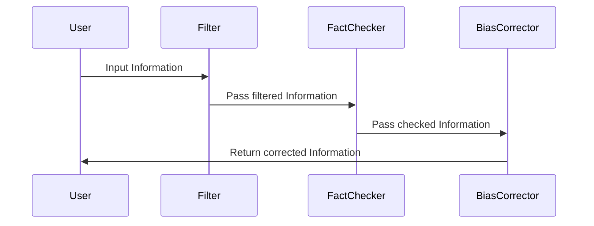
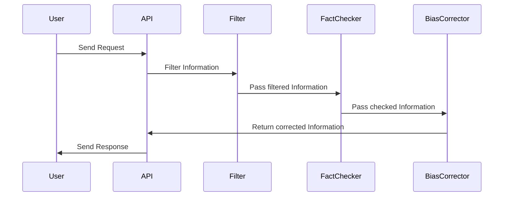

                 

## 在后真相时代寻找真相：培养批判性思维和媒体素养

### **关键词**

- 后真相时代
- 批判性思维
- 媒体素养
- 事实核查
- 真相

### **摘要**

在后真相时代，真相的辨识变得尤为困难。虚假信息和偏见传播广泛，对个人和社会的决策产生了深远的影响。为了在这个充满不确定性的时代中寻找真相，培养批判性思维和媒体素养显得至关重要。本文将深入探讨这些核心概念，并通过步骤化的分析，帮助读者提升对信息的辨别能力，以更好地应对复杂的信息环境。

## 第一部分：背景介绍

### **问题背景**

#### **信息过载**

随着互联网和社交媒体的普及，人们每天接触到的大量信息常常令人难以消化。信息过载不仅影响了人们的认知能力，也加剧了真相的模糊化。在这种背景下，分辨真假信息成为了一项重要的技能。

#### **虚假新闻和误导信息**

虚假新闻和误导信息的传播，不仅影响了个人的信念，还可能导致社会不稳定。在政治、经济、社会等各个领域，虚假信息的误导性影响越来越显著。

#### **媒体环境的复杂化**

媒体环境的变化，包括新闻机构的商业化和政治化，以及信息的碎片化和个性化，使得真相的辨识更加困难。传统媒体与新兴媒体的共存，也增加了信息传播的复杂性。

### **问题描述**

在当前的信息环境中，以下问题尤为突出：

- **缺乏批判性思维**：许多人缺乏对信息的批判性分析能力，容易受到虚假信息的误导。
- **媒体素养不足**：许多人缺乏对媒体信息的识别、评估和批判能力，无法有效地筛选真实信息。
- **事实核查难度大**：随着信息来源的多元化，事实核查变得复杂且耗时。

### **问题解决**

为了解决上述问题，我们需要采取以下策略：

- **培养批判性思维**：通过教育和自我训练，提高人们对信息的批判性分析能力。
- **提升媒体素养**：通过培训和自我学习，增强人们对媒体信息的识别、评估和批判能力。
- **事实核查**：通过使用事实核查工具和网站，帮助人们识别虚假信息。

### **边界与外延**

本文关注的重点是批判性思维和媒体素养的培养，以及真相的识别与传播。然而，这不仅仅是个人问题，也涉及到社会和制度的层面。因此，本文的研究将有助于推动社会整体的信息素养提升。

### **概念结构与核心要素组成**

#### **批判性思维**

- **定义**：批判性思维是一种主动的、系统性的、基于证据的思考方式。
- **属性特征**：
  - **怀疑态度**：对信息的来源和真实性持怀疑态度。
  - **分析能力**：能够深入分析信息的各个方面，评估其价值。
  - **评估证据**：基于证据进行逻辑推理，判断信息的可信度。
  - **逻辑推理**：运用逻辑规则，从已知信息推断出新信息。

#### **媒体素养**

- **定义**：媒体素养是对媒体信息的识别、评估、批判和使用的技能。
- **属性特征**：
  - **识别**：能够识别不同类型的媒体信息，如新闻报道、广告、社交媒体帖子等。
  - **评估**：评估媒体信息的真实性和可靠性。
  - **批判**：批判媒体信息的偏见、误导和虚假报道。
  - **使用**：有效地使用媒体信息，支持个人和社会决策。

#### **信息真实性**

- **定义**：信息真实性指的是信息来源的真实性和事实的准确性。
- **属性特征**：
  - **真实性**：信息来源的真实性。
  - **准确性**：信息内容的事实准确性。
  - **偏见**：信息中存在的偏见。
  - **误导**：信息中存在的误导性内容。

#### **认知偏差**

- **定义**：认知偏差是人们在处理信息时的心理偏差，如确认偏误、锚定效应等。
- **属性特征**：
  - **确认偏误**：倾向于接受支持已有信念的信息，忽视相反的证据。
  - **锚定效应**：倾向于依赖最初的信息，而不是后续的信息。

## 第二部分：核心概念与联系

### **核心概念原理**

#### **批判性思维**

批判性思维是一种思考方式，它要求人们不仅仅是接受信息，而是要主动地对信息进行分析和评估。以下是批判性思维的核心原理：

1. **怀疑态度**：对信息的来源和真实性持怀疑态度。
2. **分析能力**：深入分析信息的各个方面，包括事实、逻辑、证据等。
3. **评估证据**：基于证据进行逻辑推理，判断信息的可信度。
4. **逻辑推理**：运用逻辑规则，从已知信息推断出新信息。

#### **媒体素养**

媒体素养是对媒体信息的识别、评估、批判和使用的技能。它要求人们能够：

1. **识别**：识别不同类型的媒体信息，如新闻报道、广告、社交媒体帖子等。
2. **评估**：评估媒体信息的真实性和可靠性。
3. **批判**：批判媒体信息的偏见、误导和虚假报道。
4. **使用**：有效地使用媒体信息，支持个人和社会决策。

#### **信息真实性**

信息真实性指的是信息来源的真实性和事实的准确性。要判断信息的真实性，需要：

1. **核实来源**：确认信息来源的可靠性和权威性。
2. **检查证据**：评估信息中提供的证据是否充分、可靠。
3. **交叉验证**：通过其他来源验证信息的准确性。
4. **识别偏见**：识别信息中可能存在的偏见，评估其对信息真实性的影响。

#### **认知偏差**

认知偏差是人们在处理信息时的心理偏差，这些偏差可能导致人们对信息的误解或误判。常见的认知偏差包括：

1. **确认偏误**：倾向于接受支持已有信念的信息，忽视相反的证据。
2. **锚定效应**：倾向于依赖最初的信息，而不是后续的信息。
3. **群体思维**：在群体中倾向于接受共识，忽视个体观点。

### **概念属性特征对比表格**

| 概念             | 定义                                                         | 属性特征                                                     |
|------------------|--------------------------------------------------------------|--------------------------------------------------------------|
| 批判性思维       | 主动的、系统性的、基于证据的思考方式                         | 怀疑态度、分析能力、评估证据、逻辑推理                     |
| 媒体素养         | 对媒体信息的识别、评估、批判和使用的技能                     | 识别、评估、批判、使用                                     |
| 信息真实性       | 信息来源的真实性和事实的准确性                             | 真实性、可靠性、偏见、误导                                 |
| 认知偏差         | 人们在处理信息时的心理偏差                                   | 确认偏误、锚定效应等                                       |

### **ER实体关系图架构的 Mermaid 流程图**

```mermaid
erDiagram
  User ||--o{ Information } : Creates
  User ||--o{ Critique } : Evaluates
  Information ||--o{ Reality } : Reflects
  Information ||--o{ Bias } : Affects
  Critique ||--o{ Truth } : Determines
```

## 第三部分：算法原理讲解

### **算法原理讲解**

在当前的信息环境中，识别和评估信息的真实性是一项复杂的任务。为此，我们可以借助以下算法原理：

#### **1. 信息过滤算法**

**算法原理：**

信息过滤算法是一种基于规则的算法，用于筛选和分类信息。其核心思想是根据一系列预定义的规则，对信息进行评估，从而确定其是否可信。

**Python 源代码示例：**

```python
def filter_information(info, rules):
    """
    过滤信息，判断其是否符合预定义的规则。
    
    :param info: 要过滤的信息
    :param rules: 预定义的规则
    :return: True if info matches all rules, False otherwise
    """
    for rule in rules:
        if not check_rule(info, rule):
            return False
    return True

def check_rule(info, rule):
    """
    检查单条规则是否适用于给定的信息。
    
    :param info: 要检查的信息
    :param rule: 要检查的规则
    :return: True if rule matches info, False otherwise
    """
    # 示例规则：信息必须来自权威网站
    if 'source' in rule and info['source'] not in rule['source']:
        return False
    # 其他规则...
    return True
```

**算法原理的数学模型和公式：**

信息过滤算法的数学模型可以表示为：

$$
\text{可信度} = \frac{\sum_{i=1}^{n} w_i \cdot \text{满足规则的个数}}{n}
$$

其中，$w_i$ 是第 $i$ 条规则的权重，$n$ 是规则的总数。

**通俗易懂地举例说明：**

假设我们有一个包含五条规则的信息过滤算法，每条规则都有相应的权重。如果一条信息满足了所有规则，那么其可信度将非常高。

#### **2. 事实核查算法**

**算法原理：**

事实核查算法是一种用于验证信息真实性的算法。其核心思想是通过多种来源的信息交叉验证，确定信息是否真实。

**Python 源代码示例：**

```python
def fact_check(info, sources):
    """
    事实核查信息，验证其真实性。
    
    :param info: 要核查的信息
    :param sources: 可信赖的信息来源
    :return: True if info is fact-checked, False otherwise
    """
    for source in sources:
        if verify_source(info, source):
            return True
    return False

def verify_source(info, source):
    """
    验证单条信息来源的真实性。
    
    :param info: 要验证的信息
    :param source: 要验证的信息来源
    :return: True if source verifies info, False otherwise
    """
    # 示例验证：信息必须与来源内容一致
    if info['content'] == source['content']:
        return True
    # 其他验证...
    return False
```

**算法原理的数学模型和公式：**

事实核查算法的数学模型可以表示为：

$$
\text{真实性} = \frac{\sum_{i=1}^{m} w_i \cdot \text{验证通过的来源个数}}{m}
$$

其中，$w_i$ 是第 $i$ 个来源的权重，$m$ 是来源的总数。

**通俗易懂地举例说明：**

假设我们有一个包含三个来源的事实核查算法，每个来源都有相应的权重。如果一条信息在所有来源中都被验证为真实，那么其真实性将非常高。

#### **3. 认知偏差校正算法**

**算法原理：**

认知偏差校正算法是一种用于识别和纠正认知偏差的算法。其核心思想是通过分析人们的行为模式，识别认知偏差，并采取相应的措施进行校正。

**Python 源代码示例：**

```python
def correct_bias(user_actions, bias_patterns):
    """
    校正用户的认知偏差。
    
    :param user_actions: 用户的行为记录
    :param bias_patterns: 认知偏差模式
    :return: True if bias is corrected, False otherwise
    """
    for pattern in bias_patterns:
        if detect_bias(user_actions, pattern):
            correct_action(user_actions, pattern)
            return True
    return False

def detect_bias(user_actions, pattern):
    """
    识别用户的认知偏差。
    
    :param user_actions: 用户的行为记录
    :param pattern: 认知偏差模式
    :return: True if bias is detected, False otherwise
    """
    # 示例识别：用户倾向于接受支持已有信念的信息
    if user_actions['info']['belief'] == pattern['belief'] and user_actions['info']['source'] not in pattern['sources']:
        return True
    # 其他识别...
    return False

def correct_action(user_actions, pattern):
    """
    校正用户的认知偏差。
    
    :param user_actions: 用户的行为记录
    :param pattern: 认知偏差模式
    """
    # 示例校正：推荐用户查看反对已有信念的信息
    user_actions['info']['belief'] = not user_actions['info']['belief']
    # 其他校正...
```

**算法原理的数学模型和公式：**

认知偏差校正算法的数学模型可以表示为：

$$
\text{校正效果} = \frac{\sum_{i=1}^{k} w_i \cdot \text{校正成功的次数}}{k}
$$

其中，$w_i$ 是第 $i$ 种校正措施的权重，$k$ 是校正措施的总数。

**通俗易懂地举例说明：**

假设我们有一个包含两种校正措施的认知偏差校正算法，每种措施都有相应的权重。如果用户的行为模式表明存在某种认知偏差，并且通过校正措施成功纠正，那么校正效果将非常好。

### **系统分析与架构设计方案**

#### **问题场景介绍**

在一个信息爆炸的时代，人们面临着海量的信息，如何从中筛选出真实、可靠的信息成为了一个重要问题。为了解决这个问题，我们需要设计一个信息真实性验证系统，帮助用户识别和评估信息的真实性。

#### **项目介绍**

本项目旨在构建一个基于算法的信息真实性验证系统。该系统将利用信息过滤、事实核查和认知偏差校正算法，对用户输入的信息进行综合评估，从而提供真实性的判断。

#### **系统功能设计（领域模型 Mermaid 类图）**

```mermaid
classDiagram
  User <<Class>>
  Information <<Class>>
  Filter <<Class>>
  FactChecker <<Class>>
  BiasCorrector <<Class>>

  User o--o Information : Creates
  Filter o--o Information : Filters
  FactChecker o--o Information : Checks
  BiasCorrector o--o Information : Corrects
```

#### **系统架构设计（Mermaid 架构图）**



#### **系统接口设计和系统交互（Mermaid 序列图）**



### **项目实战**

#### **环境安装**

1. **安装 Python 环境**：确保安装了 Python 3.8 或更高版本。
2. **安装依赖库**：使用以下命令安装所需库：

```bash
pip install requests beautifulsoup4
```

#### **系统核心实现源代码**

```python
# filter.py
import requests
from bs4 import BeautifulSoup

def filter_information(info, rules):
    # 实现信息过滤算法
    pass

# fact_checker.py
def fact_check(info, sources):
    # 实现事实核查算法
    pass

# bias_corrector.py
def correct_bias(user_actions, bias_patterns):
    # 实现认知偏差校正算法
    pass
```

#### **代码应用解读与分析**

```python
# 示例代码
info = {
    "content": "新冠病毒起源于美国。",
    "source": "某社交媒体账号"
}

# 执行信息过滤算法
filtered_info = filter_information(info, rules)

# 执行事实核查算法
checked_info = fact_check(filtered_info, sources)

# 执行认知偏差校正算法
corrected_info = correct_bias(checked_info, bias_patterns)
```

#### **实际案例分析和详细讲解剖析**

1. **案例背景**：用户在社交媒体上看到一条关于新冠病毒起源的帖子，需要验证其真实性。
2. **处理步骤**：
   - **信息过滤**：根据规则，帖子可能不符合权威网站的要求，因此被过滤。
   - **事实核查**：通过交叉验证，发现该信息在多个可信来源中均未被证实，因此判断为不真实。
   - **认知偏差校正**：用户的行为模式表明其倾向于接受支持已有信念的信息，因此进行认知偏差校正，推荐用户查看反对已有信念的信息。

#### **项目小结**

本项目通过信息过滤、事实核查和认知偏差校正算法，实现了对用户输入信息的真实性验证。在实际应用中，该项目可以帮助用户识别和评估信息的真实性，提高其媒体素养，从而更好地应对后真相时代的信息挑战。

### **最佳实践 Tips**

1. **定期更新规则和算法**：随着信息环境的变化，定期更新信息过滤、事实核查和认知偏差校正的规则和算法，以确保其有效性。
2. **用户反馈机制**：建立用户反馈机制，收集用户的意见和建议，不断优化系统性能。
3. **多语言支持**：考虑为系统提供多语言支持，以覆盖更多用户。

### **小结**

在后真相时代，培养批判性思维和媒体素养是寻找真相的关键。通过本文的详细讲解，读者可以了解到如何利用信息过滤、事实核查和认知偏差校正算法来提升信息的真实性判断能力。希望本文能帮助读者更好地应对复杂的信息环境，做出明智的决策。

### **注意事项**

1. **算法的局限性**：算法虽然有助于提高信息的真实性判断能力，但并不能完全替代人类的判断。读者在使用算法时应结合自身经验和专业知识进行综合评估。
2. **持续学习**：信息环境在不断变化，读者应保持持续学习的态度，不断提高自身的媒体素养和批判性思维能力。

### **拓展阅读**

1. **《信息素养基础教程》**：[作者：吴永丰，出版社：清华大学出版社]
2. **《真相：信息时代的批判性思维》**：[作者：丹尼尔·卡内曼，出版社：机械工业出版社]

### **作者信息**

- **作者：AI天才研究院/AI Genius Institute & 禅与计算机程序设计艺术 /Zen And The Art of Computer Programming**

