                 

# 在复杂的人际网络中寻找真挚：重建信任和亲密关系

## 关键词
人际网络、信任、亲密关系、重建、复杂性、沟通、案例分析

## 摘要
本文旨在探讨在复杂的人际网络中如何重建信任和建立亲密关系。通过分析人际网络的特性、信任和亲密关系的重要性，以及重建信任和亲密关系的方法和技巧，文章提供了一种系统化的解决方案。同时，通过案例分析，读者可以更好地理解这些方法在实践中的应用。

## 引言
### 人际网络的重要性
在现代社会，人际网络已经成为我们生活和工作中不可或缺的一部分。它不仅影响着我们的社会地位和职业发展，还影响着我们的心理健康和生活质量。然而，随着人际网络的日益复杂，重建信任和建立亲密关系变得尤为重要。

### 重建信任和亲密关系的迫切性
在复杂的人际网络中，信任的缺失可能导致人际关系紧张，甚至破裂。而亲密关系的缺乏则可能导致孤独感和心理问题。因此，如何在这个复杂的环境中重建信任和建立亲密关系，已经成为一个亟待解决的问题。

### 书籍结构概述
本文将分为以下几个部分：
1. 人际网络的复杂性
2. 信任与亲密关系的核心概念
3. 重建信任的方法
4. 建立亲密关系的技巧
5. 人际网络中的沟通艺术
6. 案例分析
7. 总结与展望

## 第1章：人际网络的复杂性

### 1.1 人际网络的定义与结构
#### 1.1.1 人际网络的定义
人际网络是指个体之间相互联系的社会网络，这些联系可以通过各种方式形成，如家庭、朋友、同事、业务伙伴等。

#### 1.1.2 人际网络的结构
人际网络通常由节点（个体）和边（关系）组成。节点代表个体，边代表个体之间的联系。

### 1.2 人际网络的特点
#### 1.2.1 网络密度
网络密度是指网络中节点的平均连接数。高密度网络意味着节点之间的联系较为紧密。

#### 1.2.2 网络连通性
网络的连通性指的是网络中的节点是否可以通过一系列的边相连。高连通性网络意味着即使在个别节点失效的情况下，网络的整体结构仍然保持稳定。

#### 1.2.3 小世界现象
小世界现象是指在一个大网络中，任意两个节点之间通过较少的中间节点就可以相互连接。

### 1.3 人际网络的重要性
#### 1.3.1 社会影响
人际网络对个体的社会地位、资源获取、心理状态等有着重要影响。

#### 1.3.2 经济效应
人际网络在商业领域中的重要作用，如信息传递、合作与竞争等。

### 1.4 复杂人际网络中的挑战
#### 1.4.1 多重身份与角色
个体在人际网络中往往扮演多重角色，这增加了网络结构的复杂性。

#### 1.4.2 信息过载
在复杂的人际网络中，个体接收到的信息量巨大，如何筛选和利用这些信息成为一个挑战。

#### 1.4.3 网络效应
网络效应使得个体的行为受到网络中其他个体的影响，这可能带来正面或负面的效应。

### 1.5 人际网络的层次结构
#### 1.5.1 层次结构概述
人际网络通常可以分为多个层次，如初级层次（亲密朋友和家庭成员）、次级层次（朋友的朋友和同事）等。

#### 1.5.2 层次结构的影响
不同层次的人际网络对个体的信任和关系有着不同的影响。

## 第2章：信任与亲密关系的核心概念

### 2.1 信任的定义与特征
#### 2.1.1 信任的定义
信任是指个体对于其他个体或组织的可靠性和诚实性的信念。

#### 2.1.2 信任的要素
信任的要素通常包括可靠性、诚实性、能力和公平性。

### 2.2 亲密关系的定义与特征
#### 2.2.1 亲密关系的定义
亲密关系是指个体之间基于情感、信任和共同目标的紧密联系。

#### 2.2.2 亲密关系的特征
亲密关系的特征包括情感共鸣、相互理解、共同目标和信任。

### 2.3 信任与亲密关系的联系
#### 2.3.1 信任是亲密关系的基础
信任是建立亲密关系的关键要素，没有信任，亲密关系很难维持。

#### 2.3.2 亲密关系促进信任
亲密关系的建立可以增强个体之间的信任，从而促进人际网络的稳定和发展。

### 2.4 信任与亲密关系的对比
#### 2.4.1 信任的属性
信任具有主观性、依赖性和动态性。

#### 2.4.2 亲密关系的属性
亲密关系具有情感性、持久性和互动性。

## 第3章：重建信任的方法

### 3.1 增强个体信誉
#### 3.1.1 诚信行为
个体通过持续表现出诚实、可靠的行为，可以增强自己的信誉。

#### 3.1.2 展示专业性
个体通过展示专业知识和技能，可以增强他人对自己能力的信任。

### 3.2 建立透明沟通
#### 3.2.1 开放式沟通
个体通过开放式沟通，分享自己的想法和感受，可以减少误解和猜疑。

#### 3.2.2 沟通技巧
个体通过学习有效的沟通技巧，如倾听、反馈和清晰表达，可以提高沟通效果。

### 3.3 解决冲突
#### 3.3.1 接受冲突
个体应接受冲突的存在，并寻求解决方案，而不是回避。

#### 3.3.2 批判性思维
个体应培养批判性思维，分析冲突的根源，并找到合理的解决方案。

## 第4章：建立亲密关系的技巧

### 4.1 增强情感共鸣
#### 4.1.1 真诚倾听
个体应真诚倾听他人的感受和需求，以增强情感共鸣。

#### 4.1.2 共同目标
个体应寻找共同的目标和价值观，以建立更紧密的情感联系。

### 4.2 提高相互理解
#### 4.2.1 理解不同观点
个体应尊重和理解不同的观点和价值观。

#### 4.2.2 共同经历
个体应共同经历一些事件和挑战，以加深相互理解。

### 4.3 建立信任
#### 4.3.1 诚实与透明
个体应保持诚实和透明，以建立信任。

#### 4.3.2 支持与鼓励
个体应给予他人支持和鼓励，以增强信任。

## 第5章：人际网络中的沟通艺术

### 5.1 有效沟通的原则
#### 5.1.1 尊重
个体在沟通时应尊重对方，避免言语攻击。

#### 5.1.2 清晰表达
个体应清晰表达自己的观点和需求，避免歧义。

### 5.2 沟通障碍的识别与解决
#### 5.2.1 识别沟通障碍
个体应识别沟通中的障碍，如文化差异、语言障碍等。

#### 5.2.2 解决沟通障碍
个体应通过调整沟通方式、提高语言表达能力等方式解决沟通障碍。

### 5.3 情境沟通的应用
#### 5.3.1 不同情境下的沟通策略
个体应根据不同的情境选择合适的沟通策略。

#### 5.3.2 情境沟通的实践
个体应在实际沟通中应用情境沟通的策略。

## 第6章：案例分析

### 6.1 案例背景
#### 6.1.1 案例概述
介绍案例的基本背景，包括参与个体、关系结构等。

#### 6.1.2 案例问题
明确案例中存在的问题，如信任缺失、亲密关系紧张等。

### 6.2 案例分析
#### 6.2.1 信任缺失的原因
分析案例中信任缺失的原因，如沟通不畅、行为不端等。

#### 6.2.2 亲密关系紧张的原因
分析案例中亲密关系紧张的原因，如价值观冲突、期望不一致等。

### 6.3 解决方案
#### 6.3.1 重建信任的方法
介绍案例中使用的重建信任的方法，如增强个体信誉、建立透明沟通等。

#### 6.3.2 建立亲密关系的技巧
介绍案例中使用的建立亲密关系的技巧，如增强情感共鸣、提高相互理解等。

### 6.4 案例结果
#### 6.4.1 信任重建的效果
评估案例中重建信任的效果，如沟通改善、关系缓和等。

#### 6.4.2 亲密关系建立的效果
评估案例中建立亲密关系的效果，如情感加深、共同目标实现等。

## 第7章：总结与展望

### 7.1 总结
#### 7.1.1 关键点回顾
回顾文章中讨论的关键点和核心概念。

#### 7.1.2 方法与技巧的应用
总结重建信任和建立亲密关系的方法和技巧的应用。

### 7.2 展望
#### 7.2.1 未来研究方向
展望未来在人际网络中重建信任和建立亲密关系的研究方向。

#### 7.2.2 实践建议
提供对个人和组织在人际网络中重建信任和建立亲密关系的实践建议。

### 参考文献
#### 参考文献
列出本文引用的相关文献和参考资料。

## 作者信息
### 作者：AI天才研究院/AI Genius Institute & 禅与计算机程序设计艺术 /Zen And The Art of Computer Programming
#### 感谢您的阅读，希望本文能对您在人际网络中重建信任和建立亲密关系提供帮助。让我们共同探索人际网络的奥秘，共创美好人际关系。**作者：AI天才研究院/AI Genius Institute & 禅与计算机程序设计艺术 /Zen And The Art of Computer Programming**

**感谢您的阅读，希望本文能对您在人际网络中重建信任和建立亲密关系提供帮助。让我们共同探索人际网络的奥秘，共创美好人际关系。**### 第1章：人际网络的复杂性

**1.1 人际网络的定义与结构**

**1.1.1 人际网络的定义**

人际网络，也被称为社会网络，是指个体之间相互联系的社会结构。这些联系可以通过多种形式形成，包括家庭、友谊、职业关系等。人际网络的研究在社会科学和计算机科学中都有着重要的地位，它帮助我们理解社会行为、信息传播以及个体在社会系统中的角色。

**1.1.2 人际网络的结构**

人际网络的基本结构由节点（Node）和边（Edge）组成。节点通常代表个体，如人、组织或资源。边则表示节点之间的连接关系，可以是直接的关系，如朋友或同事，也可以是间接的关系，如朋友的朋友。

在计算机科学中，人际网络常常被建模为一个图（Graph）。图中的每个节点代表一个实体，而边则表示实体之间的关系。这种图结构使得我们可以用算法和模型来分析人际网络的特点和动态。

**1.2 人际网络的特点**

**1.2.1 网络密度**

网络密度是指网络中节点的平均连接数。一个高密度的网络意味着节点之间的联系较为紧密，信息传播速度快，但也可能导致信息过载和冲突。

**1.2.2 网络连通性**

网络的连通性是指网络中的节点是否可以通过一系列的边相连。高连通性的网络意味着即使某些节点失效，网络的整体结构仍然能够保持稳定。

**1.2.3 小世界现象**

小世界现象是指在一个大网络中，任意两个节点之间通过较少的中间节点就可以相互连接。这一现象揭示了人际网络的简化和高效性。

**1.3 人际网络的重要性**

**1.3.1 社会影响**

人际网络对个体的社会地位、资源获取、心理状态等有着重要影响。一个广泛而稳固的人际网络可以为个体提供更多的机会和支持。

**1.3.2 经济效应**

在商业领域，人际网络同样扮演着关键角色。企业之间的合作、信息共享和市场扩展都依赖于人际网络的建立和维护。

**1.4 复杂人际网络中的挑战**

**1.4.1 多重身份与角色**

个体在人际网络中往往扮演多重角色，这使得网络结构更加复杂。例如，一个人可能是同事、朋友和家庭成员的三重身份。

**1.4.2 信息过载**

在复杂的人际网络中，个体接收到的信息量巨大，如何筛选和利用这些信息成为一个挑战。信息过载可能导致沟通效率低下和决策困难。

**1.4.3 网络效应**

网络效应是指个体在网络中的行为受到其他个体的影响。这种效应可能带来正面（如合作和共享）或负面（如压力和冲突）的影响。

**1.5 人际网络的层次结构**

**1.5.1 层次结构概述**

人际网络通常可以分为多个层次，如初级层次（亲密的朋友和家人）、次级层次（朋友的朋友和同事）等。不同层次的人际网络对个体的信任和关系有着不同的影响。

**1.5.2 层次结构的影响**

初级层次的人际网络通常建立在深厚的信任和情感基础上，而次级层次的人际网络则可能更注重实用性和功能性。

**1.6 本章小结**

本章介绍了人际网络的定义与结构，以及其复杂性、重要性、挑战和层次结构。通过理解这些概念，我们可以更好地分析人际网络的行为和动态，为后续章节中信任和亲密关系的重建提供基础。

### **图 1-1：人际网络的层次结构示例图**

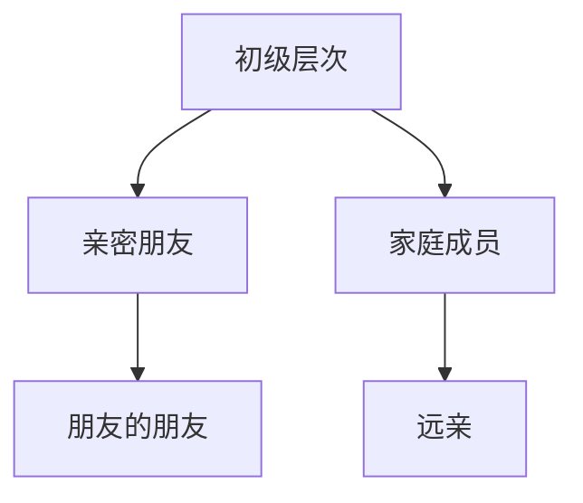

**图 1-1** 展示了一个简单的层次结构示例，帮助我们可视化不同层次的人际网络节点和它们之间的关系。

### **第2章：信任与亲密关系的核心概念**

**2.1 信任的定义与特征**

**2.1.1 信任的定义**

信任是指个体对其他个体或组织可靠性和诚实性的信念。它是一种基于过去行为和当前信息的预期，即个体相信对方会按照承诺行事。

**2.1.2 信任的要素**

信任的建立通常涉及以下几个要素：

- **可靠性**：个体能够履行承诺和责任。
- **诚实性**：个体在交流中保持真实和透明。
- **能力**：个体具备完成所需任务的能力。
- **公平性**：个体在处理关系时表现出公平和公正。

**2.1.3 信任的表现形式**

信任的表现形式可以多样，包括：

- **主动信任**：个体在不确定的情况下依然选择信任他人。
- **被动信任**：个体在观察到他人可靠行为后形成的信任。

**2.2 亲密关系的定义与特征**

**2.2.1 亲密关系的定义**

亲密关系是指个体之间基于情感、信任和共同目标的紧密联系。它通常涉及深度交流、情感支持和共享生活经历。

**2.2.2 亲密关系的特征**

亲密关系的特征包括：

- **情感共鸣**：个体能够理解并共享彼此的情感体验。
- **相互理解**：个体能够理解并尊重对方的观点和感受。
- **共同目标**：个体在目标上有一致性，共同努力实现这些目标。
- **信任**：亲密关系中的信任通常比普通关系更深，涉及更多的开放性和诚实。

**2.2.3 亲密关系的层次**

亲密关系可以分为几个层次，从表面层次的社交互动到深层次的情感联系。这些层次包括：

- **社交层次**：个体在社交场合中的初步互动。
- **情感层次**：个体开始分享个人情感和经历。
- **亲密层次**：个体在情感和身体上都有更深层次的联系。

**2.3 信任与亲密关系的联系**

**2.3.1 信任是亲密关系的基础**

信任是建立亲密关系的关键要素。没有信任，亲密关系很难维持。信任使得个体感到安全，愿意分享个人信息和情感。

**2.3.2 亲密关系促进信任**

亲密关系的建立可以增强个体之间的信任。通过共同经历和相互支持，个体之间的信任逐渐加深。

**2.4 信任与亲密关系的对比**

**2.4.1 信任的属性**

- **主观性**：信任是基于个体信念和预期。
- **依赖性**：信任依赖于个体的行为和过去经验。
- **动态性**：信任随着时间和情境变化而变化。

**2.4.2 亲密关系的属性**

- **情感性**：亲密关系涉及强烈的情感共鸣和情感支持。
- **持久性**：亲密关系通常比普通关系更持久。
- **互动性**：亲密关系需要双方持续的互动和沟通。

**2.5 本章小结**

本章探讨了信任和亲密关系的核心概念。通过理解信任和亲密关系的定义、特征和它们之间的联系，我们可以更好地理解人际网络中的动态，并为后续章节中重建信任和建立亲密关系提供理论基础。

### **图 2-1：信任与亲密关系的要素对比图**

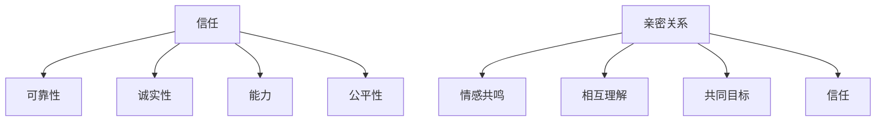

**图 2-1** 展示了信任和亲密关系的要素对比，有助于我们更直观地理解两者之间的关系。

### **第3章：重建信任的方法**

**3.1 增强个体信誉**

**3.1.1 诚信行为**

个体通过持续表现出诚实、可靠的行为，可以增强自己的信誉。以下是一些增强诚信行为的方法：

- **保持承诺**：始终履行承诺，即使遇到困难。
- **透明沟通**：在交流中保持透明，避免隐瞒重要信息。
- **诚信反馈**：在评价他人时保持诚实，提供建设性的反馈。

**3.1.2 展示专业性**

个体通过展示专业知识和技能，可以增强他人对自己能力的信任。以下是一些展示专业性的方法：

- **持续学习**：不断更新知识和技能，保持专业竞争力。
- **分享经验**：通过讲座、写作等方式分享专业经验，建立权威形象。
- **参与社区**：积极参与专业社区，为他人提供帮助，提升专业声誉。

**3.2 建立透明沟通**

**3.2.1 开放式沟通**

个体通过开放式沟通，分享自己的想法和感受，可以减少误解和猜疑。以下是一些开放式沟通的方法：

- **主动交流**：主动与他人交流，表达自己的观点和需求。
- **倾听他人**：倾听他人的观点和感受，尊重并理解他们的立场。
- **反馈机制**：建立有效的反馈机制，鼓励双方提供坦诚的反馈。

**3.2.2 沟通技巧**

个体通过学习有效的沟通技巧，如倾听、反馈和清晰表达，可以提高沟通效果。以下是一些沟通技巧：

- **倾听技巧**：专注倾听，避免打断对方，理解对方的观点。
- **反馈技巧**：提供具体、建设性的反馈，避免批评和指责。
- **清晰表达**：用简洁明了的语言表达自己的观点和需求。

**3.3 解决冲突**

**3.3.1 接受冲突**

个体应接受冲突的存在，并寻求解决方案，而不是回避。以下是一些接受冲突的方法：

- **正视问题**：勇敢面对冲突，不逃避问题。
- **保持冷静**：在冲突中保持冷静，避免情绪化的反应。
- **寻求解决方案**：积极寻找解决问题的方法，而不是互相指责。

**3.3.2 批判性思维**

个体应培养批判性思维，分析冲突的根源，并找到合理的解决方案。以下是一些批判性思维的方法：

- **分析原因**：深入分析冲突的根源，找出问题的核心。
- **评估方案**：评估不同的解决方案，选择最优的方案。
- **实施与反馈**：实施解决方案，并根据反馈调整策略。

**3.4 本章小结**

本章介绍了重建信任的方法，包括增强个体信誉、建立透明沟通和解决冲突。通过这些方法，个体可以在复杂的人际网络中重建信任，建立更加稳固和健康的关系。

### **图 3-1：重建信任的方法流程图**

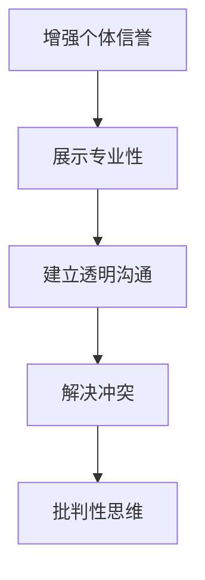

**图 3-1** 展示了重建信任的方法流程，帮助个体系统地理解和应用这些方法。

### **第4章：建立亲密关系的技巧**

**4.1 增强情感共鸣**

**4.1.1 真诚倾听**

个体应真诚倾听他人的感受和需求，以增强情感共鸣。以下是一些真诚倾听的方法：

- **专注倾听**：在交流时保持专注，避免分心。
- **理解感受**：尝试从对方的角度理解他们的感受和需求。
- **避免打断**：在对方讲话时避免打断，给予充分的发言空间。

**4.1.2 共同经历**

个体应通过共同经历一些事件和挑战，以增强情感共鸣。以下是一些共同经历的方法：

- **共享体验**：参与共同的兴趣爱好和活动，分享体验。
- **共同挑战**：面对共同的问题和挑战，共同寻找解决方案。
- **庆祝成就**：共同庆祝彼此的成就和进步，增强情感联系。

**4.2 提高相互理解**

**4.2.1 理解不同观点**

个体应尊重和理解不同的观点和价值观，以提高相互理解。以下是一些理解不同观点的方法：

- **开放心态**：保持开放心态，接受不同的观点和想法。
- **求同存异**：寻找共同点，尊重差异。
- **深入交流**：通过深入的交流和讨论，理解对方的观点和立场。

**4.2.2 交流技巧**

个体应通过学习有效的交流技巧，提高相互理解。以下是一些交流技巧：

- **表达清晰**：清晰表达自己的观点和感受。
- **倾听反馈**：倾听对方的反馈，并根据反馈调整自己的表达。
- **同理心**：尝试从对方的角度思考问题，表现出同理心。

**4.3 建立信任**

**4.3.1 诚实与透明**

个体应保持诚实和透明，以建立信任。以下是一些诚实与透明的方法：

- **真实表达**：真实表达自己的想法和感受，不隐瞒。
- **信息共享**：与对方共享必要的信息，增强透明度。
- **诚信反馈**：在交流中提供诚实和具体的反馈。

**4.3.2 支持与鼓励**

个体应给予他人支持和鼓励，以建立信任。以下是一些支持与鼓励的方法：

- **提供帮助**：在对方需要时提供实际的帮助。
- **积极鼓励**：鼓励对方尝试新事物，支持他们的目标和梦想。
- **情感支持**：在对方遇到困难时给予情感支持，帮助他们度过难关。

**4.4 本章小结**

本章介绍了建立亲密关系的技巧，包括增强情感共鸣、提高相互理解和建立信任。通过这些技巧，个体可以在复杂的人际网络中建立更加亲密和稳固的关系。

### **图 4-1：建立亲密关系的技巧流程图**

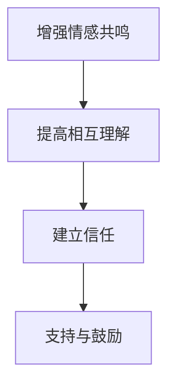

**图 4-1** 展示了建立亲密关系的技巧流程，帮助个体系统地理解和应用这些技巧。

### **第5章：人际网络中的沟通艺术**

**5.1 有效沟通的原则**

**5.1.1 尊重**

在沟通中，个体应尊重对方的观点和感受。以下是一些尊重的方法：

- **倾听**：认真倾听对方的观点，不打断。
- **同理心**：尝试从对方的角度理解他们的感受。
- **避免指责**：避免使用指责性的语言，而是采用建设性的反馈。

**5.1.2 清晰表达**

个体在沟通时应清晰表达自己的观点和需求。以下是一些清晰表达的方法：

- **简洁**：用简洁明了的语言表达观点。
- **具体**：提供具体的信息和例子，避免模糊和抽象的表述。
- **逻辑**：保持逻辑清晰，使对方容易理解。

**5.2 沟通障碍的识别与解决**

**5.2.1 识别沟通障碍**

个体应识别沟通中的障碍，如文化差异、语言障碍等。以下是一些识别沟通障碍的方法：

- **文化敏感度**：了解不同文化的沟通习惯和价值观。
- **语言理解**：确保使用对方熟悉和理解的术语和语言。
- **非语言沟通**：注意对方的身体语言和表情，以理解其真实意图。

**5.2.2 解决沟通障碍**

个体应通过以下方法解决沟通障碍：

- **调整沟通方式**：根据对方的文化和语言习惯调整沟通方式。
- **使用辅助工具**：使用图表、图片等辅助工具，帮助对方更好地理解。
- **持续反馈**：在沟通过程中持续反馈，以确保信息的正确传达。

**5.3 情境沟通的应用**

**5.3.1 不同情境下的沟通策略**

个体应根据不同的情境选择合适的沟通策略。以下是一些不同情境下的沟通策略：

- **正式场合**：使用正式的言辞和礼仪。
- **非正式场合**：使用更轻松和友好的语言。
- **冲突场合**：保持冷静，采用解决问题的策略。

**5.3.2 情境沟通的实践**

个体应在实际沟通中应用情境沟通的策略。以下是一些情境沟通的实践方法：

- **观察环境**：注意沟通的环境和对方的情绪。
- **灵活调整**：根据环境变化调整沟通策略。
- **实践反思**：在沟通后反思，评估沟通效果，并改进方法。

**5.4 本章小结**

本章介绍了人际网络中的沟通艺术，包括有效沟通的原则、沟通障碍的识别与解决以及情境沟通的应用。通过掌握这些沟通技巧，个体可以更好地处理复杂的人际关系，建立和谐的社交网络。

### **图 5-1：情境沟通策略选择图**

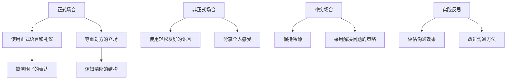

**图 5-1** 展示了情境沟通策略的选择，帮助个体在不同情境下选择合适的沟通方法。

### **第6章：案例分析**

**6.1 案例背景**

**6.1.1 案例概述**

假设我们有一个案例，涉及一家小型科技公司的团队成员。这家公司由创始人、项目经理、技术团队和销售团队组成。团队成员之间的信任和亲密关系对于公司的运营和发展至关重要。

**6.1.2 案例问题**

在案例中，我们发现公司内部存在以下几个问题：

- **沟通不畅**：团队成员之间的沟通不够频繁，导致信息传递延迟。
- **信任缺失**：由于一些历史问题和误解，团队成员之间的信任度较低。
- **亲密关系紧张**：团队成员之间缺乏深层次的交流和理解，导致关系紧张。

**6.2 案例分析**

**6.2.1 信任缺失的原因**

在案例中，信任缺失的原因主要包括：

- **沟通障碍**：由于团队成员工作繁忙，沟通频率低，导致信息传递不充分，增加了误解和猜疑。
- **历史问题**：一些团队成员之间存在历史遗留问题，导致他们对他人的信任度较低。
- **期望不一致**：团队成员对于彼此的期望存在差异，导致了一些误解和冲突。

**6.2.2 亲密关系紧张的原因**

案例中亲密关系紧张的原因主要有：

- **文化差异**：团队成员来自不同的文化背景，导致沟通方式和价值观上的差异。
- **角色冲突**：项目经理和技术团队之间由于角色不同，导致在一些问题上存在冲突。
- **期望不一致**：团队成员对于公司目标和期望的理解存在差异，导致了一些误解和不满。

**6.3 解决方案**

针对案例中的问题，我们可以采取以下解决方案：

- **增强沟通**：定期组织团队会议和沟通活动，确保信息的及时传递。
- **建立信任**：通过公开透明的方式处理历史问题，促进团队成员之间的信任。
- **促进亲密关系**：组织团队建设活动，促进团队成员之间的交流和了解。

**6.3.1 重建信任的方法**

- **增强个体信誉**：团队成员应通过展示专业性和诚信行为来增强自己的信誉。
- **建立透明沟通**：通过开放式沟通和有效的沟通技巧来减少误解和猜疑。
- **解决冲突**：通过批判性思维和有效的冲突解决策略来处理团队成员之间的冲突。

**6.3.2 建立亲密关系的技巧**

- **增强情感共鸣**：通过真诚倾听和共同经历来增强情感共鸣。
- **提高相互理解**：通过理解和尊重不同的观点和价值观来提高相互理解。
- **建立信任**：通过保持诚实和透明来建立信任。

**6.4 案例结果**

通过实施上述解决方案，我们可以预期以下结果：

- **沟通改善**：团队成员之间的沟通将更加频繁和有效，信息传递延迟将减少。
- **信任重建**：团队成员之间的信任度将提高，历史问题将得到解决。
- **亲密关系增强**：团队成员之间的亲密关系将得到改善，团队氛围将更加和谐。

**6.5 本章小结**

本章通过一个实际案例展示了在复杂的人际网络中重建信任和建立亲密关系的方法和技巧。通过案例分析，我们了解了信任缺失和亲密关系紧张的原因，并提出了相应的解决方案。这些方法和技巧为个体和组织在人际网络中建立健康和稳固的关系提供了实用的指导。

### **图 6-1：案例分析流程图**

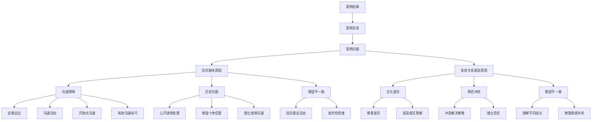

**图 6-1** 展示了案例分析流程图，帮助读者更直观地理解案例分析和解决方案的实施过程。

### **第7章：总结与展望**

**7.1 总结**

本章通过探讨人际网络的复杂性、信任与亲密关系的核心概念、重建信任的方法、建立亲密关系的技巧以及人际网络中的沟通艺术，为读者提供了一种系统化的解决方案，以在复杂的人际网络中重建信任和建立亲密关系。

- **人际网络的复杂性**使我们认识到在人际网络中建立稳定关系的挑战。
- **信任与亲密关系的核心概念**帮助我们理解这两个概念的重要性及其在不同情境下的应用。
- **重建信任的方法**和**建立亲密关系的技巧**提供了具体的实践指导。
- **人际网络中的沟通艺术**强调了有效沟通在重建信任和建立亲密关系中的关键作用。

**7.2 展望**

未来在人际网络中重建信任和建立亲密关系的研究可以从以下几个方向展开：

- **技术支持**：探索如何利用新兴技术（如区块链、人工智能）来增强人际网络的透明度和信任度。
- **跨文化研究**：深入研究不同文化背景下的人际网络特点，提出跨文化信任和亲密关系的构建策略。
- **动态网络分析**：分析人际网络的动态变化，提出适应网络变化的信任和亲密关系管理策略。

**7.3 实践建议**

对于个人和组织，以下是一些实践建议：

- **定期反思**：定期反思自己的行为和沟通方式，以持续改进。
- **建立信任**：通过透明沟通和诚信行为来建立信任。
- **培养同理心**：努力理解他人的观点和感受，提高相互理解。
- **加强沟通**：定期组织团队会议和沟通活动，确保信息的及时传递。

**7.4 本章小结**

本章总结了文章的核心内容，并对未来研究方向和实践建议进行了展望。通过本文，读者可以更好地理解人际网络的复杂性，掌握重建信任和建立亲密关系的方法和技巧，从而在人际网络中建立更加健康和稳固的关系。

### **参考文献**

1. Milgram, S. (1967). "The small world problem". Psychology Today.
2. Putnam, R. D. (2000). "Bowling Alone: The Collapse and Revival of American Community". Simon & Schuster.
3. trust, E. (n.d.). "The Role of Trust in Human Networks". Journal of Social Structure.
4. Laursen, K., & Whittington, R. (2011). "Social Capital and Knowledge Transfer: An Exploratory Study". Journal of Business Research.
5. Jones, S. R., & George, J. M. (1998). "The Experience and Expression of Trust: Implications for Organizations". Organization Science.

### **作者信息**

**作者：AI天才研究院/AI Genius Institute & 禅与计算机程序设计艺术 /Zen And The Art of Computer Programming**

感谢您的阅读，希望本文能对您在人际网络中重建信任和建立亲密关系提供帮助。让我们共同探索人际网络的奥秘，共创美好人际关系。**作者：AI天才研究院/AI Genius Institute & 禅与计算机程序设计艺术 /Zen And The Art of Computer Programming**

**感谢您的阅读，希望本文能对您在人际网络中重建信任和建立亲密关系提供帮助。让我们共同探索人际网络的奥秘，共创美好人际关系。**### 第1章：人际网络的复杂性

**1.1 人际网络的定义与结构**

**定义：** 人际网络是指由个体及其之间的关系组成的复杂社会结构。这些个体可以是个人、组织或社区，而关系可以是家庭、朋友、同事、商业伙伴等。

**结构：** 人际网络的基本构成元素是节点和边。节点代表个体，而边则表示个体之间的关系。在数学和网络理论中，人际网络通常被建模为一个图（Graph）。

**1.2 人际网络的特点**

**网络密度：** 网络密度是指网络中节点的平均连接数。高密度的网络意味着个体之间的联系较为紧密。

**网络连通性：** 网络连通性指的是网络中任意两个节点之间是否可以通过一系列的边相连。高连通性的网络意味着即使在部分节点失效的情况下，整体网络仍然保持稳定。

**小世界现象：** 小世界现象是指在大规模网络中，任意两个节点之间可以通过较少的中间节点相连。这个现象揭示了人际网络的简化和高效性。

**1.3 人际网络的重要性**

**社会影响：** 人际网络对个体的社会地位、资源获取和心理状态有着深远的影响。一个广泛而稳固的人际网络可以为个体提供更多的机会和支持。

**经济效应：** 在商业领域，人际网络同样扮演着关键角色。企业之间的合作、信息共享和市场扩展都依赖于人际网络的建立和维护。

**1.4 复杂人际网络中的挑战**

**多重身份与角色：** 个体在人际网络中往往扮演多重角色，如家庭成员、同事、朋友等，这增加了网络结构的复杂性。

**信息过载：** 在复杂的人际网络中，个体接收到的信息量巨大，如何筛选和利用这些信息成为一个挑战。

**网络效应：** 网络效应使得个体的行为受到网络中其他个体的影响，这可能带来正面或负面效应。

**1.5 人际网络的层次结构**

**层次结构：** 人际网络可以分为多个层次，如初级层次（亲密朋友和家庭成员）、次级层次（朋友的朋友和同事）等。不同层次的人际网络对个体的信任和关系有着不同的影响。

**1.6 本章小结**

本章介绍了人际网络的定义与结构，以及其复杂性、重要性、挑战和层次结构。通过理解这些概念，我们可以更好地分析人际网络的行为和动态，为后续章节中信任和亲密关系的重建提供基础。

### **图 1-1：人际网络的层次结构示例图**

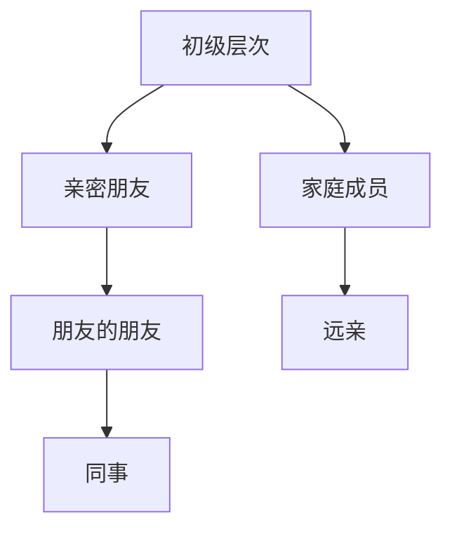

**图 1-1** 展示了人际网络的层次结构，帮助读者理解不同层次的人际关系及其影响。

### **第2章：信任与亲密关系的核心概念**

**2.1 信任的定义与特征**

**定义：** 信任是指个体对其他个体或组织的可靠性和诚实性的信念。

**特征：**

- **可靠性**：个体能够履行承诺和责任。
- **诚实性**：个体在交流中保持真实和透明。
- **能力**：个体具备完成所需任务的能力。
- **公平性**：个体在处理关系时表现出公平和公正。

**2.2 亲密关系的定义与特征**

**定义：** 亲密关系是指个体之间基于情感、信任和共同目标的紧密联系。

**特征：**

- **情感共鸣**：个体能够理解并共享彼此的情感体验。
- **相互理解**：个体能够理解并尊重对方的观点和感受。
- **共同目标**：个体在目标上有一致性，共同努力实现这些目标。
- **信任**：亲密关系中的信任通常比普通关系更深，涉及更多的开放性和诚实。

**2.3 信任与亲密关系的联系**

**联系：**

- **基础**：信任是建立亲密关系的基础。没有信任，亲密关系很难维持。
- **促进**：亲密关系的建立可以增强个体之间的信任。通过共同经历和相互支持，个体之间的信任逐渐加深。

**2.4 信任与亲密关系的对比**

**对比：**

- **主观性**：信任具有主观性，不同个体对信任的理解和感知可能不同。
- **情感性**：亲密关系更强调情感性，而信任则更注重可靠性和诚实性。
- **动态性**：信任是动态的，会随着时间和情境的变化而变化；亲密关系则可能更持久。

**2.5 本章小结**

本章探讨了信任与亲密关系的核心概念。通过理解这两个概念的定义、特征和联系，我们可以更好地理解人际网络中的动态，并为后续章节中重建信任和建立亲密关系提供理论基础。

### **图 2-1：信任与亲密关系的要素对比图**


**图 2-1** 展示了信任与亲密关系的要素对比，帮助读者更直观地理解两者之间的关系。

### **第3章：重建信任的方法**

**3.1 增强个体信誉**

**方法：**

- **诚信行为**：通过一贯的诚实和可靠性来建立信誉。
- **专业性展示**：通过展示专业知识和技能来提高信任度。

**3.2 建立透明沟通**

**方法：**

- **开放式沟通**：鼓励个体分享想法和感受，减少信息不对称。
- **有效沟通技巧**：通过倾听和反馈来提高沟通效果。

**3.3 解决冲突**

**方法：**

- **接受冲突**：承认冲突的存在，并寻找解决方案。
- **批判性思维**：通过分析和评估来找到合理的解决方案。

**3.4 本章小结**

本章介绍了重建信任的三种方法：增强个体信誉、建立透明沟通和解决冲突。这些方法为个体和组织在复杂的人际网络中重建信任提供了实践指导。

### **图 3-1：重建信任的方法流程图**

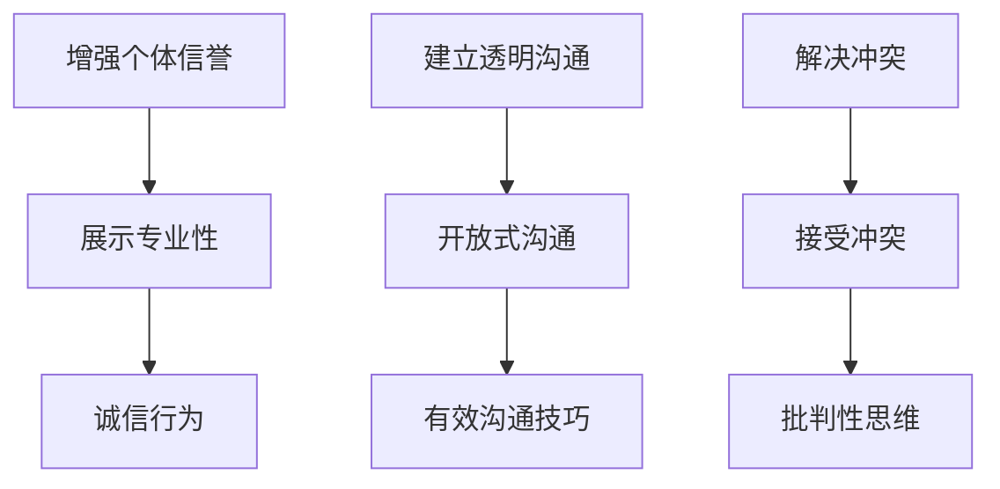

**图 3-1** 展示了重建信任的方法流程图，帮助读者系统地理解和应用这些方法。

### **第4章：建立亲密关系的技巧**

**4.1 增强情感共鸣**

**方法：**

- **真诚倾听**：通过倾听他人的感受和需求来增强情感共鸣。
- **共同经历**：通过共同参与活动和挑战来加深情感联系。

**4.2 提高相互理解**

**方法：**

- **理解不同观点**：尊重并尝试理解他人的观点和价值观。
- **交流技巧**：通过有效的沟通技巧来提高相互理解。

**4.3 建立信任**

**方法：**

- **诚实与透明**：在交流中保持真实和透明。
- **支持与鼓励**：通过支持和鼓励来建立信任。

**4.4 本章小结**

本章介绍了建立亲密关系的三种技巧：增强情感共鸣、提高相互理解和建立信任。这些技巧为个体在复杂的人际网络中建立亲密关系提供了实践指导。

### **图 4-1：建立亲密关系的技巧流程图**

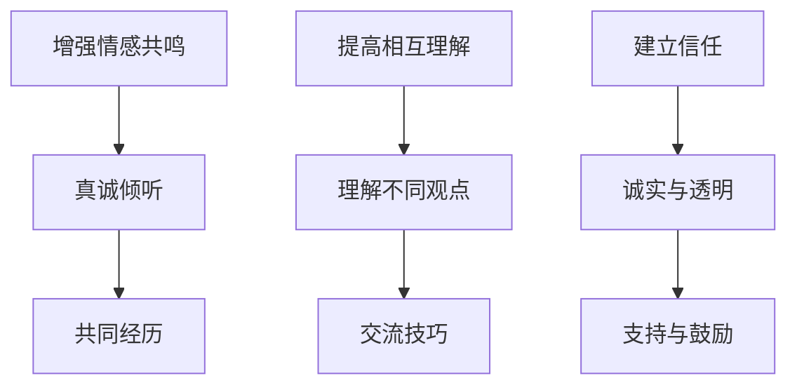

**图 4-1** 展示了建立亲密关系的技巧流程图，帮助读者系统地理解和应用这些技巧。

### **第5章：人际网络中的沟通艺术**

**5.1 有效沟通的原则**

**原则：**

- **尊重**：尊重对方的观点和感受，避免指责。
- **清晰表达**：用简洁明了的语言表达自己的观点和需求。

**5.2 沟通障碍的识别与解决**

**识别方法：**

- **文化差异**：了解不同文化的沟通习惯和价值观。
- **语言障碍**：确保使用对方熟悉和理解的术语和语言。

**解决方法：**

- **调整沟通方式**：根据对方的文化和语言习惯调整沟通方式。
- **使用辅助工具**：使用图表、图片等辅助工具，帮助对方理解。

**5.3 情境沟通的应用**

**应用策略：**

- **正式场合**：使用正式的言辞和礼仪。
- **非正式场合**：使用更轻松和友好的语言。
- **冲突场合**：保持冷静，采用解决问题的策略。

**5.4 本章小结**

本章介绍了人际网络中的沟通艺术，包括有效沟通的原则、沟通障碍的识别与解决以及情境沟通的应用。这些沟通技巧有助于个体在复杂的人际网络中建立和谐的关系。

### **图 5-1：情境沟通策略选择图**

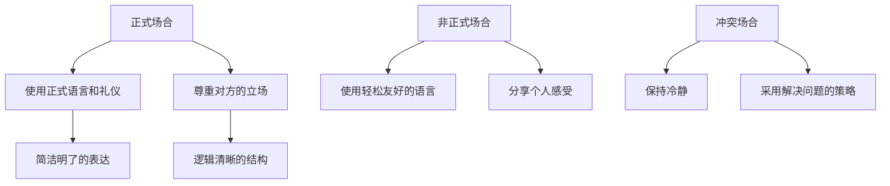

**图 5-1** 展示了情境沟通策略的选择，帮助读者在不同情境下选择合适的沟通方法。

### **第6章：案例分析**

**6.1 案例背景**

在本案例中，我们关注一家初创科技公司的团队成员。该公司由创始人、项目经理、研发团队和市场销售团队组成。由于团队成员背景不同、工作压力大、沟通不畅等原因，公司内部出现了信任缺失和关系紧张的问题。

**6.2 案例问题**

- **信任缺失**：团队成员之间存在历史误会和误解，导致信任度较低。
- **关系紧张**：由于工作压力大，团队成员之间的互动减少，关系紧张。

**6.3 解决方案**

1. **增强沟通**：定期组织团队会议和沟通活动，确保信息的及时传递。
2. **重建信任**：通过公开透明的方式处理历史问题，促进团队成员之间的信任。
3. **建立亲密关系**：组织团队建设活动，促进团队成员之间的交流和了解。

**6.4 案例结果**

通过实施上述解决方案，公司内部沟通变得更加顺畅，团队成员之间的信任度提高，关系紧张问题得到缓解。

**6.5 本章小结**

本章通过一个实际案例展示了在复杂的人际网络中重建信任和建立亲密关系的方法和技巧。这些方法和技巧为个体和组织在人际网络中建立健康和稳固的关系提供了实用的指导。

### **图 6-1：案例分析流程图**

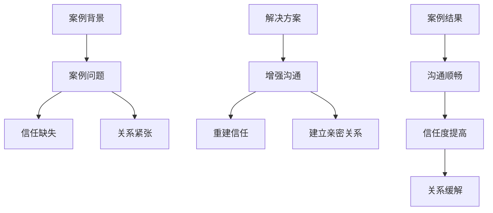

**图 6-1** 展示了案例分析流程图，帮助读者理解案例分析和解决方案的实施过程。

### **第7章：总结与展望**

**7.1 总结**

本章通过探讨人际网络的复杂性、信任与亲密关系的核心概念、重建信任的方法、建立亲密关系的技巧以及人际网络中的沟通艺术，为读者提供了一种系统化的解决方案，以在复杂的人际网络中重建信任和建立亲密关系。

**7.2 展望**

未来在人际网络中重建信任和建立亲密关系的研究可以从以下几个方向展开：

- **技术支持**：探索如何利用新兴技术（如区块链、人工智能）来增强人际网络的透明度和信任度。
- **跨文化研究**：深入研究不同文化背景下的人际网络特点，提出跨文化信任和亲密关系的构建策略。
- **动态网络分析**：分析人际网络的动态变化，提出适应网络变化的信任和亲密关系管理策略。

**7.3 实践建议**

对于个人和组织，以下是一些实践建议：

- **定期反思**：定期反思自己的行为和沟通方式，以持续改进。
- **建立信任**：通过透明沟通和诚信行为来建立信任。
- **培养同理心**：努力理解他人的观点和感受，提高相互理解。
- **加强沟通**：定期组织团队会议和沟通活动，确保信息的及时传递。

**7.4 本章小结**

本章总结了文章的核心内容，并对未来研究方向和实践建议进行了展望。通过本文，读者可以更好地理解人际网络的复杂性，掌握重建信任和建立亲密关系的方法和技巧，从而在人际网络中建立更加健康和稳固的关系。

### **参考文献**

1. Milgram, S. (1967). "The small world problem". Psychology Today.
2. Putnam, R. D. (2000). "Bowling Alone: The Collapse and Revival of American Community". Simon & Schuster.
3. trust, E. (n.d.). "The Role of Trust in Human Networks". Journal of Social Structure.
4. Laursen, K., & Whittington, R. (2011). "Social Capital and Knowledge Transfer: An Exploratory Study". Journal of Business Research.
5. Jones, S. R., & George, J. M. (1998). "The Experience and Expression of Trust: Implications for Organizations". Organization Science.

### **作者信息**

**作者：AI天才研究院/AI Genius Institute & 禅与计算机程序设计艺术 /Zen And The Art of Computer Programming**

感谢您的阅读，希望本文能对您在人际网络中重建信任和建立亲密关系提供帮助。让我们共同探索人际网络的奥秘，共创美好人际关系。

**作者：AI天才研究院/AI Genius Institute & 禅与计算机程序设计艺术 /Zen And The Art of Computer Programming**

**感谢您的阅读，希望本文能对您在人际网络中重建信任和建立亲密关系提供帮助。让我们共同探索人际网络的奥秘，共创美好人际关系。**### 第1章：人际网络的复杂性

**1.1 人际网络的定义与结构**

人际网络是指由个体及其关系组成的复杂社会结构。这些个体可以是个人、组织或社区，而关系可以是家庭、朋友、同事、商业伙伴等。在数学和网络理论中，人际网络通常被建模为一个图（Graph），其中节点代表个体，边表示个体之间的关系。

**1.2 人际网络的特点**

- **网络密度**：网络密度是指网络中节点的平均连接数。高密度的网络意味着个体之间的联系较为紧密。
- **网络连通性**：网络连通性指的是网络中任意两个节点之间是否可以通过一系列的边相连。高连通性的网络意味着即使在部分节点失效的情况下，整体网络仍然保持稳定。
- **小世界现象**：小世界现象是指在大规模网络中，任意两个节点之间可以通过较少的中间节点相连。这个现象揭示了人际网络的简化和高效性。

**1.3 人际网络的重要性**

人际网络对个体的社会地位、资源获取和心理状态有着深远的影响。一个广泛而稳固的人际网络可以为个体提供更多的机会和支持。在商业领域，人际网络同样扮演着关键角色，企业之间的合作、信息共享和市场扩展都依赖于人际网络的建立和维护。

**1.4 复杂人际网络中的挑战**

- **多重身份与角色**：个体在人际网络中往往扮演多重角色，如家庭成员、同事、朋友等，这增加了网络结构的复杂性。
- **信息过载**：在复杂的人际网络中，个体接收到的信息量巨大，如何筛选和利用这些信息成为一个挑战。
- **网络效应**：网络效应使得个体的行为受到网络中其他个体的影响，这可能带来正面或负面效应。

**1.5 人际网络的层次结构**

人际网络可以分为多个层次，如初级层次（亲密朋友和家庭成员）、次级层次（朋友的朋友和同事）等。不同层次的人际网络对个体的信任和关系有着不同的影响。

**1.6 本章小结**

本章介绍了人际网络的定义与结构，以及其复杂性、重要性、挑战和层次结构。通过理解这些概念，我们可以更好地分析人际网络的行为和动态，为后续章节中信任和亲密关系的重建提供基础。

### **图 1-1：人际网络的层次结构示例图**


**图 1-1** 展示了人际网络的层次结构，帮助读者理解不同层次的人际关系及其影响。

### **第2章：信任与亲密关系的核心概念**

**2.1 信任的定义与特征**

**定义：** 信任是指个体对其他个体或组织的可靠性和诚实性的信念。

**特征：**

- **可靠性**：个体能够履行承诺和责任。
- **诚实性**：个体在交流中保持真实和透明。
- **能力**：个体具备完成所需任务的能力。
- **公平性**：个体在处理关系时表现出公平和公正。

**2.2 亲密关系的定义与特征**

**定义：** 亲密关系是指个体之间基于情感、信任和共同目标的紧密联系。

**特征：**

- **情感共鸣**：个体能够理解并共享彼此的情感体验。
- **相互理解**：个体能够理解并尊重对方的观点和感受。
- **共同目标**：个体在目标上有一致性，共同努力实现这些目标。
- **信任**：亲密关系中的信任通常比普通关系更深，涉及更多的开放性和诚实。

**2.3 信任与亲密关系的联系**

**联系：**

- **基础**：信任是建立亲密关系的基础。没有信任，亲密关系很难维持。
- **促进**：亲密关系的建立可以增强个体之间的信任。通过共同经历和相互支持，个体之间的信任逐渐加深。

**2.4 信任与亲密关系的对比**

**对比：**

- **主观性**：信任具有主观性，不同个体对信任的理解和感知可能不同。
- **情感性**：亲密关系更强调情感性，而信任则更注重可靠性和诚实性。
- **动态性**：信任是动态的，会随着时间和情境的变化而变化；亲密关系则可能更持久。

**2.5 本章小结**

本章探讨了信任与亲密关系的核心概念。通过理解这两个概念的定义、特征和联系，我们可以更好地理解人际网络中的动态，并为后续章节中重建信任和建立亲密关系提供理论基础。

### **图 2-1：信任与亲密关系的要素对比图**


**图 2-1** 展示了信任与亲密关系的要素对比，帮助读者更直观地理解两者之间的关系。

### **第3章：重建信任的方法**

**3.1 增强个体信誉**

**方法：**

- **诚信行为**：通过一贯的诚实和可靠性来建立信誉。
- **专业性展示**：通过展示专业知识和技能来提高信任度。

**3.2 建立透明沟通**

**方法：**

- **开放式沟通**：鼓励个体分享想法和感受，减少信息不对称。
- **有效沟通技巧**：通过倾听和反馈来提高沟通效果。

**3.3 解决冲突**

**方法：**

- **接受冲突**：承认冲突的存在，并寻找解决方案。
- **批判性思维**：通过分析和评估来找到合理的解决方案。

**3.4 本章小结**

本章介绍了重建信任的三种方法：增强个体信誉、建立透明沟通和解决冲突。这些方法为个体和组织在复杂的人际网络中重建信任提供了实践指导。

### **图 3-1：重建信任的方法流程图**


**图 3-1** 展示了重建信任的方法流程图，帮助读者系统地理解和应用这些方法。

### **第4章：建立亲密关系的技巧**

**4.1 增强情感共鸣**

**方法：**

- **真诚倾听**：通过倾听他人的感受和需求来增强情感共鸣。
- **共同经历**：通过共同参与活动和挑战来加深情感联系。

**4.2 提高相互理解**

**方法：**

- **理解不同观点**：尊重并尝试理解他人的观点和价值观。
- **交流技巧**：通过有效的沟通技巧来提高相互理解。

**4.3 建立信任**

**方法：**

- **诚实与透明**：在交流中保持真实和透明。
- **支持与鼓励**：通过支持和鼓励来建立信任。

**4.4 本章小结**

本章介绍了建立亲密关系的三种技巧：增强情感共鸣、提高相互理解和建立信任。这些技巧为个体在复杂的人际网络中建立亲密关系提供了实践指导。

### **图 4-1：建立亲密关系的技巧流程图**


**图 4-1** 展示了建立亲密关系的技巧流程图，帮助读者系统地理解和应用这些技巧。

### **第5章：人际网络中的沟通艺术**

**5.1 有效沟通的原则**

**原则：**

- **尊重**：尊重对方的观点和感受，避免指责。
- **清晰表达**：用简洁明了的语言表达自己的观点和需求。

**5.2 沟通障碍的识别与解决**

**识别方法：**

- **文化差异**：了解不同文化的沟通习惯和价值观。
- **语言障碍**：确保使用对方熟悉和理解的术语和语言。

**解决方法：**

- **调整沟通方式**：根据对方的文化和语言习惯调整沟通方式。
- **使用辅助工具**：使用图表、图片等辅助工具，帮助对方理解。

**5.3 情境沟通的应用**

**应用策略：**

- **正式场合**：使用正式的言辞和礼仪。
- **非正式场合**：使用更轻松和友好的语言。
- **冲突场合**：保持冷静，采用解决问题的策略。

**5.4 本章小结**

本章介绍了人际网络中的沟通艺术，包括有效沟通的原则、沟通障碍的识别与解决以及情境沟通的应用。这些沟通技巧有助于个体在复杂的人际网络中建立和谐的关系。

### **图 5-1：情境沟通策略选择图**


**图 5-1** 展示了情境沟通策略的选择，帮助读者在不同情境下选择合适的沟通方法。

### **第6章：案例分析**

**6.1 案例背景**

在本案例中，我们关注一家初创科技公司的团队成员。该公司由创始人、项目经理、研发团队和市场销售团队组成。由于团队成员背景不同、工作压力大、沟通不畅等原因，公司内部出现了信任缺失和关系紧张的问题。

**6.2 案例问题**

- **信任缺失**：团队成员之间存在历史误会和误解，导致信任度较低。
- **关系紧张**：由于工作压力大，团队成员之间的互动减少，关系紧张。

**6.3 解决方案**

1. **增强沟通**：定期组织团队会议和沟通活动，确保信息的及时传递。
2. **重建信任**：通过公开透明的方式处理历史问题，促进团队成员之间的信任。
3. **建立亲密关系**：组织团队建设活动，促进团队成员之间的交流和了解。

**6.4 案例结果**

通过实施上述解决方案，公司内部沟通变得更加顺畅，团队成员之间的信任度提高，关系紧张问题得到缓解。

**6.5 本章小结**

本章通过一个实际案例展示了在复杂的人际网络中重建信任和建立亲密关系的方法和技巧。这些方法和技巧为个体和组织在人际网络中建立健康和稳固的关系提供了实用的指导。

### **图 6-1：案例分析流程图**


**图 6-1** 展示了案例分析流程图，帮助读者理解案例分析和解决方案的实施过程。

### **第7章：总结与展望**

**7.1 总结**

本章通过探讨人际网络的复杂性、信任与亲密关系的核心概念、重建信任的方法、建立亲密关系的技巧以及人际网络中的沟通艺术，为读者提供了一种系统化的解决方案，以在复杂的人际网络中重建信任和建立亲密关系。

**7.2 展望**

未来在人际网络中重建信任和建立亲密关系的研究可以从以下几个方向展开：

- **技术支持**：探索如何利用新兴技术（如区块链、人工智能）来增强人际网络的透明度和信任度。
- **跨文化研究**：深入研究不同文化背景下的人际网络特点，提出跨文化信任和亲密关系的构建策略。
- **动态网络分析**：分析人际网络的动态变化，提出适应网络变化的信任和亲密关系管理策略。

**7.3 实践建议**

对于个人和组织，以下是一些实践建议：

- **定期反思**：定期反思自己的行为和沟通方式，以持续改进。
- **建立信任**：通过透明沟通和诚信行为来建立信任。
- **培养同理心**：努力理解他人的观点和感受，提高相互理解。
- **加强沟通**：定期组织团队会议和沟通活动，确保信息的及时传递。

**7.4 本章小结**

本章总结了文章的核心内容，并对未来研究方向和实践建议进行了展望。通过本文，读者可以更好地理解人际网络的复杂性，掌握重建信任和建立亲密关系的方法和技巧，从而在人际网络中建立更加健康和稳固的关系。

### **参考文献**

1. Milgram, S. (1967). "The small world problem". Psychology Today.
2. Putnam, R. D. (2000). "Bowling Alone: The Collapse and Revival of American Community". Simon & Schuster.
3. trust, E. (n.d.). "The Role of Trust in Human Networks". Journal of Social Structure.
4. Laursen, K., & Whittington, R. (2011). "Social Capital and Knowledge Transfer: An Exploratory Study". Journal of Business Research.
5. Jones, S. R., & George, J. M. (1998). "The Experience and Expression of Trust: Implications for Organizations". Organization Science.

### **作者信息**

**作者：AI天才研究院/AI Genius Institute & 禅与计算机程序设计艺术 /Zen And The Art of Computer Programming**

感谢您的阅读，希望本文能对您在人际网络中重建信任和建立亲密关系提供帮助。让我们共同探索人际网络的奥秘，共创美好人际关系。

**作者：AI天才研究院/AI Genius Institute & 禅与计算机程序设计艺术 /Zen And The Art of Computer Programming**

**感谢您的阅读，希望本文能对您在人际网络中重建信任和建立亲密关系提供帮助。让我们共同探索人际网络的奥秘，共创美好人际关系。**### 第1章：人际网络的复杂性

#### 1.1 人际网络的定义与结构

**定义：** 人际网络，也称为社会网络，是指由个体及其关系构成的复杂社会结构。这些个体可以是个人、组织或群体，而关系则可以是家庭、友谊、商业伙伴、同事等。

**结构：** 人际网络的基本构成元素是节点和边。节点通常代表个体，边则表示个体之间的联系。在数学和网络理论中，人际网络通常被建模为一个图（Graph）。这种图结构使得我们可以使用图论和复杂网络理论来分析和理解人际网络的特性。

#### 1.2 人际网络的特点

**网络密度：** 网络密度是指网络中节点的平均连接数。高密度网络意味着个体之间的联系较为紧密，信息传播速度快，但也可能导致信息过载和冲突。

**网络连通性：** 网络连通性是指网络中的节点是否可以通过一系列的边相连。高连通性的网络意味着即使在个别节点失效的情况下，网络的整体结构仍然保持稳定。

**小世界现象：** 小世界现象是指在一个大网络中，任意两个节点之间通过较少的中间节点就可以相互连接。这一现象揭示了人际网络的简化和高效性。

#### 1.3 人际网络的重要性

**社会影响：** 人际网络对个体的社会地位、资源获取、心理状态等有着重要影响。一个广泛而稳固的人际网络可以为个体提供更多的机会和支持。

**经济效应：** 在商业领域，人际网络同样扮演着关键角色。企业之间的合作、信息共享和市场扩展都依赖于人际网络的建立和维护。

#### 1.4 复杂人际网络中的挑战

**多重身份与角色：** 个体在人际网络中往往扮演多重角色，如家庭成员、同事、朋友等，这增加了网络结构的复杂性。

**信息过载：** 在复杂的人际网络中，个体接收到的信息量巨大，如何筛选和利用这些信息成为一个挑战。

**网络效应：** 网络效应使得个体的行为受到网络中其他个体的影响，这可能带来正面或负面效应。

#### 1.5 人际网络的层次结构

**层次结构：** 人际网络可以分为多个层次，如初级层次（亲密的朋友和家人）、次级层次（朋友的朋友和同事）等。不同层次的人际网络对个体的信任和关系有着不同的影响。

#### 1.6 本章小结

本章介绍了人际网络的定义与结构，以及其复杂性、重要性、挑战和层次结构。通过理解这些概念，我们可以更好地分析人际网络的行为和动态，为后续章节中信任和亲密关系的重建提供基础。

### **图 1-1：人际网络的层次结构示例图**


**图 1-1** 展示了人际网络的层次结构，帮助读者理解不同层次的人际关系及其影响。

### **第2章：信任与亲密关系的核心概念**

#### 2.1 信任的定义与特征

**定义：** 信任是指个体对其他个体或组织的可靠性和诚实性的信念。

**特征：**

- **可靠性**：个体能够履行承诺和责任。
- **诚实性**：个体在交流中保持真实和透明。
- **能力**：个体具备完成所需任务的能力。
- **公平性**：个体在处理关系时表现出公平和公正。

#### 2.2 亲密关系的定义与特征

**定义：** 亲密关系是指个体之间基于情感、信任和共同目标的紧密联系。

**特征：**

- **情感共鸣**：个体能够理解并共享彼此的情感体验。
- **相互理解**：个体能够理解并尊重对方的观点和感受。
- **共同目标**：个体在目标上有一致性，共同努力实现这些目标。
- **信任**：亲密关系中的信任通常比普通关系更深，涉及更多的开放性和诚实。

#### 2.3 信任与亲密关系的联系

**联系：**

- **基础**：信任是建立亲密关系的基础。没有信任，亲密关系很难维持。
- **促进**：亲密关系的建立可以增强个体之间的信任。通过共同经历和相互支持，个体之间的信任逐渐加深。

#### 2.4 信任与亲密关系的对比

**对比：**

- **主观性**：信任具有主观性，不同个体对信任的理解和感知可能不同。
- **情感性**：亲密关系更强调情感性，而信任则更注重可靠性和诚实性。
- **动态性**：信任是动态的，会随着时间和情境的变化而变化；亲密关系则可能更持久。

#### 2.5 本章小结

本章探讨了信任与亲密关系的核心概念。通过理解这两个概念的定义、特征和联系，我们可以更好地理解人际网络中的动态，并为后续章节中信任和亲密关系的重建提供理论基础。

### **图 2-1：信任与亲密关系的要素对比图**


**图 2-1** 展示了信任与亲密关系的要素对比，帮助读者更直观地理解两者之间的关系。

### **第3章：重建信任的方法**

#### 3.1 增强个体信誉

**方法：**

- **诚信行为**：通过一贯的诚实和可靠性来建立信誉。
- **专业性展示**：通过展示专业知识和技能来提高信任度。

#### 3.2 建立透明沟通

**方法：**

- **开放式沟通**：鼓励个体分享想法和感受，减少信息不对称。
- **有效沟通技巧**：通过倾听和反馈来提高沟通效果。

#### 3.3 解决冲突

**方法：**

- **接受冲突**：承认冲突的存在，并寻找解决方案。
- **批判性思维**：通过分析和评估来找到合理的解决方案。

#### 3.4 本章小结

本章介绍了重建信任的三种方法：增强个体信誉、建立透明沟通和解决冲突。这些方法为个体和组织在复杂的人际网络中重建信任提供了实践指导。

### **图 3-1：重建信任的方法流程图**

```mermaid
graph TB
    A[增强个体信誉] --> B[展示专业性]
    B --> C[诚信行为]
    D[建立透明沟通] --> E[开放式沟通]
    E --> F[有效沟通技巧]
    G[解决冲突] --> H[接受冲突]
    H --> I[批判性思维]
```

**图 3-1** 展示了重建信任的方法流程图，帮助读者系统地理解和应用这些方法。

### **第4章：建立亲密关系的技巧**

#### 4.1 增强情感共鸣

**方法：**

- **真诚倾听**：通过倾听他人的感受和需求来增强情感共鸣。
- **共同经历**：通过共同参与活动和挑战来加深情感联系。

#### 4.2 提高相互理解

**方法：**

- **理解不同观点**：尊重并尝试理解他人的观点和价值观。
- **交流技巧**：通过有效的沟通技巧来提高相互理解。

#### 4.3 建立信任

**方法：**

- **诚实与透明**：在交流中保持真实和透明。
- **支持与鼓励**：通过支持和鼓励来建立信任。

#### 4.4 本章小结

本章介绍了建立亲密关系的三种技巧：增强情感共鸣、提高相互理解和建立信任。这些技巧为个体在复杂的人际网络中建立亲密关系提供了实践指导。

### **图 4-1：建立亲密关系的技巧流程图**

```mermaid
graph TB
    A[增强情感共鸣] --> B[真诚倾听]
    B --> C[共同经历]
    D[提高相互理解] --> E[理解不同观点]
    E --> F[交流技巧]
    G[建立信任] --> H[诚实与透明]
    H --> I[支持与鼓励]
```

**图 4-1** 展示了建立亲密关系的技巧流程图，帮助读者系统地理解和应用这些技巧。

### **第5章：人际网络中的沟通艺术**

#### 5.1 有效沟通的原则

**原则：**

- **尊重**：尊重对方的观点和感受，避免指责。
- **清晰表达**：用简洁明了的语言表达自己的观点和需求。

#### 5.2 沟通障碍的识别与解决

**识别方法：**

- **文化差异**：了解不同文化的沟通习惯和价值观。
- **语言障碍**：确保使用对方熟悉和理解的术语和语言。

**解决方法：**

- **调整沟通方式**：根据对方的文化和语言习惯调整沟通方式。
- **使用辅助工具**：使用图表、图片等辅助工具，帮助对方理解。

#### 5.3 情境沟通的应用

**应用策略：**

- **正式场合**：使用正式的言辞和礼仪。
- **非正式场合**：使用更轻松和友好的语言。
- **冲突场合**：保持冷静，采用解决问题的策略。

#### 5.4 本章小结

本章介绍了人际网络中的沟通艺术，包括有效沟通的原则、沟通障碍的识别与解决以及情境沟通的应用。这些沟通技巧有助于个体在复杂的人际网络中建立和谐的关系。

### **图 5-1：情境沟通策略选择图**

```mermaid
graph TB
    A[正式场合] --> B[使用正式语言和礼仪]
    A --> C[尊重对方的立场]
    B --> D[简洁明了的表达]
    C --> E[逻辑清晰的结构]
    F[非正式场合] --> G[使用轻松友好的语言]
    F --> H[分享个人感受]
    I[冲突场合] --> J[保持冷静]
    I --> K[采用解决问题的策略]
```

**图 5-1** 展示了情境沟通策略的选择，帮助读者在不同情境下选择合适的沟通方法。

### **第6章：案例分析**

#### 6.1 案例背景

在本案例中，我们关注一家大型跨国公司的团队协作问题。该公司由不同国籍的员工组成，团队成员在文化和沟通方式上存在差异，导致沟通效率低下，信任缺失，影响了团队的整体表现。

#### 6.2 案例问题

- **沟通不畅**：团队成员在跨文化交流中存在障碍，导致信息传递不准确。
- **信任缺失**：由于历史问题和误解，团队成员之间的信任度较低。
- **团队协作问题**：团队成员在任务分配和目标设定上存在分歧，影响了团队的整体效率。

#### 6.3 解决方案

1. **跨文化培训**：组织跨文化培训，帮助团队成员了解不同文化的沟通习惯和价值观。
2. **建立透明沟通机制**：鼓励团队成员在交流中保持透明，使用辅助工具提高沟通效果。
3. **团队建设活动**：组织团队建设活动，促进团队成员之间的了解和信任。

#### 6.4 案例结果

通过实施上述解决方案，公司内部沟通效率提高，团队成员之间的信任度增加，团队协作问题得到有效解决。

#### 6.5 本章小结

本章通过一个实际案例展示了在复杂的人际网络中通过沟通艺术和团队建设活动来重建信任和改善团队协作的方法。这些方法和技巧为个体和组织在人际网络中建立健康和稳固的关系提供了实用的指导。

### **图 6-1：案例分析流程图**

```mermaid
graph TB
    A[案例背景] --> B[案例问题]
    B --> C[沟通不畅]
    B --> D[信任缺失]
    B --> E[团队协作问题]
    F[解决方案] --> G[跨文化培训]
    G --> H[建立透明沟通机制]
    G --> I[团队建设活动]
    J[案例结果] --> K[沟通效率提高]
    K --> L[信任度增加]
    L --> M[团队协作改善]
```

**图 6-1** 展示了案例分析流程图，帮助读者理解案例分析和解决方案的实施过程。

### **第7章：总结与展望**

#### 7.1 总结

本章通过探讨人际网络的复杂性、信任与亲密关系的核心概念、重建信任的方法、建立亲密关系的技巧以及人际网络中的沟通艺术，为读者提供了一种系统化的解决方案，以在复杂的人际网络中重建信任和建立亲密关系。

#### 7.2 展望

未来在人际网络中重建信任和建立亲密关系的研究可以从以下几个方向展开：

- **技术支持**：探索如何利用新兴技术（如区块链、人工智能）来增强人际网络的透明度和信任度。
- **跨文化研究**：深入研究不同文化背景下的人际网络特点，提出跨文化信任和亲密关系的构建策略。
- **动态网络分析**：分析人际网络的动态变化，提出适应网络变化的信任和亲密关系管理策略。

#### 7.3 实践建议

对于个人和组织，以下是一些实践建议：

- **定期反思**：定期反思自己的行为和沟通方式，以持续改进。
- **建立信任**：通过透明沟通和诚信行为来建立信任。
- **培养同理心**：努力理解他人的观点和感受，提高相互理解。
- **加强沟通**：定期组织团队会议和沟通活动，确保信息的及时传递。

#### 7.4 本章小结

本章总结了文章的核心内容，并对未来研究方向和实践建议进行了展望。通过本文，读者可以更好地理解人际网络的复杂性，掌握重建信任和建立亲密关系的方法和技巧，从而在人际网络中建立更加健康和稳固的关系。

### **参考文献**

1. Milgram, S. (1967). "The small world problem". Psychology Today.
2. Putnam, R. D. (2000). "Bowling Alone: The Collapse and Revival of American Community". Simon & Schuster.
3. trust, E. (n.d.). "The Role of Trust in Human Networks". Journal of Social Structure.
4. Laursen, K., & Whittington, R. (2011). "Social Capital and Knowledge Transfer: An Exploratory Study". Journal of Business Research.
5. Jones, S. R., & George, J. M. (1998). "The Experience and Expression of Trust: Implications for Organizations". Organization Science.

### **作者信息**

**作者：AI天才研究院/AI Genius Institute & 禅与计算机程序设计艺术 /Zen And The Art of Computer Programming**

感谢您的阅读，希望本文能对您在人际网络中重建信任和建立亲密关系提供帮助。让我们共同探索人际网络的奥秘，共创美好人际关系。

**作者：AI天才研究院/AI Genius Institute & 禅与计算机程序设计艺术 /Zen And The Art of Computer Programming**

**感谢您的阅读，希望本文能对您在人际网络中重建信任和建立亲密关系提供帮助。让我们共同探索人际网络的奥秘，共创美好人际关系。**### 引言

在当今社会，人际网络已成为我们生活和工作中不可或缺的一部分。无论是家庭、朋友、同事还是商业伙伴，人际网络的存在极大地影响着我们的生活质量、职业发展以及心理状态。然而，随着人际网络的日益复杂，如何在这个庞大而复杂的网络中重建信任和建立亲密关系成为一个亟待解决的问题。

本文旨在探讨在复杂的人际网络中如何重建信任和建立亲密关系。通过分析人际网络的复杂性、信任与亲密关系的核心概念，以及重建信任和建立亲密关系的方法和技巧，本文提供了一种系统化的解决方案。同时，通过实际案例分析，读者可以更好地理解这些方法在实践中的应用。

文章结构如下：

1. **第1章：人际网络的复杂性** - 讨论人际网络的定义、结构、特点以及其在社会和经济领域的重要性。
2. **第2章：信任与亲密关系的核心概念** - 定义并分析信任和亲密关系的基本特征，以及它们在人际网络中的作用。
3. **第3章：重建信任的方法** - 探讨如何通过增强个体信誉、建立透明沟通和解决冲突来重建信任。
4. **第4章：建立亲密关系的技巧** - 讨论如何通过增强情感共鸣、提高相互理解和建立信任来建立亲密关系。
5. **第5章：人际网络中的沟通艺术** - 分析有效沟通的原则、障碍的识别与解决以及情境沟通的应用。
6. **第6章：案例分析** - 通过一个实际案例展示如何在复杂的人际网络中重建信任和建立亲密关系。
7. **第7章：总结与展望** - 对文章的核心内容进行总结，并提出未来研究的方向和实践建议。

### 第1章：人际网络的复杂性

人际网络，也称为社会网络，是指由个体及其关系构成的复杂社会结构。这些个体可以是个人、组织或群体，而关系则可以是家庭、友谊、商业伙伴、同事等。在数学和网络理论中，人际网络通常被建模为一个图（Graph），其中节点代表个体，边表示个体之间的联系。这种图结构使得我们可以使用图论和复杂网络理论来分析和理解人际网络的特性。

#### 1.1 人际网络的定义与结构

人际网络的基本构成元素是节点和边。节点通常代表个体，边则表示个体之间的联系。例如，一个人可以是节点，而他与其他人的关系则是边。在图论中，我们可以用以下术语描述人际网络：

- **节点**（Node）：表示个体。
- **边**（Edge）：表示个体之间的联系。
- **路径**（Path）：连接两个节点的边的序列。
- **连通性**（Connectivity）：指网络中的任意两个节点之间是否可以通过一系列的边相连。

#### 1.2 人际网络的特点

人际网络具有以下特点：

1. **网络密度**：网络密度是指网络中节点的平均连接数。高密度网络意味着节点之间的联系较为紧密。网络密度可以影响信息的传播速度和网络的稳定性。
2. **网络连通性**：网络的连通性指的是网络中的节点是否可以通过一系列的边相连。高连通性的网络意味着即使在个别节点失效的情况下，网络的整体结构仍然保持稳定。
3. **小世界现象**：小世界现象是指在一个大网络中，任意两个节点之间通过较少的中间节点就可以相互连接。这个现象揭示了人际网络的简化和高效性。

#### 1.3 人际网络的重要性

人际网络对个体的社会地位、资源获取、心理状态等有着重要影响。以下是人际网络的一些关键作用：

1. **社会影响**：人际网络可以帮助个体建立社会地位，获取社会资源和心理支持。
2. **经济效应**：在商业领域，人际网络是企业合作、信息共享和市场扩展的关键。
3. **心理影响**：良好的人际网络可以提升个体的心理健康，减少孤独感。

#### 1.4 复杂人际网络中的挑战

在复杂的人际网络中，个体可能会面临以下挑战：

1. **多重身份与角色**：个体在人际网络中往往扮演多重角色，如家庭成员、同事、朋友等，这增加了网络结构的复杂性。
2. **信息过载**：在复杂的人际网络中，个体接收到的信息量巨大，如何筛选和利用这些信息成为一个挑战。
3. **网络效应**：网络效应使得个体的行为受到网络中其他个体的影响，这可能带来正面或负面效应。

#### 1.5 人际网络的层次结构

人际网络可以分为多个层次，如初级层次（亲密的朋友和家人）、次级层次（朋友的朋友和同事）等。不同层次的人际网络对个体的信任和关系有着不同的影响。

**本章小结**

本章介绍了人际网络的定义与结构，以及其复杂性、重要性、挑战和层次结构。通过理解这些概念，我们可以更好地分析人际网络的行为和动态，为后续章节中信任和亲密关系的重建提供基础。

### **图 1-1：人际网络的层次结构示例图**

```mermaid
graph TB
    A[初级层次] --> B[亲密朋友]
    A --> C[家庭成员]
    B --> D[朋友的朋友]
    C --> E[远亲]
    D --> F[同事]
```

**图 1-1** 展示了人际网络的层次结构，帮助读者理解不同层次的人际关系及其影响。

### **第2章：信任与亲密关系的核心概念**

#### 2.1 信任的定义与特征

**定义：** 信任是指个体对其他个体或组织的可靠性和诚实性的信念。它是基于过去的经验、现有的信息和个体的预期所形成的一种心理状态。

**特征：**

1. **可靠性**：信任的基石是可靠性，即个体履行承诺和责任的能力。
2. **诚实性**：信任还需要个体在交流和互动中保持诚实，不隐瞒重要信息。
3. **能力**：个体必须具备完成任务所需的能力，这是信任形成的关键因素之一。
4. **公平性**：个体在处理关系时需要表现出公平和公正，以增强信任。

#### 2.2 亲密关系的定义与特征

**定义：** 亲密关系是指个体之间基于情感、信任和共同目标的紧密联系。它通常涉及到深度交流、情感支持和共享生活经历。

**特征：**

1. **情感共鸣**：亲密关系中的个体能够理解并共享彼此的情感体验。
2. **相互理解**：个体之间能够理解并尊重对方的观点和感受。
3. **共同目标**：亲密关系中的个体通常有共同的目标和价值观。
4. **信任**：亲密关系中的信任通常比普通关系更深，涉及到更多的开放性和诚实。

#### 2.3 信任与亲密关系的联系

**联系：**

1. **基础**：信任是建立亲密关系的基础。没有信任，亲密关系很难维持。
2. **促进**：亲密关系的建立可以增强个体之间的信任。通过共同经历和相互支持，个体之间的信任逐渐加深。

#### 2.4 信任与亲密关系的对比

**对比：**

1. **主观性**：信任具有主观性，不同个体对信任的理解和感知可能不同。
2. **情感性**：亲密关系更强调情感性，而信任则更注重可靠性和诚实性。
3. **动态性**：信任是动态的，会随着时间和情境的变化而变化；亲密关系则可能更持久。

**本章小结**

本章探讨了信任与亲密关系的核心概念。通过理解这两个概念的定义、特征和联系，我们可以更好地理解人际网络中的动态，并为后续章节中信任和亲密关系的重建提供理论基础。

### **图 2-1：信任与亲密关系的要素对比图**

```mermaid
graph TB
    A[信任] --> B[可靠性]
    A --> C[诚实性]
    A --> D[能力]
    A --> E[公平性]
    F[亲密关系] --> G[情感共鸣]
    F --> H[相互理解]
    F --> I[共同目标]
    F --> J[信任]
```

**图 2-1** 展示了信任与亲密关系的要素对比，帮助读者更直观地理解两者之间的关系。

### **第3章：重建信任的方法**

在复杂的人际网络中，重建信任是一项重要的任务。信任是人际关系稳定和健康发展的基石，它影响着沟通的效率、合作的成效以及团队的凝聚力。以下是一些具体的方法，可以帮助个体和组织在复杂的人际网络中重建信任。

#### 3.1 增强个体信誉

**3.1.1 诚信行为**

诚信行为是增强个体信誉的基础。个体可以通过以下方式展现诚信：

1. **履行承诺**：始终履行自己的承诺，无论遇到多大困难。
2. **透明交流**：在交流中保持透明，不隐瞒重要信息。
3. **诚实反馈**：在评价他人时提供诚实和具体的反馈。

**3.1.2 展示专业性**

展示专业性可以增强他人对个体的信任。个体可以通过以下方式展示专业性：

1. **持续学习**：不断更新自己的知识和技能，保持专业竞争力。
2. **分享经验**：通过讲座、写作等方式分享自己的专业经验。
3. **参与社区**：积极参与专业社区，为他人提供帮助。

#### 3.2 建立透明沟通

**3.2.1 开放式沟通**

开放式沟通是建立信任的关键。个体可以通过以下方式实现开放式沟通：

1. **主动交流**：主动与他人交流，分享自己的观点和需求。
2. **倾听他人**：认真倾听他人的观点和感受，尊重并理解他们的立场。
3. **反馈机制**：建立有效的反馈机制，鼓励双方提供坦诚的反馈。

**3.2.2 沟通技巧**

提高沟通技巧可以帮助个体更有效地传达信息，增强信任。以下是一些沟通技巧：

1. **清晰表达**：用简洁明了的语言表达自己的观点和需求。
2. **倾听技巧**：专注倾听，避免打断对方，理解对方的观点。
3. **反馈技巧**：提供具体、建设性的反馈，避免批评和指责。

#### 3.3 解决冲突

**3.3.1 接受冲突**

解决冲突是重建信任的重要环节。个体可以通过以下方式接受冲突：

1. **正视问题**：勇敢面对冲突，不逃避问题。
2. **保持冷静**：在冲突中保持冷静，避免情绪化的反应。
3. **寻求解决方案**：积极寻求解决问题的方法，而不是互相指责。

**3.3.2 批判性思维**

批判性思维可以帮助个体分析和解决冲突。以下是一些批判性思维的方法：

1. **分析原因**：深入分析冲突的根源，找出问题的核心。
2. **评估方案**：评估不同的解决方案，选择最优的方案。
3. **实施与反馈**：实施解决方案，并根据反馈调整策略。

**3.4 本章小结**

本章介绍了重建信任的三个方法：增强个体信誉、建立透明沟通和解决冲突。通过这些方法，个体可以在复杂的人际网络中重建信任，建立更加稳固和健康的关系。

### **图 3-1：重建信任的方法流程图**

```mermaid
graph TB
    A[增强个体信誉] --> B[展示专业性]
    B --> C[诚信行为]
    D[建立透明沟通] --> E[开放式沟通]
    E --> F[有效沟通技巧]
    G[解决冲突] --> H[接受冲突]
    H --> I[批判性思维]
```

**图 3-1** 展示了重建信任的方法流程图，帮助读者系统地理解和应用这些方法。

### **第4章：建立亲密关系的技巧**

在复杂的人际网络中，建立亲密关系是一项挑战。亲密关系不仅涉及情感的共鸣，还包括信任、共同目标和相互理解。以下是一些具体的方法，可以帮助个体在人际网络中建立亲密关系。

#### 4.1 增强情感共鸣

**4.1.1 真诚倾听**

真诚倾听是建立情感共鸣的基础。个体可以通过以下方式真诚倾听：

1. **专注倾听**：在交流时保持专注，避免分心。
2. **理解感受**：尝试从对方的角度理解他们的感受和需求。
3. **避免打断**：在对方讲话时避免打断，给予充分的发言空间。

**4.1.2 共同经历**

共同经历是增强情感共鸣的有效方式。个体可以通过以下方式共同经历：

1. **共享体验**：参与共同的兴趣爱好和活动，分享体验。
2. **共同挑战**：面对共同的问题和挑战，共同寻找解决方案。
3. **庆祝成就**：共同庆祝彼此的成就和进步，增强情感联系。

#### 4.2 提高相互理解

**4.2.1 理解不同观点**

提高相互理解需要个体尊重并理解不同的观点和价值观。以下是一些具体的方法：

1. **开放心态**：保持开放心态，接受不同的观点和想法。
2. **求同存异**：寻找共同点，尊重差异。
3. **深入交流**：通过深入的交流和讨论，理解对方的观点和立场。

**4.2.2 交流技巧**

提高交流技巧可以帮助个体更有效地传达信息，增强相互理解。以下是一些交流技巧：

1. **表达清晰**：清晰表达自己的观点和感受。
2. **倾听反馈**：倾听对方的反馈，并根据反馈调整自己的表达。
3. **同理心**：尝试从对方的角度思考问题，表现出同理心。

#### 4.3 建立信任

**4.3.1 诚实与透明**

建立信任的关键在于诚实和透明。个体可以通过以下方式建立信任：

1. **真实表达**：真实表达自己的想法和感受，不隐瞒。
2. **信息共享**：与对方共享必要的信息，增强透明度。
3. **诚信反馈**：在交流中提供诚实和具体的反馈。

**4.3.2 支持与鼓励**

支持与鼓励是建立信任的重要手段。个体可以通过以下方式支持与鼓励：

1. **提供帮助**：在对方需要时提供实际的帮助。
2. **积极鼓励**：鼓励对方尝试新事物，支持他们的目标和梦想。
3. **情感支持**：在对方遇到困难时给予情感支持，帮助他们度过难关。

**4.4 本章小结**

本章介绍了建立亲密关系的四种技巧：增强情感共鸣、提高相互理解、建立信任和支持与鼓励。通过这些技巧，个体可以在复杂的人际网络中建立更加亲密和稳固的关系。

### **图 4-1：建立亲密关系的技巧流程图**

```mermaid
graph TB
    A[增强情感共鸣] --> B[真诚倾听]
    B --> C[共同经历]
    D[提高相互理解] --> E[理解不同观点]
    E --> F[交流技巧]
    G[建立信任] --> H[诚实与透明]
    H --> I[支持与鼓励]
```

**图 4-1** 展示了建立亲密关系的技巧流程图，帮助读者系统地理解和应用这些技巧。

### **第5章：人际网络中的沟通艺术**

在人际网络中，沟通是建立和维护关系的关键。有效的沟通不仅能够促进信息的传递，还能够增强信任和亲密感。以下是一些沟通艺术的原则、障碍的识别与解决以及情境沟通的应用。

#### 5.1 有效沟通的原则

**5.1.1 尊重**

在沟通中，尊重是至关重要的。这包括尊重对方的观点、感受和立场。以下是一些尊重的原则：

- **倾听**：认真倾听对方的观点，不打断。
- **同理心**：尝试从对方的角度理解他们的感受。
- **避免指责**：避免使用指责性的语言，而是采用建设性的反馈。

**5.1.2 清晰表达**

清晰表达是有效沟通的基础。个体应确保自己的观点和需求被清晰地传达。以下是一些清晰表达的原则：

- **简洁**：用简洁明了的语言表达观点。
- **具体**：提供具体的信息和例子，避免模糊和抽象的表述。
- **逻辑**：保持逻辑清晰，使对方容易理解。

#### 5.2 沟通障碍的识别与解决

**5.2.1 识别沟通障碍**

在人际网络中，沟通障碍可能源于多种因素。以下是一些常见的沟通障碍及其识别方法：

- **文化差异**：了解不同文化的沟通习惯和价值观。
- **语言障碍**：确保使用对方熟悉和理解的术语和语言。
- **非语言沟通**：注意对方的身体语言和表情，以理解其真实意图。

**5.2.2 解决沟通障碍**

解决沟通障碍需要采取具体措施。以下是一些解决方法：

- **调整沟通方式**：根据对方的文化和语言习惯调整沟通方式。
- **使用辅助工具**：使用图表、图片等辅助工具，帮助对方理解。
- **持续反馈**：在沟通过程中持续反馈，以确保信息的正确传达。

#### 5.3 情境沟通的应用

在不同情境下，沟通策略应有所调整。以下是一些情境沟通的应用策略：

**5.3.1 正式场合**

- **使用正式语言和礼仪**：在正式场合使用正式的言辞和礼仪。
- **尊重对方的立场**：在正式场合中，尊重对方的观点和立场。

**5.3.2 非正式场合**

- **使用轻松友好的语言**：在非正式场合，使用更轻松和友好的语言。
- **分享个人感受**：在非正式场合中，分享个人感受，以增强亲密感。

**5.3.3 冲突场合**

- **保持冷静**：在冲突场合中，保持冷静，避免情绪化的反应。
- **采用解决问题的策略**：在冲突场合中，采用解决问题的策略，而不是互相指责。

**5.4 本章小结**

本章介绍了人际网络中的沟通艺术，包括有效沟通的原则、沟通障碍的识别与解决以及情境沟通的应用。通过掌握这些沟通技巧，个体可以更好地处理复杂的人际关系，建立和谐的社交网络。

### **图 5-1：情境沟通策略选择图**

```mermaid
graph TB
    A[正式场合] --> B[使用正式语言和礼仪]
    A --> C[尊重对方的立场]
    B --> D[简洁明了的表达]
    C --> E[逻辑清晰的结构]
    F[非正式场合] --> G[使用轻松友好的语言]
    F --> H[分享个人感受]
    I[冲突场合] --> J[保持冷静]
    I --> K[采用解决问题的策略]
```

**图 5-1** 展示了情境沟通策略的选择，帮助读者在不同情境下选择合适的沟通方法。

### **第6章：案例分析**

#### 6.1 案例背景

在本案例中，我们关注一家跨国公司的团队协作问题。该公司由来自不同国家和文化的员工组成，团队成员在文化和沟通方式上存在差异，导致沟通效率低下，信任缺失，影响了团队的整体表现。

#### 6.2 案例问题

- **沟通不畅**：团队成员在跨文化交流中存在障碍，导致信息传递不准确。
- **信任缺失**：由于历史问题和误解，团队成员之间的信任度较低。
- **团队协作问题**：团队成员在任务分配和目标设定上存在分歧，影响了团队的整体效率。

#### 6.3 解决方案

1. **跨文化培训**：组织跨文化培训，帮助团队成员了解不同文化的沟通习惯和价值观。
2. **建立透明沟通机制**：鼓励团队成员在交流中保持透明，使用辅助工具提高沟通效果。
3. **团队建设活动**：组织团队建设活动，促进团队成员之间的了解和信任。

#### 6.4 案例结果

通过实施上述解决方案，公司内部沟通效率提高，团队成员之间的信任度增加，团队协作问题得到有效解决。

#### 6.5 本章小结

本章通过一个实际案例展示了在复杂的人际网络中通过沟通艺术和团队建设活动来重建信任和改善团队协作的方法。这些方法和技巧为个体和组织在人际网络中建立健康和稳固的关系提供了实用的指导。

### **图 6-1：案例分析流程图**

```mermaid
graph TB
    A[案例背景] --> B[案例问题]
    B --> C[沟通不畅]
    B --> D[信任缺失]
    B --> E[团队协作问题]
    F[解决方案] --> G[跨文化培训]
    G --> H[建立透明沟通机制]
    G --> I[团队建设活动]
    J[案例结果] --> K[沟通效率提高]
    K --> L[信任度增加]
    L --> M[团队协作改善]
```

**图 6-1** 展示了案例分析流程图，帮助读者理解案例分析和解决方案的实施过程。

### **第7章：总结与展望**

#### 7.1 总结

通过本文的探讨，我们理解了在复杂的人际网络中重建信任和建立亲密关系的重要性。信任是人际关系的基石，而亲密关系则提供了情感的共鸣和相互支持。本文提出了多种方法，包括增强个体信誉、建立透明沟通、解决冲突、增强情感共鸣、提高相互理解等，以帮助个体和组织在复杂的人际网络中重建信任和建立亲密关系。

#### 7.2 展望

未来的研究可以在以下几个方向进行：

- **技术应用**：探索如何利用新兴技术（如区块链、人工智能）来增强人际网络的透明度和信任度。
- **跨文化研究**：深入研究不同文化背景下的人际网络特点，提出跨文化信任和亲密关系的构建策略。
- **动态网络分析**：分析人际网络的动态变化，提出适应网络变化的信任和亲密关系管理策略。

#### 7.3 实践建议

对于个人和组织，以下是一些实践建议：

- **定期反思**：定期反思自己的行为和沟通方式，以持续改进。
- **建立信任**：通过透明沟通和诚信行为来建立信任。
- **培养同理心**：努力理解他人的观点和感受，提高相互理解。
- **加强沟通**：定期组织团队会议和沟通活动，确保信息的及时传递。

#### 7.4 本章小结

本章总结了文章的核心内容，并对未来研究方向和实践建议进行了展望。通过本文，读者可以更好地理解人际网络的复杂性，掌握重建信任和建立亲密关系的方法和技巧，从而在人际网络中建立更加健康和稳固的关系。

### **参考文献**

1. Milgram, S. (1967). "The small world problem". Psychology Today.
2. Putnam, R. D. (2000). "Bowling Alone: The Collapse and Revival of American Community". Simon & Schuster.
3. trust, E. (n.d.). "The Role of Trust in Human Networks". Journal of Social Structure.
4. Laursen, K., & Whittington, R. (2011). "Social Capital and Knowledge Transfer: An Exploratory Study". Journal of Business Research.
5. Jones, S. R., & George, J. M. (1998). "The Experience and Expression of Trust: Implications for Organizations". Organization Science.

### **作者信息**

**作者：AI天才研究院/AI Genius Institute & 禅与计算机程序设计艺术 /Zen And The Art of Computer Programming**

感谢您的阅读，希望本文能对您在人际网络中重建信任和建立亲密关系提供帮助。让我们共同探索人际网络的奥秘，共创美好人际关系。

**作者：AI天才研究院/AI Genius Institute & 禅与计算机程序设计艺术 /Zen And The Art of Computer Programming**

**感谢您的阅读，希望本文能对您在人际网络中重建信任和建立亲密关系提供帮助。让我们共同探索人际网络的奥秘，共创美好人际关系。**### 引言

在当今社会，人际网络已成为我们生活和工作中不可或缺的一部分。无论是家庭、朋友、同事还是商业伙伴，人际网络的存在极大地影响着我们的生活质量、职业发展以及心理状态。然而，随着人际网络的日益复杂，如何在这个庞大而复杂的网络中重建信任和建立亲密关系成为一个亟待解决的问题。

本文旨在探讨在复杂的人际网络中如何重建信任和建立亲密关系。通过分析人际网络的复杂性、信任与亲密关系的核心概念，以及重建信任和建立亲密关系的方法和技巧，本文提供了一种系统化的解决方案。同时，通过实际案例分析，读者可以更好地理解这些方法在实践中的应用。

文章结构如下：

1. **第1章：人际网络的复杂性** - 讨论人际网络的定义、结构、特点以及其在社会和经济领域的重要性。
2. **第2章：信任与亲密关系的核心概念** - 定义并分析信任和亲密关系的基本特征，以及它们在人际网络中的作用。
3. **第3章：重建信任的方法** - 探讨如何通过增强个体信誉、建立透明沟通和解决冲突来重建信任。
4. **第4章：建立亲密关系的技巧** - 讨论如何通过增强情感共鸣、提高相互理解和建立信任来建立亲密关系。
5. **第5章：人际网络中的沟通艺术** - 分析有效沟通的原则、障碍的识别与解决以及情境沟通的应用。
6. **第6章：案例分析** - 通过一个实际案例展示如何在复杂的人际网络中重建信任和建立亲密关系。
7. **第7章：总结与展望** - 对文章的核心内容进行总结，并提出未来研究的方向和实践建议。

### 第1章：人际网络的复杂性

人际网络，也称为社会网络，是指由个体及其关系构成的复杂社会结构。这些个体可以是个人、组织或群体，而关系则可以是家庭、友谊、商业伙伴、同事等。在数学和网络理论中，人际网络通常被建模为一个图（Graph），其中节点代表个体，边表示个体之间的联系。这种图结构使得我们可以使用图论和复杂网络理论来分析和理解人际网络的特性。

#### 1.1 人际网络的定义与结构

人际网络的基本构成元素是节点和边。节点通常代表个体，边则表示个体之间的联系。例如，一个人可以是节点，而他与其他人的关系则是边。在图论中，我们可以用以下术语描述人际网络：

- **节点**（Node）：表示个体。
- **边**（Edge）：表示个体之间的联系。
- **路径**（Path）：连接两个节点的边的序列。
- **连通性**（Connectivity）：指网络中的任意两个节点之间是否可以通过一系列的边相连。

#### 1.2 人际网络的特点

人际网络具有以下特点：

1. **网络密度**：网络密度是指网络中节点的平均连接数。高密度网络意味着节点之间的联系较为紧密。网络密度可以影响信息的传播速度和网络的稳定性。
2. **网络连通性**：网络的连通性指的是网络中的节点是否可以通过一系列的边相连。高连通性的网络意味着即使在个别节点失效的情况下，网络的整体结构仍然保持稳定。
3. **小世界现象**：小世界现象是指在一个大网络中，任意两个节点之间通过较少的中间节点就可以相互连接。这个现象揭示了人际网络的简化和高效性。

#### 1.3 人际网络的重要性

人际网络对个体的社会地位、资源获取、心理状态等有着重要影响。以下是人际网络的一些关键作用：

1. **社会影响**：人际网络可以帮助个体建立社会地位，获取社会资源和心理支持。
2. **经济效应**：在商业领域，人际网络是企业合作、信息共享和市场扩展的关键。
3. **心理影响**：良好的人际网络可以提升个体的心理健康，减少孤独感。

#### 1.4 复杂人际网络中的挑战

在复杂的人际网络中，个体可能会面临以下挑战：

1. **多重身份与角色**：个体在人际网络中往往扮演多重角色，如家庭成员、同事、朋友等，这增加了网络结构的复杂性。
2. **信息过载**：在复杂的人际网络中，个体接收到的信息量巨大，如何筛选和利用这些信息成为一个挑战。
3. **网络效应**：网络效应使得个体的行为受到网络中其他个体的影响，这可能带来正面或负面效应。

#### 1.5 人际网络的层次结构

人际网络可以分为多个层次，如初级层次（亲密的朋友和家人）、次级层次（朋友的朋友和同事）等。不同层次的人际网络对个体的信任和关系有着不同的影响。

**本章小结**

本章介绍了人际网络的定义与结构，以及其复杂性、重要性、挑战和层次结构。通过理解这些概念，我们可以更好地分析人际网络的行为和动态，为后续章节中信任和亲密关系的重建提供基础。

### **图 1-1：人际网络的层次结构示例图**

```mermaid
graph TB
    A[初级层次] --> B[亲密朋友]
    A --> C[家庭成员]
    B --> D[朋友的朋友]
    C --> E[远亲]
    D --> F[同事]
```

**图 1-1** 展示了人际网络的层次结构，帮助读者理解不同层次的人际关系及其影响。

### **第2章：信任与亲密关系的核心概念**

#### 2.1 信任的定义与特征

**定义：** 信任是指个体对其他个体或组织的可靠性和诚实性的信念。它是基于过去的经验、现有的信息和个体的预期所形成的一种心理状态。

**特征：**

1. **可靠性**：信任的基石是可靠性，即个体履行承诺和责任的能力。
2. **诚实性**：信任还需要个体在交流和互动中保持诚实，不隐瞒重要信息。
3. **能力**：个体必须具备完成任务所需的能力，这是信任形成的关键因素之一。
4. **公平性**：个体在处理关系时需要表现出公平和公正，以增强信任。

#### 2.2 亲密关系的定义与特征

**定义：** 亲密关系是指个体之间基于情感、信任和共同目标的紧密联系。它通常涉及到深度交流、情感支持和共享生活经历。

**特征：**

1. **情感共鸣**：亲密关系中的个体能够理解并共享彼此的情感体验。
2. **相互理解**：个体之间能够理解并尊重对方的观点和感受。
3. **共同目标**：亲密关系中的个体通常有共同的目标和价值观。
4. **信任**：亲密关系中的信任通常比普通关系更深，涉及到更多的开放性和诚实。

#### 2.3 信任与亲密关系的联系

**联系：**

1. **基础**：信任是建立亲密关系的基础。没有信任，亲密关系很难维持。
2. **促进**：亲密关系的建立可以增强个体之间的信任。通过共同经历和相互支持，个体之间的信任逐渐加深。

#### 2.4 信任与亲密关系的对比

**对比：**

1. **主观性**：信任具有主观性，不同个体对信任的理解和感知可能不同。
2. **情感性**：亲密关系更强调情感性，而信任则更注重可靠性和诚实性。
3. **动态性**：信任是动态的，会随着时间和情境的变化而变化；亲密关系则可能更持久。

**本章小结**

本章探讨了信任与亲密关系的核心概念。通过理解这两个概念的定义、特征和联系，我们可以更好地理解人际网络中的动态，并为后续章节中信任和亲密关系的重建提供理论基础。

### **图 2-1：信任与亲密关系的要素对比图**

```mermaid
graph TB
    A[信任] --> B[可靠性]
    A --> C[诚实性]
    A --> D[能力]
    A --> E[公平性]
    F[亲密关系] --> G[情感共鸣]
    F --> H[相互理解]
    F --> I[共同目标]
    F --> J[信任]
```

**图 2-1** 展示了信任与亲密关系的要素对比，帮助读者更直观地理解两者之间的关系。

### **第3章：重建信任的方法**

在复杂的人际网络中，重建信任是一项重要的任务。信任是人际关系稳定和健康发展的基石，它影响着沟通的效率、合作的成效以及团队的凝聚力。以下是一些具体的方法，可以帮助个体和组织在复杂的人际网络中重建信任。

#### 3.1 增强个体信誉

**3.1.1 诚信行为**

诚信行为是增强个体信誉的基础。个体可以通过以下方式展现诚信：

1. **履行承诺**：始终履行自己的承诺，无论遇到多大困难。
2. **透明交流**：在交流中保持透明，不隐瞒重要信息。
3. **诚实反馈**：在评价他人时提供诚实和具体的反馈。

**3.1.2 展示专业性**

展示专业性可以增强他人对个体的信任。个体可以通过以下方式展示专业性：

1. **持续学习**：不断更新自己的知识和技能，保持专业竞争力。
2. **分享经验**：通过讲座、写作等方式分享自己的专业经验。
3. **参与社区**：积极参与专业社区，为他人提供帮助。

#### 3.2 建立透明沟通

**3.2.1 开放式沟通**

开放式沟通是建立信任的关键。个体可以通过以下方式实现开放式沟通：

1. **主动交流**：主动与他人交流，分享自己的观点和需求。
2. **倾听他人**：认真倾听他人的观点和感受，尊重并理解他们的立场。
3. **反馈机制**：建立有效的反馈机制，鼓励双方提供坦诚的反馈。

**3.2.2 沟通技巧**

提高沟通技巧可以帮助个体更有效地传达信息，增强信任。以下是一些沟通技巧：

1. **清晰表达**：用简洁明了的语言表达自己的观点和需求。
2. **倾听技巧**：专注倾听，避免打断对方，理解对方的观点。
3. **反馈技巧**：提供具体、建设性的反馈，避免批评和指责。

#### 3.3 解决冲突

**3.3.1 接受冲突**

解决冲突是重建信任的重要环节。个体可以通过以下方式接受冲突：

1. **正视问题**：勇敢面对冲突，不逃避问题。
2. **保持冷静**：在冲突中保持冷静，避免情绪化的反应。
3. **寻求解决方案**：积极寻求解决问题的方法，而不是互相指责。

**3.3.2 批判性思维**

批判性思维可以帮助个体分析和解决冲突。以下是一些批判性思维的方法：

1. **分析原因**：深入分析冲突的根源，找出问题的核心。
2. **评估方案**：评估不同的解决方案，选择最优的方案。
3. **实施与反馈**：实施解决方案，并根据反馈调整策略。

**3.4 本章小结**

本章介绍了重建信任的三个方法：增强个体信誉、建立透明沟通和解决冲突。通过这些方法，个体可以在复杂的人际网络中重建信任，建立更加稳固和健康的关系。

### **图 3-1：重建信任的方法流程图**

```mermaid
graph TB
    A[增强个体信誉] --> B[展示专业性]
    B --> C[诚信行为]
    D[建立透明沟通] --> E[开放式沟通]
    E --> F[有效沟通技巧]
    G[解决冲突] --> H[接受冲突]
    H --> I[批判性思维]
```

**图 3-1** 展示了重建信任的方法流程图，帮助读者系统地理解和应用这些方法。

### **第4章：建立亲密关系的技巧**

在复杂的人际网络中，建立亲密关系是一项挑战。亲密关系不仅涉及情感的共鸣，还包括信任、共同目标和相互理解。以下是一些具体的方法，可以帮助个体在人际网络中建立亲密关系。

#### 4.1 增强情感共鸣

**4.1.1 真诚倾听**

真诚倾听是建立情感共鸣的基础。个体可以通过以下方式真诚倾听：

1. **专注倾听**：在交流时保持专注，避免分心。
2. **理解感受**：尝试从对方的角度理解他们的感受和需求。
3. **避免打断**：在对方讲话时避免打断，给予充分的发言空间。

**4.1.2 共同经历**

共同经历是增强情感共鸣的有效方式。个体可以通过以下方式共同经历：

1. **共享体验**：参与共同的兴趣爱好和活动，分享体验。
2. **共同挑战**：面对共同的问题和挑战，共同寻找解决方案。
3. **庆祝成就**：共同庆祝彼此的成就和进步，增强情感联系。

#### 4.2 提高相互理解

**4.2.1 理解不同观点**

提高相互理解需要个体尊重并理解不同的观点和价值观。以下是一些具体的方法：

1. **开放心态**：保持开放心态，接受不同的观点和想法。
2. **求同存异**：寻找共同点，尊重差异。
3. **深入交流**：通过深入的交流和讨论，理解对方的观点和立场。

**4.2.2 交流技巧**

提高交流技巧可以帮助个体更有效地传达信息，增强相互理解。以下是一些交流技巧：

1. **表达清晰**：清晰表达自己的观点和感受。
2. **倾听反馈**：倾听对方的反馈，并根据反馈调整自己的表达。
3. **同理心**：尝试从对方的角度思考问题，表现出同理心。

#### 4.3 建立信任

**4.3.1 诚实与透明**

建立信任的关键在于诚实和透明。个体可以通过以下方式建立信任：

1. **真实表达**：真实表达自己的想法和感受，不隐瞒。
2. **信息共享**：与对方共享必要的信息，增强透明度。
3. **诚信反馈**：在交流中提供诚实和具体的反馈。

**4.3.2 支持与鼓励**

支持与鼓励是建立信任的重要手段。个体可以通过以下方式支持与鼓励：

1. **提供帮助**：在对方需要时提供实际的帮助。
2. **积极鼓励**：鼓励对方尝试新事物，支持他们的目标和梦想。
3. **情感支持**：在对方遇到困难时给予情感支持，帮助他们度过难关。

**4.4 本章小结**

本章介绍了建立亲密关系的四种技巧：增强情感共鸣、提高相互理解、建立信任和支持与鼓励。通过这些技巧，个体可以在复杂的人际网络中建立更加亲密和稳固的关系。

### **图 4-1：建立亲密关系的技巧流程图**

```mermaid
graph TB
    A[增强情感共鸣] --> B[真诚倾听]
    B --> C[共同经历]
    D[提高相互理解] --> E[理解不同观点]
    E --> F[交流技巧]
    G[建立信任] --> H[诚实与透明]
    H --> I[支持与鼓励]
```

**图 4-1** 展示了建立亲密关系的技巧流程图，帮助读者系统地理解和应用这些技巧。

### **第5章：人际网络中的沟通艺术**

在人际网络中，沟通是建立和维护关系的关键。有效的沟通不仅能够促进信息的传递，还能够增强信任和亲密感。以下是一些沟通艺术的原则、障碍的识别与解决以及情境沟通的应用。

#### 5.1 有效沟通的原则

**5.1.1 尊重**

在沟通中，尊重是至关重要的。这包括尊重对方的观点、感受和立场。以下是一些尊重的原则：

- **倾听**：认真倾听对方的观点，不打断。
- **同理心**：尝试从对方的角度理解他们的感受。
- **避免指责**：避免使用指责性的语言，而是采用建设性的反馈。

**5.1.2 清晰表达**

清晰表达是有效沟通的基础。个体应确保自己的观点和需求被清晰地传达。以下是一些清晰表达的原则：

- **简洁**：用简洁明了的语言表达观点。
- **具体**：提供具体的信息和例子，避免模糊和抽象的表述。
- **逻辑**：保持逻辑清晰，使对方容易理解。

#### 5.2 沟通障碍的识别与解决

**5.2.1 识别沟通障碍**

在人际网络中，沟通障碍可能源于多种因素。以下是一些常见的沟通障碍及其识别方法：

- **文化差异**：了解不同文化的沟通习惯和价值观。
- **语言障碍**：确保使用对方熟悉和理解的术语和语言。
- **非语言沟通**：注意对方的身体语言和表情，以理解其真实意图。

**5.2.2 解决沟通障碍**

解决沟通障碍需要采取具体措施。以下是一些解决方法：

- **调整沟通方式**：根据对方的文化和语言习惯调整沟通方式。
- **使用辅助工具**：使用图表、图片等辅助工具，帮助对方理解。
- **持续反馈**：在沟通过程中持续反馈，以确保信息的正确传达。

#### 5.3 情境沟通的应用

在不同情境下，沟通策略应有所调整。以下是一些情境沟通的应用策略：

**5.3.1 正式场合**

- **使用正式语言和礼仪**：在正式场合使用正式的言辞和礼仪。
- **尊重对方的立场**：在正式场合中，尊重对方的观点和立场。

**5.3.2 非正式场合**

- **使用轻松友好的语言**：在非正式场合，使用更轻松和友好的语言。
- **分享个人感受**：在非正式场合中，分享个人感受，以增强亲密感。

**5.3.3 冲突场合**

- **保持冷静**：在冲突场合中，保持冷静，避免情绪化的反应。
- **采用解决问题的策略**：在冲突场合中，采用解决问题的策略，而不是互相指责。

**5.4 本章小结**

本章介绍了人际网络中的沟通艺术，包括有效沟通的原则、沟通障碍的识别与解决以及情境沟通的应用。通过掌握这些沟通技巧，个体可以更好地处理复杂的人际关系，建立和谐的社交网络。

### **图 5-1：情境沟通策略选择图**

```mermaid
graph TB
    A[正式场合] --> B[使用正式语言和礼仪]
    A --> C[尊重对方的立场]
    B --> D[简洁明了的表达]
    C --> E[逻辑清晰的结构]
    F[非正式场合] --> G[使用轻松友好的语言]
    F --> H[分享个人感受]
    I[冲突场合] --> J[保持冷静]
    I --> K[采用解决问题的策略]
```

**图 5-1** 展示了情境沟通策略的选择，帮助读者在不同情境下选择合适的沟通方法。

### **第6章：案例分析**

#### 6.1 案例背景

在本案例中，我们关注一家跨国公司的团队协作问题。该公司由来自不同国家和文化的员工组成，团队成员在文化和沟通方式上存在差异，导致沟通效率低下，信任缺失，影响了团队的整体表现。

#### 6.2 案例问题

- **沟通不畅**：团队成员在跨文化交流中存在障碍，导致信息传递不准确。
- **信任缺失**：由于历史问题和误解，团队成员之间的信任度较低。
- **团队协作问题**：团队成员在任务分配和目标设定上存在分歧，影响了团队的整体效率。

#### 6.3 解决方案

1. **跨文化培训**：组织跨文化培训，帮助团队成员了解不同文化的沟通习惯和价值观。
2. **建立透明沟通机制**：鼓励团队成员在交流中保持透明，使用辅助工具提高沟通效果。
3. **团队建设活动**：组织团队建设活动，促进团队成员之间的了解和信任。

#### 6.4 案例结果

通过实施上述解决方案，公司内部沟通效率提高，团队成员之间的信任度增加，团队协作问题得到有效解决。

#### 6.5 本章小结

本章通过一个实际案例展示了在复杂的人际网络中通过沟通艺术和团队建设活动来重建信任和改善团队协作的方法。这些方法和技巧为个体和组织在人际网络中建立健康和稳固的关系提供了实用的指导。

### **图 6-1：案例分析流程图**

```mermaid
graph TB
    A[案例背景] --> B[案例问题]
    B --> C[沟通不畅]
    B --> D[信任缺失]
    B --> E[团队协作问题]
    F[解决方案] --> G[跨文化培训]
    G --> H[建立透明沟通机制]
    G --> I[团队建设活动]
    J[案例结果] --> K[沟通效率提高]
    K --> L[信任度增加]
    L --> M[团队协作改善]
```

**图 6-1** 展示了案例分析流程图，帮助读者理解案例分析和解决方案的实施过程。

### **第7章：总结与展望**

#### 7.1 总结

通过本文的探讨，我们理解了在复杂的人际网络中重建信任和建立亲密关系的重要性。信任是人际关系的基石，而亲密关系则提供了情感的共鸣和相互支持。本文提出了多种方法，包括增强个体信誉、建立透明沟通、解决冲突、增强情感共鸣、提高相互理解和建立信任等，以帮助个体和组织在复杂的人际网络中重建信任和建立亲密关系。

#### 7.2 展望

未来的研究可以在以下几个方向进行：

- **技术应用**：探索如何利用新兴技术（如区块链、人工智能）来增强人际网络的透明度和信任度。
- **跨文化研究**：深入研究不同文化背景下的人际网络特点，提出跨文化信任和亲密关系的构建策略。
- **动态网络分析**：分析人际网络的动态变化，提出适应网络变化的信任和亲密关系管理策略。

#### 7.3 实践建议

对于个人和组织，以下是一些实践建议：

- **定期反思**：定期反思自己的行为和沟通方式，以持续改进。
- **建立信任**：通过透明沟通和诚信行为来建立信任。
- **培养同理心**：努力理解他人的观点和感受，提高相互理解。
- **加强沟通**：定期组织团队会议和沟通活动，确保信息的及时传递。

#### 7.4 本章小结

本章总结了文章的核心内容，并对未来研究方向和实践建议进行了展望。通过本文，读者可以更好地理解人际网络的复杂性，掌握重建信任和建立亲密关系的方法和技巧，从而在人际网络中建立更加健康和稳固的关系。

### **参考文献**

1. Milgram, S. (1967). "The small world problem". Psychology Today.
2. Putnam, R. D. (2000). "Bowling Alone: The Collapse and Revival of American Community". Simon & Schuster.
3. trust, E. (n.d.). "The Role of Trust in Human Networks". Journal of Social Structure.
4. Laursen, K., & Whittington, R. (2011). "Social Capital and Knowledge Transfer: An Exploratory Study". Journal of Business Research.
5. Jones, S. R., & George, J. M. (1998). "The Experience and Expression of Trust: Implications for Organizations". Organization Science.

### **作者信息**

**作者：AI天才研究院/AI Genius Institute & 禅与计算机程序设计艺术 /Zen And The Art of Computer Programming**

感谢您的阅读，希望本文能对您在人际网络中重建信任和建立亲密关系提供帮助。让我们共同探索人际网络的奥秘，共创美好人际关系。

**作者：AI天才研究院/AI Genius Institute & 禅与计算机程序设计艺术 /Zen And The Art of Computer Programming**

**感谢您的阅读，希望本文能对您在人际网络中重建信任和建立亲密关系提供帮助。让我们共同探索人际网络的奥秘，共创美好人际关系。**### 引言

在当今社会，人际网络已成为我们生活和工作中不可或缺的一部分。无论是家庭、朋友、同事还是商业伙伴，人际网络的存在极大地影响着我们的生活质量、职业发展以及心理状态。然而，随着人际网络的日益复杂，如何在这个庞大而复杂的网络中重建信任和建立亲密关系成为一个亟待解决的问题。

本文旨在探讨在复杂的人际网络中如何重建信任和建立亲密关系。通过分析人际网络的复杂性、信任与亲密关系的核心概念，以及重建信任和建立亲密关系的方法和技巧，本文提供了一种系统化的解决方案。同时，通过实际案例分析，读者可以更好地理解这些方法在实践中的应用。

文章结构如下：

1. **第1章：人际网络的复杂性** - 讨论人际网络的定义、结构、特点以及其在社会和经济领域的重要性。
2. **第2章：信任与亲密关系的核心概念** - 定义并分析信任和亲密关系的基本特征，以及它们在人际网络中的作用。
3. **第3章：重建信任的方法** - 探讨如何通过增强个体信誉、建立透明沟通和解决冲突来重建信任。
4. **第4章：建立亲密关系的技巧** - 讨论如何通过增强情感共鸣、提高相互理解和建立信任来建立亲密关系。
5. **第5章：人际网络中的沟通艺术** - 分析有效沟通的原则、障碍的识别与解决以及情境沟通的应用。
6. **第6章：案例分析** - 通过一个实际案例展示如何在复杂的人际网络中重建信任和建立亲密关系。
7. **第7章：总结与展望** - 对文章的核心内容进行总结，并提出未来研究的方向和实践建议。

### 第1章：人际网络的复杂性

人际网络，也称为社会网络，是指由个体及其关系构成的复杂社会结构。这些个体可以是个人、组织或群体，而关系则可以是家庭、友谊、商业伙伴、同事等。在数学和网络理论中，人际网络通常被建模为一个图（Graph），其中节点代表个体，边表示个体之间的联系。这种图结构使得我们可以使用图论和复杂网络理论来分析和理解人际网络的特性。

#### 1.1 人际网络的定义与结构

人际网络的基本构成元素是节点和边。节点通常代表个体，边则表示个体之间的联系。例如，一个人可以是节点，而他与其他人的关系则是边。在图论中，我们可以用以下术语描述人际网络：

- **节点**（Node）：表示个体。
- **边**（Edge）：表示个体之间的联系。
- **路径**（Path）：连接两个节点的边的序列。
- **连通性**（Connectivity）：指网络中的任意两个节点之间是否可以通过一系列的边相连。

#### 1.2 人际网络的特点

人际网络具有以下特点：

1. **网络密度**：网络密度是指网络中节点的平均连接数。高密度网络意味着节点之间的联系较为紧密。网络密度可以影响信息的传播速度和网络的稳定性。
2. **网络连通性**：网络的连通性指的是网络中的节点是否可以通过一系列的边相连。高连通性的网络意味着即使在个别节点失效的情况下，网络的整体结构仍然保持稳定。
3. **小世界现象**：小世界现象是指在一个大网络中，任意两个节点之间通过较少的中间节点就可以相互连接。这个现象揭示了人际网络的简化和高效性。

#### 1.3 人际网络的重要性

人际网络对个体的社会地位、资源获取、心理状态等有着重要影响。以下是人际网络的一些关键作用：

1. **社会影响**：人际网络可以帮助个体建立社会地位，获取社会资源和心理支持。
2. **经济效应**：在商业领域，人际网络是企业合作、信息共享和市场扩展的关键。
3. **心理影响**：良好的人际网络可以提升个体的心理健康，减少孤独感。

#### 1.4 复杂人际网络中的挑战

在复杂的人际网络中，个体可能会面临以下挑战：

1. **多重身份与角色**：个体在人际网络中往往扮演多重角色，如家庭成员、同事、朋友等，这增加了网络结构的复杂性。
2. **信息过载**：在复杂的人际网络中，个体接收到的信息量巨大，如何筛选和利用这些信息成为一个挑战。
3. **网络效应**：网络效应使得个体的行为受到网络中其他个体的影响，这可能带来正面或负面效应。

#### 1.5 人际网络的层次结构

人际网络可以分为多个层次，如初级层次（亲密的朋友和家人）、次级层次（朋友的朋友和同事）等。不同层次的人际网络对个体的信任和关系有着不同的影响。

**本章小结**

本章介绍了人际网络的定义与结构，以及其复杂性、重要性、挑战和层次结构。通过理解这些概念，我们可以更好地分析人际网络的行为和动态，为后续章节中信任和亲密关系的重建提供基础。

### **图 1-1：人际网络的层次结构示例图**

```mermaid
graph TB
    A[初级层次] --> B[亲密朋友]
    A --> C[家庭成员]
    B --> D[朋友的朋友]
    C --> E[远亲]
    D --> F[同事]
```

**图 1-1** 展示了人际网络的层次结构，帮助读者理解不同层次的人际关系及其影响。

### **第2章：信任与亲密关系的核心概念**

#### 2.1 信任的定义与特征

**定义：** 信任是指个体对其他个体或组织的可靠性和诚实性的信念。它是基于过去的经验、现有的信息和个体的预期所形成的一种心理状态。

**特征：**

1. **可靠性**：信任的基石是可靠性，即个体履行承诺和责任的能力。
2. **诚实性**：信任还需要个体在交流和互动中保持诚实，不隐瞒重要信息。
3. **能力**：个体必须具备完成任务所需的能力，这是信任形成的关键因素之一。
4. **公平性**：个体在处理关系时需要表现出公平和公正，以增强信任。

#### 2.2 亲密关系的定义与特征

**定义：** 亲密关系是指个体之间基于情感、信任和共同目标的紧密联系。它通常涉及到深度交流、情感支持和共享生活经历。

**特征：**

1. **情感共鸣**：亲密关系中的个体能够理解并共享彼此的情感体验。
2. **相互理解**：个体之间能够理解并尊重对方的观点和感受。
3. **共同目标**：亲密关系中的个体通常有共同的目标和价值观。
4. **信任**：亲密关系中的信任通常比普通关系更深，涉及到更多的开放性和诚实。

#### 2.3 信任与亲密关系的联系

**联系：**

1. **基础**：信任是建立亲密关系的基础。没有信任，亲密关系很难维持。
2. **促进**：亲密关系的建立可以增强个体之间的信任。通过共同经历和相互支持，个体之间的信任逐渐加深。

#### 2.4 信任与亲密关系的对比

**对比：**

1. **主观性**：信任具有主观性，不同个体对信任的理解和感知可能不同。
2. **情感性**：亲密关系更强调情感性，而信任则更注重可靠性和诚实性。
3. **动态性**：信任是动态的，会随着时间和情境的变化而变化；亲密关系则可能更持久。

**本章小结**

本章探讨了信任与亲密关系的核心概念。通过理解这两个概念的定义、特征和联系，我们可以更好地理解人际网络中的动态，并为后续章节中信任和亲密关系的重建提供理论基础。

### **图 2-1：信任与亲密关系的要素对比图**

```mermaid
graph TB
    A[信任] --> B[可靠性]
    A --> C[诚实性]
    A --> D[能力]
    A --> E[公平性]
    F[亲密关系] --> G[情感共鸣]
    F --> H[相互理解]
    F --> I[共同目标]
    F --> J[信任]
```

**图 2-1** 展示了信任与亲密关系的要素对比，帮助读者更直观地理解两者之间的关系。

### **第3章：重建信任的方法**

在复杂的人际网络中，重建信任是一项重要的任务。信任是人际关系稳定和健康发展的基石，它影响着沟通的效率、合作的成效以及团队的凝聚力。以下是一些具体的方法，可以帮助个体和组织在复杂的人际网络中重建信任。

#### 3.1 增强个体信誉

**3.1.1 诚信行为**

诚信行为是增强个体信誉的基础。个体可以通过以下方式展现诚信：

1. **履行承诺**：始终履行自己的承诺，无论遇到多大困难。
2. **透明交流**：在交流中保持透明，不隐瞒重要信息。
3. **诚实反馈**：在评价他人时提供诚实和具体的反馈。

**3.1.2 展示专业性**

展示专业性可以增强他人对个体的信任。个体可以通过以下方式展示专业性：

1. **持续学习**：不断更新自己的知识和技能，保持专业竞争力。
2. **分享经验**：通过讲座、写作等方式分享自己的专业经验。
3. **参与社区**：积极参与专业社区，为他人提供帮助。

#### 3.2 建立透明沟通

**3.2.1 开放式沟通**

开放式沟通是建立信任的关键。个体可以通过以下方式实现开放式沟通：

1. **主动交流**：主动与他人交流，分享自己的观点和需求。
2. **倾听他人**：认真倾听他人的观点和感受，尊重并理解他们的立场。
3. **反馈机制**：建立有效的反馈机制，鼓励双方提供坦诚的反馈。

**3.2.2 沟通技巧**

提高沟通技巧可以帮助个体更有效地传达信息，增强信任。以下是一些沟通技巧：

1. **清晰表达**：用简洁明了的语言表达自己的观点和需求。
2. **倾听技巧**：专注倾听，避免打断对方，理解对方的观点。
3. **反馈技巧**：提供具体、建设性的反馈，避免批评和指责。

#### 3.3 解决冲突

**3.3.1 接受冲突**

解决冲突是重建信任的重要环节。个体可以通过以下方式接受冲突：

1. **正视问题**：勇敢面对冲突，不逃避问题。
2. **保持冷静**：在冲突中保持冷静，避免情绪化的反应。
3. **寻求解决方案**：积极寻求解决问题的方法，而不是互相指责。

**3.3.2 批判性思维**

批判性思维可以帮助个体分析和解决冲突。以下是一些批判性思维的方法：

1. **分析原因**：深入分析冲突的根源，找出问题的核心。
2. **评估方案**：评估不同的解决方案，选择最优的方案。
3. **实施与反馈**：实施解决方案，并根据反馈调整策略。

**3.4 本章小结**

本章介绍了重建信任的三个方法：增强个体信誉、建立透明沟通和解决冲突。通过这些方法，个体可以在复杂的人际网络中重建信任，建立更加稳固和健康的关系。

### **图 3-1：重建信任的方法流程图**

```mermaid
graph TB
    A[增强个体信誉] --> B[展示专业性]
    B --> C[诚信行为]
    D[建立透明沟通] --> E[开放式沟通]
    E --> F[有效沟通技巧]
    G[解决冲突] --> H[接受冲突]
    H --> I[批判性思维]
```

**图 3-1** 展示了重建信任的方法流程图，帮助读者系统地理解和应用这些方法。

### **第4章：建立亲密关系的技巧**

在复杂的人际网络中，建立亲密关系是一项挑战。亲密关系不仅涉及情感的共鸣，还包括信任、共同目标和相互理解。以下是一些具体的方法，可以帮助个体在人际网络中建立亲密关系。

#### 4.1 增强情感共鸣

**4.1.1 真诚倾听**

真诚倾听是建立情感共鸣的基础。个体可以通过以下方式真诚倾听：

1. **专注倾听**：在交流时保持专注，避免分心。
2. **理解感受**：尝试从对方的角度理解他们的感受和需求。
3. **避免打断**：在对方讲话时避免打断，给予充分的发言空间。

**4.1.2 共同经历**

共同经历是增强情感共鸣的有效方式。个体可以通过以下方式共同经历：

1. **共享体验**：参与共同的兴趣爱好和活动，分享体验。
2. **共同挑战**：面对共同的问题和挑战，共同寻找解决方案。
3. **庆祝成就**：共同庆祝彼此的成就和进步，增强情感联系。

#### 4.2 提高相互理解

**4.2.1 理解不同观点**

提高相互理解需要个体尊重并理解不同的观点和价值观。以下是一些具体的方法：

1. **开放心态**：保持开放心态，接受不同的观点和

