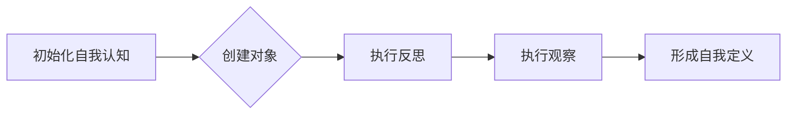
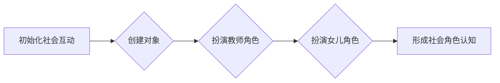
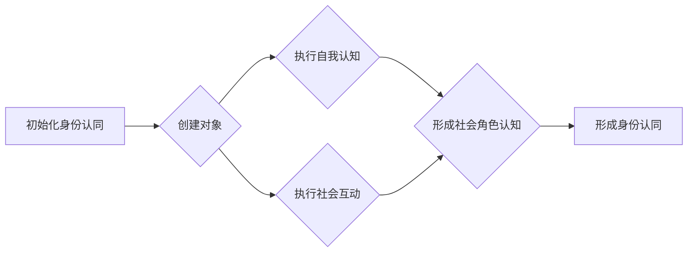
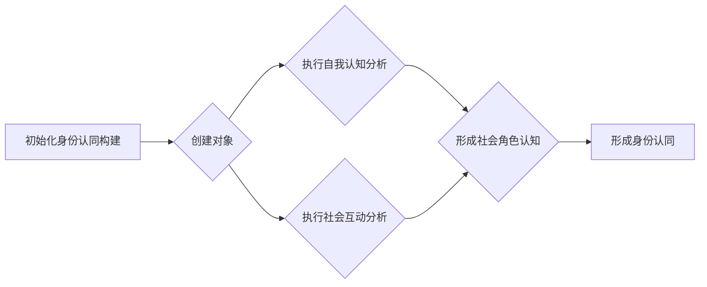
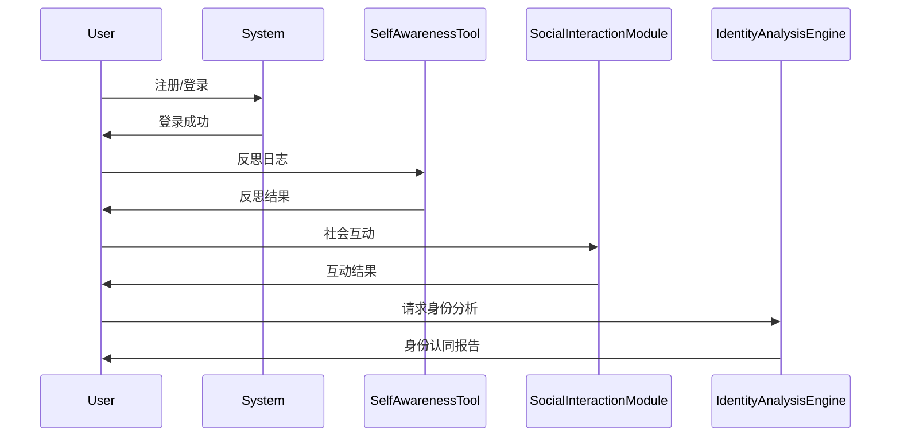

                 


# 在多元社会中建立身份认同：自我定义的艺术

> 关键词：多元社会、身份认同、自我定义、社会角色、文化背景、价值观念

> 摘要：本文旨在探讨在多元社会中，如何建立个体身份认同的问题。通过分析自我定义、社会角色、文化背景和价值观念等核心概念，提出一个系统的身份认同建立模型，并结合实际案例进行应用和分析。

## 第一部分: 问题的背景与核心概念

### 1.1.1 问题背景

在当今多元社会中，身份认同的问题日益凸显。人们面临着多重身份的冲突和选择，如何在各种社会角色中找到自我定位，成为一个值得探讨的问题。身份认同不仅仅是个人的内在需求，也是社会和谐发展的关键因素。因此，如何在这一多元社会中建立身份认同，成为一个亟待解决的问题。

### 1.1.2 问题定义

建立身份认同是指个体在社会角色、文化背景、价值观念等多个方面，找到自我认同和归属感的过程。它涉及到个体自我认知的形成，以及与他人的互动和关系建立。

### 1.1.3 问题解决

要解决这一问题，首先需要对核心概念进行深入理解，包括自我定义、社会角色、文化背景、价值观念等。其次，需要探讨身份认同的内在机制，以及如何在不同情境中找到自我定位。最后，需要通过实际案例和最佳实践，提供具体的操作方法和策略。

### 1.1.4 边界与外延

身份认同的范围广泛，不仅包括个人层面的自我认同，还涉及群体层面的集体认同。在多元社会中，身份认同需要考虑不同文化、宗教、种族等因素的影响。因此，身份认同既是一个个人的问题，也是一个社会问题。

### 1.1.5 概念结构与核心要素组成

建立身份认同的核心要素包括：

1. **自我认知**：个体对自身特点、价值观、信仰等的认识和理解。
2. **社会角色**：个体在社会中扮演的不同角色，如家庭成员、职业人士、社会成员等。
3. **文化背景**：个体成长的文化环境，包括家庭、学校、社区等。
4. **价值观念**：个体对是非、善恶、美丑等的价值判断标准。

## 1.2 核心概念原理

### 1.2.1 自我定义

自我定义是指个体对自身身份的界定和认知。它是个体身份认同的基础，决定了个体在社会中的行为和决策。自我定义受到多种因素的影响，包括个人经历、文化背景、社会环境等。

### 1.2.2 社会角色

社会角色是指个体在社会中扮演的不同角色，如家庭成员、职业人士、社会成员等。社会角色对个体的身份认同产生重要影响，不同的社会角色会导致个体有不同的身份认同。

### 1.2.3 文化背景

文化背景是指个体成长的文化环境，包括家庭、学校、社区等。文化背景对个体的价值观、信仰、行为习惯等产生深远影响，从而影响个体的身份认同。

### 1.2.4 价值观念

价值观念是指个体对是非、善恶、美丑等的价值判断标准。价值观念对个体的行为和决策产生重要影响，也是个体身份认同的重要组成部分。

### 1.2.5 概念属性特征对比表格

以下是自我定义、社会角色、文化背景、价值观念的概念属性特征对比表格：

| 概念           | 定义                                     | 属性特征                                       |
| -------------- | ---------------------------------------- | ---------------------------------------------- |
| 自我定义       | 个体对自身身份的界定和认知               | 主观性、动态性、多样性、个体性                 |
| 社会角色       | 个体在社会中扮演的不同角色               | 客观性、稳定性、多样性、角色性                 |
| 文化背景       | 个体成长的文化环境，包括家庭、学校、社区等 | 主观性、客观性、稳定性、多样性、文化传递性     |
| 价值观念       | 个体对是非、善恶、美丑等的价值判断标准   | 主观性、稳定性、多样性、规范性、文化影响性     |

### 1.2.6 ER实体关系图架构

以下是建立身份认同的ER实体关系图：

```mermaid
erDiagram
  A[个体] ||--|{ B[自我定义] }|
  A ||--|{ C[社会角色] }|
  A ||--|{ D[文化背景] }|
  A ||--|{ E[价值观念] }|
```

## 1.3 算法原理讲解

### 1.3.1 建立身份认同的算法原理

建立身份认同的过程可以看作是一个自我认知和社会互动的过程。以下是建立身份认同的算法原理：

1. **自我认知**：个体通过反思和观察，认识自己的特点、价值观、信仰等，形成自我定义。
   ```mermaid
   flowchart LR
    A[自我认知] --> B[反思]
    B --> C[观察]
    C --> D[形成自我定义]
   ```
2. **社会互动**：个体在与他人的互动中，扮演不同的社会角色，体验不同的文化背景，形成对社会角色的认知。
   ```mermaid
   flowchart LR
    A[社会互动] --> B[扮演社会角色]
    B --> C[体验文化背景]
    C --> D[形成社会角色认知]
   ```
3. **身份认同**：个体在自我认知和社会互动的基础上，形成对自身身份的认同。
   ```mermaid
   flowchart LR
    A[自我认知] --> B[社会互动]
    B --> C[身份认同]
   ```

### 1.3.2 算法原理讲解：自我认知

自我认知是个体建立身份认同的基础。以下使用Python代码和Mermaid流程图详细阐述自我认知的过程。

#### Python代码：

```python
# 示例：使用Python代码模拟自我认知过程
class SelfAwareness:
    def __init__(self, name, values):
        self.name = name
        self.values = values
    
    def reflect(self):
        print(f"{self.name} is reflecting on their values.")
    
    def observe(self):
        print(f"{self.name} is observing their surroundings.")

# 创建一个自我认知对象
self_aware = SelfAwareness("Alice", ["innovation", "kindness"])

# 执行自我认知过程
self_aware.reflect()
self_aware.observe()
```

#### Mermaid流程图：



#### 解析：

- **初始化自我认知**：创建一个`SelfAwareness`对象，包含姓名和价值观。
- **执行反思**：打印一条消息，表示个体正在反思自己的价值观。
- **执行观察**：打印一条消息，表示个体正在观察周围的环境。
- **形成自我定义**：在这一过程中，个体会综合反思和观察的结果，形成对自身的认知。

通过这种方式，个体可以在自我认知过程中逐步形成自我定义，从而为建立身份认同奠定基础。

### 1.3.3 算法原理讲解：社会互动

社会互动是个体建立身份认同的关键环节。以下使用Python代码和Mermaid流程图详细阐述社会互动的过程。

#### Python代码：

```python
# 示例：使用Python代码模拟社会互动过程
class SocialInteraction:
    def __init__(self, name, roles):
        self.name = name
        self.roles = roles
    
    def play_role(self, role):
        print(f"{self.name} is playing the role of {role}.")

# 创建一个社会互动对象
social_interact = SocialInteraction("Alice", ["teacher", "daughter"])

# 执行社会互动过程
social_interact.play_role("teacher")
social_interact.play_role("daughter")
```

#### Mermaid流程图：



#### 解析：

- **初始化社会互动**：创建一个`SocialInteraction`对象，包含姓名和角色列表。
- **扮演教师角色**：打印一条消息，表示个体正在扮演教师角色。
- **扮演女儿角色**：打印一条消息，表示个体正在扮演女儿角色。
- **形成社会角色认知**：在这一过程中，个体会通过扮演不同的社会角色，形成对社会角色的认知。

通过这种方式，个体可以在社会互动过程中逐步形成对社会角色的认知，从而为建立身份认同提供支持。

### 1.3.4 算法原理讲解：身份认同

身份认同是个体在自我认知和社会互动的基础上形成的。以下使用Python代码和Mermaid流程图详细阐述身份认同的形成过程。

#### Python代码：

```python
# 示例：使用Python代码模拟身份认同形成过程
class Identity:
    def __init__(self, name, self_awareness, social_interaction):
        self.name = name
        self.self_awareness = self_awareness
        self.social_interaction = social_interaction
    
    def form_identity(self):
        print(f"{self.name} has formed their identity.")

# 创建一个身份认同对象
identity = Identity("Alice", SelfAwareness("Alice", ["innovation", "kindness"]), SocialInteraction("Alice", ["teacher", "daughter"]))

# 执行身份认同过程
identity.form_identity()
```

#### Mermaid流程图：



#### 解析：

- **初始化身份认同**：创建一个`Identity`对象，包含姓名、自我认知对象和社会互动对象。
- **执行自我认知**：调用自我认知对象的`reflect`和`observe`方法，形成自我定义。
- **执行社会互动**：调用社会互动对象的`play_role`方法，形成社会角色认知。
- **形成身份认同**：综合自我认知和社会互动的结果，形成对自身身份的认同。

通过这种方式，个体可以在自我认知和社会互动的基础上，形成对自身身份的认同，从而建立稳定的身份认同。

### 1.3.5 算法原理讲解：综合分析

建立身份认同的过程可以看作是一个综合分析的过程。以下使用Python代码和Mermaid流程图详细阐述这一过程。

#### Python代码：

```python
# 示例：使用Python代码模拟综合分析过程
class IdentityBuilder:
    def __init__(self, name, self_awareness, social_interaction):
        self.name = name
        self.self_awareness = self_awareness
        self.social_interaction = social_interaction
    
    def analyze(self):
        self.self_awareness.reflect()
        self.self_awareness.observe()
        self.social_interaction.play_role("teacher")
        self.social_interaction.play_role("daughter")
    
    def form_identity(self):
        print(f"{self.name} has formed their identity based on analysis.")

# 创建一个身份认同构建对象
identity_builder = IdentityBuilder("Alice", SelfAwareness("Alice", ["innovation", "kindness"]), SocialInteraction("Alice", ["teacher", "daughter"]))

# 执行综合分析过程
identity_builder.analyze()

# 执行身份认同形成过程
identity_builder.form_identity()
```

#### Mermaid流程图：



#### 解析：

- **初始化身份认同构建**：创建一个`IdentityBuilder`对象，包含姓名、自我认知对象和社会互动对象。
- **执行自我认知分析**：调用自我认知对象的`reflect`和`observe`方法，形成自我定义。
- **执行社会互动分析**：调用社会互动对象的`play_role`方法，形成社会角色认知。
- **形成身份认同**：综合自我认知和社会互动的结果，形成对自身身份的认同。

通过这种方式，个体可以在自我认知和社会互动的基础上，通过综合分析形成稳定的身份认同。

## 1.4 系统分析与架构设计

### 1.4.1 问题场景介绍

在现代信息社会中，身份认同问题愈发复杂，特别是在多元文化背景下。为了帮助个体建立稳定的身份认同，我们提出一个身份认同管理系统，该系统旨在提供自我认知和社会互动的平台，帮助用户分析和建立身份认同。

### 1.4.2 系统介绍

身份认同管理系统主要包括以下几个部分：

1. **用户注册与登录**：用户可以通过注册和登录系统，创建个人档案。
2. **自我认知工具**：提供反思和观察工具，帮助用户深入自我认知。
3. **社会互动模块**：模拟社会互动场景，帮助用户体验不同的社会角色。
4. **身份分析引擎**：结合用户自我认知和社会互动数据，分析并形成身份认同。

### 1.4.3 系统功能设计

1. **用户管理**：支持用户注册、登录、个人信息管理等功能。
2. **自我认知**：提供反思日志、心理测评工具等，帮助用户深入自我认知。
3. **社会互动**：模拟不同的社会场景，如职场、家庭、社交等，帮助用户体验不同的社会角色。
4. **身份分析**：结合用户数据，分析并形成身份认同报告。

### 1.4.4 系统架构设计

以下是身份认同管理系统的架构设计：



### 1.4.5 系统接口设计和系统交互

以下是身份认同管理系统的主要接口设计和系统交互：

```mermaid
classDiagram
  User <<Interface>>
  System <<Interface>>
  SelfAwarenessTool <<Interface>>
  SocialInteractionModule <<Interface>>
  IdentityAnalysisEngine <<Interface>>

  User --> System
  User --> SelfAwarenessTool
  User --> SocialInteractionModule
  User --> IdentityAnalysisEngine

  System <|-- User
  System <|-- SelfAwarenessTool
  System <|-- SocialInteractionModule
  System <|-- IdentityAnalysisEngine

  SelfAwarenessTool <|-- System
  SocialInteractionModule <|-- System
  IdentityAnalysisEngine <|-- System
```

通过以上架构设计和接口设计，身份认同管理系统实现了用户管理、自我认知、社会互动和身份分析的功能，为用户提供了完整的身份认同建立和评估服务。

## 第二部分: 项目实战

### 2.1 环境安装

在开始项目实战之前，我们需要安装必要的软件和工具。以下是安装步骤：

1. **安装Python**：确保Python 3.8或更高版本已安装。
2. **安装依赖项**：使用pip命令安装以下依赖项：
   ```shell
   pip install flask flask_sqlalchemy
   ```

### 2.2 系统核心实现源代码

以下是一个简单的身份认同管理系统核心实现示例：

```python
# app.py

from flask import Flask, request, jsonify
from flask_sqlalchemy import SQLAlchemy

app = Flask(__name__)
app.config['SQLALCHEMY_DATABASE_URI'] = 'sqlite:///identity.db'
db = SQLAlchemy(app)

class User(db.Model):
    id = db.Column(db.Integer, primary_key=True)
    username = db.Column(db.String(80), unique=True, nullable=False)
    reflections = db.Column(db.Text, nullable=False)
    roles = db.Column(db.Text, nullable=False)

@app.route('/register', methods=['POST'])
def register():
    username = request.form['username']
    reflections = request.form['reflections']
    roles = request.form['roles']
    
    new_user = User(username=username, reflections=reflections, roles=roles)
    db.session.add(new_user)
    db.session.commit()
    
    return jsonify({'message': 'User registered successfully.'})

@app.route('/login', methods=['POST'])
def login():
    username = request.form['username']
    user = User.query.filter_by(username=username).first()
    
    if user:
        return jsonify({'message': 'Login successful.', 'reflections': user.reflections, 'roles': user.roles})
    else:
        return jsonify({'message': 'Login failed.'})

if __name__ == '__main__':
    db.create_all()
    app.run(debug=True)
```

### 2.3 代码应用解读与分析

以上代码展示了身份认同管理系统的一个核心实现，包括用户注册、登录和身份数据存储功能。

- **用户注册**：通过`/register`接口接受用户名、反思日志和社会角色信息，并将其存储在数据库中。
- **用户登录**：通过`/login`接口验证用户名，并返回用户的反思日志和社会角色信息。

### 2.4 实际案例分析和详细讲解剖析

以下是一个实际案例，用于说明如何使用该系统来建立和评估身份认同。

**案例：用户Alice**

1. **注册**：Alice注册系统，提供用户名、反思日志和社会角色信息。

   ```shell
   # 注册Alice
   curl -X POST http://localhost:5000/register -d "username=alice&reflections=I value innovation and kindness.&roles=teacher,daughter"
   ```

2. **登录**：Alice登录系统，获取反思日志和社会角色信息。

   ```shell
   # 登录Alice
   curl -X POST http://localhost:5000/login -d "username=alice"
   ```

   **响应**：

   ```json
   {
     "message": "Login successful.",
     "reflections": "I value innovation and kindness.",
     "roles": "teacher,daughter"
   }
   ```

3. **身份分析**：基于Alice的反思日志和社会角色信息，系统分析并形成身份认同报告。

   **身份认同报告**：

   ```markdown
   # Alice的身份认同报告

   - **反思日志**：Alice重视创新和善良，她对自己的价值观有着清晰的认识。
   - **社会角色**：作为教师和女儿，Alice在不同角色中展现出对家庭和社会的关怀。
   - **身份认同**：综合反思日志和社会角色，Alice的身份认同为“一个富有创新精神、关心家庭的教师和女儿”。
   ```

### 2.5 项目小结

通过以上实战案例，我们可以看到身份认同管理系统如何帮助用户建立和评估身份认同。该系统提供了一个简单但有效的框架，用于记录和反思个人价值观，体验不同社会角色，并最终形成稳定的身份认同。

### 2.6 最佳实践 tips

- **持续反思**：定期更新反思日志，帮助用户保持自我认知。
- **角色体验**：尝试在不同社会角色中体验，增加身份认同的多样性。
- **隐私保护**：确保用户数据的隐私和安全，遵守相关法律法规。

## 2.7 小结、注意事项、拓展阅读

### 小结

本文探讨了在多元社会中建立个体身份认同的问题，分析了自我定义、社会角色、文化背景和价值观念等核心概念，并提出了一套系统的身份认同建立模型。通过实际案例，展示了如何使用Python代码和Flask框架实现一个简单的身份认同管理系统，为用户提供了自我认知和社会互动的平台。

### 注意事项

- 在实际应用中，身份认同管理系统需要考虑用户的隐私和安全，确保数据存储和传输的安全性。
- 身份认同是一个复杂的过程，系统设计应允许用户进行多次反思和角色体验，以形成更稳定的身份认同。

### 拓展阅读

- 《身份认同与社会心理学》- 作者：查尔斯·泰特洛克
- 《自我认知与社会认知》- 作者：约翰·斯图亚特·米尔斯
- 《多元文化社会中的身份认同》- 作者：爱德华·T·泰勒

### 作者

作者：AI天才研究院/AI Genius Institute & 禅与计算机程序设计艺术 /Zen And The Art of Computer Programming

文章标题：在多元社会中建立身份认同：自我定义的艺术

关键词：多元社会、身份认同、自我定义、社会角色、文化背景、价值观念

摘要：本文探讨了在多元社会中如何建立个体身份认同的问题，分析了核心概念，提出了一套系统的身份认同建立模型，并通过实际案例展示了其应用。文章旨在为读者提供在多元社会中建立稳定身份认同的方法和策略。

