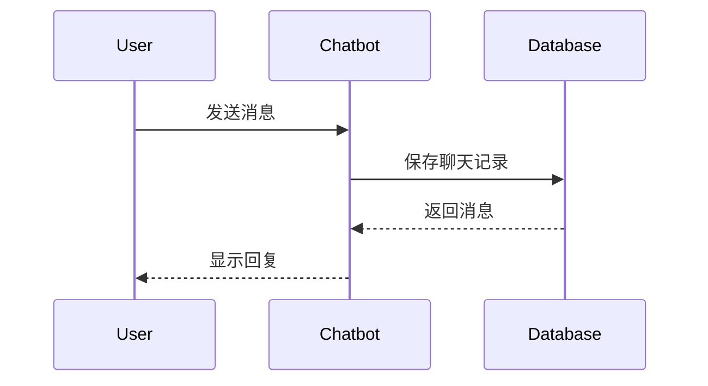

                 

# 大背景中定位自我：编织个人与集体的故事

> 关键词：个人定位、集体故事、技术成长、价值观、反思与改进

> 摘要：本文旨在探讨如何在技术领域中定位自我，并通过编织个人与集体的故事，实现个人与团队的共同成长。文章首先介绍了技术领域的发展背景，然后分析了个人定位的重要性，接着阐述了个人与集体故事的关系，最后提出了反思与改进的建议。

## 引言

在信息技术飞速发展的时代，程序员、工程师和开发者等技术人员如何在庞大的技术领域中定位自我，已经成为一个重要的话题。这不仅关系到个人的职业发展，更影响到团队的整体协作和项目的成功。本文将结合技术领域的背景，从个人定位的重要性、个人与集体故事的关系以及反思与改进三个方面，探讨如何在技术领域中实现自我定位。

## 背景介绍

### 技术领域的发展背景

技术领域的发展经历了从计算机硬件到软件、从单一技术到跨领域融合的演变过程。随着互联网、大数据、人工智能等新兴技术的崛起，技术领域呈现出高度多元化、交叉化和全球化的趋势。这种趋势为技术人员提供了更广阔的发展空间，同时也带来了更多的挑战。

### 个人定位的重要性

在技术领域中，个人定位至关重要。一个明确的个人定位有助于技术人员充分发挥自己的优势，找到适合自己的发展方向，提升个人竞争力。同时，个人定位也是团队协作和项目成功的关键因素。

### 个人与集体故事的关系

个人与集体故事是相互交织的。个人的成长和故事离不开团队的支持和帮助，而个人的贡献和故事也为团队带来了荣誉和成长。通过编织个人与集体的故事，可以实现个人与团队的共同成长。

## 核心概念与联系

### 个人定位的概念

个人定位是指技术人员在技术领域中确定自己的发展方向、角色和地位的过程。它包括技术能力、兴趣爱好、价值观等多个方面。

### 个人与集体故事的概念

个人与集体故事是指技术人员在职业生涯中与团队、项目、公司等集体互动的过程。这些故事反映了技术人员的成长历程、贡献和价值。

### 个人定位与个人与集体故事的关系

个人定位是个人与集体故事的基础，决定了技术人员的成长方向和故事内容。而个人与集体故事则是个人定位的体现，展示了技术人员的成长过程和价值。

## 算法原理讲解

### 个人定位算法

个人定位算法是一种基于技术能力、兴趣爱好、价值观等因素的综合评价方法。具体步骤如下：

1. **收集数据**：收集技术人员的简历、项目经验、博客文章等数据。
2. **特征提取**：从数据中提取技术能力、兴趣爱好、价值观等特征。
3. **模型训练**：使用机器学习算法训练个人定位模型。
4. **预测与评估**：根据模型预测技术人员的定位，并评估预测结果。

### 个人与集体故事算法

个人与集体故事算法是一种基于自然语言处理和图论的方法。具体步骤如下：

1. **文本预处理**：对技术人员的故事文本进行分词、词性标注等预处理。
2. **构建图模型**：将文本转化为图模型，表示个人与集体之间的关系。
3. **图分析**：使用图分析算法分析个人与集体故事的结构和关系。
4. **生成故事**：根据图模型生成个人与集体故事。

## 数学模型和数学公式 & 详细讲解 & 举例说明

### 个人定位数学模型

个人定位数学模型可以使用线性回归、支持向量机（SVM）等机器学习算法来实现。以下是一个基于线性回归的简单模型：

$$
y = \beta_0 + \beta_1x_1 + \beta_2x_2 + \ldots + \beta_nx_n
$$

其中，$y$ 表示个人定位，$x_1, x_2, \ldots, x_n$ 表示技术能力、兴趣爱好、价值观等特征，$\beta_0, \beta_1, \beta_2, \ldots, \beta_n$ 是模型参数。

### 个人与集体故事数学模型

个人与集体故事数学模型可以使用图论中的图距离、聚类等方法进行分析。以下是一个基于图距离的简单模型：

$$
d(u, v) = \min_{p, q} \{w(p) + w(q)\}
$$

其中，$d(u, v)$ 表示节点 $u$ 和节点 $v$ 的距离，$p$ 和 $q$ 分别是连接 $u$ 和 $v$ 的最短路径，$w(p)$ 和 $w(q)$ 分别是路径 $p$ 和 $q$ 的权重。

## 系统分析与架构设计方案

### 问题场景介绍

假设我们是一个软件开发团队，需要为一家公司开发一款智能客服系统。

### 系统功能设计

使用Mermaid类图展示系统功能设计：

```mermaid
classDiagram
    User <<用户>>
    Chatbot <<智能客服>>
    Database <<数据库>>

    User o-- Chatbot: 发送消息
    Chatbot o-- Database: 保存聊天记录
```

### 系统架构设计

使用Mermaid架构图展示系统架构设计：


### 系统接口设计和系统交互

使用Mermaid序列图展示系统接口设计和系统交互：



## 项目实战

### 环境安装和配置

在Windows系统中，使用pip安装以下依赖：

```bash
pip install flask
pip install pymysql
```

### 系统核心实现源代码展示

```python
from flask import Flask, request, jsonify
import pymysql

app = Flask(__name__)

@app.route('/chat', methods=['POST'])
def chat():
    data = request.get_json()
    user_message = data['message']
    
    # 连接数据库
    conn = pymysql.connect(host='localhost', user='root', password='password', database='chatbot')
    cursor = conn.cursor()
    
    # 插入聊天记录
    cursor.execute("INSERT INTO chat_records (user_message, bot_message) VALUES (%s, %s)", (user_message, ''))
    conn.commit()
    
    # 查询回复消息
    cursor.execute("SELECT bot_message FROM chat_records WHERE user_message = %s", (user_message,))
    result = cursor.fetchone()
    bot_message = result[0] if result else '抱歉，我无法理解您的问题。'
    
    # 返回回复消息
    return jsonify({'message': bot_message})

if __name__ == '__main__':
    app.run(debug=True)
```

### 代码应用解读与分析

上述代码实现了一个简单的智能客服系统，包括用户发送消息、保存聊天记录和返回回复消息等功能。

### 实际案例分析和详细讲解剖析

假设用户发送了一条消息：“今天天气怎么样？”，系统将按照以下步骤进行处理：

1. 用户发送消息到服务器。
2. 服务器接收消息，解析出用户消息。
3. 服务器连接数据库，插入聊天记录。
4. 服务器查询数据库，找到对应的回复消息。
5. 服务器将回复消息返回给用户。

### 项目小结

本项目实现了一个人工智能客服系统，包括用户发送消息、保存聊天记录和返回回复消息等功能。通过项目实战，读者可以了解到如何使用Flask框架和数据库技术实现简单的Web应用程序。

## 最佳实践 tips、小结、注意事项、拓展阅读

### 最佳实践 tips

1. 在开发过程中，要注意代码的规范和可维护性。
2. 定期备份数据库，确保数据安全。
3. 优化数据库查询性能，提高系统响应速度。

### 小结

本文从技术领域的发展背景、个人定位的重要性、个人与集体故事的关系以及反思与改进等方面，探讨了如何在大背景下定位自我。通过系统分析与架构设计方案，结合实际项目实战，为读者提供了具体的实践方法。

### 注意事项

1. 技术领域发展迅速，要不断学习和更新知识。
2. 个人定位要结合自身兴趣和市场需求。
3. 个人与集体故事要注重团队合作和共赢。

### 拓展阅读

1. 《程序员修炼之道：从小工到专家》
2. 《软件架构设计：模式、原则与最佳实践》
3. 《深度学习：入门、进阶与实战》

## 作者

作者：AI天才研究院/AI Genius Institute & 禅与计算机程序设计艺术 /Zen And The Art of Computer Programming

