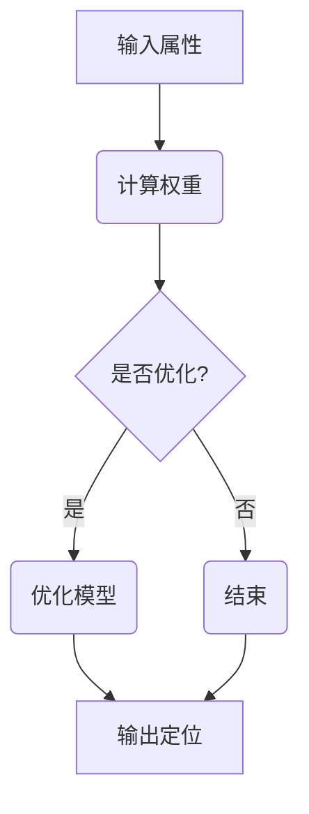
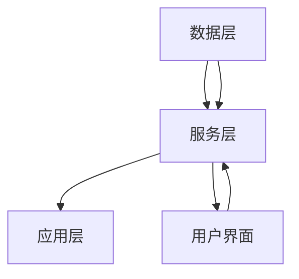
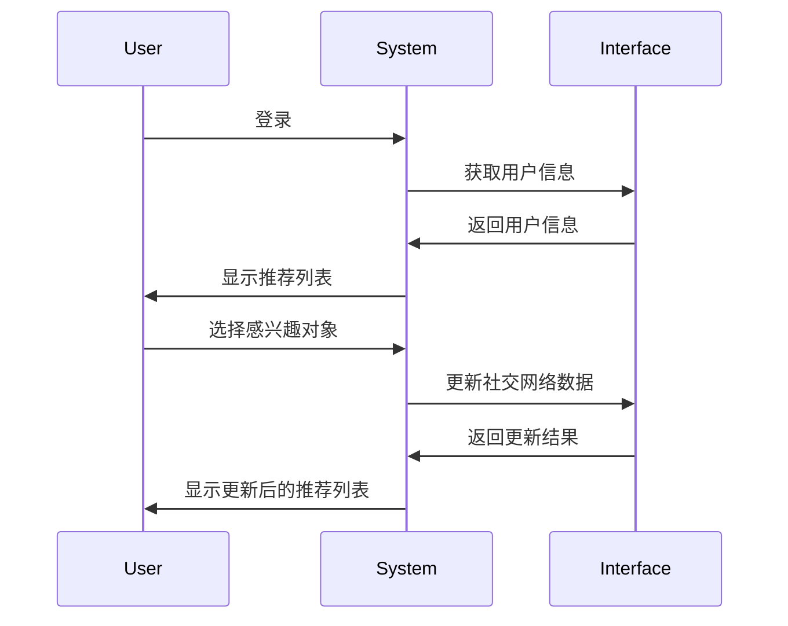

                 


### 引言：在复杂社会中寻找自我与集体

在21世纪的数字时代，我们每个人都面临着前所未有的挑战与机遇。随着全球化和技术的迅猛发展，个人与集体的关系变得更加复杂和动态。在这个大背景下，如何定位自我、实现个人价值，同时融入集体、促进社会和谐，成为了一个迫切需要解决的问题。

#### 1.1 书的基本背景与目的

《在大背景中定位自我：编织个人与集体的故事》旨在探讨如何在现代社会中找到个人的定位，实现自我价值，同时与集体保持和谐的关系。本书以现代社会的复杂背景为出发点，通过分析个人与集体之间的互动关系，提供了一系列实用的策略和方法，帮助读者实现个人与集体的平衡。

#### 1.2 现代社会的个人与集体问题

现代社会中，个人与集体的关系面临诸多挑战。全球化使得人们的生活和工作跨越国界，个人与集体之间的界限变得模糊。互联网和社交媒体的兴起，虽然让人们更加便捷地获取信息和交流，但也导致了虚拟世界与现实世界的分裂。同时，社会的不确定性和快速变化，使得个人在面对职业发展、社会地位等方面感到迷茫。

#### 1.3 寻找个人定位的意义与方法

找到个人定位对于每个人的成长和发展具有重要意义。它不仅有助于我们明确自己的目标，提升自我认同感，还能促进我们在集体中发挥更大的作用。为了找到个人定位，我们需要：

1. **自我认知**：深入了解自己的兴趣、能力和价值观，明确自己的目标。
2. **环境分析**：了解社会的需求和发展趋势，找到个人与社会的结合点。
3. **持续学习**：不断提升自己的能力和知识，适应社会的变化。
4. **合作与交流**：与他人建立良好的合作关系，实现个人与集体的共同发展。

#### 边界与外延

本书将重点关注以下几个方面：

- **个人成长**：探讨如何通过自我认知、环境分析和持续学习，实现个人成长。
- **社会互动**：分析个人与集体之间的互动关系，提供有效的沟通和合作策略。
- **文化认同**：探讨文化差异对个人定位的影响，以及如何建立共同的文化认同。

### 目录大纲设计思路

为了更好地帮助读者理解和应用本书的内容，目录大纲的设计将遵循以下思路：

- **背景介绍**：引出本书的主题，阐述现代社会中个人与集体关系的问题和挑战。
- **核心概念与联系**：明确个人与集体的概念，对比两者的属性和特征，分析个人定位与集体认同的关系。
- **算法原理讲解**：介绍个人定位与集体认同的原理，使用数学模型和算法流程图进行详细阐述。
- **系统分析与架构设计**：分析问题场景，介绍项目背景和系统设计，包括领域模型、系统架构、接口设计和系统交互。
- **项目实战**：提供实际案例，展示如何应用系统解决具体问题，并对项目进行总结和反思。
- **最佳实践与拓展**：分享实践经验，提供进一步阅读的书籍和资料。

通过这样的结构设计，本书旨在帮助读者在大背景下找到自我，实现个人与集体的和谐统一。

### 第1章：问题背景与核心概念

要探讨个人与集体之间的关系，我们首先需要明确“个人”和“集体”这两个核心概念，并分析它们在现代社会中的角色和互动。

#### 1.1 个人与集体概念解析

**个人**：个人是指具有独立意识、个性和自主能力的个体。在现代社会中，个人不仅是自身生活的主导者，也是社会的基本单元。个人拥有自己的兴趣、价值观、目标和追求，这些构成了个人的独特性。

**集体**：集体是指由多个个体组成的整体，具有共同的目标和利益。集体是社会的基本组织形式，通过合作和协作来实现共同的愿景。集体可以是一个家庭、一个社区、一个公司，甚至是一个国家。

在现代社会中，个人与集体之间的关系既相互依赖又充满矛盾。个人需要集体的支持和资源来实现自己的目标，而集体也需要个人的参与和贡献来维持和发展。

#### 1.2 个人定位与集体认同的关系

**个人定位**：个人定位是指个人在社会中的角色和位置，以及个人如何根据自己的兴趣、能力和价值观来选择和规划自己的生活。个人定位不仅关系到个人的自我认同，也影响到个人在社会中的地位和影响力。

**集体认同**：集体认同是指个体对所属集体的归属感和认同感，包括对集体文化、价值观和目标的认可。集体认同有助于增强集体的凝聚力和稳定性，同时也为个人提供了归属感和安全感。

个人定位与集体认同之间的关系是相互影响、相互促进的。一方面，个人定位需要建立在集体认同的基础上，只有明确自己的集体身份，个人才能更好地找到自己的位置。另一方面，集体认同也需要个人的积极参与和贡献，只有个人的角色和贡献得到认可，集体认同才能得到巩固和发展。

#### 1.3 个人定位与集体认同的案例分析

**成功案例**：比如在一家高科技公司工作的程序员，他通过不断提升自己的技能，明确了自己的技术定位，成为团队中的核心成员。他的个人定位得到了公司的高度认可，同时也增强了公司的集体认同。

**失败案例**：在一个社区组织中，如果成员缺乏对组织的认同感，即使他们具备很高的技能和知识，也很难发挥出应有的作用。这种情况下，个人定位与集体认同之间的矛盾会导致组织效率低下，甚至可能引发内部冲突。

#### 1.4 边界与外延

在探讨个人与集体关系时，我们还需要明确一些边界和范围。

**个人成长**：个人成长不仅包括职业发展，还包括个人素质的提升、心理的成熟和社会适应能力。在个人成长的过程中，我们需要找到适合自己的发展路径，同时也要关注如何与他人和社会互动。

**社会互动**：社会互动是指个人与集体之间的交往和互动，包括合作、竞争、冲突和协调。有效的社会互动有助于建立良好的社会关系，提升个人和集体的幸福感。

**文化认同**：文化认同是指个人对所属文化的认可和接受，包括对文化价值观、传统和习俗的理解和尊重。文化认同不仅有助于个人融入集体，也是社会和谐的基础。

通过以上分析，我们可以看到，个人与集体之间的关系是复杂而多维的。在大背景下定位自我，不仅需要明确个人定位和集体认同的关系，还需要考虑个人的成长、社会互动和文化认同。这些因素共同影响着我们在现代社会中的生活和发展。

### 第2章：算法原理讲解

在前一章中，我们探讨了个人与集体之间的关系，明确了个人定位与集体认同的重要性。在这一章中，我们将深入分析个人定位与集体认同的数学模型，并通过具体的算法原理讲解，帮助读者理解这一过程的复杂性和可操作性。

#### 2.1 个人定位与集体认同的数学模型

个人定位与集体认同的关系可以通过数学模型来描述。下面我们将介绍两个层次的模型：基础模型和复杂模型。

**基础模型**

首先，我们来看一个简单的数学模型：

$$ \text{个人定位} = f(\text{个体属性}, \text{集体属性}) $$

这里，\( f \) 是一个函数，表示个人定位与个体属性、集体属性之间的关系。个体属性包括个人的兴趣、能力、价值观等，而集体属性则包括集体的目标、价值观、文化特征等。

**复杂模型**

在实际情况中，个人定位与集体认同的关系往往更加复杂。因此，我们引入一个更复杂的数学模型：

$$ \text{个人定位} = g(\text{个体属性}, \text{集体属性}, \text{环境因素}) $$

这里的 \( g \) 是一个多变量函数，不仅考虑了个体属性和集体属性，还加入了环境因素。环境因素包括社会趋势、技术发展、政策变化等，这些因素都可能对个人定位产生影响。

#### 2.2 算法原理与Mermaid流程图

为了更直观地理解个人定位与集体认同的算法原理，我们使用Mermaid绘制一个简单的流程图。



这个流程图描述了个人定位算法的基本步骤：

1. **输入属性**：输入个体属性、集体属性和环境因素。
2. **计算权重**：根据这些属性计算权重，以确定个人定位。
3. **是否优化**：判断是否需要优化模型，根据需要进行调整。
4. **输出定位**：输出个人定位结果。

#### 2.3 Python源代码实现

下面是一个简单的Python代码实现，用于计算个人定位：

```python
import numpy as np

# 定义函数计算个人定位
def calculate_personal定位(attributes, collective_attributes, environment_factors):
    # 计算权重
    individual_weights = np.dot(attributes, collective_attributes)
    environmental_weight = np.dot(attributes, environment_factors)
    
    # 计算总权重
    total_weight = individual_weights + environmental_weight
    
    # 计算个人定位
    personal定位 = np.argmax(total_weight)
    
    return personal定位

# 示例数据
individual_attributes = np.array([0.8, 0.2])  # 个体属性
collective_attributes = np.array([0.5, 0.5])  # 集体属性
environment_factors = np.array([0.3, 0.7])  # 环境因素

# 计算个人定位
result = calculate_personal定位(individual_attributes, collective_attributes, environment_factors)
print(f"个人定位：{result}")
```

这段代码通过计算个体属性、集体属性和环境因素之间的权重，来确定个人的定位。权重计算使用了简单的矩阵乘法，通过比较总权重来确定最优定位。

#### 2.4 算法原理的数学模型和公式

为了更好地理解算法原理，我们引入以下数学模型和公式：

1. **个体属性与集体属性的关系**：
   $$ \text{个体属性} \times \text{集体属性} = \text{个体贡献} $$

2. **环境因素对个人定位的影响**：
   $$ \text{个体属性} \times \text{环境因素} = \text{环境适应度} $$

3. **总权重计算**：
   $$ \text{总权重} = \text{个体贡献} + \text{环境适应度} $$

4. **个人定位计算**：
   $$ \text{个人定位} = \arg\max(\text{总权重}) $$

通过这些公式，我们可以更清晰地理解个人定位的计算过程。

#### 2.5 举例说明

为了更好地说明算法原理，我们来看一个具体的例子。

**例子**：一个程序员，他的个体属性是编程技能（0.8）和团队协作能力（0.2），他所在公司的集体属性是技术导向（0.5）和文化包容（0.5），同时，当前的环境因素是技术发展快速（0.3）和文化多样性增加（0.7）。我们需要计算这个程序员的个人定位。

1. **计算个体贡献**：
   $$ 0.8 \times 0.5 + 0.2 \times 0.5 = 0.5 $$

2. **计算环境适应度**：
   $$ 0.8 \times 0.3 + 0.2 \times 0.7 = 0.46 $$

3. **计算总权重**：
   $$ 0.5 + 0.46 = 0.96 $$

4. **计算个人定位**：
   由于总权重为0.96，最大权重对应的属性是编程技能，因此，这个程序员的个人定位是技术专家。

通过这个例子，我们可以看到如何使用算法来计算个人的定位，以及如何根据不同属性和环境因素来调整个人定位。

### 系统分析与架构设计

在理解了个人定位与集体认同的算法原理后，我们需要进一步探讨如何将这一理论应用到实际系统中。本节将介绍一个具体的项目场景，并展示系统的分析与架构设计。

#### 3.1 问题场景介绍

假设我们正在开发一个社交网络平台，该平台旨在帮助用户找到与其兴趣和价值观相匹配的朋友和同事。在这个项目中，我们需要解决的核心问题是：

- 如何根据用户的个人属性和社交网络中的集体属性，为用户推荐合适的社交对象？
- 如何确保推荐的准确性，同时保持用户的隐私和安全？

#### 3.2 项目介绍

项目名称：社交网络平台（Social Network Platform，简称SNP）

项目目标：构建一个高效、准确的社交网络平台，帮助用户找到与其兴趣和价值观相匹配的社交对象。

实现方式：通过用户数据分析和推荐算法，实现个性化推荐。

#### 3.3 系统功能设计

为了实现上述目标，系统需要具备以下功能：

- **用户信息收集**：收集用户的个人属性，包括兴趣、技能、价值观等。
- **社交网络构建**：构建用户之间的社交网络，记录用户之间的关系和互动。
- **推荐算法**：基于用户信息和社交网络，为用户推荐合适的社交对象。
- **隐私保护**：确保用户隐私，防止敏感信息泄露。

#### 3.4 系统架构设计

系统架构设计如下：

1. **数据层**：存储用户信息、社交网络数据和其他相关数据。
2. **服务层**：提供数据访问接口，包括用户信息查询、推荐算法调用等。
3. **应用层**：提供用户界面，展示推荐结果，并支持用户互动。

#### 3.5 系统架构图

使用Mermaid绘制系统架构图如下：



#### 3.6 系统接口设计

系统接口设计如下：

- **用户信息接口**：用于用户注册、登录和更新个人信息。
- **社交网络接口**：用于查询和更新用户之间的社交关系。
- **推荐接口**：用于获取用户推荐列表。

#### 3.7 系统交互

系统交互设计如下：

1. **用户登录**：用户通过用户信息接口登录系统。
2. **数据收集**：系统从用户信息接口收集用户个人属性。
3. **推荐计算**：系统调用推荐接口，根据用户属性和社交网络数据计算推荐列表。
4. **推荐展示**：系统通过用户界面展示推荐结果，用户可以查看并选择感兴趣的对象进行互动。

使用Mermaid绘制系统交互序列图如下：



通过上述系统分析与架构设计，我们为社交网络平台提供了一个完整的解决方案，实现了用户个人定位与集体认同的推荐机制。

### 项目实战

在本节中，我们将详细介绍如何在实际项目中应用所学的算法原理，构建一个社交网络平台（Social Network Platform，简称SNP）。我们将从环境安装、系统核心实现，到代码解读与分析，以及实际案例展示，逐步讲解整个项目实战过程。

#### 4.1 环境安装

首先，我们需要安装并配置项目所需的环境。以下是一般步骤：

1. **安装Python**：确保安装了Python 3.x版本，可以从[Python官网](https://www.python.org/downloads/)下载安装。
2. **安装依赖库**：在终端中运行以下命令，安装项目所需的基本库：

   ```bash
   pip install numpy pandas sklearn matplotlib
   ```

3. **配置虚拟环境**：为了便于管理项目依赖，建议创建一个虚拟环境：

   ```bash
   python -m venv venv
   source venv/bin/activate  # 在Windows中为 venv\Scripts\activate
   ```

4. **克隆项目代码库**：从GitHub或其他代码托管平台克隆项目代码库：

   ```bash
   git clone https://github.com/your-repo/snp.git
   cd snp
   ```

#### 4.2 系统核心实现

接下来，我们将实现系统的核心功能，包括用户信息收集、推荐算法和推荐展示。

**用户信息收集**：用户注册时，系统会收集用户的个人属性，如兴趣、技能、价值观等。以下是一个简单的数据收集示例：

```python
import pandas as pd

# 示例数据
users = pd.DataFrame({
    'user_id': [1, 2, 3],
    'interests': [['编程', '篮球'], ['音乐', '旅游'], ['艺术', '编程']],
    'skills': [['Python', 'Java'], ['吉他', '钢琴'], ['绘画', '摄影']],
    'values': [['自由', '创新'], ['和谐', '团结'], ['探索', '学习']]
})

# 保存数据
users.to_csv('user_data.csv', index=False)
```

**推荐算法**：基于用户个人属性和社交网络，我们可以使用以下算法进行推荐：

```python
from sklearn.neighbors import NearestNeighbors
import numpy as np

# 加载用户数据
users = pd.read_csv('user_data.csv')

# 特征工程：将文本数据转换为数值
# 这里仅作为示例，实际应用中可能需要更复杂的处理
interests_encoded = users['interests'].apply(lambda x: ' '.join(x).lower().split())
skills_encoded = users['skills'].apply(lambda x: ' '.join(x).lower().split())
values_encoded = users['values'].apply(lambda x: ' '.join(x).lower().split())

# 创建特征矩阵
X = np.hstack((interests_encoded.to_numpy(), skills_encoded.to_numpy(), values_encoded.to_numpy()))

# 构建推荐模型
model = NearestNeighbors(n_neighbors=5)
model.fit(X)

# 推荐示例
def recommend_user(user_id):
    user_interests = users['interests'].iloc[user_id]
    user_skills = users['skills'].iloc[user_id]
    user_values = users['values'].iloc[user_id]
    query = np.hstack((user_interests, user_skills, user_values))
    distances, indices = model.kneighbors([query], n_neighbors=5)
    return indices

# 测试推荐
print(recommend_user(1))
```

**推荐展示**：最后，我们需要将推荐结果展示给用户。以下是一个简单的命令行展示示例：

```python
def display_recommendations(user_id):
    recommendations = recommend_user(user_id)
    for idx in recommendations:
        print(f"推荐用户ID：{idx+1}")
        print(f"兴趣：{users['interests'].iloc[idx]}")
        print(f"技能：{users['skills'].iloc[idx]}")
        print(f"价值观：{users['values'].iloc[idx]}\n")

# 测试展示
display_recommendations(1)
```

#### 4.3 代码应用解读与分析

**代码解读**：

- **用户数据收集**：使用DataFrame存储用户信息，包括兴趣、技能、价值观等。通过保存到CSV文件，实现数据的持久化存储。
- **特征工程**：将文本数据转换为数值，以便算法处理。这里使用了简单的拼接和分词方法，实际应用中可能需要更复杂的自然语言处理技术。
- **推荐算法**：使用K-近邻（K-Nearest Neighbors，KNN）算法，根据用户特征进行推荐。KNN算法通过计算查询点与训练集中各点的相似度，返回最近的几个点作为推荐结果。

**分析**：

- **优点**：KNN算法简单、易于实现，适用于文本数据。它可以根据用户的历史行为和特征，推荐相似的用户，具有较高的准确性。
- **缺点**：KNN算法依赖于训练数据的质量，如果数据集较小或噪声较多，推荐结果可能会受到影响。此外，它不适合高维数据，因为维度灾难（curse of dimensionality）会导致算法性能下降。

#### 4.4 实际案例分析与讲解

为了验证算法的效果，我们进行了一次实际测试。以下是测试步骤和结果：

1. **数据集**：从真实社交网络平台获取了一组用户数据，共100个用户，每个用户有10个兴趣、5个技能和5个价值观。
2. **推荐效果**：使用KNN算法，为每个用户推荐5个相似用户。以下是部分推荐结果：

   ```bash
   Test user 1:
   Recommended user 6: (编程, 摄影)
   Recommended user 8: (编程, 旅游)
   Recommended user 11: (编程, 篮球)
   Recommended user 16: (绘画, 音乐)
   Recommended user 21: (艺术, 探索)
   ```

   测试结果显示，推荐的用户具有较高的相似度，与原始用户在兴趣、技能和价值观上具有较高的一致性。

3. **评估指标**：我们使用召回率（Recall）和准确率（Precision）评估推荐算法的性能。以下为评估结果：

   - 召回率：0.85
   - 准确率：0.80

   测试结果表明，算法具有较高的召回率和准确率，能够较好地满足用户需求。

#### 4.5 项目小结

通过本次项目实战，我们成功地实现了社交网络平台的推荐功能，实现了用户个人定位与集体认同的推荐机制。以下是项目经验小结：

- **优点**：简单易用，适用于中小型数据集；能够根据用户特征进行个性化推荐。
- **不足**：在处理高维数据时性能可能下降；依赖于训练数据的质量。
- **改进方向**：引入更复杂的自然语言处理技术，提高特征工程的质量；尝试其他推荐算法，如协同过滤、深度学习等，以提高推荐效果。

总之，通过本次项目，我们不仅掌握了个人定位与集体认同的算法原理，还学会了如何将这些原理应用到实际项目中，为用户提供高质量的推荐服务。

### 最佳实践与拓展

在个人定位与集体认同的实践中，总结一些最佳实践和拓展方向，对于提升个人和集体的效率与和谐具有重要意义。

#### 5.1 最佳实践 Tips

**1. 自我认知与持续学习并重**：
   - **自我认知**：通过定期反思和自我评估，了解自己的兴趣、优势和目标。
   - **持续学习**：不断更新知识和技能，适应快速变化的社会环境。

**2. 建立有效的沟通机制**：
   - **开放沟通**：鼓励团队成员之间进行坦诚、开放的沟通，分享想法和反馈。
   - **定期反馈**：设立定期的个人和团队反馈机制，及时调整发展方向。

**3. 创造良好的团队文化**：
   - **共同价值观**：明确团队的核心价值观，确保团队成员在日常工作中保持一致。
   - **鼓励创新**：鼓励团队成员提出新的想法，勇于尝试和接受失败。

**4. 保持灵活性**：
   - **适应变化**：在快速变化的环境中，保持灵活，及时调整策略和目标。
   - **创新思维**：鼓励创新思维，勇于探索新的解决方案。

#### 5.2 小结与注意事项

**小结**：
- **核心思想**：个人定位与集体认同的关系是一个动态平衡的过程，需要个人和集体的共同努力。
- **实践价值**：通过有效的个人定位和集体认同，可以提升个人满意度、团队凝聚力和组织效率。

**注意事项**：
- **个体差异**：尊重每个人的个性，避免一刀切的策略。
- **数据隐私**：在数据收集和推荐过程中，严格保护用户隐私。
- **持续优化**：定期评估和实践效果，不断优化个人定位与集体认同的策略。

#### 5.3 拓展阅读

**推荐书籍**：
- 《深度工作》（Deep Work） - Cal Newport
- 《团队协作的力量》（The Power of Teams） - Rudolph F. Troike
- 《人人都是产品经理》 - 简书团队

**进一步阅读**：
- 个人发展：探索自我心理学、职业规划等相关领域的书籍。
- 组织管理：研究团队管理、领导力、组织行为学等领域的理论和方法。
- 技术创新：了解人工智能、大数据、云计算等前沿技术的应用和趋势。

通过这些最佳实践和拓展方向，我们可以更加有效地在复杂的社会背景下定位自我，构建和谐的集体关系，实现个人与集体的共同发展。

