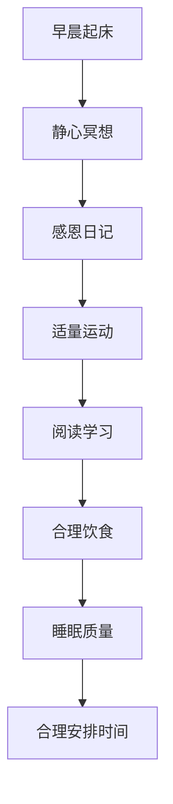

                 

# 在平凡中寻找超越：日常生活中的精神修行

## 关键词
精神修行、日常实践、内心平静、自我认知、情感管理、人际关系

## 摘要
在现代快节奏的生活中，人们往往感到压力重重，内心疲惫。本文旨在探讨如何在平凡的生活中寻找超越，通过精神修行来达到内心平静、自我认知的提升，并在此基础上建立和谐的人际关系。本文将从核心概念、实践方法、情境分析等多个维度展开，旨在为读者提供一条清晰的精神修行之路。

## 引言部分

### 第1章 引言

### 1.1 问题的背景和意义
在当今社会，随着科技的飞速发展和生活节奏的加快，人们的生活压力越来越大。许多人忙于工作和生活，忽视了内心的需求，导致焦虑、抑郁等心理问题的普遍存在。精神修行的目的是通过调整心态、提升自我认知，帮助人们找到内心的平衡与宁静。

### 1.2 书籍的定位和目标
本书旨在为那些渴望在平凡生活中寻找超越的人提供实用的方法和指导。通过介绍精神修行的核心概念和实践方法，帮助读者在日常生活中实践修行，提升生活质量。

### 1.3 读者对象
本书适合所有希望在日常生活中寻求内心平静和自我提升的读者，无论是职场人士、学生还是家庭主妇，都能从中受益。

## 核心概念与联系

### 第2章 核心概念与联系

### 2.1 精神修行的定义与意义
精神修行是指通过一系列的内心探索和实践，以达到提升自我意识、增强心理素质、实现内心平和的过程。其意义在于帮助我们应对生活中的压力和挑战，提高生活质量。

### 2.2 平凡与超越的辨析
平凡是指日常生活和工作的常态，超越则是精神层面上的提升。在平凡中寻找超越，意味着在日常生活中实践精神修行，从而实现自我提升。

### 2.3 精神修行的关键要素
精神修行的关键要素包括自我认知、情感管理、习惯培养、内心平静和人际关系。这些要素相互作用，共同促进个体的成长和发展。

### 2.3.1 Mermaid流程图：精神修行的过程与阶段

## 方法与实践

### 第3章 方法与实践

### 3.1 日常生活中的修行方法
在日常生活中，我们可以通过以下方法来实践精神修行：

- **早晨起床**：进行简单的拉伸运动和深呼吸，唤醒身体和心灵。
- **静心冥想**：每天花10-15分钟进行冥想，帮助内心平静。
- **感恩日记**：记录每天的感恩事项，培养乐观心态。
- **适量运动**：每周进行3-5次运动，增强身体素质。
- **阅读学习**：阅读有益的书籍和文章，丰富知识储备。
- **合理饮食**：保持健康的饮食习惯，远离过度油腻和刺激性食物。
- **睡眠质量**：确保每天有7-8小时的充足睡眠，保持精力充沛。
- **合理安排时间**：制定合理的时间表，提高效率，减少压力。

### 3.1.1 Mermaid流程图：日常生活中的修行方法

### 3.2 修行实例分享
以下是一个读者在实际生活中实践精神修行的实例：

**实例**：李先生是一位忙碌的职场人士，经常感到压力山大。通过实践本书介绍的精神修行方法，他开始每天早晨起床后进行冥想，并在晚上睡前写下感恩日记。几个月后，他的心态变得更加平和，工作效率也显著提升。

### 3.3 实践步骤指导
1. **确定修行目标**：明确自己想要通过修行达到的目标，如提升心理健康、提高工作效率等。
2. **制定修行计划**：根据自己的时间和精力，制定可行的修行计划。
3. **持之以恒**：坚持每天进行修行实践，形成习惯。
4. **记录与反思**：记录修行过程中的感受和变化，定期进行反思。

## 情境分析

### 第4章 情境分析

### 4.1 工作情境
在工作场合，精神修行可以帮助我们更好地应对压力和挑战。以下是一些建议：

- **时间管理**：合理安排工作时间和休息时间，避免过度劳累。
- **情绪管理**：学会调整自己的情绪，保持积极向上的心态。
- **团队合作**：通过沟通和协作，建立和谐的工作关系。

### 4.2 家庭生活
在家庭生活中，精神修行可以帮助我们建立更加和谐的家庭关系。以下是一些建议：

- **亲子关系**：通过有效的沟通和陪伴，增进与孩子的关系。
- **夫妻关系**：学会倾听和理解，增强夫妻之间的默契。
- **家庭氛围**：营造一个温馨、和谐的家庭氛围，让每个家庭成员都感到快乐和满足。

### 4.3 社交场合
在社交场合，精神修行可以帮助我们更好地与他人相处。以下是一些建议：

- **礼貌待人**：尊重他人，以礼貌的态度对待每个人。
- **倾听他人**：学会倾听他人的意见和需求，增强人际沟通。
- **控制情绪**：在社交场合中，保持冷静和理智，避免情绪失控。

## 拓展与实践

### 第5章 拓展与实践

### 5.1 精神修行的注意事项
- **保持耐心**：精神修行是一个长期的过程，需要持之以恒。
- **适应个体差异**：每个人的修行方法和节奏都不同，要根据自己的实际情况进行调整。
- **结合实际情况**：在日常生活中实践修行，与实际生活相结合。

### 5.2 常见问题解答
- **如何处理修行过程中的困难？**：遇到困难时，可以先停下来，反思自己的修行方法和目标，然后重新调整计划。
- **修行是否需要特定的环境或条件？**：修行并不需要特定的环境或条件，关键在于内心的态度和行动。

### 5.3 持续修行的路径
- **建立修行小组**：与志同道合的人一起修行，相互鼓励和支持。
- **定期回顾和调整**：定期回顾自己的修行进展，并根据实际情况进行调整。
- **持续学习和探索**：通过阅读、参加研讨会等方式，不断学习和探索精神修行的深入内容。

## 小结与展望

### 第6章 小结与展望

### 6.1 全书总结
本书通过介绍精神修行的核心概念和实践方法，帮助读者在日常生活中实践修行，提升生活质量。通过本书，读者可以学会如何保持内心平静、提升自我认知，并建立和谐的人际关系。

### 6.2 精神修行的未来发展趋势
随着社会的发展和个人意识的提升，精神修行将成为越来越多人的关注点。未来，精神修行的方法和工具将更加多样化和专业化，为人们的心理健康和生活质量提供更有力的支持。

## 附录

### 第7章 附录

### 7.1 相关书籍推荐
- 《当下的力量》
- 《心灵 Enlightenment》
- 《宁静之道》

### 7.2 精神修行工具介绍
- **冥想应用程序**：如 Headspace、Calm 等。
- **日记应用程序**：如 Day One、Memodiary 等。

### 7.3 网络资源推荐
- **在线冥想课程**：如 Mindfulness、Insight Timer 等。
- **心理健康博客**：如 The Mindful Path、The Happy Mind 等。

## 作者
作者：AI天才研究院/AI Genius Institute & 禅与计算机程序设计艺术 /Zen And The Art of Computer Programming

通过本文，我们希望能够帮助读者在平凡的生活中寻找超越，通过精神修行实现内心的平静和自我提升。让我们一步一步地实践，共同走向更加美好的未来。

