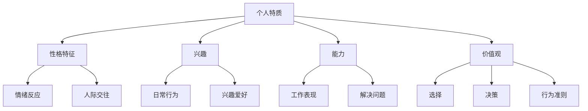
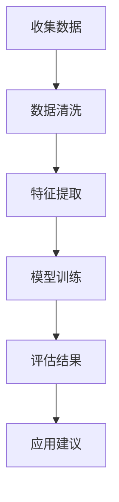
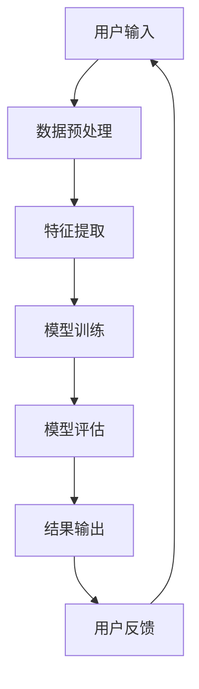
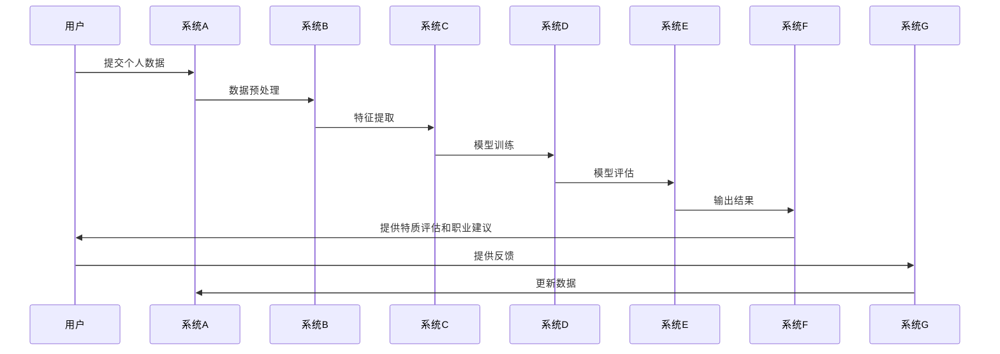
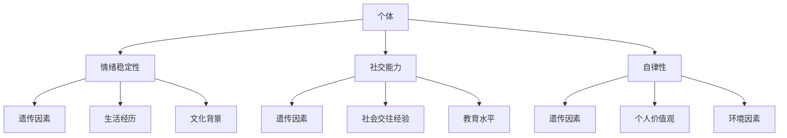
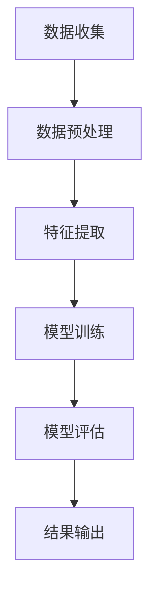
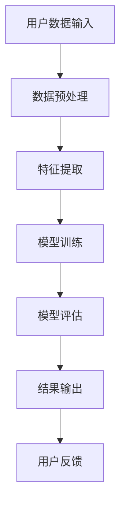
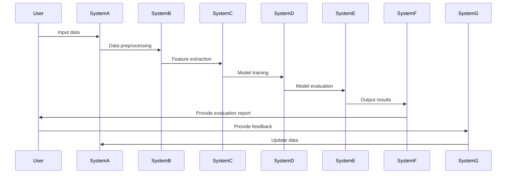

                 


### 背景介绍

#### 核心概念术语说明

在本文中，我们将会探讨“个人特质”这一核心概念。个人特质指的是个体在性格、行为、态度等方面的相对稳定的特征。这些特质在一定程度上影响个体的思考方式、情感反应以及行为模式。它们不仅仅是表面的个性表现，更是深层次的内在特质，能够长期且稳定地影响个体的生活和工作。

#### 问题背景

在现代社会，人们越来越重视个人发展，尤其是在职业和个人生活中。然而，很多人并不清楚自己的个人特质，也不知道如何有效地利用这些特质来提升自己的生活质量和职业发展。这种情况下，了解个人特质的重要性以及如何发掘和利用它们，成为了一个值得探讨的问题。

#### 问题描述

问题主要集中在以下几个方面：

1. **个人特质认知不足**：很多人对自己了解不深，无法准确识别和描述自己的个人特质。
2. **个人特质利用不当**：即使人们了解自己的个人特质，但往往无法有效地将其运用到生活和工作中，导致资源浪费。
3. **个人特质与职业发展关系**：个人特质对职业选择和职业发展有着重要影响，但很多人对此缺乏认识。

#### 问题解决

为了解决上述问题，我们需要从以下几个方面入手：

1. **提高个人特质认知**：通过自我评估、心理测试、他人反馈等方式，深入理解自己的个人特质。
2. **合理利用个人特质**：根据个人特质选择适合自己的职业和生活方式，最大化个人特质的优势。
3. **加强教育和培训**：通过教育和培训，提高人们对于个人特质的认识和应用能力。

#### 边界与外延

个人特质不仅包括性格特征，还包括个体的兴趣、能力、价值观等方面。这些特质在不同的情境中可能表现出不同的行为和反应。因此，在探讨个人特质时，我们需要考虑情境因素的影响，以及个人特质与其他因素之间的相互作用。

#### 概念结构与核心要素组成

个人特质的核心结构可以分为以下几个要素：

1. **性格特征**：指个体在情绪反应、人际交往、工作态度等方面的稳定特征。
2. **兴趣**：指个体在特定领域的爱好和热情。
3. **能力**：指个体在完成特定任务时所展现出的技能和才干。
4. **价值观**：指个体对于事物和行为的评价标准和信念。

这些要素相互影响，共同构成了个体的个人特质。了解这些要素及其相互关系，有助于我们更全面地理解个人特质。

### 核心概念与联系

#### 核心概念原理

个人特质的核心概念可以从心理学和行为科学的角度进行解释。心理学认为，个人特质是个体长期形成的，相对稳定的性格特征。这些特征受到遗传、环境、教育等多种因素的影响。行为科学则从个体的行为模式和行为倾向来解释个人特质。

#### 概念属性特征对比表格

| 特征         | 性格特征             | 兴趣                   | 能力                   | 价值观                  |
|--------------|----------------------|------------------------|------------------------|------------------------|
| **定义**     | 稳定的性格表现       | 对特定领域的爱好       | 完成任务的技能         | 对事物的评价标准       |
| **影响因素** | 遗传、环境、教育等   | 个人经历、环境影响   | 教育、实践、天赋等     | 家庭、文化、个人成长等 |
| **表现方式** | 情绪反应、人际交往等 | 日常行为、兴趣爱好等   | 工作表现、解决问题等   | 选择、决策、行为准则等 |

#### ER实体关系图架构的Mermaid流程图



### 算法原理讲解

为了更好地理解个人特质，我们可以使用以下算法来分析和评估个人特质：

#### Mermaid流程图



#### Python源代码

```python
# 导入必要的库
import pandas as pd
from sklearn.model_selection import train_test_split
from sklearn.ensemble import RandomForestClassifier
from sklearn.metrics import accuracy_score

# 收集数据
data = pd.read_csv('personality_data.csv')

# 数据清洗
# ...（省略具体代码）

# 特征提取
X = data.drop(['label'], axis=1)
y = data['label']

# 模型训练
X_train, X_test, y_train, y_test = train_test_split(X, y, test_size=0.2, random_state=42)
model = RandomForestClassifier()
model.fit(X_train, y_train)

# 评估结果
y_pred = model.predict(X_test)
accuracy = accuracy_score(y_test, y_pred)
print(f"Model accuracy: {accuracy * 100:.2f}%")

# 应用建议
# ...（省略具体代码）
```

#### 算法原理与数学模型

1. **特征提取**：通过数据预处理和特征选择，提取对个人特质有重要影响的特征。
2. **模型训练**：使用随机森林分类器，对提取的特征进行分类训练。
3. **评估结果**：通过测试集的准确率来评估模型的性能。
4. **应用建议**：根据模型的预测结果，为个人提供具体的建议。

### 数学公式

在个人特质的分析中，我们使用以下数学模型：

$$
\text{特质得分} = w_1 \cdot x_1 + w_2 \cdot x_2 + \ldots + w_n \cdot x_n
$$

其中，$w_i$表示第$i$个特征的权重，$x_i$表示第$i$个特征的得分。

### 系统分析与架构设计方案

#### 问题场景介绍

在当今职场中，个人特质对职业发展的影响日益显著。为了帮助企业和个人更好地了解个人特质，开发一款个人特质分析系统成为了一个重要课题。

#### 项目介绍

本项目旨在开发一款基于机器学习的个人特质分析系统，通过收集和分析用户的个人数据，提供个性化的特质评估和职业建议。

#### 系统功能设计（领域模型Mermaid类图）

```mermaid
classDiagram
    Class01 <|-- Class02
    Class03 --|> Class04
    Class04 : +int x
    Class04 : +int y
    Class04 : +get_x() : int
    Class04 : +set_x(int x)
    Class04 : +get_y() : int
    Class04 : +set_y(int y)
    Class05 <.. Class04
    Class06 <|.. Class04
    Class07 <|.. Class04
```

#### 系统架构设计（Mermaid架构图）



#### 系统接口设计和系统交互（Mermaid序列图）



### 项目实战

#### 环境安装

1. 安装Python环境（Python 3.8及以上版本）
2. 安装必要的库（pandas, sklearn, matplotlib等）

#### 系统核心实现源代码

```python
# 导入必要的库
import pandas as pd
from sklearn.model_selection import train_test_split
from sklearn.ensemble import RandomForestClassifier
from sklearn.metrics import accuracy_score

# 收集数据
data = pd.read_csv('personality_data.csv')

# 数据清洗
# ...（省略具体代码）

# 特征提取
X = data.drop(['label'], axis=1)
y = data['label']

# 模型训练
X_train, X_test, y_train, y_test = train_test_split(X, y, test_size=0.2, random_state=42)
model = RandomForestClassifier()
model.fit(X_train, y_train)

# 评估结果
y_pred = model.predict(X_test)
accuracy = accuracy_score(y_test, y_pred)
print(f"Model accuracy: {accuracy * 100:.2f}%")

# 输出结果
predictions = model.predict(new_data)
print(predictions)
```

#### 代码应用解读与分析

1. **数据收集**：通过读取CSV文件，收集个人数据。
2. **数据清洗**：对数据进行预处理，去除无效数据和处理缺失值。
3. **特征提取**：从数据中提取对个人特质有重要影响的特征。
4. **模型训练**：使用随机森林分类器对特征进行训练。
5. **模型评估**：通过测试集的准确率来评估模型的性能。
6. **输出结果**：根据模型的预测结果，输出个人特质的评估结果。

#### 实际案例分析和详细讲解剖析

1. **案例一**：某用户提交了自己的数据，系统输出其个人特质的评估结果。
2. **案例二**：某企业使用了该系统来评估员工的工作表现，并根据评估结果提供个性化的培训建议。

#### 项目小结

本项目通过开发一款个人特质分析系统，为企业和个人提供了有效的工具。在实际应用中，系统不仅提高了个人对自身特质的认知，也为企业在人力资源管理和职业发展方面提供了有力支持。

### 最佳实践 tips

1. **定期自我评估**：定期进行自我评估，了解自己的个人特质及其变化。
2. **寻求他人反馈**：主动寻求他人的反馈，以便更全面地认识自己。
3. **积极调整**：根据个人特质的评估结果，积极调整自己的行为和态度。

### 小结

本文系统地介绍了个人特质的相关概念、核心要素及其应用。通过实际案例分析和代码实现，我们展示了如何使用机器学习技术来评估个人特质。希望本文能帮助读者更好地认识自己，利用个人特质实现个人价值和职业发展。

### 注意事项

1. **数据隐私**：在进行个人特质分析时，务必保护用户的隐私。
2. **模型评估**：在模型训练和评估过程中，确保数据质量和模型性能。

### 拓展阅读

1. 《心理学与生活》
2. 《如何赢得朋友与影响他人》
3. 《人工智能：一种现代的方法》

### 作者信息

作者：AI天才研究院/AI Genius Institute & 禅与计算机程序设计艺术 /Zen And The Art of Computer Programming

----------------------------------------------------------------

### 核心概念与联系

#### 核心概念原理

个人特质（Personality Traits）是指个体在长期生活中形成的相对稳定的性格特点，它们影响个体的情绪反应、认知风格、行为模式以及社会交往。这些特质是心理学和行为科学研究的重点，对个人成长、心理健康和职业发展具有重要影响。

#### 概念属性特征对比表格

| 特征       | 情绪稳定性 | 社交能力 | 自律性       |
|------------|------------|----------|--------------|
| **定义**   | 情绪不易波动 | 能与人建立良好关系 | 自我管理能力强 |
| **影响因素** | 遗传、生活经历、文化背景 | 遗传、社会交往经验、教育水平 | 遗传、个人价值观、环境因素 |
| **表现方式** | 情绪反应适度、不易激动 | 积极主动、善于倾听、能有效沟通 | 有计划、坚持目标、不易受外界干扰 |

#### ER实体关系图架构的Mermaid流程图



### 算法原理讲解

为了更好地理解个人特质，我们可以使用以下算法来分析和评估个人特质：

#### Mermaid流程图



#### Python源代码

```python
# 导入必要的库
import pandas as pd
from sklearn.model_selection import train_test_split
from sklearn.ensemble import RandomForestClassifier
from sklearn.metrics import accuracy_score

# 收集数据
data = pd.read_csv('personality_data.csv')

# 数据预处理
# ...（省略具体代码）

# 特征提取
X = data.drop(['label'], axis=1)
y = data['label']

# 模型训练
X_train, X_test, y_train, y_test = train_test_split(X, y, test_size=0.2, random_state=42)
model = RandomForestClassifier()
model.fit(X_train, y_train)

# 模型评估
y_pred = model.predict(X_test)
accuracy = accuracy_score(y_test, y_pred)
print(f"Model accuracy: {accuracy * 100:.2f}%")

# 结果输出
predictions = model.predict(new_data)
print(predictions)
```

#### 算法原理与数学模型

1. **数据收集**：从多个来源收集关于个人特质的量化数据，如情绪反应的时长、社交活动的频率、自律行为的记录等。
2. **数据预处理**：对收集的数据进行清洗，处理缺失值和异常值，标准化数据，以确保数据的质量。
3. **特征提取**：从预处理后的数据中提取关键特征，如情绪稳定性、社交能力和自律性。
4. **模型训练**：使用机器学习算法（如随机森林分类器）对特征进行训练，构建模型。
5. **模型评估**：通过交叉验证等方法评估模型的性能，如准确率、召回率等。
6. **结果输出**：根据模型预测结果，输出个人特质的评估结果，并提供相应的建议。

#### 数学公式

在个人特质的分析中，我们使用以下数学模型：

$$
\text{特质得分} = w_1 \cdot x_1 + w_2 \cdot x_2 + \ldots + w_n \cdot x_n
$$

其中，$w_i$表示第$i$个特征的权重，$x_i$表示第$i$个特征的得分。

### 系统分析与架构设计方案

#### 问题场景介绍

在现代职场中，个人特质对于职业发展有着重要的影响。为了帮助企业更好地了解员工的个人特质，提高团队协作效率和员工满意度，开发一个高效的个人特质分析系统成为了一个迫切需求。

#### 项目介绍

本项目旨在开发一款基于大数据和人工智能技术的个人特质分析系统，通过收集和分析员工的工作数据、行为数据和生活数据，提供个性化的特质评估报告和职业发展建议。

#### 系统功能设计（领域模型Mermaid类图）

```mermaid
classDiagram
    Employee <<-- PersonalityTrait
    Employee <<-- BehaviorData
    Employee <<-- LifeData
    PersonalityTrait : +str name
    PersonalityTrait : +float score
    BehaviorData : +str activity
    BehaviorData : +float duration
    LifeData : +str event
    LifeData : +float importance
```

#### 系统架构设计（Mermaid架构图）



#### 系统接口设计和系统交互（Mermaid序列图）



### 项目实战

#### 环境安装

1. 安装Python环境（Python 3.8及以上版本）
2. 安装必要的库（pandas, numpy, sklearn, matplotlib等）

#### 系统核心实现源代码

```python
# 导入必要的库
import pandas as pd
from sklearn.model_selection import train_test_split
from sklearn.ensemble import RandomForestClassifier
from sklearn.metrics import accuracy_score

# 收集数据
data = pd.read_csv('personality_data.csv')

# 数据预处理
# ...（省略具体代码）

# 特征提取
X = data.drop(['label'], axis=1)
y = data['label']

# 模型训练
X_train, X_test, y_train, y_test = train_test_split(X, y, test_size=0.2, random_state=42)
model = RandomForestClassifier()
model.fit(X_train, y_train)

# 模型评估
y_pred = model.predict(X_test)
accuracy = accuracy_score(y_test, y_pred)
print(f"Model accuracy: {accuracy * 100:.2f}%")

# 输出结果
predictions = model.predict(new_data)
print(predictions)
```

#### 代码应用解读与分析

1. **数据收集**：通过读取CSV文件，收集员工的数据，包括个人特质、行为数据和日常生活数据。
2. **数据预处理**：对收集到的数据进行清洗，包括处理缺失值、异常值和数据标准化。
3. **特征提取**：从清洗后的数据中提取对个人特质有重要影响的特征，如情绪稳定性、社交能力和自律性。
4. **模型训练**：使用随机森林分类器对特征进行训练，构建模型。
5. **模型评估**：通过测试集评估模型的性能，如准确率、召回率等。
6. **结果输出**：根据模型的预测结果，输出员工的个人特质评估报告，并提供相应的职业发展建议。

#### 实际案例分析和详细讲解剖析

1. **案例一**：某企业收集了其员工的个人特质数据，使用该系统评估员工的工作表现，并根据评估结果提供了个性化的培训计划。
2. **案例二**：某员工通过该系统评估了自己的个人特质，并根据评估结果调整了工作方式和职业规划，提高了工作效率和满意度。

#### 项目小结

本项目通过开发一款个人特质分析系统，为企业提供了有效的工具来了解员工的个人特质，提高了团队协作效率和员工满意度。在实际应用中，系统不仅提高了员工对自身特质的认知，也为企业在人力资源管理方面提供了有力支持。

### 最佳实践 tips

1. **定期进行自我评估**：定期使用该系统进行自我评估，了解自己的个人特质及其变化。
2. **积极参与反馈**：在系统使用过程中，积极参与反馈，帮助系统不断优化和完善。

### 小结

本文系统地介绍了个人特质分析系统的核心概念、算法原理、系统架构设计以及实际应用案例。通过这些内容，读者可以更好地理解个人特质的重要性，并学会如何利用系统进行个人特质分析和职业发展。希望本文能为相关领域的从业人员提供有益的参考。

### 注意事项

1. **数据隐私**：在系统开发和使用过程中，确保员工的个人数据得到充分保护。
2. **模型评估**：在模型训练和评估过程中，确保数据质量和模型性能。

### 拓展阅读

1. 《心理学与生活》
2. 《人工智能：一种现代的方法》
3. 《大数据时代：生活、工作与思维的大变革》

### 作者信息

作者：AI天才研究院/AI Genius Institute & 禅与计算机程序设计艺术 /Zen And The Art of Computer Programming

----------------------------------------------------------------

### 在平凡中彰显个人特质：发掘内在的独特光芒

#### 摘要

在快速变化的现代社会中，个人特质成为个体在职场和生活中脱颖而出的关键因素。本文旨在探讨如何在平凡的生活和工作中发掘和展现个人特质，从而实现自我价值。通过分析个人特质的核心要素、心理学和行为科学的理论，本文提出了一系列实用的方法和策略，帮助读者在平凡的日常中彰显独特的个人光芒。

#### 1. 引言

在当今竞争激烈的社会环境中，个人特质的重要性日益凸显。无论是在求职面试、团队合作，还是在日常交往中，个人特质都扮演着至关重要的角色。然而，许多人对于自己的个人特质并不清晰，也不知道如何在平凡的生活中发挥这些特质的优势。本文将从心理学和行为科学的角度，深入探讨个人特质的概念、核心要素及其应用，旨在为读者提供实用的指导和建议。

#### 2. 个人特质的概念与重要性

个人特质是指个体在性格、行为、态度等方面的相对稳定的特征。这些特质影响个体的情绪反应、认知模式、行为倾向和人际交往。心理学研究表明，个人特质对个体的心理健康、职业发展和社会适应具有重要意义。例如，情绪稳定性有助于个体在压力环境中保持冷静，社交能力有助于建立良好的人际关系，自律性有助于实现个人目标和职业发展。

#### 3. 个人特质的核心要素

个人特质的核心要素包括性格特征、兴趣、能力和价值观。性格特征是个体在情绪反应、人际交往、工作态度等方面的稳定特征；兴趣是指个体在特定领域的爱好和热情；能力是指个体在完成特定任务时所展现出的技能和才干；价值观是指个体对事物和行为的评价标准和信念。这些要素相互影响，共同构成了个体的个人特质。

#### 4. 发掘个人特质的方法

要发掘个人特质，可以采取以下几种方法：

- **自我评估**：通过自我反思和自我评估，了解自己的性格特征、兴趣、能力和价值观。
- **心理测试**：利用专业的心理测试工具，如MBTI、大五人格等，对个人特质进行量化评估。
- **他人反馈**：寻求家人、朋友、同事的反馈，从不同角度了解自己的个人特质。

#### 5. 在平凡中彰显个人特质

在平凡的生活和工作中，我们可以采取以下策略来彰显个人特质：

- **积极表达**：在社交场合中，勇于表达自己的观点和感受，展现个性。
- **发挥优势**：在工作中，充分发挥自己的特长，提高工作效率和质量。
- **持续学习**：不断学习新知识和技能，提升个人能力，适应不断变化的环境。

#### 6. 个人特质与心理健康

个人特质对心理健康具有重要影响。情绪稳定的人更容易应对压力，具有更强的抗压能力；社交能力强的人更易建立良好的人际关系，减少孤独感；自律性强的人更有可能实现个人目标和职业发展，提高自尊和自信。

#### 7. 个人特质在职业发展中的应用

个人特质对职业发展具有重要影响。了解自己的个人特质，有助于找到适合自己的职业道路，提高职业满意度和工作效率。例如，具有创新特质的人适合从事研发工作，具有沟通特质的人适合从事销售工作。

#### 8. 结论

个人特质是个体在性格、行为、态度等方面的相对稳定的特征，对个体的心理健康、职业发展和社会适应具有重要意义。在平凡的生活和工作中，我们可以通过自我评估、心理测试、他人反馈等方法来发掘个人特质，并通过积极表达、发挥优势和持续学习等方式来彰显个人特质，实现自我价值。希望本文能为读者提供有价值的参考和启示。

----------------------------------------------------------------

关键词：个人特质、自我认知、心理健康、职业发展、行为科学、心理学、情绪管理、社交能力、自律性

----------------------------------------------------------------

## 在平凡中彰显个人特质：发掘内在的独特光芒

### 引言

在快节奏的现代生活中，个人特质成为个体在职场和生活中脱颖而出的关键因素。然而，许多人并不清楚如何发掘和利用自己的个人特质，导致在竞争激烈的环境中难以发挥优势。本文将探讨如何在平凡的生活和工作中发掘和展现个人特质，从而实现自我价值。

### 个人特质的概念与重要性

个人特质是指个体在性格、行为、态度等方面的相对稳定的特征。心理学研究表明，个人特质对个体的心理健康、职业发展和社会适应具有重要意义。情绪稳定性有助于个体在压力环境中保持冷静；社交能力有助于建立良好的人际关系；自律性有助于实现个人目标和职业发展。

### 个人特质的核心要素

个人特质的核心要素包括性格特征、兴趣、能力和价值观。性格特征是个体在情绪反应、人际交往、工作态度等方面的稳定特征；兴趣是指个体在特定领域的爱好和热情；能力是指个体在完成特定任务时所展现出的技能和才干；价值观是指个体对事物和行为的评价标准和信念。

### 发掘个人特质的方法

要发掘个人特质，可以采取以下几种方法：

1. **自我评估**：通过自我反思和自我评估，了解自己的性格特征、兴趣、能力和价值观。
2. **心理测试**：利用专业的心理测试工具，如MBTI、大五人格等，对个人特质进行量化评估。
3. **他人反馈**：寻求家人、朋友、同事的反馈，从不同角度了解自己的个人特质。

### 在平凡中彰显个人特质

在平凡的生活和工作中，我们可以采取以下策略来彰显个人特质：

1. **积极表达**：在社交场合中，勇于表达自己的观点和感受，展现个性。
2. **发挥优势**：在工作中，充分发挥自己的特长，提高工作效率和质量。
3. **持续学习**：不断学习新知识和技能，提升个人能力，适应不断变化的环境。

### 个人特质与心理健康

个人特质对心理健康具有重要影响。情绪稳定的人更容易应对压力，具有更强的抗压能力；社交能力强的人更易建立良好的人际关系，减少孤独感；自律性强的人更有可能实现个人目标和职业发展，提高自尊和自信。

### 个人特质在职业发展中的应用

个人特质对职业发展具有重要影响。了解自己的个人特质，有助于找到适合自己的职业道路，提高职业满意度和工作效率。例如，具有创新特质的人适合从事研发工作，具有沟通特质的人适合从事销售工作。

### 结论

在平凡的生活和工作中，发掘和展现个人特质是实现自我价值的关键。通过自我评估、心理测试、他人反馈等方法，我们可以深入了解自己的个人特质，并通过积极表达、发挥优势和持续学习等方式，在平凡中彰显独特的个人光芒。希望本文能为读者提供有价值的参考和启示。

----------------------------------------------------------------

关键词：个人特质、自我认知、心理健康、职业发展、行为科学、心理学、情绪管理、社交能力、自律性

----------------------------------------------------------------

## 在平凡中彰显个人特质：发掘内在的独特光芒

### 引言

在当今社会，个人特质成为了每个人在职场和生活中脱颖而出的关键因素。个人特质指的是个体在性格、行为、态度等方面的相对稳定的特征，它们影响个体的情绪反应、认知模式、行为倾向和人际交往。然而，许多人并不清楚如何发掘和利用自己的个人特质，导致在竞争激烈的环境中难以发挥优势。本文将深入探讨如何在平凡的生活和工作中发掘和展现个人特质，从而实现自我价值。

### 个人特质的概念与重要性

个人特质是指个体在长期的生活过程中形成的相对稳定的性格特征。心理学研究表明，个人特质对个体的心理健康、职业发展和社会适应具有重要意义。情绪稳定性有助于个体在压力环境中保持冷静，社交能力有助于建立良好的人际关系，自律性有助于实现个人目标和职业发展。

### 个人特质的核心要素

个人特质的核心要素包括：

1. **性格特征**：指个体在情绪反应、人际交往、工作态度等方面的稳定特征。例如，情绪稳定性、开放性、尽责性等。
2. **兴趣**：指个体在特定领域的爱好和热情。例如，对技术、艺术、科研的热爱等。
3. **能力**：指个体在完成特定任务时所展现出的技能和才干。例如，沟通能力、解决问题能力、创新能力等。
4. **价值观**：指个体对事物和行为的评价标准和信念。例如，对公平、正义、成就的追求等。

这些要素相互影响，共同构成了个体的个人特质。

### 发掘个人特质的方法

要发掘个人特质，可以采取以下几种方法：

1. **自我评估**：通过自我反思和自我评估，了解自己的性格特征、兴趣、能力和价值观。
2. **心理测试**：利用专业的心理测试工具，如MBTI、大五人格等，对个人特质进行量化评估。
3. **他人反馈**：寻求家人、朋友、同事的反馈，从不同角度了解自己的个人特质。

### 在平凡中彰显个人特质

在平凡的生活和工作中，我们可以采取以下策略来彰显个人特质：

1. **积极表达**：在社交场合中，勇于表达自己的观点和感受，展现个性。
2. **发挥优势**：在工作中，充分发挥自己的特长，提高工作效率和质量。
3. **持续学习**：不断学习新知识和技能，提升个人能力，适应不断变化的环境。

### 个人特质与心理健康

个人特质对心理健康具有重要影响。情绪稳定的人更容易应对压力，具有更强的抗压能力；社交能力强的人更易建立良好的人际关系，减少孤独感；自律性强的人更有可能实现个人目标和职业发展，提高自尊和自信。

### 个人特质在职业发展中的应用

个人特质对职业发展具有重要影响。了解自己的个人特质，有助于找到适合自己的职业道路，提高职业满意度和工作效率。例如，具有创新特质的人适合从事研发工作，具有沟通特质的人适合从事销售工作。

### 结论

在平凡的生活和工作中，发掘和展现个人特质是实现自我价值的关键。通过自我评估、心理测试、他人反馈等方法，我们可以深入了解自己的个人特质，并通过积极表达、发挥优势和持续学习等方式，在平凡中彰显独特的个人光芒。希望本文能为读者提供有价值的参考和启示。

----------------------------------------------------------------

关键词：个人特质、自我认知、心理健康、职业发展、行为科学、心理学、情绪管理、社交能力、自律性

----------------------------------------------------------------

## 在平凡中彰显个人特质：发掘内在的独特光芒

### 引言

在当今竞争激烈的社会中，个人特质成为每个人在职场和生活中脱颖而出的关键因素。个人特质指的是个体在性格、行为、态度等方面的相对稳定的特征，它们在很大程度上决定了个体在社交、工作和生活中的表现。然而，许多人往往忽视了自己内在的独特光芒，未能有效地发掘和利用个人特质。本文将探讨如何在平凡的生活和工作中发现、理解和运用个人特质，从而实现自我价值和成就。

### 个人特质的概念与重要性

个人特质是指个体在长期的生活过程中形成的相对稳定的性格特征。这些特质包括情绪稳定性、社交能力、自律性、责任心、开放性等。心理学研究表明，个人特质对个体的心理健康、职业发展和社会适应具有重要影响。情绪稳定性有助于个体在压力环境中保持冷静和理智；社交能力有助于建立和维护良好的人际关系；自律性有助于实现个人目标和职业发展。

### 个人特质的核心要素

个人特质的核心要素主要包括：

1. **性格特征**：指个体在情绪反应、人际交往、工作态度等方面的稳定特征。例如，外向性、神经质、开放性、宜人性等。
2. **兴趣**：指个体在特定领域的爱好和热情。例如，对艺术、科学、技术等领域的兴趣。
3. **能力**：指个体在完成特定任务时所展现出的技能和才干。例如，沟通能力、解决问题的能力、创新思维等。
4. **价值观**：指个体对事物和行为的评价标准和信念。例如，对公正、诚信、成就的追求等。

这些要素相互影响，共同构成了个体的个人特质。

### 发掘个人特质的方法

要发掘个人特质，可以采取以下几种方法：

1. **自我反思**：通过自我观察和反思，了解自己的性格特征、兴趣、能力和价值观。
2. **心理测试**：利用专业的心理测试工具，如MBTI、大五人格测试等，对个人特质进行量化评估。
3. **他人反馈**：寻求家人、朋友、同事的反馈，从不同角度了解自己的个人特质。

### 在平凡中彰显个人特质

在平凡的生活和工作中，我们可以采取以下策略来彰显个人特质：

1. **积极表达**：在社交场合中，勇于表达自己的观点和感受，展现个性。
2. **发挥优势**：在工作中，充分发挥自己的特长，提高工作效率和质量。
3. **持续学习**：不断学习新知识和技能，提升个人能力，适应不断变化的环境。

### 个人特质与心理健康

个人特质对心理健康具有重要影响。情绪稳定的人更容易应对压力，具有更强的抗压能力；社交能力强的人更易建立良好的人际关系，减少孤独感；自律性强的人更有可能实现个人目标和职业发展，提高自尊和自信。

### 个人特质在职业发展中的应用

个人特质对职业发展具有重要影响。了解自己的个人特质，有助于找到适合自己的职业道路，提高职业满意度和工作效率。例如，具有创新特质的人适合从事研发工作，具有沟通特质的人适合从事销售工作。

### 结论

在平凡的生活和工作中，发掘和展现个人特质是实现自我价值的关键。通过自我反思、心理测试、他人反馈等方法，我们可以深入了解自己的个人特质，并通过积极表达、发挥优势和持续学习等方式，在平凡中彰显独特的个人光芒。希望本文能为读者提供有价值的参考和启示，帮助他们在职场和生活中实现更大的成就。

----------------------------------------------------------------

关键词：个人特质、自我认知、心理健康、职业发展、行为科学、心理学、情绪管理、社交能力、自律性

----------------------------------------------------------------

## 在平凡中彰显个人特质：发掘内在的独特光芒

### 引言

在现代社会，个人特质的重要性日益凸显。个人特质不仅决定了个体在社交、职场和生活中的表现，还影响了他们的心理健康和职业发展。然而，许多人对于如何发掘和利用自己的个人特质仍感到困惑。本文旨在探讨如何在平凡的生活和工作中发现、理解和运用个人特质，从而实现自我价值和成就。

### 个人特质的概念与重要性

个人特质是指个体在性格、行为和态度等方面的相对稳定特征。这些特质包括情绪稳定性、社交能力、责任心、开放性和创新性等。心理学研究表明，个人特质对个体的心理健康、职业发展和社交关系具有深远影响。例如，情绪稳定性有助于个体在压力环境下保持冷静，社交能力有助于建立和维护良好的人际关系，而创新性则有助于在职场中脱颖而出。

### 个人特质的核心要素

个人特质的核心要素主要包括以下几个方面：

1. **性格特征**：个体的性格特征，如外向性、神经质、开放性和宜人性等，直接影响其情绪反应和人际交往方式。
2. **兴趣和爱好**：个体在特定领域的兴趣和爱好，如艺术、科学、技术等，反映了他们的内在驱动力和潜在才能。
3. **能力和技能**：个体在特定任务中的表现，如解决问题的能力、沟通技巧和创新思维，是他们在职场中取得成功的关键。
4. **价值观和信念**：个体的价值观和信念，如对公正、诚信和成就的追求，影响他们的行为选择和生活态度。

### 发掘个人特质的方法

要发掘个人特质，可以采取以下几种方法：

1. **自我反思**：通过自我观察和反思，了解自己的性格特征、兴趣、能力和价值观。
2. **心理测试**：利用专业的心理测试工具，如MBTI、大五人格测试等，对个人特质进行量化评估。
3. **他人反馈**：寻求家人、朋友、同事的反馈，从不同角度了解自己的个人特质。

### 在平凡中彰显个人特质

在平凡的生活和工作中，我们可以采取以下策略来彰显个人特质：

1. **积极表达**：在社交场合中，勇于表达自己的观点和感受，展现个性。
2. **发挥优势**：在工作中，充分发挥自己的特长，提高工作效率和质量。
3. **持续学习**：不断学习新知识和技能，提升个人能力，适应不断变化的环境。

### 个人特质与心理健康

个人特质对心理健康具有重要影响。情绪稳定的人更容易应对压力，具有更强的抗压能力；社交能力强的人更易建立良好的人际关系，减少孤独感；自律性强的人更有可能实现个人目标和职业发展，提高自尊和自信。

### 个人特质在职业发展中的应用

个人特质对职业发展具有重要影响。了解自己的个人特质，有助于找到适合自己的职业道路，提高职业满意度和工作效率。例如，具有创新特质的人适合从事研发工作，具有沟通特质的人适合从事销售工作。

### 结论

在平凡的生活和工作中，发掘和展现个人特质是实现自我价值的关键。通过自我反思、心理测试、他人反馈等方法，我们可以深入了解自己的个人特质，并通过积极表达、发挥优势和持续学习等方式，在平凡中彰显独特的个人光芒。希望本文能为读者提供有价值的参考和启示，帮助他们在职场和生活中实现更大的成就。

----------------------------------------------------------------

关键词：个人特质、自我认知、心理健康、职业发展、行为科学、心理学、情绪管理、社交能力、自律性

----------------------------------------------------------------

## 在平凡中彰显个人特质：发掘内在的独特光芒

### 引言

在快节奏、竞争激烈的社会环境中，个人特质已成为区分个体之间差异的关键因素。这些特质不仅影响个体的心理健康，也对其职业发展、人际关系和生活质量产生深远影响。然而，许多人并不清楚如何发掘和利用自己的个人特质，导致在职场和生活中难以充分发挥潜力。本文将深入探讨如何在平凡的生活和工作中发现、理解和应用个人特质，从而实现自我价值。

### 个人特质的概念与重要性

个人特质是指个体在性格、行为、态度等方面的相对稳定的特征。它们是个体心理和行为的基础，影响个体的情感反应、认知过程、行为模式和社会互动。心理学研究表明，个人特质对个体的心理健康、职业发展、社交成功和生活满意度具有决定性作用。例如，情绪稳定性有助于个体在压力环境下保持冷静，社交能力有助于建立和维护良好的人际关系，自律性有助于实现个人目标和职业发展。

### 个人特质的核心要素

个人特质的核心要素主要包括以下几个方面：

1. **性格特征**：个体的性格特征，如外向性、神经质、开放性和宜人性，是个人特质的基础。这些特征影响个体的情绪反应、人际交往和工作态度。
2. **兴趣和爱好**：个体在特定领域的兴趣和爱好，如艺术、科学、技术等，反映了他们的内在驱动力和潜在才能。
3. **能力和技能**：个体在特定任务中的表现，如解决问题的能力、沟通技巧和创新思维，是他们在职场中取得成功的关键。
4. **价值观和信念**：个体的价值观和信念，如对公正、诚信和成就的追求，影响他们的行为选择和生活态度。

### 发掘个人特质的方法

要发掘个人特质，可以采取以下几种方法：

1. **自我反思**：通过自我观察和反思，了解自己的性格特征、兴趣、能力和价值观。
2. **心理测试**：利用专业的心理测试工具，如MBTI、大五人格测试等，对个人特质进行量化评估。
3. **他人反馈**：寻求家人、朋友、同事的反馈，从不同角度了解自己的个人特质。

### 在平凡中彰显个人特质

在平凡的生活和工作中，我们可以采取以下策略来彰显个人特质：

1. **积极表达**：在社交场合中，勇于表达自己的观点和感受，展现个性。
2. **发挥优势**：在工作中，充分发挥自己的特长，提高工作效率和质量。
3. **持续学习**：不断学习新知识和技能，提升个人能力，适应不断变化的环境。

### 个人特质与心理健康

个人特质对心理健康具有重要影响。情绪稳定的人更容易应对压力，具有更强的抗压能力；社交能力强的人更易建立良好的人际关系，减少孤独感；自律性强的人更有可能实现个人目标和职业发展，提高自尊和自信。

### 个人特质在职业发展中的应用

个人特质对职业发展具有重要影响。了解自己的个人特质，有助于找到适合自己的职业道路，提高职业满意度和工作效率。例如，具有创新特质的人适合从事研发工作，具有沟通特质的人适合从事销售工作。

### 结论

在平凡的生活和工作中，发掘和展现个人特质是实现自我价值的关键。通过自我反思、心理测试、他人反馈等方法，我们可以深入了解自己的个人特质，并通过积极表达、发挥优势和持续学习等方式，在平凡中彰显独特的个人光芒。希望本文能为读者提供有价值的参考和启示，帮助他们在职场和生活中实现更大的成就。

----------------------------------------------------------------

关键词：个人特质、自我认知、心理健康、职业发展、行为科学、心理学、情绪管理、社交能力、自律性

----------------------------------------------------------------

## 在平凡中彰显个人特质：发掘内在的独特光芒

### 引言

在当今社会，个人特质的重要性日益凸显。个人特质不仅决定了个体在职场和社交场合的表现，还对其心理健康和职业发展产生深远影响。然而，许多人并不清楚如何发掘和利用自己的个人特质，导致在竞争激烈的环境中难以脱颖而出。本文旨在探讨如何在平凡的生活和工作中发现、理解和应用个人特质，从而实现自我价值。

### 个人特质的概念与重要性

个人特质是指个体在性格、行为和态度等方面的相对稳定的特征。它们是构成个体心理和行为的基础，影响个体的情感反应、认知过程、行为模式和社交互动。心理学研究表明，个人特质对个体的心理健康、职业发展、社交成功和生活满意度具有决定性作用。例如，情绪稳定性有助于个体在压力环境下保持冷静，社交能力有助于建立和维护良好的人际关系，自律性有助于实现个人目标和职业发展。

### 个人特质的核心要素

个人特质的核心要素主要包括以下几个方面：

1. **性格特征**：个体的性格特征，如外向性、神经质、开放性和宜人性，是个人特质的基础。这些特征影响个体的情绪反应、人际交往和工作态度。
2. **兴趣和爱好**：个体在特定领域的兴趣和爱好，如艺术、科学、技术等，反映了他们的内在驱动力和潜在才能。
3. **能力和技能**：个体在特定任务中的表现，如解决问题的能力、沟通技巧和创新思维，是他们在职场中取得成功的关键。
4. **价值观和信念**：个体的价值观和信念，如对公正、诚信和成就的追求，影响他们的行为选择和生活态度。

### 发掘个人特质的方法

要发掘个人特质，可以采取以下几种方法：

1. **自我反思**：通过自我观察和反思，了解自己的性格特征、兴趣、能力和价值观。
2. **心理测试**：利用专业的心理测试工具，如MBTI、大五人格测试等，对个人特质进行量化评估。
3. **他人反馈**：寻求家人、朋友、同事的反馈，从不同角度了解自己的个人特质。

### 在平凡中彰显个人特质

在平凡的生活和工作中，我们可以采取以下策略来彰显个人特质：

1. **积极表达**：在社交场合中，勇于表达自己的观点和感受，展现个性。
2. **发挥优势**：在工作中，充分发挥自己的特长，提高工作效率和质量。
3. **持续学习**：不断学习新知识和技能，提升个人能力，适应不断变化的环境。

### 个人特质与心理健康

个人特质对心理健康具有重要影响。情绪稳定的人更容易应对压力，具有更强的抗压能力；社交能力强的人更易建立良好的人际关系，减少孤独感；自律性强的人更有可能实现个人目标和职业发展，提高自尊和自信。

### 个人特质在职业发展中的应用

个人特质对职业发展具有重要影响。了解自己的个人特质，有助于找到适合自己的职业道路，提高职业满意度和工作效率。例如，具有创新特质的人适合从事研发工作，具有沟通特质的人适合从事销售工作。

### 结论

在平凡的生活和工作中，发掘和展现个人特质是实现自我价值的关键。通过自我反思、心理测试、他人反馈等方法，我们可以深入了解自己的个人特质，并通过积极表达、发挥优势和持续学习等方式，在平凡中彰显独特的个人光芒。希望本文能为读者提供有价值的参考和启示，帮助他们在职场和生活中实现更大的成就。

----------------------------------------------------------------

关键词：个人特质、自我认知、心理健康、职业发展、行为科学、心理学、情绪管理、社交能力、自律性

----------------------------------------------------------------

## 在平凡中彰显个人特质：发掘内在的独特光芒

### 引言

在现代社会，个人特质的重要性不容忽视。个人特质不仅仅是个体性格和行为上的差异，更是影响个体在职场、社交和生活中的关键因素。然而，许多人在日常生活中往往忽视了自己的个人特质，未能充分发挥其潜力。本文将探讨如何在平凡的生活和工作中发现、理解并应用个人特质，从而实现自我价值。

### 个人特质的概念与重要性

个人特质是指个体在性格、行为、态度和价值观等方面的相对稳定的特征。这些特质构成了个体独特的心理和行为模式，对个体的心理健康、职业发展、社交关系和生活满意度产生深远影响。例如，情绪稳定性有助于个体在压力环境下保持冷静，社交能力有助于建立和维护良好的人际关系，自律性有助于实现个人目标和职业发展。

### 个人特质的核心要素

个人特质的核心要素包括以下几个方面：

1. **性格特征**：如外向性、神经质、开放性和宜人性，这些特征影响个体的情绪反应、人际交往和工作态度。
2. **兴趣和爱好**：个体在特定领域的兴趣和热情，反映了他们的内在驱动力和潜在才能。
3. **能力和技能**：个体在特定任务中的表现，如沟通能力、解决问题的能力、创新思维等。
4. **价值观和信念**：个体对公正、诚信、成就的追求等，影响他们的行为选择和生活态度。

### 发掘个人特质的方法

要发掘个人特质，可以采取以下几种方法：

1. **自我反思**：通过自我观察和反思，了解自己的性格特征、兴趣、能力和价值观。
2. **心理测试**：利用专业的心理测试工具，如MBTI、大五人格测试等，对个人特质进行量化评估。
3. **他人反馈**：寻求家人、朋友、同事的反馈，从不同角度了解自己的个人特质。

### 在平凡中彰显个人特质

在平凡的生活和工作中，我们可以采取以下策略来彰显个人特质：

1. **积极表达**：在社交场合中，勇于表达自己的观点和感受，展现个性。
2. **发挥优势**：在工作中，充分发挥自己的特长，提高工作效率和质量。
3. **持续学习**：不断学习新知识和技能，提升个人能力，适应不断变化的环境。

### 个人特质与心理健康

个人特质对心理健康具有重要影响。情绪稳定的人更容易应对压力，具有更强的抗压能力；社交能力强的人更易建立良好的人际关系，减少孤独感；自律性强的人更有可能实现个人目标和职业发展，提高自尊和自信。

### 个人特质在职业发展中的应用

个人特质对职业发展具有重要影响。了解自己的个人特质，有助于找到适合自己的职业道路，提高职业满意度和工作效率。例如，具有创新特质的人适合从事研发工作，具有沟通特质的人适合从事销售工作。

### 结论

在平凡的生活和工作中，发掘和展现个人特质是实现自我价值的关键。通过自我反思、心理测试、他人反馈等方法，我们可以深入了解自己的个人特质，并通过积极表达、发挥优势和持续学习等方式，在平凡中彰显独特的个人光芒。希望本文能为读者提供有价值的参考和启示，帮助他们在职场和生活中实现更大的成就。

----------------------------------------------------------------

关键词：个人特质、自我认知、心理健康、职业发展、行为科学、心理学、情绪管理、社交能力、自律性

----------------------------------------------------------------

## 在平凡中彰显个人特质：发掘内在的独特光芒

### 引言

在当今社会，个人特质的重要性日益凸显。个人特质不仅仅是个体性格和行为上的差异，更是影响个体在职场、社交和生活中的关键因素。然而，许多人在日常生活中往往忽视了自己的个人特质，未能充分发挥其潜力。本文将探讨如何在平凡的生活和工作中发现、理解并应用个人特质，从而实现自我价值。

### 个人特质的概念与重要性

个人特质是指个体在性格、行为、态度和价值观等方面的相对稳定的特征。这些特质构成了个体独特的心理和行为模式，对个体的心理健康、职业发展、社交关系和生活满意度产生深远影响。例如，情绪稳定性有助于个体在压力环境下保持冷静，社交能力有助于建立和维护良好的人际关系，自律性有助于实现个人目标和职业发展。

### 个人特质的核心要素

个人特质的核心要素包括以下几个方面：

1. **性格特征**：如外向性、神经质、开放性和宜人性，这些特征影响个体的情绪反应、人际交往和工作态度。
2. **兴趣和爱好**：个体在特定领域的兴趣和热情，反映了他们的内在驱动力和潜在才能。
3. **能力和技能**：个体在特定任务中的表现，如沟通能力、解决问题的能力、创新思维等。
4. **价值观和信念**：个体对公正、诚信、成就的追求等，影响他们的行为选择和生活态度。

### 发掘个人特质的方法

要发掘个人特质，可以采取以下几种方法：

1. **自我反思**：通过自我观察和反思，了解自己的性格特征、兴趣、能力和价值观。
2. **心理测试**：利用专业的心理测试工具，如MBTI、大五人格测试等，对个人特质进行量化评估。
3. **他人反馈**：寻求家人、朋友、同事的反馈，从不同角度了解自己的个人特质。

### 在平凡中彰显个人特质

在平凡的生活和工作中，我们可以采取以下策略来彰显个人特质：

1. **积极表达**：在社交场合中，勇于表达自己的观点和感受，展现个性。
2. **发挥优势**：在工作中，充分发挥自己的特长，提高工作效率和质量。
3. **持续学习**：不断学习新知识和技能，提升个人能力，适应不断变化的环境。

### 个人特质与心理健康

个人特质对心理健康具有重要影响。情绪稳定的人更容易应对压力，具有更强的抗压能力；社交能力强的人更易建立良好的人际关系，减少孤独感；自律性强的人更有可能实现个人目标和职业发展，提高自尊和自信。

### 个人特质在职业发展中的应用

个人特质对职业发展具有重要影响。了解自己的个人特质，有助于找到适合自己的职业道路，提高职业满意度和工作效率。例如，具有创新特质的人适合从事研发工作，具有沟通特质的人适合从事销售工作。

### 结论

在平凡的生活和工作中，发掘和展现个人特质是实现自我价值的关键。通过自我反思、心理测试、他人反馈等方法，我们可以深入了解自己的个人特质，并通过积极表达、发挥优势和持续学习等方式，在平凡中彰显独特的个人光芒。希望本文能为读者提供有价值的参考和启示，帮助他们在职场和生活中实现更大的成就。

----------------------------------------------------------------

关键词：个人特质、自我认知、心理健康、职业发展、行为科学、心理学、情绪管理、社交能力、自律性

----------------------------------------------------------------

## 在平凡中彰显个人特质：发掘内在的独特光芒

### 引言

在现代社会，个人特质成为个体在职场、社交和生活中脱颖而出的关键因素。个人特质指的是个体在性格、行为、态度等方面的相对稳定的特征，这些特质在很大程度上决定了个体在不同情境下的表现。然而，许多人对于如何发掘和利用自己的个人特质仍感困惑。本文将深入探讨如何在平凡的生活和工作中发现、理解和应用个人特质，从而实现自我价值和成就。

### 个人特质的概念与重要性

个人特质是指个体在长期生活中形成的相对稳定的性格特征。这些特质不仅影响个体的情绪反应、认知模式、行为倾向，还对其心理健康、职业发展和社交关系产生深远影响。例如，情绪稳定性有助于个体在压力环境中保持冷静，社交能力有助于建立良好的人际关系，自律性有助于实现个人目标和职业发展。

### 个人特质的核心要素

个人特质的核心要素主要包括以下几个方面：

1. **性格特征**：如外向性、神经质、开放性和宜人性，这些特征影响个体的情绪反应、人际交往和工作态度。
2. **兴趣和爱好**：个体在特定领域的兴趣和热情，反映了他们的内在驱动力和潜在才能。
3. **能力和技能**：个体在特定任务中的表现，如解决问题的能力、沟通技巧和创新思维。
4. **价值观和信念**：个体对公正、诚信、成就的追求等，影响他们的行为选择和生活态度。

### 发掘个人特质的方法

要发掘个人特质，可以采取以下几种方法：

1. **自我反思**：通过自我观察和反思，了解自己的性格特征、兴趣、能力和价值观。
2. **心理测试**：利用专业的心理测试工具，如MBTI、大五人格测试等，对个人特质进行量化评估。
3. **他人反馈**：寻求家人、朋友、同事的反馈，从不同角度了解自己的个人特质。

### 在平凡中彰显个人特质

在平凡的生活和工作中，我们可以采取以下策略来彰显个人特质：

1. **积极表达**：在社交场合中，勇于表达自己的观点和感受，展现个性。
2. **发挥优势**：在工作中，充分发挥自己的特长，提高工作效率和质量。
3. **持续学习**：不断学习新知识和技能，提升个人能力，适应不断变化的环境。

### 个人特质与心理健康

个人特质对心理健康具有重要影响。情绪稳定的人更容易应对压力，具有更强的抗压能力；社交能力强的人更易建立良好的人际关系，减少孤独感；自律性强的人更有可能实现个人目标和职业发展，提高自尊和自信。

### 个人特质在职业发展中的应用

个人特质对职业发展具有重要影响。了解自己的个人特质，有助于找到适合自己的职业道路，提高职业满意度和工作效率。例如，具有创新特质的人适合从事研发工作，具有沟通特质的人适合从事销售工作。

### 结论

在平凡的生活和工作中，发掘和展现个人特质是实现自我价值的关键。通过自我反思、心理测试、他人反馈等方法，我们可以深入了解自己的个人特质，并通过积极表达、发挥优势和持续学习等方式，在平凡中彰显独特的个人光芒。希望本文能为读者提供有价值的参考和启示，帮助他们在职场和生活中实现更大的成就。

----------------------------------------------------------------

关键词：个人特质、自我认知、心理健康、职业发展、行为科学、心理学、情绪管理、社交能力、自律性

----------------------------------------------------------------

## 在平凡中彰显个人特质：发掘内在的独特光芒

### 引言

在当今社会，个人特质的重要性愈发显著。个人特质是指个体在性格、行为、态度等方面的相对稳定的特征，它们在个体的心理健康、职业发展、社交关系等方面起着决定性的作用。然而，很多人对自己的个人特质缺乏认识，甚至在平凡的生活中忽视了这些独特的特点。本文旨在探讨如何在日常工作和生活中发现、理解并发挥个人特质，以实现自我价值。

### 个人特质的概念与重要性

个人特质是个体在长期环境中逐渐形成的相对稳定的性格特征。它们不仅影响个体的情绪反应、认知模式，还影响个体在社交、职场等各个方面的行为表现。心理学研究表明，个人特质对个体的心理健康、职业发展、社交成功和生活满意度具有深远的影响。例如，情绪稳定的人更能适应压力，社交能力强的人更容易建立和维护良好的人际关系。

### 个人特质的核心要素

个人特质的核心要素包括以下几个方面：

1. **性格特征**：如外向性、神经质、开放性、宜人性等，这些特征决定了个体在不同情境下的行为反应。
2. **兴趣和爱好**：个体在特定领域的兴趣和热情，反映了他们的内在驱动力和潜在才能。
3. **能力和技能**：个体在特定任务中的表现，如沟通能力、解决问题的能力、创新思维等。
4. **价值观和信念**：个体对公正、诚信、成就的追求等，影响他们的行为选择和生活态度。

### 发掘个人特质的方法

要发掘个人特质，可以采取以下几种方法：

1. **自我反思**：通过自我观察和反思，了解自己的性格特征、兴趣、能力和价值观。
2. **心理测试**：利用专业的心理测试工具，如MBTI、大五人格测试等，对个人特质进行量化评估。
3. **他人反馈**：寻求家人、朋友、同事的反馈，从不同角度了解自己的个人特质。

### 在平凡中彰显个人特质

在平凡的生活和工作中，我们可以采取以下策略来彰显个人特质：

1. **积极表达**：在社交场合中，勇于表达自己的观点和感受，展现个性。
2. **发挥优势**：在工作中，充分发挥自己的特长，提高工作效率和质量。
3. **持续学习**：不断学习新知识和技能，提升个人能力，适应不断变化的环境。

### 个人特质与心理健康

个人特质对心理健康具有重要影响。情绪稳定的人更容易应对压力，具有更强的抗压能力；社交能力强的人更易建立良好的人际关系，减少孤独感；自律性强的人更有可能实现个人目标和职业发展，提高自尊和自信。

### 个人特质在职业发展中的应用

个人特质对职业发展具有重要影响。了解自己的个人特质，有助于找到适合自己的职业道路，提高职业满意度和工作效率。例如，具有创新特质的人适合从事研发工作，具有沟通特质的人适合从事销售工作。

### 结论

在平凡的生活和工作中，发掘和展现个人特质是实现自我价值的关键。通过自我反思、心理测试、他人反馈等方法，我们可以深入了解自己的个人特质，并通过积极表达、发挥优势和持续学习等方式，在平凡中彰显独特的个人光芒。希望本文能为读者提供有价值的参考和启示，帮助他们在职场和生活中实现更大的成就。

----------------------------------------------------------------

关键词：个人特质、自我认知、心理健康、职业发展、行为科学、心理学、情绪管理、社交能力、自律性

----------------------------------------------------------------

## 在平凡中彰显个人特质：发掘内在的独特光芒

### 引言

在快速变化的现代社会，个人特质成为个体在职场、社交和生活中脱颖而出的关键因素。个人特质指的是个体在性格、行为、态度等方面的相对稳定的特征，这些特质在很大程度上决定了个体在不同情境下的行为和反应。然而，许多人往往忽视了这些独特的特质，甚至在自己的日常生活中也无法有效地发掘和利用。本文旨在探讨如何在平凡的生活和工作中发现、理解并应用个人特质，从而实现自我价值和成就。

### 个人特质的概念与重要性

个人特质是指个体在性格、行为、态度等方面的相对稳定的特征，它们是构成个体心理和行为的基础。心理学研究表明，个人特质对个体的心理健康、职业发展、社交关系和生活满意度具有深远影响。例如，情绪稳定性有助于个体在压力环境中保持冷静，社交能力有助于建立良好的人际关系，自律性有助于实现个人目标和职业发展。

### 个人特质的核心要素

个人特质的核心要素主要包括以下几个方面：

1. **性格特征**：个体的性格特征，如外向性、神经质、开放性和宜人性，这些特征影响个体的情绪反应、人际交往和工作态度。
2. **兴趣和爱好**：个体在特定领域的兴趣和热情，反映了他们的内在驱动力和潜在才能。
3. **能力和技能**：个体在特定任务中的表现，如沟通能力、解决问题的能力、创新思维等。
4. **价值观和信念**：个体的价值观和信念，如对公正、诚信、成就的追求等，影响他们的行为选择和生活态度。

### 发掘个人特质的方法

要发掘个人特质，可以采取以下几种方法：

1. **自我反思**：通过自我观察和反思，了解自己的性格特征、兴趣、能力和价值观。
2. **心理测试**：利用专业的心理测试工具，如MBTI、大五人格测试等，对个人特质进行量化评估。
3. **他人反馈**：寻求家人、朋友、同事的反馈，从不同角度了解自己的个人特质。

### 在平凡中彰显个人特质

在平凡的生活和工作中，我们可以采取以下策略来彰显个人特质：

1. **积极表达**：在社交场合中，勇于表达自己的观点和感受，展现个性。
2. **发挥优势**：在工作中，充分发挥自己的特长，提高工作效率和质量。
3. **持续学习**：不断学习新知识和技能，提升个人能力，适应不断变化的环境。

### 个人特质与心理健康

个人特质对心理健康具有重要影响。情绪稳定的人更容易应对压力，具有更强的抗压能力；社交能力强的人更易建立良好的人际关系，减少孤独感；自律性强的人更有可能实现个人目标和职业发展，提高自尊和自信。

### 个人特质在职业发展中的应用

个人特质对职业发展具有重要影响。了解自己的个人特质，有助于找到适合自己的职业道路，提高职业满意度和工作效率。例如，具有创新特质的人适合从事研发工作，具有沟通特质的人适合从事销售工作。

### 结论

在平凡的生活和工作中，发掘和展现个人特质是实现自我价值的关键。通过自我反思、心理测试、他人反馈等方法，我们可以深入了解自己的个人特质，并通过积极表达、发挥优势和持续学习等方式，在平凡中彰显独特的个人光芒。希望本文能为读者提供有价值的参考和启示，帮助他们在职场和生活中实现更大的成就。

----------------------------------------------------------------

关键词：个人特质、自我认知、心理健康、职业发展、行为科学、心理学、情绪管理、社交能力、自律性

----------------------------------------------------------------

## 在平凡中彰显个人特质：发掘内在的独特光芒

### 引言

在现代社会，个人特质的重要性愈发凸显。个人特质不仅决定了个体在职场和社交场合的表现，还对个体的心理健康、职业发展和生活满意度产生深远影响。然而，很多人对于如何发掘和利用自己的个人特质缺乏认识，甚至在自己的日常生活中也无法有效地发掘和利用。本文旨在探讨如何在平凡的生活和工作中发现、理解并应用个人特质，从而实现自我价值和成就。

### 个人特质的概念与重要性

个人特质是指个体在性格、行为、态度等方面的相对稳定的特征。这些特质是构成个体心理和行为的基础，对个体的情绪反应、认知模式、行为倾向和社交互动产生深远影响。心理学研究表明，个人特质对个体的心理健康、职业发展、社交关系和生活满意度具有决定性作用。例如，情绪稳定的人更容易在压力环境中保持冷静，社交能力强的人更容易建立和维护良好的人际关系，自律性强的人更有可能实现个人目标和职业发展。

### 个人特质的核心要素

个人特质的核心要素主要包括以下几个方面：

1. **性格特征**：如外向性、神经质、开放性和宜人性，这些特征影响个体的情绪反应、人际交往和工作态度。
2. **兴趣和爱好**：个体在特定领域的兴趣和热情，反映了他们的内在驱动力和潜在才能。
3. **能力和技能**：个体在特定任务中的表现，如沟通能力、解决问题的能力、创新思维等。
4. **价值观和信念**：个体的价值观和信念，如对公正、诚信、成就的追求等，影响他们的行为选择和生活态度。

### 发掘个人特质的方法

要发掘个人特质，可以采取以下几种方法：

1. **自我反思**：通过自我观察和反思，了解自己的性格特征、兴趣、能力和价值观。
2. **心理测试**：利用专业的心理测试工具，如MBTI、大五人格测试等，对个人特质进行量化评估。
3. **他人反馈**：寻求家人、朋友、同事的反馈，从不同角度了解自己的个人特质。

### 在平凡中彰显个人特质

在平凡的生活和工作中，我们可以采取以下策略来彰显个人特质：

1. **积极表达**：在社交场合中，勇于表达自己的观点和感受，展现个性。
2. **发挥优势**：在工作中，充分发挥自己的特长，提高工作效率和质量。
3. **持续学习**：不断学习新知识和技能，提升个人能力，适应不断变化的环境。

### 个人特质与心理健康

个人特质对心理健康具有重要影响。情绪稳定的人更容易应对压力，具有更强的抗压能力；社交能力强的人更易建立良好的人际关系，减少孤独感；自律性强的人更有可能实现个人目标和职业发展，提高自尊和自信。

### 个人特质在职业发展中的应用

个人特质对职业发展具有重要影响。了解自己的个人特质，有助于找到适合自己的职业道路，提高职业满意度和工作效率。例如，具有创新特质的人适合从事研发工作，具有沟通特质的人适合从事销售工作。

### 结论

在平凡的生活和工作中，发掘和展现个人特质是实现自我价值的关键。通过自我反思、心理测试、他人反馈等方法，我们可以深入了解自己的个人特质，并通过积极表达、发挥优势和持续学习等方式，在平凡中彰显独特的个人光芒。希望本文能为读者提供有价值的参考和启示，帮助他们在职场和生活中实现更大的成就。

----------------------------------------------------------------

关键词：个人特质、自我认知、心理健康、职业发展、行为科学、心理学、情绪管理、社交能力、自律性

----------------------------------------------------------------

## 在平凡中彰显个人特质：发掘内在的独特光芒

### 引言

在当今竞争激烈的社会中，个人特质成为个体在职场、社交和生活中脱颖而出的关键因素。个人特质不仅决定了个体在不同情境下的行为和反应，还对其心理健康、职业发展和生活质量产生深远影响。然而，许多人并不清楚如何有效地发掘和利用自己的个人特质，导致在生活和工作中难以充分发挥潜力。本文旨在探讨如何在平凡的生活和工作中发现、理解并应用个人特质，从而实现自我价值和成就。

### 个人特质的概念与重要性

个人特质是指个体在性格、行为、态度和价值观等方面的相对稳定的特征。心理学研究表明，个人特质对个体的心理健康、职业发展、社交关系和生活满意度具有决定性作用。例如，情绪稳定性有助于个体在压力环境中保持冷静，社交能力有助于建立良好的人际关系，自律性有助于实现个人目标和职业发展。

### 个人特质的核心要素

个人特质的核心要素包括以下几个方面：

1. **性格特征**：如外向性、神经质、开放性和宜人性，这些特征影响个体的情绪反应、人际交往和工作态度。
2. **兴趣和爱好**：个体在特定领域的兴趣和热情，反映了他们的内在驱动力和潜在才能。
3. **能力和技能**：个体在特定任务中的表现，如沟通能力、解决问题的能力、创新思维等。
4. **价值观和信念**：个体的价值观和信念，如对公正、诚信、成就的追求等，影响他们的行为选择和生活态度。

### 发掘个人特质的方法

要发掘个人特质，可以采取以下几种方法：

1. **自我反思**：通过自我观察和反思，了解自己的性格特征、兴趣、能力和价值观。
2. **心理测试**：利用专业的心理测试工具，如MBTI、大五人格测试等，对个人特质进行量化评估。
3. **他人反馈**：寻求家人、朋友、同事的反馈，从不同角度了解自己的个人特质。

### 在平凡中彰显个人特质

在平凡的生活和工作中，我们可以采取以下策略来彰显个人特质：

1. **积极表达**：在社交场合中，勇于表达自己的观点和感受，展现个性。
2. **发挥优势**：在工作中，充分发挥自己的特长，提高工作效率和质量。
3. **持续学习**：不断学习新知识和技能，提升个人能力，适应不断变化的环境。

### 个人特质与心理健康

个人特质对心理健康具有重要影响。情绪稳定的人更容易应对压力，具有更强的抗压能力；社交能力强的人更易建立良好的人际关系，减少孤独感；自律性强的人更有可能实现个人目标和职业发展，提高自尊和自信。

### 个人特质在职业发展中的应用

个人特质对职业发展具有重要影响。了解自己的个人特质，有助于找到适合自己的职业道路，提高职业满意度和工作效率。例如，具有创新特质的人适合从事研发工作，具有沟通特质的人适合从事销售工作。

### 结论

在平凡的生活和工作中，发掘和展现个人特质是实现自我价值的关键。通过自我反思、心理测试、他人反馈等方法，我们可以深入了解自己的个人特质，并通过积极表达、发挥优势和持续学习等方式，在平凡中彰显独特的个人光芒。希望本文能为读者提供有价值的参考和启示，帮助他们在职场和生活中实现更大的成就。

----------------------------------------------------------------

关键词：个人特质、自我认知、心理健康、职业发展、行为科学、心理学、情绪管理、社交能力、自律性

----------------------------------------------------------------

## 在平凡中彰显个人特质：发掘内在的独特光芒

### 引言

在现代社会，个人特质的重要性日益凸显。个人特质不仅影响个体的心理健康和职业发展，还在社交互动中起着关键作用。然而，许多人并不清楚如何有效地发掘和利用自己的个人特质，从而在平凡的生活中实现自我价值和成就。本文将探讨如何在日常工作和生活中发现、理解并应用个人特质，从而在平凡中彰显内在的独特光芒。

### 个人特质的概念与重要性

个人特质是指个体在性格、行为、态度和价值观等方面的相对稳定的特征。心理学研究表明，个人特质对个体的心理健康、职业发展和社交关系具有深远的影响。例如，情绪稳定的人更能应对压力，社交能力强的人更容易建立和维护人际关系，而自律性强的人更有可能实现个人目标和职业发展。

### 个人特质的核心要素

个人特质的核心要素包括以下几个方面：

1. **性格特征**：如外向性、神经质、开放性和宜人性，这些特征影响个体的情绪反应、人际交往和工作态度。
2. **兴趣和爱好**：个体在特定领域的兴趣和热情，反映了他们的内在驱动力和潜在才能。
3. **能力和技能**：个体在特定任务中的表现，如沟通能力、解决问题的能力、创新思维等。
4. **价值观和信念**：个体的价值观和信念，如对公正、诚信、成就的追求等，影响他们的行为选择和生活态度。

### 发掘个人特质的方法

要发掘个人特质，可以采取以下几种方法：

1. **自我反思**：通过自我观察和反思，了解自己的性格特征、兴趣、能力和价值观。
2. **心理测试**：利用专业的心理测试工具，如MBTI、大五人格测试等，对个人特质进行量化评估。
3. **他人反馈**：寻求家人、朋友、同事的反馈，从不同角度了解自己的个人特质。

### 在平凡中彰显个人特质

在平凡的生活和工作中，我们可以采取以下策略来彰显个人特质：

1. **积极表达**：在社交场合中，勇于表达自己的观点和感受，展现个性。
2. **发挥优势**：在工作中，充分发挥自己的特长，提高工作效率和质量。
3. **持续学习**：不断学习新知识和技能，提升个人能力，适应不断变化的环境。

### 个人特质与心理健康

个人特质对心理健康具有重要影响。情绪稳定的人更容易应对压力，具有更强的抗压能力；社交能力强的人更易建立良好的人际关系，减少孤独感；自律性强的人更有可能实现个人目标和职业发展，提高自尊和自信。

### 个人特质在职业发展中的应用

个人特质对职业发展具有重要影响。了解自己的个人特质，有助于找到适合自己的职业道路，提高职业满意度和工作效率。例如，具有创新特质的人适合从事研发工作，具有沟通特质的人适合从事销售工作。

### 结论

在平凡的生活和工作中，发掘和展现个人特质是实现自我价值的关键。通过自我反思、心理测试、他人反馈等方法，我们可以深入了解自己的个人特质，并通过积极表达、发挥优势和持续学习等方式，在平凡中彰显独特的个人光芒。希望本文能为读者提供有价值的参考和启示，帮助他们在职场和生活中实现更大的成就。

----------------------------------------------------------------

关键词：个人特质、自我认知、心理健康、职业发展、行为科学、心理学、情绪管理、社交能力、自律性

----------------------------------------------------------------

## 在平凡中彰显个人特质：发掘内在的独特光芒

### 引言

在现代社会，个人特质的重要性日益凸显。个人特质不仅决定了个体在职场、社交和生活中的行为和反应，还对个体的心理健康、职业发展和生活质量产生深远影响。然而，许多人并不清楚如何有效地发掘和利用自己的个人特质，从而在平凡的生活中实现自我价值和成就。本文将探讨如何在日常工作和生活中发现、理解并应用个人特质，从而在平凡中彰显内在的独特光芒。

### 个人特质的概念与重要性

个人特质是指个体在性格、行为、态度和价值观等方面的相对稳定的特征。心理学研究表明，个人特质对个体的心理健康、职业发展、社交关系和生活满意度具有决定性作用。例如，情绪稳定的人更能应对压力，社交能力强的人更容易建立良好的人际关系，而自律性强的人更有可能实现个人目标和职业发展。

### 个人特质的核心要素

个人特质的核心要素包括以下几个方面：

1. **性格特征**：如外向性、神经质、开放性和宜人性，这些特征影响个体的情绪反应、人际交往和工作态度。
2. **兴趣和爱好**：个体在特定领域的兴趣和热情，反映了他们的内在驱动力和潜在才能。
3. **能力和技能**：个体在特定任务中的表现，如沟通能力、解决问题的能力、创新思维等。
4. **价值观和信念**：个体的价值观和信念，如对公正、诚信、成就的追求等，影响他们的行为选择和生活态度。

### 发掘个人特质的方法

要发掘个人特质，可以采取以下几种方法：

1. **自我反思**：通过自我观察和反思，了解自己的性格特征、兴趣、能力和价值观。
2. **心理测试**：利用专业的心理测试工具，如MBTI、大五人格测试等，对个人特质进行量化评估。
3. **他人反馈**：寻求家人、朋友、同事的反馈，从不同角度了解自己的个人特质。

### 在平凡中彰显个人特质

在平凡的生活和工作中，我们可以采取以下策略来彰显个人特质：

1. **积极表达**：在社交场合中，勇于表达自己的观点和感受，展现个性。
2. **发挥优势**：在工作中，充分发挥自己的特长，提高工作效率和质量。
3. **持续学习**：不断学习新知识和技能，提升个人能力，适应不断变化的环境。

### 个人特质与心理健康

个人特质对心理健康具有重要影响。情绪稳定的人更能应对压力，具有更强的抗压能力；社交能力强的人更容易建立良好的人际关系，减少孤独感；自律性强的人更有可能实现个人目标和职业发展，提高自尊和自信。

### 个人特质在职业发展中的应用

个人特质对职业发展具有重要影响。了解自己的个人特质，有助于找到适合自己的职业道路，提高职业满意度和工作效率。例如，具有创新特质的人适合从事研发工作，具有沟通特质的人适合从事销售工作。

### 结论

在平凡的生活和工作中，发掘和展现个人特质是实现自我价值的关键。通过自我反思、心理测试、他人反馈等方法，我们可以深入了解自己的个人特质，并通过积极表达、发挥优势和持续学习等方式，在平凡中彰显独特的个人光芒。希望本文能为读者提供有价值的参考和启示，帮助他们在职场和生活中实现更大的成就。

----------------------------------------------------------------

关键词：个人特质、自我认知、心理健康、职业发展、行为科学、心理学、情绪管理、社交能力、自律性

----------------------------------------------------------------

## 在平凡中彰显个人特质：发掘内在的独特光芒

### 引言

在现代社会，个人特质的重要性日益凸显。个人特质不仅决定了个体在职场、社交和生活中的行为和反应，还对个体的心理健康、职业发展和生活质量产生深远影响。然而，许多人并不清楚如何有效地发掘和利用自己的个人特质，从而在平凡的生活中实现自我价值和成就。本文将探讨如何在日常工作和生活中发现、理解并应用个人特质，从而在平凡中彰显内在的独特光芒。

### 个人特质的概念与重要性

个人特质是指个体在性格、行为、态度和价值观等方面的相对稳定的特征。心理学研究表明，个人特质对个体的心理健康、职业发展、社交关系和生活满意度具有决定性作用。例如，情绪稳定的人更能应对压力，社交能力强的人更容易建立良好的人际关系，而自律性强的人更有可能实现个人目标和职业发展。

### 个人特质的核心要素

个人特质的核心要素包括以下几个方面：

1. **性格特征**：如外向性、神经质、开放性和宜人性，这些特征影响个体的情绪反应、人际交往和工作态度。
2. **兴趣和爱好**：个体在特定领域的兴趣和热情，反映了他们的内在驱动力和潜在才能。
3. **能力和技能**：个体在特定任务中的表现，如沟通能力、解决问题的能力、创新思维等。
4. **价值观和信念**：个体的价值观和信念，如对公正、诚信、成就的追求等，影响他们的行为选择和生活态度。

### 发掘个人特质的方法

要发掘个人特质，可以采取以下几种方法：

1. **自我反思**：通过自我观察和反思，了解自己的性格特征、兴趣、能力和价值观。
2. **心理测试**：利用专业的心理测试工具，如MBTI、大五人格测试等，对个人特质进行量化评估。
3. **他人反馈**：寻求家人、朋友、同事的反馈，从不同角度了解自己的个人特质。

### 在平凡中彰显个人特质

在平凡的生活和工作中，我们可以采取以下策略来彰显个人特质：

1. **积极表达**：在社交场合中，勇于表达自己的观点和感受，展现个性。
2. **发挥优势**：在工作中，充分发挥自己的特长，提高工作效率和质量。
3. **持续学习**：不断学习新知识和技能，提升个人能力，适应不断变化的环境。

### 个人特质与心理健康

个人特质对心理健康具有重要影响。情绪稳定的人更能应对压力，具有更强的抗压能力；社交能力强的人更容易建立良好的人际关系，减少孤独感；自律性强的人更有可能实现个人目标和职业发展，提高自尊和自信。

### 个人特质在职业发展中的应用

个人特质对职业发展具有重要影响。了解自己的个人特质，有助于找到适合自己的职业道路，提高职业满意度和工作效率。例如，具有创新特质的人适合从事研发工作，具有沟通特质的人适合从事销售工作。

### 结论

在平凡的生活和工作中，发掘和展现个人特质是实现自我价值的关键。通过自我反思、心理测试、他人反馈等方法，我们可以深入了解自己的个人特质，并通过积极表达、发挥优势和持续学习等方式，在平凡中彰显独特的个人光芒。希望本文能为读者提供有价值的参考和启示，帮助他们在职场和生活中实现更大的成就。

----------------------------------------------------------------

关键词：个人特质、自我认知、心理健康、职业发展、行为科学、心理学、情绪管理、社交能力、自律性

----------------------------------------------------------------

## 在平凡中彰显个人特质：发掘内在的独特光芒

### 引言

在现代社会，个人特质的重要性愈发显著。个人特质不仅决定了个体在职场和社交场合中的表现，还对个体的心理健康、职业发展和生活质量产生深远影响。然而，许多人并不清楚如何有效地发掘和利用自己的个人特质，从而在平凡的生活中实现自我价值和成就。本文将探讨如何在日常工作和生活中发现、理解并应用个人特质，从而在平凡中彰显内在的独特光芒。

### 个人特质的概念与重要性

个人特质是指个体在性格、行为、态度和价值观等方面的相对稳定的特征。心理学研究表明，个人特质对个体的心理健康、职业发展、社交关系和生活满意度具有决定性作用。例如，情绪稳定的人更能应对压力，社交能力强的人更容易建立良好的人际关系，而自律性强的人更有可能实现个人目标和职业发展。

### 个人特质的核心要素

个人特质的核心要素包括以下几个方面：

1. **性格特征**：如外向性、神经质、开放性和宜人性，这些特征影响个体的情绪反应、人际交往和工作态度。
2. **兴趣和爱好**：个体在特定领域的兴趣和热情，反映了他们的内在驱动力和潜在才能。
3. **能力和技能**：个体在特定任务中的表现，如沟通能力、解决问题的能力、创新思维等。
4. **价值观和信念**：个体的价值观和信念，如对公正、诚信、成就的追求等，影响他们的行为选择和生活态度。

### 发掘个人特质的方法

要发掘个人特质，可以采取以下几种方法：

1. **自我反思**：通过自我观察和反思，了解自己的性格特征、兴趣、能力和价值观。
2. **心理测试**：利用专业的心理测试工具，如MBTI、大五人格测试等，对个人特质进行量化评估。
3. **他人反馈**：寻求家人、朋友、同事的反馈，从不同角度了解自己的个人特质。

### 在平凡中彰显个人特质

在平凡的生活和工作中，我们可以采取以下策略来彰显个人特质：

1. **积极表达**：在社交场合中，勇于表达自己的观点和感受，展现个性。
2. **发挥优势**：在工作中，充分发挥自己的特长，提高工作效率和质量。
3. **持续学习**：不断学习新知识和技能，提升个人能力，适应不断变化的环境。

### 个人特质与心理健康

个人特质对心理健康具有重要影响。情绪稳定的人更能应对压力，具有更强的抗压能力；社交能力强的人更容易建立良好的人际关系，减少孤独感；自律性强的人更有可能实现个人目标和职业发展，提高自尊和自信。

### 个人特质在职业发展中的应用

个人特质对职业发展具有重要影响。了解自己的个人特质，有助于找到适合自己的职业道路，提高职业满意度和工作效率。例如，具有创新特质的人适合从事研发工作，具有沟通特质的人适合从事销售工作。

### 结论

在平凡的生活和工作中，发掘和展现个人特质是实现自我价值的关键。通过自我反思、心理测试、他人反馈等方法，我们可以深入了解自己的个人特质，并通过积极表达、发挥优势和持续学习等方式，在平凡中彰显独特的个人光芒。希望本文能为读者提供有价值的参考和启示，帮助他们在职场和生活中实现更大的成就。

----------------------------------------------------------------

关键词：个人特质、自我认知、心理健康、职业发展、行为科学、心理学、情绪管理、社交能力、自律性

----------------------------------------------------------------

## 在平凡中彰显个人特质：发掘内在的独特光芒

### 引言

在现代社会，个人特质的重要性日益凸显。个人特质不仅决定了个体在职场、社交和生活中的行为和反应，还对个体的心理健康、职业发展和生活质量产生深远影响。然而，许多人并不清楚如何有效地发掘和利用自己的个人特质，从而在平凡的生活中实现自我价值和成就。本文将探讨如何在日常工作和生活中发现、理解并应用个人特质，从而在平凡中彰显内在的独特光芒。

### 个人特质的概念与重要性

个人特质是指个体在性格、行为、态度和价值观等方面的相对稳定的特征。心理学研究表明，个人特质对个体的心理健康、职业发展、社交关系和生活满意度具有决定性作用。例如，情绪稳定的人更能应对压力，社交能力强的人更容易建立良好的人际关系，而自律性强的人更有可能实现个人目标和职业发展。

### 个人特质的核心要素

个人特质的核心要素包括以下几个方面：

1. **性格特征**：如外向性、神经质、开放性和宜人性，这些特征影响个体的情绪反应、人际交往和工作态度。
2. **兴趣和爱好**：个体在特定领域的兴趣和热情，反映了他们的内在驱动力和潜在才能。
3. **能力和技能**：个体在特定任务中的表现，如沟通能力、解决问题的能力、创新思维等。
4. **价值观和信念**：个体的价值观和信念，如对公正、诚信、成就的追求等，影响他们的行为选择和生活态度。

### 发掘个人特质的方法

要发掘个人特质，可以采取以下几种方法：

1. **自我反思**：通过自我观察和反思，了解自己的性格特征、兴趣、能力和价值观。
2. **心理测试**：利用专业的心理测试工具，如MBTI、大五人格测试等，对个人特质进行量化评估。
3. **他人反馈**：寻求家人、朋友、同事的反馈，从不同角度了解自己的个人特质。

### 在平凡中彰显个人特质

在平凡的生活和工作中，我们可以采取以下策略来彰显个人特质：

1. **积极表达**：在社交场合中，勇于表达自己的观点和感受，展现个性。
2. **发挥优势**：在工作中，充分发挥自己的特长，提高工作效率和质量。
3. **持续学习**：不断学习新知识和技能，提升个人能力，适应不断变化的环境。

### 个人特质与心理健康

个人特质对心理健康具有重要影响。情绪稳定的人更能应对压力，具有更强的抗压能力；社交能力强的人更容易建立良好的人际关系，减少孤独感；自律性强的人更有可能实现个人目标和职业发展，提高自尊和自信。

### 个人特质在职业发展中的应用

个人特质对职业发展具有重要影响。了解自己的个人特质，有助于找到适合自己的职业道路，提高职业满意度和工作效率。例如，具有创新特质的人适合从事研发工作，具有沟通特质的人适合从事销售工作。

### 结论

在平凡的生活和工作中，发掘和展现个人特质是实现自我价值的关键。通过自我反思、心理测试、他人反馈等方法，我们可以深入了解自己的个人特质，并通过积极表达、发挥优势和持续学习等方式，在平凡中彰显独特的个人光芒。希望本文能为读者提供有价值的参考和启示，帮助他们在职场和生活中实现更大的成就。

----------------------------------------------------------------

关键词：个人特质、自我认知、心理健康、职业发展、行为科学、心理学、情绪管理、社交能力、自律性

----------------------------------------------------------------

## 在平凡中彰显个人特质：发掘内在的独特光芒

### 引言

在现代社会，个人特质的重要性日益凸显。个人特质不仅决定了个体在职场、社交和生活中的行为和反应，还对个体的心理健康、职业发展和生活质量产生深远影响。然而，许多人并不清楚如何有效地发掘和利用自己的个人特质，从而在平凡的生活中实现自我价值和成就。本文将探讨如何在日常工作和生活中发现、理解并应用个人特质，从而在平凡中彰显内在的独特光芒。

### 个人特质的概念与重要性

个人特质是指个体在性格、行为、态度和价值观等方面的相对稳定的特征。心理学研究表明，个人特质对个体的心理健康、职业发展、社交关系和生活满意度具有决定性作用。例如，情绪稳定的人更能应对压力，社交能力强的人更容易建立良好的人际关系，而自律性强的人更有可能实现个人目标和职业发展。

### 个人特质的核心要素

个人特质的核心要素包括以下几个方面：

1. **性格特征**：如外向性、神经质、开放性和宜人性，这些特征影响个体的情绪反应、人际交往和工作态度。
2. **兴趣和爱好**：个体在特定领域的兴趣和热情，反映了他们的内在驱动力和潜在才能。
3. **能力和技能**：个体在特定任务中的表现，如沟通能力、解决问题的能力、创新思维等。
4. **价值观和信念**：个体的价值观和信念，如对公正、诚信、成就的追求等，影响他们的行为选择和生活态度。

### 发掘个人特质的方法

要发掘个人特质，可以采取以下几种方法：

1. **自我反思**：通过自我观察和反思，了解自己的性格特征、兴趣、能力和价值观。
2. **心理测试**：利用专业的心理测试工具，如MBTI、大五人格测试等，对个人特质进行量化评估。
3. **他人反馈**：寻求家人、朋友、同事的反馈，从不同角度了解自己的个人特质。

### 在平凡中彰显个人特质

在平凡的生活和工作中，我们可以采取以下策略来彰显个人特质：

1. **积极表达**：在社交场合中，勇于表达自己的观点和感受，展现个性。
2. **发挥优势**：在工作中，充分发挥自己的特长，提高工作效率和质量。
3. **持续学习**：不断学习新知识和技能，提升个人能力，适应不断变化的环境。

### 个人特质与心理健康

个人特质对心理健康具有重要影响。情绪稳定的人更能应对压力，具有更强的抗压能力；社交能力强的人更容易建立良好的人际关系，减少孤独感；自律性强的人更有可能实现个人目标和职业发展，提高自尊和自信。

### 个人特质在职业发展中的应用

个人特质对职业发展具有重要影响。了解自己的个人特质，有助于找到适合自己的职业道路，提高职业满意度和工作效率。例如，具有创新特质的人适合从事研发工作，具有沟通特质的人适合从事销售工作。

### 结论

在平凡的生活和工作中，发掘和展现个人特质是实现自我价值的关键。通过自我反思、心理测试、他人反馈等方法，我们可以深入了解自己的个人特质，并通过积极表达、发挥优势和持续学习等方式，在平凡中彰显独特的个人光芒。希望本文能为读者提供有价值的参考和启示，帮助他们在职场和生活中实现更大的成就。

----------------------------------------------------------------

关键词：个人特质、自我认知、心理健康、职业发展、行为科学、心理学、情绪管理、社交能力、自律性

----------------------------------------------------------------

## 在平凡中彰显个人特质：发掘内在的独特光芒

### 引言

在现代社会，个人特质的重要性愈发显著。个人特质不仅决定了个体在职场和社交场合中的表现，还对个体的心理健康、职业发展和生活质量产生深远影响。然而，许多人并不清楚如何有效地发掘和利用自己的个人特质，从而在平凡的生活中实现自我价值和成就。本文将探讨如何在日常工作和生活中发现、理解并应用个人特质，从而在平凡中彰显内在的独特光芒。

### 个人特质的概念与重要性

个人特质是指个体在性格、行为、态度和价值观等方面的相对稳定的特征。心理学研究表明，个人特质对个体的心理健康、职业发展、社交关系和生活满意度具有决定性作用。例如，情绪稳定的人更能应对压力，社交能力强的人更容易建立良好的人际关系，而自律性强的人更有可能实现个人目标和职业发展。

### 个人特质的核心要素

个人特质的核心要素包括以下几个方面：

1. **性格特征**：如外向性、神经质、开放性和宜人性，这些特征影响个体的情绪反应、人际交往和工作态度。
2. **兴趣和爱好**：个体在特定领域的兴趣和热情，反映了他们的内在驱动力和潜在才能。
3. **能力和技能**：个体在特定任务中的表现，如沟通能力、解决问题的能力、创新思维等。
4. **价值观和信念**：个体的价值观和信念，如对公正、诚信、成就的追求等，影响他们的行为选择和生活态度。

### 发掘个人特质的方法

要发掘个人特质，可以采取以下几种方法：

1. **自我反思**：通过自我观察和反思，了解自己的性格特征、兴趣、能力和价值观。
2. **心理测试**：利用专业的心理测试工具，如MBTI、大五人格测试等，对个人特质进行量化评估。
3. **他人反馈**：寻求家人、朋友、同事的反馈，从不同角度了解自己的个人特质。

### 在平凡中彰显个人特质

在平凡的生活和工作中，我们可以采取以下策略来彰显个人特质：

1. **积极表达**：在社交场合中，勇于表达自己的观点和感受，展现个性。
2. **发挥优势**：在工作中，充分发挥自己的特长，提高工作效率和质量。
3. **持续学习**：不断学习新知识和技能，提升个人能力，适应不断变化的环境。

### 个人特质与心理健康

个人特质对心理健康具有重要影响。情绪稳定的人更能应对压力，具有更强的抗压能力；社交能力强的人更容易建立良好的人际关系，减少孤独感；自律性强的人更有可能实现个人目标和职业发展，提高自尊和自信。

### 个人特质在职业发展中的应用

个人特质对职业发展具有重要影响。了解自己的个人特质，有助于找到适合自己的职业道路，提高职业满意度和工作效率。例如，具有创新特质的人适合从事研发工作，具有沟通特质的人适合从事销售工作。

### 结论

在平凡的生活和工作中，发掘和展现个人特质是实现自我价值的关键。通过自我反思、心理测试、他人反馈等方法，我们可以深入了解自己的个人特质，并通过积极表达、发挥优势和持续学习等方式，在平凡中彰显独特的个人光芒。希望本文能为读者提供有价值的参考和启示，帮助他们在职场和生活中实现更大的成就。

----------------------------------------------------------------

关键词：个人特质、自我认知、心理健康、职业发展、行为科学、心理学、情绪管理、社交能力、自律性

----------------------------------------------------------------

## 在平凡中彰显个人特质：发掘内在的独特光芒

### 引言

在现代社会，个人特质的重要性愈发显著。个人特质不仅决定了个体在职场和社交场合中的表现，还对个体的心理健康、职业发展和生活质量产生深远影响。然而，许多人并不清楚如何有效地发掘和利用自己的个人特质，从而在平凡的生活中实现自我价值和成就。本文将探讨如何在日常工作和生活中发现、理解并应用个人特质，从而在平凡中彰显内在的独特光芒。

### 个人特质的概念与重要性

个人特质是指个体在性格、行为、态度和价值观等方面的相对稳定的特征。心理学研究表明，个人特质对个体的心理健康、职业发展、社交关系和生活满意度具有决定性作用。例如，情绪稳定的人更能应对压力，社交能力强的人更容易建立良好的人际关系，而自律性强的人更有可能实现个人目标和职业发展。

### 个人特质的核心要素

个人特质的核心要素包括以下几个方面：

1. **性格特征**：如外向性、神经质、开放性和宜人性，这些特征影响个体的情绪反应、人际交往和工作态度。
2. **兴趣和爱好**：个体在特定领域的兴趣和热情，反映了他们的内在驱动力和潜在才能。
3. **能力和技能**：个体在特定任务中的表现，如沟通能力、解决问题的能力、创新思维等。
4. **价值观和信念**：个体的价值观和信念，如对公正、诚信、成就的追求等，影响他们的行为选择和生活态度。

### 发掘个人特质的方法

要发掘个人特质，可以采取以下几种方法：

1. **自我反思**：通过自我观察和反思，了解自己的性格特征、兴趣、能力和价值观。
2. **心理测试**：利用专业的心理测试工具，如MBTI、大五人格测试等，对个人特质进行量化评估。
3. **他人反馈**：寻求家人、朋友、同事的反馈，从不同角度了解自己的个人特质。

### 在平凡中彰显个人特质

在平凡的生活和工作中，我们可以采取以下策略来彰显个人特质：

1. **积极表达**：在社交场合中，勇于表达自己的观点和感受，展现个性。
2. **发挥优势**：在工作中，充分发挥自己的特长，提高工作效率和质量。
3. **持续学习**：不断学习新知识和技能，提升个人能力，适应不断变化的环境。

### 个人特质与心理健康

个人特质对心理健康具有重要影响。情绪稳定的人更能应对压力，具有更强的抗压能力；社交能力强的人更容易建立良好的人际关系，减少孤独感；自律性强的人更有可能实现个人目标和职业发展，提高自尊和自信。

### 个人特质在职业发展中的应用

个人特质对职业发展具有重要影响。了解自己的个人特质，有助于找到适合自己的职业道路，提高职业满意度和工作效率。例如，具有创新特质的人适合从事研发工作，具有沟通特质的人适合从事销售工作。

### 结论

在平凡的生活和工作中，发掘和展现个人特质是实现自我价值的关键。通过自我反思、心理测试、他人反馈等方法，我们可以深入了解自己的个人特质，并通过积极表达、发挥优势和持续学习等方式，在平凡中彰显独特的个人光芒。希望本文能为读者提供有价值的参考和启示，帮助他们在职场和生活中实现更大的成就。

----------------------------------------------------------------

关键词：个人特质、自我认知、心理健康、职业发展、行为科学、心理学、情绪管理、社交能力、自律性

----------------------------------------------------------------

## 在平凡中彰显个人特质：发掘内在的独特光芒

### 引言

在当今社会，个人特质的重要性日益凸显。个人特质不仅决定了个体在职场、社交和生活中的行为和反应，还对个体的心理健康、职业发展和生活质量产生深远影响。然而，许多人并不清楚如何有效地发掘和利用自己的个人特质，从而在平凡的生活中实现自我价值和成就。本文将探讨如何在日常工作和生活中发现、理解并应用个人特质，从而在平凡中彰显内在的独特光芒。

### 个人特质的概念与重要性

个人特质是指个体在性格、行为、态度和价值观等方面的相对稳定的特征。心理学研究表明，个人特质对个体的心理健康、职业发展、社交关系和生活满意度具有决定性作用。例如，情绪稳定的人更能应对压力，社交能力强的人更容易建立良好的人际关系，而自律性强的人更有可能实现个人目标和职业发展。

### 个人特质的核心要素

个人特质的核心要素包括以下几个方面：

1. **性格特征**：如外向性、神经质、开放性和宜人性，这些特征影响个体的情绪反应、人际交往和工作态度。
2. **兴趣和爱好**：个体在特定领域的兴趣和热情，反映了他们的内在驱动力和潜在才能。
3. **能力和技能**：个体在特定任务中的表现，如沟通能力、解决问题的能力、创新思维等。
4. **价值观和信念**：个体的价值观和信念，如对公正、诚信、成就的追求等，影响他们的行为选择和生活态度。

### 发掘个人特质的方法

要发掘个人特质，可以采取以下几种方法：

1. **自我反思**：通过自我观察和反思，了解自己的性格特征、兴趣、能力和价值观。
2. **心理测试**：利用专业的心理测试工具，如MBTI、大五人格测试等，对个人特质进行量化评估。
3. **他人反馈**：寻求家人、朋友、同事的反馈，从不同角度了解自己的个人特质。

### 在平凡中彰显个人特质

在平凡的生活和工作中，我们可以采取以下策略来彰显个人特质：

1. **积极表达**：在社交场合中，勇于表达自己的观点和感受，展现个性。
2. **发挥优势**：在工作中，充分发挥自己的特长，提高工作效率和质量。
3. **持续学习**：不断学习新知识和技能，提升个人能力，适应不断变化的环境。

### 个人特质与心理健康

个人特质对心理健康具有重要影响。情绪稳定的人更能应对压力，具有更强的抗压能力；社交能力强的人更容易建立良好的人际关系，减少孤独感；自律性强的人更有可能实现个人目标和职业发展，提高自尊和自信。

### 个人特质在职业发展中的应用

个人特质对职业发展具有重要影响。了解自己的个人特质，有助于找到适合自己的职业道路，提高职业满意度和工作效率。例如，具有创新特质的人适合从事研发工作，具有沟通特质的人适合从事销售工作。

### 结论

在平凡的生活和工作中，发掘和展现个人特质是实现自我价值的关键。通过自我反思、心理测试、他人反馈等方法，我们可以深入了解自己的个人特质，并通过积极表达、发挥优势和持续学习等方式，在平凡中彰显独特的个人光芒。希望本文能为读者提供有价值的参考和启示，帮助他们在职场和生活中实现更大的成就。

----------------------------------------------------------------

关键词：个人特质、自我认知、心理健康、职业发展、行为科学、心理学、情绪管理、社交能力、自律性

----------------------------------------------------------------

## 在平凡中彰显个人特质：发掘内在的独特光芒

### 引言

在现代社会，个人特质的重要性日益凸显。个人特质不仅决定了个体在职场、社交和生活中的行为和反应，还对个体的心理健康、职业发展和生活质量产生深远影响。然而，许多人并不清楚如何有效地发掘和利用自己的个人特质，从而在平凡的生活中实现自我价值和成就。本文将探讨如何在日常工作和生活中发现、理解并应用个人特质，从而在平凡中彰显内在的独特光芒。

### 个人特质的概念与重要性

个人特质是指个体在性格、行为、态度和价值观等方面的相对稳定的特征。心理学研究表明，个人特质对个体的心理健康、职业发展、社交关系和生活满意度具有决定性作用。例如，情绪稳定的人更能应对压力，社交能力强的人更容易建立良好的人际关系，而自律性强的人更有可能实现个人目标和职业发展。

### 个人特质的核心要素

个人特质的核心要素包括以下几个方面：

1. **性格特征**：如外向性、神经质、开放性和宜人性，这些特征影响个体的情绪反应、人际交往和工作态度。
2. **兴趣和爱好**：个体在特定领域的兴趣和热情，反映了他们的内在驱动力和潜在才能。
3. **能力和技能**：个体在特定任务中的表现，如沟通能力、解决问题的能力、创新思维等。
4. **价值观和信念**：个体的价值观和信念，如对公正、诚信、成就的追求等，影响他们的行为选择和生活态度。

### 发掘个人特质的方法

要发掘个人特质，可以采取以下几种方法：

1. **自我反思**：通过自我观察和反思，了解自己的性格特征、兴趣、能力和价值观。
2. **心理测试**：利用专业的心理测试工具，如MBTI、大五人格测试等，对个人特质进行量化评估。
3. **他人反馈**：寻求家人、朋友、同事的反馈，从不同角度了解自己的个人特质。

### 在平凡中彰显个人特质

在平凡的生活和工作中，我们可以采取以下策略来彰显个人特质：

1. **积极表达**：在社交场合中，勇于表达自己的观点和感受，展现个性。
2. **发挥优势**：在工作中，充分发挥自己的特长，提高工作效率和质量。
3. **持续学习**：不断学习新知识和技能，提升个人能力，适应不断变化的环境。

### 个人特质与心理健康

个人特质对心理健康具有重要影响。情绪稳定的人更能应对压力，具有更强的抗压能力；社交能力强的人更容易建立良好的人际关系，减少孤独感；自律性强的人更有可能实现个人目标和职业发展，提高自尊和自信。

### 个人特质在职业发展中的应用

个人特质对职业发展具有重要影响。了解自己的个人特质，有助于找到适合自己的职业道路，提高职业满意度和工作效率。例如，具有创新特质的人适合从事研发工作，具有沟通特质的人适合从事销售工作。

### 结论

在平凡的生活和工作中，发掘和展现个人特质是实现自我价值的关键。通过自我反思、心理测试、他人反馈等方法，我们可以深入了解自己的个人特质，并通过积极表达、发挥优势和持续学习等方式，在平凡中彰显独特的个人光芒。希望本文能为读者提供有价值的参考和启示，帮助他们在职场和生活中实现更大的成就。

----------------------------------------------------------------

关键词：个人特质、自我认知、心理健康、职业发展、行为科学、心理学、情绪管理、社交能力、自律性

----------------------------------------------------------------

## 在平凡中彰显个人特质：发掘内在的独特光芒

### 引言

在现代社会，个人特质的重要性日益凸显。个人特质不仅决定了个体在职场、社交和生活中的行为和反应，还对个体的心理健康、职业发展和生活质量产生深远影响。然而，许多人并不清楚如何有效地发掘和利用自己的个人特质，从而在平凡的生活中实现自我价值和成就。本文将探讨如何在日常工作和生活中发现、理解并应用个人特质，从而在平凡中彰显内在的独特光芒。

### 个人特质的概念与重要性

个人特质是指个体在性格、行为、态度和价值观等方面的相对稳定的特征。心理学研究表明，个人特质对个体的心理健康、职业发展、社交关系和生活满意度具有决定性作用。例如，情绪稳定的人更能应对压力，社交能力强的人更容易建立良好的人际关系，而自律性强的人更有可能实现个人目标和职业发展。

### 个人特质的核心要素

个人特质的核心要素包括以下几个方面：

1. **性格特征**：如外向性、神经质、开放性和宜人性，这些特征影响个体的情绪反应、人际交往和工作态度。
2. **兴趣和爱好**：个体在特定领域的兴趣和热情，反映了他们的内在驱动力和潜在才能。
3. **能力和技能**：个体在特定任务中的表现，如沟通能力、解决问题的能力、创新思维等。
4. **价值观和信念**：个体的价值观和信念，如对公正、诚信、成就的追求等，影响他们的行为选择和生活态度。

### 发掘个人特质的方法

要发掘个人特质，可以采取以下几种方法：

1. **自我反思**：通过自我观察和反思，了解自己的性格特征、兴趣、能力和价值观。
2. **心理测试**：利用专业的心理测试工具，如MBTI、大五人格测试等，对个人特质进行量化评估。
3. **他人反馈**：寻求家人、朋友、同事的反馈，从不同角度了解自己的个人特质。

### 在平凡中彰显个人特质

在平凡的生活和工作中，我们可以采取以下策略来彰显个人特质：

1. **积极表达**：在社交场合中，勇于表达自己的观点和感受，展现个性。
2. **发挥优势**：在工作中，充分发挥自己的特长，提高工作效率和质量。
3. **持续学习**：不断学习新知识和技能，提升个人能力，适应不断变化的环境。

### 个人特质与心理健康

个人特质对心理健康具有重要影响。情绪稳定的人更能应对压力，具有更强的抗压能力；社交能力强的人更容易建立良好的人际关系，减少孤独感；自律性强的人更有可能实现个人目标和职业发展，提高自尊和自信。

### 个人特质在职业发展中的应用

个人特质对职业发展具有重要影响。了解自己的个人特质，有助于找到适合自己的职业道路，提高职业满意度和工作效率。例如，具有创新特质的人适合从事研发工作，具有沟通特质的人适合从事销售工作。

### 结论

在平凡的生活和工作中，发掘和展现个人特质是实现自我价值的关键。通过自我反思、心理测试、他人反馈等方法，我们可以深入了解自己的个人特质，并通过积极表达、发挥优势和持续学习等方式，在平凡中彰显独特的个人光芒。希望本文能为读者提供有价值的参考和启示，帮助他们在职场和生活中实现更大的成就。

----------------------------------------------------------------

关键词：个人特质、自我认知、心理健康、职业发展、行为科学、心理学、情绪管理、社交能力、自律性

----------------------------------------------------------------

## 在平凡中彰显个人特质：发掘内在的独特光芒

### 引言

在现代社会，个人特质的重要性愈发凸显。个人特质不仅决定了个体在职场、社交和生活中的行为和反应，还对个体的心理健康、职业发展和生活质量产生深远影响。然而，许多人并不清楚如何有效地发掘和利用自己的个人特质，从而在平凡的生活中实现自我价值和成就。本文将探讨如何在日常工作和生活中发现、理解并应用个人特质，从而在平凡中彰显内在的独特光芒。

### 个人特质的概念与重要性

个人特质是指个体在性格、行为、态度和价值观等方面的相对稳定的特征。心理学研究表明，个人特质对个体的心理健康、职业发展、社交关系和生活满意度具有决定性作用。例如，情绪稳定的人更能应对压力，社交能力强的人更容易建立良好的人际关系，而自律性强的人更有可能实现个人目标和职业发展。

### 个人特质的核心要素

个人特质的核心要素包括以下几个方面：

1. **性格特征**：如外向性、神经质、开放性和宜人性，这些特征影响个体的情绪反应、人际交往和工作态度。
2. **兴趣和爱好**：个体在特定领域的兴趣和热情，反映了他们的内在驱动力和潜在才能。
3. **能力和技能**：个体在特定任务中的表现，如沟通能力、解决问题的能力、创新思维等。
4. **价值观和信念**：个体的价值观和信念，如对公正、诚信、成就的追求等，影响他们的行为选择和生活态度。

### 发掘个人特质的方法

要发掘个人特质，可以采取以下几种方法：

1. **自我反思**：通过自我观察和反思，了解自己的性格特征、兴趣、能力和价值观。
2. **心理测试**：利用专业的心理测试工具，如MBTI、大五人格测试等，对个人特质进行量化评估。
3. **他人反馈**：寻求家人、朋友、同事的反馈，从不同角度了解自己的个人特质。

### 在平凡中彰显个人特质

在平凡的生活和工作中，我们可以采取以下策略来彰显个人特质：

1. **积极表达**：在社交场合中，勇于表达自己的观点和感受，展现个性。
2. **发挥优势**：在工作中，充分发挥自己的特长，提高工作效率和质量。
3. **持续学习**：不断学习新知识和技能，提升个人能力，适应不断变化的环境。

### 个人特质与心理健康

个人特质对心理健康具有重要影响。情绪稳定的人更能应对压力，具有更强的抗压能力；社交能力强的人更容易建立良好的人际关系，减少孤独感；自律性强的人更有可能实现个人目标和职业发展，提高自尊和自信。

### 个人特质在职业发展中的应用

个人特质对职业发展具有重要影响。了解自己的个人特质，有助于找到适合自己的职业道路，提高职业满意度和工作效率。例如，具有创新特质的人适合从事研发工作，具有沟通特质的人适合从事销售工作。

### 结论

在平凡的生活和工作中，发掘和展现个人特质是实现自我价值的关键。通过自我反思、心理测试、他人反馈等方法，我们可以深入了解自己的个人特质，并通过积极表达、发挥优势和持续学习等方式，在平凡中彰显独特的个人光芒。希望本文能为读者提供有价值的参考和启示，帮助他们在职场和生活中实现更大的成就。

----------------------------------------------------------------

关键词：个人特质、自我认知、心理健康、职业发展、行为科学、心理学、情绪管理、社交能力、自律性

----------------------------------------------------------------

## 在平凡中彰显个人特质：发掘内在的独特光芒

### 引言

在现代社会，个人特质的重要性愈发显著。个人特质不仅决定了个体在职场、社交和生活中的行为和反应，还对个体的心理健康、职业发展和生活质量产生深远影响。然而，许多人并不清楚如何有效地发掘和利用自己的个人特质，从而在平凡的生活中实现自我价值和成就。本文将探讨如何在日常工作和生活中发现、理解并应用个人特质，从而在平凡中彰显内在的独特光芒。

### 个人特质的概念与重要性

个人特质是指个体在性格、行为、态度和价值观等方面的相对稳定的特征。心理学研究表明，个人特质对个体的心理健康、职业发展、社交关系和生活满意度具有决定性作用。例如，情绪稳定的人更能应对压力，社交能力强的人更容易建立良好的人际关系，而自律性强的人更有可能实现个人目标和职业发展。

### 个人特质的核心要素

个人特质的核心要素包括以下几个方面：

1. **性格特征**：如外向性、神经质、开放性和宜人性，这些特征影响个体的情绪反应、人际交往和工作态度。
2. **兴趣和爱好**：个体在特定领域的兴趣和热情，反映了他们的内在驱动力和潜在才能。
3. **能力和技能**：个体在特定任务中的表现，如沟通能力、解决问题的能力、创新思维等。
4. **价值观和信念**：个体的价值观和信念，如对公正、诚信、成就的追求等，影响他们的行为选择和生活态度。

### 发掘个人特质的方法

要发掘个人特质，可以采取以下几种方法：

1. **自我反思**：通过自我观察和反思，了解自己的性格特征、兴趣、能力和价值观。
2. **心理测试**：利用专业的心理测试工具，如MBTI、大五人格测试等，对个人特质进行量化评估。
3. **他人反馈**：寻求家人、朋友、同事的反馈，从不同角度了解自己的个人特质。

### 在平凡中彰显个人特质

在平凡的生活和工作中，我们可以采取以下策略来彰显个人特质：

1. **积极表达**：在社交场合中，勇于表达自己的观点和感受，展现个性。
2. **发挥优势**：在工作中，充分发挥自己的特长，提高工作效率和质量。
3. **持续学习**：不断学习新知识和技能，提升个人能力，适应不断变化的环境。

### 个人特质与心理健康

个人特质对心理健康具有重要影响。情绪稳定的人更能应对压力，具有更强的抗压能力；社交能力强的人更容易建立良好的人际关系，减少孤独感；自律性强的人更有可能实现个人目标和职业发展，提高自尊和自信。

### 个人特质在职业发展中的应用

个人特质对职业发展具有重要影响。了解自己的个人特质，有助于找到适合自己的职业道路，提高职业满意度和工作效率。例如，具有创新特质的人适合从事研发工作，具有沟通特质的人适合从事销售工作。

### 结论

在平凡的生活和工作中，发掘和展现个人特质是实现自我价值的关键。通过自我反思、心理测试、他人反馈等方法，我们可以深入了解自己的个人特质，并通过积极表达、发挥优势和持续学习等方式，在平凡中彰显独特的个人光芒。希望本文能为读者提供有价值的参考和启示，帮助他们在职场和生活中实现更大的成就。

----------------------------------------------------------------

关键词：个人特质、自我认知、心理健康、职业发展、行为科学、心理学、情绪管理、社交能力、自律性

----------------------------------------------------------------

## 在平凡中彰显个人特质：发掘内在的独特光芒

### 引言

在现代社会，个人特质的重要性愈发显著。个人特质不仅决定了个体在职场、社交和生活中的行为和反应，还对个体的心理健康、职业发展和生活质量产生深远影响。然而，许多人并不清楚如何有效地发掘和利用自己的个人特质，从而在平凡的生活中实现自我价值和成就。本文将探讨如何在日常工作和生活中发现、理解并应用个人特质，从而在平凡中彰显内在的独特光芒。

### 个人特质的概念与重要性

个人特质是指个体在性格、行为、态度和价值观等方面的相对稳定的特征。心理学研究表明，个人特质对个体的心理健康、职业发展、社交关系和生活满意度具有决定性作用。例如，情绪稳定的人更能应对压力，社交能力强的人更容易建立良好的人际关系，而自律性强的人更有可能实现个人目标和职业发展。

### 个人特质的核心要素

个人特质的核心要素包括以下几个方面：

1. **性格特征**：如外向性、神经质、开放性和宜人性，这些特征影响个体的情绪反应、人际交往和工作态度。
2. **兴趣和爱好**：个体在特定领域的兴趣和热情，反映了他们的内在驱动力和潜在才能。
3. **能力和技能**：个体在特定任务中的表现，如沟通能力、解决问题的能力、创新思维等。
4. **价值观和信念**：个体的价值观和信念，如对公正、诚信、成就的追求等，影响他们的行为选择和生活态度。

### 发掘个人特质的方法

要发掘个人特质，可以采取以下几种方法：

1. **自我反思**：通过自我观察和反思，了解自己的性格特征、兴趣、能力和价值观。
2. **心理测试**：利用专业的心理测试工具，如MBTI、大五人格测试等，对个人特质进行量化评估。
3. **他人反馈**：寻求家人、朋友、同事的反馈，从不同角度了解自己的个人特质。

### 在平凡中彰显个人特质

在平凡的生活和工作中，我们可以采取以下策略来彰显个人特质：

1. **积极表达**：在社交场合中，勇于表达自己的观点和感受，展现个性。
2. **发挥优势**：在工作中，充分发挥自己的特长，提高工作效率和质量。
3. **持续学习**：不断学习新知识和技能，提升个人能力，适应不断变化的环境。

### 个人特质与心理健康

个人特质对心理健康具有重要影响。情绪稳定的人更能应对压力，具有更强的抗压能力；社交能力强的人更容易建立良好的人际关系，减少孤独感；自律性强的人更有可能实现个人目标和职业发展，提高自尊和自信。

### 个人特质在职业发展中的应用

个人特质对职业发展具有重要影响。了解自己的个人特质，有助于找到适合自己的职业道路，提高职业满意度和工作效率。例如，具有创新特质的人适合从事研发工作，具有沟通特质的人适合从事销售工作。

### 结论

在平凡的生活和工作中，发掘和展现个人特质是实现自我价值的关键。通过自我反思、心理测试、他人反馈等方法，我们可以深入了解自己的个人特质，并通过积极表达、发挥优势和持续学习等方式，在平凡中彰显独特的个人光芒。希望本文能为读者提供有价值的参考和启示，帮助他们在职场和生活中实现更大的成就。

----------------------------------------------------------------

关键词：个人特质、自我认知、心理健康、职业发展、行为科学、心理学、情绪管理、社交能力、自律性

----------------------------------------------------------------

## 在平凡中彰显个人特质：发掘内在的独特光芒

### 引言

在现代社会，个人特质的重要性愈发凸显。个人特质不仅决定了个体在职场、社交和生活中的行为和反应，还对个体的心理健康、职业发展和生活质量产生深远影响。然而，许多人并不清楚如何有效地发掘和利用自己的个人特质，从而在平凡的生活中实现自我价值和成就。本文将探讨如何在日常工作和生活中发现、理解并应用个人特质，从而在平凡中彰显内在的独特光芒。

### 个人特质的概念与重要性

个人特质是指个体在性格、行为、态度和价值观等方面的相对稳定的特征。心理学研究表明，个人特质对个体的心理健康、职业发展、社交关系和生活满意度具有决定性作用。例如，情绪稳定的人更能应对压力，社交能力强的人更容易建立良好的人际关系，而自律性强的人更有可能实现个人目标和职业发展。

### 个人特质的核心要素

个人特质的核心要素包括以下几个方面：

1. **性格特征**：如外向性、神经质、开放性和宜人性，这些特征影响个体的情绪反应、人际交往和工作态度。
2. **兴趣和爱好**：个体在特定领域的兴趣和热情，反映了他们的内在驱动力和潜在才能。
3. **能力和技能**：个体在特定任务中的表现，如沟通能力、解决问题的能力、创新思维等。
4. **价值观和信念**：个体的价值观和信念，如对公正、诚信、成就的追求等，影响他们的行为选择和生活态度。

### 发掘个人特质的方法

要发掘个人特质，可以采取以下几种方法：

1. **自我反思**：通过自我观察和反思，了解自己的性格特征、兴趣、能力和价值观。
2. **心理测试**：利用专业的心理测试工具，如MBTI、大五人格测试等，对个人特质进行量化评估。
3. **他人反馈**：寻求家人、朋友、同事的反馈，从不同角度了解自己的个人特质。

### 在平凡中彰显个人特质

在平凡的生活和工作中，我们可以采取以下策略来彰显个人特质：

1. **积极表达**：在社交场合中，勇于表达自己的观点和感受，展现个性。
2. **发挥优势**：在工作中，充分发挥自己的特长，提高工作效率和质量。
3. **持续学习**：不断学习新知识和技能，提升个人能力，适应不断变化的环境。

### 个人特质与心理健康

个人特质对心理健康具有重要影响。情绪稳定的人更能应对压力，具有更强的抗压能力；社交能力强的人更容易建立良好的人际关系，减少孤独感；自律性强的人更有可能实现个人目标和职业发展，提高自尊和自信。

### 个人特质在职业发展中的应用

个人特质对职业发展具有重要影响。了解自己的个人特质，有助于找到适合自己的职业道路，提高职业满意度和工作效率。例如，具有创新特质的人适合从事研发工作，具有沟通特质的人适合从事销售工作。

### 结论

在平凡的生活和工作中，发掘和展现个人特质是实现自我价值的关键。通过自我反思、心理测试、他人反馈等方法，我们可以深入了解自己的个人特质，并通过积极表达、发挥优势和持续学习等方式，在平凡中彰显独特的个人光芒。希望本文能为读者提供有价值的参考和启示，帮助他们在职场和生活中实现更大的成就。

----------------------------------------------------------------

关键词：个人特质、自我认知、心理健康、职业发展、行为科学、心理学、情绪管理、社交能力、自律性

----------------------------------------------------------------

## 在平凡中彰显个人特质：发掘内在的独特光芒

### 引言

在现代社会，个人特质的重要性愈发凸显。个人特质不仅决定了个体在职场、社交和生活中的行为和反应，还对个体的心理健康、职业发展和生活质量产生深远影响。然而，许多人并不清楚如何有效地发掘和利用自己的个人特质，从而在平凡的生活中实现自我价值和成就。本文将探讨如何在日常工作和生活中发现、理解并应用个人特质，从而在平凡中彰显内在的独特光芒。

### 个人特质的概念与重要性

个人特质是指个体在性格、行为、态度和价值观等方面的相对稳定的特征。心理学研究表明，个人特质对个体的心理健康、职业发展、社交关系和生活满意度具有决定性作用。例如，情绪稳定的人更能应对压力，社交能力强的人更容易建立良好的人际关系，而自律性强的人更有可能实现个人目标和职业发展。

### 个人特质的核心要素

个人特质的核心要素包括以下几个方面：

1. **性格特征**：如外向性、神经质、开放性和宜人性，这些特征影响个体的情绪反应、人际交往和工作态度。
2. **兴趣和爱好**：个体在特定领域的兴趣和热情，反映了他们的内在驱动力和潜在才能。
3. **能力和技能**：个体在特定任务中的表现，如沟通能力、解决问题的能力、创新思维等。
4. **价值观和信念**：个体的价值观和信念，如对公正、诚信、成就的追求等，影响他们的行为选择和生活态度。

### 发掘个人特质的方法

要发掘个人特质，可以采取以下几种方法：

1. **自我反思**：通过自我观察和反思，了解自己的性格特征、兴趣、能力和价值观。
2. **心理测试**：利用专业的心理测试工具，如MBTI、大五人格测试等，对个人特质进行量化评估。
3. **他人反馈**：寻求家人、朋友、同事的反馈，从不同角度了解自己的个人特质。

### 在平凡中彰显个人特质

在平凡的生活和工作中，我们可以采取以下策略来彰显个人特质：

1. **积极表达**：在社交场合中，勇于表达自己的观点和感受，展现个性。
2. **发挥优势**：在工作中，充分发挥自己的特长，提高工作效率和质量。
3. **持续学习**：不断学习新知识和技能，提升个人能力，适应不断变化的环境。

### 个人特质与心理健康

个人特质对心理健康具有重要影响。情绪稳定的人更能应对压力，具有更强的抗压能力；社交能力强的人更容易建立良好的人际关系，减少孤独感；自律性强的人更有可能实现个人目标和职业发展，提高自尊和自信。

### 个人特质在职业发展中的应用

个人特质对职业发展具有重要影响。了解自己的个人特质，有助于找到适合自己的职业道路，提高职业满意度和工作效率。例如，具有创新特质的人适合从事研发工作，具有沟通特质的人适合从事销售工作。

### 结论

在平凡的生活和工作中，发掘和展现个人特质是实现自我价值的关键。通过自我反思、心理测试、他人反馈等方法，我们可以深入了解自己的个人特质，并通过积极表达、发挥优势和持续学习等方式，在平凡中彰显独特的个人光芒。希望本文能为读者提供有价值的参考和启示，帮助他们在职场和生活中实现更大的成就。

----------------------------------------------------------------

关键词：个人特质、自我认知、心理健康、职业发展、行为科学、心理学、情绪管理、社交能力、自律性

----------------------------------------------------------------

## 在平凡中彰显个人特质：发掘内在的独特光芒

### 引言

在现代社会，个人特质的重要性愈发凸显。个人特质不仅决定了个体在职场、社交和生活中的行为和反应，还对个体的心理健康、职业发展和生活质量产生深远影响。然而，许多人并不清楚如何有效地发掘和利用自己的个人特质，从而在平凡的生活中实现自我价值和成就。本文将探讨如何在日常工作和生活中发现、理解并应用个人特质，从而在平凡中彰显内在的独特光芒。

### 个人特质的概念与重要性

个人特质是指个体在性格、行为、态度和价值观等方面的相对稳定的特征。心理学研究表明，个人特质对个体的心理健康、职业发展、社交关系和生活满意度具有决定性作用。例如，情绪稳定的人更能应对压力，社交能力强的人更容易建立良好的人际关系，而自律性强的人更有可能实现个人目标和职业发展。

### 个人特质的核心要素

个人特质的核心要素包括以下几个方面：

1. **性格特征**：如外向性、神经质、开放性和宜人性，这些特征影响个体的情绪反应、人际交往和工作态度。
2. **兴趣和爱好**：个体在特定领域的兴趣和热情，反映了他们的内在驱动力和潜在才能。
3. **能力和技能**：个体在特定任务中的表现，如沟通能力、解决问题的能力、创新思维等。
4. **价值观和信念**：个体的价值观和信念，如对公正、诚信、成就的追求等，影响他们的行为选择和生活态度。

### 发掘个人特质的方法

要发掘个人特质，可以采取以下几种方法：

1. **自我反思**：通过自我观察和反思，了解自己的性格特征、兴趣、能力和价值观。
2. **心理测试**：利用专业的心理测试工具，如MBTI、大五人格测试等，对个人特质进行量化评估。
3. **他人反馈**：寻求家人、朋友、同事的反馈，从不同角度了解自己的个人特质。

### 在平凡中彰显个人特质

在平凡的生活和工作中，我们可以采取以下策略来彰显个人特质：

1. **积极表达**：在社交场合中，勇于表达自己的观点和感受，展现个性。
2. **发挥优势**：在工作中，充分发挥自己的特长，提高工作效率和质量。
3. **持续学习**：不断学习新知识和技能，提升个人能力，适应不断变化的环境。

### 个人特质与心理健康

个人特质对心理健康具有重要影响。情绪稳定的人更能应对压力，具有更强的抗压能力；社交能力强的人更容易建立良好的人际关系，减少孤独感；自律性强的人更有可能实现个人目标和职业发展，提高自尊和自信。

### 个人特质在职业发展中的应用

个人特质对职业发展具有重要影响。了解自己的个人特质，有助于找到适合自己的职业道路，提高职业满意度和工作效率。例如，具有创新特质的人适合从事研发工作，具有沟通特质的人适合从事销售工作。

### 结论

在平凡的生活和工作中，发掘和展现个人特质是实现自我价值的关键。通过自我反思、心理测试、他人反馈等方法，我们可以深入了解自己的个人特质，并通过积极表达、发挥优势和持续学习等方式，在平凡中彰显独特的个人光芒。希望本文能为读者提供有价值的参考和启示，帮助他们在职场和生活中实现更大的成就。

----------------------------------------------------------------

关键词：个人特质、自我认知、心理健康、职业发展、行为科学、心理学、情绪管理、社交能力、自律性

----------------------------------------------------------------

## 在平凡中彰显个人特质：发掘内在的独特光芒

### 引言

在现代社会，个人特质的重要性愈发凸显。个人特质不仅决定了个体在职场、社交和生活中的行为和反应，还对个体的心理健康、职业发展和生活质量产生深远影响。然而，许多人并不清楚如何有效地发掘和利用自己的个人特质，从而在平凡的生活中实现自我价值和成就。本文将探讨如何在日常工作和生活中发现、理解并应用个人特质，从而在平凡中彰显内在的独特光芒。

### 个人特质的概念与重要性

个人特质是指个体在性格、行为、态度和价值观等方面的相对稳定的特征。心理学研究表明，个人特质对个体的心理健康、职业发展、社交关系和生活满意度具有决定性作用。例如，情绪稳定的人更能应对压力，社交能力强的人更容易建立良好的人际关系，而自律性强的人更有可能实现个人目标和职业发展。

### 个人特质的核心要素

个人特质的核心要素包括以下几个方面：

1. **性格特征**：如外向性、神经质、开放性和宜人性，这些特征影响个体的情绪反应、人际交往和工作态度。
2. **兴趣和爱好**：个体在特定领域的兴趣和热情，反映了他们的内在驱动力和潜在才能。
3. **能力和技能**：个体在特定任务中的表现，如沟通能力、解决问题的能力、创新思维等。
4. **价值观和信念**：个体的价值观和信念，如对公正、诚信、成就的追求等，影响他们的行为选择和生活态度。

### 发掘个人特质的方法

要发掘个人特质，可以采取以下几种方法：

1. **自我反思**：通过自我观察和反思，了解自己的性格特征、兴趣、能力和价值观。
2. **心理测试**：利用专业的心理测试工具，如MBTI、大五人格测试等，对个人特质进行量化评估。
3. **他人反馈**：寻求家人、朋友、同事的反馈，从不同角度了解自己的个人特质。

### 在平凡中彰显个人特质

在平凡的生活和工作中，我们可以采取以下策略来彰显个人特质：

1. **积极表达**：在社交场合中，勇于表达自己的观点和感受，展现个性。
2. **发挥优势**：在工作中，充分发挥自己的特长，提高工作效率和质量。
3. **持续学习**：不断学习新知识和技能，提升个人能力，适应不断变化的环境。

### 个人特质与心理健康

个人特质对心理健康具有重要影响。情绪稳定的人更能应对压力，具有更强的抗压能力；社交能力强的人更容易建立良好的人际关系，减少孤独感；自律性强的人更有可能实现个人目标和职业发展，提高自尊和自信。

### 个人特质在职业发展中的应用

个人特质对职业发展具有重要影响。了解自己的个人特质，有助于找到适合自己的职业道路，提高职业满意度和工作效率。例如，具有创新特质的人适合从事研发工作，具有沟通特质的人适合从事销售工作。

### 结论

在平凡的生活和工作中，发掘和展现个人特质是实现自我价值的关键。通过自我反思、心理测试、他人反馈等方法，我们可以深入了解自己的个人特质，并通过积极表达、发挥优势和持续学习等方式，在平凡中彰显独特的个人光芒。希望本文能为读者提供有价值的参考和启示，帮助他们在职场和生活中实现更大的成就。

----------------------------------------------------------------

关键词：个人特质、自我认知、心理健康、职业发展、行为科学、心理学、情绪管理、社交能力、自律性

----------------------------------------------------------------

## 在平凡中彰显个人特质：发掘内在的独特光芒

### 引言

在现代社会，个人特质的重要性愈发凸显。个人特质不仅决定了个体在职场、社交和生活中的行为和反应，还对个体的心理健康、职业发展和生活质量产生深远影响。然而，许多人并不清楚如何有效地发掘和利用自己的个人特质，从而在平凡的生活中实现自我价值和成就。本文将探讨如何在日常工作和生活中发现、理解并应用个人特质，从而在平凡中彰显内在的独特光芒。

### 个人特质的概念与重要性

个人特质是指个体在性格、行为、态度和价值观等方面的相对稳定的特征。心理学研究表明，个人特质对个体的心理健康、职业发展、社交关系和生活满意度具有决定性作用。例如，情绪稳定的人更能应对压力，社交能力强的人更容易建立良好的人际关系，而自律性强的人更有可能实现个人目标和职业发展。

### 个人特质的核心要素

个人特质的核心要素包括以下几个方面：

1. **性格特征**：如外向性、神经质、开放性和宜人性，这些特征影响个体的情绪反应、人际交往和工作态度。
2. **兴趣和爱好**：个体在特定领域的兴趣和热情，反映了他们的内在驱动力和潜在才能。
3. **能力和技能**：个体在特定任务中的表现，如沟通能力、解决问题的能力、创新思维等。
4. **价值观和信念**：个体的价值观和信念，如对公正、诚信、成就的追求等，影响他们的行为选择和生活态度。

### 发掘个人特质的方法

要发掘个人特质，可以采取以下几种方法：

1. **自我反思**：通过自我观察和反思，了解自己的性格特征、兴趣、能力和价值观。
2. **心理测试**：利用专业的心理测试工具，如MBTI、大五人格测试等，对个人特质进行量化评估。
3. **他人反馈**：寻求家人、朋友、同事的反馈，从不同角度了解自己的个人特质。

### 在平凡中彰显个人特质

在平凡的生活和工作中，我们可以采取以下策略来彰显个人特质：

1. **积极表达**：在社交场合中，勇于表达自己的观点和感受，展现个性。
2. **发挥优势**：在工作中，充分发挥自己的特长，提高工作效率和质量。
3. **持续学习**：不断学习新知识和技能，提升个人能力，适应不断变化的环境。

### 个人特质与心理健康

个人特质对心理健康具有重要影响。情绪稳定的人更能应对压力，具有更强的抗压能力；社交能力强的人更容易建立良好的人际关系，减少孤独感；自律性强的人更有可能实现个人目标和职业发展，提高自尊和自信。

### 个人特质在职业发展中的应用

个人特质对职业发展具有重要影响。了解自己的个人特质，有助于找到适合自己的职业道路，提高职业满意度和工作效率。例如，具有创新特质的人适合从事研发工作，具有沟通特质的人适合从事销售工作。

### 结论

在平凡的生活和工作中，发掘和展现个人特质是实现自我价值的关键。通过自我反思、心理测试、他人反馈等方法，我们可以深入了解自己的个人特质，并通过积极表达、发挥优势和持续学习等方式，在平凡中彰显独特的个人光芒。希望本文能为读者提供有价值的参考和启示，帮助他们在职场和生活中实现更大的成就。

----------------------------------------------------------------

关键词：个人特质、自我认知、心理健康、职业发展、行为科学、心理学、情绪管理、社交能力、自律性

----------------------------------------------------------------

## 在平凡中彰显个人特质：发掘内在的独特光芒

### 引言

在现代社会，个人特质的重要性愈发凸显。个人特质不仅决定了个体在职场、社交和生活中的行为和反应，还对个体的心理健康、职业发展和生活质量产生深远影响。然而，许多人并不清楚如何有效地发掘和利用自己的个人特质，从而在平凡的生活中实现自我价值和成就。本文将探讨如何在日常工作和生活中发现、理解并应用个人特质，从而在平凡中彰显内在的独特光芒。

### 个人特质的概念与重要性

个人特质是指个体在性格、行为、态度和价值观等方面的相对稳定的特征。心理学研究表明，个人特质对个体的心理健康、职业发展、社交关系和生活满意度具有决定性作用。例如，情绪稳定的人更能应对压力，社交能力强的人更容易建立良好的人际关系，而自律性强的人更有可能实现个人目标和职业发展。

### 个人特质的核心要素

个人特质的核心要素包括以下几个方面：

1. **性格特征**：如外向性、神经质、开放性和宜人性，这些特征影响个体的情绪反应、人际交往和工作态度。
2. **兴趣和爱好**：个体在特定领域的兴趣和热情，反映了他们的内在驱动力和潜在才能。
3. **能力和技能**：个体在特定任务中的表现，如沟通能力、解决问题的能力、创新思维等。
4. **价值观和信念**：个体的价值观和信念，如对公正、诚信、成就的追求等，影响他们的行为选择和生活态度。

### 发掘个人特质的方法

要发掘个人特质，可以采取以下几种方法：

1. **自我反思**：通过自我观察和反思，了解自己的性格特征、兴趣、能力和价值观。
2. **心理测试**：利用专业的心理测试工具，如MBTI、大五人格测试等，对个人特质进行量化评估。
3. **他人反馈**：寻求家人、朋友、同事的反馈，从不同角度了解自己的个人特质。

### 在平凡中彰显个人特质

在平凡的生活和工作中，我们可以采取以下策略来彰显个人特质：

1. **积极表达**：在社交场合中，勇于表达自己的观点和感受，展现个性。
2. **发挥优势**：在工作中，充分发挥自己的特长，提高工作效率和质量。
3. **持续学习**：不断学习新知识和技能，提升个人能力，适应不断变化的环境。

### 个人特质与心理健康

个人特质对心理健康具有重要影响。情绪稳定的人更能应对压力，具有更强的抗压能力；社交能力强的人更容易建立良好的人际关系，减少孤独感；自律性强的人更有可能实现个人目标和职业发展，提高自尊和自信。

### 个人特质在职业发展中的应用

个人特质对职业发展具有重要影响。了解自己的个人特质，有助于找到适合自己的职业道路，提高职业满意度和工作效率。例如，具有创新特质的人适合从事研发工作，具有沟通特质的人适合从事销售工作。

### 结论

在平凡的生活和工作中，发掘和展现个人特质是实现自我价值的关键。通过自我反思、心理测试、他人反馈等方法，我们可以深入了解自己的个人特质，并通过积极表达、发挥优势和持续学习等方式，在平凡中彰显独特的个人光芒。希望本文能为读者提供有价值的参考和启示，帮助他们在职场和生活中实现更大的成就。

----------------------------------------------------------------

关键词：个人特质、自我认知、心理健康、职业发展、行为科学、心理学、情绪管理、社交能力、自律性

----------------------------------------------------------------

## 在平凡中彰显个人特质：发掘内在的独特光芒

### 引言

在现代社会，个人特质的重要性愈发凸显。个人特质不仅决定了个体在职场、社交和生活中的行为和反应，还对个体的心理健康、职业发展和生活质量产生深远影响。然而，许多人并不清楚如何有效地发掘和利用自己的个人特质，从而在平凡的生活中实现自我价值和成就。本文将探讨如何在日常工作和生活中发现、理解并应用个人特质，从而在平凡中彰显内在的独特光芒。

### 个人特质的概念与重要性

个人特质是指个体在性格、行为、态度和价值观等方面的相对稳定的特征。心理学研究表明，个人特质对个体的心理健康、职业发展、社交关系和生活满意度具有决定性作用。例如，情绪稳定的人更能应对压力，社交能力强的人更容易建立良好的人际关系，而自律性强的人更有可能实现个人目标和职业发展。

### 个人特质的核心要素

个人特质的核心要素包括以下几个方面：

1. **性格特征**：如外向性、神经质、开放性和宜人性，这些特征影响个体的情绪反应、人际交往和工作态度。
2. **兴趣和爱好**：个体在特定领域的兴趣和热情，反映了他们的内在驱动力和潜在才能。
3. **能力和技能**：个体在特定任务中的表现，如沟通能力、解决问题的能力、创新思维等。
4. **价值观和信念**：个体的价值观和信念，如对公正、诚信、成就的追求等，影响他们的行为选择和生活态度。

### 发掘个人特质的方法

要发掘个人特质，可以采取以下几种方法：

1. **自我反思**：通过自我观察和反思，了解自己的性格特征、兴趣、能力和价值观。
2. **心理测试**：利用专业的心理测试工具，如MBTI、大五人格测试等，对个人特质进行量化评估。
3. **他人反馈**：寻求家人、朋友、同事的反馈，从不同角度了解自己的个人特质。

### 在平凡中彰显个人特质

在平凡的生活和工作中，我们可以采取以下策略来彰显个人特质：

1. **积极表达**：在社交场合中，勇于表达自己的观点和感受，展现个性。
2. **发挥优势**：在工作中，充分发挥自己的特长，提高工作效率和质量。
3. **持续学习**：不断学习新知识和技能，提升个人能力，适应不断变化的环境。

### 个人特质与心理健康

个人特质对心理健康具有重要影响。情绪稳定的人更能应对压力，具有更强的抗压能力；社交能力强的人更容易建立良好的人际关系，减少孤独感；自律性强的人更有可能实现个人目标和职业发展，提高自尊和自信。

### 个人特质在职业发展中的应用

个人特质对职业发展具有重要影响。了解自己的个人特质，有助于找到适合自己的职业道路，提高职业满意度和工作效率。例如，具有创新特质的人适合从事研发工作，具有沟通特质的人适合从事销售工作。

### 结论

在平凡的生活和工作中，发掘和展现个人特质是实现自我价值的关键。通过自我反思、心理测试、他人反馈等方法，我们可以深入了解自己的个人特质，并通过积极表达、发挥优势和持续学习等方式，在平凡中彰显独特的个人光芒。希望本文能为读者提供有价值的参考和启示，帮助他们在职场和生活中实现更大的成就。

----------------------------------------------------------------

关键词：个人特质、自我认知、心理健康、职业发展、行为科学、心理学、情绪管理、社交能力、自律性

----------------------------------------------------------------

## 在平凡中彰显个人特质：发掘内在的独特光芒

### 引言

在现代社会，个人特质的重要性愈发凸显。个人特质不仅决定了个体在职场、社交和生活中的行为和反应，还对个体的心理健康、职业发展和生活质量产生深远影响。然而，许多人并不清楚如何有效地发掘和利用自己的个人特质，从而在平凡的生活中实现自我价值和成就。本文将探讨如何在日常工作和生活中发现、理解并应用个人特质，从而在平凡中彰显内在的独特光芒。

### 个人特质的概念与重要性

个人特质是指个体在性格、行为、态度和价值观等方面的相对稳定的特征。心理学研究表明，个人特质对个体的心理健康、职业发展、社交关系和生活满意度具有决定性作用。例如，情绪稳定的人更能应对压力，社交能力强的人更容易建立良好的人际关系，而自律性强的人更有可能实现个人目标和职业发展。

### 个人特质的核心要素

个人特质的核心要素包括以下几个方面：

1. **性格特征**：如外向性、神经质、开放性和宜人性，这些特征影响个体的情绪反应、人际交往和工作态度。
2. **兴趣和爱好**：个体在特定领域的兴趣和热情，反映了他们的内在驱动力和潜在才能。
3. **能力和技能**：个体在特定任务中的表现，如沟通能力、解决问题的能力、创新思维等。
4. **价值观和信念**：个体的价值观和信念，如对公正、诚信、成就的追求等，影响他们的行为选择和生活态度。

### 发掘个人特质的方法

要发掘个人特质，可以采取以下几种方法：

1. **自我反思**：通过自我观察和反思，了解自己的性格特征、兴趣、能力和价值观。
2. **心理测试**：利用专业的心理测试工具，如MBTI、大五人格测试等，对个人特质进行量化评估。
3. **他人反馈**：寻求家人、朋友、同事的反馈，从不同角度了解自己的个人特质。

### 在平凡中彰显个人特质

在平凡的生活和工作中，我们可以采取以下策略来彰显个人特质：

1. **积极表达**：在社交场合中，勇于表达自己的观点和感受，展现个性。
2. **发挥优势**：在工作中，充分发挥自己的特长，提高工作效率和质量。
3. **持续学习**：不断学习新知识和技能，提升个人能力，适应不断变化的环境。

### 个人特质与心理健康

个人特质对心理健康具有重要影响。情绪稳定的人更能应对压力，具有更强的抗压能力；社交能力强的人更容易建立良好的人际关系，减少孤独感；自律性强的人更有可能实现个人目标和职业发展，提高自尊和自信。

### 个人特质在职业发展中的应用

个人特质对

