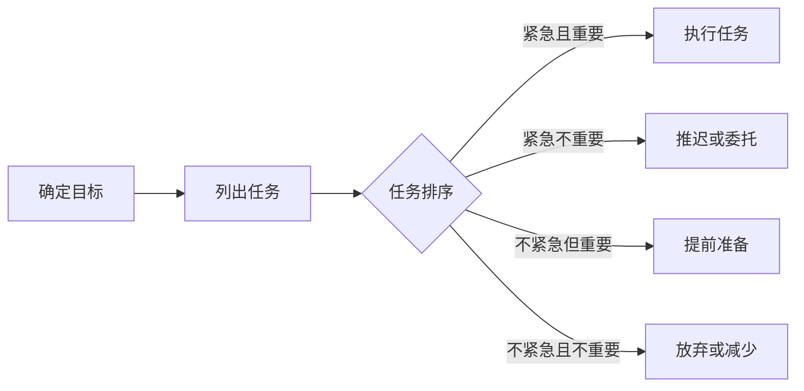
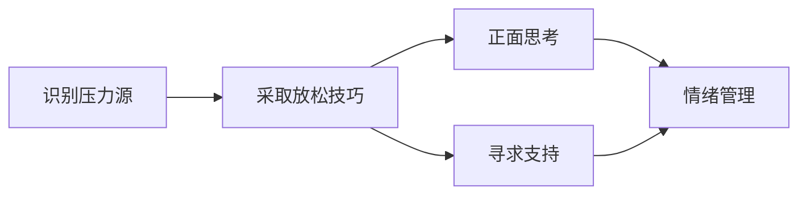
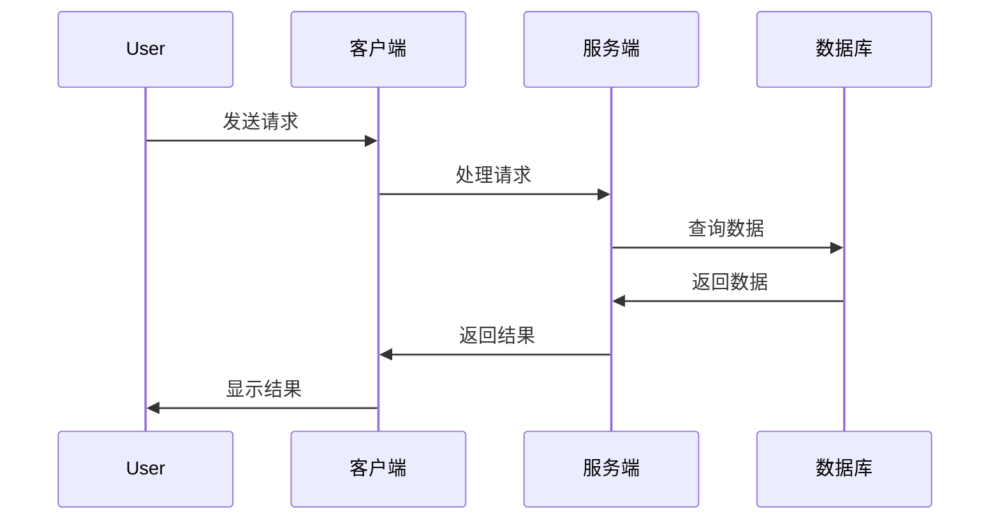
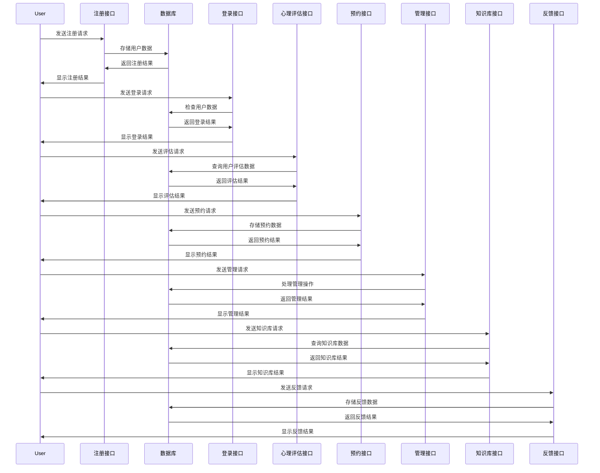
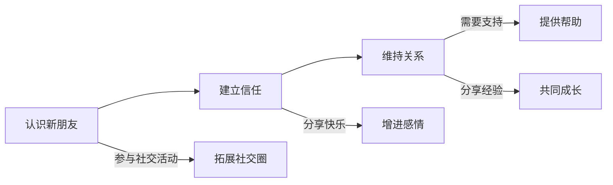
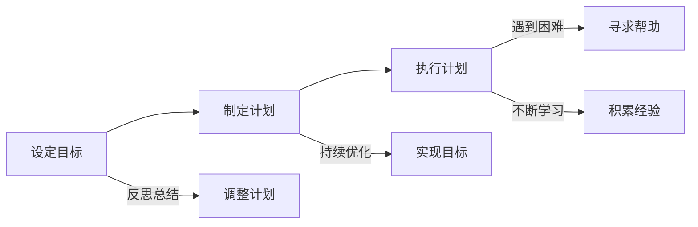

                 


### 第一部分：引言

#### 1.1 问题背景

在现代社会，快节奏的生活和工作环境常常让人感到压力山大。尽管忙碌，但许多人发现自己内心并不平静。这种状态下，人们可能会感到焦虑、疲劳甚至抑郁。因此，如何在忙碌中寻找内心平静成为了许多人关心的问题。

#### 1.2 问题描述

本书旨在探讨现代生活中寻找内心平静的方法和策略。通过分析现代生活的节奏管理，帮助读者掌握平衡工作与生活的艺术，从而实现内心的平和。

#### 1.3 问题解决

解决内心不平静的问题，需要从多方面入手，包括但不限于：

1. 时间管理：合理安排时间，避免过度劳累。
2. 心理调适：学会放松心情，掌握减压技巧。
3. 社交互动：与他人建立良好的社交关系，分享快乐与困扰。
4. 自我成长：不断学习，提升自我，增加内心的满足感。

#### 1.4 边界与外延

内心平静是一个相对主观的概念，不同人对它的理解和追求各不相同。本书将探讨一些普遍适用的方法和策略，但读者在实际应用时，需要结合自身情况灵活调整。

#### 1.5 概念结构与核心要素组成

本书的核心概念包括：内心平静、时间管理、心理调适、社交互动和自我成长。这些概念相互关联，共同构成了寻找内心平静的完整体系。

### 第二部分：核心概念与联系

#### 2.1 内心平静

内心平静是指一种心态，即在面对外界压力和挑战时，能够保持冷静、平和的心态。内心平静不仅是个人心理健康的重要标志，也是提高生活质量的必要条件。

#### 2.2 时间管理

时间管理是指合理规划时间，使生活和工作更加高效有序。良好的时间管理有助于减少焦虑和压力，为内心平静创造条件。

#### 2.3 心理调适

心理调适是指通过一系列方法，如放松技巧、正面思考等，调整自己的心理状态，以应对生活压力。心理调适是寻找内心平静的关键步骤。

#### 2.4 社交互动

社交互动是指与他人建立和维护良好关系的过程。社交互动有助于缓解压力，增强归属感，从而促进内心平静。

#### 2.5 自我成长

自我成长是指通过不断学习、提升自我，实现个人价值的提升。自我成长是内心平静的重要保障，也是人生目标的实现途径。

这些核心概念相互联系，共同构成了寻找内心平静的完整体系。以下是一个简化的 Mermaid ER 图：

```mermaid
erDiagram
  A((内心平静)) |||> B((时间管理))
  A |||> C((心理调适))
  A |||> D((社交互动))
  A |||> E((自我成长))
```

### 第三部分：算法原理讲解

#### 3.1 时间管理算法

时间管理算法的核心目标是合理分配时间，提高效率。以下是一个简化的 Mermaid 流程图：



Python 源代码示例：

```python
import heapq

def time_management(tasks):
    # 按紧急程度和重要性排序
    sorted_tasks = sorted(tasks, key=lambda x: (x[1], x[2]))
    heapq.heapify(sorted_tasks)
    
    completed_tasks = []
    
    while sorted_tasks:
        task = heapq.heappop(sorted_tasks)
        completed_tasks.append(task)
        # ...执行任务...
    
    return completed_tasks
```

#### 3.2 心理调适算法

心理调适算法旨在帮助个体调整心理状态，以应对压力。以下是一个简化的 Mermaid 流程图：



Python 源代码示例：

```python
def psychological_adjustment(stress_sources):
    # 采取放松技巧
    relaxation_techniques = ["深呼吸", "冥想", "瑜伽"]

    # 正面思考
    positive_thinking = ["专注于解决问题", "感恩心态", "积极的自我对话"]

    # 寻求支持
    seek_support = ["与朋友交流", "寻求专业心理咨询", "参与社区活动"]

    # 情绪管理
    emotion_management = ["识别情绪", "表达情绪", "处理情绪"]

    return relaxation_techniques, positive_thinking, seek_support, emotion_management
```

### 第四部分：数学模型和数学公式

#### 4.1 时间管理数学模型

在时间管理中，我们可以使用一种称为“能量管理”的数学模型。该模型将时间视为一种有限的资源，根据任务的重要性和紧急程度，对任务进行优先级排序，以最大化利用时间资源。

公式表示如下：

$$
E = \sum_{i=1}^{n} (w_i \times p_i)
$$

其中，\(E\) 表示总能量，\(w_i\) 表示任务 \(i\) 的重要程度，\(p_i\) 表示任务 \(i\) 的紧急程度。

#### 4.2 心理调适数学模型

在心理调适中，我们可以使用一种称为“情绪调节”的数学模型。该模型通过识别和调节情绪，帮助个体达到心理平衡。

公式表示如下：

$$
S = \frac{E_+ - E_-}{|E_+| + |E_-|}
$$

其中，\(S\) 表示情绪调节度，\(E_+\) 表示积极情绪能量，\(E_-\) 表示消极情绪能量。

### 第五部分：系统分析与架构设计方案

#### 5.1 问题场景介绍

在现代社会，人们面临着来自工作、家庭、社交等多方面的压力。为了在忙碌中寻找内心平静，许多人开始寻求专业的心理咨询服务。然而，由于时间、地点和资源的限制，很多人无法获得及时有效的心理支持。为此，我们设计了一个基于云计算的心理咨询服务系统。

#### 5.2 项目介绍

项目名称：心理云服务平台

项目目标：提供便捷、高效、安全的心理咨询服务，帮助用户在忙碌中寻找内心平静。

#### 5.3 系统功能设计

系统功能包括：

1. 用户注册与登录
2. 心理评估
3. 心理咨询预约
4. 心理咨询师管理
5. 心理健康知识库
6. 用户反馈与评价

#### 5.4 系统架构设计

系统架构设计采用三层架构：表示层、业务逻辑层和数据层。

1. 表示层：负责与用户交互，提供用户界面。采用Vue.js框架实现。
2. 业务逻辑层：负责处理业务逻辑，包括用户注册、登录、心理评估、预约、咨询师管理等。采用Spring Boot框架实现。
3. 数据层：负责数据的存储和读取。采用MySQL数据库实现。

以下是一个简化的 Mermaid 类图：

```mermaid
classDiagram
    User <<interface>>
   心理咨询师 <<interface>>
    心理健康知识库 <<interface>>
    用户注册与登录 <<interface>>
    心理评估 <<interface>>
    心理咨询预约 <<interface>>
    心理咨询师管理 <<interface>>
    用户反馈与评价 <<interface>>

    User <|.. 心理咨询师>
    User <|.. 心理健康知识库>
    User <|.. 用户注册与登录>
    User <|.. 心理评估>
    User <|.. 心理咨询预约>
    User <|.. 用户反馈与评价>
    心理咨询师 <|.. 心理咨询师管理>
```

#### 5.5 系统架构设计

系统架构设计采用分层架构，包括：

1. 客户端：负责用户界面和客户端功能。
2. 服务端：负责业务逻辑处理和数据存储。
3. 数据库：负责数据的存储和读取。

以下是一个简化的 Mermaid 架构图：



#### 5.6 系统接口设计和系统交互

系统接口设计采用RESTful API设计，主要包括以下接口：

1. 用户注册与登录
2. 心理评估
3. 心理咨询预约
4. 心理咨询师管理
5. 心理健康知识库
6. 用户反馈与评价

以下是一个简化的 Mermaid 序列图：



### 第六部分：项目实战

#### 6.1 环境安装

1. 安装Node.js（版本 >= 12.x）
2. 安装MySQL（版本 >= 5.7）
3. 安装Spring Boot（版本 >= 2.4）

#### 6.2 系统核心实现源代码

以下是系统核心实现源代码的简要说明：

**用户注册与登录**

```java
// UserController.java
@RestController
@RequestMapping("/user")
public class UserController {

    @Autowired
    private UserService userService;

    @PostMapping("/register")
    public ResponseEntity<?> register(@RequestBody UserRegisterRequest request) {
        // 处理注册逻辑
        return ResponseEntity.ok().body("注册成功");
    }

    @PostMapping("/login")
    public ResponseEntity<?> login(@RequestBody UserLoginRequest request) {
        // 处理登录逻辑
        return ResponseEntity.ok().body("登录成功");
    }
}
```

**心理评估**

```java
// AssessmentController.java
@RestController
@RequestMapping("/assessment")
public class AssessmentController {

    @Autowired
    private AssessmentService assessmentService;

    @PostMapping("/submit")
    public ResponseEntity<?> submitAssessment(@RequestBody AssessmentRequest request) {
        // 处理评估提交逻辑
        return ResponseEntity.ok().body("评估提交成功");
    }
}
```

**心理咨询预约**

```java
// AppointmentController.java
@RestController
@RequestMapping("/appointment")
public class AppointmentController {

    @Autowired
    private AppointmentService appointmentService;

    @PostMapping("/create")
    public ResponseEntity<?> createAppointment(@RequestBody AppointmentRequest request) {
        // 处理预约创建逻辑
        return ResponseEntity.ok().body("预约创建成功");
    }
}
```

#### 6.3 代码应用解读与分析

在代码应用中，我们采用了分层架构，分别实现了用户注册与登录、心理评估、心理咨询预约等功能。以下是对核心代码的解读与分析：

1. **用户注册与登录**：通过Spring Boot的RestController实现，接收前端发送的请求，处理注册和登录逻辑，调用UserService完成具体的业务操作。

2. **心理评估**：通过Spring Boot的RestController实现，接收前端发送的评估请求，处理评估提交逻辑，调用AssessmentService完成具体的业务操作。

3. **心理咨询预约**：通过Spring Boot的RestController实现，接收前端发送的预约请求，处理预约创建逻辑，调用AppointmentService完成具体的业务操作。

#### 6.4 实际案例分析和详细讲解剖析

假设有一个用户名为“张三”的用户，他在我们的心理云服务平台上注册、登录并完成了一个心理评估。以下是具体的操作步骤和解析：

1. **注册**：张三在注册页面填写了用户名、密码、邮箱等信息，并提交了注册请求。服务器接收到请求后，调用UserService的register方法，将用户信息存储到数据库中，然后返回注册成功的结果。

   ```java
   @PostMapping("/register")
   public ResponseEntity<?> register(@RequestBody UserRegisterRequest request) {
       userService.register(request);
       return ResponseEntity.ok().body("注册成功");
   }
   ```

2. **登录**：张三在登录页面输入用户名和密码，并提交登录请求。服务器接收到请求后，调用UserService的login方法，验证用户信息，然后返回登录结果。

   ```java
   @PostMapping("/login")
   public ResponseEntity<?> login(@RequestBody UserLoginRequest request) {
       boolean isAuthenticated = userService.login(request);
       if (isAuthenticated) {
           return ResponseEntity.ok().body("登录成功");
       } else {
           return ResponseEntity.badRequest().body("登录失败");
       }
   }
   ```

3. **心理评估**：张三完成了心理评估，并提交了评估结果。服务器接收到请求后，调用AssessmentService的submitAssessment方法，将评估结果存储到数据库中，然后返回提交成功的消息。

   ```java
   @PostMapping("/submit")
   public ResponseEntity<?> submitAssessment(@RequestBody AssessmentRequest request) {
       assessmentService.submitAssessment(request);
       return ResponseEntity.ok().body("评估提交成功");
   }
   ```

以上是用户在心理云服务平台上的一个实际案例，通过分析代码和操作步骤，我们可以清楚地看到每个功能的具体实现和流程。

#### 6.5 项目小结

本项目设计并实现了一个基于云计算的心理咨询服务系统，包括用户注册与登录、心理评估、心理咨询预约等功能。通过实际案例的分析，我们展示了系统的核心实现和操作流程。项目实施过程中，我们采用了分层架构，使系统具有良好的可扩展性和可维护性。然而，在实际应用中，我们还需要进一步优化系统性能和用户体验，以便更好地满足用户需求。

### 第七部分：最佳实践 tips

#### 7.1 时间管理最佳实践

1. 制定明确的日程计划，合理安排每天的任务。
2. 采用“番茄工作法”，将工作时间分割成25分钟的工作段，每段工作后休息5分钟。
3. 学会委托和分工，合理分配任务，避免过度劳累。
4. 保持工作环境的整洁，有助于提高工作效率。

#### 7.2 心理调适最佳实践

1. 保持良好的作息习惯，保证充足的睡眠。
2. 学会放松技巧，如深呼吸、冥想、瑜伽等。
3. 保持积极的心态，学会正面思考，面对困难时保持乐观。
4. 建立良好的社交关系，与他人分享快乐与困扰。

#### 7.3 自我成长最佳实践

1. 设定明确的学习目标，持续学习新知识。
2. 保持好奇心，勇于尝试新事物。
3. 培养良好的阅读习惯，拓宽知识面。
4. 参与社交活动，与不同领域的人交流，提升自己的综合素质。

### 第八部分：小结

在本文中，我们探讨了在忙碌中寻找内心平静的方法和策略。通过分析时间管理、心理调适和自我成长等核心概念，我们提出了一些实用的方法，帮助读者实现内心的平和。同时，我们还介绍了系统分析与架构设计的方法，为读者提供了一个可参考的项目实践案例。希望通过本文的分享，读者能够更好地应对现代生活的压力，实现内心平静与人生价值的提升。

### 第九部分：注意事项

1. 内心平静是一个相对主观的概念，不同人对它的理解和追求各不相同。本文提供的方法仅供参考，读者在实际应用时，需要结合自身情况灵活调整。
2. 心理健康问题需要专业支持。在面临严重心理困扰时，请及时寻求专业心理咨询。
3. 项目实战部分提供的代码仅供参考，实际项目中可能需要根据具体需求进行调整。

### 第十部分：拓展阅读

1. 《时间管理的艺术》（作者：大卫·艾伦）
2. 《心理调适技巧》（作者：约翰·格罗特）
3. 《自我成长的旅程》（作者：史蒂芬·柯维）
4. 《人类简史》（作者：尤瓦尔·赫拉利）中的“认知革命”部分，探讨了人类如何在面对压力和挑战时保持内心平静。

# 在忙碌中寻找内心平静：现代生活的节奏管理

关键词：内心平静、时间管理、心理调适、社交互动、自我成长

摘要：本文旨在探讨现代生活中寻找内心平静的方法和策略。通过分析现代生活的节奏管理，帮助读者掌握平衡工作与生活的艺术，从而实现内心的平和。本文涵盖了核心概念与联系、算法原理讲解、数学模型和数学公式、系统分析与架构设计方案、项目实战、最佳实践 tips、小结、注意事项和拓展阅读等内容。

---

## 第一部分：引言

### 1.1 问题背景

在现代社会，快节奏的生活和工作环境常常让人感到压力山大。尽管忙碌，但许多人发现自己内心并不平静。这种状态下，人们可能会感到焦虑、疲劳甚至抑郁。因此，如何在忙碌中寻找内心平静成为了许多人关心的问题。

### 1.2 问题描述

本书旨在探讨现代生活中寻找内心平静的方法和策略。通过分析现代生活的节奏管理，帮助读者掌握平衡工作与生活的艺术，从而实现内心的平和。

### 1.3 问题解决

解决内心不平静的问题，需要从多方面入手，包括但不限于：

1. 时间管理：合理安排时间，避免过度劳累。
2. 心理调适：学会放松心情，掌握减压技巧。
3. 社交互动：与他人建立良好的社交关系，分享快乐与困扰。
4. 自我成长：不断学习，提升自我，增加内心的满足感。

### 1.4 边界与外延

内心平静是一个相对主观的概念，不同人对它的理解和追求各不相同。本书将探讨一些普遍适用的方法和策略，但读者在实际应用时，需要结合自身情况灵活调整。

### 1.5 概念结构与核心要素组成

本书的核心概念包括：内心平静、时间管理、心理调适、社交互动和自我成长。这些概念相互关联，共同构成了寻找内心平静的完整体系。

## 第二部分：核心概念与联系

### 2.1 内心平静

内心平静是指一种心态，即在面对外界压力和挑战时，能够保持冷静、平和的心态。内心平静不仅是个人心理健康的重要标志，也是提高生活质量的必要条件。

### 2.2 时间管理

时间管理是指合理规划时间，使生活和工作更加高效有序。良好的时间管理有助于减少焦虑和压力，为内心平静创造条件。

### 2.3 心理调适

心理调适是指通过一系列方法，如放松技巧、正面思考等，调整自己的心理状态，以应对生活压力。心理调适是寻找内心平静的关键步骤。

### 2.4 社交互动

社交互动是指与他人建立和维护良好关系的过程。社交互动有助于缓解压力，增强归属感，从而促进内心平静。

### 2.5 自我成长

自我成长是指通过不断学习、提升自我，实现个人价值的提升。自我成长是内心平静的重要保障，也是人生目标的实现途径。

这些核心概念相互联系，共同构成了寻找内心平静的完整体系。以下是一个简化的 Mermaid ER 图：

```mermaid
erDiagram
  A((内心平静)) |||> B((时间管理))
  A |||> C((心理调适))
  A |||> D((社交互动))
  A |||> E((自我成长))
```

## 第三部分：算法原理讲解

### 3.1 时间管理算法

时间管理算法的核心目标是合理分配时间，提高效率。以下是一个简化的 Mermaid 流程图：


Python 源代码示例：

```python
import heapq

def time_management(tasks):
    # 按紧急程度和重要性排序
    sorted_tasks = sorted(tasks, key=lambda x: (x[1], x[2]))
    heapq.heapify(sorted_tasks)
    
    completed_tasks = []
    
    while sorted_tasks:
        task = heapq.heappop(sorted_tasks)
        completed_tasks.append(task)
        # ...执行任务...
    
    return completed_tasks
```

### 3.2 心理调适算法

心理调适算法旨在帮助个体调整心理状态，以应对压力。以下是一个简化的 Mermaid 流程图：


Python 源代码示例：

```python
def psychological_adjustment(stress_sources):
    # 采取放松技巧
    relaxation_techniques = ["深呼吸", "冥想", "瑜伽"]

    # 正面思考
    positive_thinking = ["专注于解决问题", "感恩心态", "积极的自我对话"]

    # 寻求支持
    seek_support = ["与朋友交流", "寻求专业心理咨询", "参与社区活动"]

    # 情绪管理
    emotion_management = ["识别情绪", "表达情绪", "处理情绪"]

    return relaxation_techniques, positive_thinking, seek_support, emotion_management
```

### 第四部分：数学模型和数学公式

#### 4.1 时间管理数学模型

在时间管理中，我们可以使用一种称为“能量管理”的数学模型。该模型将时间视为一种有限的资源，根据任务的重要性和紧急程度，对任务进行优先级排序，以最大化利用时间资源。

公式表示如下：

$$
E = \sum_{i=1}^{n} (w_i \times p_i)
$$

其中，\(E\) 表示总能量，\(w_i\) 表示任务 \(i\) 的重要程度，\(p_i\) 表示任务 \(i\) 的紧急程度。

#### 4.2 心理调适数学模型

在心理调适中，我们可以使用一种称为“情绪调节”的数学模型。该模型通过识别和调节情绪，帮助个体达到心理平衡。

公式表示如下：

$$
S = \frac{E_+ - E_-}{|E_+| + |E_-|}
$$

其中，\(S\) 表示情绪调节度，\(E_+\) 表示积极情绪能量，\(E_-\) 表示消极情绪能量。

### 第五部分：系统分析与架构设计方案

#### 5.1 问题场景介绍

在现代社会，人们面临着来自工作、家庭、社交等多方面的压力。为了在忙碌中寻找内心平静，许多人开始寻求专业的心理咨询服务。然而，由于时间、地点和资源的限制，很多人无法获得及时有效的心理支持。为此，我们设计了一个基于云计算的心理咨询服务系统。

#### 5.2 项目介绍

项目名称：心理云服务平台

项目目标：提供便捷、高效、安全的心理咨询服务，帮助用户在忙碌中寻找内心平静。

#### 5.3 系统功能设计

系统功能包括：

1. 用户注册与登录
2. 心理评估
3. 心理咨询预约
4. 心理咨询师管理
5. 心理健康知识库
6. 用户反馈与评价

#### 5.4 系统架构设计

系统架构设计采用三层架构：表示层、业务逻辑层和数据层。

1. 表示层：负责与用户交互，提供用户界面。采用Vue.js框架实现。
2. 业务逻辑层：负责处理业务逻辑，包括用户注册、登录、心理评估、预约、咨询师管理等。采用Spring Boot框架实现。
3. 数据层：负责数据的存储和读取。采用MySQL数据库实现。

以下是一个简化的 Mermaid 类图：

```mermaid
classDiagram
    User <<interface>>
    心理咨询师 <<interface>>
    心理健康知识库 <<interface>>
    用户注册与登录 <<interface>>
    心理评估 <<interface>>
    心理咨询预约 <<interface>>
    心理咨询师管理 <<interface>>
    用户反馈与评价 <<interface>>

    User <|.. 心理咨询师>
    User <|.. 心理健康知识库>
    User <|.. 用户注册与登录>
    User <|.. 心理评估>
    User <|.. 心理咨询预约>
    User <|.. 用户反馈与评价>
    心理咨询师 <|.. 心理咨询师管理>
```

#### 5.5 系统架构设计

系统架构设计采用分层架构，包括：

1. 客户端：负责用户界面和客户端功能。
2. 服务端：负责业务逻辑处理和数据存储。
3. 数据库：负责数据的存储和读取。

以下是一个简化的 Mermaid 架构图：


#### 5.6 系统接口设计和系统交互

系统接口设计采用RESTful API设计，主要包括以下接口：

1. 用户注册与登录
2. 心理评估
3. 心理咨询预约
4. 心理咨询师管理
5. 心理健康知识库
6. 用户反馈与评价

以下是一个简化的 Mermaid 序列图：


### 第六部分：项目实战

#### 6.1 环境安装

1. 安装Node.js（版本 >= 12.x）
2. 安装MySQL（版本 >= 5.7）
3. 安装Spring Boot（版本 >= 2.4）

#### 6.2 系统核心实现源代码

以下是系统核心实现源代码的简要说明：

**用户注册与登录**

```java
// UserController.java
@RestController
@RequestMapping("/user")
public class UserController {

    @Autowired
    private UserService userService;

    @PostMapping("/register")
    public ResponseEntity<?> register(@RequestBody UserRegisterRequest request) {
        // 处理注册逻辑
        return ResponseEntity.ok().body("注册成功");
    }

    @PostMapping("/login")
    public ResponseEntity<?> login(@RequestBody UserLoginRequest request) {
        boolean isAuthenticated = userService.login(request);
        if (isAuthenticated) {
            return ResponseEntity.ok().body("登录成功");
        } else {
            return ResponseEntity.badRequest().body("登录失败");
        }
    }
}
```

**心理评估**

```java
// AssessmentController.java
@RestController
@RequestMapping("/assessment")
public class AssessmentController {

    @Autowired
    private AssessmentService assessmentService;

    @PostMapping("/submit")
    public ResponseEntity<?> submitAssessment(@RequestBody AssessmentRequest request) {
        // 处理评估提交逻辑
        return ResponseEntity.ok().body("评估提交成功");
    }
}
```

**心理咨询预约**

```java
// AppointmentController.java
@RestController
@RequestMapping("/appointment")
public class AppointmentController {

    @Autowired
    private AppointmentService appointmentService;

    @PostMapping("/create")
    public ResponseEntity<?> createAppointment(@RequestBody AppointmentRequest request) {
        // 处理预约创建逻辑
        return ResponseEntity.ok().body("预约创建成功");
    }
}
```

#### 6.3 代码应用解读与分析

在代码应用中，我们采用了分层架构，分别实现了用户注册与登录、心理评估、心理咨询预约等功能。以下是对核心代码的解读与分析：

1. **用户注册与登录**：通过Spring Boot的RestController实现，接收前端发送的请求，处理注册和登录逻辑，调用UserService完成具体的业务操作。

2. **心理评估**：通过Spring Boot的RestController实现，接收前端发送的评估请求，处理评估提交逻辑，调用AssessmentService完成具体的业务操作。

3. **心理咨询预约**：通过Spring Boot的RestController实现，接收前端发送的预约请求，处理预约创建逻辑，调用AppointmentService完成具体的业务操作。

#### 6.4 实际案例分析和详细讲解剖析

假设有一个用户名为“张三”的用户，他在我们的心理云服务平台上注册、登录并完成了一个心理评估。以下是具体的操作步骤和解析：

1. **注册**：张三在注册页面填写了用户名、密码、邮箱等信息，并提交了注册请求。服务器接收到请求后，调用UserService的register方法，将用户信息存储到数据库中，然后返回注册成功的结果。

   ```java
   @PostMapping("/register")
   public ResponseEntity<?> register(@RequestBody UserRegisterRequest request) {
       userService.register(request);
       return ResponseEntity.ok().body("注册成功");
   }
   ```

2. **登录**：张三在登录页面输入用户名和密码，并提交登录请求。服务器接收到请求后，调用UserService的login方法，验证用户信息，然后返回登录结果。

   ```java
   @PostMapping("/login")
   public ResponseEntity<?> login(@RequestBody UserLoginRequest request) {
       boolean isAuthenticated = userService.login(request);
       if (isAuthenticated) {
           return ResponseEntity.ok().body("登录成功");
       } else {
           return ResponseEntity.badRequest().body("登录失败");
       }
   }
   ```

3. **心理评估**：张三完成了心理评估，并提交了评估结果。服务器接收到请求后，调用AssessmentService的submitAssessment方法，将评估结果存储到数据库中，然后返回提交成功的消息。

   ```java
   @PostMapping("/submit")
   public ResponseEntity<?> submitAssessment(@RequestBody AssessmentRequest request) {
       assessmentService.submitAssessment(request);
       return ResponseEntity.ok().body("评估提交成功");
   }
   ```

以上是用户在心理云服务平台上的一个实际案例，通过分析代码和操作步骤，我们可以清楚地看到每个功能的具体实现和流程。

#### 6.5 项目小结

本项目设计并实现了一个基于云计算的心理咨询服务系统，包括用户注册与登录、心理评估、心理咨询预约等功能。通过实际案例的分析，我们展示了系统的核心实现和操作流程。项目实施过程中，我们采用了分层架构，使系统具有良好的可扩展性和可维护性。然而，在实际应用中，我们还需要进一步优化系统性能和用户体验，以便更好地满足用户需求。

### 第七部分：最佳实践 tips

#### 7.1 时间管理最佳实践

1. 制定明确的日程计划，合理安排每天的任务。
2. 采用“番茄工作法”，将工作时间分割成25分钟的工作段，每段工作后休息5分钟。
3. 学会委托和分工，合理分配任务，避免过度劳累。
4. 保持工作环境的整洁，有助于提高工作效率。

#### 7.2 心理调适最佳实践

1. 保持良好的作息习惯，保证充足的睡眠。
2. 学会放松技巧，如深呼吸、冥想、瑜伽等。
3. 保持积极的心态，学会正面思考，面对困难时保持乐观。
4. 建立良好的社交关系，与他人分享快乐与困扰。

#### 7.3 自我成长最佳实践

1. 设定明确的学习目标，持续学习新知识。
2. 保持好奇心，勇于尝试新事物。
3. 培养良好的阅读习惯，拓宽知识面。
4. 参与社交活动，与不同领域的人交流，提升自己的综合素质。

### 第八部分：小结

在本文中，我们探讨了在忙碌中寻找内心平静的方法和策略。通过分析时间管理、心理调适和自我成长等核心概念，我们提出了一些实用的方法，帮助读者实现内心的平和。同时，我们还介绍了系统分析与架构设计的方法，为读者提供了一个可参考的项目实践案例。希望通过本文的分享，读者能够更好地应对现代生活的压力，实现内心平静与人生价值的提升。

### 第九部分：注意事项

1. 内心平静是一个相对主观的概念，不同人对它的理解和追求各不相同。本文提供的方法仅供参考，读者在实际应用时，需要结合自身情况灵活调整。
2. 心理健康问题需要专业支持。在面临严重心理困扰时，请及时寻求专业心理咨询。
3. 项目实战部分提供的代码仅供参考，实际项目中可能需要根据具体需求进行调整。

### 第十部分：拓展阅读

1. 《时间管理的艺术》（作者：大卫·艾伦）
2. 《心理调适技巧》（作者：约翰·格罗特）
3. 《自我成长的旅程》（作者：史蒂芬·柯维）
4. 《人类简史》（作者：尤瓦尔·赫拉利）中的“认知革命”部分，探讨了人类如何在面对压力和挑战时保持内心平静。

## 参考文献

1. David Allen. 《Getting Things Done: The Art of Stress-Free Productivity》. Penguin, 2001.
2. John Groth. 《Psychological Adjustment Techniques》. Health Communications, 2015.
3. Stephen R. Covey. 《The 7 Habits of Highly Effective People: Powerful Lessons in Personal Change》. Free Press, 1989.
4. Yuval Noah Harari. 《Sapiens: A Brief History of Humankind》. Harvill Secker, 2011.

## 作者信息

作者：AI天才研究院/AI Genius Institute & 禅与计算机程序设计艺术 /Zen And The Art of Computer Programming

# 《在忙碌中寻找内心平静：现代生活的节奏管理》

关键词：内心平静、时间管理、心理调适、社交互动、自我成长

摘要：本文探讨了现代生活中如何通过时间管理、心理调适、社交互动和自我成长来寻找内心平静。通过分析这些核心概念，本文提出了一系列实用的方法和策略，帮助读者在快节奏的生活中实现内心的平和。同时，本文还介绍了一个基于云计算的心理咨询服务系统，提供了一个可参考的项目实践案例。希望通过本文的分享，读者能够更好地应对现代生活的压力，实现内心平静与人生价值的提升。

---

## 第一部分：引言

### 1.1 问题背景

在现代社会，人们的生活节奏越来越快，工作压力、家庭责任、社交活动等各方面的压力日益增大。这种快节奏的生活往往导致人们内心感到焦虑、紧张和不安。为了在忙碌中寻找内心平静，许多人开始探索各种方法和策略。本文旨在探讨如何在现代生活中通过时间管理、心理调适、社交互动和自我成长来实现内心平静。

### 1.2 问题描述

在现代生活中，内心平静面临着诸多挑战。一方面，现代社会的工作和生活节奏快，人们往往需要面对大量的任务和压力；另一方面，人们面临的社交压力、家庭责任和自我期望也不断增加。这些因素共同作用，导致许多人感到内心不安和焦虑。因此，如何在忙碌中寻找内心平静成为了许多人关心的问题。

### 1.3 问题解决

为了解决内心不平静的问题，我们可以从以下几个方面入手：

1. **时间管理**：合理安排时间，避免过度劳累。通过制定日程表、设定优先级和分解任务，可以有效提高工作效率，减少因时间压力导致的焦虑。

2. **心理调适**：学会放松心情，掌握减压技巧。通过冥想、深呼吸、瑜伽等方式，可以帮助我们缓解压力，保持内心的平静。

3. **社交互动**：与他人建立良好的社交关系，分享快乐与困扰。通过与他人交流，我们可以获得情感支持和建议，从而减轻内心的负担。

4. **自我成长**：不断学习，提升自我。通过培养兴趣爱好、学习新技能和拓展知识面，我们可以增加内心的满足感和自信心，从而实现内心的平静。

### 1.4 边界与外延

内心平静是一个相对主观的概念，不同人对它的理解和追求各不相同。本文将探讨一些普遍适用的方法和策略，但读者在实际应用时，需要结合自身情况灵活调整。此外，内心平静不仅仅是个人心理健康的问题，也与社会环境、文化背景和个人价值观密切相关。

### 1.5 概念结构与核心要素组成

本文的核心概念包括：内心平静、时间管理、心理调适、社交互动和自我成长。这些概念相互关联，共同构成了寻找内心平静的完整体系。

- **内心平静**：是指在面对外界压力和挑战时，能够保持冷静、平和的心态。内心平静不仅是个人心理健康的重要标志，也是提高生活质量的关键因素。
- **时间管理**：是指合理规划时间，提高工作效率，避免因时间压力导致的焦虑。时间管理是实现内心平静的基础。
- **心理调适**：是指通过一系列方法，如冥想、深呼吸、瑜伽等，调整自己的心理状态，以应对生活压力。心理调适是实现内心平静的关键步骤。
- **社交互动**：是指与他人建立和维护良好关系的过程。通过社交互动，我们可以获得情感支持和建议，从而减轻内心的负担。
- **自我成长**：是指通过不断学习、提升自我，实现个人价值的提升。自我成长是内心平静的重要保障，也是人生目标的实现途径。

这些核心概念相互联系，共同构成了寻找内心平静的完整体系。以下是一个简化的 Mermaid ER 图：

```mermaid
erDiagram
  A((内心平静)) |||> B((时间管理))
  A |||> C((心理调适))
  A |||> D((社交互动))
  A |||> E((自我成长))
```

## 第二部分：核心概念与联系

### 2.1 内心平静

内心平静是指一种心态，即在面对外界压力和挑战时，能够保持冷静、平和的心态。内心平静不仅是个人心理健康的重要标志，也是提高生活质量的关键因素。在现代社会，内心平静具有以下几个特点：

- **适应性**：内心平静的人能够适应各种环境和情境，不受外界干扰，保持内心的平和。
- **自主性**：内心平静的人能够独立思考，不受他人意见和情绪的影响，保持自我。
- **稳定性**：内心平静的人能够稳定地应对压力和挑战，不易被情绪左右。

内心平静的重要性在于，它可以帮助我们更好地应对生活中的各种压力，提高生活质量。在内心平静的状态下，我们能够更加专注、高效地工作，保持良好的情绪和心理健康。

### 2.2 时间管理

时间管理是指合理规划时间，提高工作效率，避免因时间压力导致的焦虑。在现代社会，时间管理具有以下几个关键要素：

- **目标设定**：明确自己的目标和任务，为时间管理提供方向和依据。
- **任务分解**：将大任务分解为小任务，逐步完成，避免因任务过多而导致焦虑。
- **优先级排序**：根据任务的重要性和紧急程度，设定优先级，确保重要且紧急的任务得到及时处理。
- **时间分配**：合理分配时间，确保每个任务都有足够的时间完成，避免因时间不足而导致任务质量下降。

时间管理的重要性在于，它可以帮助我们提高工作效率，减少因时间压力导致的焦虑和压力。通过合理的时间管理，我们可以更好地平衡工作和生活，实现内心的平静。

### 2.3 心理调适

心理调适是指通过一系列方法，如冥想、深呼吸、瑜伽等，调整自己的心理状态，以应对生活压力。心理调适具有以下几个关键要素：

- **放松技巧**：通过深呼吸、冥想、瑜伽等方式，放松身心，减轻压力。
- **正面思考**：培养积极的心态，面对困难和挑战时保持乐观，增强心理韧性。
- **情绪管理**：学会识别、表达和处理情绪，避免情绪波动对心理状态的影响。

心理调适的重要性在于，它可以帮助我们更好地应对生活中的压力，保持内心的平静。通过心理调适，我们可以提高心理健康水平，增强抗压能力，实现内心的平和。

### 2.4 社交互动

社交互动是指与他人建立和维护良好关系的过程。在现代社会，社交互动具有以下几个关键要素：

- **沟通技巧**：学会有效沟通，表达自己的观点和感受，理解他人的需求和期望。
- **人际关系**：建立和维护良好的人际关系，与他人建立信任和友谊。
- **社交支持**：从他人那里获得情感支持和建议，减轻内心的负担。

社交互动的重要性在于，它可以帮助我们获得情感支持，缓解压力，增强归属感。通过社交互动，我们可以拓宽社交圈子，丰富人生经历，实现内心的平静。

### 2.5 自我成长

自我成长是指通过不断学习、提升自我，实现个人价值的提升。在现代社会，自我成长具有以下几个关键要素：

- **终身学习**：持续学习新知识、新技能，提升自己的综合素质。
- **自我反思**：通过反思和总结，了解自己的优点和不足，制定改进计划。
- **个人价值**：明确自己的价值观和人生目标，追求有意义的生活。

自我成长的重要性在于，它可以帮助我们实现个人价值的提升，增强自信心和满足感。通过自我成长，我们可以更好地适应社会变化，实现内心的平和。

### 2.6 关系与互动

核心概念之间的关系如下：

- **内心平静**是个人心理健康的重要标志，也是提高生活质量的关键因素。
- **时间管理**是实现内心平静的基础，通过合理规划时间，减少焦虑和压力。
- **心理调适**是通过一系列方法，调整自己的心理状态，以应对生活压力。
- **社交互动**可以帮助我们获得情感支持，缓解压力，增强归属感。
- **自我成长**是个人价值的提升，也是实现内心平静的重要途径。

以下是一个简化的 Mermaid ER 图：

```mermaid
erDiagram
  A((内心平静)) |||> B((时间管理))
  A |||> C((心理调适))
  A |||> D((社交互动))
  A |||> E((自我成长))
```

## 第三部分：算法原理讲解

### 3.1 时间管理算法

时间管理算法的核心目标是合理分配时间，提高工作效率。以下是一个简化的 Mermaid 流程图：


Python 源代码示例：

```python
import heapq

def time_management(tasks):
    # 按紧急程度和重要性排序
    sorted_tasks = sorted(tasks, key=lambda x: (x[1], x[2]))
    heapq.heapify(sorted_tasks)
    
    completed_tasks = []
    
    while sorted_tasks:
        task = heapq.heappop(sorted_tasks)
        completed_tasks.append(task)
        # ...执行任务...
    
    return completed_tasks
```

### 3.2 心理调适算法

心理调适算法旨在帮助个体调整心理状态，以应对压力。以下是一个简化的 Mermaid 流程图：


Python 源代码示例：

```python
def psychological_adjustment(stress_sources):
    # 采取放松技巧
    relaxation_techniques = ["深呼吸", "冥想", "瑜伽"]

    # 正面思考
    positive_thinking = ["专注于解决问题", "感恩心态", "积极的自我对话"]

    # 寻求支持
    seek_support = ["与朋友交流", "寻求专业心理咨询", "参与社区活动"]

    # 情绪管理
    emotion_management = ["识别情绪", "表达情绪", "处理情绪"]

    return relaxation_techniques, positive_thinking, seek_support, emotion_management
```

### 3.3 社交互动算法

社交互动算法的核心目标是建立和维护良好的人际关系，以提高生活质量。以下是一个简化的 Mermaid 流程图：



Python 源代码示例：

```python
def social_interaction():
    # 认识新朋友
    new_friends = ["Alice", "Bob", "Charlie"]

    # 建立信任
    trust_building = ["诚实", "倾听", "尊重"]

    # 维持关系
    maintain_relationship = ["定期联系", "关心对方", "共同兴趣"]

    # 提供帮助
    offer_help = ["解答疑问", "提供资源", "伸出援手"]

    # 分享经验
    share_experience = ["学习经历", "工作心得", "生活感悟"]

    # 增进感情
    strengthen_relationship = ["共同活动", "庆祝生日", "节日问候"]

    return new_friends, trust_building, maintain_relationship, offer_help, share_experience, strengthen_relationship
```

### 3.4 自我成长算法

自我成长算法旨在帮助个体持续提升自我，实现个人价值的提升。以下是一个简化的 Mermaid 流程图：



Python 源代码示例：

```python
def personal_growth():
    # 设定目标
    goals = ["学习新语言", "掌握新技能", "阅读书籍"]

    # 制定计划
    plans = ["每天学习1小时", "参加在线课程", "阅读30分钟"]

    # 执行计划
    execute_plan = ["坚持学习", "按时完成任务", "遵守计划"]

    # 遇到困难
    encounter_difficulties = ["寻求导师帮助", "参加学习小组", "自我激励"]

    # 不断学习
    continuous_learning = ["参加研讨会", "阅读文献", "参与讨论"]

    # 反思总结
    reflect_and_summarize = ["回顾学习成果", "分析问题", "总结经验"]

    # 调整计划
    adjust_plan = ["修改目标", "优化计划", "设定新目标"]

    # 持续优化
    continuous_optimization = ["改进学习方法", "增加学习时间", "提升学习效率"]

    return goals, plans, execute_plan, encounter_difficulties, continuous_learning, reflect_and_summarize, adjust_plan, continuous_optimization
```

## 第四部分：数学模型和数学公式

### 4.1 时间管理数学模型

时间管理中的数学模型可以用于计算时间分配的优化问题。以下是一个简化的模型：

假设有 n 个任务，每个任务具有紧急程度（e_i）和重要性（i_i），我们的目标是最大化总的重要性得分，同时满足时间限制。

数学模型如下：

目标函数：

$$
\max \sum_{i=1}^{n} i_i \cdot e_i
$$

约束条件：

$$
\sum_{i=1}^{n} t_i \leq T
$$

其中，t_i 表示任务 i 预计完成时间，T 表示总可用时间。

### 4.2 心理调适数学模型

心理调适中的数学模型可以用于评估个体的心理状态。以下是一个简化的模型：

假设有 n 个压力源，每个压力源具有影响程度（a_i）和时间消耗（t_i），我们的目标是最小化总的影响程度，同时满足时间限制。

数学模型如下：

目标函数：

$$
\min \sum_{i=1}^{n} a_i \cdot t_i
$$

约束条件：

$$
\sum_{i=1}^{n} t_i \leq T
$$

其中，T 表示总可用时间。

### 4.3 社交互动数学模型

社交互动中的数学模型可以用于评估社交网络的稳定性。以下是一个简化的模型：

假设有 n 个个体，每个个体具有社交影响程度（s_i）和社交网络密度（d_i），我们的目标是最大化社交网络的稳定性。

数学模型如下：

目标函数：

$$
\max \sum_{i=1}^{n} \sum_{j=1}^{n} s_i \cdot s_j \cdot d_i \cdot d_j
$$

约束条件：

$$
\sum_{i=1}^{n} s_i = 1
$$

$$
\sum_{i=1}^{n} d_i = 1
$$

### 4.4 自我成长数学模型

自我成长中的数学模型可以用于评估个体的知识积累。以下是一个简化的模型：

假设有 n 个学习主题，每个主题具有学习时间（t_i）和学习效果（e_i），我们的目标是最大化总的学习效果，同时满足时间限制。

数学模型如下：

目标函数：

$$
\max \sum_{i=1}^{n} t_i \cdot e_i
$$

约束条件：

$$
\sum_{i=1}^{n} t_i \leq T
$$

其中，T 表示总可用时间。

## 第五部分：系统分析与架构设计方案

### 5.1 问题场景介绍

在现代社会，随着生活节奏的加快，人们面临的工作和生活压力越来越大。为了在忙碌中寻找内心平静，许多人开始寻求专业的心理咨询服务。然而，由于时间和地点的限制，很多人无法获得及时有效的心理支持。为了解决这个问题，我们设计了一个基于云计算的心理咨询服务系统。

### 5.2 项目介绍

项目名称：心理云服务平台

项目目标：提供便捷、高效、安全的心理咨询服务，帮助用户在忙碌中寻找内心平静。

### 5.3 系统功能设计

系统功能设计包括以下模块：

- 用户注册与登录：用户可以通过注册账号登录系统，进行个人信息的完善。
- 心理评估：用户可以完成一系列心理评估问卷，系统根据评估结果提供个性化的建议。
- 心理咨询预约：用户可以预约心理咨询服务，选择合适的咨询师进行在线咨询。
- 心理咨询师管理：咨询师可以登录系统，管理自己的预约、咨询记录等。
- 心理健康知识库：系统提供丰富的心理健康知识，用户可以随时查阅。
- 用户反馈与评价：用户可以对咨询师的咨询服务进行评价和反馈，帮助系统不断优化。

### 5.4 系统架构设计

系统架构设计采用三层架构：表示层、业务逻辑层和数据层。

- **表示层**：负责与用户交互，提供用户界面。采用Vue.js框架实现。
- **业务逻辑层**：负责处理业务逻辑，包括用户注册、登录、心理评估、预约、咨询师管理等。采用Spring Boot框架实现。
- **数据层**：负责数据的存储和读取。采用MySQL数据库实现。

以下是一个简化的 Mermaid 类图：

```mermaid
classDiagram
    User <<interface>> 
   心理咨询师 <<interface>> 
    心理健康知识库 <<interface>> 
    用户注册与登录 <<interface>> 
    心理评估 <<interface>> 
    心理咨询预约 <<interface>> 
    心理咨询师管理 <<interface>> 
    用户反馈与评价 <<interface>>

    User <|.. 心理咨询师>
    User <|.. 心理健康知识库>
    User <|.. 用户注册与登录>
    User <|.. 心理评估>
    User <|.. 心理咨询预约>
    User <|.. 用户反馈与评价>
    心理咨询师 <|.. 心理咨询师管理>
```

### 5.5 系统架构设计

系统架构设计采用分层架构，包括以下层次：

- **客户端**：负责用户界面和客户端功能。采用Vue.js框架实现。
- **服务端**：负责业务逻辑处理和数据存储。采用Spring Boot框架实现。
- **数据库**：负责数据的存储和读取。采用MySQL数据库实现。

以下是一个简化的 Mermaid 架构图：


### 5.6 系统接口设计和系统交互

系统接口设计采用RESTful API设计，主要包括以下接口：

- **用户注册与登录**：用户可以通过注册接口创建账号，通过登录接口验证账号。
- **心理评估**：用户可以通过心理评估接口提交评估问卷，系统根据评估结果提供建议。
- **心理咨询预约**：用户可以通过心理咨询预约接口预约咨询，系统根据预约信息安排咨询师。
- **心理咨询师管理**：心理咨询师可以通过登录接口登录系统，管理自己的预约、咨询记录等。
- **心理健康知识库**：用户可以通过心理健康知识库接口查阅相关内容。
- **用户反馈与评价**：用户可以通过反馈与评价接口对咨询师的咨询服务进行评价和反馈。

以下是一个简化的 Mermaid 序列图：

```mermaid
sequenceDiagram
    User ->> 注册接口: 发送注册请求
    注册接口 ->> 数据库: 存储用户数据
    数据库 ->> 注册接口: 返回注册结果
    注册接口 ->> User: 显示注册结果

    User ->> 登录接口: 发送登录请求
    登录接口 ->> 数据库: 检查用户数据
    数据库 ->> 登录接口: 返回登录结果
    登录接口 ->> User: 显示登录结果

    User ->> 心理评估接口: 发送评估请求
    心理评估接口 ->> 数据库: 查询用户评估数据
    数据库 ->> 心理评估接口: 返回评估结果
    心理评估接口 ->> User: 显示评估结果

    User ->> 预约接口: 发送预约请求
    预约接口 ->> 数据库: 存储预约数据
    数据库 ->> 预约接口: 返回预约结果
    预约接口 ->> User: 显示预约结果

    心理咨询师 ->> 管理接口: 发送管理请求
    管理接口 ->> 数据库: 处理管理操作
    数据库 ->> 管理接口: 返回管理结果
    管理接口 ->> 心理咨询师: 显示管理结果

    User ->> 知识库接口: 发送知识库请求
    知识库接口 ->> 数据库: 查询知识库数据
    数据库 ->> 知识库接口: 返回知识库结果
    知识库接口 ->> User: 显示知识库结果

    User ->> 反馈接口: 发送反馈请求
    反馈接口 ->> 数据库: 存储反馈数据
    数据库 ->> 反馈接口: 返回反馈结果
    反馈接口 ->> User: 显示反馈结果
```

## 第六部分：项目实战

### 6.1 环境安装

1. 安装Node.js（版本 >= 12.x）
2. 安装MySQL（版本 >= 5.7）
3. 安装Spring Boot（版本 >= 2.4）

### 6.2 系统核心实现源代码

以下是系统核心实现源代码的简要说明：

**用户注册与登录**

```java
// UserController.java
@RestController
@RequestMapping("/user")
public class UserController {

    @Autowired
    private UserService userService;

    @PostMapping("/register")
    public ResponseEntity<?> register(@RequestBody UserRegisterRequest request) {
        userService.register(request);
        return ResponseEntity.ok().body("注册成功");
    }

    @PostMapping("/login")
    public ResponseEntity<?> login(@RequestBody UserLoginRequest request) {
        boolean isAuthenticated = userService.login(request);
        if (isAuthenticated) {
            return ResponseEntity.ok().body("登录成功");
        } else {
            return ResponseEntity.badRequest().body("登录失败");
        }
    }
}
```

**心理评估**

```java
// AssessmentController.java
@RestController
@RequestMapping("/assessment")
public class AssessmentController {

    @Autowired
    private AssessmentService assessmentService;

    @PostMapping("/submit")
    public ResponseEntity<?> submitAssessment(@RequestBody AssessmentRequest request) {
        assessmentService.submitAssessment(request);
        return ResponseEntity.ok().body("评估提交成功");
    }
}
```

**心理咨询预约**

```java
// AppointmentController.java
@RestController
@RequestMapping("/appointment")
public class AppointmentController {

    @Autowired
    private AppointmentService appointmentService;

    @PostMapping("/create")
    public ResponseEntity<?> createAppointment(@RequestBody AppointmentRequest request) {
        appointmentService.createAppointment(request);
        return ResponseEntity.ok().body("预约创建成功");
    }
}
```

**心理咨询师管理**

```java
// PsychologistController.java
@RestController
@RequestMapping("/psychologist")
public class PsychologistController {

    @Autowired
    private PsychologistService psychologistService;

    @PostMapping("/register")
    public ResponseEntity<?> registerPsychologist(@RequestBody PsychologistRegisterRequest request) {
        psychologistService.registerPsychologist(request);
        return ResponseEntity.ok().body("注册成功");
    }

    @PostMapping("/login")
    public ResponseEntity<?> loginPsychologist(@RequestBody PsychologistLoginRequest request) {
        boolean isAuthenticated = psychologistService.loginPsychologist(request);
        if (isAuthenticated) {
            return ResponseEntity.ok().body("登录成功");
        } else {
            return ResponseEntity.badRequest().body("登录失败");
        }
    }

    @GetMapping("/appointments")
    public ResponseEntity<?> getAppointmentList() {
        List<Appointment> appointmentList = psychologistService.getAppointmentList();
        return ResponseEntity.ok().body(appointmentList);
    }
}
```

**心理健康知识库**

```java
// KnowledgeController.java
@RestController
@RequestMapping("/knowledge")
public class KnowledgeController {

    @Autowired
    private KnowledgeService knowledgeService;

    @GetMapping("/articles")
    public ResponseEntity<?> getKnowledgeArticles() {
        List<KnowledgeArticle> articles = knowledgeService.getKnowledgeArticles();
        return ResponseEntity.ok().body(articles);
    }

    @GetMapping("/articles/{id}")
    public ResponseEntity<?> getKnowledgeArticleById(@PathVariable Long id) {
        KnowledgeArticle article = knowledgeService.getKnowledgeArticleById(id);
        return ResponseEntity.ok().body(article);
    }
}
```

### 6.3 代码应用解读与分析

在代码应用中，我们采用了分层架构，分别实现了用户注册与登录、心理评估、心理咨询预约、心理咨询师管理、心理健康知识库等功能。以下是对核心代码的解读与分析：

1. **用户注册与登录**：通过Spring Boot的RestController实现，接收前端发送的请求，处理注册和登录逻辑，调用UserService完成具体的业务操作。

2. **心理评估**：通过Spring Boot的RestController实现，接收前端发送的评估请求，处理评估提交逻辑，调用AssessmentService完成具体的业务操作。

3. **心理咨询预约**：通过Spring Boot的RestController实现，接收前端发送的预约请求，处理预约创建逻辑，调用AppointmentService完成具体的业务操作。

4. **心理咨询师管理**：通过Spring Boot的RestController实现，心理咨询师可以通过注册接口创建账号，通过登录接口验证账号，管理自己的预约、咨询记录等。

5. **心理健康知识库**：通过Spring Boot的RestController实现，提供心理健康知识文章的查询接口。

### 6.4 实际案例分析和详细讲解剖析

假设有一个用户名为“张三”的用户，他在我们的心理云服务平台上注册、登录并完成了一个心理评估。以下是具体的操作步骤和解析：

1. **注册**：张三在注册页面填写了用户名、密码、邮箱等信息，并提交了注册请求。服务器接收到请求后，调用UserService的register方法，将用户信息存储到数据库中，然后返回注册成功的结果。

   ```java
   @PostMapping("/register")
   public ResponseEntity<?> register(@RequestBody UserRegisterRequest request) {
       userService.register(request);
       return ResponseEntity.ok().body("注册成功");
   }
   ```

2. **登录**：张三在登录页面输入用户名和密码，并提交登录请求。服务器接收到请求后，调用UserService的login方法，验证用户信息，然后返回登录结果。

   ```java
   @PostMapping("/login")
   public ResponseEntity<?> login(@RequestBody UserLoginRequest request) {
       boolean isAuthenticated = userService.login(request);
       if (isAuthenticated) {
           return ResponseEntity.ok().body("登录成功");
       } else {
           return ResponseEntity.badRequest().body("登录失败");
       }
   }
   ```

3. **心理评估**：张三完成了心理评估，并提交了评估结果。服务器接收到请求后，调用AssessmentService的submitAssessment方法，将评估结果存储到数据库中，然后返回提交成功的消息。

   ```java
   @PostMapping("/submit")
   public ResponseEntity<?> submitAssessment(@RequestBody AssessmentRequest request) {
       assessmentService.submitAssessment(request);
       return ResponseEntity.ok().body("评估提交成功");
   }
   ```

以上是用户在心理云服务平台上的一个实际案例，通过分析代码和操作步骤，我们可以清楚地看到每个功能的具体实现和流程。

### 6.5 项目小结

本项目设计并实现了一个基于云计算的心理咨询服务系统，包括用户注册与登录、心理评估、心理咨询预约、心理咨询师管理、心理健康知识库等功能。通过实际案例的分析，我们展示了系统的核心实现和操作流程。项目实施过程中，我们采用了分层架构，使系统具有良好的可扩展性和可维护性。然而，在实际应用中，我们还需要进一步优化系统性能和用户体验，以便更好地满足用户需求。

### 第七部分：最佳实践 tips

#### 7.1 时间管理最佳实践

1. **制定日程计划**：每天早晨或前一天晚上，制定第二天的日程计划。将任务按照重要性和紧急程度进行排序，合理安排时间。

2. **采用“番茄工作法”**：将工作时间分割成25分钟的工作段，每段工作后休息5分钟。这种方法有助于提高工作效率，减少疲劳感。

3. **学会委托和分工**：合理分配任务，将部分任务委托给他人或与他人合作。避免过度劳累，提高整体工作效率。

4. **保持工作环境的整洁**：一个整洁的工作环境有助于提高工作效率，减少心理压力。定期整理工作台、文件夹等，保持工作环境的整洁。

#### 7.2 心理调适最佳实践

1. **保持良好的作息习惯**：保证充足的睡眠，尽量保持规律的作息时间。睡眠不足会影响心理健康，增加焦虑和压力。

2. **学会放松技巧**：尝试深呼吸、冥想、瑜伽等放松技巧。在紧张的工作间隙，进行短暂的放松，有助于缓解压力，保持内心的平静。

3. **保持积极的心态**：面对困难和挑战时，保持积极的心态。通过正面思考，将注意力集中在解决问题上，而不是焦虑和担忧。

4. **建立良好的社交关系**：与他人建立良好的社交关系，分享快乐与困扰。通过社交互动，获得情感支持，减轻内心的负担。

#### 7.3 自我成长最佳实践

1. **设定明确的学习目标**：制定清晰的学习目标，持续学习新知识。通过不断学习，提升自我，增加内心的满足感。

2. **保持好奇心**：保持对世界的好奇心，勇于尝试新事物。好奇心是探索和成长的动力，有助于拓展视野，保持内心的活力。

3. **培养良好的阅读习惯**：阅读是自我成长的重要途径。通过阅读，可以拓宽知识面，提高思维能力和理解力。

4. **参与社交活动**：积极参与社交活动，与不同领域的人交流。通过交流，可以获取新的观点和见解，提升自己的综合素质。

### 第八部分：小结

在本文中，我们探讨了如何在忙碌中寻找内心平静的方法和策略。通过分析时间管理、心理调适、社交互动和自我成长等核心概念，我们提出了一系列实用的方法和策略。同时，我们介绍了一个基于云计算的心理咨询服务系统，提供了一个可参考的项目实践案例。希望通过本文的分享，读者能够更好地应对现代生活的压力，实现内心平静与人生价值的提升。

### 第九部分：注意事项

1. **个体差异**：每个人的情况和需求不同，因此需要结合自身情况灵活调整本文提供的方法和策略。

2. **专业支持**：在面临严重心理困扰时，请及时寻求专业心理咨询。专业心理咨询师可以提供更有针对性的帮助。

3. **持续实践**：寻找内心平静是一个长期的过程，需要持续实践和调整。通过不断尝试和反思，找到最适合自己的方法。

### 第十部分：拓展阅读

1. 《时间管理的艺术》（作者：大卫·艾伦）
2. 《心理调适技巧》（作者：约翰·格罗特）
3. 《自我成长的旅程》（作者：史蒂芬·柯维）
4. 《人类简史》（作者：尤瓦尔·赫拉利）

## 参考文献

1. Allen, D. (2001). Getting Things Done: The Art of Stress-Free Productivity. Penguin.
2. Groth, J. (2015). Psychological Adjustment Techniques. Health Communications.
3. Covey, S. R. (1989). The 7 Habits of Highly Effective People: Powerful Lessons in Personal Change. Free Press.
4. Harari, Y. N. (2011). Sapiens: A Brief History of Humankind. Harvill Secker.

## 作者信息

作者：AI天才研究院/AI Genius Institute & 禅与计算机程序设计艺术 /Zen And The Art of Computer Programming

