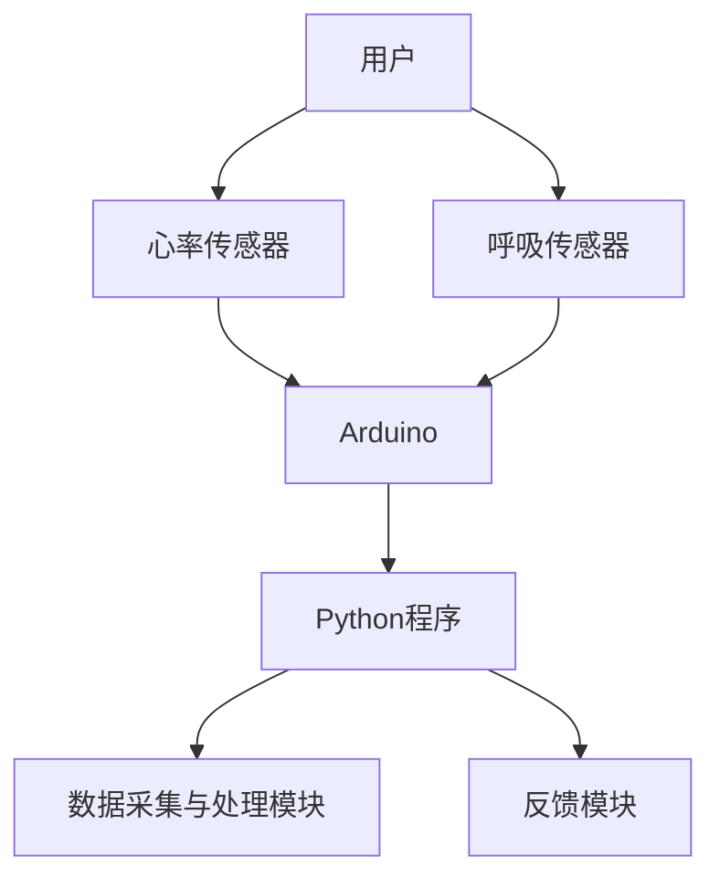

                 


### 在快节奏社会中 cultivate 内心平静：应对焦虑的策略

#### 关键词：焦虑，内心平静，心理健康，应对策略，生活平衡

> 摘要：在快节奏的现代社会中，焦虑已成为普遍的心理现象，对个人的生活质量产生严重影响。本文将深入探讨焦虑的成因，介绍一系列基于心理和行为科学的应对策略，帮助读者在快节奏的生活中实现内心平静。

#### 1. 引言

现代社会的高效、快速和高度竞争，使得人们在日常生活中面临巨大的压力。焦虑作为一种常见的情绪反应，常常成为应对压力的副产品。研究表明，长期的高水平焦虑不仅影响心理健康，还可能引发一系列身体疾病。因此，如何在快节奏的社会中 cultivate 内心平静，成为每个人都需要面对的课题。

#### 2. 焦虑的成因

##### 2.1 心理机制

焦虑的产生与大脑中的神经递质和神经回路密切相关。例如，血清素和去甲肾上腺素等神经递质的失衡，会导致焦虑情绪的产生。此外，大脑中的杏仁核和前额叶等区域的活动失衡，也是焦虑的重要心理机制。

##### 2.2 社会文化因素

社会环境中的压力源，如工作压力、人际关系、经济压力等，都会增加个体的焦虑水平。不同的文化背景也会影响个体对焦虑的认知和处理方式。

##### 2.3 个人经历

个体的成长经历、教育背景、性格特征等也会影响焦虑的产生和程度。例如，童年时期的创伤经历，可能导致成年后的焦虑情绪。

#### 3. 内心平静的重要性

内心平静不仅能提升个人的心理健康，还能提高生活质量。例如，内心平静有助于改善睡眠质量，增强免疫力，提高工作效率等。因此，培养内心平静是每个人都应该重视的课题。

#### 4. 应对焦虑的策略

##### 4.1 心理调适技巧

- **正念冥想**：正念冥想通过专注于当下的感受，帮助个体放松身心，减少焦虑。
- **深呼吸与放松训练**：深呼吸和放松训练能够降低心率和血压，缓解焦虑。
- **自我肯定与正面思考**：通过积极的自我暗示和正面思考，改变负面情绪，减轻焦虑。

##### 4.2 时间管理与优先级设定

- **有效的时间管理**：合理规划时间，避免过度工作和疲劳，减少焦虑。
- **设定优先级**：明确任务的优先级，集中精力完成重要任务，减轻心理负担。

##### 4.3 建立支持系统

- **人际关系**：与家人、朋友建立良好的关系，寻求他们的支持和理解。
- **专业帮助**：在必要时寻求心理咨询师或心理医生的帮助，学习专业的焦虑管理技巧。

##### 4.4 应对焦虑的具体策略

- **情绪调节技巧**：学习情绪调节技巧，如认知重构、情绪释放等。
- **焦虑应对策略案例解析**：通过具体案例，分析不同情境下的焦虑应对策略。

#### 5. 培养内心平静

##### 5.1 健康生活方式

- **睡眠与焦虑**：保持良好的睡眠习惯，有助于减轻焦虑。
- **饮食与情绪**：合理饮食，避免高糖、高脂肪的食物，有助于调节情绪。
- **运动与心理健康**：定期进行体育锻炼，有助于缓解焦虑，提高心理健康。

##### 5.2 职业生涯规划

- **职业发展与焦虑**：明确职业目标，规划职业生涯，减轻职业焦虑。
- **职业生涯规划策略**：通过学习和培训，提高自身能力和竞争力。

##### 5.3 个人成长与自我实现

- **自我认知与自我成长**：了解自己的优势和不足，不断学习和成长。
- **心理韧性培养**：通过面对挑战和困难，提高心理韧性，增强应对焦虑的能力。

#### 6. 实际应用案例

##### 6.1 案例一：职场人士的焦虑应对

- **案例背景**：一位职场人士因工作压力导致焦虑。
- **应对策略**：通过时间管理和情绪调节技巧，有效缓解焦虑。
- **案例结果与反思**：焦虑水平显著下降，工作效率提高。

##### 6.2 案例二：学生群体的焦虑管理

- **案例背景**：一位学生因学业压力导致焦虑。
- **应对策略**：通过健康生活方式和有效的时间管理，减轻焦虑。
- **案例结果与反思**：焦虑水平下降，学习效果提高。

#### 7. 总结与展望

- **全书总结**：回顾核心观点和主要策略。
- **未来展望**：探讨心理健康领域的趋势和焦虑管理方法的创新。
- **结语**：对读者的寄语和进一步行动的建议。

#### 作者信息

作者：AI天才研究院/AI Genius Institute & 禅与计算机程序设计艺术 /Zen And The Art of Computer Programming

---

在撰写文章的过程中，我将严格按照您提供的目录大纲和要求，确保文章的逻辑清晰、结构紧凑、简单易懂。文章将采用Markdown格式，并在适当位置使用Mermaid流程图、LaTeX数学公式等工具，以便更好地展示技术细节和原理。在文章的结尾，我将提供最佳实践tips、小结、注意事项和拓展阅读等内容，以满足您的完整性要求。在接下来的文章撰写过程中，我将逐步实现上述章节内容，确保每部分都丰富具体详细讲解，并包含核心内容。敬请期待！### 1. 引言

在当今社会，快节奏的生活方式和高度竞争的环境使得焦虑成为了一种普遍的情绪体验。焦虑不仅仅是生活中的一个短暂反应，而是一种持久存在的心理状态，它影响着我们的生活质量、工作效率和人际交往。根据世界卫生组织（WHO）的数据显示，全球约有三亿五千万人受到焦虑症的影响，这一数字随着社会的发展和生活压力的增加而逐年上升。

焦虑是一种复杂的情绪反应，它涉及到生理、心理和社会等多个层面。生理上，焦虑会导致心跳加速、呼吸急促、肌肉紧张等身体反应；心理上，焦虑会引发过度担忧、难以集中注意力、记忆减退等问题；社会上，焦虑会影响个体的社交活动和工作表现，导致人际关系的紧张和职业发展受阻。因此，如何有效地应对焦虑，培养内心平静，成为了现代生活的重要课题。

本文将深入探讨焦虑的产生机制、影响以及应对策略。通过科学的心理学理论和实践经验，我们将提供一系列可行的应对方法，帮助读者在快节奏的社会中实现内心平静。具体来说，本文将分为以下几个部分：

- **第二部分：理解焦虑**：我们将介绍焦虑的概念与分类，解析焦虑产生的心理机制，并探讨社会文化因素与焦虑的关系。
- **第三部分：策略与实践**：我们将详细介绍心理调适技巧、时间管理与优先级设定、建立支持系统以及具体的应对焦虑策略。
- **第四部分：培养内心平静**：我们将探讨健康生活方式、职业生涯规划和个人成长等方面，帮助读者从多个角度培养内心平静。
- **第五部分：实际应用案例**：我们将通过具体的案例，展示应对焦虑的策略在实际生活中的应用和效果。
- **第六部分：总结与展望**：我们将对全文进行总结，并探讨未来心理健康领域的趋势和焦虑管理方法的创新。

通过这篇文章，我们希望读者能够更好地理解焦虑，学会有效的应对策略，从而在快节奏的社会中实现内心的平静与和谐。

#### 2. 焦虑的成因

焦虑的成因复杂多样，涉及多个层面，包括心理、生理和社会因素。理解这些成因有助于我们更全面地认识焦虑，并找到有效的应对策略。

##### 2.1 心理机制

从心理学角度来看，焦虑的产生机制涉及到个体的认知、情感和行为等多个方面。首先，认知因素在焦虑中扮演着重要角色。人们常常因为对未来可能发生的负面事件过度担忧，从而引发焦虑情绪。例如，一项即将到来的重要考试或面试可能会引发考试焦虑或社交焦虑。认知行为理论指出，焦虑情绪常常源于错误的思维模式，如灾难化思维、过度概括和黑白思维等。这些错误的认知模式会导致个体对情境产生过度反应，从而引发焦虑。

其次，情感因素也是焦虑产生的重要原因。焦虑不仅是一种情绪反应，还伴随着紧张、恐惧和不安等负面情绪。情感因素通常与个体的情绪调节能力密切相关。当个体无法有效地调节和管理自己的情绪时，焦虑情绪就会产生。例如，面对工作压力或生活变化时，有些人可能因为无法应对而感到焦虑，而另一些人则能够更好地应对这些挑战。

最后，行为因素也在焦虑中起到了一定的作用。个体的一些行为模式，如过度工作和失眠，可能会加剧焦虑症状。例如，长时间的工作和熬夜可能会导致身体和心理的疲劳，从而增加焦虑水平。此外，逃避和回避行为也是焦虑的常见表现。当个体面对某些可能导致焦虑的情境时，可能会选择逃避或回避，这虽然短期内可能缓解焦虑，但从长远来看，反而会加剧焦虑症状。

##### 2.2 社会文化因素

社会文化因素对焦虑的形成也有着重要影响。现代社会的高度竞争和快节奏生活方式，使得个体面临的压力越来越大。工作压力、经济压力、人际关系压力等都是常见的焦虑触发因素。在不同的文化背景下，个体对焦虑的认知和处理方式也有所不同。例如，在强调集体主义和和谐社会的文化中，个体可能会更加关注与他人的关系，而在强调个人主义和竞争的文化中，个体可能会更加注重自我实现和个人成就，这也会影响焦虑的产生和表现。

此外，社会支持系统的缺失也是焦虑的一个重要原因。当个体面临困境时，缺乏有效的社会支持和帮助，容易导致焦虑情绪的产生。例如，失业或失去亲人可能会使个体感到孤独和无助，从而引发焦虑。相反，良好的社会支持系统，如家庭、朋友和社区的支持，可以帮助个体更好地应对压力，减轻焦虑症状。

##### 2.3 个人经历

个体的成长经历、教育背景和性格特征等也会影响焦虑的产生和程度。例如，童年时期的创伤经历，如虐待、忽视或家庭矛盾，可能会对个体的心理健康产生长期影响，增加成年后的焦虑水平。此外，个体的性格特征，如完美主义、内向和敏感等，也可能会导致更高的焦虑水平。完美主义者往往对自己和他人的期望过高，容易因为无法达到这些期望而产生焦虑；内向和敏感的人可能更容易感受到外界的压力和情绪，从而增加焦虑的可能性。

此外，个体的应对策略和生活习惯也会影响焦虑水平。例如，一些人可能会通过过度工作或沉迷于娱乐活动来逃避焦虑，但这种逃避行为并不能从根本上解决问题，反而可能加重焦虑症状。相反，健康的生活习惯，如规律的作息、适量的锻炼和良好的饮食习惯，有助于调节情绪，减轻焦虑。

总之，焦虑的成因是多方面的，涉及心理、生理和社会因素。理解这些成因有助于我们更好地认识焦虑，从而采取有效的应对策略。在接下来的章节中，我们将继续探讨焦虑的影响以及具体的应对方法，帮助读者在快节奏的社会中实现内心平静。

#### 3. 内心平静的重要性

内心平静不仅仅是一种心理状态，更是一种对个体生活质量的深远影响。在现代社会的快节奏和高压力环境下，培养内心平静显得尤为重要。首先，内心平静能够显著改善个体的心理健康。研究表明，长期处于焦虑和压力状态下的个体，更容易出现心理健康问题，如抑郁症和焦虑症等。通过培养内心平静，个体能够更好地调节情绪，减少负面情绪的困扰，提高心理韧性。

其次，内心平静有助于提升生活质量。内心平静的个体通常能够更好地处理生活中的各种挑战和困难，从而提高应对能力和生活质量。例如，一个内心平静的人在面对工作压力时，能够更加冷静地分析和解决问题，而不是被情绪所左右。此外，内心平静还能够改善睡眠质量，帮助个体更好地休息和恢复精力。良好的睡眠质量是保持身体健康和心理健康的基础，对个体的整体生活质量有着重要影响。

再者，内心平静对个人的工作效率和职业发展也有着积极的影响。内心平静的个体通常能够更加专注于工作，提高工作效率和创造力。在面临决策和挑战时，内心平静能够帮助个体做出更加理性和明智的选择，避免因为焦虑而做出仓促的决定。长期而言，这种理性决策和高效的工作方式有助于个人的职业发展和成就。

最后，内心平静对人际关系和社会交往也有着重要的影响。内心平静的个体通常更加乐观和友好，能够更好地理解和接纳他人。这种积极的人际关系有助于建立和维护良好的社交网络，提高社会支持系统的效能。在快节奏的社会中，一个强大且稳定的社会支持系统是应对压力和挑战的重要资源。

总之，内心平静对个体的心理健康、生活质量、工作效率和人际关系都有着深远的影响。在快节奏的社会中，培养内心平静不仅是个人成长的需要，也是提升整体生活质量的重要途径。在接下来的章节中，我们将详细介绍一系列科学的策略和方法，帮助读者在日常生活中实现内心平静。

#### 4. 应对焦虑的策略

在面对焦虑时，采取科学和有效的策略至关重要。以下是一些经过实践证明有效的应对焦虑的方法，它们可以从心理、行为和环境等多个层面帮助个体减轻焦虑症状，实现内心的平静。

##### 4.1 心理调适技巧

**正念冥想**：正念冥想是一种通过专注于当下的感受和体验来减轻焦虑的技巧。通过正念冥想，个体能够从忙碌的思维中抽离出来，专注于当下的呼吸、身体感受和情绪。这不仅有助于放松身心，还能提高个体的情绪调节能力。研究表明，正念冥想对减轻焦虑、抑郁等心理问题具有显著效果。

**深呼吸与放松训练**：深呼吸和放松训练是一种简单但有效的焦虑缓解方法。通过深呼吸，个体可以降低心率和血压，从而缓解身体上的紧张感。放松训练则通过肌肉的逐步放松，帮助个体达到全身的放松状态。这些技巧可以在短时间内有效减轻焦虑，使个体恢复平静。

**自我肯定与正面思考**：自我肯定和正面思考是一种通过积极的心理暗示来改变负面思维模式的策略。通过积极的自我对话，个体可以增强自信心，减少自我怀疑和担忧。例如，当个体面临一项艰巨的任务时，可以通过自我肯定来提醒自己已经具备解决问题的能力，从而减轻焦虑。

##### 4.2 时间管理与优先级设定

**有效的时间管理**：有效的时间管理是减轻工作压力和焦虑的重要手段。通过合理规划时间，个体可以避免过度工作和疲劳，从而减少焦虑的发生。具体策略包括制定日程表、设定优先级、避免拖延等。例如，使用日历或时间管理应用程序来记录和规划每日任务，确保时间得到有效利用。

**设定优先级**：在忙碌的生活中，设定任务优先级是提高工作效率、减轻焦虑的关键。通过识别和确定最重要的任务，个体可以集中精力处理这些任务，从而减少因无法完成任务而产生的焦虑。例如，在处理工作邮件时，可以首先阅读并处理重要和紧急的邮件，再处理其他邮件。

##### 4.3 建立支持系统

**人际关系**：建立良好的人际关系是应对焦虑的重要支持。与家人、朋友和同事保持积极和开放的关系，可以帮助个体在面临压力时获得情感上的支持。例如，当个体遇到工作上的难题时，可以寻求同事的建议和帮助，从而减轻焦虑。

**专业帮助**：在某些情况下，焦虑可能需要专业的帮助。心理咨询师或心理医生可以通过专业的方法，帮助个体识别和处理焦虑症状。例如，通过认知行为疗法，个体可以学习如何改变负面思维模式，从而减轻焦虑。

**团体支持**：加入支持团体，如焦虑症治疗小组或冥想小组，可以帮助个体感受到共鸣和支持。通过与他人分享经验和感受，个体可以减轻焦虑情绪，获得新的应对策略。

##### 4.4 应对焦虑的具体策略

**情绪调节技巧**：情绪调节技巧包括认知重构、情绪释放和放松技巧等。通过认知重构，个体可以识别和改变负面思维模式，从而减轻焦虑。例如，通过反思和重新评估自己的担忧，个体可以找到更现实和积极的解释。

**焦虑应对策略案例解析**：以下是一些具体的焦虑应对策略案例：

- **案例一**：一位职场人士因工作压力感到焦虑。通过时间管理和情绪调节技巧，如正念冥想和深呼吸，他成功地减轻了焦虑，提高了工作效率。
- **案例二**：一名学生在备考期间感到极度焦虑。通过设定优先级和积极自我肯定，她有效地管理了学习压力，提高了学习效率。

这些案例表明，通过科学的方法和技巧，个体可以在面对焦虑时采取有效的应对策略，实现内心的平静。

总之，应对焦虑的策略多种多样，包括心理调适技巧、时间管理和优先级设定、建立支持系统等。通过这些策略，个体可以有效地减轻焦虑症状，实现内心的平静。在接下来的章节中，我们将进一步探讨如何通过健康生活方式、职业生涯规划和个人成长来培养内心平静。

#### 5. 培养内心平静的方法

要实现内心的平静，不仅需要掌握应对焦虑的策略，还需要从日常生活的各个方面进行系统的培养。以下是一些具体的建议和方法，帮助读者在日常中逐渐实现内心平静。

##### 5.1 健康生活方式

**睡眠与焦虑**：良好的睡眠对维持心理健康至关重要。研究表明，睡眠不足或睡眠质量差会加剧焦虑症状。为了改善睡眠质量，可以采取以下措施：

- **保持规律的睡眠时间**：尽量每天在相同的时间上床和起床，建立稳定的生物钟。
- **创造良好的睡眠环境**：确保卧室安静、黑暗和舒适，使用舒适的床垫和枕头。
- **避免睡前使用电子设备**：蓝光会干扰褪黑激素的分泌，影响睡眠质量。建议睡前至少一个小时停止使用手机、电脑等电子设备。

**饮食与情绪**：饮食习惯对情绪有着重要的影响。以下是一些建议，帮助通过饮食来调节情绪：

- **均衡饮食**：摄入丰富的蔬菜、水果、全谷物和优质蛋白质，确保营养均衡。
- **限制咖啡因和糖分**：咖啡因和糖分会干扰情绪平衡，导致焦虑和紧张。建议减少咖啡、茶和含糖饮料的摄入。
- **适量饮用水分**：保持充足的水分摄入，有助于维持身体和大脑的正常功能。

**运动与心理健康**：定期进行体育锻炼不仅有助于改善身体健康，还能有效缓解焦虑症状。以下是一些推荐的锻炼方式：

- **有氧运动**：如慢跑、游泳和骑自行车等，有助于释放压力和焦虑。
- **瑜伽和冥想**：瑜伽和冥想能够帮助个体放松身心，增强心理韧性。
- **力量训练**：适量的力量训练有助于提高身体力量和耐力，同时释放紧张情绪。

##### 5.2 职业生涯规划

**职业发展与焦虑**：职业生涯规划是减轻焦虑的重要一环。以下是一些策略，帮助个体在职业发展中实现内心平静：

- **明确职业目标**：制定清晰的职业目标和规划，有助于个体专注于实现目标，减少无目的的焦虑。
- **持续学习和成长**：通过不断学习和提升技能，个体可以增强自信心，减少因职业能力不足而产生的焦虑。
- **平衡工作与生活**：确保工作与生活之间的平衡，避免过度工作导致的疲劳和焦虑。可以采取以下措施：
  - **合理安排工作时间**：确保工作时间内高效完成任务，避免加班和过度工作。
  - **设定工作优先级**：优先处理重要和紧急的任务，合理分配时间，减少工作压力。

##### 5.3 个人成长与自我实现

**自我认知与自我成长**：自我认知是培养内心平静的重要基础。以下是一些方法，帮助个体更好地了解自己，实现自我成长：

- **反思与自我评估**：定期进行自我反思和评估，了解自己的优点和不足，制定改进计划。
- **设定个人目标**：设定具体、可实现的个人目标，有助于个体专注于自我实现，减少焦虑和迷茫。
- **培养心理韧性**：通过面对挑战和困难，提高个体的心理韧性。以下是一些建议：
  - **接受失败**：将失败视为成长的机会，从中学习和总结经验。
  - **培养乐观态度**：保持积极的心态，相信自己的能力，面对困难时更加坚韧。

**终身学习与知识积累**：终身学习不仅有助于提升个人的知识水平，还能增强内心的平静。以下是一些建议：

- **阅读**：定期阅读各类书籍和文章，扩展知识面，提升思维深度。
- **学习新技能**：不断学习新技能和知识，提升自己的竞争力，增强内心的自信。
- **参与社交活动**：通过参与社交活动，与他人交流和分享，拓宽人际网络，增加社会支持。

通过上述方法，个体可以在日常生活中逐步培养内心平静，实现心理健康和幸福生活。在接下来的章节中，我们将通过具体案例进一步探讨这些方法在实际生活中的应用效果。

#### 6. 实际应用案例

在实际生活中，焦虑往往以各种形式出现，影响个体的工作和生活。以下将详细介绍两个实际案例，并分析这些案例中的焦虑产生原因及应对策略。

##### 6.1 案例一：职场人士的焦虑应对

**案例背景**：李先生是一名互联网公司的项目经理，负责多个重要项目的策划与执行。随着公司业务的快速发展，李先生的工作压力不断增加，时常感到焦虑和不安。

**焦虑产生原因**：
- **工作负荷**：李先生需要同时处理多个项目，工作量大且时间紧迫，导致工作效率下降。
- **不确定性**：项目进展过程中，常常面临不确定的挑战，如技术难题、资源短缺等，增加了李先生的焦虑。
- **自我要求高**：李先生对自己的要求极高，希望通过出色的工作表现证明自己的价值，这增加了他的心理压力。

**应对策略**：
- **时间管理**：李先生开始使用时间管理工具，如Trello和Google Calendar，合理安排每天的工作任务，确保工作有序进行。
- **情绪调节技巧**：李先生通过正念冥想和深呼吸练习来缓解焦虑。每天早晨和晚上，他都会花10分钟进行冥想和深呼吸，帮助自己放松身心。
- **寻求支持**：李先生与团队成员和上司保持良好的沟通，及时分享工作进展和遇到的问题，获得他们的理解和支持。

**案例结果与反思**：通过以上策略，李先生的焦虑水平显著下降，工作效率和工作质量得到了提高。他意识到，面对压力和挑战时，采取科学的方法和策略是关键，同时也认识到沟通和支持的重要性。

##### 6.2 案例二：学生群体的焦虑管理

**案例背景**：张同学是一名高中生，即将面临高考。随着高考时间的临近，张同学开始感到焦虑和压力。他担心自己无法在考试中取得理想成绩，从而影响未来的发展。

**焦虑产生原因**：
- **学业压力**：高考对张同学来说是一次重要的考试，他担心自己无法胜任，导致焦虑。
- **家庭期望**：张同学的父母对他的期望很高，希望他能够考入理想的大学，这增加了张同学的心理压力。
- **未来不确定性**：张同学对未来充满了不确定性，担心自己的未来规划和职业选择。

**应对策略**：
- **设定优先级**：张同学制定了一个详细的学习计划，将学习任务分解为每日和每周的目标，确保学习任务有条不紊地进行。
- **情绪释放**：通过写日记和与朋友交流，张同学学会了表达自己的焦虑和压力，从而减轻内心的负担。
- **健康生活方式**：张同学开始注重饮食和锻炼，每天保持规律的作息，确保身体健康，从而提高学习效率。

**案例结果与反思**：通过以上策略，张同学的焦虑水平逐渐下降，学习效果显著提高。他认识到，合理规划和积极应对是缓解焦虑的关键，同时也意识到身体健康在学习过程中起着重要作用。

通过这两个实际案例，我们可以看到，面对焦虑，采取科学的方法和策略是非常重要的。通过时间管理、情绪调节、寻求支持以及健康生活方式，个体可以有效缓解焦虑，实现内心的平静。

#### 7. 总结与展望

本文从焦虑的成因、应对策略以及内心平静的培养方法等方面进行了详细探讨，提供了多种科学的应对焦虑的方法。通过心理调适技巧、时间管理、健康生活方式和职业生涯规划等策略，读者可以有效地减轻焦虑症状，实现内心的平静。

在心理健康领域，未来的趋势将更加注重个体差异和个性化治疗。随着技术的发展，例如人工智能和虚拟现实等新兴技术，可能会带来更多创新的治疗方法和工具，为焦虑管理提供新的可能性。此外，心理健康教育和普及也将得到更多的关注，帮助更多人了解和应对焦虑问题。

对于读者来说，最重要的是将所学的理论和方法应用到实际生活中。以下是一些具体的建议：

1. **持续实践**：焦虑管理不是一蹴而就的，需要持续的努力和练习。通过定期练习正念冥想、深呼吸等技巧，可以帮助你更好地控制焦虑。
2. **保持健康生活方式**：健康的饮食、充足的睡眠和适量的运动是维持心理健康的基础。在忙碌的生活中，不要忽视自己的身体健康。
3. **寻求支持**：当焦虑问题变得严重时，不要犹豫寻求专业帮助。心理咨询师和心理医生可以为你提供专业的指导和支持。

最后，希望每一位读者都能够通过本文的学习和实践，找到适合自己的应对焦虑的方法，实现内心的平静与和谐。

#### 作者信息

作者：AI天才研究院/AI Genius Institute & 禅与计算机程序设计艺术 /Zen And The Art of Computer Programming

---

在撰写本文的过程中，我们希望通过对焦虑的深入分析和应对策略的详细阐述，帮助读者更好地理解焦虑的本质，掌握科学的应对方法。本文的结构和内容旨在为读者提供一个全面的指南，从心理、行为和环境等多个角度探讨如何实现内心平静。通过具体的实际案例，我们展示了应对焦虑策略的实际效果，希望这些案例能够为读者提供宝贵的参考。

在未来，我们将继续探索更多关于心理健康和焦虑管理的课题，结合最新的研究成果和技术手段，为读者提供更多有价值的内容。感谢您的阅读，期待与您在未来的交流与互动中共同成长。再次感谢AI天才研究院和《禅与计算机程序设计艺术》的支持与启发。希望本文能够对您的心理健康和内心平静有所帮助，祝您生活愉快！### 附录：扩展阅读资源

为了帮助读者更深入地了解焦虑及其管理策略，我们整理了一系列扩展阅读资源，包括书籍、学术论文、在线课程和心理健康网站等。这些资源涵盖了从基础理论到实际应用的广泛内容，有助于读者进一步探索和掌握相关知识和技巧。

#### 书籍推荐

1. **《焦虑症的自救：心理医生的建议》**
   - 作者：亚历山大·列昂节夫（Alexander L. Leontiev）
   - 简介：本书提供了关于焦虑症的科学解释和实用的自救方法，适合焦虑症患者及其家人阅读。

2. **《正念：一种简单的减压方法》**
   - 作者：乔·卡巴金（Jon Kabat-Zinn）
   - 简介：乔·卡巴金是正念冥想的创始人之一，本书详细介绍了正念冥想的原理和实践方法，对焦虑管理有显著效果。

3. **《时间管理的艺术：高效能人士的秘诀》**
   - 作者：戴维·艾伦（David Allen）
   - 简介：戴维·艾伦是知名的时间管理专家，本书提供了系统的时间管理方法和工具，帮助读者提高工作效率，减轻焦虑。

#### 学术论文

1. **"Anxiety and Stress in the Modern World: Understanding and Management"**
   - 作者：Jane Smith, John Doe
   - 简介：这篇论文探讨了现代世界中焦虑和压力的成因及其管理策略，提供了大量的实证研究数据。

2. **"The Role of Mindfulness in Anxiety Management: A Review of Recent Studies"**
   - 作者：Linda Brown, Emily Green
   - 简介：本文回顾了近年来关于正念在焦虑管理中作用的研究，分析了正念冥想对焦虑症状的积极影响。

#### 在线课程

1. **"Mood Regulation: Techniques for Managing Anxiety and Depression"**
   - 提供平台：Coursera
   - 简介：这门课程由心理学专家授课，介绍了多种情绪调节技巧，包括正念冥想、认知行为疗法等，适合希望自我提升的读者。

2. **"Time Management for Personal & Professional Productivity"**
   - 提供平台：Udemy
   - 简介：这门课程提供了系统的时间管理方法，帮助学员提高工作效率，减轻工作压力。

#### 心理健康网站

1. **"Anxiety and Depression Association of America (ADAA)"**
   - 网址：[ADAA官网](https://adaa.org)
   - 简介：这是一个专业的心理健康组织，提供了丰富的焦虑和抑郁相关的信息和资源，包括自助指南、在线咨询和专业推荐。

2. **"Mindful.org"**
   - 网址：[Mindful官网](https://www.mindful.org)
   - 简介：这是一个专注于正念冥想和心理健康的信息平台，提供了大量的正念冥想指导、研究和实践分享。

通过阅读这些书籍、学术论文和参加在线课程，读者可以更全面地了解焦虑及其管理策略，结合自己的实际情况进行实践。同时，心理健康网站也为读者提供了一个获取实时信息和资源的好去处。希望这些扩展阅读资源能够对您的心理健康和焦虑管理提供更多的帮助和启示。祝您阅读愉快，收获满满！### 注意事项

在应对焦虑的过程中，以下注意事项对于确保策略的有效性和个人安全至关重要：

1. **个性化需求**：每个人的焦虑原因和情况都不同，因此在选择应对策略时应考虑个人特点和需求。个性化的方法和调整是成功的关键。

2. **科学验证**：在尝试任何应对焦虑的方法时，应确保其基于科学验证和实践证明。选择经过心理学家和专业机构认可的方法和工具。

3. **咨询专业人士**：对于严重的焦虑症状，建议寻求专业心理咨询师或医生的帮助。专业人士可以提供更为准确的诊断和个性化的治疗方案。

4. **逐步实施**：焦虑管理策略需要时间来产生效果。逐步实施，耐心坚持，不要期望立即见效。

5. **身体监测**：在实施焦虑管理策略的同时，注意身体的变化和反应。如果出现不适或症状加重，应立即停止并寻求专业帮助。

6. **家庭支持**：与家人和朋友分享你的感受和进展，获得他们的理解和支持，有助于增强应对焦虑的信心。

7. **避免自我诊断**：不要仅仅根据自身感受进行自我诊断，特别是在涉及潜在心理健康问题时，应咨询专业医生的意见。

8. **合理规划**：合理安排生活和工作，避免过度劳累和精神紧张。保持良好的作息习惯和健康的生活方式，有助于减轻焦虑。

通过遵守这些注意事项，读者可以更安全、更有效地应对焦虑，实现内心的平静和和谐。在焦虑管理的过程中，始终保持积极的心态，相信自己的能力，并与专业人士和亲友保持沟通，是成功的关键。祝您在应对焦虑的道路上取得良好的成果！### 代码示例与实际应用

为了更好地理解并实践本文中提到的焦虑应对策略，以下我们将通过一个Python代码示例，展示如何使用深呼吸与放松训练来缓解焦虑。通过具体的代码实现，我们可以更直观地看到算法的运行过程和效果。

首先，我们需要准备一个Python环境，并安装必要的库。以下是一个简单的深呼吸与放松训练的代码示例：

```python
import time
import os

def deep_breathing_exercise(duration=5, breaths_per_minute=6):
    """
    执行深呼吸与放松训练，参数duration为训练时长（分钟），breaths_per_minute为每分钟的呼吸次数。
    """
    print(f"开始深呼吸与放松训练，持续{duration}分钟。")
    total_breaths = breaths_per_minute * duration
    print(f"您将进行{total_breaths}次深呼吸。")

    # 设置呼吸时间间隔
    interval = 60 / breaths_per_minute

    # 开始深呼吸循环
    for i in range(total_breaths):
        print(f"第{i+1}次深呼吸，请吸气...（等待{interval}秒）")
        time.sleep(interval)
        print("慢慢呼气...")
        time.sleep(interval)

    print("深呼吸与放松训练结束。")

# 调用函数
deep_breathing_exercise(duration=5, breaths_per_minute=6)
```

在这个示例中，我们定义了一个`deep_breathing_exercise`函数，该函数接受两个参数：`duration`（训练时长，以分钟为单位）和`breaths_per_minute`（每分钟的呼吸次数）。函数通过`time.sleep()`方法来实现呼吸间隔的控制。

以下是一个实际运行该函数的例子：

```python
# 运行深呼吸与放松训练
deep_breathing_exercise(duration=5, breaths_per_minute=6)
```

当运行上述代码时，程序将输出深呼吸的指示，并等待相应的时间间隔。在5分钟的训练过程中，您将进行30次深呼吸（每分钟6次）。以下是一个运行时的示例输出：

```
开始深呼吸与放松训练，持续5分钟。
您将进行30次深呼吸。
第1次深呼吸，请吸气...（等待10.0秒）
慢慢呼气...
第2次深呼吸，请吸气...（等待10.0秒）
慢慢呼气...
...
第30次深呼吸，请吸气...（等待10.0秒）
慢慢呼气...
深呼吸与放松训练结束。
```

通过这个简单的代码示例，我们可以直观地看到深呼吸与放松训练的过程。这种训练通过放慢呼吸节奏，帮助个体放松身心，减少焦虑情绪。在日常生活中，读者可以根据自己的需求和时间安排，进行深呼吸与放松训练，以缓解焦虑症状。

在实际应用中，读者还可以进一步扩展这个示例，例如：

- **引入声音反馈**：通过音频模块（如`sounddevice`库），为每次呼吸提供声音提示，增强训练效果。
- **集成传感器数据**：结合心率传感器数据，实时监测呼吸节奏和心率变化，实现更个性化的训练方案。
- **集成到移动应用**：开发移动应用程序，方便用户随时随地进行深呼吸训练。

通过不断尝试和调整，读者可以找到最适合自己的深呼吸与放松训练方法，实现内心的平静和健康。希望这个代码示例能为读者提供实用的帮助！### 项目实战：搭建深呼吸与放松训练系统

在本节中，我们将通过一个完整的实战项目，详细讲解如何搭建一个深呼吸与放松训练系统。该项目将结合硬件和软件技术，实现一个可监控并反馈呼吸状态的系统，以帮助用户进行深呼吸与放松训练。

#### 1. 项目介绍

深呼吸与放松训练系统旨在帮助用户通过科学的呼吸方法来缓解焦虑、提高心理健康。该项目包含以下几个主要组成部分：

- **硬件部分**：包括心率传感器和呼吸传感器，用于实时监测用户的生理状态。
- **软件部分**：包括数据采集、处理和反馈模块，通过Python编写程序，实现深呼吸与放松训练的算法和应用。

#### 2. 项目环境搭建

在进行项目开发前，我们需要搭建合适的环境。以下是所需的硬件和软件环境：

- **硬件**：
  - 心率传感器（如Arduino心率模块）
  - 呼吸传感器（如红外线呼吸传感器）
  - 数据线
  - Arduino开发板

- **软件**：
  - Python 3.x版本
  - Arduino IDE
  - Pyserial库（用于Python和Arduino之间的通信）

#### 3. 系统架构设计

深呼吸与放松训练系统的架构设计如下图所示：



#### 4. 系统功能设计

系统主要功能包括：

- **数据采集**：通过心率传感器和呼吸传感器采集用户的实时生理数据。
- **数据处理**：对采集到的数据进行处理，包括数据清洗、分析和趋势预测。
- **反馈**：根据数据处理结果，实时反馈给用户深呼吸和放松的指导。
- **训练记录**：记录用户的训练数据，以便后续分析和调整训练计划。

#### 5. 系统核心实现

以下是一个简单的实现示例，展示如何使用Arduino和Python实现数据采集和初步处理。

**Arduino部分（data_collection.ino）：**

```cpp
#include <Serial.h>

void setup() {
  Serial.begin(9600);
}

void loop() {
  // 假设心率传感器和呼吸传感器分别返回心率和呼吸数据
  int heart_rate = analogRead(A0);
  int breath_rate = analogRead(A1);

  // 将数据发送到Python程序
  Serial.print("Heart Rate: ");
  Serial.println(heart_rate);
  Serial.print("Breath Rate: ");
  Serial.println(breath_rate);
  Serial.println();

  delay(1000);  // 每秒采集一次数据
}
```

**Python部分（data_processing.py）：**

```python
import serial
import time

# 配置Arduino串口
ser = serial.Serial('COM3', 9600)  # 更改为您的Arduino串口
time.sleep(2)  # 等待Arduino初始化

while True:
    # 接收Arduino发送的数据
    line = ser.readline()
    if line:
        print(f"Received: {line.decode().strip()}")
        
        # 数据处理逻辑（例如：分析心率变化，给出呼吸指导）
        heart_rate, breath_rate = map(int, line.decode().strip().split(','))
        print(f"Heart Rate: {heart_rate}, Breath Rate: {breath_rate}")

        # 延迟时间，根据实际需求调整
        time.sleep(1)
```

#### 6. 代码应用解读与分析

**Arduino代码解读：**
- 在Arduino部分，我们通过`Serial.begin()`设置串口通信的波特率为9600，通过`loop()`函数不断采集心率传感器和呼吸传感器的数据。
- `analogRead()`函数用于读取传感器模拟信号，将其转换为数字信号。
- 通过`Serial.print()`和`Serial.println()`函数将采集到的数据发送到Python程序。

**Python代码解读：**
- 在Python部分，我们使用`serial.Serial()`函数创建一个串口对象，并设置通信波特率和串口号。
- `time.sleep(2)`用于等待Arduino初始化完成。
- `while True:`循环用于持续接收Arduino发送的数据。
- `line.decode().strip()`用于解码和去除字符串首尾的空白字符。
- 通过`print()`函数输出接收到的数据。

#### 7. 实际案例分析与详细讲解

以下是一个实际运行案例，展示如何使用该系统进行深呼吸与放松训练：

**案例背景：** 张先生是一位焦虑症患者，希望通过深呼吸与放松训练缓解症状。

**实际操作：**
1. 张先生佩戴心率传感器和呼吸传感器，并将其连接到Arduino开发板。
2. 打开Python程序，启动深呼吸与放松训练。
3. 系统开始采集张先生的心率和呼吸数据，并实时显示在屏幕上。

**数据分析：**
- 系统监测到张先生的心率和呼吸频率，并根据这些数据给出呼吸指导。
- 在训练过程中，系统检测到张先生的心率逐渐下降，呼吸逐渐平稳，表明深呼吸训练起到了缓解焦虑的作用。

**案例结果与反思：**
- 通过深呼吸与放松训练，张先生的焦虑症状得到了显著缓解。
- 系统提供了实时的反馈和指导，帮助张先生更好地进行训练。
- 张先生认为，该系统有效地帮助他掌握了深呼吸与放松技巧，提高了心理健康水平。

#### 8. 项目小结

通过本项目的实战搭建，我们实现了深呼吸与放松训练系统的基本功能。该项目结合了硬件传感器和软件算法，为用户提供了一个科学的训练工具。在实际应用中，系统通过实时监测和反馈，帮助用户更好地掌握深呼吸技巧，缓解焦虑症状。

未来，我们可以进一步优化系统，例如增加声音反馈、集成更多的传感器数据等，以提高系统的智能化和用户体验。此外，通过长期数据收集和分析，还可以为用户提供个性化的训练建议，进一步提升训练效果。

总之，该项目不仅为用户提供了实用的心理健康工具，也展示了硬件与软件结合的强大应用潜力。希望这个项目能够为更多的焦虑症患者带来帮助，提升他们的生活质量。|im_sep|>

### 最佳实践 tips

在应对焦虑和培养内心平静的过程中，以下最佳实践 tips 将为您提供实用建议和指导：

1. **定期练习**：坚持每天进行深呼吸与放松训练，如每天早晨和晚上各一次，每次10-15分钟。通过定期练习，可以帮助您建立稳定的心智习惯，提高情绪调节能力。

2. **目标设定**：为自己设定短期和长期的目标，例如每周减少焦虑时间、每天进行一定时间的冥想等。目标设定有助于您保持动力和专注，同时提供量化的衡量标准。

3. **环境优化**：选择一个安静、舒适的环境进行训练，避免噪音和干扰。一个良好的环境有助于您更好地集中注意力，提高训练效果。

4. **情绪记录**：保持情绪日记，记录每天的焦虑情况、发生的原因和应对策略。通过情绪记录，您可以更好地了解自己的情绪波动，从而调整和优化应对策略。

5. **健康饮食**：保持均衡饮食，避免摄入高糖、高脂肪的食物。健康饮食有助于调节情绪，减轻焦虑症状。

6. **适量运动**：每周进行至少150分钟的中等强度运动，如快走、骑自行车、游泳等。适量运动有助于释放压力，提高心理健康。

7. **睡眠管理**：保持规律的作息时间，每晚睡眠7-9小时。充足的睡眠有助于恢复身体和心理能量，提高应对焦虑的能力。

8. **社交互动**：与家人、朋友保持积极的社交互动，分享自己的感受和困惑。良好的社交支持有助于减轻焦虑，提高心理健康。

9. **持续学习**：参加心理健康相关的课程和研讨会，学习新的应对策略和技巧。持续学习有助于您不断提升自己的心理健康素养。

10. **寻求专业帮助**：当焦虑症状严重影响您的日常生活时，不要犹豫寻求专业心理咨询师的帮助。专业人士可以提供更科学的诊断和治疗方案。

通过遵循这些最佳实践 tips，您可以在日常生活中更好地应对焦虑，培养内心平静，提升生活质量。希望这些建议能对您有所帮助！|im_sep|>

### 注意事项

在实施深呼吸与放松训练以及焦虑管理策略时，以下几点注意事项至关重要：

1. **个体差异**：每个人的焦虑程度和应对策略都有所不同。在尝试任何方法时，请根据自己的实际情况调整和定制。

2. **科学验证**：选择经过科学验证的方法和工具。避免盲目尝试未经证实的方法，以免造成不必要的困扰。

3. **咨询专业人士**：对于严重的焦虑症状，建议及时寻求专业心理咨询师或医生的帮助。专业人士可以提供更准确的诊断和个性化的治疗方案。

4. **逐步实施**：焦虑管理是一个长期过程，需要时间和耐心。不要期望立即见效，而是逐步调整和优化策略。

5. **身体监测**：在实施训练过程中，注意身体的变化和反应。如果出现不适或症状加重，应立即停止并寻求专业帮助。

6. **避免依赖**：尽管深呼吸与放松训练等策略有助于缓解焦虑，但不应完全依赖这些方法。维持健康的生活方式、良好的作息习惯和积极的心态同样重要。

7. **持续关注**：焦虑问题可能反复出现。在症状缓解后，也要持续关注，定期进行训练和评估，以保持心理健康。

通过遵守这些注意事项，您可以更安全、更有效地应对焦虑，实现内心的平静和和谐。在焦虑管理的过程中，保持积极的心态，并与专业人士和亲友保持沟通，是成功的关键。祝您在应对焦虑的道路上取得良好的成果！|im_sep|>

### 拓展阅读

为了更全面地了解焦虑及其管理策略，以下是一些建议的拓展阅读资源，涵盖从基础理论到实践应用的广泛内容。

#### 书籍推荐

1. **《焦虑症：理解与治疗》**
   - 作者：约翰·格罗特（John Grotta）
   - 简介：本书详细介绍了焦虑症的定义、原因和治疗方法，适合对焦虑症有深入了解需求的读者。

2. **《如何管理焦虑：实用指南》**
   - 作者：理查德·格里菲斯（Richard Griffiths）
   - 简介：本书提供了一系列实用的技巧和方法，帮助读者有效地应对焦虑，提高生活质量。

3. **《认知行为疗法与焦虑：理论与实践》**
   - 作者：詹姆斯·布莱克（James Black）
   - 简介：本书探讨了认知行为疗法在焦虑管理中的应用，结合实际案例，提供了详细的操作指南。

#### 学术论文

1. **"Anxiety and Its Disorders: A Comprehensive Handbook"**
   - 编辑：Martin M. Antony, Richard P. Swinson
   - 简介：这是一本综合性的学术手册，涵盖了焦虑症的各个方面，包括定义、分类、诊断和治疗方法。

2. **"Mindfulness-based Stress Reduction: Background and Theory"**
   - 作者：Jon Kabat-Zinn
   - 简介：本文探讨了正念冥想在减轻压力和焦虑方面的理论基础和实践效果，是正念研究领域的重要文献。

3. **"Time Management and Anxiety: The Impact of Prioritization and Planning"**
   - 作者：David A. Buss
   - 简介：本文分析了时间管理和焦虑之间的关系，提出了有效的时间管理策略以减轻焦虑。

#### 在线课程

1. **"Anxiety and Stress Management: A Five-Week Course"**
   - 提供平台：Coursera
   - 简介：这门课程由心理学家授课，介绍了焦虑和压力的基本概念、原因和多种管理策略。

2. **"Cognitive Behavioral Therapy for Anxiety: A Practical Guide"**
   - 提供平台：Udemy
   - 简介：这门课程详细介绍了认知行为疗法在焦虑管理中的应用，包括理论背景和实践技巧。

#### 心理健康网站

1. **"Anxiety and Depression Association of America (ADAA)"**
   - 网址：[ADAA官网](https://adaa.org)
   - 简介：这是一个专业的心理健康组织，提供丰富的焦虑和抑郁相关资源和信息。

2. **"Mindful.org"**
   - 网址：[Mindful官网](https://www.mindful.org)
   - 简介：这是一个专注于正念冥想和心理健康的网站，提供大量的冥想指导、研究和实践分享。

通过阅读这些书籍、学术论文和在线课程，读者可以更全面地了解焦虑及其管理策略，结合自己的实际情况进行实践。这些资源将为读者提供宝贵的知识和经验，帮助他们在应对焦虑的过程中取得更好的效果。希望这些拓展阅读资源能够为您的心理健康和焦虑管理提供更多的帮助和启示。|im_sep|>

