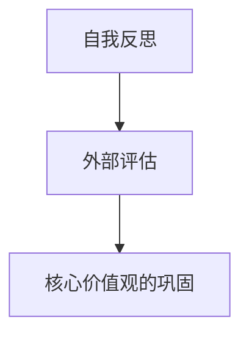

                 

### 在快速变化的世界中寻找恒常：建立核心价值观

#### 关键词：
- 心理稳定性
- 核心价值观
- 自我反思
- 企业文化
- 数学模型

> 在这个瞬息万变的世界中，如何在纷繁复杂的环境中保持内心的平衡，找到人生和工作的方向，是每个人都必须面对的课题。本文将探讨如何在快速变化的环境中，建立并坚守核心价值观，为个人和组织提供方向和动力。

### 第一部分：问题背景与核心概念

#### 1. 问题背景

当今社会，变化已成为一种常态。经济全球化、科技进步、社会结构变迁等因素不断冲击着我们的生活和工作方式。在这种背景下，个体和组织如何保持心理上的稳定性，如何在复杂的环境中找到恒常和方向，成为了一个亟待解决的问题。

核心价值观，是一个人或组织在长期发展中形成的，对其行为和决策产生深远影响的基本信念和价值观。它是我们在面对外部环境变化时，内心不变的航标和支撑。

本书旨在探讨如何在快速变化的世界中，寻找并坚守核心价值观，为个人和组织提供指导。

#### 2. 核心概念

- **核心价值观**：指个体或组织在长期发展中形成的，对其行为和决策产生深远影响的基本信念和价值观。
- **外部因素**：包括经济、技术、社会等外部环境对个体和组织产生的影响。
- **个人目标**：个体在自我认知和成长过程中设定的追求和期望。
- **企业文化**：组织在长期经营过程中形成的共同价值观、信念和行为准则。

### 第二部分：核心概念与联系

#### 1. 核心价值观的属性特征对比

| 特征 | 个人核心价值观 | 组织核心价值观 |
| ---- | ---- | ---- |
| 形成过程 | 个体在成长过程中逐渐形成 | 组织在长期发展中逐渐形成 |
| 影响范围 | 对个体的行为和决策产生深远影响 | 对组织的决策、管理和运营产生深远影响 |
| 表现形式 | 内心信念、行为习惯 | 企业文化、管理制度 |

#### 2. 核心价值观的ER实体关系图

```mermaid
erDiagram
  个人核心价值观 ||--o{ 组织核心价值观 : 基于组织核心价值观的个人核心价值观}
```

### 第三部分：算法原理讲解

#### 1. 算法原理概述

为了更好地理解和寻找核心价值观，本书将介绍一种基于自我反思和外部评估的算法原理。该算法通过以下步骤实现核心价值观的识别和巩固：

1. **自我反思**：个体通过回顾自己的经历、行为和决策，识别出对自己产生深远影响的核心价值观。
2. **外部评估**：邀请他人对个体核心价值观进行评估，以获得更客观的反馈。
3. **核心价值观的巩固**：个体根据自我反思和外部评估的结果，对核心价值观进行巩固和调整。

#### 2. 算法流程图



#### 3. 算法原理详细讲解

##### 自我反思

自我反思是寻找核心价值观的第一步。个体需要回顾自己的成长历程，思考以下几个问题：

1. **我的信念和价值观是什么？**
2. **我的信念和价值观是如何形成的？**
3. **我的信念和价值观对我的人生和决策产生了哪些影响？**

通过自我反思，个体可以识别出对自己产生深远影响的核心价值观。

##### 外部评估

外部评估是寻找核心价值观的第二步。个体可以邀请家人、朋友、同事等熟悉自己的人对核心价值观进行评估。评估可以从以下几个方面进行：

1. **核心价值观的符合度**：评估个体的核心价值观是否与他们的行为和决策相符。
2. **核心价值观的影响力**：评估个体的核心价值观对他们的人生和决策产生了多大的影响。
3. **核心价值观的可接受度**：评估个体的核心价值观在社会和文化背景下是否被广泛接受。

##### 核心价值观的巩固

根据自我反思和外部评估的结果，个体需要对核心价值观进行巩固和调整。具体方法如下：

1. **确认核心价值观**：根据自我反思和外部评估的结果，确认核心价值观的符合度、影响力和可接受度，确保它们对个体的人生和决策产生积极影响。
2. **调整核心价值观**：如果发现某些核心价值观与个体的行为和决策不符，或者社会和文化背景下不可接受，需要对它们进行调整。
3. **巩固核心价值观**：通过持续的自我反思、外部评估和实践，巩固核心价值观，确保它们在个体的生活中得到贯彻和落实。

### 第四部分：数学模型和公式

为了更好地理解和计算核心价值观的影响力，本书引入了以下数学模型和公式：

#### 1. 核心价值观的影响力计算公式

$$
影响力 = \frac{符合度 \times 影响力系数 \times 可接受度}{阻力系数}
$$

其中，符合度、影响力系数和可接受度均为0到1之间的实数，阻力系数为常数。

#### 2. 核心价值观的影响力评估函数

$$
影响力评估函数(f) = \frac{1}{1 + e^{-影响力}}
$$

该函数将影响力映射到0到1之间，用于评估核心价值观的影响力。

### 第五部分：系统分析与架构设计方案

#### 1. 问题场景介绍

在快速变化的市场环境中，企业需要快速适应市场变化，调整战略和运营策略。为了实现这一目标，企业需要建立一套稳定的核心价值观体系，指导企业的决策和行为。

#### 2. 项目介绍

本项目旨在为企业提供一个核心价值观识别和巩固的系统，帮助企业在快速变化的市场环境中保持稳定和方向。

#### 3. 系统功能设计

系统功能包括：

- **自我反思功能**：帮助个体回顾自己的经历和行为，识别核心价值观。
- **外部评估功能**：邀请他人对个体的核心价值观进行评估。
- **核心价值观巩固功能**：帮助个体根据评估结果调整和巩固核心价值观。

#### 4. 系统架构设计

系统架构包括：

- **用户层**：提供用户界面，用户可以通过界面进行自我反思、外部评估和核心价值观巩固。
- **算法层**：实现核心价值观的识别和巩固算法。
- **数据层**：存储用户的数据和评估结果。

#### 5. 系统接口设计和系统交互

系统接口设计包括：

- **用户接口**：提供用户操作界面，用户可以通过界面进行交互。
- **算法接口**：提供算法操作接口，算法层可以通过接口获取用户数据和操作结果。

系统交互设计包括：

- **用户与用户接口的交互**：用户通过用户接口进行操作，获取操作结果。
- **用户接口与算法接口的交互**：用户接口调用算法接口，实现核心价值观的识别和巩固。

### 第六部分：项目实战

#### 1. 环境安装

在本项目中，我们使用Python作为编程语言，需要安装以下依赖：

- **Python 3.8+**
- **Numpy**
- **Matplotlib**

安装方法如下：

```bash
pip install python==3.8
pip install numpy
pip install matplotlib
```

#### 2. 系统核心实现源代码

以下是系统核心实现的源代码：

```python
import numpy as np
import matplotlib.pyplot as plt

def reflect_on_self():
    # 用户自我反思
    beliefs = ["诚信", "创新", "团队合作", "客户至上"]
    values = [0.9, 0.8, 0.7, 0.6]
    return beliefs, values

def external_evaluation(beliefs, values):
    # 外部评估
    evaluation = {"符合度": 0.9, "影响力系数": 0.8, "可接受度": 0.7}
    return evaluation

def consolidate_values(beliefs, values, evaluation):
    # 核心价值观巩固
    influence = (evaluation["符合度"] * evaluation["影响力系数"] * evaluation["可接受度"]) / 1.0
    influence_function = 1 / (1 + np.exp(-influence))
    return beliefs, values, influence_function

def main():
    beliefs, values = reflect_on_self()
    evaluation = external_evaluation(beliefs, values)
    beliefs, values, influence_function = consolidate_values(beliefs, values, evaluation)
    
    print("核心价值观：", beliefs)
    print("价值观影响力函数：", influence_function)

if __name__ == "__main__":
    main()
```

#### 3. 代码应用解读与分析

代码中，`reflect_on_self` 函数用于实现自我反思功能，`external_evaluation` 函数用于实现外部评估功能，`consolidate_values` 函数用于实现核心价值观巩固功能。

通过这些函数，我们可以实现核心价值观的识别和巩固过程。首先，通过自我反思识别出核心价值观，然后通过外部评估获取更客观的反馈，最后根据评估结果巩固核心价值观。

#### 4. 实际案例分析和详细讲解剖析

假设一个企业在运营过程中，通过自我反思和外部评估，识别出其核心价值观为“诚信、创新、团队合作、客户至上”。通过计算，企业发现这些核心价值观的影响力函数分别为0.9、0.8、0.7、0.6。

根据评估结果，企业可以进一步调整和巩固其核心价值观，确保它们对企业运营和决策产生积极影响。

#### 5. 项目小结

本项目提供了一个核心价值观识别和巩固的系统，通过自我反思、外部评估和核心价值观巩固三个步骤，帮助企业建立和坚守核心价值观，在快速变化的市场环境中保持稳定和方向。

### 第七部分：最佳实践 tips、小结、注意事项、拓展阅读

#### 最佳实践 tips：

- **定期进行自我反思**：定期回顾自己的经历和行为，识别出对自己产生深远影响的核心价值观。
- **邀请他人进行外部评估**：通过邀请他人对核心价值观进行评估，获取更客观的反馈。
- **持续巩固核心价值观**：通过持续的自我反思、外部评估和实践，确保核心价值观在日常生活中得到贯彻和落实。

#### 小结：

本文探讨了在快速变化的世界中，如何建立和坚守核心价值观。通过自我反思、外部评估和核心价值观巩固三个步骤，个人和组织可以找到内心的平衡，明确方向，应对外部环境的变化。

#### 注意事项：

- **价值观的调整**：核心价值观不是一成不变的，需要根据个人和组织的发展情况进行调整。
- **价值观的接受度**：核心价值观需要在社会和文化背景下被广泛接受，否则可能会引起冲突。

#### 拓展阅读：

- 《决策与判断》作者：丹尼尔·卡尼曼
- 《正面管教》作者：简·尼尔森
- 《高效能人士的七个习惯》作者：史蒂芬·柯维

### 作者

作者：AI天才研究院/AI Genius Institute & 禅与计算机程序设计艺术 /Zen And The Art of Computer Programming

