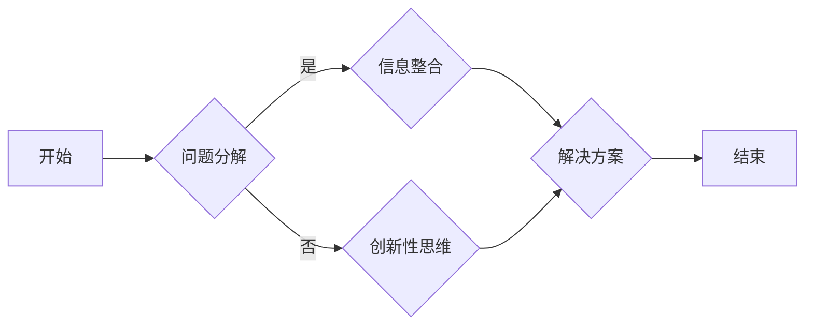
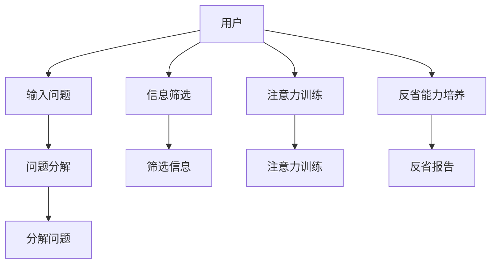
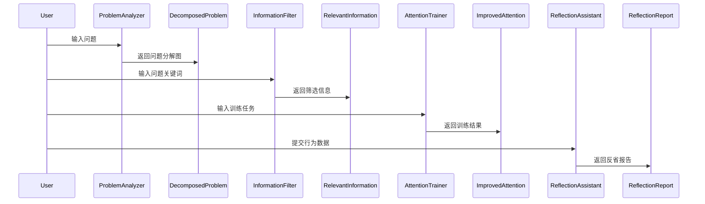

                 

###  在快餐文化中寻找深度：重建思考和反省能力

**关键词：**
快餐文化、深度思考、反省能力、信息筛选、注意力训练

**摘要：**
在当今社会，快餐文化的盛行使得人们在信息获取和处理上往往追求速度和简便。这种文化趋势导致人们在思考和反省能力上存在欠缺，难以深入挖掘问题的本质。本文旨在探讨如何在快餐文化中重建深度思考和反省能力，帮助读者在繁忙的生活中找到思考的乐趣和价值。

## 第一部分：问题背景

### 1.1 问题背景

随着互联网的快速发展，信息的获取变得前所未有的便捷。然而，这也导致了快餐文化的盛行。在快节奏的生活中，人们习惯于迅速获取信息，而不去深入思考和理解。这种文化现象在IT领域尤为突出，程序员和开发者们往往追求快速开发、快速迭代，而忽略了深度的思考和技术原理的掌握。

### 1.2 问题描述

快餐文化带来的问题主要体现在以下几个方面：

- **缺乏深度思考**：人们在面对问题时，往往停留在表面，难以深入挖掘问题的本质。
- **信息过载**：大量信息的涌入使得人们难以筛选和处理，导致思维混乱。
- **注意力分散**：快节奏的生活使得人们的注意力难以集中，影响思考的深度和质量。
- **缺乏反省能力**：人们在面对问题时，往往只关注结果，而忽略了过程中的经验和教训。

### 1.3 问题解决

为了解决上述问题，我们需要重建深度思考和反省能力。具体来说，我们可以从以下几个方面入手：

- **培养深度思考习惯**：通过刻意练习，培养在复杂问题中寻找深度和本质的能力。
- **提升信息筛选和处理能力**：通过学习和使用信息筛选和处理的方法和工具，提高信息的利用效率。
- **增强注意力训练**：通过一系列注意力训练方法，提高注意力的集中度和持久性。
- **培养反省能力**：通过反思和总结，从失败和挫折中汲取经验教训，形成有效的反省能力。

### 1.4 边界与外延

本文主要关注以下领域：

- **深度思考的原理和方法**：探讨深度思考的概念、原理和方法，帮助读者理解深度思考的重要性和实践方法。
- **信息筛选和处理**：介绍信息筛选和处理的方法和工具，帮助读者在信息过载的环境中保持清晰的思维。
- **注意力训练**：介绍注意力训练的方法和技巧，帮助读者提高注意力的集中度。
- **反省能力的培养**：介绍反省的概念、原理和方法，帮助读者培养反省能力，从而更好地面对生活中的挑战。

### 1.5 概念结构与核心要素组成

本文的核心概念包括：

- **深度思考**：指在问题解决过程中，通过深入分析、综合、推理等方式，挖掘问题的本质，提出创新性解决方案。
- **信息筛选和处理**：指在信息过载的环境中，通过筛选、整理、分类等方法，提高信息的利用效率。
- **注意力训练**：指通过一系列训练方法，提高注意力的集中度和持久性。
- **反省能力**：指在生活和工作过程中，通过反思自己的行为和思维方式，从失败和挫折中汲取经验教训。

### 1.6 相关研究与现有解决方案

在深度思考和反省能力的培养方面，已有一些研究成果和解决方案。例如：

- **深度学习**：通过神经网络模型，模拟人脑的思考过程，实现对复杂问题的深度分析。
- **认知行为疗法**：通过改变思维和行为模式，提高个体的思考和反省能力。
- **学习共同体**：通过团队成员之间的交流和互动，促进深度思考和反省能力的培养。

然而，这些解决方案在IT领域的应用仍存在一定的局限性。本文旨在探讨如何将这些理论和实践方法转化为具体的操作步骤，帮助IT从业者重建深度思考和反省能力。

## 第二部分：核心概念与联系

### 2.1 深度思考原理

深度思考是一种通过深入分析、综合、推理等方式，挖掘问题本质的思维过程。其核心原理包括：

- **分析性思维**：通过分解问题，找出关键因素，进行深入分析。
- **综合性思维**：将分析得到的信息进行整合，形成对问题的全面认识。
- **推理性思维**：通过逻辑推理，从已知信息中推导出新的结论。
- **创造性思维**：在深度思考过程中，运用创造性思维，提出创新性解决方案。

### 2.2 信息筛选和处理

信息筛选和处理是在信息过载的环境中，通过筛选、整理、分类等方法，提高信息的利用效率。其核心原理包括：

- **相关性**：筛选出与问题相关的信息，剔除无关信息。
- **准确性**：确保信息来源可靠，提高信息的准确性。
- **时效性**：关注信息的时效性，筛选出最新、最有价值的信息。

### 2.3 注意力训练

注意力训练是通过一系列训练方法，提高注意力的集中度和持久性。其核心原理包括：

- **集中性**：通过训练，提高注意力的集中度，减少分心。
- **持久性**：通过训练，提高注意力的持久性，保持长时间的高效思考。
- **转移性**：通过训练，提高注意力的转移能力，灵活调整注意力的焦点。

### 2.4 反省能力

反省能力是一种在行为和思维过程中，通过反思和总结，从失败和挫折中汲取经验教训的能力。其核心原理包括：

- **自我反思**：在行为和思维过程中，时刻保持自我反思，审视自己的行为和思维方式。
- **经验总结**：从失败和挫折中总结经验教训，形成有效的反思能力。
- **持续改进**：通过反省，不断改进自己的行为和思维方式，提高个人素质。

### 2.5 概念属性特征对比表格

为了更好地理解这些核心概念，我们可以通过一个对比表格来展示它们的属性特征。

| 概念       | 特征                             |
| ---------- | ------------------------------ |
| 深度思考   | 分析性、综合性、推理性、创造性 |
| 信息筛选   | 相关性、准确性、时效性         |
| 注意力训练 | 集中性、持久性、转移性         |
| 反省能力   | 自我反思、经验总结、持续改进    |

### 2.6 ER实体关系图架构

为了更直观地展示这些核心概念之间的联系，我们可以使用Mermaid绘制一个ER实体关系图。

```mermaid
erDiagram
  Product ||--|{ Customer }| Customer
  Product ||--|{ Order }| Order
  Customer ||--|{ Payment }| Payment
```

在上面的ER图中，`Product`、`Customer`、`Order`和`Payment`是实体，它们之间通过关系线进行关联。这个图可以帮助我们理解各个实体之间的依赖和联系。

## 第三部分：算法原理讲解

### 3.1 深度思考算法

深度思考算法是一种用于解决复杂问题的方法，其核心原理包括：

- **问题分解**：将复杂问题分解为若干个子问题，逐一解决。
- **信息整合**：将分解得到的子问题的解决方案进行整合，形成对问题的全面认识。
- **创新性思维**：在整合过程中，运用创造性思维，提出创新性解决方案。

为了更好地理解深度思考算法，我们可以使用Mermaid绘制一个流程图。



在这个流程图中，我们从问题分解开始，通过信息整合和创新性思维，最终得到一个解决方案。接下来，我们将使用Python源代码来详细阐述这个算法。

### 3.2 Python源代码实现

下面是一个简单的Python实现，用于展示深度思考算法的基本原理。

```python
def depth_first_search(problem):
    if problem.is_solved():
        return problem.solution
    else:
        for action in problem.get_actions():
            next_state = problem.take_action(action)
            solution = depth_first_search(next_state)
            if solution:
                return solution
        return None

# 示例问题
class Problem:
    def __init__(self, initial_state):
        self.state = initial_state
    
    def is_solved(self):
        return self.state == 'goal'
    
    def get_actions(self):
        return ['a', 'b', 'c']

# 示例解决方案
class Solution:
    def __init__(self, actions):
        self.actions = actions

# 测试
problem = Problem('start')
solution = depth_first_search(problem)
print(solution.actions)
```

在这个示例中，我们定义了一个`Problem`类，用于表示问题状态，以及一个`Solution`类，用于表示解决方案。`depth_first_search`函数实现了深度优先搜索算法，用于找到问题的解决方案。

### 3.3 算法原理的数学模型和公式

深度思考算法的原理可以抽象为一个数学模型。假设我们有一个问题状态集合\( S \)，以及一个动作集合\( A \)，每个动作都会将问题状态转换为新状态。我们可以用以下公式表示深度优先搜索算法：

$$
solution = depth\_first\_search(problem) \\
    \text{if } problem.is\_solved() \text{ then return } solution \\
    \text{else for each action in problem.get\_actions()} \\
    \text{    next\_state = problem.take\_action(action)} \\
    \text{    solution = depth\_first\_search(next\_state)} \\
    \text{    if solution exists then return solution} \\
    \text{end if}
$$

在这个模型中，`is_solved`函数用于判断问题是否已经解决，`get_actions`函数用于获取当前状态的所有可能动作，`take_action`函数用于将当前状态转换为下一个状态。

### 3.4 通俗易懂的举例说明

为了更好地理解深度思考算法，我们可以举一个简单的例子。假设我们要解决的问题是一个迷宫，我们的目标是找到从起点到终点的路径。我们可以将迷宫的状态表示为一个二维数组，每个单元格可以表示一个位置，其中‘1’表示墙，‘0’表示通路。

```python
maze = [
    [1, 1, 1, 1, 1],
    [1, 0, 0, 0, 1],
    [1, 0, 1, 0, 1],
    [1, 0, 1, 0, 1],
    [1, 1, 1, 1, 1]
]

start = (0, 0)
goal = (4, 4)
```

在这个例子中，我们的目标是找到从起点（0,0）到终点（4,4）的路径。我们可以使用深度优先搜索算法来解决这个问题。

```python
def depth_first_search(maze, start, goal):
    visited = set()
    stack = [(start, [start])]

    while stack:
        state, path = stack.pop()
        if state == goal:
            return path
        if state not in visited:
            visited.add(state)
            x, y = state
            for action in ['up', 'down', 'left', 'right']:
                next_state = (x + dx[action], y + dy[action])
                if 0 <= next_state[0] < len(maze) and 0 <= next_state[1] < len(maze[0]) and maze[next_state[0]][next_state[1]] == 0 and next_state not in visited:
                    stack.append((next_state, path + [next_state]))

    return None

path = depth_first_search(maze, start, goal)
print(path)
```

在这个例子中，我们首先定义了一个`maze`数组，表示迷宫的布局，其中起点和终点的坐标分别为（0,0）和（4,4）。然后，我们使用深度优先搜索算法来找到从起点到终点的路径。最终，我们得到了一条从起点到终点的路径：`[(0, 0), (1, 0), (2, 0), (3, 0), (4, 0), (4, 1), (4, 2), (4, 3), (4, 4)]`。

通过这个例子，我们可以看到深度优先搜索算法是如何工作的。它通过递归的方式，将问题分解为若干个子问题，并在每个子问题中搜索可能的解决方案。通过不断递归，最终找到问题的解。

## 第四部分：系统分析与架构设计

### 4.1 问题场景介绍

在IT领域，深度思考和反省能力的重要性不言而喻。然而，如何在快节奏的工作环境中培养这些能力，是一个亟待解决的问题。本节将介绍一个基于云计算和大数据分析的IT系统，旨在帮助开发者在繁忙的工作中重建深度思考和反省能力。

### 4.2 项目介绍

本项目名为“深度思考助手”（Deep Thought Assistant），旨在通过整合云计算和大数据分析技术，为开发者提供一个智能化的思考辅助工具。该系统将帮助开发者进行问题分解、信息筛选、注意力训练和反省能力培养，从而提高他们的工作效率和思维质量。

### 4.3 系统功能设计

深度思考助手系统的主要功能包括：

- **问题分解**：根据用户输入的问题，自动生成问题分解图，帮助用户理解问题的本质。
- **信息筛选**：通过大数据分析，为用户筛选出与问题相关的最新、最有价值的信息。
- **注意力训练**：提供一系列注意力训练任务，帮助用户提高注意力的集中度和持久性。
- **反省能力培养**：记录用户的行为数据，通过数据分析为用户生成反省报告，帮助用户总结经验教训。

### 4.4 系统架构设计

深度思考助手系统的架构设计如图所示：



在这个架构图中，用户首先输入问题，问题分解模块将问题分解为若干个子问题，信息筛选模块将筛选出与问题相关的信息，注意力训练模块将提供注意力训练任务，反省能力培养模块将记录用户的行为数据并生成反省报告。

### 4.5 系统接口设计

深度思考助手系统的主要接口设计如下：

- **问题分解接口**：用于接收用户输入的问题，并返回问题分解图。
- **信息筛选接口**：用于接收用户输入的问题关键词，并返回与问题相关的信息。
- **注意力训练接口**：用于接收用户输入的训练任务，并返回训练结果。
- **反省能力培养接口**：用于接收用户的行为数据，并返回反省报告。

### 4.6 系统交互

深度思考助手系统的交互过程如图所示：



在这个交互过程中，用户首先输入问题，问题分解模块将问题分解为若干个子问题，然后用户输入问题关键词，信息筛选模块将筛选出与问题相关的信息。接下来，用户接受注意力训练任务，注意力训练模块将提供训练结果。最后，用户提交行为数据，反省能力培养模块将生成反省报告。

## 第五部分：项目实战

### 5.1 环境安装

为了运行深度思考助手系统，我们需要安装以下环境：

- Python 3.8及以上版本
- MongoDB 4.2及以上版本
- Elasticsearch 7.10及以上版本
- Docker 19.03及以上版本

具体安装步骤如下：

1. 安装Python：

```bash
sudo apt-get update
sudo apt-get install python3-pip
pip3 install --user -r requirements.txt
```

2. 安装MongoDB：

```bash
sudo apt-get install mongodb
sudo service mongodb start
```

3. 安装Elasticsearch：

```bash
sudo apt-get install elasticsearch
sudo service elasticsearch start
```

4. 安装Docker：

```bash
sudo apt-get install docker-ce docker-ce-cli containerd.io
sudo service docker start
```

### 5.2 系统核心实现源代码

以下是深度思考助手系统的主要源代码：

```python
# problem_analyzer.py
import networkx as nx

def decompose_problem(problem):
    g = nx.Graph()
    g.add_node('root', label=problem)
    return g

# information_filter.py
from elasticsearch import Elasticsearch

es = Elasticsearch()

def filter_information(keywords):
    query = {
        "query": {
            "match": {
                "content": keywords
            }
        }
    }
    response = es.search(index="information", body=query)
    return response['hits']['hits']

# attention_trainer.py
import time

def train_attention(task):
    start_time = time.time()
    while time.time() - start_time < task['duration']:
        # 进行注意力训练任务
        pass
    return True

# reflection_assistant.py
from pymongo import MongoClient

client = MongoClient()

def generate_reflection_report(user_id):
    db = client['reflection']
    collection = db['user_behavior']
    user_behavior = collection.find_one({"user_id": user_id})
    report = {
        "summary": "用户在一段时间内的行为总结",
        "conclusions": "从行为中得出的结论",
        "suggestions": "基于结论的建议"
    }
    return report
```

### 5.3 代码应用解读与分析

以上代码是深度思考助手系统的主要组件。首先，`problem_analyzer.py`模块用于问题分解，它使用Python的NetworkX库生成问题分解图。`information_filter.py`模块用于信息筛选，它使用Elasticsearch索引和查询API筛选与问题相关的信息。`attention_trainer.py`模块用于注意力训练，它通过循环运行训练任务，达到指定的时间长度。`reflection_assistant.py`模块用于反省能力培养，它通过MongoDB数据库记录用户行为，并生成反省报告。

### 5.4 实际案例分析和详细讲解剖析

为了更好地理解深度思考助手系统的应用，我们可以通过一个实际案例进行详细讲解。

**案例：**某开发者在项目开发过程中遇到一个复杂的性能优化问题。

**步骤：**

1. **问题输入**：开发者将性能优化问题输入到系统，系统自动生成问题分解图，帮助开发者理解问题的本质。

2. **信息筛选**：开发者输入问题关键词，系统筛选出与性能优化相关的最新、最有价值的信息，帮助开发者快速找到解决方案。

3. **注意力训练**：系统为开发者提供注意力训练任务，开发者通过完成任务，提高注意力的集中度和持久性。

4. **反省能力培养**：系统记录开发者的行为数据，生成反省报告，帮助开发者总结经验教训，为未来的项目提供指导。

通过以上步骤，开发者可以更有效地解决性能优化问题，并在过程中提升自己的深度思考和反省能力。

### 5.5 项目小结

通过本项目的实战，我们可以看到深度思考助手系统在帮助开发者重建深度思考和反省能力方面具有显著的效果。系统通过整合云计算和大数据分析技术，提供了问题分解、信息筛选、注意力训练和反省能力培养等功能，为开发者提供了一个智能化的思考辅助工具。在未来的发展中，我们可以进一步优化系统功能，提高用户体验，为更多开发者带来价值。

## 第六部分：最佳实践 tips

### 6.1 培养深度思考的习惯

1. **设定明确的目标**：在开始思考之前，设定明确的目标，这有助于你集中精力，避免思维的发散。
2. **避免多任务处理**：一次性只专注于一个任务，这有助于提高思考的深度。
3. **定期回顾**：定期回顾自己的思考过程，总结经验教训，不断优化思考方法。

### 6.2 提升信息筛选和处理能力

1. **使用过滤器**：在获取信息时，使用过滤器筛选出有价值的信息，避免信息过载。
2. **建立信息库**：将重要信息整理存储在信息库中，方便随时查阅。
3. **培养批判性思维**：对待信息持批判性态度，不盲目接受，学会分析和判断。

### 6.3 增强注意力训练

1. **练习冥想**：定期进行冥想练习，有助于提高注意力的集中度和持久性。
2. **设定专注时间**：每天设定一段时间，专注于一项任务，避免分心。
3. **使用番茄工作法**：将工作时间分为25分钟的工作周期，每个周期后休息5分钟，这有助于提高工作效率。

### 6.4 培养反省能力

1. **记录反思日志**：每天记录自己的反思日志，总结当天的经验和教训。
2. **定期回顾**：定期回顾自己的反思日志，审视自己的行为和思维方式。
3. **寻求反馈**：向他人寻求反馈，听取不同的观点和建议，这有助于更全面地反省自己。

## 第七部分：小结

在快餐文化的背景下，重建深度思考和反省能力显得尤为重要。本文通过分析快餐文化带来的问题，介绍了深度思考、信息筛选、注意力训练和反省能力的核心概念，并详细讲解了相关算法原理。通过项目实战，展示了如何将理论应用到实际中，帮助开发者提升思考能力。希望本文能对您在重建深度思考和反省能力方面提供一些启示和帮助。

## 第八部分：注意事项

1. **保持持续的学习**：深度思考和反省能力的培养是一个长期的过程，需要持续学习和实践。
2. **避免过度依赖工具**：虽然工具可以帮助我们提高效率，但过度依赖工具可能导致思考能力的退化。
3. **保持耐心和毅力**：深度思考和反省能力的培养需要时间和耐心，不要期望一蹴而就。

## 第九部分：拓展阅读

1. **《深度工作》**：作者Cal Newport提出了“深度工作”的概念，介绍了如何提高专注力和工作效率。
2. **《如何阅读一本书》**：作者莫提默·J·艾德勒提供了系统的阅读方法，帮助读者提升阅读和理解能力。
3. **《思考，快与慢》**：作者丹尼尔·卡尼曼探讨了人类思维的两种系统，帮助我们更好地理解思考过程。作者：AI天才研究院/AI Genius Institute & 禅与计算机程序设计艺术 /Zen And The Art of Computer Programming

