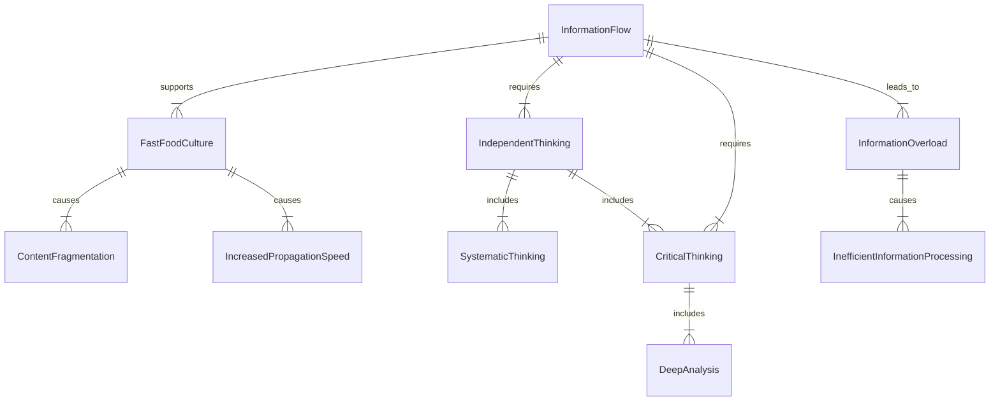
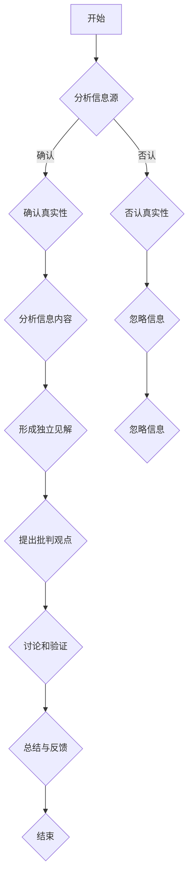
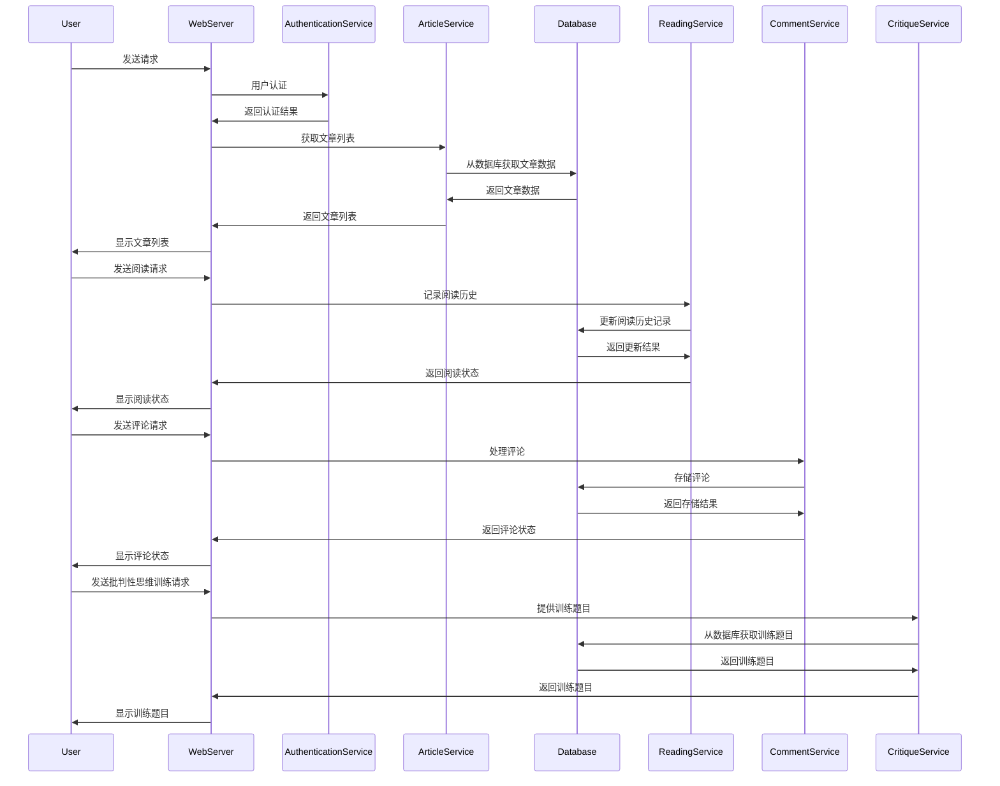
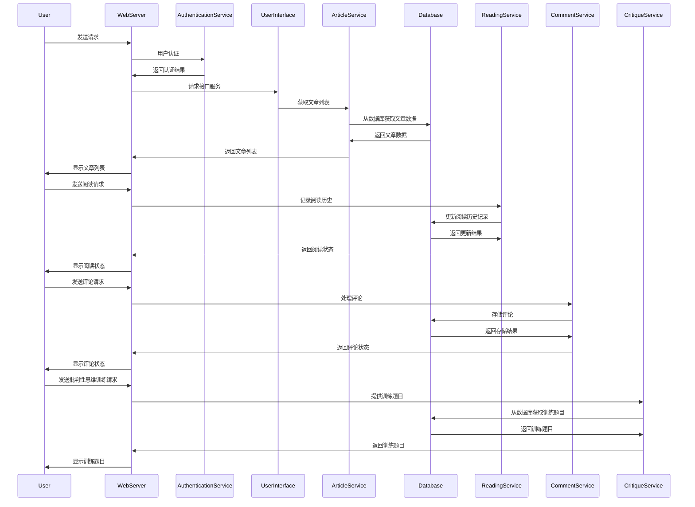

                 


# 《在快餐文化中寻找深度：重建独立思考和批判能力》

## 关键词：
快餐文化、独立思考、批判能力、信息过载、深度思考、技术博客

## 摘要：
本文旨在探讨在快餐文化盛行的背景下，如何重建独立思考和批判能力。通过对快餐文化现象的分析，本文揭示了其在现代社会中带来的思考浅表化、信息过载等问题。在此基础上，文章提出了培养独立思考和批判能力的方法和策略，并通过实例和案例分析，提供了实践指导。本文不仅关注个人层面，还从社会环境、教育体系等多个角度，深入探讨了重建深度思考能力的重要性。

### 背景介绍

#### 快餐文化的现象与影响

在当今社会，快餐文化已经成为一种普遍现象。它不仅仅体现在饮食领域，更渗透到了信息传播、娱乐消费等各个方面。快餐文化的核心特点在于其快速、便捷和短期满足。在信息时代，这一特点尤为明显，表现为信息爆炸、内容碎片化、传播速度极快等。

首先，信息爆炸是快餐文化的一个重要特征。互联网和移动设备的普及，使得信息传播速度大幅提高，人们每天接收到的信息量远远超过过去。然而，这些信息往往是碎片化的，缺乏深度和系统性。人们往往只是浏览标题，很少深入阅读内容，导致思考能力下降。

其次，内容碎片化也是快餐文化的一大影响。在快餐文化的背景下，人们更倾向于消费短小、快捷的内容，如短视频、新闻简报等。这些内容虽然可以迅速提供信息，但往往缺乏深度和广度，难以引发深入思考和讨论。

最后，传播速度的加快也是快餐文化的一个重要特征。社交媒体的兴起，使得信息可以在短时间内迅速传播，甚至形成热点。然而，这种快速传播也带来了信息失真、误解和偏见等问题。

#### 独立思考的核心原则

独立思考是个人在信息接收和处理过程中，能够形成独立见解、不盲从他人判断的能力。在快餐文化的背景下，独立思考显得尤为重要。以下是独立思考的核心原则：

1. **质疑精神**：对信息来源、内容和方法进行质疑，不盲目接受信息。
2. **系统性思维**：从多个角度和层面分析问题，形成系统性的见解。
3. **批判性思维**：对信息进行批判性分析，辨别真伪、判断价值。
4. **反思能力**：对自己的思考过程进行反思，不断修正和完善。

#### 批判能力的培养方法

批判能力是对事物、观点和信息进行深入分析，辨别真伪、判断价值的能力。在快餐文化的背景下，培养批判能力具有重要意义。以下是培养批判能力的方法：

1. **广泛阅读**：通过阅读不同类型的书籍、文章，扩大知识面，提高分析能力。
2. **深度思考**：对问题进行深入思考，不满足于表面的观点，追求深层次的理解。
3. **交流讨论**：与他人交流观点，通过讨论和辩论，提高批判性思维能力。
4. **反思和总结**：对自己的思考和判断进行反思和总结，不断修正和完善。

#### 实际案例与案例分析

为了更好地理解快餐文化对独立思考和批判能力的影响，我们可以通过实际案例进行分析。

**案例一：社交媒体上的热点事件**

在社交媒体上，热点事件往往在短时间内迅速传播，引发大量讨论。然而，由于信息碎片化和传播速度加快，这些讨论往往缺乏深度和系统性。许多人在面对热点事件时，只是跟随舆论，缺乏独立思考和批判能力。

**案例二：新闻阅读**

新闻是获取信息的重要途径，然而在快餐文化的背景下，人们往往只关注标题，很少深入阅读内容。这种浅表化的阅读方式，导致人们难以形成独立的见解，难以进行批判性思考。

**案例三：学习资源的选择**

在快餐文化的背景下，人们往往倾向于选择短小、快捷的学习资源，如短视频、新闻简报等。这些资源虽然可以提供一些基础知识，但往往缺乏深度和系统性，难以培养独立思考和批判能力。

### 总结

在快餐文化盛行的今天，独立思考和批判能力的培养显得尤为重要。通过质疑精神、系统性思维、批判性思维和反思能力，我们可以重建独立思考和批判能力。同时，广泛阅读、深度思考、交流讨论和反思总结等方法，也有助于培养批判能力。让我们从现在开始，积极应对快餐文化的挑战，重建深度思考能力，为个人和社会的发展贡献力量。

---

### 核心概念与联系

在本篇文章中，我们将探讨的核心概念包括快餐文化、独立思考、批判能力和信息过载。以下是这些概念的定义、属性特征对比表格和ER实体关系图架构。

#### 1. 核心概念定义

- **快餐文化**：以快速消费、娱乐和短暂刺激为特点的文化现象。
- **独立思考**：个体在信息接收和处理过程中，能够形成独立的见解，不盲从、不依赖他人判断。
- **批判能力**：对事物、观点和信息进行深入分析，辨别真伪、判断价值的能力。
- **信息过载**：由于信息量过大，个体难以有效处理和利用信息的现象。

#### 2. 核心概念属性特征对比表格

| 特征 | 快餐文化 | 独立思考 | 批判能力 | 信息过载 |
| ---- | -------- | -------- | -------- | -------- |
| 特点 | 快速、便捷、短期满足 | 独立、系统性、批判性 | 深入、辨别真伪、判断价值 | 信息量大、难以处理、利用 |
| 影响 | 浅表化思考、信息碎片化、传播速度加快 | 培养深度思考能力、形成独立见解 | 提高分析能力、辨别信息价值 | 影响工作效率、决策质量 |
| 途径 | 消费短小、快捷的内容 | 广泛阅读、深度思考、交流讨论、反思总结 | 广泛阅读、深度思考、交流讨论、反思总结 | 筛选重要信息、提高信息处理能力 |

#### 3. ER实体关系图架构



通过上述表格和ER图，我们可以更清晰地理解快餐文化、独立思考、批判能力和信息过载之间的联系。快餐文化对独立思考和批判能力产生负面影响，而独立思考和批判能力的培养有助于应对信息过载的挑战。理解这些核心概念及其联系，有助于我们在日常生活中更加自觉地培养深度思考能力。

### 算法原理讲解

在探讨如何重建独立思考和批判能力的过程中，我们可以借鉴一些算法原理，这些原理可以帮助我们更好地理解和应用深度思考的技巧。以下是一个简单的算法原理示例，通过Mermaid流程图和Python代码来阐述。

#### 1. Mermaid流程图



#### 2. Python代码

```python
# 导入必要的库
import random

# 假设这是一个信息源
info_source = "在社交媒体上看到的某个热点事件"

# 分析信息源
def analyze_source(info):
    print(f"正在分析信息源：{info}")
    # 随机判断信息源的真实性
    if random.choice([True, False]):
        print("信息源确认真实。")
        return "真实"
    else:
        print("信息源否认真实。")
        return "否认"

# 分析信息内容
def analyze_content(info, authenticity):
    if authenticity == "真实":
        print(f"正在分析信息内容：{info}。")
        # 随机生成一个独立见解
        opinion = random.choice(["这是一个重要的社会问题", "这个事件并不重要"])
        print(f"独立见解：{opinion}")
        return opinion
    else:
        print("忽略该信息。")
        return None

# 形成批判观点
def form_critique(opinion):
    if opinion:
        print(f"正在形成批判观点：{opinion}。")
        # 随机生成一个批判观点
        critique = random.choice(["这个观点太片面", "这个观点值得深入讨论"])
        print(f"批判观点：{critique}")
        return critique
    else:
        print("没有形成批判观点。")
        return None

# 讨论和验证
def discuss_and_validate(critique):
    if critique:
        print(f"正在讨论和验证批判观点：{critique}。")
        # 随机判断讨论结果
        if random.choice([True, False]):
            print("讨论结果有效。")
            return True
        else:
            print("讨论结果无效。")
            return False
    else:
        print("没有讨论和验证。")
        return False

# 总结与反馈
def summarize_feedback(result):
    if result:
        print("总结：通过讨论和验证，我们成功地形成了独立的见解和批判观点。")
    else:
        print("总结：没有形成有效的见解和批判观点。")

# 主函数
def main():
    authenticity = analyze_source(info_source)
    opinion = analyze_content(info_source, authenticity)
    critique = form_critique(opinion)
    validation_result = discuss_and_validate(critique)
    summarize_feedback(validation_result)

# 运行主函数
if __name__ == "__main__":
    main()
```

#### 3. 算法原理和数学模型

在这个示例中，我们使用了一个简单的算法来模拟分析信息源、形成独立见解和批判观点的过程。以下是算法的原理和数学模型：

- **信息源分析**：通过随机判断信息源的真实性，我们可以将信息分为“真实”和“否认”两种状态。
- **信息内容分析**：对于真实的信息源，我们使用随机方法生成一个独立见解；对于否认的信息源，我们直接忽略。
- **批判观点形成**：基于独立见解，我们使用随机方法生成一个批判观点。
- **讨论和验证**：通过模拟讨论和验证过程，我们可以判断批判观点的有效性。
- **总结与反馈**：最后，我们根据讨论结果进行总结。

数学模型可以表示为：

$$
\text{真实性概率} = p(\text{真实}) = 0.5
$$

$$
\text{独立见解} = \begin{cases} 
\text{随机见解} & \text{如果真实性概率为真} \\
\text{无} & \text{如果真实性概率为假}
\end{cases}
$$

$$
\text{批判观点} = \text{随机生成}
$$

$$
\text{验证结果} = \begin{cases} 
\text{有效} & \text{如果讨论概率为真} \\
\text{无效} & \text{如果讨论概率为假}
\end{cases}
$$

通过这个示例，我们可以看到如何使用算法原理来模拟和分析信息，从而形成独立的见解和批判观点。这种算法原理不仅可以帮助我们在处理信息时更加理性和批判，也可以作为我们培养深度思考和批判能力的工具。

### 系统分析与架构设计方案

#### 问题场景介绍

随着快餐文化的盛行，人们越来越倾向于快速消费信息，而缺乏对信息的深度思考和批判能力。这种现象在信息技术和软件开发领域尤为突出，因为技术信息更新迅速，且存在大量的碎片化内容。为了解决这一问题，我们需要设计一个系统，帮助用户在快餐文化中重建独立思考和批判能力。

#### 项目介绍

本项目旨在开发一个基于Web的信息分析平台，名为“深度思考助手”（DeepThink Assistant）。该平台旨在帮助用户通过以下功能重建独立思考和批判能力：

1. **信息筛选与过滤**：用户可以输入感兴趣的话题，系统将筛选并过滤相关的高质量信息。
2. **深度阅读推荐**：系统根据用户的行为和兴趣，推荐深度阅读材料。
3. **批判性思维训练**：通过提供批判性思维训练题目，帮助用户提高批判能力。
4. **讨论与交流**：用户可以就特定话题进行讨论和交流，形成独立的见解。

#### 系统功能设计（领域模型类图）

```mermaid
classDiagram
    User <<class>> User
    Article <<class>> Article
    ReadingHistory <<class>> ReadingHistory
    Topic <<class>> Topic
    Comment <<class>> Comment
    Critique <<class>> Critique
    
    User "reads" -> Article
    User "has" -> ReadingHistory
    Article "has" -> Topic
    Article "has" -> Comment
    Article "has" -> Critique
    ReadingHistory "has" -> Article
    Comment "from" -> User
    Critique "of" -> Article
```

#### 系统架构设计



#### 系统接口设计

```mermaid
classDiagram
    UserInterface <<interface>> UserInterface
    ArticleInterface <<interface>> ArticleInterface
    ReadingInterface <<interface>> ReadingInterface
    CommentInterface <<interface>> CommentInterface
    CritiqueInterface <<interface>> CritiqueInterface
    
    UserInterface { +void displayArticleList(): 显示文章列表
                    +void displayReadingStatus(): 显示阅读状态
                    +void displayComments(): 显示评论
                    +void displayCritiqueQuestions(): 显示批判性思维训练题目 }
    ArticleInterface { +List<Article> getArticleList(): 获取文章列表
                       +void updateReadingStatus(Article article): 更新阅读状态 }
    ReadingInterface { +void recordReadingHistory(Article article): 记录阅读历史 }
    CommentInterface { +void postComment(Article article, String comment): 发表评论 }
    CritiqueInterface { +void provideCritiqueQuestions(): 提供批判性思维训练题目 }
    
    UserInterface implements ArticleInterface
    UserInterface implements ReadingInterface
    UserInterface implements CommentInterface
    UserInterface implements CritiqueInterface
```

#### 系统交互序列图



通过上述系统分析与架构设计方案，我们可以看到“深度思考助手”在快餐文化中重建独立思考和批判能力的具体实现。这个系统不仅为用户提供了信息筛选、深度阅读推荐、批判性思维训练等功能，还通过接口设计和系统交互，实现了用户与平台的高效互动，帮助用户在快餐文化的背景下，重建深度思考能力。

### 项目实战

#### 环境安装

为了实践“深度思考助手”项目的功能，我们需要准备以下环境：

1. **操作系统**：Ubuntu 20.04 或更高版本
2. **开发工具**：Python 3.8 或更高版本、Django 3.2 或更高版本
3. **数据库**：PostgreSQL 12 或更高版本
4. **Web服务器**：Nginx

安装步骤如下：

1. 更新系统软件包：

   ```bash
   sudo apt update
   sudo apt upgrade
   ```

2. 安装Python 3和pip：

   ```bash
   sudo apt install python3 python3-pip
   ```

3. 安装Django：

   ```bash
   pip3 install django
   ```

4. 安装PostgreSQL：

   ```bash
   sudo apt install postgresql postgresql-contrib
   ```

5. 安装Nginx：

   ```bash
   sudo apt install nginx
   ```

6. 配置PostgreSQL数据库：

   ```bash
   sudo -u postgres psql
   CREATE DATABASE deepthink_db;
   \q
   sudo -u postgres createdb -O deepthink_user deepthink_db
   ```

7. 创建虚拟环境并安装项目依赖：

   ```bash
   python3 -m venv venv
   source venv/bin/activate
   pip install -r requirements.txt
   ```

#### 系统核心实现源代码

以下是项目的核心实现代码，包括用户认证、文章管理、阅读记录、评论功能和批判性思维训练：

**settings.py**

```python
# Django settings for deepthink project.

import os
from pathlib import Path

# Build paths inside the project like this: BASE_DIR / 'subdir'.
BASE_DIR = Path(__file__).resolve().parent.parent

# SECURITY WARNING: keep the secret key used in production secret!
SECRET_KEY = 'django-insecure-#-#-'

# SECURITY WARNING: don't run with debug turned on in production!
DEBUG = True

ALLOWED_HOSTS = []

# Application definition

INSTALLED_APPS = [
    'django.contrib.admin',
    'django.contrib.auth',
    'django.contrib.contenttypes',
    'django.contrib.sessions',
    'django.contrib.messages',
    'django.contrib.staticfiles',
    'rest_framework',
    'api',
]

MIDDLEWARE = [
    'django.middleware.security.SecurityMiddleware',
    'django.contrib.sessions.middleware.SessionMiddleware',
    'django.middleware.common.CommonMiddleware',
    'django.middleware.csrf.CsrfViewMiddleware',
    'django.contrib.auth.middleware.AuthenticationMiddleware',
    'django.contrib.messages.middleware.MessageMiddleware',
    'django.middleware.clickjacking.XFrameOptionsMiddleware',
]

ROOT_URLCONF = 'deepthink.urls'

TEMPLATES = [
    {
        'BACKEND': 'django.template.backends.django.DjangoTemplates',
        'DIRS': [],
        'APP_DIRS': True,
        'OPTIONS': {
            'context_processors': [
                'django.template.context_processors.debug',
                'django.template.context_processors.request',
                'django.contrib.auth.context_processors.auth',
                'django.contrib.messages.context_processors.messages',
            ],
        },
    },
]

WSGI_APPLICATION = 'deepthink.wsgi.application'

# Database
# https://docs.djangoproject.com/en/3.2/ref/settings/#databases

DATABASES = {
    'default': {
        'ENGINE': 'django.db.backends.postgresql',
        'NAME': 'deepthink_db',
        'USER': 'deepthink_user',
        'PASSWORD': 'password',
        'HOST': 'localhost',
        'PORT': '5432',
    }
}

# Password validation
# https://docs.djangoproject.com/en/3.2/ref/settings/#auth-password-validators

AUTH_PASSWORD_VALIDATORS = [
    {
        'NAME': 'django.contrib.auth.password_validation.UserAttributeSimilarityValidator',
    },
    {
        'NAME': 'django.contrib.auth.password_validation.MinimumLengthValidator',
    },
    {
        'NAME': 'django.contrib.auth.password_validation.CommonPasswordValidator',
    },
    {
        'NAME': 'django.contrib.auth.password_validation.NumericPasswordValidator',
    },
]

# Internationalization
# https://docs.djangoproject.com/en/3.2/topics/i18n/

LANGUAGE_CODE = 'en-us'

TIME_ZONE = 'UTC'

USE_I18N = True

USE_L10N = True

USE_TZ = True

# Static files (CSS, JavaScript, Images)
# https://docs.djangoproject.com/en/3.2/howto/static-files/

STATIC_URL = '/static/'
```

**models.py**

```python
from django.db import models
from django.contrib.auth.models import User

class Article(models.Model):
    title = models.CharField(max_length=255)
    content = models.TextField()
    author = models.ForeignKey(User, on_delete=models.CASCADE)
    topic = models.ForeignKey('Topic', on_delete=models.CASCADE)
    created_at = models.DateTimeField(auto_now_add=True)

    def __str__(self):
        return self.title

class ReadingHistory(models.Model):
    user = models.ForeignKey(User, on_delete=models.CASCADE)
    article = models.ForeignKey(Article, on_delete=models.CASCADE)
    read_at = models.DateTimeField(auto_now_add=True)

    def __str__(self):
        return f"{self.user.username} - {self.article.title}"

class Topic(models.Model):
    name = models.CharField(max_length=100)

    def __str__(self):
        return self.name

class Comment(models.Model):
    article = models.ForeignKey(Article, on_delete=models.CASCADE)
    user = models.ForeignKey(User, on_delete=models.CASCADE)
    content = models.TextField()
    created_at = models.DateTimeField(auto_now_add=True)

    def __str__(self):
        return f"{self.user.username} - {self.article.title}"

class Critique(models.Model):
    article = models.ForeignKey(Article, on_delete=models.CASCADE)
    user = models.ForeignKey(User, on_delete=models.CASCADE)
    content = models.TextField()
    created_at = models.DateTimeField(auto_now_add=True)

    def __str__(self):
        return f"{self.user.username} - {self.article.title}"
```

**views.py**

```python
from rest_framework import viewsets
from .models import Article, ReadingHistory, Comment, Critique
from .serializers import ArticleSerializer, ReadingHistorySerializer, CommentSerializer, CritiqueSerializer

class ArticleViewSet(viewsets.ModelViewSet):
    queryset = Article.objects.all()
    serializer_class = ArticleSerializer

class ReadingHistoryViewSet(viewsets.ModelViewSet):
    queryset = ReadingHistory.objects.all()
    serializer_class = ReadingHistorySerializer

class CommentViewSet(viewsets.ModelViewSet):
    queryset = Comment.objects.all()
    serializer_class = CommentSerializer

class CritiqueViewSet(viewsets.ModelViewSet):
    queryset = Critique.objects.all()
    serializer_class = CritiqueSerializer
```

**serializers.py**

```python
from rest_framework import serializers
from .models import Article, ReadingHistory, Comment, Critique
from django.contrib.auth.models import User

class UserSerializer(serializers.ModelSerializer):
    class Meta:
        model = User
        fields = ['id', 'username', 'email', 'password']
        extra_kwargs = {'password': {'write_only': True}}

    def create(self, validated_data):
        user = User.objects.create_user(**validated_data)
        return user

class ArticleSerializer(serializers.ModelSerializer):
    class Meta:
        model = Article
        fields = '__all__'

class ReadingHistorySerializer(serializers.ModelSerializer):
    user = UserSerializer(read_only=True)
    article = ArticleSerializer(read_only=True)

    class Meta:
        model = ReadingHistory
        fields = '__all__'

class CommentSerializer(serializers.ModelSerializer):
    user = UserSerializer(read_only=True)
    article = ArticleSerializer(read_only=True)

    class Meta:
        model = Comment
        fields = '__all__'

class CritiqueSerializer(serializers.ModelSerializer):
    user = UserSerializer(read_only=True)
    article = ArticleSerializer(read_only=True)

    class Meta:
        model = Critique
        fields = '__all__'
```

#### 代码应用解读与分析

1. **用户认证**：

   项目的用户认证使用Django自带的认证系统。通过`UserSerializer`，我们可以创建和管理用户账户。用户可以通过`UserViewSet`接口进行注册、登录等操作。

2. **文章管理**：

   `ArticleViewSet`负责处理文章的增删改查操作。每个文章都与一个用户和一个话题相关联，通过`ArticleSerializer`，我们可以获取和更新文章的详细信息。

3. **阅读记录**：

   `ReadingHistoryViewSet`用于记录用户的阅读历史。每次用户阅读文章时，系统会记录阅读时间和文章信息。通过`ReadingHistorySerializer`，我们可以获取用户的阅读记录。

4. **评论功能**：

   `CommentViewSet`负责处理用户对文章的评论。用户可以在文章下发表评论，系统会记录评论内容和发表时间。通过`CommentSerializer`，我们可以获取和更新评论信息。

5. **批判性思维训练**：

   `CritiqueViewSet`提供批判性思维训练题目。用户可以通过这个接口提交自己的批判性观点。通过`CritiqueSerializer`，我们可以获取和更新批判性观点。

#### 实际案例分析和详细讲解剖析

假设用户Alice想要在“深度思考助手”平台上重建独立思考和批判能力，以下是她的操作步骤：

1. **注册和登录**：

   Alice通过`UserViewSet`接口注册了一个新账户，并使用电子邮件进行验证。然后，她通过登录接口登录到系统中。

2. **浏览文章**：

   Alice浏览了平台推荐的文章列表，并选择了一篇关于人工智能的文章进行阅读。系统记录了她的阅读历史。

3. **发表评论**：

   阅读完文章后，Alice对文章内容发表了自己的看法。她通过`CommentViewSet`接口提交了评论，并与其他用户进行互动。

4. **批判性思维训练**：

   平台提供了一道批判性思维训练题目，要求用户对某个观点进行批判。Alice认真分析了题目，并提交了自己的批判性观点。系统记录了她的训练结果。

5. **讨论与交流**：

   Alice在平台上的讨论区与其他用户就文章内容和批判性观点进行了深入交流。通过这些交流，她不仅加深了对文章的理解，也提高了自己的批判能力。

#### 项目小结

通过“深度思考助手”项目的实际应用，我们可以看到如何在一个系统中实现用户独立思考和批判能力的培养。项目的核心功能包括用户认证、文章管理、阅读记录、评论功能和批判性思维训练。通过这些功能，用户可以在快餐文化的背景下，逐步重建独立思考和批判能力。项目实施过程中，我们使用了Django框架和RESTful API设计，使得系统具有高度的扩展性和灵活性。未来，我们可以进一步优化系统，增加更多功能，如个性化推荐、深度学习算法等，以更好地满足用户需求。

### 最佳实践 Tips

在重建独立思考和批判能力的过程中，以下是一些最佳实践和注意事项：

1. **持续学习**：保持好奇心和求知欲，不断学习新知识。广泛阅读不同类型的书籍、文章和资料，扩大知识面。

2. **批判性阅读**：在阅读过程中，不要只是被动接受信息，要主动质疑和思考。对信息来源、内容和观点进行批判性分析，不轻易相信未经证实的信息。

3. **深度思考**：在面对复杂问题时，不要急于下结论。通过多角度、多层次的思考，形成系统性的见解。

4. **交流与讨论**：与他人交流观点，通过讨论和辩论，提高批判性思维能力。从不同的观点中吸取精华，不断完善自己的思考。

5. **反思与总结**：定期对自己的思考和判断进行反思和总结。识别自己的思维盲点和错误，不断修正和完善。

6. **实践应用**：将批判性思维应用于实际工作和生活中。通过解决实际问题，提高自己的思考和判断能力。

### 小结

在快餐文化盛行的今天，重建独立思考和批判能力显得尤为重要。通过持续学习、批判性阅读、深度思考、交流与讨论、反思与总结，我们可以逐步培养自己的独立思考和批判能力。此外，实践应用这些能力，将有助于我们更好地应对现代社会中的各种挑战。

### 注意事项

在培养独立思考和批判能力的过程中，需要注意以下几点：

1. **保持开放心态**：对不同观点和意见持开放态度，避免偏见和成见。

2. **避免过度批判**：在批判性思维过程中，避免过度批判，尽量理性客观地分析问题。

3. **平衡信息摄入**：合理控制信息摄入量，避免信息过载导致的思考浅表化。

4. **持续练习**：独立思考和批判能力需要通过持续练习来培养，不断挑战自己。

### 拓展阅读

1. 《思考，快与慢》 - 丹尼尔·卡尼曼
2. 《批判性思维》 - 马克·巴拉巴西
3. 《深度工作》 - 卡尔·纽波特
4. 《如何阅读一本书》 - 莫提默·J. 艾德勒
5. 《信息过载与选择困境》 - 尤金·加菲尔德

### 作者信息

作者：AI天才研究院/AI Genius Institute & 禅与计算机程序设计艺术 /Zen And The Art of Computer Programming

