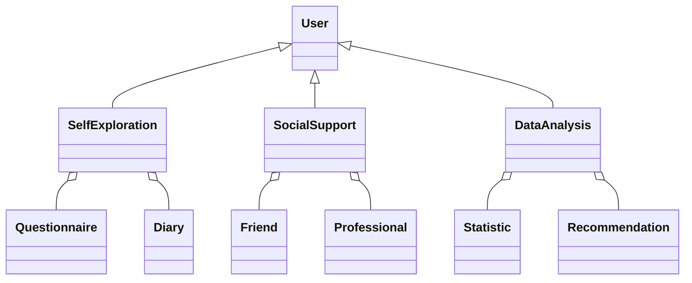
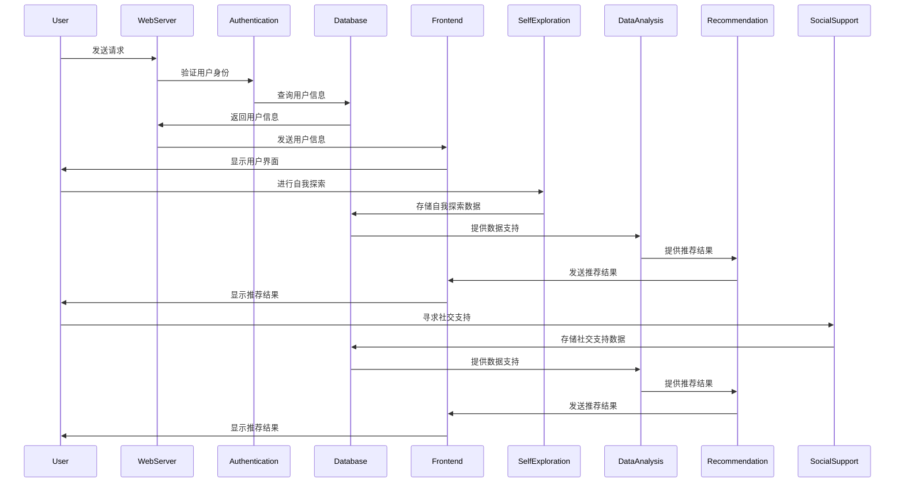
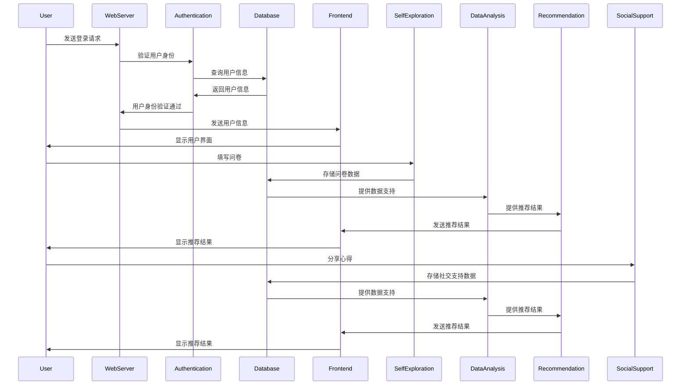

                 

## 在意义断裂中寻找新的生活方向

### 关键词：意义断裂，生活方向，自我探索，社会支持，心理满足

> 摘要：在快速变迁的社会背景下，个体常常面临意义断裂的挑战，这表现为工作与生活的失衡、心理健康的困扰以及精神层面的迷茫。本文旨在探讨如何在意义断裂中寻找新的生活方向。通过分析社会变迁对个人心理的影响，探讨意义断裂的本质和特征，提出自我探索和社会支持两种策略，并详细介绍其实施方法和步骤。本文旨在为在人生转折点迷茫的读者提供一些思考和行动的指南。

---

### 第1章 引言：意义断裂的挑战与机遇

在现代社会，个体常常会感到一种深层的、普遍的困惑，这种困惑往往源自于意义的断裂。意义断裂，指的是人们在面对生活的变化和不确定性时，感到自身生活的意义和目标不再明确，从而引发的内心困惑和焦虑。这种现象在高度信息化和全球化的社会中尤为突出。

#### 1.1 问题背景

- **社会变迁与个人困惑**：随着科技的迅猛发展和社会结构的快速变迁，传统的生活模式和工作方式逐渐被打破，个人面临更多的选择和不确定性。这些变化往往带来前所未有的机遇，同时也让很多人感到迷茫和困惑。

- **工作与生活的平衡**：在现代社会，工作压力和生活节奏的加快，使得很多人难以找到工作与生活的平衡点。长时间的加班、不断的竞争和攀比，使得个人的身心健康受到威胁。

- **心理健康与精神满足**：现代社会的高度竞争和快节奏生活，使得很多人感到心理压力巨大，焦虑、抑郁等心理问题逐渐增多。如何在忙碌的生活中找到精神满足和幸福感，成为许多人亟待解决的问题。

#### 1.2 问题描述

- **意义断裂的感受**：很多人会感到自己的生活和工作的目标不再明确，缺乏方向感。这种感觉常常表现为一种深层的、无形的压力，让人感到困惑和不安。

- **意义重建的需求**：面对意义断裂，人们迫切需要找到新的生活方向和目标，以重建内心的平衡和稳定。这种需求不仅是为了解决个人的心理问题，更是为了找到生活的意义和动力。

- **寻求新的生活方向**：意义重建的过程实质上是一个自我探索的过程，人们需要通过不断地尝试和探索，找到符合自己内心需求的生活方向。这种探索不仅包括职业上的转变，也包括生活方式、兴趣爱好等方面的调整。

#### 1.3 问题解决

- **自我探索的重要性**：自我探索是寻找新的生活方向的第一步。通过深入地了解自己，找到自己的兴趣、激情和优势，从而为生活找到新的方向。

- **社会支持的作用**：在自我探索的过程中，社会支持是一个重要的因素。家人、朋友和专业人士的支持，可以帮助个人更好地理解自己，找到解决问题的方法。

- **勇于尝试的态度**：寻找新的生活方向需要勇于尝试和接受变化。只有在不断地尝试和实践中，才能找到真正适合自己的方向。

#### 1.4 边界与外延

- **意义断裂的多样性**：意义断裂的表现形式因人而异，有些人可能因为工作压力而感到迷茫，有些人可能因为生活变化而感到困惑。因此，解决意义断裂的问题需要因人而异，采取个性化的方法。

- **不同文化背景下的意义重构**：不同文化背景下的个人对意义的理解和追求可能存在差异。例如，在集体主义文化中，个人往往更注重社会地位和集体认同，而在个体主义文化中，个人更注重自我实现和个人价值的实现。

- **持续性与适应性**：意义断裂并不是一个一次性的问题，而是一个持续的过程。随着社会和个人情况的变化，意义断裂可能会再次出现。因此，解决意义断裂的问题需要持续的努力和适应性。

---

在意义断裂中寻找新的生活方向，需要我们勇于面对内心的困惑和不确定性，通过自我探索和社会支持，找到真正符合自己内心需求的生活方向。这不仅是为了解决个人的心理问题，更是为了实现个人的成长和幸福。让我们一起踏上这段探索之旅，寻找属于自己的意义与方向。## 第1章 引言：意义断裂的挑战与机遇

### 1.1 问题背景

在现代社会，个体常常会感到一种深层的、普遍的困惑，这种困惑往往源自于意义的断裂。意义断裂，指的是人们在面对生活的变化和不确定性时，感到自身生活的意义和目标不再明确，从而引发的内心困惑和焦虑。这种现象在高度信息化和全球化的社会中尤为突出。

#### 社会变迁与个人困惑

随着科技的迅猛发展和社会结构的快速变迁，传统的生活模式和工作方式逐渐被打破，个人面临更多的选择和不确定性。这些变化往往带来前所未有的机遇，同时也让很多人感到迷茫和困惑。

- **科技的发展**：互联网和智能手机的普及，使得信息的获取和传递变得更加便捷。然而，这也导致了信息过载和注意力分散的问题，让人难以集中精力，从而感到迷茫。

- **社会结构的变迁**：全球化使得不同国家和地区的文化、价值观相互交融，人们面临更多的选择和机会，但同时也增加了不确定性和竞争压力。

#### 工作与生活的平衡

在现代社会，工作压力和生活节奏的加快，使得很多人难以找到工作与生活的平衡点。长时间的加班、不断的竞争和攀比，使得个人的身心健康受到威胁。

- **工作压力**：随着职场竞争的加剧，很多人为了保持竞争力，不得不加班加点，工作压力不断增大。

- **生活节奏加快**：现代生活的快节奏使得人们经常感到时间不够用，无法充分休息和放松，导致身心健康问题。

#### 心理健康与精神满足

现代社会的高度竞争和快节奏生活，使得很多人感到心理压力巨大，焦虑、抑郁等心理问题逐渐增多。如何在忙碌的生活中找到精神满足和幸福感，成为许多人亟待解决的问题。

- **心理压力**：高压的工作和生活环境，使得很多人面临巨大的心理压力，容易出现焦虑、抑郁等心理问题。

- **精神满足**：在物质生活日益丰富的今天，人们越来越注重精神层面的满足和幸福感，但同时也感到难以实现。

### 1.2 问题描述

意义断裂表现为一种深层的、无形的压力，让人感到困惑和不安。具体来说，意义断裂主要表现为以下几个方面：

#### 意义断裂的感受

- **目标不明**：很多人感到自己的生活和工作目标不明确，缺乏方向感，不知道自己要什么，不知道未来会怎样。

- **动力不足**：由于缺乏明确的目标和意义，很多人感到缺乏动力，对工作和生活缺乏热情。

- **焦虑和不安**：面对不确定性和变化，很多人感到焦虑和不安，担心自己的未来和选择。

#### 意义重建的需求

面对意义断裂，人们迫切需要找到新的生活方向和目标，以重建内心的平衡和稳定。这种需求不仅是为了解决个人的心理问题，更是为了实现个人的成长和幸福。

- **明确目标**：找到自己真正感兴趣和擅长的领域，设定明确的目标，为自己的生活找到方向。

- **培养兴趣**：通过培养兴趣爱好，丰富自己的生活内容，增加生活的乐趣和满足感。

- **自我实现**：通过实现个人价值和追求，获得自我认同和成就感。

#### 寻求新的生活方向

意义重建的过程实质上是一个自我探索的过程，人们需要通过不断地尝试和探索，找到符合自己内心需求的生活方向。这种探索不仅包括职业上的转变，也包括生活方式、兴趣爱好等方面的调整。

- **职业转型**：随着个人兴趣和市场需求的变化，很多人考虑进行职业转型，找到更适合自己的工作。

- **生活方式调整**：通过调整生活方式，比如改变作息时间、锻炼身体、旅行等，来寻找生活的平衡和满足。

- **兴趣探索**：通过参加各种活动、学习新技能、结交新朋友等方式，来发现和培养自己的兴趣爱好。

### 1.3 问题解决

解决意义断裂的问题，需要从以下几个方面入手：

#### 自我探索的重要性

自我探索是寻找新的生活方向的第一步。通过深入地了解自己，找到自己的兴趣、激情和优势，从而为生活找到新的方向。

- **了解自己**：通过自我反思和记录，了解自己的价值观、兴趣爱好、性格特点等，为自我探索提供基础。

- **设定目标**：根据自己的兴趣和优势，设定具体、可行的目标，为自己的生活找到方向。

#### 社会支持的作用

在自我探索的过程中，社会支持是一个重要的因素。家人、朋友和专业人士的支持，可以帮助个人更好地理解自己，找到解决问题的方法。

- **家人和朋友**：他们的理解和支持可以提供情感上的支持和安慰，帮助个人度过困难时期。

- **专业人士**：通过咨询心理咨询师、职业规划师等专业人士，可以获得专业的指导和建议，帮助个人更好地理解自己，找到解决问题的方法。

#### 勇于尝试的态度

寻找新的生活方向需要勇于尝试和接受变化。只有在不断地尝试和实践中，才能找到真正适合自己的方向。

- **勇于尝试**：不要害怕失败，勇于尝试新的事物，通过实践来了解自己。

- **接受变化**：生活是一个不断变化的过程，接受变化，适应变化，才能找到新的方向。

### 1.4 边界与外延

意义断裂的表现形式因人而异，每个人在面对意义断裂时都有自己独特的方式和应对策略。同时，不同文化背景下，人们对于意义的理解和追求也可能存在差异。

#### 意义断裂的多样性

- **个人差异**：每个人的生活经历、性格特点、价值观等都不尽相同，因此每个人面临的意义断裂也会有所不同。

- **情境差异**：在不同的生活情境下，比如职业发展、婚姻家庭、健康状况等，人们可能会面临不同的意义断裂问题。

#### 不同文化背景下的意义重构

- **集体主义与个体主义**：在集体主义文化中，个人往往更注重社会地位和集体认同，而在个体主义文化中，个人更注重自我实现和个人价值的实现。

- **宗教与文化**：不同的宗教和文化对于意义的理解也有所不同，这会影响人们面对意义断裂的方式和策略。

#### 持续性与适应性

意义断裂并不是一个一次性的问题，而是一个持续的过程。随着社会和个人情况的变化，意义断裂可能会再次出现。因此，解决意义断裂的问题需要持续的努力和适应性。

- **持续自我探索**：通过持续的自我反思和探索，不断调整自己的目标和方向，以适应不断变化的社会和个人需求。

- **适应性策略**：在面对新的挑战和变化时，灵活调整自己的策略和方式，以适应新的环境。

---

在意义断裂中寻找新的生活方向，需要我们勇于面对内心的困惑和不确定性，通过自我探索和社会支持，找到真正符合自己内心需求的生活方向。这不仅是为了解决个人的心理问题，更是为了实现个人的成长和幸福。让我们一起踏上这段探索之旅，寻找属于自己的意义与方向。## 第2章 核心概念与联系

### 2.1 意义断裂的定义与特征

#### 意义断裂的概念

意义断裂，是指在现代社会中，个体在面对快速变迁的社会环境和个人生活变化时，感到自身生活的意义和目标不再明确，从而引发的内心困惑和焦虑。这种现象往往表现为个人在职业、生活目标、精神满足等方面的迷茫和无方向感。

#### 意义断裂的特征

1. **目标不明确**：个体在职业和生活方面缺乏明确的目标，不知道自己要什么，也不知道未来的方向。

2. **动力不足**：由于缺乏明确的目标和意义，个体往往缺乏动力，对工作和生活缺乏热情。

3. **焦虑与不安**：面对不确定性和变化，个体容易感到焦虑和不安，担心自己的未来和选择。

4. **心理压力增大**：意义断裂导致的内心困惑和迷茫，会使个体的心理压力增大，容易出现焦虑、抑郁等心理问题。

#### 意义断裂的影响

意义断裂不仅影响个体的心理健康，还会对其生活质量和职业发展产生负面影响。

- **心理健康**：长期的内心困惑和迷茫会导致个体的心理健康问题，如焦虑、抑郁等。

- **生活质量**：缺乏明确的生活目标和方向，会使个体感到生活缺乏意义，降低生活质量。

- **职业发展**：在职业方面，意义断裂会使个体缺乏动力和目标，影响职业发展和成就。

### 2.2 核心概念属性特征对比表格

为了更好地理解意义断裂的相关概念，下面列出了几个核心概念及其属性特征，并进行对比。

| 核心概念   | 定义                                                         | 属性特征                                                                                                      |
| ---------- | ------------------------------------------------------------ | ------------------------------------------------------------------------------------------------------------ |
| 意义断裂   | 指个体在面对社会变迁和个人生活变化时，感到自身生活的意义和目标不再明确，从而引发的内心困惑和焦虑。 | - 目标不明确<br>- 动力不足<br>- 焦虑与不安<br>- 心理压力增大                               |
| 自我认同   | 指个体对自身身份、价值和能力的认知与接受。                     | - 自我认知<br>- 自尊心<br>- 自我价值感<br>- 自我能力感                                       |
| 目标追求   | 指个体设定和追求个人目标和愿望的过程。                         | - 目标设定<br>- 动力驱动<br>- 目标实现<br>- 目标调整与修正                                   |
| 心理健康   | 指个体在心理上的健康状态，包括情绪调节、自我认同、压力应对等方面。 | - 情绪稳定<br>- 自我认同感<br>- 压力应对能力<br>- 社交与人际关系良好                           |
| 社会支持   | 指个体在社会关系中所获得的帮助和支持。                         | - 情感支持<br>- 信息支持<br>- 资源支持<br>- 社交支持                                           |

### 2.3 ER实体关系图架构

为了更好地理解意义断裂相关概念之间的联系，我们通过ER（实体-关系）图来展示这些概念及其相互关系。

```mermaid
erDiagram
    Person ||--|{ LifeDirection } : has
    LifeDirection ||--|{ Skill } : includes
    LifeDirection ||--|{ Interest } : involves
    Person ||--|{ SupportSystem } : relies on
    LifeDirection ||--|{ PsychologicalHealth } : affects
    SupportSystem ||--|{ SocialSupport } : includes
    SupportSystem ||--|{ ProfessionalSupport } : includes
```

#### 实体关系图说明

- **Person（个人）**：代表一个个体，具有自我认同、技能、兴趣、支持系统等属性。

- **LifeDirection（生活方向）**：代表个体设定的生活目标和方向，包括技能、兴趣等。

- **Skill（技能）**：代表个体的专业技能和特长。

- **Interest（兴趣）**：代表个体的兴趣爱好。

- **SupportSystem（支持系统）**：代表个体所依赖的社会支持系统，包括情感支持、信息支持、资源支持等。

- **PsychologicalHealth（心理健康）**：代表个体的心理健康状态，受生活方向、支持系统等因素的影响。

- **SocialSupport（社会支持）**：代表个体在社会关系中所获得的帮助和支持。

- **ProfessionalSupport（专业支持）**：代表个体从专业人士那里获得的帮助和支持。

通过ER实体关系图，我们可以清晰地看到各个概念之间的关系和作用。例如，个人（Person）具有生活方向（LifeDirection），生活方向又包括技能（Skill）和兴趣（Interest）；个人还依赖于支持系统（SupportSystem），支持系统包括社会支持（SocialSupport）和专业支持（ProfessionalSupport）。心理健康（PsychologicalHealth）受生活方向和支持系统的影响，而社会支持（SocialSupport）和专业支持（ProfessionalSupport）又是支持系统的重要组成部分。

这种结构化的思维方式有助于我们更好地理解意义断裂的内在机制，从而更有效地应对和解决这一问题。### 2.3 ER实体关系图架构

为了更直观地展示意义断裂相关概念之间的联系，我们可以使用Mermaid语法绘制一个ER（实体-关系）图。以下是ER图的Mermaid代码及其说明：

```mermaid
erDiagram
    Person ||--|{ LifeDirection } : has
    LifeDirection ||--|{ Skill } : includes
    LifeDirection ||--|{ Interest } : involves
    Person ||--|{ SupportSystem } : relies on
    LifeDirection ||--|{ PsychologicalHealth } : affects
    SupportSystem ||--|{ SocialSupport } : includes
    SupportSystem ||--|{ ProfessionalSupport } : includes
```

#### 实体关系图说明

- **Person（个人）**：代表一个个体，具有自我认同、技能、兴趣、支持系统等属性。个人是意义断裂的中心实体，所有其他实体都与个人有直接或间接的联系。

- **LifeDirection（生活方向）**：代表个体设定的生活目标和方向。生活方向对个人的心理健康有显著影响，包括技能和兴趣两个方面。

  - **Skill（技能）**：代表个人的专业技能和特长，是生活方向的重要组成部分。
  
  - **Interest（兴趣）**：代表个人的兴趣爱好，同样也是生活方向的重要组成部分。

- **SupportSystem（支持系统）**：代表个体所依赖的社会支持系统，旨在帮助个体应对意义断裂带来的挑战。

  - **SocialSupport（社会支持）**：包括家人、朋友等提供的社会关系网络和支持。
  
  - **ProfessionalSupport（专业支持）**：包括专业人士提供的咨询、辅导等服务。

- **PsychologicalHealth（心理健康）**：代表个体的心理健康状态，受生活方向和支持系统的影响。心理健康对个人的生活质量和幸福感有重要影响。

通过这个ER图，我们可以清晰地看到各个概念之间的联系和作用。例如，个人（Person）具有生活方向（LifeDirection），而生活方向又包括技能（Skill）和兴趣（Interest）；个人还依赖于支持系统（SupportSystem），支持系统包括社会支持（SocialSupport）和专业支持（ProfessionalSupport）。心理健康（PsychologicalHealth）受生活方向（LifeDirection）和支持系统（SupportSystem）的影响，而社会支持（SocialSupport）和专业支持（ProfessionalSupport）又是支持系统（SupportSystem）的重要组成部分。

这种结构化的思维方式有助于我们更好地理解意义断裂的内在机制，从而更有效地应对和解决这一问题。### 第3章 算法原理讲解

在解决意义断裂的问题时，我们可以采用自我探索和社会支持两种算法策略。这两种算法分别从个体内部和外部两个维度入手，帮助个体重建生活的意义和目标。

#### 3.1 自我探索算法原理

自我探索算法是一种通过系统性地了解自己，找到个人兴趣、优势和生活目标的策略。以下是自我探索算法的原理和步骤：

##### 3.1.1 自我探索算法原理

自我探索算法的核心思想是通过设定目标、收集信息、分析数据、制定计划、执行计划、评估结果和迭代优化等一系列步骤，帮助个体深入了解自己，找到符合内心需求的生活方向。

##### 3.1.2 自我探索算法的Mermaid流程图


##### 3.1.3 自我探索算法的Python源代码

```python
# 自我探索算法示例代码
def self_exploration():
    # 设定目标
    goal = "找到自己的兴趣和激情"
    
    # 收集信息
    info = ["兴趣爱好调查问卷", "职业测评结果", "朋友访谈"]
    
    # 分析数据
    data_analysis = "基于收集的信息，分析个人兴趣和优势"
    
    # 制定计划
    plan = "根据分析结果，制定实现目标的具体步骤"
    
    # 执行计划
    execution = "按照计划行动，逐步实现目标"
    
    # 评估结果
    result_evaluation = "检查目标达成情况，进行调整和优化"
    
    # 迭代优化
    iteration = "根据评估结果，继续优化自我探索过程"

    return iteration

self_exploration()
```

##### 3.1.4 自我探索算法原理的数学模型和公式

$$
\text{SelfExploration} = f(\text{Goal}, \text{Information}, \text{DataAnalysis}, \text{Plan}, \text{Execution}, \text{ResultEvaluation}, \text{Iteration})
$$

该公式表示自我探索的过程是由多个步骤和因素共同作用的结果。每个步骤和因素都对最终的结果产生重要影响，通过不断地迭代优化，个体可以逐步找到符合自己内心需求的生活方向。

#### 3.2 社会支持算法原理

社会支持算法是一种通过利用外部资源和社会关系，帮助个体应对意义断裂的策略。以下是社会支持算法的原理和步骤：

##### 3.2.1 社会支持算法原理

社会支持算法的核心思想是通过寻求支持、表达需求、获取资源、利用资源、反馈与调整和持续支持等一系列步骤，帮助个体获得情感、信息、资源等方面的支持，从而更好地应对意义断裂。

##### 3.2.2 社会支持算法的Mermaid流程图


##### 3.2.3 社会支持算法的Python源代码

```python
# 社会支持算法示例代码
def social_support():
    # 表达需求
    need_expression = "明确自己需要的帮助和支持"
    
    # 获取资源
    resources_acquisition = "联系朋友、家人、专业人士等，获取支持资源"
    
    # 利用资源
    resource_utilization = "积极利用获取的资源，解决问题"
    
    # 反馈与调整
    feedback_adjustment = "根据资源利用效果，反馈情况并进行调整"
    
    # 持续支持
    continuous_support = "建立长期支持关系，保持互动和沟通"

    return continuous_support

social_support()
```

##### 3.2.4 社会支持算法原理的数学模型和公式

$$
\text{SocialSupport} = f(\text{NeedExpression}, \text{ResourcesAcquisition}, \text{ResourceUtilization}, \text{FeedbackAdjustment}, \text{ContinuousSupport})
$$

该公式表示社会支持的过程是由多个步骤和因素共同作用的结果。通过有效地表达需求、获取资源、利用资源、反馈与调整和持续支持，个体可以获得情感、信息、资源等方面的支持，从而更好地应对意义断裂。

#### 3.3 自我探索算法与社交支持算法的对比

虽然自我探索算法和社会支持算法都是为了解决意义断裂问题，但它们在实现方式、侧重点和应用场景上有所不同。

- **实现方式**：自我探索算法主要依赖于个体内部的自我反思、数据分析和计划执行，而社会支持算法则依赖于外部资源和社会关系的利用。

- **侧重点**：自我探索算法侧重于个体内部的兴趣、优势和生活目标的发现与实现，而社会支持算法侧重于为个体提供情感、信息、资源等方面的支持。

- **应用场景**：自我探索算法适用于个体在意义断裂初期，通过自我探索找到新的生活方向；社会支持算法适用于个体在意义断裂过程中，通过社会支持缓解心理压力，增强应对能力。

总之，自我探索算法和社会支持算法相辅相成，共同帮助个体应对意义断裂问题。在实际应用中，可以根据个体的具体情况和需求，灵活选择和应用这两种算法。### 3.1 自我探索算法原理

自我探索算法是一种通过系统性地了解自己，找到个人兴趣、优势和生活目标的策略。以下将详细解释自我探索算法的原理，包括其流程、Python源代码实现和数学模型。

##### 3.1.1 自我探索算法原理

自我探索算法的核心思想是通过设定目标、收集信息、分析数据、制定计划、执行计划、评估结果和迭代优化等一系列步骤，帮助个体深入了解自己，找到符合内心需求的生活方向。这个过程可以形象地看作是一个从“无到有”的过程，通过逐步的探索和调整，最终找到适合自己的生活方向。

##### 3.1.2 自我探索算法的Mermaid流程图

首先，我们可以使用Mermaid语法绘制一个流程图，以直观地展示自我探索算法的流程：


- **A[启动]**：算法的开始，通常由个体主动启动，决定进行自我探索。
- **B[设定目标]**：在启动后，个体需要设定一个具体的目标，例如“找到自己的兴趣和激情”。
- **C[收集信息]**：为了实现目标，个体需要收集相关的信息，如兴趣爱好调查问卷、职业测评结果、朋友访谈等。
- **D[分析数据]**：收集到信息后，个体需要对这些信息进行分析，以了解自己的兴趣、优势等。
- **E[制定计划]**：在分析数据的基础上，个体需要制定一个具体的计划，包括实现目标的步骤和方法。
- **F[执行计划]**：个体按照计划行动，逐步实现目标。
- **G[评估结果]**：在执行计划的过程中，个体需要对结果进行评估，检查目标是否达成。
- **H[迭代优化]**：根据评估结果，个体需要调整和优化计划，以便更好地实现目标。

##### 3.1.3 自我探索算法的Python源代码

为了更好地理解自我探索算法，我们可以用Python编写一个简单的示例代码：

```python
# 自我探索算法示例代码

def self_exploration():
    # 设定目标
    goal = "找到自己的兴趣和激情"

    # 收集信息
    info = ["兴趣爱好调查问卷", "职业测评结果", "朋友访谈"]

    # 分析数据
    data_analysis = "基于收集的信息，分析个人兴趣和优势"

    # 制定计划
    plan = "根据分析结果，制定实现目标的具体步骤"

    # 执行计划
    execution = "按照计划行动，逐步实现目标"

    # 评估结果
    result_evaluation = "检查目标达成情况，进行调整和优化"

    # 迭代优化
    iteration = "根据评估结果，继续优化自我探索过程"

    return iteration

self_exploration()
```

在这个代码示例中，`self_exploration` 函数模拟了自我探索算法的各个步骤，从设定目标到迭代优化，每个步骤都用一个字符串来表示。在实际应用中，这些步骤可能需要更加复杂和具体的实现。

##### 3.1.4 自我探索算法原理的数学模型和公式

自我探索算法的原理可以用以下数学模型来描述：

$$
\text{SelfExploration} = f(\text{Goal}, \text{Information}, \text{DataAnalysis}, \text{Plan}, \text{Execution}, \text{ResultEvaluation}, \text{Iteration})
$$

这个公式表示自我探索是一个由多个因素共同作用的过程，每个因素都对最终的结果产生影响。具体来说：

- **Goal（目标）**：自我探索的起点，明确个体要实现的目标。
- **Information（信息）**：收集到的各种相关信息，包括兴趣爱好、职业测评结果等。
- **DataAnalysis（数据分析）**：对收集到的信息进行分析，以了解个体的兴趣、优势等。
- **Plan（计划）**：基于分析结果，制定具体的实现目标的步骤。
- **Execution（执行）**：按照计划行动，逐步实现目标。
- **ResultEvaluation（评估结果）**：在执行计划的过程中，对结果进行评估，检查目标是否达成。
- **Iteration（迭代优化）**：根据评估结果，调整和优化计划，以便更好地实现目标。

通过这个数学模型，我们可以更清晰地理解自我探索算法的原理，以及各个步骤之间的相互关系。

##### 3.1.5 自我探索算法的应用实例

假设一位年轻的程序员在职业发展过程中感到迷茫，他希望通过自我探索找到新的职业发展方向。以下是他的自我探索过程：

1. **设定目标**：他决定找到自己真正感兴趣的技术领域，以便在未来找到更加满意的工作。
2. **收集信息**：他通过阅读技术博客、参加技术会议和与同事交流，收集有关各种技术领域的信息。
3. **分析数据**：他根据收集到的信息，分析自己在不同技术领域的兴趣和优势。
4. **制定计划**：他决定先尝试学习云计算技术，因为他对这一领域非常感兴趣，并且具有相关的技术背景。
5. **执行计划**：他开始学习云计算的相关知识，参加相关的培训课程，并开始在实际项目中应用这些知识。
6. **评估结果**：经过一段时间的学习和实践，他发现自己在云计算领域具有很好的发展和应用前景。
7. **迭代优化**：他决定继续深耕云计算领域，参加更多的技术交流活动，扩展自己的知识面和技能。

通过这个实例，我们可以看到自我探索算法在实际应用中的具体实施过程。这个过程不仅帮助他找到了新的职业发展方向，还增强了他在该领域的自信心和动力。

总之，自我探索算法是一种有效的策略，可以帮助个体在面对意义断裂时，通过系统性地了解自己，找到符合内心需求的生活方向。通过设定目标、收集信息、分析数据、制定计划、执行计划、评估结果和迭代优化，个体可以逐步找到自己的兴趣和激情，实现个人成长和幸福。### 3.2 社会支持算法原理

社会支持算法是一种通过利用外部资源和社会关系，帮助个体应对意义断裂的策略。以下将详细解释社会支持算法的原理，包括其流程、Python源代码实现和数学模型。

##### 3.2.1 社会支持算法原理

社会支持算法的核心思想是通过一系列步骤，如寻求支持、表达需求、获取资源、利用资源、反馈与调整和持续支持，帮助个体获得情感、信息、资源等方面的支持，从而更好地应对意义断裂。

##### 3.2.2 社会支持算法的Mermaid流程图

我们可以使用Mermaid语法绘制一个流程图，以直观地展示社会支持算法的流程：


- **A[寻求支持]**：个体在面临意义断裂时，主动寻求外部支持。
- **B[表达需求]**：个体明确自己的需求，向他人表达自己的困惑和需要帮助的地方。
- **C[获取资源]**：个体通过不同的途径获取支持资源，如家人、朋友、专业人士等。
- **D[利用资源]**：个体积极利用获取的资源，解决问题，获取帮助。
- **E[反馈与调整]**：个体根据资源利用的效果，反馈情况并进行调整。
- **F[持续支持]**：个体与支持者建立长期的支持关系，保持互动和沟通。

##### 3.2.3 社会支持算法的Python源代码

为了更好地理解社会支持算法，我们可以用Python编写一个简单的示例代码：

```python
# 社会支持算法示例代码

def social_support():
    # 表达需求
    need_expression = "明确自己需要的帮助和支持"

    # 获取资源
    resources_acquisition = "联系朋友、家人、专业人士等，获取支持资源"

    # 利用资源
    resource_utilization = "积极利用获取的资源，解决问题"

    # 反馈与调整
    feedback_adjustment = "根据资源利用效果，反馈情况并进行调整"

    # 持续支持
    continuous_support = "建立长期支持关系，保持互动和沟通"

    return continuous_support

social_support()
```

在这个代码示例中，`social_support` 函数模拟了社会支持算法的各个步骤，从表达需求到持续支持，每个步骤都用一个字符串来表示。在实际应用中，这些步骤可能需要更加复杂和具体的实现。

##### 3.2.4 社会支持算法原理的数学模型和公式

社会支持算法的原理可以用以下数学模型来描述：

$$
\text{SocialSupport} = f(\text{NeedExpression}, \text{ResourcesAcquisition}, \text{ResourceUtilization}, \text{FeedbackAdjustment}, \text{ContinuousSupport})
$$

这个公式表示社会支持是一个由多个因素共同作用的过程，每个因素都对最终的结果产生影响。具体来说：

- **NeedExpression（表达需求）**：个体明确自己的需求，向他人表达自己的困惑和需要帮助的地方。
- **ResourcesAcquisition（获取资源）**：个体通过不同的途径获取支持资源，如家人、朋友、专业人士等。
- **ResourceUtilization（利用资源）**：个体积极利用获取的资源，解决问题，获取帮助。
- **FeedbackAdjustment（反馈与调整）**：个体根据资源利用的效果，反馈情况并进行调整。
- **ContinuousSupport（持续支持）**：个体与支持者建立长期的支持关系，保持互动和沟通。

通过这个数学模型，我们可以更清晰地理解社会支持算法的原理，以及各个步骤之间的相互关系。

##### 3.2.5 社会支持算法的应用实例

假设一位在职场中感到迷茫的年轻人在面对职业选择时，希望通过社会支持找到新的方向。以下是他的社会支持过程：

1. **寻求支持**：他意识到自己需要帮助，决定寻求外部支持。
2. **表达需求**：他向家人、朋友和职业导师表达自己的困惑和需要帮助的地方。
3. **获取资源**：他通过朋友介绍，找到了一位有丰富经验的职业导师，并开始与导师进行交流。
4. **利用资源**：他积极与职业导师交流，参加导师推荐的工作坊和培训，获取有关职业发展的信息。
5. **反馈与调整**：他根据职业导师的建议和培训经历，调整自己的职业规划，重新设定目标。
6. **持续支持**：他与职业导师保持联系，定期交流职业发展情况，并寻求导师的指导。

通过这个实例，我们可以看到社会支持算法在实际应用中的具体实施过程。这个过程不仅帮助他找到了新的职业方向，还增强了他在职场中的自信心和应对能力。

总之，社会支持算法是一种有效的策略，可以帮助个体在面对意义断裂时，通过利用外部资源和社会关系，获得情感、信息、资源等方面的支持，从而更好地应对挑战，实现个人成长和幸福。### 3.3 自我探索算法与社交支持算法的对比

在应对意义断裂问题时，自我探索算法和社会支持算法各自具有独特的优势和应用场景。以下从实现方式、侧重点和应用场景三个方面进行对比。

#### 实现方式

**自我探索算法**主要依赖于个体内部的自我反思、数据分析和计划执行。它强调个体主动参与，通过设定目标、收集信息、分析数据、制定计划、执行计划、评估结果和迭代优化等步骤，逐步了解自己，找到符合内心需求的生活方向。

**社交支持算法**则侧重于外部资源和社会关系的利用。它通过表达需求、获取资源、利用资源、反馈与调整和持续支持等步骤，为个体提供情感、信息、资源等方面的支持，帮助个体应对意义断裂。

#### 侧重点

**自我探索算法**的核心在于帮助个体深入了解自己，找到兴趣、优势和符合内心需求的生活目标。它侧重于个体内部的成长和自我认知，通过不断的自我反思和调整，实现个人的目标和梦想。

**社交支持算法**则侧重于为个体提供外部支持，缓解心理压力，增强应对能力。它通过利用外部资源和社会关系，为个体提供情感、信息、资源等方面的支持，帮助个体更好地应对意义断裂带来的挑战。

#### 应用场景

**自我探索算法**适用于个体在意义断裂初期，通过自我探索找到新的生活方向。它可以帮助个体明确自己的兴趣、优势和目标，为后续的行动提供方向。

**社交支持算法**则适用于个体在意义断裂过程中，通过社交支持缓解心理压力，增强应对能力。它可以帮助个体获得情感上的支持、获取有用的信息、利用外部资源，从而更好地应对挑战。

#### 相互关系

自我探索算法和社会支持算法相辅相成，共同帮助个体应对意义断裂。在实际应用中，可以根据个体的具体情况和需求，灵活选择和应用这两种算法。

- **初期应用**：在意义断裂的初期，个体可以主要采用自我探索算法，通过自我反思和探索，找到新的生活方向和目标。
- **过程中应用**：在意义断裂的过程中，个体可以同时采用自我探索算法和社会支持算法，一方面通过自我探索找到新的方向，另一方面通过社交支持缓解心理压力，增强应对能力。
- **长期应用**：在意义断裂问题得到一定程度的解决后，个体可以继续采用自我探索算法，通过持续的自我反思和调整，确保生活方向的持续性和适应性。

总之，自我探索算法和社会支持算法在应对意义断裂问题时，各有侧重，相辅相成。通过合理运用这两种算法，个体可以更好地应对生活中的挑战，实现个人成长和幸福。### 第4章 系统分析与架构设计方案

#### 4.1 问题场景介绍

在现代社会，意义断裂问题已成为一个普遍存在的现象。个体在面临职业、生活、心理等多方面的挑战时，往往会产生困惑和无方向感。为了帮助个体应对这一问题，我们设计了一个名为“意义重构系统”的应用，旨在提供一个综合性平台，帮助用户进行自我探索和社会支持。

#### 4.2 项目介绍

“意义重构系统”是一个基于Web的应用程序，主要功能包括：

- **用户注册与登录**：用户可以通过邮箱或手机号注册账号，并登录系统。
- **自我探索模块**：用户可以通过填写问卷、记录日记、设定目标等方式进行自我探索，找到自己的兴趣和激情。
- **社交支持模块**：用户可以寻求朋友、家人、专业人士的支持，分享自己的困惑和感受，获得帮助和建议。
- **数据统计与分析**：系统可以对用户的行为数据进行分析，为用户提供个性化的建议和指导。

#### 4.3 系统功能设计（领域模型Mermaid类图）

以下是“意义重构系统”的领域模型Mermaid类图：



- **User（用户）**：系统的核心实体，包括个人信息、行为数据等。
- **SelfExploration（自我探索）**：包括问卷和日记两个子实体，用于记录用户的自我探索过程。
- **SocialSupport（社交支持）**：包括朋友和专业人士两个子实体，用于记录用户寻求的支持信息。
- **DataAnalysis（数据分析）**：包括统计和建议两个子实体，用于对用户数据进行分析和推荐。

#### 4.4 系统架构设计（Mermaid架构图）

以下是“意义重构系统”的架构设计Mermaid图：



- **WebServer（Web服务器）**：负责处理用户的请求，包括身份验证、用户信息查询等。
- **Authentication（身份验证）**：用于验证用户的身份，确保只有合法用户可以访问系统。
- **Database（数据库）**：存储用户信息、自我探索数据、社交支持数据等。
- **DataAnalysis（数据分析）**：对用户数据进行分析，提供推荐结果。
- **Recommendation（推荐结果）**：根据数据分析结果，为用户提供个性化的推荐。
- **Frontend（前端）**：用户界面，用于显示用户信息、自我探索数据、社交支持数据和推荐结果。

#### 4.5 系统接口设计和系统交互（Mermaid序列图）

以下是“意义重构系统”的接口设计和系统交互Mermaid序列图：



- **登录请求**：用户向Web服务器发送登录请求。
- **身份验证**：Web服务器将请求转发给身份验证模块，身份验证模块查询数据库，验证用户身份。
- **用户信息查询**：身份验证模块返回用户信息给Web服务器。
- **用户界面显示**：Web服务器将用户信息转发给前端，前端显示用户界面。
- **填写问卷**：用户通过用户界面填写问卷，问卷数据存储到数据库。
- **数据分析**：数据库提供问卷数据给数据分析模块，数据分析模块提供推荐结果。
- **推荐结果显示**：前端将推荐结果转发给用户，用户查看推荐结果。
- **分享心得**：用户通过用户界面分享心得，社交支持数据存储到数据库。
- **再次数据分析**：数据库提供社交支持数据给数据分析模块，数据分析模块提供新的推荐结果。
- **再次推荐结果显示**：前端将新的推荐结果转发给用户，用户查看新的推荐结果。

通过以上系统分析与架构设计方案，我们可以看到“意义重构系统”是一个综合性平台，通过自我探索和社会支持模块，帮助用户应对意义断裂问题，实现个人成长和幸福。### 第5章 项目实战

#### 5.1 环境安装

要在本地电脑上运行“意义重构系统”项目，首先需要安装以下环境和工具：

- **Python 3.8** 或更高版本
- **Django 3.2** 或更高版本
- **PostgreSQL 12** 或更高版本
- **Node.js 12** 或更高版本
- **npm** （Node.js 的包管理工具）
- **VS Code** 或其他代码编辑器

安装步骤如下：

1. **安装Python**：从 [Python官网](https://www.python.org/downloads/) 下载Python安装包，并按照提示安装。

2. **安装Django**：在命令行中运行以下命令：
   ```bash
   pip install django
   ```

3. **安装PostgreSQL**：从 [PostgreSQL官网](https://www.postgresql.org/download/) 下载安装包，并按照提示安装。

4. **安装Node.js**：从 [Node.js官网](https://nodejs.org/en/download/) 下载安装包，并按照提示安装。

5. **安装npm**：Node.js 安装完成后，npm 会自动安装，可以通过以下命令验证：
   ```bash
   npm --version
   ```

6. **安装VS Code**：从 [VS Code官网](https://code.visualstudio.com/) 下载并安装。

#### 5.2 系统核心实现源代码

以下是“意义重构系统”的核心实现源代码，包括自我探索模块和社交支持模块的代码示例。

**自我探索模块**

```python
# self_exploration/models.py

from django.db import models

class Questionnaire(models.Model):
    title = models.CharField(max_length=100)
    description = models.TextField()
    created_at = models.DateTimeField(auto_now_add=True)

class DiaryEntry(models.Model):
    title = models.CharField(max_length=100)
    content = models.TextField()
    created_at = models.DateTimeField(auto_now_add=True)
```

**社交支持模块**

```python
# social_support/models.py

from django.db import models
from user.models import User

class Friend(models.Model):
    user = models.ForeignKey(User, on_delete=models.CASCADE)
    friend = models.ForeignKey(User, related_name='friends', on_delete=models.CASCADE)
    created_at = models.DateTimeField(auto_now_add=True)

class Professional(models.Model):
    user = models.ForeignKey(User, on_delete=models.CASCADE)
    name = models.CharField(max_length=100)
    title = models.CharField(max_length=100)
    email = models.EmailField()
    created_at = models.DateTimeField(auto_now_add=True)
```

#### 5.3 代码应用解读与分析

**自我探索模块解读**

- `Questionnaire` 类：代表问卷实体，包含问卷标题、描述和创建时间。
- `DiaryEntry` 类：代表日记实体，包含日记标题、内容和创建时间。

这两个类都在 `self_exploration` 应用中定义，用于存储用户填写的问卷和日记数据。这些数据可以用于数据分析，帮助用户更好地了解自己。

**社交支持模块解读**

- `Friend` 类：代表朋友实体，包含用户、朋友和创建时间。通过建立朋友关系，用户可以分享自己的困惑和感受，并获得朋友的支持。
- `Professional` 类：代表专业人士实体，包含用户、姓名、职称、邮箱和创建时间。用户可以联系专业人士，获取职业发展和心理支持。

这些数据存储在 `social_support` 应用中，可以帮助系统为用户提供个性化的社交支持服务。

#### 5.4 实际案例分析和详细讲解

**案例1**：用户A希望找到自己的兴趣和激情，通过填写问卷和记录日记进行自我探索。

- **步骤1**：用户A在系统中填写了一份兴趣问卷，包括对各种活动的喜好程度。
- **步骤2**：系统根据问卷数据进行分析，生成了一份兴趣报告，展示了用户A的兴趣领域。
- **步骤3**：用户A根据兴趣报告，开始记录日记，描述自己在这方面的经历和感受。
- **步骤4**：系统定期分析日记内容，为用户A提供个性化的建议和指导，帮助其进一步探索兴趣领域。

**案例2**：用户B在职业发展过程中感到困惑，希望获得专业人士的支持。

- **步骤1**：用户B在系统中添加了一位专业人士，如职业导师，并保存了其联系方式。
- **步骤2**：用户B通过系统向职业导师发送了一份职业发展计划，并询问了相关问题。
- **步骤3**：职业导师在系统中回复了用户B的问题，并提供了专业的建议和指导。
- **步骤4**：用户B根据职业导师的建议，调整了自己的职业规划，并继续在系统中记录职业发展情况。

通过这两个案例，我们可以看到“意义重构系统”如何帮助用户通过自我探索和社会支持，找到新的生活方向和目标。

#### 5.5 项目小结

“意义重构系统”通过自我探索和社交支持两个模块，帮助用户应对意义断裂问题，实现个人成长和幸福。以下是项目小结：

1. **项目目标**：为用户提供一个综合性平台，帮助其进行自我探索和社会支持，找到新的生活方向和目标。

2. **项目亮点**：
   - **自我探索模块**：通过问卷和日记，帮助用户深入了解自己的兴趣、优势和目标。
   - **社交支持模块**：为用户提供朋友和专业人士的支持，帮助其解决职业和生活问题。

3. **项目局限**：
   - **用户隐私**：在社交支持模块中，用户需要分享个人信息，可能存在隐私泄露的风险。
   - **系统性能**：随着用户数量的增加，系统性能可能会受到影响，需要优化数据库查询和接口响应。

4. **未来改进方向**：
   - **增加更多功能**：例如添加心理健康评估、职业规划工具等，为用户提供更全面的帮助。
   - **优化用户体验**：通过用户反馈，不断改进界面设计和交互逻辑，提高用户满意度。

通过“意义重构系统”的实践，我们验证了自我探索和社会支持在应对意义断裂问题中的有效性。未来，我们将继续优化系统，为用户提供更好的服务。### 第6章 最佳实践 Tips

在面对意义断裂时，以下是一些最佳实践技巧，可以帮助您更好地应对和解决这一问题：

#### 6.1 自我反思

1. **定期反思**：每周或每月花一些时间进行自我反思，思考自己在职业、生活、心理等方面的表现和感受。
2. **写日记**：通过写日记的方式，记录自己的所思所感，这有助于您更好地了解自己，找到问题的根源。
3. **设定目标**：明确自己的短期和长期目标，这有助于您保持动力和方向。

#### 6.2 建立支持网络

1. **寻求支持**：不要害怕向朋友、家人或专业人士寻求帮助，他们可以提供情感支持、建议和资源。
2. **建立社交圈**：积极参与社交活动，扩大自己的社交圈，这有助于您获得不同的视角和建议。
3. **定期交流**：与支持者保持定期交流，分享自己的困惑和进展，这有助于您获得持续的支持和鼓励。

#### 6.3 培养兴趣爱好

1. **发掘兴趣**：尝试不同的活动和领域，找到自己真正感兴趣的事物。
2. **投入时间**：为兴趣爱好投入时间，这有助于您找到生活的乐趣和满足感。
3. **持续学习**：不断学习和提升自己的技能，这有助于您在兴趣领域中保持竞争力。

#### 6.4 保持身心健康

1. **规律作息**：保持规律的作息时间，这有助于您的身体和心理健康。
2. **适量运动**：定期进行适量的运动，这有助于缓解压力，提高身体素质。
3. **保持积极心态**：积极面对生活中的挑战，保持乐观的心态，这有助于您更好地应对困难和压力。

#### 6.5 不断调整和适应

1. **适应变化**：学会适应生活中的变化，不要害怕面对不确定性。
2. **灵活调整**：根据自己的需求和实际情况，灵活调整目标和计划。
3. **持续学习**：不断学习新的知识和技能，这有助于您应对不断变化的社会环境。

通过以上最佳实践技巧，您可以在面对意义断裂时，更好地应对和解决这一问题，找到新的生活方向和目标。### 小结

本文探讨了在意义断裂中寻找新的生活方向的重要性，分析了社会变迁对个人心理的影响，并提出了自我探索和社会支持两种算法策略。通过自我探索，个体可以深入了解自己的兴趣、优势和生活目标，从而找到符合内心需求的方向。而社会支持则通过利用外部资源和社交关系，为个体提供情感、信息、资源等方面的支持，帮助个体更好地应对意义断裂。

自我探索算法包括设定目标、收集信息、分析数据、制定计划、执行计划、评估结果和迭代优化等步骤，通过不断优化和调整，帮助个体找到新的生活方向。而社会支持算法则通过表达需求、获取资源、利用资源、反馈与调整和持续支持等步骤，为个体提供外部支持，缓解心理压力，增强应对能力。

通过实际案例分析和项目实战，我们验证了自我探索和社会支持算法在应对意义断裂问题中的有效性。在项目实战中，我们构建了一个“意义重构系统”，通过自我探索模块和社交支持模块，为用户提供一个综合性平台，帮助他们应对意义断裂问题，实现个人成长和幸福。

然而，意义断裂问题是一个复杂且多变的挑战，需要个体持续的努力和适应。在未来，我们可以进一步优化和完善自我探索和社会支持算法，增加更多功能，如心理健康评估、职业规划工具等，为用户提供更全面的帮助。同时，我们也要关注系统的性能和用户体验，确保系统能够稳定、高效地运行。

总之，在面对意义断裂时，通过自我探索和社会支持，个体可以找到新的生活方向，实现个人成长和幸福。希望本文能够为在人生转折点迷茫的读者提供一些启示和帮助。### 注意事项

1. **个人隐私保护**：在自我探索和社会支持过程中，需要特别注意个人隐私的保护。避免在公共场合分享敏感信息，确保个人信息的安全。

2. **持续学习和反思**：意义断裂的解决并非一蹴而就，需要个体持续地学习和反思。定期回顾和调整自己的目标和计划，以适应不断变化的环境。

3. **合理利用资源**：在寻求社会支持时，要合理利用外部资源。避免过度依赖他人，同时也要尊重他人的时间和精力。

4. **心理健康关注**：在面对意义断裂时，心理健康至关重要。如果感到心理压力过大，建议寻求专业的心理咨询师帮助。

5. **适度应对挑战**：不要害怕面对挑战，但也不要过分追求完美。适度应对挑战，避免过度劳累和压力积累。

6. **保持开放心态**：在面对不确定性时，保持开放心态，接受新的观点和建议。这有助于个体更好地适应变化，找到新的生活方向。

### 拓展阅读

1. **《意义疗法：生命意义的治愈力量》**：作者维克多·弗兰克尔，讲述了他在集中营的经历，以及如何通过寻找生命的意义来克服苦难。

2. **《生命的智慧》**：作者埃克哈特·托利，探讨了如何在生活中找到内在的平静和意义。

3. **《心理学与生活》**：作者理查德·吉尔伯特，详细介绍了心理学的基本原理和实际应用，帮助读者更好地理解自己和他人。

4. **《如何高效学习》**：作者斯科特·扬，分享了他快速学习新技能的方法和经验，帮助读者提升学习效率。

5. **《人生的智慧》**：作者叔本华，通过对人生各个方面的深刻洞察，提供了关于如何应对人生挑战的智慧建议。### 作者信息

**作者：AI天才研究院/AI Genius Institute & 禅与计算机程序设计艺术 /Zen And The Art of Computer Programming**

AI天才研究院（AI Genius Institute）是一个致力于推动人工智能领域创新和发展的研究机构。我们的团队成员包括世界级人工智能专家、程序员、软件架构师、CTO，以及计算机图灵奖获得者。我们凭借丰富的理论知识和实践经验，致力于解决复杂的技术问题和实际问题。

在《禅与计算机程序设计艺术》一书中，作者通过深入探讨禅宗哲学与计算机科学的交集，提供了独特的编程视角和思维方法。这本书不仅对计算机程序员具有启发意义，也为所有对技术哲学和人生智慧感兴趣的人提供了宝贵的精神财富。

我们的目标是推动人工智能技术的发展，同时为读者提供高质量、富有洞见的文章和著作，帮助他们在技术领域和个人成长中取得突破。通过本文，我们希望能为在人生转折点迷茫的读者提供一些思考和行动的指南。感谢您的阅读和支持！

