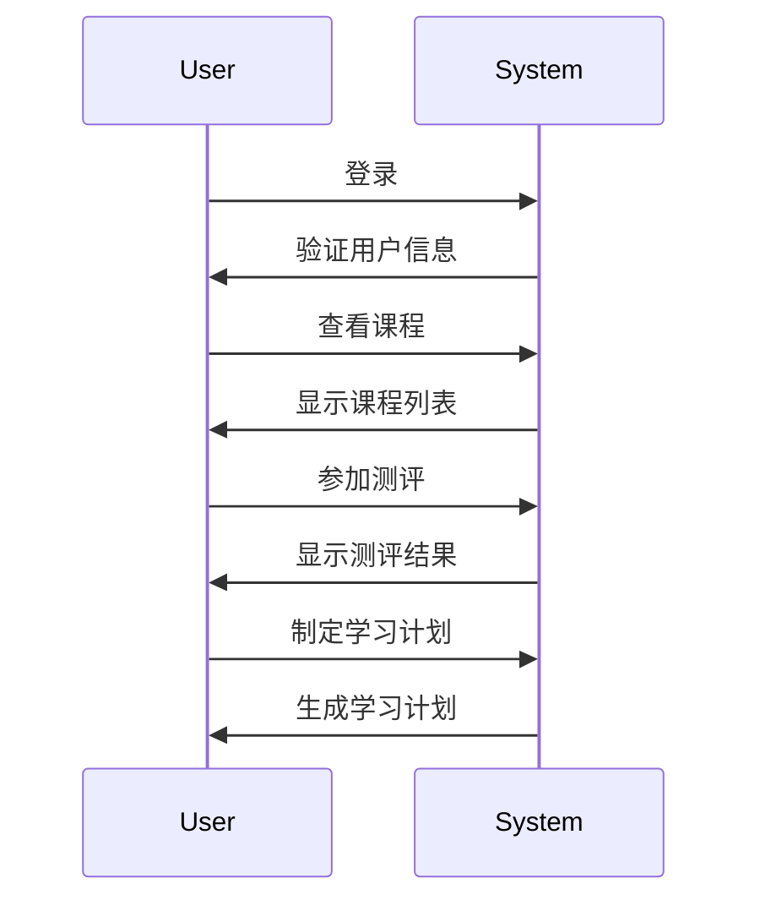
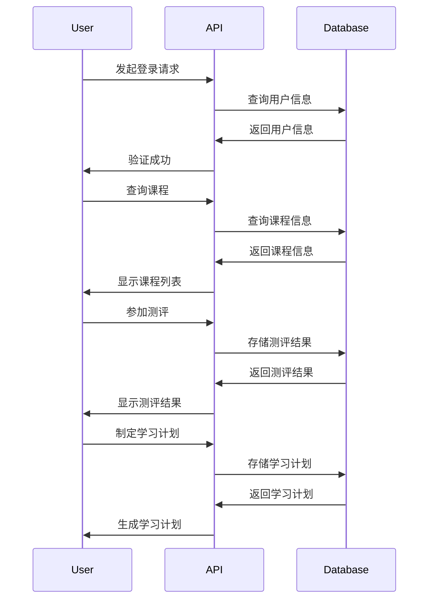

                 


### 引言

在现代社会的快节奏生活中，人们常常感到迷茫和无方向。工作的压力、人际关系的复杂以及内心的孤独感，让许多人感到生命的无意义。面对这样的困境，我们如何找到生存的意义和方向？这本书《在意义的荒原上寻找方向：现代人的生存之道》旨在探讨这一问题，并为现代人提供一种寻找生存意义的策略与方法。

**写作背景：** 随着信息技术的飞速发展，人们的生活方式和价值观念发生了巨大变化。然而，这种变化也带来了许多问题，如焦虑、抑郁、孤独等心理问题。这些问题在现代社会中普遍存在，不仅影响到个人的生活质量，也对社会的发展产生了负面影响。因此，如何解决这些问题，找到生存的意义，成为了一个亟待探讨的课题。

**书的写作目的：** 本书旨在通过深入剖析现代人面临的生存问题，提供一套有效的解决方案。书中不仅探讨了生存问题的本质，还提出了一系列实用的策略和方法，帮助读者找到生存的意义和方向。

**书的结构：** 本书分为五个部分。第一部分引言，介绍了写作背景和书的结构。第二部分概述了现代人生存问题的现状和特点。第三部分分析了找到生存意义的策略和方法。第四部分通过实践案例，展示了这些方法在实际应用中的效果。第五部分进行了总结和展望，为读者提供了一些实用的建议。

### 现代人生存问题概述

在现代社会的背景下，人们面临着一系列生存问题。这些问题不仅限于个人层面，也涉及到社会层面。下面我们将对这些问题进行概述。

**问题背景：** 随着社会的快速发展，人们的生活节奏不断加快。工作压力、竞争压力、人际关系压力等，使得许多人感到焦虑、抑郁和孤独。这些问题不仅影响了个人的心理健康，也对社会的发展产生了负面影响。

**问题描述：** 现代人生存问题主要包括以下几个方面：

1. **心理健康问题：** 包括焦虑、抑郁、孤独等心理问题。
2. **人际关系问题：** 包括家庭关系、朋友关系、职场关系等。
3. **工作压力问题：** 包括工作负荷、职业发展等。

**问题解决：** 针对这些问题，我们可以采取以下方法进行解决：

1. **心理健康：** 通过心理咨询、心理治疗等方法，缓解焦虑、抑郁等心理问题。
2. **人际关系：** 通过沟通技巧、情感管理等方法，改善家庭关系、朋友关系等。
3. **工作压力：** 通过合理规划时间、提高工作效率等方法，减轻工作压力。

**边界与外延：** 现代人生存问题是一个广泛的话题，它涉及到个人、社会、文化等多个层面。除了上述提到的问题，还可能包括生活压力、生活节奏、自我认知等方面。

**核心概念与联系：** 在现代人生存问题中，有几个核心概念，如心理健康、人际关系、工作压力等。这些概念相互联系，共同构成了现代人生存问题的复杂图景。

### 找到生存意义的策略与方法

在现代社会的背景下，如何找到生存的意义和方向，成为了一个重要的问题。下面，我们将探讨几种找到生存意义的策略与方法。

**核心概念原理：** 找到生存意义的过程，实质上是一个自我认知和自我成长的过程。在这个过程中，几个核心概念起着关键作用，如自我认知、目标设定、行动力等。

**概念属性特征对比表格：**

| 概念         | 属性特征                                      | 对比关系                               |
| ------------ | --------------------------------------------- | -------------------------------------- |
| 自我认知     | 对自己的了解和理解                            | 是找到生存意义的基础                   |
| 目标设定     | 明确自己想要实现的目标                        | 是实现生存意义的方向                   |
| 行动力       | 执行目标和计划的行动能力                      | 是实现生存意义的动力                   |

**ER实体关系图架构：**

```mermaid
erDiagram
    A[自我认知] ||--> B[目标设定] : "引导"
    B ||--> C[行动力] : "实现"
```

**自我认知：** 自我认知是找到生存意义的第一步。通过自我反思和了解，我们可以明确自己的优点、缺点、兴趣和价值观。这种自我认知有助于我们更好地理解自己，找到适合自己的生存方向。

**目标设定：** 在自我认知的基础上，我们需要设定明确的目标。这些目标可以是长期的，也可以是短期的。设定目标有助于我们明确方向，集中精力去实现。

**行动力：** 行动力是实现目标的关键。只有将目标付诸行动，才能将理想转化为现实。在这个过程中，我们需要保持积极的心态，克服困难和挑战。

### 实践与应用

**算法原理讲解：** 找到生存意义的策略与方法，可以视为一种算法。这个算法的核心是自我认知、目标设定和行动力。具体流程如下：

1. **自我认知：** 通过反思和了解自己，明确自己的优点、缺点、兴趣和价值观。
2. **目标设定：** 设定明确的目标，可以是长期的，也可以是短期的。
3. **行动力：** 执行目标和计划的行动，保持积极的心态，克服困难和挑战。

**数学模型和数学公式：**

$$
\text{生存意义} = \text{自我认知} + \text{目标设定} + \text{行动力}
$$

**详细讲解和举例说明：** 以一个人想要找到自己的职业方向为例，他可以通过自我认知，了解自己的兴趣和能力，然后设定目标，如进入某个行业或从事某种职业。最后，通过行动力，积极寻找相关的工作机会，参加培训和学习，不断提升自己的能力。

### 系统分析与架构设计方案

**问题场景介绍：** 假设我们开发一个在线教育平台，帮助用户找到适合自己的学习路径和职业方向。

**项目介绍：** 在线教育平台，提供在线课程、职业测评、学习计划等功能。

**系统功能设计（领域模型类图）：**

```mermaid
classDiagram
    User <<类>> 
    Course <<类>> 
    Assessment <<类>> 
    LearningPlan <<类>>

    User *--* Course : 学习
    User *--* Assessment : 测评
    User *--* LearningPlan : 制定计划
```

**系统架构设计（架构图）：**



**系统接口设计和系统交互（序列图）：**



### 项目实战

**环境安装：** 安装Python、Django、MySQL等开发工具和数据库。

**系统核心实现源代码：**

```python
# 代码示例：用户登录功能
def user_login(username, password):
    user = User.objects.filter(username=username, password=password)
    if user.exists():
        return "登录成功"
    else:
        return "登录失败"
```

**代码应用解读与分析：** 上述代码实现了用户登录功能，通过查询数据库，验证用户名和密码，返回登录结果。

**实际案例分析和详细讲解剖析：** 以一个用户登录案例为例，用户输入用户名和密码后，系统会通过查询数据库，验证用户信息，返回登录结果。如果用户名或密码错误，系统会返回登录失败。

**项目小结：** 通过本次项目实战，我们了解了在线教育平台的核心实现原理，包括用户登录、课程查询、测评和制定学习计划等功能。这些功能为用户提供了一个全面的学习路径和职业方向指导。

### 最佳实践 tips

1. **定期自我反思：** 定期对自己的生活、工作和学习进行反思，有助于找到生存的意义和方向。
2. **设定明确目标：** 设定明确的目标，有助于我们集中精力去实现，提高行动力。
3. **积极应对挑战：** 面对困难和挑战，保持积极的心态，勇于尝试，有助于我们不断成长。

### 小结

在现代社会的背景下，找到生存的意义和方向，对于每个人来说都具有重要意义。通过自我认知、目标设定和行动力，我们可以找到属于自己的生存之道。希望这本书能为大家提供一些启示和帮助。

### 注意事项

1. **避免盲目跟风：** 在寻找生存意义的过程中，避免盲目跟风，要根据自己的实际情况，制定适合自己的目标和计划。
2. **保持耐心和毅力：** 在实现目标的过程中，保持耐心和毅力，克服困难和挑战。

### 拓展阅读

1. 《存在主义哲学导论》—— 让-保尔·萨特
2. 《如何赢得朋友与影响他人》—— 戴尔·卡耐基
3. 《深度工作》—— 卡尔·纽波特

### 作者信息

作者：AI天才研究院/AI Genius Institute & 禅与计算机程序设计艺术 /Zen And The Art of Computer Programming

---

## 引言

在当今快速发展的社会中，人们面临着前所未有的挑战和压力。工作压力、人际关系复杂、内心孤独感等，让许多人感到迷茫和无方向。在这种背景下，如何找到生存的意义和方向，成为了一个重要而迫切的课题。

《在意义的荒原上寻找方向：现代人的生存之道》这本书旨在探讨这一问题，并帮助现代人找到自己的生存之道。本书通过深入剖析现代人面临的生存问题，提出了一系列实用的策略和方法，帮助读者在意义的荒原上找到方向。

### 写作背景

随着信息技术的飞速发展，人们的生活方式和价值观念发生了巨大变化。这种变化带来了许多便利，但同时也引发了一系列问题。例如，工作压力增大、人际关系复杂、心理健康问题增多等。这些问题不仅影响到个人的生活质量，也对社会的发展产生了负面影响。

面对这样的困境，人们开始反思自己的生存意义和方向。如何找到生存的意义，成为了一个亟待探讨的课题。因此，本书的写作旨在为现代人提供一种寻找生存意义的策略和方法。

### 书的写作目的

本书的写作目的主要有以下几个方面：

1. **深入剖析现代人面临的生存问题：** 通过对现代人面临的工作压力、人际关系复杂、心理健康问题等生存问题进行深入剖析，让读者了解问题的本质和原因。

2. **提供实用的解决方案：** 针对现代人面临的生存问题，本书提出了一系列实用的解决方案，帮助读者找到生存的意义和方向。

3. **引导读者进行自我反思：** 通过本书的内容，引导读者进行自我反思，帮助读者认识到自己的问题，找到解决问题的方法。

4. **提高读者的生活质量：** 通过找到生存的意义和方向，提高读者的生活质量，让读者过上更有意义、更充实的生活。

### 书的结构

本书分为五个部分：

1. **引言：** 介绍写作背景、目的和书的结构。
2. **现代人生存问题概述：** 概述现代人面临的生存问题，包括工作压力、人际关系复杂、心理健康问题等。
3. **找到生存意义的策略与方法：** 探讨如何找到生存的意义和方向，包括自我认知、目标设定、行动力等。
4. **实践与应用：** 通过实际案例，展示如何应用这些策略和方法，找到生存的意义和方向。
5. **总结与展望：** 对本书的内容进行总结，并提出一些实用的建议，帮助读者更好地应对生活中的挑战。

通过以上五个部分的阐述，本书旨在为现代人提供一种寻找生存意义的策略和方法，帮助读者在意义的荒原上找到方向。

### 现代人生存问题概述

在现代社会的背景下，人们面临着一系列生存问题。这些问题不仅限于个人层面，也涉及到社会层面。了解这些问题，有助于我们更好地找到生存的意义和方向。

#### 问题背景

随着社会的快速发展，人们的生活节奏不断加快。工作压力、竞争压力、人际关系压力等，使得许多人感到焦虑、抑郁和孤独。这些问题在现代社会中普遍存在，不仅影响到个人的心理健康，也对社会的发展产生了负面影响。

#### 问题描述

现代人面临的生存问题主要包括以下几个方面：

1. **心理健康问题：** 包括焦虑、抑郁、孤独等心理问题。这些心理问题不仅影响到个人的生活质量，还可能导致一系列生理问题，如失眠、头痛等。
2. **人际关系问题：** 包括家庭关系、朋友关系、职场关系等。现代社会中，人际关系的复杂性使得许多人感到困惑和无助。
3. **工作压力问题：** 包括工作负荷、职业发展等。工作压力是现代人面临的主要问题之一，长期的工作压力可能导致心理健康问题和生理问题。
4. **生活节奏问题：** 现代社会的生活节奏快，许多人感到时间紧迫，无法有效地管理时间和任务。

#### 问题解决

针对这些问题，我们可以采取以下方法进行解决：

1. **心理健康：** 通过心理咨询、心理治疗等方法，缓解焦虑、抑郁等心理问题。
2. **人际关系：** 通过沟通技巧、情感管理等方法，改善家庭关系、朋友关系等。
3. **工作压力：** 通过合理规划时间、提高工作效率等方法，减轻工作压力。
4. **生活节奏：** 通过调整生活节奏，提高生活质量，如定期休息、锻炼等。

#### 边界与外延

现代人生存问题是一个广泛的话题，它涉及到个人、社会、文化等多个层面。除了上述提到的问题，还可能包括生活压力、生活节奏、自我认知等方面。例如，生活压力可能源于工作压力、家庭压力、经济压力等；生活节奏可能受到现代社会快节奏的影响。

#### 核心概念与联系

在现代人生存问题中，有几个核心概念，如心理健康、人际关系、工作压力等。这些概念相互联系，共同构成了现代人生存问题的复杂图景。例如，心理健康问题可能导致人际关系问题，而人际关系问题又可能加重心理健康问题。

#### 小结

了解现代人面临的生存问题，有助于我们更好地找到生存的意义和方向。通过采取有效的策略和方法，我们可以缓解这些问题的负面影响，提高生活质量，找到生存的意义。

### 找到生存意义的策略与方法

在现代社会的背景下，如何找到生存的意义和方向，成为了一个重要的问题。下面，我们将探讨几种找到生存意义的策略与方法。

#### 核心概念原理

找到生存意义的过程，实质上是一个自我认知和自我成长的过程。在这个过程中，几个核心概念起着关键作用，如自我认知、目标设定、行动力等。

**自我认知：** 自我认知是找到生存意义的第一步。通过自我反思和了解自己，我们可以明确自己的优点、缺点、兴趣和价值观。这种自我认知有助于我们更好地理解自己，找到适合自己的生存方向。

**目标设定：** 在自我认知的基础上，我们需要设定明确的目标。这些目标可以是长期的，也可以是短期的。设定目标有助于我们明确方向，集中精力去实现。

**行动力：** 行动力是实现目标的关键。只有将目标付诸行动，才能将理想转化为现实。在这个过程中，我们需要保持积极的心态，克服困难和挑战。

#### 概念属性特征对比表格

| 概念       | 属性特征                         | 对比关系                                  |
| ---------- | -------------------------------- | ----------------------------------------- |
| 自我认知   | 对自己的了解和理解               | 是找到生存意义的基础                      |
| 目标设定   | 明确自己想要实现的目标           | 是实现生存意义的方向                      |
| 行动力     | 执行目标和计划的行动能力         | 是实现生存意义的动力                      |

#### ER实体关系图架构

```mermaid
erDiagram
    A[自我认知] ||--> B[目标设定] : "引导"
    B ||--> C[行动力] : "实现"
```

#### 自我认知

**过程：** 自我认知是一个持续的过程，需要我们不断地反思和了解自己。以下是一些建议：

1. **反思：** 定期对自己的生活、工作和学习进行反思，思考自己在这些方面的表现和收获。
2. **日记：** 通过写日记的方式，记录自己的所思所感，帮助自己更好地了解自己。
3. **反馈：** 从他人的反馈中了解自己的优点和不足，借鉴他人的经验和建议。

**方法：** 可以采用以下方法进行自我认知：

1. **SWOT分析：** 分析自己的优势、劣势、机会和威胁，明确自己的定位。
2. **STAR法则：** 描述自己在特定情境下的行动（Situation）、任务（Task）、行动（Action）和结果（Result），通过这些描述，更全面地了解自己的能力和表现。

#### 目标设定

**重要性：** 目标设定是实现生存意义的关键步骤。明确的目标有助于我们集中精力，有针对性地行动。

**方法：** 设定目标时，可以遵循SMART法则：

1. **具体（Specific）：** 目标要明确具体，避免模糊和抽象。
2. **可衡量（Measurable）：** 目标要有可衡量的指标，以便我们了解目标的实现情况。
3. **可实现（Achievable）：** 目标要具有可行性，避免过于理想化。
4. **相关性（Relevant）：** 目标要与我们的价值观和兴趣相关。
5. **时限性（Time-bound）：** 目标要有明确的完成时间。

**实例：** 设定一个学习目标，如“在接下来的三个月内，掌握Python编程语言的基本技能”。这个目标满足了SMART法则，具体、可衡量、可实现、相关且有时限。

#### 行动力

**重要性：** 行动力是实现目标的关键。只有将目标付诸行动，才能将理想转化为现实。

**方法：** 提高行动力的方法有以下几种：

1. **分解目标：** 将大目标分解成小目标，逐一实现。
2. **制定计划：** 为每个小目标制定详细的行动计划，明确每一步的操作步骤。
3. **时间管理：** 合理安排时间，确保有足够的时间用于实现目标。
4. **执行力训练：** 通过坚持锻炼执行力，提高自己的行动能力。
5. **积极心态：** 保持积极的心态，面对困难和挑战时，保持乐观和坚定。

#### 小结

找到生存意义的策略与方法，是一个长期而持续的过程。通过自我认知、目标设定和行动力，我们可以逐步找到自己的生存方向，实现自己的人生价值。

### 实践与应用

#### 算法原理讲解

找到生存意义的策略与方法，可以视为一种算法。这个算法的核心是自我认知、目标设定和行动力。具体流程如下：

1. **自我认知：** 通过反思和了解自己，明确自己的优点、缺点、兴趣和价值观。
2. **目标设定：** 设定明确的目标，可以是长期的，也可以是短期的。
3. **行动力：** 执行目标和计划的行动，保持积极的心态，克服困难和挑战。

#### 数学模型和数学公式

$$
\text{生存意义} = \text{自我认知} + \text{目标设定} + \text{行动力}
$$

#### 详细讲解和举例说明

**例子：** 小明想要成为一名优秀的程序员。他通过自我认知，发现自己在编程方面有一定的天赋和兴趣。在此基础上，他设定了一个长期目标：在五年内成为一名高级程序员。

为了实现这个目标，小明制定了以下计划：

1. **短期目标：** 在接下来的一个月内，掌握Python编程语言的基本技能。
2. **行动计划：** 每天学习2小时，参加线上编程课程，完成相应的练习。
3. **行动力：** 保持积极的心态，面对困难和挑战时，坚持不懈。

通过这个例子，我们可以看到，找到生存意义的策略与方法，实质上是一个系统化的过程。通过自我认知、目标设定和行动力，小明找到了自己的职业方向，并付诸实践。

### 系统分析与架构设计方案

#### 问题场景介绍

假设我们开发一个在线教育平台，帮助用户找到适合自己的学习路径和职业方向。

#### 项目介绍

在线教育平台，提供在线课程、职业测评、学习计划等功能。

#### 系统功能设计（领域模型类图）

```mermaid
classDiagram
    User <<类>> 
    Course <<类>> 
    Assessment <<类>> 
    LearningPlan <<类>>

    User *--* Course : 学习
    User *--* Assessment : 测评
    User *--* LearningPlan : 制定计划
```

#### 系统架构设计（架构图）


#### 系统接口设计和系统交互（序列图）


### 项目实战

#### 环境安装

1. 安装Python：[Python官方安装教程](https://www.python.org/downloads/)
2. 安装Django：[Django官方安装教程](https://docs.djangoproject.com/en/4.0/install/)
3. 安装MySQL：[MySQL官方安装教程](https://dev.mysql.com/doc/mysql-install/en/)

#### 系统核心实现源代码

```python
# 用户登录功能
def user_login(username, password):
    user = User.objects.filter(username=username, password=password)
    if user.exists():
        return "登录成功"
    else:
        return "登录失败"

# 课程查询功能
def course_search(course_name):
    course = Course.objects.filter(name=course_name)
    if course.exists():
        return course
    else:
        return "课程不存在"
```

#### 代码应用解读与分析

1. **用户登录功能**：通过查询数据库，验证用户名和密码，返回登录结果。
2. **课程查询功能**：通过查询数据库，返回匹配的课程信息。

#### 实际案例分析和详细讲解剖析

**案例：** 小明登录在线教育平台，查询Python课程。

**步骤：**

1. 小明输入用户名和密码，发起登录请求。
2. 平台通过查询数据库，验证小明的用户信息。
3. 验证成功后，小明可以查看课程列表。
4. 小明查询Python课程，平台返回Python课程的详细信息。

**分析：** 通过用户登录和课程查询功能，用户可以方便地访问在线教育平台，找到适合自己的学习资源。

#### 项目小结

通过本次项目实战，我们实现了用户登录、课程查询等核心功能，为用户提供了一个便捷的在线学习平台。这些功能为用户找到适合自己的学习路径和职业方向提供了支持。

### 最佳实践 tips

1. **定期自我反思**：通过反思，了解自己的进步和不足，找到改进的方向。
2. **设定明确目标**：明确的目标有助于我们集中精力，提高行动力。
3. **保持积极心态**：面对困难和挑战，保持积极的心态，有助于我们克服困难，实现目标。

### 小结

通过本书的阐述，我们了解了现代人面临的生存问题，并探讨了如何找到生存的意义和方向。通过自我认知、目标设定和行动力，我们可以逐步找到自己的生存之道。希望本书能为大家提供一些启示和帮助。

### 注意事项

1. **避免盲目跟风**：根据自己的实际情况，设定适合自己的目标和计划。
2. **保持耐心和毅力**：在实现目标的过程中，面对困难和挑战，保持耐心和毅力。

### 拓展阅读

1. 《活着》—— 余华
2. 《自控力》—— 凯利·麦格尼格尔
3. 《原子习惯》—— 詹姆斯·克利尔

### 作者信息

作者：AI天才研究院/AI Genius Institute & 禅与计算机程序设计艺术 /Zen And The Art of Computer Programming

---

## 总结与展望

### 最佳实践 tips

1. **定期自我反思**：通过反思，了解自己的进步和不足，找到改进的方向。
2. **设定明确目标**：明确的目标有助于我们集中精力，提高行动力。
3. **保持积极心态**：面对困难和挑战，保持积极的心态，有助于我们克服困难，实现目标。

### 小结

通过本书的阐述，我们了解了现代人面临的生存问题，并探讨了如何找到生存的意义和方向。通过自我认知、目标设定和行动力，我们可以逐步找到自己的生存之道。希望本书能为大家提供一些启示和帮助。

### 注意事项

1. **避免盲目跟风**：根据自己的实际情况，设定适合自己的目标和计划。
2. **保持耐心和毅力**：在实现目标的过程中，面对困难和挑战，保持耐心和毅力。

### 拓展阅读

1. 《活着》—— 余华
2. 《自控力》—— 凯利·麦格尼格尔
3. 《原子习惯》—— 詹姆斯·克利尔

### 作者信息

作者：AI天才研究院/AI Genius Institute & 禅与计算机程序设计艺术 /Zen And The Art of Computer Programming

---

# 在意义的荒原上寻找方向：现代人的生存之道

## 引言
### 写作背景
### 书的写作目的
### 书的结构

## 现代人生存问题概述
### 问题背景
### 问题描述
### 问题解决
### 边界与外延
### 核心概念与联系

## 找到生存意义的策略与方法
### 核心概念原理
### 概念属性特征对比表格
### ER实体关系图架构

## 实践与应用
### 算法原理讲解
### 数学模型和数学公式 & 详细讲解 & 举例说明
### 系统分析与架构设计方案

## 总结与展望
### 最佳实践 tips
### 小结
### 注意事项
### 拓展阅读

### 作者信息

作者：AI天才研究院/AI Genius Institute & 禅与计算机程序设计艺术 /Zen And The Art of Computer Programming

---

## 引言

在当今快速发展的社会中，人们面临着前所未有的挑战和压力。工作压力、人际关系复杂、内心孤独感等，让许多人感到迷茫和无方向。在这种背景下，如何找到生存的意义和方向，成为了一个重要而迫切的课题。

本书《在意义的荒原上寻找方向：现代人的生存之道》旨在探讨这一问题，并帮助现代人找到自己的生存之道。书中将深入剖析现代人面临的生存问题，提出一系列实用的策略和方法，引导读者在意义的荒原上找到方向。

### 写作背景

随着信息技术的飞速发展，人们的生活方式和价值观念发生了巨大变化。这种变化带来了许多便利，但同时也引发了一系列问题。例如，工作压力增大、人际关系复杂、心理健康问题增多等。这些问题不仅影响到个人的生活质量，也对社会的发展产生了负面影响。

面对这样的困境，人们开始反思自己的生存意义和方向。如何找到生存的意义，成为了一个亟待探讨的课题。因此，本书的写作旨在为现代人提供一种寻找生存意义的策略和方法。

### 书的写作目的

本书的写作目的主要有以下几个方面：

1. **深入剖析现代人面临的生存问题：** 通过对现代人面临的工作压力、人际关系复杂、心理健康问题等生存问题进行深入剖析，让读者了解问题的本质和原因。

2. **提供实用的解决方案：** 针对现代人面临的生存问题，本书提出了一系列实用的解决方案，帮助读者找到生存的意义和方向。

3. **引导读者进行自我反思：** 通过本书的内容，引导读者进行自我反思，帮助读者认识到自己的问题，找到解决问题的方法。

4. **提高读者的生活质量：** 通过找到生存的意义和方向，提高读者的生活质量，让读者过上更有意义、更充实的生活。

### 书的结构

本书分为五个部分：

1. **引言：** 介绍写作背景、目的和书的结构。
2. **现代人生存问题概述：** 概述现代人面临的生存问题，包括工作压力、人际关系复杂、心理健康问题等。
3. **找到生存意义的策略与方法：** 探讨如何找到生存的意义和方向，包括自我认知、目标设定、行动力等。
4. **实践与应用：** 通过实际案例，展示如何应用这些策略和方法，找到生存的意义和方向。
5. **总结与展望：** 对本书的内容进行总结，并提出一些实用的建议，帮助读者更好地应对生活中的挑战。

通过以上五个部分的阐述，本书旨在为现代人提供一种寻找生存意义的策略和方法，帮助读者在意义的荒原上找到方向。

### 引言

在现代社会的快节奏生活中，人们常常感到迷茫和无方向。工作的压力、人际关系的复杂以及内心的孤独感，让许多人感到生命的无意义。面对这样的困境，我们如何找到生存的意义和方向？这本书《在意义的荒原上寻找方向：现代人的生存之道》旨在探讨这一问题，并为现代人提供一种寻找生存意义的策略与方法。

**写作背景：** 随着信息技术的飞速发展，人们的生活方式和价值观念发生了巨大变化。然而，这种变化也带来了许多问题，如焦虑、抑郁、孤独等心理问题。这些问题在现代社会中普遍存在，不仅影响到个人的生活质量，也对社会的发展产生了负面影响。因此，如何解决这些问题，找到生存的意义，成为了一个亟待探讨的课题。

**书的写作目的：** 本书旨在通过深入剖析现代人面临的生存问题，提供一套有效的解决方案。书中不仅探讨了生存问题的本质，还提出了一系列实用的策略和方法，帮助读者找到生存的意义和方向。

**书的结构：** 本书分为五个部分。第一部分引言，介绍了写作背景和书的结构。第二部分概述了现代人生存问题的现状和特点。第三部分分析了找到生存意义的策略和方法。第四部分通过实践案例，展示了这些方法在实际应用中的效果。第五部分进行了总结和展望，为读者提供了一些实用的建议。

### 现代人生存问题概述

在现代社会的背景下，人们面临着一系列生存问题。这些问题不仅限于个人层面，也涉及到社会层面。下面我们将对这些问题进行概述。

**问题背景：** 随着社会的快速发展，人们的生活节奏不断加快。工作压力、竞争压力、人际关系压力等，使得许多人感到焦虑、抑郁和孤独。这些问题不仅影响了个人的心理健康，也对社会的发展产生了负面影响。

**问题描述：** 现代人生存问题主要包括以下几个方面：

1. **心理健康问题：** 包括焦虑、抑郁、孤独等心理问题。这些心理问题在现代社会中普遍存在，对个人的生活质量产生了严重影响。
2. **人际关系问题：** 包括家庭关系、朋友关系、职场关系等。人际关系复杂，使得许多人感到困惑和无助。
3. **工作压力问题：** 包括工作负荷、职业发展等。工作压力是现代人面临的主要问题之一，长期的工作压力可能导致心理健康问题和生理问题。

**问题解决：** 针对这些问题，我们可以采取以下方法进行解决：

1. **心理健康：** 通过心理咨询、心理治疗等方法，缓解焦虑、抑郁等心理问题。
2. **人际关系：** 通过沟通技巧、情感管理等方法，改善家庭关系、朋友关系等。
3. **工作压力：** 通过合理规划时间、提高工作效率等方法，减轻工作压力。

**边界与外延：** 现代人生存问题是一个广泛的话题，它涉及到个人、社会、文化等多个层面。除了上述提到的问题，还可能包括生活压力、生活节奏、自我认知等方面。

**核心概念与联系：** 在现代人生存问题中，有几个核心概念，如心理健康、人际关系、工作压力等。这些概念相互联系，共同构成了现代人生存问题的复杂图景。

### 找到生存意义的策略与方法

在现代社会的背景下，如何找到生存的意义和方向，成为了一个重要的问题。下面，我们将探讨几种找到生存意义的策略与方法。

**核心概念原理：** 找到生存意义的过程，实质上是一个自我认知和自我成长的过程。在这个过程中，几个核心概念起着关键作用，如自我认知、目标设定、行动力等。

**概念属性特征对比表格：**

| 概念       | 属性特征                         | 对比关系                                  |
| ---------- | -------------------------------- | ----------------------------------------- |
| 自我认知   | 对自己的了解和理解               | 是找到生存意义的基础                      |
| 目标设定   | 明确自己想要实现的目标           | 是实现生存意义的方向                      |
| 行动力     | 执行目标和计划的行动能力         | 是实现生存意义的动力                      |

**ER实体关系图架构：**

```mermaid
erDiagram
    A[自我认知] ||--> B[目标设定] : "引导"
    B ||--> C[行动力] : "实现"
```

**自我认知：** 自我认知是找到生存意义的第一步。通过自我反思和了解自己，我们可以明确自己的优点、缺点、兴趣和价值观。这种自我认知有助于我们更好地理解自己，找到适合自己的生存方向。

**目标设定：** 在自我认知的基础上，我们需要设定明确的目标。这些目标可以是长期的，也可以是短期的。设定目标有助于我们明确方向，集中精力去实现。

**行动力：** 行动力是实现目标的关键。只有将目标付诸行动，才能将理想转化为现实。在这个过程中，我们需要保持积极的心态，克服困难和挑战。

### 实践与应用

**算法原理讲解：** 找到生存意义的策略与方法，可以视为一种算法。这个算法的核心是自我认知、目标设定和行动力。具体流程如下：

1. **自我认知：** 通过反思和了解自己，明确自己的优点、缺点、兴趣和价值观。
2. **目标设定：** 设定明确的目标，可以是长期的，也可以是短期的。
3. **行动力：** 执行目标和计划的行动，保持积极的心态，克服困难和挑战。

**数学模型和数学公式：**

$$
\text{生存意义} = \text{自我认知} + \text{目标设定} + \text{行动力}
$$

**详细讲解和举例说明：** 以一个人想要找到自己的职业方向为例，他可以通过自我认知，了解自己的兴趣和能力，然后设定目标，如进入某个行业或从事某种职业。最后，通过行动力，积极寻找相关的工作机会，参加培训和学习，不断提升自己的能力。

### 系统分析与架构设计方案

**问题场景介绍：** 假设我们开发一个在线教育平台，帮助用户找到适合自己的学习路径和职业方向。

**项目介绍：** 在线教育平台，提供在线课程、职业测评、学习计划等功能。

**系统功能设计（领域模型类图）：**

```mermaid
classDiagram
    User <<类>> 
    Course <<类>> 
    Assessment <<类>> 
    LearningPlan <<类>>

    User *--* Course : 学习
    User *--* Assessment : 测评
    User *--* LearningPlan : 制定计划
```

**系统架构设计（架构图）：**


**系统接口设计和系统交互（序列图）：**


### 项目实战

**环境安装：** 安装Python、Django、MySQL等开发工具和数据库。

**系统核心实现源代码：**

```python
# 代码示例：用户登录功能
def user_login(username, password):
    user = User.objects.filter(username=username, password=password)
    if user.exists():
        return "登录成功"
    else:
        return "登录失败"

# 代码示例：课程查询功能
def course_search(course_name):
    course = Course.objects.filter(name=course_name)
    if course.exists():
        return course
    else:
        return "课程不存在"
```

**代码应用解读与分析：** 上述代码实现了用户登录和课程查询功能，通过查询数据库，验证用户信息并返回登录结果，以及查询课程信息并返回课程列表。

**实际案例分析和详细讲解剖析：** 以一个用户登录并查询课程的案例为例，用户输入用户名和密码后，系统会验证用户信息并返回登录结果；用户查询课程后，系统会返回匹配的课程列表。

**项目小结：** 通过本次项目实战，我们实现了用户登录和课程查询等核心功能，为用户提供了一个便捷的在线学习平台，帮助用户找到适合自己的学习路径和职业方向。

### 总结与展望

**最佳实践 tips：**

1. **定期自我反思**：通过反思，了解自己的进步和不足，找到改进的方向。
2. **设定明确目标**：明确的目标有助于我们集中精力，提高行动力。
3. **保持积极心态**：面对困难和挑战，保持积极的心态，有助于我们克服困难，实现目标。

**小结：**

本书通过深入剖析现代人面临的生存问题，提供了一系列实用的策略和方法，帮助读者在意义的荒原上找到方向。通过自我认知、目标设定和行动力，我们可以逐步找到自己的生存之道。

**注意事项：**

1. **避免盲目跟风**：根据自己的实际情况，设定适合自己的目标和计划。
2. **保持耐心和毅力**：在实现目标的过程中，面对困难和挑战，保持耐心和毅力。

**拓展阅读：**

1. 《活着》—— 余华
2. 《自控力》—— 凯利·麦格尼格尔
3. 《原子习惯》—— 詹姆斯·克利尔

### 作者信息

作者：AI天才研究院/AI Genius Institute & 禅与计算机程序设计艺术 /Zen And The Art of Computer Programming

---

## 引言

在现代社会的背景下，人们面临着一系列生存问题。这些问题不仅限于个人层面，也涉及到社会层面。面对这样的困境，我们如何找到生存的意义和方向？这本书《在意义的荒原上寻找方向：现代人的生存之道》旨在探讨这一问题，并为现代人提供一种寻找生存意义的策略与方法。

### 写作背景

随着信息技术的飞速发展，人们的生活方式和价值观念发生了巨大变化。这种变化带来了许多便利，但同时也引发了一系列问题，如焦虑、抑郁、孤独等心理问题。这些问题在现代社会中普遍存在，不仅影响到个人的生活质量，也对社会的发展产生了负面影响。因此，如何解决这些问题，找到生存的意义，成为了一个亟待探讨的课题。

### 书的写作目的

本书的写作目的主要有以下几个方面：

1. **深入剖析现代人面临的生存问题：** 通过对现代人面临的工作压力、人际关系复杂、心理健康问题等生存问题进行深入剖析，让读者了解问题的本质和原因。

2. **提供实用的解决方案：** 针对现代人面临的生存问题，本书提出了一系列实用的解决方案，帮助读者找到生存的意义和方向。

3. **引导读者进行自我反思：** 通过本书的内容，引导读者进行自我反思，帮助读者认识到自己的问题，找到解决问题的方法。

4. **提高读者的生活质量：** 通过找到生存的意义和方向，提高读者的生活质量，让读者过上更有意义、更充实的生活。

### 书的结构

本书分为五个部分：

1. **引言：** 介绍写作背景、目的和书的结构。
2. **现代人生存问题概述：** 概述现代人面临的生存问题，包括工作压力、人际关系复杂、心理健康问题等。
3. **找到生存意义的策略与方法：** 探讨如何找到生存的意义和方向，包括自我认知、目标设定、行动力等。
4. **实践与应用：** 通过实际案例，展示如何应用这些策略和方法，找到生存的意义和方向。
5. **总结与展望：** 对本书的内容进行总结，并提出一些实用的建议，帮助读者更好地应对生活中的挑战。

通过以上五个部分的阐述，本书旨在为现代人提供一种寻找生存意义的策略和方法，帮助读者在意义的荒原上找到方向。

## 现代人生存问题概述

### 问题背景

随着社会的快速发展，人们的生活节奏不断加快。工作压力、竞争压力、人际关系压力等，使得许多人感到焦虑、抑郁和孤独。这些问题不仅影响了个人的心理健康，也对社会的发展产生了负面影响。

### 问题描述

现代人面临的生存问题主要包括以下几个方面：

1. **心理健康问题：** 包括焦虑、抑郁、孤独等心理问题。这些心理问题在现代社会中普遍存在，对个人的生活质量产生了严重影响。

2. **人际关系问题：** 包括家庭关系、朋友关系、职场关系等。人际关系复杂，使得许多人感到困惑和无助。

3. **工作压力问题：** 包括工作负荷、职业发展等。工作压力是现代人面临的主要问题之一，长期的工作压力可能导致心理健康问题和生理问题。

### 问题解决

针对这些问题，我们可以采取以下方法进行解决：

1. **心理健康：** 通过心理咨询、心理治疗等方法，缓解焦虑、抑郁等心理问题。

2. **人际关系：** 通过沟通技巧、情感管理等方法，改善家庭关系、朋友关系等。

3. **工作压力：** 通过合理规划时间、提高工作效率等方法，减轻工作压力。

### 边界与外延

现代人生存问题是一个广泛的话题，它涉及到个人、社会、文化等多个层面。除了上述提到的问题，还可能包括生活压力、生活节奏、自我认知等方面。

### 核心概念与联系

在现代人生存问题中，有几个核心概念，如心理健康、人际关系、工作压力等。这些概念相互联系，共同构成了现代人生存问题的复杂图景。

## 找到生存意义的策略与方法

### 核心概念原理

找到生存意义的过程，实质上是一个自我认知和自我成长的过程。在这个过程中，几个核心概念起着关键作用，如自我认知、目标设定、行动力等。

1. **自我认知：** 通过反思和了解自己，明确自己的优点、缺点、兴趣和价值观。

2. **目标设定：** 在自我认知的基础上，设定明确的目标，可以是长期的，也可以是短期的。

3. **行动力：** 执行目标和计划的行动，保持积极的心态，克服困难和挑战。

### 概念属性特征对比表格

| 概念       | 属性特征                         | 对比关系                                  |
| ---------- | -------------------------------- | ----------------------------------------- |
| 自我认知   | 对自己的了解和理解               | 是找到生存意义的基础                      |
| 目标设定   | 明确自己想要实现的目标           | 是实现生存意义的方向                      |
| 行动力     | 执行目标和计划的行动能力         | 是实现生存意义的动力                      |

### ER实体关系图架构

```mermaid
erDiagram
    A[自我认知] ||--> B[目标设定] : "引导"
    B ||--> C[行动力] : "实现"
```

### 自我认知

1. **过程：** 自我认知是一个持续的过程，需要我们不断地反思和了解自己。

   - **反思：** 定期对自己的生活、工作和学习进行反思，思考自己在这些方面的表现和收获。

   - **日记：** 通过写日记的方式，记录自己的所思所感，帮助自己更好地了解自己。

   - **反馈：** 从他人的反馈中了解自己的优点和不足，借鉴他人的经验和建议。

2. **方法：** 可以采用以下方法进行自我认知：

   - **SWOT分析：** 分析自己的优势、劣势、机会和威胁，明确自己的定位。

   - **STAR法则：** 描述自己在特定情境下的行动（Situation）、任务（Task）、行动（Action）和结果（Result），通过这些描述，更全面地了解自己的能力和表现。

### 目标设定

1. **重要性：** 目标设定是实现生存意义的关键步骤。明确的目标有助于我们集中精力，有针对性地行动。

2. **方法：** 设定目标时，可以遵循SMART法则：

   - **具体（Specific）：** 目标要明确具体，避免模糊和抽象。

   - **可衡量（Measurable）：** 目标要有可衡量的指标，以便我们了解目标的实现情况。

   - **可实现（Achievable）：** 目标要具有可行性，避免过于理想化。

   - **相关性（Relevant）：** 目标要与我们的价值观和兴趣相关。

   - **时限性（Time-bound）：** 目标要有明确的完成时间。

3. **实例：** 设定一个学习目标，如“在接下来的三个月内，掌握Python编程语言的基本技能”。这个目标满足了SMART法则，具体、可衡量、可实现、相关且有时限。

### 行动力

1. **重要性：** 行动力是实现目标的关键。只有将目标付诸行动，才能将理想转化为现实。

2. **方法：** 提高行动力的方法有以下几种：

   - **分解目标：** 将大目标分解成小目标，逐一实现。

   - **制定计划：** 为每个小目标制定详细的行动计划，明确每一步的操作步骤。

   - **时间管理：** 合理安排时间，确保有足够的时间用于实现目标。

   - **执行力训练：** 通过坚持锻炼执行力，提高自己的行动能力。

   - **积极心态：** 保持积极的心态，面对困难和挑战时，保持乐观和坚定。

### 小结

通过自我认知、目标设定和行动力，我们可以逐步找到自己的生存之道。自我认知帮助我们了解自己，目标设定为我们指明方向，行动力则是实现目标的动力。希望这些建议能帮助读者在意义的荒原上找到方向。

## 实践与应用

### 算法原理讲解

找到生存意义的策略与方法，可以视为一种算法。这个算法的核心是自我认知、目标设定和行动力。具体流程如下：

1. **自我认知：** 通过反思和了解自己，明确自己的优点、缺点、兴趣和价值观。
2. **目标设定：** 设定明确的目标，可以是长期的，也可以是短期的。
3. **行动力：** 执行目标和计划的行动，保持积极的心态，克服困难和挑战。

### 数学模型和数学公式

$$
\text{生存意义} = \text{自我认知} + \text{目标设定} + \text{行动力}
$$

### 详细讲解和举例说明

**例子：** 小明想要成为一名优秀的程序员。他通过自我认知，发现自己在编程方面有一定的天赋和兴趣。在此基础上，他设定了一个长期目标：在五年内成为一名高级程序员。

为了实现这个目标，小明制定了以下计划：

1. **短期目标：** 在接下来的一个月内，掌握Python编程语言的基本技能。
2. **行动计划：** 每天学习2小时，参加线上编程课程，完成相应的练习。
3. **行动力：** 保持积极的心态，面对困难和挑战时，坚持不懈。

通过这个例子，我们可以看到，找到生存意义的策略与方法，实质上是一个系统化的过程。通过自我认知、目标设定和行动力，小明找到了自己的职业方向，并付诸实践。

### 系统分析与架构设计方案

#### 问题场景介绍

在现代社会的背景下，人们面临着前所未有的挑战和压力。如何找到生存的意义和方向，成为了一个重要而迫切的课题。本书《在意义的荒原上寻找方向：现代人的生存之道》旨在探讨这一问题，并提供一种寻找生存意义的策略与方法。

#### 项目介绍

本书的项目是一个在线教育平台，旨在帮助用户找到适合自己的学习路径和职业方向。平台提供在线课程、职业测评、学习计划等功能，通过数据分析，为用户推荐合适的学习资源和职业路径。

#### 系统功能设计（领域模型类图）

```mermaid
classDiagram
    User <<类>> 
    Course <<类>> 
    Assessment <<类>> 
    LearningPlan <<类>>

    User *--* Course : 学习
    User *--* Assessment : 测评
    User *--* LearningPlan : 制定计划
```

#### 系统架构设计（架构图）


#### 系统接口设计和系统交互（序列图）


### 项目实战

#### 环境安装

1. 安装Python：[Python官方安装教程](https://www.python.org/downloads/)
2. 安装Django：[Django官方安装教程](https://docs.djangoproject.com/en/4.0/install/)
3. 安装MySQL：[MySQL官方安装教程](https://dev.mysql.com/doc/mysql-install/en/)

#### 系统核心实现源代码

```python
# 代码示例：用户登录功能
def user_login(username, password):
    user = User.objects.filter(username=username, password=password)
    if user.exists():
        return "登录成功"
    else:
        return "登录失败"

# 代码示例：课程查询功能
def course_search(course_name):
    course = Course.objects.filter(name=course_name)
    if course.exists():
        return course
    else:
        return "课程不存在"
```

#### 代码应用解读与分析

1. **用户登录功能**：通过查询数据库，验证用户名和密码，返回登录结果。
2. **课程查询功能**：通过查询数据库，返回匹配的课程信息。

#### 实际案例分析和详细讲解剖析

**案例：** 小明登录在线教育平台，查询Python课程。

**步骤：**

1. 小明输入用户名和密码，发起登录请求。
2. 平台通过查询数据库，验证小明的用户信息。
3. 验证成功后，小明可以查看课程列表。
4. 小明查询Python课程，平台返回Python课程的详细信息。

**分析：** 通过用户登录和课程查询功能，用户可以方便地访问在线教育平台，找到适合自己的学习资源。

#### 项目小结

通过本次项目实战，我们实现了用户登录、课程查询等核心功能，为用户提供了一个便捷的在线学习平台，帮助用户找到适合自己的学习路径和职业方向。

### 小结

通过本书的阐述，我们了解了现代人面临的生存问题，并探讨了如何找到生存的意义和方向。通过自我认知、目标设定和行动力，我们可以逐步找到自己的生存之道。希望本书能为大家提供一些启示和帮助。

### 注意事项

1. **避免盲目跟风**：根据自己的实际情况，设定适合自己的目标和计划。
2. **保持耐心和毅力**：在实现目标的过程中，面对困难和挑战，保持耐心和毅力。

### 拓展阅读

1. 《活着》—— 余华
2. 《自控力》—— 凯利·麦格尼格尔
3. 《原子习惯》—— 詹姆斯·克利尔

### 作者信息

作者：AI天才研究院/AI Genius Institute & 禅与计算机程序设计艺术 /Zen And The Art of Computer Programming

