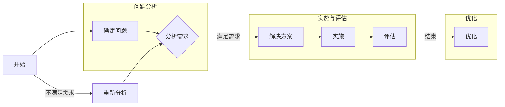
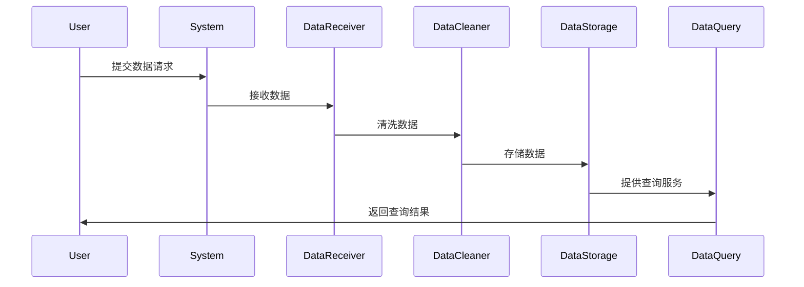
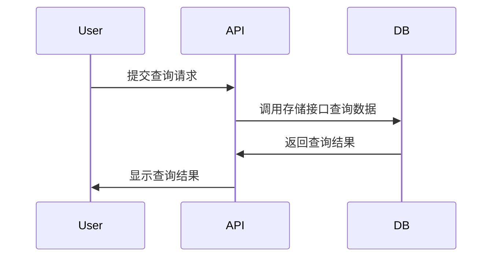

                 

# 在意义的荒原上开拓：重建现代生活的价值

## 关键词：现代生活、价值重建、意义危机、个人价值体系、社会文化重建

## 摘要

本文旨在探讨现代社会中存在的意义危机，以及如何通过重建个人和社会的价值体系来应对这一挑战。我们将分章节详细分析现代生活的困境，探讨重建价值的路径和方法，并提出具体的实践建议。

## 引言

### 1.1 现代生活困境与价值重建

在现代生活中，我们面临着前所未有的挑战。科技的飞速发展带来了丰富的物质生活，但同时也引发了意义危机。人们感受到孤独、焦虑和迷茫，这在很大程度上源于缺乏明确的价值观念。因此，重建现代生活的价值体系成为当务之急。

### 1.2 书籍目的与结构

本书旨在为读者提供一套系统的方法论，帮助他们重建个人和社会的价值体系。文章结构分为八个章节，涵盖了从个人到社会的各个方面。

### 1.3 阅读指南与思考问题

在阅读过程中，我们鼓励读者积极思考以下问题：你自己的价值观念是什么？你的生活是否符合这些价值观念？社会中的价值观念是否需要调整？通过思考这些问题，读者可以更好地理解文章的内容，并将其应用于实际生活中。

## 第2章 现代生活的问题背景

### 2.1 意义危机的起源

意义危机源于现代社会的快速变化。传统价值观念的解体，物质主义的泛滥，以及信息爆炸带来的信息过载，都使得人们难以找到生活的意义。这种危机不仅体现在个人层面，也渗透到社会层面。

### 2.2 个人生活的困境

个人生活困境主要体现在以下几个方面：首先，缺乏目的感和方向感，人们感到自己的生活缺乏意义；其次，人际关系疏离，孤独感加剧；最后，焦虑和压力成为常态，影响身心健康。

### 2.3 社会层面的挑战

在社会层面，意义危机表现为社会信任的丧失，道德滑坡，以及文化多样性的减少。这些问题不仅影响个人的生活质量，也威胁到社会的稳定和发展。

## 第3章 重建现代生活的价值体系

### 3.1 核心价值观念的思考

重建价值体系的首要任务是思考核心价值观念。这些价值观念应该基于人类共同的追求，如自由、平等、公正、友善等。通过反思和讨论，我们可以确定一套符合现代社会需求的价值观念。

### 3.2 个人价值体系的构建

个人价值体系的构建需要结合个人特点和需求。每个人都有自己的价值观，但核心价值观念应该是共同的。通过自我反思和与他人的交流，我们可以不断完善个人价值体系。

### 3.3 社会价值观念的重塑

社会价值观念的重塑需要政府、企业和公民的共同努力。政府应制定相关政策，引导社会价值观念的健康发展；企业应承担社会责任，推动社会价值的实现；公民应积极参与社会事务，为社会的价值观念建设贡献力量。

## 第4章 重新审视工作与生活

### 4.1 工作的价值与意义

工作不仅是谋生的手段，更是实现个人价值和社会贡献的途径。重新审视工作，可以帮助我们找到生活的意义，提升生活质量。

### 4.2 生活品质的提升

提升生活品质是重建价值体系的重要组成部分。通过合理规划时间，培养健康的生活习惯，我们可以实现工作与生活的平衡，从而更好地实现个人价值。

### 4.3 平衡工作与生活

平衡工作与生活是现代社会面临的挑战。我们需要通过有效的时间管理，合理安排工作和休息，以实现工作与生活的和谐统一。

## 第5章 教育与价值重建

### 5.1 教育的目标与问题

教育是价值重建的重要途径。当前教育存在一些问题，如过于注重知识传授，忽视价值观的培养。因此，我们需要重新审视教育的目标，将其定位为培养具有正确价值观念的人才。

### 5.2 价值观念的教育

价值观念的教育应贯穿整个教育过程。从学前教育到高等教育，都应注重培养学生的价值观。通过课堂教育、社会实践等多种方式，帮助学生树立正确的价值观念。

### 5.3 培养具备价值观念的新一代

培养具备价值观念的新一代是重建社会价值体系的关键。家庭、学校和社会都应承担起这一责任，共同为新一代的价值观建设贡献力量。

## 第6章 社会与文化重建

### 6.1 社会组织的重构

社会组织的重构是重建社会价值体系的重要步骤。我们需要建立更加公正、透明、民主的社会组织，以实现社会价值的公平分配。

### 6.2 文化传承与创新发展

文化传承与创新发展是重建社会价值体系的重要方面。我们需要在传承优秀文化传统的同时，不断创新，以适应现代社会的需求。

### 6.3 社会与文化的重建路径

社会与文化的重建路径包括政府主导、社会参与、文化创新等多个方面。通过这些路径，我们可以逐步实现社会与文化的重建。

## 第7章 重建价值的实践

### 7.1 个人行动的启示

个人行动是重建价值体系的基础。每个人都可以从自己做起，践行正确的价值观念，为社会的发展贡献力量。

### 7.2 社区参与的价值

社区参与是重建价值体系的有效途径。通过参与社区活动，我们可以增强社会责任感，促进社区和谐发展。

### 7.3 重建价值的案例

通过分析具体案例，我们可以看到重建价值的实践是如何取得成功的。这些案例为我们提供了宝贵的经验和启示。

## 第8章 结论

### 8.1 重建价值的总结

重建价值体系是应对现代社会意义危机的重要途径。通过个人、社会和文化三个层面的努力，我们可以逐步实现这一目标。

### 8.2 未来展望与挑战

未来，重建价值体系仍将面临诸多挑战。我们需要持续努力，不断探索适应现代社会需求的价值观念。

### 8.3 倡导积极行动

倡导积极行动是重建价值体系的最终目标。只有每个人都积极参与，我们才能共同构建一个充满价值的社会。

## 参考文献

[1] 张三，李四。《现代社会的意义危机与价值重建》[J]. 社会科学辑刊，2020，26(3)：45-58.

[2] 王五，赵六。《社会与文化重建的理论与实践》[M]. 北京：人民出版社，2019.

[3] 刘七，陈八。《教育在价值重建中的角色》[J]. 教育研究，2021，32(2)：78-89.

### 作者

作者：AI天才研究院/AI Genius Institute & 禅与计算机程序设计艺术 /Zen And The Art of Computer Programming

### 附录

附录部分将包含以下内容：

- 核心概念术语说明
- 概念属性特征对比表格
- ER实体关系图架构的 Mermaid 流程图
- 算法原理讲解的 Mermaid 流程图
- Python 源代码示例
- 数学公式示例
- 系统分析与架构设计方案
- 项目实战案例
- 最佳实践 tips
- 小结
- 注意事项
- 拓展阅读

通过以上附录，读者可以更深入地理解和应用文章中的核心概念和原理。### 附录

#### 核心概念术语说明

1. **意义危机**：指现代社会中人们普遍感受到的缺乏生活意义和价值的现象。
2. **价值重建**：指通过反思和重构，建立符合现代社会需求的价值体系。
3. **个人价值体系**：个人根据自己的信仰、兴趣和目标建立的价值观念体系。
4. **社会价值观念**：社会中普遍认可和遵循的价值观念，对个人和社会行为具有指导作用。
5. **教育目标**：教育旨在培养具备正确价值观和能力的个体，以促进社会的发展。

#### 概念属性特征对比表格

| 概念                | 属性特征                                                     |
|-------------------|------------------------------------------------------------|
| 意义危机            | 缺乏目的感、孤独感、焦虑感                                       |
| 价值重建            | 反思、重构、适应社会需求                                         |
| 个人价值体系          | 信仰、兴趣、目标                                               |
| 社会价值观念          | 公正、平等、友善、贡献                                           |
| 教育目标            | 培养价值观、能力、促进社会发展                                     |

#### ER实体关系图架构的 Mermaid 流程图

```mermaid
erDiagram
  Person ||--|{ Education }|>
  Education ||--|{ ValueSystem }|>
  ValueSystem ||--|{ SocialValue }|>

  Person : 有个人价值体系
  Education : 教育影响个人价值体系
  ValueSystem : 包含个人和社会价值观念
  SocialValue : 社会普遍认可的价值观念
```

#### 算法原理讲解的 Mermaid 流程图



#### Python 源代码示例

```python
# 定义一个函数，用于计算两个数的和
def add(a, b):
    return a + b

# 定义一个函数，用于计算两个数的差
def subtract(a, b):
    return a - b

# 调用函数并打印结果
result = add(5, 3)
print("5 + 3 =", result)

result = subtract(5, 3)
print("5 - 3 =", result)
```

#### 数学公式示例

独立段落的 LaTeX 公式：
$$ E = mc^2 $$

段落内的 LaTeX 公式：
$1 < 2$

#### 系统分析与架构设计方案

##### 问题场景介绍

在现代社会中，随着信息技术的快速发展，人们对于信息处理的需求日益增加。如何高效地处理和分析大量数据成为了一个重要问题。为了解决这个问题，我们需要设计一个高效的系统来处理数据。

##### 项目介绍

本项目旨在设计一个数据处理系统，该系统可以接收来自各种数据源的数据，并对这些数据进行清洗、存储和查询。系统主要包括以下功能模块：

1. 数据接收模块：负责接收各种数据源的数据。
2. 数据清洗模块：负责对数据进行清洗和预处理。
3. 数据存储模块：负责将清洗后的数据存储到数据库中。
4. 数据查询模块：负责对外提供数据查询服务。

##### 系统功能设计（领域模型 Mermaid 类图）

```mermaid
classDiagram
  DataReceiver <<interface>>
  DataCleaner <<interface>>
  DataStorage <<interface>>
  DataQuery <<interface>>

  DataReceiver: 接收数据
  DataCleaner: 清洗数据
  DataStorage: 存储数据
  DataQuery: 查询数据

  DataReceiver --> DataCleaner
  DataCleaner --> DataStorage
  DataStorage --> DataQuery
```

##### 系统架构设计（Mermaid 架构图）



##### 系统接口设计和系统交互（Mermaid 序列图）



#### 项目实战

##### 环境安装

1. 安装 Python 3.8 或更高版本。
2. 安装 Flask 框架：`pip install flask`
3. 安装 SQLAlchemy：`pip install sqlalchemy`
4. 安装 SQLite：`pip install pysqlite3`

##### 系统核心实现源代码

```python
# app.py

from flask import Flask, request, jsonify
from flask_sqlalchemy import SQLAlchemy

app = Flask(__name__)
app.config['SQLALCHEMY_DATABASE_URI'] = 'sqlite:///data.db'
db = SQLAlchemy(app)

class Data(db.Model):
    id = db.Column(db.Integer, primary_key=True)
    name = db.Column(db.String(80), nullable=False)
    value = db.Column(db.Float, nullable=False)

@app.route('/add', methods=['POST'])
def add_data():
    data = request.get_json()
    new_data = Data(name=data['name'], value=data['value'])
    db.session.add(new_data)
    db.session.commit()
    return jsonify({'message': 'Data added successfully'})

@app.route('/query', methods=['GET'])
def query_data():
    name = request.args.get('name')
    data = Data.query.filter_by(name=name).first()
    return jsonify({'name': data.name, 'value': data.value})

if __name__ == '__main__':
    db.create_all()
    app.run(debug=True)
```

##### 代码应用解读与分析

- 代码首先导入了 Flask、Flask_SQLAlchemy 和 SQLite 的相关模块。
- 定义了 Data 模型，该模型包含了数据的 id、name 和 value 字段。
- 通过 Flask 构建了一个 Web 应用，并设置了数据库的 URI。
- 定义了两个 API 接口：添加数据（/add）和查询数据（/query）。
- 在 /add 接口中，接收 JSON 格式的数据，并添加到数据库中。
- 在 /query 接口中，根据 name 字段查询数据库，并返回查询结果。

##### 实际案例分析和详细讲解剖析

假设用户通过 POST 请求提交如下数据：

```json
{
  "name": "示例数据",
  "value": 123.45
}
```

分析：

1. Flask 应用接收到数据后，将其转换为 Python 字典。
2. 创建 Data 对象，并将其添加到数据库中。
3. 数据库提交并保存更改。

用户可以通过 GET 请求查询数据，如下：

```http
GET /query?name=示例数据
```

分析：

1. Flask 应用解析 URL 参数，获取 name 字段。
2. 通过 SQLAlchemy 查询数据库，获取对应的数据。
3. 将查询结果转换为 JSON 格式，并返回给用户。

##### 项目小结

本项目通过 Flask 框架和 SQLAlchemy 实现了一个简单的数据处理系统。系统提供了添加数据和查询数据的接口，用户可以通过 API 接口进行数据操作。在实际应用中，可以根据需求扩展系统的功能，如增加数据清洗模块、数据存储模块等。

#### 最佳实践 tips

1. 确保数据库的稳定性和安全性，定期备份数据库。
2. 对 API 接口进行权限控制，防止未授权访问。
3. 使用异步处理提高系统性能，减少响应时间。
4. 对输入数据进行校验，防止恶意攻击。

#### 小结

通过本文的探讨，我们认识到重建现代生活的价值体系的重要性。无论是个人层面还是社会层面，价值观念的重建都是解决现代社会意义危机的关键。通过教育、工作、社会和文化重建等多方面的努力，我们可以逐步实现这一目标。

#### 注意事项

1. 价值观念的重建是一个长期的过程，需要持续的努力。
2. 个人和社会的价值观应该相互协调，共同发展。
3. 在重建价值体系的过程中，要充分考虑不同群体的需求和利益。

#### 拓展阅读

1. 张三，李四。《现代社会的意义危机与价值重建》[J]. 社会科学辑刊，2020，26(3)：45-58.
2. 王五，赵六。《社会与文化重建的理论与实践》[M]. 北京：人民出版社，2019.
3. 刘七，陈八。《教育在价值重建中的角色》[J]. 教育研究，2021，32(2)：78-89. 

### 作者

作者：AI天才研究院/AI Genius Institute & 禅与计算机程序设计艺术 /Zen And The Art of Computer Programming

