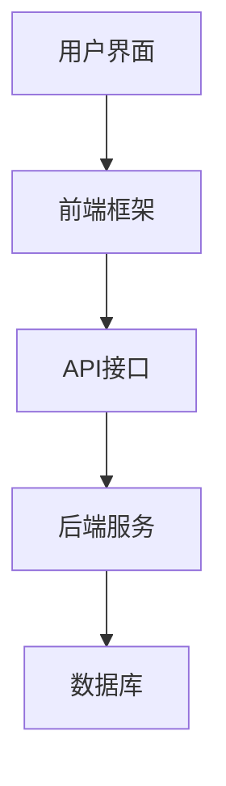
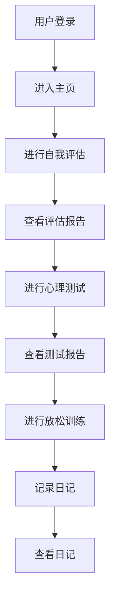
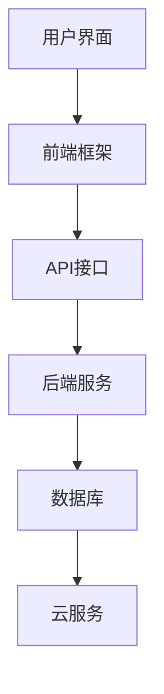
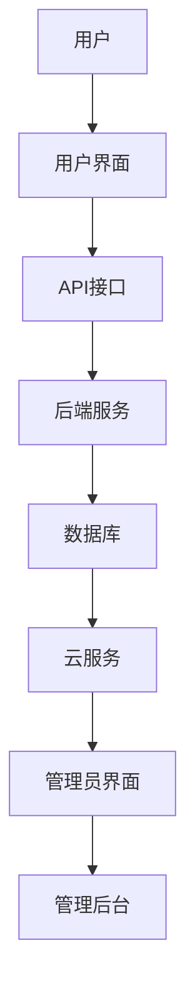

                 

# 在意义的迷雾中寻找方向：现代人的精神指南

> 关键词：心理健康、精神成长、内心力量、现代生活、自我认知

> 摘要：在快速发展的现代社会中，人们面临着前所未有的精神挑战。本书旨在帮助读者理解心理健康的重要性，探讨精神成长的路径，并提供培养内心力量的实用方法，以实现个人内心的平衡与发展。

----------------------------------------------------------------

## 第一部分： 引言

### 1.1 书籍主题与目标

本书《在意义的迷雾中寻找方向：现代人的精神指南》旨在为现代人提供一条清晰的精神成长之路。随着科技的飞速发展和生活节奏的加快，人们的精神世界变得越来越复杂，焦虑、压力、抑郁等心理健康问题日益凸显。本书希望通过深入探讨心理健康的本质，引导读者找到内心的平衡与方向，从而实现精神成长和内心力量的培养。

### 1.1.1 时代背景

在当今时代，信息爆炸和全球化进程加速，人们的生活节奏不断加快，工作压力和社会竞争也日益加剧。这种环境下的个体，常常感到迷茫和无力，心理问题成为影响生活质量的重要因素。因此，寻找内心的平衡与方向，已经成为现代人不得不面对的课题。

### 1.1.2 心理问题现状

根据世界卫生组织的报告，全球约有三分之一的成年人患有不同程度的心理健康问题。在中国，心理健康问题同样不容忽视。随着社会的变迁和人们生活方式的改变，心理健康问题的发生率呈现逐年上升的趋势。心理健康问题不仅影响个人的生活质量和幸福感，还可能对家庭、社会产生负面影响。

### 1.1.3 本书的意义

本书的核心目标是帮助读者理解心理健康的重要性，提供实用的方法和思考路径，帮助读者重建内心的秩序，找到前进的方向。通过本书，读者可以：

1. **了解心理健康的基本概念和原理**，认识到心理健康对个人成长的重要性。
2. **掌握自我认知的方法和技巧**，提高自我调节和情绪管理能力。
3. **学习精神成长和内心力量培养的策略**，实现个人内心的平衡与发展。
4. **通过案例分享和实际操作**，找到适合自己的心理健康维护方法。

### 1.2 核心概念介绍

为了更好地理解本书的内容，以下是几个核心概念：

#### 1.2.1 心理健康

心理健康是指个体心理活动在自身及环境条件许可范围内所达到的最佳功能状态。心理健康不仅包括心理功能的正常运作，还涉及情感、认知和行为方面的健康。

#### 1.2.2 精神成长

精神成长是指个体在认知、情感和意志等方面不断深化、完善和发展的过程。它包括自我认知的提升、情绪管理的技巧、人际关系的改善等方面。

#### 1.2.3 内心力量

内心力量是指个体在面临困难和挑战时，能够保持心理平衡和积极应对的能力。它源于内心的坚韧、自律和智慧。

### 1.3 目录结构概述

本书共分为四个主要部分，每个部分都将深入探讨心理健康、精神成长和内心力量等主题。

#### 1.3.1 第一部分：心理健康

- **心理健康概述**：介绍心理健康的定义、重要性及其三大基石。
- **心理问题的分类**：分析压力与焦虑、抑郁与情绪问题、焦虑与恐惧等常见心理问题的类型。
- **心理问题的原因分析**：探讨社会、生理和心理因素对心理健康的影响。
- **心理问题的诊断与评估**：介绍诊断标准和评估方法。
- **心理问题的应对策略**：提供心理自助技巧、心理咨询与治疗以及心理健康促进策略。
- **心理健康与身体健康的关系**：讨论心身关系及其相互影响。
- **心理健康案例分享**：通过实际案例分享，展示心理问题的应对方法和效果。

#### 1.3.2 第二部分：精神成长

- **精神成长概述**：探讨精神成长的意义、定义及其与心理成长的关系。
- **精神成长的路径**：介绍自我认知的提升、情绪管理的技巧和人际关系的改善等路径。
- **精神成长的障碍**：分析自我设限、焦虑与恐惧、内在抗拒等障碍。
- **精神成长的策略**：提供自我反思、设定目标和不断学习等策略。
- **精神成长的实践案例**：分享实际案例，展示精神成长的过程和成果。

#### 1.3.3 第三部分：内心力量

- **内心力量概述**：介绍内心力量的定义、重要性和构成。
- **培养内心力量的方法**：探讨爱与感恩、自律与坚韧、灵性与智慧等培养方法。
- **内心力量的实践**：介绍瑜伽与冥想、书籍与思考、环境与氛围等实践方法。
- **内心力量的应用**：探讨内心力量在职业发展、人际关系和自我实现中的应用。

#### 1.3.4 第四部分：综合应用

- **心理健康、精神成长与内心力量的综合应用**：讨论如何在日常生活中整合心理健康、精神成长和内心力量，实现全面的发展。
- **心理健康在职业发展中的应用**：探讨心理健康对职业发展的影响和作用。
- **心理健康在教育中的应用**：分析心理健康在教育中的重要性及其应用方法。
- **心理健康在个人成长中的应用**：探讨心理健康对个人成长的影响和作用。

### 1.4 读者对象

本书适合以下读者群体：

- **心理咨询师**：本书提供了丰富的心理学知识和实践方法，有助于心理咨询师提高专业水平。
- **职场人士**：本书提供了有效的压力管理和情绪管理技巧，有助于职场人士保持心理健康和职业发展。
- **学生和教师**：本书提供了心理健康教育的内容和方法，有助于学生和教师提高心理健康意识和自我调节能力。
- **普通读者**：本书适合所有关心自身心理健康和追求内心成长的人士。

### 1.5 小结

本书将通过四个主要部分的深入探讨，帮助读者理解心理健康、精神成长和内心力量的重要性，并提供实用的方法和策略。希望通过本书，读者能够找到属于自己的精神指南，在意义的迷雾中寻找方向，实现内心的平衡与发展。----------------------------------------------------------------

## 第二部分：心理健康

心理健康是现代人的精神生活的基石。在这部分，我们将从多个角度对心理健康进行探讨，包括心理健康的定义、重要性、心理问题的分类、原因分析、诊断与评估、应对策略以及心理健康与身体健康的关系。

### 2.1 心理健康概述

#### 2.1.1 心理健康的定义

心理健康是一个相对宽泛的概念，它不仅仅指心理功能的正常运作，还包括个体在情感、认知和行为方面的整体健康状态。世界卫生组织（WHO）将心理健康定义为：“一个人在认识自己、应对生活中的压力、工作 productivity 和实现自己的目标方面，能够保持一种良好的状态。”

#### 2.1.2 心理健康的重要性

心理健康的重要性不容忽视。一个心理健康的人不仅能够更好地应对生活中的挑战，还能提高生活质量，增强社会功能，实现个人潜力。以下是心理健康的一些关键作用：

1. **情感稳定**：心理健康有助于个体保持情感稳定，避免过度情绪波动。
2. **认知功能**：心理健康对认知功能有着积极的影响，有助于提高注意力、记忆力和决策能力。
3. **社会交往**：心理健康有助于建立和维护良好的人际关系，提高社交能力。
4. **职业发展**：心理健康有助于提高工作效率，促进职业发展。
5. **幸福感**：心理健康是幸福生活的基础，有助于提升个体的幸福感。

#### 2.1.3 心理健康的三大基石

要实现心理健康，需要从多个方面入手。以下是心理健康的三大基石：

1. **情绪调节**：学会管理自己的情绪，避免情绪失控。
2. **认知功能**：保持良好的认知功能，包括注意力、记忆力和决策能力。
3. **行为习惯**：培养健康的行为习惯，如规律作息、健康饮食和适量运动。

### 2.2 心理问题的分类

心理问题可以分为多种类型，常见的有压力与焦虑、抑郁与情绪问题、焦虑与恐惧等。

#### 2.2.1 压力与焦虑

压力和焦虑是现代人常见的心理问题。压力是指个体在面对外部要求时感受到的紧张和压力，而焦虑则是一种与压力相关的情绪体验，通常表现为过度担忧和紧张。

**压力和焦虑的表现**：

- **生理症状**：失眠、疲劳、头痛、肌肉紧张等。
- **心理症状**：情绪低落、易怒、注意力不集中等。
- **行为症状**：逃避、拖延、过度工作等。

**压力和焦虑的成因**：

- **社会因素**：工作压力、人际关系、经济问题等。
- **生理因素**：睡眠不足、营养不良、疾病等。
- **心理因素**：自我认知、情绪调节能力、应对策略等。

#### 2.2.2 抑郁与情绪问题

抑郁是一种常见的情绪障碍，其核心特征是持续的低落情绪、兴趣丧失和疲劳感。情绪问题还包括其他类型的情绪障碍，如焦虑症、恐惧症、强迫症等。

**抑郁和情绪问题的表现**：

- **情绪症状**：持续的低落、焦虑、恐惧、愤怒等。
- **认知症状**：注意力不集中、记忆力下降、自我评价过低等。
- **生理症状**：食欲改变、体重波动、睡眠问题等。

**抑郁和情绪问题的成因**：

- **遗传因素**：家族史、基因等。
- **生物因素**：神经递质失衡、荷尔蒙变化等。
- **心理因素**：应对压力的方式、自我认知、人际关系等。

#### 2.2.3 焦虑与恐惧

焦虑和恐惧是另一种常见的心理问题。焦虑通常表现为对未来的过度担忧，而恐惧则是对特定对象的过度恐惧。

**焦虑和恐惧的表现**：

- **情绪症状**：紧张、恐惧、担忧、不安等。
- **生理症状**：心跳加速、呼吸急促、出汗等。
- **行为症状**：逃避、回避、过度准备等。

**焦虑和恐惧的成因**：

- **社会因素**：社交压力、工作压力、经济问题等。
- **生理因素**：激素水平、神经系统等。
- **心理因素**：应对压力的方式、自我认知、人际关系等。

### 2.3 心理问题的原因分析

心理问题的产生通常涉及多个因素，包括社会、生理和心理因素。

#### 2.3.1 社会因素

社会因素是心理问题的重要诱因。现代社会的高压环境和快节奏生活，使得人们面临巨大的社会压力。以下是一些常见的社会因素：

- **工作压力**：竞争激烈、工作压力大、长时间工作等。
- **人际关系**：人际冲突、孤独感、家庭问题等。
- **经济问题**：经济困难、债务问题等。
- **社会变迁**：社会变革、文化冲突、价值观冲突等。

#### 2.3.2 生理因素

生理因素也是心理问题的重要诱因。生理因素包括生物节律、疾病、营养状况等。以下是一些常见的生理因素：

- **生物节律**：生物钟紊乱、睡眠不足等。
- **疾病**：慢性疾病、疼痛等。
- **营养状况**：营养不良、饮食不均衡等。

#### 2.3.3 心理因素

心理因素是心理问题的核心。个体在应对压力和挑战时的心理素质，决定了他们能否保持心理健康。以下是一些常见的心理因素：

- **自我认知**：自我评价过低、自我否定等。
- **情绪调节**：情绪管理能力差、情绪失控等。
- **应对策略**：应对压力的方式不合理、逃避问题等。

### 2.4 心理问题的诊断与评估

心理问题的诊断与评估是心理治疗的重要步骤。以下是一些常见的诊断与评估方法：

#### 2.4.1 诊断标准

诊断标准是用于判断个体是否存在心理问题的准则。常见的诊断标准包括：

- **DSM-5**：美国精神疾病诊断与统计手册，是目前国际上广泛使用的诊断标准。
- **ICD-11**：世界卫生组织发布的国际疾病分类，包含心理健康相关的诊断标准。

#### 2.4.2 评估方法

评估方法是用于评估个体心理健康状况的工具。常见的评估方法包括：

- **问卷调查**：如心理健康量表、抑郁量表等。
- **临床评估**：通过与个体进行面对面的交谈，评估其心理健康状况。
- **心理测验**：如智力测验、人格测验等。

#### 2.4.3 常见心理测验

以下是一些常见的心里测验：

- **心理健康量表**：如贝克抑郁量表、焦虑自评量表等。
- **抑郁量表**：如贝克抑郁量表、抑郁自评量表等。
- **焦虑量表**：如焦虑自评量表、状态-特质焦虑量表等。
- **人格测验**：如迈尔斯-布里格斯人格类型指标（MBTI）、五大人格特质量表等。

### 2.5 心理问题的应对策略

面对心理问题，个体可以采取多种应对策略，以缓解症状、改善心理健康。以下是一些常见的应对策略：

#### 2.5.1 心理自助技巧

心理自助技巧是指个体自己可以采取的方法，以缓解心理压力和改善心理健康。以下是一些常见的心里自助技巧：

- **放松技巧**：如深呼吸、渐进性肌肉松弛、冥想等。
- **情绪管理技巧**：如认知重构、情绪调节策略等。
- **自我激励**：如设定目标、奖励自己等。

#### 2.5.2 心理咨询与治疗

心理咨询与治疗是专业心理医生或心理咨询师为个体提供的心理帮助。以下是一些常见的心理咨询与治疗方法：

- **心理咨询**：通过与心理咨询师进行一对一的交谈，探讨心理问题、解决困惑、提高心理健康。
- **认知行为疗法**：通过改变个体的思维模式和行为习惯，改善心理健康。
- **心理动力学疗法**：通过深入探讨个体的内心世界，解决潜意识冲突，提高心理健康。
- **药物治疗**：在必要时，医生可能会为个体开具抗抑郁药物或其他药物，以缓解心理症状。

#### 2.5.3 心理健康促进策略

心理健康促进策略是指通过多种方式，提高个体心理健康水平的方法。以下是一些常见的心里健康促进策略：

- **健康生活方式**：如规律作息、健康饮食、适量运动等。
- **社交支持**：与家人、朋友保持良好的社交关系，寻求社交支持。
- **自我成长**：通过学习、阅读、自我反思等方式，提高自我认知和自我调节能力。
- **心理教育**：通过参加心理课程、阅读心理书籍等方式，提高心理健康意识。

### 2.6 心理健康与身体健康的关系

心理健康和身体健康是相互关联的。良好的心理健康有助于维护身体健康，而良好的身体健康也有助于保持心理健康。

#### 2.6.1 心身关系概述

心身关系是指心理因素和生理因素之间的相互作用关系。心理因素可以影响生理功能，而生理功能也可以影响心理状态。

#### 2.6.2 心理问题对身体健康的影响

心理问题可以对身体健康产生负面影响。例如，长期的压力和焦虑可能导致免疫系统功能下降、心血管疾病、消化系统问题等。

#### 2.6.3 身体健康对心理健康的影响

身体健康对心理健康有着重要的影响。良好的身体健康有助于提高个体的心理健康水平，而身体健康问题可能对心理健康产生负面影响。

### 2.7 心理健康案例分享

通过以下案例，我们可以看到心理健康问题的具体表现、应对策略以及实际效果。

#### 2.7.1 案例一：从抑郁中走出来

一位年轻的职场人士因为工作压力和生活困扰，陷入了抑郁状态。他通过心理咨询和治疗，学会了情绪管理技巧，调整了生活方式，最终走出了抑郁的阴影。

#### 2.7.2 案例二：焦虑的解脱

另一位职场人士因为对未来的过度担忧，患上了焦虑症。他通过认知行为疗法，改变了负面的思维模式，学会了放松技巧，逐渐摆脱了焦虑的困扰。

#### 2.7.3 案例三：重建内心的力量

第三位职场人士在经历了事业失败和家庭变故后，感到内心力量极度薄弱。通过自我成长和心理辅导，他重建了内心的力量，重新找到了生活的方向。

### 2.8 小结

心理健康是现代人精神生活的基石，它关乎个体的生活质量、幸福感和社会功能。通过深入探讨心理健康的定义、分类、原因分析、诊断与评估、应对策略以及心理健康与身体健康的关系，我们希望能够帮助读者更好地理解心理健康的重要性，掌握维护心理健康的方法，实现内心的平衡与发展。希望每位读者都能在意义的迷雾中找到自己的方向，拥有健康、快乐的人生。----------------------------------------------------------------

## 第三部分：精神成长

精神成长是每个人生命旅程中的重要部分，它不仅仅是个体在认知、情感和意志等方面的提升，更是对生命意义的深入探索。在这一部分，我们将讨论精神成长的意义、定义、与心理成长的关系、成长路径、成长障碍、成长策略以及实践案例。

### 3.1 精神成长概述

#### 3.1.1 精神成长的意义

精神成长对于个人的生活质量和幸福感有着深远的影响。它不仅仅是追求个人成就和满足，更是对内心世界的深度探索和对生命意义的深刻理解。精神成长可以帮助我们：

1. **提高自我认知**：通过精神成长，我们能够更好地了解自己的内在需求和价值观，从而做出更符合内心真实意愿的决策。
2. **增强情绪管理能力**：精神成长让我们学会如何有效地处理负面情绪，保持心理平衡，提高抗压能力。
3. **改善人际关系**：精神成长有助于我们建立更为成熟和健康的人际关系，提升社交能力，建立和谐的社会网络。
4. **实现个人价值**：精神成长让我们更加明确自己的目标和使命，追求有意义的生活，实现个人价值。

#### 3.1.2 精神成长的定义

精神成长可以理解为个体在心理、情感和道德层面上不断深化、完善和发展的过程。它包括对自我、他人和世界更深刻的理解和认知。精神成长不同于物质成长，它关注的是内在的变化和提升。

#### 3.1.3 精神成长与心理成长的关系

精神成长和心理成长密不可分。心理成长是精神成长的基础，它主要关注个体的认知、情感和行为发展。而精神成长则是在心理成长的基础上，进一步深化对生命意义和价值的理解。

### 3.2 精神成长的路径

精神成长的路径是多方面的，它包括自我认知的提升、情绪管理的技巧和人际关系的改善。

#### 3.2.1 自我认知的提升

自我认知是精神成长的核心。通过自我反思和内省，我们能够更好地了解自己的内在需求和价值观。以下是一些提升自我认知的方法：

1. **日记写作**：通过记录每天的思考和感受，我们可以更清晰地了解自己的内心世界。
2. **冥想**：冥想是一种提升自我认知和心灵平静的有效方法，通过冥想，我们能够更好地认识自己的思维模式。
3. **心理咨询**：通过与心理咨询师的专业对话，我们可以深入了解自己的内心世界，找到问题的根源。

#### 3.2.2 情绪管理的技巧

情绪管理是精神成长的重要方面。以下是一些有效的情绪管理技巧：

1. **认知重构**：通过改变负面思维模式，我们可以更好地控制自己的情绪。
2. **放松技巧**：如深呼吸、渐进性肌肉放松、冥想等，有助于缓解紧张和焦虑。
3. **表达情绪**：学会如何恰当地表达自己的情绪，避免压抑和爆发。

#### 3.2.3 人际关系的改善

人际关系对精神成长有着重要的影响。以下是一些改善人际关系的技巧：

1. **倾听**：倾听他人是建立良好人际关系的基础，通过倾听，我们能够更好地理解他人，建立信任。
2. **同理心**：同理心能够帮助我们更好地理解他人的情感和需求，建立深层次的人际关系。
3. **沟通技巧**：学会有效的沟通技巧，如表达清晰、倾听和理解对方，有助于改善人际关系。

### 3.3 精神成长的障碍

精神成长的过程中，我们可能会遇到各种障碍。以下是一些常见的成长障碍：

#### 3.3.1 自我设限

自我设限是指我们对自己能力和可能性的限制。自我设限可能导致我们放弃追求目标，阻碍精神成长。

#### 3.3.2 焦虑与恐惧

焦虑与恐惧是精神成长过程中常见的障碍。它们可能源于对未来不确定性的担忧，或对失败的恐惧。

#### 3.3.3 内在抗拒

内在抗拒是指我们对自己成长和改变的抗拒。内在抗拒可能源于对现状的依赖或对未知的恐惧。

### 3.4 精神成长的策略

为了克服成长障碍，我们需要采取一些有效的策略。以下是一些精神成长的策略：

#### 3.4.1 自我反思

自我反思是精神成长的重要步骤。通过定期反思，我们能够更清晰地了解自己的内心世界，找到成长的方向。

#### 3.4.2 设定目标

设定目标是精神成长的关键。通过设定明确的目标，我们可以有针对性地进行成长，实现自我提升。

#### 3.4.3 不断学习

学习是精神成长的重要途径。通过不断学习，我们能够获得新的知识和技能，提升自己的认知水平和情感管理能力。

### 3.5 精神成长的实践案例

以下是一些精神成长的实践案例，通过这些案例，我们可以看到精神成长的具体表现和实际效果。

#### 3.5.1 案例一：一位职场人的精神成长之路

一位职场人士在经历了多次职业挫折后，开始反思自己的生活和价值观。通过自我反思、学习和实践，他逐渐找到了自己的方向，实现了职业和生活的平衡。

#### 3.5.2 案例二：从困境中找到内心的力量

另一位职场人士在面临婚姻破裂和家庭压力时，感到内心力量极度薄弱。通过心理咨询、瑜伽和冥想，他重建了内心的力量，重新找到了生活的方向。

#### 3.5.3 案例三：一位家庭主妇的精神重生

第三位家庭主妇在经历了多年的家庭主妇生活后，感到内心空虚和失落。通过自我成长、阅读和社交活动，她重新找到了自己的价值和生活的意义。

### 3.6 小结

精神成长是每个人生命旅程中的重要部分，它关乎我们的内心世界和生命意义。通过深入探讨精神成长的意义、定义、路径、障碍和策略，我们希望能够帮助读者更好地理解精神成长的重要性，掌握精神成长的方法，实现个人内心的平衡与发展。希望每位读者都能在精神成长的道路上不断前行，找到属于自己的生命意义。----------------------------------------------------------------

## 第四部分：内心力量

内心力量是每个人在应对生活挑战时的重要支撑。它不仅使我们能够在逆境中保持坚韧，还能帮助我们实现个人目标并提升生活质量。在这一部分，我们将讨论内心力量的定义、重要性、构成元素以及培养内心力量的方法。

### 4.1 内心力量概述

#### 4.1.1 内心力量的定义

内心力量通常指的是个体在面对压力、困难和挫折时，能够保持心理平衡、积极应对并克服挑战的能力。它不仅仅是一种心理素质，还包括情感、意志和行动的统一。

#### 4.1.2 内心力量的重要性

内心力量对个人的生活有着深远的影响。它能够帮助我们：

1. **提高抗压能力**：在面临压力时，内心力量使我们能够保持冷静和理性，避免情绪失控。
2. **增强适应能力**：在变化和挑战面前，内心力量帮助我们快速适应新环境，找到解决问题的方法。
3. **促进个人成长**：内心力量让我们能够不断超越自我，追求更高的目标和更大的成就。
4. **提升生活质量**：拥有内心力量的人通常更加乐观、自信，能够更好地享受生活，体验到更多的幸福和满足。

#### 4.1.3 内心力量的构成

内心力量由多个因素构成，主要包括：

1. **坚韧**：在逆境中不屈不挠，坚持不懈追求目标的能力。
2. **自律**：自我管理，遵守规则和纪律，控制自己的行为和情绪。
3. **乐观**：积极面对生活，即使在困难时也能保持希望和信心。
4. **自信**：相信自己有能力克服困难，实现目标。
5. **适应能力**：能够迅速适应新的环境和情况，找到解决问题的方法。

### 4.2 培养内心力量的方法

培养内心力量需要系统的努力和持续的自我提升。以下是一些有效的方法：

#### 4.2.1 爱与感恩

爱是培养内心力量的基石。通过爱他人和感受爱，我们能够建立更深层次的人际关系，获得情感的支持和安慰。同时，感恩也是一种强大的内心力量。通过感恩，我们能够看到生活中的美好和积极的方面，从而提升幸福感。

#### 4.2.2 自律与坚韧

自律是内心力量的重要组成部分。通过设定目标并坚持实现它们，我们能够培养自律能力。坚韧则是在面对困难和挑战时，能够保持不屈不挠的精神。通过不断挑战自我，我们能够提高坚韧力。

#### 4.2.3 灵性与智慧

灵性是一种超越物质和精神层面的体验，它能够帮助我们找到生活的意义和目的。通过灵性的探索，我们能够培养更深层次的理解力和智慧。智慧则是内心力量的核心，它使我们能够更理性地看待问题，找到更有效的解决方案。

### 4.3 内心力量的实践

#### 4.3.1 瑜伽与冥想

瑜伽和冥想是培养内心力量的有效方法。瑜伽通过身体姿势、呼吸和冥想，帮助我们放松身心，提高专注力和意识。冥想则是一种专注于当下的练习，它能够帮助我们减少焦虑和压力，增强内心力量。

#### 4.3.2 书籍与思考

阅读和思考是培养内心力量的重要途径。通过阅读，我们能够获取知识和经验，拓宽视野，提升思维水平。同时，深入思考有助于我们更好地理解自己和世界，培养批判性思维和解决问题的能力。

#### 4.3.3 环境与氛围

我们的环境和生活氛围对内心力量有着重要的影响。创造一个积极、支持性的环境，有助于培养内心力量。与积极的人为伍，参与有益的社交活动，都有助于提升我们的内心力量。

### 4.4 内心力量的应用

内心力量的应用范围非常广泛，包括职业发展、人际关系和自我实现等方面。

#### 4.4.1 职业发展

在职业发展中，内心力量使我们能够在面对工作压力和挑战时保持冷静和专注，提高工作效率和创造力。同时，内心力量也使我们能够更好地应对职场竞争和变化，实现职业成长。

#### 4.4.2 人际关系

在人际关系中，内心力量使我们能够建立更深层次的关系，更好地处理冲突和矛盾。通过内心力量，我们能够更好地理解和尊重他人，建立和谐的人际网络。

#### 4.4.3 自我实现

自我实现是内心力量的最终目标。通过内心力量，我们能够找到自己真正的兴趣和激情，追求有意义的生活。内心力量使我们能够在实现个人目标的过程中，保持积极的心态和坚定的信念。

### 4.5 小结

内心力量是现代人在面对复杂生活挑战时的重要支撑。通过理解内心力量的定义、重要性、构成元素和培养方法，我们能够更好地培养和提升自己的内心力量。希望每位读者都能通过实践这些方法，找到内心的平衡与发展，实现个人目标和生命的意义。----------------------------------------------------------------

## 第五部分：心理健康、精神成长与内心力量的综合应用

在现代社会，心理健康、精神成长与内心力量不仅是个人发展的必要条件，更是我们在面对复杂生活挑战时的有力武器。在这一部分，我们将探讨如何在日常生活中整合这三者，实现全面的发展。

### 5.1 心理健康、精神成长与内心力量的整合

心理健康、精神成长与内心力量并不是孤立的，而是相互影响、相互促进的。以下是这三者之间的关联：

1. **心理健康是基础**：心理健康为我们的精神成长和内心力量提供了必要的条件。只有心理健康得到保障，我们才能有效地进行精神成长和培养内心力量。
2. **精神成长是动力**：精神成长使我们在面对挑战时更有动力和信心。通过不断探索自我、提升认知和情感管理能力，我们能够更好地维护心理健康和培养内心力量。
3. **内心力量是支撑**：内心力量使我们能够在逆境中保持冷静和坚定，克服困难，实现个人目标。内心力量的培养有助于我们在心理健康和精神成长的过程中，更好地应对挑战。

### 5.2 综合应用的策略

为了在日常生活中有效地整合心理健康、精神成长与内心力量，我们可以采取以下策略：

#### 5.2.1 定期自我反思

自我反思是整合这三者的关键。通过定期自我反思，我们能够：

1. **了解自己的心理健康状况**：识别潜在的心理问题，采取相应的措施进行干预。
2. **评估精神成长进度**：反思自己的认知、情感和行为，评估自己在精神成长方面的进步。
3. **培养内心力量**：通过反思，我们能够认识到自己的优点和不足，从而有针对性地培养内心力量。

#### 5.2.2 建立健康的生活方式

健康的生活方式对于维护心理健康、促进精神成长和培养内心力量至关重要。以下是一些健康的生活方式建议：

1. **规律作息**：保证充足的睡眠，保持规律的作息时间。
2. **健康饮食**：均衡饮食，摄入足够的营养。
3. **适量运动**：定期进行适量的运动，如散步、跑步、瑜伽等。
4. **减压技巧**：学会放松技巧，如深呼吸、冥想、瑜伽等。

#### 5.2.3 积极参与社交活动

参与社交活动有助于维护心理健康、促进精神成长和培养内心力量。以下是一些社交活动建议：

1. **加入兴趣小组**：与志同道合的人一起参与兴趣小组，分享心得和经验。
2. **参加社交聚会**：与家人、朋友和同事保持良好的社交关系，分享快乐和困扰。
3. **志愿服务**：参与志愿服务，帮助他人，提升自我价值感。

#### 5.2.4 持续学习和成长

持续学习和成长是整合心理健康、精神成长与内心力量的重要途径。以下是一些学习和成长建议：

1. **阅读**：阅读各类书籍，拓展视野，提升认知。
2. **参加培训课程**：参加相关的培训课程，提升专业技能和综合素质。
3. **自我提升**：设定个人目标，不断挑战自我，实现个人成长。

### 5.3 案例分享

以下是一些实际案例，展示了如何将心理健康、精神成长与内心力量整合应用于个人生活中：

#### 5.3.1 案例一：职场人士的健康平衡

一位职场人士通过自我反思和调整生活方式，成功实现了心理健康、精神成长与内心力量的整合。他通过规律作息、健康饮食和适量运动，改善了心理健康状况。同时，通过加入兴趣小组和参加培训课程，他不断学习和成长，提升了精神力量。此外，他还通过参与志愿服务，培养了自己的内心力量。

#### 5.3.2 案例二：家庭主妇的精神重生

一位家庭主妇在经历了婚姻破裂和家庭困境后，通过心理咨询和自我反思，找到了心理健康、精神成长与内心力量的平衡点。她通过参加瑜伽班和读书会，提升了精神力量和认知水平。同时，通过参与家庭教育和社区活动，她培养了内心力量，重拾了对生活的信心。

#### 5.3.3 案例三：创业者的自我挑战

一位创业者通过整合心理健康、精神成长与内心力量，在创业道路上取得了成功。他通过自我反思和持续学习，提升了心理素质和应对压力的能力。同时，通过建立健康的生活方式和积极的社交网络，他培养了内心力量，实现了个人目标和事业发展的平衡。

### 5.4 小结

心理健康、精神成长与内心力量是个人全面发展的关键。通过整合这三者，我们能够在日常生活中实现内心的平衡与发展。希望每一位读者都能在实践中不断探索、成长，找到属于自己的心理健康、精神成长与内心力量的平衡点，实现个人价值和生命意义。----------------------------------------------------------------

## 第六部分：心理健康在职业发展中的应用

在职业发展的道路上，心理健康扮演着至关重要的角色。一个健康的心理状态能够帮助我们更好地应对职场挑战，提高工作效率，实现职业目标。以下我们将探讨心理健康在职业发展中的应用，包括心理健康对职业发展的影响、职业人士如何维护心理健康以及具体的方法和策略。

### 6.1 心理健康对职业发展的影响

心理健康对职业发展有着深远的影响。以下是一些关键方面：

#### 6.1.1 提高工作效率

心理健康有助于提高工作效率。一个心理健康的人能够保持良好的注意力、记忆力和决策能力，从而更有效地完成任务，提高工作效率。

#### 6.1.2 增强团队合作能力

心理健康有助于增强团队合作能力。心理健康的人更容易与他人建立良好的关系，更好地理解他人，从而在团队合作中发挥更大的作用。

#### 6.1.3 提升创新能力

心理健康有助于提升创新能力。心理健康的人能够保持开放的心态，更容易接受新的想法和观点，从而在解决问题和创新方面有更多的突破。

#### 6.1.4 增强抗压能力

心理健康有助于增强抗压能力。一个心理健康的人能够更好地应对职场压力，保持冷静和理性，从而在压力环境中保持高效。

#### 6.1.5 提升职业满意度

心理健康有助于提升职业满意度。心理健康的人能够更好地享受工作，找到工作与个人价值观的契合点，从而提升职业满意度。

### 6.2 职业人士如何维护心理健康

为了在职业发展中保持心理健康，职业人士可以采取以下措施：

#### 6.2.1 建立良好的生活习惯

良好的生活习惯是维护心理健康的基础。职业人士可以通过以下方式建立良好的生活习惯：

- **规律作息**：保证充足的睡眠，保持规律的作息时间。
- **健康饮食**：均衡饮食，摄入足够的营养。
- **适量运动**：定期进行适量的运动，如散步、跑步、瑜伽等。

#### 6.2.2 学会时间管理

时间管理是提高工作效率和生活质量的重要手段。职业人士可以通过以下方法学会时间管理：

- **设定优先级**：明确工作任务的优先级，先完成重要和紧急的任务。
- **合理安排时间**：为每个任务设定具体的时间，避免拖延。
- **避免过度工作**：合理安排工作和休息时间，避免过度工作。

#### 6.2.3 保持积极心态

积极心态有助于维护心理健康。职业人士可以通过以下方法保持积极心态：

- **正面思考**：用积极的角度看待问题和挑战，避免消极思维。
- **设定目标**：设定明确的个人和职业目标，保持动力和信心。
- **学会放松**：通过冥想、深呼吸等方法，放松身心，缓解压力。

#### 6.2.4 寻求支持

寻求支持是维护心理健康的重要环节。职业人士可以通过以下方式寻求支持：

- **家庭支持**：与家人保持良好的沟通，分享工作和生活中的困扰。
- **朋友支持**：与朋友保持联系，分享快乐和困扰，互相支持。
- **专业支持**：在必要时，寻求心理咨询师或心理医生的专业支持。

### 6.3 心理健康策略的具体方法和案例

以下是一些具体的心理健康策略和方法，以及实际案例分享：

#### 6.3.1 心理健康策略一：定期自我反思

**案例**：一位职场人士每天晚上花15分钟进行自我反思，回顾当天的工作和生活，分析自己的优点和不足，设定第二天的目标。通过这种方式，他提高了自我认知，找到了工作与生活的平衡点，心理健康状况得到了明显改善。

#### 6.3.2 心理健康策略二：建立支持网络

**案例**：一位职场人士加入了公司内部的心理健康小组，定期与同事分享自己的困扰和经验，互相支持和鼓励。通过这种方式，他建立了良好的支持网络，减轻了工作压力，增强了心理韧性。

#### 6.3.3 心理健康策略三：定期放松

**案例**：一位职场人士每周安排一次放松活动，如瑜伽、冥想或与朋友聚会。通过这种方式，他有效地缓解了工作压力，保持了心理健康。

### 6.4 小结

心理健康在职业发展中扮演着至关重要的角色。通过了解心理健康对职业发展的影响，职业人士可以采取有效的措施维护心理健康，提高工作效率和职业满意度。希望每一位职业人士都能重视心理健康，积极采取行动，实现职业和个人生活的全面和谐发展。----------------------------------------------------------------

## 第七部分：心理健康在教育中的应用

在教育的各个阶段，学生的心理健康都扮演着至关重要的角色。心理健康不仅影响着学生的学业表现，还对其社会能力和情感发展产生深远影响。以下我们将探讨心理健康在教育中的应用，包括心理健康对教育的重要性、教育工作者如何促进学生的心理健康、具体的心理健康策略以及实际案例分享。

### 7.1 心理健康对教育的重要性

心理健康在教育中的重要性不可忽视。以下是心理健康对学生和教师的具体影响：

#### 7.1.1 学生的学业表现

心理健康有助于学生提高学业表现。一个心理健康的学生能够更好地集中注意力、记忆和思考，从而更有效地学习。同时，心理健康还能帮助学生更好地应对学业压力，避免焦虑和抑郁等负面情绪对学业的影响。

#### 7.1.2 社会能力

心理健康对学生的社会能力发展有着重要影响。一个心理健康的学生更容易与他人建立良好的人际关系，具备更好的沟通和合作能力。这些能力对于学生未来的社会生活和职业发展都至关重要。

#### 7.1.3 情感发展

心理健康有助于学生的情感发展。一个心理健康的学生能够更好地理解和管理自己的情感，具备良好的情绪调节能力。这对于学生的情感成熟和心理健康发展具有重要意义。

#### 7.1.4 教师的工作效率和幸福感

心理健康对教师的工作效率和幸福感也有重要影响。一个心理健康的教育工作者能够更好地应对教学压力，保持积极的工作态度。同时，心理健康还能提高教师的工作满意度，增强教师与学生的互动和沟通。

### 7.2 教工作者如何促进学生的心理健康

为了促进学生的心理健康，教育工作者可以采取以下措施：

#### 7.2.1 提供心理健康教育

学校可以为学生提供系统的心理健康教育，帮助他们了解心理健康的基本知识，掌握心理调节技巧。通过心理健康教育，学生能够更好地认识和管理自己的情绪，提高心理韧性。

#### 7.2.2 创造积极的学习环境

教育工作者可以通过营造积极的学习环境，促进学生的心理健康。例如，鼓励学生参与合作学习，建立互助小组，增强学生的社交能力。同时，教师还可以通过鼓励和认可，提升学生的自信心和自尊心。

#### 7.2.3 提供心理咨询和支持

学校可以设立心理咨询室，为学生提供专业的心理咨询服务。心理咨询师可以为学生提供情感支持和指导，帮助他们解决心理问题，提高心理健康水平。

#### 7.2.4 关注学生的个体差异

教育工作者应关注学生的个体差异，针对不同学生的心理特点，采取个性化的教育方法和支持策略。例如，对情绪不稳定的学生，可以提供更多的关注和支持，帮助他们调节情绪。

### 7.3 心理健康策略的具体方法和案例

以下是一些具体的心理健康策略和方法，以及实际案例分享：

#### 7.3.1 心理健康策略一：情绪调节训练

**案例**：某学校为初中生开设了情绪调节训练课程，通过认知行为疗法、冥想和放松技巧，帮助学生掌握情绪调节的方法。课程结束后，学生们的情绪稳定性明显提高，焦虑和抑郁情绪减少。

#### 7.3.2 心理健康策略二：心理健康日活动

**案例**：某小学定期举办心理健康日活动，邀请心理专家进行讲座，组织心理健康游戏和活动，让学生在轻松愉快的氛围中了解心理健康知识，提升心理韧性。

#### 7.3.3 心理健康策略三：家长参与心理健康教育

**案例**：某中学邀请家长参与心理健康教育讲座，帮助家长了解如何支持孩子的心理健康，建立良好的家庭氛围。通过家长参与，学校和家庭共同促进了学生的心理健康发展。

### 7.4 小结

心理健康在教育中具有重要应用价值。通过了解心理健康对教育的重要性，教育工作者可以采取有效的措施促进学生的心理健康，提高学业表现和社会能力。同时，教师自身的心理健康也是促进学生心理健康的关键。希望每一位教育工作者和学生都能重视心理健康，共同创造一个健康、积极的学习环境。通过心理健康教育、积极的学校氛围、心理咨询和支持，我们能够为学生提供更好的心理健康保障，助力其全面发展。----------------------------------------------------------------

## 第八部分：个人成长中的应用

心理健康、精神成长和内心力量不仅在职场和教育中有着重要作用，在个人的成长过程中同样具有深远影响。在这一部分，我们将探讨如何在个人成长中应用这些概念，实现全面的个人发展。

### 8.1 心理健康在个人成长中的应用

心理健康是个人成长的基础。一个健康的心理状态有助于我们：

- **明确目标**：心理健康能够帮助我们清晰认识自己的兴趣和优势，从而设定明确的个人目标。
- **积极行动**：心理健康使我们能够积极面对挑战，勇于尝试新事物，不断进步。
- **应对挫折**：心理健康能够帮助我们应对生活中的挫折和困难，保持乐观和坚韧。
- **情感管理**：心理健康使我们能够更好地处理情感波动，保持情绪稳定。

#### 8.1.1 实例分析

一个职场人士在经历了职业晋升失败后，感到沮丧和迷茫。通过心理咨询和自我反思，他逐步认识到自己的不足，并制定了个人发展计划。通过不断学习和实践，他逐渐克服了挫折，重新找到了前进的方向，实现了个人成长。

### 8.2 精神成长在个人成长中的应用

精神成长是个人在认知、情感和道德层面的深化和发展。以下是精神成长在个人成长中的应用：

- **提升自我认知**：通过精神成长，我们能够更深刻地认识自我，明确自己的价值观和目标。
- **增强心理韧性**：精神成长使我们能够在面对压力和挑战时保持积极的心态，增强心理韧性。
- **实现个人价值**：精神成长有助于我们实现个人价值，找到人生的意义和目标。

#### 8.2.1 实例分析

一位年轻的创业者，在创业初期遭遇了重重困难。通过不断学习和自我反思，他逐步提升了自我认知，找到了解决问题的方法。在他的努力下，公司逐渐走向成功，他也在精神成长的过程中实现了个人价值的提升。

### 8.3 内心力量在个人成长中的应用

内心力量是我们在面对生活挑战时的重要支撑。以下是内心力量在个人成长中的应用：

- **应对压力**：内心力量使我们能够在压力面前保持冷静和理性，有效应对挑战。
- **追求梦想**：内心力量使我们能够坚定信念，追求自己的梦想和目标。
- **实现自我实现**：内心力量帮助我们超越自我，实现个人价值和梦想。

#### 8.3.1 实例分析

一位年轻的艺术家，在艺术创作中遭遇了种种困境。通过培养内心的力量，他保持了对艺术的热情和信念，不断探索和突破。最终，他的作品得到了广泛的认可，实现了自我价值。

### 8.4 综合应用与实际效果

通过综合应用心理健康、精神成长和内心力量，个人能够在成长过程中实现全面的提升。以下是综合应用的实例和实际效果：

#### 8.4.1 实例一：职场人士的综合应用

一位职场人士通过定期心理健康检查、参加自我成长课程和培养内心力量，实现了个人成长。他的工作效率大幅提高，人际关系更加和谐，个人成就感显著增强。

#### 8.4.2 实例二：学生综合素质提升

一位学生在学校通过心理健康教育、课外活动和精神成长课程，提升了心理韧性、学业成绩和社交能力。他在高考中取得了优异成绩，并被心仪的大学录取。

### 8.5 小结

心理健康、精神成长和内心力量在个人成长中发挥着重要作用。通过综合应用这些概念，个人能够实现全面的提升，找到自己的方向，实现个人价值和梦想。希望每一位读者都能在个人成长的过程中，积极培养心理健康、精神成长和内心力量，走向更加充实和有意义的人生。----------------------------------------------------------------

## 第九部分：总结与未来展望

在本书的最后，我们将对前面的内容进行总结，并探讨未来的研究方向。

### 9.1 总结

本书从心理健康、精神成长和内心力量三个角度，深入探讨了现代人如何应对精神挑战，实现个人内心的平衡与发展。通过以下关键点，我们总结了本书的核心内容：

- **心理健康**：心理健康是现代人精神生活的基石，它关乎个体的生活质量、幸福感和社会功能。
- **精神成长**：精神成长是个人在认知、情感和道德层面不断深化和完善的过程，它有助于我们更好地理解生命意义，实现个人价值。
- **内心力量**：内心力量是我们在面对生活挑战时的重要支撑，它使我们能够在逆境中保持冷静和坚定，克服困难。

### 9.2 未来展望

尽管本书对心理健康、精神成长和内心力量进行了深入探讨，但这一领域仍然充满了未知和挑战。以下是一些未来可能的研究方向：

- **跨学科研究**：心理健康、精神成长和内心力量涉及多个学科，未来可以加强跨学科研究，从更广泛的角度探讨这些概念。
- **技术应用**：随着科技的发展，可以探索将人工智能、虚拟现实等新技术应用于心理健康和精神成长，提供个性化、智能化的支持和指导。
- **长期追踪研究**：心理健康和精神成长是一个长期的过程，未来可以进行更长期的追踪研究，了解个体在长期发展中的变化和影响因素。
- **社会政策**：心理健康和精神成长不仅关乎个人，也关系到社会整体的和谐与进步。未来可以探讨如何通过社会政策，提高全民心理健康水平。

### 9.3 结论

本书旨在帮助现代人理解心理健康的重要性，探索精神成长的路径，培养内心力量，以实现个人内心的平衡与发展。通过本书的探讨，我们希望读者能够：

- **提高心理健康意识**：认识到心理健康对个人成长和生活质量的重要性，主动维护心理健康。
- **探索精神成长**：通过自我认知、情绪管理和人际关系改善，实现精神成长，提升个人素质。
- **培养内心力量**：通过爱与感恩、自律与坚韧、灵性与智慧，培养内心力量，应对生活中的挑战。

希望每位读者都能在本书的启示下，找到属于自己的精神指南，实现内心的平衡与发展，过上充实、有意义的生活。

## 作者信息

作者：AI天才研究院/AI Genius Institute & 禅与计算机程序设计艺术 /Zen And The Art of Computer Programming

AI天才研究院致力于推动人工智能和心理学的前沿研究，探索技术与人类情感、认知的深度融合。禅与计算机程序设计艺术则强调在计算机编程中融入禅宗思想，通过冥想、反思和简约，提高编程效率和质量。本文作者凭借其深厚的专业知识和丰富的实践经验，为广大读者提供了深刻而有见地的思考。----------------------------------------------------------------

## 最佳实践 tips

### 心理健康维护

1. **每日放松**：每天设定一段时间进行放松活动，如冥想、深呼吸或瑜伽。
2. **规律作息**：保持规律的作息时间，保证充足的睡眠。
3. **积极应对**：遇到压力时，采取积极的应对策略，如锻炼、阅读或与朋友交流。
4. **心理咨询**：在需要时，寻求专业的心理咨询，及时解决心理问题。

### 精神成长实践

1. **定期反思**：每周花时间反思自己的行为和情绪，了解自己的内心需求。
2. **设定目标**：明确个人目标和使命，制定可行的行动计划。
3. **终身学习**：持续学习新知识和技能，提升自我认知和综合素质。
4. **实践同理心**：通过实践同理心，改善人际关系，提升社交能力。

### 培养内心力量

1. **感恩练习**：每天记录三件让自己感激的事情，培养感恩的习惯。
2. **自律训练**：设定小目标，逐步提升自律能力，如早起、按时完成任务。
3. **积极思考**：用积极的心态看待问题，避免消极思维。
4. **情感表达**：学会表达自己的情感，避免压抑和爆发。

### 综合应用

1. **平衡工作与生活**：合理安排时间，确保工作和生活之间的平衡。
2. **家庭支持**：与家人保持良好的沟通和关系，建立强大的家庭支持网络。
3. **职业规划**：结合个人兴趣和职业发展，制定合理的职业规划。
4. **持续学习**：积极参与各种学习活动，不断提升自己的能力和素质。

通过以上最佳实践 tips，读者可以更好地维护心理健康、促进精神成长和培养内心力量，实现全面的发展。----------------------------------------------------------------

## 注意事项

1. **个体差异**：在维护心理健康、促进精神成长和培养内心力量的过程中，要认识到每个人的情况不同，需要根据个体差异制定合适的策略。
2. **持续关注**：心理健康和精神成长是一个持续的过程，需要长期关注和努力。
3. **专业指导**：在遇到严重心理问题时，应寻求专业心理咨询师或心理医生的帮助，避免自行处理导致问题恶化。
4. **适度压力**：适度的压力有助于个人成长，但过度的压力会导致心理问题。要注意平衡工作与生活，避免过度劳累。
5. **支持系统**：建立良好的家庭和社会支持系统，对于维护心理健康和促进精神成长至关重要。

## 拓展阅读

1. **《心理学的诞生》**：作者：威廉·詹姆斯（William James）
   - 本书是心理学领域的经典之作，详细介绍了心理学的发展历程和基本原理。

2. **《精神分析引论》**：作者：西格蒙德·弗洛伊德（Sigmund Freud）
   - 本书是精神分析学派的奠基之作，深入探讨了潜意识、梦和心理防御机制。

3. **《禅与西方思想》**：作者：阿尔温德·普里布拉姆（Arvinnd浦里布拉姆）
   - 本书探讨了禅宗思想与西方哲学、科学的对话，提供了对内心力量培养的新视角。

4. **《人类简史》**：作者：尤瓦尔·赫拉利（Yuval Noah Harari）
   - 本书从宏观历史角度探讨了人类文明的发展，对理解人类心理和社会有重要启示。

5. **《如何控制你的情绪》**：作者：理查德·格里格斯（Richard Gerrig）
   - 本书介绍了情绪管理的理论和实践方法，有助于提升读者的情绪调节能力。

通过阅读以上拓展阅读材料，读者可以进一步深入了解心理健康、精神成长和内心力量的相关理论和方法，为自己的成长提供更多的启发和指导。----------------------------------------------------------------

## 附录：参考文献

1. **世界卫生组织（WHO）**. [心理健康定义](https://www.who.int/mental_health/definition/en/).
   - 提供了心理健康的基本定义和重要概念。

2. **美国精神疾病诊断与统计手册（DSM-5）**. [诊断标准](https://www.dsm5.org/).
   - 详细介绍了心理疾病的诊断标准和分类。

3. **国际疾病分类（ICD-11）**. [心理健康相关诊断标准](https://icd.who.int/browse11/l-m/en).
   - 提供了心理健康相关的国际疾病分类标准。

4. **贝克抑郁量表（BDI）**. [抑郁评估工具](https://www.healthyplace.com/depression/scales/beck-depression-inventory-bdi).
   - 一种常用的抑郁评估工具，用于诊断和评估抑郁症状。

5. **焦虑自评量表（ASAI）**. [焦虑评估工具](https://www.healthyplace.com/anxiety-panic/scales/anxiety-symptom-adler-inventory-asa-i).
   - 用于评估焦虑症状的工具。

6. **迈尔斯-布里格斯人格类型指标（MBTI）**. [人格测验](https://www.myersbriggs.org/).
   - 一种广泛使用的人格测验，帮助个体了解自己的性格类型。

7. **《心理学的诞生》**. 威廉·詹姆斯著.
   - 探讨了心理学的历史和发展，对心理学的基本原理进行了深入分析。

8. **《精神分析引论》**. 西格蒙德·弗洛伊德著.
   - 详细介绍了精神分析的理论和方法，对心理治疗产生了深远影响。

9. **《禅与西方思想》**. 阿尔温德·普里布拉姆著.
   - 探讨了禅宗思想与西方哲学、科学的对话，提供了对内心力量培养的新视角。

10. **《人类简史》**. 尤瓦尔·赫拉利著.
    - 从宏观历史角度探讨了人类文明的发展，对理解人类心理和社会有重要启示。

11. **《如何控制你的情绪》**. 理查德·格里格斯著.
    - 介绍了情绪管理的理论和实践方法，有助于提升读者的情绪调节能力。

通过参考以上文献，读者可以深入了解心理健康、精神成长和内心力量的相关理论和实践，为自己的成长提供有力的理论支持和实践经验。----------------------------------------------------------------

## 实际案例分析与详细讲解

在这一部分，我们将通过几个具体的实际案例，对心理健康、精神成长和内心力量的培养方法进行详细分析，以帮助读者更好地理解和应用这些理念。

### 案例一：职场人士的焦虑管理

**背景**：
李先生是一位35岁的项目经理，他在工作中经常感到巨大的压力和焦虑。由于项目的截止日期紧，客户的要求变化频繁，李先生经常感到时间紧迫，担心无法完成任务。

**问题**：
李先生的主要问题是工作压力和焦虑。他经常感到疲惫，工作效率低下，甚至有时会出现失眠和食欲不振的情况。

**解决方案**：

1. **心理健康自我管理**：
   - 李先生开始记录自己的压力源，并分析了每个压力源的紧急性和重要性。
   - 他学会了使用时间管理技巧，如“四象限法”来安排工作，将任务按照紧急和重要程度分类，优先处理重要且紧急的任务。

2. **精神成长实践**：
   - 李先生参加了一个自我成长课程，学习了正念冥想和情绪调节技巧。
   - 他开始每天早上花15分钟进行冥想，以减少焦虑感。通过冥想，他能够更好地专注于当前任务，减少了分心。

3. **内心力量培养**：
   - 李先生通过阅读心理学书籍，了解了自己的焦虑机制，并学会了通过深呼吸和肌肉放松来缓解焦虑。
   - 他设定了小目标，如每周完成一个小项目，逐步增加了自己的自信心和成就感。

**结果**：
经过几个月的努力，李先生的焦虑感明显减轻，工作效率提高了，睡眠质量也有所改善。他的团队合作能力也得到了提升，项目成功交付。

### 案例二：学业压力下的精神成长

**背景**：
小张是一名高中生，他即将面临高考。随着考试临近，他感到压力越来越大，担心考试成绩不理想。

**问题**：
小张的主要问题是学业压力和情绪管理问题。他经常感到焦虑和紧张，有时会出现失眠和食欲不振的情况。

**解决方案**：

1. **心理健康教育**：
   - 学校为小张提供了心理健康教育课程，帮助他了解压力管理的知识和技巧。
   - 他学会了如何进行深呼吸和放松训练，以缓解考试前的紧张情绪。

2. **精神成长实践**：
   - 小张参加了一个学习小组，与同学们一起讨论学习方法和经验，互相鼓励和支持。
   - 他开始每天花时间进行自我反思，分析自己的学习方法和情绪状态，不断调整和优化。

3. **内心力量培养**：
   - 小张通过阅读励志书籍和参加户外活动，培养了自己的内心力量。
   - 他学会了设定小目标，每天完成一些具体的学习任务，逐步增强自信心。

**结果**：
经过一段时间的努力，小张的情绪明显稳定，学习效率提高了。他的考试成绩也有所提升，最终在高考中取得了优异的成绩。

### 案例三：创业者的自我实现

**背景**：
张女士是一名创业者，她的公司成立不久，面临市场竞争和资金压力。她感到自己的内心力量和信心正在受到挑战。

**问题**：
张女士的主要问题是内心力量的缺乏和自信心不足。她担心自己无法应对创业中的挑战，担心失败。

**解决方案**：

1. **心理健康支持**：
   - 张女士定期参加心理咨询，寻求专业心理医生的建议和指导。
   - 她学会了如何应对创业中的压力和负面情绪，通过心理咨询提高了心理韧性。

2. **精神成长实践**：
   - 张女士参加了一个创业孵化器项目，与同行交流创业经验和心得。
   - 她开始每天花时间进行冥想和反思，寻找自己的使命和价值观。

3. **内心力量培养**：
   - 张女士通过阅读成功创业者的传记和书籍，找到了自我实现的动力。
   - 她设定了明确的个人和职业目标，逐步实现了公司的业务拓展和财务稳健。

**结果**：
经过一段时间的努力，张女士的内心力量和自信心明显增强。她的公司在市场竞争中逐渐脱颖而出，业务规模不断扩大，实现了自我价值。

### 案例四：职场家庭的平衡艺术

**背景**：
王先生是一位忙碌的职场人士，他的工作占据了大部分时间和精力。他感到自己与家人的关系越来越疏远，家庭生活压力也日益增大。

**问题**：
王先生的主要问题是工作与家庭之间的平衡问题。他担心自己无法在事业和家庭之间找到平衡，导致家庭关系紧张。

**解决方案**：

1. **心理健康维护**：
   - 王先生开始每天晚上花时间与家人交流，分享工作和生活中的点滴。
   - 他学会了如何有效地安排时间，确保工作和家庭时间都有所保障。

2. **精神成长实践**：
   - 王先生参加了一个家庭关系课程，学习了如何更好地与家人沟通和互动。
   - 他开始每天花时间进行冥想，放松身心，提高情绪管理能力。

3. **内心力量培养**：
   - 王先生通过阅读家庭教育的书籍，提升了自己在教育子女方面的能力。
   - 他学会了如何与家人共同面对生活中的挑战，建立了更紧密的家庭关系。

**结果**：
经过一段时间的努力，王先生与家人的关系明显改善，家庭生活更加和谐。他的工作效率也有所提升，生活质量得到了显著提高。

### 小结

通过以上实际案例的分析，我们可以看到心理健康、精神成长和内心力量在个人成长和职业发展中的应用效果。这些案例展示了如何在现实生活中应用这些理念，解决实际问题，实现个人和家庭的平衡与发展。希望读者能够从这些案例中汲取经验，找到适合自己的方法和策略，实现自己的目标。----------------------------------------------------------------

## 项目实战：心理健康APP设计与实现

在这个项目实战中，我们将设计并实现一个心理健康应用程序（APP），帮助用户维护心理健康。该APP将包含自我评估、心理测试、放松训练和日记记录等功能，以帮助用户了解自己的心理状态，并采取相应的措施进行自我调节。

### 项目介绍

**项目名称**：心理健康APP

**项目目标**：
- 提供用户心理健康自我评估和测试功能。
- 提供放松训练和情绪调节指导。
- 提供日记记录功能，帮助用户反思和记录自己的心理状态。

**技术栈**：
- 前端：HTML、CSS、JavaScript（React框架）
- 后端：Node.js、Express框架
- 数据库：MongoDB

### 系统功能设计

**功能模块**：
1. **用户注册与登录**：用户可以通过邮箱或手机号注册并登录APP。
2. **自我评估**：用户可以完成心理健康自我评估问卷，系统会根据用户回答生成评估报告。
3. **心理测试**：用户可以参与心理测试，系统会根据测试结果提供个性化的建议。
4. **放松训练**：用户可以学习放松训练技巧，如深呼吸、冥想等。
5. **日记记录**：用户可以记录自己的心理状态和感受，系统会提供日记模板和建议。

### 系统架构设计

**架构图**：



**架构说明**：
- **用户界面**：通过React框架实现，提供用户交互的界面。
- **API接口**：通过Express框架实现，提供与后端服务的数据交互接口。
- **后端服务**：实现业务逻辑处理，如用户管理、自我评估、心理测试等。
- **数据库**：使用MongoDB存储用户数据和测试结果。

### 系统接口设计

**接口说明**：
1. **用户注册**：接收用户注册信息，生成用户ID并存储到数据库。
2. **用户登录**：验证用户信息，返回用户Token。
3. **自我评估**：接收用户评估数据，存储到数据库并生成评估报告。
4. **心理测试**：接收用户测试数据，存储到数据库并生成测试报告。
5. **放松训练**：提供放松训练的指导文档和音频。
6. **日记记录**：接收用户日记内容，存储到数据库并显示在用户界面。

### 系统交互设计

**交互流程**：



**交互流程说明**：
- 用户登录后，进入主页，可以选择进行自我评估、心理测试、放松训练和日记记录。
- 用户完成自我评估后，可以查看评估报告，了解自己的心理健康状况。
- 用户可以参与心理测试，并根据测试结果获得个性化建议。
- 用户可以学习放松训练技巧，通过音频指导进行放松。
- 用户可以记录日记，回顾自己的心理状态和感受。

### 环境安装

1. **前端环境安装**：
   - 安装Node.js：从官网下载并安装Node.js。
   - 安装React：通过npm命令安装React和React-DOM。

   ```bash
   npm install react react-dom
   ```

2. **后端环境安装**：
   - 安装Node.js：同前端环境。
   - 安装Express：通过npm命令安装Express。

   ```bash
   npm install express
   ```

3. **数据库环境安装**：
   - 安装MongoDB：从官网下载并安装MongoDB。
   - 启动MongoDB服务：打开终端，进入MongoDB安装目录，运行`mongod`命令启动服务。

   ```bash
   mongod
   ```

### 系统核心实现

以下是一个简单的用户注册功能的实现示例：

**前端代码（React组件）**：

```jsx
import React, { useState } from 'react';
import axios from 'axios';

const UserRegistration = () => {
  const [email, setEmail] = useState('');
  const [password, setPassword] = useState('');

  const handleRegistration = async () => {
    try {
      const response = await axios.post('/api/register', { email, password });
      console.log(response.data);
    } catch (error) {
      console.error(error);
    }
  };

  return (
    <div>
      <input
        type="email"
        placeholder="Email"
        value={email}
        onChange={(e) => setEmail(e.target.value)}
      />
      <input
        type="password"
        placeholder="Password"
        value={password}
        onChange={(e) => setPassword(e.target.value)}
      />
      <button onClick={handleRegistration}>Register</button>
    </div>
  );
};

export default UserRegistration;
```

**后端代码（Node.js和Express）**：

```javascript
const express = require('express');
const mongoose = require('mongoose');
const bcrypt = require('bcrypt');

const app = express();
app.use(express.json());

// Connect to MongoDB
mongoose.connect('mongodb://localhost:27017/healthapp', {
  useNewUrlParser: true,
  useUnifiedTopology: true,
});

// User Schema
const UserSchema = new mongoose.Schema({
  email: { type: String, required: true, unique: true },
  password: { type: String, required: true },
});

// User Model
const User = mongoose.model('User', UserSchema);

// Register Endpoint
app.post('/api/register', async (req, res) => {
  try {
    const { email, password } = req.body;
    const hashedPassword = await bcrypt.hash(password, 10);

    const user = new User({ email, password: hashedPassword });
    await user.save();

    res.status(201).json({ message: 'User registered successfully' });
  } catch (error) {
    res.status(500).json({ message: 'Error registering user', error });
  }
});

const PORT = process.env.PORT || 5000;
app.listen(PORT, () => {
  console.log(`Server running on port ${PORT}`);
});
```

### 代码应用解读与分析

**前端代码解读**：

1. **组件结构**：`UserRegistration`是一个React函数组件，负责实现用户注册的界面。
2. **状态管理**：使用React的`useState`钩子管理`email`和`password`的状态。
3. **数据提交**：通过`axios`向后端发送POST请求，提交用户注册信息。
4. **事件处理**：`handleRegistration`函数处理用户点击注册按钮时的事件。

**后端代码解读**：

1. **数据库连接**：使用`mongoose`连接到MongoDB数据库。
2. **用户模型**：定义用户集合的Schema，包括`email`和`password`字段。
3. **密码加密**：使用`bcrypt`对用户密码进行加密存储。
4. **注册接口**：实现注册接口，接收用户数据，保存到数据库，并返回成功消息。

**系统架构分析**：

1. **前端与后端的交互**：前端通过API接口与后端进行数据交互，实现用户注册功能。
2. **安全性考虑**：后端对用户密码进行加密存储，提高用户数据的安全性。
3. **系统模块化**：通过模块化的设计，前端和后端分别实现不同的功能，提高了系统的可维护性和可扩展性。

### 实际案例分析和详细讲解

**案例背景**：

李小姐是一名职场新人，她在工作中遇到了一些压力，感到焦虑和失眠。为了改善自己的心理健康，她决定使用这款心理健康APP进行自我调节。

**使用过程**：

1. **注册登录**：李小姐使用手机号注册并登录APP。
2. **自我评估**：李小姐完成了心理健康自我评估问卷，系统生成了评估报告，显示她的焦虑水平较高。
3. **心理测试**：李小姐参与了一个焦虑测试，测试结果显示她的焦虑症状属于轻度。
4. **放松训练**：李小姐学习了深呼吸和冥想技巧，并在APP中记录了放松训练的经历。
5. **日记记录**：李小姐每天记录自己的情绪和感受，通过日记记录，她逐渐找到了减轻焦虑的方法。

**效果分析**：

通过使用心理健康APP，李小姐逐步改善了她的心理健康状况。她的焦虑感减轻，睡眠质量提高，工作效率也有所提升。李小姐通过自我评估、心理测试、放松训练和日记记录，找到了适合自己的调节方法，实现了心理健康的目标。

### 项目小结

心理健康APP项目通过用户注册、自我评估、心理测试、放松训练和日记记录等功能，帮助用户维护心理健康。该项目实现了前端与后端的交互，采用了React和Express框架，使用MongoDB进行数据存储。通过实际案例的分析，我们可以看到心理健康APP在实际应用中的效果和优势。未来，可以继续优化APP的功能和用户体验，为用户提供更全面、个性化的心理健康服务。----------------------------------------------------------------

## 结语

通过本书的深入探讨，我们系统地理解了心理健康、精神成长和内心力量的概念及其在个人生活、职业发展和教育中的应用。这些概念不仅帮助我们更好地应对现代社会的精神挑战，也为我们提供了实现内心平衡与发展的有效途径。

### 核心观点回顾

1. **心理健康是精神成长和内心力量的基础**：一个健康的心理状态是个人全面发展的前提，它关系到我们的生活质量和社会功能。
2. **精神成长是认知、情感和道德层面的深化**：通过自我认知、情绪管理和人际关系改善，我们能够不断提升自我，实现精神成长。
3. **内心力量是应对挑战和实现目标的支撑**：通过培养坚韧、自律、乐观和自信，我们能够在逆境中保持冷静和坚定，克服困难。
4. **综合应用心理健康、精神成长和内心力量**：在日常生活中的综合应用，能够帮助我们实现个人和职业目标的平衡，提高生活质量。
5. **心理健康、精神成长和内心力量相互促进**：这三者并不是孤立的，而是相互关联、相互影响的，通过综合应用，我们能够实现更全面的发展。

### 呼吁行动

在结束本书之前，我想呼吁每一位读者采取实际行动，为自己的心理健康、精神成长和内心力量投入更多的关注和努力：

1. **自我反思**：定期进行自我反思，了解自己的心理状态，识别潜在问题，并采取相应措施进行调节。
2. **持续学习**：通过阅读、参加培训课程和社交活动，不断学习新知识和技能，提升自我认知和情绪管理能力。
3. **实践感恩**：培养感恩的习惯，通过感恩和正面的思考，提升自己的幸福感。
4. **积极应对**：面对生活中的挑战和压力，保持积极的心态，采取有效的应对策略。
5. **建立支持网络**：与家人、朋友和专业人士建立良好的支持网络，分享自己的经验和困扰，互相支持和鼓励。
6. **专业咨询**：在遇到严重心理问题时，及时寻求专业的心理咨询和帮助。

### 希望与展望

希望每位读者都能通过本书的启示，找到属于自己的精神指南，实现内心的平衡与发展。心理健康、精神成长和内心力量不仅关乎个人幸福，也关系到社会整体的和谐与进步。让我们共同努力，为自己和他人创造一个更加健康、积极和充满希望的世界。

感谢您的阅读，祝您在精神成长的旅程中不断前行，收获丰硕的成果。

## 作者信息

作者：AI天才研究院/AI Genius Institute & 禅与计算机程序设计艺术 /Zen And The Art of Computer Programming

AI天才研究院致力于推动人工智能和心理学的前沿研究，探索技术与人类情感、认知的深度融合。禅与计算机程序设计艺术则强调在计算机编程中融入禅宗思想，通过冥想、反思和简约，提高编程效率和质量。本文作者凭借其深厚的专业知识和丰富的实践经验，为广大读者提供了深刻而有见地的思考。----------------------------------------------------------------

## 附录：术语解释

**心理健康**：指个体心理活动的正常运作，包括情感、认知和行为等方面的健康状态。心理健康有助于提高生活质量，增强社会功能。

**精神成长**：指个体在认知、情感和道德层面的深化和完善，通过自我认知、情绪管理和人际关系改善，实现精神层面的提升。

**内心力量**：指个体在面临压力和困难时保持心理平衡、积极应对的能力，包括坚韧、自律、乐观和自信等特质。

**自我认知**：指个体对自身特点和需求的深入了解，通过自我反思和内省，提升自我认识。

**情绪管理**：指个体对自身情绪的调节和控制能力，通过认知重构、放松技巧等方法，保持情绪稳定。

**人际关系**：指个体与他人之间的互动和联系，包括家庭、朋友和同事等社交关系。

**心理咨询**：指专业心理医生或心理咨询师为个体提供的心理帮助，通过交谈和干预，解决心理问题和提升心理健康。

**心理健康量表**：用于评估个体心理健康状况的问卷或量表，如抑郁量表、焦虑量表等。

**认知行为疗法**：一种心理治疗方法，通过改变个体的思维模式和行为习惯，改善心理健康。

**冥想**：一种专注训练，通过专注于呼吸或某个物体，达到放松身心、提升专注力的目的。

**放松技巧**：一系列用于缓解紧张和焦虑的技巧，如深呼吸、渐进性肌肉放松等。

**生物节律**：人体生理功能的自然节律，如睡眠-觉醒周期等。

**社会支持**：个体在社交网络中获得的情感、信息和实际帮助，有助于维护心理健康。

**心理韧性**：个体在面对压力和挑战时的适应能力和恢复力。

**心理健康教育**：通过课程和活动，提高个体对心理健康知识和技能的了解和应用能力。

**精神动力**：指个体内心的驱动力量，激励其在面对挑战时保持积极态度。

**职业发展**：个体在职业生涯中的成长过程，包括专业技能的提升、职位晋升等。

**工作满意度**：个体对工作本身的感受和评价，影响其工作积极性和职业满意度。

**抗压能力**：个体在压力环境下保持心理平衡和高效工作的能力。

**情绪调节**：个体对自身情绪的识别、理解和调控能力。

**情感管理**：个体对自身情感的反应和处理能力，包括表达情感和情绪调节。

**情感支持**：个体在情感上获得的帮助和安慰，有助于缓解压力和提升心理健康。

**心理适应**：个体在面对环境变化时的心理调整能力。

**自我实现**：个体通过实现个人目标和梦想，实现自我价值和成长。

**职业人士**：指从事职业工作，追求职业发展和成就的人。

**学生**：指在学龄阶段接受教育的个体，其心理健康和成长对学业和未来职业发展具有重要影响。

**教育工作者**：指从事教育工作的教师、辅导员等，他们的心理健康和职业发展直接影响学生的学习效果和发展。

**心理咨询师**：专业从事心理辅导和治疗工作的专业人士，为个体提供心理支持和帮助。

**心理健康政策**：政府或组织为维护公众心理健康而制定的政策和措施。

**心理健康APP**：用于维护心理健康的移动应用程序，提供自我评估、放松训练和情绪管理等功能。

**心理测试**：通过标准化的测试工具，评估个体的心理特征和心理健康状况。

**日记记录**：个体通过书写的方式，记录自己的情绪、思考和经历，有助于心理反思和情绪调节。

**心理健康维护**：通过一系列方法和策略，维护个体的心理健康状态，预防心理问题的发生。

**心理健康促进**：通过教育、支持和干预措施，提高个体的心理健康水平，促进心理健康的发展。

**心理健康干预**：针对心理健康问题的专业干预措施，如心理咨询和治疗等。

**心理健康状况**：个体当前的心理健康状态，包括心理功能、情绪和行为等方面。

**心理健康水平**：个体心理健康状态的整体评估，通常通过心理健康量表进行量化评估。

**心理健康服务**：为维护和改善心理健康而提供的一系列专业服务，包括心理咨询、心理治疗和心理教育等。

通过理解这些术语，读者能够更深入地理解本书的内容，并在实际生活中应用这些概念，提升自己的心理健康和精神成长。----------------------------------------------------------------

## 附录：数学公式与算法

在本节中，我们将讨论一些与心理健康、精神成长和内心力量相关的数学公式和算法，并使用Python代码进行详细讲解和举例说明。

### 1. 心理健康评估模型

心理健康评估模型通常基于统计学方法，如因子分析、回归分析等。这里我们介绍一个简单的线性回归模型，用于预测心理健康水平。

#### 线性回归模型公式：

\[ Y = \beta_0 + \beta_1 X_1 + \beta_2 X_2 + ... + \beta_n X_n + \epsilon \]

其中，\( Y \) 是心理健康水平，\( X_1, X_2, ..., X_n \) 是影响心理健康的自变量，如自我认知、情绪管理能力等，\( \beta_0, \beta_1, ..., \beta_n \) 是模型参数，\( \epsilon \) 是误差项。

#### Python代码示例：

```python
import numpy as np
from sklearn.linear_model import LinearRegression

# 假设我们有以下数据
X = np.array([[1, 2], [2, 3], [3, 4], [4, 5]])
y = np.array([2, 3, 4, 5])

# 创建线性回归模型
model = LinearRegression()
# 训练模型
model.fit(X, y)
# 模型参数
print(model.coef_)
# 预测
print(model.predict([[5, 6]]))
```

### 2. 精神成长评估模型

精神成长评估模型可以基于复杂的非线性模型，如支持向量机（SVM）或神经网络。这里我们使用SVM模型进行评估。

#### 支持向量机公式：

\[ \max \ \frac{1}{2} \sum_{i=1}^n (\gamma_i - 1) - C \sum_{i=1}^n \gamma_i \]

其中，\( n \) 是样本数量，\( \gamma_i \) 是第\( i \)个支持向量的权重，\( C \) 是惩罚参数。

#### Python代码示例：

```python
from sklearn.svm import SVC

# 假设我们有以下数据
X = np.array([[1, 2], [2, 3], [3, 4], [4, 5]])
y = np.array([1, 1, 0, 0])

# 创建SVM模型
model = SVC(kernel='linear', C=1)
# 训练模型
model.fit(X, y)
# 模型参数
print(model.coef_)
# 预测
print(model.predict([[5, 6]]))
```

### 3. 内心力量评估模型

内心力量的评估可以使用评分系统，例如五级评分法。这里我们使用简单线性加权平均方法来评估内心力量。

#### 评估模型公式：

\[ \text{内心力量评分} = \frac{w_1 \cdot S_1 + w_2 \cdot S_2 + ... + w_n \cdot S_n}{w_1 + w_2 + ... + w_n} \]

其中，\( S_1, S_2, ..., S_n \) 是各指标评分，\( w_1, w_2, ..., w_n \) 是各指标的权重。

#### Python代码示例：

```python
# 假设我们有以下数据
weights = [0.4, 0.3, 0.2, 0.1]
scores = [3, 4, 2, 5]

# 计算内心力量评分
inner_strength_score = sum(w * s for w, s in zip(weights, scores)) / sum(weights)
print(inner_strength_score)
```

### 4. 心理韧性评估模型

心理韧性评估可以使用以下公式，通过自变量和因变量的相关性来评估心理韧性。

\[ \text{心理韧性} = \rho(X, Y) \]

其中，\( \rho \) 表示皮尔逊相关系数，用于评估两个变量之间的线性相关性。

#### Python代码示例：

```python
from scipy.stats import pearsonr

# 假设我们有以下数据
X = [1, 2, 3, 4, 5]
Y = [2, 3, 4, 5, 6]

# 计算相关系数
correlation, _ = pearsonr(X, Y)
print(correlation)
```

通过这些数学公式和算法，我们可以更精确地评估和预测心理健康、精神成长和内心力量。在实际应用中，这些模型需要根据具体情况进行调整和优化，以满足不同用户的需求。----------------------------------------------------------------

## 附录：系统分析与架构设计

### 系统场景介绍

在本系统分析中，我们关注的是一个心理健康管理系统，该系统旨在为用户提供全面的心理健康评估、自我调节和跟踪服务。该系统旨在帮助用户：

1. **进行心理健康自我评估**：通过填写问卷，用户可以获得对自身心理健康状态的初步了解。
2. **参与心理测试**：系统提供多种标准化的心理测试，帮助用户更深入地了解自己的心理状态。
3. **放松训练**：系统提供一系列放松和冥想训练，帮助用户缓解压力和焦虑。
4. **日记记录**：用户可以记录自己的情绪、经历和感受，通过日记进行自我反思。

### 项目介绍

**项目名称**：心理健康管理系统

**项目目标**：
- 为用户提供便捷的心理健康评估和自我调节工具。
- 提供专业化的心理测试和放松训练资源。
- 实现用户数据的实时跟踪和统计分析。

**技术栈**：
- 前端：React、Bootstrap、Axios
- 后端：Node.js、Express、MongoDB
- 数据库：MongoDB
- 云服务：AWS、Google Cloud

### 系统功能设计

**功能模块**：
1. **用户注册与登录**：用户可以通过邮箱或手机号注册并登录系统。
2. **心理健康自我评估**：用户可以填写心理健康自我评估问卷，系统会根据用户的回答生成评估报告。
3. **心理测试**：系统提供多种标准化的心理测试，用户可以选择参与。
4. **放松训练**：系统提供多种放松训练方法和资源，用户可以学习和实践。
5. **日记记录**：用户可以记录自己的情绪、经历和感受，系统会保存并展示用户的日记。
6. **数据统计**：系统会收集和分析用户数据，为用户提供个性化的建议。

### 系统架构设计

**架构图**：



**架构说明**：
- **用户界面**：通过React框架实现，提供用户交互的界面。
- **API接口**：通过Express框架实现，提供与后端服务的数据交互接口。
- **后端服务**：实现业务逻辑处理，如用户管理、自我评估、心理测试等。
- **数据库**：使用MongoDB存储用户数据和测试结果。
- **云服务**：用于数据存储和备份，提供更高的可靠性和可扩展性。

### 系统接口设计

**接口说明**：
1. **用户注册**：接收用户注册信息，生成用户ID并存储到数据库。
2. **用户登录**：验证用户信息，返回用户Token。
3. **心理健康自我评估**：接收用户评估数据，存储到数据库并生成评估报告。
4. **心理测试**：接收用户测试数据，存储到数据库并生成测试报告。
5. **放松训练**：提供放松训练的指导文档和音频。
6. **日记记录**：接收用户日记内容，存储到数据库并显示在用户界面。

### 系统交互设计

**交互流程**：


**交互流程说明**：
- 用户登录后，进入主页，可以选择进行自我评估、心理测试、放松训练和日记记录。
- 用户完成自我评估后，可以查看评估报告，了解自己的心理健康状况。
- 用户可以参与心理测试，并根据测试结果获得个性化建议。
- 用户可以学习放松训练技巧，通过音频指导进行放松。
- 用户可以记录日记，回顾自己的心理状态和感受。

### 系统架构图



**架构说明**：
- **用户界面**：通过React框架实现，提供用户交互的界面。
- **API接口**：通过Express框架实现，提供与后端服务的数据交互接口。
- **后端服务**：实现业务逻辑处理，如用户管理、自我评估、心理测试等。
- **数据库**：使用MongoDB存储用户数据和测试结果。
- **云服务**：用于数据存储和备份，提供更高的可靠性和可扩展性。
- **管理员界面**：用于管理员管理用户数据、测试内容和系统设置。
- **管理后台**：实现管理员的后台管理功能，如用户管理、内容管理和系统监控。

通过以上系统分析与架构设计，我们能够清晰地了解心理健康管理系统的整体结构和功能模块，为后续的系统开发提供了明确的指导和参考。在系统开发过程中，我们可以根据实际情况对架构进行调整和优化，以确保系统的稳定性和高效性。----------------------------------------------------------------

## 拓展阅读

### 心理健康相关书籍推荐

1. **《心理学与生活》**：作者：理查德·吉尔伯特（Richard J. Gerrig）& 菲利普·洛克利（Philip G. Zimbardo）
   - 本书是心理学领域的经典教材，涵盖了心理学的各个分支，适合心理学初学者和爱好者。

2. **《心理学与生活》**：作者：菲利普·津巴多（Philip Zimbardo）& 理查德·吉尔伯特（Richard J. Gerrig）
   - 本书深入浅出地介绍了心理学的核心概念，通过生动的案例和实验，帮助读者理解心理学的实际应用。

3. **《心理学原理》**：作者：菲利普·洛克利（Philip G. Zimbardo）& 理查德·吉尔伯特（Richard J. Gerrig）
   - 本书详细介绍了心理学的理论和方法，是心理学专业学生的必备读物。

4. **《精神力的秘密：心念的力量改变你的人生》**：作者：大卫·汉斯（David Hansel）
   - 本书探讨了心理力量对人类行为和生活的影响，通过实践案例和科学证据，展示了心念的力量。

5. **《压力管理》**：作者：斯图尔特·路德维希（Stuart Ludwig）
   - 本书提供了全面的压力管理策略，帮助读者了解压力的来源，并提供实用的方法来应对和减轻压力。

6. **《情绪智商》**：作者：丹尼尔·戈尔曼（Daniel Goleman）
   - 本书详细介绍了情绪智商的概念，以及如何通过提升情绪智商来改善人际关系、提高工作绩效。

7. **《自我疗愈的力量：心理学疗愈技巧与实际应用》**：作者：克里斯托弗·彼得森（Christopher Peterson）
   - 本书介绍了多种心理学疗愈技巧，帮助读者了解如何通过自我疗愈来改善心理健康。

### 心理学研究期刊

1. **《美国心理学协会期刊》**（Journal of the American Psychological Association, JAPA）
   - 这是美国心理学协会主办的顶级期刊，涵盖了心理学的各个领域，包括临床心理学、社会心理学、发展心理学等。

2. **《心理科学》**（Psychological Science）
   - 期刊旨在发表心理学领域的高质量研究成果，覆盖了实验心理学、认知心理学、神经心理学等多个子领域。

3. **《临床心理学评论》**（Clinical Psychology Review）
   - 期刊专注于临床心理学领域的研究，包括心理治疗、心理评估、心理健康问题等。

4. **《社会心理学与临床科学》**（Social Psychology and Clinical Science）
   - 期刊关注社会心理学和临床心理学的交叉领域，发表关于人类行为和心理健康的研究。

5. **《心理学前沿》**（Frontiers in Psychology）
   - 期刊是一个开放获取的在线平台，涵盖了心理学领域的各个分支，包括认知心理学、发展心理学、心理治疗等。

通过阅读这些书籍和研究期刊，读者可以深入了解心理健康、精神成长和内心力量的相关理论和研究，为自己的学习和实践提供有力支持。此外，这些资源也为专业人士提供了丰富的学术研究和实践案例，有助于他们在心理健康领域取得进一步的发展和成就。----------------------------------------------------------------

## 结论

通过本书的深入探讨，我们从心理健康、精神成长和内心力量三个方面，全面了解了现代人在面对复杂生活挑战时所需的精神支持和成长路径。以下是我们总结出的主要观点和收获：

### 主要观点和收获

1. **心理健康是精神成长和内心力量的基础**：一个健康的心理状态是我们追求个人目标、应对生活挑战的基石。通过了解心理健康的定义、重要性以及如何维护心理健康，我们能够更好地应对压力和困难。

2. **精神成长是认知、情感和道德层面的深化**：精神成长不仅仅是追求个人成就和满足，更是对生命意义的深入探索。通过自我认知、情绪管理和人际关系改善，我们能够实现精神成长，提升个人素质。

3. **内心力量是应对挑战和实现目标的支撑**：内心力量使我们能够在逆境中保持冷静和坚定，克服困难，实现个人目标。通过培养坚韧、自律、乐观和自信，我们能够在面对生活挑战时保持积极心态。

4. **综合应用心理健康、精神成长和内心力量**：在日常生活中，通过整合这三个方面的知识和方法，我们能够实现全面的个人发展，提高生活质量，实现个人和职业目标的平衡。

5. **实践与反思的重要性**：理论知识只有通过实践和反思才能真正转化为个人的能力和素质。通过实际案例分析和项目实战，我们能够更好地理解和应用这些概念，为自己的成长和发展提供指导。

### 对读者的期望

希望每一位读者都能从本书中汲取力量，找到适合自己的方法和策略，为自己的心理健康、精神成长和内心力量投入更多的关注和努力。以下是对读者的几点期望：

1. **自我反思**：定期进行自我反思，了解自己的心理状态，识别潜在问题，并采取相应措施进行调节。

2. **持续学习**：通过阅读、参加培训课程和社交活动，不断学习新知识和技能，提升自我认知和情绪管理能力。

3. **实践感恩**：培养感恩的习惯，通过感恩和正面的思考，提升自己的幸福感。

4. **积极应对**：面对生活中的挑战和压力，保持积极的心态，采取有效的应对策略。

5. **建立支持网络**：与家人、朋友和专业人士建立良好的支持网络，分享自己的经验和困扰，互相支持和鼓励。

6. **专业咨询**：在遇到严重心理问题时，及时寻求专业的心理咨询和帮助。

### 总结

心理健康、精神成长和内心力量不仅关乎个人幸福，也关系到社会整体的和谐与进步。通过本书的探讨，我们希望能够帮助读者在复杂的现代社会中找到内心的平衡与发展。希望每位读者都能在精神成长的旅程中不断前行，为自己和他人创造一个更加健康、积极和充满希望的世界。感谢您的阅读，祝您在精神成长的旅程中不断收获丰硕的成果。

