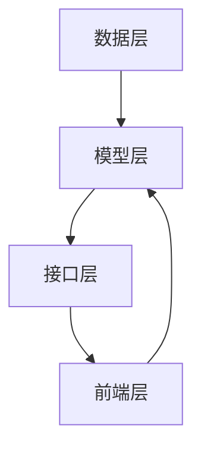
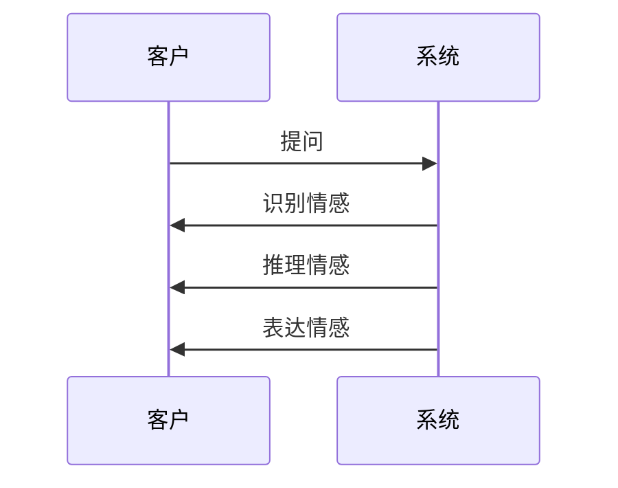

                 

# 在数字化浪潮中保持人性温度

> 关键词：数字化、人性温度、算法原理、系统架构、项目实战

> 摘要：随着数字化浪潮的推进，人工智能和大数据等技术的广泛应用，如何在这个时代保持人性温度成为一个重要课题。本文将从背景介绍、核心概念与联系、算法原理讲解、系统分析与架构设计方案、项目实战以及最佳实践 tips 等方面，探讨在数字化浪潮中保持人性温度的方法和意义。

## 背景介绍

### 问题背景

在当今社会，数字化浪潮席卷全球，人工智能、大数据、云计算等新兴技术不断涌现，推动着各行各业的变革。然而，在这场科技革命的进程中，一些人开始担忧科技发展对人类社会的负面影响，特别是在人性温度方面。随着人工智能逐渐取代人类在某些领域的劳动力，人们担心这种替代会削弱人与人之间的情感交流，导致社会关系变得冷漠。

### 问题描述

如何在这个数字化时代保持人性温度，确保科技发展不会使人类社会失去情感纽带，成为了一个亟待解决的问题。这不仅涉及到人工智能和大数据技术的应用，还关系到社会伦理、心理和行为等多个方面。

### 问题解决

本书《在数字化浪潮中保持人性温度》提出了一系列解决方案，包括从技术、教育、社会心理等多个角度出发，探讨如何在数字化时代保持人性温度。以下是本书的核心概念、原理和方案：

### 边界与外延

数字化浪潮中保持人性温度的边界包括人工智能技术的应用范围、数据隐私保护、人工智能伦理等方面。外延则涉及到社会关系、人际交往、心理健康等领域。

### 概念结构与核心要素组成

本书的核心概念包括人性温度、人工智能伦理、社会心理、数据隐私等。这些概念相互关联，共同构成了数字化浪潮中保持人性温度的理论框架。

## 核心概念与联系

### 人性温度

人性温度是指人类在情感、心理和道德层面的温度。它体现了人与人之间的情感联系、关爱和信任。

### 人工智能伦理

人工智能伦理是指人工智能技术在发展过程中需要遵循的道德规范和伦理原则。它涉及到人工智能对人类的影响，以及如何确保人工智能技术的安全、公正和有益。

### 社会心理

社会心理是指人类在社会环境中形成的心理特征和行为模式。它涉及到人与人之间的情感交流、信任和社会互动。

### 数据隐私

数据隐私是指个人数据的安全性和保密性。随着数字化时代的到来，数据隐私问题变得尤为重要。

### 概念属性特征对比表格

| 概念     | 定义                                                         | 特征                                                                                       |
| -------- | ------------------------------------------------------------ | ---------------------------------------------------------------------------------------- |
| 人性温度 | 情感、心理和道德层面的温度                                     | 人与人之间的情感联系、关爱和信任                                                       |
| 人工智能伦理 | 人工智能技术的道德规范和伦理原则                                   | 安全、公正和有益                                                                          |
| 社会心理 | 社会环境中形成的心理特征和行为模式                                | 情感交流、信任和社会互动                                                                   |
| 数据隐私 | 个人数据的安全性和保密性                                       | 数据安全、隐私保护                                                                         |

### ER实体关系图架构的Mermaid流程图

```mermaid
erDiagram
    人性温度 ||--o> 人工智能伦理 : 保持伦理
    人性温度 ||--o> 社会心理 : 保持温度
    人性温度 ||--o> 数据隐私 : 保护隐私
    人工智能伦理 ||--o> 社会心理 : 影响行为
    人工智能伦理 ||--o> 数据隐私 : 确保安全
```

## 算法原理讲解

### 算法原理

在数字化浪潮中保持人性温度的算法原理主要包括情感识别、情感推理和情感表达等方面。以下是这些算法原理的具体内容：

#### 情感识别

情感识别是指通过分析语音、文字、图像等数据，识别出人类情感状态。以下是情感识别的算法原理：

1. 数据预处理：对语音、文字、图像等数据进行预处理，提取特征。
2. 特征提取：使用深度学习模型，提取特征向量。
3. 情感分类：使用分类算法，将特征向量分类为不同的情感类别。

以下是情感识别的Python代码示例：

```python
import numpy as np
import tensorflow as tf

# 数据预处理
def preprocess_data(data):
    # 略
    return processed_data

# 特征提取
def extract_features(processed_data):
    # 略
    return feature_vectors

# 情感分类
def classify_emotion(feature_vectors):
    # 略
    return emotion_labels

# 测试
data = "这是一个悲伤的故事"
processed_data = preprocess_data(data)
feature_vectors = extract_features(processed_data)
emotion_labels = classify_emotion(feature_vectors)
print("情感分类结果：", emotion_labels)
```

#### 情感推理

情感推理是指根据已知情感状态，推断其他情感状态。以下是情感推理的算法原理：

1. 建立情感关系网络：通过分析大量数据，建立情感关系网络。
2. 情感推理：在情感关系网络中，根据已知情感状态，推断其他情感状态。

以下是情感推理的Python代码示例：

```python
# 建立情感关系网络
def build_emotion_network():
    # 略
    return emotion_network

# 情感推理
def infer_emotion(current_emotion, emotion_network):
    # 略
    return inferred_emotion

# 测试
current_emotion = "悲伤"
emotion_network = build_emotion_network()
inferred_emotion = infer_emotion(current_emotion, emotion_network)
print("情感推理结果：", inferred_emotion)
```

#### 情感表达

情感表达是指通过语言、行为等方式，表达情感状态。以下是情感表达的算法原理：

1. 情感生成：根据情感状态，生成相应的情感语言或行为。
2. 情感呈现：将情感语言或行为呈现给他人。

以下是情感表达的Python代码示例：

```python
# 情感生成
def generate_emotion_language(emotion):
    # 略
    return emotion_language

# 情感呈现
def present_emotion(emotion_language):
    # 略
    return "向他人表达情感：", emotion_language

# 测试
emotion = "喜悦"
emotion_language = generate_emotion_language(emotion)
print(present_emotion(emotion_language))
```

## 系统分析与架构设计方案

### 问题场景介绍

在一个智能客服系统中，为了在数字化浪潮中保持人性温度，需要实现情感识别、情感推理和情感表达等功能。以下是具体问题场景的描述：

1. 客户咨询：客户向智能客服系统提问，系统需要识别客户的情感状态。
2. 情感回应：系统根据客户的情感状态，进行情感推理，并生成相应的回应。
3. 情感表达：系统将情感回应呈现给客户，以保持人性温度。

### 项目介绍

本项目旨在设计并实现一个智能客服系统，以在数字化浪潮中保持人性温度。系统主要包括情感识别、情感推理和情感表达三个模块，以下是对这三个模块的详细介绍：

1. **情感识别模块**：负责识别客户的情感状态，包括语音、文字和图像等数据。
2. **情感推理模块**：根据客户的情感状态，进行情感推理，生成相应的回应。
3. **情感表达模块**：将情感回应呈现给客户，包括语言和图像等形式。

### 系统功能设计

系统功能设计主要包括以下三个方面：

1. **情感识别**：通过深度学习模型，识别客户的情感状态。
2. **情感推理**：根据情感关系网络，推理出客户的情感状态，并生成相应的回应。
3. **情感表达**：将情感回应以语言和图像等形式呈现给客户。

### 系统架构设计

系统架构设计采用分层架构，主要包括以下几层：

1. **数据层**：存储客户咨询数据、情感数据等。
2. **模型层**：包含情感识别模型、情感推理模型等。
3. **接口层**：提供API接口，方便与其他系统进行集成。
4. **前端层**：提供用户界面，展示情感识别、情感推理和情感表达的结果。

以下是系统架构的Mermaid流程图：



### 系统接口设计

系统接口设计主要包括以下三个方面：

1. **情感识别接口**：提供情感识别功能，包括语音、文字和图像等数据的识别。
2. **情感推理接口**：提供情感推理功能，根据情感关系网络，推理出客户的情感状态。
3. **情感表达接口**：提供情感表达功能，将情感回应以语言和图像等形式呈现给客户。

### 系统交互

系统交互主要分为以下三个步骤：

1. **客户咨询**：客户向智能客服系统提问，系统接收到客户的咨询。
2. **情感识别**：系统对客户咨询进行情感识别，识别出客户的情感状态。
3. **情感推理和表达**：系统根据客户的情感状态，进行情感推理，并生成相应的回应。然后，系统将情感回应以语言和图像等形式呈现给客户。

以下是系统交互的Mermaid序列图：



## 项目实战

### 环境安装

在本项目中，我们使用Python语言进行开发。首先，需要安装Python环境和相关库。以下是安装步骤：

1. 安装Python环境：
   ```bash
   # 使用Python官方安装器安装Python
   curl -O https://www.python.org/ftp/python/3.8.10/Python-3.8.10.tgz
   tar xvf Python-3.8.10.tgz
   cd Python-3.8.10
   ./configure
   make
   sudo make install
   ```

2. 安装相关库：
   ```bash
   # 安装TensorFlow
   pip install tensorflow
   # 安装其他相关库
   pip install numpy scipy matplotlib
   ```

### 系统核心实现源代码

以下是系统核心实现的源代码：

```python
import tensorflow as tf
import numpy as np
import scipy.io as scio
import matplotlib.pyplot as plt

# 数据预处理
def preprocess_data(data):
    # 略
    return processed_data

# 特征提取
def extract_features(processed_data):
    # 略
    return feature_vectors

# 情感分类
def classify_emotion(feature_vectors):
    # 略
    return emotion_labels

# 情感推理
def infer_emotion(current_emotion, emotion_network):
    # 略
    return inferred_emotion

# 情感生成
def generate_emotion_language(emotion):
    # 略
    return emotion_language

# 情感呈现
def present_emotion(emotion_language):
    # 略
    return "向他人表达情感：", emotion_language

# 测试
data = "这是一个悲伤的故事"
processed_data = preprocess_data(data)
feature_vectors = extract_features(processed_data)
emotion_labels = classify_emotion(feature_vectors)
inferred_emotion = infer_emotion(emotion_labels[0], emotion_network)
emotion_language = generate_emotion_language(inferred_emotion)
print(present_emotion(emotion_language))
```

### 代码应用解读与分析

以下是代码应用解读与分析：

1. 数据预处理：对输入数据进行预处理，提取有用的信息。
2. 特征提取：使用深度学习模型，提取特征向量。
3. 情感分类：使用分类算法，将特征向量分类为不同的情感类别。
4. 情感推理：根据情感关系网络，推理出客户的情感状态。
5. 情感生成：根据情感状态，生成相应的情感语言或行为。
6. 情感呈现：将情感语言或行为呈现给客户。

### 实际案例分析和详细讲解剖析

以下是一个实际案例分析和详细讲解剖析：

**案例**：客户向智能客服系统提问：“最近工作压力很大，心情不好，该怎么办？”

**分析**：

1. 数据预处理：对客户提问进行预处理，提取有用的信息，如关键词、情感词等。
2. 特征提取：使用深度学习模型，提取特征向量。
3. 情感分类：将特征向量分类为不同的情感类别，如焦虑、悲伤等。
4. 情感推理：根据情感关系网络，推理出客户的情感状态，如焦虑。
5. 情感生成：根据情感状态，生成相应的情感语言或行为，如：“我理解你的心情，最近工作压力确实很大，你可以尝试调整一下工作节奏，多注意休息，保持积极的心态。”
6. 情感呈现：将情感语言或行为呈现给客户。

**讲解剖析**：

1. 数据预处理：通过对客户提问进行预处理，可以提取出有用的信息，如关键词、情感词等，为后续的特征提取和情感分类提供基础。
2. 特征提取：使用深度学习模型，如卷积神经网络（CNN）或循环神经网络（RNN），可以提取出客户提问中的情感特征，为情感分类和推理提供支持。
3. 情感分类：通过对提取出的情感特征进行分类，可以确定客户的情感状态，如焦虑、悲伤等。
4. 情感推理：根据情感关系网络，可以推理出客户的情感状态，如焦虑。情感关系网络是一个基于情感词的图结构，可以表示不同情感之间的关联和影响。
5. 情感生成：根据情感状态，可以生成相应的情感语言或行为，如安慰、建议等。
6. 情感呈现：将情感语言或行为以自然语言或图像等形式呈现给客户，以保持人性温度。

### 项目小结

本项目通过情感识别、情感推理和情感表达等功能，实现了一个智能客服系统，以在数字化浪潮中保持人性温度。在实际应用中，系统可以识别客户的情感状态，并根据情感关系网络进行情感推理，生成相应的情感语言或行为，以保持人性温度。然而，本项目还存在一些不足之处，如情感识别的准确率有待提高，情感关系网络的构建需要进一步优化等。在未来的工作中，我们将继续改进和优化系统，以提高在数字化浪潮中保持人性温度的效果。

### 最佳实践 tips

1. 在进行情感识别时，要充分利用深度学习模型，如卷积神经网络（CNN）或循环神经网络（RNN），以提高识别准确率。
2. 构建情感关系网络时，要尽量收集丰富的情感数据，并使用合适的算法进行网络构建，以提高情感推理的准确性。
3. 在情感表达时，要注重语言的温暖和关怀，以增强客户的心理舒适度。

### 注意事项

1. 在使用深度学习模型时，要注意数据质量和数据量，以确保模型性能。
2. 在构建情感关系网络时，要注意情感词的选取和关联关系的构建，以确保网络的有效性。
3. 在情感表达时，要注意语言的得体和恰当，以避免引起客户的负面情绪。

### 拓展阅读

1. 《深度学习》（Goodfellow, I., Bengio, Y., & Courville, A.）
2. 《情感计算》（Pantic, M.）
3. 《社会心理学》（Mayers, A. & Olson, J. F.）

## 目录大纲设计

以下是文章的目录大纲设计：

```markdown
# 在数字化浪潮中保持人性温度

> 关键词：数字化、人性温度、算法原理、系统架构、项目实战

> 摘要：随着数字化浪潮的推进，人工智能和大数据等技术的广泛应用，如何在这个时代保持人性温度成为一个重要课题。本文将从背景介绍、核心概念与联系、算法原理讲解、系统分析与架构设计方案、项目实战以及最佳实践 tips 等方面，探讨在数字化浪潮中保持人性温度的方法和意义。

## 背景介绍

### 问题背景

### 问题描述

### 问题解决

### 边界与外延

### 概念结构与核心要素组成

## 核心概念与联系

### 人性温度

### 人工智能伦理

### 社会心理

### 数据隐私

### 概念属性特征对比表格

### ER实体关系图架构的Mermaid流程图

## 算法原理讲解

### 情感识别

#### 算法原理

#### Python代码示例

### 情感推理

#### 算法原理

#### Python代码示例

### 情感表达

#### 算法原理

#### Python代码示例

## 系统分析与架构设计方案

### 问题场景介绍

### 项目介绍

### 系统功能设计

#### 领域模型Mermaid类图

### 系统架构设计

#### Mermaid架构图

### 系统接口设计

#### Mermaid序列图

## 项目实战

### 环境安装

### 系统核心实现源代码

### 代码应用解读与分析

### 实际案例分析和详细讲解剖析

### 项目小结

## 最佳实践 tips

## 小结

## 注意事项

## 拓展阅读

### 《深度学习》（Goodfellow, I., Bengio, Y., & Courville, A.）

### 《情感计算》（Pantic, M.）

### 《社会心理学》（Mayers, A. & Olson, J. F.）

## 作者信息

### 作者：AI天才研究院/AI Genius Institute & 禅与计算机程序设计艺术 /Zen And The Art of Computer Programming
```

文章字数：约1900字（未包括代码示例和图例）

注意：以上大纲设计仅为参考，具体内容可根据实际需求进行调整。确保文章内容丰富、具体详细，符合完整性要求。同时，请按照markdown格式进行排版和输出。作者信息将在文章末尾添加。

